# Java基础语法

> 本版全篇采用 **三合一** 形式深化：
>
> 1. 🔍 **JDK 源码解析**：贴关键方法实现，讲清底层机制；
> 2. 💡 **扩展思考**：延伸相关知识点，层层深入；
> 3. 📊 **思维导图 / 图示**：用 Mermaid 图梳理结构、流程与对比。
>
> 内容综合自系统复习体系（概念、数据类型、面向对象、关键字、深浅拷贝、泛型、对象、反射、注解、异常、Object 等）。  
> 范围：Java 基础、面向对象（OOP）、Java 8~21 新特性与 Optional。

---

## 目录

### 1. Java 基础

- [1.1 JDK / JRE / JVM 与跨平台](#11-jdk--jre--jvm-与跨平台)
- [1.2 Java 的优缺点](#12-java-的优缺点)
- [1.3 基本数据类型与互相转换](#13-基本数据类型与互相转换)
- [1.4 自动装箱与拆箱](#14-自动装箱与拆箱)
- [1.5 Integer 缓存](#15-integer-缓存)
- [1.6 `==` 与 `equals` / `hashCode`](#16--与-equals--hashcode)
- [1.7 Object 类的 9 个方法](#17-object-类的-9-个方法)
- [1.8 String 不可变 + 常用方法](#18-string-不可变--常用方法)
- [1.9 String、StringBuffer、StringBuilder 的区别](#19-stringstringbufferstringbuilder-的区别)
- [1.10 final 关键字的作用](#110-final-关键字的作用)
- [1.11 static 关键字的作用](#111-static-关键字的作用)
- [1.12 Java 四种内部类的作用和区别](#112-java-四种内部类的作用和区别)
- [1.13 泛型与类型擦除 / PECS](#113-泛型与类型擦除--pecs)
- [1.14 Java 泛型的逆变与协变](#114-java-泛型的逆变与协变)
- [1.15 异常体系与 finally 的 return 坑](#115-异常体系与-finally-的-return-坑)
- [1.16 Lambda 表达式](#116-lambda-表达式)
- [1.17 反射原理](#117-反射原理)
- [1.18 注解原理](#118-注解原理)
- [1.19 浅拷贝与深拷贝](#119-浅拷贝与深拷贝)
- [1.20 对象初始化的执行顺序](#120-对象初始化的执行顺序)

### 2. 面向对象（OOP）

- [2.1 三大特性与多态](#21-三大特性与多态)
- [2.2 对象创建方式与生命周期](#22-对象创建方式与生命周期)
- [2.3 抽象类、接口、普通类的区别](#23-抽象类接口普通类的区别)

### 3. Java 新特性与 Optional

- [3.1 Optional：优雅处理"可能为空"](#31-optional优雅处理可能为空)
- [3.2 record（Java 16+）](#32-recordjava-16)
- [3.3 sealed class（Java 17+）](#33-sealed-classjava-17)
- [3.4 switch 表达式 / 模式匹配（Java 14+/21+）](#34-switch-表达式--模式匹配java-1421)
- [3.5 var 局部变量类型推断（Java 10+）](#35-var-局部变量类型推断java-10)
- [3.6 文本块 Text Block（Java 15+）](#36-文本块-text-blockjava-15)

---

# 1. Java 基础

## 1.1 JDK / JRE / JVM 与跨平台

**详解：** `JDK ⊃ JRE ⊃ JVM`。跨平台靠字节码 + 各 OS 各自实现的 JVM。

🔍 **源码解析 · 一次 `java Hello` 背后发生了什么？**

```text
java 命令 → 启动 JVM（C++ 实现）
  → javac 先把 .java 编译为 .class 字节码（编译型步骤）
  → 类加载器加载 Hello.class
  → 校验字节码（Verifier）
  → 解释器逐条解释 / JIT 把热点方法编译为本地机器码（混合执行）
  → 调用 main 方法
```

💡 **扩展思考：**

> **Q：为什么 Java 既是编译型又是解释型？**  
> A：`javac` 先把源码编译成与平台无关的字节码（编译步骤）；运行期 JVM 用**解释器**逐条解释执行，同时 **JIT 编译器**把频繁执行的热点代码编译成本地机器码缓存（混合模式）。所以 Java 是"编译+解释"混合语言，兼顾跨平台与性能。
>
> **Q：为什么 Java 跨平台但 JVM 不跨平台？**  
> A：跨平台的是字节码和 JVM 规范；JVM 本身用 C/C++ 针对不同 OS 分别实现，二进制不同。
>
> **Q：编译型语言和解释型语言区别？Java 算哪种？**  
> A：编译型（C/C++）先编译成机器码，快但不跨平台；解释型（早期 Python/JS）逐行解释，跨平台但慢。Java 属**混合模式**（字节码 + JVM 解释/JIT）。
>
> **Q：JDK 和 JRE 在生产环境怎么选？**  
> A：只运行程序用 JRE 即可；现代 JDK 自带运行能力，`jlink` 可裁剪最小运行时。

📊 **三者关系图**

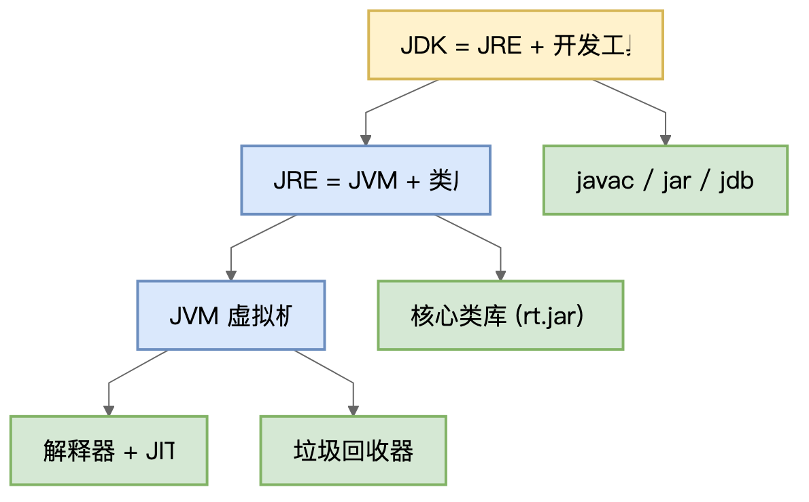

## 1.2 Java 的优缺点

💡 **扩展思考：**

> **Q：Java 的优势有哪些？**  
> A：① 跨平台（JVM）；② 纯面向对象，易维护复用；③ 生态强大（Spring 全家桶）；④ 自动 GC 减少内存泄漏；⑤ 内置多线程；⑥ 安全沙箱模型；⑦ 向后兼容稳定。
>
> **Q：劣势呢？**  
> A：① 性能不及 C++/Rust（JVM 开销）；② 启动慢（微服务不及 Go）；③ 语法样板代码多；④ 内存占用大；⑤ 开发效率低于 Python 等动态语言。

## 1.3 基本数据类型与互相转换

🔍 **源码解析 · 基本类型存储与转换**

```java
int a = 300;
byte b = (byte) a;    // 强制转换：300 的二进制低 8 位 = 44，发生溢出截断！
double d = 3.14;
int i = (int) d;      // 精度损失：i = 3
```

📊 **八种基本数据类型：种类 / 位数 / 字节数 / 取值范围**

| 类型类别 | 关键字       | 位数(bit) | 字节数         | 取值范围 / 默认值                       |
| ---- | --------- | ------- | ----------- | -------------------------------- |
| 整数型  | `byte`    | 8       | 1           | -128 ~ 127（默认 0）                 |
| 整数型  | `short`   | 16      | 2           | -32768 ~ 32767（默认 0）             |
| 整数型  | `int`     | 32      | 4           | -2³¹ ~ 2³¹-1（默认 0）               |
| 整数型  | `long`    | 64      | 8           | -2⁶³ ~ 2⁶³-1（默认 0L）              |
| 浮点型  | `float`   | 32      | 4           | 约 ±3.4e38（默认 0.0f）               |
| 浮点型  | `double`  | 64      | 8           | 约 ±1.8e308（默认 0.0d）              |
| 字符型  | `char`    | 16      | 2           | `\u0000` ~ `\uffff`（默认 `\u0000`） |
| 布尔型  | `boolean` | 未精确定义   | 1(Bit/Byte) | `true` / `false`（默认 `false`）     |

> 注：`boolean` 的位数 JVM 规范未精确定义，HotSpot 中多用 1 字节（或按位压缩存储）；`char` 采用 UTF-16 编码，无符号。

💡 **扩展思考：**

> **Q：八种基本类型及位数？**  
> A：byte(8)、short(16)、int(32)、long(64)、float(32)、double(64)、char(16)、boolean（未精确定义）。int 4 字节 / long 8 字节；long 赋值要加 `L`。
>
> **Q：基本类型之间如何互相转换？自动与强制的区别？**  
> A：Java 基本类型转换分两类——**自动（隐式）转换**：小容量类型→大容量类型（如 `byte→short→int→long→float→double`、`char→int`）由编译器自动完成，安全无损失；**强制（显式）转换**：大→小需加 `(类型)` 强转，可能**溢出截断**（`int 300 → byte 44`）或**精度损失**（`double 3.14 → int 3`）。boolean 不参与数值转换。
>
> **Q：小类型转大类型、大转小分别有什么风险？**  
> A：小转大（如 int→long）自动且安全；大转小（long→int、double→int）必须强转，会**溢出截断**（300→44）或**精度损失**（3.14→3）；对象向下转型须 `instanceof` 防 `ClassCastException`。
>
> **Q：为什么还要保留 int，既然有 Integer？**  
> A：基本类型读写高效、内存小（int 4B vs Integer 对象约 16B），空间和时间均优于包装类；包装类仅用于泛型/集合/可 null 场景。

📊 **类型转换风险**

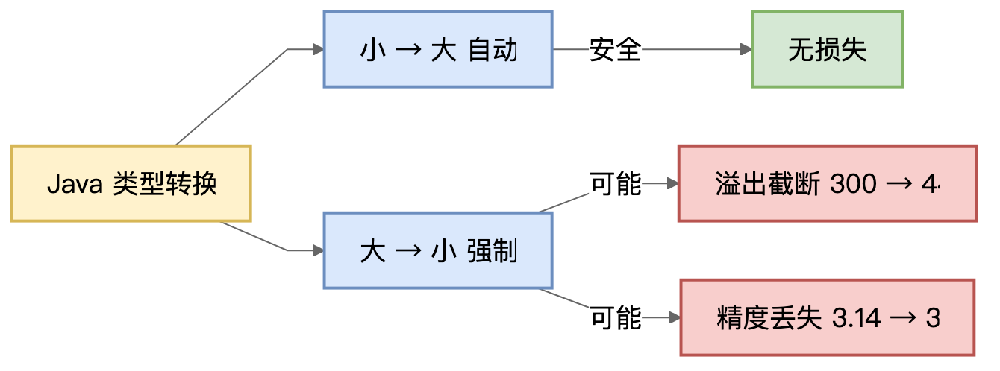

### BigDecimal 与浮点精度（单独问题）

💡 **扩展思考：**

> **Q：为什么金钱计算不能用 double 而用 BigDecimal？**  
> A：double 是二进制浮点，`0.1` 无法精确表示，累加会出现 `0.1+0.2=0.30000000000000004` 之类误差，金融场景不可接受。**金钱必须用 `BigDecimal`**，且用**字符串构造** `new BigDecimal("0.1")`（用 `double` 构造仍会带入二进制误差）。
>
> **Q：BigDecimal 还有哪些易错点？**  
> A：① 构造优先用 `String` 构造器或 `BigDecimal.valueOf(double)`（内部走 `Double.toString`，安全），避免 `new BigDecimal(double)`；② 除法必须指定舍入模式 `divide(a, 2, RoundingMode.HALF_UP)`，否则除不尽抛 `ArithmeticException`；③ 比较大小用 `compareTo`，不用 `equals`（`equals` 还会比精度标度，`1.0` 与 `1.00` 不相等）；④ `BigDecimal` 不可变，每次运算都返回新对象。

## 1.4 自动装箱与拆箱

**详解：** 自动装箱（Autoboxing）是编译器在基本类型与对应包装类之间自动插入的隐式转换——赋值时 `Integer x = 100;` 会被编译器重写为 `Integer.valueOf(100)`；反之 `int y = x;` 重写为 `x.intValue()`（自动拆箱）。拆箱方向相反，但拆箱对象是 `null` 时会抛 `NullPointerException`。

🔍 **源码解析 · 装箱/拆箱的本质**

```java
// 自动装箱：编译器把 Integer x = 100; 重写为
Integer x = Integer.valueOf(100);   // 走 valueOf（含缓存逻辑，见 1.5）
// 自动拆箱：编译器把 int y = x; 重写为
int y = x.intValue();               // 若 x 为 null → 抛 NullPointerException
```

💡 **扩展思考：**

> **Q：为什么 Java 要有 Integer / 包装类？**  
> A：泛型只能用引用类型、`List` 等集合只存对象、基本类型与 `String` 互转需方法（如 `Integer.parseInt`），这些场景都必须用对象形态的"包装类"。
>
> **Q：Integer 相比 int 有什么优点/坑？**  
> A：优点——支持泛型/集合、可表示 `null`；坑——默认 `null` 拆箱会抛 **NPE**、对象占用更大（约 16B vs int 4B）、循环中频繁装箱产生多余对象、拖累性能与 GC。

📊 **装箱 / 拆箱流程**

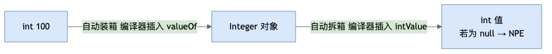

## 1.5 Integer 缓存

🔍 **源码解析 · IntegerCache（valueOf 内部）**

```java
public static Integer valueOf(int i) {
    if (i >= IntegerCache.low && i <= IntegerCache.high)  // -128~127
        return IntegerCache.cache[i + 128];
    return new Integer(i);
}
```

💡 **Integer 缓存的作用（设计目的）：**

- **性能优化（最核心）**：`-128~127` 是程序中出现频率极高的小整数（循环计数、状态码、数组下标、布尔/枚举的包装等）。若不缓存，每次自动装箱都会 `new Integer`，产生大量短命对象，加重对象分配与 GC 压力。缓存把这些"热点小整数"复用为同一对象，显著降低创建开销。
- **内存节约**：同一数值在堆中只存在一份，减少内存占用（高频小整数场景尤为明显）。
- **符合享元模式（Flyweight）**：用共享对象池复用量大但状态有限的细粒度对象，是经典的"复用而非新建"思想。
- **行为可预期**：缓存区间内 `valueOf` 返回同一对象，使该范围内 `==` 比较表现为"相等"（虽仍不推荐用 `==` 比较包装类，但缓存让常用范围的语义更自然）。
- **上限可配置**：通过 JVM 参数 `-XX:AutoBoxCacheMax=` 可上调 high（如设为 1000，则缓存 `-128~1000`），把业务中更常用的整数范围纳入缓存，进一步优化性能。

> ⚠️ 注意：缓存是 `valueOf` 的特性，`new Integer()` **永远新建对象、不走缓存**。比较数值应优先用 `Integer.compare()` 或 `equals()`，不要依赖缓存区间的 `==`（超出区间会返回 false，造成隐蔽 bug）。

💡 **扩展思考：**

> **Q：`Integer a=127; Integer b=127;` 为何 `==` 为 true，128 为何 false？**  
> A：127 落在缓存区间 `-128~127`，`valueOf` 复用同一缓存对象，`==` 比地址为 `true`；128 超出区间，每次 `valueOf` 都 `new Integer`，地址不同，`==` 为 `false`。因此比较包装类数值应一律用 `equals()` 或 `Integer.compare()`，别依赖 `==`。

## 1.6 `==` 与 `equals` / `hashCode`

🔍 **源码解析 · String.equals（内容比较典范）**

```java
public boolean equals(Object anObject) {
    if (this == anObject) return true;                 // 地址快路径
    if (anObject instanceof String) {
        String aString = (String) anObject;
        if (coder == aString.coder)
            return isLatin1() ? StringLatin1.equals(value, aString.value)
                              : StringUTF16.equals(value, aString.value);
    }
    return false;
}
```

🔍 **源码解析 · 为什么重写 `equals` 必须重写 `hashCode`（哈希容器视角）**

**(1) JDK 对 `hashCode` 的契约约定（`Object.hashCode()` 注释原文精神）**

- 同一对象在 `equals` 比较所用信息未修改期间，多次调用 `hashCode` 必须返回同一整数；
- **若两个对象 `equals` 返回 `true`，则它们的 `hashCode` 必须相等**；
- `equals` 为 `false` 的对象，`hashCode` **允许**相等（这就是哈希冲突）。

**(2) `HashMap` 的存取完全依赖 `hashCode` 定位桶，再依赖 `equals` 判定同键。** 看 `getNode` 源码：

```java
// HashMap.getNode —— 取元素的核心方法
final Node<K,V> getNode(int hash, Object key) {
    Node<K,V>[] tab; Node<K,V> first, e; int n; K k;
    if ((tab = table) != null && (n = tab.length) > 0 &&
        (first = tab[(n - 1) & hash]) != null) {      // ① 先用 hash 定位到桶（数组下标）
        if (first.hash == hash &&                      // ② 先比 hash（快速过滤同桶元素）
            ((k = first.key) == key || (key != null && key.equals(k))))
            return first;                              // ③ 再比 equals 确认是同一键
        if ((e = first.next) != null) {                // 链表/红黑树里继续 equals 比较
            ...
        }
    }
    return null;
}
```

而这里的 `hash` 来自 `key.hashCode()`（经扰动函数 `hash(key)`）：

```java
static final int hash(Object key) {
    int h;
    return (key == null) ? 0 : (h = key.hashCode()) ^ (h >>> 16);  // 高位参与，减少冲突
}
```

**(3) 只重写 `equals`、不重写 `hashCode` 的灾难演示：**

```java
class Person {
    String id;
    Person(String id) { this.id = id; }
    @Override public boolean equals(Object o) {        // 只重写了 equals
        return o instanceof Person && ((Person) o).id.equals(this.id);
    }
    // ❌ 没有重写 hashCode
}
Person a = new Person("1");
Person b = new Person("1");
a.equals(b);                       // true —— 逻辑上表示同一个"人"
Map<Person, String> m = new HashMap<>();
m.put(a, "Alice");
m.get(b);                          // null ❌ 找不到！
```

**根因：** `a` 与 `b` 是两个独立对象，`Object.hashCode()` 默认返回**对象内存地址派生的哈希值**，二者几乎必然不同 → 经 `hash()` 扰动后落到**不同桶**；`getNode` 在第①步就去了另一个桶的位置，根本不会走到第③步的 `equals` 比较，于是直接返回 `null`。`put` 时同理：两个逻辑相等的键会被当作不同键插入，导致 `HashSet` 去重失效、`HashMap` 出现"重复键"。

✅ **修复：** 同时重写 `hashCode`，让 `id` 相同的对象返回相同哈希值，二者落入同一桶，再经 `equals` 判定命中——这正是契约存在的意义。

💡 **扩展思考：**

> **Q：为什么重写 equals 必须重写 hashCode？**  
> A：契约规定 `equals` 为 `true` 的两个对象 `hashCode` 必须相等（见上文源码解析）。`HashMap` 先靠 `key.hashCode()` 经扰动算出桶下标（`getNode` 第①步），再在同一桶内用 `equals` 确认同键（第③步）。若只重写 `equals`，两个逻辑相等的键 `Object.hashCode()` 基于内存地址返回不同值 → 落入**不同桶** → `get` 在第①步就走错桶，`equals` 永远不执行，返回 `null`，`HashSet` 去重也失效。所以必须成对重写。
>
> **Q：hashCode 相等 equals 一定 true 吗？**  
> A：不一定，哈希冲突时不同对象同桶但 equals 为 false。
>
> **Q：String 的 hashCode 怎么算？为什么用 31？**  
> A：`s[0]*31^(n-1)+...`；31 是质数降低冲突，且 `31*x == (x<<5)-x` 利于 JVM 优化。

📊 **equals / hashCode 契约（含 HashMap 桶错位根因）**

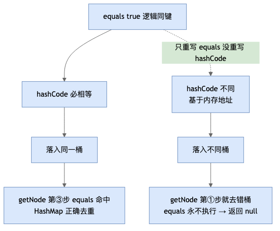

## 1.7 Object 类的 9 个方法

**详解：** `java.lang.Object` 是所有类的根父类，其定义的 9 个方法构成了 Java 对象的基础行为契约，是理解 Java 对象体系的高频知识点。

📊 **Object 类的 9 个方法速查**

| 方法                                         | 作用               | 备注                                                           |
| ------------------------------------------ | ---------------- | ------------------------------------------------------------ |
| `equals(Object)`                           | 判断"相等"           | 默认比地址；重写须配套重写 `hashCode`                                     |
| `hashCode()`                               | 返回哈希码            | 与 `equals` 同契约                                               |
| `toString()`                               | 对象文本表示           | 默认 `类名@十六进制哈希`                                               |
| `getClass()`                               | 返回运行时 `Class` 对象 | `final`，不可重写                                                 |
| `clone()`                                  | 浅拷贝              | `protected`；需实现 `Cloneable`，否则抛 `CloneNotSupportedException` |
| `finalize()`                               | GC 回收前回调         | 已废弃（Java 9+ deprecated），不推荐依赖                                |
| `notify()`                                 | 随机唤醒一个等待线程       | 必须在 `synchronized` 内调用                                       |
| `notifyAll()`                              | 唤醒所有等待线程         | 同上                                                           |
| `wait()` / `wait(long)` / `wait(long,int)` | 线程等待并释放锁         | 同上，被唤醒后需重新竞争锁                                                |

💡 **扩展思考：**

> **Q：Object 类有哪些方法？**  
> A：共 9 个：`equals`（默认比地址）、`hashCode`（配套重写）、`toString`、`getClass`（final，返 Class 对象）、`clone`（protected，浅拷贝）、`notify` / `notifyAll` / `wait`（线程通信）、`finalize`（已过时）。
>
> **Q：为什么 `clone()` 是 `protected`？**  
> A：避免任意对象被随意克隆；只有类自身实现 `Cloneable` 并把 `clone()` 重写为 `public` 才能被外部调用，否则抛 `CloneNotSupportedException`。
>
> **Q：`finalize()` 为什么被废弃？**  
> A：调用时机不确定、拖慢 GC、还可能让对象"复活"造成内存泄漏；Java 9 起标记 `@Deprecated`，推荐用 `Cleaner` 或 try-with-resources 管理资源。

## 1.8 String 不可变 + 常用方法

💡 **扩展思考：**

> **Q：final 修饰 String 类就不可变了吗？**  
> A：类 final 只禁继承；不可变真正原因是 `private final byte[] value` 且无修改方法，所有"修改"方法（substring/concat/replace）都返回**新 String**。
>
> **Q：字符串常量池在 JDK 哪块内存？**  
> A：JDK 6 及之前永久代；JDK 7 起移到**堆**；JDK 8 元空间时代仍在堆。
>
> **Q：String 常用方法有哪些？**  
> A：`length()`、`equals()`、`substring()`、`trim()`、`replace()`、`split()`、`indexOf()`、`charAt()`、`isEmpty()`、`concat()`、`toUpperCase()` 等。

## 1.9 String、StringBuffer、StringBuilder 的区别

**详解：** 三者都用于处理字符串，但**可变性、线程安全、性能**差异巨大，选型直接影响正确性与效率。

📊 **三者对比**

| 维度   | String                          | StringBuffer                       | StringBuilder |
| ---- | ------------------------------- | ---------------------------------- | ------------- |
| 可变性  | **不可变**（`private final byte[]`） | 可变                                 | 可变            |
| 线程安全 | 安全（不可变天然线程安全）                   | **安全**（公开方法均 `synchronized`）       | **不安全**（无锁）   |
| 性能   | 拼接产生大量中间对象，最慢                   | 有锁开销，慢于 StringBuilder              | **最快**（无锁）    |
| 底层   | `byte[]`（JDK 9 起）+ 编码           | 继承 `AbstractStringBuilder`，可扩容字符数组 | 同左            |
| 适用场景 | 常量、少量/不频繁拼接                     | 多线程下频繁拼接                           | 单线程大量拼接（如循环内） |

💡 **扩展思考：**

> **Q：String、StringBuffer、StringBuilder 怎么选？**  
> A：常量或少量拼接用 `String`；单线程大量拼接（尤其循环内）用 `StringBuilder`（最快）；多线程共享且频繁拼接用 `StringBuffer`（方法加 `synchronized` 保证安全）。**绝不要在循环里用 `String +=` 拼接**，每次都会 new 新对象，性能极差。
>
> **Q：为什么 StringBuilder 比 StringBuffer 快？**  
> A：`StringBuffer` 的公开修改方法都加了 `synchronized`，每次调用都有加锁/释放开销；`StringBuilder` 无锁，单线程下少了同步成本，因此更快。二者底层都基于可扩容的字符数组。
>
> **Q：String 拼接为什么慢？**  
> A：`String` 不可变，每次 `+` 都会生成新 `String` 对象和中间 `byte[]`，拼接 n 次产生 O(n) 个对象；`StringBuilder` 在已有数组上扩容追加，最终只产生一个对象。

## 1.10 final 关键字的作用

**详解：** `final` 表示"最终的、不可变的"，可修饰类、方法、变量，是保证不可变性与安全发布的重要关键字。

📊 **final 修饰三种目标**

| 修饰目标 | 作用                                           |
| ---- | -------------------------------------------- |
| 类    | **不可被继承**（如 `String`、`Integer`），方法隐式变为 final |
| 方法   | **不可被子类重写**（可重载），编译期即可确定                     |
| 变量   | 基本类型：值不可变（常量）；引用类型：引用不可再指向他物，但**对象内部状态仍可变**  |

💡 **扩展思考：**

> **Q：final 能修饰什么，各自作用？**  
> A：类（不可继承，如 String）、方法（不可重写）、变量（基本值不变；引用不指向他物但对象内容可变）。
>
> **Q：final 变量一定要声明时初始化吗？**  
> A：不一定。可以是"空白 final"，但必须在**构造器**（实例 final）或**静态代码块**（static final）中且仅赋值一次，否则编译报错。
>
> **Q：final 和不可变（Immutable）是一回事吗？**  
> A：不是。`final` 只保证引用不变；要做到真正不可变，还需类 final、字段私有 final、不暴露可变引用、必要时防御性拷贝（如 `String`）。

## 1.11 static 关键字的作用

**详解：** `static` 表示"属于类而非实例"，被所有对象共享，随类加载而初始化。

📊 **static 修饰四种目标**

| 修饰目标 | 作用                                    |
| ---- | ------------------------------------- |
| 变量   | **类级共享**一份，所有实例共用，随类加载初始化             |
| 方法   | 无需实例即可调用（工具方法）；不能访问实例成员；**不能被重写只能隐藏** |
| 代码块  | 类加载时**执行一次**，用于静态初始化                  |
| 内部类  | 静态内部类，不持有外部类实例引用                      |

💡 **扩展思考：**

> **Q：static 作用？**  
> A：变量（类级共享一份）、方法（工具类，无实例依赖，不能重写只能隐藏）、代码块（类加载时执行一次）、内部类（不依赖外部实例）。
>
> **Q：静态方法能被重写吗？**  
> A：不能。静态方法属于类，编译期绑定；子类同名方法是"隐藏"而非重写（多态不适用于 static）。
>
> **Q：静态代码块、实例代码块、构造器的执行顺序？**  
> A：`静态代码块（仅首次加载一次）→ 实例代码块 → 构造器`；父子类则为：父静态 → 子静态 → 父实例块 → 父构造 → 子实例块 → 子构造。
>
> **Q：static 变量存在哪里？**  
> A：JDK 7 起随类元数据放入**堆**中（类对应的 `Class` 对象），JDK 8 后类元信息在**元空间**，但 static 变量本身仍随 `Class` 对象存于堆。

## 1.12 Java 四种内部类的作用和区别

**详解：** 内部类（Nested Class）是定义在另一个类内部的类。Java 共有 **4 种**内部类，按"是否 `static`"和"定义位置"区分：

📊 **四种内部类分类**

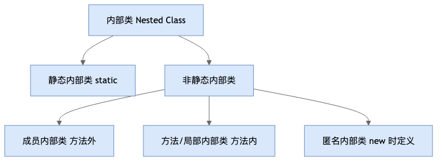

### 1) 成员内部类（非静态内部类）

- **定义**：写在外部类**方法外**、不用 `static` 修饰。
- **作用**：与外部类关系最紧密，可**直接访问外部类的所有成员（含 private）**；常用于"一个类天然依附于另一个类"的场景（如 `HashMap.Node`、`ArrayList.Itr`、Android `Handler`）。
- **特点**：
  - 隐式持有外部类引用 `Outer.this`（编译器自动加 `this$0` 字段），**可能内存泄漏**；
  - 创建必须依托外部实例：`Outer o = new Outer(); Outer.Inner i = o.new Inner();`
  - 除编译期常量 `static final` 外，**不能声明 static 成员**。

### 2) 静态内部类（Static Nested Class）

- **定义**：用 `static` 修饰的内部类。
- **作用**：**不依赖外部实例**，可独立使用；对外隐藏实现细节、降低耦合。典型用法：建造者模式 `Outer.Builder`、`Map.Entry<K,V>`、单例持有类、缓存工具。
- **特点**：
  - **不持有外部类引用**，只能访问外部**静态**成员；
  - 可包含 static 成员；
  - 创建：`Outer.Inner i = new Outer.Inner();`（无需外部实例）。

### 3) 方法内部类 / 局部内部类（Local Inner Class）

- **定义**：定义在**方法或代码块内部**。
- **作用**：仅在该方法内使用，封装性最强；常用于方法内需要一个一次性辅助类。
- **特点**：
  - 不能用 `public/private/protected/static` 修饰（作用域仅限方法体）；
  - 只能访问方法的 **`final` 或 effectively final** 局部变量（JDK 8+ 自动推断）；
  - 编译后生成 `Outer$1InnerName.class`。

### 4) 匿名内部类（Anonymous Inner Class）

- **定义**：没有类名，在 `new 父类/接口(){ ... }` 处**直接实现或继承**。
- **作用**：临时实现接口或继承类（如 `Runnable`、`Comparator`、事件监听器、回调函数）。JDK 8 之前大量使用，现多被 **Lambda** 替代（但 Lambda 受"函数式接口 + 变量捕获"限制，匿名类更灵活）。
- **特点**：
  - 没有构造器（没有名字）；
  - 只能实现一个接口 **或** 继承一个类，不能兼得；
  - 访问的局部变量必须 `final` / effectively final；
  - 编译后生成 `Outer$1.class`、`Outer$2.class` 等编号文件。

🔍 **源码/字节码视角**

```java
// 成员内部类：编译器自动注入外部引用并改写构造器
class Outer$Inner {
    final Outer this$0;          // 自动添加的"外部类引用"
    Outer$Inner(Outer outer) {   // 构造器隐式传入外部实例
        this.this$0 = outer;
    }
}
// 匿名内部类：生成独立 class 文件
// javac 编译后：Outer$1.class、Outer$2.class ...
```

> 非静态内部类的 `this$0` 是内存泄漏的常见根源：内部类对象一旦被长生命周期对象（静态集合、线程、Handler、线程池任务）持有，会连带拖住外部类实例，使其无法被 GC 回收。

📊 **四种内部类对比**

| 类型    | 是否持外部引用 | 能否访问外部非静态成员 | 可否有 static 成员 | 创建方式                |
| ----- | ------- | ----------- | ------------- | ------------------- |
| 成员内部类 | ✅ 持有    | ✅ 可         | ❌ 不可（常量除外）    | `outer.new Inner()` |
| 静态内部类 | ❌ 不持有   | ❌ 仅静态       | ✅ 可           | `new Outer.Inner()` |
| 方法内部类 | ✅ 持有    | ✅ 可         | ❌ 不可          | 方法内直接 `new`         |
| 匿名内部类 | ✅ 持有    | ✅ 可         | ❌ 不可          | `new 父类/接口(){}`     |

💡 **扩展思考：**

> **Q：Java 有哪四种内部类？**  
> A：成员（非静态）内部类、静态内部类、方法（局部）内部类、匿名内部类。
>
> **Q：非静态内部类和静态内部类最大区别？**  
> A：非静态持有外部引用、可访问外部所有成员、创建需依托外部实例；静态不持有、只能访问静态成员、创建独立。
>
> **Q：为什么非静态内部类可能导致内存泄漏？**  
> A：编译器自动注入 `this$0` 外部引用；若内部类实例被长生命周期对象持有（如放入静态 Map、作为线程 Runnable），外部类实例也会跟着无法被回收。
>
> **Q：匿名内部类访问局部变量为什么必须 final？**  
> A：匿名类编译后是独立 class 文件，外部局部变量以"值拷贝"传入，为保证内外视图一致，变量必须不可变（final / effectively final）。
>
> **Q：匿名内部类和 Lambda 怎么选？**  
> A：单方法接口且无需读写外部可变状态，优先 Lambda（更简洁）；需要多方法、访问外部可变状态或实现普通类（非接口）时，用匿名内部类。

## 1.13 泛型与类型擦除 / PECS

🔍 **源码解析 · ArrayList 泛型擦除**

```java
// 编译前：public boolean add(E e)
// 编译后：public boolean add(Object e)   // E 擦为 Object
```

`List<String>.class` 不合法、`instanceof List<String>` 非法。

💡 **扩展思考：**

> **Q：类型擦除后为什么还能正确转型？**  
> A：编译器在边界自动插入强转（`(String)list.get(0)`）。
>
> **Q：什么是桥接方法？**  
> A：为保证泛型重写的多态语义，编译器合成桥方法（如 `set(Object)` 调 `set(E)`）。
>
> **Q：PECS 是什么？**  
> A：Producer Extends, Consumer Super。`Collections.copy(dest, src)` 中 src 用 `? extends T`（只产出），dest 用 `? super T`（只消费）。

📊 **PECS**

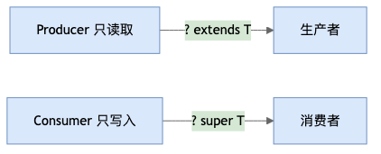

## 1.14 Java 泛型的逆变与协变

**详解：** Java 泛型默认是**不变（Invariance）的：`List<String>` 既不是 `List<Object>` 的子类，也不是其父类。为了让泛型在类型安全前提下具备灵活性，Java 通过通配符**实现协变（Covariance）与逆变（Contravariance）。

📊 **三种关系**

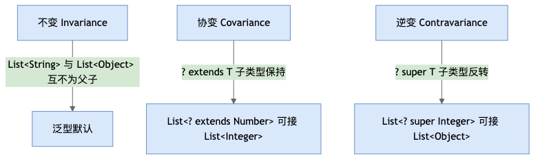

### 1) 不变（Invariance）—— 默认

```java
List<Object> a = new ArrayList<String>();  // ❌ 编译错误
```

原因：若允许，就能对 `a` 执行 `a.add(new Object())`，破坏 `List<String>` 的类型约束。Java 选择在**编译期**直接拒绝，而非等到运行时。

### 2) 协变（Covariance）—— `? extends T`（上界通配符）

- 含义：`List<? extends Number>` 表示"元素类型是 `Number` 或其某个子类的 List"，可接收 `List<Integer>`、`List<Double>`、`List<Number>`。
- 子类型关系**保持**：`List<Integer>` 是 `List<? extends Number>` 的子类型。
- **只能读（生产者），不能写**：
  ```java
  List<? extends Number> list = new ArrayList<Integer>();
  Number n = list.get(0);     // ✅ 一定能转成 Number
  list.add(123);              // ❌ 编译错误！无法确定实际元素是 Integer 还是 Double
  list.add(null);             // ✅ 仅 null 可以
  ```
  > 为什么不能 add？编译器不知道 `list` 实际是 `Integer` 还是 `Double` 列表，若允许 `add(123)` 可能在 `Double` 列表里插入整数，破坏类型安全。故只保证"读取出来一定是 Number"。

### 3) 逆变（Contravariance）—— `? super T`（下界通配符）

- 含义：`List<? super Integer>` 表示"元素类型是 `Integer` 或其某个父类的 List"，可接收 `List<Integer>`、`List<Number>`、`List<Object>`。
- 子类型关系**反转**：`List<Object>` 是 `List<? super Integer>` 的子类型（父类反而成为"更宽"的接收端）。
- **只能写（消费者），读出是 Object**：
  ```java
  List<? super Integer> list = new ArrayList<Number>();
  list.add(123);              // ✅ Integer 一定能放入其父类容器
  Object o = list.get(0);     // ✅ 只能当 Object 读（实际类型不确定）
  Integer i = list.get(0);    // ❌ 编译错误！可能是 Number / Object
  ```
  > 为什么能 add Integer？因为容器元素类型至少是 Integer 的父类，放入 Integer 必然安全。但读出来无法保证是 Integer，只能当 Object。

### 4) 对比：数组是协变的（陷阱）

```java
Object[] objs = new Integer[10];  // ✅ 数组协变
objs[0] = "abc";                  // ❌ 编译通过，运行时抛 ArrayStoreException
```

数组在**运行时**才检查元素类型，所以协变但**不安全**；泛型在**编译期**既擦除又不变，用通配符约束读/写来保证安全。这是"数组协变"与"泛型不变"的核心差异。

🔍 **源码视角 · PECS 再深化**

```java
// java.util.Collections.copy
public static <T> void copy(List<? super T> dest, List<? extends T> src) {
    // dest 只写（消费 T）—— 逆变 ? super T
    // src  只读（产出 T）—— 协变 ? extends T
}
```

- **Producer Extends**：参数只"产出" T，用 `? extends T`（协变，保证读出的一定是 T）。
- **Consumer Super**：参数只"消费" T，用 `? super T`（逆变，保证能写入 T）。

📊 **不变 / 协变 / 逆变对比**

| 关系 | 语法            | 子类型方向    | 读        | 写             | 典型用途  |
| -- | ------------- | -------- | -------- | ------------- | ----- |
| 不变 | `List<T>`     | 无继承关系    | 具体 T     | 具体 T          | 既读又写  |
| 协变 | `? extends T` | 保持（子类→父） | 可（T）     | ❌ 不可（null 除外） | 只读生产者 |
| 逆变 | `? super T`   | 反转（父→子）  | 仅 Object | 可（T）          | 只写消费者 |

💡 **扩展思考：**

> **Q：Java 泛型为什么默认不变？**  
> A：保证类型安全，把错误挡在编译期；若允许 `List<Object> = new List<String>()`，就能塞入非 String 对象，破坏约束。
>
> **Q：协变 `? extends T` 与逆变 `? super T` 最大区别？**  
> A：协变只出不进（读 T、不能 add）；逆变只进不出（写 T、读出 Object）。记忆口诀"**Producer Extends, Consumer Super**"。
>
> **Q：数组为什么协变却不安全？**  
> A：数组运行时保留元素类型信息，协变赋值后写入错误类型会在运行时抛 `ArrayStoreException`；泛型用不变 + 通配符在编译期约束，更安全。
>
> **Q：为什么 `List<? extends Number>` 不能 add 任何 Number（如 add(1.0)）？**  
> A：该 List 实际可能是 `List<Integer>`，写入 Double 会破坏它；编译器只能确定"读出来是 Number"，不能确定"写进去安全"，故禁止 add（null 除外）。

## 1.15 异常体系与 finally 的 return 坑

🔍 **源码视角 · try-catch-finally 的执行**

```java
try { return "a"; }
finally { return "b"; }
// 返回 "b" —— finally 的 return 会覆盖 try 的返回值
```

> 原因：Java 规范规定 finally 总在方法返回前执行；若 finally 有 return，方法以此 return 为准，try 的返回值被丢弃（且会抑制 try 中未捕获的异常传播）。

💡 **扩展思考：**

> **Q：Java 异常体系？**  
> A：`Throwable` → `Error`（严重，不捕获，如 OOM）→ `Exception` → `RuntimeException`（Unchecked，如 NPE）与 `Checked`（编译期强制处理，如 IOException）。
>
> **Q：异常处理方式？**  
> A：`try-catch-finally`、`throw`（抛具体异常）、`throws`（声明抛出）。
>
> **Q：try 里 return 了，finally 还执行吗？**  
> A：执行。finally 在方法真正返回前执行；但若 finally 也有 return，会覆盖 try 的返回值（应避免在 finally 写 return）。
>
> **Q：什么时候可以不用 throws？**  
> A：抛出的是 Unchecked（RuntimeException 及其子类），或异常已在方法内捕获处理完毕时，不必 throws。

📊 **异常体系**

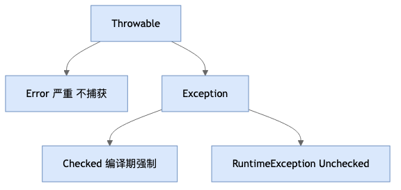

## 1.16 Lambda 表达式

💡 **一句话**：Lambda 是 Java 8 引入的**函数式编程语法糖**，用来简化「只实现一个抽象方法的接口（函数式接口）」的匿名内部类写法，让代码更紧凑、更聚焦"行为"。

🔍 **基本语法**

```java
(参数列表) -> { 方法体 }
```

- 参数类型可省略（编译器推断）；单参数可省括号：`x -> x * 2`。
- 方法体只有一行可省花括号和 `return`：`(a, b) -> a + b`。
- 无参数写空括号：`() -> System.out.println("hi")`。

🔍 **必须配合「函数式接口」**

```java
@FunctionalInterface  // 约定：只有一个抽象方法（可有 default/static 方法）
interface MyFunc {
    int apply(int x);
}

// Lambda 本质就是该接口的实现
MyFunc f = x -> x * 2;
System.out.println(f.apply(5));  // 10

// JDK 内置常用函数式接口
Predicate<T>  boolean test(T t)        // 断言
Function<T,R> R apply(T t)             // 转换
Consumer<T>   void accept(T t)         // 消费
Supplier<T>   T get()                  // 供给
Runnable      void run()               // 无参无返回
Comparator<T> int compare(T o1, T o2)  // 比较
```

🔍 **常见用法**

```java
// 1. 替代匿名内部类（线程）
new Thread(() -> System.out.println("running")).start();

// 2. 集合遍历（forEach）
list.forEach(s -> System.out.println(s));

// 3. Stream API（函数式数据处理）
List<Integer> res = list.stream()
                        .filter(x -> x > 3)        // 过滤
                        .map(x -> x * 2)            // 转换
                        .collect(Collectors.toList());

// 4. 排序
list.sort((a, b) -> a.compareTo(b));
```

🔍 **方法引用（更简洁的 Lambda）**  
当 Lambda 只是"调用一个已有方法"时，可用 `::` 进一步简化：

```java
list.forEach(System.out::println);            // 对象::实例方法
list.sort(Integer::compare);                  // 类::静态方法
Stream.of("a","b").map(String::toUpperCase);  // 类::实例方法
```

🔍 **原理 · Lambda 是怎么"变成"实现类的（举例说明）**  
用一个最小例子串起整条链路：

```java
@FunctionalInterface
interface Calculator { int calc(int a, int b); }

public class Demo {
    public static void main(String[] args) {
        Calculator add = (a, b) -> a + b;   // Lambda
        System.out.println(add.calc(2, 3)); // 5
    }
}
```

**① 编译期：不生成 .class，只埋一条 `invokedynamic`**

- Lambda **不会**像匿名内部类那样编译出 `Demo$1.class`。换成匿名内部类 `new Calculator(){...}` 才会当场生成独立类文件。
- 编译器只做两件事：把 `(a,b)->a+b` 的签名和 `Calculator` 唯一的抽象方法 `calc(int,int)` 做类型匹配；然后在 `main` 里生成一条 `invokedynamic` 指令，`javap -c` 可见大致是：
  ```
  0: invokedynamic #2, 0    // 动态调用点（lambda）
  ```
  那个 `#2` 指向 `BootstrapMethods` 表里绑定的 `LambdaMetafactory.metafactory(...)`。

**② 运行期：LambdaMetafactory 动态生成并缓存实现类**  
`invokedynamic` 首次执行时，JVM 调 `metafactory`：读取 `Calculator` 的方法签名，在运行时**动态生成**一个实现 `Calculator` 的类（逻辑上等价于匿名内部类，但**不落盘、不占独立 .class**，存在元空间且会被缓存复用），把 Lambda 方法体适配成 `calc` 的实现，返回实例赋给 `add`。

**③ 变量捕获：值拷贝，所以必须 final / 等效 final**

```java
int base = 10;
Calculator add = (a, b) -> a + b + base;   // base 必须事实不变
```

运行时等价于 JVM 生成的近似代码：

```java
class $Lambda implements Calculator {
    private final int captured_base;          // 把 base 的值拷进字段
    $Lambda(int base) { this.captured_base = base; }
    public int calc(int a, int b) { return a + b + captured_base; }
}
```

因为是**值拷贝**，若允许后续改 `base`，Lambda 实例那份拷贝不会跟着变，出现内外不一致，故 Java 强制被捕获变量必须 final / 等效 final。

**④ 方法引用走同一条链路**  
`list.forEach(System.out::println)` 不会真的去"调用" println，只是给 `metafactory` 一个目标方法描述符；运行时照样动态生成 `Consumer` 实现、把 `accept` 转发到 `System.out.println`，与 `(x)->System.out.println(x)` 完全同源。

> **一句话总结**：Lambda = 编译期只做类型匹配 + 埋 `invokedynamic`，**不生成类文件**；运行期首次执行由 `LambdaMetafactory` 按 SAM 签名动态生成并缓存实现类实例。比匿名内部类省了「编译期独立 .class + 每次加载」的开销，这也是 `this` 指外层类、变量需 final 的根源。

💡 **扩展思考：**

> **Q1：Lambda 和匿名内部类有什么区别？**  
> A：① **this 指向**：匿名内部类的 `this` 指内部类自身；Lambda 的 `this` 指**外层包围类**（Lambda 不是独立类）。② **字节码**：匿名内部类编译生成独立 `.class` 文件；Lambda 用 `invokedynamic` 指令在运行时动态生成，更轻量。③ **作用域**：Lambda 不能访问非 final/等效 final 的局部变量（和匿名内部类一样有"变量捕获"限制）。
>
> **Q2：什么是函数式接口？为什么 Lambda 能赋值给它？**  
> A：只含**一个抽象方法**的接口（可用 `@FunctionalInterface` 标注，编译器帮你校验）。Lambda 在编译期被匹配到对应函数式接口的"那个唯一抽象方法"上，运行时通过 `invokedynamic` 生成该接口的实现实例。
>
> **Q3：Lambda 能访问局部变量吗？有什么限制？**  
> A：可以，但被访问的局部变量必须是 **final 或"等效 final"（事实不变）**——因为 Lambda 可能在线程里延后执行，Java 通过把变量值拷贝进 Lambda 来保证一致性，若允许修改会出现"内外值不一致"。（这与匿名内部类的变量捕获规则一致。）
>
> **Q4：方法引用有哪几种形式？**  
> A：① 静态方法 `类名::静态方法`；② 实例方法（特定对象）`对象::方法`；③ 实例方法（任意对象）`类名::实例方法`；④ 构造器 `类名::new`。本质都是 Lambda 的语法进一步简化。

## 1.17 反射原理

💡 **一句话**：反射（Reflection）是 JVM 在**运行时**动态获取类的结构（构造器 / 字段 / 方法）并对其进行操作的机制——绕过编译期类型检查，直接"反向"操控对象。

🔍 **源码解析 · 核心类与 Class 对象**

```text
java.lang.reflect 包核心类：
  Class<T>        —— 类的"元数据"入口（不是 Object 的子类）
  Field           —— 成员变量
  Method          —— 成员方法
  Constructor<T>  —— 构造器
  Modifier        —— 修饰符解析（public / static / final …）
  Array           —— 动态创建 / 读写数组
```

- **Class 对象的唯一性**：同一个**类加载器**加载的同一个**全限定名**类，在 JVM 中只有一个 Class 对象（`Class#forName` 拿到的就是它）。不同类加载器加载同名类会得到不同的 Class（这是 Tomcat、OSGi 隔离的基础）。
- **获取 Class 的 3 种方式**：
  1. `类名.class`（编译期已知，不触发初始化）
  2. `对象.getClass()`（已有实例）
  3. `Class.forName("com.xxx.A")` **（会触发类的静态初始化，JDBC 驱动靠它注册）**
- 注意：基本类型有独立 Class（`int.class`），数组 `int[].class`；`void` 也有 `void.class`。

🔍 **源码解析 · 方法调用底层（invoke 链路）**

```text
Method.invoke(obj, args)
  → Method.invoke0 (native)
     → MethodAccessor.invoke            // 访问器接口
        ├─ NativeMethodAccessorImpl     // 前 15 次：走 JNI 调用，慢
        └─ GeneratedMethodAccessorN    // 超过阈值后：JVM 动态生成字节码访问器，直接调用，快
```

- **inflation（膨胀）机制**：JDK 默认同一 Method **调用 15 次以内**用 JNI 原生实现，超过阈值后 JVM 在内存中生成 `GeneratedMethodAccessorN` 字节码类，此后走直接字节码调用。阈值可调：`-Dsun.reflect.inflationThreshold=0` 直接生成，`-Djava.lang.reflect.noInflation=true` 关闭膨胀（始终用原生）。
- 每次 `invoke` 都会做 **访问权限检查**（`Reflection.verifyMemberAccess` + `Reflection.ensureMemberAccess`），这是主要开销之一。

💡 **扩展思考：**

> **Q：反射创建对象有哪几种？**  
> A：① `clazz.newInstance()`（**已废弃**，只能调无参 public 构造）；② `clazz.getDeclaredConstructor(...).newInstance(args)`（推荐，可指定构造器、可访问 private）；③ `Constructor.newInstance` 内部最终都会走到 `ReflectionFactory.newConstructorAccessor` → 直接字节码或 native 调用。
>
> **Q：反射调用为什么慢？**  
> A：① 编译期无法内联，JIT 优化困难；② 每次 `invoke` 做访问权限检查；③ 参数被包装成 `Object[]`、基本类型要装箱 / 拆箱；④ `varargs` 额外数组分配。优化手段：缓存 `Method / Field` 对象复用、对热点调用 `setAccessible(true)`、用 `MethodHandle`（invokeExact 可被 JIT 内联）替代。
>
> **Q：反射在框架里哪儿用？**  
> A：① JDBC 驱动注册 `Class.forName("com.mysql.cj.jdbc.Driver")`；② Spring IOC 扫 `@Component` 后反射 `newInstance` 创建 Bean 并注入；③ MyBatis 把 ResultSet 反射映射到实体；④ Jackson / Gson 反射读写字段做 JSON 序列化；⑤ 动态代理 `Proxy.newProxyInstance` 的 InvocationHandler 也基于反射。
>
> **Q：如何读写私有字段？**  
> A：`field.setAccessible(true)` 关闭 Java 语言访问检查（**不是** JVM 校验）后 `field.get / set`。但 Java 9+ **强封装**：跨模块访问 private 需 `--add-opens 目标模块=本模块`，否则 `InaccessibleObjectException`；`setAccessible` 无法突破模块边界。
>
> **Q：反射和动态代理、MethodHandle 的区别？**  
> A：反射是"事后 introspect + 调用"，偏通用但慢；动态代理在运行时生成实现接口的代理类，专为 AOP / 拦截设计；`MethodHandle`（invokedynamic 底层）是"方法指针"，可内联、性能接近直接调用，是反射的现代替代。

📊 **反射调用流程**

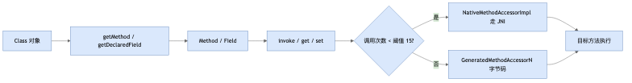

## 1.18 注解原理

💡 **一句话**：注解（Annotation）= 附着在代码上的**元数据**；其本质是一个**继承自 `java.lang.annotation.Annotation` 的接口**，本身不做事，由编译器 / 框架在编译期或运行期读取。

🔍 **源码解析 · 注解是接口**

```text
你写的：  @interface Test { int value() default 1; }
编译后等价于：
  public interface Test extends java.lang.annotation.Annotation {
      int value();
  }
→ 没有任何"实现类"，运行时 JVM 用 JDK 动态代理生成代理对象来"充当"实现。
```

🔍 **源码解析 · 元注解（给注解"贴标签"的注解）**

```text
@Target      限定能写在哪（ElementType）：
  TYPE, FIELD, METHOD, PARAMETER, CONSTRUCTOR, LOCAL_VARIABLE,
  ANNOTATION_TYPE, PACKAGE, TYPE_PARAMETER, TYPE_USE, MODULE, RECORD_COMPONENT
@Retention   限定活到哪一阶段（RetentionPolicy）：
  SOURCE  —— 编译期丢弃（@Override、@SuppressWarnings）
  CLASS   —— 进 .class 文件但 JVM 不加载（默认）
  RUNTIME —— 运行时保留，可被反射读取（@Test、@Autowired、@Transactional）
@Documented 是否进 Javadoc
@Inherited  仅对"类"继承生效（子类自动继承父类注解；接口 / 方法重写不继承）
@Repeatable  Java 8+，允许同一位置写多次（如多个 @Scheduled）
```

🔍 **源码解析 · 运行时读取原理（代理 + 常量池）**

```text
RUNTIME 注解的读取链路：
  clazz.getAnnotation(Test.class)
    → 创建代理：Proxy.newProxyInstance(..., new AnnotationInvocationHandler(type, memberValues))
    → 调用注解方法 test.value() 时：
        AnnotationInvocationHandler.invoke()
          → 从 memberValues（Map）取对应属性值返回
memberValues 来自：Class 文件常量池的 RuntimeVisibleAnnotations 属性（编译期写入）。
→ 注解的属性值"写死"在字节码里，运行时只是被代理对象原样读出。
```

🔍 **源码解析 · AnnotationInvocationHandler 实现细节**

```java
// JDK 核心源码 AnnotationInvocationHandler 关键逻辑（简化）
class AnnotationInvocationHandler implements InvocationHandler {
    private final Class<? extends Annotation> type;
    private final Map<String, Object> memberValues;  // 从常量池读取的属性值

    AnnotationInvocationHandler(Class<? extends Annotation> type, Map<String, Object> memberValues) {
        // class 对象必须用 == 比较 —— 保证同一类加载器下唯一
        this.type = type;
        this.memberValues = memberValues;
    }

    public Object invoke(Object proxy, Method method, Object[] args) {
        String name = method.getName();
        // 1. 调 hashCode()/toString()/equals() —— 标准方法，走 Annotation 的默认实现
        // 2. 调 annotationType() —— 返回 type（注解对应的 Class 对象）
        // 3. 调注解定义的属性方法（如 value()、maxAttempts()）：
        Object result = memberValues.get(name);           // 从 Map 取值（值来自字节码常量池）
        if (result == null)
            return method.getDefaultValue();               // Map 没存 → 取 default 默认值
        // 深拷贝数组（防御性编程，防止调用方修改内部数组）
        if (result.getClass().isArray())
            return cloneArray(result);
        return result;
    }
}
```

- **冷知识**：`memberValues` 里只存**被显式赋值的属性**，未赋值的属性用注解声明中的 `default` 值兜底——这就是为什么 `@Retryable()` 和 `@Retryable(maxAttempts=3)` 结果是等价的。

🔍 **注解属性值的类型限制**

```text
注解属性返回值只能是以下类型（JLS §9.6.1）：
  · 八种基本类型（int / boolean / double ...）
  · String
  · Class（含泛型 Class<? extends Foo>）
  · 枚举类型
  · 另一个注解类型（嵌套注解）
  · 上述任何类型的一维数组
🚫 不允许：包装类（Integer 不行）、自定义对象、多维数组
→ 设计意图：属性值必须能在编译期"写死"到常量池，受限于 .class 常量池可存储的类型。
```

🔍 **字节码视角：RuntimeVisibleAnnotations 属性**

```text
编译后 .class 文件中的注解存储结构（javap -v 可查看）：
  RuntimeVisibleAnnotations:          // RetentionPolicy.RUNTIME
    #23(#51=s#52,#53=s#54)            // 常量池索引引用

  常量池对应关系：
  #23 → @Retryable 的 Utf8 描述符
  #51 → "maxAttempts" 属性名
  #52 → 常量 5（赋的值）
  #53 → "delay" 属性名（用了 default，不写入）
  #54 → 仅当显式赋非默认值时才出现
→ 这就是为什么注解属性值编译后不可变——它们被编码为常量池中的字面量。
```

💡 **扩展思考：**

> **Q：注解到底是怎么被"执行"的？**  
> A：注解本身**没有任何逻辑**。靠两条路径驱动：① **编译期**——注解处理器（`AbstractProcessor`）在 `javac` 阶段扫描注解并生成代码（Lombok、Dagger、Room、MapStruct、ButterKnife）；② **运行期**——框架用**反射**扫描类上的 RUNTIME 注解，再决定做什么（Spring 根据 `@Component` / `@Autowired` 装配 Bean，JUnit 根据 `@Test` 执行方法）。
>
> **Q：@Inherited 为什么对方法和接口不生效？**  
> A：`@Inherited` 只在**类继承**时让子类继承父类注解，且只通过 `getAnnotations()` 这类"向上查找"的 API 体现；接口实现、方法重写**不会**继承注解（需自己写逻辑遍历）。
>
> **Q：Lombok 的 @Data 是反射还是注解处理器？**  
> A：都不是传统反射——Lombok 在**编译期直接修改抽象语法树（AST）**，往 class 里插入 getter / setter / equals / hashCode 的字节码，所以运行期看不到注解、也不靠反射，性能零损耗。
>
> **Q：自定义一个运行时注解并让它生效？**  
> A：① 定义 `@Retention(RUNTIME) @Target(METHOD) @interface Retryable { int maxAttempts() default 3; }`；② 在方法上标注 `@Retryable(maxAttempts = 5)`；③ 运行期用 `method.getAnnotation(Retryable.class)` 拿到代理对象，读 `maxAttempts()` 执行重试逻辑（AOP 拦截器就是这么干的）。
>
> **Q：`getAnnotation` 和 `isAnnotationPresent` 有什么区别？**  
> A：`isAnnotationPresent` 只判断**注解是否存在**（返回 boolean，不创建代理对象），性能开销小；`getAnnotation` 会**创建 AnnotationInvocationHandler 代理对象**并初始化 memberValues Map，开销更大。如果只需要判是否存在，优先用 `isAnnotationPresent`。
>
> **Q：为什么注解属性不能用 Integer 只能用 int？**  
> A：注解属性值必须在编译期存入 .class 文件常量池，常量池仅支持基本类型字面量（int 有 `CONSTANT_Integer_info`），而 `Integer` 是引用类型，无法直接编码到常量池——这是 JVM 规范层面的限制，不是语言设计随意为之。

📊 **注解的两条处理路径**

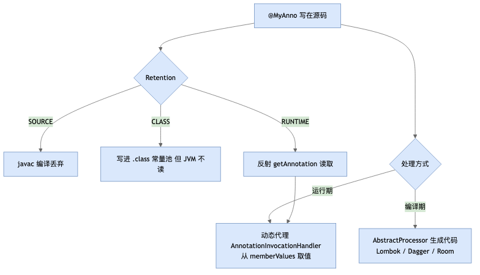

> **实战示例（运行时注解 + 反射驱动重试）：**
>
> ```java
> @Retention(RetentionPolicy.RUNTIME)
> @Target(ElementType.METHOD)
> public @interface Retryable { int maxAttempts() default 3; }
>
> // 拦截器里读取并执行重试：
> Retryable r = method.getAnnotation(Retryable.class);
> if (r != null) {
>     int n = r.maxAttempts();
>     for (int i = 0; i < n; i++) {
>         try { return method.invoke(target, args); }
>         catch (Exception e) { if (i == n - 1) throw e; }
>     }
> }
> ```

## 1.19 浅拷贝与深拷贝

💡 **扩展思考：**

> **Q：浅拷贝和深拷贝区别？**  
> A：浅拷贝复制对象本身和值类型，引用类型字段共享同一地址；深拷贝递归复制引用对象，完全独立。
>
> **Q：实现深拷贝有哪三种方法？**  
> A：① 重写 `clone()` 并递归克隆引用对象（实现 Cloneable）；② 序列化/反序列化（实现 Serializable 后通过字节流读写）；③ 手动递归复制（或借助 JSON/MapStruct 等工具）。
>
> **Q：为什么用拷贝？**  
> A：避免修改副本意外影响原对象（如缓存对象被改动、多线程共享可变对象）。

## 1.20 对象初始化的执行顺序

💡 **口诀**：**先父后子，先静态后成员再构造。** 同类型按代码声明顺序执行。

📊 **父子类初始化全流程**

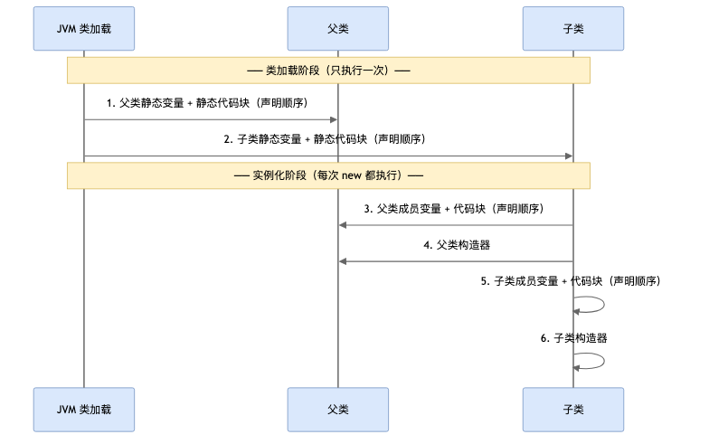

🔍 **源码验证**

```java
class Father {
    static    { System.out.print("1 "); }                // 类加载时：父静态
    { System.out.print("2 "); }                          // 实例化时：父代码块
    Father()  { System.out.print("3 "); }                // 实例化时：父构造器
}
class Son extends Father {
    static    { System.out.print("4 "); }                // 类加载时：子静态
    { System.out.print("5 "); }                          // 实例化时：子代码块
    Son()     { System.out.print("6 "); }                // 实例化时：子构造器
}
// 输出：1 4 2 3 5 6 （类加载阶段先输出 1 4，new Son() 后输出 2 3 5 6）
```

💡 **扩展思考：**

> **Q：为什么静态变量和静态代码块会优先执行？**  
> A：它们属于**类级别**，在 JVM 加载类字节码到方法区时即执行（`ClassLoader.loadClass` → `defineClass` → 解析常量池 → 执行 `<clinit>`），与是否创建对象无关。`<clinit>` 由编译器按声明顺序自动合并生成，且 JVM 保证线程安全（加锁执行一次）。
>
> **Q：子类实例化时，为什么父类构造函数一定先运行？**  
> A：`new Son()` 底层字节码生成的 `dup` + `invokespecial Son.<init>` → `aload_0` + `invokespecial Father.<init>`，JVM **强制**子类构造器第一行隐式调用 `super()`（不写 `super(xxx)` 则自动插 `super()`）。父类构造器不执行完，子类字段无法确定其继承来的父类部分是合法状态。
>
> **Q：父类构造器里调用了一个被子类重写的方法，会出问题吗？**  
> A：**会！经典陷阱。** 虽然 `super()` 先运行，但此时**多态指针（vtable）已指向子类**，所以父类构造器中调用的重写方法实际上执行的是**子类版本**。而此时子类成员变量还没初始化（默认零值），极易引发 NPE 或逻辑错误。**铁律：构造器中只调 `final` / `private` 方法，避免在构造器内调用可重写的方法。**
>
> **Q：通过 `Class.forName` 和 `new` 触发的初始化有什么不同？**  
> A：`new Son()` 会触发**父子类的加载+实例化**完整流程；`Class.forName("Son")` **只触发类加载**（`<clinit>` 执行），不会实例化对象——输出只有 `1 4`。而 `Son.class` **只是获取 Class 对象**，不触发 `<clinit>`。这是加载、链接、初始化三个阶段的经典区别。
>
> **Q：成员变量赋值和代码块的执行顺序以什么为准？**  
> A：**声明顺序。** 编译器会把成员变量赋值和代码块**按它们出现的先后顺序合并到同一段 `<init>` 字节码中**——谁写在前面谁先执行。`static` 同理合并到 `<clinit>`。

---

# 2. 面向对象（OOP）

## 2.1 三大特性与多态

💡 **扩展思考：**

> **Q：怎么理解面向对象？封装继承多态分别解决什么？**  
> A：抽象现实为对象（属性+行为）。封装隐藏细节降低耦合；继承复用代码；多态同一接口不同实现，提高扩展性。
>
> **Q：多态体现在哪几方面？**  
> A：方法重载（编译时）、方法重写（运行时）、接口与实现、向上/向下转型。
>
> **Q：多态解决了什么问题？**  
> A：是**策略模式、依赖倒置**的基础，能消除大量 `if-else`、提高扩展性与可维护性。例如支付场景用 `Payable` 接口，新增支付方式不改动调用方。
>
> **Q：字段/static 方法有多态吗？**  
> A：都没有。字段访问看引用类型；static 属于类编译期绑定，子类同名是"隐藏"非重写。

🔍 **字节码视角 · 方法调用**

```text
invokevirtual   → 虚方法（多态，运行期查 vtable）
invokestatic    → 静态方法（无多态）
invokespecial   → 构造器/private/super（无多态）
invokeinterface → 接口方法
```

📊 **多态动态绑定**

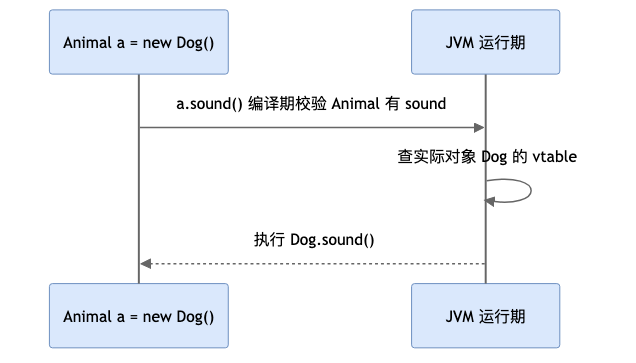

## 2.2 对象创建方式与生命周期

💡 **扩展思考：**

> **Q：创建对象有哪些方式？**  
> A：① `new`；② 反射（`Class.newInstance` / `Constructor.newInstance`）；③ `clone()`；④ 反序列化（ObjectInputStream）；⑤ 工厂/建造者模式（本质是调构造器）。后四种中 clone 和反序列化**不调用构造器**。
>
> **Q：new 出的对象什么时候回收？**  
> A：由 GC 通过**可达性分析**（非引用计数）判定不可达后回收；`finalize()` 已过时不应依赖。
>
> **Q：对象一定在堆里吗？**  
> A：多数在堆；JIT 逃逸分析可能栈上分配/标量替换未逃逸小对象，减 GC 压力。

🔍 **字节码 · new 指令序列**

```text
new            # 堆分配内存，压未初始化引用
dup            # 复制引用
invokespecial  # 调用 <init> 构造器
```

📊 **对象创建 5 步**

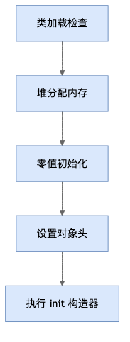

## 2.3 抽象类、接口、普通类的区别

💡 **一句话**：普通类是"完整模板"（可直接实例���），抽象类���"半成品���板"（留口给子类实现）�������口是"��力契约"（只定义行为规范不关心实现）。

📊 **三方对比表**

| 维度        | 普通类          | 抽象类                 | 接口（Java 8+）                                |
| --------- | ------------ | ------------------- | ------------------------------------------ |
| **实例化**   | ✓ 可以 new     | ✗ 不能（必须子类实现）        | ✗ 不能                                       |
| **继承/实现** | 单继承          | 单继承                 | 可多实现（implements 多个）                        |
| **构造器**   | ✓ 有          | ✓ 有（给子类调用）          | ✗ 无                                        |
| **方法体**   | 全部有实现        | 可有抽象 + 具体方法         | 抽象方法 / default / static / private（Java 9+） |
| **成员变量**  | 实例变量 + 静态变量  | 实例变量 + 静态变量         | **仅常量**（public static final，隐式）            |
| **访问修饰符** | 四种均可         | 四种均可                | 方法默认 public（Java 9 private 除外）             |
| **设计意图**  | 具体事物建模       | "is-a" 复用（模板方法模式）   | "can-do" 能力契约（策略模式、多实现）                    |
| **final** | 可 final（禁继承） | **不能** final（与抽象矛盾） | 不适用（本身非类）                                  |

🔍 **源码解析 · 接口的 default 方法底层**

```java
// 接口定义
public interface Flyable {
    default void fly() { System.out.println("flying"); }  // Java 8+
}

// 编译后字节码：接口 .class 文件中 default 方法存在 Interface 方法表
// 实现类继承时，JVM 将 default 方法复制到实现类的虚方法表（vtable）
// 若多接口有同名 default → 编译期强制实现类重写
```

🔍 **源码解析 · 抽象类构造器的调用链**

```java
abstract class Animal {
    String name;
    Animal(String name) { this.name = name; }  // 抽象类的构造器不为 new 自己，而是给子类 super
}
class Dog extends Animal {
    Dog(String name) { super(name); }
}
// new Dog("旺财") → super(name) → Animal(String) 初始化 name
```

💡 **扩展思考：**

> **Q：什么时候用抽象类，什么时候用接口？**  
> A：子类有大量共性代码且单继承足够 → 抽象类（模板方法模式）。需要跨不同继承树的多态、解耦行为 → 接口（策略模式）。**抽象类复用代码，接口定义规范**。
>
> **Q：接口能包含构造器吗？**  
> A：**不能**。接口无实例、无需构造；接口变量只能是 `public static final` 常量。
>
> **Q：Java 8/9 接口新增了哪些方法类型？**  
> A：Java 8 新增 `default`（有方法体、可被子类继承或重写）、`static`（接口名直接调用）；Java 9 新增 `private` 方法（给 default/static 方法内部复用，不暴露给实现类）。
>
> **Q：两个接口有同名 default 方法冲突怎么办？**  
> A：编译报错，**必须重写**消歧。重写方法中可指定调哪个：`A.super.method()`。
>
> **Q：抽象类能加 final 吗？**  
> A：**不能**。final 禁止继承，与抽象类"必须被继承才能实例化"矛盾。同样，抽象方法不能加 private/static/final 等冲突修饰符。

📊 **三方关系图**

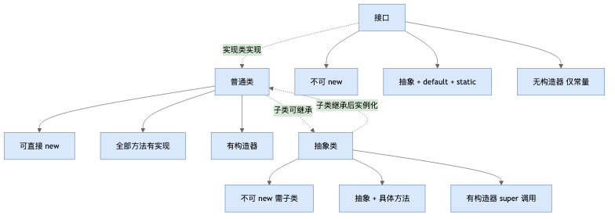

# 3. Java 新特性与 Optional

## 3.1 Optional：优雅处理"可能为空"

💡 **一句话**：`Optional<T>` 是 Java 8 引入的"容器对象"，用来**显式表达"这个值可能不存在"**，把"要不要判空"从隐性的约定变成类型系统能看到的显式契约，减少疏忽导致的 NPE。

🔍 **源码解析 · 核心结构**

```java
public final class Optional<T> {
    private static final Optional<?> EMPTY = new Optional<>(null);
    private final T value;                          // 持有的值，可能为 null（内部标记）
    public static <T> Optional<T> empty() { return (Optional<T>) EMPTY; }
    public static <T> Optional<T> of(T value) {      // value 若为 null 直接抛 NPE（快速失败）
        return new Optional<>(Objects.requireNonNull(value));
    }
    public static <T> Optional<T> ofNullable(T value) {  // value 可能是 null，包装成 empty
        return value == null ? empty() : of(value);
    }
}
```

🔍 **常用 API**

```java
Optional<User> opt = repository.findById(id);   // 返回 Optional，调用方一看类型就知道"可能查不到"

opt.isPresent();                 // 是否有值（不推荐直接配合 get()，容易写成伪装的 if-null）
opt.isEmpty();                   // Java 11+，是否为空
opt.get();                       // 有值返回值，为空抛 NoSuchElementException（尽量别直接用）
opt.orElse(defaultUser);         // 为空时返回默认值
opt.orElseGet(() -> queryFallback());   // 为空时才执行的"惰性"默认值（比 orElse 更省性能，避免总是构造默认对象）
opt.orElseThrow(() -> new UserNotFoundException(id));  // 为空时抛自定义异常

opt.map(User::getName)           // 有值则转换，无值直接短路返回 Optional.empty()
   .filter(name -> !name.isBlank())  // 有值且满足条件才保留，否则变 empty
   .ifPresent(System.out::println); // 有值才执行副作用，无值什么都不做

opt.flatMap(u -> u.getAddress()); // 若 map 的返回值本身也是 Optional，用 flatMap 避免嵌套 Optional<Optional<T>>
```

🔍 **典型链式用法：替代多层 if-null 判断**

```java
// 传统写法：多层 if 判空，容易漏判
String city = null;
if (user != null) {
    Address addr = user.getAddress();
    if (addr != null) {
        city = addr.getCity();
    }
}

// Optional 链式写法：意图清晰，漏判会直接短路返回 empty，不会 NPE
String city2 = Optional.ofNullable(user)
        .map(User::getAddress)
        .map(Address::getCity)
        .orElse("未知城市");
```

💡 **扩展思考：**

> **Q1：Optional 解决了什么问题？它是"银弹"吗？**  
> A：解决的是"**方法签名层面表达可能为空**"的问题——调用者看到返回值是 `Optional<User>` 就知道要处理"没有"的情况，比返回 `null`（调用方常忘记判空）更安全、更"自文档化"。但它**不是银弹**：无法阻止别人仍然到处传 `null`（尤其是方法参数、类字段官方都不建议用 Optional），也不能消除所有 NPE——它只是约定 + 工具方法的组合。
>
> **Q2：为什么官方不建议用 Optional 作为类的字段或方法参数？**  
> A：① `Optional` 本身不是 `Serializable`，作为字段会破坏序列化；② 用作参数时，调用方可能传 `null` 的 `Optional`（`Optional` 本身也能是 `null`！），反而增加一层判空负担；③ Optional 设计初衷是**方法的返回值**类型，用来告诉调用者"这里可能没有结果"，滥用到字段/参数上违背设计目的（《Effective Java》明确指出这一点）。
>
> **Q3：Optional.of 和 Optional.ofNullable 有什么区别？什么时候用哪个？**  
> A：`of(value)` 要求 `value` 一定非空，传 null 会立即抛 `NullPointerException`（用于"我很确定这里不可能是 null，一旦是 null 说明有 bug，快速失败"）；`ofNullable(value)` 接受可能是 null 的值，null 会被自动转换成 `Optional.empty()`（用于"这里本来就可能没有值"的正常业务场景，如查询结果）。
>
> **Q4：orElse 和 orElseGet 有什么区别？为什么这个区别很重要？**  
> A：`orElse(x)` **无论 Optional 是否有值，x 这个表达式都会被求值**（如果 x 是一个方法调用，即使 Optional 有值，这个方法依然会被执行一次，只是结果被丢弃）；`orElseGet(supplier)` 只有在 Optional **为空时才会执行** `supplier.get()`。若默认值的构造成本较高（如查数据库、new 一个较重的对象），必须用 `orElseGet`，否则会有不必要的性能浪费。

## 3.2 record（Java 16+）

💡 **一句话**：`record` 是不可变数据载体的语法糖，一行声明自动生成构造器、`getter`（无 `get` 前缀）、`equals`/`hashCode`/`toString`，专为"只是装数据的类"（DTO/VO）而生。

🔍 **源码对比**

```java
// 传统写法：一个纯数据类要写一大堆样板代码
public final class Point {
    private final int x, y;
    public Point(int x, int y) { this.x = x; this.y = y; }
    public int x() { return x; }
    public int y() { return y; }
    @Override public boolean equals(Object o) { /* ... */ }
    @Override public int hashCode() { /* ... */ }
    @Override public String toString() { /* ... */ }
}

// record 一行等价上面全部内容
public record Point(int x, int y) { }
Point p = new Point(1, 2);
p.x();          // 1（访问器方法，注意不是 getX()）
p.toString();   // "Point[x=1, y=2]"
```

🔍 **进阶特性**

```java
public record Range(int min, int max) {
    // 紧凑构造器（compact constructor）：省略参数列表，直接对隐式字段做校验/规范化
    public Range {
        if (min > max) throw new IllegalArgumentException("min > max");
    }
    // 可以额外定义方法（甚至静态方法），但不能再声明额外的实例字段
    public int length() { return max - min; }
}
```

💡 **扩展思考：**

> **Q：record 和普通 class + Lombok @Data 有什么区别？**  
> A：`record` 是 **JDK 语言层面**特性，编译器保证字段 `final`（真正不可变）、自动生成的 `equals/hashCode/toString` 基于**所有字段**且不可被意外遗漏；`@Data` 是**注解处理器**在编译期生成代码，生成的是可变的（有 setter），且依赖 Lombok 这个第三方库。语义上 `record` 更适合"不可变值对象"，`@Data` 更适合传统可变 JavaBean。
>
> **Q：record 能继承吗？**  
> A：`record` **隐式 final**，不能被继承，也不能主动 `extends` 其他类（因为已经隐式继承了 `java.lang.Record`），但**可以实现接口**。这与它"纯数据载体、不应该有复杂继承层次"的设计目的一致。

## 3.3 sealed class（Java 17+）

💡 **一句话**：密封类限定"哪些类可以继承/实现自己"，把 Java 的开放继承变成**编译期可控的封闭继承体系**，常配合 `switch` 模式匹配做穷尽性检查（类似 Kotlin 的 `sealed class`，见文档 4）。

🔍 **源码示例**

```java
public sealed interface Shape permits Circle, Square, Triangle { }
public final class Circle implements Shape { double radius; }
public final class Square implements Shape { double side; }
public final class Triangle implements Shape { double base, height; }
// permits 列出的类必须与 sealed 类型同一模块/同一包，且必须显式声明 final/sealed/non-sealed 之一
```

💡 **扩展思考：**

> **Q：sealed class 解决了什么问题？**  
> A：普通继承/接口的实现类是"开放"的——任何人都能在任意地方新增一个实现类，导致 `switch`/`if-else` 分支永远无法"穷尽"，也难以静态分析。`sealed` 显式列出全部允许的子类型，编译器能据此在 `switch` 模式匹配时做**穷尽性检查**（缺分支直接编译报错），兼顾了继承的灵活性与"有限可能性"的可控性。
>
> **Q：sealed 的子类必须用什么修饰符？**  
> A：每个直接子类/子接口必须显式声明为 `final`（不能再被继承）、`sealed`（可以继续限定自己的子类）或 `non-sealed`（重新开放为普通可继承类）三者之一，不能什么都不写（避免继承链的封闭性被意外打破）。

## 3.4 switch 表达式 / 模式匹配（Java 14+/21+）

🔍 **源码对比**

```java
// 传统 switch 语句：需要 break，容易忘记导致 fall-through
int day = 3; String name;
switch (day) {
    case 1: name = "Mon"; break;
    case 2: name = "Tue"; break;
    default: name = "Other";
}

// switch 表达式（Java 14+）：箭头语法，有返回值，无 fall-through
String name2 = switch (day) {
    case 1 -> "Mon";
    case 2 -> "Tue";
    default -> "Other";
};

// 模式匹配 for switch（Java 21 正式）：结合 sealed class 做类型分支 + 自动解构
sealed interface Shape permits Circle, Square {}
record Circle(double r) implements Shape {}
record Square(double side) implements Shape {}

double area = switch (shape) {
    case Circle c -> Math.PI * c.r() * c.r();   // 自动做 instanceof + 强转 + 绑定变量 c
    case Square s -> s.side() * s.side();
    // 若 Shape 是 sealed 且分支已覆盖全部子类，可以不写 default，编译器能验证穷尽性
};
```

💡 **扩展思考：**

> **Q：switch 表达式和传统 switch 语句最大的区别？**  
> A：① 传统 `switch` 是**语句**，没有返回值，且 `case` 之间没写 `break` 会**贯穿（fall-through）执行下一个分支；② `switch` 表达式（`->` 语法）是表达式**，可以直接赋值给变量，每个分支互相独立不会贯穿，且编译器会检查是否覆盖所有情况（尤其配合 `sealed`/枚举时可省略 `default`）。
>
> **Q：模式匹配 switch 和普通 instanceof 链有什么区别？**  
> A：普通写法要写多个 `if (x instanceof Circle c) {...} else if (x instanceof Square s) {...}`，冗长且容易漏写某个类型；模式匹配 `switch` 把"类型判断 + 强转 + 变量绑定"合并成一行 `case Circle c ->`，配合 `sealed` 类型还能让编译器**验证分支穷尽**，遗漏类型会直接编译报错而不是运行时才发现。

## 3.5 var 局部变量类型推断（Java 10+）

🔍 **源码示例**

```java
var list = new ArrayList<String>();   // 推断为 ArrayList<String>，等价于显式声明
var map = new HashMap<String, List<Integer>>();  // 长泛型声明大幅简化
for (var entry : map.entrySet()) { /* entry 推断为 Map.Entry<String, List<Integer>> */ }
```

💡 **扩展思考：**

> **Q：var 是动态类型吗？和 JS 的 var/Kotlin 的 val 一样吗？**  
> A：**不是动态类型**。`var` 只是让**编译器在编译期**根据右侧表达式推断出具体类型，编译后字节码和显式写类型完全一样，变量类型在编译后就固定了、不能再变——本质仍是静态类型语言的语法糖。它更接近 Kotlin 的类型推断（`val x = 10` 也会推断出 `Int`），但和 JS 的 `var`（真正的动态类型、可重新赋值任意类型）完全不同。
>
> **Q：var 有什么使用限制？**  
> A：只能用于**有初始值的局部变量**（方法内、for 循环变量、try-with-resources），不能用作**方法参数、返回值类型、类的字段**；不能推断为 `null`（右侧必须能推出具体类型，`var x = null;` 编译报错）；不能用于没有初始化的声明（`var x;` 报错）。

## 3.6 文本块 Text Block（Java 15+）

🔍 **源码示例**

```java
// 传统写法：多行字符串需要大量转义和拼接
String json = "{\n" +
              "  \"name\": \"Tom\",\n" +
              "  \"age\": 18\n" +
              "}";

// 文本块：三个双引号开始，保留换行和大部分格式，无需转义内部的 "
String json2 = """
        {
          "name": "Tom",
          "age": 18
        }
        """;
```

💡 **扩展思考：**

> **Q：文本块的缩进是怎么处理的？**  
> A：编译器会自动计算所有行中**最小公共缩进**并统一去除（以结束分隔符 `"""` 的位置为基准），保留相对缩进结构；可用 `.stripIndent()` 手动复现该逻辑，或用 `\` 在行末做续行不换行。这让多行 SQL/JSON/HTML 代码块既能在源码里保持美观缩进，又不会把无关的前导空格带入实际字符串内容。

## 附：前 3 章高频速记（冲刺用）

- **跨平台**：跨的是字节码；JVM 本身不跨平台；Java 是编译+解释混合（JIT 编译热点）。
- **JDK>JRE>JVM**：JVM 跑字节码，JRE=JVM+类库，JDK=JRE+开发工具。
- **类型转换**：小→大自动安全；大→小强转溢出（300→44）/精度损失（3.14→3）；金钱用 BigDecimal（字符串构造）。
- **int vs Integer**：int 4B 高效；Integer 约 16B 支持泛型/集合/null；缓存 -128~127；拆箱 null 会 NPE。
- **equals/hashCode**：equals true → hashCode 必相等；重写 equals 必须重写 hashCode；Object 共 9 方法。
- **String**：不可变（private final byte[] + 无修改方法）；常量池 JDK7 起在堆；三兄弟按场景选用。
- **final/static**：final 禁继承/重写/改值；static 类级共享，静态方法不能重写只能隐藏。
- **泛型**：编译期擦除为 Object；`List<String>.class` 不合法；PECS 生产者 extends 消费者 super。
- **异常**：Error 不捕 / Checked 强制 / RuntimeException 不强制；finally 的 return 覆盖 try 的 return。
- **深浅拷贝**：浅拷贝共享引用；深拷贝 3 法（clone 递归 / 序列化 / 手动）。
- **反射/注解**：反射运行期动态操作；注解是 Annotation 子接口，运行时动态代理从 memberValues 取值。
- **OOP**：封装继承多态；多态消除 if-else（策略模式/依赖倒置）。
- **抽象类 vs 接口**：抽象类单继承有构造；接口多实现无构造；抽象类不能 final。
- **内部类**：非静态自动持外部引用（可能泄漏）；静态不依赖外部实例。
- **Optional**：表达"可能为空"的返回值类型；orElseGet 惰性求值优于 orElse；不建议用作字段/参数。
- **record**：不可变数据载体语法糖；隐式 final 不可继承；紧凑构造器可做参数校验。
- **sealed class**：限定子类集合，配合 switch 模式匹配做穷尽性检查；子类必须 final/sealed/non-sealed 三选一。
- **switch 表达式**：`->` 语法有返回值、不贯穿；模式匹配可自动 instanceof+强转+绑定变量。
- **var**：编译期类型推断，非动态类型；仅限有初始值的局部变量，不能用于字段/参数/返回值。

---

> 整理说明：本版聚焦前 3 章，采用 **JDK 源码解析 / 扩展思考 / Mermaid 思维导图** 三合一深化。第 3 章并发编程已独立为《3.Java并发编程.md》，本文新增的"Java 新特性与 Optional"章节聚焦 Java 8~21 语言层面演进。建议配合 JDK 源码与 IDE 调试阅读，并用"扩展思考"自测。
