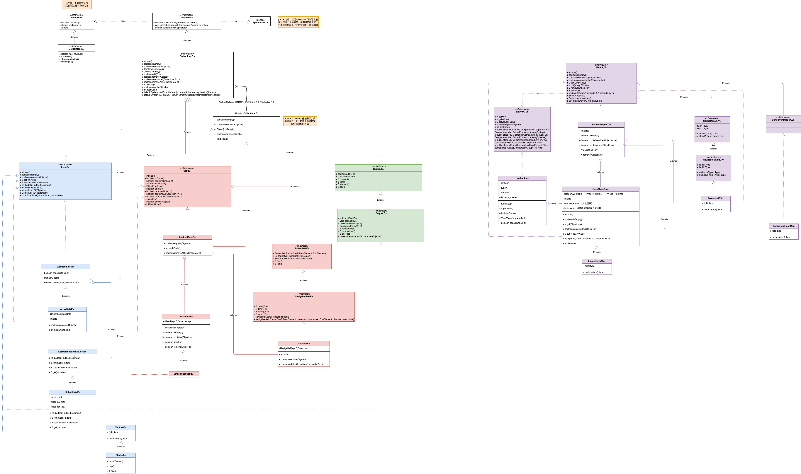
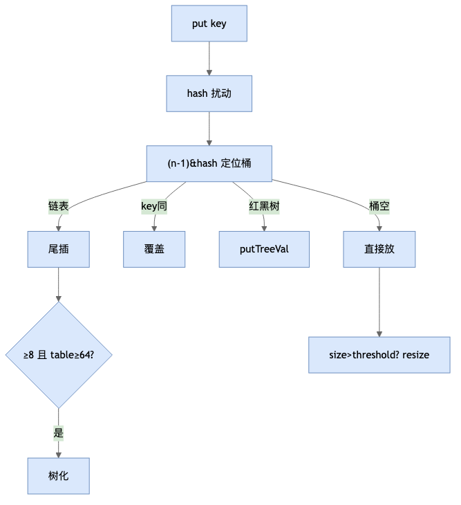
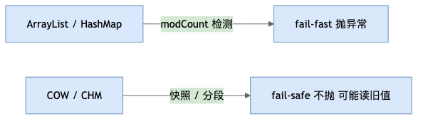

# Java集合体系

> 从《Java基础语法》独立拆分，聚焦集合框架全知识点。

## 目录

- [1. 集合体系总览](#1-集合体系总览)
- [2. List —— 有序可重复](#2-list--有序可重复)
  - [2.1 ArrayList](#21-arraylist数组读写分离首选)
  - [2.2 LinkedList（双向链表 + Deque）](#22-linkedlist双向链表--deque)
  - [2.3 Vector](#23-vectorjdk-10-遗留已淘汰)
  - [2.4 CopyOnWriteArrayList](#24-copyonwritearraylist)
  - [2.5 List 常见实现类对比](#25-list-常见实现类对比)
- [3. Map —— 键值对](#3-map--键值对)
  - [3.1 HashMap](#31-hashmapjdk-8深度)
  - [3.2 LinkedHashMap](#32-linkedhashmaplru-实现原理)
  - [3.3 TreeMap](#33-treemap红黑树原理)
  - [3.4 Hashtable](#34-hashtablejdk-10-遗留已淘汰)
  - [3.5 ConcurrentHashMap —— 线程安全 Map 首选](#35-concurrenthashmapjdk-8-线程安全-map-首选)
  - [3.6 ConcurrentSkipListMap](#36-concurrentskiplistmap跳表有序并发-map)
- [4. Set —— 不重复](#4-set--不重复)
  - [4.1 HashSet](#41-hashsethashmap-的薄包装)
  - [4.2 LinkedHashSet](#42-linkedhashsetlinkedhashmap-的薄包装)
  - [4.3 TreeSet](#43-treesettreemap-的薄包装)
- [5. Stack —— 栈（LIFO）](#5-stack--栈lifo)
- [6. Queue & Deque —— 队列与双端队列](#6-queue--deque--队列与双端队列)
  - [6.1 ArrayDeque](#61-arraydeque循环数组栈和队列首选)
  - [6.2 PriorityQueue](#62-priorityqueue二叉堆优先级队列)
  - [6.3 LinkedList（Queue/Deque）](#63-linkedlistqueuedeque-用法)
  - [6.4 并发队列](#64-并发队列)
- [7. fail-fast vs fail-safe](#7-fail-fast-vs-fail-safe)
- [8. 多线程安全数据结构全景](#8-多线程安全数据结构全景)
- [9. 实现类对比总表](#9-实现类对比总表)
- [10. Comparable 与 Comparator](#10-comparable-与-comparator)
- [11. Arrays.asList 与常见集合陷阱](#11-arraysaslist-与常见集合陷阱)
- [12. 特殊用途 Map：EnumMap / WeakHashMap / IdentityHashMap](#12-特殊用途-mapenummap--weakhashmap--identityhashmap)
- [附：高频速记](#附高频速记冲刺用)

---

## 1. 集合体系总览



> 以下按 **List → Map → Set → Stack → Queue** 逐接口展开，每个下列出关键实现类的源码原理与扩展思考。

## 2. List —— 有序可重复

### 2.1 ArrayList（数组，读写分离首选）

🔍 **源码解析 · 底层数组 + 动态扩容**

```java
transient Object[] elementData;  // 默认容量 10，首次 add 才真正分配（延迟初始化）

public boolean add(E e) {
    modCount++;
    add(e, elementData, size);
}
private void add(E e, Object[] elementData, int s) {
    if (s == elementData.length)
        elementData = Arrays.copyOf(elementData, newCapacity());  // 扩容 1.5 倍
    elementData[s] = e;
    size = s + 1;
}
```

- 扩容：`oldCapacity + (oldCapacity >> 1)`，1.5 倍；用 `System.arraycopy` native 实现。
- 随机访问 O(1)，中间插入/删除 O(n)（需移动后续元素）。
- `remove(Object)` 用 `equals` 找，null 单独处理（==），移除后尾部置 null 帮助 GC。

💡 **扩展思考：**

> **Q1：ArrayList 的默认初始容量是多少？为什么 JDK 7 和 JDK 8 不一样？**
> A：JDK 7 的 `new ArrayList<>()` 直接 `this.elementData = new Object[10]`（饿汉式，立刻分配 10 个槽）；JDK 8 改为**延迟初始化**，`new ArrayList<>()` 时 `elementData = {}`（共享空数组 `EMPTY_ELEMENTDATA`），直到第一次 `add` 才通过 `grow()` 真正扩容到 10。这样无参构造且长期不 add 的对象不占 10 个引用的内存，是一种内存优化。注意：只有无参构造才延迟；`new ArrayList<>(n)` 指定容量时直接分配 n。
>
> **Q2：扩容机制？什么情况触发？扩容代价多大？**
> A：`add` 时若 `size == elementData.length` 触发 `grow()`：新容量 = `old + (old >> 1)`（即 1.5 倍），首次从 0 扩到 10；扩容靠 `Arrays.copyOf` → `System.arraycopy`（native 内存拷贝），单次 O(n)，但均摊到多次 add 仍是 O(1)。**预估容量时用 `new ArrayList<>(expectedSize)` 可避免多次扩容**。
>
> **Q3：为什么 elementData 用 transient？序列化会丢数据吗？**
> A：数组常预留额外容量（size < length），直接序列化会写入一堆 null 浪费空间。ArrayList 重写了 `writeObject`/`readObject`：只把 `size` 个有效元素写出，反序列化时重建恰好 size 长度的数组。所以**不丢数据，只是更紧凑**。
>
> **Q4：ArrayList 线程安全吗？多线程 add 会怎样？替代方案？**
> A：非线程安全。多线程同时 `add` 可能出现：① 元素被覆盖（size 竞态）；② 数组越界 `ArrayIndexOutOfBoundsException`。替代：读多写少用 `CopyOnWriteArrayList`；读写均衡用 `Collections.synchronizedList`（注意迭代器仍需手动同步）；并发写也可外部加锁。

### 2.2 LinkedList（双向链表 + Deque）

🔍 **源码解析 · 节点结构**

```java
private static class Node<E> {
    E item;
    Node<E> next;
    Node<E> prev;
}
transient Node<E> first;  // 头节点
transient Node<E> last;   // 尾节点
```

🔍 **源码解析 · 头尾操作**

```java
void linkLast(E e) {           // 尾插 O(1)
    final Node<E> l = last;
    final Node<E> newNode = new Node<>(l, e, null);
    last = newNode;
    if (l == null) first = newNode; else l.next = newNode;
}
Node<E> node(int index) {      // 随机访问 O(n) —— 从近端搜索
    if (index < (size >> 1)) { /* 从前半段 */ }
    else                      { /* 从后半段 */ }
}
```

🔍 **源码解析 · 删除 + 中间插入**

```java
E unlink(Node<E> x) {          // 删除 O(1)（已定位到节点）
    Node<E> prev = x.prev, next = x.next;
    if (prev == null) first = next; else { prev.next = next; x.prev = null; }
    if (next == null) last = prev; else { next.prev = prev; x.next = null; }
    x.item = null;  // 三处置 null 助 GC
    size--; modCount++; return element;
}
// add(index, e) → node(index) 定位 O(n) + linkBefore 插入 O(1)
```

- 迭代器：`ListItr` 每次 `next()` 检查 `modCount != expectedModCount` → fail-fast。
- 序列化：`first`/`last`/`Node` 全 `transient`，`writeObject` 逐元素写值，反序列化 `readObject` 重建链表。

💡 **扩展思考：**

> **Q1：ArrayList 和 LinkedList 到底怎么选？**
> A：核心差异在底层与内存局部性。ArrayList 是**连续数组**：随机访问 `get(i)` O(1)，CPU 缓存友好（预取连续内存）；缺点是中间插入/删除要搬移后续元素 O(n)。LinkedList 是**分散的双向链表**：节点在堆上不连续，随机访问 `get(i)` 必须从头/尾遍历 O(n)（源码 `node(index)` 二分从近的一端找），且每个节点多 2 个引用（prev/next），内存更大、缓存不友好。结论：**随机访问/遍历多 → ArrayList；只在头尾频繁增删（或做栈/队列）→ LinkedList**。实践中即便中间插入，ArrayList 也常更快（缓存友好 + 批量拷贝优于指针跳转）。
>
> **Q2：为什么遍历 LinkedList 不能用 `for (int i=0; i<size; i++) list.get(i)`？**
> A：`get(i)` 每次都从近端遍历到 i，外层循环 n 次、内层平均 n/2，整体退化为 **O(n²)**。正确做法用 `for-each` / `Iterator` / `forEach` / `Stream`：迭代器 `ListItr.next()` 内部只是 `next = next.next` 指针移动，O(1)。ArrayList 下两种写法都是 O(n)，差别不大，但 LinkedList 必须避免下标循环。
>
> **Q3：LinkedList 能当栈和队列用吗？和 ArrayDeque、Stack 比呢？**
> A：可以，它实现了 `Deque` 接口：`push`/`pop`/`peek` 做 LIFO 栈，`offer`/`poll`/`peek` 做 FIFO 队列。但**做栈/队列首选 `ArrayDeque`**：循环数组、无锁、两端 O(1)、内存比链表紧凑；`Stack` 类继承 Vector、全方法 synchronized 且设计过时（违反组合优于继承），应避免。LinkedList 只在「既要 List 语义又要当队列」时才考虑。

### 2.3 Vector（JDK 1.0 遗留，已淘汰）

🔍 **源码**

```java
public synchronized boolean add(E e) { ... }  // 全方法 synchronized
```

- 所有方法 `synchronized`，锁整个对象，并发度 = 1。扩容默认 2 倍。
- **替代**：`CopyOnWriteArrayList`（读多写少）或 `Collections.synchronizedList`。

🔍 **Collections.synchronizedList vs Vector**

```java
// synchronizedList 包装类，不改变底层实现
List<String> syncList = Collections.synchronizedList(new ArrayList<>());
// 内部：synchronized (mutex) { return list.get(index); }
```

### 2.4 CopyOnWriteArrayList

🔍 **源码 · 写时复制**

```java
public boolean add(E e) {
    final ReentrantLock lock = this.lock;
    lock.lock();
    try {
        Object[] newElements = Arrays.copyOf(elements, elements.length + 1);
        newElements[elements.length] = e;
        setArray(newElements);  // 替换引用
    } finally { lock.unlock(); }
}
```

- 写时全量复制数组（`Arrays.copyOf`），写互斥（ReentrantLock），读无锁直接读原数组。
- 代价：内存大、短暂不一致（读旧数组）、写互斥。适合**读多写极少**（如全局配置列表）。

### 2.5 List 常见实现类对比

| 实现类 | 底层结构 | 随机访问 get(i) | 头尾增删 | 中间插入/删除 | 线程安全 | 扩容 | 适用场景 |
| --- | --- | --- | --- | --- | --- | --- | --- |
| ArrayList | 动态数组（Object[]） | O(1) | O(n)（搬移元素） | O(n) | 否 | 1.5× | 读多、随机访问多 |
| LinkedList | 双向链表（实现 Deque） | O(n) | O(1) | O(1)\* | 否 | 无需扩容 | 头尾频繁增删、栈/队列 |
| Vector | 动态数组（Object[]） | O(1) | O(n) | O(n) | 是（synchronized，并发度=1） | 2× | 已淘汰，勿用 |
| CopyOnWriteArrayList | 数组（写时复制） | O(1) | O(n)（全量复制） | O(n)（全量复制） | 是（写锁读无锁） | 复制 length+1 | 读极多、写极少 |
| Collections.synchronizedList | 包装任意 List（委托） | 取决于被包装 List | 取决于被包装 List | 取决于被包装 List | 是（synchronized 代码块，并发度=1） | 取决于被包装 List | 需线程安全、读写均衡，且不想用 COW 额外内存时 |

> \* LinkedList 中间增删 O(1) 指「已定位到目标节点」之后；定位本身需 O(n)。
>
> 选型口诀：随机访问 → ArrayList；头尾增删 / 栈队列 → LinkedList；读多写少且要线程安全 → CopyOnWriteArrayList；Vector 一律不新用。

## 3. Map —— 键值对

### 3.1 HashMap（JDK 8）深度

🔍 **hash 扰动函数**

```java
static final int hash(Object key) {
    int h;
    return (key == null) ? 0 : (h = key.hashCode()) ^ (h >>> 16);
}
```

🔍 **putVal 核心**

```java
final V putVal(int hash, K key, V value, boolean onlyIfAbsent) {
    if ((tab = table) == null || (n = tab.length) == 0) n = (tab = resize()).length;
    if ((p = tab[i = (n - 1) & hash]) == null) tab[i] = newNode(...);  // 桶空直接放
    else { /* 首key相同→覆盖 / 红黑树→putTreeVal / 链表→尾插；≥8且table≥64→树化 */ }
    if (++size > threshold) resize();
}
```

🔍 **resize 扩容**

```java
if ((e.hash & oldCap) == 0) newTab[j] = e;           // 留在原桶
else                         newTab[j + oldCap] = e;  // 迁移到原位置+旧容量
```

💡 **扩展思考：**

> **Q1：HashMap 的容量、负载因子、扩容阈值是多少？为什么这样设？**
> A：默认初始容量 `16`，负载因子 `0.75`，扩容阈值 `threshold = capacity × loadFactor = 12`。0.75 是时间-空间折中：太小冲突少但浪费内存、扩容频繁；太大冲突多、查询退化为链表。当 `size > threshold` 触发 `resize()`，容量翻倍、阈值同步翻倍。指定初始容量时 HashMap 会向上取整到最近的 2 的幂（并考虑负载因子），避免频繁扩容。
>
> **Q2：为什么链表转红黑树阈值是 8，退化回链表是 6？**
> A：哈希均匀时一个桶的链表长度达到 8 的概率极低，说明此时多半是冲突严重或哈希分布不好，才值得用树把查询从 O(n) 降到 O(log n)。退化阈值设 6（而非 7）是为了**防止 7↔8 间频繁插入删除导致「树化↔链表化」反复横跳**（迟滞 hysteresis）。另有个前提：`table.length ≥ 64` 才会树化，否则优先扩容打散冲突。
>
> **Q3：为什么容量必须是 2 的幂？**
> A：取桶下标用 `i = (n - 1) & hash` 代替 `hash % n`，位运算远快于取模，而 `(n-1) & hash` 等价于取模**仅在 n 是 2 的幂时成立**（此时 n-1 低位全 1）。且扩容时 `n` 翻倍，新桶位只需看 `hash & oldCap` 这一位：0 留原位、1 去 `原位+oldCap`，**迁移无需重算 hash，且天然把链表/树均匀拆半**。容量非 2 的幂则这些优化全失效。
>
> **Q4：HashMap 允许 null 键值吗？为什么 ConcurrentHashMap 不允许？**
> A：HashMap 允许一个 null 键（固定放 0 号桶）和多个 null 值。CHM **都不允许**：因为并发下 `get(key)` 返回 null 有歧义——无法区分「key 不存在」还是「value 即 null」，而 `if (map.get(k)==null) map.put(k,v)` 这种「不存在才插入」模式会被 null 破坏，故直接禁止。

📊 **HashMap put 流程**



### 3.2 LinkedHashMap（LRU 实现原理）

🔍 **双向链表节点**

```java
static class Entry<K,V> extends HashMap.Node<K,V> {
    Entry<K,V> before, after;  // 双向链表（与桶内 next 独立）
}
```

- `accessOrder=true` 时 get/put 把节点移至尾部（head=LRU）。
- 重写 `removeEldestEntry` → `return size() > MAX` 实现自动驱逐。

💡 **扩展思考：**

> **Q1：LinkedHashMap 和 HashMap 的区别？多出来的开销是什么？**
> A：LinkedHashMap 继承 HashMap，只是在每个 `Entry` 上**额外维护一条双向链表**（`before`/`after` 指针，与桶内 `next` 完全独立），记录所有节点顺序（插入序 `accessOrder=false` 或访问序 `accessOrder=true`）。代价：每个节点多 2 个引用（约 16 字节），插入/删除/访问都额外维护链表（O(1) 额外操作）。好处：迭代顺序可预测、支持 LRU、可按序遍历。
>
> **Q2：怎么用 LinkedHashMap 实现固定容量的 LRU 缓存？**
> A：两步：① 构造传 `accessOrder = true`，每次 `get`/`put` 命中把节点移到双向链表**尾部**（头节点=最久未访问）；② 重写 `removeEldestEntry(Map.Entry eldest)` 返回 `size() > MAX_CACHE_SIZE`，超容量时自动删除头部（最久未用）节点。注意 LinkedHashMap 非线程安全，多线程需加锁或换 Caffeine/Guava Cache。

### 3.3 TreeMap（红黑树原理）

🔍 **红黑树 5 性质**

```text
1.节点非红即黑 2.根必黑 3.叶子(NIL)必黑
4.红节点子节点必黑(不连续红) 5.每条路径黑节点数相同
→ 最长路径 ≤ 2×最短路径
```

- put 沿树比较 key → 插入红节点 → `fixAfterInsertion`（旋转+变色，最多3次旋转）。
- key 不能 null（需 compareTo）；O(log n)。

💡 **扩展思考：**

> **Q1：什么时候用 TreeMap 而不是 HashMap？**
> A：当你需要**键有序**或**范围查询**时用 TreeMap。HashMap 的 key 无序（按 hash 分布），TreeMap 基于红黑树、key 按 `Comparable`/`Comparator` 排序，支持 `firstKey`/`lastKey`、`floorKey`/`ceilingKey`/`lowerKey`/`higherKey`、`subMap`/`headMap`/`tailMap` 等有序操作——HashMap 都没有。代价：增删查都是 O(log n)（HashMap 是 O(1)），且 key 必须可比较（不能为 null）。
>
> **Q2：红黑树和 AVL 树区别？为什么 JDK 选红黑树？**
> A：AVL 更严格平衡（左右子树高差 ≤ 1），查询更快（O(log n) 常数更小）；但每次插入删除可能多次旋转，写代价高。红黑树只保证「最长路径 ≤ 2×最短路径」的弱平衡，插入最多 2 次、删除最多 3 次旋转，写性能更好。HashMap 桶在冲突严重时转红黑树，主要场景是频繁冲突下的增删，故用旋转更少的红黑树。
>
> **Q3：TreeMap 的 key 为什么不能为 null？TreeSet 呢？**
> A：TreeMap 靠 `compareTo`/`compare` 排序，`null.compareTo(x)` 抛 NPE（除非自定义 Comparator 显式处理 null）。TreeSet 底层即 TreeMap（value=PRESENT），同样不允许 null。对比 HashSet/HashMap 允许 null（有专门 0 号桶处理）。

### 3.4 Hashtable（JDK 1.0 遗留，已淘汰）

🔍 **源码**

```java
public synchronized V put(K key, V value) { ... }  // 全方法 synchronized
```

- 全方法 `synchronized` 锁整个对象，并发度=1。不允许 null key/value。扩容 2 倍+1。
- **替代**：`ConcurrentHashMap`（桶级锁）或 `Collections.synchronizedMap`。

### 3.5 ConcurrentHashMap（JDK 8）—— 线程安全 Map 首选

🔍 **Collections.synchronizedMap**

```java
// 包装类，每个方法包一层 synchronized (mutex)
static class SynchronizedMap<K,V> implements Map<K,V> {
    final Object mutex;
    public V get(Object key) { synchronized (mutex) { return m.get(key); } }
}
```

- 迭代器必须手动 `synchronized (map) { for(...) }` 包裹，否则仍抛 CME。

🔍 **原理 · JDK 8 并发控制核心**

- **底层结构与 HashMap 一致**：`Node[] table`，桶内链表或红黑树；但节点的 `val`、`next` 都用 `volatile` 修饰——**读操作完全无锁**，`get` 直接 volatile 读，不加锁、不阻塞，高并发下读性能接近 HashMap。
- **写操作分两种路径**（核心设计）：
  - **桶为空**：用 `CAS`（`casTabAt`）无锁把新节点挂上，失败则自旋重试，避免加锁开销。
  - **桶非空**：只 `synchronized` 锁住**当前桶的头节点 `f`**（不是整个 Map、也不是 JDK 7 的 Segment 段），锁粒度细化到单个桶，并发度≈桶数（默认 16，可更大）。
- **扩容 `resize` 多线程协助**：触发扩容的线程生成新表后，其他线程在读写时发现正在扩容，会**认领自己负责的一段桶区间一起迁移**（已迁移的桶用 `ForwardingNode` 标记），多线程并行搬数据，缩短停顿。
- **初始化懒加载**：首次 `put` 才建表，靠 `sizeCtl`（volatile）配合 CAS 保证全局仅一个线程执行初始化，不会重复建表。

> 一句话：**读无锁（volatile）、写细粒度（空桶 CAS / 非空锁桶头）、扩容多线程协助**——这就是 CHM 高并发吞吐远超 synchronizedMap / Hashtable 的根本原因。

🔍 **CHM put（CAS + synchronized）**

```java
if ((f = tabAt(tab, i = (n - 1) & hash)) == null) {
    if (casTabAt(tab, i, null, new Node<>(...))) break;  // CAS 无锁
} else {
    synchronized (f) { /* 链表/红黑树插入 */ }
}
```

💡 **扩展思考：**

> **Q1：JDK 8 为什么废弃了 Segment（分段锁）？**
> A：JDK 7 用 `Segment[]`，默认 16 段、每段一把 ReentrantLock，并发度上限 16——段数即并发度且固定，段内扩容、段间不均时很多段空闲仍占锁，粒度偏粗。JDK 8 去掉 Segment，改为 **`table` 每个桶（Node）单独加锁 + CAS 无锁竞争**：桶为空时 CAS 直接放；桶非空才 `synchronized(f)` 锁住桶头节点。锁粒度细化到「单个桶」，并发度≈桶数（默认 16，可更大），读完全无锁（volatile 读），高并发吞吐大幅提升。
>
> **Q2：CHM 的 size() 精确吗？怎么统计的？**
> A：**弱一致、不精确**。CHM 没有全局计数器，用 `baseCount` + `CounterCell[]` 分片计数：读 size 时把 `baseCount` 与所有 `CounterCell` 累加，期间可能还有线程在写，**不保证强一致**（但非常接近真实值）。权衡：为追求高并发读写性能，牺牲了 size 精确性——若需精确得加外部同步。
>
> **Q3：为什么 CHM 不允许 key/value 为 null？**
> A：并发语义下 `get(key)` 返回 null 有歧义：无法区分「key 不存在」还是「value 即 null」。单线程可用 `containsKey` 辅助，但并发中 `containsKey` 与 `get` 之间状态可能已变；`map.get(k)==null` 再 `put` 的「不存在才插入」模式也会被 null 破坏。故直接禁止，从根上消除歧义（Hashtable 同理）。

### 3.6 ConcurrentSkipListMap（跳表，有序并发 Map）

🔍 **跳表结构**

```text
Level 2:     1 ──────────────→ 9
Level 1:     1 ───→ 5 ────→ 9
Level 0:     1→3→5→7→9
查找 7：顶层 1→9 过大→下层 1→5→9→基层 5→7 ✓  O(log n)
```

- 多层索引跳跃查找，概率性平衡（无需旋转），CAS 并发插入。
- ConcurrentSkipListSet 基于它（value=Boolean.TRUE 占位）。

🔍 **原理 · 为什么用跳表而不是红黑树做并发有序 Map**

- **跳表 = 有序链表 + 多层索引**：最底层是完整的有序单链表，往上每层按概率（约 1/2）随机抽出部分节点作为索引；查找时从顶层向右、再向下逐层逼近，期望 O(log n)，和红黑树同级，但**不需要旋转重平衡**。
- **天然适合并发（CAS 无锁）**：红黑树在并发下插入要处理复杂的旋转 + 变色，难以无锁实现；跳表只需对「前一节点 → 新节点」的指针用 CAS 原子挂接，冲突只发生在相邻节点，**极易做成无锁（lock-free）**。CSLM 的 `put`/`remove` 基本靠 CAS 完成，读操作完全无锁。
- **代价**：每个节点多存若干层指针（空间换时间，平均额外约 1 倍指针开销）；且是**期望 O(log n)**，不保证最坏 O(1)。

📌 **关键特性**
- **有序**：key 按自然序或 `Comparator` 排序，支持 `NavigableMap` 全部有序操作（`subMap` / `headMap` / `tailMap` / `ceilingKey` / `floorKey` / `firstKey` / `lastKey`）——和 `TreeMap` 一致。
- **O(log n)**：增删查均为期望 O(log n)，弱于 CHM 的 O(1)，但强在「有序 + 并发」兼得。
- **不允许 null key / null value**（key 需 `compareTo` 排序，null 无法比较；并发语义同 CHM 禁止 null）。

🔍 **ConcurrentSkipListMap vs TreeMap vs ConcurrentHashMap**

| 维度 | TreeMap | ConcurrentHashMap | ConcurrentSkipListMap |
| --- | --- | --- | --- |
| 是否有序 | 是 | **否** | 是 |
| 并发安全 | 否（单线程） | 是 | 是 |
| 复杂度 | O(log n) | O(1) 平均 | O(log n) |
| 典型适用 | 单线程有序 | 高并发无序 | **高并发有序** |

> **选型**：要并发又要「键有序 / 范围查询」才用它；只要高并发无序用 CHM，只要单线程有序用 TreeMap。典型场景：并发环境的排行榜、时间窗口统计、按 key 区间扫描的缓存。

## 4. Set —— 不重复

### 4.1 HashSet（HashMap 的薄包装）

```java
public class HashSet<E> extends AbstractSet<E> {
    private transient HashMap<E,Object> map;
    public boolean add(E e) { return map.put(e, PRESENT) == null; }
}
```

- 操作 O(1)，全委托 HashMap。允许一个 null。

### 4.2 LinkedHashSet（LinkedHashMap 的薄包装）

```java
public LinkedHashSet() { super(new LinkedHashMap<>()); }
```

- 底层 LinkedHashMap（value=PRESENT），保持插入顺序。

### 4.3 TreeSet（TreeMap 的薄包装）

```java
public class TreeSet<E> extends AbstractSet<E> {
    private transient NavigableMap<E,Object> m;  // 实际是 TreeMap
    public boolean add(E e) { return m.put(e, PRESENT) == null; }
}
```

- O(log n)，有序+不重复。`first()`/`last()`/`subSet()` 等有序操作 HashSet 不具备。
- 不允许 null（TreeMap 需 compareTo）。

## 5. Stack —— 栈（LIFO）

💡 **一句话**：Java 的 `Stack` 类继承 Vector（全方法 synchronized，已淘汰），用 `Deque` 的 `push`/`pop`/`peek` 代替。

|    | Stack（淘汰）               | Deque 栈模式                   |
| -- | ----------------------- | --------------------------- |
| 底层 | 继承 Vector（synchronized） | ArrayDeque（无锁） / LinkedList |
| 性能 | 同步开销                    | 无锁、快                        |
| 设计 | 违反"组合优于继承"              | 接口规范                        |

```java
Deque<String> stack = new ArrayDeque<>();
stack.push("a");  stack.peek();  stack.pop();
```

## 6. Queue & Deque —— 队列与双端队列

| 实现                    | 接口         | 底层     | 特点           |
| --------------------- | ---------- | ------ | ------------ |
| LinkedList            | List+Deque | 双向链表   | 头尾 O1，非线程安全  |
| ArrayDeque            | Deque      | 循环数组   | 头尾 O1，栈/队列首选 |
| PriorityQueue         | Queue      | 二叉堆    | 按优先级出队 OlogN |
| ConcurrentLinkedQueue | Queue      | CAS 链表 | 无锁无界         |
| BlockingQueue         | Queue      | 锁+条件   | 阻塞 put/take  |

### 6.1 ArrayDeque（循环数组，栈和队列首选）

```java
transient Object[] elements;
transient int head, tail;

public void addFirst(E e) {
    elements[head = (head - 1) & (elements.length - 1)] = e;  // head 前移
    if (head == tail) doubleCapacity();  // 扩容 2 倍
}
```

- 循环数组，两端 O(1)。不支持 null。**比 Stack 快，比 LinkedList 内存友好**。

### 6.2 PriorityQueue（二叉堆，优先级队列）

```java
transient Object[] queue;  // 小顶堆（默认）

public boolean offer(E e) {
    if (e == null) throw new NPE();
    if (i >= queue.length) grow();  // <64翻倍，否则1.5倍
    siftUp(i, e);                   // 上浮 O(log n)
}

public E poll() {
    E result = queue[0];           // 取堆顶
    siftDown(0, queue[--size]);    // 下沉 O(log n)
}
```

- 默认小顶堆，`Comparator.reverseOrder()` 大顶堆。peek O(1)。非线程安全。

### 6.3 LinkedList（Queue/Deque 用法）

LinkedList 实现 Deque 接口，`offer`/`poll`/`peek` 做 FIFO 队列，`push`/`pop`/`peek` 做 LIFO 栈。源码原理见 [2.2 LinkedList](#22-linkedlist双向链表--deque)。

### 6.4 并发队列

🔍 **ConcurrentLinkedQueue（无锁）**

```java
for (Node<E> t = tail, p = t;;) {
    Node<E> q = p.next;
    if (q == null) {
        if (p.casNext(null, newNode)) {  // CAS 挂链
            if (p != t) casTail(t, newNode);  // 延迟更新 tail
            return true;
        }
    } else { p = (p != t && t != tail) ? t : q; }
}
```

- tail 不总指向末节点，减少 CAS 竞争，提高吞吐。

📊 **BlockingQueue 家族**

| 实现                    | 底层            | 特性                           |
| --------------------- | ------------- | ---------------------------- |
| ArrayBlockingQueue    | 数组            | 有界、单锁                        |
| LinkedBlockingQueue   | 链表            | 双锁（putLock+takeLock）         |
| PriorityBlockingQueue | 堆             | 无界、优先级                       |
| DelayQueue            | PriorityQueue | 到期才能取出                       |
| SynchronousQueue      | 无容量           | put 等 take（CachedThreadPool） |

## 7. fail-fast vs fail-safe

💡 fail-fast：集合被并发修改后抛 `ConcurrentModificationException`；fail-safe：遍历基于快照/副本，不抛但不保证看到最新数据。

🔍 **原理**

- **fail-fast**：`modCount` 计数器，add/remove 时 `modCount++`；迭代器检查 `expectedModCount != modCount` → 抛异常。
- **fail-safe**：CHM 不记录 modCount，基于分段遍历；COW 迭代器持有旧快照。



## 8. 多线程安全数据结构全景

📊 **速查表**

| 非线程安全         | 线程安全方案                        | 实现机制                    |
| ------------- | ----------------------------- | ----------------------- |
| HashMap       | ConcurrentHashMap             | CAS + 桶级 synchronized   |
| TreeMap       | ConcurrentSkipListMap         | 跳表 CAS                  |
| ArrayList     | CopyOnWriteArrayList          | 写时复制                    |
| LinkedList    | ConcurrentLinkedQueue         | CAS 无锁链表                |
| LinkedHashMap | Collections.synchronizedMap   | mutex 同步包装              |
| HashSet       | ConcurrentHashMap.newKeySet() | CHM 包装                  |
| TreeSet       | ConcurrentSkipListSet         | CSLM 包装                 |
| Queue         | BlockingQueue 家族              | ReentrantLock+Condition |

| HashMap（旧方案） | Hashtable（已淘汰） | 全方法 synchronized |  
| ArrayList（旧方案） | Vector（已淘汰） | 全方法 synchronized |

🔍 **Vector / Hashtable 淘汰原因**

```java
public synchronized boolean add(E e) { ... }  // 锁整个实例，并发度=1
```

- 替代：Vector→CopyOnWriteArrayList/Collections.synchronizedList；Hashtable→ConcurrentHashMap。

💡 **扩展思考：**

> **Q1：ConcurrentHashMap 和 Collections.synchronizedMap 怎么选？**
> A：`synchronizedMap` 给整个 Map 套一层 `synchronized(mutex)`，所有读写互斥，**并发度=1**，高并发下性能差，且迭代器仍需手动同步（否则 CME）。`ConcurrentHashMap` 桶级锁 + CAS，**读无锁、写只锁单桶**，并发度≈桶数，高并发首选。结论：**新代码一律用 CHM**；仅当必须绝对强一致 size 或要包装已有 Map 时才考虑 synchronizedMap。
>
> **Q2：ConcurrentLinkedQueue 和 LinkedBlockingQueue 区别？**
> A：CLQ 是**无锁（CAS）无界**队列，CAS 挂链、tail 延迟更新减少竞争，高吞吐无锁；但无界有 OOM 风险，不支持阻塞。LBQ 是**有锁（putLock/takeLock 双锁分离）有界/无界**队列，支持 `put`/`take` **阻塞等待**，可设容量上限防 OOM。选 CLQ 追求极致并发性能；选 LBQ 需要阻塞背压、容量控制。
>
> **Q3：BlockingQueue 的 put/take 和 offer/poll 区别？**
> A：`put`/`take` 是**阻塞**方法：队列满时 `put` 一直等到有空位，空时 `take` 一直等到有元素——用于生产者-消费者解耦。`offer`/`poll` 是**非阻塞/限时**：满时 `offer` 立即返回 false、空时 `poll` 立即返回 null；`offer(e, t)`/`poll(t)` 版本超时返回。另有 `add` 满时直接抛 `IllegalStateException`。按「满/空时要等还是要立刻放弃」来选。
>
> **Q4：CopyOnWriteArrayList 和 synchronizedList 在线程安全 List 上怎么选？**
> A：COWAL **写时复制**——写操作加锁并全量复制底层数组，读**完全无锁**直接读旧数组；优点读性能极高、迭代器基于快照绝对安全（不抛 CME）；缺点写代价大（每次复制整个数组）、内存高、读可能短暂读旧值（弱一致）。故**只适合读极多写极少**（监听器列表、配置表）。`synchronizedList` 读写都加锁、并发度=1，适合**读写较均衡**且不想承受 COW 复制开销的场景。两者都优于已淘汰的 Vector。

## 附：高频速记（冲刺用）

- **HashMap**：容量16、负载0.75；扰动 h^(h>>>16)；尾插；链表≥8且table≥64树化；非线程安全。
- **LinkedHashMap**：HashMap + 双向链表；accessOrder=true → LRU；removeEldestEntry 设缓存上限。
- **TreeMap**：红黑树 OlogN；key 必须 Comparable/Comparator；有 subMap/ceiling/floor。
- **TreeSet**：TreeMap 薄包装（value=PRESENT）；去重+有序。
- **ConcurrentHashMap(JDK8)**：Node+CAS+synchronized 桶级锁；弃 Segment；弱一致 size。
- **CopyOnWriteArrayList**：写时复制全量数组；读不加锁；读多写极少。
- **LinkedList**：双向链表+Deque；头尾 O1；遍历用 foreach 别用 for-i get。
- **fail-fast/fail-safe**：普通集合 modCount 检测抛异常；COW/CHM 基于快照不抛。
- **synchronizedList/Map**：包装类+synchronized(mutex)；迭代器必须手动同步。
- **ArrayList**：默认容量10延迟分配；扩容1.5倍；O1随机访问。
- **ArrayDeque**：循环数组，两端 O1；栈/队列首选，替代 Stack/LinkedList。
- **PriorityQueue**：二叉堆 OlogN；默认小顶堆。
- **Hashtable/Vector**：全方法 synchronized 已淘汰；替代 CHM / COWList。
- **ConcurrentSkipListMap**：跳表 CAS；有序并发 Map。
- **Comparable/Comparator**：类自身唯一排序用 Comparable；多种/外部排序用 Comparator；比较用 Integer.compare 避免减法溢出。
- **Arrays.asList**：固定大小视图（非独立拷贝）；add/remove 抛异常；基本类型数组会被当成 1 个元素。
- **EnumMap/WeakHashMap/IdentityHashMap**：EnumMap 数组实现按枚举排序；WeakHashMap key 弱引用防泄漏；IdentityHashMap 用 == 判等。

## 9. 实现类对比总表

| 实现类 | 所属接口 | 底层结构 | 线程安全 | 关键特性 / 复杂度 | 适用场景 |
| --- | --- | --- | --- | --- | --- |
| ArrayList | List | 动态数组 | 否 | 随机访问 O(1)，增删 O(n)，扩容 1.5× | 读多、随机访问多 |
| LinkedList | List / Deque | 双向链表 | 否 | 头尾 O(1)，随机 O(n) | 头尾频繁增删、栈/队列 |
| Vector | List | 动态数组 | 是（synchronized） | 同 ArrayList，扩容 2×，并发度=1 | 已淘汰，勿用 |
| CopyOnWriteArrayList | List | 数组（COW） | 是（写锁读无锁） | 写全量复制 O(n)，读 O(1) 弱一致 | 读极多、写极少 |
| HashMap | Map | 数组+链表/红黑树 | 否 | 增删查 O(1)，扰动 h^(h>>>16) | 键值高频读写 |
| LinkedHashMap | Map | HashMap+双向链表 | 否 | 保插入/访问顺序，可 LRU | 需顺序 / 缓存 |
| TreeMap | Map | 红黑树 | 否 | O(log n)，key 有序 | 按键排序 |
| Hashtable | Map | 数组+链表 | 是（synchronized） | 同 HashMap，并发度=1 | 已淘汰，勿用 |
| ConcurrentHashMap | Map | 数组+链表/红黑树 | 是（CAS+桶锁） | 高并发 O(1) | 线程安全 Map 首选 |
| ConcurrentSkipListMap | Map | 跳表 | 是（CAS） | O(log n) 有序并发 | 有序并发 Map |
| HashSet | Set | HashMap 薄包装 | 否 | 去重 O(1) | 去重 |
| LinkedHashSet | Set | LinkedHashMap 薄包装 | 否 | 去重+保插入顺序 | 去重且保序 |
| TreeSet | Set | TreeMap 薄包装 | 否 | 去重+有序 O(log n) | 去重且排序 |
| CopyOnWriteArraySet | Set | COWAL 薄包装 | 是 | 读多写极少去重 | 线程安全去重 |
| ArrayDeque | Queue / Deque | 循环数组 | 否 | 两端 O(1) | 栈/队列首选，替代 Stack |
| PriorityQueue | Queue | 二叉堆 | 否 | O(log n)，默认小顶堆 | 优先级队列 |
| BlockingQueue | Queue | 数组/链表 | 是（锁+Condition） | 阻塞 put/take | 生产者-消费者 |
| Stack | 栈 | 数组（继承 Vector） | 是（synchronized） | 已淘汰 | 用 ArrayDeque 替代 |

> 选型总原则：非并发首选 ArrayList / HashMap / HashSet / ArrayDeque；需要线程安全用 ConcurrentHashMap / CopyOnWriteArrayList / BlockingQueue；Vector、Hashtable、Stack 一律不新用。

## 10. Comparable 与 Comparator

💡 **一句话**：`Comparable` 是"我自己知道怎么跟同类比较"（类内部实现，只能定义**一种**排序方式）；`Comparator` 是"外部一个专门负责比较的裁判"（可以按需定义**任意多种**排序方式，不侵入原类）。

🔍 **源码解析 · 两个接口的签名**

```java
public interface Comparable<T> {
    int compareTo(T o);      // this 与 o 比较：负数=this更小，0=相等，正数=this更大
}
public interface Comparator<T> {
    int compare(T o1, T o2); // o1 与 o2 比较：负数=o1更小，0=相等，正数=o1更大
}
```

🔍 **使用场景对比**

```java
class Person implements Comparable<Person> {
    String name; int age;
    @Override
    public int compareTo(Person o) { return this.age - o.age; }  // 按年龄自然排序（类自己定义，唯一的一种）
}
List<Person> list = ...;
Collections.sort(list);                          // 用 Person 自身的 compareTo

// 想临时按姓名排序，又不想改 Person 类 —— 用 Comparator
list.sort(Comparator.comparing(p -> p.name));
// 多字段排序：先按年龄，年龄相同再按姓名，支持链式
list.sort(Comparator.comparingInt((Person p) -> p.age)
                     .thenComparing(p -> p.name));
// 降序
list.sort(Comparator.comparingInt((Person p) -> p.age).reversed());
```

🔍 **源码解析 · Comparator 的 default/static 方法（JDK 8 函数式增强）**

```java
// comparing 系列都是 static 工厂方法，配合方法引用/Lambda 简化写法
static <T,U extends Comparable<? super U>> Comparator<T> comparing(Function<? super T,? extends U> keyExtractor)
// thenComparing 是 default 方法，支持链式追加"次要排序键"
default Comparator<T> thenComparing(Comparator<? super T> other)
// reversed 是 default 方法，返回反转顺序的新 Comparator（不改变原对象）
default Comparator<T> reversed()
```
> `comparingInt`/`comparingLong`/`comparingDouble` 是针对基本类型的重载，避免自动装箱开销（提取出的 key 若用 `comparing` 会先装箱成 `Integer` 再比较，性能略差）。

💡 **扩展思考：**

> **Q1：Comparable 和 Comparator 怎么选？**
> A：一个类**只有一种"天然"排序方式**（如订单按创建时间）→ 让类自己实现 `Comparable`；需要**多种排序方式**、或者**排序对象是不能修改的第三方类**（如 JDK 内置类、无法改源码）→ 用 `Comparator` 在外部单独定义。二者也可以并存：`TreeMap`/`TreeSet`/`Collections.sort(list)` 无参版走 `Comparable`，传入自定义 `Comparator` 则优先用它（覆盖默认排序）。
>
> **Q2：为什么 compareTo 要保证与 equals 一致？**
> A：JDK 强烈建议（非强制）`x.compareTo(y)==0` 应当等价于 `x.equals(y)==true`。若不一致，`TreeSet`/`TreeMap` 会出现"逻辑上不相等的两个对象，因为 compareTo 返回 0 而被当作同一个 key 处理"的诡异 bug（TreeSet/TreeMap 判断"重复"用的是 compareTo==0，而不是 equals）。
>
> **Q3：`Integer.compare(a, b)` 和 `a - b` 有什么区别，为什么源码不用减法？**
> A：`a - b` 存在**整数溢出风险**——若 `a` 是很大的正数、`b` 是很大的负数，`a - b` 可能超过 `int` 范围发生溢出，得到错误的正负号。`Integer.compare(a, b)` 内部用 `(a < b) ? -1 : ((a == b) ? 0 : 1)` 逐位比较，永远正确。写比较器时应优先用 `Integer.compare`/`Long.compare` 等，避免手写减法的隐患。

## 11. Arrays.asList 与常见集合陷阱

💡 **一句话**：`Arrays.asList()` 返回的不是 `java.util.ArrayList`，而是 `Arrays` 类的内部类 `Arrays.ArrayList`——它是**固定大小的视图**，底层直接引用原数组，`add`/`remove` 会抛异常，`set` 会同时修改原数组。

🔍 **源码解析 · Arrays.asList 的真实类型**

```java
// java.util.Arrays 源码（简化）
public static <T> List<T> asList(T... a) {
    return new ArrayList<>(a);   // 注意：这是 Arrays 的私有内部类，不是 java.util.ArrayList！
}
private static class ArrayList<E> extends AbstractList<E> implements RandomAccess, java.io.Serializable {
    private final E[] a;                    // 直接持有原数组引用，没有拷贝
    ArrayList(E[] array) { a = array; }
    public E get(int index) { return a[index]; }
    public E set(int index, E element) { E old = a[index]; a[index] = element; return old; }
    // 没有重写 add()/remove()，继承 AbstractList 的默认实现 —— 直接抛 UnsupportedOperationException
}
```

🔍 **三个经典坑**

```java
// 坑1：add/remove 抛异常（固定大小，只重写了 get/set）
List<String> list = Arrays.asList("a", "b", "c");
list.add("d");     // ❌ UnsupportedOperationException

// 坑2：set 会同步修改原数组（浅层视图，不是独立拷贝）
String[] arr = {"a", "b", "c"};
List<String> view = Arrays.asList(arr);
view.set(0, "X");
System.out.println(arr[0]);   // "X" —— 原数组被改了！

// 坑3：基本类型数组会被当成"一个元素"，而不是拆包成多个元素
int[] nums = {1, 2, 3};
List list2 = Arrays.asList(nums);   // 泛型是 List<int[]>，只有 1 个元素（整个数组）！
System.out.println(list2.size());  // 1，不是 3
// 正确写法：用包装类数组，或 Java 8+ 用 Stream
Integer[] boxed = {1, 2, 3};
List<Integer> list3 = Arrays.asList(boxed);   // size() == 3，正确
List<Integer> list4 = Arrays.stream(nums).boxed().collect(Collectors.toList());  // 从 int[] 正确转换
```

🔍 **正确获取可变、独立拷贝的 List**

```java
// 若需要真正可增删、且不影响原数组的 List，包一层 new ArrayList<>()
List<String> mutable = new ArrayList<>(Arrays.asList("a", "b", "c"));
mutable.add("d");    // ✅ 正常
```

📊 **其他常见集合陷阱速览**

| 陷阱 | 说明 |
| --- | --- |
| `List.of(...)` / `Map.of(...)`（Java 9+） | 返回**真正不可变**集合，`add`/`set`/`put` 均抛 `UnsupportedOperationException`，比 `Arrays.asList` 更严格（连 `set` 都不允许） |
| `subList()` 是视图不是拷贝 | `list.subList(1,3)` 返回的仍是原 list 的窗口，对子列表结构性修改（add/remove）可能导致原 list 抛 `ConcurrentModificationException` |
| 遍历时直接 `list.remove()` | 用 for-each 遍历同时用 `list.remove(obj)` 会导致 `modCount` 变化触发 `ConcurrentModificationException`；应使用 `Iterator.remove()` 或 `removeIf()` |
| `HashMap` 用可变对象做 key | 若 key 对象在放入后被修改（改变了 `hashCode`），会导致该 key 再也定位不到自己所在的桶，形成"逻辑丢失"的 entry |
| `equals` 忽略大小写但 `hashCode` 没忽略 | 会破坏 `equals`/`hashCode` 契约，HashMap/HashSet 查找失败（见文档 1 第 1.6 节） |

💡 **扩展思考：**

> **Q1：为什么 `Arrays.asList("a","b").add("c")` 会抛异常？**
> A：`Arrays.asList` 返回的是 `java.util.Arrays` 的内部类 `Arrays.ArrayList`，它只重写了 `get`/`set`（因为底层数组大小固定，改值可以但不能变长度），继承自 `AbstractList` 的 `add`/`remove` 默认实现直接抛 `UnsupportedOperationException`。它本质是"数组的 List 视图"，不是真正可增删的集合。
>
> **Q2：`Arrays.asList(int[] arr)` 得到的 List 大小是多少？为什么？**
> A：是 **1**。因为 `asList` 是可变参数方法 `asList(T... a)`，`T` 必须是引用类型；传入 `int[]` 会被当作**单个泛型参数** `T`（即整个数组作为一个元素），而不会像 `Integer[]` 那样自动拆包成多个元素。这是基本类型数组和包装类数组在此处表现不同的根本原因，用基本类型数组时要格外小心。

## 12. 特殊用途 Map：EnumMap / WeakHashMap / IdentityHashMap

💡 **一句话**：这三个是为**特定场景优化**的 Map 实现——EnumMap 用于枚举 key（性能优于 HashMap）、WeakHashMap 用于"key 不再被引用就自动清理"（防内存泄漏）、IdentityHashMap 用引用相等（`==`）判断 key 是否相同（而非 `equals`）。

🔍 **EnumMap：枚举专用 Map（数组实现，比 HashMap 更快更省内存）**

```java
enum Status { PENDING, RUNNING, DONE }

EnumMap<Status, String> map = new EnumMap<>(Status.class);
map.put(Status.RUNNING, "处理中");
```
- 底层是一个**按枚举 ordinal() 下标索引的数组**（不是哈希表），查找/插入 O(1) 且比 HashMap 更快、内存更省（不需要存 hash、next 指针等）。
- **天然按枚举声明顺序排序**（遍历顺序 = 枚举定义顺序），线程不安全（需要并发用 `Collections.synchronizedMap` 包装）。
- 适用场景：key 是有限、固定的枚举值集合，如状态机的状态→处理器映射。

🔍 **WeakHashMap：key 弱引用，自动清理（配合垂 ThreadLocal 对比理解）**

```java
WeakHashMap<Object, String> cache = new WeakHashMap<>();
Object key = new Object();
cache.put(key, "元数据");
key = null;              // 外部不再持有 key 的强引用
System.gc();              // 触发 GC 后，WeakHashMap 中对应的 entry 会被自动移除
```
- 每个 key 被 `WeakReference` 包裹；一旦 key 在外部没有强引用，下次 GC 时该 key 会被回收，`WeakHashMap` 随之在**下次访问/清理时**移除对应 entry（value 本身仍是强引用，回收的是 key 那一端）。
- 典型场景：给"不归自己管理生命周期"的对象附加元数据缓存（如监听器注册表、类加载器相关缓存），避免因为持有强引用而人为延长对象生命周期造成内存泄漏。
- 与 `ThreadLocalMap` 的关系（见文档 3 第 12 节）：`ThreadLocalMap` 的 `Entry` 就是模仿 `WeakHashMap` 的思路，让 key（`ThreadLocal` 实例）弱引用。

🔍 **IdentityHashMap：用 `==` 判断 key 相等，不用 equals**

```java
IdentityHashMap<String, Integer> map = new IdentityHashMap<>();
String a = new String("x");
String b = new String("x");
map.put(a, 1);
map.put(b, 2);
System.out.println(map.size());   // 2！——普通 HashMap 这里会因为 equals 相等而只剩 1 个
```
- 正常 `HashMap` 判断 key 相同用 `hashCode`+`equals`；`IdentityHashMap` 全部换成 `System.identityHashCode()` 和 `==`，即使两个对象 `equals` 返回 `true`，只要不是同一个引用就被视为不同 key。
- 典型场景：序列化框架/深拷贝工具需要"记录每个具体对象实例是否已处理过"（防止循环引用重复处理），用 `equals` 语义反而是错的，必须用引用相等。

📊 **三者对比**

| Map | key 判等方式 | 底层结构 | 典型用途 |
| --- | --- | --- | --- |
| EnumMap | 枚举 ordinal（数组下标） | 数组 | 枚举 key，性能与顺序优化 |
| WeakHashMap | 弱引用（key 无强引用即回收） | 哈希表 | 防止"附加缓存"造成内存泄漏 |
| IdentityHashMap | 引用相等 `==` | 哈希表（开放寻址） | 需要区分"同 equals 但非同一对象"的场景（如序列化循环引用检测） |

💡 **扩展思考：**

> **Q1：EnumMap 为什么比 HashMap 快？**
> A：EnumMap 的 key 是枚举类型，天然有唯一确定的 `ordinal()`（从 0 开始的整数），可以直接**作为数组下标**，不需要计算 hash、处理哈希冲突、扩容判定负载因子——本质是一个数组的封装，查找/插入都是直接数组访问，比哈希表少了寻址开销。
>
> **Q2：WeakHashMap 的清理是实时的吗？**
> A：不是。key 被 GC 回收后，对应的 entry 不会立刻从 Map 中消失，而是等到**下一次对 Map 的操作**（如 `put`/`get`/`size`）内部调用 `expungeStaleEntries()` 时才真正清理掉。所以 `System.gc()` 之后立即查看 `size()` 可能仍显示旧值，需要再触发一次操作才会看到清理效果。
