# Java并发编程

> 从《Java基础语法》独立拆分，聚焦 JUC 并发编程全知识点。

## 目录

- [1. 线程的创建方式](#1-线程的创建方式)
- [2. 线程生命周期](#2-线程生命周期)
- [3. 停止线程的方式](#3-停止线程的方式)
- [4. 线程的内存模型（JMM）](#4-线程的内存模型jmm)
- [5. synchronized 与锁升级](#5-synchronized-与锁升级)
- [6. wait / notify（线程间通信基础）](#6-wait--notify线程间通信基础)
- [7. volatile 与 JMM](#7-volatile-与-jmm)
- [8. CAS 与原子类](#8-cas-与原子类)
- [9. 线程池](#9-线程池)
- [10. 锁的种类](#10-锁的种类)
- [11. AQS 核心](#11-aqs-核心)
- [12. ThreadLocal 原理与内存泄漏](#12-threadlocal-原理与内存泄漏)
- [13. 单例模式的 5 种写法（线程安全角度）](#13-单例模式的-5-种写法线程安全角度)
- [14. CompletableFuture（异步编排）](#14-completablefuture异步编排)
- [15. 协调工具类实战：CountDownLatch / CyclicBarrier / Semaphore](#15-协调工具类实战countdownlatch--cyclicbarrier--semaphore)
- [16. 死锁：四要素与排查](#16-死锁四要素与排查)
- [附：高频速记（冲刺用）](#附高频速记冲刺用)

## 1. 线程的创建方式

Java 创建线程有 4 种常见写法，但**本质只有一种**：把任务（`Runnable`/`Callable`）交给一个 `Thread` 对象，由 `start()` 真正启动。

🔍 **方式一：继承 Thread，重写 run()**

```java
class MyThread extends Thread {
    @Override public void run() { System.out.println("线程执行"); }
}
new MyThread().start();   // start() 才会新起线程；直接 run() 只是普通方法调用
```

- 缺点：Java 单继承，继承了 Thread 就不能再继承别的类，扩展性差。

🔍 **方式二：实现 Runnable 接口（推荐，任务与线程解耦）**

```java
class MyTask implements Runnable {
    @Override public void run() { System.out.println("任务执行"); }
}
new Thread(new MyTask()).start();
// 或 Lambda：new Thread(() -> System.out.println("任务执行")).start();
```

- 优点：只是「实现接口」，仍可继承其他类；同一个任务对象可交给多个线程复用。

🔍 **方式三：实现 Callable + FutureTask（有返回值 / 能抛异常）**

```java
Callable<Integer> task = () -> { return 1 + 1; };   // 有返回值
FutureTask<Integer> ft = new FutureTask<>(task);
new Thread(ft).start();
Integer result = ft.get();   // 阻塞等待结果；任务内异常会在 get() 时抛出
```

- 相比 `Runnable`：`call()` 有返回值、可抛受检异常，配合 `Future` 拿结果。

🔍 **方式四：线程池 ExecutorService（生产实际用法）**

```java
ExecutorService pool = Executors.newFixedThreadPool(4);
pool.execute(() -> System.out.println("无返回值任务"));   // 提交 Runnable
Future<Integer> f = pool.submit(() -> 1 + 1);            // 提交 Callable，拿 Future
pool.shutdown();
```

- **实际开发一律用线程池**：复用线程、控制并发数、避免频繁创建销毁的开销（详见第 9 节线程池）。

💡 **追问：**

> **Q1：一共有几种创建线程的方式？本质上有几种？**  
> A：常说 4 种：继承 `Thread`、实现 `Runnable`、实现 `Callable`(+FutureTask)、线程池。但**本质只有一种**——都是把要执行的任务（`run()`/`call()`）包装成 `Runnable`/`Callable`，最终交给 `Thread` 由操作系统创建内核线程执行。线程池、FutureTask 内部也是如此。
>
> **Q2：run() 和 start() 有什么区别？**  
> A：`start()` 才会**新建一个线程**并由 JVM 调度、在新线程里执行 `run()`；直接调用 `run()` 只是**在当前线程里执行一个普通方法**，不会开新线程。且同一个 Thread 对象 `start()` 只能调用一次，重复调用抛 `IllegalThreadStateException`。
>
> **Q3：Runnable 和 Callable 的区别？**  
> A：① 方法：`Runnable.run()` 无返回值、不能抛受检异常；`Callable.call()` 有返回值、可抛受检异常。② 配合：Callable 通常配 `FutureTask`/线程池 `submit`，通过 `Future.get()` 拿结果（阻塞）。③ 场景：不关心结果用 Runnable，需要结果/异常用 Callable。
>
> **Q4：为什么推荐用线程池而不是手动 new Thread？**  
> A：手动 `new Thread` 每次都创建/销毁线程，开销大、无法复用，线程数不可控（高并发下可能创建海量线程导致 OOM 或频繁上下文切换）。线程池能**复用核心线程、限制最大并发、用队列缓冲任务、统一管理生命周期**，所以《阿里巴巴 Java 开发手册》明确规定线程资源必须通过线程池提供。

## 2. 线程生命周期

📊 **6 状态转换**

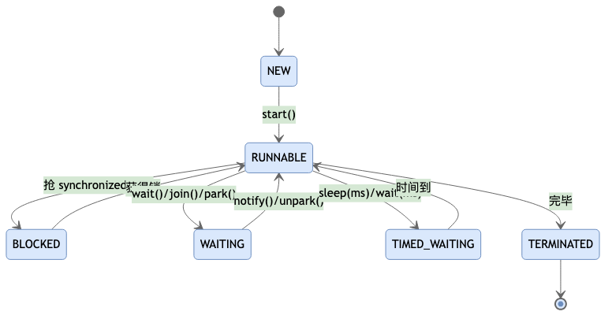

📌 **6 种状态详解（来自 `Thread.State` 枚举）**

- **NEW（新建）**：`new Thread()` 之后、`start()` 之前。此时还是一个 Java 对象，**还没向操作系统申请线程资源**。
- **RUNNABLE（可运行）**：调用 `start()` 之后。在 JVM 层面它"可运行"，但**是否真正在 CPU 上跑取决于操作系统调度**——它对应 OS 的「就绪」+「运行」两种状态，JVM 不区分。所以 `RUNNABLE` 不代表此刻一定在占用 CPU。
- **BLOCKED（阻塞）**：**专门等待进入 `synchronized` 代码块/方法而拿不到锁**时进入（在锁的 `EntryList` 里等）。注意：等 `ReentrantLock` 不算 BLOCKED，而是 WAITING/TIMED_WAITING（`LockSupport.park`）。
- **WAITING（无限等待）**：调用 `Object.wait()` / `Thread.join()` / `LockSupport.park()` 且**不带超时**时进入，需别的线程 `notify()` / `notifyAll()` / `unpark()` 才能唤醒，否则一直等。
- **TIMED_WAITING（限时等待）**：带超时的等待，如 `Thread.sleep(ms)` / `Object.wait(ms)` / `Thread.join(ms)` / `LockSupport.parkNanos/parkUntil`。时间到或被提前唤醒都会退出。
- **TERMINATED（终止）**：`run()` 正常结束或抛异常结束，线程彻底退出，**不可再 start()**（再次 start 抛 `IllegalThreadStateException`）。

💡 **扩展思考：**

> **Q1：RUNNABLE 和操作系统里的「运行态」是一回事吗？**  
> A：不是。JVM 把「就绪 + 正在运行」合并成 RUNNABLE，是否真的占用 CPU 由 OS 调度决定；调用 `Thread.getState()` 拿到 RUNNABLE 不代表它正在跑。
>
> **Q2：sleep() 和 wait() 都会让线程暂停，区别在哪？**  
> A：① **锁**：`sleep()` 不释放锁，`wait()` 会释放对象锁。② **所属类**：`sleep()` 是 `Thread` 静态方法，`wait()` 是 `Object` 方法、必须在 `synchronized` 块内调用。③ **唤醒**：`sleep()` 时间到自动醒，`wait()` 需 `notify()`/`notifyAll()`（或带超时）。④ **状态**：`sleep()` 进 TIMED_WAITING，`wait()` 进 WAITING（不带超时）。
>
> **Q3：BLOCKED 和 WAITING 有什么区别？**  
> A：BLOCKED 是**抢 synchronized 锁失败**在等（被动等锁）；WAITING 是**主动**调用 `wait()/join()/park()` 交出控制权在等（等别人唤醒）。二者都不再占用 CPU，但进入原因和唤醒方式不同；`jstack` 里也分属不同状态。
>
> **Q4：yield() 会改状态吗？**  
> A：`Thread.yield()` 只是**提示调度器**让出当前 CPU、把线程从「运行」放回「就绪」，状态仍是 RUNNABLE，不进入任何等待队列，也可能立刻又被调度回来。

## 3. 停止线程的方式

Java **没有安全的强制停止线程的 API**，正确做法是「通知线程自己停」，让它跑完手头逻辑、释放资源后自然退出。

🔍 **方式一：用 volatile 标志位（适合无阻塞的循环任务）**

```java
private volatile boolean running = true;

public void run() {
    while (running) {
        // 执行任务...
    }
    // 循环退出后做清理
}

public void shutdown() {
    running = false;  // 通知线程停止
}
```

- 用 `volatile` 保证一个线程改标志、另一个线程能立刻看到。
- **缺点**：如果线程正卡在 `sleep()`/`wait()`/阻塞 IO 上，改标志位它也感知不到，要等阻塞结束才检查。

🔍 **方式二：用 interrupt() 中断（推荐，能唤醒阻塞）**

```java
public void run() {
    while (!Thread.currentThread().isInterrupted()) {
        try {
            // 执行任务...
            Thread.sleep(1000);
        } catch (InterruptedException e) {
            // sleep/wait 被中断会抛异常，并清除中断标志
            Thread.currentThread().interrupt(); // 重新设回中断标志，让外层循环退出
            break;
        }
    }
    // 清理资源
}
// 外部调用 thread.interrupt(); 请求中断
```

- `interrupt()` 只是**设置中断标志**，不会强制杀死线程。
- 如果线程阻塞在 `sleep()`/`wait()`/`join()`，`interrupt()` 会让它抛出 `InterruptedException` 并**清除中断标志**——所以 catch 里通常要 `Thread.currentThread().interrupt()` 重新设回，让上层能感知到。
- `isInterrupted()` 查询标志（不清除）；静态 `Thread.interrupted()` 查询并清除标志。

⛔ **被废弃的方式：stop() / suspend() / resume()**

- `stop()`：强行终止线程，会**立即释放所有锁**，导致共享数据处于不一致状态（改一半就没了），已废弃。
- `suspend()`：挂起线程但**不释放锁**，极易死锁，已废弃。
- 一律不要使用，务必记住它们「不安全、已废弃」。

💡 **扩展思考：**

> **Q1：为什么 stop() 被废弃？**  
> A：`stop()` 会立刻终止线程并释放它持有的所有锁，此时如果线程正改到一半共享数据，就会留下**不一致的脏状态**，且其他线程还看不到，非常危险。所以要用「协作式中断」代替——让线程自己在安全点检查并退出。
>
> **Q2：interrupt()、isInterrupted()、interrupted() 三者区别？**  
> A：① `interrupt()`（实例方法）：给目标线程设置中断标志。② `isInterrupted()`（实例方法）：查询是否被中断，**不清除**标志。③ `Thread.interrupted()`（静态方法）：查询当前线程是否被中断，并**清除**标志。
>
> **Q3：线程在 sleep 时被 interrupt 会怎样？**  
> A：会立即抛出 `InterruptedException` 并**清除中断标志**。如果只 catch 不处理，中断信号就"丢了"，外层循环感知不到；规范做法是在 catch 里 `Thread.currentThread().interrupt()` 重新设回标志，或直接退出。
>
> **Q4：如何优雅关闭线程池？**  
> A：`shutdown()` 停止接收新任务、等已提交任务执行完（平缓关闭）；`shutdownNow()` 尝试 `interrupt` 所有工作线程并返回未执行的任务（强制关闭）。通常配合 `awaitTermination(timeout)` 等待收尾。

## 4. 线程的内存模型（JMM）

💡 **一句话**：JMM（Java Memory Model）是 JVM 规定的**多线程下变量如何读写**的抽象规范——它屏蔽了不同 CPU/操作系统内存架构的差异，定义了"什么时候一个线程对变量的修改，对另一个线程可见"，以及"哪些指令重排是允许的"。

🔍 **核心抽象：主内存 vs 工作内存**

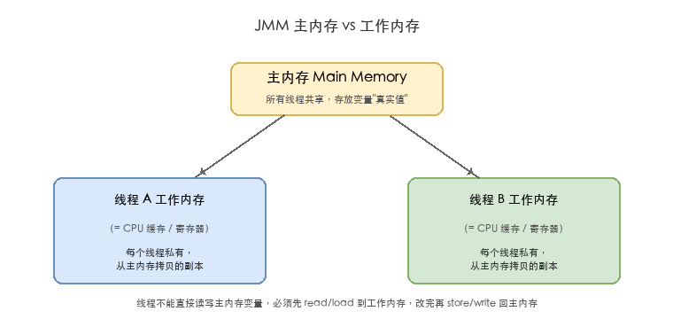

- 线程**不能直接**读写主内存变量，必须先 `read/load` 到自己的工作内存，改完再 `store/write` 回主内存。
- 工作内存对应\*\* CPU 缓存 / 寄存器\*\*（不是 JVM 的堆/栈区！）。所以 A 改了变量但没刷回主内存，或 B 一直读自己工作内存的旧拷贝，就出现**可见性问题**。

🔍 **八种原子操作（JMM 规定的变量访问动作）**

```text
lock   锁定   ：把变量标识为某线程独占（synchronized 进入）
unlock 解锁   ：释放独占
read   读取   ：主内存 → 工作内存（传输）
load   载入   ：把 read 来的值放入工作内存副本
use   使用   ：工作内存副本 → 执行引擎（计算）
assign 赋值   ：执行引擎结果 → 工作内存副本
store  存储   ：工作内存副本 → 主内存（传输）
write  写入   ：把 store 来的值写入主内存变量
```

- 变量从主内存到被计算，必须走 `read→load→use`；从计算写回必须走 `assign→store→write`。这八步是 JMM 保证可见性的**最小约束单元**。

🔍 **JMM 要解决的两个问题**

1. **可见性**：一个线程的修改何时对其他线程可见（如不加控制，A 改了 B 看不到）。
2. **有序性**：编译器和 CPU 为性能会**重排序**指令，单线程看不出问题，多线程下可能看到"乱序"结果（典型：DCL 单例拿到未构造完的对象）。

🔍 **happens-before（先行发生）规则 —— JMM 的有序性保证**  
JMM 用 "happens-before" 关系判定**哪些操作之间一定有可见、有序的保证**，常见规则：

```text
① 程序顺序规则：单线程内，前面的操作 hb 后面的操作。
② volatile 规则：volatile 写 hb 后续对该变量的读（第 7 节详述）。
③ 监视器锁规则：unlock 一个锁 hb 后续对同一个锁的 lock。
④ 线程启动规则：thread.start() hb 该线程的任何动作。
⑤ 线程终止规则：线程中所有动作 hb 其他线程检测到它结束（join 返回）。
⑥ 传递性：A hb B 且 B hb C ⇒ A hb C。
```

- **只要两个操作之间存在 happens-before 关系，JMM 就保证"前者对后者可见且有序"**；没有该关系的，JMM 不保证——这是理解所有并发可见性问题的总钥匙。

📌 **JMM 与 JVM 内存结构不是一回事**

- JMM 是**并发语义规范**（变量读写如何跨线程可见），抽象概念；
- JVM 内存结构（堆/栈/方法区）是**运行时数据区域划分**，物理概念。二者不混淆。

💡 **扩展思考：**

> **Q1：JMM 和 JVM 内存结构（堆/栈）是一回事吗？**  
> A：不是。JMM 是多线程变量读写的**语义规范**（主内存/工作内存是抽象），和堆/栈这种运行时数据区是不同维度；工作内存对应 CPU 缓存而非某个具体的 JVM 区域。
>
> **Q2：什么是 happens-before？为什么它重要？**  
> A：它是 JMM 判定"操作 A 的结果对操作 B 一定可见且有序"的规则集合。只要 A hb B，JMM 就保证可见与有序；否则不保证。synchronized 的锁规则、volatile 的读写规则本质上都是在建立 happens-before。
>
> **Q3：怎么解决可见性问题？**  
> A：三种常见手段：① `volatile`（强制刷主内存 + 越过工作内存）；② `synchronized`/锁（unlock 前把工作内存写回，lock 前从主内存重新加载）；③ 原子类（底层 volatile + CAS）。
>
> **Q4：为什么会有指令重排序？JMM 完全禁止吗？**  
> A：重排序是编译器/CPU 为了**吞吐量**做的优化，单线程语义不变。JMM **不禁止所有重排**，而是通过 happens-before 和内存屏障，在需要正确的地方"约束"重排——既保正确又留优化空间。

## 5. synchronized 与锁升级

🔍 **源码视角 · 对象头 Mark Word（64 位简化）**

```text
无锁    01 | hashCode | 分代年龄
偏向锁  01 | 线程ID | epoch
轻量级  00 | 指向栈中 Lock Record 的指针
重量级  10 | 指向 Monitor(ObjectMonitor) 指针
GC标记  11 | —
```

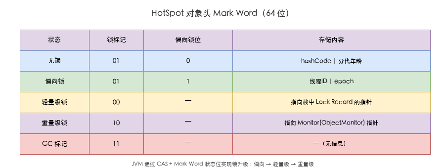

🔍 **源码解析 · Lock Record 与轻量级锁的完整流程**

**什么是 Lock Record？**  
当线程要进入 `synchronized` 块但对象尚未被锁（或偏向锁已撤销）时，JVM 在**当前线程的栈帧中**分配一块内存，称为 **Lock Record**。它包含两个关键字段：

```text
Lock Record 结构：
┌─────────────────────────────┐
│ _displaced_mark_word        │ ← 备份锁对象的原始 Mark Word
│ _owner (指向被锁对象)         │ ← 指向堆中的锁对象
└─────────────────────────────┘
```

**轻量级锁的加锁过程（CAS 竞争）：**

```text
1. 在线程栈中创建 Lock Record，将锁对象的 Mark Word 复制到 _displaced_mark_word
2. 通过 CAS 尝试将锁对象的 Mark Word 替换为指向 Lock Record 的指针
   ┌──────────────────┐         ┌──────────────────────┐
   │ 锁对象 (堆)       │  CAS    │ 线程栈帧 Lock Record  │
   │ Mark Word:       │ ◄────── │ displaced_mark_word   │
   │ 0x00000001 (无锁) │  替换为  │ owner → 锁对象         │
   └──────────────────┘         └──────────────────────┘
3. CAS 成功 → 拿到锁，对象 Mark Word 变为 00（轻量级），存储 Lock Record 指针
4. CAS 失败 → 自旋重试（自适应自旋）；自旋超限 → 升级重量级锁
```

**轻量级锁的解锁过程：**

```text
1. 从 Lock Record 取出 displaced_mark_word（锁前的原始 Mark Word）
2. 通过 CAS 尝试将锁对象的 Mark Word 替换回 displaced_mark_word
3. CAS 成功 → 解锁完成，对象回到无锁状态
4. CAS 失败 → 说明锁已膨胀为重量级（有其他线程在等待），走重量级解锁流程
     （ObjectMonitor.exit → 唤醒 EntryList 中的等待线程）
```

**为什么设计在栈上？**

- Lock Record 随方法调用自动创建、随栈帧弹出自动销毁，无需 GC 管理，零堆内存开销。
- 每个进入同步块的线程都有自己独立的 Lock Record，天然线程隔离。
- `_displaced_mark_word` 保存了锁之前的状态，解锁时靠它复原——如果中间发生了锁膨胀（其他线程竞争导致升级），解锁时会检测到对象 Mark Word 已不指向当前 Lock Record（被改成了 ObjectMonitor 指针），从而走重量级释放流程。

🔍 **重量级锁的实现原理 · ObjectMonitor**  
轻量级锁 CAS 竞争失败、或竞争激烈时，锁\*\*膨胀（inflate）\*\*为重量级锁：对象的 Mark Word 改为指向 JVM 内部的 **`ObjectMonitor`**（C++ 对象，位于堆外/元空间，不是 Java 对象）。它是重量级锁的"控制中枢"。

**ObjectMonitor 关键字段（HotSpot 源码简化）**

```text
ObjectMonitor {
    _owner        → 当前持有锁的线程（NULL 表示无人持有）
    _recursions   → 锁重入次数（同一线程多次进入 synchronized 累加）
    _EntryList    → 阻塞等待"抢锁"的线程队列（Ready 状态，没拿到锁）
    _cxq (Contention Queue) → 刚竞争失败、还未入 EntryList 的线程栈
    _WaitSet      → 调用 wait() 后挂起的线程集合（已释放锁、在等通知）
}
```

**重量级锁加锁过程（线程 T 进入 synchronized）**

```text
1. 尝试 CAS 把 _owner 设为 T：
   - 成功 → 拿到锁，_recursions 记为 1（支持重入）。
2. 失败（_owner 是别的线程）：
   - 线程进入 _cxq 自旋稍等；仍拿不到 → 封装成 WaitNode 挂入 _EntryList。
   - 调用操作系统原语（pthread_mutex / park）将线程**挂起**，
     从 RUNNABLE 变成 BLOCKED，退出 CPU（发生**用户态 → 内核态**切换）。
   - 直到被唤醒后重新 CAS 抢 _owner。
```

**重量级锁解锁过程（线程 T 退出 synchronized）**

```text
1. _recursions 减 1；若仍 > 0 → 只是退一层重入，锁不释放。
2. 减到 0 → 清空 _owner（置 NULL），释放锁。
3. 从 _EntryList（优先）或 _cxq 中唤醒一个等待线程：
   - 被唤醒线程重新 CAS 抢 _owner，抢到才从 BLOCKED 变 RUNNABLE 继续。
   - （wait 的线程在 _WaitSet，需被 notify 后才能移回 _EntryList 参与抢锁，
      见第 6 节 wait/notify）
```

**为什么重量级锁慢？**

- 拿不到锁的线程会被**操作系统挂起（park）**，涉及用户态↔内核态切换、线程上下文保存/恢复，开销远大于 CAS 自旋。
- 唤醒后又是一轮内核调度。因此只有在"竞争激烈且持锁时间长"时才划算——这正是 JVM 先尝试偏向锁/轻量级锁、失败才膨胀到重量级的设计动机。

💡 **扩展思考：**

> **Q：偏向锁解决什么？**  
> A：单线程访问时免 CAS，近乎零开销。
>
> **Q：轻量级锁为什么自旋？**  
> A：假设持锁时间短，自旋（忙等）比挂起（内核态切换）划算；失败才升级重量级。
>
> **Q：锁为什么只升不降？**  
> A：降级开销 > 收益，JVM 设计为只升不降避免抖动。
>
> **Q：偏向锁一定好吗？**  
> A：JDK 15 起默认**禁用偏向锁**（`-XX:-UseBiasedLocking`），多线程竞争激烈时撤销开销反而弊大于利。

📊 **锁升级流程**

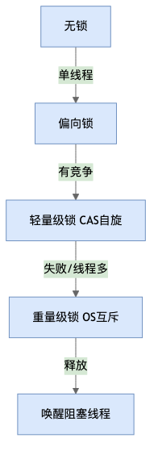

## 6. wait / notify（线程间通信基础）

💡 **一句话**：`wait()` / `notify()` / `notifyAll()` 是 `Object` 类的方法，与 **synchronized 监视器锁**深度绑定——线程必须先持有对象锁，才能在该对象上调用这些方法。

🔍 **源码解析 · 必须配合 synchronized**

```java
// wait/notify 的 native 实现依赖底层监视器（ObjectMonitor）
// ObjectMonitor 结构（hotspot 源码）：
//   _owner        → 当前持有锁的线程
//   _WaitSet      → 调了 wait() 的线程集合
//   _EntryList    → 等待抢锁的线程队列
```

🔍 **源码解析 · 基本模式**

```java
synchronized (lock) {           // 1. 必须先拿到锁
    while (conditionNotMet) {   // 2. while 而非 if（防虚假唤醒）
        lock.wait();            // 3. 释放锁 + 挂起当前线程
    }                           // 4. 被 notify 唤醒后，重新抢锁
    // 执行业务逻辑              5. 抢到锁后继续执行
}
```

- `wait()`：当前线程**释放 lock 的监视器所有权**，进入 `_WaitSet` 休眠。
- `notify()`：从 `_WaitSet` 中随机唤醒一个线程，该线程不会立刻执行——先移入 `_EntryList`，重新竞争锁。
- `notifyAll()`：唤醒 `_WaitSet` 中所有线程，全部移入 `_EntryList`。

🔍 **源码解析 · 虚假唤醒（spurious wakeup）**

```java
// Java 对象监视器可能因底层 OS 信号被意外唤醒，即使没有 notify() 调用
// 因此 wait() 必须在 while 循环中检查条件，而非 if：
synchronized (lock) {
    if (queue.isEmpty()) lock.wait();  // ❌ 虚假唤醒后不会重新检查条件
    while (queue.isEmpty()) lock.wait(); // ✓ 始终在醒来后确认条件成立
}
```

- 《Effective Java》和 JDK 官方文档均明确要求用 `while`，避免仅用 `if`。

💡 **扩展思考：**

> **Q：wait 和 sleep 的区别？**  
> A：① `wait()` 是 Object 方法，必须在 synchronized 内调用，调用后**释放锁**；② `sleep()` 是 Thread 静态方法，可在任意位置调用，**不释放锁**；③ `wait()` 需要 `notify()` 唤醒，`sleep()` 到时间自动唤醒；④ `wait()` 和 `sleep()` 均让出 CPU、均响应 `InterruptedException`。
>
> **Q：notify 和 notifyAll 什么时候选哪个？**  
> A：所有等待线程在**同一个条件队列**上且唤醒逻辑相同 → `notify()` 即可（减少上下文切换）。**多个条件共享同一条件队列**（如不同意义的等待共用同一个锁对象） → 必须 `notifyAll()`，否则可能唤醒错误线程导致死锁。保守策略：不确定时一律用 `notifyAll()`。
>
> **Q：为什么 wait/notify 设计在 Object 而非 Thread 上？**  
> A：Java 的锁基于对象监视器（任意对象都可做锁），wait/notify 操作的是**锁对象对应的条件队列**，而非线程本身。设计在 Object 上允许任意对象成为协调器，灵活度高。
>
> **Q：wait/notify 和 Lock.newCondition() 对比？**  
> A：`Condition` 是 wait/notify 的升级版：① 一个 Lock 可以创建多个 Condition（支持多条件队列），而 `synchronized` 只有一个隐式条件队列；② `await()` / `signal()` 语义更清晰；③ 支持可中断、超时等灵活变体。**JUC 下优先用 Condition**。

📊 **生产者-消费者（wait/notify 经典演示）**

```java
class BoundedQueue<T> {
    private final LinkedList<T> queue = new LinkedList<>();
    private final int capacity;

    public synchronized void put(T item) throws InterruptedException {
        while (queue.size() == capacity) wait();   // 队列满，等待消费者拿走
        queue.add(item);
        notifyAll();                                 // 通知消费者
    }

    public synchronized T take() throws InterruptedException {
        while (queue.isEmpty()) wait();             // 队列空，等待生产者放入
        T item = queue.removeFirst();
        notifyAll();                                 // 通知生产者
        return item;
    }
}
```

- **关键细节**：`put` 和 `take` 共用同一把锁（`synchronized` 方法），条件队列唯一 → 用 `notifyAll()` 防止唤醒同类线程导致死等。

📊 **wait/notify 线程状态转换**

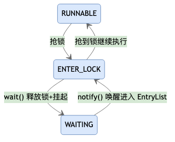

## 7. volatile 与 JMM

💡 **一句话**：`volatile` 是 JVM 提供的最轻量同步机制，只保证两件事：**可见性** 和 **有序性（禁止特定重排序）**，但**不保证原子性**。

🔍 **作用一：可见性——一个线程改了，别的线程立刻能看到**  
每个线程有自己的工作内存（对应 CPU 缓存），普通变量改了不一定立刻刷回主内存，别的线程可能一直读旧值。`volatile` 变量的写会**立刻刷回主内存**，读会**强制从主内存重新加载**，相当于跳过了线程私有缓存。

```java
// 典型场景：用 volatile 做"停止标志"（配合第 3 节）
private volatile boolean running = true;
// 线程 A 改 running=false 后，线程 B 下次循环立刻能看到，从而退出
```

🔍 **作用二：有序性——禁止编译器和 CPU 的重排序**  
编译器和 CPU 为了性能会重排指令（只要单线程结果不变），但在多线程下可能导致其他线程看到"半成品"。`volatile` 通过在读写前后插入内存屏障，禁止它**之前/之后的指令跨越它重排**（典型用例：第 13 节 DCL 单例，防 `new` 的构造与赋值被重排）。

📌 **两个不保证**

- **不保证原子性**：`i++` 是读-改-写三步，volatile 只让"读"和"写"各自可见，但不阻止两个线程同时读到同一个旧值再各自写回（竞态）。需要原子性用 `AtomicInteger` 或锁。
- **不保证互斥**：多个线程仍可同时进入 volatile 变量的读写区域，它不提供"同一时刻只有一个线程"的排他性。

🔍 **原理 · JMM 与 happens-before**  
Java 内存模型（JMM）定义了线程如何通过主内存交换变量。volatile 的语义建立在 **happens-before（先行发生）** 规则上：

- **可见性本质**：对一个 volatile 变量的**写 happens-before 后续对该变量的读**。JMM 规定写操作必须把工作内存中的新值**强制刷新到主内存**，读操作必须**从主内存重新加载**，从而跨线程可见。
- **有序性本质**：volatile 写之前的任意操作，happens-before 于后续对该变量的读之后的任意操作——即写线程在 volatile 写之前做的所有改动，对读线程在 volatile 读之后都是可见且有序的（这叫"内存语义的传递"）。

🔍 **源码视角 · 内存屏障**  
底层靠在读写前后插入屏障指令实现上面的语义：

```text
volatile 写后插入 StoreStore + StoreLoad 屏障
volatile 读前插入 LoadLoad + LoadStore 屏障
x86 上 StoreLoad 用 lock 前缀指令（如 lock addl）实现
```

- 写屏障（StoreStore/StoreLoad）保证"前面的修改"在 volatile 写刷回主内存前已全部完成、且对其他 CPU 可见；
- 读屏障（LoadLoad/LoadStore）保证"后面的读"不会提前到 volatile 读之前、且强制从主内存取最新值。

💡 **扩展思考：**

> **Q：volatile 为什么不能保证 i++ 原子？**  
> A：i++ 是读-改-写三步，volatile 只保可见性，不保三步不被打断。
>
> **Q：volatile 能替代锁吗？**  
> A：仅当写不依赖当前值（如状态标志位）可用；否则用原子类/锁。
>
> **Q：DCL 单例为什么必须 volatile？**  
> A：防 `instance = new Singleton()` 指令重排导致拿到未初始化对象。
>
> **Q：volatile 是怎么在底层实现"可见"的？**  
> A：JVM 在 volatile 写后插入带 `lock` 前缀的指令（x86 上的 StoreLoad 屏障），该指令会**把当前 CPU 写缓冲/缓存行立刻刷回主内存**，并让其他 CPU 对应的**缓存行失效**（借助 MESI 等缓存一致性协议），下次别的线程读就必须从主内存取最新值——这就是可见性的硬件落点。

📊 **JMM happens-before**


## 8. CAS 与原子类

🔍 **源码解析 · AtomicInteger.getAndIncrement**

```java
public final int getAndIncrement() {
    return U.getAndAddInt(this, VALUE, 1);   // U = Unsafe
}
// Unsafe.getAndAddInt: do { v = getIntVolatile; } while (!CAS(offset, v, v+1));
```

CAS 失败自旋重试。

💡 **追问：ABA 如何解决？** 用 `AtomicStampedReference`（版本号）或 `AtomicMarkableReference`（标记位）。

## 9. 线程池

🔍 **源码解析 · ThreadPoolExecutor 构造器七参数**

```java
public ThreadPoolExecutor(
    int corePoolSize,                   // 核心线程数：常驻，默认不回收
    int maximumPoolSize,                // 最大线程数：核心 + 非核心上限
    long keepAliveTime,                 // 空闲线程存活时间（对超出核心的线程）
    TimeUnit unit,                      // 时间单位
    BlockingQueue<Runnable> workQueue,  // 任务队列（必须选有界队列！）
    ThreadFactory threadFactory,        // 线程工厂（命名 / 守护线程）
    RejectedExecutionHandler handler)   // 拒绝策略
```

> 线程池用一个原子整型 `ctl` 同时编码**运行状态（高 3 位）+ 工作线程数（低 29 位）**，状态变迁见下方状态机图。

💡 **扩展思考：**

> **Q：为什么不用 Executors？**  
> A：newFixedThreadPool / newSingleThreadExecutor 用**无界队列**会堆积 OOM；newCachedThreadPool **最大线程数 Integer.MAX_VALUE** 易耗尽资源。必须 `new ThreadPoolExecutor(...)` 显式指定有界队列与拒绝策略。
>
> **Q：七参数各自作用？**  
> A：corePoolSize 常驻核心线程；maximumPoolSize 线程总数上限；keepAliveTime 空闲非核心线程回收时间；unit 单位；workQueue 任务缓冲（选有界）；threadFactory 建线程（建议命名）；handler 拒绝策略。
>
> **Q：核心线程会回收吗？keepAliveTime 作用于谁？**  
> A：默认核心线程不回收；`allowCoreThreadTimeOut(true)` 可让核心线程也超时回收。keepAliveTime 默认只对**超出 corePoolSize 的线程**生效。
>
> **Q：submit 和 execute 区别？**  
> A：execute 只接 Runnable，异常直接抛到线程的未捕获异常处理器；submit 返 Future，异常封装其中，不 get 不抛。
>
> **Q：线程池里的线程执行任务抛异常会怎样？**  
> A：异常被捕获并交给 `afterExecute`；该 worker 线程会退出，线程池自动新建一个线程补充（线程数恢复），**任务不会自动重试**。关键任务务必在 Runnable 内部 try-catch，或重写 `afterExecute` 统一处理。
>
> **Q：核心线程数怎么设置合理？**  
> A：CPU 密集型 ≈ `Ncpu + 1`；IO 密集型 ≈ `Ncpu × 2`（或 `Ncpu / (1 - 阻塞系数)`）；也可按 `Ncpu × (1 + 平均等待/平均计算)` 估算，最终靠压测调优。`Ncpu = Runtime.getRuntime().availableProcessors()`。
>
> **Q：shutdown 和 shutdownNow 区别？**  
> A：shutdown() **平缓**——拒绝新任务，把队列中已有任务处理完再退出；shutdownNow() **激进**——尝试 interrupt 所有 worker、不再处理队列，返回未执行的任务列表。生产应配合 `awaitTermination` 优雅等待。
>
> **Q：为什么用阻塞队列而不用普通队列？**  
> A：无任务时工作线程 `queue.take()` 会**挂起释放 CPU**，有任务被唤醒；普通 Queue 需自旋轮询空耗 CPU。阻塞队列天然实现"生产-消费等待/通知"解耦。
>
> **Q：为什么建议自定义 ThreadFactory？**  
> A：给线程设置有意义名字（如 `order-pool-%d`）便于排查堆栈与监控；可统一设为非守护线程（守护线程会随 JVM 退出而丢任务）；可设置未捕获异常处理器。
>
> **Q：拒绝策略哪个最安全？**  
> A：CallerRuns（调用者线程自己跑，负反馈限流，最温和推荐）；其余 Abort（抛异常）/ Discard（静默丢弃）/ DiscardOldest（丢最老）。
>
> **Q：怎么预热核心线程 / 监控线程池？**  
> A：prestartCoreThread()/prestartAllCoreThreads() 提前建好核心线程避免首批延迟；监控可重写 beforeExecute/afterExecute/terminated 埋点，或读 getActiveCount、getQueue().size()、getCompletedTaskCount，接 JMX/Prometheus。

📊 **线程池执行流程**

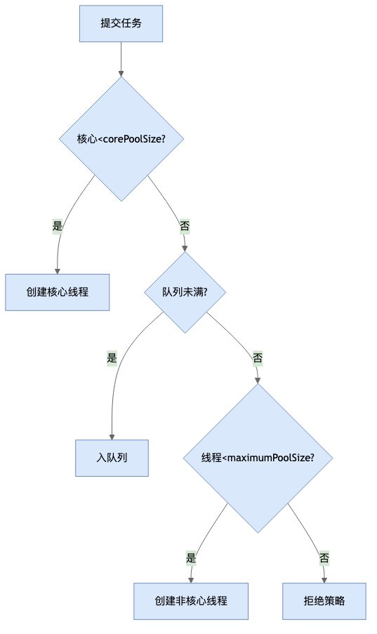

📊 **线程池状态机（ctl 高 3 位）**

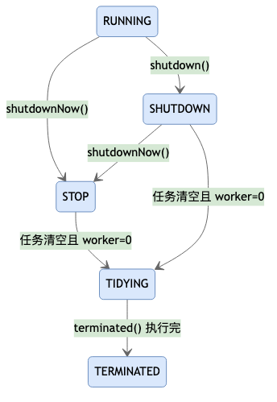

> RUNNING 收新任务且处理队列；SHUTDOWN 不收新任务但处理队列；STOP 不收不处理且中断进行中任务；TIDYING 全终止、worker=0；TERMINATED 钩子执行完毕。

## 10. 锁的种类

Java 里的"锁"可以从多个维度分类，通常按**实现方式**和**特性**两条线来梳理。

🔍 **一、按实现方式（最常见分类）**

```text
① synchronized（内置锁 / 监视器锁）
   - JVM 层面实现，自动加锁解锁（无需手动释放）
   - 支持锁升级：偏向 → 轻量级 → 重量级（见第 5 节）
   - 可重入、非公平

② ReentrantLock（显示锁，基于 AQS，见第 11 节）
   - API 层面，需 lock()/unlock()（推荐放 finally 释放）
   - 支持：可中断 lockInterruptibly、超时 tryLock、公平/非公平可选、多条件 Condition
   - 可重入

③ ReentrantReadWriteLock（读写锁，基于 AQS）
   - 把锁拆成「读锁（共享）」+「写锁（排他）」
   - 读读不互斥、读写/写写互斥 → 读多写少场景吞吐量高

④ StampedLock（JDK 8，基于 AQS 思想但更轻）
   - 三种模式：写锁、读锁、乐观读（tryOptimisticRead）
   - 乐观读不阻塞写，读时先拿戳、用前 validate 戳，失败再升级为读锁
   - 不可重入，适合"读极多、写极少且读操作短"的场景

⑤ 协调/工具锁（基于 AQS）
   - CountDownLatch：倒计数，等一组事件完成
   - CyclicBarrier：循环栅栏，等一组线程到齐
   - Semaphore：信号量，控制同时访问的线程数
```

🔍 **二、按特性维度**

```text
· 悲观锁 vs 乐观锁
  悲观：认为一定会冲突，先加锁再操作（synchronized、ReentrantLock、数据库 select for update）
  乐观：认为大概率不冲突，先操作、提交时 CAS 校验（原子类、数据库版本号）

· 公平锁 vs 非公平锁
  公平：按申请顺序发锁（FIFO），避免饥饿但吞吐低
  非公平：允许插队，吞吐高但可能饥饿（synchronized 只能非公平；ReentrantLock 二者皆可）

· 可重入锁 vs 不可重入锁
  可重入：同一线程可重复获取同一把锁（synchronized、ReentrantLock、StampedLock 的写锁不可重入）
  不可重入：未释放就再获取会死锁自己

· 独占锁（排他） vs 共享锁
  独占：一次只有一个线程持有（写锁、synchronized）
  共享：可多个线程同时持有（读锁、Semaphore）

· 自旋锁 vs 阻塞锁
  自旋：拿不到锁时忙等（轻量级锁 CAS 自旋），适合持锁极短
  阻塞：拿不到锁时挂起（重量级锁 park），适合持锁较长
```

📊 **常用锁对比**

| 锁                      | 实现层    | 是否可重入 | 公平可选    | 读共享    | 典型场景          |
| ---------------------- | ------ | ----- | ------- | ------ | ------------- |
| synchronized           | JVM    | 是     | 否（仅非公平） | 否      | 通用同步、简单临界区    |
| ReentrantLock          | AQS    | 是     | 是       | 否      | 需中断/超时/公平/多条件 |
| ReentrantReadWriteLock | AQS    | 是     | 是       | 是（读）   | 读多写少          |
| StampedLock            | AQS 思想 | 否     | 否       | 是（乐观读） | 读极多写极少        |
| 原子类(CAS)               | Unsafe | —     | —       | —      | 单个变量无锁更新      |

💡 **扩展思考：**

> **Q1：synchronized 和 ReentrantLock 怎么选？**  
> A：简单同步用 `synchronized`（自动释放、写法简单、JVM 持续优化）；需要\*\*中断等待、超时获取、公平锁、多个等待条件（Condition）\*\*时用 `ReentrantLock`。两者性能差距在 JDK 6 锁升级后已很小。
>
> **Q2：为什么有读写锁？它解决什么问题？**  
> A：普通排他锁下"读读"也互斥，浪费并发。`ReentrantReadWriteLock` 让**读读并发、只有涉及写才互斥**，显著提升读多写少场景（如缓存、配置中心）的吞吐量。
>
> **Q3：StampedLock 的乐观读是什么？**  
> A：乐观读不真正加读锁、不阻塞写线程，而是读前取一个"戳"（stamp），用数据前 `validate(stamp)` 校验期间是否被写过；没被写就直接用（无锁、最快），被写过再退化为常规读锁。代价是**不可重入、用错易出 bug**，要谨慎。
>
> **Q4：公平锁一定更好吗？**  
> A：不是。公平锁保证 FIFO、避免饥饿，但每次都要排队、线程切换多、**吞吐量低于非公平锁**。默认都选非公平，除非确实要杜绝饥饿。

## 11. AQS 核心

🔍 **源码视角 · acquire/release 骨架**

```java
public final void acquire(int arg) {
    if (!tryAcquire(arg)) {          // 子类 CAS 抢 state
        addWaiter(Node.EXCLUSIVE);   // 入队尾
        acquireQueued(node, arg);    // 自旋 / park
    }
}
public final boolean release(int arg) {
    if (tryRelease(arg)) { unparkSuccessor(head); return true; }
    return false;
}
```

核心：`volatile int state` + FIFO 队列 + CAS + LockSupport.park/unpark。

💡 **追问：ReentrantLock 公平 vs 非公平？** 非公平直接抢（可能插队）；公平先判队列有前驱则排队。非公平吞吐更高，默认非公平。

📊 **AQS 队列**

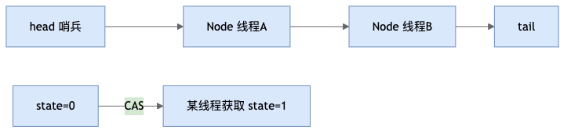

## 12. ThreadLocal 原理与内存泄漏

🔍 **源码视角 · 存储结构**

```java
// Thread 类内部
ThreadLocal.ThreadLocalMap threadLocals = null;   // 每个线程一份
// ThreadLocalMap 内部
static class Entry extends WeakReference<ThreadLocal<?>> {
    Object value;                          // 强引用 value
    Entry(ThreadLocal<?> k, Object v) { super(k); value = v; }
}
Entry[] table;                             // 桶数组，开放寻址
```

> 关键点：**是 `Thread` 持有 `ThreadLocalMap`，而不是 `Threa dLocal` 持有 Map**。每个线程各有一份 Map，所以各线程互不干扰——这正是"线程隔离"的本质。

📊 **ThreadLocal 存储结构**

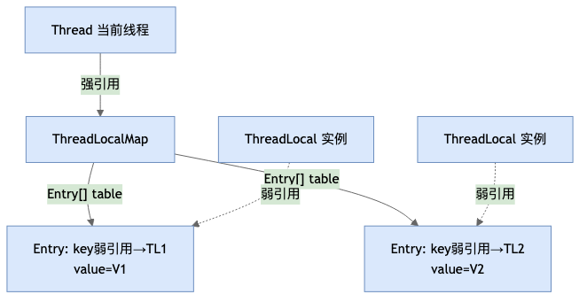

🔍 **源码视角 · set 流程**

```java
public void set(T value) {
    Thread t = Thread.currentThread();
    ThreadLocalMap map = getMap(t);
    if (map != null) map.set(this, value);
    else createMap(t, value);
}
// ThreadLocalMap.set：线性探测开放寻址
int i = key.threadLocalHashCode & (len - 1);     // 计算桶下标
for (Entry e = table[i]; e != null; e = table[i = nextIndex(i, len)]) {
    if (e.get() == key) { e.value = value; return; }      // 命中：替换
    if (e.get() == null) { replaceStaleEntry(key, value, i); return; } // 顺手清过期
    // 否则继续往后探测下一个桶
}
```

> 哈希冲突用\*\*开放寻址（线性探测）\*\*解决，而非 HashMap 的链表/红黑树。

🔍 **源码视角 · 斐波那契哈希（threadLocalHashCode）**

```java
private final int threadLocalHashCode = nextHashCode();
private static final int HASH_INCREMENT = 0x61c88647;   // 黄金分割数
private static int nextHashCode() {
    return nextHashCode.getAndAdd(HASH_INCREMENT);       // 每次 + 0x61c88647
}
```

> 每 new 一个 ThreadLocal，哈希值累加 `0x61c88647`，使多个 ThreadLocal 在 2 的幂长度数组上**均匀分布、冲突极少**。

🔍 **源码视角 · get 流程**

```java
public T get() {
    Thread t = Thread.currentThread();
    ThreadLocalMap map = getMap(t);
    if (map != null) {
        Entry e = map.getEntry(this);     // 命中直接返回
        if (e != null) return (T) e.value;
    }
    return setInitialValue();             // 未命中则按 initialValue 初始化
}
```

🔍 **源码视角 · Entry 的 key 是弱引用**

```java
static class Entry extends WeakReference<ThreadLocal<?>> {  // key 继承 WeakReference
    Object value;            // 强引用 value
    Entry(ThreadLocal<?> k, Object v) { super(k); value = v; }
}
```

key 弱引用，value 强引用；ThreadLocal 外部置 null 后 key 被 GC，value 仍强引用无法回收 → 线程池长生命周期线程泄漏。

💡 **扩展思考：**

> **Q：ThreadLocal 是什么，解决什么问题？**  
> A：提供线程隔离的变量副本，避免同个变量在多线程间共享；也避免把参数一层层往下传（如用户登录信息、DB 连接、SimpleDateFormat 线程安全复用）。
>
> **Q：底层数据结构是什么？谁持有 Map？**  
> A：每个 `Thread` 内部持有 `ThreadLocalMap`（数组+开放寻址）；是线程持有 Map，不是 ThreadLocal 持有，所以各线程互不可见。
>
> **Q：为什么 key 用弱引用？**  
> A：若用强引用，ThreadLocal 外部置 null 后 Map 仍强引用它，ThreadLocal 对象永远无法被 GC；弱引用保证 key 可被回收，仅留 value 待清理。
>
> **Q：弱引用 key 为何还会内存泄漏？**  
> A：value 仍是强引用，且线程池线程长期存活、Map 不被回收，value 就一直占着内存。必须用完 `remove()` 主动清 key+value。
>
> **Q：如何避免泄漏？**  
> A：用完必 `remove()`：
>
> ```java
> try { tl.set(data); ... } finally { tl.remove(); }
> ```
>
> **Q：哈希冲突怎么解决？和 HashMap 一样吗？**  
> A：不一样。ThreadLocalMap 用**开放寻址（线性探测）**，HashMap 用链表/红黑树；因为 ThreadLocal 数量通常很少，开放寻址更省内存、缓存更友好。
>
> **Q：InheritableThreadLocal 是什么？**  
> A：子线程创建时会**拷贝父线程**的 inheritableThreadLocals，从而继承父线程的值；但**线程池复用线程**时不会重新拷贝，父线程值不会自动传给池里复用的线程，存在"串数据"隐患，需配合 `TransmittableThreadLocal`（阿里）解决。

📊 **ThreadLocal 泄漏链**

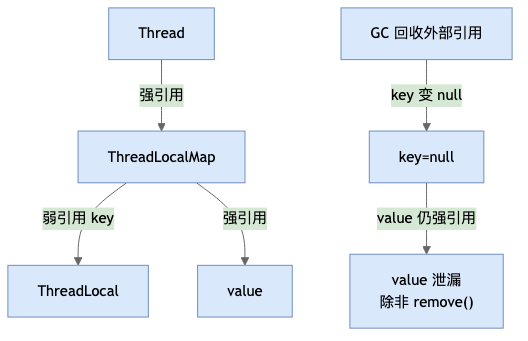

### 实战示例

**① 用户信息上下文（Web 拦截器传递登录用户，避免层层传参）**

```java
public class UserContext {
    private static final ThreadLocal<User> TL = new ThreadLocal<>();
    public static void set(User u) { TL.set(u); }
    public static User get() { return TL.get(); }
    public static void clear() { TL.remove(); }     // 必须提供 clear
}

// 拦截器：请求开始写入，结束清理
public boolean preHandle(req, res, handler) {
    UserContext.set(getUserFromToken(req));
    return true;
}
public void afterCompletion(req, res, handler, ex) {
    UserContext.clear();   // ★ 防线程池复用串号 / 泄漏
}
```

**② SimpleDateFormat 线程安全复用（避免每次 new、规避多线程 format 互相污染）**

```java
private static final ThreadLocal<SimpleDateFormat> SDF =
        ThreadLocal.withInitial(() -> new SimpleDateFormat("yyyy-MM-dd"));
String format(Date d) { return SDF.get().format(d); }   // 每个线程独享一份
```

**③ 全链路 traceId（一次请求跨方法/跨服务串联日志）**

```java
private static final ThreadLocal<String> TRACE = new ThreadLocal<>();
void startTrace() { TRACE.set(UUID.randomUUID().toString()); }
String traceId()  { return TRACE.get(); }
// 配合日志框架更优雅：MDC.put("traceId", id); ... finally { MDC.remove(); }
```

> ⚠️ **通用铁律**：凡在 Web / 线程池环境使用 ThreadLocal，务必在 `finally` 中 `remove()`——否则线程复用会**串数据**（A 用户的请求读到 B 用户上下文），长生命周期线程会**内存泄漏**。

## 13. 单例模式的 5 种写法（线程安全角度）

💡 **一句话**：单例（Singleton）确保一个类在 JVM 中**只有一个实例**，并提供全局访问点。

🔍 **源码解析 · 饿汉式（线程安全，可能浪费内存）**

```java
public class Singleton {
    private static final Singleton INSTANCE = new Singleton();  // 类加载即创建
    private Singleton() {}                                       // 私有构造防外部 new
    public static Singleton getInstance() { return INSTANCE; }
}
```
- 优点：简单、无线程安全问题、调用效率高。
- 缺点：类加载即初始化，若单例占用大且不常用则浪费内存。

🔍 **源码解析 · DCL 双重检查锁（懒加载 + 线程安全，经典必问）**
```java
public class Singleton {
    private static volatile Singleton INSTANCE;  // volatile 防指令重排
    private Singleton() {}
    public static Singleton getInstance() {
        if (INSTANCE == null) {                  // 第一重检查：无锁快路径
            synchronized (Singleton.class) {
                if (INSTANCE == null) {          // 第二重检查：锁内防并发重复创建
                    INSTANCE = new Singleton();
                }
            }
        }
        return INSTANCE;
    }
}
```
- **volatile 为什么必须？** `new Singleton()` 非原子操作：①分配内存 ②初始化对象 ③引用指向内存。JIT 可能重排为 ①→③→②，另一线程在 ③ 后读到非 null 但尚未初始化的对象（返回"半成品"）。`volatile` 禁止指令重排序。
- Java 5+ volatile 语义增强后才可靠；JDK 1.4 及之前需用同步块内临时变量。

🔍 **源码解析 · 静态内部类（懒加载 + 线程安全，推荐）**
```java
public class Singleton {
    private Singleton() {}
    private static class Holder {
        private static final Singleton INSTANCE = new Singleton();  // 首次访问 Holder 时才初始化
    }
    public static Singleton getInstance() {
        return Holder.INSTANCE;
    }
}
```
- **原理**：JVM 保证类加载 `<clinit>` 线程安全且延迟执行——`new Singleton()` 并非在外层类加载时触发，而是**首次调用 `getInstance()` 导致 JVM 加载 `Holder` 类时才初始化**，天然懒加载 + 无锁。

🔍 **源码解析 · 枚举单例（防反射 / 防反序列化，最安全）**
```java
public enum Singleton {
    INSTANCE;
    public void doSomething() { /* ... */ }
}
// 调用：Singleton.INSTANCE.doSomething()
```
- 枚举实例在 JVM 层面保证唯一（只有一份），且：
  - 反序列化不会创建新实例（`ObjectInputStream` 对枚举特殊处理，`readEnum` 按 name 取现成枚举值）
  - 反射无法突破——`Constructor.newInstance` 检测到枚举类型直接抛 `IllegalArgumentException("Cannot reflectively create enum objects")`

💡 **扩展思考：**
> **Q：5 种写法的对比？**
> A：饿汉式（简单/浪费）、懒汉式 `synchronized` 方法级（安全但每次加锁慢）、DCL（折中/volatile 是灵魂）、静态内部类（懒加载+无锁，生产最常用）、枚举（自带防反射/反序列化，权威推荐《Effective Java》）。
>
> **Q：反序列化怎么破坏单例？如何防御？**
> A：`ObjectInputStream.readObject()` 每次反序列化都**调用构造方法**创建新对象（绕过 `private` 构造）。防御：类中添加 `private Object readResolve() { return INSTANCE; }`——`readObject` 末尾通过反射调用 `readResolve`，用该方法返回值替换新对象。枚举天然免疫反序列化破坏。
>
> **Q：反射怎么破坏单例？如何防御？**
> A：`Constructor.setAccessible(true)` 获取私有构造器再 `newInstance`。防御：① 构造器中加 flag 判断，第二次调用抛异常；② 枚举——JDK 源码 `Constructor.newInstance` 中对枚举类型**硬编码禁止反射创建**，最可靠。
>
> **Q：Spring 的 `@Scope("singleton")` 是单例吗？**
> A：是容器级单例（每个 Bean 在 IoC 内一份），不等于 JVM 全局单例——同一个类可以被加载为两个不同 name 的 Bean，也可以被不同 ApplicationContext 各自创建一份。

📊 **5 种单例路线图**
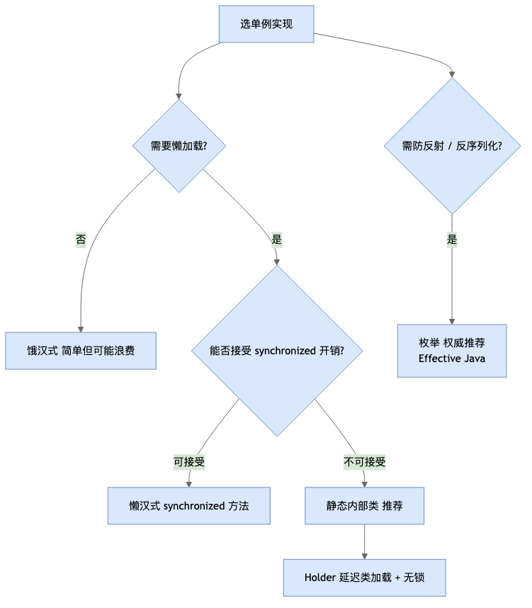

## 14. CompletableFuture（异步编排）

💡 **一句话**：`CompletableFuture` 是 JDK 8 引入的**可组合异步编程**工具——既是 `Future`（可拿结果）又是 `CompletionStage`（可编排链式回调），解决了传统 `Future.get()` **只能阻塞等待、无法链式串联多个异步任务**的痛点。

🔍 **源码解析 · 与 Future 的本质区别**

```java
// 传统 Future：只能阻塞等待，拿到结果前无法做任何"下一步"编排
Future<Integer> f = executor.submit(() -> 1 + 1);
Integer r = f.get();          // 阻塞，且拿到结果前无法注册回调

// CompletableFuture：非阻塞回调 + 链式编排
CompletableFuture.supplyAsync(() -> 1 + 1)
    .thenApply(r -> r * 2)        // 结果转换（同步/异步均可，见下）
    .thenAccept(System.out::println);  // 消费结果，无返回值
```

🔍 **核心 API 分类**

```text
创建：
  runAsync(Runnable)          无返回值异步任务
  supplyAsync(Supplier<T>)    有返回值异步任务（默认用 ForkJoinPool.commonPool()，建议自定义线程池）

转换/消费（不带 Async 后缀 = 用上一步的线程执行；带 Async = 提交到线程池新线程执行）：
  thenApply(fn)      结果转换，T -> R
  thenAccept(fn)     消费结果，无返回值，T -> void
  thenRun(fn)        不关心结果，纯粹在完成后跑一段逻辑

组合多个 CompletableFuture：
  thenCompose(fn)    "扁平化"串联——上一步结果作为下一个 CompletableFuture 的输入（类似 flatMap，避免嵌套 Future<Future<T>>）
  thenCombine(other, fn)  两个独立异步任务都完成后合并结果（类似 zip）
  allOf(cf1, cf2, ...)    等待全部完成（返回 CompletableFuture<Void>，需自己再 get 各个结果）
  anyOf(cf1, cf2, ...)    等待任意一个完成

异常处理：
  exceptionally(fn)   出现异常时的兜底处理，返回默认值
  handle(fn)           无论成功/异常都会执行，能同时拿到 (result, exception)
  whenComplete(fn)     无论成功/异常都执行，不改变结果（用于日志/清理）
```

🔍 **源码解析 · thenApply vs thenApplyAsync 的执行线程**

```java
CompletableFuture.supplyAsync(() -> "A", pool1)
    .thenApply(s -> s + "B")           // 若 supplyAsync 已完成，直接在调用线程执行；
                                        // 若还没完成，由触发完成的那个线程（pool1 中的线程）执行
    .thenApplyAsync(s -> s + "C", pool2);  // 显式指定：提交到 pool2 的线程执行
```
> **易错点**：不带 Async 的方法不代表"同步执行"，而是"不额外提交新任务，谁碰巧触发完成就由谁执行"——线程不可预测。生产代码涉及线程隔离时，应显式用 `xxxAsync(fn, executor)` 并传入自定义线程池，避免占用 `ForkJoinPool.commonPool()`（该池默认线程数 = CPU 核数 - 1，被其他并行流任务共享，容易互相拖慢）。

🔍 **实战：并行请求 + 合并结果**

```java
CompletableFuture<User> userFuture = CompletableFuture.supplyAsync(() -> queryUser(uid), pool);
CompletableFuture<List<Order>> orderFuture = CompletableFuture.supplyAsync(() -> queryOrders(uid), pool);

CompletableFuture<UserDetail> result = userFuture.thenCombine(orderFuture,
        (user, orders) -> new UserDetail(user, orders));

UserDetail detail = result.exceptionally(ex -> {
    log.error("查询失败", ex);
    return UserDetail.EMPTY;   // 兜底默认值
}).get(3, TimeUnit.SECONDS);   // 限时阻塞拿最终结果（业务出口通常还是要汇总）
```

💡 **扩展思考：**

> **Q1：CompletableFuture 和 Future 的核心区别？**
> A：`Future.get()` 只能**阻塞轮询**结果，无法注册"完成后自动执行"的回调，也无法优雅串联多个异步步骤。`CompletableFuture` 实现了 `CompletionStage` 接口，支持 `thenApply/thenCompose/thenCombine` 等**链式、非阻塞**的编排方式，是回调地狱到"类似同步写法"的异步编程升级。
>
> **Q2：thenApply 和 thenCompose 有什么区别？**
> A：`thenApply(fn)` 里的 `fn` 返回**普通值** `R`，适合简单转换；如果 `fn` 内部又要发起一个新的异步调用（返回 `CompletableFuture<R>`），用 `thenApply` 会产生嵌套 `CompletableFuture<CompletableFuture<R>>`。`thenCompose(fn)` 的 `fn` 直接返回 `CompletableFuture<R>`，框架自动"拍平"，效果等价于 Stream 的 `flatMap` vs `map`。
>
> **Q3：为什么不建议用默认的 supplyAsync（不传线程池）？**
> A：不传线程池时默认走 `ForkJoinPool.commonPool()`（JVM 全局共享，线程数 = CPU 核数-1），一旦某个任务阻塞或耗时长，会拖慢所有共享该池的并行流/其他 CompletableFuture 任务，且线程数固定不可配置。生产环境应显式传入业务自定义的线程池，实现资源隔离。
>
> **Q4：CompletableFuture 里的异常怎么处理？和 try-catch 有什么不同？**
> A：异步任务里抛出的异常不会中断主线程，而是被封装进 `CompletableFuture` 内部状态，只有调用 `get()`（抛 `ExecutionException`）或注册 `exceptionally`/`handle`/`whenComplete` 才能感知。`exceptionally` 只在异常时触发、返回兜底值；`handle` 无论成败都执行且能同时拿到结果和异常；`whenComplete` 类似 `finally`，不改变原结果/异常，只做"旁路"处理（如日志）。

## 15. 协调工具类实战：CountDownLatch / CyclicBarrier / Semaphore

💡 **一句话**：三者都基于 AQS 实现，解决的是"多线程协作"而非"互斥访问"——**CountDownLatch 等事件完成、CyclicBarrier 等线程到齐、Semaphore 限流**。

🔍 **CountDownLatch：等待一组事件全部完成（一次性，不可重置）**

```java
CountDownLatch latch = new CountDownLatch(3);   // 计数器初始为 3

// 3 个工作线程各自执行完调用 countDown()
for (int i = 0; i < 3; i++) {
    pool.execute(() -> {
        doWork();
        latch.countDown();   // 计数减 1
    });
}
latch.await();          // 主线程阻塞，直到计数变 0
System.out.println("3 个任务全部完成，继续后续逻辑");
```
- 典型场景：主线程等待多个子任务（如并行拉取多个数据源）全部完成后再汇总；也可反过来用于"多个线程等待同一个开始信号"（初始计数为 1，一个线程 `countDown()` 后大家一起跑）。
- **计数到 0 后无法重置**，若需要重复使用同一个"栅栏"要用 `CyclicBarrier`。

🔍 **CyclicBarrier：等待一组线程互相到齐才能继续（可循环复用）**

```java
CyclicBarrier barrier = new CyclicBarrier(3, () -> System.out.println("三人到齐，一起出发！"));  // 第二参数：到齐后触发的回调

for (int i = 0; i < 3; i++) {
    pool.execute(() -> {
        doPart1();
        barrier.await();   // 等其他线程都到达这一行，才继续；最后一个到达的线程触发回调
        doPart2();
    });
}
```
- 与 CountDownLatch 的关键区别：CountDownLatch 是"**一个/多个线程等待事件计数清零**"（等待方和计数方可以是不同线程）；CyclicBarrier 是"**参与的线程互相等待彼此都到达同一个点**"（所有线程既是等待方也是计数方），且**用完自动重置，可重复使用**（"Cyclic"即循环）。
- 典型场景：多线程分阶段计算（如并行矩阵分块计算，每阶段结束需要互相等齐才能进入下一阶段）。

🔍 **Semaphore：控制同时访问的线程数量（限流）**

```java
Semaphore semaphore = new Semaphore(5);   // 许可数 5，同时最多 5 个线程进入临界区

public void accessResource() throws InterruptedException {
    semaphore.acquire();      // 获取一个许可，不够则阻塞
    try {
        doLimitedWork();       // 临界区：最多 5 个线程同时执行
    } finally {
        semaphore.release();   // 释放许可
    }
}
```
- 与锁的区别：锁保证"同一时刻只有 1 个线程"；Semaphore 允许"同一时刻最多 N 个线程"，是**限流/连接池/限并发**的经典工具（如数据库连接池、限制同时下载的线程数）。
- `tryAcquire()` 非阻塞尝试获取，拿不到立即返回 false，适合"拿不到就放弃/降级"的场景。

📊 **三者对比**

| 工具 | 是否可重置 | 语义 | 典型场景 |
| --- | --- | --- | --- |
| CountDownLatch | 否（一次性） | 等待 N 个事件全部完成 | 主线程等待多个并行子任务汇总 |
| CyclicBarrier | 是（自动循环） | 等待 N 个线程互相到齐 | 分阶段并行计算，每阶段末互相等齐 |
| Semaphore | — | 限制同时访问的并发数 | 连接池、限流、控制并发线程数 |

💡 **扩展思考：**

> **Q1：CountDownLatch 和 CyclicBarrier 最容易混的点是什么？**
> A：都是"等待多个线程"，但等待的对象不同——CountDownLatch 是**等计数器归零**（谁调用 `countDown()` 和谁 `await()` 可以是完全不同的线程，甚至主线程等子线程）；CyclicBarrier 是**参与的线程互相等待彼此到达同一栅栏点**（大家既执行任务又互相等），且用完自动复位可重复用于下一轮，CountDownLatch 用完（计数到0）就报废。
>
> **Q2：Semaphore 可以当锁用吗？**
> A：可以。`new Semaphore(1)` 效果类似互斥锁，但**默认非公平且不保证重入**（同一线程重复 `acquire()` 会把自己的许可耗尽导致死锁，与 ReentrantLock 语义不同），一般仅在需要"控制并发数 N"时用 Semaphore，纯互斥场景仍优先 `synchronized`/`ReentrantLock`。
>
> **Q3：这三者底层实现原理是什么？**
> A：都基于 **AQS**（见第 11 节）：CountDownLatch 用 AQS 的 `state` 表示剩余计数，`countDown()` 做 CAS 减 1，`await()` 在 `state≠0` 时排队等待，减到 0 时唤醒所有等待线程（共享模式）；Semaphore 用 `state` 表示剩余许可数，`acquire`/`release` 对应 AQS 的共享式获取/释放；CyclicBarrier 底层不直接基于 AQS，而是用 `ReentrantLock` + `Condition` 实现"代（generation）"机制，每轮到齐后创建新的一代以支持重复使用。

## 16. 死锁：四要素与排查

💡 **一句话**：死锁是多个线程互相持有对方需要的锁、又都不释放自己已持有的锁，导致所有相关线程永久阻塞。

🔍 **产生死锁的四个必要条件（缺一不可）**

```text
① 互斥条件：资源（锁）在同一时刻只能被一个线程占用
② 请求与保持：线程已持有至少一个资源，又在请求新的资源（且不释放已持有的）
③ 不可剥夺：线程持有的资源只能自己主动释放，不能被其他线程强行夺走
④ 循环等待：存在一个线程等待环（T1 等 T2 持有的锁，T2 等 T1 持有的锁，形成环）
```
> 破坏任意一个条件即可避免死锁——实践中最常用的是**破坏"循环等待"**（约定所有线程按同一顺序申请锁）。

🔍 **经典死锁代码**

```java
Object lockA = new Object();
Object lockB = new Object();

// 线程1：先拿 A 再拿 B
new Thread(() -> {
    synchronized (lockA) {
        Thread.sleep(100);           // 故意留出竞争窗口
        synchronized (lockB) { /* ... */ }
    }
}).start();

// 线程2：先拿 B 再拿 A —— 加锁顺序与线程1相反，构成循环等待
new Thread(() -> {
    synchronized (lockB) {
        Thread.sleep(100);
        synchronized (lockA) { /* ... */ }   // 等待被线程1持有的 lockA，而线程1又在等 lockB
    }
}).start();
```
- **修复方式**：让所有线程按**统一的全局顺序**申请锁（如按锁对象的 `hashCode` 排序后依次加锁），从根上消除"循环等待"。

🔍 **排查手段**

```text
① jstack <pid>：打印线程栈快照，JVM 会自动检测并在输出末尾标注
   "Found one Java-level deadlock:" 及涉及的线程和锁信息。
② jconsole / VisualVM：图形化查看线程状态，死锁线程会显示为 BLOCKED
   且能看到"锁被谁持有、自己在等谁"的依赖关系。
③ Arthas thread -b：在线诊断工具，直接定位当前阻塞其他线程最多的线程。
④ 生产环境：结合监控告警（线程数持续增长/CPU 骤降但线程都在 BLOCKED）
   先定位可疑线程，再用 jstack 抓取现场快照分析。
```

💡 **扩展思考：**

> **Q1：怎么用 jstack 判断死锁？**
> A：执行 `jstack <pid>` 后，若存在死锁，输出末尾会有明确的 `Found one Java-level deadlock:` 段落，列出参与死锁的线程名、它们各自持有和等待的锁对象。日常做法：先用 `jstack` 抓取 2~3 次快照对比，若同一批线程反复停在同样的 `BLOCKED` 状态且等待同一批锁，基本可确定死锁。
>
> **Q2：ReentrantLock 能避免死锁吗？**
> A：不能天然避免，但提供了 `synchronized` 没有的工具来**规避**：① `tryLock(timeout)` 超时放弃而不是死等，避免无限阻塞；② `lockInterruptibly()` 可被中断唤醒跳出等待。这两点让"检测到可能死锁后主动退出"成为可能，但根本预防仍要靠"统一加锁顺序"等设计手段。
>
> **Q3：活锁（Livelock）和死锁有什么区别？**
> A：死锁是线程们都**阻塞不动**；活锁是线程们**都在运行、但因为互相"让路"/重试导致谁都无法真正推进任务**（如两个线程都检测到冲突后主动退让、又同时重试、再次冲突，循环往复）。解决活锁通常靠引入随机等待时间打破"完全同步的让路节奏"。

## 附：高频速记（冲刺用）

- **ConcurrentHashMap(JDK8)**：Node+CAS+synchronized 桶级锁；弃 Segment；弱一致 size。
- **synchronized 升级**：偏向→轻量级(CAS)→重量级(OS)，只升不降；JDK15 默认禁偏向锁。
- **volatile**：可见性+有序性，不保原子；DCL 必须 volatile。
- **CAS**：Unsafe 自旋；ABA 用 AtomicStampedReference。
- **线程池**：核心→队列→非核心→拒绝；禁 Executors 无界；CallerRuns 最温和。
- **ThreadLocal**：key 弱引用+value 强引用 → 必须 remove()。
- **CompletableFuture**：链式异步编排；thenCompose 拍平嵌套；不带 Async 执行线程不可预测，生产要传自定义线程池。
- **协调工具**：CountDownLatch 一次性等计数清零；CyclicBarrier 可循环等线程到齐；Semaphore 限并发数。
- **死锁四要素**：互斥/请求保持/不可剥夺/循环等待；破坏循环等待（统一加锁顺序）最实用；jstack 可直接检出。

---
