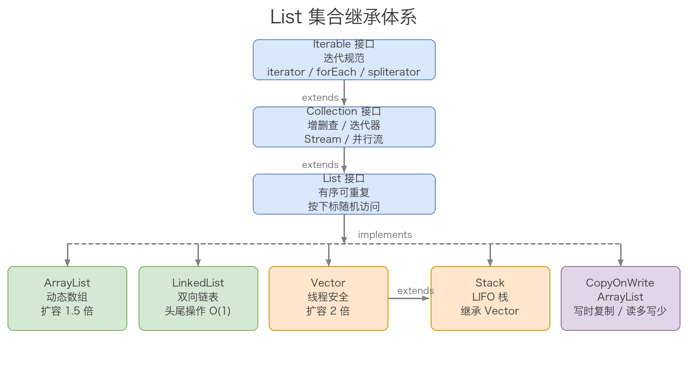
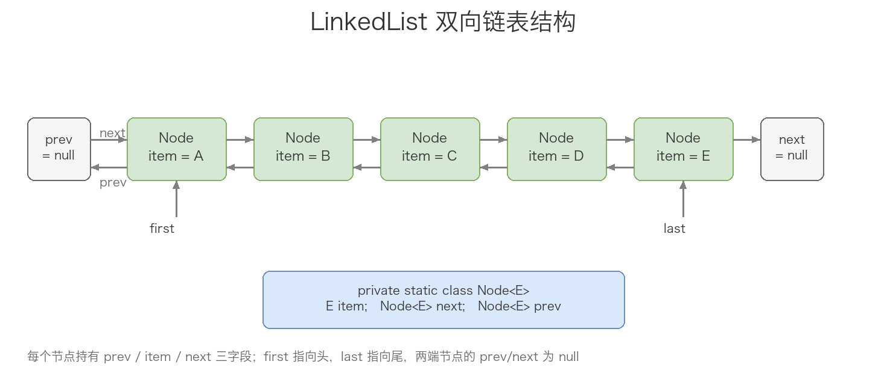

# Java集合-List

> Java 集合框架中 List 这一支脉络，从最顶层的 Iterable 接口一路拆到 ArrayList、LinkedList、Vector、Stack、CopyOnWriteArrayList 五个实现类的底层结构、源码与选型。

## 目录

- [一、集合框架的顶层抽象](#一集合框架的顶层抽象)
  - [1. Iterable 接口](#1-iterable-接口)
  - [2. Collection 接口](#2-collection-接口)
- [二、List 接口](#二list-接口)
  - [1. 定位与特性](#1-定位与特性)
  - [2. 接口方法全景](#2-接口方法全景)
  - [3. 默认方法 sort / replaceAll](#3-默认方法-sort--replaceall)
  - [4. 静态工厂 of / copyOf](#4-静态工厂-of--copyof)
- [三、ArrayList](#三arraylist)
  - [1. 继承关系与特性](#1-继承关系与特性)
  - [2. 核心字段](#2-核心字段)
  - [3. 三种构造](#3-三种构造)
  - [4. 扩容机制：grow / ensureCapacity](#4-扩容机制grow--ensurecapacity)
  - [5. 增删改查源码](#5-增删改查源码)
  - [6. arraycopy 与 copyOf 的区别](#6-arraycopy-与-copyof-的区别)
- [四、LinkedList](#四linkedlist)
  - [1. 双向链表结构与继承](#1-双向链表结构与继承)
  - [2. 核心字段与 Node](#2-核心字段与-node)
  - [3. 构造与批量插入](#3-构造与批量插入)
  - [4. 头尾插入 linkFirst / linkLast](#4-头尾插入-linkfirst--linklast)
  - [5. 中间插入 linkBefore](#5-中间插入-linkbefore)
  - [6. 常用方法汇总](#6-常用方法汇总)
- [五、Vector](#五vector)
  - [1. 继承关系与特性](#1-继承关系与特性-1)
  - [2. 核心字段](#2-核心字段-1)
  - [3. 构造与扩容系数](#3-构造与扩容系数)
  - [4. 源码要点：synchronized 与 addElement](#4-源码要点synchronized-与-addelement)
  - [5. 历史遗留 API](#5-历史遗留-api)
- [六、Stack](#六stack)
  - [1. 继承 Vector](#1-继承-vector)
  - [2. 五大方法 push/pop/peek/empty/search](#2-五大方法-pushpoppeekemptysearch)
  - [3. 缺点与替代](#3-缺点与替代)
- [七、CopyOnWriteArrayList](#七copyonwritearraylist)
  - [1. 思想：读写分离、写时复制](#1-思想读写分离写时复制)
  - [2. 核心字段](#2-核心字段-2)
  - [3. add 源码](#3-add-源码)
  - [4. remove 源码](#4-remove-源码)
  - [5. get 源码](#5-get-源码)
  - [6. 优缺点与适用场景](#6-优缺点与适用场景)
  - [7. 延伸：为什么没有 size 属性](#7-延伸为什么没有-size-属性)
- [八、五个实现类横向对比与选型](#八五个实现类横向对比与选型)
- [附：高频速记](#附高频速记)



## 一、集合框架的顶层抽象

List 接口的实现类都跑在 Java 集合框架的统一规范下，这个规范由 Iterable 与 Collection 两个最顶层接口定下。理解这两个接口再看 List，会顺很多。

### 1. Iterable 接口

Iterable 是 Java 集合最顶级的接口，定义了「迭代遍历」的规范。List、Set、Queue 都间接继承自它。

JDK 1.8 之后，Iterable 多了两个 default 方法：forEach 接收一个 Consumer 动作对每个元素处理，spliterator 返回一个可分割迭代器用于并行遍历——这正是 Stream 底层依赖的能力。

```java
public interface Iterable<T> {
    Iterator<T> iterator();

    default void forEach(Consumer<? super T> action) {
        Objects.requireNonNull(action);
        for (T t : this) {
            action.accept(t);
        }
    }

    default Spliterator<T> spliterator() {
        return Spliterators.spliteratorUnknownSize(iterator(), 0);
    }
}
```

三个方法的分工很清晰：iterator 是核心方法，返回带 next/hasNext/remove 的经典迭代器；forEach 把「对每个元素的操作」当对象传进来；spliterator 是为并行遍历设计的，Collection.stream() 内部就是 stream(spliterator(), false) 把数组流串起来。

### 2. Collection 接口

Collection 接口继承自 Iterable，定义了集合最通用的功能规范：

```java
public interface Collection<E> extends Iterable<E> {
    int size();
    boolean isEmpty();
    boolean contains(Object o);
    Iterator<E> iterator();
    Object[] toArray();
    <T> T[] toArray(T[] a);
    boolean add(E e);
    boolean remove(Object o);
    boolean containsAll(Collection<?> c);
    boolean addAll(Collection<? extends E> c);
    boolean removeAll(Collection<?> c);
    default boolean removeIf(Predicate<? super E> filter) { /* ... */ }
    boolean retainAll(Collection<?> c);
    void clear();
    boolean equals(Object o);
    int hashCode();
    @Override default Spliterator<E> spliterator() { /* ... */ }
    default Stream<E> stream() { /* ... */ }
    default Stream<E> parallelStream() { /* ... */ }
}
```

把方法分一下类：增（add/addAll）、删（remove/removeAll/retainAll/removeIf/clear）、查（contains/containsAll/size/isEmpty）、遍历（iterator/spliterator）、流转（stream/parallelStream）。子接口（List、Set）在此基础上再扩展自己的特有方法。

具体迭代器怎么实现由子类决定。比如 ArrayList 用内部类 Itr/SubList 实现 Iterator；LinkedList 内部用 ListItr。除了方法签名外，迭代器的行为（fail-fast、并发修改检测）也是 Collection 体系的一部分。

## 二、List 接口

### 1. 定位与特性

List 接口继承自 Collection，做了两件事：

- 引入「按下标」访问的概念——get(i)、set(i, e)、add(i, e)、remove(i) 这一组按位置操作的方法。
- 引入 ListIterator——比 Iterator 更强的迭代器，支持双向遍历与 set/add/remove。

List 的核心语义：「有序、可重复」。有序意味着元素的插入顺序被保留且可通过下标访问；可重复意味着允许 `new ArrayList<>(Arrays.asList(1, 1, 2))` 这类有重复元素的列表。

List 还声明了一个随机访问标记：

```java
@Override
default Spliterator<E> spliterator() {
    if (this instanceof RandomAccess) {
        return new AbstractList.RandomAccessSpliterator<>(this);
    }
    return Spliterators.spliterator(this, Spliterator.ORDERED);
}
```

实现 RandomAccess 的 List（如 ArrayList、Vector）走 RandomAccessSpliterator；未实现的（如 LinkedList）走 ORDERED spliterator。Collections.binarySearch 之类工具方法也是先 instanceof RandomAccess 来决定走哪种算法。

### 2. 接口方法全景

List 接口在 Collection 之上扩展的方法（节选）：

```java
public interface List<E> extends Collection<E> {
    // 位置访问
    E get(int index);
    E set(int index, E element);
    void add(int index, E element);
    E remove(int index);
    // 搜索
    int indexOf(Object o);
    int lastIndexOf(Object o);
    // 范围视图
    List<E> subList(int fromIndex, int toIndex);
    // 迭代器
    ListIterator<E> listIterator();
    ListIterator<E> listIterator(int index);
}
```

加上从 Collection 继承来的，所有 List 实现类都得实现这套操作集合。

### 3. 默认方法 sort / replaceAll

JDK 1.8 给 List 加了两个 default 方法：replaceAll 用一个 UnaryOperator 把每个元素原地替换；sort 用一个 Comparator 把列表原地排序。

```java
default void replaceAll(UnaryOperator<E> operator) {
    Objects.requireNonNull(operator);
    final ListIterator<E> li = this.listIterator();
    while (li.hasNext()) {
        li.set(operator.apply(li.next()));
    }
}

default void sort(Comparator<? super E> c) {
    Object[] a = this.toArray();
    Arrays.sort(a, (Comparator) c);
    ListIterator<E> i = this.listIterator();
    for (Object e : a) {
        i.next();
        i.set((E) e);
    }
}
```

注意 sort 的实现：先把列表转数组，Arrays.sort 排好，再通过 ListIterator.set 把元素写回去。所以 sort 不直接动内部存储，而是绕一圈回填——对 ArrayList 这种数组存储很高效，对 LinkedList 这种链表存储其实有额外开销（要先转数组）。

### 4. 静态工厂 of / copyOf

JDK 9 给 List 接口加了若干 `static of(...)` 工厂和 `static copyOf(Collection)`，用来创建不可变 List：

```java
static <E> List<E> of() { return ImmutableCollections.emptyList(); }
static <E> List<E> of(E e1) { return new ImmutableCollections.List12<>(e1); }
// ... of(E e1, E e2) ... of(E... elements) 最多 10 个
static <E> List<E> copyOf(Collection<? extends E> coll) {
    return ImmutableCollections.listCopy(coll);
}
```

底层是 ImmutableCollections 里的 List12（专优化 1 或 2 个元素）和 ListN（任意长度）。这些 List 不允许 null、不允许结构性修改（add/remove/set 都会抛 UnsupportedOperationException），适合作为常量或返回只读视图。0/1/2 元素的 List 走单例或 List12 特化路径，比 ArrayList 更省内存。

## 三、ArrayList

### 1. 继承关系与特性

ArrayList 是最常用的 List 实现，底层是一段 Object[] elementData 数组，容量按需动态增长。

```java
public class ArrayList<E> extends AbstractList<E>
        implements List<E>, RandomAccess, Cloneable, java.io.Serializable {
    // ...
}
```

几个关键接口的含义：

- RandomAccess：标记接口，表示「支持快速随机访问」。Arrays.binarySearch 之类的工具方法会先 instanceof RandomAccess 来决定走哪种算法（基于下标还是基于迭代器）。ArrayList 满足这个语义，因为它底层是数组，get(i) 是 O(1)。
- Cloneable：能被 clone。注意 ArrayList 的 clone() 是浅拷贝——elementData 数组本身复制一份，但里面装的对象不复制。
- Serializable：能序列化。ArrayList 重写了 writeObject/readObject，只把 size 个有效元素写出，不写入预留的空槽。
- 线程不安全：modCount 在多线程并发 add/remove 时会出问题，可能丢元素或数组越界。

时间复杂度总结：随机访问 O(1)，中间插入/删除 O(n)（要 arraycopy 移动后续元素），尾部 add 均摊 O(1)。

### 2. 核心字段

```java
private static final int DEFAULT_CAPACITY = 10;
private static final Object[] EMPTY_ELEMENTDATA = {};
private static final Object[] DEFAULTCAPACITY_EMPTY_ELEMENTDATA = {};
transient Object[] elementData; // 真正存数据的数组
private int size;                // 已用元素个数
```

几个常量区分清楚：

- EMPTY_ELEMENTDATA：调用 `new ArrayList(0)` 时用的空数组。
- DEFAULTCAPACITY_EMPTY_ELEMENTDATA：`new ArrayList()` 无参构造时用的空数组。它和 EMPTY_ELEMENTDATA 用同一个对象 {}，但通过是否等于这个静态字段来区分「我是不是无参构造出来的空 ArrayList」——首次 add 时无参构造的会扩容到默认 10。
- elementData 用 transient 是因为它可能比 size 长，直接序列化会浪费空间。

### 3. 三种构造

```java
public ArrayList(int initialCapacity) {
    if (initialCapacity > 0) {
        this.elementData = new Object[initialCapacity];
    } else if (initialCapacity == 0) {
        this.elementData = EMPTY_ELEMENTDATA;
    } else {
        throw new IllegalArgumentException("Illegal Capacity: "+initialCapacity);
    }
}

public ArrayList() {
    this.elementData = DEFAULTCAPACITY_EMPTY_ELEMENTDATA;
}

public ArrayList(Collection<? extends E> c) {
    elementData = c.toArray();
    if ((size = elementData.length) != 0) {
        if (elementData.getClass() != Object[].class)
            elementData = Arrays.copyOf(elementData, size, Object[].class);
    } else {
        this.elementData = EMPTY_ELEMENTDATA;
    }
}
```

两个细节：无参构造不立刻分配 10 个槽，而是延迟到第一次 add 才扩容（懒初始化）。集合构造时如果 `c.toArray()` 返回的不是 Object[]（例如 Arrays.asList 返回的可能是其内部类型），要 Arrays.copyOf 一次强转成 Object[]。

### 4. 扩容机制：grow / ensureCapacity

扩容是 ArrayList 最值得拆的机制。看三个方法的串联：

```java
private void ensureCapacityInternal(int minCapacity) {
    if (elementData == DEFAULTCAPACITY_EMPTY_ELEMENTDATA) {
        minCapacity = Math.max(DEFAULT_CAPACITY, minCapacity);
    }
    ensureExplicitCapacity(minCapacity);
}

private void ensureExplicitCapacity(int minCapacity) {
    modCount++;
    if (minCapacity - elementData.length > 0)
        grow(minCapacity);
}

private void grow(int minCapacity) {
    int oldCapacity = elementData.length;
    int newCapacity = oldCapacity + (oldCapacity >> 1);  // 1.5 倍
    if (newCapacity - minCapacity < 0)
        newCapacity = minCapacity;
    if (newCapacity - MAX_ARRAY_SIZE > 0)
        newCapacity = hugeCapacity(minCapacity);
    elementData = Arrays.copyOf(elementData, newCapacity);
}
```

扩容三步走：

1. ensureCapacityInternal：把传入的「至少需要的容量」与默认 10 比大小（针对无参构造的延迟初始化场景）。
2. ensureExplicitCapacity：modCount++，如果真的不够就调 grow。
3. grow：新容量 = 旧容量 + (旧容量 >> 1)，即 1.5 倍。如果还是不够就按 minCapacity 走；如果超过 MAX_ARRAY_SIZE（Integer.MAX_VALUE - 8）就调 hugeCapacity 判断是否设为 Integer.MAX_VALUE。

注意位运算 `oldCapacity >> 1` 比 `oldCapacity / 2` 快，所以扩容用的是位移。最后靠 Arrays.copyOf 完成实际的数组扩容（底层是 System.arraycopy，native 内存拷贝）。

性能提示：能预估大小时用 `new ArrayList<>(expectedSize)` 一次性给足容量，避免多次扩容时的 arraycopy 开销。

### 5. 增删改查源码

add(E) 走尾部追加，add(int, E) 走中间插入；remove(Object) 按内容删，remove(int) 按下标删。看核心：

```java
public boolean add(E e) {
    ensureCapacityInternal(size + 1);
    elementData[size++] = e;
    return true;
}

public void add(int index, E element) {
    rangeCheckForAdd(index);
    ensureCapacityInternal(size + 1);
    System.arraycopy(elementData, index, elementData, index + 1, size - index);
    elementData[index] = element;
    size++;
}

public E remove(int index) {
    rangeCheck(index);
    modCount++;
    E oldValue = elementData(index);
    int numMoved = size - index - 1;
    if (numMoved > 0)
        System.arraycopy(elementData, index + 1, elementData, index, numMoved);
    elementData[--size] = null;
    return oldValue;
}
```

中间插入的精妙之处：System.arraycopy 把 index 之后的元素整体右移一格（自己复制自己），最后把新元素放到 index 位。删除则反过来左移，最后一位置 null 让 GC 回收。

按值删除的 remove(Object) 用 equals 找第一个匹配的元素，对 null 单独用 == 判断。fastRemove 是去掉边界检查的私有版本，迭代器删除时用它。

### 6. arraycopy 与 copyOf 的区别

两个数组复制 API 容易混：

- `System.arraycopy(Object src, int srcPos, Object dest, int destPos, int length)`：需要目标数组，可以指定起止位置和长度，把 src 的 [srcPos, srcPos+length) 拷到 dest 的 [destPos, destPos+length)。
- `Arrays.copyOf(T[] original, int newLength)`：系统自动 new 一个长度为 newLength 的新数组返回。如果 newLength 大于原数组长度就补 null，小于就截断。

Arrays.copyOf 内部就是 System.arraycopy 调用 + new 数组，所以 copyOf 是封装、arraycopy 是底层。ArrayList 的 toArray() 用的是 Arrays.copyOf；add(int, E) 与 remove(int) 用的是 System.arraycopy。

## 四、LinkedList

### 1. 双向链表结构与继承

LinkedList 的底层是一条带头尾指针的双向链表，可以 O(1) 操作头尾节点，定位中间节点仍需 O(n) 遍历。它允许插入所有元素，包括 null。

```java
public class LinkedList<E>
        extends AbstractSequentialList<E>
        implements List<E>, Deque<E>, Cloneable, java.io.Serializable {
    // ...
}
```

LinkedList 同时实现了 Deque（双端队列），所以它既能当 List 用，又能当 Deque/Queue 用——既能按下标访问，又能 offer/poll/peek。注意它没实现 RandomAccess，因为链表按 index 访问要从近端遍历到目标位置，O(n)。



### 2. 核心字段与 Node

只有三个字段，全是 transient：

```java
transient int size = 0;
transient Node<E> first;
transient Node<E> last;

private static class Node<E> {
    E item;
    Node<E> next;
    Node<E> prev;
    Node(Node<E> prev, E element, Node<E> next) {
        this.item = element;
        this.next = next;
        this.prev = prev;
    }
}
```

Node 是一个典型的双向链表节点，三个字段：item 存数据，next 指向后继，prev 指向前驱。size 记录节点数。first 和 last 分别是头尾节点引用——头节点的 prev = null，尾节点的 next = null，这是 LinkedList 的不变式（invariant）。

### 3. 构造与批量插入

LinkedList 有两个构造：

```java
public LinkedList() { }
public LinkedList(Collection<? extends E> c) {
    this();
    addAll(c);
}

public boolean addAll(int index, Collection<? extends E> c) {
    checkPositionIndex(index);
    Object[] a = c.toArray();
    int numNew = a.length;
    if (numNew == 0) return false;
    Node<E> pred, succ;
    if (index == size) {   // 末尾追加
        succ = null;
        pred = last;
    } else {                // 中间插入：定位 succ（目标位置的当前节点）
        succ = node(index);
        pred = succ.prev;
    }
    for (Object o : a) {
        @SuppressWarnings("unchecked") E e = (E) o;
        Node<E> newNode = new Node<>(pred, e, null);
        if (pred == null) first = newNode;
        else pred.next = newNode;
        pred = newNode;
    }
    if (succ == null) last = pred;
    else { pred.next = succ; succ.prev = pred; }
    size += numNew;
    modCount++;
    return true;
}
```

批量插入的逻辑：

1. 先把入参 collection 转成数组（numNew = a.length）。
2. 判断插入位置：index == size（末尾追加，succ = null、pred = last）；中间插入则先调 node(index) 找到 succ（目标位置的当前节点），pred = succ.prev。
3. 遍历数组，每轮 new 一个 Node 把 pred.next 串起来，最后更新 pred = newNode。
4. 末尾追加时 last 指向 pred；中间插入时把 pred.next 接到 succ、succ.prev 接到 pred。

整个批量插入 O(n)，没有数组搬迁，链表的插入效率优势在此。

### 4. 头尾插入 linkFirst / linkLast

```java
private void linkFirst(E e) {
    final Node<E> f = first;
    final Node<E> newNode = new Node<>(null, e, f);
    first = newNode;
    if (f == null) last = newNode;
    else f.prev = newNode;
    size++; modCount++;
}

void linkLast(E e) {
    final Node<E> l = last;
    final Node<E> newNode = new Node<>(l, e, null);
    last = newNode;
    if (l == null) first = newNode;
    else l.next = newNode;
    size++; modCount++;
}
```

两个方法几乎对称：新建 Node，把新节点的 prev/next 指向原头尾，再把原头尾的 prev/next 指向新节点，更新 first/last。两种情况：原链表为空（f/l == null），新节点既是 first 又是 last；否则只改相应一侧。

### 5. 中间插入 linkBefore

```java
void linkBefore(E e, Node<E> succ) {
    final Node<E> pred = succ.prev;
    final Node<E> newNode = new Node<>(pred, e, succ);
    succ.prev = newNode;
    if (pred == null) first = newNode;
    else pred.next = newNode;
    size++; modCount++;
}
```

在 succ 节点前面插：拿到 succ 的 prev 作为 pred，新节点的 prev = pred、next = succ，然后把 succ.prev 指向新节点，pred.next 指向新节点。pred 为 null 说明 succ 是原 first，新节点顶替它做新的 first。

删除（unlink）的逻辑与 linkBefore 完全相反：拿当前节点的 prev/next，让它们互相指向，断开当前节点的所有引用，GC 自然回收。

### 6. 常用方法汇总

LinkedList 的方法比 ArrayList 多，因为它同时是 List 和 Deque/Queue。按类别整理：

增：

- add(E)：尾部追加（List 接口）
- addFirst(E) / push(E)：头插，等价
- addLast(E) / offer(E)：尾插
- offerFirst(E) / offerLast(E)：JDK 1.6+ 的 Deque 接口方法
- add(int index, E element)：按下标插入（List 接口）

删：

- remove() / poll()：移除头
- remove(Object o)：按值删第一个匹配
- removeFirst() / pop()：删头并返回
- removeLast()：删尾并返回
- pollFirst() / pollLast()：删头/尾并返回，Deque 接口

查：

- get(int index)：按下标访问 O(n)
- getFirst() / peek() / peekFirst()：看头
- getLast() / peekLast()：看尾
- element()：看头（Queue 接口）

## 五、Vector

### 1. 继承关系与特性

Vector 是 JDK 1.0 就有的老类，底层同样是 Object[] 数组，但每个 public 方法都加了 synchronized。

```java
public class Vector<E>
        extends AbstractList<E>
        implements List<E>, RandomAccess, Cloneable, java.io.Serializable {
    // ...
}
```

它实现了 RandomAccess、Cloneable、Serializable，但与 ArrayList 最大的区别就是线程安全——所有方法用 synchronized 修饰。代价是单线程环境下大量无意义的锁开销，所以现在几乎被 ArrayList + Collections.synchronizedList 或并发容器替代。

### 2. 核心字段

```java
protected Object[] elementData;
protected int elementCount;
protected int capacityIncrement;
```

三个 protected 字段（被设计为 protected 是为了子类 Stack 方便访问）：

- elementData：存数据的数组。
- elementCount：实际元素个数，相当于 ArrayList 的 size。
- capacityIncrement：扩容系数。如果 > 0，扩容时增加 capacityIncrement；否则扩成 2 倍。

### 3. 构造与扩容系数

```java
public Vector() { this(10); }
public Vector(int initialCapacity) { this(initialCapacity, 0); }
public Vector(int initialCapacity, int capacityIncrement) {
    super();
    if (initialCapacity < 0)
        throw new IllegalArgumentException();
    this.elementData = new Object[initialCapacity];
    this.capacityIncrement = capacityIncrement;
}
```

无参构造初始化为容量 10、capacityIncrement=0（即 2 倍扩容）。也可以指定 capacityIncrement 为正数让扩容走固定增量策略。

扩容核心代码：

```java
private void ensureCapacityHelper(int minCapacity) {
    int oldCapacity = elementData.length;
    if (minCapacity > oldCapacity) {
        Object[] oldData = elementData;
        int newCapacity = (capacityIncrement > 0)
            ? (oldCapacity + capacityIncrement)
            : (oldCapacity * 2);
        if (newCapacity < minCapacity) newCapacity = minCapacity;
        elementData = Arrays.copyOf(elementData, newCapacity);
    }
}
```

扩容公式：`newCapacity = capacityIncrement > 0 ? oldCapacity + capacityIncrement : oldCapacity * 2`。与 ArrayList 的 1.5 倍固定比例不同，Vector 默认是 2 倍，可以通过 capacityIncrement 调到任意增量。

### 4. 源码要点：synchronized 与 addElement

Vector 的每个 public 方法都标了 synchronized，比如 add(E)：

```java
public synchronized boolean add(E e) {
    modCount++;
    ensureCapacityHelper(elementCount + 1);
    elementData[elementCount++] = e;
    return true;
}
```

Vector 还有一组「Element」后缀的遗留 API：addElement、removeElement、insertElementAt、elementAt、firstElement、lastElement、setElementAt、removeAllElements、copyInto、elements()（返回 Enumeration）。这些是 JDK 1.0 的命名风格，Enumeration 也是旧版迭代器，现在基本被 Iterator 取代。

### 5. 历史遗留 API

Vector 是 JDK 1.0 的遗产，留下了 Enumeration 接口：

```java
public Enumeration<E> elements() {
    return new Enumeration<E>() {
        int count = 0;
        public boolean hasMoreElements() { return count < elementCount; }
        public E nextElement() {
            synchronized (Vector.this) {
                if (count < elementCount) return (E)elementData[count++];
            }
            throw new NoSuchElementException("Vector Enumeration");
        }
    };
}
```

实际开发中几乎不会用到。Vector 的 subList 还做了一层 Collections.synchronizedList 包装，让子视图也线程安全。

## 六、Stack

### 1. 继承 Vector

```java
public class Stack<E> extends Vector<E> {
    public Stack() { }
    // ...
}
```

Stack 直接继承 Vector，把自己定位成 LIFO（Last-In-First-Out）栈。它没引入任何新字段，复用 Vector 的 elementData 数组；只在 Vector 基础上加了五个栈语义方法。

### 2. 五大方法 push/pop/peek/empty/search

```java
public E push(E item) {
    addElement(item);
    return item;
}

public synchronized E pop() {
    E obj;
    int len = size();
    obj = peek();
    removeElementAt(len - 1);
    return obj;
}

public synchronized E peek() {
    int len = size();
    if (len == 0) throw new EmptyStackException();
    return elementAt(len - 1);
}

public boolean empty() { return size() == 0; }

public synchronized int search(Object o) {
    int i = lastIndexOf(o);
    if (i >= 0) return size() - i;
    return -1;
}
```

逐个看：

- push(E)：把元素压到栈顶，实际就是 Vector.addElement（同步版本）。
- pop()：移除并返回栈顶。peek 先看一眼栈顶，removeElementAt(len - 1) 移除末尾元素。
- peek()：看栈顶但不删。空栈抛 EmptyStackException。
- empty()：判断栈是否为空。
- search(Object)：找元素距离栈顶的距离（从 1 开始计数），找不到返回 -1。

### 3. 缺点与替代

Stack 有两个明显的缺点：

1. 由于继承自 Vector，每次扩容时需要把元素 copy 到新数组，push/pop 的性能受扩容影响。
2. 继承 Vector 的同时把所有 public 方法都继承下来了——比如 add(int, E)、remove(int) 这些可以「从中间插入删除」的方法，破坏「只能从栈顶进出」的栈语义契约。JDK 自己也注明「不要轻易使用这个类」。

实际开发中更推荐用 Deque 接口的实现——比如 ArrayDeque（循环数组实现的栈和队列），它没有 Vector 的扩容包袱，也不带多余的方法。

```java
Deque<Integer> stack = new ArrayDeque<>();
stack.push(1);
stack.push(2);
stack.pop();   // 2
```

## 七、CopyOnWriteArrayList

### 1. 思想：读写分离、写时复制

CopyOnWriteArrayList 是 Java 并发包里提供的 List 实现，核心思想是「读写分离、写时复制」（COW, Copy-On-Write）：

- 读操作不加锁，永远读的是当时的「快照」。
- 写操作加锁，且每次写都把原数组复制一份，在新数组上改，改完再把 array 引用替换为新数组。
- array 字段用 volatile 修饰，保证写替换后其他线程能立刻看到新数组。

适用场景：读多写少。典型场景是「黑名单」、「监听器列表」、「配置项列表」——读频繁、偶尔批量更新。

```java
public class CopyOnWriteArrayList<E>
        implements List<E>, RandomAccess, Cloneable, java.io.Serializable {
    final transient Object lock = new Object();
    private transient volatile Object[] array;
    // ...
}
```

### 2. 核心字段

```java
final transient Object lock = new Object();    // 修改时用的锁
private transient volatile Object[] array;     // 真正存数据的数组
final Object[] getArray() { return array; }
final void setArray(Object[] a) { array = a; }
```

两个关键点：lock 是 ReentrantLock 但用 Object 锁的形式管理；array 用 volatile 保证可见性。所有访问都通过 getArray/setArray，防止外部绕过字段直接拿到数组引用修改。

构造：

```java
public CopyOnWriteArrayList() { setArray(new Object[0]); }
public CopyOnWriteArrayList(Collection<? extends E> c) {
    Object[] es;
    if (c.getClass() == CopyOnWriteArrayList.class)
        es = ((CopyOnWriteArrayList<?>)c).getArray();
    else {
        es = c.toArray();
        if (es.getClass() != Object[].class)
            es = Arrays.copyOf(es, es.length, Object[].class);
    }
    setArray(es);
}
```

无参构造初始化为空数组。集合构造时如果入参也是 CopyOnWriteArrayList 直接复用其内部数组（零拷贝）；否则按通用做法转一次。

### 3. add 源码

```java
public boolean add(E e) {
    final ReentrantLock lock = this.lock;
    lock.lock();
    try {
        Object[] elements = getArray();
        int len = elements.length;
        Object[] newElements = Arrays.copyOf(elements, len + 1);
        newElements[len] = e;
        setArray(newElements);
        return true;
    } finally {
        lock.unlock();
    }
}
```

四步：

1. 加锁（lock.lock()）。
2. 获取当前数组引用，Arrays.copyOf 出一份新数组（长度 +1）。
3. 把新元素放到新数组的最后一位。
4. setArray 把 array 字段指向新数组。
5. finally 中释放锁。

写操作的代价：每次 add 都 Arrays.copyOf 一份长度为 len+1 的新数组——空间复杂度 O(n)，且复制耗时随 n 增大。这就是「读多写少」才划算的原因。

### 4. remove 源码

```java
public E remove(int index) {
    final ReentrantLock lock = this.lock;
    lock.lock();
    try {
        Object[] elements = getArray();
        int len = elements.length;
        E oldValue = get(elements, index);
        int numMoved = len - index - 1;
        if (numMoved == 0)
            setArray(Arrays.copyOf(elements, len - 1));
        else {
            Object[] newElements = new Object[len - 1];
            System.arraycopy(elements, 0, newElements, 0, index);
            System.arraycopy(elements, index + 1, newElements, index, numMoved);
            setArray(newElements);
        }
        return oldValue;
    } finally {
        lock.unlock();
    }
}
```

分两种情况：删的是最后一位（numMoved == 0），直接 Arrays.copyOf 复制前 len-1 个；删的是中间，前面 arraycopy 到新数组、后面 arraycopy 跳过 index 位覆盖到新数组。

### 5. get 源码

```java
public E get(int index) {
    return get(getArray(), index);
}
private E get(Object[] a, int index) {
    return (E) a[index];
}
```

读操作没有任何同步措施，连越界检查都省了（数组本身会抛 ArrayIndexOutOfBoundsException）。这意味着读到的可能是「写之前」的旧快照——这是「最终一致性」，不是实时一致性。

### 6. 优缺点与适用场景

优点：

- 线程安全，多线程可同时读不需加锁，并发读性能高。
- 读写不冲突，写不影响读。
- 适合读多写少的场景。

缺点：

- 内存占用高：每次写都 Arrays.copyOf 一份新数组，写多时 GC 压力大。
- 写延迟高：复制整个数组，单次写耗时随 n 增长。
- 迭代器弱一致：迭代期间不会反映后续的修改，可能看到旧数据。

### 7. 延伸：为什么没有 size 属性

CopyOnWriteArrayList 没有 size 字段。每次写都是拷贝一份「正好放下目标个数元素」的数组——add 后新数组长度就是 len+1（也是新的 size），remove 后新数组长度就是 len-1。所以数组长度本身就等于 size，不需要额外字段。

ArrayList 不一样：elementData.length 可能 > size（预留扩容空间），所以必须单独维护 size。

## 八、五个实现类横向对比与选型

| 维度 | ArrayList | LinkedList | Vector | Stack | CopyOnWriteArrayList |
| --- | --- | --- | --- | --- | --- |
| 底层 | Object[] 数组 | 双向链表 | Object[] 数组 | 继承 Vector | volatile Object[] 数组 |
| 随机访问 | O(1) | O(n) | O(1) | O(1) | O(1) |
| 头尾增删 | 尾部 O(1) 均摊 | O(1) | 尾部 O(1) 均摊 | push/pop O(1) | O(n)（需 copy） |
| 中间插入删除 | O(n)（arraycopy） | O(1)（已定位） | O(n) | O(n) | O(n) |
| 线程安全 | 否 | 否 | 是（全方法 synchronized） | 是（继承） | 是（写加锁，读无锁） |
| 扩容策略 | 1.5 倍 | 不需要 | 2 倍或 capacityIncrement | 2 倍或 capacityIncrement | 不需要（每次 copy 新长度） |
| 内存占用 | 数组（可能有预留空间） | 每个节点额外 prev/next | 数组 | 数组 | 写时多一份旧数组 |
| 随机访问标记 | RandomAccess | 无 RandomAccess | RandomAccess | RandomAccess | RandomAccess |
| 适用场景 | 通用首选 | 频繁头尾操作、Deque | 已被淘汰 | 已被淘汰，建议 ArrayDeq | 读多写少、监听器/黑名单 |

选型口诀：

- 默认用 ArrayList，配合 ensureCapacity 预估容量。
- 频繁头尾增删、当 Deque/Queue 用——LinkedList（但实际上 ArrayDeque 更优）。
- 多线程读多写少——CopyOnWriteArrayList。
- 多线程读写兼顾——Collections.synchronizedList 或考虑 ConcurrentLinkedQueue。
- Stack/Vector 是历史遗留，新代码不要用。

## 附：高频速记

- List 家族层级：Iterable → Collection → List → ArrayList / LinkedList / Vector / Stack / CopyOnWriteArrayList。
- ArrayList 三种构造：无参（懒初始化，首次 add 才扩到 10）、指定 initialCapacity、Collection 构造。
- ArrayList 扩容：1.5 倍 `oldCapacity + (oldCapacity >> 1)`，超过 MAX_ARRAY_SIZE 走 hugeCapacity。
- ArrayList 延迟初始化：无参构造下 elementData = DEFAULTCAPACITY_EMPTY_ELEMENTDATA，首次 add 触发 grow 扩容到 10。
- ArrayList 关键 API：add(E) 走 ensureCapacityInternal；add(int, E) 走 System.arraycopy 右移；remove(int) 走 arraycopy 左移 + 末尾置 null 帮助 GC。
- arraycopy vs copyOf：arraycopy 需要目标数组、起止、长度；copyOf 自动 new 一个数组返回，内部就是 arraycopy。
- elementData 用 transient：避免序列化预留空槽，writeObject 只写 size 个元素。
- LinkedList 三字段：size、first、last，全是 transient。
- LinkedList Node 三字段：item、next、prev。
- LinkedList 头尾插入 O(1)：linkFirst / linkLast / linkBefore。
- LinkedList 按 index 访问 O(n)：从近端遍历（node(int)）。
- Vector = synchronized ArrayList：每个方法都加 synchronized，2 倍扩容，可指定 capacityIncrement。
- Vector 遗留 API：addElement、elementAt、elements() 返回 Enumeration。
- Stack 五大方法：push/pop/peek/empty/search，都基于 Vector。
- Stack 缺点：继承 Vector 带扩容包袱、暴露非栈语义方法（add(int)/remove(int)）。
- CopyOnWriteArrayList 三件套：volatile array 字段、Object lock、写时复制。
- CopyOnWriteArrayList 适用：读多写少、配置项、监听器列表、黑名单。
- CopyOnWriteArrayList 没 size 字段：每次 copy 的新数组长度就等于新 size。
- CopyOnWriteArrayList 迭代器弱一致：不抛 ConcurrentModificationException，可能看到旧数据。
- 选型口诀：默认 ArrayList；头尾操作用 ArrayDeque；读多写少用 CopyOnWriteArrayList；多线程均衡用 synchronizedList；不用 Stack/Vector。