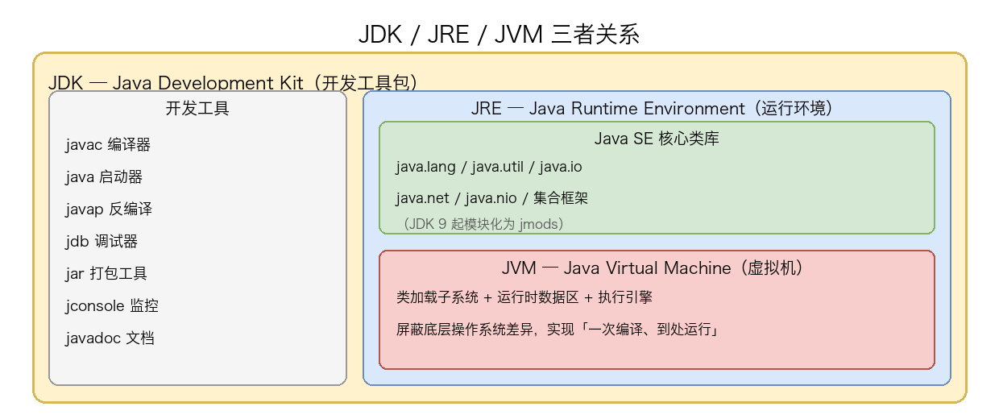
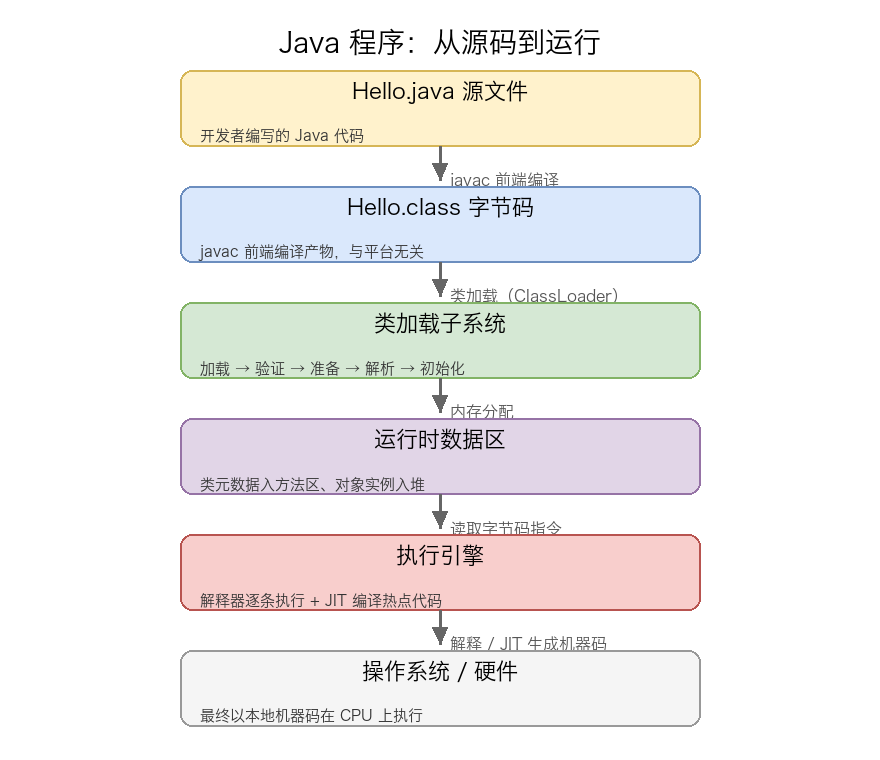
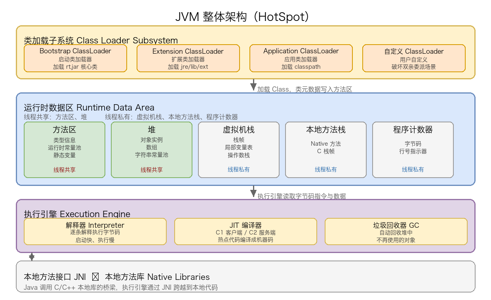

# 01. JVM 整体结构概述

> Java 虚拟机（JVM）是 Java 生态的核心：它把 Java 源码编译出的字节码翻译成机器可执行的指令，屏蔽底层操作系统的差异，让 Java 程序实现「一次编译、到处运行」。本文先讲清 JVM 是什么、Java 程序从源码到运行的完整链路，再拆解 JVM 整体架构的三大件（类加载子系统、运行时数据区、执行引擎），最后梳理 HotSpot 的演进与后续章节的学习路线。

## 目录

- [一、JVM 是什么](#一jvm-是什么)
- [二、Java 程序从源码到运行](#二java-程序从源码到运行)
- [三、JVM 整体架构（三大件）](#三jvm-整体架构三大件)
- [四、JVM 版本演进](#四jvm-版本演进)
- [附：高频速记](#附高频速记)

---

## 一、JVM 是什么

本节先从「JVM 是什么」讲起：它解决什么问题、由谁规范、各组件如何协作，再厘清一些常见的误解。

### 1. JVM 解决什么问题：跨平台

Java 诞生之前，C/C++ 程序编译后直接生成平台相关的机器码——同一份源码在 Windows、Linux、macOS 上必须各自编译一次。**Java 的核心目标之一是「一次编译、到处运行」（Write Once, Run Anywhere）**，而实现这个目标的关键就是 **JVM**：

- 编译器（`javac`）不直接生成机器码，而是生成一种与平台无关的中间代码——**字节码（Bytecode）**，存储在 `.class` 文件中；
- 每种操作系统都有一份对应的 JVM 实现，**由 JVM 负责把字节码翻译成该平台的机器指令**；
- 对开发者而言，只要源代码相同，无论在哪种操作系统上运行，看到的执行结果都一致。

JVM 因此承担了两个角色：**字节码的「翻译器」** 与 **运行时的「管理者」**。后者意味着 JVM 还负责管理内存、调度线程、回收垃圾——这些是后续章节要展开的内容。

### 2. JDK / JRE / JVM 三者关系

理解 JVM 的第一步，是搞清它在整个 Java 技术栈中的位置。**JDK / JRE / JVM 是包含关系，不是并列关系**：



具体来说：

- **JDK（Java Development Kit，Java 开发工具包）**：供开发者使用的完整工具集。除了运行 Java 程序的能力外，还包含 `javac`（编译器）、`javap`（反编译）、`jdb`（调试器）、`jar`（打包工具）、`jconsole`（监控）等开发工具。**JDK = JRE + 开发工具**；
- **JRE（Java Runtime Environment，Java 运行环境）**：供使用者运行 Java 程序的环境。它把 JVM 和 Java SE 核心类库（如 `java.lang`、`java.util`、`java.io`、`java.net` 等）打包在一起。**JRE = JVM + 核心类库**；
- **JVM（Java Virtual Machine，Java 虚拟机）**：真正负责执行字节码的运行时引擎。它屏蔽了底层操作系统的差异，把字节码翻译成本地机器指令。

简单记忆：**JDK 面向开发者，JRE 面向使用者，JVM 是核心引擎**。如果你只需要运行别人写好的 Java 程序，装 JRE 就够了；如果要自己写 Java 代码，必须装 JDK。

### 3. JVM 规范 vs JVM 实现

很多资料里"JVM"和"HotSpot"经常混用，但它们其实是两个概念：

- **JVM 规范（The Java Virtual Machine Specification）**：由 Oracle / JCP 维护的**抽象规范文档**，定义了 JVM 的内存布局、字节码格式、指令语义、类加载机制等。它**只规定「应该怎么做」，不规定「具体怎么实现」**——这是 Java 生态能多厂商共同推进的关键；
- **JVM 实现**：根据 JVM 规范、由不同厂商/组织开发的具体产品。常见的有：
  - **HotSpot**：Oracle / Sun 开发的旗舰实现，目前 **OpenJDK 默认搭载**，是绝大多数生产环境的首选；
  - **OpenJ9**：IBM 开源的轻量级实现，Eclipse Adoptium 等发行版可选用；
  - **GraalVM**：Oracle 推出的支持多语言、AOT 编译的高级实现；
  - **J9 / JRockit / Zing**：历史上各厂商的不同实现，部分已合并或停更。

---

## 二、Java 程序从源码到运行

有了第一节的概念基础，本节按时间顺序，把一个 Java 程序从「写代码」到「在 CPU 上跑起来」的完整链路拆开来讲。这是后续每章要深入展开的「主干流程」。

### 1. 全流程概览

一段 Java 代码从源码到执行，主要经过 **5 个阶段**：



每一阶段的角色简述：

1. **`.java` 源文件**：开发者编写的源代码；
2. **`.class` 字节码**：由 `javac` 编译生成的与平台无关的中间产物；
3. **类加载子系统**：把 `.class` 加载、校验、解析、初始化为 JVM 内部可用的类型；
4. **运行时数据区**：JVM 在内存中划分出的各功能区域（方法区、堆、栈等）；
5. **执行引擎**：解释器逐条执行字节码，JIT 把热点代码编译成机器码。

### 2. 前端编译：`javac`

`javac` 是 **Java 自带的前端编译器**（Frontend Compiler），由 JDK 提供。它的工作非常单一：**把 `.java` 源码翻译成 `.class` 字节码**。

```bash
# 编译 Hello.java -> Hello.class
$ javac Hello.java

# 多个文件一起编译
$ javac -d out src/com/example/*.java
```

`javac` 输出的 `.class` 文件里有几个关键内容：

- **魔数与版本号**：`CAFEBABE`（魔数）+ 主版本/次版本号（用于 JVM 校验向下兼容）；
- **常量池**：字面量（字符串、常量值）+ 符号引用（类名、方法名、字段名）；
- **方法字节码**：每个方法对应的 JVM 指令序列；
- **字段表、方法表、属性表**：类结构的描述信息。

这些结构的具体含义，将在《04 字节码与执行引擎》中展开。这里只需知道：**`.class` 文件是与平台无关的字节码容器，是 JVM 的输入**。

### 3. 类加载与内存分配

`.class` 文件还只是磁盘上的字节流，**JVM 真正开始执行前，必须把它加载到内存并初始化**——这就是类加载子系统的职责。它的工作可以简化为：

1. 通过类的全限定名定位 `.class` 文件；
2. 读取字节流，生成 `java.lang.Class` 对象；
3. 验证字节码合法性；
4. 为类的静态变量分配内存并设零值；
5. 把常量池中的符号引用解析为可直接寻址的直接引用；
6. 执行类的 `<clinit>()` 方法（合并后的静态初始化逻辑）。

加载完成后，类元数据会被放入 **方法区**，类初始化时创建的对象实例则进入 **堆**。整个过程的具体细节，将在《[03-类加载机制一：Class 文件分析](notes/jvm/03-类加载机制一-class文件分析.md)》《[04-类加载机制二：类加载过程分析](notes/jvm/04-类加载机制二-类加载过程分析.md)》《[05-类加载机制三：双亲委派机制](notes/jvm/05-类加载机制三-双亲委派机制.md)》中展开。

### 4. 执行引擎：解释 + JIT

类加载完毕后，JVM 进入「**执行**」阶段。**执行引擎**是 JVM 的 CPU，它的核心工作有两种模式：

- **解释执行**：解释器逐条把字节码翻译成机器码并执行。**优点是启动快**，但**每执行一次都要重新翻译**，效率偏低；
- **JIT 即时编译**：JIT（Just-In-Time）编译器识别出**热点代码**（被反复调用的方法、被反复执行的循环），把它们**整体编译成本地机器码并缓存起来**，下次执行直接跑机器码。**优点是执行快**，但**编译本身有开销**，因此只在「足够热」时才触发。

现代 JVM（如 HotSpot）默认采用 **解释器 + C2 JIT 编译器** 的协作模式，并通过**分层编译**（Tiered Compilation）动态选择：冷代码用解释器 + C1 编译器快速上手，热代码切换到 C2 编译器拿极限性能。这一块的具体原理，将在《04 字节码与执行引擎》中详细拆解。

### 5. 「一次编译、到处运行」如何实现

把上面的链路连起来看，「一次编译、到处运行」的实现机制就清晰了：

```
┌─────────────────────────────────────────────────────────────────┐
│  同一份 .java 源码                                                 │
│      │                                                           │
│      ▼  javac 前端编译（与平台无关）                               │
│  ┌──────────────────────────┐                                    │
│  │  Hello.class 字节码       │  ← 一次编译的产物，可在任何平台分发  │
│  └──────────────────────────┘                                    │
│      │                                                           │
│      ▼  在不同平台的 JVM 上执行                                    │
│  ┌──────────┐    ┌──────────┐    ┌──────────┐                    │
│  │ Win JVM  │    │ Mac JVM  │    │ Linux JVM│   ← 各自翻译成机器码   │
│  └──────────┘    └──────────┘    └──────────┘                    │
└─────────────────────────────────────────────────────────────────┘
```

`javac` 编译出来的 `.class` 是**与平台无关**的字节码（只规定了指令语义，不绑定具体指令集）；不同操作系统的 JVM 各自负责把字节码翻译成本地机器码。这就是「Write Once, Run Anywhere」的底层机制——**源码层面的可移植性 + 运行时的翻译层**。

---

## 三、JVM 整体架构（三大件）

讲完运行流程，本节开始拆解 JVM 的内部结构。**JVM 整体架构由三大子系统 + 一个本地接口组成**：类加载子系统、运行时数据区、执行引擎，加上本地方法接口（JNI）。

### 1. 三大件总览



这张图是整个 JVM 系列的「锚点图」——后续每一篇专题（类加载机制（[Class 文件分析](notes/jvm/03-类加载机制一-class文件分析.md) / [类加载过程分析](notes/jvm/04-类加载机制二-类加载过程分析.md) / [双亲委派机制](notes/jvm/05-类加载机制三-双亲委派机制.md)）、运行时数据区（[程序计数器](notes/jvm/06-运行时数据区一-程序计数器.md) / [虚拟机栈和本地方法栈](notes/jvm/07-运行时数据区二-虚拟机栈和本地方法栈.md) / [堆](notes/jvm/08-运行时数据区三-堆.md) / [方法区](<notes/jvm/09-运行时数据区四-方法区(元空间).md>)）、[核心流程总结](notes/jvm/10-JVM核心流程总结.md)、字节码与执行引擎、垃圾回收）都会围绕其中某个子系统展开。

三大件的职责分工简述：

- **类加载子系统（Class Loader Subsystem）**：负责把 `.class` 文件加载进 JVM，并进行验证、准备、解析、初始化；
- **运行时数据区（Runtime Data Area）**：JVM 在内存中划分出的区域，包括**线程共享**的方法区、堆，**线程私有**的虚拟机栈、本地方法栈、程序计数器；
- **执行引擎（Execution Engine）**：包含解释器、JIT 编译器、垃圾回收器，负责把字节码翻译成机器码并执行，以及回收不再使用的对象。

底部与执行引擎相连的是 **本地方法接口（JNI）**——当 Java 代码需要调用 C/C++ 等本地库时，就通过 JNI 跨越到 JVM 之外执行。

### 2. 类加载子系统

类加载子系统的工作可以概括为「**把字节码变成 JVM 内部可用的类型**」。它内部又由多个**类加载器**组成，常见的有：

- **Bootstrap ClassLoader（启动类加载器）**：由 C++ 实现，是 JVM 自身的一部分；负责加载 `JAVA_HOME/lib/rt.jar`（JDK 8 及以前）或 `java.base` 模块（JDK 9+）等核心类；
- **Extension ClassLoader（扩展类加载器）**：由 Java 实现，负责加载 `JAVA_HOME/lib/ext` 下的扩展类（JDK 9 后逐渐被模块化替代）；
- **Application ClassLoader（应用类加载器）**：也称系统类加载器，负责加载用户 `classpath` 上的类——绝大多数我们自己写的类最终都由它加载；
- **自定义 ClassLoader**：开发者按需继承 `ClassLoader` 实现，用于框架隔离、热部署、加密保护等场景。

类加载器之间存在**父子层次**与**双亲委派模型**：子加载器收到加载请求时，**先委派给父加载器去尝试加载**，父加载器无法加载时才自己加载——这保证了核心类（如 `java.lang.String`）的唯一性，避免重复加载带来的混乱。这一主题的具体原理将在《[03-类加载机制一：Class 文件分析](notes/jvm/03-类加载机制一-class文件分析.md)》《[04-类加载机制二：类加载过程分析](notes/jvm/04-类加载机制二-类加载过程分析.md)》《[05-类加载机制三：双亲委派机制](notes/jvm/05-类加载机制三-双亲委派机制.md)》中深入展开。

### 3. 运行时数据区

运行时数据区是 JVM 在**内存层面**的物理划分，是「数据放在哪」的答案。它分为**线程共享**和**线程私有**两大阵营：

- **线程共享**：方法区、堆。随虚拟机启动创建，所有线程共用；用于存放类元数据与对象实例；
- **线程私有**：虚拟机栈、本地方法栈、程序计数器。随线程创建/销毁，每条线程独立一份；用于支撑方法的执行与字节码的定位。

每个区域的具体职责与内部结构，是「运行时数据区」系列四篇（[程序计数器](notes/jvm/06-运行时数据区一-程序计数器.md) / [虚拟机栈和本地方法栈](notes/jvm/07-运行时数据区二-虚拟机栈和本地方法栈.md) / [堆](notes/jvm/08-运行时数据区三-堆.md) / [方法区](<notes/jvm/09-运行时数据区四-方法区(元空间).md>)）的核心内容——那里会逐一拆解五大区域的作用、存储内容、关键参数与典型异常（`StackOverflowError` / `OutOfMemoryError`）。

### 4. 执行引擎

执行引擎是 JVM 的「**CPU**」——把字节码最终翻译成机器指令并执行的部件。它内部包含三大组件：

- **解释器（Interpreter）**：逐条把字节码翻译成机器码并立即执行。**启动快，但每次都要重新翻译**，执行效率偏低；
- **JIT 编译器（Just-In-Time Compiler）**：识别出**热点代码**后，把它整体编译成本地机器码并缓存。**执行快，但编译有开销**，所以只对真正"热"的代码才启用。HotSpot 里有两套 JIT：**C1（Client Compiler）** 编译快、优化少，适合快速启动场景；**C2（Server Compiler）** 编译慢、优化多，适合长时间运行追求极限性能；
- **垃圾回收器（Garbage Collector）**：自动回收堆中不再使用的对象，释放内存。常见的 GC 实现有 Serial、Parallel、CMS、G1、ZGC、Shenandoah 等，各有侧重。

执行引擎的具体工作原理（包括字节码解释、JIT 编译触发条件、分层编译策略）、垃圾回收的算法与各类收集器的对比，将在后续的《字节码与执行引擎》和《垃圾回收》章节中分别展开。

### 5. 本地方法接口（JNI）

底部那个连接执行引擎与外部世界的桥梁，是 **JNI（Java Native Interface，Java 本地接口）**。它的存在解决了一个问题：**Java 并非万能**——很多场景下需要调用操作系统 API、复用既有 C/C++ 库、或追求极致性能（如底层网络通信、硬件交互）。

- 凡是声明为 `native` 的方法，**实现都在 JVM 之外的本地动态链接库中**，执行时由 JVM 通过 JNI 调用；
- 本地方法执行时，**程序计数器的值变为 undefined**（因为已经不在字节码体系内）；
- JNI 提供了 `JNIEnv` 等接口，让本地代码能反向访问 Java 堆里的对象、调用 Java 方法、抛出异常。

使用 JNI 的代价是：**跨越 JNI 边界的调用有性能开销**，并且本地代码不受 JVM 安全管理。因此在 Java 能解决的场景下，应尽量避免频繁跨越 JNI 边界。JNI 与本地方法栈的更多细节，已在 [运行时数据区二-虚拟机栈和本地方法栈](notes/jvm/07-运行时数据区二-虚拟机栈和本地方法栈.md) 的「本地方法栈」章节中讨论过。

---

## 四、JVM 版本演进

JVM 在 JDK 不同版本上有重大演进，**直接影响面试与调优的重点**：

| 版本      | 时间        | 关键演进                                          |
| ------- | --------- | --------------------------------------------- |
| JDK 1.2 | 1998      | 引入 JIT 编译器；内存划分为年轻代 / 老年代                     |
| JDK 1.4 | 2002      | 引入 `assert`、正则、NIO                            |
| JDK 1.5 | 2004      | 引入泛型、注解、并发包 `java.util.concurrent`            |
| JDK 1.6 | 2006      | 锁与同步优化、编译性能提升                                 |
| JDK 1.7 | 2011      | G1 收集器正式可用、Try-with-resources、字符串常量池搬入堆       |
| JDK 1.8 | 2014      | **永久代 → 元空间（Metaspace）**、接口默认方法、Lambda、Stream |
| JDK 9   | 2017      | **模块化（JPMS）**、G1 成为默认 GC、字符串常量池进一步优化          |
| JDK 11  | 2018（LTS） | **ZGC 实验性引入**、HTTP Client API、Flight Recorder |
| JDK 17  | 2021（LTS） | **ZGC / Shenandoah 生产可用**、Sealed Classes      |
| JDK 21  | 2023（LTS） | **虚拟线程（Virtual Threads）**&#x6B63;式 GA         |

其中 **JDK 1.8（永久代 → 元空间）** 与 **JDK 9（模块化）**、**JDK 11/17（ZGC/Shenandoah）** 是面试与调优最常问的几个版本节点。

---

## 附：高频速记

- **三大件**：类加载子系统 + 运行时数据区 + 执行引擎；加上底部 JNI 跨越到本地方法库。
- **JDK = JRE + 开发工具**；**JRE = JVM + 核心类库**；**JVM = 字节码执行引擎**。
- **JVM 是抽象规范**，主流实现是 **HotSpot**（OpenJDK 默认）。
- **一次编译、到处运行**：`javac` 生成与平台无关的 `.class` 字节码，各平台 JVM 各自翻译成机器码。
- **执行链路**：`.java → javac → .class → 类加载 → 运行时数据区 → 执行引擎（解释 + JIT）→ 机器码`。
- **执行引擎 = 解释器 + JIT（C1/C2）+ GC**；现代 JVM 默认采用 **解释 + JIT 分层编译**。
- **JVM 不只跑 Java**：Kotlin / Scala / Groovy / Clojure 等只要能编译成有效 JVM 字节码，都能跑在 JVM 上。
- **后续章节顺序**：类加载机制（[Class 文件分析](notes/jvm/03-类加载机制一-class文件分析.md) → [类加载过程分析](notes/jvm/04-类加载机制二-类加载过程分析.md) → [双亲委派机制](notes/jvm/05-类加载机制三-双亲委派机制.md)）→ 运行时数据区（[程序计数器](notes/jvm/06-运行时数据区一-程序计数器.md) → [虚拟机栈和本地方法栈](notes/jvm/07-运行时数据区二-虚拟机栈和本地方法栈.md) → [堆](notes/jvm/08-运行时数据区三-堆.md) → [方法区](<notes/jvm/09-运行时数据区四-方法区(元空间).md>)）→ [核心流程总结](notes/jvm/10-JVM核心流程总结.md) → 字节码与执行引擎 → 垃圾回收 → 内存模型与并发 → 性能监控与调优实战。
