# 02. JVM 运行时数据区域

> Java 虚拟机在执行 Java 程序时，会把涉及到的数据划分到不同的内存区域管理。这些区域中，有些随虚拟机启动而创建、随虚拟机退出而销毁（线程共享），有些随线程的创建而创建、随线程的结束而销毁（线程私有）。本文逐一拆解这五个区域（方法区、堆、虚拟机栈、本地方法栈、程序计数器）的作用、结构与线程归属，并结合 JDK 1.8 的元空间（Metaspace）演进讲清变化。

## 目录

- [一、概述](#一概述)
- [二、程序计数器](#二程序计数器)
- [三、虚拟机栈](#三虚拟机栈)
- [四、本地方法栈](#四本地方法栈)
- [五、堆](#五堆)
- [六、方法区](#六方法区)
- [附：高频速记](#附高频速记)

---

## 一、概述

### 1. 什么是运行时数据区

Java 虚拟机在执行 Java 程序的过程中，会把涉及到的数据划分到**不同的内存区域**去管理。这些区域合起来就是 **JVM 的运行时数据区（Runtime Data Area）**。

### 2. 五大部分

JVM 运行时数据区由五个部分构成：

| 区域    | 线程归属 | 存放内容                     |
| ----- | ---- | ------------------------ |
| 程序计数器 | 线程私有 | 当前线程执行的字节码行号             |
| 虚拟机栈  | 线程私有 | 栈帧（局部变量表/操作数栈/动态链接/返回地址） |
| 本地方法栈 | 线程私有 | Native 方法调用              |
| 堆     | 线程共享 | 对象实例、数组                  |
| 方法区   | 线程共享 | 类型信息、运行时常量池、静态变量、JIT 缓存  |

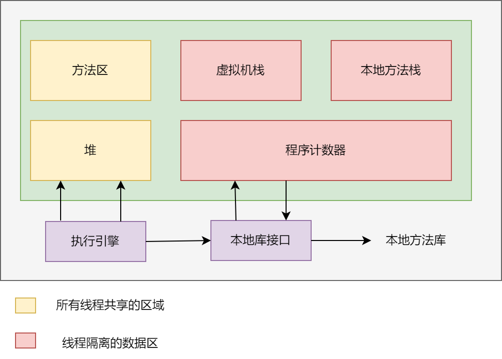

### 3. 线程共享 vs 线程私有（核心划分）

这是理解运行时数据区的**第一关键**：

- **线程共享**：堆、方法区。随虚拟机启动创建，虚拟机退出销毁，所有线程共用；
- **线程私有**：程序计数器、虚拟机栈、本地方法栈。随线程创建/销毁，各线程独立，互不影响。

### 4. JDK 1.8 的变化

随着 JDK 迭代，内存划分也在变化。**JDK 1.8 加入了「元空间（Metaspace）」概念**，把原来保存在方法区（永久代 PermGen）中的运行时常量池和类常量池迁移了过来（详见第六章）。

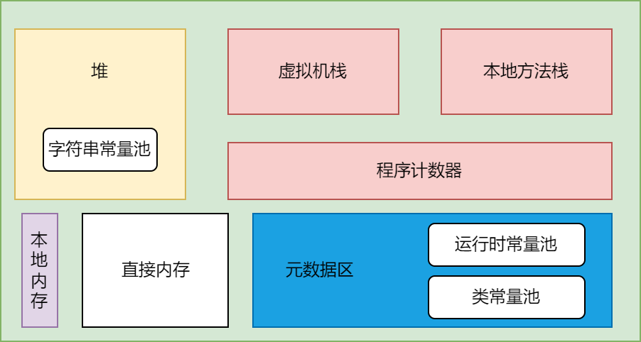

图中可以看到 JDK 1.8 之后，**字符串常量池** 仍在堆中；**运行时常量池** 与 **类常量池** 都搬到了 **元数据区（Metaspace）**；**直接内存** 划入本地内存管理——这是与 JDK 1.7 永久代时代的最大差异。

---

## 二、程序计数器

### 1. 作用：字节码行号指示器

程序计数器（Program Counter，PC）是运行时数据区中**最小的一块内存空间**，它是**当前线程正在执行的字节码指令的地址指示器**。

字节码解释器通过改变 PC 的值来选取下一条要执行的字节码指令——分支、循环、跳转、异常处理、线程恢复等**一切控制流的转移**，最终都要落到「修改 PC」这个动作上。

这里有一个容易误解的点需要先讲清：PC 里存的是**字节码指令的逻辑地址（字节码偏移量）**，不是 CPU 的物理内存地址。它指向的是方法字节码数组中的某个偏移位置，而不是操作系统进程地址空间里的真实地址。

### 2. JVM 规范对 PC 的定义

《Java Virtual Machine Specification》§2.5.1 对 PC 有权威定义，四个要点：

1. **每个线程一个 PC**：JVM 支持多线程并发执行，每条 Java 虚拟机线程都有自己的 PC 寄存器；
2. **PC 指向当前方法**：任一时刻，每条线程都在执行某个方法的代码（即该线程的「当前方法」）；
3. **非 native 方法**：PC 存的是**当前正在执行的 JVM 指令的地址**；
4. **native 方法**：PC 的值是 **undefined（未定义）**。

此外规范还规定：**PC 的宽度足以容纳一个 `returnAddress` 或特定平台上的 native 指针**。`returnAddress` 是字节码里 `jsr`/`ret` 指令用到的一种特殊类型，用于存返回地址——这从侧面说明 PC 在逻辑上就是一个「指向代码位置」的寄存器。

### 3. PC 指向的到底是什么：字节码偏移

Java 源码先被编译成 `.class` 文件里的**字节码**。字节码是一串 JVM 指令，每条指令由「1 字节操作码 + 0~多个操作数字节」组成，因此**每条指令的长度并不相同**。

以这段代码为例：

```java
public int add(int a, int b) {
    return a + b;
}
```

用 `javap -c` 反编译后：

```text
public int add(int, int);
    Code:
       0: iload_1      // 把局部变量 1（形参 a）压入操作数栈
       1: iload_2      // 把局部变量 2（形参 b）压入操作数栈
       2: iadd         // 弹出栈顶两个 int 相加，结果压回
       3: ireturn      // 返回栈顶 int
```

冒号前面的 `0 / 1 / 2 / 3` 就是**字节码偏移量（bytecode offset）**，也就是 PC 的值。解释器执行时，PC 依次取 0 → 1 → 2 → 3，每执行完一条指令就按该指令的长度跳到下一条的偏移：

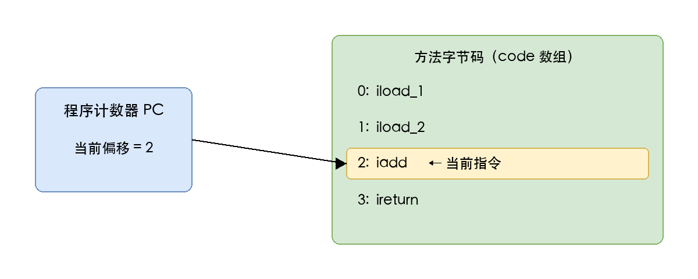

### 4. 分支/跳转如何改写 PC

PC 不是只会顺序 +1 的计数器——它会被**控制流指令直接改写**。看这个带分支的例子：

```java
public int abs(int a) {
    if (a >= 0) return a;
    return -a;
}
```

```text
public int abs(int);
    Code:
       0: iload_1
       1: iflt          6     // 若 a < 0，PC 跳到偏移 6
       4: iload_1
       5: ireturn
       6: iload_1
       7: ineg
       8: ireturn
```

当 `a >= 0` 时，PC 顺序走 `1 → 4 → 5`；当 `a < 0` 时，`iflt 6` 把 PC 直接改写成 6，走 `6 → 7 → 8`。**if / for / while / switch / 异常处理 / 方法调用**，底层全都是靠这类指令改写 PC 来实现控制流转移。

### 5. 线程私有：切换与恢复

Java 多线程是通过「线程轮流切换、分配处理器执行时间」实现的。在任一确定时刻，一个处理器（核）只会执行一条线程中的指令。为了线程切换后能**恢复到正确的执行位置**，每条线程都需要一个独立的 PC——各线程之间的计数器互不影响，是**线程私有**的内存区域。

从线程视角看运行时数据区，关系如下：每个线程各自有独立的 Frame 栈和程序计数器；堆、元空间、本地方法栈是所有线程共享的；对象上的成员变量在堆中，由所有线程通过 Frame 上的引用共同访问：

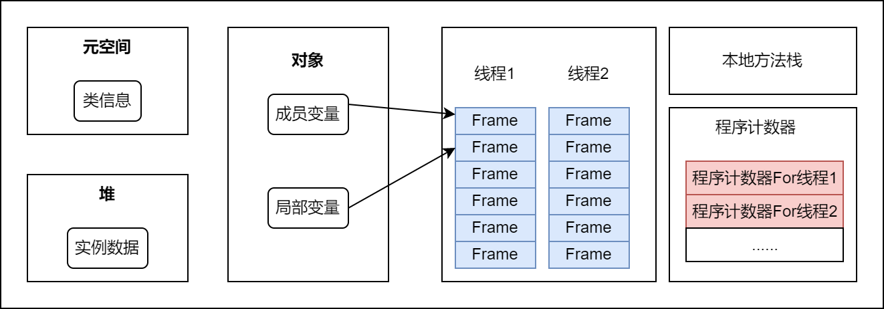

PC 的生命周期与线程完全绑定：**线程创建时分配，线程结束时回收**，中间不随方法的调用/返回而增删。

### 6. Native 方法时 PC 是 undefined

当线程正在执行的是 **native 方法**（非 Java 字节码，而是本地机器码）时，JVM 的 PC 值是 **undefined（未定义）**。

原因很直接：PC 的职责是指向「**JVM 字节码**指令」，而 native 方法的代码已经不在 JVM 字节码体系内，是操作系统加载到进程地址空间里的本地机器码，由 CPU 自己的指令指针寄存器（如 x86-64 的 RIP）来跟踪，与 JVM 的 PC 无关。

### 7. 唯一不会 OOM 的区域

程序计数器是运行时数据区中**唯一不会抛出 `OutOfMemoryError` 的区域**——这是 JVM 规范明确保证的。

根本原因在于它的存储模型：PC 只是一个**固定大小的寄存器**（宽度足以容纳一个指针，通常 4 或 8 字节），不像虚拟机栈、堆、方法区那样需要**动态扩展**。它不随着方法嵌套、对象分配而增长，自然不会出现「无法申请到足够内存」的情况。

### 8. PC 与 CPU 寄存器、HotSpot 实现

- **物理层面**：CPU 本身就有一个 PC 寄存器（在 x86 上叫 **IP / EIP / RIP**，指令指针），指向下一条要执行的机器指令。JVM 的 PC 是「逻辑上」模拟了 CPU 的 PC，只是它指向的是字节码而非机器码。
- **解释执行**：HotSpot 的模板解释器（Template Interpreter）里，用 **bcp（bytecode pointer）** 跟踪当前字节码指令，它就等价于 JVM 规范里的 PC——指向方法字节码数组（存在 `ConstMethod` 的 code 数组里）中的偏移。
- **JIT 编译后**：方法被即时编译成机器码后，就不再有「字节码偏移」了，此时由 CPU 的指令指针寄存器直接跟踪机器码地址——这也解释了为什么 PC 的宽度要能容纳一个 native 指针。

---

## 三、虚拟机栈

### 1. 概述：线程私有的「方法执行内存模型」

**虚拟机栈（Java Virtual Machine Stack）** 是运行时数据区中**线程私有**的一块内存区域，它的生命周期与线程完全一致：**线程创建时创建，线程结束时销毁**。

它与程序计数器一样，是「每条线程独占一份」的区域。但两者职责不同：程序计数器只记录「执行到哪一行字节码」，而虚拟机栈记录的是**方法的整个调用过程**——每次方法被调用，JVM 都会同步创建一个**栈帧（Stack Frame）**，用于存储该方法的局部变量、操作数、动态链接、返回地址等信息；方法执行完毕，对应的栈帧也随之销毁。

《Java 虚拟机规范》§2.5.2 对虚拟机栈的定义要点：

1. **每个线程一个栈**：每条 Java 虚拟机线程在创建时都会分配一个私有的虚拟机栈；
2. **栈里装的是栈帧**：栈里保存的是栈帧（Frame），不是原始数据本身；
3. **栈帧对应一次方法调用**：每一个方法从调用到执行完成，就对应一个栈帧在虚拟机栈中「入栈 → 出栈」的过程；
4. **两种溢出**：栈深度超限抛 `StackOverflowError`，动态扩展无法申请内存抛 `OutOfMemoryError`（详见第 7 小节）。

容易误解的一点：虚拟机栈**不存放对象**。对象都在堆里，栈里放的是指向对象的引用和基本类型值——「栈存引用、堆存对象」正是 Java 内存模型最核心的分工。

### 2. 栈帧：方法执行的基本单元

**栈帧（Stack Frame）** 是虚拟机栈中的基本元素，是「用于支持虚拟机进行方法调用和方法执行」的数据结构。方法调用链越深，栈里的栈帧就越多：

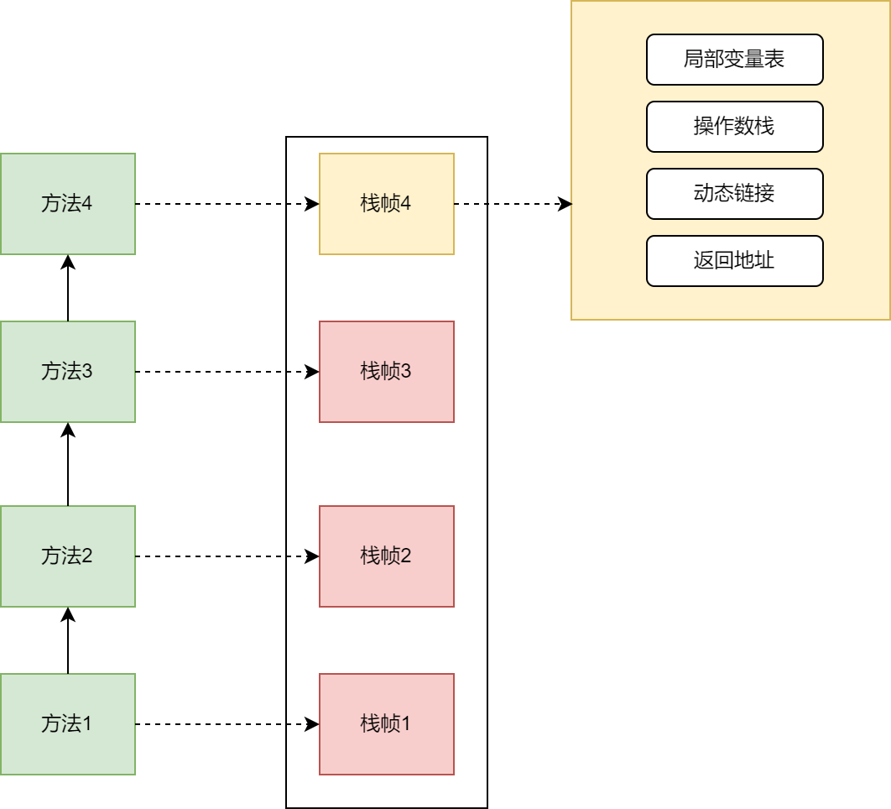

几个关键概念：

- **当前栈帧（Current Frame）**：位于栈顶、正在执行的方法对应的栈帧，只有当前栈帧才是「活动」的，指令只能操作当前栈帧；
- **当前方法（Current Method）**：当前栈帧所属的方法；
- **入栈/出栈**：方法被调用时栈帧入栈，方法返回（正常或异常）时栈帧出栈。

栈帧的大小在**编译期并非完全确定**：局部变量表、操作数栈的大小在编译期就能确定（写入 Class 文件的 `Code` 属性）；但动态链接、异常处理表等依赖运行期信息，无法在编译期固定。因此每个栈帧除了「编译期确定的部分」，还包含「运行期才补齐的部分」。


### 3. 局部变量表（Local Variables Table）

局部变量表是栈帧中最基础的一块区域，用于**存放方法参数和方法内定义的局部变量**，包括基本类型、对象引用（reference）和返回地址（returnAddress）。

**基本单位：变量槽（Variable Slot）**

- 一个 slot 至少能容纳 **32 位（4 字节）** 的数据；
- `boolean / byte / char / short / int / float / reference / returnAddress` 各占 **1 个 slot**；
- `long / double` 是 64 位类型，占 **2 个 slot**，并且**不允许单独访问其中的某一个 slot**（要么整体读写，要么都不动）。

下图是某个实例方法（假设签名形如 `long calc(int a, long b)`）的局部变量表，注意 `this` 的位置和 `long` 占两个槽：

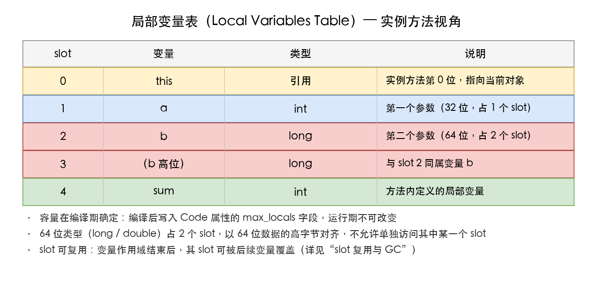

**几个必须掌握的细节：**

- **容量编译期确定**：局部变量表的容量（多少个 slot）在编译期就确定，写入 Class 文件 `Code` 属性的 `max_locals` 字段，运行期不可改变；
- **实例方法的 slot 0 是 `this`**：编译器会隐式地把当前对象引用作为第一个参数，所以实例方法局部变量表第 0 个 slot 永远是 `this`；静态方法则没有 `this`，slot 0 就是第一个显式参数；
- **参数在前、局部变量在后**：方法参数按声明顺序依次占据前面的 slot，方法体内定义的局部变量接着往后排；
- **不要求对齐**：JVM 规范不强制 `long / double` 必须按偶数 slot 对齐（从 slot 0 开始即可），不过 HotSpot 出于性能通常会对齐存放，这是实现层面的选择。

**slot 复用与 GC 的经典坑**

局部变量表的 slot 是**可以复用的**：当一个变量的作用域结束（比如离开它所在的 `{}` 代码块），它占用的 slot 就可以被后续定义的变量覆盖。

但这带来一个隐蔽的 GC 问题——看这段代码：

```java
public static void main(String[] args) {
    {
        byte[] placeholder = new byte[64 * 1024 * 1024]; // 64MB，作用域只在这个块内
    }
    // placeholder 的作用域已结束，但 slot 1 里还保留着对它的引用
    System.gc(); // 这次 GC 很可能不会回收这个 64MB 数组
}
```

虽然 `placeholder` 已经离开了作用域、代码层面无法再访问它，但只要**局部变量表里还有指向这个数组的 reference**，它就是一个「可达」对象，GC 就无法回收它。只有当下面的代码复用了同一个 slot（比如又定义了一个局部变量把 slot 1 覆盖掉），或者方法执行结束栈帧出栈，这个 64MB 数组才会真正被回收。

这就是为什么有些资料会建议「用完大对象手动置 `null`」或「尽量缩小变量作用域」——本质上都是在**让局部变量表的 slot 尽早失效**，减少对象被「假性引用」的时间。

### 4. 操作数栈（Operand Stack）

操作数栈（也叫操作栈）是栈帧中用于**字节码指令执行时的临时计算区域**，它就是一个标准的**后进先出（LIFO）**&#x6808;。

**基本特点：**

- **容量单位不是 slot**：操作数栈用「容量单位」度量，32 位数据类型占 1 个单位，64 位（long/double）占 2 个单位；
- **最大深度编译期确定**：写入 `Code` 属性的 `max_stacks` 字段；
- **只与当前栈帧联动**：字节码指令从操作数栈弹出操作数进行计算，再把结果压回操作数栈。

**操作数栈与局部变量表是两个独立区域**，数据在两者之间的搬运靠 `load / store` 指令完成：`iload` 把局部变量压入操作数栈，`istore` 把操作数栈栈顶值存回局部变量。下面用 `add` 方法完整走一遍，配合下图理解：

```java
public int add(int a, int b) {
    return a + b;
}
```

```text
public int add(int, int);
    Code:
       0: iload_1      // 把局部变量 a 压入操作数栈
       1: iload_2      // 把局部变量 b 压入操作数栈
       2: iadd         // 弹出栈顶两个 int（b、a）相加，结果压回栈顶
       3: ireturn      // 弹出栈顶结果作为方法返回值
```

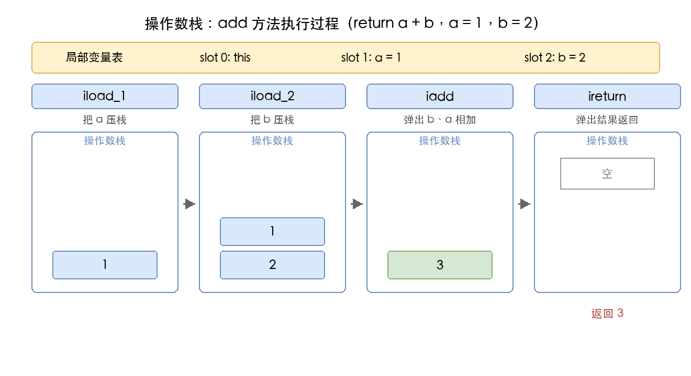

**栈顶缓存（Top-of-Stack Caching，ToS）**

HotSpot 对操作数栈有一个经典优化：由于字节码执行过程中栈顶元素会被频繁访问，解释器会把**栈顶元素缓存在 CPU 寄存器里**，而不是每次都读写内存。这样连续的算术操作可以少几次内存访问，提升解释执行效率——这是「逻辑上的栈」和「物理上的栈」不完全一致的典型例子。

### 5. 动态链接（Dynamic Linking）

每个栈帧都包含一个**指向运行时常量池（Runtime Constant Pool）中该栈帧所属方法的引用**，持有这个引用的目的，就是**支持方法调用过程中的动态链接**。

**符号引用 vs 直接引用**

Class 文件的常量池里存有大量的**符号引用（Symbolic Reference）**，比如 `CONSTANT_Methodref_info` 描述的就是「某个方法」的符号（类名 + 方法名 + 描述符），它是一串符号，不是真实内存地址。JVM 在类加载阶段或首次使用时，会把这些符号引用**解析（resolve）**&#x4E3A;**直接引用（Direct Reference）**——即方法在方法区里的实际入口地址或偏移量。

**静态链接 vs 动态链接**

- **静态链接（Static Linking）**：在类加载阶段就可以确定目标、且运行期不会改变的方法调用，编译期/加载期就能把符号引用转成直接引用。例如调用 `private` 方法、`final` 方法、`static` 方法、构造器——这些「不可被重写」的方法，属于**早期绑定（Early Binding）**；
- **动态链接（Dynamic Linking）**：直到运行期才能确定目标方法，符号引用在**每次运行期执行时**才转为直接引用，属于**晚期绑定（Late Binding）**。典型就是**多态**——父类引用调用被子类重写的方法，具体调哪个必须在运行期才知道。

晚期绑定在 HotSpot 里靠**虚方法表（vtable）**&#x548C;**接口方法表（itable）**&#x5B9E;现：类在方法区里维护一张 vtable，记录了所有可被重写方法（虚方法）的实际入口；调用虚方法时，先通过对象的实际类型找到对应类的 vtable，再定位到具体方法。这也是「动态链接」这个名称的由来——方法调用的目标在运行期才被「链接」到具体实现。

### 6. 方法返回地址（Return Address）

方法执行完后，需要**回到调用它的位置继续执行**，这个「回来的位置」就是方法返回地址。返回地址的保存方式取决于方法如何退出：

- **正常完成出口（Normal Method Invocation Completion）**：方法正常执行到某条返回指令（`ireturn / lreturn / freturn / dreturn / areturn`，以及无返回值的 `return`），此时**当前栈帧里保存调用者的 PC 值**作为返回地址；
- **异常完成出口（Abrupt Method Invocation Completion）**：方法执行中抛出未在本方法内捕获的异常（或显式执行 `athrow`），此时**返回地址不由栈帧保存**，而是由**异常处理器表（Exception Table）**&#x51B3;定——查找能处理该异常的代码块，跳到对应处理器，栈帧中通常不保存这类返回地址。

方法退出时，JVM 需要完成一系列「善后」动作，才能让调用者无缝接续：

1. **恢复调用者的局部变量表和操作数栈**；
2. 如果有返回值，**把返回值压入调用者的操作数栈**；
3. **调整 PC 计数器**，让它指向调用指令的下一条指令。

这一整套动作，本质上就是「当前栈帧出栈 → 上一个栈帧重新成为当前栈帧」。

### 7. 可能抛出的异常

- **`StackOverflowError`**：栈的深度超过了虚拟机允许的最大深度。最典型的就是**无限递归**——每递归一层就压一个栈帧，栈帧数量无限增长，最终栈空间耗尽；
- **`OutOfMemoryError`**：规范允许虚拟机栈动态扩展，但扩展时申请不到足够内存。需要说明的是，**HotSpot 的虚拟机栈实际是固定大小、不支持动态扩展的**，所以在 HotSpot 上基本不会因「栈扩展失败」抛 OOM——栈大小不足时表现成 `StackOverflowError`。这里保留 OOM 是因为它属于规范层面的规定。

可以用 `-Xss` 参数调整每个线程的栈容量（如 `-Xss1m`），栈越小，递归能承受的深度就越浅，越容易触发 `StackOverflowError`。

### 8. 栈大小

**栈大小的权衡**是一个容易被忽视但很实用的点：

- 每个线程的栈是**独立分配**的，栈越大，单个线程能承受的递归深度越大，但**线程占用的总内存也越大**；
- 进程可用内存有限，所以**栈越大，能同时创建的线程数就越少**。粗略估算：`最大线程数 ≈ 可用内存 / 每线程栈大小`；
- 这也是为什么「多线程高并发」场景反而要用较小的栈，而「深度递归」场景才需要调大 `-Xss`。

---

## 四、本地方法栈

### 1. Native Method 是什么

**本地方法（Native Method）** 是 Java 调用**非 Java 语言（主要是 C / C++）编写代码**的接口。一个方法一旦被 `native` 关键字修饰，就说明它的实现**不在字节码里**，而在本地动态链接库（本地机器码）中。

为什么 Java 已经「一次编写、到处运行」了，还需要 native 方法？几个现实原因：

1. **与底层交互**：Java 运行在虚拟机之上，很多操作无法直接触达操作系统或硬件（如获取 CPU 指令、操作底层设备、调用系统 API），必须借助本地代码；
2. **复用既有 C/C++ 资产**：Java 诞生时业界已有海量成熟的 C/C++ 库，通过 native 可以直接复用而不必重写；
3. **性能关键路径**：对极致性能敏感的部分用 C/C++ 实现更高效（现代 JIT 已大幅缩小差距，但这类场景依然存在）；
4. **JVM 自身就大量使用 native**：HotSpot 里的线程调度、内存分配、GC、系统调用等底层实现，很多本身就是 native 方法。

最直观的例子就是 `Object` 类：`hashCode()`、`clone()`、`notify()`、`wait()`、`getClass()` 这些方法都是 `native` 的，它们的实现全在 JVM 的本地代码里，Java 层只有一个空声明。

### 2. JVM 规范对本地方法栈的定义

《Java 虚拟机规范》§2.5.3 对本地方法栈的定义：

- 本地方法栈（Native Method Stack）与虚拟机栈**作用非常相似**，都是「栈帧」的容器；
- 区别在于**服务对象**：虚拟机栈为 JVM 执行 **Java 方法（字节码）** 服务，本地方法栈为 JVM 执行 **本地方法（Native Method）** 服务；
- 与虚拟机栈一样，本地方法栈也是**线程私有**的，生命周期与线程一致；
- 规范对本地方法栈**使用的语言、数据结构没有任何强制规定**，虚拟机实现可以自由决定——甚至可以不使用本地方法栈（HotSpot 正是把两者合并了，见第 8 小节）。

### 3. 本地方法栈 vs 虚拟机栈

| 对比项        | 虚拟机栈                         | 本地方法栈                |
| ---------- | ---------------------------- | -------------------- |
| 服务对象       | Java 方法（字节码）                 | Native 方法（机器码）       |
| 线程归属       | 线程私有                         | 线程私有                 |
| 栈帧内容       | 局部变量表 / 操作数栈 / 动态链接 / 返回地址   | C 语言栈帧（C 局部变量、返回地址等） |
| 可能抛异常      | `StackOverflowError` / `OOM` | 同虚拟机栈                |
| HotSpot 实现 | 独立                           | **与虚拟机栈合并，不区分**      |

规范层面两者是并列的两个区域；实现层面 HotSpot 选择合并，让本地方法的调用也走同一个栈，只是「栈帧」的内容从 Java 栈帧变成 C 栈帧。

### 4. JNI：Java 与本地代码的桥梁

本地方法的调用离不开 **JNI（Java Native Interface，Java 本地接口）**。JNI 是 JDK 提供的一套标准接口，定义了两件事：

1. **Java 层如何声明本地方法**：用 `native` 关键字；
2. **Java 层与本地层如何互访**：本地代码通过 `JNIEnv` 指针访问 Java 对象、调用 Java 方法、读写字段、抛出异常等。

JNI 最核心的职责是「**数据与对象的双向转换**」：

- Java 的基本类型与 C 类型一一对应：`int → jint`、`long → jlong`、`boolean → jboolean` 等；
- Java 的 `String`、数组、对象，在本地代码里通过 `jstring`、`jobject` 等「引用句柄」访问，不能直接用，需要通过 JNI 函数（如 `GetStringUTFChars`）取出真实数据；
- 本地方法返回时，再把 C 类型转换回 Java 类型。


### 7. Native 方法的栈帧与内存

当 Java 方法调用一个 native 方法时，运行时状态会发生几个关键变化：

- **PC 变成 undefined**：native 方法的代码是本地机器码，不在 JVM 字节码体系内，改由 CPU 的指令指针寄存器（如 x86-64 的 RIP）跟踪——这与第二章第 6 小节是同一个结论；
- **本地方法栈压入 C 栈帧**：栈帧内容不再是 Java 的「局部变量表 + 操作数栈」，而是 **C 语言的栈帧**（C 局部变量、函数返回地址等），由操作系统和编译器管理；
- **本地代码通过句柄访问堆**：通过 `JNIEnv` 提供的函数，本地代码能操作 Java 堆里的对象，但对象本身仍在堆中，本地方法栈里放的是 `jobject` 引用句柄，而不是对象本体。

下图给出 native 方法调用的完整链路与内存区域对照：

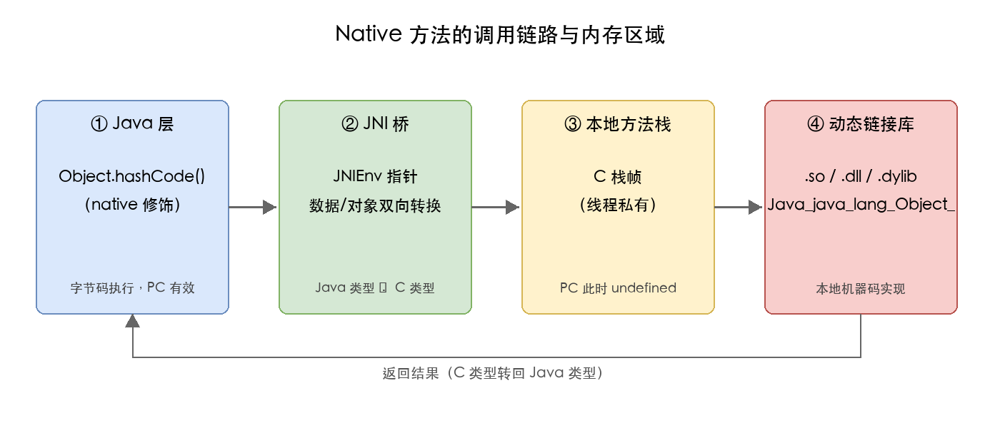

链路是：Java 层声明 native 方法 → 通过 JNI 桥做数据/对象转换 → 本地方法栈压入 C 栈帧（此时 PC undefined）→ 动态链接库执行本地机器码 → 返回结果再经 JNI 转回 Java 类型。

### 8. HotSpot 的实现：合并虚拟机栈与本地方法栈

HotSpot 为了简化实现，**把本地方法栈和虚拟机栈合并为一**，本地方法的调用也走同一个栈：

- 在 HotSpot 里**看不到一个独立的「本地方法栈」内存区域**，本地方法的 C 栈帧直接复用虚拟机栈；
- 这也是很多资料说「HotSpot 不区分虚拟机栈和本地方法栈」的原因；
- 但这只是实现选择，**规范层面两者依然是两个概念**，其他虚拟机实现完全可以分开管理。

最后补一个容易忽略的点：即使合并，本地方法调用仍会触发 Java 栈帧的**状态切换**——从「解释执行的字节码栈帧」切换到「本地 C 栈帧」，返回时再切回来。这个切换本身是有开销的，也是「JNI 调用有性能成本」的来源之一，所以应尽量避免在热路径上频繁跨越 JNI 边界。

---

## 五、堆

### 1. 基本特点

Java 堆是 JVM 管理的内存中**最大的一块**，虚拟机启动时创建，**所有线程共享**：

- Java **对象实例和数组**都在堆上分配（除 JIT 编译后的逃逸分析场景，见第 8 小节）；
- 大小可固定，也可按需扩展/收缩，且**不需要连续**；
- 堆是**垃圾收集器管理的主要区域**，所以也叫「GC 堆」。

JVM 规范对堆的定义是「**所有对象实例以及数组都应当在对上分配**」（§2.5.4），但随着逃逸分析、栈上分配、标量替换等 JIT 优化技术的成熟，「全部对象都在堆上分配」这句话在 HotSpot 实际运行中并不绝对——但绝大多数普通对象依然在堆上。

### 2. 对象的内存分配方式

在堆上为新对象分配内存时，JVM 主要采用两种方式，**取决于堆是否规整**：

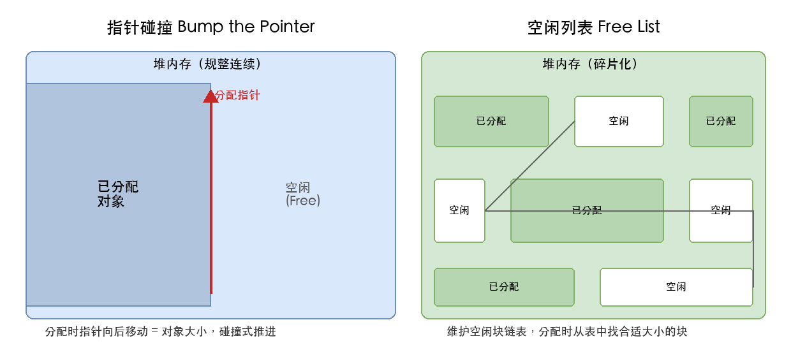

**指针碰撞（Bump the Pointer）**

- 堆内存**绝对规整**（已分配的在一侧，空闲的在另一侧）时使用；
- 维护一个**分配指针**，最初指向空闲区起始位置；
- 分配时把指针向空闲区方向**推进对象大小的距离**；
- 速度快、零碎片；
- 触发条件：堆被 GC 整理成规整状态后（如复制算法、标记-整理算法）。

**空闲列表（Free List）**

- 堆内存**碎片化**时使用（已分配/未分配块交错）；
- JVM 维护一个**空闲块链表**，记录每段空闲区的起始地址和大小；
- 分配时从链表中**找到一块足够大的空间**（一般用「首次适配」「最佳适配」「最差适配」等策略）划给对象，更新链表；
- 速度较慢、有外碎片；
- 触发条件：堆被 GC 整理成碎片化状态后（如标记-清除算法）。

**并发分配的问题**：上述两种方式都是「在临界区更新指针/链表」，多线程同时分配时需要**同步**。HotSpot 用 **CAS + 失败重试** 保证原子性；更高效的做法是 **TLAB**（见第 5 小节），让每个线程预先占一块私有空间，避开竞争。

### 3. 对象在堆中的内存布局

HotSpot 中，一个普通 Java 对象在堆内存里**逻辑上**分为三块（数组对象在前面多一块 length 标记）：

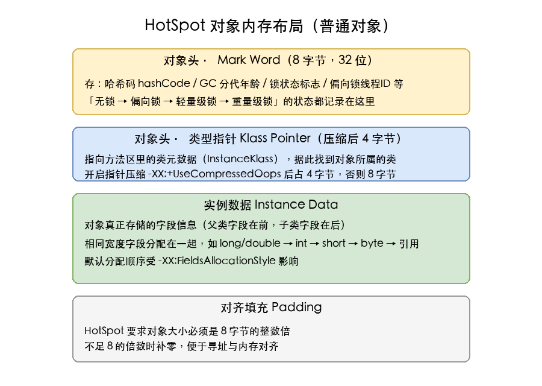

| 部分 | 大小 | 作用 |
|------|------|------|
| **对象头（Header）** | 8 字节（无压缩）/ 12 字节 | 包含 Mark Word + 类型指针 |
| &nbsp;&nbsp;· Mark Word | 8 字节（32 位是 4 字节） | 哈希码、GC 分代年龄、锁状态标志、偏向锁线程 ID、epoch 等 |
| &nbsp;&nbsp;· 类型指针 Klass Pointer | 4 字节（压缩）/ 8 字节 | 指向方法区里的 `InstanceKlass`（类元数据） |
| **实例数据（Instance Data）** | 不定 | 对象的字段内容（基本类型、引用），父类字段在前、子类字段在后 |
| **对齐填充（Padding）** | 0~7 字节 | 保证对象大小是 8 字节整数倍，便于寻址与内存对齐 |

**几个关键细节**：

- **Mark Word 是「复用字段」**：由于对象头固定只有 4/8 字节，但又要存哈希码、GC 年龄、锁状态、偏向锁信息等多个不同时刻的字段，JVM 用「按位复用」的方式在不同状态下让这些字段共享存储空间——比如无锁态存哈希码+分代年龄，有锁态存锁记录指针；
- **类型指针压缩**：开启 `-XX:+UseCompressedOops`（默认开启）时，Klass Pointer 压缩到 4 字节。这是为了在 64 位系统上让对象头更紧凑、节省内存——同时堆内引用、字段也都会被压缩；
- **字段排序**：HotSpot 默认按 `long/double → int → short → byte → boolean → reference` 的顺序分配字段，便于内存紧凑。可用 `-XX:FieldsAllocationStyle` 调整；
- **数组对象**会多出一块 4 字节长度字段（`-XX:+UseCompressedClassPointers` 时为 8 字节），用于记录数组长度，所以数组对象头比普通对象多 4~8 字节。

### 4. 分代结构深入

现代收集器基本采用**分代收集算法**——「不同对象生命周期不同」，GC 按对象年龄采取不同策略：

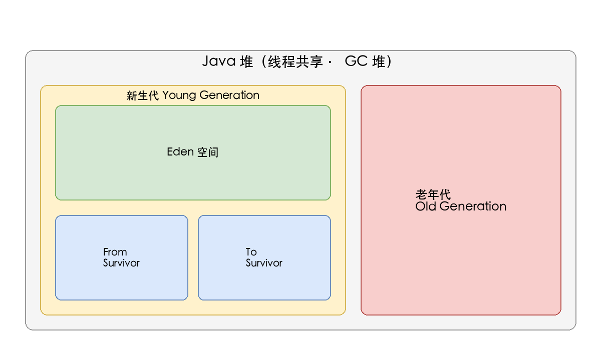

**新生代（Young Generation）**

- 进一步分为：1 块 **Eden 空间** + 2 块等大的 **Survivor 空间（From / To）**；
- 默认比例 `Eden : From : To = 8 : 1 : 1`（`-XX:SurvivorRatio=8`）；
- **对象优先在 Eden 分配**：新 new 出来的对象几乎都先落到 Eden；
- **Minor GC（Young GC）** 只回收新生代：
  - 触发条件：Eden 区满时；
  - 回收算法：复制算法（把 Eden + From 中存活的对象复制到 To，存活对象年龄 +1；然后清空 Eden 和 From，From/To 互换角色）；
  - 优点：复制算法回收快、空间连续、零碎片；
  - 缺点：复制需要额外 Survivor 区、对象全死掉时复制浪费（但新生代「朝生夕死」假设成立时浪费少）。

**老年代（Old Generation）**

- 存放**熬过多次 Minor GC 仍然存活的对象**（默认年龄阈值 15，对应 `MaxTenuringThreshold`）；
- 触发回收的是 **Major GC** 或 **Full GC**（一般伴随整个堆的回收）；
- 回收算法：标记-清除 / 标记-整理（无复制，原因是老年代对象存活率高、复制开销大）；
- 触发条件相对复杂：老年代空间不足、显式 `System.gc()`（可禁用）、CMS/G1 触发的并发周期等。

**对象晋升的几种情况**

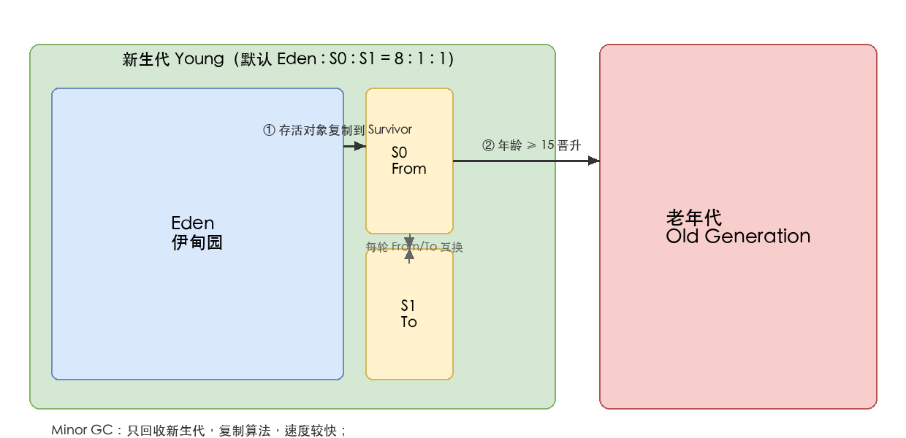

- **年龄达到阈值**：对象在 Survivor 区每熬过一次 Minor GC，年龄 +1，达到 `MaxTenuringThreshold`（默认 15）后晋升老年代；
- **Survivor 空间不足**：Minor GC 复制时如果 To Survivor 装不下存活对象，会通过**分配担保**机制直接晋升到老年代；
- **大对象直接进老年代**：`-XX:PretenureSizeThreshold`（只对 Serial/ParNew 收集器有效）以上的大对象直接进入老年代，避免在 Eden/Survivor 来回复制；
- **动态对象年龄判定**：Survivor 中「相同年龄的对象总大小 > Survivor 一半」时，所有大于等于该年龄的对象直接晋升，不必等阈值。

### 5. TLAB：线程私有分配缓冲区

由于堆是线程共享的，多线程同时 `new` 对象时**都需要修改分配指针/空闲链表**——必须加锁，否则指针会被错乱。

**TLAB（Thread Local Allocation Buffer）** 是 HotSpot 用来消除这种竞争的关键优化：

- 每个线程在**新生代 Eden 区内**预先「认领」一块**私有分配区**；
- 线程内 `new` 对象时**只在自己这块 TLAB 里分配**，无需加锁，速度接近指针碰撞；
- TLAB 用完时再申请一块；偶尔 TLAB 剩余空间不足，分配会**回退到 Eden 公共区**（加锁分配）；
- 默认开启 `-XX:+UseTLAB`，TLAB 大小由 JVM 动态调整（`-XX:TLABSize` 设定初始大小，JVM 会基于分配历史自动 resize）；
- 调优关注点：`-XX:TLABWasteTargetPercent`（允许 TLAB 浪费的空间占比），以及 `-XX:+PrintTLAB` 观察 TLAB 使用率。

TLAB 是「**线程私有**」的，但**从属于新生代 Eden**——它只是堆内划分出来的私有分配区，**对象本身仍属于堆**。这是 JMM 内存可见性层面和分配性能层面要分清的关键：TLAB 不影响 happens-before 语义（对象在堆里，跨线程可见性靠主内存同步而非 TLAB）。

### 6. 字符串常量池在堆中

**JDK 1.7 起，字符串常量池（StringTable）从方法区搬到了堆中**——这是 JDK 1.7 永久代去化的第一步。

原因：永久代有固定大小限制，且只有 Full GC 才会回收，导致大量 `String` 字面量堆积时容易 OOM。把 StringTable 放进堆后：

- 堆空间更大，字符串常量池不再受 `-XX:PermSize` / `-XX:MaxPermSize` 限制；
- 字符串常量池里的对象成为普通堆对象，可被**普通 GC（Minor GC）** 回收；
- `-XX:StringTableSize` 控制 StringTable 哈希表桶数（默认 60013），影响查找/插入性能。

```java
String s1 = "hello";          // 字面量，编译期进入常量池
String s2 = new String("hello");  // new 一个新对象，不在池中
String s3 = s2.intern();      // 把 s2 放入池中（或返回池中已有引用）
// JDK 7+：s1 == s3 为 true
```

`String.intern()` 的行为也在 JDK 7 调整过：之前是「复制字符串到永久代」，现在是「首次调用时把字符串引用放入堆的 StringTable」（不再复制字符串本体）。这是字符串常量池话题里最常见的考点。

### 7. 堆内存参数与调优

| 参数 | 作用 | 备注 |
|------|------|------|
| `-Xms` | 堆初始大小 | 等同于 `-XX:InitialHeapSize` |
| `-Xmx` | 堆最大大小 | 等同于 `-XX:MaxHeapSize` |
| `-Xmn` | 新生代大小 | 等同于 `-XX:NewSize` / `-XX:MaxNewSize` |
| `-XX:NewRatio` | 老年代 / 新生代 的比例 | 默认 2，即老年代 : 新生代 = 2 : 1 |
| `-XX:SurvivorRatio` | Eden / Survivor 的比例 | 默认 8 |
| `-XX:MaxTenuringThreshold` | 对象晋升老年代的年龄阈值 | 默认 15 |
| `-XX:PretenureSizeThreshold` | 大对象直接进老年代的阈值 | 只对 Serial/ParNew 有效 |
| `-XX:+UseTLAB` | 是否启用 TLAB | 默认开启 |
| `-XX:StringTableSize` | 字符串常量池哈希表桶数 | 默认 60013 |
| `-XX:+HeapDumpOnOutOfMemoryError` | OOM 时 dump 堆快照 | 排查 OOM 利器 |

**典型调优场景**：

- 大数据/缓存型应用 → 堆大、年轻代也大，减少 GC 频率；
- 短生命周期对象多 → 适当调大 Survivor 区、降低对象过早晋升；
- Full GC 频繁 → 检查是否有内存泄漏、老年代是否过小、`-Xms == -Xmx` 减少动态扩容开销。

**OOM**：堆内存不足时抛 `java.lang.OutOfMemoryError: Java heap space`——对象太多 / 太大 / 有内存泄漏。

### 8. 逃逸分析与栈上分配

JVM 规范说「对象在堆上分配」，但 HotSpot 通过 **JIT 即时编译器 + 逃逸分析（Escape Analysis）**，能让一部分对象**不在堆上分配**：

**逃逸分析**：JIT 分析对象的作用域，如果一个对象**只在当前方法内使用**（不逃逸出方法），就可以做优化：

- **栈上分配（Stack Allocation）**：对象直接在线程栈上分配，方法结束自动释放，**不需要 GC**；
- **标量替换（Scalar Replacement）**：把对象拆成基本类型的成员变量（标量），直接在线程栈帧的局部变量表里使用；
- **同步消除（Lock Elision）**：如果对象不逃逸、不会被其他线程访问，那么加锁操作是多余的，JIT 会去掉同步。

**逃逸分析 ≠ 一定优化**：HotSpot 默认开启逃逸分析（`-XX:+DoEscapeAnalysis`），但**实际是否走栈上分配还要看 JIT 编译成本**。只有「非逃逸 + 标量可替换 + 编译器能完整优化」时才会真正栈上分配，所以 HotSpot 上**绝大多数对象依然在堆上**——但逃逸分析为 JIT 优化提供了空间。

**相关参数**：

- `-XX:+DoEscapeAnalysis`：开启逃逸分析（默认开启）；
- `-XX:+EliminateAllocations`：开启标量替换（默认开启）；
- `-XX:+EliminateLocks`：开启同步消除（默认开启）。

---

## 六、方法区

### 1. 存放内容

方法区与堆一样是**线程共享**的内存区域，用来存放**被 JVM 加载的类型信息**。规范上方法区是「堆的一个逻辑部分」，但 HotSpot 在 JDK 1.8 之后用**元空间（Metaspace）** 在本地内存中实现（详见第 5、6 小节）。

方法区主要存放以下内容：

| 内容 | 说明 |
|------|------|
| **类型信息** | 类/接口的全限定名、直接父类全限定名、直接父接口全限定名、访问修饰符、字段表、方法表 |
| **域信息** | 字段名、字段类型、字段修饰符、字段在类中的声明顺序 |
| **方法信息** | 方法名、返回类型、方法参数、方法修饰符、字节码、操作数栈、局部变量表大小、异常表 |
| **运行时常量池** | 见第 2 小节 |
| **静态变量（Static 变量）** | `static` 字段（注：JDK 7 后 static 变量随 Class 对象一起搬入堆；JDK 8 后 static 变量随 Class 对象仍在堆中） |
| **JIT 代码缓存** | 即时编译后的热点机器码（CodeCache），由 JIT 管理 |
| **类加载器引用** | 每个类对应的 ClassLoader 引用 |
| **运行期常量** | 编译器生成的各种字面量、符号引用；运行期 `String.intern()` 等动态新增的常量 |

### 2. 运行时常量池

**运行时常量池（Runtime Constant Pool）** 是方法区的一部分，**每个类/接口都有自己独立的运行时常量池**。它是 Class 文件中**常量池表**的运行期形态：

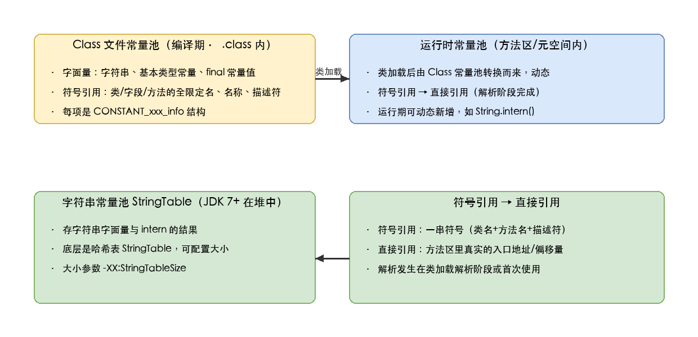

**Class 文件常量池（编译期）**

- 编译期由 `javac` 生成，存放在 `.class` 文件中；
- 是一组 `CONSTANT_xxx_info` 表项（如 `CONSTANT_Integer_info`、`CONSTANT_String_info`、`CONSTANT_Methodref_info` 等）；
- 包含两类内容：
  - **字面量（Literal）**：字符串、final 常量值、基本类型字面量；
  - **符号引用（Symbolic Reference）**：类/接口的全限定名、字段的名称和描述符、方法的名称和描述符。

**运行时常量池（方法区/元空间）**

- 类加载阶段，JVM 把 Class 文件常量池**加载到方法区**，转为运行时常量池；
- 具备**动态性**：运行期可向常量池新增常量，最典型的就是 `String.intern()`，以及 `ldc` 指令触发的首次引用解析；
- 符号引用在**解析阶段**或**首次使用**时会被翻译成**直接引用（Direct Reference）**——直接引用是方法区里真实的方法入口地址或字段偏移量，调用时直接通过它定位；
- **异常类型**：`OutOfMemoryError: PermGen space`（JDK 7 及以前）或 `OutOfMemoryError: Metaspace`（JDK 8+），常因常量池过大或类加载过多触发。

**字符串常量池 StringTable**

- JDK 1.7 起搬到了**堆中**（详见第五章第 6 小节）；
- 是运行时常量池里**字符串常量**的哈希表实现，避免重复创建相同内容的字符串；
- 哈希表桶数 `-XX:StringTableSize` 可调（默认 60013）。

### 3. 类的生命周期

类的整个生命周期分 7 个阶段，**「验证、准备、解析」** 三个阶段合称**「连接（Linking）」**：

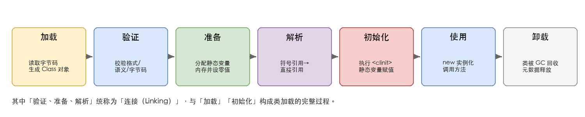

| 阶段 | 触发时机 | 关键动作 |
|------|----------|----------|
| **加载（Loading）** | 首次主动引用（如 `new`、`getstatic`、`invokestatic` 等） | 通过类的全限定名获取字节码 → 字节流转 `java.lang.Class` 对象 → 方法区存类元数据 |
| **验证（Verification）** | 紧接着加载 | 文件格式验证 / 元数据验证 / 字节码验证 / 符号引用验证 |
| **准备（Preparation）** | 紧接着验证 | **为类变量（static 变量）分配内存并设零值**；注意此时**不执行**任何 Java 代码；final static 常量在编译期已确定，会在准备阶段直接赋值 |
| **解析（Resolution）** | 不一定紧跟准备；可能在初始化后 | 把常量池内的**符号引用替换为直接引用**（类/接口、字段、方法解析） |
| **初始化（Initialization）** | 主动引用触发 | 执行类构造器 `<clinit>()`：合并所有 `static` 赋值语句和 `static {}` 块，**按源码顺序**执行 |
| **使用（Using）** | 初始化完成后 | `new` 实例化、调用方法、访问字段 |
| **卸载（Unloading）** | 类加载器、Class 对象、Class 实例均不可达 | 回收方法区里该类的元数据，详见第 8 小节 |

**「主动引用」与「被动引用」**：只有主动引用才会触发初始化，被动引用不会。典型被动引用场景：

- 通过子类引用父类的静态字段（只触发父类初始化）；
- 定义类的数组（如 `new MyClass[10]`，只触发 `MyClass` 的加载，不触发初始化）；
- 引用编译期常量（如 `final static int` 常量，编译期直接内联到调用类常量池）。

**双亲委派模型与类加载器**密不可分：从顶向下依次是 **Bootstrap ClassLoader → Extension ClassLoader → Application ClassLoader → 自定义类加载器**；每个加载器收到加载请求时**先委派给父加载器**去尝试加载，只有父加载器无法加载时才自己加载——保证核心类（`java.*`）的优先级和唯一性。

### 4. 特点

- 方法区在 JVM **启动时创建**，物理内存空间和堆一样可以**不连续**；
- 大小可选择固定或可扩展；
- 方法区大小决定系统能保存多少类，**类定义过多会导致方法区溢出**；
- 关闭 JVM 即释放该区域内存；
- 方法区**也会被 GC 回收**，但回收条件苛刻（详见第 8 小节）——这是和堆回收最显著的区别。

### 5. 永久代 → 元空间（JDK 1.8 演进）

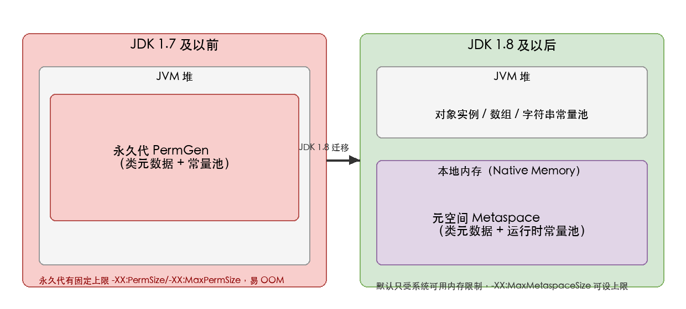

| 版本 | 实现 | 位置 | 溢出异常 |
|------|------|------|----------|
| **JDK 1.7 及以前** | 永久代（PermGen） | **JVM 堆内** | `java.lang.OutOfMemoryError: PermGen space` |
| **JDK 1.8 及以后** | 元空间（Metaspace） | **本地内存（Native Memory）** | `java.lang.OutOfMemoryError: Metaspace` |

**为什么 JDK 1.8 要把永久代换为元空间？** 核心是永久代有两个老大难问题：

1. **固定大小易 OOM**：永久代有 `-XX:PermSize` / `-XX:MaxPermSize` 限制（默认 64M / 82M），类加载过多（如 Spring/动态代理）时极易 OOM；
2. **GC 复杂**：永久代位于堆内，Full GC 才能回收，且需要专门的回收器调优；
3. **HotSpot 与 JRockit 合并不兼容**：Oracle 收购 BEA 后要把 HotSpot 和 JRockit 合并，JRockit 本身就没有永久代概念，必须去掉。

**元空间的好处**：

- 使用**本地内存**，默认**只受系统可用内存限制**，大幅缓解类元数据空间不足的问题；
- 类元数据从堆里搬走后，堆的回收压力降低；
- `-XX:MaxMetaspaceSize` 可设置上限（默认 -1，即无上限），不设就只受系统物理内存限制。

**演进过程中几个细节**：

- JDK 1.6 时，方法区实现还是永久代，运行时常量池、字符串常量池都在永久代；
- JDK 1.7 时，**字符串常量池** 从永久代搬到堆；
- JDK 1.8 时，**永久代整个被移除**，类元数据全部进元空间（本地内存），**运行时常量池**也搬到了元空间（StringTable 仍在堆）；
- 永久代被移除后，JVM 启动参数里 `-XX:PermSize` / `-XX:MaxPermSize` 失效，必须用 `-XX:MetaspaceSize` / `-XX:MaxMetaspaceSize`。

### 6. 元空间的内存结构

HotSpot 的元空间并不是一整块连续的本地内存，而是分成了几个子区域：

- **Klass Metaspace（类元数据空间）**：存放 `InstanceKlass`（Java 类在 JVM 内部的表示）、`InstanceMirrorKlass`（`java.lang.Class` 对象对应的内部类）等类元数据；
- **Non-Class Metaspace**：存放类相关的辅助数据，如常量池、方法字节码、JIT 相关数据、注解等；
- **Compressed Class Space（压缩类空间）**：开启指针压缩（`-XX:+UseCompressedClassPointers`，默认开启）时启用，专门存**类指针的压缩编码**，可用 `-XX:CompressedClassSpaceSize` 设上限（默认 1G）；

**几个关键参数**：

| 参数 | 默认值 | 作用 |
|------|--------|------|
| `-XX:MetaspaceSize` | 约 21M | 触发 Full GC 的初始阈值，**首次**达到会触发 Full GC 重新计算 |
| `-XX:MaxMetaspaceSize` | -1（无上限） | 元空间最大可用本地内存；**强烈建议设置**，避免本地内存耗尽导致进程被 OOM Killer 杀掉 |
| `-XX:MinMetaspaceFreeRatio` / `-XX:MaxMetaspaceFreeRatio` | 40 / 70 | GC 后元空间空闲比例的上下限，超出则扩容/缩容 |
| `-XX:CompressedClassSpaceSize` | 1G | 压缩类空间大小 |
| `-XX:+UseCompressedClassPointers` | 开启 | 是否启用类指针压缩 |

**OOM 排查**：当出现 `OutOfMemoryError: Metaspace` 时，**先看是不是类加载器泄漏**（如 Web 容器每次请求都新建 ClassLoader 而不释放，导致旧 Class 卸不掉）；其次看是不是真的类太多（如动态生成大量代理类、CGLIB/ASM 用法不当）。可以用 `-XX:+HeapDumpOnOutOfMemoryError` + `jhat` / `jvisualvm` / `MAT` 分析 dump。

### 7. 字符串常量池的去向

字符串常量池 `StringTable` 在 JDK 1.7 时**从方法区（永久代）搬到了堆中**，JDK 1.8 后留在堆里（详见第五章第 6 小节）。

**为什么字符串常量池要在堆里？**

- 字符串对象本身是对象，放在堆里更自然；
- 堆的 GC 频率更高、回收更及时，StringTable 可以被 Minor GC 回收，缓解永久代的 OOM 风险；
- 字符串常量池的哈希表用普通对象就能实现，不需要走「方法区」的特殊对象体系。

### 8. 方法区的 GC：类卸载

方法区**也会被 GC**，但回收条件非常苛刻，主要回收**无用的类**和**无用的常量**。

**类卸载条件**（需全部满足）：

1. 该类的**所有实例**都已被回收（堆中不存在该类的任何实例）；
2. 加载该类的 **ClassLoader 已被回收**；
3. 该类的 `java.lang.Class` 对象**没有被任何地方引用**，无法通过反射访问该类的方法。

**典型场景**：

- 自定义类加载器加载的类（如 Web 容器的 JSP 类加载器、OSGi 的 Bundle 类加载器）满足上述条件，**可被卸载**；
- 启动类加载器（Bootstrap）加载的类（如 `java.lang.*`）**永远不会被卸载**——启动类加载器生命周期与 JVM 一致。

**无用的常量**（如字符串 `"abc"`）也支持回收：如果常量池里某个字符串常量**没有任何 String 对象引用**，GC 时可能回收其 StringTable 槽位。

**Full GC 是回收方法区的主力**，但一般情况下面向服务的应用很少触发类卸载——只有动态加载/卸载类的容器（Tomcat/Jetty 的热部署、OSGi、Spring DevTools 等）才会有大量类卸载需求。

---

## 附：高频速记

- **五大部分**：方法区、堆、虚拟机栈、本地方法栈、程序计数器。
- **线程共享**：堆、方法区；**线程私有**：程序计数器、虚拟机栈、本地方法栈。
- **程序计数器**：字节码行号指示器，唯一不抛 OOM 的区域。
- **虚拟机栈**：线程私有，栈帧 = 局部变量表 + 操作数栈 + 动态链接 + 返回地址。
- **栈溢出**：无限递归 → `StackOverflowError`。
- **本地方法栈**：服务 Native 方法，HotSpot 与虚拟机栈合一。
- **堆**：最大块、线程共享、对象和数组；分代（新生代 Eden/Survivor + 老年代）；TLAB 加速分配；**对象分配两种方式：指针碰撞 / 空闲列表**；**对象内存布局：对象头（Mark Word + 类型指针）+ 实例数据 + 对齐填充**；**字符串常量池 JDK 7+ 在堆中**；Minor GC 复制算法 / Major GC 标记-整理；**逃逸分析可能栈上分配**。
- **方法区**：类型信息、运行时常量池、静态变量、JIT 缓存；**JDK 1.8 永久代 → 元空间（本地内存）**；**运行时常量池每个类独立、Class 常量池的运行期形态、具备动态性**；**类生命周期：加载→验证→准备→解析→初始化→使用→卸载**；**类卸载需全部实例+ClassLoader+Class 对象均不可达**；元空间默认只受本地内存限制，建议设 `-XX:MaxMetaspaceSize`。
