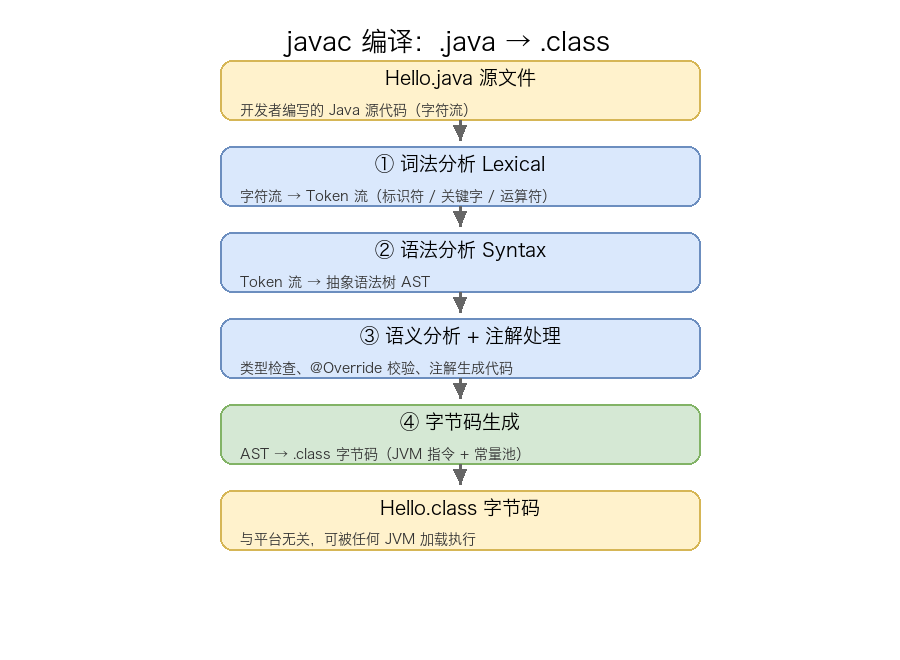
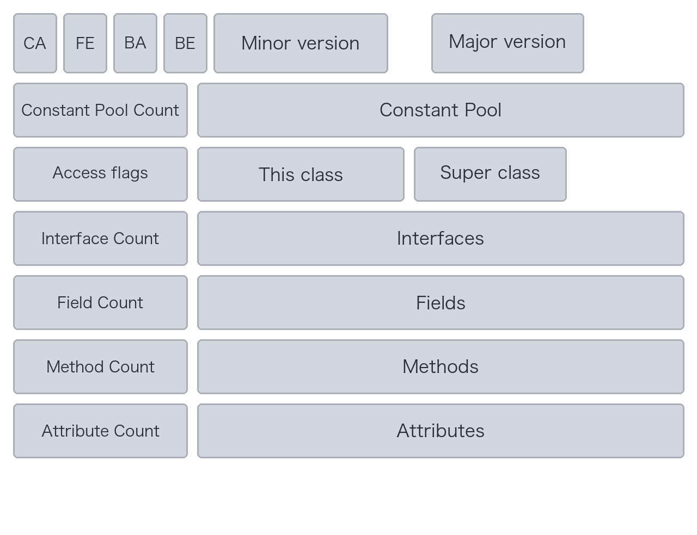
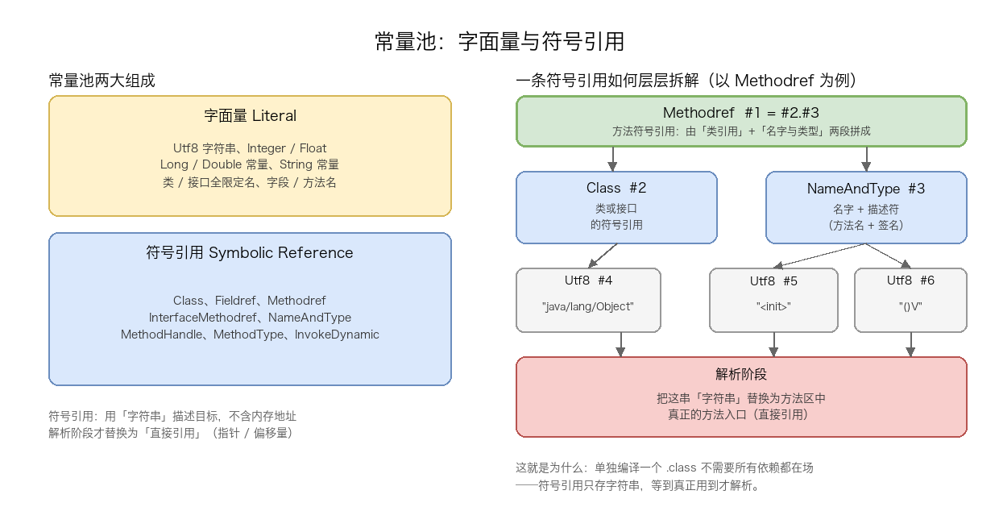

# 03. 类加载机制一：Class 文件分析

> Java 程序被 `javac` 编译成 `.class` 文件后，JVM 才可能加载并运行它。本文聚焦类加载机制的「输入物」——Class 文件：先讲清 `.java` 源码如何一步步被编译成 `.class` 字节码（javac 的四阶段、语法糖脱糖、注解处理器、javap 反编译），再逐字节拆解 Class 文件的二进制结构（魔数、版本号、17 种常量池类型、访问标志、字段表、方法表、Code 属性、属性表），并以一个完整的 `Hello.class` 十六进制剖析收尾。理解 Class 文件结构是掌握字节码工程（ASM / Javassist）与后续类加载、执行机制的基础。

## 目录

- [一、从 .java 源码到 .class 字节码](#一从-java-源码到-class-字节码)
- [二、Class 文件结构分析](#二class-文件结构分析)
- [附：高频速记](#附高频速记)

---

## 一、从 .java 源码到 .class 字节码

### 1. Java 编译的两阶段：前端 javac + 后端 JIT

理解「`.class` 从哪里来」，必须先分清 Java 程序的两次编译：

| 阶段       | 工具                 | 产物           | 时机                 | 触发方 |
| -------- | ------------------ | ------------ | ------------------ | --- |
| **前端编译** | `javac`            | `.class` 字节码 | 编译期（开发者执行 `javac`） | 开发者 |
| **后端编译** | JIT（HotSpot C1/C2） | 本地机器码        | 运行期（方法被识别为热点）      | JVM |

本文聚焦**前端编译**——这是类加载机制的「上游」：没有 `.class` 就无从谈起加载。至于后端编译（JIT 即时编译），它属于执行引擎的职责范畴，不在本文展开。

### 2. javac 编译器做了什么

`javac` 内部是一个标准的编译器前端。它做了三件事：

1. **解析源码**：把字符流变成结构化的 AST
2. **语义校验**：检查类型、变量、继承等是否符合 Java 语言规范
3. **生成字节码**：把 AST 翻译成符合 JVM 规范的字节码指令序列

与 C/C++ 编译器不同，`javac` 不做后端优化——所有重活都在运行期由 JIT 接手。

### 3. 编译流程详解（4 阶段）

`javac` 的前端编译具体经历四个阶段：



**① 词法分析（Lexical Analysis）**

把源文件字符流拆解成 Token 流（标识符、关键字、字面量、运算符、分隔符）。例如 `int a = b + c;` 会被拆成 `[int, 标识符:a, =, 标识符:b, +, 标识符:c, ;]`。

**② 语法分析（Syntax Analysis）**

根据 Java 语法规则，将 Token 流组装成**抽象语法树（AST）**。这一步会检查括号匹配、语句合法性等结构性错误。如果语法有误（如缺少分号），编译器在此阶段报错。

**③ 语义分析与注解处理（Semantic Analysis & Annotation Processing）**

检查类型兼容性（如 `String s = 123` 会报错）、变量是否先声明后使用、`@Override` 注解是否真的覆盖了父类方法。同时处理注解处理器（如 Lombok 在此阶段生成 getter/setter 代码）。

**④ 字节码生成（Code Generation）**

遍历 AST，生成符合 JVM 规范的字节码指令序列，写入 `.class` 文件。输出包括：操作码（opcode）、操作数（operand）、常量池索引、异常表、行号表等。

实际使用中，一行命令即可完成全部四个阶段：

```bash
javac -encoding UTF-8 -g Hello.java
```

- `-encoding UTF-8`：指定源文件编码
- `-g`：生成调试信息（局部变量表、行号表）


### 4. 编译期处理的常见语法糖

Java 语言为了让开发者写得舒服，设计了大量语法糖。`javac` 在编译期会把这些语法糖"脱糖"为底层字节码。理解这点对阅读 `javap -c` 输出至关重要：

| 语法糖                                   | 编译期处理                                                                                    |
| ------------------------------------- | ---------------------------------------------------------------------------------------- |
| **泛型**（`List<String>`）                | 类型擦除为 `List`（raw type）+ `Signature` 属性保留泛型签名                                             |
| **自动装箱**（`Integer i = 10`）            | 转为 `Integer.valueOf(10)`                                                                 |
| **增强 for**（`for (T t : list)`）        | 转为 `Iterator` 循环                                                                         |
| **可变参数**（`foo(String... args)`）       | 转为 `String[] args`                                                                       |
| **try-with-resources**（JDK 7+）        | 编译为 `try { ... } finally { resource.close(); }` + `addSuppressed`                        |
| **字符串拼接**（`String s = "a" + b + "c"`） | JDK 9 前转为 `StringBuilder.append()`，JDK 9+ 改用 `invokedynamic` 走 `makeConcatWithConstants` |
| **Lambda 表达式**（JDK 8+）                | 编译为 `invokedynamic` + `LambdaMetafactory` 引导方法                                           |
| **switch 字符串**（JDK 7+）                | 编译为两次 `switch`：第一次按 `hashCode()` 分支，第二次按 `equals()` 比较                                   |

**举例**：源码 `List<String> list = new ArrayList<>();`，编译后：

```text
// javap -c 输出片段
INVOKESTATIC java/lang/Integer.valueOf (I)Ljava/lang/Integer;
CHECKCAST java/lang/String
INVOKEINTERFACE java/util/List.add (Ljava/lang/Object;)Z
POP
```

可以看到：泛型信息完全擦除，取而代之的是 `Object` 和强制类型转换。

### 5. 注解处理器（APT）

注解处理发生在编译期第 ③ 阶段，是 `javac` 留给开发者的「扩展点」。常见框架：

| 框架                      | 用途                                             |
| ----------------------- | ---------------------------------------------- |
| **Lombok**              | 在编译期通过 AST 操作生成 getter/setter/toString/builder |
| **MapStruct**           | 在编译期根据接口生成 Bean 映射代码                           |
| **AutoService**（Google） | 在编译期为 SPI 实现生成 `META-INF/services/...` 文件      |

注解处理器本质上是实现了 `javax.annotation.processing.Processor` 接口的类，通过 `META-INF/services/javax.annotation.processing.Processor` 注册。运行方式：

```bash
javac -processor com.example.MyProcessor Hello.java
```

### 6. javap 反编译初探

生成的 `.class` 是二进制文件，无法直接阅读。JDK 自带 `javap` 反汇编工具可以将其还原为可读格式：

```text
$ javap -c -p -s -verbose Hello.class
```

常用参数：

| 参数                 | 作用                  |
| ------------------ | ------------------- |
| `-c`               | 反汇编方法体中的字节码指令       |
| `-p`               | 显示所有类和成员（含 private） |
| `-s`               | 打印内部类型签名            |
| `-verbose`（即 `-v`） | 输出常量池、行号表、栈帧大小等详细信息 |

`javap -v` 输出的信息量最大，是理解 Class 文件结构的最佳入口。下一节将对照 `javap -v` 输出逐项解读 Class 文件的二进制布局。

---

## 二、Class 文件结构分析

### 1. 总体布局与无符号整数

Class 文件是一组以 **8 位字节为单位**的二进制流，各数据项严格按照顺序紧凑排列，中间**没有任何分隔符或填充对齐**。这使得 Class 文件可以被任何支持二进制读取的程序解析（不依赖特定平台）。



整个文件用三种**无符号整数**表示基础数据类型：

| 数据类型 | 长度   | 用途                 |
| ---- | ---- | ------------------ |
| `u1` | 1 字节 | 常量池 tag、布尔标志       |
| `u2` | 2 字节 | 多数计数器、索引、版本号、访问标志  |
| `u4` | 4 字节 | 魔数、主版本号、`float` 常量 |

整个文件由以下部分组成（按出现顺序）：

| 序号 | 名称                | 类型                    | 大小 | 说明                              |
| -- | ----------------- | --------------------- | -- | ------------------------------- |
| 1  | 魔数 magic          | u4                    | 4B | 固定值 `0xCAFEBABE`                |
| 2  | 版本号               | u2 + u2               | 4B | 次版本号 + 主版本号                     |
| 3  | 常量池               | u2 + cp_info[]        | 变长 | 字面量 + 符号引用（最复杂部分）               |
| 4  | 访问标志 access_flags | u2                    | 2B | 类/接口/修饰符标志位                     |
| 5  | 类索引 this_class    | u2                    | 2B | 指向当前类的常量池索引                     |
| 6  | 父类索引 super_class  | u2                    | 2B | 指向直接父类（Object 为 0）              |
| 7  | 接口索引集合            | u2 + u2[]             | 变长 | 实现的接口列表                         |
| 8  | 字段表集合             | u2 + field_info[]     | 变长 | 类的字段声明                          |
| 9  | 方法表集合             | u2 + method_info[]    | 变长 | 类的方法声明（含 `<init>` / `<clinit>`） |
| 10 | 属性表集合             | u2 + attribute_info[] | 变长 | Code / LineNumberTable 等        |


### 2. 魔数与版本号

**魔数（Magic Number）** 是 Class 文件的唯一标识，固定为 `0xCAFEBABE`（咖啡宝贝）。JVM 在加载类文件时首先检查魔数——如果不是这个值，直接抛出 `java.lang.ClassFormatError: Bad magic number`。

> **为什么用魔数？** 文件格式识别传统方案有两种：① 文件扩展名（`.class`），② 文件开头若干字节的"魔数"。文件扩展名易被伪造/丢失，而魔数直接写在文件最前面，是最可靠的身份标识。`.gif`（`0x47494638`）、`.png`（`0x89504E47`）、`.pdf`（`0x25504446`）都采用同样的设计。

**版本号**由两个字段组成：

```text
minor_version (u2) · major_version (u2)
```

主版本号对应 JDK 版本（部分常见映射）：

| 主版本号 | JDK 版本        | 备注                            |
| ---- | ------------- | ----------------------------- |
| 45   | JDK 1.0 / 1.1 | 初始版本                          |
| 46   | JDK 1.2       |                               |
| 47   | JDK 1.3       |                               |
| 48   | JDK 1.4       | assert 关键字                    |
| 49   | JDK 5         | 泛型、注解、枚举引入                    |
| 50   | JDK 6         |                               |
| 51   | JDK 7         | try-with-resources、switch 字符串 |
| 52   | JDK 8         | Lambda、默认方法、invokedynamic     |
| 53   | JDK 9         | 模块化系统（JPMS）                   |
| 54   | JDK 10        | `var` 局部变量类型推断                |
| 55   | JDK 11        | LTS、单文件 `java` 启动             |
| 56   | JDK 12        | switch 表达式（预览）                |
| 57   | JDK 13        | text blocks（预览）               |
| 58   | JDK 14        | records（预览）                   |
| 59   | JDK 15        | sealed classes（预览）            |
| 60   | JDK 16        | records 转正                    |
| 61   | JDK 17        | sealed classes 转正、LTS         |
| 62   | JDK 18        | 简单 Web Server                 |
| 63   | JDK 19        | 虚拟线程（预览）                      |
| 64   | JDK 20        |                               |
| 65   | JDK 21        | 虚拟线程转正、LTS                    |

JVM 规定：**低版本 JVM 无法加载高版本 Class 文件**（高版本可向下兼容）。如果用 JDK 21 编译出的 `.class` 放到 JDK 8 上运行，会报 `UnsupportedClassVersionError`。


### 3. 常量池（Constant Pool）—— 最核心也最复杂

常量池是 Class 文件中**资源最丰富的区域**，占据了文件的大部分空间。JVM 的"动态性"（延迟绑定、动态加载、反射调用）几乎全部建立在常量池之上。



#### 3.1 常量池的两大类

常量池存放两类数据：

**（1）字面量（Literal）**：接近 Java 语言层面的常量概念

- 文本字符串（如 `"Hello"`）
- final 修饰的常量值（如 `42`, `3.14`）
- 类和接口的全限定名（如 `com/example/Hello`）
- 字段名和方法名（如 `main`, `<init>`）

**（2）符号引用（Symbolic Reference）**：编译原理的概念，描述被引用的目标

- 类和接口的全限定名
- 字段的名称和描述符
- 方法的名称和描述符

符号引用在**解析阶段**（类加载连接阶段的第三步）才会被替换为直接引用（内存地址指针）。在此之前，JVM 不知道目标是否真实存在——这就是为什么可以单独编译一个 `.class` 文件而不需要所有依赖都在场。

#### 3.2 完整 17 种常量项类型（JDK 8 / JDK 9+）

常量池以 `cp_info[]` 数组形式存储，每一项都有一个 1 字节的 `tag` 标识其类型：

| Tag | 类型                            | 引入版本 | 说明                           |
| --- | ----------------------------- | ---- | ---------------------------- |
| 1   | `CONSTANT_Utf8`               | 1.0  | UTF-8 编码字符串（其他类型的"原材料"）      |
| 3   | `CONSTANT_Integer`            | 1.0  | int 字面量（4 字节）                |
| 4   | `CONSTANT_Float`              | 1.0  | float 字面量（4 字节）              |
| 5   | `CONSTANT_Long`               | 1.0  | long 字面量（8 字节，**占两个索引位置**）   |
| 6   | `CONSTANT_Double`             | 1.0  | double 字面量（8 字节，**占两个索引位置**） |
| 7   | `CONSTANT_Class`              | 1.0  | 类或接口的符号引用                    |
| 8   | `CONSTANT_String`             | 1.0  | 字符串类型字面量                     |
| 9   | `CONSTANT_Fieldref`           | 1.0  | 字段的符号引用                      |
| 10  | `CONSTANT_Methodref`          | 1.0  | 方法的符号引用                      |
| 11  | `CONSTANT_InterfaceMethodref` | 1.0  | 接口方法的符号引用                    |
| 12  | `CONSTANT_NameAndType`        | 1.0  | 名字 + 描述符                     |
| 15  | `CONSTANT_MethodHandle`       | 7    | 方法句柄（`invokedynamic` 用）      |
| 16  | `CONSTANT_MethodType`         | 7    | 方法类型（`invokedynamic` 用）      |
| 17  | `CONSTANT_Dynamic`            | 11   | 动态计算常量（`condy`）              |
| 18  | `CONSTANT_InvokeDynamic`      | 7    | 动态方法调用（Lambda 用）             |
| 19  | `CONSTANT_Module`             | 9    | 模块符号引用                       |
| 20  | `CONSTANT_Package`            | 9    | 包符号引用                        |

> Tag 值 **2、13、14 未使用**——13、14 是历史遗留占位（JDK 5 设计给 `Annotation` 与 `Enum` 用，后改用 Utf8 表示；tag 2 也废弃）。

#### 3.3 long / double 占两个索引位置

`CONSTANT_Long` 和 `CONSTANT_Double` 各占 **2 个常量池索引**（8 字节数据），这是历史遗留的设计——为了让所有 cp_info 都能用 2 字节索引访问。

**举例**：假设 `#4 = CONSTANT_Long 1024L`，那么常量池的实际访问顺序是：

```text
#3 = Utf8    "someString"   // 上一个
#4 = Long    1024           // 占用 #4 和 #5
#5 = (实际不存在)            // 留给 Long 的高位字节
#6 = Utf8    "nextString"   // 下一个，从 #6 开始
```

**验证方法**：如果某个索引位置是 Long 或 Double，紧接其后的索引位置必须跳过。`javap -v` 输出会清晰显示这一规则。

#### 3.4 符号引用的拆解链（一张 Methodref 的展开）

符号引用本质是**一组字符串的拼接**。以最常见的 `Methodref` 为例：

```java
// 源码
new Object();
```

编译后，常量池中产生如下引用链：

```text
#1 = Methodref          #2.#3        // 引用 #2 和 #3
#2 = Class              #4           // 类符号引用
#3 = NameAndType        #5:#6        // 名字+类型符号引用
#4 = Utf8               "java/lang/Object"
#5 = Utf8               "<init>"
#6 = Utf8               "()V"
```

读法：`#1` 指向一个方法，这个方法属于 `#2` 类（`java/lang/Object`），名字是 `#5`（`<init>`），签名是 `#6`（`()V`，即无参 + 返回 void）。

**为什么需要拆成三层？** 因为常量池要支持"复用"——多个 Methodref 可能引用同一个 Class，同一个方法名/签名也常被多处复用。拆成三层 + 共享叶子，让常量池保持紧凑。

#### 3.5 javap -v 常量池输出示例

下面是一个简化的 `javap -v` 常量池输出片段（来自一个最简单的 `Hello.java`）：

```text
Constant pool:
   #1 = Methodref          #4.#20         // java/lang/Object."<init>":()V
   #2 = Fieldref           #21.#22        // java/lang/System.out:Ljava/io/PrintStream;
   #3 = String             #23            // Hello, World!
   #4 = Class              #24            // java/lang/Object
   #5 = Class              #25            // com/example/Hello
   #6 = Methodref          #26.#27        // com/example/Hello.main:([Ljava/lang/String;)V
   ...
  #23 = Utf8               "Hello, World!"
  #24 = Utf8               "java/lang/Object"
  #25 = Utf8               "com/example/Hello"
  #26 = Utf8               "main"
  #27 = Utf8               "([Ljava/lang/String;)V"
```

可以看到：常量池本质上是一个**符号表**，通过索引互相引用。方法区中的运行时常量池就是它的运行时表示。

### 4. 访问标志（access_flags）

2 个字节，用于标识类或接口的访问权限及属性：

| 标志位              | 值      | 含义                                     |
| ---------------- | ------ | -------------------------------------- |
| `ACC_PUBLIC`     | 0x0001 | public                                 |
| `ACC_FINAL`      | 0x0010 | final（不可继承）                            |
| `ACC_SUPER`      | 0x0020 | 使用新的 invokespecial 语义（JDK 1.0.2 后默认设置） |
| `ACC_INTERFACE`  | 0x0200 | 接口                                     |
| `ACC_ABSTRACT`   | 0x0400 | 抽象类或接口                                 |
| `ACC_SYNTHETIC`  | 0x1000 | 编译器自动生成（非源码显式声明）                       |
| `ACC_ANNOTATION` | 0x2000 | 注解类型                                   |
| `ACC_ENUM`       | 0x4000 | 枚举类型                                   |
| `ACC_MODULE`     | 0x8000 | 模块（仅 module-info.class）                |

一个普通 `public class` 的 access_flags 通常为 `0x0021`（`ACC_PUBLIC | ACC_SUPER`）。一个普通接口为 `0x0209`（`ACC_PUBLIC | ACC_INTERFACE | ACC_ABSTRACT`）。

### 5. 类索引、父类索引、接口索引

- **this_class（u2）**：指向常量池中 `CONSTANT_Class` 条目，代表当前类本身。
- **super_class（u2）**：指向直接父类。只有 `java.lang.Object` 的 super_class 为 0（表示无父类）。
- **interfaces_count（u2）+ interfaces[]（u2[]）**：实现的所有接口，每项指向常量池中的 `CONSTANT_Class`。

> **接口的 super_class**：所有接口的 super_class 都是 `java.lang.Object`——这是 JVM 自动填充的，与 Java 语言层「接口无父类」的语义略有差异。

### 6. 字段表集合（field_info[]）

每个字段对应一个 `field_info` 结构：

```
field_info {
    u2             access_flags;     // 访问修饰符（public/private/static/final...）
    u2             name_index;       // 字段名（指向常量池 Utf8）
    u2             descriptor_index; // 字段描述符（I/J/D/Z/Lxxx; 等）
    u2             attributes_count; // 属性数量
    attribute_info attributes[];     // 属性表（ConstantValue 等）
}
```

**字段描述符**用特定字符表示类型：

| 描述符      | 对应 Java 类型                                  |
| -------- | ------------------------------------------- |
| `B`      | byte                                        |
| `C`      | char                                        |
| `D`      | double                                      |
| `F`      | float                                       |
| `I`      | int                                         |
| `J`      | long                                        |
| `S`      | short                                       |
| `Z`      | boolean                                     |
| `V`      | void                                        |
| `L全限定名;` | 对象类型（如 `Ljava/lang/String;`）                |
| `[维度`    | 数组（如 `[I` 表示 `int[]`，`[[D` 表示 `double[][]`） |

### 7. 方法表集合（method_info[]）

方法的结构与字段类似，但属性表中通常包含最重要的 **Code 属性**：

```
method_info {
    u2             access_flags;
    u2             name_index;       // "<init>" / "<clinit>" / 方法名
    u2             descriptor_index; // 参数返回值描述符
    u2             attributes_count;
    attribute_info attributes[];     // Code 属性在这里！
}
```

**Code 属性**是方法的核心——它包含了：

- `max_stack`：操作数栈的最大深度
- `max_locals`：局部变量表的槽位数
- `code_length + code[]`：真正的字节码指令序列
- `exception_table_length + exception_table[]`：异常处理表
- `attributes[]`：`LineNumberTable`（行号映射）、`LocalVariableTable`（局部变量信息）、`StackMapTable`（类型验证）

这就是为什么 `javap -c` 能反汇编出字节码指令——它读取的就是 Code 属性里的 `code[]` 数组。

### 8. 方法描述符完整语法

方法描述符是**参数列表 + 返回值**的紧凑字符串表达：

```
方法描述符 ::= "(" 参数描述符 ")" 返回值描述符
```

**举例对照**：

| 源码方法签名                      | 方法描述符                                  |
| --------------------------- | -------------------------------------- |
| `void m()`                  | `()V`                                  |
| `int m()`                   | `()I`                                  |
| `String m(int a)`           | `(I)Ljava/lang/String;`                |
| `void m(String[] arr)`      | `([Ljava/lang/String;)V`               |
| `int m(long[] a, byte[] b)` | `([J[B)I`                              |
| `<T> List<T> m(T t)`        | `(Ljava/lang/Object;)Ljava/util/List;` |

> 注意：泛型在描述符中**完全擦除**——`List<String>` 和 `List<Integer>` 在描述符层面都是 `Ljava/util/List;`。泛型签名保存在 `Signature` 属性中。

### 9. Code 属性完整结构

```
Code_attribute {
    u2 attribute_name_index;   // 属性名（指向常量池 Utf8 "Code"）
    u4 attribute_length;       // 属性长度（不含前 6 字节）
    u2 max_stack;              // 操作数栈最大深度
    u2 max_locals;             // 局部变量表槽位数
    u4 code_length;            // 字节码长度
    u1 code[code_length];      // 字节码指令流
    u2 exception_table_length; // 异常表长度
    u2 start_pc;               // try 开始位置
    u2 end_pc;                 // try 结束位置（不含）
    u2 handler_pc;             // catch 块开始位置
    u2 catch_type;             // 捕获的异常类型（指向常量池 CONSTANT_Class，0 表示 finally）
    u2 attributes_count;       // Code 属性内的属性表（如 LineNumberTable）
    attribute_info attributes[attributes_count];
}
```


### 10. 属性表集合（attribute_info[]）

属性表是 Class 文件中**最灵活的部分**——字段、方法、类本身都可以携带属性。常用属性：

| 属性名称                            | 出现位置    | 用途                                        |
| ------------------------------- | ------- | ----------------------------------------- |
| **Code**                        | 方法      | 字节码指令、栈/局部变量大小、异常表                        |
| **LineNumberTable**             | 方法 Code | 源码行号 ↔ 字节码偏移量映射（调试用）                      |
| **LocalVariableTable**          | 方法 Code | 局部变量名、作用域、描述符（调试用）                        |
| **StackMapTable**               | 方法 Code | 帧状态类型快照（验证器用）                             |
| **ConstantValue**               | 字段      | `static final` 常量的值                       |
| **Exceptions**                  | 方法      | 声明抛出的受检异常列表                               |
| **InnerClasses**                | 类       | 内部类信息（外部类 + 内部类关系）                        |
| **EnclosingMethod**             | 类       | 局部内部类 / 匿名类的外部方法                          |
| **SourceFile**                  | 类       | 源文件名                                      |
| **SourceDebugExtension**        | 类       | 扩展调试信息（如 Kotlin 协程）                       |
| **Signature**                   | 类/字段/方法 | 泛型签名（擦除前的原始类型）                            |
| **BootstrapMethods**            | 类       | `invokedynamic` 引导方法（JDK 7+，Lambda 依赖此机制） |
| **RuntimeVisibleAnnotations**   | 类/字段/方法 | 运行时可见注解                                   |
| **RuntimeInvisibleAnnotations** | 类/字段/方法 | 运行时不可见注解（仅编译期用）                           |
| **MethodParameters**            | 方法      | 方法形参名 + 修饰符（JDK 8+）                       |
| **NestHost / NestMembers**      | 类       | 嵌套类归属关系（JDK 11+，解决 JDK 11 前内部类访问限制）       |

> **StackMapTable** 是 JDK 6 引入类型检查验证器（类型推断验证器已弃用）时必须的——记录了每个跳转目标处栈帧的状态（操作数栈深度 + 局部变量类型），供 JVM 在跳转时快速校验类型一致性。如果用 ASM 等字节码工具修改 Code 属性，必须同步维护 StackMapTable，否则会抛 `VerifyError`。


### 11. 一个完整的 Hello.class 十六进制逐字节剖析

为了把上面所有内容串起来，下面剖析一个最简 `.class` 文件（`Hello.class`），源码是 `public class Hello {}`。`javap -v` 的输出用文本表达，但真实的 Class 文件是二进制：

```text
$ xxd -c 16 Hello.class
00000000: cafe babe 0000 0034 0021 0700 0200 0307  .......!.!.....
00000010: 0004 0700 0500 0601 0006 3c69 6e69 743e  .........<init>
00000020: 0100 0328 2956 0100 0443 6f64 6501 000f  ...()V...Code..
00000030: 6c69 6e65 4e75 6d62 6572 5461 626c 6501  lineNumberTable.
00000040: 000a 536f 7572 6365 4669 6c65 0100 0a48  ..SourceFile..H
00000050: 656c 6c6f 2e6a 6176 610c 0007 0008 0100  ello.java......
00000060: 0568 656c 6c6f 0100 106a 6176 612f 6c61  .hello..java/la
00000070: 6e67 2f4f 626a 6563 7400 2100 0300 0200  ng/Object.!.....
00000080: 0400 0000 0100 0500 0600 0100 0700 0800  ................
00000090: 0100 0900 0a00 0200 0100 0b00 0c00 0000  ................
```

**逐字节解读**：

| 偏移                   | 字节            | 含义                                        |
| -------------------- | ------------- | ----------------------------------------- |
| `0x00-0x03`          | `CA FE BA BE` | 魔数（`0xCAFEBABE`）                          |
| `0x04-0x05`          | `00 00`       | 次版本号 = 0                                  |
| `0x06-0x07`          | `00 34`（52）   | 主版本号 = 52（JDK 8）                          |
| `0x08-0x09`          | `00 21`（33）   | 常量池计数器：33 项（实际 32 项，因 Long/Double 占 2 个槽） |
| `0x0A`               | `07`          | `#1 CONSTANT_Class`，索引 `#2`               |
| `0x0B-0x0C`          | `00 02`       | → `#2`                                    |
| `0x0D`               | `07`          | `#2 CONSTANT_Class`，索引 `#3`               |
| `0x0E-0x0F`          | `00 03`       | → `#3`                                    |
| ...（省略中间常量池项）        |               |                                           |
| `0x96-0x99`          | `00 00 00 01` | access_flags = `0x0001`（`ACC_PUBLIC`）     |
| `0x9A-0x9B`          | `00 05`       | this_class 指向常量池 `#5`（Hello）              |
| `0x9C-0x9D`          | `00 06`       | super_class 指向常量池 `#6`（Object）            |
| `0x9E-0x9F`          | `00 00`       | interfaces_count = 0                      |
| `0xA0-0xA1`          | `00 01`       | fields_count = 1                          |
| ...（字段表，详见 javap 输出） |               |                                           |
| `0xAE-0xAF`          | `00 02`       | methods_count = 2（`<init>` + 默认构造器）       |

**通过 `xxd` + `javap -v` 互相对照，可以彻底搞懂 Class 文件的二进制布局。** 这是掌握字节码工程（如 ASM/Javaassist）的基础。

---

## 附：高频速记

### Class 文件结构速记

```
magic(4B, 0xCAFEBABE) + version(4B) + constant_pool(变长) + access_flags(2B)
+ this/super/interfaces + fields + methods + attributes
```

- 魔数固定 `0xCAFEBABE`
- 常量池最复杂：字面量 + 符号引用，**17 种 cp_info 类型**（JDK 9+），**Long/Double 占 2 个索引**
- Code 属性在方法表的属性表中（存放字节码指令）
- 属性表是最灵活的部分（长度可变、类型丰富、StackMapTable 必备）

### javac 编译四阶段速记

| 阶段        | 核心动作                    |
| --------- | ----------------------- |
| 词法分析      | 字符流 → Token 流           |
| 语法分析      | Token 流 → AST           |
| 语义分析与注解处理 | 类型检查 + APT（Lombok 等）    |
| 字节码生成     | AST → 字节码指令 + 常量池 + 属性表 |
