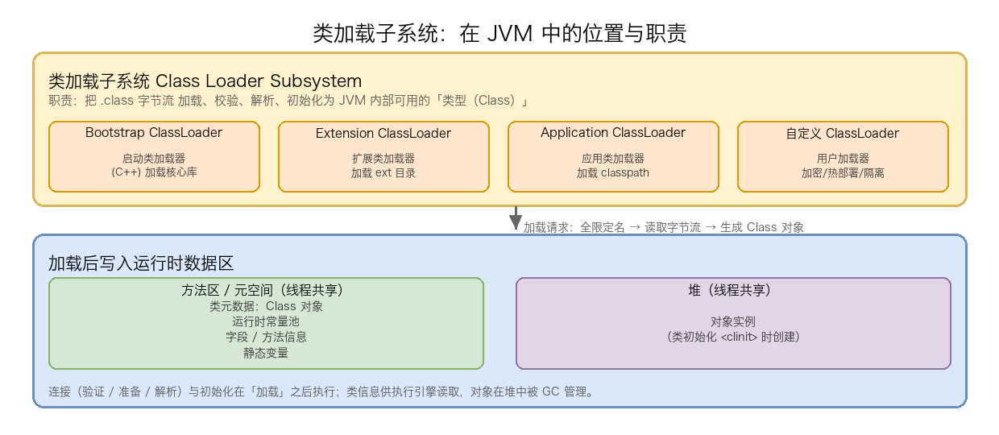
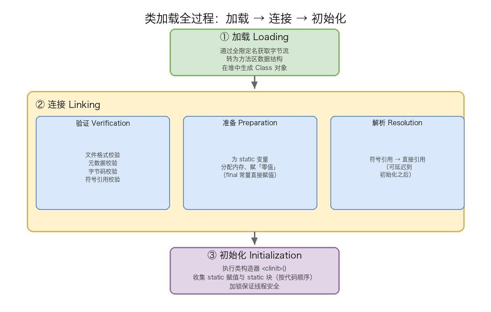
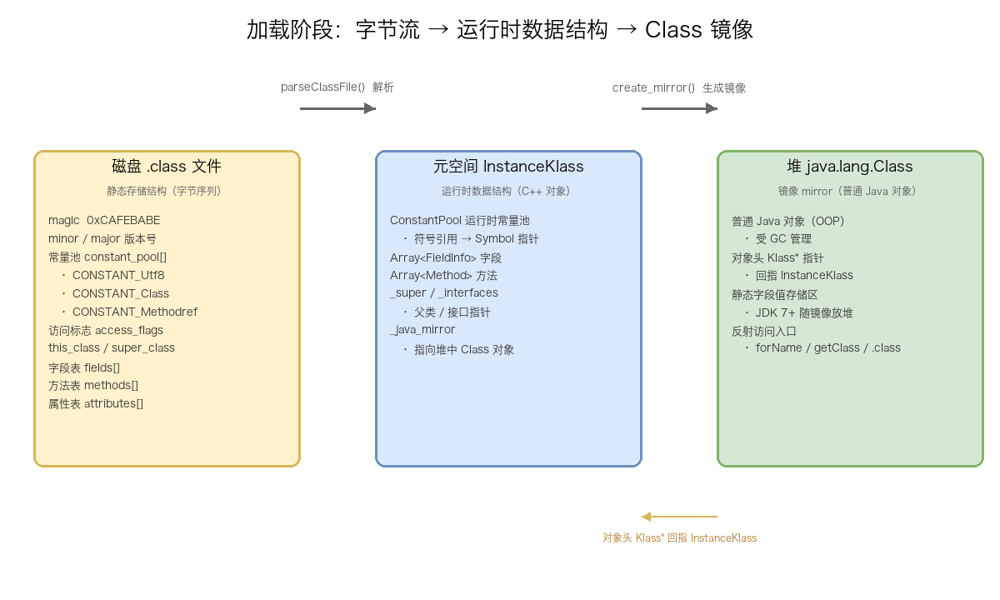
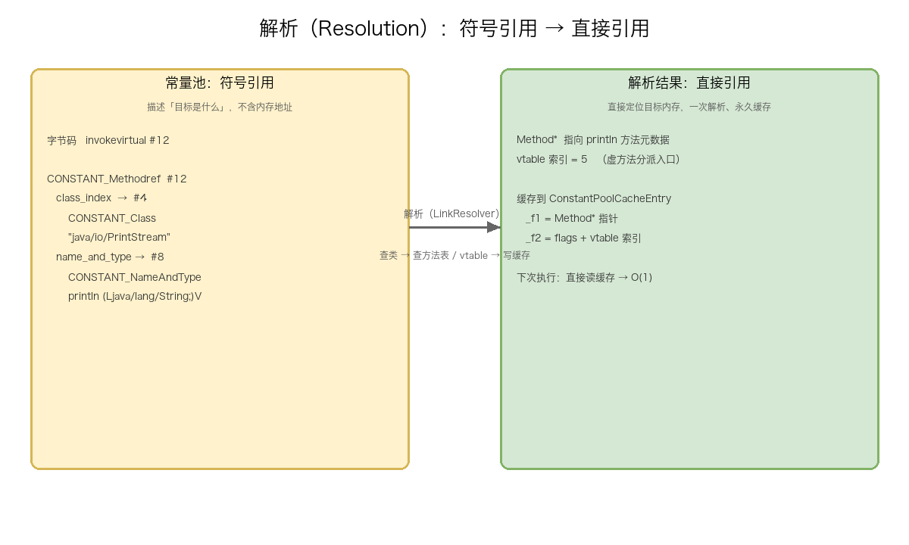
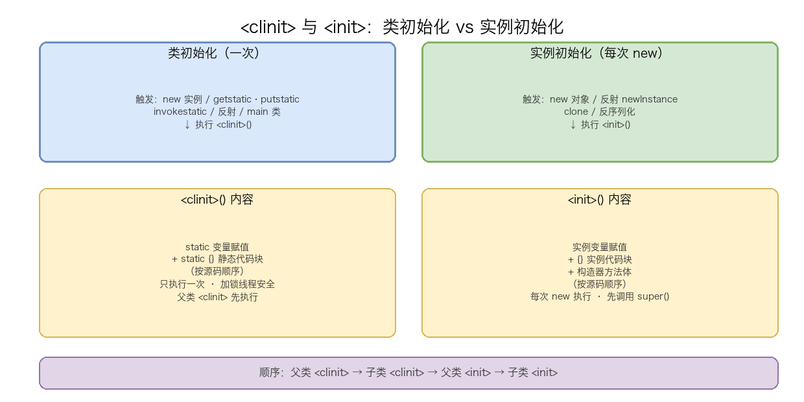

# 04. 类加载机制二：类加载过程分析

> 一个 `.class` 文件从磁盘上的字节流变成 JVM 中可用的「类型」，需要经历一条完整的流水线：**加载 → 连接 → 初始化**。本文聚焦这条流水线的每一个环节——加载阶段要完成的三件事与数组类的特殊规则；连接阶段的三个子步骤（验证的四轮校验、验证器从推断式到类型检查的演进、准备阶段的零值陷阱、解析阶段的四类符号引用规则）；初始化阶段的核心（`<clinit>()` 与 `<init>()` 的本质区别、`<clinit>()` 的线程安全与死锁、5 种主动引用与 8 种被动引用、接口与父子的初始化顺序），并附初始化时机的陷阱汇总表。

## 目录

- [一、类加载过程总览](#一类加载过程总览)
- [二、加载（Loading）](#二加载loading)
- [三、连接（Linking）](#三连接linking)
- [四、初始化（Initialization）](#四初始化initialization)
- [附：高频速记](#附高频速记)

---

## 一、类加载过程总览

类加载子系统是 JVM 整体架构三大件（类加载子系统、运行时数据区、执行引擎）中的第一环：它负责把磁盘上或网络中的 `.class` 字节流读入内存，经过校验、准备、解析和初始化后，变成 JVM 内部可用的 `java.lang.Class` 对象。后续的执行引擎才能基于这个 Class 对象创建实例、调用方法。



类加载子系统的工作可以概括为一条流水线：

```
.class 字节流  →  加载（找字节流）→ 连接（验证 + 准备 + 解析）→ 初始化（<clinit>）→ 可用的 Class 对象
```

加载完成后，类的元数据（Class 对象）放入**方法区 / 元空间**；类初始化时创建的对象实例进入**堆**。

类加载不是一步完成的，而是分三个大阶段依次推进，每个阶段都有明确的职责边界：



| 阶段 | 核心动作 | 关键点 |
| ---- | -------- | ------ |
| **加载 Loading** | 找字节流 → 方法区数据结构 → 生成 Class 对象 | 懒加载、按需触发；数组类由 JVM 直接生成 |
| **连接 Linking** | 验证 → 准备 → 解析 | final 常量准备阶段直接赋值；JDK 6 起验证用 StackMapTable |
| **初始化 Initialization** | 执行 `<clinit>()`（static 赋值 + static 块） | 线程安全（加锁）、5 种主动引用触发 |

下面逐一展开。

---

## 二、加载（Loading）

加载是类加载过程的第一步，JVM 需要完成三件事。

**① 通过类的全限定名获取定义此类的二进制字节流**（字节流来源丰富）：

- 从本地文件系统读取 `.class` 文件（最常见的场景）
- 从 JAR 包 / WAR 包中读取
- 从网络下载（Applet 时代）
- 运行时动态生成（动态代理 `ProxyGenerator.generateClassFile()`）
- 从数据库 / 加密文件中读取（自定义 ClassLoader 场景）

**② 将字节流代表的静态存储结构转化为方法区的运行时数据结构**

字节流被解析后，在方法区中创建该类的数据结构（包括常量池、字段表、方法表等）。

**③ 在堆中生成代表这个类的 `java.lang.Class` 对象**

作为方法区中这类数据的**访问入口**。程序员可以通过反射 API（`Class.forName("...")`、`obj.getClass()`、`ClassName.class`）拿到这个对象。

> **注意**：加载阶段并未完成类的初始化——此时 static 变量还是零值，static 块还没执行。初始化要到第三个阶段才做。

**加载时机（懒加载）**：JVM 规范并不要求在程序启动时就加载所有类。类加载采用**按需加载**策略——只有在首次主动使用某个类时才触发加载（具体哪些情况算"主动使用"，见本章第四节的"主动引用与被动引用"）。

下面这幅图把加载阶段三件事对应的数据形态串起来——磁盘字节流、运行时数据结构、堆中镜像，三者的映射关系一目了然：



### 1. 动作②详解：字节流 → 方法区的运行时数据结构

**为什么叫"静态存储结构 → 运行时数据结构"？**

`.class` 文件在磁盘上是一串按 JVM 规范排布的字节（`u1` / `u2` / `u4` 等无符号整型 + 各种结构体），这是**静态的、磁盘格式**的描述，JVM 不能直接拿来执行。加载阶段必须把它解析成内存中 JVM 内部（C++）能高效访问的**运行时数据结构**。在 HotSpot 中这个转化由 `ClassFileParser::parseClassFile()` 完成，产出物是 `InstanceKlass` 对象——它就是「方法区（JDK 8+ 即元空间 Metaspace）中的运行时数据结构」。

**磁盘上的 ClassFile 结构**（JVM 规范 Chapter 4 定义）：

```text
ClassFile {
    u4             magic;                    // 魔数 0xCAFEBABE
    u2             minor_version;            // 次版本号
    u2             major_version;            // 主版本号
    u2             constant_pool_count;      // 常量池项数 + 1
    cp_info        constant_pool[constant_pool_count-1];  // 常量池
    u2             access_flags;             // 访问标志（public / final / ...）
    u2             this_class;               // 本类（常量池索引）
    u2             super_class;              // 父类（常量池索引）
    u2             interfaces_count;         // 接口数量
    u2             interfaces[interfaces_count];  // 接口（常量池索引数组）
    u2             fields_count;             // 字段数量
    field_info     fields[fields_count];     // 字段表
    u2             methods_count;            // 方法数量
    method_info    methods[methods_count];   // 方法表
    u2             attributes_count;         // 属性数量
    attribute_info attributes[attributes_count];  // 属性表
}
```

**解析后生成的运行时结构**（HotSpot 的 `InstanceKlass`，位于元空间）：

| 磁盘 ClassFile 段 | 运行时结构（元空间） | 说明 |
| ---- | ---- | ---- |
| `constant_pool[]` | `ConstantPool` | 运行时常量池，符号引用以 Symbol 指针形式保存 |
| `fields[]` | `Array<FieldInfo>` | 字段数组，记录名称 / 描述符 / 偏移量 |
| `methods[]` | `Array<Method>` | 方法数组，每个 Method 含字节码 |
| `super_class` / `interfaces` | `_super` / `_interfaces` | 指向父类 / 接口 InstanceKlass 的指针 |
| 整个 ClassFile | `InstanceKlass` | 类的运行时载体，封装以上所有 |

**这个转化发生的四个关键变化**：

1. **常量池索引 → 直接指针**：磁盘上 `this_class`、`super_class`、字段/方法描述符、字节码指令（如 `ldc #5`、`invokevirtual #12`）都通过「常量池索引 #N」间接引用常量池项。运行时这些索引被替换为指向 `ConstantPool` 中具体 `Symbol` 或结构的**直接指针**，访问从"查表"变成 O(1) 的指针解引用。

2. **UTF-8 字节串 → Symbol 对象**：磁盘上类名、方法名、描述符是 `CONSTANT_Utf8_info` 编码的字节串。运行时被解析为 `Symbol` 对象——一种 intern 化（全局唯一、可指针比较）的字符串表示，HotSpot 用它做快速的方法名 / 签名匹配，省去逐字节比较的开销。

3. **符号引用原样保留，暂不解析**：注意，加载阶段常量池里的符号引用（`CONSTANT_Class`、`CONSTANT_Methodref` 等）**不会被解析成直接引用**——那是「连接 - 解析」阶段的事。加载阶段只是把它们以 Symbol 指针的形式"搬进"运行时常量池。所以此时方法区里的运行时常量池，存的依然是「符号引用」，只是从磁盘字节换成了内存符号表示。

4. **字节码原样保存**：方法的 `Code` 属性（字节码指令序列）在加载阶段基本被原样拷贝到 `Method` 对象的 `constMethod` 里，不做改动——验证阶段才校验它，JIT 阶段才编译它。

**存放位置**：JDK 8 起，`InstanceKlass`、`ConstantPool`、`Method` 等全部放在**元空间（Metaspace）**——一块独立于 Java 堆的直接内存（native memory），默认不设上限，只受物理内存约束，不再有 `-XX:MaxPermSize` 那套永久代限制。

> **关键认知**：这一步的产出物 `InstanceKlass` 是 **C++ 对象**，Java 代码无法直接引用它。所以才有动作③——在堆中生成一个 Java 世界的"镜像"作为访问入口。

### 2. 动作③详解：在堆中生成 java.lang.Class 对象

**为什么需要一个堆中的 Class 对象？**

动作②生成的 `InstanceKlass` 是元空间里的 C++ 对象，Java 程序员"够不着"。为了让 Java 代码能通过反射访问类的元数据，JVM 在**堆**中创建一个普通的 `java.lang.Class` 对象，作为 `InstanceKlass` 的**镜像（mirror）**。它是 Java 世界操作类元数据的唯一入口。

**HotSpot 的实现**：`ClassFileParser` 解析出 `InstanceKlass` 之后，紧接着调用 `java_lang_Class::create_mirror()`，在堆中分配一个 `java.lang.Class` 对象，并把它和 `InstanceKlass` **双向关联**起来。

**双向指针（形成闭环）**：

- **C++ → Java**：`InstanceKlass` 里有一个 `_java_mirror` 字段，指向堆中对应的 `java.lang.Class` 对象。JVM 内部知道"我的镜像在哪"。
- **Java → C++**：`java.lang.Class` 对象内部（JVM 注入的隐藏字段）保存了指向元空间 `InstanceKlass` 的指针。Java 反射（`getDeclaredFields()`、`getMethods()` 等）最终都通过这条指针回到 C++ 元数据上读取。

正是这条双向链路，让「Java 侧的 Class 对象」和「C++ 侧的 InstanceKlass」一一对应、互相可达。

**静态字段随 mirror 放入堆**（JDK 7+）：

JDK 7 之前，静态变量和类的元数据一起放在方法区（永久代）。JDK 7 起做了调整：**静态变量的值被移到 Java 堆中，和 `java.lang.Class` 对象（mirror）放在一起**。因此：

- 元空间里的 `InstanceKlass` 只保留字段的**元信息**（名称、类型、在 mirror 中的偏移量）；
- 字段的**实际值**则存放在堆中 mirror 对象末尾预留的存储区里。

这也是为什么 JDK 8 的元空间"不再存放静态变量"——静态变量已经跟着 mirror 去了堆。

**Class 对象 ≠ 类元数据本体**（最核心的认知）：

| 维度 | `InstanceKlass`（元数据本体） | `java.lang.Class`（镜像） |
| ---- | ---- | ---- |
| 本质 | C++ 对象 | 普通 Java 对象（OOP） |
| 位置 | 元空间（native 内存） | Java 堆 |
| 管理方 | JVM（C++ 代码） | GC 自动回收 |
| Java 代码能否直接引用 | 否 | 是（反射入口） |
| 存放内容 | 常量池、方法表、字段元信息 | 静态字段值（JDK 7+）+ 反射缓存 |

两者是 1:1 关系，但物理位置和职责完全不同。可以把 `InstanceKlass` 理解为"后台数据库"，把 `java.lang.Class` 理解为"前台窗口"——所有 Java 侧的反射操作都通过前台窗口间接访问后台数据。

**完整调用链**（HotSpot）：

从 Java 层 `ClassLoader.loadClass()` 一路到生成 Class 对象：

```text
Java 层：
  ClassLoader.loadClass(name)
    → findClass(name)
      → defineClass(name, bytes, off, len)     // native 方法

Native 层（C++）：
  JVM_DefineClass() / JVM_DefineClassWithSource()
    → SystemDictionary::resolve_from_stream()
      → KlassFactory::create_from_stream()
          ├─ ClassFileParser::parseClassFile()   ← 动作②：字节流 → InstanceKlass（元空间）
          └─ java_lang_Class::create_mirror()    ← 动作③：生成 java.lang.Class（堆）
      → SystemDictionary::add_to_hierarchy()     // 加入类继承体系（父类 / 接口）
```

### 3. 数组类的特殊加载

数组类（如 `int[]`、`String[]`、`Object[][]`）的加载规则与普通类不同：

- 数组类**不是由 ClassLoader 加载的**——由 JVM 在运行期直接生成（`defineClass` 内部调用）
- 数组的元素类型（element type）仍然需要走完整的类加载流程
- 数组类的 ClassLoader 与其元素类型的 ClassLoader **相同**（如果元素类型是基本类型，则为 Bootstrap）

举例：`String[]` 的类加载器 = `String` 的类加载器 = Application ClassLoader。

---

## 三、连接（Linking）

连接阶段紧随加载之后，包含三个子步骤：

### 1. 验证（Verification）

验证是连接阶段的第一步，也是 JVM 安全保障的关键环节。它确保 `.class` 文件的内容符合 JVM 规范，不会危害虚拟机自身安全。验证分为四轮：

| 验证阶段 | 内容 | 目的 |
| -------- | ---- | ---- |
| **文件格式验证** | 是否以 `0xCAFEBABE` 开头、主次版本号是否在 JVM 支持范围内、常量池 tag 是否合法 | 确保字节流能被正确解析为 Class 结构 |
| **元数据验证** | 是否有父类（除 Object 外）、是否继承了 final 类、是否实现了接口的所有抽象方法 | 保证类本身的语义合法 |
| **字节码验证** | 操作数栈的数据类型是否匹配、跳转指令是否指向有效位置、类型转换是否安全 | 保证方法体的逻辑正确 |
| **符号引用验证** | 全限定名是否能找到对应的类、字段/方法是否存在且可访问 | 保证外部依赖可用 |

> 如果验证失败，JVM 抛出 `VerifyError`。大部分验证工作可以在 JIT 编译期之后进行（因为解释执行时代价太高），但文件格式验证必须在加载阶段立即完成。

### 2. 验证器演进：从推断式到类型检查

JDK 5 之前的字节码验证器叫**类型推断验证器（Type-inferring verifier）**——它在加载时遍历整个字节码流，根据数据流推导每个指令执行后的栈帧类型。这种方式在大型方法（如包含很多路径）下耗时极长（O(n²) 甚至 O(n³)），曾导致 JDK 1.0 时代"Class 文件越大、加载越慢"的痛点。

JDK 6 引入了**类型检查验证器（Type-checking verifier）**——它依赖 `StackMapTable` 属性中预先记录的"帧状态快照"，跳过推导直接对照校验，加载时间降到 O(n)。

**对字节码工程的影响**：用 ASM 等工具修改字节码时，必须同步维护 `StackMapTable`，否则新方法会被验证器拒绝。

### 3. 准备（Preparation）

准备阶段正式为**类的静态变量分配内存**并设置**初始值**。

这里有一个非常经典的面试点：**初始值是「零值」而不是代码中写的赋值**。

```java
public class PrepareDemo {
    private static int a = 123;        // 准备阶段 a = 0（零值）
    private static final int B = 456;  // 准备阶段 B = 456（final 常量直接赋值）
    private static Object obj;          // 准备阶段 obj = null（零值）
}
```

| 变量类型 | 零值 |
| -------- | ---- |
| byte / short / int / long / char | 0 |
| float | 0.0f |
| double | 0.0d |
| boolean | false |
| reference（对象） | null |

**例外**：如果字段带有 `ConstantValue` 属性（即 `static final` 基本类型或 String），会在准备阶段直接赋值为代码中指定的值（如上面的 `B = 456`）。这是因为 `final` 值在编译期就已经确定，不需要等到初始化阶段再赋。

> **内存分配位置**：JDK 7 起静态变量随 Class 对象一起放入 Java 堆，JDK 7 之前在方法区（永久代）。元空间（Metaspace，JDK 8+）只存储类的元数据（Class 对象 + 运行时常量池），不再存放静态变量。

### 4. 解析（Resolution）

解析阶段将**常量池内的符号引用替换为直接引用**：

- **符号引用**：用字符串描述目标（如 `com/example/Foo`、`bar:(I)V`），不涉及内存地址
- **直接引用**：可以是内存中的指针、相对偏移量、或能间接定位到目标的句柄

解析动作主要针对以下七类符号引用：

| 符号引用类型 | 解析目标 |
| ----------- | -------- |
| `CONSTANT_Class` | 类或接口 |
| `CONSTANT_Fieldref` | 字段 |
| `CONSTANT_Methodref` | 方法 |
| `CONSTANT_InterfaceMethodref` | 接口方法 |
| `CONSTANT_String` | 字符串（intern 到字符串常量池） |
| `CONSTANT_MethodType` | 方法类型（invokedynamic） |
| `CONSTANT_MethodHandle` | 方法句柄（invokedynamic） |

**先纠正一个常见误区**：解析阶段的「替换」并不是把符号引用项**覆盖成地址**。符号引用本身（`CONSTANT_Class`、`CONSTANT_Methodref` 等）会一直保留在运行时常量池里——因为反射、诊断、反序列化、重新解析等场景仍然需要它。真正的「替换」是：**在符号引用旁边挂一个缓存，解析成功后把直接引用填进缓存**，字节码执行时优先读缓存。



**HotSpot 的具体做法（ConstantPoolCache）**：

HotSpot 在 `ConstantPool`（运行时常量池）里，为那些"可解析的引用项"（`CONSTANT_Methodref`、`CONSTANT_Fieldref`、`CONSTANT_InterfaceMethodref`）分配对应的 `ConstantPoolCacheEntry`（存放在 `ConstantPoolCache` 对象中）。每个 `ConstantPoolCacheEntry` 有两个槽位：

- **`_f1`**：存解析出的**元数据指针**（如方法的 `Method*`、字段的 `FieldInfo*`、目标类的 `Klass*`）。
- **`_f2`**：存**标志位 + 索引 / 偏移量**（如虚方法在 vtable 里的索引、实例字段在对象里的偏移量 offset、或"未解析 / 已解析"状态位）。

**一个 `invokevirtual #12` 的完整解析过程**：

1. **字节码执行到 `invokevirtual #12`**，解释器先查 `ConstantPoolCacheEntry[12]` 是否已解析（看 `_f2` 状态位）。
2. **未解析** → 触发解析（HotSpot 调用 `LinkResolver` 或 `InterpreterRuntime::resolve_invoke`）：
   - 从符号引用里取出 `#12` 指向的 `CONSTANT_Methodref` → 拆出 `CONSTANT_Class`（目标类全限定名）+ `CONSTANT_NameAndType`（方法名 + 描述符）；
   - 用全限定名触发目标类的加载（必要时初始化）；
   - 在目标类的 `InstanceKlass` 里按"方法名 + 描述符"查找最终目标（考虑继承、重写、访问权限），得到 `Method*`；
   - 若是虚方法，还要确定它在 vtable 里的索引。
3. **写回缓存**：把 `Method*` 写入 `_f1`，把 vtable 索引 + 状态位写入 `_f2`，标记"已解析"。
4. **之后每次执行 `invokevirtual #12`**，直接读缓存拿到 `Method*` + vtable 索引，O(1) 完成调用，不再重复查找。

**直接引用的几种形态**（取决于引用类型）：

| 符号引用类型 | 解析后的直接引用形态 |
| ---- | ---- |
| `CONSTANT_Class` | 目标类的 `Klass*`（元空间指针） |
| `CONSTANT_Fieldref`（实例字段） | 字段在对象中的**字节偏移量 offset** |
| `CONSTANT_Fieldref`（静态字段） | 指向静态存储位置（堆中 mirror 末尾）的指针 |
| `CONSTANT_Methodref`（虚方法） | `Method*` + **vtable 索引** |
| `CONSTANT_InterfaceMethodref` | `Method*` + **itable 索引** |
| `CONSTANT_String` | 字符串常量池中 `String` 对象的引用 |
| `CONSTANT_MethodHandle` | 方法句柄（`MemberName` 封装） |

**替换的时机**：

- **惰性解析（默认）**：绝大多数符号引用（方法、字段）在字节码**第一次执行到**该引用时才解析。好处是启动快、不会解析用不到的代码路径。
- **立即解析（部分）**：`CONSTANT_String`（字符串字面量）在加载 / 连接时就会 intern 到字符串常量池；某些 `final` 常量字段在准备阶段就确定值。

> **JVM 规范允许解析延迟到初始化之后甚至首次使用时才执行**（称为"惰性解析"）。HotSpot 默认对大部分符号引用采用惰性解析策略，只在真正需要时才解析——这也是为什么某些 `NoClassDefFoundError` 要到运行时方法调用时才抛出。

**详细解析规则**（不同符号引用类型的解析路径不同）：

**类 / 接口解析**：
1. 符号引用 N 传给当前类的 ClassLoader
2. ClassLoader 触发 N 的加载过程（可能触发 N 的初始化）
3. 如果 N 不是数组类型，ClassLoader 加载 N；如果 N 是数组类型，元素类型走相同流程

**字段解析**：
1. 先解析字段所属的类或接口 C（走"类解析"流程）
2. 在 C 中查找该字段的简单名称和描述符
3. 如果 C 本身有匹配字段，返回直接引用
4. 否则按继承链向上查找接口 / 父类（先接口后父类，按继承顺序）
5. 查找过程中考虑访问权限（public / protected / private / 包私有）

**方法解析**：
1. 解析方法所属的类 C
2. 在 C 中查找匹配方法（先本类，后父类，按继承链向上，不找接口）
3. 如果 C 是接口，直接抛 `AbstractMethodError`（接口方法走专门解析）
4. 找到方法后做访问权限检查（`<init>` 和 `<clinit>` 不可被普通代码访问）

**接口方法解析**：
1. 解析接口 I
2. 在 I 中查找匹配方法
3. 否则在 I 的父接口中递归查找（允许多继承）
4. 最后才查 `java.lang.Object`（接口方法最终兜底到 Object 的公有方法）

### 替换的主要作用

解析的目的不是"翻译字符串"，而是把符号引用**绑定到确定的目标 + 高效的内存表示**。具体有六点作用：

1. **性能：把"每次查表"变成"一次解析、永久 O(1)"**
   符号引用是一串字符串描述（类名 + 方法名 + 描述符），每次使用都要重新：解析类名字符串 → 加载目标类 → 在方法表 / 字段表里按"名字 + 描述符"线性查找目标——开销大且重复。解析后得到 `Method*` 指针 + vtable 索引（或字段 offset），后续访问是 O(1) 的指针解引用或数组下标。**这是解析最核心的价值，也是 JIT 能内联、能生成直接调用、能直接内存访问的前提。**

2. **语义绑定：确定"这个引用到底指向谁"**
   符号引用只描述了"名字 + 描述符"，但同一个方法名在继承体系里可能对应多个实现（重写 / 重载 / 字段隐藏）。解析阶段按 JVM 规范的查找规则（先本类后父类、接口多继承、访问权限）把符号引用**绑定到唯一确定的目标**，保证多态分派、字段隐藏等语义正确。

3. **触发类加载的联动入口**
   类解析会触发目标类的加载（必要时初始化），把"解析"和"类加载机制"串起来——这也是主动引用的一种传播路径（解析时如果发现目标类未加载，会先走完加载 → 连接 → 初始化的完整流程）。

4. **为执行引擎提供可执行入口**
   解析后 `invokevirtual` 得到 vtable 索引，解释器能直接跳转；`getfield` 得到字段 offset，能直接读写内存；JIT 编译期能基于直接引用内联方法或生成直接调用。没有直接引用，执行引擎只能停留在"每次解释字符串"的低效状态。

5. **安全：访问权限检查**
   解析阶段做访问控制（public / protected / private / 包私有），防止越权访问——把安全校验从"每次使用"收敛到"解析一次"。

6. **支撑 `invokedynamic` / 动态语言**
   `CONSTANT_MethodHandle`、`CONSTANT_MethodType` 解析为方法句柄，是 JDK 7+ `invokedynamic` 指令、lambda 表达式、字符串拼接（`invokedynamic` 实现）等动态特性的基础。

---

## 四、初始化（Initialization）

初始化是类加载过程的最后一步，也是**真正执行 Java 代码的阶段**。在此之前的加载和连接阶段，JVM 都是在"搬运"和"校验"数据，直到初始化才开始执行类构造器 `<clinit>()`。



### 1. `<clinit>()` 与 `<init>()` 的本质区别

| 维度 | `<clinit>()` 类构造器 | `<init>()` 实例构造器 |
| ---- | --------------------- | --------------------- |
| **触发方** | 类初始化阶段 | 实例创建阶段 |
| **触发场景** | 类被"主动引用"（见本节第 5 节"主动引用 5 场景"） | `new`、反射 `newInstance`、`clone`、反序列化 |
| **执行次数** | 每个类仅 1 次 | 每个实例 1 次 |
| **线程安全** | JVM 加锁保证 | 不加锁（多线程可同时构造不同实例） |
| **父级优先** | 父类 `<clinit>` 先于子类执行 | 父类 `<init>` 在子类构造器首行隐式调用 `super()` |
| **收集内容** | 所有 static 变量赋值 + 所有 `static {}` 块 | 所有实例变量赋值 + 所有 `{}` 实例块 + 构造器方法体 |
| **生成条件** | 类中存在 static 变量赋值或 `static {}` 块时 | 每个类至少一个（默认构造器或显式定义） |

### 2. `<clinit>()` 的字节码内容

`<clinit>()` 是编译器自动收集的**类构造器**，它收集的是：

1. 所有**类变量的赋值语句**（按代码出现的顺序）
2. 所有 **`static {}` 静态代码块**（按代码出现的顺序）

两者合并成一个 `<clinit>()` 方法，按源码中出现的顺序依次执行：

```java
public class ClinitDemo {
    private static String msg = initMsg();  // 第 1 步

    static {
        System.out.println("静态块 1");      // 第 2 步
    }

    private static int value = 100;           // 第 3 步

    static {
        System.out.println("静态块 2");      // 第 4 步
    }

    private static String initMsg() {
        return "hello";
    }
}
```

编译后的 `<clinit>()` 等效于：

```text
// <clinit>() 伪代码
msg = ClinitDemo.initMsg();  // 步骤 1
System.out.println("静态块 1"); // 步骤 2
value = 100;                  // 步骤 3
System.out.println("静态块 2"); // 步骤 4
return;
```

### 3. `<clinit>()` 的线程安全保证

JVM 保证一个类的 `<clinit>()` 在多线程环境下被正确地加锁同步。如果多个线程同时初始化一个类，只有一个线程会执行 `<clinit>()`，其余线程阻塞等待。这也意味着：

- `<clinit>()` 中如果有耗时操作（如死循环、网络请求），会导致其他线程永久阻塞
- 不需要在 `<clinit>()` 中额外加 `synchronized`

### 4. `<clinit>()` 死锁案例

`<clinit>()` 的线程安全保证虽然能防止重复初始化，但**可能引发死锁**。经典场景：

```java
class A {
    static {
        System.out.println("线程 " + Thread.currentThread().getName() + " 初始化 A");
        // A 的初始化依赖 B
        B.doSomething();
    }
}

class B {
    static {
        System.out.println("线程 " + Thread.currentThread().getName() + " 初始化 B");
        // B 的初始化又触发 A（形成了初始化环）
        A.doSomething();
    }

    static void doSomething() { /* 空方法，仅为触发 */ }
}
```

如果线程 1 触发 `A` 加载，线程 2 触发 `B` 加载，可能形成：A 等 B 释放锁、B 等 A 释放锁——死锁。

> 这种死锁非常隐蔽，因为它发生在类加载阶段，不是业务代码的锁冲突。排查时需要查看线程栈的 `<clinit>` 帧。

### 5. 主动引用 5 场景（必须触发初始化）

JVM 规定了**五种必须立即对类进行「初始化」的场景**——称为**主动引用**：

| # | 主动引用场景 | 示例 |
| - | ------------ | ---- |
| 1 | `new` 创建实例、`getstatic` / `putstatic` 访问/修改 static 字段（不含 final 常量）、`invokestatic` 调用 static 方法 | `new Foo()`, `Foo.x`, `Foo.do()` |
| 2 | 使用 `java.lang.reflect` 反射调用 | `Class.forName("com.example.Foo")` |
| 3 | 初始化一个类时发现其父类尚未初始化，则先触发父类初始化 | 子类 new 时先初始化父类 |
| 4 | JVM 启动时的 main 方法所在类 | `java HelloWorld` |
| 5 | JDK 7+ 动态语言支持：`MethodHandle` 实例解析结果为 `REF_getStatic` / `REF_putStatic` / `REF_invokeStatic` | 动态调用 |

### 6. 被动引用 8 例（不会触发初始化）

**除此之外的所有引用方式都不会触发初始化**——称为**被动引用**。以下是经典面试例题：

**例 1：子类引用父类静态字段 —— 只初始化父类**

```java
// 父类
class Parent {
    static { System.out.println("Parent <clinit>"); }
    static int value = 100;
}

// 子类
class Child extends Parent {
    static { System.out.println("Child <clinit>"); }
}

// 测试
int x = Child.value;  // 只触发 Parent 初始化，Child 不初始化
// 输出：Parent <clinit>
```

原因：对于静态字段，只有**直接定义该字段的类**才会被初始化。`value` 定义在 `Parent` 中，所以只初始化 `Parent`。

**例 2：数组定义 —— 不触发元素类初始化**

```java
SuperClass[] arr = new SuperClass[10];  // SuperClass 不初始化
```

数组类（`[Lcom/example/SuperClass;`）由 JVM 自动生成，直接由 Bootstrap 加载，不触发元素类的初始化。

**例 3：static final 常量 —— 编译期优化，不触发类初始化**

```java
class ConstDemo {
    static final String MSG = "hello";  // 编译期常量
    static { System.out.println("<clinit>"); }
}

// 测试
String s = ConstDemo.MSG;  // 不触发 ConstDemo 初始化
// 因为 MSG 在编译期已被内联为 "hello"
```

但如果 `final` 变量的值**不能在编译期确定**（如 `new Random().nextInt()`），则会触发初始化。

**例 4：通过子类调用父类 static 方法 —— 只初始化父类**

```java
Child.parentStaticMethod();  // 只初始化 Parent
```

**例 5：`Class.forName("Foo", false, loader)` —— 只加载 + 连接，不初始化**

```java
Class<?> c = Class.forName("com.example.Foo", false, classLoader);  // 第三个参数 initialize=false
```

**例 6：通过类字面量 `Foo.class` —— 只加载 + 连接，不初始化**

```java
Class<Parent> c = Parent.class;  // 不触发 Parent 初始化
```

类字面量不会触发初始化，只会触发加载 + 连接。这与 `Class.forName(name)` 不同。

**例 7：通过 ClassLoader.loadClass("Foo") —— 只加载，不连接也不初始化**

```java
Class<?> c = classLoader.loadClass("com.example.Foo");
```

`ClassLoader.loadClass` 默认只执行第一步"加载"，不触发连接与初始化。

**例 8：访问 final 修饰的 static 数组字段 —— 会触发类初始化**

```java
class Data {
    static final int[] ARR = {1, 2, 3};  // 数组是引用类型
    static { System.out.println("<clinit>"); }
}

int[] arr = Data.ARR;  // ✅ 会触发 Data 初始化
```

> **注意**：基本类型和 String 类型的 `static final` 常量才是编译期常量，能被内联。**数组类型的 `static final` 字段不是编译期常量**——它只是一个引用，会触发类的初始化。这一例外经常被面试忽略。

### 7. 接口的初始化特殊规则

接口虽然不能有 `static {}` 块，但接口也有 `<clinit>()`（编译器为接口中的 static 变量赋值生成）。接口初始化的触发规则与类几乎一致，**唯一差异**：初始化接口时，**不会强制先初始化父接口**——只有当父接口中定义的常量被实际使用时才会被初始化。

举例：

```java
interface I1 {
    int X = 10;  // 编译期常量
}
interface I2 extends I1 {
    int Y = I1.X + 1;  // 编译期常量（I1.X 已被内联）
}

class C implements I2 {
    public static void main(String[] args) {
        System.out.println(I2.Y);  // 只初始化 I2，不强制初始化 I1
    }
}
```

> 但如果接口中包含运行时计算的常量（如 `static final Random R = new Random();`），使用它会触发接口的初始化。

### 8. 父类与子类的初始化顺序

完整顺序：

```
父类 <clinit>() → 子类 <clinit>() → 父类 <init>() → 子类 <init>()
```

- 类初始化时，父类必须先完成初始化（递归向上到 Object）
- 实例初始化时，构造器第一行隐式调用 `super()`，父类实例必须先完成初始化

### 9. 初始化时机陷阱汇总

以下情形**不会**触发类初始化（被动引用）：

| 场景 | 代码示例 | 是否触发初始化 |
| ---- | -------- | ------------- |
| 子类引用父类 static 字段 | `Child.PARENT_VALUE` | ❌ 只初始化父类 |
| 定义数组 | `new Parent[10]` | ❌ 不初始化元素类 |
| 引用 static final 常量（编译期确定） | `Const.MSG` | ❌ 常量已内联 |
| 引用 static final 数组字段 | `Data.ARR` | ✅ 数组不是编译期常量，会触发 |
| 通过子类调用父类 static 方法 | `Child.staticMethod()` | ❌ 只初始化父类 |
| `Class.forName()` 带 `initialize=false` | `Class.forName("Foo", false, loader)` | ❌ 只加载+连接，不初始化 |
| `ClassName.class` 类字面量 | `Foo.class` | ❌ 只加载+连接 |
| `ClassLoader.loadClass()` | `loader.loadClass("Foo")` | ❌ 只加载，不连接+初始化 |
| 引用接口常量（编译期确定） | `I1.X` | ❌ 接口常量和类常量规则一致 |
| 引用父接口中编译期未确定的常量 | `I1.Y`（Y = new Random()） | ✅ 触发接口初始化（但不强制先初始化父接口） |

---

## 附：高频速记

### 类加载三阶段速记

| 阶段 | 核心动作 | 关键点 |
| ---- | -------- | ------ |
| **加载 Loading** | 找字节流 → 方法区数据结构 → 生成 Class 对象 | 懒加载、按需触发；数组类由 JVM 直接生成 |
| **连接 Linking** | 验证（4 轮：格式/元数据/字节码/符号引用）→ 准备（static 零值）→ 解析（符号→直接） | final 常量准备阶段直接赋值；JDK 6 起验证用 StackMapTable |
| **初始化 Initialization** | 执行 `<clinit>()`（static 赋值 + static 块） | 线程安全（加锁）、5 种主动引用触发 |

### <clinit> vs <init>

| 维度 | `<clinit>()` | `<init>()` |
| ---- | ------------- | ---------- |
| 触发方 | 类初始化 | 实例创建 |
| 执行次数 | 1 次 | 每个实例 1 次 |
| 线程安全 | JVM 加锁保证 | 不加锁 |
| 收集内容 | static 赋值 + static {} | 实例赋值 + {} + 构造器 |
| 父级优先 | 父类先 | 构造器首行 `super()` |

### 主动引用 vs 被动引用

| 触发场景 | 是否初始化 |
| -------- | ---------- |
| `new Foo()` / `Foo.x` / `Foo.do()` | ✅ 主动 |
| `Class.forName("Foo")` | ✅ 主动 |
| 初始化子类时父类未初始化 | ✅ 主动 |
| main 方法所在类 | ✅ 主动 |
| `Child.PARENT_VALUE`（子类引用父类字段） | ❌ 被动 |
| `new Parent[10]` | ❌ 被动 |
| `Foo.MSG`（编译期 static final 常量） | ❌ 被动 |
| `Foo.class`（类字面量） | ❌ 被动 |
| `loader.loadClass("Foo")`（ClassLoader.loadClass） | ❌ 被动 |
