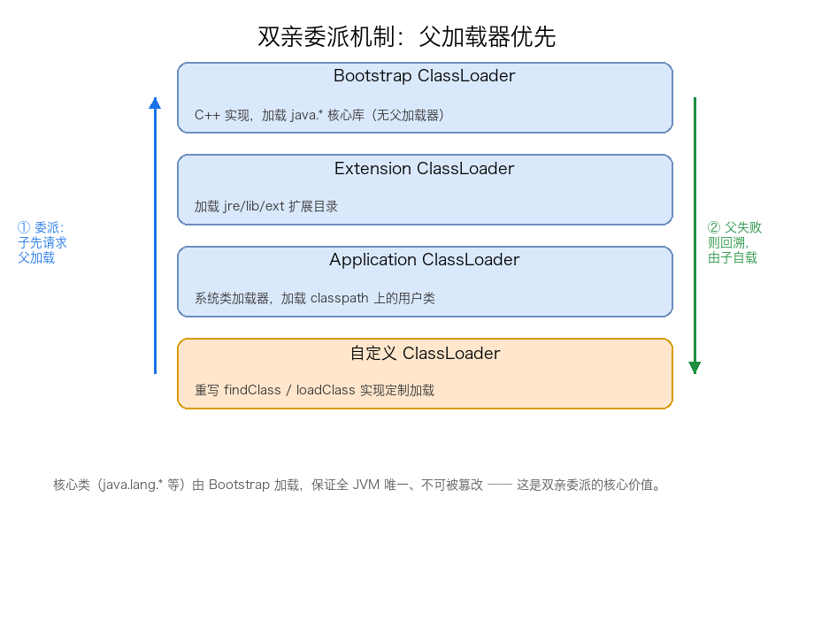

# 05. 类加载机制三：双亲委派机制

> JVM 中负责加载类的不是一个单一的加载器，而是一组存在父子层次关系的类加载器。本文聚焦它们之间的协作规则——**双亲委派机制**：先讲清类加载器的层次结构（Bootstrap / Extension / Application / 自定义，以及 JDK 9+ 的模块化变迁），再拆解双亲委派的原理、`loadClass` 源码逐行解读、类的唯一性判定，最后补充破坏双亲委派的场景、自定义类加载器的正确姿势、类卸载、命名空间与可见性等实战内容。

## 目录

- [一、类加载器层次结构](#一类加载器层次结构)
- [二、什么是双亲委派](#二什么是双亲委派)
- [三、为什么需要双亲委派](#三为什么需要双亲委派)
- [四、loadClass 源码解读](#四loadclass-源码解读)
- [五、四层类加载器与加载范围](#五四层类加载器与加载范围)
- [六、Bootstrap.getClassLoader() 返回 null 的原因](#六bootstrapgetclassloader-返回-null-的原因)
- [七、JDK 9+ 模块化下加载器层次变迁](#七jdk-9-模块化下加载器层次变迁)
- [八、双亲委派的历史](#八双亲委派的历史)
- [九、类的唯一性判定](#九类的唯一性判定)
- [十、破坏双亲委派的场景](#十破坏双亲委派的场景)
- [十一、自定义类加载器](#十一自定义类加载器)
- [十二、类卸载](#十二类卸载)
- [十三、命名空间与可见性](#十三命名空间与可见性)
- [附：高频速记](#附高频速记)

---

## 一、类加载器层次结构

类加载子系统内部由多个**类加载器（ClassLoader）** 组成，它们之间存在严格的父子层次关系：

| 类加载器 | 实现语言 | 加载范围 | 说明 |
| -------- | -------- | -------- | ---- |
| **Bootstrap ClassLoader** | C++（JVM 内核） | `%JAVA_HOME%/lib` 或 `java.base` 模块 | 启动类加载器，无父加载器，`getClassLoader()` 返回 `null` |
| **Extension ClassLoader** | Java | `jre/lib/ext`（JDK 8） | 扩展类加载器，父加载器是 Bootstrap |
| **Application ClassLoader** | Java | 用户 classpath | 应用类加载器 / 系统类加载器，父加载器是 Extension |
| **自定义 ClassLoader** | Java | 由用户指定路径 | 重写 `findClass()` 实现定制加载 |

它们之间的协作遵循**双亲委派模型**（下文将详细展开）。每个类加载器都有独立的命名空间——同一个全限定名，如果被不同类加载器加载，会产生两个互不相等的 Class 对象。

### 1. JDK 9+ 模块化下加载器层次的变化

JDK 9 引入模块化系统（JPMS）后，类加载器层次发生了重要变化：

| JDK 8 | JDK 9+ | 变化原因 |
| ------ | ------ | -------- |
| Bootstrap ClassLoader | **Bootstrap ClassLoader** | 仍负责加载 `java.base` 等核心模块 |
| Extension ClassLoader | **Platform ClassLoader** | 改名 + 改语义：加载所有非 `java.base` 的 JDK 平台模块 |
| Application ClassLoader | **Application ClassLoader** | 职责基本不变，加载用户模块与 classpath |

Platform ClassLoader 出现后，扩展机制从「目录约定」（`lib/ext`）升级为「模块声明」——任何 JDK 模块若要暴露给 Platform ClassLoader，必须通过 `module-info.java` 中的 `exports` 显式声明。这从语法层面堵死了「往 `lib/ext` 扔 JAR 就自动可用」的扩展方式。

---

## 二、什么是双亲委派

双亲委派（Parents Delegation Model）是类加载器之间的一种协作规则：**当一个类加载器收到类加载请求时，它首先不会自己去尝试加载这个类，而是把这个请求委派给父加载器去完成**。每一个层次的类加载器都是如此。因此所有的加载请求最终都应该传送到顶层的启动类加载器（Bootstrap ClassLoader）。只有当父加载器反馈自己无法完成这个加载请求（它的搜索范围中没有找到所需的类）时，子加载器才会尝试自己去加载。



---

## 三、为什么需要双亲委派

双亲委派解决了三个核心问题：

**（1）核心类的唯一性**

如果没有双亲委派，用户自己写一个 `java.lang.String` 类放在 classpath 里，Application ClassLoader 就会优先加载用户版的 `String`——整个 Java 生态的基础类库就被篡改了。有了双亲委派，`String` 的加载请求一定会传到 Bootstrap，而 Bootstrap 加载的是 JDK 自带的 `java.lang.String`，用户版永远不会被加载。

**（2）安全性沙箱**

防止恶意代码替换 JDK 核心类（如 `java.lang.System`、`java.security.*`），避免通过篡改核心类绕过安全管理器。

**（3）避免重复加载**

父加载器已经加载过的类，子加载器无需再次加载。结合 Class 对象的唯一性（类名 + ClassLoader 实例），保证了全 JVM 内同一份类只会有一份 Class 对象。

---

## 四、loadClass 源码解读

双亲委派的实现位于 `java.lang.ClassLoader.loadClass(String name, boolean resolve)`。JDK 8 源码：

```java
// java.lang.ClassLoader.loadClass() — 核心逻辑（JDK 8 源码）
protected Class<?> loadClass(String name, boolean resolve) throws ClassNotFoundException {
    synchronized (getClassLoadingLock(name)) {
        // ① 检查该类是否已经加载过
        Class<?> c = findLoadedClass(name);
        if (c == null) {
            long t0 = System.nanoTime();
            try {
                if (parent != null) {
                    // ② 有父加载器 → 委派给父加载器尝试加载
                    c = parent.loadClass(name, false);
                } else {
                    // ③ 无父加载器 → 委派给 Bootstrap（启动类加载器）
                    c = findBootstrapClassOrNull(name);
                }
            } catch (ClassNotFoundException e) {
                // 父加载器无法加载 → 异常被捕获，不中断
            }

            if (c == null) {
                // ④ 父加载器都找不到 → 自己尝试加载
                long t1 = System.nanoTime();
                c = findClass(name);  // 自定义 ClassLoader 通常重写此方法
                // ⑤ 可选：记录加载耗时（用于性能分析）
            }
        }
        if (resolve) {
            resolveClass(c);  // 解析（可选）
        }
        return c;
    }
}
```

### 1. 完整 loadClass 源码逐行解读

**关键点 1：`synchronized (getClassLoadingLock(name))`** —— JDK 7+ 引入的细粒度锁。`getClassLoadingLock(name)` 返回一个基于类名的锁对象，不同类名不会相互阻塞（替代了早期方法级的 `synchronized` 锁）。这是为了支持多 ClassLoader 并行加载不同类。

**关键点 2：`findLoadedClass(name)`** —— 检查该类是否已加载过（基于 ClassLoader 内部的 `ParallelKlass` 哈希表，OpenJDK 实现）。缓存命中直接返回，跳过整个委派链。

**关键点 3：`parent.loadClass(name, false)`** —— 第二个参数 `false` 表示"父加载器不要主动执行解析"（因为子加载器可能决定延迟到初始化后再解析）。注意 `parent.loadClass()` 本身也会走完整的 `loadClass` 逻辑——形成**递归式的委派链**。

**关键点 4：`findBootstrapClassOrNull(name)`** —— 通过 JNI 调用 JVM 内核的 C++ 代码尝试加载。如果找不到（如类不在 `java.base` 模块），返回 `null`。这一步**不能失败抛异常**——失败是正常的（说明不该由 Bootstrap 加载）。

**关键点 5：`findClass(name)`** —— 这是**唯一应该被自定义 ClassLoader 重写的方法**。`loadClass` 内部的逻辑（缓存检查、递归委派）应该由父类 `ClassLoader` 保留。

---

## 五、四层类加载器与加载范围

| 类加载器 | 加载路径（典型值） | 加载内容举例 |
| -------- | ----------------- | ------------ |
| **Bootstrap** | `$JAVA_HOME/lib`（JDK 8）；`java.base` 模块（JDK 9+） | `java.lang.*`, `java.util.*`, `java.io.*` |
| **Extension** | `$JAVA_HOME/lib/ext`（JDK 8）；平台模块（JDK 9+） | `javax.*`（如 `javax.sql.DataSource`） |
| **Application** | `-classpath` / `-cp` 指定的路径 | 用户编写的业务类、第三方库（Spring、MyBatis 等） |
| **自定义** | 由开发者决定 | 加密类、热部署类、隔离容器中的类 |

> **如何查看一个类是由哪个加载器加载的？**
>
> ```java
> ClassLoader cl = String.class.getClassLoader();  // null → Bootstrap
> cl = com.example.Foo.class.getClassLoader();     // sun.misc.Launcher$AppClassLoader
> ```
>
> 也可以用 `ClassLoader.getSystemClassLoader()` 拿到 Application ClassLoader，然后 `getParent()` 拿到 Extension，Extension 的 `getParent()` 返回 `null`（Bootstrap 没有 Java 层对象）。

---

## 六、Bootstrap.getClassLoader() 返回 null 的原因

`String.class.getClassLoader()` 返回 `null`——但这**不是 Bootstrap 不存在**，而是 Bootstrap ClassLoader 完全由 C++ 实现，**没有对应的 Java 对象**。所有 Java 代码看到 Bootstrap 时都用 `null` 表示。

**Bootstrap 加载的资源如何访问？**

```java
// ❌ 会抛 NPE
String.class.getClassLoader().getResourceAsStream("...");

// ✅ 正确做法：用 Class 的 getResourceAsStream
String.class.getResourceAsStream("...");

// ✅ 或 ClassLoader.getSystemClassLoader()（但这拿到的是 Application）
InputStream in = ClassLoader.getSystemClassLoader().getResourceAsStream("java/lang/String.class");
// ↑ 这能拿到，但已经走 Application 加载器，不是 Bootstrap 路径
```

---

## 七、JDK 9+ 模块化下加载器层次变迁

JDK 9 引入 JPMS 后，三层加载器变化如下：

| JDK 8 | JDK 9+ | 关键变化 |
| ------ | ------ | -------- |
| Bootstrap ClassLoader | Bootstrap ClassLoader | 仍负责加载 `java.base` 模块（含 `java.lang` 等核心类） |
| Extension ClassLoader | **Platform ClassLoader** | 改名 + 加载所有非 `java.base` 的 JDK 平台模块（如 `java.sql`、`java.xml`） |
| Application ClassLoader | Application ClassLoader | 加载用户模块与 classpath |

**Platform ClassLoader 的特殊性**：它**不从父加载器继承搜索路径**，而是直接从模块路径（module path）解析。这是 JPMS 的核心设计——模块显式声明 `requires` / `exports`，不再依赖目录约定。

---

## 八、双亲委派的历史

双亲委派并不是 JVM 一开始就有的：

| 版本 | 加载器策略 |
| ---- | ---------- |
| **JDK 1.0** | 没有 ClassLoader 抽象类，所有类由 JVM 内置逻辑加载 |
| **JDK 1.1** | 引入 ClassLoader 抽象类，但子类可以自由实现加载逻辑，无强制委派 |
| **JDK 1.2** | 引入 `loadClass()` 的双亲委派默认实现，并明确"自定义 ClassLoader 应重写 `findClass()` 而非 `loadClass()`" |
| **JDK 9** | 引入模块化，三层加载器（Bootstrap / Platform / Application） |

> **关键启示**：双亲委派是「**事后约定**」，不是「**事前设计**」——它是 JDK 团队在看到第三方应用乱用 `loadClass()` 篡改核心类后，逐步在 1.2 版本确立的「最佳实践」。

---

## 九、类的唯一性判定

JVM 中判定两个类是否"相等"（`==` 或 `instanceof`），不仅要求**全限定名相同**，还要求**加载这两个类的 ClassLoader 必须相同**。即使两个类来源完全相同的 `.class` 文件，只要被不同的 ClassLoader 加载，JVM 就认为它们是两个独立的类：

```java
// 同一个 .class 文件，被两个不同的 ClassLoader 加载
ClassLoader loader1 = new CustomClassLoader();
ClassLoader loader2 = new CustomClassLoader();

Class<?> c1 = loader1.loadClass("com.example.Foo");
Class<?> c2 = loader2.loadClass("com.example.Foo");

System.out.println(c1 == c2);  // false！
System.out.println(c1 instanceof c2);  // 编译错误：不可转换
```

这个特性是 Tomcat、OSGi 等框架实现**类隔离**的基础。

---

## 十、破坏双亲委派的场景

双亲委派不是强制的——它是 `java.lang.ClassLoader` 的默认行为，但可以被打破。以下是几种典型的破坏场景：

### 1. 线程上下文类加载器（Thread Context ClassLoader）—— SPI 服务发现

这是最经典的"合法破坏"。JNDI、JDBC、JAXP 等 Java 标准扩展库需要加载第三方实现的类（如 MySQL 驱动 `com.mysql.cj.jdbc.Driver`），但这些驱动不在 Bootstrap/Extension 的加载范围内。解决方案：

```java
// Thread.getContextClassLoader() 获取当前线程的上下文类加载器
// 通常设置为 Application ClassLoader
Thread.currentThread().setContextClassLoader(
    ClassLoader.getSystemClassLoader()
);

// JDBC DriverManager 内部（简化）：
// ServiceLoader.load(Driver.class) → 使用上下文类加载器加载第三方实现
Driver driver = (Driver) contextCL.loadClass(driverClassName).newInstance();
```

**核心思路**：Bootstrap 中的核心代码（如 `java.sql.DriverManager`）通过**线程上下文类加载器**反向委托给 Application ClassLoader 来加载用户提供的实现类——这打破了自底向上的委派方向。

**线程上下文类加载器的默认值**：新线程创建时，会继承父线程的 `contextClassLoader`，主线程的 `contextClassLoader` 默认是 Application ClassLoader。

### 2. Tomcat 的 WebAppClassLoader

Tomcat 需要在同一个 JVM 中运行多个 Web 应用，每个应用可能依赖不同版本的同一框架（如 Spring 4 和 Spring 5）。Tomcat 的 WebAppClassLoader 采用**优先加载自身 Web 应用目录下的类**，找不到再委派给父加载器——这与传统双亲委派完全相反：

```
WebAppClassLoader.findClass()
  → 先搜索 WEB-INF/classes 和 WEB-INF/lib
  → 找不到 → 委派给 CommonClassLoader（父）
```

### 3. OSGi 网状委派

OSGi 模块化框架中，每个 Bundle（模块）有自己的 ClassLoader，Bundle 之间可以互相导入/导出包，形成**网状依赖关系**，不再是简单的树形父子关系。

### 4. JDK 9+ 模块化系统（JPMS）

JPMS 以模块为单位重新定义了类加载规则：模块之间有明确的 `requires` / `exports` 声明，未导出的包即使在 classpath 上也无法被其他模块访问。这在一定程度上替代了传统的双亲委派安全保障。

### 5. 自定义 ClassLoader 重写 `loadClass()`

最直接的破坏方式——重写 `loadClass()` 方法，跳过父加载器的委派逻辑，直接调用自己的 `findClass()`：

```java
public class BreakingClassLoader extends ClassLoader {
    @Override
    protected Class<?> loadClass(String name, boolean resolve) throws ClassNotFoundException {
        // 直接自己加载，不委派父
        return findClass(name);
    }

    @Override
    protected Class<?> findClass(String name) throws ClassNotFoundException {
        // 自定义加载逻辑：从加密文件/网络/数据库读取字节流
        byte[] bytes = loadClassData(name);
        return defineClass(name, bytes, 0, bytes.length);
    }
}
```

> ⚠️ **生产环境慎用**：重写 `loadClass()` 会彻底破坏双亲委派的安全保障。推荐做法是**只重写 `findClass()`**（保留 `loadClass()` 的委派逻辑），这样既能定制加载行为，又保留了核心类的安全保护。

---

## 十一、自定义类加载器

**何时需要自定义 ClassLoader？**

| 场景 | 说明 |
| ---- | ---- |
| **类加密保护** | 将 `.class` 文件加密存储，运行时解密后加载（防止反编译） |
| **热部署 / 热替换** | 不重启 JVM 即时更新类（应用服务器、IDE 热更新） |
| **类隔离** | 同一 JVM 中加载同名但不同版本的类（Tomcat、OSGi） |
| **从非标准来源加载** | 从数据库、网络、ZIP 加密包中加载类 |

**正确的自定义姿势：重写 `findClass()`，保留 `loadClass()` 的委派逻辑**

```java
import java.io.*;

public class FileSystemClassLoader extends ClassLoader {
    private final String classPath;

    public FileSystemClassLoader(String classPath) {
        this.classPath = classPath;
    }

    @Override
    protected Class<?> findClass(String name) throws ClassNotFoundException {
        byte[] data = loadClassData(name);
        if (data == null) {
            throw new ClassNotFoundException(name);
        }
        return defineClass(name, data, 0, data.length);
    }

    private byte[] loadClassData(String name) {
        // 将全限定名转换为文件路径：com/example/Foo → com/example/Foo.class
        String path = classPath + File.separatorChar +
                      name.replace('.', File.separatorChar) + ".class";
        try (InputStream in = new FileInputStream(path);
             ByteArrayOutputStream out = new ByteArrayOutputStream()) {
            byte[] buffer = new byte[1024];
            int len;
            while ((len = in.read(buffer)) != -1) {
                out.write(buffer, 0, len);
            }
            return out.toByteArray();
        } catch (IOException e) {
            return null;
        }
    }
}
```

使用示例：

```java
FileSystemClassLoader loader = new FileSystemClassLoader("/path/to/classes/");
Class<?> clazz = loader.loadClass("com.example.MyClass");
Object instance = clazz.newInstance();
```

**加密类的完整示例**（AES 解密 + 自定义加载）：

```java
public class EncryptedClassLoader extends ClassLoader {
    private final String classPath;
    private final SecretKeySpec key;

    public EncryptedClassLoader(String classPath, String secretKey) {
        this.classPath = classPath;
        // AES-128 密钥（实际应从配置文件读取）
        this.key = new SecretKeySpec(secretKey.getBytes(), "AES");
    }

    @Override
    protected Class<?> findClass(String name) throws ClassNotFoundException {
        byte[] encrypted = loadEncryptedClassData(name);
        if (encrypted == null) throw new ClassNotFoundException(name);

        try {
            // AES 解密
            Cipher cipher = Cipher.getInstance("AES");
            cipher.init(Cipher.DECRYPT_MODE, key);
            byte[] decrypted = cipher.doFinal(encrypted);
            return defineClass(name, decrypted, 0, decrypted.length);
        } catch (Exception e) {
            throw new ClassNotFoundException("Failed to decrypt: " + name, e);
        }
    }

    private byte[] loadEncryptedClassData(String name) {
        // 类似 FileSystemClassLoader，读取加密的 .class 文件
        // ...
        return null;
    }
}
```

---

## 十二、类卸载

类卸载是指 JVM 回收一个 Class 对象及其关联的元数据。**满足以下三个条件时，类才可以被卸载**：

1. 该类的所有**实例都已被 GC 回收**（堆中没有该类的任何对象）
2. **加载该类的 ClassLoader 实例本身已被 GC 回收**
3. 该类的 `java.lang.Class` 对象**没有被任何地方引用**（没有反射持有）

> 这意味着：**Bootstrap / Extension / Application 这些内置 ClassLoader 加载的类永远不会被卸载**（因为这些 ClassLoader 本身不会被回收）。只有**自定义 ClassLoader 加载的类**才有机会被卸载。

类卸载发生在**元空间（Metaspace）的 GC** 过程中。当元空间占用过高触发 Full GC 时，JVM 会扫描不再被引用的 Class 对象并将其卸载，释放元空间内存。

> **元空间回收触发的 GC**：JDK 8 默认 `MetaspaceSize=20MB`，`MaxMetaspaceSize=无限制`。当元空间占用接近阈值时，触发 Full GC（这是元空间 GC 与堆 GC 联动）。可以通过 `-XX:MetaspaceSize` / `-XX:MaxMetaspaceSize` 调整阈值。

---

## 十三、命名空间与可见性

每个 ClassLoader 实例都拥有**独立的命名空间**：

- **父加载器加载的类对子加载器可见**（子可以访问父加载的类）
- **子加载器加载的类对父加载器不可见**（父不知道子加载了什么）
- **同级兄弟 ClassLoader 之间互相不可见**

这种单向可见性是类隔离的基础。Tomcat 正是利用这一点让不同 Web 应用各自拥有独立的 ClassLoader，从而实现同 JVM 内的多版本共存。

**反例**：如果你用 Application ClassLoader 加载的类去 cast 一个 Extension ClassLoader 加载的类——失败；如果反过来（Extension cast Application），成功（父可访问子）。

---


## 附：高频速记

### 双亲委派速记

| 要点 | 内容 |
| ---- | ---- |
| 核心原则 | 子加载器收到请求 → 先委派父加载器 → 父无法加载 → 子自己加载 |
| 为什么 | 核心类唯一性、安全沙箱、避免重复 |
| 实现 | `ClassLoader.loadClass()` 中的 `parent.loadClass()` → `findClass()` |
| 破坏方式 | 线程上下文 CL（SPI/JDBC）、Tomcat、OSGi、重写 loadClass() |
| 正确姿势 | 自定义时**只重写 findClass()**，保留 loadClass() 委派逻辑 |
| JDK 9 变化 | Extension → Platform ClassLoader，加载平台模块 |
| Bootstrap 特点 | C++ 实现，`getClassLoader()` 返回 `null` |

### 类的唯一性与卸载

| 概念 | 关键条件 |
| ---- | -------- |
| 类相等判定 | 全限定名 **+** ClassLoader 实例（缺一不可） |
| 类卸载条件 | 无实例 + ClassLoader 已回收 + Class 对象无引用 |
| 谁的类能卸载 | 只有**自定义 ClassLoader** 加载的类；内置加载器的类永不卸载 |
