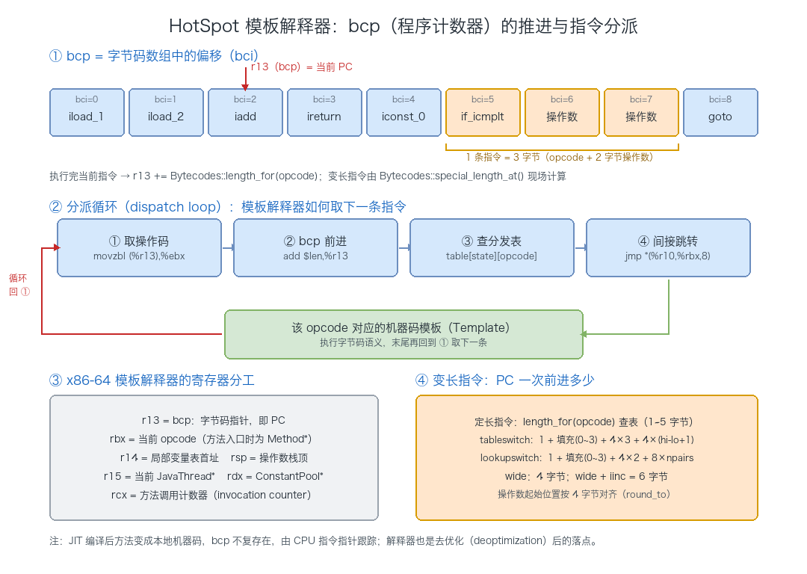

# 06. 运行时数据区一：程序计数器

> JVM 在执行 Java 程序时会把它用到的数据划分到不同的内存区域管理，这些区域合称**运行时数据区（Runtime Data Area）**。本文是运行时数据区的第一篇，先给出**整体视图**——五大部分各自是什么、线程共享与线程私有的划分依据、以及 JDK 1.8 元空间（Metaspace）演进带来的变化；再把其中最小也最容易被忽略的一块——**程序计数器（Program Counter）**——彻底讲透：它存的到底是什么、分支跳转如何改写它、为什么它是唯一不会 OOM 的区域；最后附上完整的 **JVM 字节码指令全集速查**。

## 目录

- [一、运行时数据区概述](#一运行时数据区概述)
  - [1. 五大部分](#1-五大部分)
  - [2. 线程共享 vs 线程私有（核心划分）](#2-线程共享-vs-线程私有核心划分)
  - [3. JDK 1.8 的变化](#3-jdk-18-的变化)
- [二、程序计数器](#二程序计数器)
  - [1. PC 是什么：作用与规范定义](#1-pc-是什么作用与规范定义)
  - [2. PC 存什么、控制流如何改写它](#2-pc-存什么控制流如何改写它)
  - [3. 线程私有、native 未定义、唯一不 OOM](#3-线程私有native-未定义唯一不-oom)
  - [4. 物理载体：寄存器与线程切换去向](#4-物理载体寄存器与线程切换去向)
  - [5. PC 每次前进多少：字节码指令的长度](#5-pc-每次前进多少字节码指令的长度)
  - [6. 源码剖析：模板解释器如何推进 PC](#6-源码剖析模板解释器如何推进-pc)
  - [7. PC 与行号、如何观察](#7-pc-与行号如何观察)
- [三、字节码指令全集速查](#三字节码指令全集速查)
  - [1. 指令集总览](#1-指令集总览)
  - [2. 加载与存储指令](#2-加载与存储指令)
  - [3. 算术与类型转换指令](#3-算术与类型转换指令)
  - [4. 对象创建与操作指令](#4-对象创建与操作指令)
  - [5. 操作数栈管理指令](#5-操作数栈管理指令)
  - [6. 控制转移指令](#6-控制转移指令)
  - [7. 方法调用与返回指令](#7-方法调用与返回指令)
  - [8. 异常、同步与其它保留指令](#8-异常同步与其它保留指令)
  - [9. 按 opcode 升序的完整索引](#9-按-opcode-升序的完整索引)
- [附：高频速记](#附高频速记)
  - [运行时数据区总览](#运行时数据区总览)
  - [程序计数器速记](#程序计数器速记)

---

## 一、运行时数据区概述

### 1. 五大部分

Java 虚拟机在执行 Java 程序的过程中，会把涉及到的数据划分到**不同的内存区域**去管理。这些区域合起来就是 **JVM 的运行时数据区（Runtime Data Area）**。

JVM 运行时数据区由五个部分构成：

| 区域    | 线程归属 | 存放内容                     |
| ----- | ---- | ------------------------ |
| 程序计数器 | 线程私有 | 当前线程执行的字节码行号             |
| 虚拟机栈  | 线程私有 | 栈帧（局部变量表/操作数栈/动态链接/返回地址） |
| 本地方法栈 | 线程私有 | Native 方法调用              |
| 堆     | 线程共享 | 对象实例、数组                  |
| 方法区   | 线程共享 | 类型信息、运行时常量池、静态变量、JIT 缓存  |


### 2. 线程共享 vs 线程私有（核心划分）

这是理解运行时数据区的**第一关键**：

- **线程共享**：堆、方法区。随虚拟机启动创建，虚拟机退出销毁，所有线程共用；
- **线程私有**：程序计数器、虚拟机栈、本地方法栈。随线程创建/销毁，各线程独立，互不影响。

### 3. JDK 1.8 的变化

随着 JDK 迭代，内存划分也在变化。**JDK 1.8 加入了「元空间（Metaspace）」概念**，把原来保存在方法区（永久代 PermGen）中的运行时常量池和类常量池迁移到了本地内存的元空间（Metaspace）中。


图中可以看到 JDK 1.8 之后，**字符串常量池** 仍在堆中；**运行时常量池** 与 **类常量池** 都搬到了 **元数据区（Metaspace）**；**直接内存** 划入本地内存管理——这是与 JDK 1.7 永久代时代的最大差异。

---

## 二、程序计数器

### 1. PC 是什么：作用与规范定义

程序计数器（Program Counter，PC）是运行时数据区中**最小的一块内存空间**，它是**当前线程正在执行的字节码指令的地址指示器**。

字节码解释器通过改变 PC 的值来选取下一条要执行的字节码指令——分支、循环、跳转、异常处理、线程恢复等**一切控制流的转移**，最终都要落到「修改 PC」这个动作上。

这里有一个容易误解的点需要先讲清：PC 里存的是**字节码指令的逻辑地址（字节码偏移量）**，不是 CPU 的物理内存地址。它指向的是方法字节码数组中的某个偏移位置，而不是操作系统进程地址空间里的真实地址。

**JVM 规范的定义**

《Java Virtual Machine Specification》§2.5.1 对 PC 有权威定义，四个要点：

1. **每个线程一个 PC**：JVM 支持多线程并发执行，每条 Java 虚拟机线程都有自己的 PC 寄存器；
2. **PC 指向当前方法**：任一时刻，每条线程都在执行某个方法的代码（即该线程的「当前方法」）；
3. **非 native 方法**：PC 存的是**当前正在执行的 JVM 指令的地址**；
4. **native 方法**：PC 的值是 **undefined（未定义）**。

此外规范还规定：**PC 的宽度足以容纳一个 `returnAddress` 或特定平台上的 native 指针**。`returnAddress` 是字节码里 `jsr`/`ret` 指令用到的一种特殊类型，用于存返回地址——这从侧面说明 PC 在逻辑上就是一个「指向代码位置」的寄存器。

### 2. PC 存什么、控制流如何改写它

**PC 存的是字节码偏移**

Java 源码先被编译成 `.class` 文件里的**字节码**。字节码是一串 JVM 指令，每条指令由「1 字节操作码 + 0~多个操作数字节」组成，因此**每条指令的长度并不相同**。

以这段代码为例：

```java
public int add(int a, int b) {
    return a + b;
}
```

用 `javap -c` 反编译后：

```text
public int add(int, int);
    Code:
       0: iload_1      // 把局部变量 1（形参 a）压入操作数栈
       1: iload_2      // 把局部变量 2（形参 b）压入操作数栈
       2: iadd         // 弹出栈顶两个 int 相加，结果压回
       3: ireturn      // 返回栈顶 int
```

冒号前面的 `0 / 1 / 2 / 3` 就是**字节码偏移量（bytecode offset）**，也就是 PC 的值。解释器执行时，PC 依次取 0 → 1 → 2 → 3，每执行完一条指令就按该指令的长度跳到下一条的偏移：


**分支/跳转直接改写 PC**

PC 不是只会顺序 +1 的计数器——它会被**控制流指令直接改写**。看这个带分支的例子：

```java
public int abs(int a) {
    if (a >= 0) return a;
    return -a;
}
```

```text
public int abs(int);
    Code:
       0: iload_1
       1: iflt          6     // 若 a < 0，PC 跳到偏移 6
       4: iload_1
       5: ireturn
       6: iload_1
       7: ineg
       8: ireturn
```

当 `a >= 0` 时，PC 顺序走 `1 → 4 → 5`；当 `a < 0` 时，`iflt 6` 把 PC 直接改写成 6，走 `6 → 7 → 8`。**if / for / while / switch / 异常处理 / 方法调用**，底层全都是靠这类指令改写 PC 来实现控制流转移。

### 3. 线程私有、native 未定义、唯一不 OOM

**线程私有：切换与恢复**

Java 多线程是通过「线程轮流切换、分配处理器执行时间」实现的。在任一确定时刻，一个处理器（核）只会执行一条线程中的指令。为了线程切换后能**恢复到正确的执行位置**，每条线程都需要一个独立的 PC——各线程之间的计数器互不影响，是**线程私有**的内存区域。

从线程视角看运行时数据区，关系如下：每个线程各自有独立的 Frame 栈和程序计数器；堆、元空间、本地方法栈是所有线程共享的；对象上的成员变量在堆中，由所有线程通过 Frame 上的引用共同访问：


PC 的生命周期与线程完全绑定：**线程创建时分配，线程结束时回收**，中间不随方法的调用/返回而增删。

**Native 方法时 PC 是 undefined**

当线程正在执行的是 **native 方法**（非 Java 字节码，而是本地机器码）时，JVM 的 PC 值是 **undefined（未定义）**。

原因很直接：PC 的职责是指向「**JVM 字节码**指令」，而 native 方法的代码已经不在 JVM 字节码体系内，是操作系统加载到进程地址空间里的本地机器码，由 CPU 自己的指令指针寄存器（如 x86-64 的 RIP）来跟踪，与 JVM 的 PC 无关。

**唯一不会 OOM 的区域**

程序计数器是运行时数据区中**唯一不会抛出 `OutOfMemoryError` 的区域**——这是 JVM 规范明确保证的。

根本原因在于它的存储模型：PC 只是一个**固定大小的寄存器**（宽度足以容纳一个指针，通常 4 或 8 字节），不像虚拟机栈、堆、方法区那样需要**动态扩展**。它不随着方法嵌套、对象分配而增长，自然不会出现「无法申请到足够内存」的情况。

### 4. 物理载体：寄存器与线程切换去向

- **物理层面**：CPU 本身就有一个 PC 寄存器（在 x86 上叫 **IP / EIP / RIP**，指令指针），指向下一条要执行的机器指令。JVM 的 PC 是「逻辑上」模拟了 CPU 的 PC，只是它指向的是字节码而非机器码。
- **解释执行**：HotSpot 的模板解释器（Template Interpreter）里，用 **bcp（bytecode pointer）** 跟踪当前字节码指令，它就等价于 JVM 规范里的 PC——指向方法字节码数组（存在 `ConstMethod` 的 code 数组里）中的偏移。
- **JIT 编译后**：方法被即时编译成机器码后，就不再有「字节码偏移」了，此时由 CPU 的指令指针寄存器直接跟踪机器码地址——这也解释了为什么 PC 的宽度要能容纳一个 native 指针。

**线程切换时 PC 到底存在哪里**

规范说「PC 是线程私有的内存区域」，容易让人以为每条线程都在内存里辟了一小块专门放 PC。实现上要分两种状态看：

**运行态**：PC 就活在**寄存器**里——解释执行时在 `r13`，编译执行时干脆没有字节码 PC（由 CPU 指令指针跟踪机器码）。此时它**根本不在内存里**。

**挂起态**：线程被切换出去、或者进入 VM 内部（调用 `InterpreterRuntime::*`、执行 native 方法）时，PC 需要被外部看见（GC 要扫描栈、调试器要取栈帧、异常要打栈轨迹）。HotSpot 把它记在两个地方：

1. **每个栈帧内部**：解释器帧保存着「返回到调用者时的 bcp」（即调用者的 PC）；
2. **`JavaThread` 里的 `JavaFrameAnchor`**：记录"最后一个 Java 栈帧"的 sp / pc / fp，作为外部栈回溯的起点。

```cpp
// src/hotspot/share/runtime/thread.hpp（OpenJDK，有删减）
class JavaFrameAnchor {
  intptr_t* volatile _last_Java_sp;   // 最后一个 Java 帧的栈指针
  volatile address   _last_Java_pc;   // 最后一个 Java 帧的 PC
  intptr_t* volatile _last_Java_fp;   // 帧基址（x86 上是 rbp）
 public:
  void make_walkable(JavaThread* thread) {
    if (walkable()) return;
    capture_last_Java_pc();
  }
  void capture_last_Java_pc() {
    // _last_Java_sp[-1] 正是 call 指令压入的返回地址
    _last_Java_pc = (address)_last_Java_sp[-1];
  }
};

class JavaThread : public Thread {
  JavaFrameAnchor _anchor;
 public:
  frame last_frame() {
    _anchor.make_walkable(this);   // 先把 PC 补齐，才能开始栈回溯
    return pd_last_frame();
  }
};
```

进入 VM 之前解释器/编译器会执行 `set_last_Java_frame()` 把 sp / pc / fp 写进 anchor，返回后再用 `reset_last_Java_frame()` 清空。这样即便线程正卡在 C++ 代码里，GC 也能从 anchor 出发一路回溯出完整的 Java 调用栈。

**这一节正好把「为什么不 OOM」讲透了**：PC 绝大多数时间就是一个**寄存器**，只在需要被外部观察时才临时落到线程已有的内存结构（栈帧、JavaFrameAnchor）里——它从来不需要 JVM 为它单独分配一块可增长的存储区，自然不会有申请不到内存的可能。

### 5. PC 每次前进多少：字节码指令的长度

前面说「PC 按指令长度跳到下一条」，那长度从哪来？**不是固定 +1**——字节码指令是变长编码：绝大多数指令 1 字节，带操作数的指令会长一些，`tableswitch` / `lookupswitch` 甚至能长达几十上百字节。

HotSpot 用一张静态长度表 `Bytecodes::_lengths[]` 解决绝大多数情况，只有「特殊指令」才需要现场计算：

```cpp
// src/hotspot/share/interpreter/bytecodes.hpp（OpenJDK，有删减）
// if 'end' is provided, it indicates the end of the code buffer which
// should not be read past when parsing.
static int special_length_at(Bytecodes::Code code, address bcp, address end = NULL);

static int length_for_code_at(Bytecodes::Code code, address bcp) {
  int l = length_for(code);
  return l > 0 ? l : special_length_at(code, bcp);   // >0 定长；否则现场算
}

static int length_at(Method* method, address bcp) {
  return length_for_code_at(code_at(method, bcp), bcp);
}
```

**定长指令的长度分布**：

| 长度 | 典型指令 | 说明 |
| ---- | -------- | ---- |
| **1 字节** | `nop`、`iconst_0`、`iload_1`、`istore_2`、`iadd`、`ireturn`、`dup`、`pop` | 无操作数，操作码自带全部信息 |
| **2 字节** | `iload`、`ldc`、`bipush`、`newarray` | 1 字节操作数（局部变量下标 / 常量池索引 / 立即数） |
| **3 字节** | `getstatic`、`putfield`、`invokevirtual`、`invokespecial`、`invokestatic`、`new`、`goto`、`iflt`、`if_icmplt`、`iinc`、`sipush`、`ldc_w` | 2 字节操作数（常量池索引 / 分支偏移） |
| **4 字节** | `multianewarray` | 2 字节索引 + 1 字节维度 + 1 字节（保留/对齐） |
| **5 字节** | `goto_w`、`jsr_w`、`invokeinterface`、`invokedynamic` | 4 字节操作数 |

**变长指令（special）**——这三条是 PC 计算里唯一的例外分支：

| 指令 | 长度公式 | 说明 |
| ---- | -------- | ---- |
| `tableswitch`（170） | `1 + 填充(0~3) + 4(default) + 4(low) + 4(high) + 4 × (high-low+1)` | `high-low+1` 个跳转偏移，case 越密集越长 |
| `lookupswitch`（171） | `1 + 填充(0~3) + 4(default) + 4(npairs) + 8 × npairs` | 每对 match-offset 占 8 字节 |
| `wide`（196） | 普通 **4 字节**；修饰 `iinc` 时 **6 字节** | 前缀指令，把下一条指令的操作数放宽到 2 字节 |

那个 `填充(0~3)` 很容易被忽略：**`switch` 的操作数必须从 4 字节对齐的地址开始**，所以操作码后面会补 0~3 个填充字节。HotSpot 源码里就是用 `round_to` 算的：

```cpp
// src/hotspot/share/interpreter/bytecodes.cpp（OpenJDK，有删减）
int Bytecodes::special_length_at(Bytecodes::Code code, address bcp, address end) {
  switch (code) {
    case _wide:
      if (end != NULL && bcp + 1 >= end) {
        return -1;                                  // 别读越界
      }
      return wide_length_for(cast(*(bcp + 1)));     // 4 或 6

    case _tableswitch: {
      // 操作数起始位置按 4 字节对齐（jintSize == 4）
      address aligned_bcp = (address)round_to((intptr_t)bcp + 1, jintSize);
      jlong lo  = (jint)Bytes::get_Java_u4(aligned_bcp +   jintSize);
      jlong hi  = (jint)Bytes::get_Java_u4(aligned_bcp + 2 * jintSize);
      jlong len = (aligned_bcp - bcp) + (3 + hi - lo + 1) * jintSize;
      // 只有能表示成正 int 时才返回，否则 -1
      return (len > 0 && len == (int)len) ? len : -1;
    }

    case _lookupswitch:   // 同理：1 + padding + 4 + 4 + 8*npairs
      ...
  }
}
```

注意源码里 `case _lookupswitch`、`_fast_binaryswitch`、`_fast_linearswitch` 是 **fall through** 的——后两个是 HotSpot 把 `switch` 重写（rewrite）后的内部快速版本，长度结构与 `lookupswitch` 一致。**这也是为什么反编译看到的偏移常常是跳着走的**（如 `0, 1, 4, 5, 6, 7, 8`）。

### 6. 源码剖析：模板解释器如何推进 PC

HotSpot 现在主流的解释器是**模板解释器（Template Interpreter）**：JVM 启动时会为**每一个字节码**生成一段本地机器码（称为"模板"），运行时根本不去"解释"字节码，而是**直接跳到对应模板执行**。所以 HotSpot 里没有那个经典的 `while(true) { switch(opcode) }` 大循环。

「修改 PC」这个动作，就落在每个模板末尾生成的 `dispatch_next()` 里：

```cpp
// src/hotspot/cpu/x86/interp_masm_x86.cpp（OpenJDK）
void InterpreterMacroAssembler::dispatch_next(TosState state, int step, bool generate_poll) {
  // load next bytecode (load before advancing _bcp_register to prevent AGI)
  load_unsigned_byte(rbx, Address(_bcp_register, step));   // ① 取操作码
  // advance _bcp_register
  increment(_bcp_register, step);                          // ② 推进 bcp（= 改 PC）
  dispatch_base(state, Interpreter::dispatch_table(state), true, generate_poll);
}

void InterpreterMacroAssembler::dispatch_base(TosState state, address* table,
                                              bool verifyoop, bool generate_poll) {
  ...
  lea(rscratch1, ExternalAddress((address)table));   // ③ 分发表基址
  jmp(Address(rscratch1, rbx, Address::times_8));    // ④ 间接跳转 table[opcode]
}
```

三个细节值得留意：

- **先取操作码、再推进指针**：注释里的 "prevent AGI"（Address Generation Interlock）说的是 x86 上「刚改完寄存器紧接着用它做地址计算」会产生流水线停顿，所以先取后加；
- **`step` 是编译期常量**：模板是启动时按 opcode 逐个生成的，每条指令的长度在生成模板时就已知，所以 `increment` 的步长被直接编码成立即数；
- **`generate_poll`**：分派前可以插入 **safepoint 轮询**——这是解释执行时 JVM 能响应 GC 停顿的位置之一。

这段代码最终生成的 x86-64 汇编长这样（用 `-XX:+PrintInterpreter` 或 `-XX:+PrintAssembly` 可以实际观察到）：

```asm
movzbl (%r13),%ebx        ; ① 从 bcp 处读 1 字节操作码 → ebx
add    $0x1,%r13          ; ② bcp 前进（PC += 指令长度）
movabs $0x7f8b4c00,%r10   ; ③ 当前栈顶状态对应的分发表基址
jmpq   *(%r10,%rbx,8)     ; ④ 间接跳转：跳到该 opcode 的模板入口
```

**x86-64 下解释器用到的寄存器分工**（理解了这张表，`jmpq` 那行就完全不神秘了）：

| 寄存器 | 含义 |
| ------ | ---- |
| **r13** | **bcp，字节码指针 —— 这就是 PC 的物理载体** |
| **rbx** | 当前 opcode（方法刚进入时是 `Method*`） |
| **r14** | 局部变量表首址 |
| **rsp** | 操作数栈顶 |
| **r15** | 当前 `JavaThread*` |
| **rdx** | `ConstantPool*`（常量池地址） |
| **rcx** | 方法调用计数器（invocation counter，供 JIT 判断热点） |

分发表本身是一个二维数组：

```cpp
// src/hotspot/share/interpreter/templateInterpreter.hpp（OpenJDK）
class DispatchTable VALUE_OBJ_CLASS_SPEC {
  // number_of_states = 9，length = 256
  address _table[number_of_states][length];
 public:
  address* table_for(TosState state) { return _table[state]; }
  void set_entry(int i, EntryPoint& entry) {
    _table[btos][i] = entry.entry(btos);
    _table[itos][i] = entry.entry(itos);
    ...  // 9 种栈顶缓存状态各写一遍
  }
};
```

**9 种状态**指的是栈顶缓存状态（`btos`/`ctos`/`stos`/`atos`/`itos`/`ltos`/`ftos`/`dtos`/`vtos`，即栈顶当前是 byte / char / short / 引用 / int / long / float / double / 空）。同一个 opcode 在不同栈顶状态下入口可以不同——HotSpot 借此省掉一次类型判断。所以 `jmpq *(%r10,%rbx,8)` 查的是「当前栈顶状态那一张表」里的第 `opcode` 项，共 `9 × 256 = 2304` 个入口。



> 顺带回答一个常见疑问：HotSpot 里还有一份**纯 C++ 写的解释器**（`bytecodeInterpreter.cpp`，用 `CC_INTERP=true` 编译出来），它确实是一个 `while` 大循环 + `switch`。但它**不用于生产环境**，只为快速移植新平台做原型——生产级的解释器永远是用宏汇编器生成的模板解释器。

### 7. PC 与行号、如何观察

**PC 与行号：异常栈里的行号从哪来**

PC 是字节码偏移，可异常栈打印的是**源码行号**。两者之间的桥梁是 `Code` 属性里的 **`LineNumberTable`**：

```
LineNumberTable:
  line 10: 0
  line 11: 4
  line 12: 8
```

含义是「**从字节码偏移 X 开始的指令，对应源码第 N 行**」。JVM 抛异常时，从栈帧里取出当前 PC，在表里找到 **`start_pc <= PC` 的最大那一项**，换算出行号。所以你看到的 `at Foo.bar(Foo.java:11)`，本质上是 `PC = 6` 这样的一串偏移查表查出来的结果。

用 `javap` 加 `-l` 就能看到这张表（`-c` 看字节码，`-l` 看行号表与局部变量表）：

```bash
javap -c -l -p MyClass.class
```

> 如果用 `-g:none` 编译，编译器不会生成 `LineNumberTable`，异常栈里就只剩 **"Unknown Source"**——这在生产排查里是个很坑的坑，发布时别图省那点体积。

同样的思路贯穿整个调试体系：

- **JVMTI 的 `GetFrameLocation()`** 返回的 `jlocation`，**本身就是一个字节码偏移（bci）**，行号由调试器自己换算；
- **断点（breakpoint）** 的实现方式之一，就是把目标 bci 处的字节码**原地替换成 `_breakpoint` 操作码**，命中后再换回原指令——所以断点打在方法上，实际是打在某个 bci 上；
- **单步调试的"下一步"**，本质就是让解释器执行完当前 bci 的指令后暂停。

**如何实际观察 PC**

| 手段 | 能看到什么 | 使用条件 |
| ---- | ---------- | -------- |
| `javap -c` | 静态的字节码偏移（bci）与指令 | 任意 JDK |
| `javap -c -l` | 字节码偏移 ↔ 源码行号的映射表 | 编译时带 `LineNumberTable` |
| `-XX:+PrintAssembly` | 编译后的机器码，能看到 dispatch 的三条指令 | 需安装 hsdis 插件 |
| `-XX:+PrintInterpreter` | dump 模板解释器生成的所有模板 | debug / fastdebug 版本 |
| `-XX:+TraceBytecodes` | **逐条打印执行到的字节码（含 bci）** | **仅 debug 版本**，建议配 `-Xint` 纯解释执行 |
| `-XX:StopInterpreterAt=<n>` | 执行到第 n 条字节码时中断到 `breakpoint()` | debug 版本 + gdb |
| `jhsdb hsdb` | 图形化查看线程栈帧与每个帧的 bci | 任意 JDK |

其中 `-XX:+TraceBytecodes` 最能直观体现「PC 在跳转」。它输出的每一行就是一次 PC 的取值（格式：`[线程ID] 序号 bci 操作码 操作数`）：

```
[5158714] static void java.lang.String.<clinit>()
[5158714] 3    0  iconst_0
[5158714] 4    1  anewarray java/io/ObjectStreamField
[5158714] 5    4  putstatic 84
```

看第三列的 `0 → 1 → 4`：`anewarray` 是 3 字节指令（操作码 + 2 字节常量池索引），所以 PC 从 1 跳到了 4，而不是 2。**这就是「PC 按指令长度前进」最直接的证据。**

## 三、字节码指令全集速查

> 程序计数器存的是**字节码偏移（bytecode index，bci）**，它每执行一条指令就前进「该指令的长度」。要真正看懂 PC 的推进节奏，必须先认识字节码指令本身。本节按 JVM 规范（Java SE 8 及以后）完整收录全部字节码指令，按功能分为 10 类，每类一张表；最后一节再给出按 opcode 升序排列的完整索引，方便对照 `javap -c` 输出的偏移快速定位。

### 1. 指令集总览

| 分类 | 指令数 | 说明 |
| ---- | ----- | ---- |
| 加载与存储 | 86 | 常量压栈、局部变量读写、数组读写 |
| 算术运算 | 37 | 加/减/乘/除/余/取负/移位/位运算、`iinc` |
| 类型转换 | 15 | 数值类型之间的宽化/窄化转换 |
| 比较 | 5 | `lcmp` + 浮点 `fcmpl/fcmpg/dcmpl/dcmpg` |
| 对象创建与操作 | 11 | `new`、数组创建、字段读写、`checkcast/instanceof` |
| 操作数栈管理 | 9 | `pop/dup/swap` 系列 |
| 控制转移 | 23 | 条件分支、`goto`、`switch`、`jsr/ret` |
| 方法调用与返回 | 11 | 5 种 `invoke*` + 6 种 `*return` |
| 异常与同步 | 3 | `athrow`、`monitorenter/monitorexit` |
| 其它与保留 | 5 | `nop`、`wide`、`breakpoint`、`impdep1/impdep2` |
| **合计** | **205** | opcode 0x00–0xff，其中 0xcb–0xfd 未使用 |

**指令长度分布**（直接决定 PC 每次前进多少）：

- **1 字节**：无操作数的指令（绝大多数，如 `iconst_0`、`iadd`、`dup`、`return`）。
- **2 字节**：操作码 + 1 字节操作数（如 `bipush`、`ldc`、`iload`、`istore`、`ret`、`newarray`）。
- **3 字节**：操作码 + 2 字节操作数（如 `sipush`、`ldc_w`、`iinc`、`goto`、所有 `if*`、`new`、`getfield`、`invokevirtual` 等）。
- **4 字节**：仅 `multianewarray`（2 字节常量池索引 + 1 字节维度）。
- **5 字节**：`invokeinterface`（含 count 与 0 两个保留字节）、`invokedynamic`（含两个 0 字节）、`goto_w` / `jsr_w`（4 字节偏移）。
- **变长**：`tableswitch`、`lookupswitch`（含 0~3 字节的 4 字节对齐填充）、`wide`（4 或 6 字节）。

### 2. 加载与存储指令

**常量压栈（20 条）**

| 助记符 | Opcode | 操作数 | 说明 |
| ------ | ------ | ------ | ---- |
| `aconst_null` | 0x01 | — | 压入 `null` |
| `iconst_m1` | 0x02 | — | 压入 `int` -1 |
| `iconst_0` ~ `iconst_5` | 0x03 ~ 0x08 | — | 压入 `int` 0 ~ 5 |
| `lconst_0` / `lconst_1` | 0x09 / 0x0a | — | 压入 `long` 0 / 1 |
| `fconst_0` ~ `fconst_2` | 0x0b ~ 0x0d | — | 压入 `float` 0.0 / 1.0 / 2.0 |
| `dconst_0` / `dconst_1` | 0x0e / 0x0f | — | 压入 `double` 0.0 / 1.0 |
| `bipush` | 0x10 | `byte` | 压入 `byte` 扩展的 `int`（-128 ~ 127） |
| `sipush` | 0x11 | `byte1, byte2` | 压入 `short` 扩展的 `int`（-32768 ~ 32767） |
| `ldc` | 0x12 | `index` | 从常量池压入 `int`/`float`/`String`/`Class` |
| `ldc_w` | 0x13 | `indexbyte1, indexbyte2` | 同上，宽索引 |
| `ldc2_w` | 0x14 | `indexbyte1, indexbyte2` | 从常量池压入 `long`/`double` |

**局部变量加载（25 条）**

| 助记符 | Opcode | 操作数 | 说明 |
| ------ | ------ | ------ | ---- |
| `iload` / `lload` / `fload` / `dload` / `aload` | 0x15 ~ 0x19 | `index` | 加载指定索引的 `int`/`long`/`float`/`double`/引用 |
| `iload_0` ~ `iload_3` | 0x1a ~ 0x1d | — | 加载第 0 ~ 3 个 `int` |
| `lload_0` ~ `lload_3` | 0x1e ~ 0x21 | — | 加载第 0 ~ 3 个 `long` |
| `fload_0` ~ `fload_3` | 0x22 ~ 0x25 | — | 加载第 0 ~ 3 个 `float` |
| `dload_0` ~ `dload_3` | 0x26 ~ 0x29 | — | 加载第 0 ~ 3 个 `double` |
| `aload_0` ~ `aload_3` | 0x2a ~ 0x2d | — | 加载第 0 ~ 3 个引用（`aload_0` 即 `this`） |

**局部变量存储（25 条）**

| 助记符 | Opcode | 操作数 | 说明 |
| ------ | ------ | ------ | ---- |
| `istore` / `lstore` / `fstore` / `dstore` / `astore` | 0x36 ~ 0x3a | `index` | 存入指定索引的 `int`/`long`/`float`/`double`/引用 |
| `istore_0` ~ `istore_3` | 0x3b ~ 0x3e | — | 存入第 0 ~ 3 个 `int` |
| `lstore_0` ~ `lstore_3` | 0x3f ~ 0x42 | — | 存入第 0 ~ 3 个 `long` |
| `fstore_0` ~ `fstore_3` | 0x43 ~ 0x46 | — | 存入第 0 ~ 3 个 `float` |
| `dstore_0` ~ `dstore_3` | 0x47 ~ 0x4a | — | 存入第 0 ~ 3 个 `double` |
| `astore_0` ~ `astore_3` | 0x4b ~ 0x4e | — | 存入第 0 ~ 3 个引用 |

**数组加载（8 条）**

| 助记符 | Opcode | 说明 |
| ------ | ------ | ---- |
| `iaload` / `laload` / `faload` / `daload` | 0x2e ~ 0x31 | 加载 `int[]`/`long[]`/`float[]`/`double[]` 元素 |
| `aaload` | 0x32 | 加载引用数组元素 |
| `baload` / `caload` / `saload` | 0x33 ~ 0x35 | 加载 `byte[]`(含 boolean)/`char[]`/`short[]` 元素 |

**数组存储（8 条）**

| 助记符 | Opcode | 说明 |
| ------ | ------ | ---- |
| `iastore` / `lastore` / `fastore` / `dastore` | 0x4f ~ 0x52 | 存入 `int[]`/`long[]`/`float[]`/`double[]` |
| `aastore` | 0x53 | 存入引用数组（含类型检查，不匹配抛 `ArrayStoreException`） |
| `bastore` / `castore` / `sastore` | 0x54 ~ 0x56 | 存入 `byte[]`/`char[]`/`short[]` |

### 3. 算术与类型转换指令

**算术运算指令**

| 运算 | `int` | `long` | `float` | `double` |
| ---- | ----- | ------ | ------- | -------- |
| 加 | `iadd` 0x60 | `ladd` 0x61 | `fadd` 0x62 | `dadd` 0x63 |
| 减 | `isub` 0x64 | `lsub` 0x65 | `fsub` 0x66 | `dsub` 0x67 |
| 乘 | `imul` 0x68 | `lmul` 0x69 | `fmul` 0x6a | `dmul` 0x6b |
| 除 | `idiv` 0x6c | `ldiv` 0x6d | `fdiv` 0x6e | `ddiv` 0x6f |
| 取余 | `irem` 0x70 | `lrem` 0x71 | `frem` 0x72 | `drem` 0x73 |
| 取负 | `ineg` 0x74 | `lneg` 0x75 | `fneg` 0x76 | `dneg` 0x77 |

| 运算 | `int` | `long` |
| ---- | ----- | ------ |
| 左移 | `ishl` 0x78 | `lshl` 0x79 |
| 算术右移（带符号） | `ishr` 0x7a | `lshr` 0x7b |
| 逻辑右移（无符号） | `iushr` 0x7c | `lushr` 0x7d |
| 按位与 | `iand` 0x7e | `land` 0x7f |
| 按位或 | `ior` 0x80 | `lor` 0x81 |
| 按位异或 | `ixor` 0x82 | `lxor` 0x83 |

| 助记符 | Opcode | 操作数 | 说明 |
| ------ | ------ | ------ | ---- |
| `iinc` | 0x84 | `index, const` | 局部变量 `int` 自增 `const`（唯一不操作操作数栈的算术指令） |

> **边界行为提醒**：整数 `idiv`/`ldiv`/`irem`/`lrem` 除数为 0 时抛 `ArithmeticException`；浮点 `fdiv`/`ddiv` 除 0 得到 Infinity（不抛异常），`0.0/0.0` 得到 NaN。

**类型转换指令**

| 助记符 | Opcode | 说明 |
| ------ | ------ | ---- |
| `i2l` / `i2f` / `i2d` | 0x85 ~ 0x87 | `int` → `long`/`float`/`double`（宽化，无损） |
| `l2i` / `l2f` / `l2d` | 0x88 ~ 0x8a | `long` → `int`/`float`/`double` |
| `f2i` / `f2l` / `f2d` | 0x8b ~ 0x8d | `float` → `int`/`long`/`double` |
| `d2i` / `d2l` / `d2f` | 0x8e ~ 0x90 | `double` → `int`/`long`/`float` |
| `i2b` / `i2c` / `i2s` | 0x91 ~ 0x93 | `int` → `byte`/`char`/`short`（窄化，截断低 8/16 位） |

> **窄化规则**：浮点转整数时向 0 舍入；超范围（如 `(int)1e20`）结果取对应类型的最大值/最小值；NaN 转整数为 0。

### 4. 对象创建与操作指令

| 助记符 | Opcode | 操作数 | 说明 |
| ------ | ------ | ------ | ---- |
| `new` | 0xbb | `indexbyte1, indexbyte2` | 创建对象实例（分配内存，未调用构造器） |
| `newarray` | 0xbc | `atype` | 创建基本类型数组（`atype` 编码见 `newarray` 表） |
| `anewarray` | 0xbd | `indexbyte1, indexbyte2` | 创建引用类型数组 |
| `multianewarray` | 0xc5 | `indexbyte1, indexbyte2, dimensions` | 创建多维数组 |
| `arraylength` | 0xbe | — | 取数组长度（压入 `int`） |
| `getstatic` | 0xb2 | `indexbyte1, indexbyte2` | 读取静态字段（触发类初始化） |
| `putstatic` | 0xb3 | `indexbyte1, indexbyte2` | 写入静态字段（触发类初始化） |
| `getfield` | 0xb4 | `indexbyte1, indexbyte2` | 读取实例字段 |
| `putfield` | 0xb5 | `indexbyte1, indexbyte2` | 写入实例字段 |
| `checkcast` | 0xc0 | `indexbyte1, indexbyte2` | 类型检查转换，失败抛 `ClassCastException` |
| `instanceof` | 0xc1 | `indexbyte1, indexbyte2` | 判断对象是否属于某类型（压入 0 或 1） |

`newarray` 的 `atype` 编码：`4=boolean, 5=char, 6=float, 7=double, 8=byte, 9=short, 10=int, 11=long`。

### 5. 操作数栈管理指令

| 助记符 | Opcode | 说明 |
| ------ | ------ | ---- |
| `pop` | 0x57 | 弹出栈顶 1 个值（32 位） |
| `pop2` | 0x58 | 弹出栈顶 2 个值（或 1 个 64 位值） |
| `dup` | 0x59 | 复制栈顶 1 个值 |
| `dup_x1` | 0x5a | 复制栈顶值并插入到下面第 1 个值之前 |
| `dup_x2` | 0x5b | 复制栈顶值并插入到下面第 2 个值之前 |
| `dup2` | 0x5c | 复制栈顶 2 个值（或 1 个 64 位值） |
| `dup2_x1` | 0x5d | 复制栈顶 2 个值并插入到下面第 1 个值之前 |
| `dup2_x2` | 0x5e | 复制栈顶 2 个值并插入到下面第 2 个值之前 |
| `swap` | 0x5f | 交换栈顶 2 个值 |

> 这些指令正是 `i++`、`a = b = c`、`new` 后马上 `dup` 再 `invokespecial` 等编译器惯用法背后的推手。

### 6. 控制转移指令

**条件分支（与 0 比较，6 条）**

| 助记符 | Opcode | 说明 |
| ------ | ------ | ---- |
| `ifeq` / `ifne` | 0x99 / 0x9a | 栈顶 `int` == 0 / != 0 时跳转 |
| `iflt` / `ifge` | 0x9b / 0x9c | 栈顶 `int` < 0 / >= 0 时跳转 |
| `ifgt` / `ifle` | 0x9d / 0x9e | 栈顶 `int` > 0 / <= 0 时跳转 |

**条件分支（两个 int 比较，6 条）**

| 助记符 | Opcode | 说明 |
| ------ | ------ | ---- |
| `if_icmpeq` / `if_icmpne` | 0x9f / 0xa0 | `value1 == value2` / `!=` 时跳转 |
| `if_icmplt` / `if_icmpge` | 0xa1 / 0xa2 | `value1 < value2` / `>=` 时跳转 |
| `if_icmpgt` / `if_icmple` | 0xa3 / 0xa4 | `value1 > value2` / `<=` 时跳转 |

**条件分支（引用比较与空判断，4 条）**

| 助记符 | Opcode | 说明 |
| ------ | ------ | ---- |
| `if_acmpeq` / `if_acmpne` | 0xa5 / 0xa6 | 两个引用相等 / 不等时跳转 |
| `ifnull` / `ifnonnull` | 0xc6 / 0xc7 | 引用为 `null` / 非 `null` 时跳转 |

**无条件跳转与子程序（5 条）**

| 助记符 | Opcode | 操作数 | 说明 |
| ------ | ------ | ------ | ---- |
| `goto` | 0xa7 | `branchbyte1, branchbyte2` | 无条件跳转（16 位偏移） |
| `goto_w` | 0xc8 | `branchbyte1 ~ 4` | 无条件跳转（32 位偏移） |
| `jsr` | 0xa8 | `branchbyte1, branchbyte2` | 跳转子程序并压入返回地址（**已弃用**） |
| `jsr_w` | 0xc9 | `branchbyte1 ~ 4` | 宽跳转子程序（**已弃用**） |
| `ret` | 0xa9 | `index` | 从子程序返回（**已弃用**） |

**复合分支（2 条）**

| 助记符 | Opcode | 说明 |
| ------ | ------ | ---- |
| `tableswitch` | 0xaa | 表驱动 `switch`（case 值连续，O(1) 定位） |
| `lookupswitch` | 0xab | 查找驱动 `switch`（case 值稀疏，二分匹配） |

> 所有条件分支（`if*`）的跳转偏移都是 16 位有符号值，范围 -32768 ~ 32767；超出才需要 `goto_w`。分支目标在编译期就确定，执行时「改写 PC」本质就是 `PC = 当前偏移 + 跳转偏移`。

### 7. 方法调用与返回指令

**方法调用（5 条）**

| 助记符 | Opcode | 操作数 | 说明 |
| ------ | ------ | ------ | ---- |
| `invokevirtual` | 0xb6 | `indexbyte1, indexbyte2` | 调用实例方法（虚分派，走 vtable） |
| `invokespecial` | 0xb7 | `indexbyte1, indexbyte2` | 调用构造器、私有方法、父类方法（静态绑定） |
| `invokestatic` | 0xb8 | `indexbyte1, indexbyte2` | 调用静态方法 |
| `invokeinterface` | 0xb9 | `indexbyte1, indexbyte2, count, 0` | 调用接口方法（走 itable） |
| `invokedynamic` | 0xba | `indexbyte1, indexbyte2, 0, 0` | 调用动态方法（lambda、字符串拼接等） |

**方法返回（6 条）**

| 助记符 | Opcode | 说明 |
| ------ | ------ | ---- |
| `ireturn` / `lreturn` | 0xac / 0xad | 返回 `int` / `long` |
| `freturn` / `dreturn` | 0xae / 0xaf | 返回 `float` / `double` |
| `areturn` | 0xb0 | 返回引用 |
| `return` | 0xb1 | 返回 `void` |

### 8. 异常、同步与其它保留指令

**异常与同步**

| 助记符 | Opcode | 说明 |
| ------ | ------ | ---- |
| `athrow` | 0xbf | 抛出栈顶的异常对象 |
| `monitorenter` | 0xc2 | 进入对象监视器（加锁，对应 `synchronized` 块入口） |
| `monitorexit` | 0xc3 | 退出对象监视器（解锁，对应 `synchronized` 块出口） |

**其它与保留**

| 助记符 | Opcode | 说明 |
| ------ | ------ | ---- |
| `nop` | 0x00 | 空操作，不产生任何效果 |
| `wide` | 0xc4 | 扩展下一条指令的操作数宽度（配合 `iload`/`iinc` 等访问 256 号以上的局部变量） |
| `breakpoint` | 0xca | 调试器断点专用（保留，正常字节码不出现） |
| `impdep1` | 0xfe | 保留给虚拟机实现内部使用 |
| `impdep2` | 0xff | 保留给虚拟机实现内部使用 |

### 9. 按 opcode 升序的完整索引

| Opcode | 助记符 | 长度 | Opcode | 助记符 | 长度 |
| ------ | ------ | ---- | ------ | ------ | ---- |
| 0x00 | `nop` | 1 | 0x01 | `aconst_null` | 1 |
| 0x02 | `iconst_m1` | 1 | 0x03 | `iconst_0` | 1 |
| 0x04 | `iconst_1` | 1 | 0x05 | `iconst_2` | 1 |
| 0x06 | `iconst_3` | 1 | 0x07 | `iconst_4` | 1 |
| 0x08 | `iconst_5` | 1 | 0x09 | `lconst_0` | 1 |
| 0x0a | `lconst_1` | 1 | 0x0b | `fconst_0` | 1 |
| 0x0c | `fconst_1` | 1 | 0x0d | `fconst_2` | 1 |
| 0x0e | `dconst_0` | 1 | 0x0f | `dconst_1` | 1 |
| 0x10 | `bipush` | 2 | 0x11 | `sipush` | 3 |
| 0x12 | `ldc` | 2 | 0x13 | `ldc_w` | 3 |
| 0x14 | `ldc2_w` | 3 | 0x15 | `iload` | 2 |
| 0x16 | `lload` | 2 | 0x17 | `fload` | 2 |
| 0x18 | `dload` | 2 | 0x19 | `aload` | 2 |
| 0x1a | `iload_0` | 1 | 0x1b | `iload_1` | 1 |
| 0x1c | `iload_2` | 1 | 0x1d | `iload_3` | 1 |
| 0x1e | `lload_0` | 1 | 0x1f | `lload_1` | 1 |
| 0x20 | `lload_2` | 1 | 0x21 | `lload_3` | 1 |
| 0x22 | `fload_0` | 1 | 0x23 | `fload_1` | 1 |
| 0x24 | `fload_2` | 1 | 0x25 | `fload_3` | 1 |
| 0x26 | `dload_0` | 1 | 0x27 | `dload_1` | 1 |
| 0x28 | `dload_2` | 1 | 0x29 | `dload_3` | 1 |
| 0x2a | `aload_0` | 1 | 0x2b | `aload_1` | 1 |
| 0x2c | `aload_2` | 1 | 0x2d | `aload_3` | 1 |
| 0x2e | `iaload` | 1 | 0x2f | `laload` | 1 |
| 0x30 | `faload` | 1 | 0x31 | `daload` | 1 |
| 0x32 | `aaload` | 1 | 0x33 | `baload` | 1 |
| 0x34 | `caload` | 1 | 0x35 | `saload` | 1 |
| 0x36 | `istore` | 2 | 0x37 | `lstore` | 2 |
| 0x38 | `fstore` | 2 | 0x39 | `dstore` | 2 |
| 0x3a | `astore` | 2 | 0x3b | `istore_0` | 1 |
| 0x3c | `istore_1` | 1 | 0x3d | `istore_2` | 1 |
| 0x3e | `istore_3` | 1 | 0x3f | `lstore_0` | 1 |
| 0x40 | `lstore_1` | 1 | 0x41 | `lstore_2` | 1 |
| 0x42 | `lstore_3` | 1 | 0x43 | `fstore_0` | 1 |
| 0x44 | `fstore_1` | 1 | 0x45 | `fstore_2` | 1 |
| 0x46 | `fstore_3` | 1 | 0x47 | `dstore_0` | 1 |
| 0x48 | `dstore_1` | 1 | 0x49 | `dstore_2` | 1 |
| 0x4a | `dstore_3` | 1 | 0x4b | `astore_0` | 1 |
| 0x4c | `astore_1` | 1 | 0x4d | `astore_2` | 1 |
| 0x4e | `astore_3` | 1 | 0x4f | `iastore` | 1 |
| 0x50 | `lastore` | 1 | 0x51 | `fastore` | 1 |
| 0x52 | `dastore` | 1 | 0x53 | `aastore` | 1 |
| 0x54 | `bastore` | 1 | 0x55 | `castore` | 1 |
| 0x56 | `sastore` | 1 | 0x57 | `pop` | 1 |
| 0x58 | `pop2` | 1 | 0x59 | `dup` | 1 |
| 0x5a | `dup_x1` | 1 | 0x5b | `dup_x2` | 1 |
| 0x5c | `dup2` | 1 | 0x5d | `dup2_x1` | 1 |
| 0x5e | `dup2_x2` | 1 | 0x5f | `swap` | 1 |
| 0x60 | `iadd` | 1 | 0x61 | `ladd` | 1 |
| 0x62 | `fadd` | 1 | 0x63 | `dadd` | 1 |
| 0x64 | `isub` | 1 | 0x65 | `lsub` | 1 |
| 0x66 | `fsub` | 1 | 0x67 | `dsub` | 1 |
| 0x68 | `imul` | 1 | 0x69 | `lmul` | 1 |
| 0x6a | `fmul` | 1 | 0x6b | `dmul` | 1 |
| 0x6c | `idiv` | 1 | 0x6d | `ldiv` | 1 |
| 0x6e | `fdiv` | 1 | 0x6f | `ddiv` | 1 |
| 0x70 | `irem` | 1 | 0x71 | `lrem` | 1 |
| 0x72 | `frem` | 1 | 0x73 | `drem` | 1 |
| 0x74 | `ineg` | 1 | 0x75 | `lneg` | 1 |
| 0x76 | `fneg` | 1 | 0x77 | `dneg` | 1 |
| 0x78 | `ishl` | 1 | 0x79 | `lshl` | 1 |
| 0x7a | `ishr` | 1 | 0x7b | `lshr` | 1 |
| 0x7c | `iushr` | 1 | 0x7d | `lushr` | 1 |
| 0x7e | `iand` | 1 | 0x7f | `land` | 1 |
| 0x80 | `ior` | 1 | 0x81 | `lor` | 1 |
| 0x82 | `ixor` | 1 | 0x83 | `lxor` | 1 |
| 0x84 | `iinc` | 3 | 0x85 | `i2l` | 1 |
| 0x86 | `i2f` | 1 | 0x87 | `i2d` | 1 |
| 0x88 | `l2i` | 1 | 0x89 | `l2f` | 1 |
| 0x8a | `l2d` | 1 | 0x8b | `f2i` | 1 |
| 0x8c | `f2l` | 1 | 0x8d | `f2d` | 1 |
| 0x8e | `d2i` | 1 | 0x8f | `d2l` | 1 |
| 0x90 | `d2f` | 1 | 0x91 | `i2b` | 1 |
| 0x92 | `i2c` | 1 | 0x93 | `i2s` | 1 |
| 0x94 | `lcmp` | 1 | 0x95 | `fcmpl` | 1 |
| 0x96 | `fcmpg` | 1 | 0x97 | `dcmpl` | 1 |
| 0x98 | `dcmpg` | 1 | 0x99 | `ifeq` | 3 |
| 0x9a | `ifne` | 3 | 0x9b | `iflt` | 3 |
| 0x9c | `ifge` | 3 | 0x9d | `ifgt` | 3 |
| 0x9e | `ifle` | 3 | 0x9f | `if_icmpeq` | 3 |
| 0xa0 | `if_icmpne` | 3 | 0xa1 | `if_icmplt` | 3 |
| 0xa2 | `if_icmpge` | 3 | 0xa3 | `if_icmpgt` | 3 |
| 0xa4 | `if_icmple` | 3 | 0xa5 | `if_acmpeq` | 3 |
| 0xa6 | `if_acmpne` | 3 | 0xa7 | `goto` | 3 |
| 0xa8 | `jsr` | 3 | 0xa9 | `ret` | 2 |
| 0xaa | `tableswitch` | 变长 | 0xab | `lookupswitch` | 变长 |
| 0xac | `ireturn` | 1 | 0xad | `lreturn` | 1 |
| 0xae | `freturn` | 1 | 0xaf | `dreturn` | 1 |
| 0xb0 | `areturn` | 1 | 0xb1 | `return` | 1 |
| 0xb2 | `getstatic` | 3 | 0xb3 | `putstatic` | 3 |
| 0xb4 | `getfield` | 3 | 0xb5 | `putfield` | 3 |
| 0xb6 | `invokevirtual` | 3 | 0xb7 | `invokespecial` | 3 |
| 0xb8 | `invokestatic` | 3 | 0xb9 | `invokeinterface` | 5 |
| 0xba | `invokedynamic` | 5 | 0xbb | `new` | 3 |
| 0xbc | `newarray` | 2 | 0xbd | `anewarray` | 3 |
| 0xbe | `arraylength` | 1 | 0xbf | `athrow` | 1 |
| 0xc0 | `checkcast` | 3 | 0xc1 | `instanceof` | 3 |
| 0xc2 | `monitorenter` | 1 | 0xc3 | `monitorexit` | 1 |
| 0xc4 | `wide` | 变长 | 0xc5 | `multianewarray` | 4 |
| 0xc6 | `ifnull` | 3 | 0xc7 | `ifnonnull` | 3 |
| 0xc8 | `goto_w` | 5 | 0xc9 | `jsr_w` | 5 |
| 0xca | `breakpoint` | 1 | 0xfe | `impdep1` | 1 |
| 0xff | `impdep2` | 1 | — | — | — |

## 附：高频速记

### 运行时数据区总览

| 要点         | 内容                         |
| ---------- | -------------------------- |
| 五大部分       | 方法区、堆、虚拟机栈、本地方法栈、程序计数器     |
| 线程共享       | 堆、方法区（随虚拟机启动/退出）           |
| 线程私有       | 程序计数器、虚拟机栈、本地方法栈（随线程创建/销毁） |
| JDK 1.8 变化 | 永久代 → 元空间（本地内存）；字符串常量池仍在堆  |

### 程序计数器速记

| 要点         | 内容                                            |
| ---------- | --------------------------------------------- |
| 本质         | 当前线程所执行字节码的**行号指示器**                          |
| 存的是什么      | **字节码偏移量**，不是 CPU 物理地址                        |
| 谁在改写       | 解释器顺序推进；`if`/`for`/`switch`/异常/方法调用等控制流指令直接改写 |
| 线程私有原因     | 线程切换后要能恢复到正确的执行位置                             |
| native 方法时 | PC 值为 **undefined**（机器码由 CPU 指令指针跟踪）          |
| 唯一性        | **唯一不会抛 `OutOfMemoryError` 的区域**（固定大小、不动态扩展）  |
| HotSpot 实现 | 模板解释器用 **bcp（bytecode pointer）** 指向字节码数组偏移    |
| 物理载体       | x86-64 上是 **r13 寄存器**（运行态根本不在内存里）             |
| 推进方式       | `r13 += Bytecodes::length_for(opcode)`；变长指令走 `special_length_at()` |
| 变长指令       | `tableswitch` / `lookupswitch`（含 0~3 字节 4 字节对齐填充）、`wide`（4 或 6 字节） |
| 指令分派       | `dispatch_next()`：取操作码 → 推进 bcp → 查分发表 → `jmp *(%r10,%rbx,8)` |
| 分发表结构      | `address _table[9][256]`：9 种栈顶缓存状态 × 256 个 opcode |
| 挂起时存哪      | 栈帧内的返回 bcp + `JavaFrameAnchor::_last_Java_pc`（`= _last_Java_sp[-1]`） |
| 行号从哪来      | `LineNumberTable`：`start_pc → line_number`，取 `start_pc <= PC` 的最大项；`javap -l` 可看 |
| 观测手段       | `javap -c -l` / `-XX:+PrintAssembly` / `-XX:+TraceBytecodes`（仅 debug 版） |
