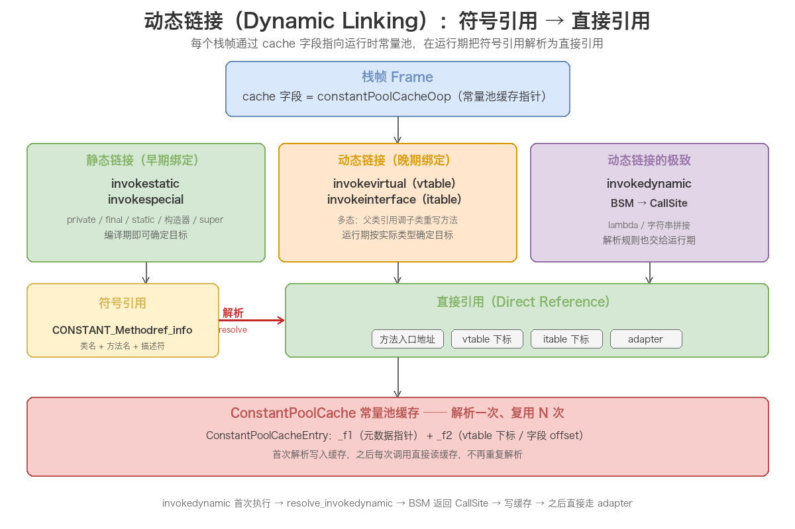

# 07. 运行时数据区二：虚拟机栈和本地方法栈

> 本文是运行时数据区的第二篇，聚焦两块**线程私有**的栈区域：**虚拟机栈**与**本地方法栈**。虚拟机栈是「方法执行的内存模型」——每次方法调用都会创建一个**栈帧**，栈帧内部的局部变量表、操作数栈、动态链接、方法返回地址四块结构，决定了字节码指令如何存取数据、多态调用如何在运行期绑定到目标方法。随后讲本地方法栈：它为 Native 方法服务，通过 JNI 与本地代码互访，而 HotSpot 在实现上把它与虚拟机栈合二为一。

## 目录

- [一、虚拟机栈](#一虚拟机栈)
  - [1. 概述：线程私有的「方法执行内存模型」](#1-概述线程私有的方法执行内存模型)
  - [2. 栈帧：方法执行的基本单元](#2-栈帧方法执行的基本单元)
  - [3. 局部变量表（Local Variables Table）](#3-局部变量表local-variables-table)
  - [4. 操作数栈（Operand Stack）](#4-操作数栈operand-stack)
  - [5. 动态链接（Dynamic Linking）](#5-动态链接dynamic-linking)
  - [6. 方法返回地址（Return Address）](#6-方法返回地址return-address)
  - [7. 可能抛出的异常与栈大小](#7-可能抛出的异常与栈大小)
- [二、本地方法栈](#二本地方法栈)
  - [1. Native Method 是什么](#1-native-method-是什么)
  - [2. JVM 规范对本地方法栈的定义](#2-jvm-规范对本地方法栈的定义)
  - [3. 本地方法栈 vs 虚拟机栈](#3-本地方法栈-vs-虚拟机栈)
  - [4. JNI：Java 与本地代码的桥梁](#4-jnijava-与本地代码的桥梁)
  - [5. Native 方法的栈帧与内存](#5-native-方法的栈帧与内存)
  - [6. HotSpot 的实现：合并虚拟机栈与本地方法栈](#6-hotspot-的实现合并虚拟机栈与本地方法栈)
- [附：高频速记](#附高频速记)
  - [虚拟机栈速记](#虚拟机栈速记)
  - [本地方法栈速记](#本地方法栈速记)

---

## 一、虚拟机栈

### 1. 概述：线程私有的「方法执行内存模型」

**虚拟机栈（Java Virtual Machine Stack）** 是运行时数据区中**线程私有**的一块内存区域，它的生命周期与线程完全一致：**线程创建时创建，线程结束时销毁**。

它与程序计数器一样，是「每条线程独占一份」的区域。但两者职责不同：程序计数器只记录「执行到哪一行字节码」，而虚拟机栈记录的是**方法的整个调用过程**——每次方法被调用，JVM 都会同步创建一个**栈帧（Stack Frame）**，用于存储该方法的局部变量、操作数、动态链接、返回地址等信息；方法执行完毕，对应的栈帧也随之销毁。

《Java 虚拟机规范》§2.5.2 对虚拟机栈的定义要点：

1. **每个线程一个栈**：每条 Java 虚拟机线程在创建时都会分配一个私有的虚拟机栈；
2. **栈里装的是栈帧**：栈里保存的是栈帧（Frame），不是原始数据本身；
3. **栈帧对应一次方法调用**：每一个方法从调用到执行完成，就对应一个栈帧在虚拟机栈中「入栈 → 出栈」的过程；
4. **两种溢出**：栈深度超限抛 `StackOverflowError`，动态扩展无法申请内存抛 `OutOfMemoryError`（详见第 7 小节）。

容易误解的一点：虚拟机栈**不存放对象**。对象都在堆里，栈里放的是指向对象的引用和基本类型值——「栈存引用、堆存对象」正是 Java 内存模型最核心的分工。

### 2. 栈帧：方法执行的基本单元

**栈帧（Stack Frame）** 是虚拟机栈中的基本元素，是「用于支持虚拟机进行方法调用和方法执行」的数据结构。方法调用链越深，栈里的栈帧就越多：


几个关键概念：

- **当前栈帧（Current Frame）**：位于栈顶、正在执行的方法对应的栈帧，只有当前栈帧才是「活动」的，指令只能操作当前栈帧；
- **当前方法（Current Method）**：当前栈帧所属的方法；
- **入栈/出栈**：方法被调用时栈帧入栈，方法返回（正常或异常）时栈帧出栈。

栈帧的大小在**编译期并非完全确定**：局部变量表、操作数栈的大小在编译期就能确定（写入 Class 文件的 `Code` 属性）；但动态链接、异常处理表等依赖运行期信息，无法在编译期固定。因此每个栈帧除了「编译期确定的部分」，还包含「运行期才补齐的部分」。


### 3. 局部变量表（Local Variables Table）

局部变量表是栈帧中最基础的一块区域，用于**存放方法参数和方法内定义的局部变量**，包括基本类型、对象引用（reference）和返回地址（returnAddress）。

**基本单位：变量槽（Variable Slot）**

- 一个 slot 至少能容纳 **32 位（4 字节）** 的数据；
- `boolean / byte / char / short / int / float / reference / returnAddress` 各占 **1 个 slot**；
- `long / double` 是 64 位类型，占 **2 个 slot**，并且**不允许单独访问其中的某一个 slot**（要么整体读写，要么都不动）。

下图是某个实例方法（假设签名形如 `long calc(int a, long b)`）的局部变量表，注意 `this` 的位置和 `long` 占两个槽：


**几个必须掌握的细节：**

- **容量编译期确定**：局部变量表的容量（多少个 slot）在编译期就确定，写入 Class 文件 `Code` 属性的 `max_locals` 字段，运行期不可改变；
- **实例方法的 slot 0 是 `this`**：编译器会隐式地把当前对象引用作为第一个参数，所以实例方法局部变量表第 0 个 slot 永远是 `this`；静态方法则没有 `this`，slot 0 就是第一个显式参数；
- **参数在前、局部变量在后**：方法参数按声明顺序依次占据前面的 slot，方法体内定义的局部变量接着往后排；
- **不要求对齐**：JVM 规范不强制 `long / double` 必须按偶数 slot 对齐（从 slot 0 开始即可），不过 HotSpot 出于性能通常会对齐存放，这是实现层面的选择。

**slot 复用与 GC 的经典坑**

局部变量表的 slot 是**可以复用的**：当一个变量的作用域结束（比如离开它所在的 `{}` 代码块），它占用的 slot 就可以被后续定义的变量覆盖。

但这带来一个隐蔽的 GC 问题——看这段代码：

```java
public static void main(String[] args) {
    {
        byte[] placeholder = new byte[64 * 1024 * 1024]; // 64MB，作用域只在这个块内
    }
    // placeholder 的作用域已结束，但 slot 1 里还保留着对它的引用
    System.gc(); // 这次 GC 很可能不会回收这个 64MB 数组
}
```

虽然 `placeholder` 已经离开了作用域、代码层面无法再访问它，但只要**局部变量表里还有指向这个数组的 reference**，它就是一个「可达」对象，GC 就无法回收它。只有当下面的代码复用了同一个 slot（比如又定义了一个局部变量把 slot 1 覆盖掉），或者方法执行结束栈帧出栈，这个 64MB 数组才会真正被回收。

这就是为什么有些资料会建议「用完大对象手动置 `null`」或「尽量缩小变量作用域」——本质上都是在**让局部变量表的 slot 尽早失效**，减少对象被「假性引用」的时间。

### 4. 操作数栈（Operand Stack）

操作数栈（也叫操作栈）是栈帧中用于**字节码指令执行时的临时计算区域**，它就是一个标准的**后进先出（LIFO）**&#x6808;。

**基本特点：**

- **容量单位不是 slot**：操作数栈用「容量单位」度量，32 位数据类型占 1 个单位，64 位（long/double）占 2 个单位；
- **最大深度编译期确定**：写入 `Code` 属性的 `max_stacks` 字段；
- **只与当前栈帧联动**：字节码指令从操作数栈弹出操作数进行计算，再把结果压回操作数栈。

**操作数栈与局部变量表是两个独立区域**，数据在两者之间的搬运靠 `load / store` 指令完成：`iload` 把局部变量压入操作数栈，`istore` 把操作数栈栈顶值存回局部变量。下面用 `add` 方法完整走一遍，配合下图理解：

```java
public int add(int a, int b) {
    return a + b;
}
```

```text
public int add(int, int);
    Code:
       0: iload_1      // 把局部变量 a 压入操作数栈
       1: iload_2      // 把局部变量 b 压入操作数栈
       2: iadd         // 弹出栈顶两个 int（b、a）相加，结果压回栈顶
       3: ireturn      // 弹出栈顶结果作为方法返回值
```


**栈顶缓存（Top-of-Stack Caching，ToS）**

HotSpot 对操作数栈有一个经典优化：由于字节码执行过程中栈顶元素会被频繁访问，解释器会把**栈顶元素缓存在 CPU 寄存器里**，而不是每次都读写内存。这样连续的算术操作可以少几次内存访问，提升解释执行效率——这是「逻辑上的栈」和「物理上的栈」不完全一致的典型例子。

### 5. 动态链接（Dynamic Linking）

每个栈帧都包含一个**指向运行时常量池（Runtime Constant Pool）的引用**，持有这个引用的目的，就是**支持方法调用过程中的动态链接**。

**先厘清：栈帧里的「动态链接」字段到底是什么**

规范层面（《Java 虚拟机规范》§2.6.2）只说栈帧包含「指向当前方法所属类的运行时常量池的引用」。实现层面，HotSpot 的解释器栈帧布局里有一个专门的 **`cache` 字段（constantPoolCacheOop，常量池缓存指针）**，它指向该类的运行时常量池缓存。所谓「动态链接」，本质就是借助这个指针，在运行期把常量池里的符号引用一步步解析成直接引用。

这里要区分两个容易混淆的概念——**运行时常量池 ≠ Class 文件常量池**，它们是「同一份数据的两个阶段」：

- **Class 文件常量池**：编译产物，静态地存放在 `.class` 文件的 `constant_pool` 表里，描述字面量与符号引用；
- **运行时常量池**：类加载时，JVM 把 Class 文件常量池的内容搬运到方法区，形成运行时常量池。**此时符号引用仍然是符号，并没有被解析**——真正的解析发生在运行期，也就是动态链接发挥作用的地方。

**符号引用 vs 直接引用**

Class 文件的常量池里存有大量的**符号引用（Symbolic Reference）**，比如 `CONSTANT_Methodref_info` 描述的就是「某个方法」的符号（类名 + 方法名 + 描述符），它是一串符号，不是真实内存地址。JVM 在类加载阶段或首次使用时，会把这些符号引用**解析（resolve）**为**直接引用（Direct Reference）**——即方法在方法区里的实际入口地址或偏移量。

**静态链接 vs 动态链接**

- **静态链接（Static Linking）**：在类加载阶段就可以确定目标、且运行期不会改变的方法调用，编译期/加载期就能把符号引用转成直接引用。例如调用 `private` 方法、`final` 方法、`static` 方法、构造器——这些「不可被重写」的方法，属于**早期绑定（Early Binding）**；
- **动态链接（Dynamic Linking）**：直到运行期才能确定目标方法，符号引用在**每次运行期执行时**才转为直接引用，属于**晚期绑定（Late Binding）**。典型就是**多态**——父类引用调用被子类重写的方法，具体调哪个必须在运行期才知道。

**五类方法调用指令与链接方式的对应关系**

字节码层面的方法调用一共 5 条指令，各自对应不同的链接方式：

| 调用指令 | 链接方式 | 调用目标 |
| ---- | ---- | ---- |
| `invokestatic` | 静态链接 | 静态方法 |
| `invokespecial` | 静态链接 | 构造器、`private` 方法、`super` 调用 |
| `invokevirtual` | 动态链接 | 虚方法（可被重写的实例方法），靠 vtable |
| `invokeinterface` | 动态链接 | 接口方法，靠 itable |
| `invokedynamic` | 动态链接 | 引导方法（BSM）绑定 CallSite，动态语言/lambda 用 |

其中 `invokestatic` 与 `invokespecial` 的目标在编译期唯一确定，是静态链接；`invokevirtual` / `invokeinterface` 的目标随接收者实际类型变化，是动态链接；`invokedynamic` 则连「解析规则」都交给运行期回调决定，是动态链接的最极致形态。

**晚期绑定在 HotSpot 里的实现：vtable / itable**

虚方法（`invokevirtual`）的晚期绑定靠**虚方法表（vtable）**实现：每个类在方法区里维护一张 vtable，表项按「父类方法 + 本类新增方法」的顺序排列，凡是可被重写的方法（虚方法）都占据一个固定下标。子类若重写了父类的某个虚方法，就用子类实现**覆盖同一下标**的入口地址；若没重写，则沿用父类的入口。

调用虚方法时，JVM 通过对象的实际类型找到对应类的 vtable，再按下标定位到具体方法——下标在编译期就确定（写入 `invokevirtual` 的操作数），但下标对应的入口地址要到运行期才知道，这正是「动态链接」名称的由来。

接口方法（`invokeinterface`）则用**接口方法表（itable）**：itable 按接口组织，记录「本类对该接口每个方法的实现入口」。由于接口支持多实现、多继承，itable 的查找比 vtable 多一步「接口偏移 + 方法偏移」的两级定位，所以 `invokeinterface` 一般比 `invokevirtual` 略慢（现代 JVM 已通过内联缓存等优化大幅缩小差距）。

**常量池缓存：解析一次、复用多次**

动态链接如果每次方法调用都重新做一遍「符号引用 → 直接引用」的解析，开销巨大。HotSpot 用**常量池缓存（ConstantPoolCache）**把解析结果缓存下来：常量池里每个符号引用对应一个 **ConstantPoolCacheEntry**，解析完成后把元数据指针（`_f1`）和标志位/偏移量（`_f2`，如 vtable 下标、字段 offset）写进这个条目；下次再遇到同一个符号引用，直接读缓存，不必重新解析。

这也解释了为什么栈帧里存的是「常量池缓存指针」而非「常量池指针」——有了缓存，动态链接就从「每次都解析」变成「解析一次、之后 N 次查缓存」，大幅降低运行期开销。

**invokedynamic：动态链接的极致**

`invokedynamic` 是动态链接的特殊形态：它不按「类 + 方法名 + 描述符」在类层次里找目标，而是**首次执行时调用引导方法（Bootstrap Method，BSM）**，由 BSM 返回一个 `CallSite` 作为调用目标，之后每次执行都直接走这个 CallSite。HotSpot 中的完整流程：

1. 首次执行 `invokedynamic` → `InterpreterRuntime::resolve_invokedynamic()` → `LinkResolver::resolve_invokedynamic()`；
2. 解析 BSM（一个 `CONSTANT_MethodHandle`），把 `Lookup`、名字、方法类型、静态参数压栈，调用 BSM；
3. BSM 返回一个 `CallSite` 对象，其 target 是一个 `MethodHandle`；
4. JVM 把生成的 **adapter 方法**（Method* 指针）和 **appendix**（CallSite 引用）写入该 invokedynamic 专属的 ConstantPoolCacheEntry；
5. 之后每次执行直接从缓存取出 adapter + appendix 调用，不再触碰 BSM。

Java 的 lambda 表达式、字符串拼接（`StringConcatFactory`）、`MethodHandle` 底层都靠 invokedynamic 实现——这也是 lambda 不像匿名内部类那样每个表达式生成一个独立 `.class` 文件的根本原因。

**动态链接总览图**：



### 6. 方法返回地址（Return Address）

方法执行完后，需要**回到调用它的位置继续执行**，这个「回来的位置」就是方法返回地址。返回地址的保存方式取决于方法如何退出：

**正常完成出口（Normal Method Invocation Completion）**

方法正常执行到某条返回指令时，当前栈帧保存调用者的 PC 值作为返回地址。返回指令共 6 条，按返回值类型区分：

| 返回指令 | 返回类型 | 说明 |
| ---- | ---- | ---- |
| `ireturn` | boolean / byte / char / short / int | 返回 int 类型，从操作数栈顶弹出一个 int |
| `lreturn` | long | 返回 long 类型 |
| `freturn` | float | 返回 float 类型 |
| `dreturn` | double | 返回 double 类型 |
| `areturn` | reference | 返回对象引用 |
| `return` | void | 无返回值 |

**异常完成出口（Abrupt Method Invocation Completion）**

方法执行中抛出未在本方法内捕获的异常（或显式执行 `athrow`），此时**返回地址不由栈帧保存**，而是由**异常处理器表（Exception Table）**决定——查找能处理该异常的代码块，跳到对应处理器，栈帧中通常不保存这类返回地址。

**HotSpot 中返回地址的物理位置**

「返回地址」并不是一个抽象概念，它在 HotSpot 的解释器栈帧布局里有一个确定的槽位——**`return PC`**。以 x86-64 为例，栈帧从高地址到低地址的布局是：

```
[ expression stack ]         <- sp（操作数栈 / 表达式栈）
[ monitors ]                 <- 监视器块
[ monitor block size ]
[ bcp / locals / cache / method / mdx / last_sp ]
[ sender_sp ]                <- 调用者的 SP
[ link ]                     <- 调用者的 FP（rbp），即当前帧的 fp
[ return PC ]                <- ★ 方法返回地址：由 caller 的 call 指令压栈
[ oop temp ]                 <- 仅 native 调用使用
[ locals and parameters ]    <- sender sp（局部变量与参数）
```

`return PC` 位于 `link` 之上，是**调用者执行 `call` 指令时由 CPU 自动压入栈的**——这正是一条方法返回地址的物理来源。方法正常返回时，JVM 从栈帧里取出这个 return PC，把控制权交还给调用者，并据此继续执行调用指令的下一条指令。

**异常处理器表（Exception Table）的结构**

每个方法的 `Code` 属性里，除了字节码本身，还附着一张**异常处理器表**，每一项是一个四元组：

| 字段 | 含义 |
| ---- | ---- |
| `start_pc` | 受监控字节码区间的起点 |
| `end_pc` | 受监控字节码区间的终点（不含该位置） |
| `handler_pc` | 匹配到异常后跳转的处理器位置 |
| `catch_type` | 要捕获的异常类型（指向常量池的 Class 引用；**为 0 表示匹配任何异常，即 finally**） |

异常发生时，JVM 从前往后遍历异常表，找**第一条**满足「`start_pc <= 当前PC < end_pc` 且抛出的异常是 `catch_type` 的子类」的表项，把 PC 设为 `handler_pc` 继续执行。若本方法找不到匹配项，就沿调用链向上一层栈帧继续找，直到找到处理器，或一直冒泡到线程顶层导致线程终止。

**finally 的字节码级实现**

`finally` 块之所以能保证「无论 try 正常结束还是抛异常都执行」，靠的正是异常表：编译器为每个 `finally` 生成一条 **`catch_type = 0`（匹配任何异常）** 的异常表项，`handler_pc` 指向 finally 的代码。这样：

- try 块**正常结束** → 字节码顺序执行到 finally 代码；
- try 块**抛出异常** → 异常表匹配到 `catch_type = 0` 的表项 → 跳到 finally 执行，执行完再决定是继续抛出还是正常返回。

**方法退出的善后动作**

方法退出时，JVM 需要完成一系列「善后」动作，才能让调用者无缝接续：

1. **恢复调用者的局部变量表和操作数栈**；
2. 如果有返回值，**把返回值压入调用者的操作数栈**；
3. **调整 PC 计数器**，让它指向调用指令的下一条指令。

这一整套动作，本质上就是「当前栈帧出栈 → 上一个栈帧重新成为当前栈帧」。在 HotSpot 里由解释器返回入口 `generate_return_entry_for` 生成对应机器码完成：弹出参数、取 return PC、恢复调用者寄存器现场后跳回。

### 7. 可能抛出的异常与栈大小

虚拟机栈可能抛两类异常，且都和「栈的大小」直接相关：

- **`StackOverflowError`**：栈的深度超过了虚拟机允许的最大深度。最典型的就是**无限递归**——每递归一层就压一个栈帧，栈帧数量无限增长，最终栈空间耗尽；
- **`OutOfMemoryError`**：规范允许虚拟机栈动态扩展，扩展时申请不到足够内存。需要说明的是，**HotSpot 的虚拟机栈实际是固定大小、不支持动态扩展的**，所以在 HotSpot 上基本不会因「栈扩展失败」抛 OOM——栈大小不足时一律表现成 `StackOverflowError`。这里保留 OOM 是因为它属于规范层面的规定，供支持动态扩展的实现使用。

**栈大小的权衡**是一个容易被忽视但很实用的点：

- 每个线程的栈是**独立分配**的，可以用 `-Xss` 参数调整（如 `-Xss1m`）；
- 栈越大，单个线程能承受的递归深度越大，但**线程占用的总内存也越大**；
- 进程可用内存有限，所以**栈越大，能同时创建的线程数就越少**。粗略估算：`最大线程数 ≈ 可用内存 / 每线程栈大小`；
- 因此「多线程高并发」场景反而要用较小的栈，而「深度递归」场景才需要调大 `-Xss`。栈越小，递归能承受的深度就越浅，越容易触发 `StackOverflowError`。

---

## 二、本地方法栈

### 1. Native Method 是什么

**本地方法（Native Method）** 是 Java 调用**非 Java 语言（主要是 C / C++）编写代码**的接口。一个方法一旦被 `native` 关键字修饰，就说明它的实现**不在字节码里**，而在本地动态链接库（本地机器码）中。

为什么 Java 已经「一次编写、到处运行」了，还需要 native 方法？几个现实原因：

1. **与底层交互**：Java 运行在虚拟机之上，很多操作无法直接触达操作系统或硬件（如获取 CPU 指令、操作底层设备、调用系统 API），必须借助本地代码；
2. **复用既有 C/C++ 资产**：Java 诞生时业界已有海量成熟的 C/C++ 库，通过 native 可以直接复用而不必重写；
3. **性能关键路径**：对极致性能敏感的部分用 C/C++ 实现更高效（现代 JIT 已大幅缩小差距，但这类场景依然存在）；
4. **JVM 自身就大量使用 native**：HotSpot 里的线程调度、内存分配、GC、系统调用等底层实现，很多本身就是 native 方法。

最直观的例子就是 `Object` 类：`hashCode()`、`clone()`、`notify()`、`wait()`、`getClass()` 这些方法都是 `native` 的，它们的实现全在 JVM 的本地代码里，Java 层只有一个空声明。

### 2. JVM 规范对本地方法栈的定义

《Java 虚拟机规范》§2.5.3 对本地方法栈的定义：

- 本地方法栈（Native Method Stack）与虚拟机栈**作用非常相似**，都是「栈帧」的容器；
- 区别在于**服务对象**：虚拟机栈为 JVM 执行 **Java 方法（字节码）** 服务，本地方法栈为 JVM 执行 **本地方法（Native Method）** 服务；
- 与虚拟机栈一样，本地方法栈也是**线程私有**的，生命周期与线程一致；
- 规范对本地方法栈**使用的语言、数据结构没有任何强制规定**，虚拟机实现可以自由决定——甚至可以不使用本地方法栈（HotSpot 正是把两者合并了，见第 6 小节）。

### 3. 本地方法栈 vs 虚拟机栈

| 对比项        | 虚拟机栈                         | 本地方法栈                |
| ---------- | ---------------------------- | -------------------- |
| 服务对象       | Java 方法（字节码）                 | Native 方法（机器码）       |
| 线程归属       | 线程私有                         | 线程私有                 |
| 栈帧内容       | 局部变量表 / 操作数栈 / 动态链接 / 返回地址   | C 语言栈帧（C 局部变量、返回地址等） |
| 可能抛异常      | `StackOverflowError` / `OOM` | 同虚拟机栈                |
| HotSpot 实现 | 独立                           | **与虚拟机栈合并，不区分**      |

规范层面两者是并列的两个区域；实现层面 HotSpot 选择合并，让本地方法的调用也走同一个栈，只是「栈帧」的内容从 Java 栈帧变成 C 栈帧。

### 4. JNI：Java 与本地代码的桥梁

本地方法的调用离不开 **JNI（Java Native Interface，Java 本地接口）**。JNI 是 JDK 提供的一套标准接口，定义了两件事：

1. **Java 层如何声明本地方法**：用 `native` 关键字；
2. **Java 层与本地层如何互访**：本地代码通过 `JNIEnv` 指针访问 Java 对象、调用 Java 方法、读写字段、抛出异常等。

JNI 最核心的职责是「**数据与对象的双向转换**」：

- Java 的基本类型与 C 类型一一对应：`int → jint`、`long → jlong`、`boolean → jboolean` 等；
- Java 的 `String`、数组、对象，在本地代码里通过 `jstring`、`jobject` 等「引用句柄」访问，不能直接用，需要通过 JNI 函数（如 `GetStringUTFChars`）取出真实数据；
- 本地方法返回时，再把 C 类型转换回 Java 类型。


### 5. Native 方法的栈帧与内存

当 Java 方法调用一个 native 方法时，运行时状态会发生几个关键变化：

- **PC 变成 undefined**：native 方法的代码是本地机器码，不在 JVM 字节码体系内，改由 CPU 的指令指针寄存器（如 x86-64 的 RIP）跟踪——这与「程序计数器只指示字节码位置、不跟踪本地机器码」是同一个结论；
- **本地方法栈压入 C 栈帧**：栈帧内容不再是 Java 的「局部变量表 + 操作数栈」，而是 **C 语言的栈帧**（C 局部变量、函数返回地址等），由操作系统和编译器管理；
- **本地代码通过句柄访问堆**：通过 `JNIEnv` 提供的函数，本地代码能操作 Java 堆里的对象，但对象本身仍在堆中，本地方法栈里放的是 `jobject` 引用句柄，而不是对象本体。

下图给出 native 方法调用的完整链路与内存区域对照：


链路是：Java 层声明 native 方法 → 通过 JNI 桥做数据/对象转换 → 本地方法栈压入 C 栈帧（此时 PC undefined）→ 动态链接库执行本地机器码 → 返回结果再经 JNI 转回 Java 类型。

### 6. HotSpot 的实现：合并虚拟机栈与本地方法栈

HotSpot 为了简化实现，**把本地方法栈和虚拟机栈合并为一**，本地方法的调用也走同一个栈：

- 在 HotSpot 里**看不到一个独立的「本地方法栈」内存区域**，本地方法的 C 栈帧直接复用虚拟机栈；
- 这也是很多资料说「HotSpot 不区分虚拟机栈和本地方法栈」的原因；
- 但这只是实现选择，**规范层面两者依然是两个概念**，其他虚拟机实现完全可以分开管理。

最后补一个容易忽略的点：即使合并，本地方法调用仍会触发 Java 栈帧的**状态切换**——从「解释执行的字节码栈帧」切换到「本地 C 栈帧」，返回时再切回来。这个切换本身是有开销的，也是「JNI 调用有性能成本」的来源之一，所以应尽量避免在热路径上频繁跨越 JNI 边界。

---

## 附：高频速记

### 虚拟机栈速记

| 要点 | 内容 |
| ---- | ---- |
| 归属 | 线程私有，生命周期与线程一致 |
| 内容 | 栈帧（一次方法调用 = 一个栈帧入栈/出栈） |
| 栈帧四件套 | 局部变量表 + 操作数栈 + 动态链接 + 方法返回地址 |
| 局部变量表 | 单位为 **slot**，`long`/`double` 占 2 个；实例方法 slot 0 是 `this`；**slot 复用会阻碍 GC** |
| 操作数栈 | LIFO，深度由 `max_stacks` 编译期确定；HotSpot 有 **ToS 栈顶缓存**优化 |
| 动态链接 | 符号引用 → 直接引用；栈帧存**常量池缓存指针**；多态靠 **vtable / itable**，`invokedynamic` 靠 **BSM 绑定 CallSite** |
| 返回地址 | 正常出口存调用者 PC（栈帧 **return PC** 槽位）；异常出口由**异常处理器表**决定，`finally` 靠 `catch_type=0` 表项实现 |
| 异常与栈大小 | `StackOverflowError`（无限递归）；HotSpot 栈固定不动态扩展；`-Xss` 调栈：栈越大递归越深、可创建线程越少 |

### 本地方法栈速记

| 要点 | 内容 |
| ---- | ---- |
| 服务对象 | Native 方法（机器码），区别于虚拟机栈服务的 Java 方法（字节码） |
| 栈帧内容 | C 语言栈帧（C 局部变量、返回地址等） |
| 桥梁 | **JNI**：`native` 声明 + `JNIEnv` 访问 Java 对象，负责数据/对象双向转换 |
| 访问堆 | 本地代码持 `jobject` 句柄，**对象本体仍在堆中** |
| HotSpot 实现 | **与虚拟机栈合并**，不存在独立的本地方法栈区域 |
| 代价 | JNI 边界切换有开销，热路径应避免频繁跨边界 |
