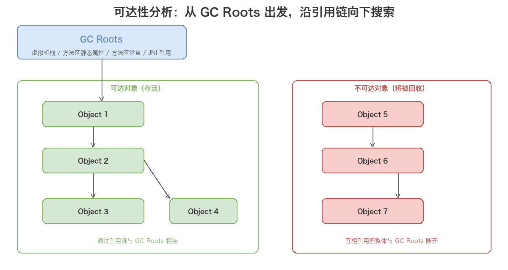
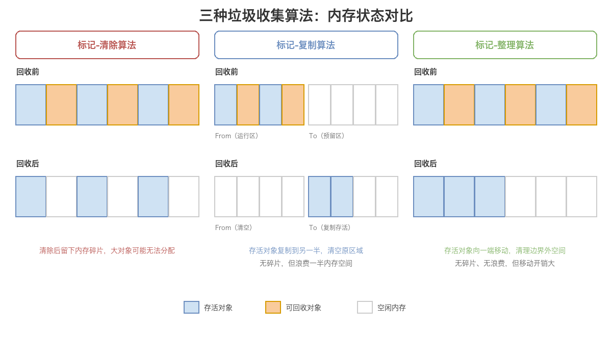
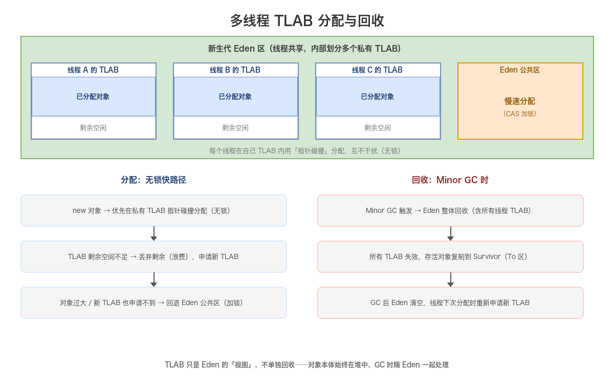
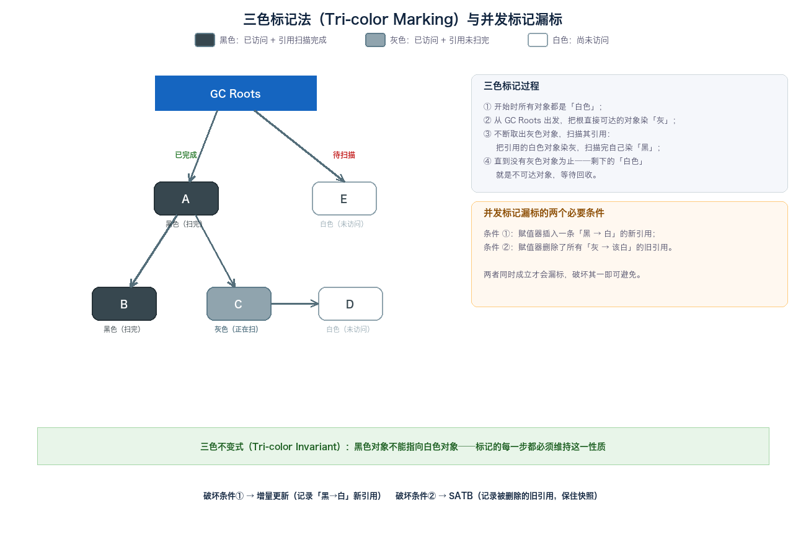
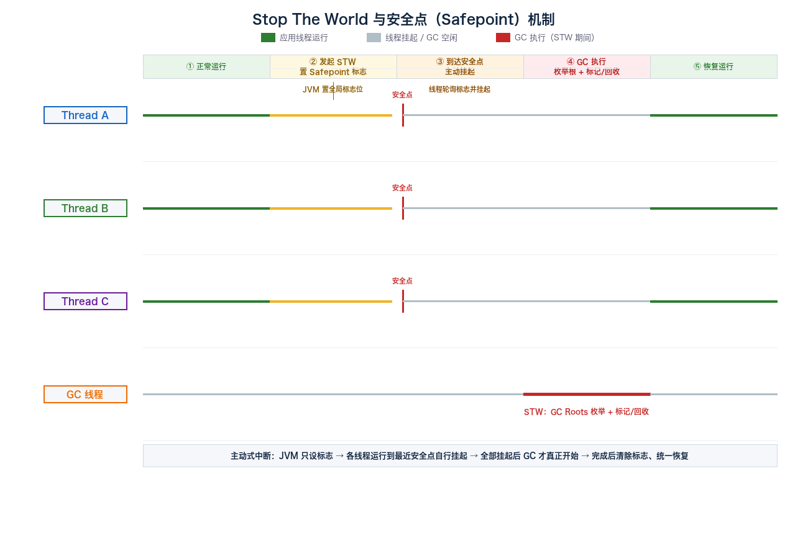

# 08. 运行时数据区三：堆

> 本文是运行时数据区的第三篇，聚焦**线程共享的堆（Heap）**——JVM 管理的最大一块内存，也是 GC 的主战场。本文先讲清如何判定对象「已死」（引用计数法 vs 可达性分析、GC Roots、四种引用强度），再讲三种垃圾收集算法（标记-清除 / 标记-复制 / 标记-整理），随后是对象的两种分配方式（指针碰撞 / 空闲列表）、对象在堆中的内存布局、分代结构与对象晋升规则、TLAB 免锁分配、字符串常量池的去向，以及逃逸分析如何让部分对象「不在堆上分配」。最后单列一篇详解 **Stop The World（STW）**——为什么 GC 期间应用必须暂停、并发标记的「三色标记」理论与漏标原理、写屏障/读屏障如何兜底漏标、安全点（Safepoint）/安全区域（Safe Region）让线程有序挂起、轮询页（Polling Page）让 STW 触发几乎零开销、STW 的触发链路（VM Operation）、以及非 GC 场景的 STW 与五个优化方向。

## 目录

- [一、堆](#一堆)
  - [1. 基本特点](#1-基本特点)
  - [2. 对象的内存分配方式](#2-对象的内存分配方式)
  - [3. 对象在堆中的内存布局](#3-对象在堆中的内存布局)
  - [4. 对象存活判定：可达性分析](#4-对象存活判定可达性分析)
  - [5. 垃圾收集算法](#5-垃圾收集算法)
  - [6. 分代结构深入](#6-分代结构深入)
  - [7. TLAB：线程私有分配缓冲区](#7-tlab线程私有分配缓冲区)
  - [8. 字符串常量池在堆中](#8-字符串常量池在堆中)
  - [9. 堆内存参数与调优](#9-堆内存参数与调优)
  - [10. 逃逸分析与栈上分配](#10-逃逸分析与栈上分配)
- [二、Stop The World（STW）详解](#二stop-the-worldstw详解)
  - [1. 什么是 STW](#1-什么是-stw)
  - [2. 为什么需要 STW：一致性快照](#2-为什么需要-stw一致性快照)
  - [3. 三色标记与并发标记的漏标](#3-三色标记与并发标记的漏标)
    - [3.1 三色标记法（Tri-color Marking）](#31-三色标记法tri-color-marking)
    - [3.2 并发标记为什么漏标：两个必要条件](#32-并发标记为什么漏标两个必要条件)
    - [3.3 两种写屏障方案：增量更新与 SATB](#33-两种写屏障方案增量更新与-satb)
  - [4. 写屏障与读屏障的原理](#4-写屏障与读屏障的原理)
    - [4.1 写屏障（Write Barrier）](#41-写屏障write-barrier)
    - [4.2 读屏障（Load Barrier）](#42-读屏障load-barrier)
  - [5. 安全点（Safepoint）与安全区域（Safe Region）](#5-安全点safepoint与安全区域safe-region)
    - [5.1 什么是安全点](#51-什么是安全点)
    - [5.2 主动式中断（Voluntary Suspension）](#52-主动式中断voluntary-suspension)
    - [5.3 轮询页（Polling Page）机制](#53-轮询页polling-page机制)
    - [5.4 安全区域（Safe Region）](#54-安全区域safe-region)
    - [5.5 OopMap 与安全点的关系](#55-oopmap-与安全点的关系)
    - [5.6 安全点停顿的组成与「无安全点」死循环](#56-安全点停顿的组成与无安全点死循环)
  - [6. STW 的触发机制：VM Operation](#6-stw-的触发机制vm-operation)
  - [7. 非 GC 场景的 STW](#7-非-gc-场景的-stw)
  - [8. STW 的优化方向](#8-stw-的优化方向)
  - [9. STW 相关参数与观察手段](#9-stw-相关参数与观察手段)
- [附：高频速记](#附高频速记)
  - [堆速记](#堆速记)

---

## 一、堆

### 1. 基本特点

Java 堆是 JVM 管理的内存中**最大的一块**，虚拟机启动时创建，**所有线程共享**：

- Java **对象实例和数组**都在堆上分配（除 JIT 编译后的逃逸分析场景，见第 10 小节）；
- 大小可固定，也可按需扩展/收缩，且**不需要连续**；
- 堆是**垃圾收集器管理的主要区域**，所以也叫「GC 堆」。

JVM 规范对堆的定义是「**所有对象实例以及数组都应当在对上分配**」（§2.5.4），但随着逃逸分析、栈上分配、标量替换等 JIT 优化技术的成熟，「全部对象都在堆上分配」这句话在实际运行中并不绝对——但绝大多数普通对象依然在堆上。

### 2. 对象的内存分配方式

在堆上为新对象分配内存时，JVM 主要采用两种方式，**取决于堆是否规整**：


**指针碰撞（Bump the Pointer）**

- 堆内存**绝对规整**（已分配的在一侧，空闲的在另一侧）时使用；
- 维护一个**分配指针**，最初指向空闲区起始位置；
- 分配时把指针向空闲区方向**推进对象大小的距离**；
- 速度快、零碎片；
- 触发条件：堆被 GC 整理成规整状态后（如复制算法、标记-整理算法）。

**空闲列表（Free List）**

- 堆内存**碎片化**时使用（已分配/未分配块交错）；
- JVM 维护一个**空闲块链表**，记录每段空闲区的起始地址和大小；
- 分配时从链表中**找到一块足够大的空间**（一般用「首次适配」「最佳适配」「最差适配」等策略）划给对象，更新链表；
- 速度较慢、有外碎片；
- 触发条件：堆被 GC 整理成碎片化状态后（如标记-清除算法）。

**并发分配的问题**：上述两种方式都是「在临界区更新指针/链表」，多线程同时分配时需要**同步**。HotSpot 用 **CAS + 失败重试** 保证原子性；更高效的做法是 **TLAB**（见第 7 小节），让每个线程预先占一块私有空间，避开竞争。


### 3. 对象在堆中的内存布局

HotSpot 中，一个普通 Java 对象在堆内存里**逻辑上**分为三块（数组对象在前面多一块 length 标记）：


| 部分                      | 大小               | 作用                                 |
| ----------------------- | ---------------- | ---------------------------------- |
| **对象头（Header）**         | 8 字节（无压缩）/ 12 字节 | 包含 Mark Word + 类型指针                |
|   · Mark Word           | 8 字节（32 位是 4 字节） | 哈希码、GC 分代年龄、锁状态标志、偏向锁线程 ID、epoch 等 |
|   · 类型指针 Klass Pointer  | 4 字节（压缩）/ 8 字节   | 指向方法区里的 `InstanceKlass`（类元数据）      |
| **实例数据（Instance Data）** | 不定               | 对象的字段内容（基本类型、引用），父类字段在前、子类字段在后     |
| **对齐填充（Padding）**       | 0~7 字节           | 保证对象大小是 8 字节整数倍，便于寻址与内存对齐          |

**几个关键细节**：

- **Mark Word 是「复用字段」**：由于对象头固定只有 4/8 字节，但又要存哈希码、GC 年龄、锁状态、偏向锁信息等多个不同时刻的字段，JVM 用「按位复用」的方式在不同状态下让这些字段共享存储空间——比如无锁态存哈希码+分代年龄，有锁态存锁记录指针；
- **类型指针压缩**：开启 `-XX:+UseCompressedOops`（默认开启）时，Klass Pointer 压缩到 4 字节。这是为了在 64 位系统上让对象头更紧凑、节省内存——同时堆内引用、字段也都会被压缩；
- **字段排序**：HotSpot 默认按 `long/double → int → short → byte → boolean → reference` 的顺序分配字段，便于内存紧凑。可用 `-XX:FieldsAllocationStyle` 调整；
- **数组对象**会多出一块 4 字节长度字段（`-XX:+UseCompressedClassPointers` 时为 8 字节），用于记录数组长度，所以数组对象头比普通对象多 4~8 字节。


### 4. 对象存活判定：可达性分析

在讨论堆内存如何回收之前，先要解决一个前置问题：**如何判断一个对象是否「已死」、可以被回收？** 主流有两种算法——引用计数法和可达性分析算法。

#### 4.1 引用计数法（Reference Counting）

给对象添加一个**引用计数器**，每当有地方引用它时计数器 **+1**，引用失效时 **-1**；任何时刻计数器为 0 的对象就是不再被使用的。实现简单、判定高效，但它**无法解决对象之间相互循环引用**的问题。

```java
public class ReferenceCountingGC {
    public Object instance = null;
    private static final int _1MB = 1024 * 1024;
    private byte[] bigSize = new byte[2 * _1MB];   // 占内存，便于观察 GC 行为

    public static void testGC() {
        ReferenceCountingGC objA = new ReferenceCountingGC();
        ReferenceCountingGC objB = new ReferenceCountingGC();
        objA.instance = objB;   // 相互引用
        objB.instance = objA;
        objA = null;
        objB = null;
        System.gc();            // 若采用引用计数，两者计数器都不为 0，本不该被回收
    }
}
```

上面 objA 与 objB 相互引用，各自的计数器都不为 0，但实际执行 `System.gc()` 后它们**依然被回收了**——这侧面说明虚拟机并不是用引用计数法来判断对象是否存活。所以 HotSpot 采用的是下面这种算法。

#### 4.2 可达性分析算法（Reachability Analysis）

主流商用语言（Java、C# 等）的主流实现，都是通过**可达性分析**来判定对象是否存活。

基本思路：以一系列被称为 **GC Roots** 的对象作为起始点，从这些节点开始向下搜索，搜索走过的路径称为**引用链（Reference Chain）**。当一个对象到 GC Roots 之间**没有任何引用链相连**时，就证明它是不可达的，判定为可回收。



上图中，Object 1~~4 都能被 GC Roots 访问到，属于存活对象；Object 5~~7 到 GC Roots 之间没有引用链，是不可达对象，下次 GC 时会被回收。

**可作为 GC Roots 的对象**包括：

| GC Roots                                      | 说明                      |
| --------------------------------------------- | ----------------------- |
| **虚拟机栈（栈帧局部变量表）引用的对象**                        | 方法里正在使用的局部变量、参数指向的对象    |
| **方法区中类静态属性引用的对象**                            | `static` 字段指向的对象        |
| **方法区中常量引用的对象**                               | 运行时常量池里的常量（如字符串常量）指向的对象 |
| **本地方法栈中 JNI 引用的对象**                          | Native 方法里引用的对象         |
| （HotSpot 内部）**Class 对象 / 异常对象 / 类加载器 / 同步锁等** | JVM 运行时内部持有的引用，也作为根     |

#### 4.3 引用的两次标记过程

一个对象被判定为「不可达」之后，并不会立即死亡，而是要经历**两次标记**：

1. **第一次标记 + 筛选**：对象在可达性分析后发现没有与 GC Roots 相连的引用链，会被**第一次标记**，并进行一次筛选——筛选条件是「该对象是否有必要执行 `finalize()` 方法」。当对象没有覆盖 `finalize()`，或 `finalize()` 已经被虚拟机调用过时，虚拟机都视为「没有必要执行」，直接判定死亡。
2. **第二次标记**：被判定为「有必要执行 `finalize()`」的对象，会被放入一个 **F-Queue 队列**，由 JVM 建立的、低优先级的 Finalizer 线程去触发其 `finalize()` 执行。GC 稍后对 F-Queue 中的对象进行**第二次小规模标记**——若对象在 `finalize()` 里重新与引用链上的任一对象建立了关联（例如把 `this` 赋值给某个类变量或成员变量），它就会被移出「即将回收」的集合，逃过一劫；否则真正被回收。

> `finalize()` 是对象「自救」的最后一次机会，但一个对象的 `finalize()` **只会被 JVM 自动调用一次**，且执行时机、是否执行都不确定。《Effective Java》明确建议**不要依赖 `finalize()` 做资源释放**，应改用 `try-finally` 或 JDK 9 的 `Cleaner` / `AutoCloseable`。

#### 4.4 引用的四种类型

传统「引用」只有「引用 / 未引用」两种状态，无法描述「希望保留、但内存不足时可丢弃」这类对象。JDK 1.2 起，Java 把引用细分为**四种强度**，强度依次递减：

| 类型               | 强度 | 回收时机                                           | 实现类                            |
| ---------------- | -- | ---------------------------------------------- | ------------------------------ |
| **强引用（Strong）**  | 最强 | 只要强引用存在，**永不回收**                               | 普通 `Object obj = new Object()` |
| **软引用（Soft）**    | 中  | 内存不足、即将 OOM 前，把这些对象列入回收范围做**二次回收**；仍不足才抛 OOM   | `SoftReference`                |
| **弱引用（Weak）**    | 较弱 | 无论内存是否充足，**下次 GC 必回收**只被弱引用关联的对象               | `WeakReference`                |
| **虚引用（Phantom）** | 最弱 | 完全不影响对象生存，也无法通过它取得对象实例；唯一作用是对象被回收时**收到一个系统通知** | `PhantomReference`             |

- **软引用**：适合做**内存敏感缓存**（图片缓存、页面缓存等），内存紧张时自动释放；
- **弱引用**：适合 `WeakHashMap`、`ThreadLocal` 的 key 等场景，避免对象被无意「钉住」无法回收；
- **虚引用**：配合 `ReferenceQueue`，在对象被回收后执行清理动作（JDK 9 的 `Cleaner` 就是基于虚引用实现，用来替代 `finalize()`）。


### 5. 垃圾收集算法

可达性分析解决了「对象是否可回收」的判定问题；那确定回收对象之后，**内存空间具体怎么回收**？这就是垃圾收集算法要讨论的。按对内存的不同操作方式，可分为三种：标记-清除、标记-复制、标记-整理。



#### 5.1 标记-清除算法（Mark-Sweep）

最基础的算法，分两个阶段：

1. **标记**：标记出所有需要回收的对象；
2. **清除**：统一清除被标记的对象，释放其占用内存。

**两个缺点**：

- **执行效率不稳定**：若堆中大部分对象都可回收（大对象少、存活多时相反），收集器要执行大量标记与清除操作；
- **内存碎片化**：清除后内存不连续，产生大量碎片；当需要分配大对象而找不到足够大的连续空间时，会**提前触发下一次 GC**。

#### 5.2 标记-复制算法（Mark-Copy / Copying）

针对标记-清除「效率 + 碎片」两个问题，提出的「半区复制」算法：

- 把可用内存分为**大小相等的两块**：一块是**运行区（From）**，一块是**预留区（To）**；
- 新对象都分配到运行区；运行区满时，把存活对象**全部复制到预留区**，然后**一次性清空整个运行区**；
- 之后两块区域角色互换（From ↔ To），存活对象像「皮球」一样在两边来回倒腾，垃圾对象随着整块清空而释放。

**优点**：

- 大量垃圾对象时只需复制**少量存活对象**，效率高；
- 无碎片，新内存分配只需**移动堆顶指针顺序分配**即可。

**缺点**：

- **浪费一半内存**（预留区始终空闲）；
- 若存活对象多、垃圾对象少，需要执行**更多次复制**才能释放少量空间，效率反而低。

> 正因「复制算法浪费一半空间」且「存活多时低效」，它不适合直接用于老年代，而适合「朝生夕死」的新生代。HotSpot 新生代把它改成了 **Eden : Survivor = 8 : 1 : 1** 的非 1:1 划分（见第 6 小节），把空间浪费降到 10%。

#### 5.3 标记-整理算法（Mark-Compact）

复制算法浪费一半内存、且存活多时效率低，于是提出了标记-整理算法。它的**标记阶段与其他算法一样**，区别在「整理」阶段：**把所有存活对象向内存一端移动**，然后直接**清理掉存活对象边界以外的所有空间**。

**优点**：既解决了内存碎片问题，也不存在空间浪费。  
**缺点**：若存活对象多且多为小对象，要**移动大量存活对象**才能换取少量空间，代价较高。

> 因此「标记-整理」适合**存活率高的老年代**；而老年代若碎片化严重，某些收集器（如 CMS）也会退回到标记-清除。

#### 5.4 三种算法对比

| 算法        | 是否产生碎片 | 是否浪费空间              | 移动/复制开销 | 适用场景          |
| --------- | ------ | ------------------- | ------- | ------------- |
| **标记-清除** | 是（碎片多） | 否                   | 无移动     | 老年代兜底（CMS 用）  |
| **标记-复制** | 否      | 是（浪费 50%，新生代降到 10%） | 复制存活对象  | **新生代**       |
| **标记-整理** | 否      | 否                   | 移动存活对象  | **老年代**（存活率高） |


### 6. 分代结构深入

现代收集器基本采用**分代收集算法**——「不同对象生命周期不同」，GC 按对象年龄采取不同策略：


**新生代（Young Generation）**

- 进一步分为：1 块 **Eden 空间** + 2 块等大的 **Survivor 空间（From / To）**；
- 默认比例 `Eden : From : To = 8 : 1 : 1`（`-XX:SurvivorRatio=8`）；
- **对象优先在 Eden 分配**：新 new 出来的对象几乎都先落到 Eden；
- **Minor GC（Young GC）** 只回收新生代：
  - 回收算法：复制算法（把 Eden + From 中存活的对象复制到 To，存活对象年龄 +1；然后清空 Eden 和 From，From/To 互换角色）；
  - 优点：复制算法回收快、空间连续、零碎片；
  - 缺点：复制需要额外 Survivor 区、对象全死掉时复制浪费（但新生代「朝生夕死」假设成立时浪费少）。

**老年代（Old Generation）**

- 存放**熬过多次 Minor GC 仍然存活的对象**（默认年龄阈值 15，对应 `MaxTenuringThreshold`）；
- 触发回收的是 **Major GC** 或 **Full GC**（一般伴随整个堆的回收）；
- 回收算法：标记-清除 / 标记-整理（无复制，原因是老年代对象存活率高、复制开销大）；
- 触发条件相对复杂：老年代空间不足、显式 `System.gc()`（可禁用）、CMS/G1 触发的并发周期等。

**对象晋升的几种情况**


- **年龄达到阈值**：对象在 Survivor 区每熬过一次 Minor GC，年龄 +1，达到 `MaxTenuringThreshold`（默认 15）后晋升老年代；
- **Survivor 空间不足**：Minor GC 复制时如果 To Survivor 装不下存活对象，会通过**分配担保**机制直接晋升到老年代；
- **大对象直接进老年代**：`-XX:PretenureSizeThreshold`（只对 Serial/ParNew 收集器有效）以上的大对象直接进入老年代，避免在 Eden/Survivor 来回复制；
- **动态对象年龄判定**：Survivor 中「相同年龄的对象总大小 > Survivor 一半」时，所有大于等于该年龄的对象直接晋升，不必等阈值；
- **空间分配担保（Handle Promotion）**：在 Minor GC 之前，JVM 先检查**老年代最大可用连续空间是否大于新生代所有对象总空间**，并以此作为 Minor GC 的「担保」：若大于，Minor GC 可安全执行；否则会查看 `-XX:HandlePromotionFailure` 是否允许担保失败——允许则继续 Minor GC，不允许则改触发 Major GC（Full GC）来腾出足够空间。

**GC 的三种类型**：

| 类型                     | 作用区域      | 触发时机                             | 特点                                      |
| ---------------------- | --------- | -------------------------------- | --------------------------------------- |
| **Minor GC（Young GC）** | 新生代       | Eden 区满                          | 频繁、速度快（对象「朝生夕死」）                        |
| **Major GC（Old GC）**   | 老年代       | 老年代空间不足等                         | 通常伴随至少一次 Minor GC；速度比 Minor GC 慢 10 倍以上 |
| **Full GC**            | 整个堆 + 方法区 | 老年代/Metaspace 不足、`System.gc()` 等 | 范围最大、耗时最长，应尽量避免频繁发生                     |

**GC 触发条件（全面）**

GC 不会无缘无故发生，每次回收都有明确的触发源。按回收范围归纳，触发条件分「Minor GC 触发」与「Full GC / 老年代触发」两大类，后者更复杂，也是排查「GC 停顿」的重点。

**一、Minor GC（Young GC）触发条件**

触发点几乎唯一：**Eden 区满**。

- 新对象分配时，JVM 先尝试在 TLAB 中分配；TLAB 剩余空间不足则回退到 Eden 公共区；若 Eden 也无法容纳新对象，即触发 Minor GC；
- Minor GC 把 Eden + From Survivor 的存活对象复制到 To Survivor，并清空 Eden 与 From，随后 From/To 互换；
- 触发频率与 Eden 大小、对象分配速率正相关：Eden 越小、分配越快，Minor GC 越频繁（这正是「新生代朝生夕死」假设下的常态）。

**二、Full GC（老年代 / 全堆）触发条件**

Full GC 范围最大、耗时最长，触发源较多，是排查「GC 停顿」的重中之重。常见触发条件：

1. **老年代空间不足**：Minor GC 时存活对象晋升老年代，若老年代剩余空间不足以容纳晋升对象（含「Survivor 空间不足 → 分配担保 → 直接晋升」的大批量对象），触发 Full GC 来腾空间；
2. **元空间（Metaspace）空间不足**：加载的类过多、类元数据/运行时常量池/方法字节码占用超出 `-XX:MaxMetaspaceSize`（或本地内存上限），触发 Full GC 尝试回收无用的类与类加载器。
3. **`System.gc()` / `Runtime.getRuntime().gc()` 显式调用**：代码里主动请求垃圾回收（RMI、部分框架会显式调用）。可用 `-XX:+DisableExplicitGC` 禁用，避免被框架拖慢；
4. **空间分配担保失败**：`-XX:HandlePromotionFailure` 关闭时，若老年代连续空间不足以担保 Minor GC，直接改触发 Full GC（注：JDK 6 Update 24 后该参数已废弃、恒为「允许担保」语义）；
5. **大对象直接进老年代失败**：超过 `-XX:PretenureSizeThreshold` 的大对象要直接进老年代，但老年代放不下时触发 Full GC；
6. **并发收集器退化**（CMS / G1，见下文）。

**三、并发收集器特有的触发（CMS / G1）**

现代收集器把「回收」拆成并发阶段，触发条件与停顿型 Full GC 不同：

- **CMS**：
  - 老年代占用达到阈值 `-XX:CMSInitiatingOccupancyFraction`（默认 92%）时，启动 CMS 并发标记/清理周期（不整堆 STW）；
  - 若并发周期执行期间老年代被填满（并发回收速度跟不上分配速度），发生 **Concurrent Mode Failure**，退化为 Serial Old 的**停顿型 Full GC**；
  - 若 Minor GC 时晋升失败（**Promotion Failed**，Survivor 与老年代都放不下），同样退化为 Full GC。
- **G1**：
  - 整体堆占用达到 **IHOP（Initiating Heap Occupancy Percent，默认 45%）** 时，触发**并发标记周期**，之后进入**混合回收（Mixed GC）**，同时回收多个 Region（年轻 + 部分老年代 Region）；
  - 若分配速率过快、可用 Region 耗尽（**to-space exhausted**），触发 **Full GC（Serial 兜底）**。

### 7. TLAB：线程私有分配缓冲区

由于堆是线程共享的，多线程同时 `new` 对象时**都需要修改分配指针/空闲链表**——必须加锁，否则指针会被错乱。

**TLAB（Thread Local Allocation Buffer）** 是 HotSpot 用来消除这种竞争的关键优化：

- 每个线程在**新生代 Eden 区内**预先「认领」一块**私有分配区**；
- 线程内 `new` 对象时**只在自己这块 TLAB 里分配**，无需加锁，速度接近指针碰撞；
- TLAB 用完时再申请一块；偶尔 TLAB 剩余空间不足，分配会**回退到 Eden 公共区**（加锁分配）；
- 默认开启 `-XX:+UseTLAB`，TLAB 大小由 JVM 动态调整（`-XX:TLABSize` 设定初始大小，JVM 会基于分配历史自动 resize）；
- 调优关注点：`-XX:TLABWasteTargetPercent`（允许 TLAB 浪费的空间占比），以及 `-XX:+PrintTLAB` 观察 TLAB 使用率。

TLAB 是「**线程私有**」的，但**从属于新生代 Eden**——它只是堆内划分出来的私有分配区，**对象本身仍属于堆**。这是 JMM 内存可见性层面和分配性能层面要分清的关键：TLAB 不影响 happens-before 语义（对象在堆里，跨线程可见性靠主内存同步而非 TLAB）。



**多个线程的 TLAB 分配**

线程首次分配对象时，会先在 Eden 申请一块 TLAB（线程私有），由 `ThreadLocalAllocBuffer` 结构记录三个指针：

- **`_start`**：TLAB 在 Eden 中的起始地址
- **`_top`**：当前分配位置（下一对象要写入的地方）
- **`_end`**：TLAB 结束地址

分配时走「指针碰撞（Bump the Pointer）」：`new_top = top + size`，若 `new_top ≤ end` 则直接在 TLAB 内写入并推进 `top`——**全程无锁**，仅是单一线程对 `top` 的推进。

**TLAB 剩余不足时**（`size > end - top`）会走以下分支：

1. **对象较小、TLAB 剩余空间 > 浪费阈值**：丢弃 TLAB 剩余（`top` 重置到 `_end`，这部分成为「浪费」，受 `-XX:TLABWasteTargetPercent` 控制），向 Eden 全局申请新 TLAB（CAS 申请，频率远低于对象分配）；
2. **对象过大（超过 TLAB 剩余）**：直接回退到 **Eden 公共区**，走全局慢速分配路径（CAS 更新全局分配指针）；
3. **新 TLAB 申请失败（Eden 已耗尽）**：触发 Minor GC。

**多个线程的 TLAB 回收**

TLAB 本身**不单独回收**——它只是 Eden 区的「视图」，TLAB 里的对象就是 Eden 里的对象，分配后立即可见于整个堆：

- **Minor GC 时**：JVM 暂停所有线程（STW），扫描整个 Eden（含所有线程的 TLAB），把存活对象复制到 Survivor（From → To），然后**清空 Eden**；
- **TLAB 全部失效**：Eden 被清空，所有线程的 TLAB `_start/_top/_end` 全部失效；线程下次分配时**重新从 Eden 申请新 TLAB**；
- **TLAB 的「浪费」空间**（`top` ~ `_end` 之间未使用）：GC 时随 Eden 一起被回收，不产生内存碎片——这点是 TLAB 设计精妙之处：用「浪费」换「无锁」，浪费空间随 GC 一次性释放。

### 8. 字符串常量池在堆中

**JDK 1.7 起，字符串常量池（StringTable）从方法区搬到了堆中**——这是 JDK 1.7 永久代去化的第一步。

原因：永久代有固定大小限制，且只有 Full GC 才会回收，导致大量 `String` 字面量堆积时容易 OOM。把 StringTable 放进堆后：

- 堆空间更大，字符串常量池不再受 `-XX:PermSize` / `-XX:MaxPermSize` 限制；
- 字符串常量池里的对象成为普通堆对象，可被**普通 GC（Minor GC）** 回收；
- `-XX:StringTableSize` 控制 StringTable 哈希表桶数（默认 60013），影响查找/插入性能。

```java
String s1 = "hello";          // 字面量，编译期进入常量池
String s2 = new String("hello");  // new 一个新对象，不在池中
String s3 = s2.intern();      // 把 s2 放入池中（或返回池中已有引用）
// JDK 7+：s1 == s3 为 true
```

`String.intern()` 的行为也在 JDK 7 调整过：之前是「复制字符串到永久代」，现在是「首次调用时把字符串引用放入堆的 StringTable」（不再复制字符串本体）。这是字符串常量池话题里最常见的考点。


### 9. 堆内存参数与调优

| 参数                                | 作用                  | 备注                                   |
| --------------------------------- | ------------------- | ------------------------------------ |
| `-Xms`                            | 堆初始大小               | 等同于 `-XX:InitialHeapSize`            |
| `-Xmx`                            | 堆最大大小               | 等同于 `-XX:MaxHeapSize`                |
| `-Xmn`                            | 新生代大小               | 等同于 `-XX:NewSize` / `-XX:MaxNewSize` |
| `-XX:NewRatio`                    | 老年代 / 新生代 的比例       | 默认 2，即老年代 : 新生代 = 2 : 1              |
| `-XX:SurvivorRatio`               | Eden / Survivor 的比例 | 默认 8                                 |
| `-XX:MaxTenuringThreshold`        | 对象晋升老年代的年龄阈值        | 默认 15                                |
| `-XX:PretenureSizeThreshold`      | 大对象直接进老年代的阈值        | 只对 Serial/ParNew 有效                  |
| `-XX:+UseTLAB`                    | 是否启用 TLAB           | 默认开启                                 |
| `-XX:StringTableSize`             | 字符串常量池哈希表桶数         | 默认 60013                             |
| `-XX:+HeapDumpOnOutOfMemoryError` | OOM 时 dump 堆快照      | 排查 OOM 利器                            |

**典型调优场景**：

- 大数据/缓存型应用 → 堆大、年轻代也大，减少 GC 频率；
- 短生命周期对象多 → 适当调大 Survivor 区、降低对象过早晋升；
- Full GC 频繁 → 检查是否有内存泄漏、老年代是否过小、`-Xms == -Xmx` 减少动态扩容开销。

**OOM**：堆内存不足时抛 `java.lang.OutOfMemoryError: Java heap space`——对象太多 / 太大 / 有内存泄漏。

### 10. 逃逸分析与栈上分配

JVM 规范说「对象在堆上分配」，但 HotSpot 通过 **JIT 即时编译器 + 逃逸分析（Escape Analysis）**，能让一部分对象**不在堆上分配**：

**逃逸分析**：JIT 分析对象的作用域，如果一个对象**只在当前方法内使用**（不逃逸出方法），就可以做优化：

- **栈上分配（Stack Allocation）**：对象直接在线程栈上分配，方法结束自动释放，**不需要 GC**；
- **标量替换（Scalar Replacement）**：把对象拆成基本类型的成员变量（标量），直接在线程栈帧的局部变量表里使用；
- **同步消除（Lock Elision）**：如果对象不逃逸、不会被其他线程访问，那么加锁操作是多余的，JIT 会去掉同步。

**逃逸分析 ≠ 一定优化**：HotSpot 默认开启逃逸分析（`-XX:+DoEscapeAnalysis`），但**实际是否走栈上分配还要看 JIT 编译成本**。只有「非逃逸 + 标量可替换 + 编译器能完整优化」时才会真正栈上分配，所以 HotSpot 上**绝大多数对象依然在堆上**——但逃逸分析为 JIT 优化提供了空间。

**相关参数**：

- `-XX:+DoEscapeAnalysis`：开启逃逸分析（默认开启）；
- `-XX:+EliminateAllocations`：开启标量替换（默认开启）；
- `-XX:+EliminateLocks`：开启同步消除（默认开启）。

---

## 二、Stop The World（STW）详解

GC 是堆的主战场，而 **STW（Stop The World）** 是 GC 不可避免的伴生现象。**STW 时长是衡量 JVM 性能的核心指标之一**（最大停顿时间、百分位停顿、吞吐量），也是调优 JVM 的重点。本篇从原理出发，深挖 STW 的本质：什么是 STW、为什么可达性分析必须暂停、并发标记的「三色标记」理论以及漏标的本质、写屏障/读屏障如何兜底漏标、安全点（Safepoint）/安全区域（Safe Region）让线程有序挂起、轮询页（Polling Page）如何把「让线程停下」做到几乎零开销、STW 的触发链路（VM Operation）、以及非 GC 场景的 STW 与优化方向。

### 1. 什么是 STW

**Stop The World（STW）**：JVM 在执行某些操作（最典型的是 GC）时，**暂停所有应用线程**（Java 用户线程），让所有 CPU 都专注于这一项任务；暂停期间，应用线程不会得到 CPU 时间片，整个程序对外表现为「卡住」。

- **谁暂停**：所有 Java 应用线程（即所有执行 Java 字节码的线程）；JVM 内部线程（GC 线程、VM Thread、Finalizer 线程、Reference Handler 等）仍在运行。
- **暂停多久**：取决于具体工作内容——Minor GC 通常几毫秒到几十毫秒，Full GC 可能数百毫秒甚至秒级；现代低停顿收集器把停顿压到亚毫秒级。
- **本质**：一次**全局暂停（Global Pause）**。STW 不是 GC 的「副产品」，而是 GC **正确性得以保证的前提**——见下一小节。

> STW 并非 GC 独有：**JIT 逆优化**（Deoptimization，如逆偏优化）、**偏向锁批量撤销**、**线程 Dump**（`jstack` / `jcmd Thread.print`）、**JVM 某些内部维护操作**（如字符串去重、Symbol GC、Class Redefinition）也会触发短暂的全局暂停。但 **GC 是 STW 最主要、最频繁、影响最大的场景**。非 GC 触发的 STW 详见第 7 小节。

### 2. 为什么需要 STW：一致性快照

可达性分析（见「一、堆」第 4 小节）的实现要求：**分析工作必须在一个能保证一致性的内存快照上进行**。

这意味着，分析期间，整个堆的对象引用关系必须「冻结」——不能在分析进行到一半时，应用线程又改动了引用关系，否则结果不可靠。设想若分析期间不 STW，GC 线程从 GC Roots 出发遍历引用图时，应用线程同时在跑，可能：

- 新建对象，并把引用赋给局部变量、成员变量或 static 字段 → 这些新对象「刚好」被 GC Roots 引用，按可达性应存活，但 GC 线程可能漏掉；
- 把某个原本还存活的可达对象的引用置 null → 该对象应被回收，但 GC 线程可能已基于旧引用判定为存活；
- 两个对象互相改变引用关系 → 引用图动态变化，分析无法收敛。

**结论**：STW 的本质是「**Stop-The-World 一致性快照**」——JVM 规范明确指出，可达性分析**必须在 STW 期间枚举 GC Roots**。这是 STW 不可避免的根本原因。

> **关键点**：虽然现代低停顿收集器把部分工作挪到并发阶段，**但它们仍然必须 STW 完成两件事**：
> 1. **枚举 GC Roots**（初始标记）：找到所有 GC Roots，这是分析的起点，必须保证引用关系稳定；
> 2. **最终标记 / 重新标记**：处理并发标记期间被改动的引用，避免漏标/误标。
>
> 因此 STW 是不可避免的，**优化方向是「把更多工作移到并发」**，而不是「消除 STW」。具体怎么「移到并发而不漏标」，是第 3 小节要讲的内容。

### 3. 三色标记与并发标记的漏标

本节是 STW 与 GC 正确性最核心的原理。**为什么「并发标记」必须配合 STW 的「最终标记」？为什么需要写屏障？答案都在「三色标记」理论里**。

#### 3.1 三色标记法（Tri-color Marking）

**三色标记**是可达性分析的抽象模型——把对象按「被访问的进度」涂上三种颜色：

| 颜色 | 含义                                                                                |
| -- | --------------------------------------------------------------------------------- |
| 白色 | 尚未被访问的对象。标记开始时所有对象都是白色；标记结束后仍为白色的对象**不可达**，将被回收。                                       |
| 灰色 | 对象本身**已被访问**，但它**引用的字段（field）尚未全部扫描完**。灰色对象是「标记队列」中的待处理边界。                            |
| 黑色 | 对象**已被访问**，且它**引用的所有对象也都已（或将被）访问**——即它的字段已扫描完毕。黑色对象标记完成，不会再被处理。                       |

**标记过程**（单线程下，不会有漏标）：

1. **初始化**：所有对象涂白；
2. **从 GC Roots 出发**：把根直接引用的对象涂灰；
3. **循环**：从「灰色对象集合」中取出一个对象 A → 扫描 A 的所有字段：
   - 若字段引用的是白色对象 → 把它涂灰（入队）；
   - 把 A 自己涂黑（扫描完成）；
4. **结束**：当没有灰色对象时停止——剩余白色对象即为不可达对象。

> **三色不变式（Tri-color Invariant）**：在标记过程的任一时刻，**黑色对象不能直接指向白色对象**。这是标记正确性的核心保证——一旦违背，黑色对象直接引用的白色对象将永远不会被遍历到，从而被漏标。GC 算法设计的根本目的，就是如何在并发（应用线程同时跑）的情况下**始终维持这一不变式**。

#### 3.2 并发标记为什么漏标：两个必要条件

如果在标记过程中让应用线程继续运行（**并发标记**），应用线程会修改引用关系，可能打破「三色不变式」导致漏标。

**Wilson 在 1994 年证明**：并发标记中**漏标的两个必要条件**（必须同时满足才会漏标，破坏其一即可避免）：

1. **条件 ①（插入新引用）**：应用线程插入了一条或多条「**从黑色对象到白色对象**」的新引用。即黑色对象新增了一个白色字段引用。
2. **条件 ②（删除旧引用）**：应用线程删除了**所有**「**从灰色对象到该白色对象**」的旧引用。即该白色对象原本经由灰色对象可达，但这条路径被全部切断了。

只有两个条件**同时**满足时，黑色对象直接指向的白色对象会因为没有任何路径被「重新发现」而被错误地保留为白色（最终被判定为不可达并被回收，但本应存活）。这叫**漏标（Miss Marking）**。

> 漏标的核心是「**黑色对象直接引用了白色对象**」——这恰好是「三色不变式」被破坏的状态。



#### 3.3 两种写屏障方案：增量更新与 SATB

解决漏标的思路就是「破坏两个必要条件之一」，对应**两种写屏障（Write Barrier）**方案：

**方案一：增量更新（Incremental Update）——破坏条件 ①**

- **思路**：当**黑色对象新增引用到白色对象**时，由写屏障**记录这条新增引用**，把黑色对象**重新标记为灰色**（或者把被引用的白色对象**标灰**），让 GC 在「最终标记」STW 阶段重新扫描。
- **本质**：在「标记并发」期间抓住新插入的引用，**把原本黑的对象「反悔」为灰**，确保下次扫描时能扫到白色对象。
- **代价**：写屏障开销大（每次引用更新都要判断黑色 → 白色），且最终标记 STW 阶段要重新处理这些记录，可能仍有可观停顿。

**方案二：SATB（Snapshot At The Beginning）——破坏条件 ②**

- **思路**：在标记**开始时**为对象图拍一份「**逻辑快照**」（即「标记开始这一刻仍然存活的对象集合」）。当应用线程**删除灰色对象对白色对象的引用**时，由写屏障**记录这个被删除的旧引用**，把被删引用的白色对象**标记为灰色**（保住快照中的存活对象不被漏标）。
- **本质**：SATB 不关心「新插入的引用」——因为新插入的引用目标在快照中不存活，回收它顶多是「**多标**」（浮动垃圾，留到下一轮回收）。SATB 关心的是「**被删的旧引用**」——必须保住这些对象。
- **代价**：SATB 写屏障较简单（仅在引用被覆写时记录旧值），但会产生**浮动垃圾（Floating Garbage）**——本轮被保留下来的、实际已不可达的对象，要等下一轮 GC 才回收。

**两种方案的对比（原理层面）**：

| 方案   | 破坏的条件 | 写屏障时机       | 写屏障做的事    | 副作用            |
| ---- | ----- | ---------- | --------- | -------------- |
| 增量更新 | 条件 ①  | 引用新增后（后写屏障） | 把黑色对象重新标灰 | 最终标记 STW 阶段重扫 |
| SATB | 条件 ②  | 引用删除前（前写屏障） | 记录旧值，标灰   | 浮动垃圾           |

> **关键洞察**：CMS 用增量更新，G1 用 SATB；两者都是「**用写屏障的运行时开销换 STW 时的更少工作量**」——把本应在最终标记 STW 阶段做的大量遍历工作，通过写屏障拆解到应用线程的每次引用修改中。这就是「**把工作从 STW 挪到并发**」的微观机制。

### 4. 写屏障与读屏障的原理

第 3 节讲了「为什么需要写屏障」，本节讲「写屏障/读屏障**是什么**」。

#### 4.1 写屏障（Write Barrier）

**写屏障**：JIT 编译器在「**对象引用类型的字段被赋值**」的字节码（`putfield` / `putstatic`）前或后，**自动插入的一小段辅助代码**。它不是「CPU 硬件内存屏障」（如 `lfence` / `sfence`），而是 HotSpot 内部的「**JVM 写屏障逻辑**」。

- **前写屏障（Pre-Write Barrier）**：在引用赋值**之前**执行，记录**旧值**（即将被覆盖的引用）。SATB 用前写屏障。
- **后写屏障（Post-Write Barrier）**：在引用赋值**之后**执行，记录**新值**。增量更新用后写屏障。

CMS 增量更新后写屏障与 G1 SATB 前写屏障的伪代码对比：

```c
// CMS 后写屏障（增量更新）伪代码：
void post_write_barrier(oop* field, oop new_val) {
    if (new_val == null) return;
    // 若 this（黑色对象）新增了对白色对象的引用，把 this 反悔为灰
    if (this->is_black() && new_val->is_white()) {
        mark_gray(this);
        // 记录到 mod-union table，待最终标记 STW 阶段处理
    }
}

// G1 前写屏障（SATB）伪代码：
void pre_write_barrier(oop* field, oop old_val) {
    if (old_val == null) return;
    // 记录旧值到 SATB 队列，待并发标记线程处理
    if (old_val->is_white()) {
        satb_enqueue(old_val);
        mark_gray(old_val);  // 保住快照中的存活对象
    }
}
```

**写屏障的开销**：每次引用赋值都要执行几行代码，**对吞吐率有 1%–5% 的影响**（具体取决于应用引用更新频率）。这是「低停顿收集器」必须付出的代价。

#### 4.2 读屏障（Load Barrier）

**读屏障**：JIT 编译器在「**读取对象引用类型的字段**」（`getfield` / `getstatic`）时插入的辅助代码。

- **与写屏障的区别**：写屏障拦截「写引用」，读屏障拦截「读引用」——拦截的位置不同。
- **典型用途**：在并发**对象转移（Relocation）** 阶段，应用线程可能读到「已经被 GC 线程搬走的对象」的旧引用——读屏障在读到时**判断这个引用是否还有效**，如果是旧引用就**修正为新引用**。
- **ZGC 的核心机制**：ZGC 用「**染色指针（Colored Pointer）**」+「**读屏障**」实现几乎全程并发的对象转移——读屏障比写屏障开销大得多（**读操作远比写频繁**），所以读屏障必须做到**几乎零开销**（ZGC 靠硬件层面的指针修饰 + 极简的屏障逻辑）。

> 写屏障/读屏障**不是替代 STW**，而是**让「STW + 并发」协作得正确**——STW 保证一致性的起点和终点，并发阶段靠屏障维护引用变化的追踪，STW 的「最终标记」/「重定位修复」阶段处理屏障累积的待办事项。

### 5. 安全点（Safepoint）与安全区域（Safe Region）

STW 并不是「JVM 一声令下、所有线程瞬间停下」——线程需要跑到一个**安全的位置**才能停下，这就是**安全点（Safepoint）**。本节讲清「线程如何被有序挂起」。

#### 5.1 什么是安全点

**安全点（Safepoint）**：JVM 在程序指令序列中**特意选取的、可以安全暂停线程的指令位置**。在安全点上，**所有引用关系明确、OopMap（Oop Map）已建立完成**，JVM 可以准确枚举 GC Roots。

**为什么不能任意位置暂停**：程序任意时刻，**所有线程的栈上局部变量、寄存器**可能持有堆对象的引用；若在指令中间暂停，**无法准确知道寄存器里哪些是引用、哪些是数值**；必须选在「引用关系明确」的位置——即**OopMap 已完成构建**的位置。

**安全点的常见位置**（HotSpot 选取原则：「具有让程序长时间执行的特征」）：

| 位置类型  | 典型指令                    | 出现频率          |
| ----- | ----------------------- | ------------- |
| 方法调用  | 方法调用前的 `call` 指令       | 高             |
| 循环跳转  | 循环末尾的跳转指令（`goto` / `if`） | 高             |
| 异常跳转  | `athrow` 指令            | 中             |
| 方法返回  | 方法返回前的返回指令              | 中             |
| **不选** | 单条算术指令、内存读写指令           | 频率太高、暂停成本反而高 |

#### 5.2 主动式中断（Voluntary Suspension）

线程到达安全点后如何停下？HotSpot 用的是**主动式中断**而非**抢先式中断**：

- **抢先式中断（Preemptive Suspension）**（已基本不用）：JVM 直接中断所有线程，若发现线程不在安全点就恢复它、让它继续跑到安全点再停。问题：中断-恢复开销大，实时性差。
- **主动式中断（Voluntary Suspension）**（现代 HotSpot 用）：JVM **只设置一个全局标志位**，线程在执行过程中**周期性轮询这个标志**（HotSpot 在轮询点插入一条特殊指令），发现标志被设置就主动在最近的安全点挂起。



HotSpot 在轮询点插入的指令示例（x86 上的 `test` 指令）：

```assembly
; 线程周期性执行这条指令
test %eax, 0x160000   ; 检查全局 Safepoint 标志
; 若标志已设置，跳转到安全点处理逻辑，挂起线程
```

**为什么是主动而不是被动**：

- **开销小**：线程只在轮询点检查一个内存地址，不需要每次都进内核中断；
- **延迟可控**：线程最迟在下一个安全点停下，延迟可预期（通常 < 几毫秒）；
- **避免反复恢复**：抢先式中断需要「打断→恢复→再打断」循环，浪费 CPU。

#### 5.3 轮询页（Polling Page）机制

主动式中断的「**轮询**」是如何做到「**平时几乎零开销**」的？HotSpot 用了一个非常巧妙的技巧——**轮询页（Polling Page）**：

1. JVM 启动时**分配一个内存页**（通常 4KB），初始设为**可读**；
2. 在每个安全点轮询处，JIT 插入一条「**读这个内存页**」的指令（如 x86 的 `mov reg, [polling_page_addr]`）；
3. 平时这个页**可读**，指令正常返回，线程继续执行——**开销就是一次内存读取**；
4. 当需要 STW 时，JVM 调用 `mprotect` 把这个页设为**不可读**（`PROT_NONE`）；
5. 之后任何线程执行到轮询指令，就会**触发页故障（Page Fault）**——这是一个**内核信号**，由 HotSpot 预先注册的信号处理器捕获；
6. 信号处理器识别「这是安全点轮询触发的」，让线程挂起等待 STW 结束。

> **精妙之处**：靠**操作系统的页保护机制**实现「平时几乎零开销、STW 时让所有线程同时卡在同一个地方」——不需要每条指令都检查标志，也不需要主动轮询一个共享变量（会有缓存一致性问题）。线程甚至不知道自己「即将停下」，只是触发了一次读未映射页的异常，由 HotSpot 接管。

#### 5.4 安全区域（Safe Region）

**问题**：若线程处于 `Sleep` / `Blocked`（等待锁 / IO / 阻塞在 `wait()`）状态，它**无法执行任何指令**，更不会跑到安全点——JVM 等不到它。

**安全区域（Safe Region）**：**一段引用关系不会发生变化的代码片段**。线程进入安全区域时**标记自己「已进入安全区域」**，JVM STW 时**无需等待该线程**；线程离开安全区域时**检查 STW 是否已结束**，若已结束则直接恢复执行，否则等待 STW 结束再继续。

**安全区域的典型场景**：

- 线程处于 `Sleep` 状态（休眠期间不会修改引用）；
- 线程阻塞在 `synchronized` 等待锁（拿到锁前不会修改引用）；
- 线程在 `JNI` 中执行 native 代码（不修改 Java 引用）。

#### 5.5 OopMap 与安全点的关系

HotSpot 在**每个安全点都生成一份 OopMap**——记录「此时栈上哪些位置是对象引用、寄存器里哪些是引用」。GC Roots 枚举时直接读 OopMap，不必扫描整个栈（否则耗时不可接受）。

- **JIT 编译后的代码**：编译期**精确计算每个安全点的 OopMap**（基于 JIT 的类型推断 / 数据流分析）；
- **解释执行的代码**：通过**逐条扫描字节码**临时构造 OopMap；
- **安全区域**：进入时构建一份 OopMap，GC 时直接复用。

#### 5.6 安全点停顿的组成与「无安全点」死循环

**STW 总时间**大致由三部分组成：

```
STW 总时间 = ① TTSP（Time-To-Safepoint：最后一个线程到达安全点的时间）
           + ② GC 实际工作时间
           + ③ 线程恢复时间
```

- **TTSP** 是「不可控」的部分，取决于跑得最慢的线程什么时候到达安全点；
- 优化 STW 时容易只盯着「② GC 工作时间」，却忽视「① TTSP」——**TTSP 长时，GC 本身再快也没用**。

**「无安全点」死循环问题**：如果某个线程长时间执行**不含安全点**的代码段（例如一个巨大的、不调用任何方法的整数循环），JVM 就要等它很久才能进入 STW。HotSpot 通过以下手段缓解：

- **可数循环（Counted Loop）安全点**：在 `for (int i = 0; i < n; i++)` 这类**可数循环**末尾强制插入安全点。由 `-XX:+UseCountedLoopSafepoints` 控制（**默认开启**）。
- **保证安全点间隔**：`-XX:GuaranteedSafepointInterval=N`（**默认 1000ms**）——即使线程一直在跑、没有可数循环，也保证每隔 N 毫秒到达一次安全点。

> 这两条参数常被忽视，但它们直接决定了「**STW 停顿时间的最长上限**」——若一个线程长时间都跑不到安全点（极端情况），STW 就会一直等下去。

### 6. STW 的触发机制：VM Operation

GC 这样的「需要 STW 的操作」是如何在 HotSpot 中实际触发的？答案是**VM Operation 机制**。

**VM Operation**：HotSpot 中**所有需要 STW 的操作**（GC、偏向锁批量撤销、线程 Dump、Class Redefinition、Symbol GC 等）都被抽象为一个 `VM_Operation` 子类，提交到 **VM Operation 队列**。

**执行流程**：

1. **提交**：需要 STW 的代码（如 GC 触发器）构造一个 `VM_Operation` 子类对象，提交给 **VM Thread**；
2. **取任务**：**VM Thread**（HotSpot 内部**单线程**）从队列取出 Operation；
3. **进入 STW**：调用 `SafepointSynchronize::begin()`——
   - 设置全局 Safepoint 标志；
   - 置轮询页为不可读（参见 5.3 节）；
   - **等待所有应用线程到达安全点**（poll 等到所有线程状态为 `at_safepoint`）；
4. **执行实际操作**：在 STW 状态下执行 Operation 的 `doit()` 方法（如 GC 主体逻辑）；
5. **退出 STW**：调用 `SafepointSynchronize::end()`——
   - 清 Safepoint 标志；
   - 恢复轮询页为可读；
   - 唤醒所有挂起的线程。

> **关键点**：所有需要 STW 的操作都走**同一条通路（VM Operation + SafepointSynchronize）**——这意味着 `jstack` 线程 Dump、偏向锁批量撤销、GC、Class Redefinition 等「抢着进 STW」的操作是**串行执行**的，一次只能处理一个；这也是为什么生产环境的 `jstack` 频率不能太高——它会延迟 GC 触发。

### 7. 非 GC 场景的 STW

GC 是 STW 的「主战场」，但还有**多种非 GC 操作也会触发 STW**，理解这些有助于定位「非 GC 引起的卡顿」：

| 触发场景                          | 原理简述                                          | STW 规模         |
| ----------------------------- | --------------------------------------------- | -------------- |
| **GC**                        | 见上文所有小节，STW 主要来源                              | 几 ms–秒级        |
| **偏向锁批量撤销 / 重偏向**            | 撤销偏向锁要扫描所有锁记录、修改对象头，需要一致的对象头状态                 | 几十 ms          |
| **JIT 逆优化（Deoptimization）**  | 类型推断失败 / 类层次变化时，JIT 已编译代码回退到解释执行；批量逆优化需要 STW   | 几 ms           |
| **线程 Dump**（`jstack` 等）     | 通过 VM_PrintThreads 操作触发，需要获取所有线程栈的一致快照          | 几 ms           |
| **Class Redefinition**        | `java.lang.instrument` 重新定义类，需要修改类元数据的一致状态 | 几 ms           |
| **Symbol GC / StringTable 清理** | JVM 内部维护的符号表 / 字符串常量池清理                         | 几 ms           |
| **CMS 并发模式失败**                | 并发模式失败（Concurrent Mode Failure）后回退到 Serial Old | 秒级             |

> **实战经验**：线上偶发「短暂卡顿」时，先用 GC 日志确认不是 GC 引起，再看是否有 `jstack` 行为、是否有大量偏向锁竞争（可考虑关闭偏向锁 `-XX:-UseBiasedLocking`）、是否有 JIT 逆优化（用 `CompileCommand` 排除或固定编译层级）。

### 8. STW 的优化方向

从原理层面看，STW 优化可以归结为**五个方向**：

**方向 1：缩短 TTSP（到达安全点时间）**

- 避免无安全点的长循环（参见 5.6 节）；
- 调高安全点密度（减少单条循环体内指令数、让方法调用更频繁）；
- 设置合理的 `-XX:GuaranteedSafepointInterval`（默认 1000ms），兜底极端情况。

**方向 2：缩小 STW 阶段的工作量**

- **分代**：只回收新生代（绝大多数对象朝生夕死，扫描范围大幅缩小）；
- **分 Region**：把堆切成等大的 Region，每次只回收一部分；
- **只标记存活对象**：不遍历整个堆，只从 GC Roots 出发标记活对象；
- **OopMap 精确枚举**：避免扫描整个栈。

**方向 3：把工作移到并发阶段**

- 并发标记：让应用线程与标记线程并发跑；
- 并发预清理：在最终标记 STW 前增加一轮并发预处理；
- 并发清除 / 并发转移：让对象清理/搬移在应用运行同时进行；
- **代价**：必须配合写屏障/读屏障（见第 3、4 节），并接受浮动垃圾 / 屏障运行时开销。

**方向 4：让停顿可预测**

- 提供软目标（如 `-XX:MaxGCPauseMillis`）：JVM 动态调节每次 GC 回收量，让单次停顿不超目标；
- 适合延迟敏感型应用（Web 服务、交互型 UI）。

**方向 5：降低屏障开销**

- 写屏障实现做到极简（避免虚函数调用、缓存行污染）；
- 读屏障靠硬件特性（染色指针、地址修饰位）做轻量化；
- 对引用更新频率高的应用，写屏障的 1%–5% 吞吐率损失不可忽视。

**优化目标的取舍**——不同应用关注的指标不同：

| 指标       | 含义                           | 适合场景        |
| -------- | ---------------------------- | ----------- |
| **吞吐量**  | `(业务时间) / (业务时间 + GC 时间)`   | 后台计算型       |
| **延迟**   | 单次 GC 停顿时间                   | 交互型应用、Web 服务 |
| **内存**   | 堆大小与回收效率                     | 大数据 / 缓存型应用  |

> 五个优化方向**互相制约**——把更多工作移到并发，屏障开销就上升；缩小 STW 工作量，回收频率就上升；可预测停顿需要回收更频繁；分代 / 分 Region 增加实现复杂度。不存在「全都要」的解，调优的本质是在这些维度间找最契合业务特征的最优平衡。

### 9. STW 相关参数与观察手段

#### 9.1 关键参数

| 参数                                   | 作用                    | 备注                                       |
| ------------------------------------ | --------------------- | ---------------------------------------- |
| `-XX:MaxGCPauseMillis=N`             | 软目标最大停顿毫秒              | 仅部分收集器支持，按业务可容忍的最大停顿设置，不要盲目调小              |
| `-XX:ParallelGCThreads=N`            | STW 阶段并行回收线程数          | 默认与 CPU 核心数相关                            |
| `-XX:ConcGCThreads=N`                | 并发阶段线程数                | 默认 ≈ ParallelGCThreads / 4                |
| `-XX:+UseCountedLoopSafepoints`      | 可数循环末尾强制插入安全点（控制 TTSP）  | **默认开启**                                 |
| `-XX:GuaranteedSafepointInterval=N`  | 安全点兜底间隔（毫秒）            | **默认 1000ms**；保证 STW 不会因某线程跑不到安全点而无限等待     |
| `-XX:+DisableExplicitGC`             | 禁用 `System.gc()`       | 防止框架代码（如 RMI、NIO）意外触发 Full GC              |
| `-XX:-UseBiasedLocking`              | 关闭偏向锁（减少批量撤销 STW）       | 锁竞争激烈时关闭                                 |
| `-XX:+UseXXXGC`                      | 选择收集器                  | 不同收集器的 STW 停顿特性差异显著，详见各收集器专题              |

#### 9.2 观察手段

- **GC 日志**（JDK 9+ 推荐统一日志框架）：

  ```bash
  -Xlog:gc*:file=gc.log:time,uptime,level,tags
  -Xlog:gc+ergo*=debug      # 诊断 GC 自适应策略
  -Xlog:safepoint*          # 观察 TTSP、线程到达安全点耗时
  ```

  日志会输出每次 GC 的 **Pause Young / Pause Full** 阶段、停顿时长、回收前后堆大小。

- **`jstat -gcutil <pid> 1000`**：每秒打印一次 GC 统计（年轻代 / 老年代使用率、Young GC / Full GC 次数与耗时），快速判断 GC 频率与停顿规模。

- **`jcmd <pid> GC.heap_dump`** / `jmap -dump`：dump 堆快照，配合 MAT / JProfiler 分析 STW 期间的引用关系（定位内存泄漏、巨型对象等）。

- **`VisualVM` + VisualGC 插件**：实时观察堆内存、GC 频率、停顿时间——适合开发 / 测试环境。

- **`async-profiler` / `JProfiler`**：火焰图视角分析 STW 内 / 外的 CPU 消耗，定位长 STW 根因（GC、Deopt、偏向锁批量撤销、Class 验证等）。

#### 9.3 调优经验

- **STW 长先看 TTSP**：用 `safepoint` 相关的 JFR 事件 / `safepoint.log` 观察 TTSP；若 TTSP 长，检查是否有无安全点的循环或持有锁的阻塞线程。
- **停顿长且频繁**：检查堆大小是否合理、新生代比例、是否有大对象；优先考虑分 Region 收集器。
- **Full GC 触发**：检查 `-XX:MaxMetaspaceSize`、老年代占用、显式 `System.gc()`、大对象直接进老年代（`-XX:PretenureSizeThreshold`）。
- **非 GC 卡顿**：关闭偏向锁（`-XX:-UseBiasedLocking`）、检查 `jstack` 频率、固定热点方法的编译层级（`CompileCommand`）。
- **软目标不要盲目调小**（如设 10ms）：可能反而导致更频繁的小停顿、整体吞吐下降。

---

## 附：高频速记

### 堆速记

| 要点 | 内容 |
| ---- | ---- |
| 地位 | JVM 最大一块内存、线程共享、GC 主战场（"GC 堆"） |
| 分配方式 | 规整 → **指针碰撞**；碎片化 → **空闲列表**；并发靠 **CAS + TLAB** |
| 对象布局 | 对象头（Mark Word + 类型指针）+ 实例数据 + 对齐填充 |
| 存活判定 | 引用计数法（循环引用缺陷，HotSpot 未采用）→ **可达性分析**（GC Roots 向下搜引用链） |
| GC Roots | 虚拟机栈局部变量表 / 方法区静态属性 / 方法区常量 / 本地方法栈 JNI / 内部引用（Class 等） |
| 两次标记 | 首次标记+筛选（是否执行 `finalize()`）→ F-Queue → 二次标记（`finalize()` 自救最后一次机会） |
| 四种引用 | 强（永不回收）/ 软 `SoftReference`（OOM 前回收）/ 弱 `WeakReference`（下次 GC 必回收）/ 虚 `PhantomReference`（回收通知） |
| 垃圾收集算法 | **标记-清除**（碎片）/ **标记-复制**（新生代，浪费空间但零碎片）/ **标记-整理**（老年代，零碎片无浪费但移动开销大） |
| 分代 | 新生代（Eden : Survivor = 8 : 1 : 1）+ 老年代 |
| GC 类型 | **Minor GC**（新生代，频繁快）/ **Major GC**（老年代，慢 10 倍+）/ **Full GC**（全堆+方法区，最耗时） |
| 晋升规则 | 年龄达 `MaxTenuringThreshold`(15) / Survivor 不足担保 / 大对象直接进 / 动态年龄判定 / 空间分配担保 |
| 字符串常量池 | **JDK 7+ 在堆中**；`intern()` 只放引用，不复制本体 |
| 逃逸分析 | 栈上分配 / 标量替换 / 同步消除，但绝大多数对象仍在堆上 |
| 常用参数 | `-Xms` `-Xmx` `-Xmn` `-XX:NewRatio` `-XX:SurvivorRatio` `-XX:+UseTLAB` |
| **STW 本质** | GC 时**暂停所有应用线程**，拿到「Stop-The-World 一致性快照」；可达性分析必须 STW 枚举 GC Roots |
| **三色标记** | 白色（未访问）/ 灰色（已访问未扫完）/ 黑色（已访问扫完）；**三色不变式：黑色对象不能指向白色对象** |
| **并发漏标两条件** | ① 黑色→白色 新引用 + ② 灰色→该白色 旧引用被全删（Wilson 1994）；破坏任一即可避免 |
| **写屏障/读屏障** | 写屏障拦截引用赋值（SATB 前置/增量更新后置）；读屏障拦截引用读取（ZGC 用于并发转移）；都靠 JIT 自动插入 |
| **SATB vs 增量更新** | SATB 破坏条件 ②（保快照，有浮动垃圾）；增量更新破坏条件 ①（黑→灰反悔，屏障开销大） |
| **安全点 Safepoint** | 引用关系明确、OopMap 已建好的指令位置（方法调用/循环跳转/异常跳转/方法返回）；HotSpot 用**主动式中断** |
| **轮询页 Polling Page** | 主动式中断的零开销实现：平时 `mprotect` 为可读（一次内存读），STW 时设为不可读触发**页故障**让线程挂起 |
| **安全区域 Safe Region** | 解决 `Sleep`/`Blocked` 线程跑不到安全点的问题；进入时标记自己，离开时检查 STW 是否结束 |
| **TTSP** | STW 总时间 = ① TTSP（到安全点）+ ② GC 工作 + ③ 恢复；TTSP 是常被忽视的停顿来源 |
| **VM Operation** | 所有需 STW 的操作（GC / 偏向锁撤销 / `jstack` / Class Redefinition）都走同一通路，VM Thread 单线程串行执行 |
| **非 GC 触发 STW** | 偏向锁批量撤销 / JIT 逆优化 / 线程 Dump / Class Redefinition / Symbol GC；线上偶发卡顿先排除这些 |
| **STW 优化方向** | ① 缩短 TTSP ② 缩小工作量（分代/分 Region/OopMap） ③ 工作移到并发 ④ 可预测停顿 ⑤ 降屏障开销 |
| **观察 STW** | `-Xlog:gc*` + `-Xlog:safepoint*`；`jstat -gcutil`；`async-profiler` 火焰图定位长 STW 根因 |
