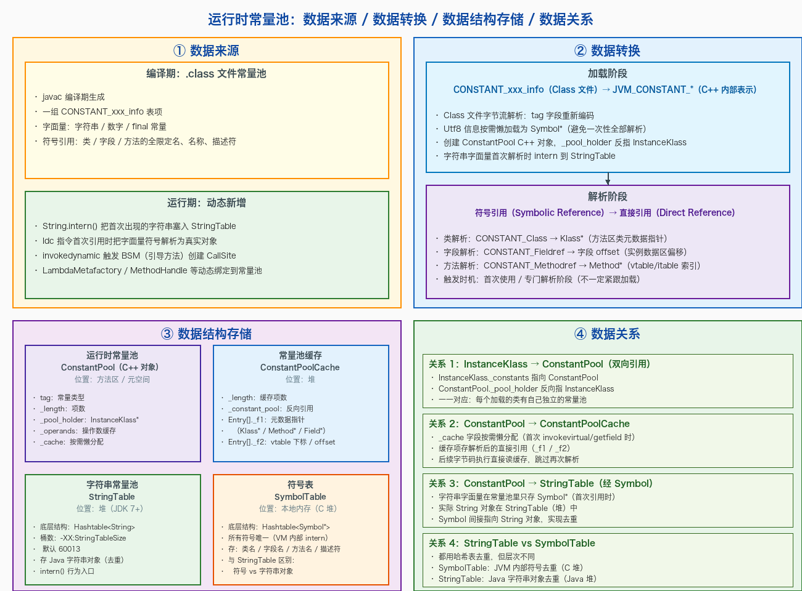
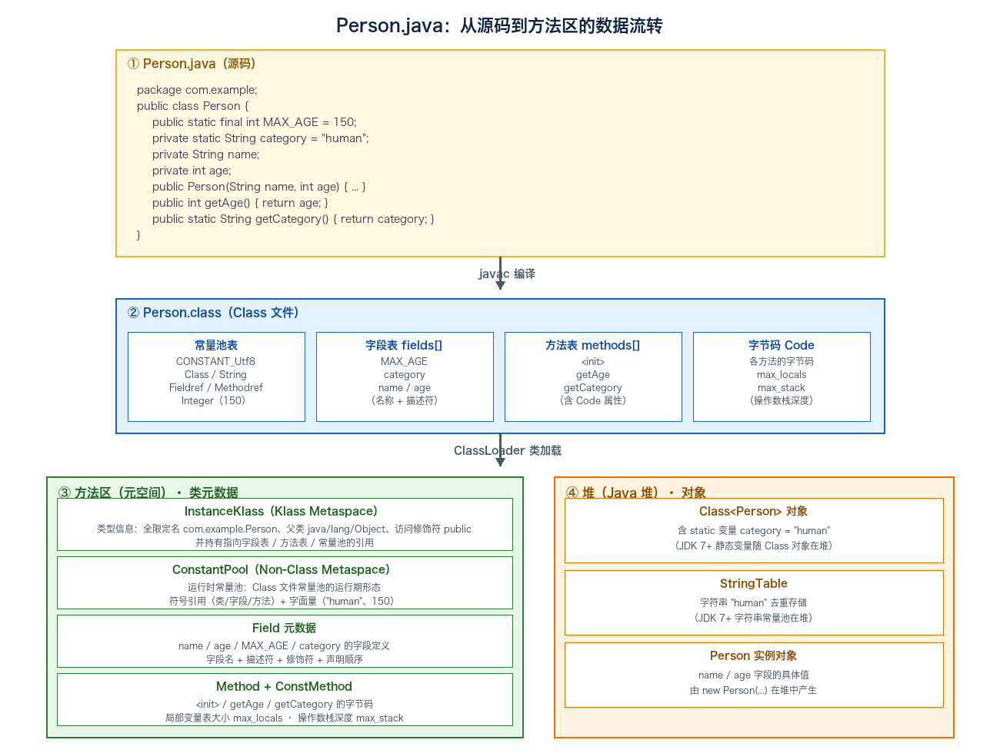

# 09. 运行时数据区四：方法区（元空间）

> 本文是运行时数据区的第四篇，聚焦**线程共享的方法区（Method Area / 元空间）**。方法区存放被 JVM 加载的类元数据——类型信息、运行时常量池、字段与方法定义；本文从「存放内容」讲起，深入运行时常量池的四个维度（数据来源 / 数据转换 / 数据结构存储 / 数据关系），再沿永久代 → 元空间的演进，讲清元空间的内存结构与类卸载条件，最后用一个 Person.java 实例串起「源码 → class 文件 → 方法区数据」的完整流转。

## 目录

- [一、方法区](#一方法区)
  - [1. 存放内容](#1-存放内容)
  - [2. 运行时常量池](#2-运行时常量池)
  - [3. 特点](#3-特点)
  - [4. 永久代 → 元空间（JDK 1.8 演进）](#4-永久代-元空间jdk-18-演进)
  - [5. 元空间的内存结构](#5-元空间的内存结构)
  - [6. 字符串常量池的去向](#6-字符串常量池的去向)
  - [7. 方法区的 GC：类卸载](#7-方法区的-gc类卸载)
  - [8. 实例：Person.java 的方法区数据流转](#8-实例personjava-的方法区数据流转)
- [附：高频速记](#附高频速记)
  - [方法区速记](#方法区速记)

---

## 一、方法区


### 1. 存放内容

方法区与堆一样是**线程共享**的内存区域，用来存放**被 JVM 加载的类型信息**。规范上方法区是「堆的一个逻辑部分」，但 HotSpot 在 JDK 1.8 之后用**元空间（Metaspace）** 在本地内存中实现（详见第 4、5 小节）。

方法区主要存放以下内容：

| 内容                  | 说明                                                                              |
| ------------------- | ------------------------------------------------------------------------------- |
| **类型信息**            | 类/接口的全限定名、直接父类全限定名、直接父接口全限定名、访问修饰符、字段表、方法表                                      |
| **域信息**             | 字段名、字段类型、字段修饰符、字段在类中的声明顺序                                                       |
| **方法信息**            | 方法名、返回类型、方法参数、方法修饰符、字节码、操作数栈、局部变量表大小、异常表                                        |
| **运行时常量池**          | 见第 2 小节                                                                         |
| **静态变量（Static 变量）** | `static` 字段（注：JDK 7 后 static 变量随 Class 对象一起搬入堆；JDK 8 后 static 变量随 Class 对象仍在堆中） |
| **JIT 代码缓存**        | 即时编译后的热点机器码（CodeCache），由 JIT 管理                                                 |
| **类加载器引用**          | 每个类对应的 ClassLoader 引用                                                           |
| **运行期常量**           | 编译器生成的各种字面量、符号引用；运行期 `String.intern()` 等动态新增的常量                                 |

### 2. 运行时常量池

**运行时常量池（Runtime Constant Pool）** 是方法区的一部分，**每个类/接口都有自己独立的运行时常量池**。它是 Class 文件中**常量池表**的运行期形态：


下面从**数据来源 / 数据转换 / 数据结构存储 / 数据关系** 四个维度对运行时常量池做深入分析。

#### ① 数据来源

运行时常量池的数据来自两个阶段：

**编译期：`.class` 文件常量池**

- `javac` 编译期生成一组 `CONSTANT_xxx_info` 表项，存放在 `.class` 文件的常量池表里；
- 包含两类内容：
  - **字面量（Literal）**：字符串、基本类型字面量、`final` 常量值；
  - **符号引用（Symbolic Reference）**：类/接口的全限定名、字段的名称和描述符、方法的名称和描述符。

**运行期：动态新增**

- `String.intern()`：把首次出现的字符串字面量塞入 StringTable；
- `ldc` 指令首次引用时：把字面量符号解析为真实对象（Integer / Long / String 等）；
- `invokedynamic`：触发 BSM（Bootstrap Method，引导方法）创建 `CallSite`；
- `LambdaMetafactory` / `MethodHandle` 等动态绑定到常量池。

#### ② 数据转换

类加载 → 类解析 过程中，常量池的数据发生两次关键转换：

**加载阶段：字节码 → C++ 内部表示**

- Class 文件字节流按 `tag` 字段重新编码为 `JVM_CONSTANT_*` 枚举类型；
- Utf8 信息按需**懒加载**为 `Symbol*`（避免一次性全部解析占用大量内存）；
- 创建 `ConstantPool` C++ 对象，`_pool_holder` 反向指向所属 `InstanceKlass`；
- 字符串字面量在首次被解析时 intern 到 StringTable。

**解析阶段：符号引用 → 直接引用**

- 类解析：`CONSTANT_Class → Klass*`（方法区类元数据指针）；
- 字段解析：`CONSTANT_Fieldref → 字段 offset`（实例数据区偏移）；
- 方法解析：`CONSTANT_Methodref → Method*`（含 vtable / itable 索引，缓存在 ConstantPoolCache 中）；
- **触发时机**：类/字段/方法的首次使用，或专门的解析阶段（不一定紧跟加载）。

#### ③ 数据结构存储

运行时常量池数据最终落到 **4 个数据结构**上，分别位于不同的内存区域：

| 数据结构 | 位置 | 作用 |
|----------|------|------|
| **ConstantPool** | 方法区/元空间 | C++ 对象，存储常量池项的运行时表示 |
| **ConstantPoolCache** | 堆 | 缓存解析后的直接引用（`_f1` / `_f2`） |
| **StringTable** | 堆（JDK 7+） | 哈希表，存 Java 字符串对象（去重） |
| **SymbolTable** | 本地内存（C 堆） | 哈希表，存所有符号（VM 内部去重） |

**ConstantPool 主要字段**：

- `tag`：常量类型（`JVM_CONSTANT_Utf8` / `String` / `Class` / `Fieldref` / `Methodref` 等）；
- `_length`：项数；
- `_pool_holder`：反向指向所属 `InstanceKlass*`；
- `_operands`：操作数缓存（用于 `invokedynamic` 等）；
- `_cache`：按需懒分配的 `ConstantPoolCache*`。

**ConstantPoolCache 主要字段**：

- `_length`：缓存项数；
- `_constant_pool`：反向指向所属 `ConstantPool*`；
- `Entry[]`：每项含 `_f1`（元数据指针 `Klass*` / `Method*` / `Field*`）、`_f2`（vtable 下标 / 字段 offset）、`_flags`。

**StringTable**（详见第 6 小节）：

- 底层结构：`Hashtable<String>`，桶数 `-XX:StringTableSize` 默认 60013；
- 存的是 Java 字符串对象本身（JDK 7+ 搬到了堆里）；
- `intern()` 行为的入口。

**SymbolTable**：

- 底层结构：`Hashtable<Symbol*>`，所有符号唯一（VM 内部 intern）；
- 存的是 JVM 内部符号（类名 / 字段名 / 方法名 / 描述符）；
- 与 StringTable 的区别：Symbol 是 VM 视角的「符号」，String 是 Java 视角的「字符串」。

#### ④ 数据关系

4 个数据结构之间的相互关系：



**1. InstanceKlass ↔ ConstantPool（双向引用）**

- `InstanceKlass._constants` 指向 `ConstantPool`；
- `ConstantPool._pool_holder` 反向指 `InstanceKlass`；
- **一一对应**：每个加载的类有自己独立的运行时常量池。

**2. ConstantPool → ConstantPoolCache（懒分配）**

- `_cache` 字段按需懒分配，首次 `invokevirtual` / `getfield` 等指令时创建；
- 缓存项存解析后的直接引用（`_f1` / `_f2`）；
- 后续字节码执行直接读缓存，跳过再次解析——这是 HotSpot 高性能分派的关键。

**3. ConstantPool → StringTable（经 Symbol）**

- 字符串字面量在常量池里只存 `Symbol*`（首次引用时）；
- 实际 `String` 对象在 StringTable（堆）中；
- Symbol 间接指向 String 对象，实现去重。

**4. StringTable vs SymbolTable**

- 都用哈希表去重，但**层次不同**：
- SymbolTable：JVM 内部符号去重（本地内存 C 堆）；
- StringTable：Java 字符串对象去重（Java 堆）；
- 简单记：Symbol 是 VM 视角的「符号」，String 是 Java 视角的「字符串」。

**异常**：`OutOfMemoryError: PermGen space`（JDK 7 及以前）或 `OutOfMemoryError: Metaspace`（JDK 8+），常因常量池过大或类加载过多触发。

### 3. 特点

- 方法区在 JVM **启动时创建**，物理内存空间和堆一样可以**不连续**；
- 大小可选择固定或可扩展；
- 方法区大小决定系统能保存多少类，**类定义过多会导致方法区溢出**；
- 关闭 JVM 即释放该区域内存；
- 方法区**也会被 GC 回收**，但回收条件苛刻（详见第 7 小节）——这是和堆回收最显著的区别。


### 4. 永久代 → 元空间（JDK 1.8 演进）


| 版本 | 实现 | 位置 | 溢出异常 |
|------|------|------|----------|
| **JDK 1.7 及以前** | 永久代（PermGen） | **JVM 堆内** | `java.lang.OutOfMemoryError: PermGen space` |
| **JDK 1.8 及以后** | 元空间（Metaspace） | **本地内存（Native Memory）** | `java.lang.OutOfMemoryError: Metaspace` |

**为什么 JDK 1.8 要把永久代换为元空间？** 核心是永久代有两个老大难问题：

1. **固定大小易 OOM**：永久代有 `-XX:PermSize` / `-XX:MaxPermSize` 限制（默认 64M / 82M），类加载过多（如 Spring/动态代理）时极易 OOM；
2. **GC 复杂**：永久代位于堆内，Full GC 才能回收，且需要专门的回收器调优；
3. **HotSpot 与 JRockit 合并不兼容**：Oracle 收购 BEA 后要把 HotSpot 和 JRockit 合并，JRockit 本身就没有永久代概念，必须去掉。

**元空间的好处**：

- 使用**本地内存**，默认**只受系统可用内存限制**，大幅缓解类元数据空间不足的问题；
- 类元数据从堆里搬走后，堆的回收压力降低；
- `-XX:MaxMetaspaceSize` 可设置上限（默认 -1，即无上限），不设就只受系统物理内存限制。

**演进过程中几个细节**：

- JDK 1.6 时，方法区实现还是永久代，运行时常量池、字符串常量池都在永久代；
- JDK 1.7 时，**字符串常量池** 从永久代搬到堆；
- JDK 1.8 时，**永久代整个被移除**，类元数据全部进元空间（本地内存），**运行时常量池**也搬到了元空间（StringTable 仍在堆）；
- 永久代被移除后，JVM 启动参数里 `-XX:PermSize` / `-XX:MaxPermSize` 失效，必须用 `-XX:MetaspaceSize` / `-XX:MaxMetaspaceSize`。


### 5. 元空间的内存结构

HotSpot 的元空间并不是一整块连续的本地内存，而是分成了几个子区域：

- **Klass Metaspace（类元数据空间）**：存放 `InstanceKlass`（Java 类在 JVM 内部的表示）、`InstanceMirrorKlass`（`java.lang.Class` 对象对应的内部类）等类元数据；
- **Non-Class Metaspace**：存放类相关的辅助数据，如常量池、方法字节码、JIT 相关数据、注解等；
- **Compressed Class Space（压缩类空间）**：开启指针压缩（`-XX:+UseCompressedClassPointers`，默认开启）时启用，专门存**类指针的压缩编码**，可用 `-XX:CompressedClassSpaceSize` 设上限（默认 1G）；

**几个关键参数**：

| 参数 | 默认值 | 作用 |
|------|--------|------|
| `-XX:MetaspaceSize` | 约 21M | 触发 Full GC 的初始阈值，**首次**达到会触发 Full GC 重新计算 |
| `-XX:MaxMetaspaceSize` | -1（无上限） | 元空间最大可用本地内存；**强烈建议设置**，避免本地内存耗尽导致进程被 OOM Killer 杀掉 |
| `-XX:MinMetaspaceFreeRatio` / `-XX:MaxMetaspaceFreeRatio` | 40 / 70 | GC 后元空间空闲比例的上下限，超出则扩容/缩容 |
| `-XX:CompressedClassSpaceSize` | 1G | 压缩类空间大小 |
| `-XX:+UseCompressedClassPointers` | 开启 | 是否启用类指针压缩 |

**OOM 排查**：当出现 `OutOfMemoryError: Metaspace` 时，**先看是不是类加载器泄漏**（如 Web 容器每次请求都新建 ClassLoader 而不释放，导致旧 Class 卸不掉）；其次看是不是真的类太多（如动态生成大量代理类、CGLIB/ASM 用法不当）。可以用 `-XX:+HeapDumpOnOutOfMemoryError` + `jhat` / `jvisualvm` / `MAT` 分析 dump。

### 6. 字符串常量池的去向

字符串常量池 `StringTable` 在 JDK 1.7 时**从方法区（永久代）搬到了堆中**，JDK 1.8 后留在堆里。

**为什么字符串常量池要在堆里？**

- 字符串对象本身是对象，放在堆里更自然；
- 堆的 GC 频率更高、回收更及时，StringTable 可以被 Minor GC 回收，缓解永久代的 OOM 风险；
- 字符串常量池的哈希表用普通对象就能实现，不需要走「方法区」的特殊对象体系。

### 7. 方法区的 GC：类卸载

方法区**也会被 GC**，但回收条件非常苛刻，主要回收**无用的类**和**无用的常量**。

**类卸载条件**（需全部满足）：

1. 该类的**所有实例**都已被回收（堆中不存在该类的任何实例）；
2. 加载该类的 **ClassLoader 已被回收**；
3. 该类的 `java.lang.Class` 对象**没有被任何地方引用**，无法通过反射访问该类的方法。

**典型场景**：

- 自定义类加载器加载的类（如 Web 容器的 JSP 类加载器、OSGi 的 Bundle 类加载器）满足上述条件，**可被卸载**；
- 启动类加载器（Bootstrap）加载的类（如 `java.lang.*`）**永远不会被卸载**——启动类加载器生命周期与 JVM 一致。

**无用的常量**（如字符串 `"abc"`）也支持回收：如果常量池里某个字符串常量**没有任何 String 对象引用**，GC 时可能回收其 StringTable 槽位。

**Full GC 是回收方法区的主力**，但一般情况下面向服务的应用很少触发类卸载——只有动态加载/卸载类的容器（Tomcat/Jetty 的热部署、OSGi、Spring DevTools 等）才会有大量类卸载需求。

### 8. 实例：Person.java 的方法区数据流转

前面 7 个小节从「存放内容」「运行时常量池」「特点」「永久代→元空间」「元空间结构」「字符串常量池去向」「类卸载」七个角度讲了方法区，但都比较抽象。下面用一个具体类把整个流转串起来。

**源码**：

```java
package com.example;

public class Person {
    public static final int MAX_AGE = 150;      // 编译期常量
    private static String category = "human";   // 静态变量

    private String name;                        // 实例字段
    private int age;

    public Person(String name, int age) {       // 构造方法
        this.name = name;
        this.age = age;
    }

    public int getAge() { return age; }         // 实例方法

    public static String getCategory() {        // 静态方法
        return category;
    }
}
```



**① 编译期：`javac` 把 `Person.java` 编译成 `Person.class`**

`Person.class` 是结构化的字节码文件，核心包含四部分：

- **常量池表（Constant Pool Table）**：一串 `CONSTANT_xxx_info` 表项——`CONSTANT_Utf8`（`"name"`、`"age"`、`"MAX_AGE"`、`"category"`、`"<init>"`、`"()I"` 等名称与描述符）、`CONSTANT_Class`（`com/example/Person`、`java/lang/Object`、`java/lang/String`）、`CONSTANT_String`（`"human"`）、`CONSTANT_Fieldref`（`Person.category:Ljava/lang/String;`）、`CONSTANT_Methodref`（`Person.<init>:(Ljava/lang/String;I)V`）、`CONSTANT_Integer`（`150`）；
- **字段表 `fields[]`**：4 个字段（`MAX_AGE`、`category`、`name`、`age`），每个含 `access_flags`、`name_index`、`descriptor_index`（如 `age` 的描述符是 `I`，`name` 的是 `Ljava/lang/String;`）；
- **方法表 `methods[]`**：`<init>`（实例构造器）、`getAge`、`getCategory`，每个方法的 `Code` 属性里存字节码、`max_locals`（局部变量表大小）、`max_stack`（操作数栈深度）、`exception_table`（异常处理表）；
- **类级信息**：`this_class`（指向常量池 `com/example/Person`）、`super_class`（指向常量池 `java/lang/Object`）、访问标志（`ACC_PUBLIC | ACC_SUPER`）。

**② 加载期：ClassLoader 把 `Person.class` 载入方法区（元空间）**

类加载完成后，JVM 在方法区（元空间）为 `Person` 创建一套 C++ 元数据对象：

- **`InstanceKlass`**（Klass Metaspace）：存**类型信息**——全限定名、父类、接口、访问修饰符，并持有指向字段表 / 方法表 / 常量池的引用；
- **`ConstantPool`**（Non-Class Metaspace）：`Person.class` 常量池表的**运行期形态**，`_pool_holder` 反向指向所属 `InstanceKlass`，`Symbol*` / `Klass*` 在此按需懒解析；
- **`Field` 元数据**：`name` / `age` / `MAX_AGE` / `category` 的字段定义（名称 + 描述符 + 修饰符 + 实例数据区内的偏移量）；
- **`Method` + `ConstMethod`**：`<init>` / `getAge` / `getCategory` 的方法元数据，`ConstMethod` 里存字节码、`max_locals`、`max_stack`、异常表（异常表用于方法内异常处理器查找，决定异常出口的跳转位置）。

**③ 关键：哪些数据进方法区，哪些「不进」？**

这是最常见的误区。上面这个 `Person` 类的数据并**非全部进方法区**：

| 数据 | 实际位置 | 说明 |
|------|----------|------|
| 类型信息（`InstanceKlass`） | ✅ 方法区（元空间） | 类结构元数据 |
| 运行时常量池（`ConstantPool`） | ✅ 方法区（元空间） | 符号引用 + 字面量 |
| 方法字节码（`ConstMethod`） | ✅ 方法区（元空间） | Non-Class Metaspace |
| 字段元数据（`Field`） | ✅ 方法区（元空间） | 字段定义信息 |
| `static` 变量 `category` 的值 | ❌ 堆（`Class` 对象内） | JDK 7+ 静态变量随 `Class` 对象在堆 |
| 字符串 `"human"` 对象 | ❌ 堆（StringTable） | JDK 7+ 字符串常量池在堆 |
| `Person` 实例对象 | ❌ 堆 | `new Person(...)` 产生 |

一句话总结：**方法区只存「类的定义信息」**（类型、字段定义、方法定义、常量池的元数据），而**「对象实例、静态变量的值、字符串本体」都在堆里**。这也呼应了第 4 小节的 JDK 8 演进——类元数据搬进元空间，但 `static` 字段和字符串常量池早已随 `Class` 对象留在堆。

---

## 附：高频速记

### 方法区速记

| 要点 | 内容 |
| ---- | ---- |
| 存放 | 类型信息、域/方法信息、**运行时常量池**、静态变量、JIT 代码缓存 |
| 运行时常量池 | **每个类独立**，是 Class 文件常量池的运行期形态，具备**动态性**（`intern()`） |
| 演进 | JDK 7 字符串常量池入堆；**JDK 8 永久代 → 元空间（本地内存）** |
| 元空间结构 | Klass Metaspace / Non-Class Metaspace / Compressed Class Space |
| 关键参数 | `-XX:MetaspaceSize`(≈21M) `-XX:MaxMetaspaceSize`(默认无上限，**建议设置**) |
| 类卸载条件 | 全部实例已回收 **且** ClassLoader 已回收 **且** Class 对象无引用 |
| OOM 排查 | `OutOfMemoryError: Metaspace` 先看**类加载器泄漏**，再看类是否真的过多 |
| 数据落地 | 方法区只存**类定义元数据**（InstanceKlass/ConstantPool/Field/Method+ConstMethod）；**对象实例、静态变量值、字符串本体**都在堆（见第 8 小节） |
