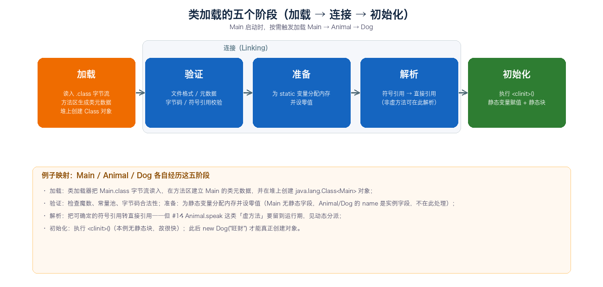
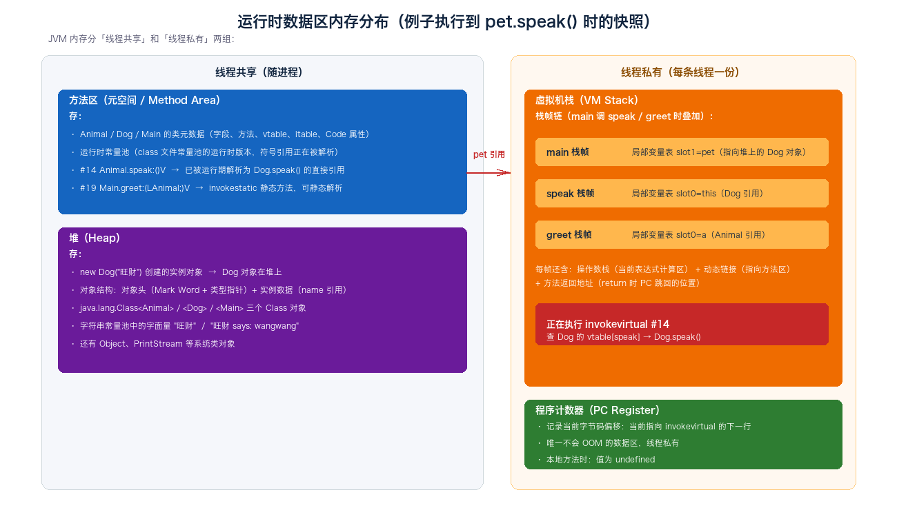
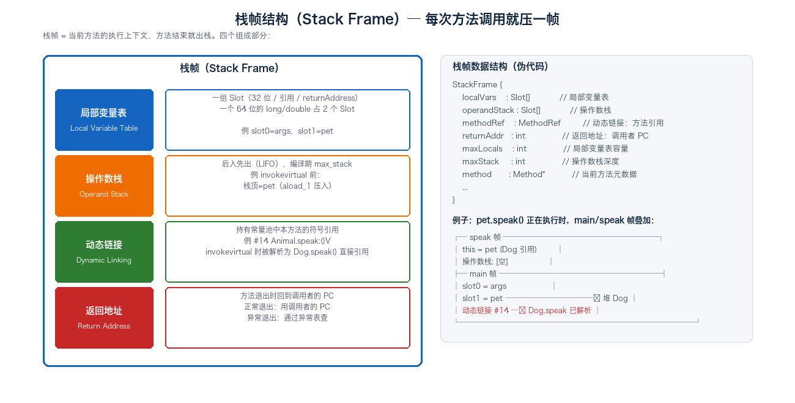
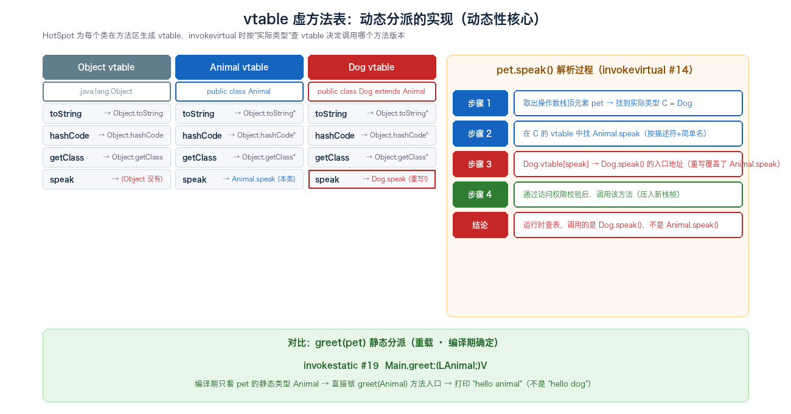
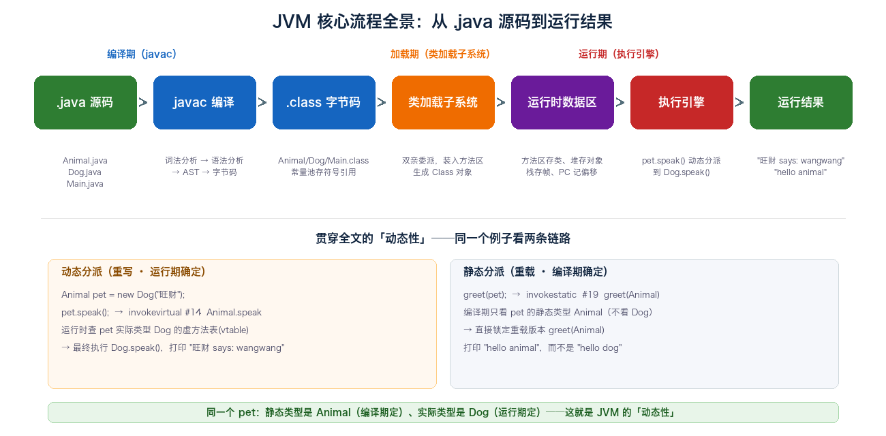

# 10. JVM 核心流程总结

> 本文是 JVM 系列的收官总结，把「Java 源码 → 字节码 → 类加载 → 运行时数据区 → 执行」整条链路用**一个贯穿全文的例子**串起来，让前面 9 篇零散的知识在一条主线上汇合。本文最大的特点是用「Animal / Dog / Main」三段代码同一段代码、同一组字节码、同一组内存、同一组执行轨迹——**每讲到一个阶段，例子就往前推进一步**，从 .java 文件一路追到 `System.out.println("旺财 says: wangwang")` 真的被打印出来的瞬间。同时，本文专门开辟「动态性贯穿」一章，把 JVM 那些「编译期不确定、运行期才确定」的事——动态链接、动态分派、动态类型——一次性讲透。涉及存储结构的地方（Class 文件、运行时常量池、栈帧、对象内存布局、虚方法表），本文都贴出了数据结构定义。

## 目录

- [一、贯穿全文的例子](#一贯穿全文的例子)
  - [1. 例子代码](#1-例子代码)
  - [2. 为什么选这个例子（覆盖动态性）](#2-为什么选这个例子覆盖动态性)
- [二、第一阶段：源码到字节码（编译期）](#二第一阶段源码到字节码编译期)
  - [1. javac 编译流程：源码到字节码](#1-javac-编译流程源码到字节码)
  - [2. Class 文件结构（贴数据结构）](#2-class-文件结构贴数据结构)
  - [3. 常量池与符号引用](#3-常量池与符号引用)
- [三、第二阶段：类加载（把 .class 装进 JVM）](#三第二阶段类加载把-class-装进-jvm)
  - [1. 五个阶段：加载、连接、初始化](#1-五个阶段加载连接初始化)
  - [2. 双亲委派与例子的加载顺序](#2-双亲委派与例子的加载顺序)
- [四、第三阶段：运行时数据区（内存布局）](#四第三阶段运行时数据区内存布局)
  - [1. 五大数据区总览](#1-五大数据区总览)
  - [2. 方法区：类元数据与运行时常量池](#2-方法区类元数据与运行时常量池)
  - [3. 堆：对象实例（贴对象内存布局）](#3-堆对象实例贴对象内存布局)
  - [4. 虚拟机栈：栈帧（贴栈帧结构）](#4-虚拟机栈栈帧贴栈帧结构)
  - [5. 例子的内存快照：执行到 pet.speak 时](#5-例子的内存快照执行到-petspeak-时)
- [五、第四阶段：执行（执行引擎）](#五第四阶段执行执行引擎)
  - [1. 方法调用：解析 vs 分派](#1-方法调用解析-vs-分派)
  - [2. 静态分派（重载）：greet(pet) 到 greet(Animal)](#2-静态分派重载greetpet-到-greetanimal)
  - [3. 动态分派（重写）：pet.speak() 到 Dog.speak()](#3-动态分派重写petspeak-到-dogspeak)
  - [4. 基于栈的解释执行：操作数栈与局部变量表逐条执行](#4-基于栈的解释执行操作数栈与局部变量表逐条执行)
- [六、动态性贯穿：这条链路的「动态」都在哪](#六动态性贯穿这条链路的动态都在哪)
  - [1. 动态链接：符号引用到直接引用](#1-动态链接符号引用到直接引用)
  - [2. 动态分派：静态类型 vs 实际类型](#2-动态分派静态类型-vs-实际类型)
  - [3. 三种「动态」的关系图](#3-三种动态的关系图)
- [七、一张图看全链路](#七一张图看全链路)
- [附：高频速记](#附高频速记)
  - [JVM 核心流程速记](#jvm-核心流程速记)

---

## 一、贯穿全文的例子

整篇文档只有**一个例子**，它会从「Java 源码」一路变成「运行结果」。

### 1. 例子代码

**Animal.java**（父类）：

```java
public class Animal {
    private String name;
    public Animal(String name) {
        this.name = name;
    }
    public void speak() {
        System.out.println(name + " makes a sound");
    }
    public String getName() { return name; }
}
```

**Dog.java**（子类，重写 `speak()`）：

```java
public class Dog extends Animal {
    public Dog(String name) {
        super(name);
    }
    @Override
    public void speak() {
        System.out.println(getName() + " says: wangwang");
    }
}
```

**Main.java**（主类，含重载的 `greet`）：

```java
public class Main {
    public static void main(String[] args) {
        Animal pet = new Dog("旺财");   // ① 静态类型=Animal、实际类型=Dog
        pet.speak();                     // ② 动态分派 → Dog.speak()
        greet(pet);                      // ③ 静态分派 → greet(Animal)
    }
    static void greet(Animal a) { System.out.println("hello animal"); }
    static void greet(Dog d)    { System.out.println("hello dog"); }
}
```

**最终输出**：

```
旺财 says: wangwang
hello animal
```

### 2. 为什么选这个例子（覆盖动态性）

这个例子的设计目标是「把 JVM 能体现的所有『动态性』一次性覆盖」：

| 体现的动态性 | 例子里的位置 |
|---|---|
| **动态类型**（静态类型 ≠ 实际类型） | `Animal pet = new Dog("旺财")` |
| **动态分派**（运行时按实际类型选方法版本） | `pet.speak()` → `invokevirtual #14` |
| **静态分派**（编译期按静态类型选重载版本） | `greet(pet)` → `invokestatic #19 greet(Animal)` |
| **动态链接**（符号引用在运行期才解析） | `#14 Animal.speak` 在 `invokevirtual` 时才锁定到 `Dog.speak` |
| **继承 + 字段继承** | `name` 字段从 Animal 继承给 Dog |
| **字符串字面量** | `"旺财"` 进入字符串常量池 |
| **方法重载** | `greet(Animal)` vs `greet(Dog)` |
| **方法重写** | `Dog.speak()` 覆盖 `Animal.speak()` |

接下来四章，每一章都会让这个例子「再往前走一步」。

---

## 二、第一阶段：源码到字节码（编译期）

### 1. javac 编译流程：源码到字节码

`javac` 编译器把 `.java` 源码翻译成 `.class` 字节码，整个过程**完全在 JVM 之外**发生，不依赖 JVM 运行。流程：

```
.java 源码
   ↓  词法分析（Token 流：关键字/标识符/字面量/运算符）
   ↓  语法分析（生成 AST：抽象语法树）
   ↓  语义分析（类型检查 / 符号表建立 / 常量折叠）
   ↓  字节码生成（遍历 AST 产出 .class 二进制）
.class 字节码
```

对例子而言，三段源码被编译成三个 `.class`：

```
Animal.java  →  Animal.class
Dog.java     →  Dog.class
Main.java    →  Main.class
```

> **注意**：编译期**不**做的事——不优化方法体到机器码（那是 JIT 的事）、不解析符号引用到直接引用（那是运行期的事）、不分配任何运行时内存。

### 2. Class 文件结构（贴数据结构）

`.class` 是一种紧凑的二进制格式，按 JVM 规范由下面的 `ClassFile` 结构组装：

```
ClassFile {
    u4             magic;              // 0xCAFEBABE，标识 class 文件
    u2             minor_version;
    u2             major_version;      // 52=Java 8、61=Java 17
    u2             constant_pool_count;
    cp_info        constant_pool[constant_pool_count-1];
    u2             access_flags;       // ACC_PUBLIC / ACC_SUPER / ACC_INTERFACE …
    u2             this_class;         // 指向常量池的类索引
    u2             super_class;        // 父类索引
    u2             interfaces_count;
    u2             interfaces[interfaces_count];
    u2             fields_count;
    field_info     fields[fields_count];
    u2             methods_count;
    method_info    methods[methods_count];
    u2             attributes_count;
    attribute_info attributes[attributes_count];
}
```

下面以 `Main.class` 为例，**用 javap 看一眼真实的 ClassFile**：

```
$ javap -verbose Main
  Last modified 2026年8月31日; size 653 bytes
  minor version: 0
  major version: 61                              ← Java 17
  flags: (0x0021) ACC_PUBLIC, ACC_SUPER
  this_class: #20                                ← Main
  super_class: #2                                ← java/lang/Object
  interfaces: 0, fields: 0, methods: 4
Constant pool:                                   ← 46 项常量池
   #1 = Methodref          #2.#3     // java/lang/Object."<init>":()V
   #7 = Class              #8        // Dog
   #9 = String             #10       // 旺财
   #11 = Methodref         #7.#12    // Dog."<init>":(Ljava/lang/String;)V
   #14 = Methodref         #15.#16   // Animal.speak:()V          ← 关键：动态分派
   #15 = Class             #17       // Animal
   #19 = Methodref         #20.#21   // Main.greet:(LAnimal;)V    ← 关键：静态分派
```

整个 ClassFile 的全貌图示：


### 3. 常量池与符号引用

`constant_pool` 是 Class 文件里**信息密度最高**的部分：所有类名、方法名、字段名、字符串字面量、以及指向它们的「符号引用」，都存在这里。每一项是个 `cp_info`：

```
cp_info {
    u1 tag;            // 类型 tag：1=Utf8、7=Class、8=String、10=Methodref、11=InterfaceMethodref…
    u1 info[];         // 变长数据，具体格式由 tag 决定
}
```

例子中 `#14 = Methodref #15.#16 // Animal.speak:()V` 就是一个**符号引用**：

- `#15 = Class #17 = Animal`：表示「这是 Animal 类」
- `#16 = NameAndType #18:#6 = speak:()V`：表示「方法名是 speak、描述符是 ()V」

合起来的语义是「指向 Animal.speak() 方法的引用」——但请注意，此时**它只是个编号（#14），真正的目标方法要等运行期才解析**。这就是「动态链接」的伏笔，第三章加载阶段的「解析」动作会接手。

---

## 三、第二阶段：类加载（把 .class 装进 JVM）

### 1. 五个阶段：加载、连接、初始化

JVM 启动后第一次用到某个类时，按以下五步把它从磁盘 `.class` 变成可用的运行时数据。**注意：连接阶段（验证/准备/解析）的前后顺序在 JVM 规范里是「按需交叉进行」的，但实践中验证通常紧跟加载，解析常在初始化之后才完成（为了支持动态绑定）。**

```
加载 ──→ 验证 ──→ 准备 ──→ 解析 ┐
                               ├─ 全部完成后才进入
              初始化 ──────────→
```



五步分别在做什么：

| 阶段 | 动作 | 例子里的体现 |
|---|---|---|
| **加载** | 读入 .class 字节流；在方法区生成类元数据；在堆上创建 `java.lang.Class<T>` 对象 | 把 `Main.class` 字节流读入，方法区建 Main 元数据，堆上建 `Class<Main>` 对象 |
| **验证** | 文件格式验证（魔数 CAFEBABE、版本号）+ 元数据/字节码/符号引用验证 | 检查 Main 的字节码合法性 |
| **准备** | 为 static 变量分配内存并设零值 | Main/Animal/Dog 无 static 变量，本步空转 |
| **解析** | 把符号引用 #N 转成直接引用（方法区内的真实地址） | `#1 Object."<init>"` 在此解析；但 `#14 Animal.speak` 是虚方法，留到运行期 invokevirtual 时再解析 |
| **初始化** | 执行 `<clinit>()`：static 变量赋值 + 静态代码块 | 例子无 static 块，故很快结束 |

### 2. 双亲委派与例子的加载顺序

例子启动时 `java Main`，JVM 按以下顺序触发类加载（**双亲委派原则**：先让父加载器试，子加载器不重复加载）：

```
启动类加载器（Bootstrap）   加载 java.lang.Object / String / System …
        ↓
扩展类加载器（Extension）   加载 javax.* 等扩展类
        ↓
应用类加载器（App）         加载 Main、Animal、Dog（classpath 下的类）
```

对例子而言，**触发 Main 加载的是 `main(String[])` 方法被调用那一刻**（这是「主动引用」的一种）。Main 加载过程中，它的方法字节码里出现的类引用（Dog、Animal、String、System）会按需触发后续加载：

```
1. 启动 AppClassLoader 加载 Main
2. Main 字节码里出现 Dog 引用（invokespecial #11 Dog.<init>）→ 加载 Dog
3. Dog 继承 Animal → 加载 Animal
4. Dog 字节码里出现 String、Object（super(name)）→ 加载 String、Object
5. 字节码里出现 System.out → 加载 java.lang.System、PrintStream
```

这一步**还没有任何对象被 `new` 出来**——只是把「类的元数据 + Class 对象」装进方法区和堆。真正的对象创建，要等到 `new Dog("旺财")` 真正执行，那是第五章「执行」阶段的事。

---

## 四、第三阶段：运行时数据区（内存布局）

### 1. 五大数据区总览

类加载完成、方法区里有了 Main/Animal/Dog 的元数据后，JVM 就可以开始执行 `main` 方法了。执行前，必须先讲清**内存结构**——JVM 内存被划分为「线程共享」和「线程私有」两组、五大块：

| 分组 | 数据区 | 线程 | 例子里的内容 |
|---|---|---|---|
| 线程共享 | **方法区（元空间）** | 共享 | Animal/Dog/Main 的类元数据、运行时常量池、虚方法表 vtable |
| 线程共享 | **堆（Heap）** | 共享 | `new Dog("旺财")` 创建的对象、三个 `Class<T>` 对象、字符串字面量 `"旺财"` |
| 线程私有 | **虚拟机栈（VM Stack）** | 每条线程一份 | `main`、`greet`、`speak` 的栈帧链 |
| 线程私有 | **本地方法栈** | 每条线程一份 | 调用 JNI 方法时用（例子不涉及） |
| 线程私有 | **程序计数器（PC）** | 每条线程一份 | 当前字节码偏移；native 时为 undefined |



### 2. 方法区：类元数据与运行时常量池

**方法区（元空间 / Method Area，JDK 1.8+）** 存的是「类的元数据」：类名、父类、字段、方法（含字节码）、访问标志、运行时常量池、虚方法表 vtable。对应到我们的例子，方法区里同时存在三份元数据：

```
方法区（元空间）
├─ Animal 元数据
│   ├─ 类名 Animal、父类 Object
│   ├─ 字段：name: String
│   ├─ 方法：<init>(String)、speak()、getName()
│   ├─ Code 属性（每个方法的字节码）
│   └─ vtable[speak] → Animal.speak 的入口地址
├─ Dog 元数据
│   ├─ 类名 Dog、父类 Animal
│   ├─ 字段：（无新增，继承 name）
│   ├─ 方法：<init>(String)、speak()（重写 Animal.speak）
│   └─ vtable[speak] → Dog.speak 的入口地址（覆盖 Animal.speak）
└─ Main 元数据
    ├─ 类名 Main、父类 Object
    ├─ 字段：（无）
    └─ 方法：<init>()、main(String[])、greet(Animal)、greet(Dog)
```

**运行时常量池** 是方法区里的一个特殊结构——它是「Class 文件常量池的运行时版本」，把编译期的 `cp_info` 升级为可被运行期查询的数据结构。`#14 Animal.speak:()V` 在这个池子里从「编号」升级为「可解析的符号引用」。

### 3. 堆：对象实例（贴对象内存布局）

`new Dog("旺财")` 这条指令执行时，JVM 在**堆**上分配一块内存，布局如下：

```
Dog 对象（new Dog("旺财") 在堆上的实例）
┌─────────────┬─────────────┬──────────────┬──────────┐
│   对象头    │   对象头    │   实例数据   │  对齐填充 │
│  Mark Word  │Klass Pointer│ name: ref 4B │ (凑 8B)  │
│   8B        │    4B       │              │          │
└─────────────┴─────────────┴──────────────┴──────────┘
    哈希/分代/锁           指向方法区
                          Dog 元数据
```

数据结构伪代码：

```
Object {
    Header:
      markWord    : u8     // 哈希/分代/锁状态
      klassPtr    : u4     // 类型指针，指向方法区类元数据
    Data:
      name       : ref     // 实例数据（继承自 Animal 的字段）
    Padding:
      ...        : bytes   // 8B 对齐
}
```


**关键事实**：

- **Klass Pointer** 决定了 `pet.speak()` 知道「我是 Dog」——执行引擎用它找到 Dog 的 vtable。
- **Mark Word** 在 GC 时被改写（分代年龄、锁标志位、轻量/重量级锁等都在这里），是对象身份的「活动档案」。
- **name 字段** 是 4 字节引用，指向堆中另一块 `"旺财"` String 对象（字符串字面量在 JDK 1.7+ 移入堆）。
- **32 位 JVM**：对象头 8B（Mark 4B + Klass 4B）；**64 位 + 压缩指针**：对象头 12B，对齐到 16B。

除了 Dog 实例，堆上还有：

- `java.lang.Class<Animal>` / `Class<Dog>` / `Class<Main>` 三个 Class 对象（每个类加载时唯一一份）
- `"旺财"` 字符串（String 对象 + char[] 数组）
- `"旺财 says: wangwang"` 字符串（speak 方法里用到）
- `PrintStream`、各种系统对象

### 4. 虚拟机栈：栈帧（贴栈帧结构）

**虚拟机栈**是每条线程一份的私有内存，描述方法调用的执行链——每次方法调用压入一个**栈帧**，方法结束弹出。每个栈帧有四件套：

```
栈帧（Stack Frame）
├─ 局部变量表（Local Variable Table）：Slot[]
├─ 操作数栈（Operand Stack）：Slot[]
├─ 动态链接（Dynamic Linking）：指向运行时常量池的方法引用
└─ 方法返回地址（Return Address）：int
```

数据结构伪代码：

```
StackFrame {
    localVars    : Slot[]       // 局部变量表
    operandStack : Slot[]       // 操作数栈
    methodRef    : MethodRef    // 动态链接：方法引用
    returnAddr   : int          // 返回地址：调用者 PC
    maxLocals    : int          // 局部变量表容量
    maxStack     : int          // 操作数栈深度
    method       : Method*      // 当前方法元数据
    ...
}
```



四件套在例子里的体现：

| 部分 | 例子里装着什么 |
|---|---|
| **局部变量表** | `main` 帧：slot0=args，slot1=pet；`speak` 帧：slot0=this（Dog 引用） |
| **操作数栈** | `invokevirtual #14` 前：`aload_1` 把 pet 压到栈顶；调用时被消费 |
| **动态链接** | 持有 `#14 Animal.speak:()V` 引用，invokevirtual 时被解析为 Dog.speak 的直接引用 |
| **返回地址** | `speak` 结束后回到 `main` 字节码偏移 14（`aload_1`） |

### 5. 例子的内存快照：执行到 pet.speak() 时

把上面四块数据区的内容合在一起，看 `pet.speak()` 真正执行那一瞬间的内存快照：

```
方法区（元空间）           堆（Heap）             虚拟机栈（VM Stack）
                                                ┌──────────────┐
  Animal 元数据              [Class<Main>]        │  speak 帧    │
  ├─ vtable[speak]  ──┐     [Class<Animal>]      │  this=pet   │
  └─ ...              │     [Class<Dog>]         │  操作数栈:[] │
                      │     ┌──────────┐         ├──────────────┤
  Dog 元数据           │     │ Dog 对象 │         │  main 帧     │
  ├─ vtable[speak] ───┼────→│ 对象头   │←────pet─│  slot0=args  │
  └─ ...              │     │ name→"旺财"│       │  slot1=pet   │
                      │     └──────────┘         └──────────────┘
  Main 元数据           │         │
  └─ ...               │     ┌──────────┐
                        │     │"旺财"字符串│
                        │     └──────────┘
                        │
                  解析中：#14 Animal.speak → 即将解析为 Dog.speak 直接引用
```

这个快照里**最值得注意的**是：

- `pet` 引用在 main 栈帧的 `slot1`，类型是 Animal 引用，但实际指向堆上的 Dog 对象（Klass Pointer 是 Dog）。
- 方法区的 `Animal.vtable[speak]` 和 `Dog.vtable[speak]` 指向**不同的方法入口**——这正是动态分派的实现基础。
- 动态链接占位 `Animal.speak:()V` 此刻还是符号引用，下一刻 invokevirtual 就会把它转成 `Dog.speak()` 的直接引用。

---

## 五、第四阶段：执行（执行引擎）

### 1. 方法调用：解析 vs 分派

JVM 执行引擎的第一步是**方法调用**——但请注意，方法调用 ≠ 方法执行。调用阶段只决定「调哪个方法版本」，真正的字节码执行是后续动作。

`invokestatic` / `invokespecial` / `invokevirtual` / `invokeinterface` / `invokedynamic` 这 5 条字节码指令，对应方法调用的 5 种姿势：

| 字节码 | 何时确定方法版本 | 例子里的位置 |
|---|---|---|
| `invokestatic` | 编译期（静态方法） | `greet(pet)` → `#19 Main.greet:(LAnimal;)V` |
| `invokespecial` | 编译期（构造器、私有、父类） | `new Dog("旺财")` 的 `Dog.<init>(String)` |
| `invokevirtual` | **运行期**（虚方法，含实例方法） | `pet.speak()` → `#14 Animal.speak:()V` |
| `invokeinterface` | 运行期（接口方法） | 例子未涉及 |
| `invokedynamic` | 运行期（用户引导） | 例子未涉及，lambda 用这条 |

**「解析」**（Resolution）是**编译期/类加载期**能确定方法版本的那部分——`invokestatic` 和 `invokespecial` 在类加载的「解析」阶段就能把符号引用转成直接引用，因为它们指向的方法**不可能有多个版本**（静态方法不会被重写、私有方法不会被继承、构造器和父类方法是唯一的）。

**「分派」**（Dispatch）则是**运行期**才确定方法版本的那部分——`invokevirtual` 在运行期要根据对象的**实际类型**选方法版本，这就是分派。分派又分两种：

- **静态分派**：方法的**重载**（Overload）——编译期就根据参数的**静态类型**决定调哪个版本。
- **动态分派**：方法的**重写**（Override）——运行期根据对象的**实际类型**决定调哪个版本。

下面两个小节分别讲清这两条。

### 2. 静态分派（重载）：greet(pet) 到 greet(Animal)

```java
greet(pet);     // 静态类型 = Animal  →  greet(Animal)
```

**编译期**就决定调 `greet(Animal)` 而不是 `greet(Dog)`，因为 `pet` 的**静态类型**是 `Animal`（编译期 `Animal pet = ...` 这一行写死的）。`javap` 看 Main 的字节码：

```
public static void main(java.lang.String[]);
  Code:
    stack=3, locals=2, args_size=1
       0: new           #7                  // class Dog
       3: dup
       4: ldc           #9                  // String 旺财
       6: invokespecial #11                 // Method Dog."<init>":(Ljava/lang/String;)V
       9: astore_1                          // pet 存到 slot1
      10: aload_1                           // 把 pet 压栈
      11: invokevirtual #14                 // Method Animal.speak:()V       ← 动态分派
      14: aload_1                           // 再把 pet 压栈
      15: invokestatic  #19                 // Method greet:(LAnimal;)V     ← 静态分派
      18: return
```

`invokestatic #19` 后面紧跟的 `#19 = Methodref Main.greet:(LAnimal;)V` 已经是**直接的 `greet(Animal)`**，没有任何 `greet(Dog)` 路径可走——**即使 `pet` 的实际类型是 Dog，也调 `greet(Animal)`，因为编译期只看静态类型**。

所以最终输出第一行是 `hello animal`，而不是 `hello dog`。

### 3. 动态分派（重写）：pet.speak() 到 Dog.speak()

```java
pet.speak();    // 静态类型 = Animal，实际类型 = Dog  →  Dog.speak()
```

这是**运行时**才确定方法版本的。`invokevirtual` 指令的解析过程（JVM 规范定义）：

1. **取操作数栈顶元素 pet** → 找到它的实际类型 C = `Dog`（从堆上 Dog 对象的 Klass Pointer 读出来）。
2. **在 C（Dog）的 vtable 中找 `Animal.speak`（按描述符 + 简单名匹配）** → 找到 `Dog.vtable[speak]`。
3. **该条目指向 `Dog.speak()` 的入口地址**（不是 `Animal.speak()`，因为 Dog 重写了）。
4. **通过访问权限校验**后，调用该方法（压入新栈帧，执行 speak 字节码）。



**vtable**（虚方法表）是 HotSpot 实现动态分派的核心数据结构：

```
Object vtable    : toString → Object.toString,  hashCode → Object.hashCode,  speak → (无)
Animal vtable    : toString → Object.toString*, hashCode → Object.hashCode*, speak → Animal.speak (本类)
Dog vtable       : toString → Object.toString*, hashCode → Object.hashCode*, speak → Dog.speak (重写!)
```

注意 Dog 的 vtable 里 `speak` 这一项的入口地址**指向 Dog 类元数据里 `Dog.speak()` 的入口**，不是 Animal 的——这正是「重写」在运行期的体现：Dog 的 vtable 复制 Animal 的 vtable 之后，把 `speak` 那条覆盖掉。

所以最终输出第二行是 `旺财 says: wangwang`（Dog.speak 的输出），而不是 `makes a sound`（Animal.speak 的输出）。

### 4. 基于栈的解释执行：操作数栈与局部变量表逐条执行

`invokevirtual #14` 解析出 `Dog.speak()` 后，JVM 的解释器开始**逐条执行** `speak` 方法的字节码。`speak` 方法体的字节码大致是：

```java
public void speak() {
    System.out.println(getName() + " says: wangwang");
}
```

大致对应的字节码流程（简化）：

```
aload_0                 // 把 this（Dog 引用）压入操作数栈
invokevirtual Animal.getName:()Ljava/lang/String;   // 弹 this → 查 vtable[getName] → Dog.getName 继承自 Animal
// 操作数栈顶：name（"旺财"）
ldc " says: wangwang"   // 把字符串字面量压栈
// 操作数栈顶：name, " says: wangwang"
invokevirtual String.concat:(Ljava/lang/String;)Ljava/lang/String;   // 弹两个，合并压回
// 操作数栈顶：合并后的字符串
getstatic System.out
invokevirtual PrintStream.println  // 打印
```

**基于栈的解释执行**的两个核心：

- **操作数栈（Operand Stack）** 是「计算的工作台」——所有算术运算、方法参数传递、this 引用传递都走它，遵循 LIFO。
- **局部变量表（Local Variable Table）** 是「方法的本地寄存器」——`slot0` 永远是 `this`（实例方法），后面是参数和局部变量。`getName()` 里 `this` 就是从 `slot0` 读出来的。

每个字节码指令都在做类似「从操作数栈弹几个元素 → 算 → 压回操作数栈」的动作，解释器一条一条推进，PC 计数器跟着偏移。`jstack` 看到的「线程正在执行什么方法」实际上就是栈顶那个栈帧对应的方法。

> **额外说明**：解释器只是执行方式之一。HotSpot 还有 **JIT 即时编译器**——方法被调用次数多了（`-XX:CompileThreshold`）后，字节码会被编译成本地机器码，后续执行直接跑机器码。`invokevirtual` 在 JIT 后还会用**内联缓存（Inline Cache）**做更激进的优化。

---

## 六、动态性贯穿：这条链路的「动态」都在哪

读完前面五章，你会发现 JVM 整条链路里**不只一处**涉及「运行期才确定」的事——这些事统称为「动态性」。下面把三处主要的「动态」拉通讲一下。

### 1. 动态链接：符号引用到直接引用

**发生位置**：第五章 invokevirtual / invokespecial / invokestatic 执行时；类加载「解析」阶段也做一部分。

**例子里的体现**：`invokevirtual #14` 里的 `#14 Animal.speak:()V` 是个符号引用——**它只知道要调 Animal 类的 speak 方法，不知道调哪个版本**。直到 invokevirtual 执行时查 vtable，才解析为 `Dog.speak()` 的直接引用（一个方法区里的真实入口地址）。

**关键点**：

- 编译期只产出符号引用（编号 + 描述符），不指向真实地址
- 解析可以在类加载的「解析」阶段完成（针对 `invokestatic` / `invokespecial` / `final` 方法），也可以延迟到运行期（针对 `invokevirtual` / `invokeinterface`）
- 这种「引用在使用时才解析」的设计是 Java 支持动态扩展（OSGi、JSP 热加载、自定义 ClassLoader）的基础

### 2. 动态分派：静态类型 vs 实际类型

**发生位置**：第五章 `invokevirtual` / `invokeinterface` 每次执行时。

**例子里的体现**：`pet.speak()` 编译期只知道 `pet` 的**静态类型是 Animal**，所以 `invokevirtual` 的参数是 `Animal.speak:()V`；但运行期通过堆上 Dog 对象的 Klass Pointer 查到**实际类型是 Dog**，再去 Dog 的 vtable 找 `speak`，命中 `Dog.speak()` 的入口——这一步**完全发生在运行期**。

**关键点**：

- Java 的「多态」靠的就是动态分派
- vtable 是实现动态分派的核心数据结构，Dog 继承 Animal 时复制 vtable 并覆盖重写方法
- JIT 会用内联缓存（Inline Cache）优化热路径，但行为不变

### 3. 三种「动态」的关系图

```
源码                          字节码                          运行期
─────────────────────────────────────────────────────────────────────
Animal pet = new Dog("旺财")  invokevirtual #14                查 vtable[speak]
     │                              │                              │
     │                              │                              ↓
 静态类型=Animal（编译期定）    符号引用 Animal.speak:()V    Dog.vtable[speak] → Dog.speak
 实际类型=Dog  （运行期定）                                  ↑
                                                              │
greet(pet)                     invokestatic #19                │
     │                              │                          │
     │                              │                          │
 静态类型=Animal                  直接引用 greet(Animal)       静态分派
                                                              编译期就锁定
```

三种「动态」的关系：

- **动态链接**是手段：让符号引用在运行期才绑定
- **动态分派**是表现：根据实际类型在运行期选方法版本
- **动态类型**是源头：Java 允许把子类型对象赋值给父类型引用

这三条共同构成了 Java 「面向对象 + 编译期安全 + 运行期灵活」的基础。JVM 之所以能做到这些，靠的就是前面 9 篇里讲过的基础设施：**符号引用 + 运行时常量池（链接）、vtable + Klass Pointer（分派）、类元数据 + 继承链（类型）**。

---

## 七、一张图看全链路

把整篇文章浓缩成一张图：



图的解读方式：

- **上半部分横向流程**：`Animal.java / Dog.java / Main.java` 源码 → `javac 编译` → `Animal.class / Dog.class / Main.class` 字节码 → `类加载子系统`（装入方法区）→ `运行时数据区`（方法区/堆/栈布局）→ `执行引擎`（解释执行字节码）→ 运行结果
- **下半部分两个卡片**：
  - 左卡（动态分派）：`pet.speak()` → `invokevirtual #14 Animal.speak` → 查 Dog vtable → 执行 `Dog.speak()` → 输出 `旺财 says: wangwang`
  - 右卡（静态分派）：`greet(pet)` → `invokestatic #19 greet(Animal)` → 编译期锁死 `greet(Animal)` → 输出 `hello animal`（不是 `hello dog`）
- **底部横条**：同一个 `pet`，静态类型是 Animal（编译期定），实际类型是 Dog（运行期定）——这就是 JVM 的「动态性」

**如果只能从本文记住一句话**：Java 源码经过 javac 变成 Class 字节码，类加载把它装进方法区，运行时数据区按需分配内存（方法区放类、堆放对象、栈放帧），执行引擎在操作数栈上逐条解释字节码，遇到 invokevirtual 就按「实际类型」查 vtable 决定调哪个方法版本——这一路走完，JVM 完成了从 .java 到运行结果的全部过程。

---

## 附：高频速记

### JVM 核心流程速记

| 阶段 | 关键动作 | 关键产物 | 例子的对应物 |
|---|---|---|---|
| **编译** | 词法/语法/语义分析 → 字节码 | `.class` 文件（ClassFile 结构） | Main.class 含 #14 Animal.speak、#19 greet(Animal) 符号引用 |
| **类加载** | 加载/验证/准备/解析/初始化 | 方法区元数据 + 堆上 Class 对象 | Main/Animal/Dog 装入方法区，Class<Main>/<Animal>/<Dog> 在堆 |
| **内存分配** | 五区分配 | 内存布局 | 方法区=类、堆=对象+字符串、栈=帧、PC=偏移 |
| **执行** | 解释执行字节码 + 方法分派 | 运行结果 | `pet.speak()` → invokevirtual → Dog.speak → 打印"旺财 says: wangwang" |
| **动态性①** | 动态链接：符号引用 → 直接引用 | 运行期解析 | #14 Animal.speak 在 invokevirtual 时才解析为 Dog.speak |
| **动态性②** | 动态分派：按实际类型选方法 | invokevirtual + vtable | Dog.vtable[speak] 覆盖 Animal.vtable[speak] |
| **动态性③** | 静态类型 vs 实际类型 | 多态 + 重写 | `Animal pet = new Dog("旺财")` 体现两者分离 |
| **静态分派** | 按静态类型选重载版本 | invokestatic + 编译期绑定 | `greet(pet)` 锁死 greet(Animal) |
