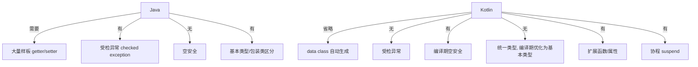
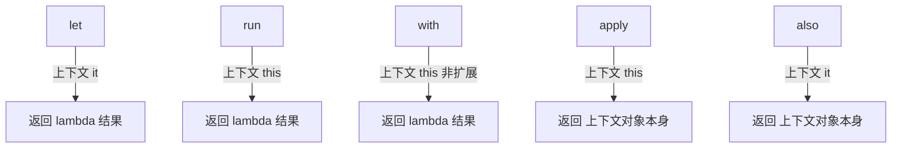

# Kotlin 基础语法

> 本文采用「🔍 源码解析 + 💡 扩展思考 + 📊 图示」三合一结构，覆盖 Kotlin 基础、空安全、函数与 Lambda、类与对象、属性与委托、扩展、泛型、作用域函数、集合、Kotlin/Java 互操作、高级特性等板块。  
> 协程内容较多，已独立拆为《5.Kotlin协程.md》单独成篇；本文聚焦语言本身（语法 / 类型 / 面向对象核心）。  
> 适用场景：校招 / 社招 Android、后端（Ktor）、跨平台（KMM）岗位；尤适合已有 Java 基础、转 Kotlin 的候选人查漏补缺。

## 目录

- [1. Kotlin 概览与与 Java 的关系](#1-kotlin-概览与与-java-的关系)
  - [1.1 Kotlin 是什么](#11-kotlin-是什么)
  - [1.2 Kotlin 与 Java 主要区别](#12-kotlin-与-java-主要区别)
- [2. 基础语法](#2-基础语法)
  - [2.1 变量：val 与 var](#21-变量val-与-var)
  - [2.2 类型推断与相等性](#22-类型推断与相等性)
  - [2.3 字符串模板与原始字符串](#23-字符串模板与原始字符串)
  - [2.4 when 表达式与区间](#24-when-表达式与区间)
- [3. 空安全（Kotlin 招牌）](#3-空安全kotlin-招牌)
  - [3.1 可空类型与非空类型](#31-可空类型与非空类型)
  - [3.2 安全调用、Elvis、断言](#32-安全调用elvis断言)
  - [3.3 平台类型与 Java 互操作](#33-平台类型与-java-互操作)
- [4. 函数与 Lambda](#4-函数与-lambda)
  - [4.1 默认参数与命名参数](#41-默认参数与命名参数)
  - [4.2 高阶函数与函数类型](#42-高阶函数与函数类型)
  - [4.3 带接收者的 Lambda](#43-带接收者的-lambda)
  - [4.4 内联函数 inline / noinline / crossinline](#44-内联函数-inline--noinline--crossinline)
  - [4.5 运算符重载与中缀](#45-运算符重载与中缀)
- [5. 类与对象](#5-类与对象)
  - [5.1 主构造器、次构造器与 init 块](#51-主构造器次构造器与-init-块)
  - [5.2 继承：open 与 override](#52-继承open-与-override)
  - [5.3 接口](#53-接口)
  - [5.4 data class（数据类）](#54-data-class数据类)
  - [5.5 sealed class（密封类）](#55-sealed-class密封类)
  - [5.6 object：对象声明、伴生对象、单例](#56-object对象声明伴生对象单例)
  - [5.7 嵌套类 vs 内部类](#57-嵌套类-vs-内部类)
- [6. 属性与委托](#6-属性与委托)
  - [6.1 幕后字段 field 与幕后属性](#61-幕后字段-field-与幕后属性)
  - [6.2 lateinit 与 by lazy](#62-lateinit-与-by-lazy)
  - [6.3 委托属性 by](#63-委托属性-by)
- [7. 扩展](#7-扩展)
  - [7.1 扩展函数与扩展属性](#71-扩展函数与扩展属性)
  - [7.2 伴生对象扩展与接收者作用域](#72-伴生对象扩展与接收者作用域)
- [8. 泛型](#8-泛型)
  - [8.1 声明点型变：out / in](#81-声明点型变out--in)
  - [8.2 星投影与 reified](#82-星投影与-reified)
- [9. 作用域函数（let/run/with/apply/also）](#9-作用域函数letrunwithapplyalso)
  - [9.1 五大函数对比](#91-五大函数对比)
  - [9.2 takeIf / takeUnless](#92-takeif--takeunless)
- [10. 集合与函数式操作](#10-集合与函数式操作)
  - [10.1 只读集合 vs 可变集合](#101-只读集合-vs-可变集合)
  - [10.2 常用操作符与序列](#102-常用操作符与序列)
  - [10.3 Array 与 List 的区别](#103-array-与-list-的区别)
- [11. Kotlin / Java 互操作](#11-kotlin--java-互操作)
  - [11.1 平台类型与注解](#111-平台类型与注解)
  - [11.2 @Jvm 系列注解](#112-jvm-系列注解)
  - [11.3 异常与 SAM](#113-异常与-sam)
- [12. 其他高级特性](#12-其他高级特性)
  - [12.1 内联类 / value class](#121-内联类--value-class)
  - [12.2 契约 Contracts](#122-契约-contracts)
  - [12.3 类型别名、委托类](#123-类型别名委托类)
- [13. Nothing 与 Unit 类型](#13-nothing-与-unit-类型)
- [附：Kotlin 高频速记表](#附kotlin-高频速记表)

---

> 提示：Mermaid 图在 GitHub、VS Code（装 Mermaid 插件）、Typora 等可直接渲染；若查看器不支持，会以代码块展示，不影响文字。

---

# 1. Kotlin 概览与与 Java 的关系

## 1.1 Kotlin 是什么

🔍 **语言定位**

```text
- 2011 由 JetBrains 推出, 2017 Google 宣布 Android 首选语言, 2019 升为首选
- 静态类型、JVM 语言(也可编译为 JS / Native / WASM)
- 100% 与 Java 互操作: 可调用所有 Java 库, 编译产物同为 .class 字节码
- 设计目标: 简洁、安全(空安全)、互操作、工具友好
```

💡 **扩展思考：**

> **Q：Kotlin 和 Java 的字节码兼容吗？**  
> A：兼容。Kotlin 编译为与 Java 完全相同的 JVM 字节码，二者可混编、互相调用，Kotlin 标准库就是运行在 Java 之上的一层封装（Kotlin 本身不造运行时，很多逻辑委托给 Java 类）。
>
> **Q：Kotlin 相比 Java 最大的优势是什么？**  
> A：① **空安全**（编译期消除 NPE 一大类）；② **简洁**（data class、扩展、默认参数省样板）；③ **函数式 + 协程**（天然支持高阶函数、`suspend` 轻量异步）；④ **互操作**（平滑迁移，不用重写 Java 代码）。

## 1.2 Kotlin 与 Java 主要区别

📊 **核心差异对比**



💡 **扩展思考：**

> **Q：Kotlin 有基本类型和包装类之分吗？**  
> A：语法上没有。`Int` 等既是"基本类型"又是"引用类型"的写法，编译器在**不需要装箱时**自动优化为 JVM 基本类型（如局部变量、算术运算），**需要装箱时**（泛型、集合）才装箱。比 Java 的 `int/Integer` 手动区分更省心。
>
> **Q：Kotlin 有受检异常（checked exception）吗？**  
> A：没有。Kotlin 不强制 `try-catch`，与 Java 互操作时 Java 的 checked exception 到 Kotlin 会变成 unchecked，调用更简洁但需自觉处理。

---

# 2. 基础语法

## 2.1 变量：val 与 var

🔍 **源码视角 · 不可变与可变的编译结果**

```kotlin
val a = 10          // final int a = 10;  (不可重赋值)
var b = 20          // int b = 20;       (可重赋值)
```

- `val` ≠ Java `final` 字段：它只是"引用不可变"，若指向可变对象（如 `val list = mutableListOf()`），对象内部仍可改。

💡 **扩展思考：**

> **Q：val 声明的对象一定不可变吗？**  
> A：否。`val` 只保证**引用**不可变，对象本身是否可变取决于类型。例如 `val map = mutableMapOf(1 to "a")` 仍可 `map[2]="b"`。真正不可变要用 `mapOf`/`listOf` 等只读集合。
>
> **Q：为什么推荐优先用 val？**  
> A：函数式编程提倡不可变，减少副作用、便于推理并发安全；`val` 也对应 Java `final`，利于 JVM 优化。

## 2.2 类型推断与相等性

🔍 **源码视角 · == vs ===**

```kotlin
val a = "abc"
val b = "abc"
a == b     // true  : 等价于 Java 的 equals (结构相等)
a === b    // true  : 引用相等 (同一对象, 这里是常量池复用)
val x = "a"
val y = "a".padStart(2, '0').substring(1) // "a" 但新对象
x === y    // false : 不同引用
```

💡 **扩展思考：**

> **Q：Kotlin 的 == 和 Java 的 == 一样吗？**  
> A：不一样！Kotlin 的 `==` 是**结构相等**（调用 `equals`）；`===` 才是引用相等（Java 的 `==`）。这是 Kotlin 故意设计，避免 Java 中 `str == "x"` 的经典坑。

## 2.3 字符串模板与原始字符串

🔍 **源码视角**

```kotlin
val n = 5
val s = "n = $n, square = ${n * n}"   // 模板, 编译为字符串拼接/ StringBuilder
val raw = """         
    多行文本          // 原始字符串, 不转义 \$ \{ \ 等
    line: $n
""".trimIndent()
```

💡 **扩展思考：**

> **Q：字符串模板底层怎么实现？会不会有性能问题？**  
> A：在 JVM 上编译为 `StringBuilder.append`（多段拼接时），与 Java 手写 `StringBuilder` 等价，无额外性能损耗。

## 2.4 when 表达式与区间

💡 **扩展思考：**

> **Q：when 和 Java switch 区别？**  
> A：`when` 是**表达式**（有返回值，可替代 `?:` 三元的复杂版），`switch` 是语句；`when` 支持任意类型、任意布尔条件分支、`is`/`in` 智能转换，无需 `break`（不会贯穿 fall-through）。

---

# 3. 空安全（Kotlin 招牌）

## 3.1 可空类型与非空类型

🔍 **源码视角 · 类型系统层面的可空性**

```kotlin
var s: String = "a"   // 非空类型: 编译期保证永远不为 null
s = null              // 编译错误!
var t: String? = "a"   // 可空类型: 允许为 null
t = null              // OK
```

> 关键：**可空性在编译期由类型系统强制执行**，运行时没有额外的"可空包装"，零运行时开销。

💡 **扩展思考：**

> **Q：Kotlin 的空安全是怎么实现的？运行时有没有额外开销？**  
> A：通过类型系统区分 `T` 与 `T?`，编译器在编译期插入可空性检查，运行时无包装、无额外开销。这与 Optional 不同——`Optional` 是运行时对象，有装箱成本；Kotlin 的 `?` 纯编译期。

## 3.2 安全调用、Elvis、断言

🔍 **源码视角**

```kotlin
val len = t?.length            // 若 t 为 null 返回 null, 否则 t.length (安全调用)
val len2 = t?.length ?: 0      // Elvis: t 为 null 时用 0 (?? 的 Kotlin 版)
val len3 = t!!.length          // 非空断言: 若 null 抛 NPE (尽量别用)
```

💡 **扩展思考：**

> **Q：?: （Elvis 操作符）和 ?. 什么时候用？**  
> A：`?.` 用于"可能为空就短路返回 null"；`?:` 用于在 `?.` 结果为 null 时提供默认值，常连写 `a?.b ?: default`。
>
> **Q：!! 为什么危险？**  
> A：`!!` 等于主动放弃空安全、把 NPE 风险交还运行时，违背 Kotlin 初衷；除非绝对确定非空（如刚做过判空），否则应避免。典型场景：测试或依赖上游保证。

## 3.3 平台类型与 Java 互操作

🔍 **源码视角 · 平台类型（Platform Type）**

```kotlin
// Java:
public String getName() { return null; }   // 没有 @Nullable 标注
// Kotlin 调用:
val name = javaObj.name    // 类型显示为 String! (平台类型)
name.length               // 编译期不报错, 运行期可能 NPE!
```

> `String!` 是"平台类型"——Kotlin 不知道 Java 方法是否返回 null（Java 无强制标注），故放宽检查。用 `@Nullable`/`@NotNull`（JetBrains 注解）可消除平台类型。

💡 **扩展思考：**

> **Q：什么是平台类型？为什么它危险？**  
> A：来自未标注 `@Nullable`/`@NotNull` 的 Java 代码的类型，Kotlin 显示为 `T!`，编译期既不强制可空也不保证非空，调用者若当作非空用就可能 NPE。解决：Java 侧加注解，或 Kotlin 侧主动按 `T?` 处理。

---

# 4. 函数与 Lambda

## 4.1 默认参数与命名参数

🔍 **源码视角 · 相比 Java 重载**

```kotlin
fun greet(name: String, prefix: String = "Hello", loud: Boolean = false) =
    "${prefix}, $name${if (loud) "!" else "."}"
greet("Bob")                      // 默认参数生效
greet("Bob", loud = true)         // 命名参数, 跳过多余参数
```

> 编译为 Java 时，若要用 Java 调，需 `@JvmOverloads` 才会生成重载方法。

## 4.2 高阶函数与函数类型

🔍 **源码视角 · 函数是一等公民**

```kotlin
fun operate(a: Int, b: Int, op: (Int, Int) -> Int): Int = op(a, b)
operate(3, 4) { x, y -> x + y }   // 传入 lambda, 等价于 (x,y) -> x+y
// 函数类型 (Int, Int) -> Int 编译为 Function2 接口实例
```

💡 **扩展思考：**

> **Q：高阶函数编译后是什么？每次调用都 new 对象吗？**  
> A：lambda 编译为 `FunctionN` 接口的匿名实例；若 lambda **捕获了外部变量**，每次调用都会 `new` 一个实例（有分配开销）。优化手段是 `inline`（见 4.6）。

## 4.3 带接收者的 Lambda

🔍 **源码视角 · 作用域函数的本质**

```kotlin
// 带接收者的函数类型: A.(B) -> C  (在 A 的上下文里执行, this 指向 A)
inline fun <T> T.apply(block: T.() -> Unit): T { block(); return this }

val list = mutableListOf<Int>().apply {
    add(1); add(2)   // this 即 list, 可省略
}
```

## 4.4 内联函数 inline / noinline / crossinline

🔍 **源码视角 · 编译期的代码复制**

```kotlin
inline fun measure(block: () -> Unit) {   // inline: 调用处把函数体直接展开
    val t = System.nanoTime()
    block()
    println("cost=${System.nanoTime() - t}")
}
// 编译后: 调用处直接内联 block() 的内容, 不产生 Function 实例
// 且支持"非局部返回"(lambda 内 return 直接返回外层函数)
```

- `noinline`：只内联外层，某个 lambda 参数不内联（需把 lambda 当对象传递时用）。
- `crossinline`：内联但禁止非局部返回（lambda 被传给非内联上下文如线程时用）。

💡 **扩展思考：**

> **Q：inline 解决了什么问题？有什么代价？**  
> A：① 消除高阶函数的 lambda 实例分配；② 支持**非局部返回**（lambda 里 `return` 退出外层函数）；③ 配合 `reified` 突破泛型擦除。代价：字节码膨胀（函数体复制多份），故只对短小高频函数内联。
>
> **Q：crossinline 为什么存在？**  
> A：当内联函数的 lambda 被传给另一个非内联函数（如在线程里执行），无法保证"非局部返回"安全（外层函数早已返回），编译器禁止该返回，用 `crossinline` 声明这种"可内联但不能非局部返回"的约束。

## 4.5 运算符重载与中缀

🔍 **源码视角**

```kotlin
data class Point(val x: Int, val y: Int) {
    operator fun plus(o: Point) = Point(x + o.x, y + o.y)   // a + b
}
infix fun Int.shl(n: Int) = this shl n     // 中缀: 1 shl 2
```

---

# 5. 类与对象

## 5.1 主构造器、次构造器与 init 块

🔍 **源码视角 · 构造顺序**

```kotlin
class User(val name: String, var age: Int = 0) {  // 主构造器(参数可直接声明属性)
    init { println("init: $name") }               // init 块, 主构造体
    constructor(name: String) : this(name, 0) {   // 次构造器, 必须委托主构造
        println("secondary")
    }
}
```

> 实例化顺序：`主构造参数` → `属性初始化` → `init 块`（按出现顺序）→ `次构造器体`。

💡 **扩展思考：**

> **Q：主构造器里的 val/var 和类体内声明属性有什么区别？**  
> A：主构造器参数加 `val/var` 会直接成为类的属性（编译为字段+getter/setter）；不加则只是构造期临时参数（类似 Java 构造器参数），类内其他成员无法访问。
>
> **Q：init 块和属性初始化谁先执行？**  
> A：按**在类体中出现的文本顺序**执行（属性初始化器和 init 块交错），都在主构造器进入后、次构造器体之前。注意：不能在前面的 init 中引用后面才初始化的属性（编译报错或得默认值）。

## 5.2 继承：open 与 override

🔍 **源码视角**

```kotlin
open class Animal {            // 默认 final, 必须 open 才能继承
    open fun sound() = "..."   // 必须 open 才能重写
}
class Dog : Animal() {         // 冒号表示继承, () 调父类构造
    override fun sound() = "Woof"   // 必须 override, 默认 open
    final override fun xxx() {}     // final 阻止再被重写
}
```

💡 **扩展思考：**

> **Q：Kotlin 类默认是 final 的吗？为什么？**  
> A：是。Kotlin 设计上默认类不可继承（防脆弱基类问题），需显式 `open` 才允许继承。这与 Java 默认可继承相反。Effective Java 也建议"要么设计可继承要么禁止继承"。

## 5.3 接口

💡 **扩展思考：**

> **Q：Kotlin 接口能有什么？与 Java 8+ 接口区别？**  
> A：Kotlin 接口可有抽象方法、默认实现方法（`fun foo() = ...`）、抽象属性（`val x: Int`）；不能有**状态**（不能存字段，属性是抽象的，实现类必须重写）。Java 8+ 接口有 default 方法和静态方法，同样不能有实例字段 —— 思路一致。

## 5.4 data class（数据类）

🔍 **源码视角 · 自动生成的方法**

```kotlin
data class User(val name: String, val age: Int)
// 编译器自动生成:
//   equals()/hashCode()  (基于所有主构造属性)
//   toString()           ("User(name=.., age=..)")
//   component1()/component2()  (解构)
//   copy(name = ..)      (浅拷贝, 改部分字段)
```

```kotlin
val u1 = User("A", 1)
val (name, age) = u1        // 解构, 调用 componentN
val u2 = u1.copy(age = 2)   // 浅拷贝, 只改 age
```

💡 **扩展思考：**

> **Q：data class 的 copy 是深拷贝还是浅拷贝？**  
> A：**浅拷贝**。只创建新对象，字段值（引用）直接复制；若字段是 `var list: MutableList`，copy 后新旧对象共享同一个 list，改一个影响另一个。
>
> **Q：data class 有什么限制？**  
> A：主构造器至少 1 个参数；参数必须是 `val/var`（参与 equals）；不能是 `abstract/open/sealed/inner`；不能继承其他类（可实现接口）。

## 5.5 sealed class（密封类）

🔍 **源码视角 · 受限层次 + when 穷举**

```kotlin
sealed class Result<out T>       // 子类必须在同一文件(旧版)内定义
data class Success<T>(val data: T) : Result<T>()
data class Error(val msg: String) : Result<Nothing>()

fun <T> handle(r: Result<T>) = when (r) {   // 无需 else! 编译器知已穷举
    is Success -> "ok ${r.data}"
    is Error -> "err ${r.msg}"
}
```

💡 **扩展思考：**

> **Q：sealed class 和 enum 的区别？**  
> A：enum 是**同一类型的有限实例**（每个常量一个对象）；sealed class 是**有限子类类型**，每个子类可带不同数据/多种实例（如 `Success<User>`、`Success<Order>`）。密封类适合"带数据的代数数据类型（ADT）"，如网络请求结果、UI 状态机。
>
> **Q：sealed class 相比普通抽象类的优势？**  
> A：`when` 表达式可**穷举**所有子类，无需 `else`；编译器在新增子类时会提醒补充分支，避免遗漏。子类受限（同包/同文件，Kotlin 1.5+ 放宽到同编译单元）。
>
> **Q：sealed interface 呢？**  
> A：Kotlin 1.5+ 支持 `sealed interface`，用于多类实现受限集合（如多个无关类实现同一密封接口），比 sealed class 更灵活（类可实现多个接口）。

## 5.6 object：对象声明、伴生对象、单例

🔍 **源码视角 · 单例的线程安全实现**

```kotlin
object Database {                 // 对象声明 = 线程安全单例
    fun query() = "..."          // 类似 Java 静态内部类单例(类加载锁保证)
}
class MyClass {
    companion object {           // 伴生对象: 类似 static 成员, 但本身是对象
        const val TAG = "X"
        fun create() = MyClass()
    }
}
```

> `object` 的单例初始化是**线程安全**的（基于 JVM 类初始化机制，类加载时由 ClassLoader 锁保证只初始化一次），无需手写双重检查锁。

💡 **扩展思考：**

> **Q：object 单例是饿汉还是懒汉？线程安全吗？**  
> A：是**懒加载**（首次访问时才初始化），且**线程安全**——依赖 JVM 类加载的线程安全语义（类初始化锁），等价于 Java 的"静态内部类单例" idiom，比双重检查锁更简洁可靠。
>
> **Q：companion object 在 Java 里怎么访问？**  
> A：默认 `MyClass.Companion.create()`；加 `@JvmStatic` 后可 `MyClass.create()`；`const val` 编译为真正的 static 常量。

## 5.7 嵌套类 vs 内部类

🔍 **源码视角**

```kotlin
class Outer {
    inner class Inner {          // inner: 持有外部引用(类似 Java 非静态内部类)
        fun foo() = this@Outer.toString()
    }
    class Nested {               // 默认嵌套类: 不持有外部引用(类似 Java 静态内部类)
    }
}
```

💡 **扩展思考：**

> **Q：Kotlin 的嵌套类和内部类与 Java 默认相反，为什么？**  
> A：Kotlin 默认嵌套类**不持有外部引用**（对应 Java `static` 嵌套类，更省内存、防泄漏）；需显式 `inner` 才持有外部引用（对应 Java 普通内部类）。设计上避免无意中泄漏外部实例。

---

# 6. 属性与委托

## 6.1 幕后字段 field 与幕后属性

🔍 **源码视角 · 自定义 getter/setter**

```kotlin
var counter = 0
    set(value) {
        if (value >= 0) field = value   // field = 幕后字段, 否则无限递归
    }
private var _table: Map<String, Int>? = null
val table: Map<String, Int>          // 幕后属性: 暴露只读, 内部可变
    get() {
        if (_table == null) _table = HashMap()
        return _table!!
    }
```

> `field` 只能在 getter/setter 内访问，代表"真正的存储字段"；若 getter/setter 没用到 `field`（如纯计算），则不生成幕后字段。

## 6.2 lateinit 与 by lazy

🔍 **源码视角 · 两种延迟初始化**

```kotlin
lateinit var adapter: RecyclerView.Adapter<*>  // 延迟非空: 约定稍后赋值, 用前未赋值抛异常
val lazyVal: String by lazy {                  // 线程安全惰性: 首次访问才计算并缓存
    println("computed"); "value"
}
```

💡 **扩展思考：**

> **Q：lateinit 和 by lazy 有什么区别？怎么选？**  
> A：
>
> - `lateinit var`：用于**可变、非空、稍后赋值**（如依赖注入、生命周期回调里赋值）；抛 `UninitializedPropertyAccessException`；仅限 `var`，不支持基本类型。
> - `by lazy`：用于**只读、首次访问才初始化并缓存**（线程安全，默认 `LazyThreadSafetyMode.SYNCHRONIZED`）；是 `val`。适合昂贵的一次性计算。  
>   经验：不可变/一次性 → `lazy`；可变/外部注入 → `lateinit`（或 `by lazy` 也行但语义不符）。

## 6.3 委托属性 by

🔍 **源码视角 · 委托属性约定**

```kotlin
// 标准委托
val lazyProp by lazy { ... }            // 惰性
var observable by Delegates.observable(0) { _, old, new -> println("$old->$new") }
var vetoable by Delegates.vetoable(0) { _, _, new -> new >= 0 }  // 可否决
val map by mapOf("name" to "A")         // Map 委托, 从 map 取值

// 自定义委托需实现:
operator fun getValue(thisRef: Any?, property: KProperty<*>): T
operator fun setValue(thisRef: Any?, property: KProperty<*>, value: T)
```

> 原理：编译器把属性的 getter/setter 转发给委托对象的 `getValue/setValue`，自己的幕后字段不再存储值。

💡 **扩展思考：**

> **Q：by 委托属性的底层是怎么实现的？**  
> A：属性访问被编译器改写为调用委托对象的 `getValue(this, ::prop)` / `setValue(...)`。例如 `var x by d` 访问 `x` 实际调用 `d.getValue(this, ::x)`。可自定义委托实现缓存、监听、数据库映射等。


---

# 7. 扩展

## 7.1 扩展函数与扩展属性

🔍 **源码视角 · 静态分发**

```kotlin
fun String.lastChar(): Char = this[this.length - 1]   // 扩展函数
val String.firstChar: Char get() = this[0]            // 扩展属性(无幕后字段, 只有 getter)

"abc".lastChar()    // 'c'
```

> 编译后：`lastChar` 变成一个**静态方法** `static char lastChar(String $this)`，接收原对象为第一个参数。**扩展不修改原类，只是静态分发**。

💡 **扩展思考：**

> **Q：扩展函数能访问私有成员吗？能被重写（多态）吗？**  
> A：① 不能访问私有/受保护成员（它不在类内部）；② **不能被重写**——扩展是**静态分发**（编译期按调用者声明类型决定），不具备多态。若子类实例以父类类型调用扩展，仍走父类扩展。这与成员函数（动态分派）不同。
>
> **Q：扩展 vs 成员函数冲突时谁优先？**  
> A：**成员函数优先**。若类已有同名成员，扩展被忽略（避免破坏类封装）。

## 7.2 伴生对象扩展与接收者作用域

💡 **扩展思考：**

> **Q：扩展有什么实际用途？**  
> A：① 给无法修改的类（如 Java SDK、第三方库、`String`、`List`）加方法，避免写工具类 `StringUtils.xxx`；② Kotlin 标准库大量用扩展（`Collection.map/.filter` 本质是扩展）；③ 伴生对象扩展可给类"加静态工厂方法"。

---

# 8. 泛型

## 8.1 声明点型变：out / in

🔍 **源码视角 · 生产者/消费者**

```kotlin
interface Producer<out T> {        // out: T 只出现在"输出/返回"位置 → 协变
    fun produce(): T
}
interface Consumer<in T> {         // in: T 只出现在"输入/参数"位置 → 逆变
    fun consume(t: T)
}
val p: Producer<Any> = object : Producer<String> { ... }  // OK 协变
val c: Consumer<String> = object : Consumer<Any> { ... }  // OK 逆变
```

> **out = 只读/生产者（Java `? extends`）, in = 只写/消费者（Java `? super`）**——这就是 Kotlin 的 PECS，但写在**类/接口声明处**（声明点型变），比 Java 使用点更简洁。

💡 **扩展思考：**

> **Q：Kotlin 的 out/in 和 Java 的 ? extends / ? super 区别？**  
> A：语义相同（协变/逆变），但 Kotlin 把型变标注在**类型参数声明处**（声明点型变，一次声明处处安全），Java 在**每次使用处**标注（使用点型变，PECS）。Kotlin 还可配合**使用点型变**（如 `Function<in T, out R>`），更灵活。
>
> **Q：为什么 List 是 out？**  
> A：只读 `List<out E>` 只产出 E（get），不消费 E（无 add），所以协变：`List<String>` 可赋给 `List<Any>`。而 `MutableList<E>` 没有 `out`（既能 add 又能 get），不可协变。

## 8.2 星投影与 reified

🔍 **源码视角 · 突破类型擦除**

```kotlin
fun <T> printList(list: List<T>) {     // 运行时 T 被擦除
    // 无法直接判断 list 里元素是不是 String
}
inline fun <reified T> isOfType(x: Any) = x is T   // reified + inline
isOfType<String>("a")                    // true, 编译后保留了 T 的真实类型
```

> `reified` 必须配合 `inline`：内联后函数体复制到调用处，类型 `T` 被替换为具体类型，从而能在运行时做 `is T`、`T::class`、`T()` 等操作，突破 JVM 类型擦除。

💡 **扩展思考：**

> **Q：为什么 reified 必须 inline？**  
> A：因为类型擦除后泛型信息不存在，只有把函数内联到调用现场、用具体类型替换 `T`，才能在字节码里保留真实类型。`reified` 强制要求 `inline`，否则编译报错。
>
> **Q：星投影 `List<*>` 是什么？**  
> A：`List<*>` = `List<out Any?>` 的简写，表示"元素类型未知但只读的 List"，读出来是 `Any?`，不能写。用于"不关心具体类型只遍历"的场景。

---

# 9. 作用域函数（let/run/with/apply/also）

## 9.1 五大函数对比

📊 **作用域函数对比**



| 函数      | 上下文对象  | 返回值       | 典型用途                  |
| ------- | ------ | --------- | --------------------- |
| `let`   | `it`   | lambda 结果 | 非空判断后处理、`?.let`、变量改名  |
| `run`   | `this` | lambda 结果 | 对象配置 + 计算返回值          |
| `with`  | `this` | lambda 结果 | 对同一对象多次调用（非扩展）        |
| `apply` | `this` | **对象本身**  | **Builder 式配置对象**（链式） |
| `also`  | `it`   | **对象本身**  | 附加副作用（日志、校验）后返回原对象    |

### 9.1.1 五大函数代码示例

#### 🔹 `let`：上下文 `it`，返回 lambda 结果

```kotlin
// 1) 可空类型的安全处理（最常用）：非空才进入 lambda
val name: String? = "Kotlin"
val upper = name?.let {
    println("原值 = $it")   // it 指向 name
    it.uppercase()          // lambda 的返回值
}
println(upper)              // KOTLIN

// 2) 变量改名 / 把表达式结果限定在局部作用域
val doubled = 100.let { n -> n * 2 }   // 200
```

#### 🔹 `run`：上下文 `this`，返回 lambda 结果

```kotlin
// 1) 配置对象 + 计算一个返回值
val len = "hello".run {
    println("长度 = ${length}")   // this.length，this 可省略
    length                          // 返回计算结果
}

// 2) 配合 ?.run 处理可空对象并产出结果
data class User(val name: String, val age: Int)
val desc = user?.run {
    "$name 今年 $age 岁"           // 返回拼接字符串
}
```

#### 🔹 `with`：非扩展函数，上下文 `this`，返回 lambda 结果

```kotlin
// 对同一对象连续调用多个方法（不需要返回新对象，只关心副作用/结果）
val sb = StringBuilder()
val result = with(sb) {
    append("Hello")
    append(", ")
    append("World")
    toString()                     // 返回结果
}
println(result)                    // Hello, World
// 注意：with 不是扩展函数，不能用 ?. 安全调用，可空对象要先判空
```

#### 🔹 `apply`：上下文 `this`，返回对象本身（Builder 式配置）

```kotlin
// 1) 经典用法：一行完成对象初始化
val tv = TextView(context).apply {
    text = "按钮"
    textSize = 16f
    setTextColor(Color.BLACK)
    setOnClickListener { /* ... */ }
}   // tv 就是配置好的 TextView，无需再赋值

// 2) 链式初始化集合
val map = HashMap<String, Int>().apply {
    put("a", 1)
    put("b", 2)
}
```

#### 🔹 `also`：上下文 `it`，返回对象本身（附加副作用）

```kotlin
// 1) 在原对象上做日志 / 校验等副作用，返回仍是原对象
val file = File("data.txt").also {
    println("即将创建: ${it.path}")        // 副作用：日志
    check(it.exists()) { "文件不存在" }     // 副作用：前置校验
}
// file 依然是原始 File 对象

// 2) 调试链式调用时打印中间值（不破坏数据流）
listOf(1, 2, 3)
    .also { println("原始: $it") }
    .map { it * 2 }
    .also { println("翻倍后: $it") }
```

#### 🔹 组合使用：看清"返回结果"与"返回对象"的差异

```kotlin
data class Person(val name: String, var age: Int = 0)

// apply 返回配置后的对象 → let 接收该对象并做转换
val nameLen = Person("Alice").apply {
    age = 30          // 配置（this 指向 Person）
}.let {
    it.name.length    // 转换（it 指向 Person，返回 Int）
}
println(nameLen)      // 5

// 若用 also 则拿不到转换结果，only 返回原对象：
val samePerson = Person("Bob").also { it.age = 20 }  // 返回 Person 本身
```

💡 **扩展思考：**

> **Q：apply 和 also 的区别？什么时候用 apply？**  
> A：`apply` 上下文是 `this`（可省略），返回对象本身，适合**配置对象**（如 `TextView().apply { text=..; setOnClick.. }`）；`also` 上下文是 `it`，返回原对象，适合附加操作（日志、断言）。记忆：`apply` 改对象、`also` 看对象。
>
> **Q：这些函数都是怎么实现的？**  
> A：全部是 **inline 扩展函数**（`inline fun <T> T.apply(block: T.() -> Unit): T`），内联后无 lambda 实例开销，`block` 是带接收者的 lambda（所以能用 `this`）。

## 9.2 takeIf / takeUnless

💡 **扩展思考：**

> **Q：takeIf 有什么用？**  
> A：`val r = x.takeIf { it > 0 }` —— 条件成立返回 x，否则返回 null，可链式接 `?.let`。`takeUnless` 相反，常用于"过滤后再处理"。

---

# 10. 集合与函数式操作

## 10.1 只读集合 vs 可变集合

🔍 **源码视角 · 接口分离**

```kotlin
val r: List<Int> = listOf(1, 2)        // 只读, 无 add
val m: MutableList<Int> = mutableListOf(1, 2)  // 可变, 有 add
// 只读≠不可变(底层可能是同一可变集合的视图), 仅接口不提供修改方法
```

💡 **扩展思考：**

> **Q：List 只读就线程安全吗？**  
> A：不一定。`List` 只是**接口不提供修改方法**，若底层是 `MutableList` 的引用被共享，别人仍可改。真正不可变需 `List` 且不被任何可变引用持有。

## 10.2 常用操作符与序列

🔍 **源码视角 · Sequence 惰性**

```kotlin
listOf(1, 2, 3, 4)
    .asSequence()                 // 转为惰性序列, 不立即计算
    .filter { it % 2 == 0 }
    .map { it * it }
    .first()                      // 只在取到第一个满足时计算, 短路
// 集合版本会一次性 filter+map 全部元素; 序列版本是"管道式"逐元素处理
```

💡 **扩展思考：**

> **Q：Sequence 和普通集合操作的区别？什么时候用？**  
> A：集合操作**急切**（每步产生中间集合），适合数据量小；`Sequence` **惰性**（逐个元素流经整个管道，到终点才停），适合大数据或 `first/find` 等可短路场景，大幅减少中间集合与计算。但小数据用序列反而因额外开销更慢。

## 10.3 Array 与 List 的区别

💡 **一句话**：Kotlin 的 `Array` 是**固定大小、可变元素**的原始数组封装（直接对应 JVM 数组），`List`/`MutableList` 是**接口抽象的集合**（长度可变，底层通常是 `ArrayList`）；日常业务代码优先用 `List`，`Array` 主要用于与 Java 互操作、可变参数、以及需要"基本类型不装箱"的性能场景。

🔍 **源码视角 · Array 对基本类型的特殊优化**

```kotlin
val arr = arrayOf(1, 2, 3)          // Array<Int>，元素会被装箱为 Integer[]（有装箱开销）
val intArr = intArrayOf(1, 2, 3)    // IntArray，编译为 JVM 的 int[]（不装箱，性能更好）
// Kotlin 为每种基本类型都提供了专门的数组类型：
// IntArray/LongArray/DoubleArray/BooleanArray/CharArray/ByteArray/ShortArray/FloatArray
```
> 这与 Java `List<Integer>` 永远要装箱、而 `int[]` 不装箱的道理一致（见文档 1 第 1.4 节自动装箱）；Kotlin 用专门命名的类型（`IntArray` 而非 `Array<Int>`）在编译期就区分开，避免语义混淆。

🔍 **API 差异**

```kotlin
val array = arrayOf(1, 2, 3)
// array.add(4)     // ❌ 编译错误！Array 没有 add/remove，大小固定
array[0] = 100       // ✅ 可以改变已有下标的元素值（大小不变）

val list = mutableListOf(1, 2, 3)
list.add(4)          // ✅ List/MutableList 可动态增删
```

📊 **对比表**

| 维度 | Array | List / MutableList |
| --- | --- | --- |
| 大小 | 固定（创建后不可变长） | List 只读不可变长；MutableList 可动态增删 |
| 底层 | 直接对应 JVM 数组（`int[]`/`Object[]`） | 接口，具体实现通常是 `ArrayList`（内部仍是数组+扩容） |
| 基本类型 | 有专门类型（`IntArray` 等）避免装箱 | `List<Int>` 内部仍会装箱成 `Integer` |
| 协变 | `Array<out T>` 使用点可协变但**运行时不安全**（同 Java 数组，见文档 1 第 1.14 节） | `List<out T>`（只读接口本身声明为 `out`，协变且安全，见 8.1 节） |
| 典型场景 | Java 互操作、可变参数 `vararg`、明确要固定长度、性能敏感的基本类型批处理 | 绝大多数业务代码的默认选择 |

💡 **扩展思考：**

> **Q1：日常写 Kotlin 业务代码该用 Array 还是 List？**  
> A：**优先 List**（或 `MutableList`）。`Array` 更贴近底层 JVM 数组，主要用于三类场景：① 与 Java API 互操作（很多 Java 方法签名要求数组）；② 函数的 `vararg` 参数在内部就是数组；③ 大量基本类型数据的高性能场景，用 `IntArray` 等专门类型避免自动装箱、减少内存与 GC 压力。普通业务里的集合操作、增删元素，用 `List` 更符合 Kotlin 惯用法且 API 更丰富（`filter`/`map` 等扩展函数）。
>
> **Q2：为什么 Kotlin 要单独设计 IntArray 而不是直接用 Array\<Int\>？**  
> A：如果只有 `Array<Int>`，由于 JVM 泛型擦除后引用类型数组的元素必须是对象，`Int` 就必须装箱成 `Integer[]`，产生额外的内存开销和装箱/拆箱成本。`IntArray` 在编译后直接对应 JVM 原生的 `int[]`，元素访问和存储都是基本类型操作，没有装箱开销——这是 Kotlin "融合基本类型与引用类型语法、但底层仍尽量用基本类型"设计哲学的体现（对照文档 1 第 1.4 节 Java 的 `int` vs `Integer`）。
>
> **Q3：Array 判等用 == 和 equals 有什么区别？**  
> A：`Array` 没有重写 `equals`/`hashCode`（继承自 `Any` 即 `Object`），所以 `arr1 == arr2` 和 `arr1.equals(arr2)` 效果一样，都是**比较引用**，即使两个数组内容完全相同也返回 `false`；要比较内容需要用 `arr1.contentEquals(arr2)`（一维）或 `contentDeepEquals`（多维/嵌套数组）。这与 `List` 不同——`List` 的 `equals` 是**结构相等**（按元素逐个比较）。

---

# 11. Kotlin / Java 互操作

## 11.1 平台类型与注解

🔍 **源码视角 · 消除平台类型**

```kotlin
// Java:
@Nullable public String getA() { return null; }
@NotNull public String getB() { return "x"; }
// Kotlin 调用: getA() 是 String? , getB() 是 String (不再是平台类型 !)
```

## 11.2 @Jvm 系列注解

💡 **扩展思考：**

> **Q：@JvmStatic、@JvmField、@JvmOverloads 分别干嘛？**  
> A：
>
> - `@JvmStatic`：把 `companion object`/object 的方法/属性编译为真实 `static` 方法，方便 Java 直接 `MyClass.foo()` 调用。
> - `@JvmField`：把属性编译为真实 `public` 字段（不加 getter/setter），或暴露 `const`。
> - `@JvmOverloads`：为有**默认参数**的函数生成多个重载（Java 不支持默认参数，靠此才能像 Java 那样少传参调用）。
>
> **Q：Kotlin 默认参数在 Java 里能直接用吗？**  
> A：不能（Java 无默认参数）。要么在 Kotlin 侧加 `@JvmOverloads` 让编译器生成重载，要么 Java 侧老老实实传所有参数。

## 11.3 异常与 SAM

💡 **扩展思考：**

> **Q：Kotlin 调 Java 的 checked exception 要 try-catch 吗？**  
> A：不用。Kotlin 没有 checked exception，Java 的受检异常到 Kotlin 自动变为非受检，调用时无需强制 `try-catch`（但要自觉处理，否则运行期抛）。
>
> **Q：什么是 SAM 转换？**  
> A：当 Java 接口只有一个抽象方法（SAM：Single Abstract Method，如 `Runnable`、`OnClickListener`），Kotlin 允许用**lambda 直接**代替匿名实现：`view.setOnClickListener { ... }`，编译器自动转为接口实例。

---

# 12. 其他高级特性

## 12.1 内联类 / value class

🔍 **源码视角**

```kotlin
@JvmInline
value class UserId(val id: Long)   // 编译后 : 多数场景下直接是 Long(零开销包装)
// 避免"基本类型别名"误用, 比 typealias 强(运行时真有类型区分)
```

## 12.2 契约 Contracts

💡 **扩展思考：**

> **Q：Kotlin 的契约（Contracts）是什么？**  
> A：让编译器"理解"某些函数的副作用，从而更智能地推断（如 `checkNotNull(x)` 之后 x 必非空、不再要求判空）。标准库已内置，自定义契约在 experimental 阶段。本质是把"约定"告诉类型检查器。

## 12.3 类型别名、委托类

🔍 **源码视角**

```kotlin
typealias JsonMap = Map<String, Any>       // 类型别名(纯编译期, 不新建类型)
class ArrayListDelegate<T> : List<T> by ArrayList<T>()  // 类委托: 把接口实现委托给内部对象
```

---

# 13. Nothing 与 Unit 类型

💡 **一句话**：`Unit` 相当于 Java 的 `void`（表示"有返回值但值无意义"，但**它是一个真正的类型**，能被赋值和传递）；`Nothing` 表示"这个函数**永远不会正常返回**"（不是返回值为空，而是压根不会走到返回那一步），是所有类型的**子类型**（Bottom Type），用来帮助编译器做更精确的类型推断。

🔍 **源码视角 · Unit：真正的类型，不只是"没有返回值"**

```kotlin
fun printHello(): Unit {           // 显式声明返回 Unit，等价于不写返回类型
    println("Hello")
    // 隐式 return Unit
}
// Unit 本身是个 object（单例），可以被当作正常的值使用：
val block: () -> Unit = { println("do something") }
fun <T> runAndLog(action: () -> T): T {   // Unit 作为泛型参数完全合法
    println("running...")
    return action()
}
```
> Java 的 `void` 是**不是类型**的特殊标记，`void` 方法不能作为泛型参数、不能被当值传递；Kotlin 的 `Unit` 是货真价实的类型（对应一个 `Unit` 单例对象），所以能出现在任何"需要类型"的位置，比 `void` 更统一、更适合函数式编程（高阶函数返回类型可以直接是 `Unit`）。

🔍 **源码视角 · Nothing：永不返回的"底类型"**

```kotlin
fun fail(message: String): Nothing {
    throw IllegalStateException(message)   // 函数体只会抛异常，永远不会正常 return
}

fun getLength(s: String?): Int {
    val notNull = s ?: fail("字符串不能为空")   // Elvis 右侧是 Nothing，编译器知道走到这里 s 已经"逻辑上不可能是 null"
    return notNull.length                     // 因此这里 notNull 被推断为 String（非空），不用再判空
}

val x: Nothing? = null    // Nothing 唯一能实例化出的值就是 null（作为 Nothing? 类型）
```
> `Nothing` 是**所有类型的子类型**（`Nothing` 是 `Int`、`String`、`Any` 等一切类型的子类），所以一个返回 `Nothing` 的函数调用可以出现在**任何期望某个具体类型的位置**，编译器仍能类型检查通过——这就是为什么 `s ?: fail(...)` 能配合 Elvis 运算符工作：`?:` 要求两边类型能统一，`fail(...)` 的 `Nothing` 天然"兼容"左边的 `String`。

📊 **Unit vs Nothing vs Java void 对比**

| 类型 | 含义 | 是否是真正的类型 | 典型场景 |
| --- | --- | --- | --- |
| `Unit` | 有返回但值无实际意义（类似 void，但本身是类型） | 是（单例 object） | 普通函数默认返回类型、Lambda 无返回值时的函数类型 `() -> Unit` |
| `Nothing` | 函数永不正常返回（抛异常/死循环/进程退出） | 是（所有类型的子类型，Bottom Type） | `TODO()`、抛异常的工具函数、Elvis/`when` 分支中"这里不可能走到"的路径 |
| Java `void` | 无返回值 | 否（只是关键字标记，非类型系统的一部分） | 方法签名的返回声明 |

💡 **扩展思考：**

> **Q1：Nothing 和 Unit 有什么本质区别？**  
> A：`Unit` 表示"函数**正常执行完了**，只是没有有意义的返回值"（类似 void，但是货真价实的类型，能作为泛型参数）；`Nothing` 表示"函数**根本不会正常结束**"——它总是抛异常、死循环，或者调用 `exitProcess()` 等直接终止程序的操作。二者语义完全不同：一个是"跑完了但没有值"，一个是"永远跑不完"。
>
> **Q2：为什么标准库的 TODO() 函数返回类型是 Nothing？**  
> A：`fun TODO(): Nothing = throw NotImplementedError()`。因为 `Nothing` 是所有类型的子类型，`TODO()` 可以塞进**任何需要返回某个具体类型的位置**而不报编译错误——比如 `fun calc(): Int = TODO()` 能通过编译（虽然运行时会抛异常），方便开发时先占位后续实现，同时不破坏函数签名的类型契约。
>
> **Q3：`s ?: fail("empty")` 之后为什么编译器能自动判断 s 非空？**  
> A：这是 Kotlin **智能类型推断（smart cast）**结合 `Nothing` 类型的效果：`?:` 右边 `fail(...)` 的返回类型是 `Nothing`，编译器据此确定"如果程序执行到 `?:` 之后的代码，必然是左边 `s` 非 null 的那个分支"，于是自动把该变量的类型从 `String?` 收窄为 `String`，无需再手动判空或用 `!!`。这也是 Kotlin 标准库 `checkNotNull`/`requireNotNull` 等函数背后的原理（配合契约 Contracts，见 12.2 节）。

---

# 附：Kotlin 高频速记表

| 考点              | 一句话核心                                                            |
| --------------- | ---------------------------------------------------------------- |
| `val`/`var`     | 引用不可变 / 可重赋值；`val` 不保证对象不可变                                      |
| `==` vs `===`   | 结构相等(equals) / 引用相等(Java 的 ==)                                   |
| 空安全             | `T?` 编译期强制判空，运行时零开销；`!!` 危险                                      |
| 平台类型 `T!`       | 来自未标注的 Java 代码，编译期不检查，小心 NPE                                     |
| `?.` / `?:`     | 安全调用 / Elvis 默认值                                                 |
| data class      | 自动 equals/hashCode/toString/componentN/copy（浅拷贝）                 |
| sealed class    | 受限子类 + when 穷举，适合 ADT/状态机                                        |
| `object`        | 线程安全懒加载单例；`companion object` 似 static                            |
| 嵌套 vs inner     | 默认不持外部引用（似 static）；`inner` 持有                                    |
| `by lazy`       | 线程安全惰性计算（默认 SYNCHRONIZED）；`val`                                  |
| `lateinit`      | 可变非空延迟赋值；非基本类型                                                   |
| 扩展              | 静态分发、非多态、不能访问私有；成员优先                                             |
| `out`/`in`      | 声明点型变：生产者协变/消费者逆变（= Java PECS）                                   |
| `reified`       | 必须 inline，突破类型擦除，运行时 `is T`                                      |
| 作用域函数           | let(it/结果)/run(this/结果)/with(this/结果)/apply(this/对象)/also(it/对象) |
| Sequence        | 惰性管道，大数据/可短路场景优于集合                                               |
| 协程              | 轻量、挂起不阻塞线程、结构化并发                                                 |
| suspend 原理      | CPS 变换 + 状态机 + COROUTINE_SUSPENDED + Continuation.resume         |
| 启动模式            | DEFAULT/LAZY/ATOMIC/UNDISPATCHED：何时调度 + 取消边界                     |
| launch/async    | 无结果(Job) / 有结果(Deferred, await 取)                                |
| Dispatchers     | Main/IO(≈64)/Default(核数)/Unconfined                              |
| 取消传播            | 父取消子；普通 Job 子失败取消父；SupervisorJob 独立                              |
| 异常处理            | 顶层 Handler；async 异常延迟到 await                                     |
| Flow            | 冷流（像异步 Sequence），collect 触发，可 catch                              |
| Array vs List   | Array 固定大小对应 JVM 数组；IntArray 等避免装箱；业务代码优先 List                    |
| `Unit`/`Nothing` | Unit=有值但无意义(似void但是真类型)；Nothing=永不返回，是一切类型的子类型                  |
| `@JvmOverloads` | 让默认参数函数生成 Java 重载                                                |
| value class     | 零开销类型包装，比 typealias 强                                            |

---

> 文档完。建议配合《1.Java基础语法.md》（基础语法/OOP）、《2.Java集合体系.md》（集合框架）、《3.Java并发编程.md》（并发/JUC）、《5.Kotlin协程.md》（协程专题）、《6.Java虚拟机.md》一起复习——Kotlin 跑在 JVM 上，协程与 Java 并发模型殊途同归，空安全的字节码实现也与 JVM 息息相关。
