# Kotlin 协程

> 聚焦 Kotlin 协程全知识体系：是什么、核心概念、suspend 底层原理（CPS + 状态机）、启动方式、调度器、结构化并发与取消、协作式取消与资源清理、回调转协程、Flow / Channel 深度剖析，以及常见陷阱与最佳实践。  
> 适用场景：Android（viewModelScope/lifecycleScope）、后端（Ktor）、跨平台（KMM）岗位的协程深入学习。  
> 采用「🔍 源码解析 + 💡 扩展思考 + 📊 Mermaid 图示」三合一风格；深色主题下所有图示均使用高对比配色。

---

## 目录

- [1. 协程是什么](#1-协程是什么)
- [2. 核心概念：四大组件速览](#2-核心概念四大组件速览)
- [3. 协程上下文的四大元素（源码级）](#3-协程上下文的四大元素源码级)
  - [3.1 Job —— 层级与生命周期的"根节点"](#31-job--层级与生命周期的根节点)
  - [3.2 CoroutineDispatcher —— 调度器的"拦截器"身份](#32-coroutinedispatcher--调度器的拦截器身份)
  - [3.3 CoroutineName —— 调试用的"名字标签"](#33-coroutinename--调试用的名字标签)
  - [3.4 CoroutineExceptionHandler —— 顶层异常的"兜底器"](#34-coroutineexceptionhandler--顶层异常的兜底器)
- [4. 启动协程：launch / async / runBlocking](#4-启动协程launch--async--runblocking)
- [5. 协程的四种启动模式（CoroutineStart）](#5-协程的四种启动模式coroutinestart)
- [6. 挂起与恢复原理（反编译剖析）](#6-挂起与恢复原理反编译剖析)
- [7. 协作式取消与资源清理](#7-协作式取消与资源清理)
- [8. 回调转协程：suspendCancellableCoroutine](#8-回调转协程suspendcancellablecoroutine)
- [9. Flow（冷数据流）深度剖析](#9-flow冷数据流深度剖析)
- [10. Channel（热流通信）深度剖析](#10-channel热流通信深度剖析)
- [11. 常见陷阱与最佳实践](#11-常见陷阱与最佳实践)
- [12. 协程实战代码示例详解](#12-协程实战代码示例详解)
- [附：高频速记表](#附高频速记表)

---

## 1. 协程是什么

💡 **扩展思考：**

> **Q：协程是线程吗？和线程什么关系？**  
> A：不是。协程是**轻量级的并发任务**，运行在线程之上；一个线程可跑成千上万个协程。协程的"挂起"**不阻塞线程**（线程转去执行别的协程），挂起恢复由协程框架调度，而非 OS 内核。本质上用更少的线程资源实现高并发。
>
> **Q：协程相比回调 / RxJava 的优势？**  
> A：用**同步写法写异步逻辑**（`suspend` + 顺序代码），消除回调地狱；比线程轻量（栈在堆上、可挂起）；结构化并发（作用域管理生命周期，自动取消）；与 RxJava 能力重叠但语法更直观。
>
> **Q：协程为什么"轻量"？轻在哪？**  
> A：① **创建成本低**：协程对象只是一个实现了 `Continuation` 的类实例（几十字节），线程创建则涉及内核态资源分配（栈默认 1MB 左右）；② **无上下文切换开销**：协程切换是用户态的函数调用/状态机跳转，线程切换要走内核调度器、涉及寄存器和缓存的保存恢复；③ **可挂起而不占用线程**：协程挂起时线程被释放去做别的事，而线程阻塞（如 `Thread.sleep`）会一直占着这个昂贵资源。

📊 **线程 vs 协程**

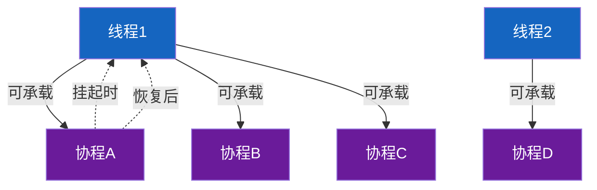

## 2. 核心概念：四大组件速览

> 协程由**四大组件**支撑，理解它们就理解了协程的骨架：
>
> - **CoroutineScope（作用域）** —— 协程的"老板"，划定生命周期，取消时所有子协程一并取消。
> - **CoroutineContext（上下文）** —— 协程的"配置集合"，装着 Job / Dispatcher / Name / ExceptionHandler，按 Key 索引、同类型唯一。
> - **Job（协程句柄）** —— 每个协程的"身份证 + 状态机"，管取消 / join / 父子层级。
> - **Continuation（续体）** —— "挂起点之后的代码"被封装成的对象，resume 即恢复执行；suspend 函数编译后都带它。
>
> 一句话：`Scope` 持有 `Context`，`Context` 里装着 `Job` 与 `Dispatcher`，`suspend` 函数靠 `Continuation` 在挂起/恢复间跳转。

下面 2.1–2.4 对四大组件逐一做源码拆解；上下文内部四类元素（Job/Dispatcher/Name/Handler）的源码原理见第 3 章。

### 2.1 CoroutineScope —— 协程作用域（生命周期边界）

🔍 **源码视角**

```kotlin
public interface CoroutineScope {
    public val coroutineContext: CoroutineContext   // 仅持有一份上下文
}
```

- 几乎是个"空壳接口"，只持有 `CoroutineContext`；价值在于**划定生命周期边界**——`launch`/`async` 都是它的扩展函数，挂在它下的协程成为"子协程"，`scope.cancel()` 沿 `Job` 向下取消全部子孙（结构化并发）。
- 常用：`GlobalScope`（无界、生产慎用）、Android 的 `viewModelScope`/`lifecycleScope`（随组件销毁自动取消）。

### 2.2 CoroutineContext —— 上下文容器

🔍 **源码视角**

```kotlin
public interface CoroutineContext {
    public operator fun <E : Element> get(key: Key<E>): E?   // 按 Key 取元素
    public operator fun plus(context: CoroutineContext): CoroutineContext  // + 运算符
    public interface Element : CoroutineContext { public val key: Key<*> }  // 元素自带 key
}
```

- 像"按 Key 索引的元素集合"（底层 `CombinedContext` 持久化链表）。每个 `Element` 自带 `key`，**同类型只能有一个**，`+` 时后者覆盖前者——故一份上下文里只有一个 `Job`、一个 `Dispatcher`。
- 子协程在父 context 上叠加自己的 `Job` 等元素，既继承父配置又拥有独立身份。

### 2.3 Job —— 协程句柄 / 状态机

🔍 **源码视角**

```kotlin
public interface Job : CoroutineContext.Element {
    public val isActive: Boolean
    public fun cancel(cause: CancellationException? = null)
    public suspend fun join()
    public fun attachChild(child: ChildJob): ChildHandle   // 父子关系靠它建立
}
```

- 真正实现在 `AbstractJob`/`JobSupport`，本质是**状态机**：`New → Active → Completing → Completed`（异常路径 `Cancelling → Cancelled`）。
- 子协程启动时调用父 `Job.attachChild` 注册为子节点；父取消时遍历子列表逐个 `cancel`（取消**自顶向下传播**）；普通 `Job` 子失败会冒泡取消父，`SupervisorJob` 则让子相互独立。

### 2.4 Continuation —— 续体（挂起/恢复的载体）

🔍 **源码视角**

```kotlin
public interface Continuation<in T> {
    public val context: CoroutineContext
    public fun resumeWith(result: Result<T>)   // 恢复入口
}
```

- "挂起点之后的那段代码"被封装成的对象，`resumeWith` 把结果交还、协程从断点继续。运行时由框架创建为 `DispatchedContinuation`（见 3.2）。
- `Dispatcher`（即 `ContinuationInterceptor`）的 `interceptContinuation` 在恢复时把续体包装后投递到目标线程——这是"切线程不阻塞"的衔接点（详见第 6 章）。

💡 **扩展思考：**

> **Q：CoroutineScope、Job、Dispatcher 各自干什么？**  
> A：`Scope` 是"协程的老板"，定义生命周期边界（取消时所有子协程取消）；`Job` 是每个协程的身份证兼状态机，可查询/取消并建立父子层级；`Dispatcher` 决定在哪个线程池跑（`Main`/`IO`/`Default`/`Unconfined`）。三者通过 `CoroutineContext` 组合：`Scope` 持有 `Context`，`Context` 里装着 `Job` 和 `Dispatcher` 等元素。
>
> **Q：CoroutineContext 到底是 Map 还是什么？为什么同类型只能有一个？**  
> A：底层是 `CombinedContext` 持久化链表，按每个 `Element` 自带的 `key` 索引。因为查找靠 `key`，所以**同 key（即同类型）的元素只能存在一个**，`+` 时后者覆盖前者，保证一份上下文只有一个调度器、一个 Job。

## 3. 协程上下文的四大元素（源码级）

> 本章先讲**容器本身** `CoroutineContext` 的源码，再看装在里面的四大 `Element`（Job / Dispatcher / Name / ExceptionHandler）。

🔍 **源码视角**（`CoroutineContext` 接口）

```kotlin
public interface CoroutineContext {
    public operator fun <E : Element> get(key: Key<E>): E?   // 按 Key 取元素
    public fun <R> fold(initial: R, op: (R, Element) -> R): R // 遍历所有元素
    public operator fun plus(context: CoroutineContext): CoroutineContext  // + 运算符
    public fun minusKey(key: Key<*>): CoroutineContext
    public interface Key<E : Element>
    public interface Element : CoroutineContext {
        public val key: Key<*>   // 每个元素自带 key，用于唯一索引
    }
}
```

📊 **`+` 的底层：`CombinedContext` 持久化链表**

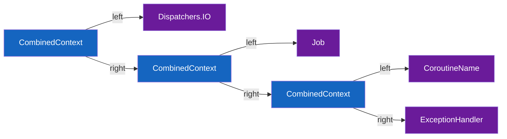

- `A + B` 返回 `CombinedContext(left=A, right=B)`，把两个 context **串成不可变链表**；`get` 沿链表按 `key` 逐个比较、`fold` 遍历。
- **同类型只能有一个**：查找靠 `Element.key`，所以 `scope + Dispatchers.IO + Dispatchers.Default` 后者覆盖前者、`+ CoroutineName("x")` 叠加——顺序无关、同 key 去重。这就是为什么一份上下文里只有一个 Job、一个调度器。
- 子协程在父 context 上叠加自己的 `Job`，既继承父配置又拥有独立身份（衔接 3.1）。

🎯 **为什么是「持久化（不可变）链表」？**

- **不可变 = 天然线程安全 + 父子共享不互相污染**：`+` 不修改原对象，而是返回**新**的 `CombinedContext`。父 Scope 的 context 可以放心"共享"给子协程，子叠加自己的 `Job` 时只生成新链表、父 context 毫发无损——这正是结构化并发能在多线程下安全运作的底层保障。
- **左偏查找、后者（在左）覆盖前者**：`plus` 把新 context 放在 `left`，`get` 从 left 向 right 找，所以**越靠左越优先**。`scope + Dispatchers.Main` 能让 Main 盖掉 scope 里原有的调度器。
- **不同 key 顺序无关、同 key 自动去重**：`A + B` 与 `B + A` 在 key 不冲突时效果一致；同 key 则后者（在左）胜出。

📊 **结构图示**：`ctx = GlobalScope + Dispatchers.IO + CoroutineName("dl")`

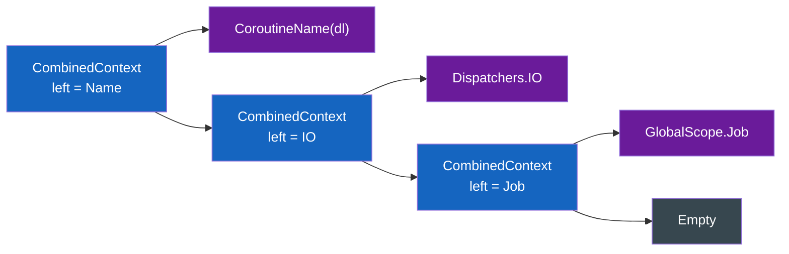

> 每个 `CombinedContext` 节点 = `left`(一个元素) + `right`(剩下的 context)。`get(key)` 从**最左**节点开始、沿 `right` 向下找，命中即返回（如 `get(Job)` 一路走到最末端）。

📊 **不可变（持久化）图示**：`ctx2 = ctx + Dispatchers.Default`

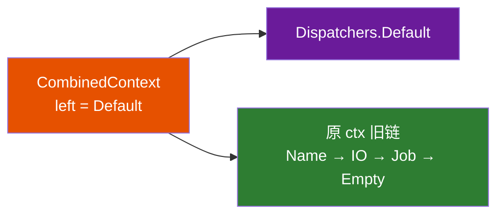

> 只新建「**一个根节点**」`N`，它的 `right` **直接复用原 ctx 的整条旧链**（绿色，不拷贝）。所以原 `ctx` 不变、`ctx[Interceptor]` 仍是 IO；`ctx2[Interceptor]` 从新根左侧就命中 Default（左偏优先）。旧版本被安全保留、新老共享未改动部分 ⇒ 天然线程安全。

### 3.1 Job —— 层级与生命周期的"根节点"

💡 **Job 是什么 / 有什么用？**

`Job` 是**协程的「句柄（handle）」**——它不代表正在跑的代码，而是协程的"身份证 + 遥控器"：拿到 `Job` 就能查看和控制这个协程（`launch` / `async` 返回的就是它）。

📊 **Job 的四大作用**

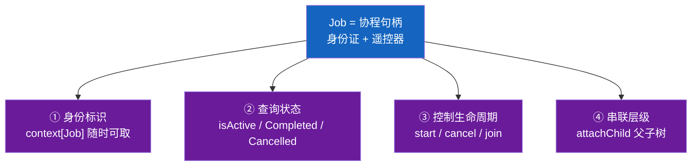

🔍 **源码视角**（`Job` 接口 + `JobSupport` 实现）

```kotlin
public interface Job : CoroutineContext.Element {
    public companion object Key : CoroutineContext.Key<Job>   // 自身即 Key
    public val isActive / isCompleted / isCancelled: Boolean
    public fun start() / cancel() / join() / attachChild(child): ChildHandle
}
internal abstract class JobSupport : Job, ChildJob, ParentJob {
    private val _state = atomic<Any?>(null)   // 仅此一个状态字段
}
```

📊 **状态机：所有生命周期 = 替换 `_state` 这一个原子字段**

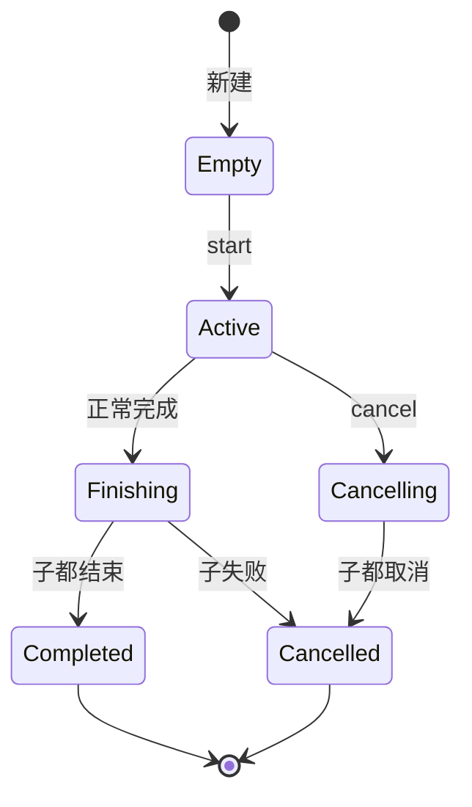

📊 **层级与传播：父子靠 `attachChild` 挂成树，取消向下广播、失败向上冒泡**

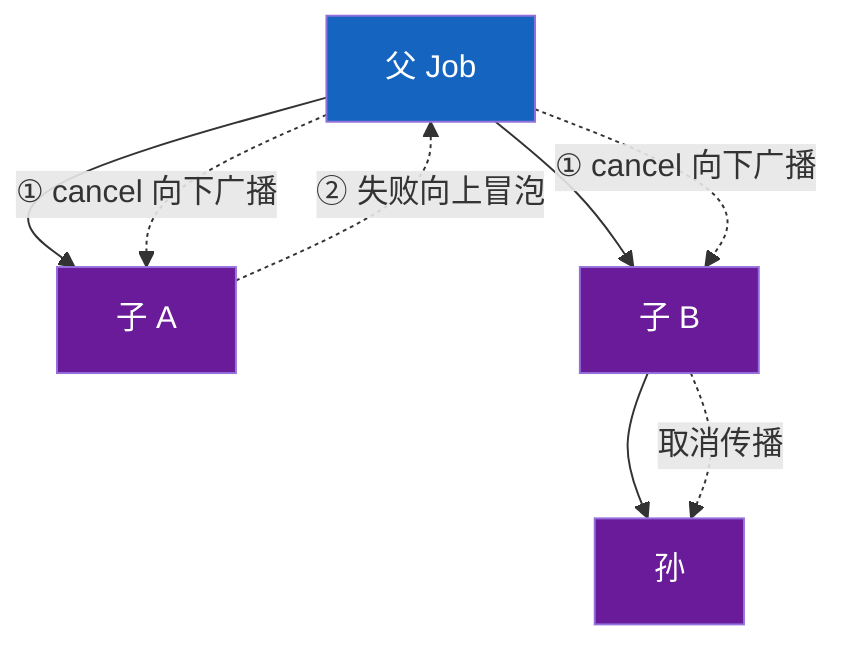

> 两个方向：**①向下**——父 `cancel` 调 `makeCancelling`，沿孩子列表递归 `childCancelled`，所有子孙被取消；**②向上**——子协程失败默认冒泡取消父（连带兄弟）。`SupervisorJob` **只重写 `childCancelled` 返回 false**，阻断 ②：子失败仅取消自己，父/兄弟不受影响（适合"多个独立任务并行，部分失败不影响其他"）。

- `isActive / isCompleted / isCancelled` 是对 `_state` 类型的 `when` 判断，**不是独立字段**（读一个原子量，高效且线程安全）。
- `cancel()` 是**协作式**——只发取消信号，协程真正退出靠挂起点检查 `isActive`（不会强杀线程）；`join()` 则等 `_state` 落到 `Completed/Cancelled`。

🔍 **关键源码 · 取消是怎么发生的？**

```kotlin
// 取消入口
public override fun cancel(cause: CancellationException?) {
    cancelImpl(cause ?: defaultCancellationException())
}

private fun cancelImpl(cause: Throwable?): Boolean {
    val state = makeCancelling(cause)   // CAS 把 _state: Active → Cancelling
    notifyCancelling(state, cause)      // 成功后向下广播
    return true
}

// 向下：遍历 _state 里的孩子列表(NodeList)，逐个通知"父已取消，你也要取消"
private fun notifyCancelling(state: Any?, cause: Throwable) {
    state.children.forEach { child ->
        child.parentCancelled(this)     // → 子的 cancelImpl → 递归向下到孙
    }
}

// 子的响应：父取消，我也取消（向下级联的递归点）
public override fun parentCancelled(parentJob: ParentJob) {
    cancelImpl(parentJob)
}

// 向上：子失败时，经 attachChild 拿到的 ChildHandle 通知父
//   → 父的 childCancelled(child) 决定要不要连带取消自己
// SupervisorJobImpl 只重写这一个方法，就阻断了向上传播：
internal class SupervisorJobImpl(parent: Job?) : JobImpl(parent) {
    override fun childCancelled(child: Job): Boolean = false   // ← 不向上冒泡
}
```

- **取消 = CAS 推进 `_state`**（`Active → Cancelling`），非阻塞、线程安全；成功后 `notifyCancelling` 才向下广播。
- **向下靠 `parentCancelled` 递归**（父→子→孙）；**向上靠 `ChildHandle`→`childCancelled`**——`SupervisorJob` 只把 `childCancelled` 改成返回 `false`，就阻断向上，源码差异极小。
- **`CancellationException` 是"正常取消"的信号**：`cancel(null)` 会造一个默认的；协程代码靠挂起点（`delay`/`yield` 等）检测到取消后抛 `CancellationException` 退出——这就是"协作式"的体现（不会强杀线程）。

💡 **追问**

> **Q：`Job` 为何"既是 Element 又是状态机"？**  
> A：自身 `companion object Key` 让它成为自己的 Key；`launch` 返回的 `Job` 就是 context 里那个同实例，所以对 `Job` 操作 = 对协程操作。
>
> **Q：父协程取消，子协程会怎样？**  
> A：会**一起取消**——取消自顶向下传播（`makeCancelling` 递归 `childCancelled`）。反之，子协程失败默认会**取消父协程**（异常向上冒泡），除非父是 `SupervisorJob`。
>
> **Q：为什么需要 `SupervisorJob`？**  
> A：普通 `Job` 中任一子失败会取消整个父作用域（连带其他健康子协程）；`SupervisorJob` 让子协程**相互独立**，一个失败不影响兄弟（如 UI 同时拉多个接口，一个失败不该全崩）。

### 3.2 CoroutineDispatcher —— 调度器的"拦截器"身份

💡 **调度器是什么 / 怎么工作？**

`CoroutineDispatcher` 决定**协程代码跑在哪个线程**。它的本质是 `ContinuationInterceptor`——在协程每次"恢复"时拦截续体，把它投递到目标线程，从而实现"挂起不阻塞、恢复切线程"。

📊 **工作流程**

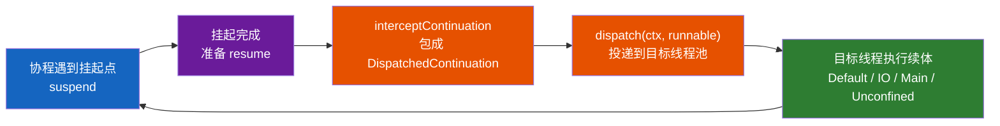

> 把"协程逻辑"和"线程归属"解耦——同一份代码换 Dispatcher 就跑在不同线程，代码不用改。

🔍 **源码视角**

```kotlin
public abstract class CoroutineDispatcher :
    AbstractCoroutineContextElement(ContinuationInterceptor),   // 注意：它以 Interceptor 为 Key 注册
    ContinuationInterceptor {

    public abstract fun dispatch(context: CoroutineContext, block: Runnable)   // 把任务投到线程池
    public open fun isDispatchNeeded(context: CoroutineContext): Boolean = true // 是否需要切线程

    // 每次"续体要被恢复/调度"时，框架先调它把普通续体包一层
    public final override fun <T> interceptContinuation(continuation: Continuation<T>): Continuation<T> =
        DispatchedContinuation(this, continuation)

    public final override fun releaseInterceptedContinuation(continuation: Continuation<*>) { ... }
}
```

- **关键认知：调度器在上下文里不是以 "Dispatcher" 名义存在，而是以 `ContinuationInterceptor` 这个 Key 注册的**（`extends AbstractCoroutineContextElement(ContinuationInterceptor)`）。所以 `context[ContinuationInterceptor]` 取到的就是 Dispatcher。这个命名揭示了它的本质——**拦截续体的恢复**。
- 核心方法 `dispatch(context, block)`：把续体包装成的 `Runnable` 投递到具体线程/线程池。
- `interceptContinuation` 在协程**每次被调度恢复**时被调用，把普通 `Continuation` 包成 `DispatchedContinuation`——这就是"恢复时决定去哪个线程"的钩子（衔接 2.4、第 6 章"切线程不阻塞"）。
- 四个常用实现及其原理：
  - `Dispatchers.Default` → `DefaultScheduler`：背靠 `kotlinx` 的 `SchedulerCoroutineDispatcher`，线程数 = `max(2, CPU 核数)`，专吃 CPU 密集任务。
  - `Dispatchers.IO` → 同样挂在默认调度器之上，但套了一层 `LimitingDispatcher`（上限 **64** 线程的池）——因为 IO 等待时不占 CPU，可多用线程提吞吐。
  - `Dispatchers.Main` → `MainCoroutineDispatcher`：平台桥接（Android 的 `Handler`、Swing/JavaFX 的 EDT），把续体 `post` 回主线程。
  - `Dispatchers.Unconfined` → 覆盖 `interceptContinuation` **直接返回原续体、不做任何调度**；恢复就在调用者当前线程继续，直到遇到下一个挂起点才重新受调度器接管。

🔍 **关键源码 · 运行时 dispatch 到底怎么发生？**

`interceptContinuation` 产出的 `DispatchedContinuation` 才是调度真正落地的地方：

```kotlin
internal class DispatchedContinuation<in T>(
    val dispatcher: CoroutineDispatcher,
    val continuation: Continuation<T>
) : DispatchedTask<T>() {

    // 协程要恢复时走这里
    fun resumeCancellableWith(result: Result<T>) {
        val context = continuation.context
        if (dispatcher.isDispatchNeeded(context))      // ① 默认 true
            dispatcher.dispatch(context, this)         // ② 把自己(Runnable)投到目标线程池
        else
            executeUnconfined(this)                    // ③ Unconfined：当前线程直接跑
    }

    // 被投到目标线程后执行（实现了 Runnable）
    override fun run() {
        continuation.resumeWith(result)                // ④ 真正恢复协程，继续往下执行
    }
}
```

- **4 步串起整个调度**：恢复 → ①问 `isDispatchNeeded` 要不要切线程 → ②`dispatch` 把自己当 `Runnable` 投到线程池 → 线程池调度执行 `run()` → ④调原续体 `resumeWith` 真正往下跑。
- **`isDispatchNeeded` 是 `Unconfined` 的开关**：其他调度器返回 `true`（必须 dispatch 切线程），`Unconfined` 重写为 `false`——所以它"不调度"，恢复就在调用者当前线程继续跑，直到下一个挂起点。
- **`this` 既是续体又是任务**：`DispatchedContinuation` 同时是 `Continuation` 和 `Runnable`，`dispatch` 投递的"任务"就是它自己，目标线程跑的 `run()` 再回调原续体——这就是"挂起不阻塞、恢复切线程"的源码闭环。

📌 **切换调度器的关键 API：`withContext`**

```kotlin
public suspend fun <T> withContext(
    context: CoroutineContext,
    block: suspend CoroutineScope.() -> T
): T        // 切到新 context(通常是换 Dispatcher) 执行 block，结束后切回原 context
```

- `withContext(Dispatchers.IO) { fetch() }` 是"临时切到 IO 线程取数据、再切回"的标准写法——它**挂起当前协程**（不阻塞线程），block 跑完把结果带回原调度器继续；这是日常切线程最常用的入口（比 `launch` 多了"等结果并切回"）。

💡 **追问**

> **Q：`Dispatchers.IO` 和 `Default` 区别？为什么 IO 线程池更大？**  
> A：`Default` 用于 CPU 密集（线程数=核数，多了反而上下文切换开销）；`IO` 用于阻塞型 IO，线程池默认上限 **64**（IO 等待时不占 CPU，可多用线程提吞吐）。`withContext(Dispatchers.IO)` 在不同线程池间切换而不阻塞原线程。
>
> **Q：`withContext` 和 `coroutineScope` 区别？**  
> A：`withContext` 是**切换调度器并等结果**（会切线程，用于"在 IO 上取数据回 Main"）；`coroutineScope` 是**在当前作用域里开子协程并等全部完成**（不切调度器，用于结构化并发聚合多个任务）。
>
> **Q：`Dispatchers.IO` 的 64 个线程和 `Default` 的线程池是同一批物理线程吗？**  
> A：是共享的。`Dispatchers.IO` 底层通过 `LimitingDispatcher` 包装 `Dispatchers.Default` 背后的同一个共享线程池（`CoroutineScheduler`），只是**对"同时处于 IO 任务的线程数"设置了独立上限**（默认 64，可用 `-Dkotlinx.coroutines.io.parallelism` 调整）。这样设计避免了为 IO 单独维护一套线程池的资源浪费，又能防止 IO 密集任务占满所有 CPU 密集任务需要的线程。

### 3.3 CoroutineName —— 调试用的"名字标签"

🔍 **源码视角**

```kotlin
public data class CoroutineName(val name: String) : AbstractCoroutineContextElement(Key) {
    public companion object Key : CoroutineContext.Key<CoroutineName>
    override fun toString(): String = "CoroutineName($name)"
}
```

- 最简单的一个元素：只持有一个 `String`，**完全不参与调度或控制逻辑**，唯一用途是调试——在崩溃栈、`toString()`、`DebugProbes` 中标识协程（如 `launch(CoroutineName("download")) { ... }`）。
- 因为是 `data class`，同名实例 `equals` 相等；但在 context 中仍以"后者覆盖前者"生效（`+` 按 Key 去重）。

### 3.4 CoroutineExceptionHandler —— 顶层异常的"兜底器"

🔍 **源码视角**

```kotlin
public interface CoroutineExceptionHandler : CoroutineContext.Element {
    public companion object Key : CoroutineContext.Key<CoroutineExceptionHandler>
    public fun handleException(context: CoroutineContext, exception: Throwable)
}
```

- 它是**唯一处理"未被捕获异常"的元素**。关键边界：**`handleException` 只在顶层协程（直接由 Scope `launch` 的那个）抛出未捕获异常时被调用**；子协程异常会先取消父，最终由父 Scope 的 Handler 接住（见本节下方「异常传播规则」）。
- 为什么"只在顶层"？因为异常传播路径是：子协程失败 → `Job` 进入 `Cancelling` → 冒泡到父 `Job` → 在**父** `Job` 的 context 中找 `ExceptionHandler`。Handler 挂在 context 上，所以通常只有顶层 Scope 的 Handler 能等到调用（除非 `supervisorScope` 让子独立、各自 Handler 生效）。

📊 **异常具体是怎么"抛"上去的？**

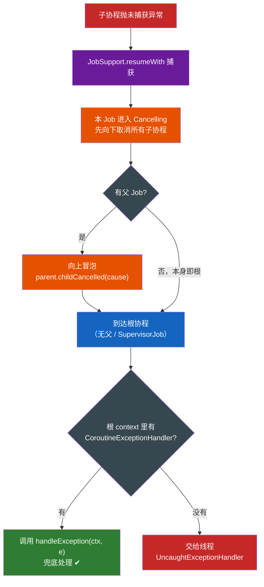

🔍 **关键源码 · 异常怎么一路传播？**

```kotlin
// ① 协程体抛异常 → resumeWith 收到 failure → 进入完成流程
public final override fun resumeWith(result: Result<T>) {
    makeCompleting(result)            // 把 _state 推进到完成/失败
}

// ② 完成流程里若 finalException != null：两个动作同时发生
private fun finalizeFinishingState(state: Finishing, finalException: Throwable?) {
    if (finalException != null) {
        handleJobException(finalException)            // ← 本协程自己处理（launch/async 各异）
        parentHandle?.childCancelled(finalException)  // ← 向上通知父 Job（冒泡的源头）
    }
}

// ③ launch 创建的 StandaloneCoroutine：立即找 Handler 或崩溃
override fun handleJobException(exception: Throwable) {
    handleExceptionViaHandler(context, exception)
    // = context[CoroutineExceptionHandler]?.handleException(ctx, e)
    //   ?: 线程 UncaughtExceptionHandler（崩溃）
}

// ④ async 创建的 DeferredCoroutine：空实现 → 异常暂存进 Deferred，等 await() 才抛
override fun handleJobException(exception: Throwable) { /* 不处理，存进结果 */ }

// ⑤ 向上：parentHandle.childCancelled → 父的 childCancelled(child)
//   普通 Job     : 返回 true  → 父也取消自己，继续冒泡到祖父
//   SupervisorJob: 返回 false → 阻断，不再向上（子失败只取消自己）
```

- **异常处理的两个动作**（都在 `finalizeFinishingState` 里）：①`handleJobException`——本协程自处理（launch 立即找 Handler、async 暂存）；②`parentHandle.childCancelled`——向上通知父。这就是"先向下取消子、再向上冒泡"的源码落地。
- **launch vs async 的源码分叉**：只是 `handleJobException` 一个重写、一个空实现——`launch` 立即上报作用域，`async` 把异常存进 `Deferred` 等 `await()` 抛。
- **冒泡的开关在父的 `childCancelled`**：普通 Job 返回 true 继续、`SupervisorJob` 返回 false 阻断——一行代码决定"一损俱损"还是"各自独立"，和 3.1 Job 的取消广播是同一套机制。

📌 **异常传播规则**（速记）

```text
普通 Job    : 子异常 → 取消父 → 父取消所有子 → 冒泡到根 → 根的 ExceptionHandler 兜底
SupervisorJob: 子异常 → 只影响自己 → 可被自己的 Handler 捕获，不波及兄弟
launch 启动 : 异常立即传播（作用域可见）
async  启动 : 异常暂存，延迟到 await() 才抛
```

💡 **追问**

> **Q：`CoroutineExceptionHandler` 什么时候生效？**  
> A：只在**顶层协程**（由 `CoroutineScope` 直接 `launch` 的那个）且异常未被捕获时触发；子协程异常会先取消父，由父的 Handler 处理。`async` 的异常 `await` 才抛，Handler 也只在顶层。
>
> **Q：如何在协程里正确处理异常？**  
> A：① 业务异常用 `try-catch` 包裹 `await`/`suspend` 调用；② 全局兜底用 `CoroutineExceptionHandler`（挂顶层 Scope）；③ 需要"一损俱损"用默认 `Job`，"各自独立"用 `SupervisorJob`/`supervisorScope`。

📊 **四大上下文元素一览**

| 元素                          | 注册的 Key                     | 核心方法/字段                                | 作用         |
| --------------------------- | --------------------------- | -------------------------------------- | ---------- |
| `Job`                       | `Job`（自身即 Key）              | `isActive` / `cancel()` / `join()`、状态机 | 层级、取消、生命周期 |
| `CoroutineDispatcher`       | `ContinuationInterceptor`   | `dispatch()`、`interceptContinuation()` | 决定恢复时去哪个线程 |
| `CoroutineName`             | `CoroutineName`             | `name: String`                         | 仅调试标识      |
| `CoroutineExceptionHandler` | `CoroutineExceptionHandler` | `handleException()`                    | 顶层未捕获异常兜底  |

💡 **扩展思考：**

> **Q：调度器在上下文里到底叫什么 Key？为什么叫 `ContinuationInterceptor`？**  
> A：Dispatcher 在 context 中以 `ContinuationInterceptor` 为 Key 注册（它 `extends AbstractCoroutineContextElement(ContinuationInterceptor)`）。用"拦截器"命名，是因它的职责是**拦截续体的恢复**——`resume` 发生时先把续体重新 dispatch 到目标线程，这正是"切线程却不阻塞原线程"的底层机制。
>
> **Q：CoroutineName / ExceptionHandler 会影响协程行为吗？**  
> A：`Name` 纯调试、零行为影响；`ExceptionHandler` 只影响"顶层未捕获异常"的归宿（决定崩在谁手里），不改变取消传播规则（子失败照样取消父）。
>
> **Q：context 里同类型只能有一个，Job 和 Dispatcher 为什么不会互相覆盖？**  
> A：因为它们的 Key 不同（`Job` vs `ContinuationInterceptor`）。`+` 是按 Key 去重的，Key 不同就是两个独立元素，共存于 `CombinedContext` 链表；只有"同 Key 的新元素"才会替换旧的。

## 4. 启动协程：launch / async / runBlocking

> 协程三件套：`launch` 发射、`async` 求值、`runBlocking` 桥接阻塞。

📊 **三者对比**

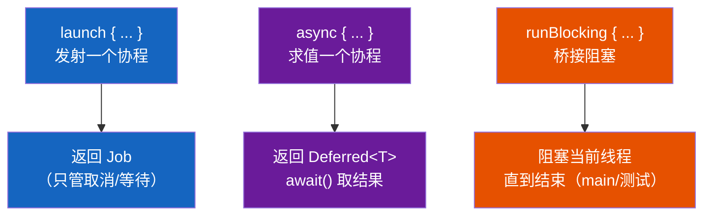

🔍 **源码签名**

```kotlin
// launch：启动并"忘记"，返回 Job
public fun CoroutineScope.launch(
    context: CoroutineContext = EmptyCoroutineContext,
    start: CoroutineStart = CoroutineStart.DEFAULT,
    block: suspend CoroutineScope.() -> Unit
): Job

// async：启动并"求值"，返回 Deferred<T>（带结果的 Job）
public fun <T> CoroutineScope.async(
    context: CoroutineContext = EmptyCoroutineContext,
    start: CoroutineStart = CoroutineStart.DEFAULT,
    block: suspend CoroutineScope.() -> T
): Deferred<T>          // Deferred 继承 Job，多一个 await()

// runBlocking：阻塞当前线程直到内部协程跑完（桥接阻塞世界 ↔ 协程世界）
public fun <T> runBlocking(
    context: CoroutineContext = EmptyCoroutineContext,
    block: suspend CoroutineScope.() -> T
): T
```

💡 **典型用法**

```kotlin
// 1) launch：fire-and-forget，做一件事（如刷新 UI、打日志）
scope.launch { refreshUi() }

// 2) async + await：并发求多个值，再合并
scope.launch {
    val a = async { fetchUser() }      // 同时发起
    val b = async { fetchOrders() }
    val combined = "${a.await()} ${b.await()}"   // 两个 await 都到才继续
}

// 3) runBlocking：main 函数 / 单元测试里把阻塞线程接到协程
fun main() = runBlocking {       // 阻塞主线程，直到内部协程结束
    launch { delay(1000); println("A") }
    println("B")                 // 输出: B, 然后 A
}
```

📌 **关键认知**

- `Deferred<T>` 是"`Job` + 一个结果"——继承 `Job`（能 cancel/join），多了 `await()` 拿返回值；`await()` 本身是 suspend，结果未就绪时挂起当前协程（不阻塞线程）。
- **并发靠多个 async**：`async` 一调用就启动（默认），不必等 `await`；多个 `async` 一起 `await` 即并行，`awaitAll(a, b)` 等全部完成。
- **runBlocking 是"桥接器"不是"调度器"**：它阻塞调用线程，只在 `main()` / 测试用；**不要在协程内部调 `runBlocking`**（会阻塞协程所在线程、可能死锁），生产协程代码用 `coroutineScope { }` 代替。
- **异常时机差异**：`launch` 块内异常立即上报作用域（走 3.4 异常处理）；`async` 块内异常暂存、到 `await()` 才抛（除非 `supervisorScope`）。

💡 **扩展思考：**

> **Q：launch 和 async 的区别？**  
> A：`launch` 启动一个"不返回结果"的协程（拿 `Job` 管取消），异常会立即上报作用域；`async` 返回 `Deferred`（轻量 `Future`），需 `await()` 取结果，适合**并行**计算。多个 `async` 同时 `await` 可并发执行。
>
> **Q：async 的异常什么时候抛出？**  
> A：`async` 块内异常**不会立即抛出**，而是暂存，等到 `await()` 时才抛出（除非用 `CoroutineExceptionHandler` 或 `supervisorScope`）。这也是"用 launch 还是 async 取决于是否要结果"。
>
> **Q：Deferred 和 Job 的关系？多个 async 怎么并发？**  
> A：`Deferred<T>` 继承 `Job`，多了 `await()` 取结果——所以 `Deferred` 既能 cancel/join（Job 的能力）又能拿返回值。并发：多个 `async` 同时启动（默认立即跑），再一起 `await` 或 `awaitAll(list)` 等全部完成；它们共享父作用域的 Dispatcher。
>
> **Q：coroutineScope 和 launch 新开一个协程有什么区别？**  
> A：`coroutineScope { }` 本身是 `suspend` 函数，**不新建 Job 意义上的独立协程**（它复用调用者的协程上下文，但会创建一个新的子 `Job` 用于内部协程的结构化管理），它会**挂起当前协程直到内部所有子协程都完成**，且内部任何子协程异常会立即取消整个 `coroutineScope` 并向外抛出（不需要额外 `join`）。而 `launch` 是"发射后不管"，需要显式 `join()` 才能等待完成。`coroutineScope` 常用于"把多个并发子任务的结果聚合成一个返回值"的场景。

## 5. 协程的四种启动模式（CoroutineStart）

> 第 4 章讲 `launch/async` 时只用了默认启动，其实 `start` 参数有四种取值——它决定"协程**何时真正被调度执行**"以及"**取消的边界在哪**"。这是很容易被忽略却十分关键的细节。

🔍 **源码视角 · `CoroutineStart` 枚举**

```kotlin
public enum class CoroutineStart {
    DEFAULT,        // 创建后立即按 Dispatcher 入队调度（不保证立刻执行）
    LAZY,           // 懒启动：首次需要其结果时才调度
    ATOMIC,         // 类似 DEFAULT，但启动不可被取消（至少调度一次）
    UNDISPATCHED    // 立即在【当前调用线程】同步执行，直到第一个挂起点
}
```

- **DEFAULT**：创建即向 `Dispatcher` 提交任务，由调度器决定真正运行时机（可能稍后）。
- **LAZY**：创建后处于 `New` 状态，**不调度**；直到有人需要它（`start()` / `await()` / `join()` / `receive()`）才调度。等同于"按需启动"，可省掉无谓开销。
- **ATOMIC**（Kotlin 1.4+）：与 `DEFAULT` 一样立即调度，但**保证在第一个挂起点之前不会被取消**——即使创建后马上 `cancel()`，协程也至少进入执行一次。用于"启动动作本身不能被取消打断"的场景。
- **UNDISPATCHED**：不经 `Dispatcher` 调度，**直接在当前线程同步跑**，直到遇到第一个挂起点才把后续交给调度器。常用于测试或需要"即刻执行"的场合。

| 模式             | 调度时机      | 创建即执行？        | 首个挂起点前能否取消    | 典型场景         |
| -------------- | --------- | ------------- | ------------- | ------------ |
| `DEFAULT`      | 创建即入队     | 否（等调度器）       | 可以            | 绝大多数默认场景     |
| `ATOMIC`       | 创建即入队     | 否（等调度器）       | **否**（至少调度一次） | 需保证启动不被取消打断  |
| `LAZY`         | 首次需要结果才调度 | 否             | 触发前可以         | 结果可能不需要、延迟启动 |
| `UNDISPATCHED` | 当前线程同步执行  | **是**（跑到首个挂点） | 首个挂点前可（同线程）   | 测试、需即刻执行     |

💡 **示例 1：DEFAULT vs LAZY（按需触发）**

```kotlin
import kotlinx.coroutines.*

fun main() = runBlocking {
    val d = launch(start = CoroutineStart.DEFAULT) {
        println("DEFAULT 执行，线程=${Thread.currentThread().name}")
    }
    val l = async(start = CoroutineStart.LAZY) {
        println("LAZY 执行，线程=${Thread.currentThread().name}")
        42
    }
    println("启动后、await 前")
    l.await()          // 这里才真正触发 LAZY 协程
    d.join()
}
// 输出顺序: 启动后、await 前 → DEFAULT 执行 → LAZY 执行
// 要点: LAZY 在 await() 之前根本没运行，省掉无谓开销
```

💡 **示例 2：UNDISPATCHED（当前线程同步跑到首个挂点）**

```kotlin
fun main() = runBlocking {
    launch(Dispatchers.IO, start = CoroutineStart.UNDISPATCHED) {
        println("起点，线程=${Thread.currentThread().name}")   // 调用者线程（runBlocking 所在）
        delay(100)                                            // 第一个挂起点：从此处才交给 IO 线程
        println("delay 后，线程=${Thread.currentThread().name}") // IO 线程
    }.join()
}
// 要点: 绕过了 Dispatcher，在调用者线程"先同步跑一段"，遇到挂起点才切走
```

💡 **示例 3：ATOMIC 的"不可取消"语义**

```kotlin
fun main() = runBlocking {
    val job = launch(start = CoroutineStart.ATOMIC) {
        println("ATOMIC 协程开始执行")     // 即使下面立刻 cancel，这行仍然会打印
        delay(100)                         // 首个挂起点：此处才会响应取消
        println("这一行不会打印（已被取消）")
    }
    job.cancel()       // 在协程真正挂起前取消
    job.join()
}
// 输出: ATOMIC 协程开始执行（取消没能阻止首个挂起点前的执行）
```

📊 **四种启动模式调度时序**

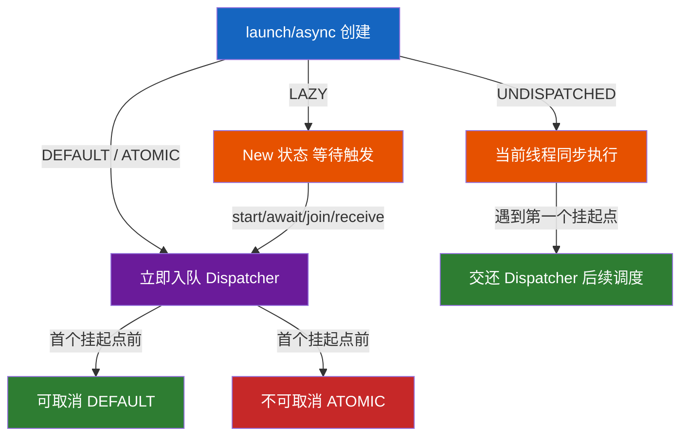

💡 **扩展思考：**

> **Q：什么场景该用 LAZY？**  
> A：当协程的结果"可能根本不需要"时（如缓存预热、条件性计算、被多个下游共享但只有部分会用到），用 LAZY 避免无谓启动开销；也便于手动控制生命周期。
>
> **Q：DEFAULT 和 ATOMIC 到底差在哪？**  
> A：若协程在 `start` 之前就被 `cancel()`，`DEFAULT` 可能完全不执行；`ATOMIC` 保证至少调度一次、首个挂起点前取消不生效。
>
> **Q：UNDISPATCHED 有什么坑？**  
> A：它绕过 `Dispatcher`，在调用者线程同步执行直到首个挂起——若调用线程是 UI/主线程，会出现"主线程里跑了协程代码"的假象，调试易混淆；因此多用于测试而非生产。
>
> **Q：LAZY 的协程怎么被触发？**  
> A：`start()` 显式启动、`async` 的 `await()`、`Job` 的 `join()`、作为接收端的 `receive()` 等"首次需要其完成/结果"的操作都会触发。

> 四种模式可概括为两个维度：**何时调度**（创建即调度 / 按需 / 当前线程同步）与**取消边界**（首个挂起点前能否取消）。把这两点讲清，启动模式就答透了。

## 6. 挂起与恢复原理（反编译剖析）

> 💡 **先记住两句核心结论**（本节所有反编译细节都是在证明它们）：
> - **挂起 = 方法的 `return`**：方法体编译后返回 `COROUTINE_SUSPENDED` 就直接退出，控制权交还调度器、线程被释放。
> - **恢复 = 方法被再次调用（callback）**：`resumeWith` → `invokeSuspend` → 状态机凭 `label` 跳回断点续跑。
>
> `return` 和 `callback` 都是编译器悄悄插入的，Kotlin 源码里完全看不出来。本节用同一个例子，从"编译器改写了什么"一路讲到"协程怎么创建/挂起/恢复"。

```kotlin
// 贯穿全节的例子
suspend fun requestUserInfo(): String {   // 被调用的挂起函数
    delay(2000)
    return "result from userInfo"
}
fun getData() {                            // 协程的创建者
    lifecycleScope.launch {
        val result = requestUserInfo()    // ← 挂起点
        tvName.text = result               // ← 恢复后继续
    }
}
```

### 6.1 `suspend` 函数编译后长什么样

反编译 `requestUserInfo` 的**签名**：

```java
@Nullable
Object requestUserInfo(@NotNull Continuation completion);   // String→Object；多了 Continuation 参数
```

- **多一个 `Continuation` 参数**：编译器在调用处**悄悄传入调用方自己的续体**（`requestUserInfo()` 被改写成 `requestUserInfo(this)`）。这正是挂起函数**只能在协程/挂起函数里调用**的原因——只有那里才有续体可传，一路传下去就形成 `completion` 链。
- **返回值变 `Object` 且可空**：可能是真实结果，也可能是挂起信号 `COROUTINE_SUSPENDED`（此时值为 `null`）。

`Continuation` 本质就是**协程的 Callback**——和 Retrofit 的 `Callback` 一一对应：

```kotlin
public interface Continuation<in T> {
    public val context: CoroutineContext
    public fun resumeWith(result: Result<T>)   // ≈ onResponse/onFailure 的合并版
}
```
`resume(value)` ≈ `onResponse`；`resumeWithException(e)` ≈ `onFailure`。区别只是 `Continuation` 由编译器自动传递，让异步代码能写成同步形式。它还带着 `context`（`Job`/`Dispatcher` 等），所以挂起函数天然继承外层协程的调度器与取消能力。

### 6.2 挂起原理：反编译 `requestUserInfo`

```java
public final Object requestUserInfo(@NotNull Continuation completion) {
   Object continuation = new ContinuationImpl(completion) {
       Object result; int label;                       // label 初始 0
       public final Object invokeSuspend(@NotNull Object $result) {
          this.result = $result;
          return requestUserInfo(this);                 // ← 恢复时"回到断点"的关键：再调自己
       }
    };
   Object $result = (continuation).result;
   Object SUSPENDED = IntrinsicsKt.getCOROUTINE_SUSPENDED();
   switch (continuation.label) {                        // 状态机：第一次 case0，恢复后 case1
       case 0:
          continuation.label = 1;
          Object delay = DelayKt.delay(2000L, continuation);
          if (delay == SUSPENDED) return SUSPENDED;      // 挂起：直接 return，方法暂停
          break;
       case 1:
          ResultKt.throwOnFailure($result);
          break;
   }
   return "result from userInfo";
}
```

**挂起的真相只有一句话**：`case 0` 里 `delay()` 返回 `SUSPENDED`，方法就 `return`——方法执行被结束，协程也就被挂起了。**协程挂起 = 方法挂起 = return。**

📌 `suspend` 修饰 ≠ 一定挂起：只有方法体编译后**真的返回了 `COROUTINE_SUSPENDED`** 才会挂起（如 `delay(0)` 就直接返回真实值，不挂起）。这个信号来自挂起函数内部的 CAS：`trySuspend()` 把状态从 `UNDECIDED` 改成 `SUSPENDED` 成功后，`getResult()` 才返回它。

### 6.3 恢复原理：`resumeWith` 循环

`delay(2000)` 到期后回调 `continuation.resumeWith(result)` → 调 `invokeSuspend()` → 再调 `requestUserInfo(this)`，此时 `label` 已是 1，直接进 `case 1` 拿到真实结果——**重新被执行 = 方法被恢复**。

驱动这一切的引擎是 `BaseContinuationImpl.resumeWith`（一个循环，因为挂起函数可能嵌套多层，内层恢复要自动带动外层继续跑）：

```kotlin
public final override fun resumeWith(result: Result<Any?>) {
    var current = this; var param = result
    while (true) {
        val completion = completion!!
        val outcome = try { invokeSuspend(param) } catch (e: Throwable) { Result.failure(e) }
        if (outcome == COROUTINE_SUSPENDED) return          // 又挂起：退出循环，线程释放
        if (completion is BaseContinuationImpl) {            // 还有外层挂起函数：继续驱动它恢复
            current = completion; param = Result.success(outcome)
        } else {                                              // 到达协程体本身：恢复外层协程/Job
            completion.resumeWith(outcome); return
        }
    }
}
```

以本节例子走一遍：`delay` 完成 → `invokeSuspend` 让 `requestUserInfo` 从 `case 1` 返回结果 → 循环发现还有外层（`launch` 协程体），继续用这个结果驱动协程体的 `invokeSuspend` → 协程体执行 `tvName.text = result` 后返回 `Unit` → 外层已是协程本体（非 `BaseContinuationImpl`）→ `completion.resumeWith(Unit)` 通知协程结束。

📊 **协程的恢复 = 方法的恢复**：`resumeWith` → `invokeSuspend` → 再调方法本身（callback 回调的底层实现），`while(true)` 保证内层恢复能一路驱动到最外层跑完。

### 6.4 协程怎么创建、启动

`launch` 做的事：合成新的 `CoroutineContext`，创建协程体（`StandaloneCoroutine`），再调 `start` 真正执行：

```kotlin
// launch 简化版
val coroutine = StandaloneCoroutine(newCoroutineContext(context), active = true)
coroutine.start(start, coroutine, block)   // block = suspend { requestUserInfo(); tvName.text = result }

// start 内部三步（AbstractCoroutine.start → startCoroutineCancellable）：
createCoroutineUnintercepted(receiver, completion)   // ① 把协程体 lambda 创建成 Continuation<Unit>
    .intercepted()                                    // ② 加调度拦截（DispatchedContinuation）
    .resumeCancellableWith(Result.success(Unit))      // ③ 启动：调 resumeWith，协程开跑
```

这里有**两个 `Continuation`，容易搞混**，方向正好相反：

| | `completion`（传进来的） | `Continuation<Unit>`（`create` 出来的） |
| --- | --- | --- |
| 角色 | **回调目标**：协程跑完后结果交给谁 | **执行载体**：真正跑协程体代码的状态机对象 |
| 来源 | `coroutine.start(...)` 传入的 `this`（即 `AbstractCoroutine` 自己） | `create(completion)` 新建，编译器把协程体 lambda 生成的 `SuspendLambda` 子类，`completion` 存为它的字段 |
| 何时用到 | `resumeWith` 循环最后一步 `completion.resumeWith(outcome)` | 第一个被 `resumeCancellableWith` 驱动执行的对象，协程从它"开跑" |

`create(completion)` 生成的类反编译出来大致是这样（`GetData$1` 对应 `getData()` 里的 `launch` lambda）：

```java
final class GetData$1 extends SuspendLambda implements Function2<CoroutineScope, Continuation, Object> {
    int label;                                       // 状态机标签
    public final Continuation create(Object v, Continuation completion) {
        return new GetData$1(completion);            // completion 存进字段（继承自 BaseContinuationImpl）
    }
    public final Object invokeSuspend(Object result) {
        switch (label) {
            case 0:
                label = 1;                            // 先切 label 再跑，防止同步返回时重入 case0
                Object r = requestUserInfo(this);     // 把"自己"当续体传给挂起函数
                if (r == COROUTINE_SUSPENDED) return COROUTINE_SUSPENDED;
                // 未挂起则直落 case 1
            case 1:
                tvName.setText((String) result);      // 恢复后：真正的业务代码
                return Unit.INSTANCE;
        }
    }
}
```

`GetData$1` 就是**协程的"活体"**——一个携带 `label` 状态、被 `resumeWith` 循环反复喂入执行的有状态对象；`this` 直接当续体传给 `requestUserInfo`，所以挂起函数完成时知道"回调谁"。它的驱动方式与 6.3 完全一致：第一次 `invokeSuspend` 在 `case 0` 挂起、线程释放；`delay` 完成后同一个对象带着 `label=1` 被再次 `invokeSuspend`，执行完业务代码返回 `Unit`。

**局部变量去哪了？** 编译器把跨挂起点存活的局部变量**提升为状态机对象的字段**（而不是留在调用栈上）——这就是常说的"栈在堆上"：挂起时线程释放、方法退出，但对象不销毁，字段都还在，恢复时原样可用。

**继承链**：`SuspendLambda → ContinuationImpl → BaseContinuationImpl → Continuation`；`resume()` 的真正实现就是 6.3 的 `resumeWith` 循环。**三层包装**：① `completion`（协程本体）→ ② `create()` 包成 `SuspendLambda`（状态机）→ ③ `intercepted()` 包成 `DispatchedContinuation`（加调度）。执行时从外到内：③ 触发 `resumeWith` 循环 → ② `invokeSuspend` 开跑 → 跑完回调 ①。

### 6.5 全流程图

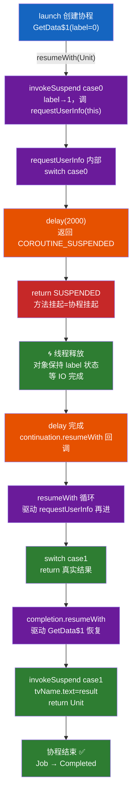

📌 **关键认知（5 条）**

- **挂起 = return**：方法体编译后返回 `COROUTINE_SUSPENDED` 就退出——不是"线程阻塞"，是"方法退出"。
- **恢复 = callback 回调**：`resumeWith` → `invokeSuspend` → 再调方法本身，`label` 当书签跳回断点。
- **`invokeSuspend` 里"又调一次自己"**：状态机对象保存了 `label` 和局部变量字段，重进时按 `label` 跳分支，这就是"回到断点"的机制。
- **`suspend` 修饰 ≠ 一定挂起**：要方法体编译后真返回 `COROUTINE_SUSPENDED` 才挂起。
- **局部变量跨挂起存活**：被提升为状态机对象的字段而非调用栈——"栈在堆上"。

💡 **追问**

> **Q：为什么说"挂起本质是 return"？**  
> A：反编译看，挂起函数内部是 `switch(label)` 状态机；挂起函数返回 `COROUTINE_SUSPENDED` 时 `case 0` 直接 `return`——方法执行被 return 结束，协程挂起只是方法挂起的外在表现。
>
> **Q：为什么挂起函数只能在协程/挂起函数里调用？**  
> A：调用挂起函数需要传一个 `Continuation`（callback），这个参数是编译器从"当前协程/外层挂起函数"那里悄悄取的——普通函数没有 Continuation 可传。
>
> **Q：`label` 为什么要"先切再跑"（`invokeSuspend` 第一行就把 label 从 0 改成 1）？**  
> A：防止重入。若先跑挂起函数、再切 label，一旦挂起函数**同步返回**（没有真正挂起），恢复流程可能已经触发下一轮 `invokeSuspend`，此时 label 还是 0 会导致 `case 0` 被重复执行；先切后跑，即使同步返回也会正确落到 `case 1`。
>
> **Q：`completion` 和 `Continuation<Unit>` 到底谁是谁？**  
> A：`completion` 是"跑完了通知谁"（回调目标，即协程本体）；`Continuation<Unit>` 是"谁在跑"（执行载体，即协程体编译出的 `SuspendLambda`）。载体内部用字段持有本体，跑完后调本体的 `resumeWith` 把结果交回去——两者是同一对象图上的两个节点，不是同一个东西。

## 7. 协作式取消与资源清理

💡 **一句话**：Kotlin 协程的取消是**协作式（cooperative）**的——`cancel()` 只是给 `Job` 打上"要取消"的标记，协程代码必须**主动检查并配合退出**，框架不会像线程 `stop()` 那样强行杀死正在执行的代码。这意味着"写了取消逻辑不代表真的能取消"，是实战中极易踩坑的地方。

🔍 **源码解析 · 挂起函数如何"感知"取消**

```kotlin
// delay、yield 等标准库挂起函数内部都会检查协程是否已取消
public suspend fun delay(timeMillis: Long) {
    if (timeMillis <= 0) return
    return suspendCancellableCoroutine { cont ->
        // 注册一个定时任务，到期后 resume；若协程被取消，会调用 cont.cancel() 提前结束
        cont.invokeOnCancellation { /* 取消定时任务，避免内存泄漏 */ }
        scheduleResumeAfterDelay(timeMillis, cont)
    }
}
```
- **挂起点是取消的"检查哨"**：`delay`/`yield`/`withContext` 等所有标准挂起函数在挂起或恢复时都会检查 `Job` 状态，若已取消，会直接抛出 `CancellationException` 让协程结束，而不是继续往下跑。
- **`CancellationException` 是"正常流程"，不是错误**：协程框架会**忽略**它、不会把它当异常上报（不会触发 `CoroutineExceptionHandler`），这是取消能"悄悄"完成的关键。

🔍 **常见的"取消不生效"陷阱：纯计算循环没有挂起点**

```kotlin
// ❌ 错误：这个循环里没有任何挂起函数调用，job.cancel() 完全不起作用，会死循环！
val job = launch(Dispatchers.Default) {
    var i = 0
    while (i < Int.MAX_VALUE) {
        i++   // 纯 CPU 计算，没有挂起点，取消信号永远没机会被检查
    }
}
job.cancel()   // 无效！协程根本不知道自己被取消了

// ✅ 正确写法一：定期检查 isActive（属于当前协程的扩展属性，来自 CoroutineScope）
val job2 = launch(Dispatchers.Default) {
    var i = 0
    while (isActive && i < Int.MAX_VALUE) {   // 每次循环检查一次
        i++
    }
}

// ✅ 正确写法二：用 ensureActive()（检查失败直接抛 CancellationException，语义更明确）
val job3 = launch(Dispatchers.Default) {
    var i = 0
    while (i < Int.MAX_VALUE) {
        ensureActive()    // Job 已取消则立即抛异常退出，比 if(!isActive) break 更简洁
        i++
    }
}

// ✅ 正确写法三：定期调用 yield()（既检查取消，又让出线程给其他协程，纯 CPU 循环首选）
val job4 = launch(Dispatchers.Default) {
    var i = 0
    while (i < Int.MAX_VALUE) {
        yield()   // 挂起点：检查取消 + 给其他协程执行机会
        i++
    }
}
```

🔍 **资源清理：`finally` + `NonCancellable`**

```kotlin
val job = launch {
    try {
        repeat(5) { i ->
            println("工作中 $i")
            delay(500)     // 挂起点，会响应取消并抛 CancellationException
        }
    } finally {
        // ⚠️ finally 块里再调挂起函数会立即失败！因为协程已经处于"取消中"状态
        // println(withContext(Dispatchers.IO) { "清理" })   // ❌ 抛 CancellationException，清理不完整

        // ✅ 正确：用 NonCancellable 包裹，让这段清理逻辑"免疫"取消，保证执行完
        withContext(NonCancellable) {
            delay(100)                     // 这里的 delay 不会被取消打断
            println("资源清理完成")
        }
    }
}
delay(1200)
job.cancelAndJoin()
```
- **陷阱**：协程被取消后，其 `Job` 已经处于 `Cancelling` 状态，此时在 `finally` 里调用普通挂起函数会**立即**抛出 `CancellationException`（因为挂起点检测到"我所在的协程已取消"），导致清理逻辑本身执行不完整。
- **解决**：用 `withContext(NonCancellable) { ... }` 包裹清理代码——`NonCancellable` 是一个特殊的 `Job` 实现，它永远处于"活跃"状态，让内部挂起函数不再检测到取消信号，从而保证清理逻辑能完整跑完。

📊 **协作式取消的完整链路**

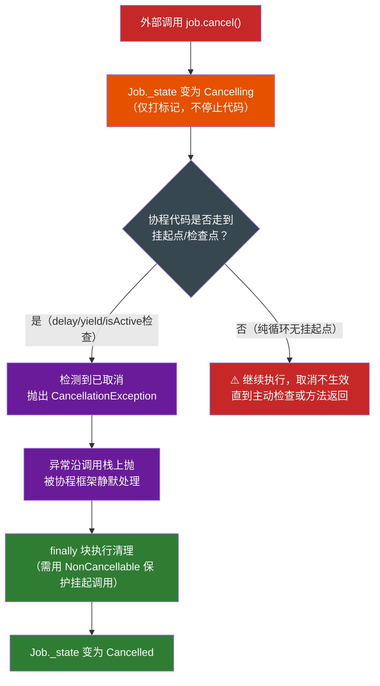

💡 **扩展思考：**

> **Q1：为什么说协程的取消是"协作式"的？和线程的 `interrupt()` 有什么共通点？**  
> A：`cancel()` 本质只是把 `Job` 的状态推进到 `Cancelling`，**不会主动打断正在执行的代码**；真正的退出依赖协程代码自己在挂起点（`delay`/`yield`/`withContext`）或显式检查（`isActive`/`ensureActive`）时发现"我被取消了"并结束执行。这与 Java 线程的 `interrupt()`（只是设置中断标志，需要代码自己检查 `isInterrupted()` 或响应 `InterruptedException`）设计哲学完全一致——**都不是"强杀"，而是"打招呼后等对方自己收工"**，避免了强制终止导致的资源/状态不一致问题。
>
> **Q2：一个纯 CPU 密集的 while 循环协程为什么 cancel() 不起作用？怎么修复？**  
> A：因为循环体内没有任何挂起点或取消检查——`cancel()` 只是改了 `Job` 的状态位，但没有代码去读这个状态位，协程会跑到自然结束（或死循环）才停。修复方式三选一：① 定期检查 `isActive`（`CoroutineScope` 的扩展属性）在为 false 时主动 `break`/`return`；② 定期调用 `ensureActive()`，取消时自动抛异常退出；③ 如果循环允许被"打断执行权"（不是纯计算而是可以让别的协程先跑），用 `yield()` 既检查取消又释放执行权，是 CPU 密集任务里最推荐的写法。
>
> **Q3：为什么 `finally` 块里直接调用挂起函数会有问题？怎么正确清理资源？**  
> A：`cancel()` 之后协程的 `Job` 已经是 `Cancelling`/`Cancelled` 状态，此时 `finally` 块里调用任何标准挂起函数（如 `delay`、`withContext(Dispatchers.IO)`）都会在其内部的取消检查点**立即**抛出 `CancellationException`，导致清理代码本身跑不完（比如网络连接没关掉、文件没写完）。正确做法是把需要"无论如何都要跑完"的清理逻辑包在 `withContext(NonCancellable) { ... }` 里，`NonCancellable` 让这段代码内的挂起函数不再检测取消状态。
>
> **Q4：`CancellationException` 是不是意味着协程"出错"了？会触发 `CoroutineExceptionHandler` 吗？**  
> A：不会。`CancellationException` 被协程框架视为**正常的取消流程信号**，不是真正的错误——它会沿调用栈往上抛，但在到达 `Job` 的异常处理逻辑时会被识别并**静默忽略**（不会调用 `CoroutineExceptionHandler`，也不会让父协程"失败"，只会让父协程正常记录这个子协程已完成/取消）。但要注意：如果你在 `catch (e: Exception)` 里把 `CancellationException` 也吞掉不重新抛出，会导致协程取消这个"信号"传不出去，破坏结构化并发的取消传播——**捕获异常时应该让 `CancellationException` 继续往外抛**（`catch (e: CancellationException) { throw e }` 或只 catch 具体的业务异常类型）。

## 8. 回调转协程：suspendCancellableCoroutine

💡 **一句话**：`suspendCancellableCoroutine` 是把**传统回调风格 API（如网络库的 Callback、Android 的 `ActivityResultLauncher`）包装成挂起函数**的标准桥接工具——本质是"手动创建一个 `Continuation`，在回调触发时手动 `resume`"，是理解协程与非协程世界如何互通的关键。

🔍 **源码解析 · 函数签名与核心语义**

```kotlin
public suspend inline fun <T> suspendCancellableCoroutine(
    crossinline block: (CancellableContinuation<T>) -> Unit
): T
```
- `block` 里拿到一个 `CancellableContinuation<T>`（比普通 `Continuation` 多了取消支持），在里面注册回调，回调触发时手动调用 `continuation.resume(value)` 或 `continuation.resumeWithException(e)`。
- 这个函数本身会**挂起当前协程**，直到 `resume`/`resumeWithException` 被调用——正是"挂起点"与 6.2 反编译剖析里 `delay()` 的实现如出一辙（`delay` 内部就是用它实现的）。

🔍 **实战：把 Retrofit/OkHttp 的 Callback 包装成挂起函数**

```kotlin
// 传统回调风格的第三方 API（假设无法直接改造）
interface LegacyApi {
    fun fetchUser(id: String, callback: Callback)
    interface Callback {
        fun onSuccess(user: User)
        fun onError(e: Exception)
    }
}

// 包装成挂起函数：调用方可以用同步写法直接拿结果
suspend fun LegacyApi.fetchUserSuspend(id: String): User =
    suspendCancellableCoroutine { continuation ->
        fetchUser(id, object : LegacyApi.Callback {
            override fun onSuccess(user: User) {
                continuation.resume(user)                 // 成功：恢复协程，带回结果
            }
            override fun onError(e: Exception) {
                continuation.resumeWithException(e)       // 失败：恢复协程，抛出异常
            }
        })
        // 关键：注册取消回调，协程被取消时同步取消底层的网络请求，避免资源泄漏
        continuation.invokeOnCancellation {
            cancelLegacyRequest(id)   // 假设 API 提供了取消方法
        }
    }

// 调用方直接用同步写法拿结果，无需处理回调地狱
suspend fun loadProfile(id: String) {
    val user = legacyApi.fetchUserSuspend(id)   // 挂起等待，代码线性、可读
    println(user.name)
}
```

📊 **suspendCancellableCoroutine 工作原理**

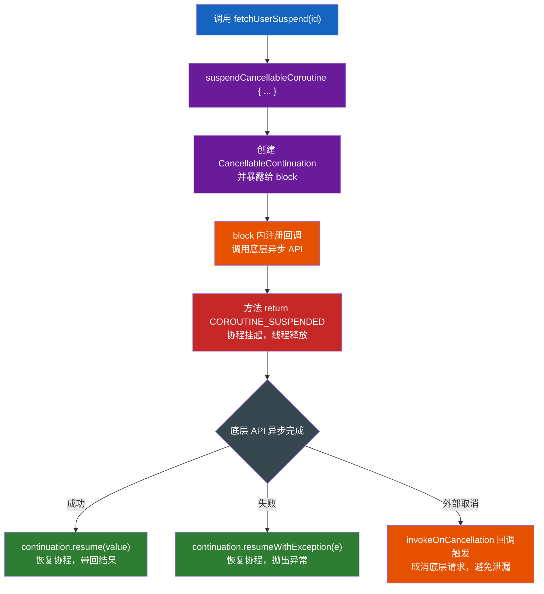

🔍 **`suspendCoroutine` vs `suspendCancellableCoroutine`**

```kotlin
// suspendCoroutine：不支持取消，continuation 只有 resume/resumeWithException
suspend fun <T> suspendCoroutine(block: (Continuation<T>) -> Unit): T

// suspendCancellableCoroutine：支持取消，多了 invokeOnCancellation 和 cancel()
suspend fun <T> suspendCancellableCoroutine(block: (CancellableContinuation<T>) -> Unit): T
```
- **绝大多数场景应该用 `suspendCancellableCoroutine`**：如果外部协程被取消（如 `viewModelScope` 随页面销毁取消），能通过 `invokeOnCancellation` 拿到通知，从而取消底层还在跑的网络请求/定时器，避免"协程已经不需要结果了，但底层任务还在白白执行"的资源浪费。`suspendCoroutine` 没有这个能力，取消发生时无法感知，仅适合包装那些**本身不支持取消、且执行很快**的操作。

💡 **扩展思考：**

> **Q1：`suspendCancellableCoroutine` 解决了什么问题？**  
> A：它是**协程世界与传统回调风格 API 之间的桥梁**——很多现有的异步 API（网络库、传感器监听、系统服务回调）是"回调风格"而不是 `suspend` 函数，无法直接在协程里用同步写法调用。`suspendCancellableCoroutine` 让你手动控制"什么时候恢复协程"（在回调触发时调 `resume`），从而把任意回调 API 包装成一个可以被 `suspend fun` 直接调用、写成顺序代码的挂起函数，避免回调地狱。
>
> **Q2：为什么必须调用 `invokeOnCancellation`？不调用会有什么后果？**  
> A：如果外部协程被取消（比如页面关闭导致 `viewModelScope` 取消），`suspendCancellableCoroutine` 会让这次挂起以 `CancellationException` 结束，**但底层被包装的异步操作（比如网络请求）并不知道自己"不再被需要"，仍会继续跑到完成**——这既浪费资源，也可能在协程已经结束后还去操作已经失效的对象（如已销毁的 View）导致崩溃。注册 `invokeOnCancellation { ... }` 能在取消发生的第一时间，同步取消掉底层真正在执行的操作，做到"协程取消 = 底层任务也取消"的资源联动。
>
> **Q3：在 `suspendCancellableCoroutine` 的回调里，如果异步操作已经在别的线程完成，能直接调用 `continuation.resume()` 吗？需要切回协程原来的线程吗？**  
> A：可以直接调用，不需要手动切线程。`resume()`/`resumeWith()` 内部会经过 `DispatchedContinuation`（见 3.2 节），自动根据协程原来的 `Dispatcher` 把恢复动作重新调度回正确的执行环境（如恢复到 `Dispatchers.Main`），调用方不需要关心当前处于哪个线程——这也是"挂起不阻塞、恢复自动切线程"机制在这里的具体应用。
>
> **Q4：如果同一个 `CancellableContinuation` 被 `resume` 两次会发生什么？**  
> A：会抛出 `IllegalStateException`（"already resumed"之类的信息）。`Continuation` 语义上只能被恢复**一次**——这也是为什么在实战代码中，如果回调 API 本身可能触发多次回调（如既有成功又可能有超时回调），需要用 `AtomicBoolean` 或其他机制确保 `resume`/`resumeWithException` 只被调用一次，防止重复恢复导致的崩溃。

## 9. Flow（冷数据流）深度剖析

🔍 **源码视角 · 冷流 vs 热流的本质区别**

```kotlin
fun getData(): Flow<Int> = flow {           // 冷流: 不收集不执行(像 Sequence)
    for (i in 1..3) { delay(100); emit(i) }
}
getData()
    .map { it * 2 }
    .filter { it > 2 }
    .catch { e -> emit(-1) }                // 异常捕获
    .collect { println(it) }                // 终端操作符触发执行
```

> `Flow` 是**冷流**（类似 `Sequence`/Kotlin 的 `Iterable` 的异步版）：不 `collect` 就不执行；每次 `collect` 重新执行一遍。**Channel** 是热流（类似 `BlockingQueue`，生产者主动发，与订阅无关）。

🔍 **源码解析 · Flow 接口的极简本质**

```kotlin
public interface Flow<out T> {
    public suspend fun collect(collector: FlowCollector<T>)
}
public interface FlowCollector<in T> {
    public suspend fun emit(value: T)
}
```
- `Flow` 本质就是一个"**可以被挂起地遍历**的东西"——`collect` 是唯一的方法，`flow { ... }` 构建器里的代码块，本质是一段"接到 `collector` 后，在里面调 `emit` 往外发数据"的挂起函数体。所有的 `map`/`filter`/`onEach` 等中间操作符都是在**包装** `collect` 的逻辑，层层套娃，直到最外层的终端操作符（`collect`/`toList`/`first` 等）真正触发整条链执行。
- **每次 `collect` 都是一次全新的执行**：因为 `flow { }` 里的代码块是在 `collect` 被调用时才运行的（懒），这也是为什么被称为"冷"——数据不是预先生产好放在那等你来拿，而是你来"要"的时候才现场生产。

### 9.1 上下文保留与 flowOn：为什么不能在 flow 内部随意切线程

🔍 **源码解析 · Context Preservation（上下文保留）**

```kotlin
// ❌ 错误：不能在 flow builder 内部直接切换 Dispatcher（会抛 IllegalStateException）
fun badFlow(): Flow<Int> = flow {
    withContext(Dispatchers.IO) {   // ❌ Flow invariant is violated
        emit(1)
    }
}

// ✅ 正确：用 flowOn 操作符，只影响"它之前"的上游代码运行在哪个线程
fun goodFlow(): Flow<Int> = flow {
    // 这里的代码（生产者逻辑）会运行在 flowOn 指定的 Dispatchers.IO 上
    println("emit 在线程: ${Thread.currentThread().name}")
    emit(1)
}.flowOn(Dispatchers.IO)   // 只切换上游（flow builder 内部），不影响下游 collect 所在线程
```
- **为什么禁止在 `flow { }` 内部用 `withContext` 切线程？** 这是 Kotlin 协程团队刻意设计的约束，称为"**上下文保留（Context Preservation）**"——`Flow` 的设计原则是：无论中间经过多少操作符，`emit` 出的数据永远运行在 `collect` 调用者所在的上下文里，除非显式用 `flowOn` 声明。如果允许在 `flow` 内部随意 `withContext`，会导致同一条流的不同部分神不知鬼不觉地跑在不同线程，行为难以预测、调试困难。
- **`flowOn` 的语义**：它把**自己之前（上游）的所有操作符**切换到指定的调度器执行，自己之后（下游，直到下一个 `flowOn` 或 `collect`）仍在原来的上下文。这与 RxJava 的 `subscribeOn`（影响上游）/`observeOn`（影响下游）概念上是对应的。

📊 **flowOn 切分上下游**

```mermaid
graph LR
    F["flow { emit(1) }<br/>生产者代码"] -->|flowOn(IO)之前| M["map/filter<br/>中间操作符"]
    M -->|"flowOn(Dispatchers.IO)"| C["collect { }<br/>消费者代码"]

    style F fill:#1565c0,color:#ffffff
    style M fill:#1565c0,color:#ffffff
    style C fill:#2e7d32,color:#ffffff
```

> `flowOn(Dispatchers.IO)` 左边（上游，生产者+它之前的中间操作符）跑在 IO 线程；右边（下游，`collect` 所在协程的原有上下文）不受影响。

### 9.2 背压与缓冲策略：buffer / conflate / collectLatest

🔍 **源码解析 · 默认的"背压"行为**

```kotlin
// 默认：生产者和消费者是"串行"的——emit 会挂起，直到 collect 处理完当前值才能发下一个
flow {
    for (i in 1..3) {
        println("发送前 $i")
        emit(i)               // 挂起，等 collect 处理完
        println("发送后 $i")
    }
}.collect { value ->
    delay(100)                 // 模拟慢消费者
    println("处理 $value")
}
// 输出严格交替：发送前1 → 处理1 → 发送后1 → 发送前2 → 处理2 → ...
```
- 默认情况下 `Flow` 没有并发——生产者 `emit` 和消费者 `collect` 运行在**同一个协程**里，`emit` 会挂起直到下游处理完这一个值，天然形成背压（生产快于消费时，生产者会被"顶住"）。

🔍 **三种缓冲/丢弃策略对比**

```kotlin
// ① buffer()：生产者和消费者并发运行，中间用 Channel 缓冲（默认容量 64），生产者不必等消费者
flow { for (i in 1..3) { println("发送 $i"); emit(i) } }
    .buffer()                              // 生产者不再等待，先把值放进缓冲区就继续生产下一个
    .collect { delay(100); println("处理 $it") }
// 生产者几乎瞬间发完 1,2,3；消费者慢慢处理，二者并发执行

// ② conflate()：跳过来不及处理的中间值，只保留最新值（适合"只关心最新状态"场景，如进度条）
flow { for (i in 1..3) { delay(100); emit(i) } }
    .conflate()
    .collect { delay(300); println("处理 $it") }   // 消费慢，中间值 2 可能被跳过，只处理 1 和 3

// ③ collectLatest：新值到达时，取消当前还没跑完的 collect 逻辑，重新用新值执行（适合"用户输入搜索"场景）
flow { for (i in 1..3) { delay(100); emit(i) } }
    .collectLatest { value ->
        println("开始处理 $value")
        delay(300)                          // 若在这期间来了新值，这次处理会被取消
        println("完成处理 $value")           // 可能不会打印（被新值打断）
    }
```

📊 **三种策略对比**

| 策略 | 生产者是否等待消费者 | 中间值处理方式 | 典型场景 |
| --- | --- | --- | --- |
| 默认（无操作符） | 等待（串行） | 全部按顺序处理 | 需要精确处理每个值 |
| `buffer()` | 不等待（有缓冲区） | 全部处理，但生产/消费并发 | 提升吞吐量，消费者偶尔慢 |
| `conflate()` | 不等待 | 跳过来不及处理的中间值，只处理最新 | 进度更新、状态显示（只关心最新） |
| `collectLatest` | 不等待 | 新值到达取消当前处理，重新开始 | 搜索框输入、频繁触发的最新意图 |

### 9.3 异常透明性（Exception Transparency）

🔍 **源码解析 · catch 只能捕获"上游"异常**

```kotlin
flow {
    emit(1)
    throw RuntimeException("生产者出错")   // 上游异常
}
.map { it * 2 }
.catch { e -> println("捕获: $e") }        // ✅ 能捕获上游（flow builder、map）抛出的异常
.collect { value ->
    if (value == 2) throw RuntimeException("消费者出错")   // 下游（collect 内部）异常
}
// catch 只能捕获它之前（上游）的异常，collect 内部抛的异常 catch 捕获不到！会直接向外传播
```
- **异常透明性原则**：`Flow` 规定 `emit` **不允许**在 `try-catch` 里被调用来"捕获下游异常"——即生产者不应该、也不能感知/处理消费者的异常。`catch` 操作符本质是在流的某个位置插入一个"如果上游抛异常，就在这里 `emit` 一个替代值或做别的处理"的钩子，它**只对写在它前面（上游）的代码生效**，对写在它后面的 `collect` 块内部抛出的异常完全无效。
- **正确处理消费者异常**：应该在 `collect` 外部用普通的 `try-catch` 包裹整条链，或者把可能出错的逻辑通过 `onEach` 挪到 `catch` 之前。

### 9.4 StateFlow 与 SharedFlow：Flow 家族的热流成员

🔍 **源码解析 · StateFlow（状态容器，永远有当前值）**

```kotlin
val state: MutableStateFlow<Int> = MutableStateFlow(0)   // 必须有初始值
state.value = 1           // 直接赋值即可更新（非 suspend，普通属性）
val current = state.value // 随时能同步读取"当前值"（这是与普通 Flow 最大的区别）

launch { state.collect { println("收到: $it") } }   // 订阅后立即收到当前值 0，再收到后续更新
```
- **StateFlow 的"去重"特性**：如果连续设置**相同**的值（`equals` 判定），不会触发新的 emit——这是它作为"状态容器"的设计（状态没变，通知一次就够）。这点与 `LiveData` 的行为一致。
- **StateFlow 是 `SharedFlow` 的特殊形式**：内部通过 `replay = 1` 的 `SharedFlow` 实现（新订阅者总能立刻拿到最近一次的值）。

🔍 **源码解析 · SharedFlow（事件总线，可配置重放策略）**

```kotlin
val events = MutableSharedFlow<String>(
    replay = 0,                                  // 新订阅者不会收到订阅前发生的旧事件（默认）
    extraBufferCapacity = 10,                     // 额外缓冲区，避免 emit 时挂起
    onBufferOverflow = BufferOverflow.DROP_OLDEST // 缓冲区满时的策略
)
launch { events.collect { println("订阅者A: $it") } }
events.emit("点击按钮")   // 所有当前订阅者都会收到（多播，与 StateFlow 类似都是热流）
```
- **`SharedFlow` 更通用**：不要求有初始值、不要求"当前状态"语义，`replay` 参数可配置（0=不重放历史、N=给新订阅者补发最近 N 条），适合"一次性事件"（如 Toast 提示、导航跳转）而非"持续状态"。

📊 **Flow / StateFlow / SharedFlow / LiveData 对比**

| 维度 | `Flow` | `StateFlow` | `SharedFlow` | `LiveData` |
| --- | --- | --- | --- | --- |
| 冷/热 | 冷流 | 热流 | 热流 | 热流 |
| 是否要初始值 | 不需要 | **必须要** | 不需要 | 不需要（可空） |
| 多播（多订阅者共享） | 否（每次 collect 独立执行） | 是 | 是 | 是 |
| 去重（相同值不重复发） | 否 | 是（基于 equals） | 否（可配置） | 是 |
| 生命周期感知 | 否 | 否 | 否 | **是**（Android 专属） |
| 典型场景 | 一次性数据处理管道 | UI 状态（如"加载中/成功/失败"） | 一次性事件（Toast/导航） | 传统 Android UI 绑定 |

💡 **扩展思考：**

> **Q1：Flow 和 RxJava Observable 的区别？**  
> A：二者都是响应式流，理念相通。Flow 是 Kotlin 协程原生（挂起式、可取消、与 `suspend` 无缝配合），冷流、结构化并发；RxJava 功能更全（背压策略 `BackpressureStrategy` 显式、操作符更丰富）。Flow 默认不支持"热/多播"，需 `StateFlow`/`SharedFlow`。
>
> **Q2：StateFlow 和 LiveData 区别？**  
> A：`StateFlow` 是协程的"状态容器"（热流、有初始值、幂等去重、可多收），`LiveData` 是 Android 生命周期感知的 observable。StateFlow 更适合纯 Kotlin/后端层（可脱离 Android 使用），LiveData 绑定 UI 生命周期更省心（自动在页面不可见时停止分发）；`SharedFlow` 对应"事件总线"场景（LiveData 处理一次性事件需要额外包装如 `SingleLiveEvent`，SharedFlow 天然适合）。
>
> **Q3：为什么不能在 flow builder 内部直接调用 withContext 切换调度器？**  
> A：这违反了 Flow 的"上下文保留（Context Preservation）"设计原则——`Flow` 约定无论经过多少中间操作符，最终 `emit` 的执行上下文应该和 `collect` 所在的上下文一致（除非显式声明）。允许在内部随意切换会让同一条流的不同阶段跑在不可预测的线程上。应该用专门设计的 `flowOn(dispatcher)` 操作符，它只切换"它之前的上游代码"的执行线程，语义清晰、边界明确。
>
> **Q4：conflate() 和 collectLatest 的区别？**  
> A：都是"消费跟不上生产时丢弃中间值"的策略，区别在于**丢的时机和方式**：`conflate()` 是在**生产端**做的——上游发得快，下游还在处理老值时，中间产生的新值会覆盖掉尚未被消费的那个值（保留最新的等消费者来取），但**已经在被处理的那次 collect 不会被打断**；`collectLatest` 是在**消费端**做的——一旦有新值到达，会**立即取消**当前正在执行的 `collect` 代码块（哪怕它没跑完），重新用新值开始执行，适合"每次都要用最新输入重新计算，中途的旧计算可以直接放弃"的场景（如根据搜索框最新内容重新发请求）。
>
> **Q5：catch 操作符为什么捕获不到 collect 块内部抛出的异常？**  
> A：因为 `catch` 是插入在流的某个位置的"上游异常处理钩子"，它的实现原理是在自己之前的操作符执行时包一层 `try-catch`；`collect { }` 里的代码属于**流的终端消费逻辑，在 `catch` 之后执行**，抛出的异常不会经过 `catch` 内部包裹的那层 try 块，所以自然捕获不到。这是"异常透明性"原则的直接体现——上游不应该、也没有能力处理下游消费者自己的错误。

## 10. Channel（热流通信）深度剖析

💡 **一句话**：`Channel` 是协程间通信的**热流管道**，语义上类似 `BlockingQueue`，但 `send`/`receive` 都是挂起函数（满了/空了挂起协程而非阻塞线程），是实现生产者-消费者模型的核心工具。

🔍 **源码解析 · Channel 的四种容量类型**

```kotlin
Channel<Int>()                          // RENDEZVOUS（默认，容量0）：send 必须等到有 receive 才能完成，一一对应
Channel<Int>(capacity = 10)             // 有缓冲：容量内 send 不挂起，超出才挂起
Channel<Int>(Channel.UNLIMITED)         // 无限容量：send 永不挂起（有 OOM 风险，慎用）
Channel<Int>(Channel.CONFLATED)         // 会话型：新值覆盖旧值，只保留最新一个（类似 Flow 的 conflate）
Channel<Int>(
    capacity = 5,
    onBufferOverflow = BufferOverflow.DROP_OLDEST   // 缓冲满时的策略：DROP_OLDEST/DROP_LATEST/SUSPEND(默认)
)
```

📊 **四种容量类型对比**

| 类型 | 缓冲区大小 | send 何时挂起 | 典型场景 |
| --- | --- | --- | --- |
| `RENDEZVOUS`（默认） | 0 | 必须等到对应的 `receive` | 严格的一一配对交接 |
| 固定容量（如 10） | N | 缓冲区满时 | 平滑消费速度波动 |
| `UNLIMITED` | 无限 | 永不挂起 | 确保生产者绝不阻塞（需自行控制内存风险） |
| `CONFLATED` | 1（覆盖式） | 永不挂起 | 只关心最新状态（如实时坐标更新） |

🔍 **Fan-out（多消费者分摊）与 Fan-in（多生产者汇聚）**

```kotlin
// Fan-out：多个消费者协程共享同一个 Channel，每条消息只会被其中一个消费者取走（任务分发/负载均衡）
val channel = Channel<Int>()
repeat(3) { workerId ->
    launch {
        for (task in channel) {              // 多个 worker 竞争同一个 channel
            println("worker $workerId 处理 $task")
        }
    }
}
launch {
    for (i in 1..9) channel.send(i)
    channel.close()
}
// 9 个任务被 3 个 worker 瓜分处理，各自处理约 3 个（具体分配取决于调度）

// Fan-in：多个生产者协程往同一个 Channel 发送，一个消费者统一接收（多源数据汇总）
suspend fun sendData(channel: SendChannel<String>, from: String) {
    repeat(3) { channel.send("$from-$it") }
}
val channel2 = Channel<String>()
launch { sendData(channel2, "生产者A") }
launch { sendData(channel2, "生产者B") }
launch {
    repeat(6) { println("收到: ${channel2.receive()}") }   // 汇总来自 A、B 的所有消息
}
```

🔍 **`produce` 构建器：更安全的生产者写法**

```kotlin
// produce 是 launch + Channel 的封装，作用域结束/异常时自动 close，避免忘记 close 导致消费者永久挂起
fun CoroutineScope.produceNumbers(): ReceiveChannel<Int> = produce {
    for (i in 1..3) {
        delay(100)
        send(i)     // 用 send 而非 emit（Channel 语义）
    }
    // 协程体结束后，produce 自动调用 channel.close()，消费者的 for 循环会自然结束
}
fun main() = runBlocking {
    val numbers = produceNumbers()
    for (n in numbers) println(n)   // ReceiveChannel 支持 for-in 遍历，close 后自动退出循环
}
```

📊 **Channel vs Flow 核心区别**

| 维度 | Channel | Flow |
| --- | --- | --- |
| 冷/热 | 热（生产者主动发送，与是否有人接收无关） | 冷（不 collect 不产生数据） |
| 多消费者 | 支持（Fan-out：一条数据只能被一个消费者拿到） | `Flow` 本身不支持多播，需转 `SharedFlow` |
| 背压 | 通过容量+挂起实现 | 通过 `buffer`/`conflate` 等操作符实现 |
| 使用场景 | 协程间"一次性"通信、任务分发 | 数据处理管道、响应式数据流 |

💡 **扩展思考：**

> **Q1：Channel 用来干什么？和 Flow 怎么选？**  
> A：`Channel` 用于协程间**通信**（生产者-消费者模型），类似 `BlockingQueue` 但挂起式（满了 `send` 挂起、空了 `receive` 挂起，不阻塞线程）。选型：需要"多个协程互相发消息、任务分发"用 `Channel`；需要"构建一条可复用的数据处理管道、每次订阅重新计算"用 `Flow`。二者也可结合，`callbackFlow`/`channelFlow` 就是在 `Flow` 内部用 `Channel` 实现更灵活的发射逻辑。
>
> **Q2：RENDEZVOUS 容量的 Channel 有什么特点？为什么默认是它？**  
> A：`RENDEZVOUS`（容量 0）要求 `send` 必须**恰好**等到有协程在 `receive` 时才能完成交接，如同"接力棒交接"——这是最严格的同步语义，保证生产者和消费者的执行是"一对一即时对齐"的，不会有数据被无限期缓冲在中间。默认选它是为了让开发者显式选择更宽松的容量（如需要缓冲区来平滑速度差异），而不是默默地攒下大量未处理数据造成隐藏的内存增长。
>
> **Q3：忘记调用 `channel.close()` 会有什么后果？**  
> A：消费者用 `for (x in channel)` 遍历时，这个循环依赖 `channel.close()` 来自然结束（`close` 后 `receive`/迭代器会收到"通道已关闭"的信号并退出循环）；如果生产者协程结束但忘记 `close()`，消费者会**永久挂起**在等待下一个元素，造成协程"泄漏"（永远不会完成，占用资源直到父作用域被取消）。这也是为什么推荐用 `produce { }` 构建器——它在协程体正常结束或异常终止时都会自动调用 `close()`，避免忘记关闭的问题。

## 11. 常见陷阱与最佳实践

💡 **一句话**：协程用起来"看着像同步代码"，但背后的调度、取消、异常传播规则如果理解不到位，很容易写出隐蔽的 bug——本章汇总实战中最容易踩的坑。

📊 **十大常见陷阱速查**

| # | 陷阱 | 后果 | 正确做法 |
| --- | --- | --- | --- |
| 1 | 用 `GlobalScope` 启动业务协程 | 生命周期不受控，页面销毁后协程仍在跑，可能操作已销毁对象崩溃/泄漏内存 | 用与组件生命周期绑定的 Scope（`viewModelScope`/`lifecycleScope`），或自建 Scope 并在销毁时 `cancel()` |
| 2 | 纯 CPU 循环协程无挂起点 | `cancel()` 不生效，协程死循环跑到底 | 循环内加 `isActive` 检查、`ensureActive()` 或 `yield()`（见第 7 章） |
| 3 | `finally` 里直接调挂起函数做清理 | 协程已取消时清理代码抛 `CancellationException`，清理不完整 | 用 `withContext(NonCancellable) { }` 包裹清理逻辑（见第 7 章） |
| 4 | 在协程内部调用 `runBlocking` | 阻塞当前协程所在线程，若该线程有限（如 `Dispatchers.Main`）可能死锁或严重卡顿 | 生产协程代码用 `coroutineScope { }`/`withContext` 代替，`runBlocking` 只用于 `main`/测试 |
| 5 | 把 `async` 当 `launch` 用，不调用 `await()` | 若 `async` 块内抛异常，异常会被"吞掉"直到某处 `await`（甚至永远不会，异常悄悄丢失） | 只用 `async` 求值，不需要结果就用 `launch`；调用了 `async` 必须记得 `await()` |
| 6 | `catch (e: Exception)` 意外吞掉 `CancellationException` | 取消信号被吞，破坏结构化并发的取消传播，协程"取消不掉" | 捕获异常时对 `CancellationException` 要重新 `throw`，或只 catch 具体业务异常类型 |
| 7 | 在 `flow { }` 构建器内部用 `withContext` 切线程 | 直接抛出 `IllegalStateException`（违反上下文保留原则） | 用 `flowOn(dispatcher)` 操作符（见 9.1 节） |
| 8 | 用普通 `Job` 却期望"一个子任务失败不影响其他" | 一个子协程异常会取消整个父作用域及所有兄弟协程 | 用 `SupervisorJob`/`supervisorScope`（见 3.1、3.4 节） |
| 9 | 忘记给 `Channel` 调用 `close()` | 消费者的 `for-in` 循环永久挂起等待新元素，协程泄漏 | 用 `produce { }` 构建器自动管理关闭，或确保生产者结束时手动 `close()`（见第 10 章） |
| 10 | 循环里对每个元素都 `launch` 新协程做网络请求，无限制并发 | 瞬间创建大量协程/网络连接，可能拖垫服务器或耗尽连接池 | 用 `Semaphore` 限流，或 `Flow` 的 `flatMapMerge(concurrency = N)` 控制并发数 |

🔍 **陷阱 5 展开：`async` 异常悄悄丢失的真实案例**

```kotlin
// ❌ 危险写法：async 启动后不 await，异常被暂存进 Deferred，直到 GC 回收都没人知道出错了
scope.launch {
    async { riskyOperation() }   // 若这里抛异常，除非之后调用 .await()，异常会一直"潜伏"
    // ... 其他逻辑正常执行，看起来一切正常，但 riskyOperation() 其实已经失败
}

// ✅ 正确：要结果用 await；不需要结果就用 launch（异常会立即通过 CoroutineExceptionHandler 上报）
scope.launch {
    val deferred = async { riskyOperation() }
    val result = deferred.await()   // 异常在这里被重新抛出，能被外层 try-catch 捕获
}
```

🔍 **陷阱 10 展开：限制并发数的正确写法**

```kotlin
// ❌ 无限制并发：1000 个 URL 同时发起 1000 个网络请求
val results = urls.map { url -> async { fetch(url) } }.awaitAll()

// ✅ 用 Semaphore 限制同时进行的请求数
val semaphore = Semaphore(10)   // 最多 10 个并发
val results2 = urls.map { url ->
    async {
        semaphore.withPermit { fetch(url) }   // 获取许可才能执行，用完自动释放
    }
}.awaitAll()

// ✅ 或用 Flow 的 flatMapMerge 控制并发
val results3 = urls.asFlow()
    .flatMapMerge(concurrency = 10) { url -> flow { emit(fetch(url)) } }
    .toList()
```

💡 **扩展思考：**

> **Q1：为什么不推荐用 `GlobalScope` 启动业务相关的协程？**  
> A：`GlobalScope` 的生命周期等同于**整个应用进程**，它启动的协程不会随任何页面/组件的销毁而自动取消。如果在 Activity/ViewModel 里用 `GlobalScope.launch` 发起网络请求，页面关闭后这个协程依然在后台运行，等结果返回时可能尝试更新一个已经销毁的 View（导致崩溃）或者单纯浪费资源（内存泄漏、无意义的网络流量）。应该始终用与业务生命周期绑定的 `CoroutineScope`（如 `viewModelScope`），让框架在恰当的时机自动取消。
>
> **Q2：`launch` 里嵌套 `async` 但没调 `await`，程序会不会崩溃？为什么这很危险？**  
> A：不一定立刻崩溃，但这是一个**隐藏的定时炸弹**——`async` 块内的异常不会立即抛出（见第 4 章"async 异常暂存"机制），它会一直存在 `Deferred` 对象内部，只有调用 `await()` 才会重新抛出。如果代码逻辑上永远不会去 `await` 这个 `Deferred`（比如只是想"顺便"触发一个操作，误用了 `async` 而不是 `launch`），那么这个异常永远不会被任何地方处理，业务逻辑悄悄失败但没有任何报错，排查起来非常困难。正确做法：不需要返回值就用 `launch`（异常会立即通过正常的异常传播链上报），需要返回值且一定会 `await` 才用 `async`。
>
> **Q3：为什么循环里对每个元素都无脑 `launch`/`async` 发网络请求是危险的？**  
> A：协程创建成本很低，容易让人忽视"并发数"这个问题——如果对 1000 条数据每条都 `launch` 一个网络请求协程，会在极短时间内同时发起上千个网络连接，可能超出服务器承载能力（被限流/拒绝）、耗尽本地连接池、或者因为过多并发的 IO 操作互相竞争资源反而拖慢整体速度。应该用 `Semaphore` 限制同时执行的协程数，或者用 `Flow.flatMapMerge(concurrency = N)` 这类内置了并发度控制的操作符，把"并发数"作为一个显式配置项管理起来。

## 12. 协程实战代码示例详解

> 以下示例均用 `runBlocking { ... }` 包裹，可直接在 JVM 上运行（需依赖 `kotlinx-coroutines-core`）。每段后附"运行结果与要点"，对应前面讲到的知识点。

### 🔹 12.1 基础：启动协程、挂起不阻塞

```kotlin
import kotlinx.coroutines.*

fun main() = runBlocking {                 // 桥接：阻塞主线程直到内部协程全部结束
    launch {                               // 在当前作用域启动子协程，立即返回 Job
        delay(1000L)                       // suspend：挂起协程，不阻塞底层线程
        println("World!")                  // 约 1s 后打印
    }
    println("Hello")                       // launch 不阻塞这里，立即打印
}
// 输出: Hello  →（约 1 秒后）→  World!
// 要点: launch 返回 Job 不等待；delay 是挂起函数，挂起当前协程而非阻塞线程
```

### 🔹 12.2 launch vs async：串行 vs 并行

```kotlin
suspend fun doWork(name: String, ms: Long): String {
    delay(ms)
    return "$name done"
}

fun main() = runBlocking {
    val t0 = System.currentTimeMillis()
    val a = doWork("A", 1000)              // 顺序：直接调用挂起函数，会依次等待
    val b = doWork("B", 1000)
    println("顺序: $a,$b 用时 ${System.currentTimeMillis() - t0}ms")   // ≈ 2000ms

    val t1 = System.currentTimeMillis()
    val ra = async { doWork("A", 1000) }   // async 立即返回 Deferred，后台并发执行
    val rb = async { doWork("B", 1000) }
    println("并行: ${ra.await()},${rb.await()} 用时 ${System.currentTimeMillis() - t1}ms") // ≈ 1000ms
}
// 输出: 顺序 ≈ 2000ms；并行 ≈ 1000ms
// 要点: async 返回 Deferred，多个 async 同时启动 + 一起 await 即并发；launch 不返回结果
```

### 🔹 12.3 withContext 切换调度器

```kotlin
fun main() = runBlocking {
    println("start 线程=${Thread.currentThread().name}")     // main
    val result = withContext(Dispatchers.IO) {               // 挂起当前协程，切到 IO 线程池
        println("IO中 线程=${Thread.currentThread().name}")   // DefaultDispatcher-worker-1
        delay(500)
        "data"
    }
    println("结果=$result 线程=${Thread.currentThread().name}") // 恢复回原协程代码（线程可能不同但顺序连续）
}
// 要点: withContext 在不阻塞原线程的前提下切换线程池执行，返回结果后恢复；常用于"主线程切 IO 取数再回主线程"
```

### 🔹 12.4 取消与超时

```kotlin
fun main() = runBlocking {
    val job = launch {
        repeat(5) { i ->
            println("working $i")
            delay(500)
        }
    }
    delay(1200)                  // 主协程等 1.2s
    job.cancelAndJoin()          // 取消子协程并等待它真正结束（结构化取消）
    println("已取消")

    val r = withTimeoutOrNull(800) {        // 超过 800ms 自动取消并返回 null
        repeat(10) { delay(200); print(".") }
        "完成"
    }
    println("\n超时结果: $r")     // null（10×200=2000ms > 800ms，被取消）
}
// 要点: 协程可取消；delay 等标准挂起函数会响应取消；withTimeoutOrNull 比抛异常的 withTimeout 更友好
```

### 🔹 12.5 Job 层级与取消传播（结构化并发）

```kotlin
fun main() = runBlocking {
    val parent = launch {
        val c1 = launch { delay(1000); println("c1 结束") }
        val c2 = launch { delay(1000); println("c2 结束") }
        println("父协程启动了两个子")
    }
    delay(300)
    parent.cancel()              // 取消父 → 子协程 c1、c2 一起被取消
    parent.join()
    println("父及其所有子协程已结束")
}
// 输出: 只打印"父协程启动了两个子"和"父及其所有子协程已结束"（c1/c2 未打印）
// 要点: 取消自顶向下传播；父会等所有子结束才真正结束（除非子异常）
```

### 🔹 12.6 SupervisorJob vs 普通 Job（子失败是否波及兄弟）

```kotlin
fun main() = runBlocking {
    // 普通 Job：一个子失败 → 父被取消 → 兄弟也被取消
    val normal = launch {
        launch { throw RuntimeException("子1挂了") }
        launch { delay(1000); println("普通Job 子2（不会被打印）") }
    }
    normal.join()
    println("----")

    // SupervisorJob（supervisorScope）：子1失败不影响子2
    supervisorScope {
        launch { throw RuntimeException("子1挂了") }
        launch { delay(100); println("SupervisorJob 子2 仍然执行") }
    }
}
// 输出: 第一行异常栈 → "----" → "SupervisorJob 子2 仍然执行"
// 要点: supervisorScope / SupervisorJob 让子协程相互独立，适合"多个独立任务并行，部分失败不影响其他"
```

### 🔹 12.7 异常处理：try-catch 与顶层 Handler

```kotlin
fun main() = runBlocking {
    // 方式1：业务异常用 try-catch（async 的异常延迟到 await 才抛，正好在此捕获）
    try {
        async { throw IOException("读取失败") }.await()
    } catch (e: IOException) {
        println("捕获到: ${e.message}")          // 捕获到: 读取失败
    }

    // 方式2：顶层 CoroutineExceptionHandler（未捕获异常的兜底）
    val handler = CoroutineExceptionHandler { _, e ->
        println("全局Handler捕获: ${e.message}")
    }
    val scope = CoroutineScope(Dispatchers.Default + handler)
    scope.launch {
        throw IllegalStateException("顶层未捕获异常")
    }.join()
}
// 要点: Handler 只在"顶层协程且未被捕获"时触发；async 异常要等 await 才抛；可预期异常优先 try-catch
```

### 🔹 12.8 Flow 冷流与操作符

```kotlin
fun main() = runBlocking {
    fun nums(): Flow<Int> = flow {
        for (i in 1..3) {
            delay(100)
            emit(i)                 // 发射元素；冷流——每次 collect 都重新执行这里
        }
    }

    nums()
        .map { it * it }            // 变换：1,4,9
        .filter { it > 1 }          // 过滤：4,9
        .onEach { println("收到 $it") }
        .catch { e -> println("上游异常: $e") }   // 只能捕获上游异常
        .collect()                  // 触发整条流执行

    // StateFlow 状态容器
    val state = MutableStateFlow(0)             // 有初始值
    launch { state.collect { println("state=$it") } }  // 会收到 0,1,2
    state.value = 1
    state.value = 2
}
// 要点: Flow 是冷流（不 collect 不执行、每次 collect 重跑）；catch 只接上游；StateFlow 是热流状态容器
```

### 🔹 12.9 Channel 生产者-消费者（热流通信）

```kotlin
fun main() = runBlocking {
    val channel = Channel<Int>()                 // 默认无缓冲（RENDEZVOUS）
    launch {                                     // 生产者协程
        for (i in 1..3) {
            channel.send(i)                      // 无缓冲时 send 挂起，直到有 receive 接住
            println("发送 $i")
        }
        channel.close()
    }
    for (x in channel) {                          // 替代已弃用的 consumeEach
        println("接收 $x")
    }
}
// 输出: 发送1/接收1/发送2/接收2/发送3/接收3（send 与 receive 一一 rendezvous）
// 要点: Channel 是热流，send/receive 挂起式，不阻塞线程；适合协程间解耦通信、背压传递
```

### 🔹 12.10 回调转协程：suspendCancellableCoroutine 实战

```kotlin
// 模拟一个回调风格的传统 API
class LegacyLocationApi {
    fun getCurrentLocation(onResult: (String) -> Unit, onError: (Exception) -> Unit) {
        Thread {
            Thread.sleep(500)
            onResult("北京市")   // 假设异步获取成功
        }.start()
    }
}

suspend fun LegacyLocationApi.getCurrentLocationSuspend(): String =
    suspendCancellableCoroutine { continuation ->
        getCurrentLocation(
            onResult = { location -> continuation.resume(location) },
            onError = { e -> continuation.resumeWithException(e) }
        )
        continuation.invokeOnCancellation {
            println("协程被取消，理应同步取消底层定位请求")
        }
    }

fun main() = runBlocking {
    val api = LegacyLocationApi()
    val location = api.getCurrentLocationSuspend()   // 同步写法调用回调 API
    println("当前位置: $location")
}
// 输出: 当前位置: 北京市（约 500ms 后）
// 要点: 把 callback 风格 API 转换成挂起函数，调用方无需处理回调地狱
```

### 🔹 12.11 协作式取消实战：isActive 检查 + NonCancellable 清理

```kotlin
fun main() = runBlocking {
    val job = launch(Dispatchers.Default) {
        try {
            var i = 0
            while (isActive) {          // 主动检查取消标志，纯计算循环里取消才能生效
                if (i % 100_000_000 == 0) println("计算中 $i")
                i++
                if (i > 300_000_000) break
            }
        } finally {
            withContext(NonCancellable) {   // 保证清理逻辑不被取消打断
                delay(50)
                println("清理完成")
            }
        }
    }
    delay(10)
    job.cancelAndJoin()
    println("协程已取消")
}
// 要点: 纯 CPU 循环必须主动检查 isActive 才能响应取消；finally 里的挂起调用要用 NonCancellable 保护
```

💡 **补充追问：为什么示例里都用 runBlocking 包起来？**

> A：`runBlocking` 是一个**桥接函数**：阻塞调用它的线程（通常是 main），直到其内部所有协程执行完毕才返回，因此它只适合在 `main` 或测试中做"入口"。真实业务里入口应该是 `CoroutineScope`（如 Android 的 `viewModelScope`、后端的 `CoroutineScope(Dispatchers.IO)`），它在任务结束/页面销毁时自动取消，避免泄漏。区分 `runBlocking`（阻塞当前线程，仅桥接/测试）与 `launch`（不阻塞，启动协程）是理解协程调度的关键。

---

## 附：高频速记表

| 考点 | 一句话核心 |
| --- | --- |
| 协程 vs 线程 | 协程轻量、挂起不阻塞线程；一个线程可跑成千上万协程 |
| 四大组件 | Scope(生命周期) / Context(配置容器) / Job(句柄状态机) / Continuation(挂起载体) |
| CoroutineContext | CombinedContext 不可变链表，按 Key 索引，同 Key 后者覆盖前者 |
| Job 状态机 | New→Active→Completing→Completed；异常路径 Cancelling→Cancelled；取消向下广播、失败向上冒泡 |
| SupervisorJob | 只重写 childCancelled 返回 false，阻断向上冒泡，子失败不影响兄弟 |
| Dispatcher 本质 | ContinuationInterceptor，恢复时拦截续体投递到目标线程；IO(64线程)/Default(核数)/Main/Unconfined |
| launch vs async | launch 无返回值异常立即上报；async 返回 Deferred，异常暂存到 await 才抛 |
| 四种启动模式 | DEFAULT(入队) / LAZY(按需) / ATOMIC(不可取消) / UNDISPATCHED(当前线程同步跑) |
| 挂起本质 | 方法 return COROUTINE_SUSPENDED；恢复本质 = invokeSuspend 回调再次被调用 |
| suspend 函数编译 | 多一个 Continuation 参数，返回 Any?；协程体编译为 SuspendLambda 状态机类 |
| 协作式取消 | cancel() 只打状态标记，需挂起点/isActive/ensureActive/yield 主动检查才生效 |
| 资源清理 | finally 里挂起函数会被取消打断，需用 withContext(NonCancellable) 保护 |
| CancellationException | 正常取消信号，不触发 ExceptionHandler；catch 时不要意外吞掉，需重新抛出 |
| suspendCancellableCoroutine | 回调转协程的桥梁；务必用 invokeOnCancellation 联动取消底层操作 |
| Flow 本质 | 冷流，不 collect 不执行，每次 collect 重新执行一遍 |
| flowOn | 只切换上游（之前）代码的调度器，不能在 flow builder 内部直接 withContext |
| buffer/conflate/collectLatest | 生产消费并发/丢中间值保留最新/新值到达取消当前处理重新开始 |
| 异常透明性 | catch 只捕获上游异常，collect 内部异常需要外部 try-catch |
| StateFlow vs SharedFlow | StateFlow 必须有初始值+去重，是 replay=1 的 SharedFlow；SharedFlow 更通用可配置重放 |
| Channel 容量类型 | RENDEZVOUS(0,一一对应) / 固定容量 / UNLIMITED / CONFLATED(覆盖式) |
| Channel vs Flow | Channel 热流用于协程间通信；Flow 冷流用于数据处理管道 |
| 常见陷阱 | 慎用 GlobalScope；CPU循环加取消检查；async 记得 await；catch 别吞 CancellationException；批量并发要限流 |

---

> 文档完。建议配合《4.Kotlin基础语法.md》（Kotlin 语言基础/空安全/泛型型变）、《3.Java并发编程.md》（Java 线程/锁/线程池，协程的取消/异常/线程池思想与之呼应）一起复习——协程的挂起恢复机制建立在 JVM 之上，理解 Java 并发基础有助于更深刻地理解协程为何如此设计。
