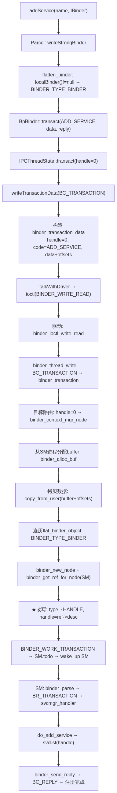
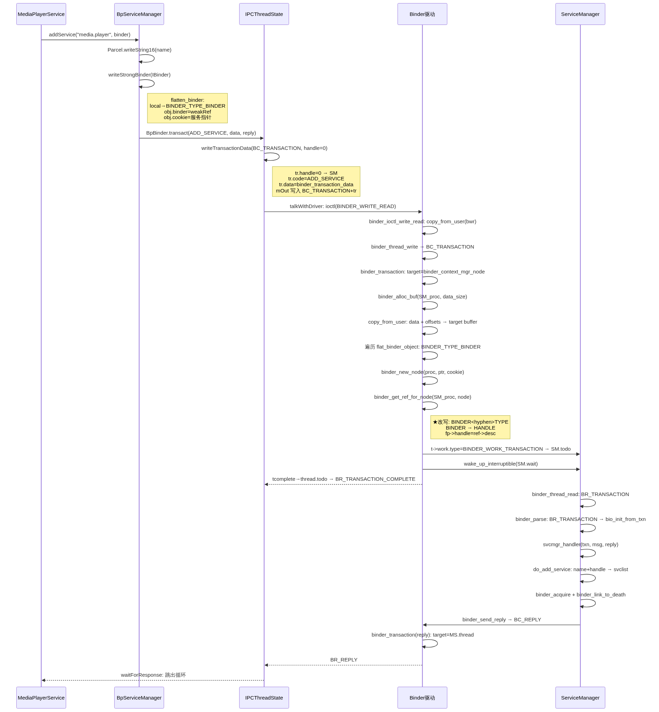
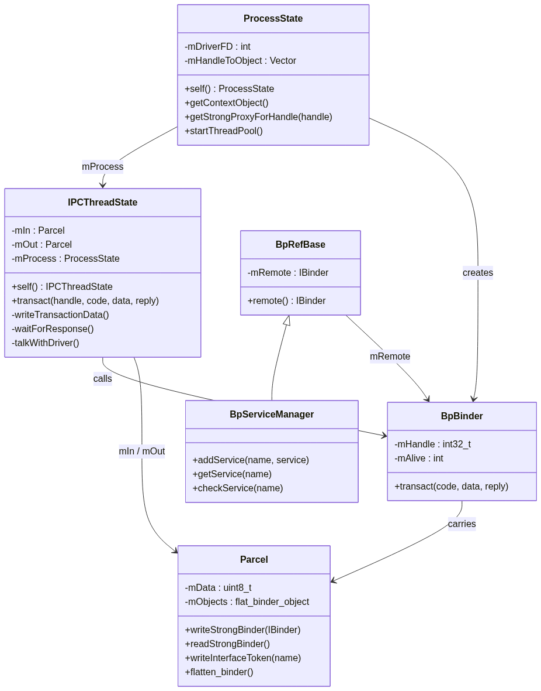
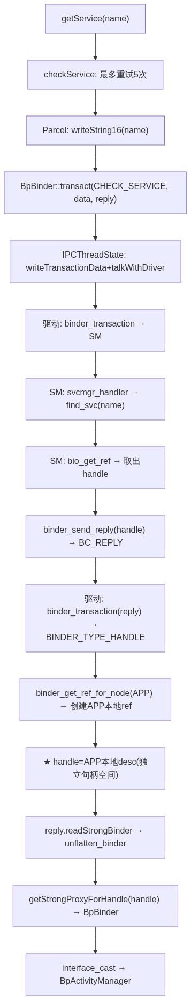
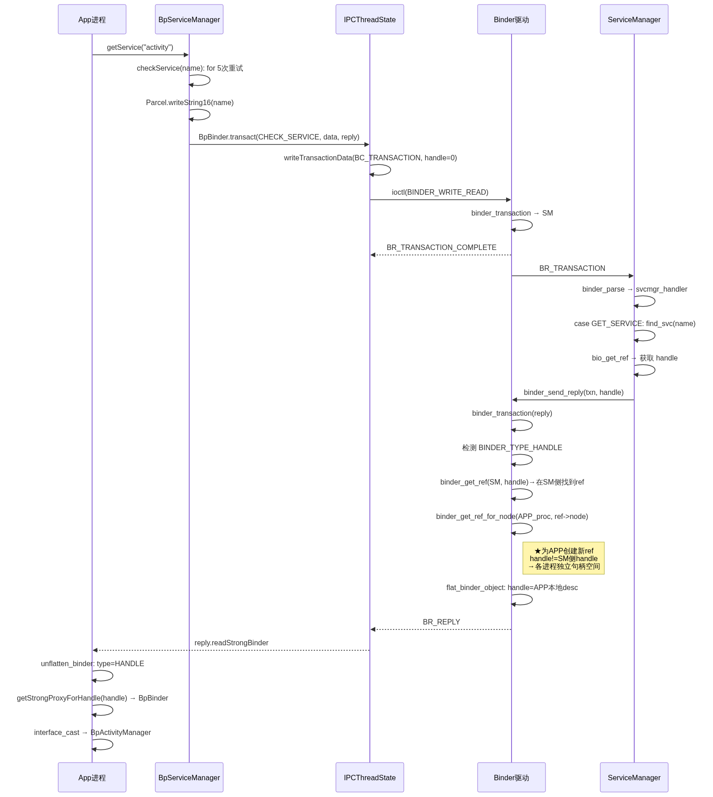

# 06. Binder 系列三-服务注册与获取过程分析

> 以 MediaPlayerService 注册和 App 获取 AMS 为例，按源码调用链完整拆解 Binder 服务注册与获取的全流程——从 Java 层 addService/getService，经 IPCThreadState 的 transact/talkWithDriver，到 Binder 驱动的 binder_transaction 处理和 flat_binder_object 类型改写，最后回到 ServiceManager 的 svcmgr_handler 分发。每步标注关键源码。

## 目录

- [一、服务注册：MediaPlayerService 全链路](#一服务注册mediaplayerservice-全链路)
  - [1.1 media 服务入口与 instantiate](#11-media-服务入口与-instantiate)
  - [1.2 BpServiceManager::addService](#12-bpservicemanageraddservice)
  - [1.3 writeStrongBinder → flatten_binder](#13-writestrongbinder--flatten_binder)
  - [1.4 BpBinder::transact → IPCThreadState](#14-bpbindertransact--ipcthreadstate)
  - [1.5 IPCThreadState::self 与 TLS](#15-ipcthreadstateself-与-tls)
  - [1.6 IPCThreadState::transact](#16-ipcthreadstatetransact)
  - [1.7 writeTransactionData](#17-writetransactiondata)
  - [1.8 waitForResponse → talkWithDriver](#18-waitforresponse--talkwithdriver)
  - [1.9 驱动层：binder_ioctl_write_read](#19-驱动层binder_ioctl_write_read)
  - [1.10 驱动层：binder_thread_write → binder_transaction](#110-驱动层binder_thread_write--binder_transaction)
  - [1.11 驱动层：三个关键函数](#111-驱动层三个关键函数)
  - [1.12 ServiceManager 端：svcmgr_handler → do_add_service](#112-servicemanager-端svcmgr_handler--do_add_service)
- [二、服务获取：App 获取 AMS 全链路](#二服务获取app-获取-ams-全链路)
  - [2.1 getMediaPlayerService 入口](#21-getmediaplayerservice-入口)
  - [2.2 BpServiceManager::getService / checkService](#22-bpservicemanagergetservice--checkservice)
  - [2.3 驱动层：handle 传递与跨进程 ref 创建](#23-驱动层handle-传递与跨进程-ref-创建)
  - [2.4 unflatten_binder → getStrongProxyForHandle](#24-unflatten_binder--getstrongproxyforhandle)
- [三、关键总结](#三关键总结)

---

## 一、服务注册：MediaPlayerService 全链路

以 MediaPlayerService 注册到 ServiceManager 为例，覆盖从 Java 层 addService 到驱动层 binder_transaction 再到 SM 端 do_add_service 的完整路径。



> 下面是注册过程各核心类之间的完整交互时序——从 MediaPlayerService 开始，经 BpServiceManager → IPCThreadState → Binder 驱动，最终到 ServiceManager 的 svclist。



### 1.1 media 服务入口与 instantiate

MediaPlayerService 的注册入口在 `main_mediaserver.cpp` 的 `main()` 函数中——先获取 ProcessState 单例和 ServiceManager 代理，再依次注册多媒体服务。核心代码：

```cpp
// frameworks/av/media/mediaserver/main_mediaserver.cpp
int main(int argc __unused, char** argv) {
    sp<ProcessState> proc(ProcessState::self());    // ① open + mmap /dev/binder
    sp<IServiceManager> sm = defaultServiceManager(); // ② 获取 SM 代理（BpServiceManager）

    MediaPlayerService::instantiate();               // ③ 注册
    CameraService::instantiate();
    // ...

    ProcessState::self()->startThreadPool();          // ④ 启动 Binder 线程池
    IPCThreadState::self()->joinThreadPool();         // ⑤ 当前线程加入
}
```

```cpp
void MediaPlayerService::instantiate() {
    defaultServiceManager()->addService(
        String16("media.player"), new MediaPlayerService()
    );
}
```

### 1.2 BpServiceManager::addService

`BpServiceManager::addService` 将服务名和 IBinder 写入 Parcel，通过 `remote()->transact(ADD_SERVICE_TRANSACTION)` 发往 handle=0（ServiceManager）。代码：

```cpp
// frameworks/native/libs/binder/IServiceManager.cpp
virtual status_t addService(const String16& name, const sp<IBinder>& service,
                             bool allowIsolated, int dumpsysPriority) {
    Parcel data, reply;
    data.writeInterfaceToken(IServiceManager::getInterfaceDescriptor()); // "android.os.IServiceManager"
    data.writeString16(name);          // "media.player"
    data.writeStrongBinder(service);   // ★ MediaPlayerService → flat_binder_object
    data.writeInt32(allowIsolated ? 1 : 0);
    data.writeInt32(dumpsysPriority);

    // remote() → BpBinder(handle=0) → 向 ServiceManager 发请求
    status_t err = remote()->transact(ADD_SERVICE_TRANSACTION, data, &reply);
    return err == NO_ERROR ? reply.readExceptionCode() : err;
}
```

### 1.3 writeStrongBinder → flatten_binder

`writeStrongBinder` 将 IBinder 对象序列化为 `flat_binder_object`——根据 `localBinder()` 是否为 NULL 判断是本地实体（BINDER_TYPE_BINDER）还是远程代理（BINDER_TYPE_HANDLE）。`finish_flatten_binder` 将对象写入 Parcel 的偏移数组。核心代码：

```cpp
// frameworks/native/libs/binder/Parcel.cpp
status_t Parcel::writeStrongBinder(const sp<IBinder>& val) {
    return flatten_binder(ProcessState::self(), val, this);
}

status_t flatten_binder(const sp<ProcessState>& /*proc*/,
                        const sp<IBinder>& binder, Parcel* out) {
    flat_binder_object obj;
    obj.flags = 0x7f | FLAT_BINDER_FLAG_ACCEPTS_FDS;

    if (binder != NULL) {
        IBinder *local = binder->localBinder();
        if (local) {
            // ★ MediaPlayerService 是新创建的 BBinder（本地实体）
            obj.type = BINDER_TYPE_BINDER;
            obj.binder = reinterpret_cast<uintptr_t>(local->getWeakRefs());
            obj.cookie = reinterpret_cast<uintptr_t>(local);
        } else {
            // BpBinder（远程代理）→ 传递 handle
            BpBinder *proxy = binder->remoteBinder();
            obj.type = BINDER_TYPE_HANDLE;
            obj.handle = proxy ? proxy->handle() : 0;
            obj.cookie = 0;
        }
    }
    // 将 flat_binder_object 写入 Parcel
    return finish_flatten_binder(binder, obj, out);  // → out->writeObject(flat)
}
```

### 1.4 BpBinder::transact → IPCThreadState

`BpBinder::transact` 是 Binder 代理层的最后一步——将事务委派给线程本地的 `IPCThreadState::transact`，由后者完成与驱动的实际交互。代码：

```cpp
// frameworks/native/libs/binder/BpBinder.cpp
status_t BpBinder::transact(uint32_t code, const Parcel& data,
                             Parcel* reply, uint32_t flags) {
    if (mAlive) {
        // code = ADD_SERVICE_TRANSACTION, mHandle = 0
        status_t status = IPCThreadState::self()->transact(mHandle, code, data, reply, flags);
        if (status == DEAD_OBJECT) mAlive = 0;
        return status;
    }
    return DEAD_OBJECT;
}
```

### 1.5 IPCThreadState::self 与 TLS

`IPCThreadState::self()` 通过 pthread TLS（Thread Local Storage）保证每个线程持有一个独立的 `IPCThreadState` 实例——首次调用时创建 TLS key，后续直接从线程私有存储读取。每个实例各含 `mIn`（接收）和 `mOut`（发送）两个缓冲区。核心代码：

```cpp
// frameworks/native/libs/binder/IPCThreadState.cpp
IPCThreadState* IPCThreadState::self() {
    if (gHaveTLS) {
restart:
        const pthread_key_t k = gTLS;
        IPCThreadState* st = (IPCThreadState*)pthread_getspecific(k);
        if (st) return st;
        return new IPCThreadState;
    }
    // 首次调用：创建线程私有 key
    pthread_mutex_lock(&gTLSMutex);
    if (!gHaveTLS) {
        pthread_key_create(&gTLS, threadDestructor);  // 创建 TLS key
        gHaveTLS = true;
    }
    pthread_mutex_unlock(&gTLSMutex);
    goto restart;
}
```

> 每个线程有独立的 `IPCThreadState`，通过 pthread TLS 存储。每个 `IPCThreadState` 各含 `mIn`（接收 Binder 数据）和 `mOut`（发送到 Binder 数据），默认容量 256 字节。

下图展示了 IPC 通信的核心类关系：



```cpp
IPCThreadState::IPCThreadState()
    : mProcess(ProcessState::self()),
      mMyThreadId(gettid())
{
    pthread_setspecific(gTLS, this);  // 存入当前线程 TLS
    clearCaller();
    mIn.setDataCapacity(256);         // 接收缓冲区
    mOut.setDataCapacity(256);        // 发送缓冲区
}
```

### 1.6 IPCThreadState::transact

`IPCThreadState::transact` 是 Binder IPC 的用户态核心——分两步：`writeTransactionData` 将 BC_TRANSACTION 和 Parcel 数据写入 `mOut`，然后 `waitForResponse` 阻塞等待驱动返回 BR_REPLY。代码：

```cpp
status_t IPCThreadState::transact(int32_t handle, uint32_t code,
                                   const Parcel& data, Parcel* reply, uint32_t flags) {
    status_t err = data.errorCheck();
    flags |= TF_ACCEPT_FDS;
    if (err == NO_ERROR) {
        // ★ 步骤 1：将 BC_TRANSACTION + data 写入 mOut
        err = writeTransactionData(BC_TRANSACTION, flags, handle, code, data, NULL);
    }
    // ★ 步骤 2：阻塞等待响应
    if ((flags & TF_ONE_WAY) == 0) {
        err = waitForResponse(reply);         // 同步调用 → 等 BR_REPLY
    } else {
        err = waitForResponse(NULL, NULL);    // oneway → 不等 reply
    }
    return err;
}
```

### 1.7 writeTransactionData

`writeTransactionData` 将 Binder 事务数据封装为 `binder_transaction_data` 结构体，依次将 `BC_TRANSACTION` 命令码和结构体内容写入 `mOut`。handle=0 表示目标为 ServiceManager。代码：

```cpp
status_t IPCThreadState::writeTransactionData(int32_t cmd, uint32_t binderFlags,
    int32_t handle, uint32_t code, const Parcel& data, status_t* statusBuffer) {
    binder_transaction_data tr;
    tr.target.ptr = 0;
    tr.target.handle = handle;      // ★ handle = 0 → ServiceManager
    tr.code = code;                 // code = ADD_SERVICE_TRANSACTION
    tr.flags = binderFlags;
    tr.cookie = 0;

    const status_t err = data.errorCheck();
    if (err == NO_ERROR) {
        tr.data_size = data.ipcDataSize();             // Parcel 数据大小
        tr.data.ptr.buffer = data.ipcData();            // 数据起始地址
        tr.offsets_size = data.ipcObjectsCount() * sizeof(binder_size_t);
        tr.data.ptr.offsets = data.ipcObjects();         // flat_binder_object 偏移数组
    }

    mOut.writeInt32(cmd);          // ★ 写入 BC_TRANSACTION
    mOut.write(&tr, sizeof(tr));   // ★ 写入 binder_transaction_data
    return NO_ERROR;
}
```

### 1.8 waitForResponse → talkWithDriver

`waitForResponse` 在 `while(1)` 循环中通过 `talkWithDriver` 与驱动通信，收到 `BR_REPLY` 后跳出循环。`talkWithDriver` 构造 `binder_write_read` 结构体，通过 `ioctl(BINDER_WRITE_READ)` 一次性完成写入和读取——`mOut` 传写入驱动，驱动返回数据填入 `mIn`。核心代码：

```cpp
status_t IPCThreadState::waitForResponse(Parcel *reply, status_t *acquireResult) {
    int32_t cmd;
    while (1) {
        if ((err = talkWithDriver()) < NO_ERROR) break;  // ★ ioctl 到驱动
        cmd = mIn.readInt32();                            // 从 mIn 读 BR_ 命令
        switch (cmd) {
            case BR_TRANSACTION_COMPLETE: break;          // 写完成
            case BR_DEAD_REPLY: err = DEAD_OBJECT; goto finish;
            case BR_FAILED_REPLY: err = FAILED_TRANSACTION; goto finish;
            case BR_REPLY: goto finish;                   // ★ 收到回复
            default:
                err = executeCommand(cmd);                // 其他：如 BR_TRANSACTION
                if (err != NO_ERROR) goto finish;
                break;
        }
    }
finish:
    return err;
}
```

`talkWithDriver` 是真正与 Binder 驱动通信的函数：

```cpp
status_t IPCThreadState::talkWithDriver(bool doReceive) {
    binder_write_read bwr;
    const bool needRead = mIn.dataPosition() >= mIn.dataSize();
    const size_t outAvail = (!doReceive || needRead) ? mOut.dataSize() : 0;

    bwr.write_size = outAvail;
    bwr.write_buffer = (uintptr_t)mOut.data();      // mOut → 驱动
    bwr.write_consumed = 0;

    if (doReceive && needRead) {
        bwr.read_size = mIn.dataCapacity();
        bwr.read_buffer = (uintptr_t)mIn.data();     // 驱动 → mIn
        bwr.read_consumed = 0;
    } else {
        bwr.read_size = 0;
        bwr.read_buffer = 0;
    }

    if ((bwr.write_size == 0) && (bwr.read_size == 0)) return NO_ERROR;

    do {
        // ★ 核心 ioctl：一次系统调用完成写入+读取
        if (ioctl(mProcess->mDriverFD, BINDER_WRITE_READ, &bwr) >= 0)
            err = NO_ERROR;
    } while (err == -EINTR);  // 被中断则重试

    return err;
}
```

### 1.9 驱动层：binder_ioctl_write_read

驱动侧 `binder_ioctl_write_read` 是 ioctl 的入口——`copy_from_user` 获取 bwr，依次调用 `binder_thread_write` 处理写入和 `binder_thread_read` 生成响应，最后 `copy_to_user` 返回用户空间。代码：

```c
static int binder_ioctl_write_read(struct file *filp, unsigned int cmd,
                                    unsigned long arg, struct binder_thread *thread) {
    struct binder_proc *proc = filp->private_data;
    void __user *ubuf = (void __user *)arg;
    struct binder_write_read bwr;

    // ① 将用户空间 bwr 拷贝到内核空间
    copy_from_user(&bwr, ubuf, sizeof(bwr));

    // ② 处理写入：将数据放入目标进程
    if (bwr.write_size > 0) {
        ret = binder_thread_write(proc, thread,
                   bwr.write_buffer, bwr.write_size, &bwr.write_consumed);
    }

    // ③ 处理读取：从自己的 todo 队列读取
    if (bwr.read_size > 0) {
        ret = binder_thread_read(proc, thread, bwr.read_buffer,
                   bwr.read_size, &bwr.read_consumed, filp->f_flags & O_NONBLOCK);
    }

    // ④ 将内核空间 bwr 拷贝回用户空间
    copy_to_user(ubuf, &bwr, sizeof(bwr));
}
```

### 1.10 驱动层：binder_thread_write → binder_transaction

`binder_thread_write` 循环读取用户空间的 BC 命令码，遇到 `BC_TRANSACTION` 时解析 `binder_transaction_data`，交由 `binder_transaction` 执行完整的事务处理——包括目标路由、buffer 分配、数据拷贝、Binder 对象改写和唤醒目标。核心代码：

```c
static int binder_thread_write(struct binder_proc *proc, struct binder_thread *thread,
                                binder_uintptr_t binder_buffer, size_t size,
                                binder_size_t *consumed) {
    uint32_t cmd;
    void __user *ptr = buffer + *consumed;
    void __user *end = buffer + size;

    while (ptr < end && thread->return_error == BR_OK) {
        get_user(cmd, (uint32_t __user *)ptr);   // 读取 BC_ 命令
        ptr += sizeof(uint32_t);

        switch (cmd) {
            case BC_TRANSACTION:
            case BC_REPLY: {
                struct binder_transaction_data tr;
                copy_from_user(&tr, ptr, sizeof(tr));
                ptr += sizeof(tr);
                binder_transaction(proc, thread, &tr, cmd == BC_REPLY);
                break;
            }
        }
    }
}
```

`binder_transaction` 是核心——处理目标路由、buffer 分配、数据拷贝和 Binder 对象改写：

```c
static void binder_transaction(struct binder_proc *proc,
                struct binder_thread *thread,
                struct binder_transaction_data *tr, int reply) {
    // ① 确定目标
    if (!reply) {
        if (tr->target.handle) {
            // handle != 0 → 通过 handle 查找 binder_ref → binder_node → target_proc
            target_node = ...
        } else {
            // ★ handle == 0 → 直接取全局 binder_context_mgr_node（ServiceManager）
            target_node = binder_context_mgr_node;
        }
        target_proc = target_node->proc;  // ServiceManager 的 binder_proc
    }

    // ② 分配事务对象
    struct binder_transaction *t = kzalloc(sizeof(*t), GFP_KERNEL);
    struct binder_work *tcomplete = kzalloc(sizeof(*tcomplete), GFP_KERNEL);

    t->to_proc = target_proc;
    t->code = tr->code;        // ADD_SERVICE_TRANSACTION
    t->flags = tr->flags;

    // ③ 从目标进程（SM）分配 buffer
    t->buffer = binder_alloc_buf(target_proc, tr->data_size, tr->offsets_size, ...);
    t->buffer->target_node = target_node;

    // ④ 拷贝数据到目标 buffer
    copy_from_user(t->buffer->data, tr->data.ptr.buffer, tr->data_size);
    copy_from_user(offp, tr->data.ptr.offsets, tr->offsets_size);

    // ⑤ ★ 遍历 flat_binder_object 偏移数组，处理 Binder 对象
    for (offp; offp < off_end; offp++) {
        struct flat_binder_object *fp = (struct flat_binder_object*)(t->buffer->data + *offp);
        switch (fp->type) {
            case BINDER_TYPE_BINDER: {
                // 服务所在进程创建/查找 binder_node
                struct binder_node *node = binder_get_node(proc, fp->binder);
                if (node == NULL) node = binder_new_node(proc, fp->binder, fp->cookie);

                // SM 进程创建 binder_ref（如不存在）
                struct binder_ref *ref = binder_get_ref_for_node(target_proc, node);

                // ★★★★★ 关键改写：BINDER_TYPE_BINDER → BINDER_TYPE_HANDLE
                fp->type = BINDER_TYPE_HANDLE;
                fp->binder = 0;
                fp->handle = ref->desc;   // SM 侧的句柄编号
                fp->cookie = 0;
                break;
            }
        }
    }

    // ⑥ 非 oneway：记录事务栈，need_reply = 1
    t->need_reply = 1;
    t->from_parent = thread->transaction_stack;
    thread->transaction_stack = t;

    // ⑦ 将工作加入目标 todo 队列 + 唤醒目标
    t->work.type = BINDER_WORK_TRANSACTION;
    list_add_tail(&t->work.entry, &target_proc->todo);   // SM 的 todo

    // ⑧ 当前线程插入完成通知
    tcomplete->type = BINDER_WORK_TRANSACTION_COMPLETE;
    list_add_tail(&tcomplete->entry, &thread->todo);

    // ⑨ 唤醒目标进程（ServiceManager）
    if (target_wait) wake_up_interruptible(target_wait);
}
```

### 1.11 驱动层：三个关键函数

**binder_get_node** — 从 proc 的 nodes 红黑树查找实体：

```c
static struct binder_node *binder_get_node(struct binder_proc *proc,
                                            binder_uintptr_t ptr) {
    struct rb_node *n = proc->nodes.rb_node;
    while (n) {
        struct binder_node *node = rb_entry(n, struct binder_node, rb_node);
        if (ptr < node->ptr)      n = n->rb_left;
        else if (ptr > node->ptr) n = n->rb_right;
        else return node;  // 找到
    }
    return NULL;  // 不存在
}
```

**binder_new_node** — 创建新实体并插入红黑树：

```c
static struct binder_node *binder_new_node(struct binder_proc *proc,
                                            binder_uintptr_t ptr, binder_uintptr_t cookie) {
    struct binder_node *node = kzalloc(sizeof(*node), GFP_KERNEL);
    // 插入 proc->nodes 红黑树
    rb_link_node(&node->rb_node, parent, p);
    rb_insert_color(&node->rb_node, &proc->nodes);
    node->proc = proc;
    node->ptr = ptr;
    node->cookie = cookie;
    node->work.type = BINDER_WORK_NODE;
    return node;
}
```

**binder_get_ref_for_node** — 为目标进程创建引用 + 计算句柄值：

```c
static struct binder_ref *binder_get_ref_for_node(struct binder_proc *proc,
                                                   struct binder_node *node) {
    // 先查 refs_by_node：如果已有该 node 的 ref，直接返回
    // 否则创建新 ref
    struct binder_ref *new_ref = kzalloc_preempt_disabled(sizeof(*ref));
    new_ref->proc = proc;
    new_ref->node = node;

    // ★ handle 计算：SM 专用 0，其他从 1 递增，跳过已占用的号
    new_ref->desc = (node == binder_context_mgr_node) ? 0 : 1;
    for (n = rb_first(&proc->refs_by_desc); n; n = rb_next(n)) {
        ref = rb_entry(n, struct binder_ref, rb_node_desc);
        if (ref->desc > new_ref->desc) break;
        new_ref->desc = ref->desc + 1;
    }

    // 同时插入 refs_by_node 和 refs_by_desc 两棵红黑树
    rb_insert_color(&new_ref->rb_node_node, &proc->refs_by_node);
    rb_insert_color(&new_ref->rb_node_desc, &proc->refs_by_desc);

    hlist_add_head(&new_ref->node_entry, &node->refs);
    return new_ref;
}
```

> handle 值规则：(1) 每个进程 handle 从 1 开始递增；(2) 所有进程 handle=0 都指向 ServiceManager；(3) 同一服务的 binder_node 在不同进程中 handle 值可以不同。

### 1.12 ServiceManager 端：svcmgr_handler → do_add_service

SM 的 binder_loop 收到 `BR_TRANSACTION` 后，调用 `binder_parse` → `svcmgr_handler`：

```c
int svcmgr_handler(struct binder_state *bs, struct binder_transaction_data *txn,
                    struct binder_io *msg, struct binder_io *reply) {
    struct svcinfo *si;
    uint16_t *s;
    uint32_t handle;

    switch (txn->code) {
        case SVC_MGR_ADD_SERVICE:
            s = bio_get_string16(msg, &len);       // 服务名 "media.player"
            handle = bio_get_ref(msg);             // ★ 驱动改写后的 handle 值
            allow_isolated = bio_get_uint32(msg) ? 1 : 0;

            if (do_add_service(bs, s, len, handle, txn->sender_euid,
                               allow_isolated, txn->sender_pid))
                return -1;
            break;
    }
    bio_put_uint32(reply, 0);
    return 0;
}
```

```c
int do_add_service(struct binder_state *bs, const uint16_t *s, size_t len,
                   uint32_t handle, uid_t uid, int allow_isolated, pid_t spid) {
    struct svcinfo *si;

    if (!handle || (len == 0) || (len > 127)) return -1;

    // 权限检查
    if (!svc_can_register(s, len, spid)) return -1;

    // 查找是否已存在同名服务
    si = find_svc(s, len);
    if (si) {
        if (si->handle) svcinfo_death(bs, si);  // 释放旧 handle
        si->handle = handle;
    } else {
        si = malloc(sizeof(*si) + (len + 1) * sizeof(uint16_t));
        si->handle = handle;
        memcpy(si->name, s, (len + 1) * sizeof(uint16_t));
        si->death.func = (void*)svcinfo_death;
        si->death.ptr = si;
        si->next = svclist;   // ★ 插入服务列表头部
        svclist = si;
    }

    // 向驱动发 BC_ACQUIRE + BC_REQUEST_DEATH_NOTIFICATION
    binder_acquire(bs, handle);
    binder_link_to_death(bs, handle, &si->death);
    return 0;
}
```

---

## 二、服务获取：App 获取 AMS 全链路

获取服务与注册共享同一套 IPC 通道（IPCThreadState→ioctl→驱动），差异在于：Parcel 不携带 `BINDER_TYPE_BINDER`，而是携带服务名让 SM 查询；驱动侧处理 `BINDER_TYPE_HANDLE` 进行跨进程引用传递；客户端通过 `readStrongBinder` 将返回的 handle 转为 `BpBinder`。



> 下面是获取过程各核心类之间的完整交互时序——从 App 进程开始，经 BpServiceManager → IPCThreadState → 驱动 → ServiceManager，最终返回 BpBinder。



### 2.1 getMediaPlayerService 入口

`getMediaPlayerService` 通过 `sm->getService("media.player")` 循环获取服务——若服务尚未注册则 `usleep(500000)` 重试直到成功，获取后通过 `interface_cast` 转换为 `IMediaPlayerService` 代理。代码：

```cpp
// frameworks/av/media/libmedia/IMediaDeathNotifier.cpp
sp<IMediaPlayerService>& IMediaDeathNotifier::getMediaPlayerService() {
    Mutex::Autolock _l(sServiceLock);
    if (sMediaPlayerService == 0) {
        sp<IServiceManager> sm = defaultServiceManager();
        sp<IBinder> binder;
        do {
            binder = sm->getService(String16("media.player"));  // ★ 循环直到获取成功
            if (binder != 0) break;
            usleep(500000);  // 0.5s 后重试（服务可能尚未注册完成）
        } while (true);

        // 注册死亡通知
        binder->linkToDeath(sDeathNotifier);
        // 将 IBinder 转为 IMediaPlayerService 代理
        sMediaPlayerService = interface_cast<IMediaPlayerService>(binder);
    }
    return sMediaPlayerService;
}
```

### 2.2 BpServiceManager::getService / checkService

`BpServiceManager::getService` 循环调用 `checkService` 最多 5 次（约 5 秒，与 ANR 超时时间相关）。`checkService` 通过 `transact(CHECK_SERVICE_TRANSACTION)` 向 SM 查询指定服务名，返回结果通过 `readStrongBinder` 转为 IBinder。代码：

```cpp
// IServiceManager.cpp
virtual sp<IBinder> getService(const String16& name) const {
    for (unsigned n = 0; n < 5; n++) {     // 最多重试 5 次（约 5s，与 ANR 时间相关）
        sp<IBinder> svc = checkService(name);
        if (svc != NULL) return svc;
        sleep(1);
    }
    return NULL;
}

virtual sp<IBinder> checkService(const String16& name) const {
    Parcel data, reply;
    data.writeInterfaceToken(IServiceManager::getInterfaceDescriptor());
    data.writeString16(name);
    remote()->transact(CHECK_SERVICE_TRANSACTION, data, &reply);
    return reply.readStrongBinder();   // ★ 将返回的 handle 转为 BpBinder
}
```

### 2.3 驱动层：handle 传递与跨进程 ref 创建

SM 查找到 AMS 的 handle 后，通过 `BC_REPLY` 返回。驱动在 `binder_transaction` 中处理 `BINDER_TYPE_HANDLE`：

```c
// binder_transaction() 中处理 handle 型 flat_binder_object
case BINDER_TYPE_HANDLE: {
    // SM 侧持有 AMS 的 ref（desc = X）
    struct binder_ref *ref = binder_get_ref(proc, fp->handle);

    // ★ 为 App 进程创建 AMS 的 ref（desc = Y，Y 可能 ≠ X）
    struct binder_ref *new_ref = binder_get_ref_for_node(target_proc, ref->node);

    // ★ 改写 handle 为 App 本地句柄编号
    fp->handle = new_ref->desc;
    break;
}
```

> 每个进程有独立的句柄空间——SM 侧 AMS handle=3，App 侧可能是 5，但都指向同一个 binder_node。

### 2.4 unflatten_binder → getStrongProxyForHandle

`readStrongBinder` 调用 `unflatten_binder`，后者解析 Parcel 中的 `flat_binder_object`：若 type 为 BINDER_TYPE_BINDER 则直接取本地 BBinder，若为 BINDER_TYPE_HANDLE 则通过 `getStrongProxyForHandle` 创建或查找对应的 BpBinder。代码：

```cpp
// Parcel.cpp — reply.readStrongBinder()
status_t Parcel::readStrongBinder(sp<IBinder>* val) const {
    return unflatten_binder(ProcessState::self(), *this, val);
}

status_t unflatten_binder(const sp<ProcessState>& proc,
                          const Parcel& in, sp<IBinder>* out) {
    const flat_binder_object* flat = readObject(false);

    if (flat->type == BINDER_TYPE_BINDER) {
        // 本地实体 → 直接取 BBinder
        sp<IBinder> binder = reinterpret_cast<IBinder*>(flat->cookie);
        *out = binder;
    } else {
        // ★ 远程引用 → 构造 BpBinder(handle)
        sp<IBinder> binder = proc->getStrongProxyForHandle(flat->handle);
        *out = binder;
    }
    return NO_ERROR;
}
```

---

## 三、关键总结

1. **注册本质**：在服务所在进程创建 `binder_node`，在 ServiceManager 进程创建 `binder_ref`。驱动将 `BINDER_TYPE_BINDER` 自动改写为 `BINDER_TYPE_HANDLE`。

2. **获取本质**：SM 查 svcinfo 返回 handle，驱动为获取方进程创建新的 `binder_ref`（独立句柄空间），客户端通过 `unflatten_binder` 转为 `BpBinder`。

3. **handle 规则**：每个进程 handle 从 1 递增，handle=0 固定指 ServiceManager。同一 binder_node 在不同进程中 handle 值可以不同。

4. **完整调用链**：`addService/getService` → `Parcel.writeStrongBinder/flatten_binder` → `BpBinder::transact` → `IPCThreadState::transact` → `writeTransactionData` → `talkWithDriver` → `ioctl(BINDER_WRITE_READ)` → `binder_thread_write` → `binder_transaction` → `binder_thread_read` → `binder_parse` → `svcmgr_handler`。

5. **线程模型**：每个线程通过 TLS 持有独立的 `IPCThreadState`（含 `mIn`/`mOut`），与驱动通信时 `talkWithDriver` 通过 `ioctl` 阻塞等待响应。
