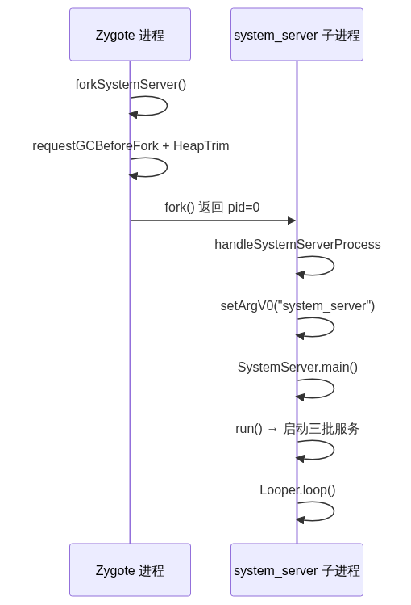
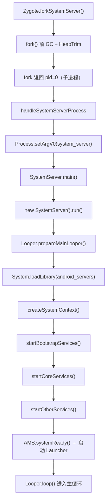
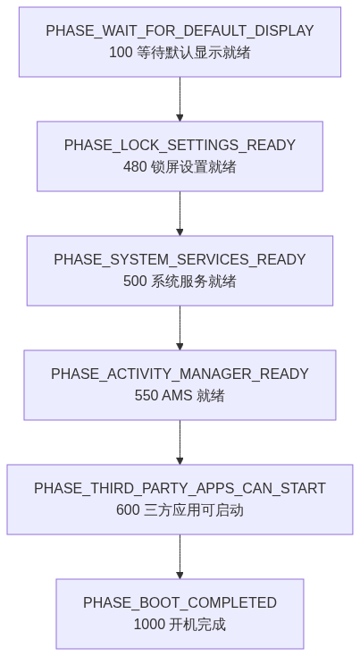
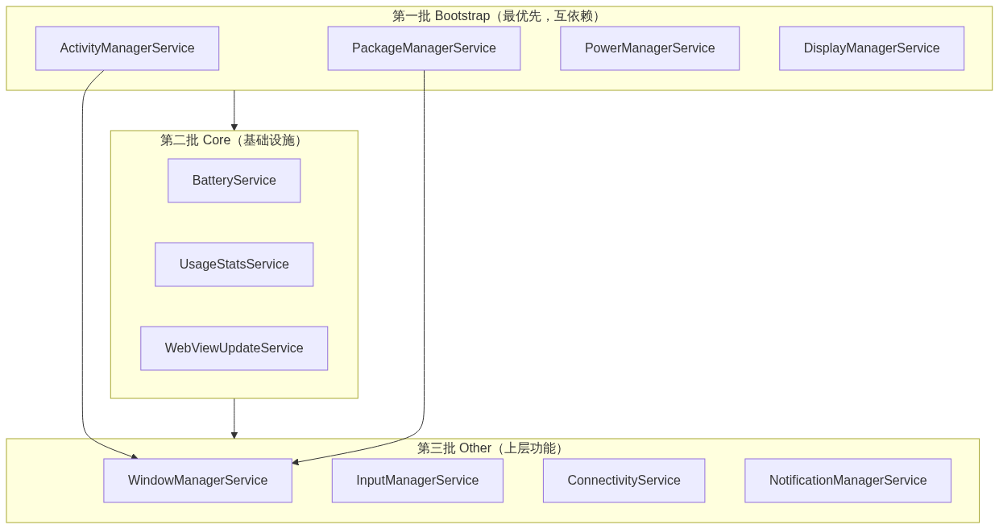

# 09. system_server 进程分析

> system_server 是 Zygote fork 出的第一个 Java 系统进程，承载 AMS/ATMS/WMS/PMS 等绝大多数系统服务，是 Android framework 层的核心。本文按调用链拆解从 `forkSystemServer()` 到三批服务发布、BootPhase 阶段推进、再到 `Looper.loop()` 主循环的完整启动过程。

## 目录

- [一、system_server 的角色与启动时机](#一system_server-的角色与启动时机)
- [二、Zygote fork system_server](#二zygote-fork-system_server)
- [三、SystemServer.main() 入口与 run() 主流程](#三systemservermain-入口与-run-主流程)
- [四、createSystemContext：创建系统上下文](#四createsystemcontext创建系统上下文)
- [五、SystemServiceManager 与 BootPhase 机制](#五systemservicemanager-与-bootphase-机制)
- [六、startBootstrapServices：引导服务](#六startbootstrapservices引导服务)
- [七、startCoreServices：核心服务](#七startcoreservices核心服务)
- [八、startOtherServices：其他服务](#八startotherservices其他服务)
- [九、服务发布：publishBinderService 与 LocalServices](#九服务发布publishbinderservice-与-localservices)
- [十、AMS.systemReady() 与进入主循环](#十amssystemready-与进入主循环)
- [十一、Watchdog 看门狗](#十一watchdog-看门狗)
- [十二、源码阅读入口与关键总结](#十二源码阅读入口与关键总结)

---

## 一、system_server 的角色与启动时机

system_server 是 Zygote 在预加载完成后 fork 出的**第一个子进程**——它必须先于任何 App 启动，因为 App 的启动、窗口管理、权限校验都依赖它承载的系统服务。

| 维度 | 说明 |
|------|------|
| 父进程 | Zygote（fork 而来，继承预加载的 framework） |
| UID/GID | `1000`（system），保留关键 capability |
| 进程名 | `system_server` |
| 入口类 | `com.android.server.SystemServer` |
| 核心职责 | 承载 AMS、ATMS、WMS、PMS 等数百个系统服务 |

它与 Zygote、普通 App 的关系：Zygote 是「母体」，system_server 是「长子」，普通 App 是「后续子进程」。system_server 与 App 的区别在于它保留 system UID 和关键 capability，直接管理系统资源。

---

## 二、Zygote fork system_server

Zygote 预加载完成、socket 就绪后，做的第一件「业务」就是 fork 出 system_server——这是整个系统服务体系的起点。

### forkSystemServer 源码

`forkSystemServer` 构造一组参数描述子进程的身份（UID/GID/能力/入口类），fork 前触发 GC，fork 后让子进程进入 `handleSystemServerProcess`。核心源码：

```java
// frameworks/base/core/java/com/android/internal/os/ZygoteInit.java
private static Runnable forkSystemServer(String abiList, String socketName,
                                         ZygoteServer zygoteServer) {
    String args[] = {
        "--setuid=1000",                       // system UID
        "--setgid=1000",                       // system GID
        "--setgroups=1001,1002,...",           // 附加组
        "--capabilities=" + capabilities,      // 保留关键特权
        "--nice-name=system_server",           // 进程名
        "--runtime-args",
        "--target-sdk-version=" + VMRuntime.SDK_VERSION_CUR_DEVELOPMENT,
        "com.android.server.SystemServer",     // 入口类
    };
    ZygoteArguments parsedArgs = new ZygoteArguments(args);

    // ★ fork 前触发 GC，减少 COW 脏页
    VMRuntime.getRuntime().requestHeapTrim();
    VMRuntime.getRuntime().requestGCBeforeFork();

    int pid = Zygote.forkSystemServer(
        parsedArgs.mUid, parsedArgs.mGid, parsedArgs.mGids, ...);

    if (pid == 0) {
        // === 子进程 ===
        return handleSystemServerProcess(parsedArgs);
    }
    // === 父进程 ===
    return null;   // Zygote 继续 runSelectLoop 等待 App fork 请求
}
```

### 子进程处理：handleSystemServerProcess

子进程 fork 出来后，`handleSystemServerProcess` 先设置进程名，再通过 `RuntimeInit.findStaticMain` 反射定位 `SystemServer` 入口类：

```java
private static Runnable handleSystemServerProcess(ZygoteArguments parsedArgs) {
    // 设置进程名（ps/top 中可见 system_server）
    if (parsedArgs.mNiceName != null) {
        Process.setArgV0(parsedArgs.mNiceName);
    }

    // 加载入口类并反射调用其 main()
    return RuntimeInit.findStaticMain(
        "com.android.server.SystemServer", parsedArgs.mRemainingArgs, ...);
}
```

> 关键点：`RuntimeInit.findStaticMain` 不直接调用 `main()`，而是返回一个 `Runnable`，由上层 Zygote 主循环拿到后执行——这样 fork 后的初始化可以延迟到子进程稳定后再触发。

下图是 fork 的完整时序：



---

## 三、SystemServer.main() 入口与 run() 主流程

### main 入口

`SystemServer.main()` 是 system_server 的 Java 入口，逻辑极简——构造实例并调用 `run()`：

```java
// frameworks/base/services/java/com/android/server/SystemServer.java
public static void main(String[] args) {
    new SystemServer().run();
}
```

### run() 主流程

`run()` 是启动的骨架——先准备 Looper、加载 native 库、创建系统上下文，再按依赖顺序启动三批服务，最后进入消息循环：

```java
private void run() {
    // ① 准备主线程 Looper（system_server 是事件驱动，靠消息循环运转）
    Looper.prepareMainLooper();

    // ② 加载 native 库 android_servers
    System.loadLibrary("android_servers");

    // ③ 创建系统上下文（含 ActivityThread、Instrumentation）
    createSystemContext();

    // ④ 创建服务管理器（三批服务都通过它启动）
    mSystemServiceManager = new SystemServiceManager(mSystemContext);

    // ⑤ 启动三批服务
    startBootstrapServices();   // 引导服务
    startCoreServices();        // 核心服务
    startOtherServices();       // 其他服务

    // ⑥ 进入主循环，永久运行
    Looper.loop();
}
```

整条启动链路的全景图如下：



> `run()` 是 system_server 的「骨架」——先搭环境（Looper、native 库、上下文、服务管理器），再按依赖顺序启动三批服务，最后进入消息循环。理解这条主链就理解了 system_server 启动的全貌。

---

## 四、createSystemContext：创建系统上下文

`createSystemContext()` 负责创建 system_server 运行所需的**系统级 Context 和 ActivityThread**——这是所有系统服务共享的「宿主环境」。

### 核心源码

`createSystemContext()` 的核心是调用 `ActivityThread.systemMain()` 创建系统主线程对象，进而拿到系统 Context：

```java
private void createSystemContext() {
    // ★ 创建 ActivityThread（system_server 的主线程对象）
    ActivityThread activityThread = ActivityThread.systemMain();
    mSystemContext = activityThread.getSystemContext();

    // 设置系统主题
    mSystemContext.setTheme(DEFAULT_SYSTEM_THEME);

    // 创建系统 UI 上下文（SystemUI 用）
    final Context systemUiContext = activityThread.getSystemUiContext();
    systemUiContext.setTheme(DEFAULT_SYSTEM_THEME);
}
```

`ActivityThread.systemMain()` 做了什么：

```java
// ActivityThread.java
public static ActivityThread systemMain() {
    // 创建 ActivityThread，但不 attach 到 AMS（AMS 还没启动）
    ActivityThread thread = new ActivityThread();
    thread.attach(false, 0);
    return thread;
}
```

> `systemMain()` 与普通 App 的 `main()` 本质都是创建 `ActivityThread`，区别在于 system_server 的 ActivityThread 不通过 Binder attach 到 AMS——因为 AMS 本身还没启动，它自己就是「宿主」。这个 ActivityThread 后续被 AMS 作为 `mSystemThread` 引用。

---

## 五、SystemServiceManager 与 BootPhase 机制

SystemServiceManager 是三批服务的**统一容器和管理器**——所有服务通过它启动、注册、并接收 BootPhase 阶段通知。这是 system_server 服务编排的核心机制。

### SystemServiceManager：服务的容器

`SystemServiceManager` 用一个 `ArrayList<SystemService>` 保存所有已启动的服务，`startService` 通过反射实例化服务并调用其 `onStart()` 钩子：

```java
// frameworks/base/services/core/java/com/android/server/SystemServiceManager.java
public class SystemServiceManager {
    private final Context mContext;
    private final ArrayList<SystemService> mServices = new ArrayList<>();

    // 反射创建 + 启动服务
    public <T extends SystemService> T startService(Class<T> serviceClass) {
        Constructor<T> constructor = serviceClass.getConstructor(Context.class);
        T service = constructor.newInstance(mContext);
        startService(service);
        return service;
    }

    public void startService(SystemService service) {
        mServices.add(service);      // 记录到服务列表
        service.onStart();           // ★ 调用服务的 onStart() 钩子
    }
}
```

所有系统服务都继承 `SystemService` 抽象类，实现 `onStart()`（服务初始化）和 `onBootPhase()`（阶段通知）两个钩子。

### BootPhase：启动阶段通知

「三批服务」是启动的**静态分组**，而 BootPhase 是启动的**动态阶段**——服务启动完成后，SystemServiceManager 按阶段推进，逐个通知所有服务当前系统到了哪个阶段。这允许服务在「所有服务都就绪后」再做依赖其他服务的初始化。

```java
// SystemService.java 定义的阶段常量
public static final int PHASE_WAIT_FOR_DEFAULT_DISPLAY = 100;
public static final int PHASE_LOCK_SETTINGS_READY        = 480;
public static final int PHASE_SYSTEM_SERVICES_READY      = 500;
public static final int PHASE_ACTIVITY_MANAGER_READY     = 550;
public static final int PHASE_THIRD_PARTY_APPS_CAN_START = 600;
public static final int PHASE_BOOT_COMPLETED             = 1000;
```

阶段推进图：



> 关键区别：`startBootstrapServices/CoreServices/OtherServices` 负责「创建并注册服务实例」，BootPhase 负责「按阶段通知服务做后续初始化」。例如 WMS 在 `onStart()` 里只初始化基础结构，在 `PHASE_SYSTEM_SERVICES_READY` 才真正显示系统 UI——因为那时依赖的 AMS 才完全就绪。

---

## 六、startBootstrapServices：引导服务

Bootstrap（引导）服务是**最优先、互相依赖**的一批——它们必须在其他服务之前就绪，因为后续服务都依赖它们。

### 核心引导服务

Bootstrap 服务必须最先就绪，因为后续所有服务都依赖它们。核心服务如下：

| 服务 | 职责 | 为什么是 bootstrap |
|------|------|-------------------|
| `ActivityManagerService` | 进程管理、Service/Broadcast/ContentProvider、ANR | 几乎所有服务都要向它注册 |
| `ActivityTaskManagerService` | Activity 启动、任务栈、生命周期（Android 10+ 从 AMS 拆分） | 依赖 AMS，被窗口/输入服务依赖 |
| `PackageManagerService` | 包安装、包信息、权限 | 其他服务启动时都要查包信息 |
| `PowerManagerService` | 亮灭屏、唤醒锁 | 电源管理是基础设施 |
| `DisplayManagerService` | 显示管理 | WMS 依赖它 |
| `UserManagerService` | 多用户管理 | 用户体系基础 |
| `SensorService` | 传感器 | HAL 直连服务 |

> Android 10 起，Activity 相关的任务栈和生命周期从 AMS 拆分到 `ActivityTaskManagerService`（ATMS）。AMS 保留进程管理、组件管理（Service/Broadcast/ContentProvider）、ANR 处理等职责。二者分工：AMS 管「进程和组件」，ATMS 管「Activity 和任务栈」。

### Installer：连接 installd 守护进程

Bootstrap 阶段还会启动 `Installer`——它是 system_server 与 native 守护进程 `installd` 的 Binder 通道，负责包安装的底层文件操作：

```java
Installer installer = mSystemServiceManager.startService(Installer.class);
// Installer 内部通过 Binder 连接 /system/bin/installd
```

> PMS 安装/卸载应用时的底层操作（dexopt、目录创建、权限设置）都委托给 `installd`，因为 `installd` 以 root 权限运行，而 system_server 只有 system 权限。这条 `Installer ↔ installd` 通道是包管理的基础。

### 关键源码

`startBootstrapServices` 按「PMS → AMS → ATMS → 其他 → AMS 收尾」的顺序启动，注意 AMS 与 ATMS 的关联以及最后两步 `setSystemProcess` 和 `installSystemProviders`：

```java
private void startBootstrapServices() {
    // ① Installer 连接 installd
    Installer installer = mSystemServiceManager.startService(Installer.class);

    // ② PMS 最先启动（解析 /system/framework 等）
    mPackageManagerService = PackageManagerService.main(mSystemContext, installer, ...);

    // ③ AMS 启动，绑定 PMS
    mActivityManagerService = new ActivityManagerService(mSystemContext);

    // ④ ATMS 启动（Android 10+，Activity 任务栈/生命周期从 AMS 拆分）
    mActivityTaskManager = new ActivityTaskManagerService(mSystemContext);
    mActivityManagerService.setActivityTaskManager(mActivityTaskManager);

    // ⑤ 电源、显示、用户、传感器等
    mPowerManagerService = mSystemServiceManager
        .startService(PowerManagerService.class);
    mDisplayManagerService = mSystemServiceManager
        .startService(DisplayManagerService.class);

    // ⑥ AMS 设置系统进程信息、安装系统 Provider
    mActivityManagerService.setSystemProcess();
    mActivityManagerService.installSystemProviders();
}
```

> 注意 AMS 最后两步 `setSystemProcess()` 和 `installSystemProviders()`——前者把 AMS 自身注册进 ServiceManager 并设置进程信息，后者安装 SettingsProvider 等系统级 ContentProvider。这两步完成后，其他服务才能通过 Binder 找到 AMS。

---

## 七、startCoreServices：核心服务

Core 服务是介于 bootstrap 和 other 之间的**基础设施层**，依赖 bootstrap 就绪，本身又被 upper 服务依赖。

`startCoreServices` 启动电池、使用统计、WebView 更新等基础设施服务：

```java
private void startCoreServices() {
    // 电池服务
    mSystemServiceManager.startService(BatteryService.class);
    // 使用统计
    mSystemServiceManager.startService(UsageStatsService.class);
    // WebView 更新服务
    mSystemServiceManager.startService(WebViewUpdateService.class);
}
```

| 服务 | 职责 |
|------|------|
| `BatteryService` | 电池状态、充电管理、电量广播 |
| `UsageStatsService` | 应用使用时长统计 |
| `WebViewUpdateService` | WebView 组件更新管理 |

Core 服务数量少、逻辑相对独立——它们不像 bootstrap 那样互相强依赖，但也是系统运行的基石。

---

## 八、startOtherServices：其他服务

Other 服务是**数量最多、功能最上层**的一批，涵盖窗口、输入、网络、通知、位置等，依赖前两批服务已就绪。

### WMS 启动详解

`WindowManagerService` 是 Other 批次里最复杂、最核心的服务——它的启动经历了「创建 → 关联 InputManager → 注册 → 显示系统 UI」多个步骤：

```java
// startOtherServices 中 WMS 相关逻辑
// ① 创建 WMS（传入 InputManagerService 实例）
mWindowManagerService = WindowManagerService.main(context, inputManager, ...);

// ② 输入管理服务关联 WMS
mInputManagerService.setWindowManagerCallbacks(wms);

// ③ WMS 注册到 ServiceManager
wm.systemReady();   // 准备就绪，可接受窗口请求

// ④ 显示系统 UI（SystemUI）
wm.displayReady();
```

> WMS 的启动是「服务间依赖」的典型例子：WMS 依赖 InputManagerService（输入分发）、DisplayManagerService（显示）、PMS（窗口权限校验）。这也是为什么 WMS 只能放在 Other 批次——它的依赖在前两批才就绪。

### 核心服务列表

Other 批次涵盖窗口、输入、网络、通知等上层功能，核心服务如下：

| 服务 | 职责 |
|------|------|
| `WindowManagerService` | 窗口、Surface、焦点、输入分发 |
| `InputManagerService` | 输入事件、按键、触摸 |
| `ConnectivityService` | 网络连接管理 |
| `NotificationManagerService` | 通知栏 |
| `AudioService` | 音频管理 |
| `LocationManagerService` | 定位服务 |
| `ClipboardService` | 剪贴板 |
| `TextServicesManagerService` | 输入法服务管理 |
| `NetworkManagementService` | 网络底层管理 |

三批服务的依赖关系全景图如下：



> 三批服务的划分本质是**依赖排序**——bootstrap 无依赖先启动，core 依赖 bootstrap，other 依赖前两者。这种分层启动保证了「被依赖者先就绪」。

---

## 九、服务发布：publishBinderService 与 LocalServices

服务启动后需要「暴露」给调用方——system_server 区分了两种发布机制：对外的 Binder 跨进程发布，和对内的进程内直接调用。

### 对外：publishBinderService → ServiceManager

需要被其他进程调用的服务，通过 `publishBinderService` 注册到 ServiceManager：

```java
// SystemService.java
protected final void publishBinderService(String name, IBinder service) {
    publishBinderService(name, service, false);
}

protected final void publishBinderService(String name, IBinder service, boolean allowIsolated) {
    ServiceManager.addService(name, service, allowIsolated);
}
```

例如 AMS 在 `setSystemProcess()` 里发布自己：

```java
// ActivityManagerService.setSystemProcess()
ServiceManager.addService(Context.ACTIVITY_SERVICE, this, ...);  // "activity"
```

> 发布到 ServiceManager 的服务，App 或其他进程可通过 `ServiceManager.getService("activity")` 拿到 Binder 句柄，之后直接跨进程调用。

### 对内：LocalServices

system_server **内部**服务之间的调用不走 Binder（避免跨进程开销），而是用进程内的 `LocalServices` 注册表：

```java
// LocalServices.java
public static <T> void addService(Class<T> type, T service) { ... }
public static <T> T getService(Class<T> type) { ... }
```

| 机制 | 适用场景 | 通信方式 |
|------|---------|---------|
| `publishBinderService` → ServiceManager | 跨进程（App、其他系统进程调用） | Binder IPC |
| `LocalServices` | 进程内（system_server 内部服务互调） | 直接方法调用 |

> 典型例子：`LocalServices.addService(WindowManagerInternal.class, ...)` 供 system_server 内部的 AMS 直接调用 WMS，而 App 只能通过 ServiceManager 走 Binder。这套「内外分离」既保证了性能，又隔离了权限。

---

## 十、AMS.systemReady() 与进入主循环

所有服务启动完成后，进入收尾阶段——AMS 的 `systemReady()` 是系统「彻底就绪」的标志。

所有服务注册完成后，AMS 的 `systemReady()` 执行收尾——启动 SystemUI、Watchdog、Launcher 并广播开机完成：

```java
mActivityManagerService.systemReady(() -> {
    // ① 启动系统 UI（SystemUI：状态栏、导航栏）
    startSystemUi(context, windowManagerF);

    // ② 启动看门狗，监控系统服务是否卡死
    Watchdog.getInstance().start();

    // ③ 启动 Launcher（桌面）
    mActivityManagerService.startHomeOnAllDisplays();

    // ④ 广播 BOOT_COMPLETED，通知所有监听方系统已就绪
    mActivityManagerService.finishBooting();
});
```

`systemReady()` 之后的收尾动作：

| 步骤 | 作用 |
|------|------|
| 启动 SystemUI | 状态栏、导航栏、通知中心 |
| 启动 Watchdog | 监控核心服务死锁/卡死，卡死则重启 system_server |
| 启动 Launcher | 桌面可见，用户可交互 |
| 广播 BOOT_COMPLETED | 第三方应用收到开机完成广播 |

最后 `run()` 执行 `Looper.loop()`——system_server 进入**永久消息循环**，通过 Binder 响应各进程的服务请求。

---

## 十一、Watchdog 看门狗

Watchdog 是 system_server 的「健康监控器」——它监控核心服务的响应情况，一旦检测到死锁或卡死，就收集现场信息并重启 system_server，防止系统假死。

### 工作原理

Watchdog 的核心是一个独立线程，周期性触发所有被监控服务的 `monitor()` 方法，超时则收集现场并重启：

```java
// Watchdog.java
public class Watchdog extends Thread {
    // 核心服务实现 Monitor 接口，重写 monitor() 方法
    public interface Monitor {
        void monitor();
    }

    // AMS 等核心服务在启动时注册为被监控对象
    public void addMonitor(Monitor monitor) { ... }

    @Override
    public void run() {
        while (true) {
            // ① 定期触发所有 Monitor 的 monitor() 方法
            for (Monitor monitor : mMonitors) {
                monitor.monitor();   // 若服务死锁，这里会阻塞
            }

            // ② 检查是否超时（默认 60s）
            // ③ 超时 → 收集线程栈 → 重启 system_server
        }
    }
}
```

### 被监控的核心服务

实现 `Monitor` 接口的核心服务及其检查内容如下：

| 服务 | monitor() 检查什么 |
|------|------------------|
| `ActivityManagerService` | 是否持有 AM 锁且能正常响应 |
| `WindowManagerService` | WMS 锁是否可用 |
| `InputManagerService` | 输入分发是否正常 |
| `PowerManagerService` | 电源锁状态 |

> Watchdog 的兜底逻辑：核心服务卡死超过阈值（默认 60s）→ `Process.killProcess(system_server 的 pid)` 自杀 → init 检测到 system_server 退出后重启整个 framework。虽然代价是「重启一次」，但好过「系统永久假死」。

---

## 十二、源码阅读入口与关键总结

### 源码阅读入口

把前文提到的关键源码文件按调用顺序汇总成一张速查表：

| 文件 | 职责 | 顺序 |
|------|------|------|
| `frameworks/base/core/java/com/android/internal/os/ZygoteInit.java` | `forkSystemServer` | 1 |
| `frameworks/base/services/java/com/android/server/SystemServer.java` | `main` + `run` + 三批服务 | 2 |
| `frameworks/base/services/core/java/com/android/server/SystemServiceManager.java` | 服务容器 + BootPhase | 3 |
| `frameworks/base/services/core/java/com/android/server/SystemService.java` | 服务基类（onStart/onBootPhase） | 4 |
| `frameworks/base/services/core/java/com/android/server/am/ActivityManagerService.java` | AMS（进程/组件管理） | 5 |
| `frameworks/base/services/core/java/com/android/server/wm/ActivityTaskManagerService.java` | ATMS（Activity/任务栈） | 6 |
| `frameworks/base/services/core/java/com/android/server/wm/WindowManagerService.java` | WMS | 7 |
| `frameworks/base/services/core/java/com/android/server/Watchdog.java` | 看门狗 | 8 |

### 关键总结

1. **fork 而非 exec**：system_server 由 Zygote fork 而来，继承预加载的 framework 和 JNI 绑定，启动成本极低
2. **三批服务按依赖分层**：bootstrap（互依赖最优先）→ core（基础设施）→ other（上层功能），本质是依赖排序
3. **SystemServiceManager + BootPhase 是编排核心**：静态分组负责「创建服务」，BootPhase 动态阶段负责「通知服务做后续初始化」
4. **Looper 是骨架**：`prepareMainLooper` → 启动服务 → `loop()`，整个 system_server 是事件驱动的消息循环
5. **AMS/ATMS 分工**：Android 10+ 拆分为 AMS（进程/组件）和 ATMS（Activity/任务栈），二者通过 `setActivityTaskManager` 关联
6. **服务发布内外分离**：对外 `publishBinderService` → ServiceManager（跨进程 Binder），对内 `LocalServices`（进程内直调）
7. **Watchdog 兜底**：核心服务卡死则收集现场并重启 system_server，防止系统假死
