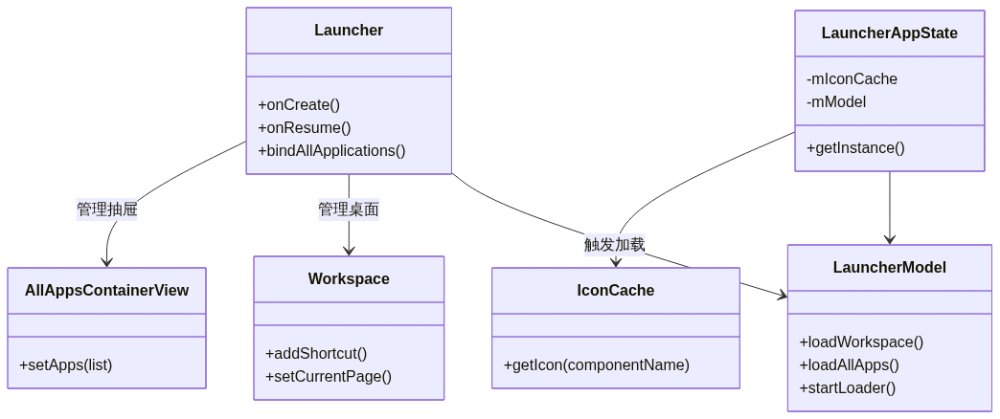
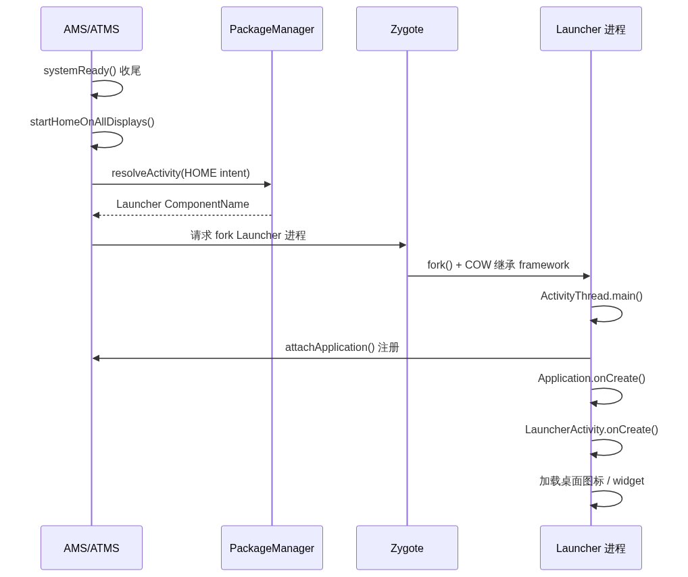
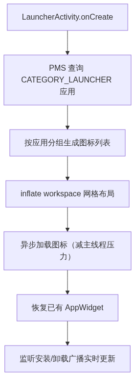

# 10. Launcher 启动分析

> Launcher（桌面）是 Android 系统的 HOME 应用——本质是一个普通 App，但承担「系统桌面」角色，是开机后用户看到的第一个界面。本文按调用链拆解从 `AMS.systemReady()` 触发、`resolveActivity` 解析、Zygote fork、`attachApplication` 绑定，到 `LauncherModel` 工作线程加载应用列表和图标的完整过程。

## 目录

- [一、Launcher 的角色与核心类结构](#一launcher-的角色与核心类结构)
- [二、启动触发：systemReady → startHomeOnAllDisplays](#二启动触发systemready--starthomeonalldisplays)
- [三、解析目标 Launcher：resolveActivity 与默认管理](#三解析目标-launcherresolveactivity-与默认管理)
- [四、fork Launcher 进程](#四fork-launcher-进程)
- [五、Launcher 应用初始化：attachApplication → bindApplication](#五launcher-应用初始化attachapplication--bindapplication)
- [六、LauncherActivity 启动与 LauncherModel 加载](#六launcheractivity-启动与-launchermodel-加载)
- [七、桌面加载：图标缓存与 AppWidget](#七桌面加载图标缓存与-appwidget)
- [八、关键总结](#八关键总结)

---

## 一、Launcher 的角色与核心类结构

Launcher 是系统的**桌面应用**，通过 `Intent.CATEGORY_HOME` 标识自己为 HOME——系统可同时安装多个 Launcher（如原生 Pixel Launcher、厂商定制桌面），由用户选择默认。

| 维度 | 说明 |
|------|------|
| 本质 | 一个普通 App，由 Zygote fork、运行 ActivityThread |
| 标识 | `Intent.ACTION_MAIN` + `CATEGORY_HOME` |
| 职责 | 显示桌面图标、管理 widget、响应点击启动其他 App |
| 进程 | 独立进程（如 `com.google.android.apps.nexuslauncher`） |

### Launcher3 的核心类结构

以 AOSP 的 Launcher3 为例，Launcher 由一组职责清晰的类组成：



| 类 | 职责 |
|----|------|
| `Launcher` | 主 Activity，协调各组件，处理用户交互 |
| `LauncherModel` | 数据模型，在**工作线程**加载应用列表和 workspace 数据 |
| `LauncherAppState` | 进程级单例，持有 IconCache 和 LauncherModel |
| `IconCache` | 图标缓存，缓存从 APK 解码的应用图标 |
| `Workspace` | 桌面工作区（继承 PagedView），管理桌面页面和快捷方式 |
| `AllAppsContainerView` | 应用抽屉，展示全部应用 |

> Launcher 与普通 App 唯一本质区别，是它在系统启动收尾阶段被 AMS 主动拉起；其余启动流程（fork、生命周期、ActivityThread）与普通 App 完全一致。

---

## 二、启动触发：systemReady → startHomeOnAllDisplays

Launcher 的启动入口在 system_server 启动的**收尾阶段**——AMS 的 `systemReady()` 回调里。

AMS 完成所有服务发布后，在 `systemReady()` 回调中触发桌面启动：

```java
// ActivityManagerService / ActivityTaskManagerService
mActivityManagerService.systemReady(() -> {
    // 启动 SystemUI、Watchdog 之后……

    // ★ 启动桌面
    startHomeOnAllDisplays();
});
```

`startHomeOnAllDisplays` 位于 `ActivityTaskManagerService`（Android 10+ 拆分后，Home 启动归 ATMS 管）：

```java
// ActivityTaskManagerService.java
boolean startHomeOnAllDisplays(int userId, String reason) {
    // 对每个 display 都启动一个 Home Activity（主屏 + 副屏）
    for (int i = 0; i < mRootWindowContainer.getChildCount(); i++) {
        // 构造 HOME Intent
        Intent homeIntent = new Intent(Intent.ACTION_MAIN);
        homeIntent.addCategory(Intent.CATEGORY_HOME);
        // 解析并启动
        startHomeActivity(homeIntent, ...);
    }
}
```

> 触发时机：system_server 里三批服务全部启动、`systemReady()` 收尾时才拉 Launcher——因为桌面要显示应用列表、图标，依赖 PMS（查询应用）、WMS（窗口渲染）和 AppWidgetService 都已就绪。

---

## 三、解析目标 Launcher：resolveActivity 与默认管理

系统可能有多个 Launcher，AMS 需要先确定**启动哪一个**——通过 PMS 解析 HOME Intent。

AMS 构造 HOME Intent 后，交给 PMS 解析出目标 Activity：

```java
// ActivityTaskManagerService.startHomeActivity()
private boolean startHomeActivity(Intent intent, ...) {
    // ★ 解析出能响应 HOME Intent 的 Activity
    ActivityInfo aInfo = resolveActivityInfo(intent, ...);

    if (aInfo != null) {
        ComponentName cn = new ComponentName(aInfo.packageName, aInfo.name);
        // 启动该 Activity
        mActivityStartController.startHomeActivity(intent, aInfo, reason, ...);
    }
}
```

### 多 Launcher 场景的解析

系统可能存在多个 Launcher 时，解析逻辑分三种情况处理：

```text
resolveActivityInfo(HOME intent)
  → 查询 PMS 中所有声明 CATEGORY_HOME 的 Activity
  → 只有一个 Launcher → 直接返回
  → 有多个 Launcher：
      - 用户已选默认 → 返回默认项
      - 未设默认 → 弹出选择框（ResolverActivity）让用户选
  → 返回目标 Launcher 的 ActivityInfo
```

### 默认 Launcher 的管理：RoleManager

Android 10+ 用 **RoleManager** 管理「默认应用」角色（含 HOME 角色），取代了旧的 `PackageManager.setDefaultApplication`：

```java
// 用户选择默认 Launcher 后，系统记录到 RoleManager
RoleManager roleManager = context.getSystemService(RoleManager.class);
// ROLE_HOME 角色对应默认 Launcher
roleManager.addRoleHolderAsUser(RoleManager.ROLE_HOME, packageName, ...);
```

| 机制 | 说明 |
|------|------|
| `RoleManager.ROLE_HOME` | 默认桌面角色，对应「默认 Launcher」 |
| 旧 API `setDefaultApplication` | 已废弃，被 RoleManager 取代 |
| 记录持久化 | 用户选择后写入系统设置，下次开机直接定位 |

> `resolveActivity` 是「意图解析」核心机制——PMS 根据 Intent 的 action + category 匹配注册过的 Activity。用户选定默认 Launcher 后，选择被 RoleManager 持久化，下次开机直接定位，不再弹框。

---

## 四、fork Launcher 进程

确定目标 Launcher 后，AMS 判断其进程是否存在，不存在则请求 Zygote fork。

Launcher 进程不存在时，AMS 通过 Zygote socket 请求 fork：

```text
AMS.startActivity(LauncherComponentName)
  → 检查目标进程是否已存在
  → 不存在 → 通过 /dev/socket/zygote 发 fork 请求
  → Zygote fork() 出 Launcher 进程（COW 继承预加载的 framework）
  → 子进程 exec ActivityThread.main()
```

fork 时 AMS 携带的关键参数：

| 参数 | 值示例 | 含义 |
|------|--------|------|
| `uid/gid` | 应用专属 UID | Launcher 进程的 Linux 身份 |
| `nice-name` | 包名 | 进程名 |
| `seinfo` | targetSdkVersion | SELinux 上下文 |
| `runtime-flags` | 位掩码 | Debug/Profile 标记 |

整个启动时序如下：



> 与普通 App 完全一致：Launcher 进程由 Zygote fork 而来，继承预加载的 framework 类和 JNI 绑定，启动成本极低。

---

## 五、Launcher 应用初始化：attachApplication → bindApplication

fork 出来的 Launcher 子进程进入 `ActivityThread.main()`，开始标准的 App 初始化流程。

Launcher 进程 fork 后，按标准 App 流程初始化：

```java
// ActivityThread.java
public static void main(String[] args) {
    Looper.prepareMainLooper();           // 主线程 Looper

    ActivityThread thread = new ActivityThread();
    thread.attach(false, 0);              // ★ 通过 Binder attach 到 AMS

    Looper.loop();
}

private void attach(boolean system, long startSeq) {
    // 通过 AMS 的 Binder 代理注册应用进程
    final IActivityManager mgr = ActivityManager.getService();
    mgr.attachApplication(mAppThread, startSeq);   // → AMS
}
```

AMS 收到 `attachApplication` 后，通过 Binder 回调 App 进程的 `bindApplication`，触发 `Application.onCreate()`：

```text
AMS.attachApplication(mAppThread)
  → 通过 ApplicationThread 跨进程调用 App 侧
  → ActivityThread.handleBindApplication()
    → 创建 LoadedApk、ClassLoader
    → 实例化 Application 对象
    → 调用 Application.onCreate()      ★ App 生命周期开始
  → AMS 随后调度 HOME Activity 启动
```

> `attachApplication` 是 App 与 system_server 建立连接的关键一步——App 进程通过 Binder 把自己的 `ApplicationThread` 注册给 AMS，之后 AMS 才能通过它调度 Activity 生命周期。这一步 Launcher 与普通 App 无异。

---

## 六、LauncherActivity 启动与 LauncherModel 加载

AMS 调度 LauncherActivity 的生命周期后，Launcher 开始加载桌面内容——这是 Launcher 区别于普通 App 的核心逻辑。

### Launcher.onCreate 触发加载

`Launcher.onCreate` 中获取进程级单例 `LauncherAppState`，再触发 `LauncherModel.startLoader` 启动数据加载：

```java
// Launcher.java
protected void onCreate(Bundle savedInstanceState) {
    super.onCreate(savedInstanceState);

    // ★ 获取进程级单例
    LauncherAppState app = LauncherAppState.getInstance(this);

    // ★ 触发数据加载（在工作线程执行）
    mModel = app.getModel();
    mModel.startLoader(currentScreen);
}
```

### LauncherModel 的工作线程加载

`LauncherModel` 是 Launcher 的**数据加载核心**——它在独立工作线程中加载应用列表和 workspace 数据，避免阻塞主线程：

```java
// LauncherModel.java
public void startLoader(int synchronousBindPage) {
    // ★ 在 HandlerThread 工作线程执行加载
    mWorker.post(() -> {
        // 1. 加载 workspace 数据（桌面布局、快捷方式）
        loadWorkspace();

        // 2. 加载所有应用列表
        List<LauncherActivityInfo> apps = loadAllApps();

        // 3. 回主线程绑定 UI
        mUiHandler.post(() -> bindAllApplications(apps));
    });
}

private List<LauncherActivityInfo> loadAllApps() {
    // ★ 通过 LauncherApps 查询所有 CATEGORY_LAUNCHER 应用
    return mLauncherApps.getActivityList(null, UserHandle.myUserId());
}
```

> 关键设计：加载在 `HandlerThread` 工作线程执行（`mWorker`），结果通过 `mUiHandler` 回到主线程绑定 UI——这是「数据加载与 UI 渲染分离」的典型做法，避免加载应用列表造成桌面卡顿。

---

## 七、桌面加载：图标缓存与 AppWidget

应用列表加载完成后，Launcher 开始构建桌面——包括图标加载和 AppWidget 恢复。

### 桌面加载流程

LauncherActivity 启动后，按以下流程构建桌面：



```text
LauncherActivity.onCreate()
  → 通过 PMS 查询所有 CATEGORY_LAUNCHER 的 Activity
  → 按应用分组生成快捷方式（图标）列表
  → inflate workspace 布局（桌面网格）
  → 逐个异步加载图标（减轻主线程压力）
  → 恢复已有的 AppWidget（RemoteViews 跨进程渲染）
  → 监听应用安装/卸载广播，实时更新桌面图标
```

### 图标加载与 IconCache

图标从 APK 资源解码是耗时操作，Launcher 用 `IconCache` 缓存解码结果：

```java
// IconCache.java
public Drawable getIcon(ComponentName component, ...) {
    // ① 先从内存缓存查
    if (cache contains component) return cachedIcon;

    // ② 缓存未命中 → 从 APK 资源解码
    Drawable icon = loadIconFromApk(component);

    // ③ 写入缓存
    cache.put(component, icon);
    return icon;
}
```

| 机制 | 说明 |
|------|------|
| 内存缓存 | 图标解码后缓存在 `IconCache`，重复加载零成本 |
| 异步加载 | 图标在后台线程解码，避免阻塞主线程 |
| 图标来源 | 从 APK 的 `AndroidManifest.xml` 声明 + 资源文件解码 |

### AppWidget 恢复

桌面上的小组件通过 `RemoteViews` 跨进程渲染，由 AppWidgetService 提供数据：

```text
恢复 AppWidget：
  → Launcher 向 AppWidgetService 查询已添加的 widget 列表
  → AppWidgetService 返回 RemoteViews（描述 widget 布局的序列化对象）
  → Launcher 在 Workspace 上通过 RemoteViews 渲染 widget
  → 宿主（Launcher）与 widget 提供者（App）跨进程通信更新内容
```

### 关键点

桌面加载各环节的技术要点汇总如下：

| 步骤 | 说明 |
|------|------|
| 查询应用列表 | `LauncherApps.getActivityList` 拿到所有可启动应用 |
| 图标缓存 | `IconCache` 缓存解码结果，避免重复解码 |
| 异步加载 | 工作线程加载数据，主线程只做 UI 绑定 |
| AppWidget 恢复 | `RemoteViews` 跨进程渲染，由 AppWidgetService 提供 |
| 动态更新 | 监听 `ACTION_PACKAGE_ADDED/REMOVED` 广播，实时增删图标 |

---

## 八、关键总结

1. **Launcher 是普通 App**：由 Zygote fork、运行 ActivityThread，唯一区别是它在 `systemReady()` 收尾阶段被 AMS 主动拉起
2. **启动入口在 ATMS**：Android 10+ 后 `startHomeOnAllDisplays` 归 `ActivityTaskManagerService` 管，不再是 AMS
3. **默认管理用 RoleManager**：Android 10+ 用 `RoleManager.ROLE_HOME` 管理默认 Launcher，取代旧的 `setDefaultApplication`
4. **LauncherModel 工作线程加载**：数据加载在 `HandlerThread` 执行，通过 `mUiHandler` 回主线程绑定 UI，避免桌面卡顿
5. **图标缓存 IconCache**：图标解码结果缓存，异步加载，重复访问零成本
6. **依赖关系决定时机**：Launcher 最后启动，因为它依赖 PMS（查询应用）、WMS（窗口渲染）、AppWidgetService 都已就绪
