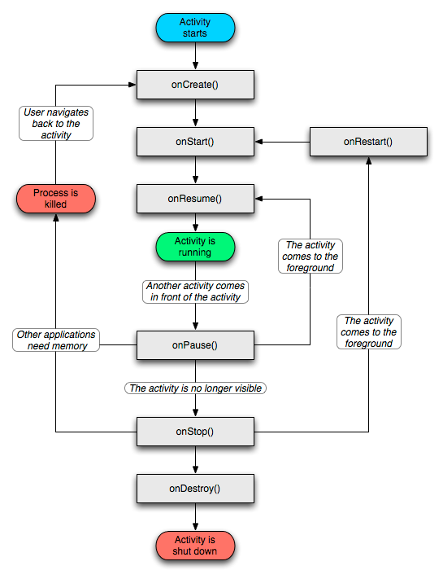
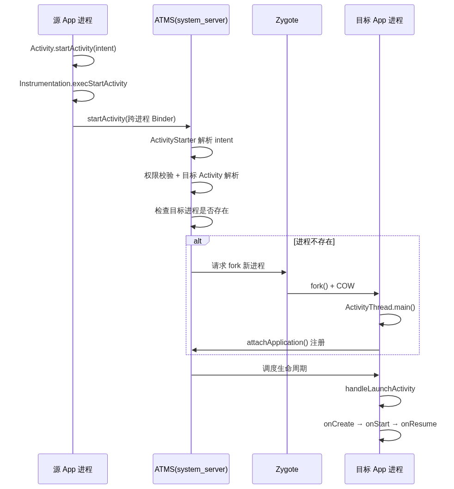
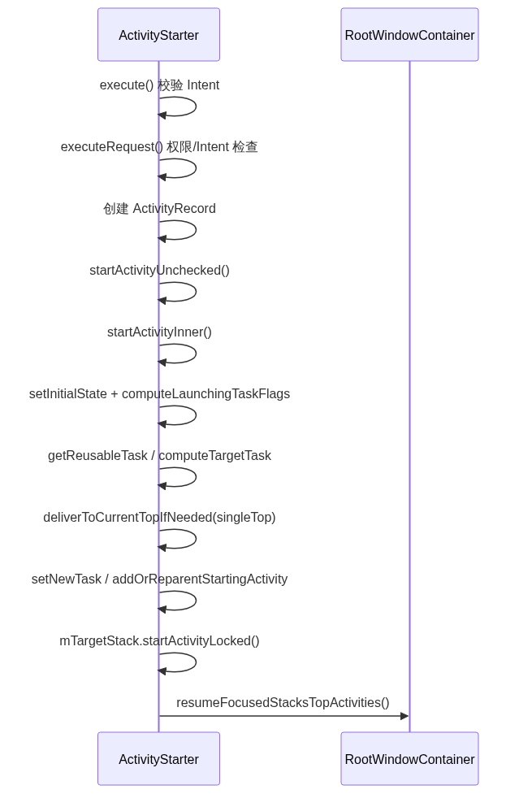

# 11. Activity 启动过程分析（上）

> Activity 启动的前半程——从 `startActivity()` 出发，经 Instrumentation 跨进程到 system_server 的 ATMS，由 ActivityStarter 完成解析、launchMode 判断与 task 复用，再视情况经 ProcessList 请求 Zygote fork 新进程。本文按源码调用链拆解这条路径，覆盖「App 发起 → 系统调度 → 进程创建」三个阶段。

## 目录

- [Activity 概览：概念、作用、启动方式、生命周期](#activity-概览概念作用启动方式生命周期)
- [一、启动总览](#一启动总览)
- [二、App 侧：startActivity → Instrumentation](#二app-侧startactivity--instrumentation)
- [三、跨进程到 ATMS](#三跨进程到-atms)
- [四、ActivityStarter 启动调度](#四activitystarter-启动调度)
- [五、进程创建：ProcessList → Zygote](#五进程创建processlist--zygote)

---

## Activity 概览：概念、作用、启动方式、生命周期

在拆解启动链路前，先建立对 Activity 的整体认知——它是什么、做什么、怎么启、生命周期怎么走。

### 概念

`Activity` 是 Android 应用的「页面」——Android 四大组件之一（Activity / Service / BroadcastReceiver / ContentProvider）。一个 Activity 通常对应**一屏**的 UI 界面，是用户与应用交互的核心载体。

### 作用

Activity 在 Android 应用中承担四大核心作用：

| 作用 | 说明 |
|------|------|
| **UI 承载** | 每个 Activity 拥有自己的 `Window`（通常是 `PhoneWindow`），承载一套完整的视图树 |
| **用户交互** | 响应点击、滑动、返回等操作，通过 `setContentView` 加载布局 |
| **栈管理** | 与其他 Activity 组成任务栈（Task），按启动顺序压栈/弹栈，构成「返回栈」 |
| **生命周期感知** | 提供 `onCreate → onDestroy` 回调，配合系统资源管理（内存、电源、电量等） |
| **跨进程组件** | Activity 自身不跨进程，但通过 Service、BroadcastReceiver、ContentProvider 支持跨进程交互 |

### 重要的启动方式

启动 Activity 有多种方式，按常见度排序：

| 启动方式 | 说明 |
|---------|------|
| **显式 Intent** | 直接指定组件：`Intent(this, DetailActivity::class.java)` |
| **隐式 Intent** | 通过 Action/Category 让系统匹配目标组件（如 `ACTION_VIEW` + URI） |
| **`startActivity`** | 最常用，启动一个 Activity（不期望返回结果） |
| **`startActivityForResult`** | 启动并期望返回结果（已废弃，推荐 Activity Result API） |
| **`FLAG_ACTIVITY_NEW_TASK`** | 在新 task 中启动 |
| **`FLAG_ACTIVITY_CLEAR_TOP`** | 清除目标 Activity 之上的所有 |
| **`FLAG_ACTIVITY_SINGLE_TOP`** | 栈顶复用（对应 `singleTop` 启动模式） |
| **从 Launcher 启动** | 点桌面图标 → AMS 解析 HOME Intent → 启动 launchMode 决定 task 行为 |
| **从通知启动** | PendingIntent 触发，与普通 startActivity 类似 |

### 启动模式

启动模式（launchMode）是 Manifest 中 `<activity android:launchMode="...">` 声明的属性，决定 Activity 在任务栈（Task）中的**实例化与复用行为**——这是上篇 ActivityStarter 章节处理的核心。

四种 launchMode：

| launchMode | 实例化行为 | 典型场景 |
|-----------|-----------|---------|
| `standard` | 默认，每次启动都新建实例，压入当前 task | 普通页面、列表详情 |
| `singleTop` | 栈顶已是该 Activity 则复用（走 `onNewIntent`），否则新建 | 通知点击、搜索页 |
| `singleTask` | task 内复用已有实例，并清除其上的所有 Activity | 应用主页面 |
| `singleInstance` | 独占一个 task，该 task 只能有它一个 Activity | 电话拨号、闹钟 |

也可通过 Intent flag 在代码里动态设置，部分 flag 等价于 launchMode：

| Intent flag | 等价/对应 | 说明 |
|------------|----------|------|
| `FLAG_ACTIVITY_SINGLE_TOP` | `singleTop` | 栈顶复用 |
| `FLAG_ACTIVITY_NEW_TASK` | 类似 `singleTask` 的部分行为 | 在独立 task 启动 |
| `FLAG_ACTIVITY_CLEAR_TOP` | 配合 singleTop | 清除目标之上的 Activity 再启动 |
| `FLAG_ACTIVITY_NEW_TASK \| CLEAR_TOP` | 接近 `singleTask` | 组合实现复用 |

> 优先级：**Intent flag 动态设置 > Manifest 静态声明**。两者都影响 `ActivityStarter.startActivityInner` 里的 `computeLaunchingTaskFlags` / `getReusableTask` 逻辑——launchMode 最终决定 Activity 是复用已有 Task 还是新建 Task（详见上篇第四章）。

### 生命周期

Activity 的生命周期由 `Instrumentation` 调度，由 system_server 的 ATMS 通过 Binder 驱动整个流程。完整生命周期图如下：



七个核心回调：

| 回调 | 触发场景 | 典型工作 |
|------|---------|---------|
| `onCreate` | Activity 首次创建（每次实例只一次） | setContentView、初始化成员 |
| `onStart` | 即将可见 | 注册广播、UI 准备 |
| `onResume` | 获得焦点，可交互 | 启动动画、获取输入 |
| `onPause` | 失去焦点 | 暂停耗时操作、保存状态 |
| `onStop` | 完全不可见 | 释放资源、注销广播 |
| `onDestroy` | 销毁 | 彻底释放、不保存状态 |
| `onRestart` | 从 STOPPED 重新可见 | 与 onStart 配对 |

> 关键点：启动流程的核心任务就是「经过这些回调」——本文（上）篇讲的是 source `Activity`（启动方）的 `onPause` 调度；本文（下）篇讲的是 target `Activity`（被启动方）的 `onCreate → onStart → onResume` 触发。

---

## 一、启动总览

启动 Activity 分两种情况：**应用进程内部启动**（进程已存在，直接调度）和**跨进程启动**（如 Launcher 启动应用，需先 fork 新进程）。两条路径前半段一致，差异只在「是否需要创建进程」。

整个启动过程的跨进程时序如下（本文覆盖前半程，即 App 发起 → ATMS 调度 → 进程创建）：



| 阶段      | 关键角色                           | 职责                                |
| ------- | ------------------------------ | --------------------------------- |
| App 侧发起 | `Activity` / `Instrumentation` | 封装 intent，跨进程调用 ATMS              |
| 系统侧调度   | `ATMS` / `ActivityStarter`     | 解析 intent、权限校验、launchMode、task 处理 |
| 进程创建    | `ProcessList` / `Zygote`       | 目标进程不存在时 fork                     |

> 核心认知：Activity 启动本质是「App 进程请求 system_server 帮忙调度 Activity」。App 只负责发起，真正的启动逻辑（解析、权限、launchMode、task、进程）全在 system_server 的 ATMS 里。

---

## 二、App 侧：startActivity → Instrumentation

App 侧只做「封装 + 转发」——把启动意图交给 Instrumentation，再由它跨进程调用 ATMS。

### startActivityForResult

`Activity.startActivity` 是所有启动的入口，最终收敛到 `startActivityForResult`：

```java
// Activity.java
public void startActivity(Intent intent) {
    startActivity(intent, null);
}

public void startActivityForResult(Intent intent, int requestCode, Bundle options) {
    if (mParent == null) {
        // ★ 委托给 Instrumentation，跨进程启动
        Instrumentation.ActivityResult ar =
            mInstrumentation.execStartActivity(
                this, mMainThread.getApplicationThread(), mToken, this,
                intent, requestCode, options);
        if (ar != null) {
            mMainThread.sendActivityResult(mToken, mEmbeddedID, requestCode,
                ar.getResultCode(), ar.getResultData());
        }
    } else {
        // 嵌套 Activity（TabActivity）场景
        mParent.startActivityFromChild(this, intent, requestCode, options);
    }
}
```

### 认识 Instrumentation

在讲 `execStartActivity` 之前，先理解 `Instrumentation` 是什么——它是理解整个 Activity 启动和生命周期回调的关键枢纽。

**Instrumentation&#x20;**：`Instrumentation` 是 Android 框架层的一个系统类（`android.app.Instrumentation`），它在**任何应用代码执行之前**就被初始化，负责「监控系统与应用的交互」。每个 `ActivityThread` 都持有一个 `mInstrumentation` 实例，进程启动时创建，贯穿 App 的整个生命周期。

**主要作用**：

| 作用               | 说明                                                                              |
| ---------------- | ------------------------------------------------------------------------------- |
| **启动 Activity**  | `execStartActivity` 把启动请求跨进程发给 ATMS（本文主线）                                       |
| **生命周期回调的「中转站」** | `onCreate`/`onStart`/`onResume` 等生命周期都经 `callActivityOnXxx` 触发，而非 Activity 直接调用 |
| **实例化组件**        | `newActivity`/`newApplication` 通过反射创建组件实例                                       |
| **测试支持**         | 单元测试、UI 测试（Espresso/Robolectric）通过替换 Instrumentation 注入 mock、监控生命周期             |

**生命周期为何要经过它**：以 `onCreate` 为例，Activity 的 `performCreate` 最终调用 `mInstrumentation.callActivityOnCreate(this, ...)`，而不是直接调 `onCreate`。这样设计让框架能在生命周期回调前后插入监控、统计、测试钩子——Instrumentation 就是这道「中间层」。

```java
// Instrumentation.java —— 生命周期都经过它
public void callActivityOnCreate(Activity activity, Bundle icicle) {
    activity.performCreate(icicle);   // 内部才真正调 onCreate
}
public void callActivityOnStart(Activity activity) {
    activity.performStart();
}
public void callActivityOnResume(Activity activity) {
    activity.performResume();
}
```

> 一句话：**Instrumentation 是 App 与系统之间的「中间人」**——启动请求经它发往 system_server，生命周期回调经它转回 Activity，测试框架也靠替换它来干预应用运行。

### Instrumentation.execStartActivity

`execStartActivity` 是 Instrumentation 启动 Activity 的入口，负责把启动请求跨进程发给 ATMS。它的几个关键参数：

```java
// Instrumentation.java
public ActivityResult execStartActivity(
        Context who,             // 启动方 Context
        IBinder contextThread,   // ApplicationThread 的 Binder（跨进程用）
        IBinder token,           // 指向 AMS 中的 ActivityRecord
        Activity target,         // 当前 Activity
        Intent intent,
        int requestCode,
        Bundle options) {
    // 迁移 URI 数据到剪贴板、处理离开进程
    intent.migrateExtraStreamToClipData(who);
    intent.prepareToLeaveProcess(who);

    // ★ 跨进程请求 ATMS 启动 Activity
    int result = ActivityTaskManager.getService().startActivity(
        whoThread, who.getBasePackageName(), who.getAttributionTag(), intent,
        intent.resolveTypeIfNeeded(who.getContentResolver()), token,
        target != null ? target.mEmbeddedID : null, requestCode, 0, null, options);

    // 检查结果，异常则抛对应异常
    checkStartActivityResult(result, intent);
    return null;
}
```

> `contextThread` 是 `IApplicationThread` 的 Binder 对象——它是 App 进程暴露给 system_server 的「回调通道」，后续 ATMS 通过它调度 App 的 Activity 生命周期。`token` 指向调用方 Activity 在 AMS 中的 `ActivityRecord`。

---

## 三、跨进程到 ATMS

从 `ActivityTaskManager.getService()` 开始，调用进入 system_server 进程。

### ActivityTaskManager.getService

`ActivityTaskManager.getService()` 通过 ServiceManager 获取 ATMS 的 Binder 代理：

```java
// ActivityTaskManager.java
public static IActivityTaskManager getService() {
    return IActivityTaskManagerSingleton.get();
}

private static final Singleton<IActivityTaskManager> IActivityTaskManagerSingleton =
        new Singleton<IActivityTaskManager>() {
            @Override
            protected IActivityTaskManager create() {
                // 通过 ServiceManager 获取 ATMS 的 Binder 代理
                final IBinder b = ServiceManager.getService(Context.ACTIVITY_TASK_SERVICE);
                return IActivityTaskManager.Stub.asInterface(b);
            }
        };
```

> `ActivityTaskManagerService`（ATMS）是 Android 10 新增的服务，专门处理 Activity 相关工作，分担 AMS 的职责。

### ATMS.startActivity → startActivityAsUser

ATMS 的 `startActivity` 经 `startActivityAsUser` 收敛，完成 UID 校验后获取 `ActivityStarter` 链式执行：

```java
// ActivityTaskManagerService.java
public final int startActivity(...) {
    return startActivityAsUser(caller, callingPackage, ..., UserHandle.getCallingUserId());
}

private int startActivityAsUser(...) {
    // 断言请求方 UID 与 callingPackage 一致
    assertPackageMatchesCallingUid(callingPackage);
    // 确认请求方未被隔离
    enforceNotIsolatedCaller("startActivityAsUser");

    // ★ 获取 ActivityStarter，链式配置参数后执行
    return getActivityStartController().obtainStarter(intent, "startActivityAsUser")
        .setCaller(caller)                    // 调用方 ApplicationThread
        .setCallingPackage(callingPackage)    // 调用方包名
        .setResolvedType(resolvedType)        // Intent 解析类型
        .setResultTo(resultTo)                // 目标 Activity Token
        .setRequestCode(requestCode)          // 请求码
        .setActivityOptions(bOptions)         // Activity Options
        .setUserId(userId)                    // 用户 ID
        .execute();
}
```

---

## 四、ActivityStarter 启动调度

`ActivityStarter` 是 Activity 启动的「大脑」——解析 intent、权限校验、launchMode 处理、task 管理都在这里。

### 内部调用时序

ActivityStarter 的内部方法调用时序如下（自调用链展示 execute → executeRequest → startActivityInner 的完整过程）：



### execute → executeRequest

`execute` 先做 Intent 校验，再调用 `executeRequest`：

```java
// ActivityStarter.java
int execute() {
    // 校验 Intent 不允许携带 fd
    if (mRequest.intent != null && mRequest.intent.hasFileDescriptors()) {
        throw new IllegalArgumentException("File descriptors passed in Intent");
    }
    // 通过 Intent 解析 Activity 信息（ActivityInfo）
    if (mRequest.activityInfo == null) {
        mRequest.resolveActivity(mSupervisor);
    }
    // 执行请求
    return executeRequest(mRequest);
}
```

`executeRequest` 做大量前置检查，然后创建 `ActivityRecord`：

```java
private int executeRequest(Request request) {
    // ① 获取调用方进程对应的 WindowProcessController
    callerApp = mService.getProcessController(caller);

    // ② Intent 解析不出 Activity → START_CLASS_NOT_FOUND
    if (aInfo == null) {
        return ActivityManager.START_CLASS_NOT_FOUND;
    }

    // ③ 权限检查 + IntentFirewall + 后台启动限制
    abort |= !mSupervisor.checkStartAnyActivityPermission(...);
    abort |= !mService.mIntentFirewall.checkStartActivity(...);
    restrictedBgActivity = shouldAbortBackgroundActivityStart(...);

    // ④ 创建 ActivityRecord（代表即将启动的 Activity）
    final ActivityRecord r = new ActivityRecord(mService, callerApp, ..., intent,
        resolvedType, aInfo, ..., resultRecord, ...);

    // ⑤ 进入下一阶段：处理 task 和 launchMode
    mLastStartActivityResult = startActivityUnchecked(r, sourceRecord, ...);
    return mLastStartActivityResult;
}
```

### startActivityUnchecked → startActivityInner

`startActivityUnchecked` 简单处理后交给核心的 `startActivityInner`：

```java
private int startActivityUnchecked(...) {
    // 暂停布局工作，避免重复刷新
    mService.deferWindowLayout();
    // 核心处理
    result = startActivityInner(r, sourceRecord, ...);
    return result;
}
```

### startActivityInner 详解：launchMode 与 task 复用

`startActivityInner` 是**最核心的方法**——根据 launchMode 和 flags 决定复用已有 Activity 还是新建 task：

```java
int startActivityInner(final ActivityRecord r, ActivityRecord sourceRecord, ...) {
    // ① 初始化启动参数（mLaunchMode、mLaunchFlags 等）
    setInitialState(r, options, inTask, doResume, startFlags, sourceRecord, ...);

    // ② 计算处理 Activity 启动模式
    computeLaunchingTaskFlags();
    // ③ 计算调用方 Activity 任务栈
    computeSourceStack();

    // ④ 查找是否有可复用的 Task
    final Task reusedTask = getReusableTask();
    final Task targetTask = reusedTask != null ? reusedTask : computeTargetTask();
    final boolean newTask = targetTask == null;

    // ⑤ 处理 singleTop：栈顶 Activity 相同则复用
    startResult = deliverToCurrentTopIfNeeded(topStack, intentGrants);

    if (newTask) {
        // ⑥ 新建 Task，建立 Task 与 ActivityRecord 的关联
        setNewTask(taskToAffiliate);
    } else {
        // ⑦ 复用 Task，将 Activity 添加到 targetTask 顶部
        addOrReparentStartingActivity(targetTask, "adding to task");
    }

    // ⑧ 将 Task 移到栈顶，触发 resume
    mTargetStack.startActivityLocked(mStartActivity, ...);
    if (mDoResume) {
        mRootWindowContainer.resumeFocusedStacksTopActivities(mTargetStack, mStartActivity, mOptions);
    }
    return START_SUCCESS;
}
```

四种 launchMode 的处理是这里的关键：

| launchMode       | 行为                                     |
| ---------------- | -------------------------------------- |
| `standard`       | 每次新建实例，压入 task                         |
| `singleTop`      | 栈顶已是该 Activity 则复用（`onNewIntent`），否则新建 |
| `singleTask`     | task 内复用已有实例，清除其上所有 Activity           |
| `singleInstance` | 独占一个 task，该 task 只能有这一个 Activity       |

> `startActivityInner` 的复杂度在于「task 管理」——`getReusableTask` 找可复用 task、`recycleTask` 回收复用、`deliverToCurrentTopIfNeeded` 处理 singleTop、`setNewTask` 新建 task、`addOrReparentStartingActivity` 加入已有 task。这部分是 Activity 栈管理的核心。

---

## 五、进程创建：ProcessList → Zygote

`startActivityInner` 处理后触发 resume，若目标进程不存在，进入进程创建流程。

### startProcessLocked 与 ProcessRecord

进程创建交给 `ProcessList`（负责管理进程优先级 Adj、OOM 等）：

```java
// ProcessList.java
ProcessRecord startProcessLocked(String processName, ...) {
    // ① 查找已存在的 ProcessRecord
    ProcessRecord app = getProcessRecordLocked(processName, info.uid, ...);

    if (app == null) {
        // ② 不存在则创建新的 ProcessRecord
        app = newProcessRecordLocked(info, processName, ...);
    }
    // ③ 启动进程
    startProcessLocked(app, hostingRecord, ...);
    return app;
}
```

### startViaZygote 参数拼装

进程启动最终走到 `ZygoteProcess.startViaZygote`，拼装 fork 参数：

```java
// ZygoteProcess.java
private Process.ProcessStartResult startViaZygote(...) {
    ArrayList<String> argsForZygote = new ArrayList<>();
    argsForZygote.add("--runtime-args");
    argsForZygote.add("--setuid=" + uid);                 // 应用 UID
    argsForZygote.add("--setgid=" + gid);                 // 应用 GID
    argsForZygote.add("--target-sdk-version=" + targetSdkVersion);
    argsForZygote.add("--nice-name=" + niceName);         // 进程名（包名）
    argsForZygote.add("--seinfo=" + seInfo);              // SELinux 上下文
    argsForZygote.add("--package-name=" + packageName);
    argsForZygote.add(processClass);                      // 入口类（ActivityThread）

    // 连接 Zygote 发送 fork 请求
    ZygoteState zygoteState = openZygoteSocketIfNeeded(abi);
    return attemptZygoteSendArgsAndGetResult(zygoteState, msgStr);
}
```

### socket 通信与 pid 返回

`attemptZygoteSendArgsAndGetResult` 通过 socket 发送参数、读取 fork 结果：

```java
private Process.ProcessStartResult attemptZygoteSendArgsAndGetResult(
        ZygoteState zygoteState, String msgStr) {
    final BufferedWriter zygoteWriter = zygoteState.mZygoteOutputWriter;
    final DataInputStream zygoteInputStream = zygoteState.mZygoteInputStream;

    zygoteWriter.write(msgStr);        // 发送 fork 参数
    zygoteWriter.flush();

    // ★ 读取 Zygote 返回的 pid
    Process.ProcessStartResult result = new Process.ProcessStartResult();
    result.pid = zygoteInputStream.readInt();          // fork 出的子进程 pid
    result.usingWrapper = zygoteInputStream.readBoolean();
    if (result.pid < 0) {
        throw new ZygoteStartFailedEx("fork() failed");
    }
    return result;
}
```

> Zygote 收到 socket 请求后 fork 出 App 进程，把 pid 通过 socket 传回 system_server。system_server 拿到 pid 后执行 `handleProcessStartedLocked`，设置 ProcessRecord 的 pid，并启动 **attach 超时检测**（App 进程若超时未 attach 会被判定异常）。进程 fork 出来后，进入本文下半程——App 进程初始化与 Activity 生命周期回调。
