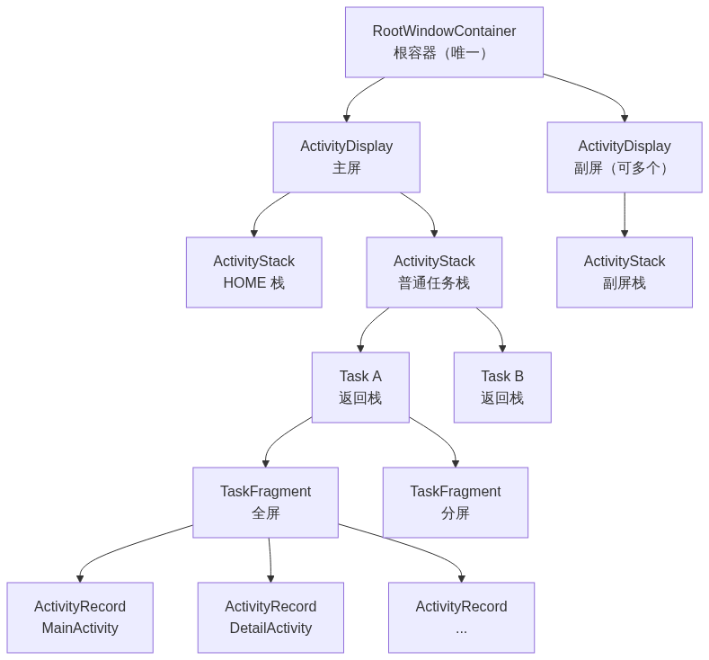

# 12. Activity 启动过程分析（下）

> Activity 启动的后半程——Zygote fork 出 App 进程后，从 `ActivityThread.main` 初始化、`attachApplication` 绑定，到 ATMS 通过 `ClientTransaction` 事务下发启动指令，再由 `TransactionExecutor` 依次触发 `onCreate → onStart → onResume`。本文承接上篇（App 发起 → 系统调度 → 进程创建），拆解「进程初始化 → 生命周期回调」的完整链路。

## 目录

- [一、承接上篇](#一承接上篇)
- [二、ActivityThread 初始化与 attach](#二activitythread-初始化与-attach)
- [三、realStartActivityLocked 与 ClientTransaction](#三realstartactivitylocked-与-clienttransaction)
- [四、TransactionExecutor 执行事务](#四transactionexecutor-执行事务)
- [五、performLaunchActivity 创建 Activity](#五performlaunchactivity-创建-activity)
- [六、onStart / onResume 触发](#六onstart--onresume-触发)
- [七、任务栈的数据结构管理](#七任务栈的数据结构管理)

---

## 一、承接上篇

上篇讲到：Zygote fork 出 App 进程后，把 pid 通过 socket 传回 system_server。从这一刻起，进入 Activity 启动的**后半程**——新进程的初始化与 Activity 的创建。

```text
上篇结尾：Zygote fork 出 App 进程，pid 返回 system_server
              ↓
本篇开始：App 进程执行 ActivityThread.main
              ↓
         attachApplication 绑定 system_server
              ↓
         ATMS 下发 ClientTransaction 事务
              ↓
         TransactionExecutor 执行 → onCreate → onStart → onResume
```

---

## 二、ActivityThread 初始化与 attach

Zygote fork 出 App 进程后，反射调用入口类 `ActivityThread.main`。

### 反射调用的实现

Zygote fork 时传入的 `processClass` 参数就是 `android.app.ActivityThread`（上篇 `startViaZygote` 拼装），子进程通过 `RuntimeInit.findStaticMain` 反射定位入口类的 `main` 方法：

```java
// RuntimeInit.java
protected static Runnable findStaticMain(String className, String[] argv,
        ClassLoader classLoader) {
    // ① 加载入口类（android.app.ActivityThread）
    Class<?> cl = Class.forName(className, true, classLoader);

    // ② 获取 main(String[]) 方法
    Method m = cl.getMethod("main", new Class[] { String[].class });

    // ③ 包装成 Runnable 返回
    return new MethodAndArgsCaller(m, argv);
}
```

`MethodAndArgsCaller.run()` 通过反射真正调用 `main` 方法：

```java
// RuntimeInit.java —— 内部类
static class MethodAndArgsCaller implements Runnable {
    private final Method mMethod;
    private final String[] mArgs;

    public MethodAndArgsCaller(Method method, String[] args) {
        mMethod = method;
        mArgs = args;
    }

    public void run() {
        // ★ 反射调用 ActivityThread.main(args)
        mMethod.invoke(null, new Object[] { mArgs });
    }
}
```

> 完整链路：`RuntimeInit.applicationInit()` → `findStaticMain("android.app.ActivityThread", ...)` → 返回 `MethodAndArgsCaller` → 其 `run()` 通过 `Method.invoke` 反射调用 `ActivityThread.main`。至此 App 进程的 Java 入口被拉起。

### ActivityThread.main

`ActivityThread.main` 是 App 进程的入口，负责初始化环境、启动 Looper、attach 到 AMS：

```java
// ActivityThread.java
public static void main(String[] args) {
    // ① 设置系统调用拦截器
    AndroidOs.install();
    // ② 初始化用户环境
    Environment.initForCurrentUser();
    // ③ 初始化主模块（mainline module）
    initializeMainlineModules();
    // ④ 预设进程名
    Process.setArgV0("<pre-initialized>");

    // ⑤ 准备主线程 Looper
    Looper.prepareMainLooper();

    // ⑥ 创建 ActivityThread 并 attach
    ActivityThread thread = new ActivityThread();
    thread.attach(false, startSeq);

    // ⑦ 进入消息循环
    Looper.loop();
}
```

### attach → attachApplication

`attach` 的核心是调用 AMS 的 `attachApplication`，把 `ApplicationThread` 注册给 system_server：

```java
private void attach(boolean system, long startSeq) {
    if (!system) {
        // AMS 的 Binder 代理
        final IActivityManager mgr = ActivityManager.getService();
        // ★ 注册 ApplicationThread
        mgr.attachApplication(mAppThread, startSeq);

        // 注册 GC 监视器：内存不足时释放不可见的 Activity
        BinderInternal.addGcWatcher(...);
    }
    // 注册 ConfigChanged 回调（屏幕旋转等）
    ViewRootImpl.addConfigCallback(configChangedCallback);
}
```

### attachApplicationLocked

AMS 收到 `attachApplication` 后，检查是否有等待该进程启动的 Activity：

```java
// ActivityManagerService.java
private boolean attachApplicationLocked(IApplicationThread thread, ...) {
    // 绑定 ApplicationThread 到 ProcessRecord
    // 创建 Application 并回调 onCreate

    // ★ 检查是否有等待该进程启动的 Activity
    didSomething = mAtmInternal.attachApplication(app.getWindowProcessController());
    return didSomething;
}

// RootWindowContainer.java
boolean attachApplication(WindowProcessController app) {
    // 遍历所有可见的 ActivityStack，找到等待启动的 Activity
    for (ActivityStack stack : mVisibleActivityStacks) {
        startActivityForAttachedApplicationIfNeeded(app, top);
    }
}
```

> `attachApplication` 是 App 与 system_server 建立连接的关键一步——新进程通过它把 `ApplicationThread`（Binder 对象）注册给 system_server，之后 system_server 才能通过这个通道调度 Activity 生命周期。

---

## 三、realStartActivityLocked 与 ClientTransaction

进程就绪后，ATMS 通过 `realStartActivityLocked` 真正启动 Activity。

`realStartActivityLocked` 的核心是创建 `ClientTransaction` 事务，向里添加启动消息：

```java
// ActivityStackSupervisor.java
boolean realStartActivityLocked(ActivityRecord r, WindowProcessController proc,
                                boolean andResume, boolean checkConfig) {
    // 确保所有 Activity 都已暂停
    if (!mRootWindowContainer.allPausedActivitiesComplete()) return false;

    // ★ 创建 ClientTransaction 事务
    final ClientTransaction clientTransaction = ClientTransaction.obtain(
        proc.getThread(), r.appToken);

    // ★ 添加启动 Activity 的 message（LaunchActivityItem）
    clientTransaction.addCallback(LaunchActivityItem.obtain(
        new Intent(r.intent), System.identityHashCode(r), r.info, ...));

    // 设置执行后应处于的生命周期状态（Resume 或 Pause）
    final ActivityLifecycleItem lifecycleItem =
        andResume ? ResumeActivityItem.obtain(...) : PauseActivityItem.obtain();
    clientTransaction.setLifecycleStateRequest(lifecycleItem);

    // ★ 调度执行事务，跨进程回调 App 进程
    mService.getLifecycleManager().scheduleTransaction(clientTransaction);
}
```

> `ClientTransaction` 是 Android 10 引入的生命周期调度机制——ATMS 不再直接调用 App 的每个生命周期方法，而是打包成「事务」（callbacks + 最终状态）一次性下发。

---

## 四、TransactionExecutor 执行事务

`scheduleTransaction` 跨进程回到 App 进程，由 `TransactionExecutor` 执行事务。

### scheduleTransaction 跨进程链

`scheduleTransaction` 通过 Binder 跨进程回到 App 进程，最终由 `TransactionExecutor` 执行：

```text
ATMS.scheduleTransaction(ClientTransaction)
  → transaction.schedule()
  → 跨进程 → ApplicationThread.scheduleTransaction()
  → ActivityThread.sendMessage(H.EXECUTE_TRANSACTION, transaction)
  → TransactionExecutor.execute()
```

### TransactionExecutor.execute

`TransactionExecutor.execute` 分两步：先执行 callbacks（如 LaunchActivityItem），再执行生命周期状态（Resume）：

```java
// TransactionExecutor.java
public void execute(ClientTransaction transaction) {
    final IBinder token = transaction.getActivityToken();
    // 处理需要销毁的 Activities（启动时不涉及）
    ...
    // ① 执行 callbacks（LaunchActivityItem → handleLaunchActivity）
    executeCallbacks(transaction);
    // ② 执行生命周期状态（ResumeActivityItem → handleResumeActivity）
    executeLifecycleState(transaction);
    mPendingActions.clear();
}

public void executeCallbacks(ClientTransaction transaction) {
    final List<ClientTransactionItem> callbacks = transaction.getCallbacks();
    for (ClientTransactionItem item : callbacks) {
        // ★ 执行每个 item（如 LaunchActivityItem）
        item.execute(mTransactionHandler, token, mPendingActions);
        item.postExecute(mTransactionHandler, token, mPendingActions);
    }
}
```

`LaunchActivityItem.execute` 创建 `ActivityClientRecord` 并回调 `handleLaunchActivity`：

```java
// LaunchActivityItem.java
public void execute(ClientTransactionHandler client, IBinder token, ...) {
    ActivityClientRecord r = new ActivityClientRecord(token, mIntent, mIdent, mInfo, ...);
    client.handleLaunchActivity(r, pendingActions, null);
}
```

---

## 五、performLaunchActivity 创建 Activity

`handleLaunchActivity` 做环境准备后，调用核心的 `performLaunchActivity`。

### handleLaunchActivity

`handleLaunchActivity` 先做环境准备（硬件加速、WMS 初始化），再调用核心的 `performLaunchActivity`：

```java
// ActivityThread.java
public Activity handleLaunchActivity(ActivityClientRecord r, ...) {
    // 初始化硬件加速
    if (HardwareRenderer 启用) HardwareRenderer.preload();
    // 确保 WMS 被初始化
    WindowManagerGlobal.initialize();

    // ★ 执行启动 Activity
    final Activity a = performLaunchActivity(r, customIntent);
    return a;
}
```

### performLaunchActivity

`performLaunchActivity` 是创建 Activity 的核心方法：

```java
private Activity performLaunchActivity(ActivityClientRecord r, Intent customIntent) {
    // ① 解析目标 ComponentName（处理 activity-alias）
    ComponentName component = r.intent.getComponent();

    // ② 创建 BaseContext
    ContextImpl appContext = createBaseContextForActivity(r);

    // ③ ★ 通过 Instrumentation 反射实例化 Activity
    Activity activity = mInstrumentation.newActivity(
        cl, component.getClassName(), r.intent);

    // ④ 创建或获取 Application
    Application app = r.packageInfo.makeApplication(false, mInstrumentation);

    // ⑤ ★ 初始化 Activity：绑定 Context、创建 PhoneWindow
    activity.attach(appContext, this, getInstrumentation(), r.token,
        r.ident, app, r.intent, r.activityInfo, title, ...);

    // ⑥ ★ 回调 onCreate
    if (r.isPersistable()) {
        mInstrumentation.callActivityOnCreate(activity, r.state, r.persistentState);
    } else {
        mInstrumentation.callActivityOnCreate(activity, r.state);
    }

    // ⑦ 设置生命周期状态为 ON_CREATE
    r.setState(ON_CREATE);
    return activity;
}
```

### newActivity 实例化

`Instrumentation.newActivity` 经 `AppComponentFactory` 反射实例化 Activity：

```java
// AppComponentFactory.java
public Activity instantiateActivity(ClassLoader cl, String className, Intent intent) {
    // ★ 反射创建 Activity 实例
    return (Activity) cl.loadClass(className).newInstance();
}
```

### Activity.attach 创建 PhoneWindow

`attach` 完成 Activity 的基础初始化——绑定 Context、创建 PhoneWindow：

```java
// Activity.java
final void attach(Context context, ActivityThread aThread, ...) {
    attachBaseContext(context);           // 绑定 Context
    mFragments.attachHost(null);          // 初始化 Fragment 控制器

    // ★ 创建 PhoneWindow（承载视图的窗口）
    mWindow = new PhoneWindow(this, window, activityConfigCallback);
    mWindow.setWindowManager(...);        // 关联 WindowManager

    mUiThread = Thread.currentThread();   // 主线程
    mMainThread = aThread;                // ActivityThread
    mInstrumentation = instr;
    mToken = token;
}
```

### callActivityOnCreate → onCreate

`callActivityOnCreate` 最终调用到 Activity 的 `onCreate` 方法：

```java
// Instrumentation.java
public void callActivityOnCreate(Activity activity, Bundle icicle) {
    activity.performCreate(icicle);   // → activity.onCreate(icicle)
}
```

> `onCreate` 的参数 `savedInstanceState` 就是 `icicle`——Activity 重建时保存的状态，首次启动时为 null。执行完 `super.onCreate()` 后 `mCalled` 置为 true，否则抛 `SuperNotCalledException`。

---

## 六、onStart / onResume 触发

`performLaunchActivity` 触发 `onCreate` 后，生命周期继续推进到 `onStart` 和 `onResume`。

### onStart 触发

`performLaunchActivity` 内完成 onCreate 后，调用 `activity.performStart()`，经 `Instrumentation.callActivityOnStart` 触发 `onStart()`。

### onResume 触发

`TransactionExecutor.executeLifecycleState` 执行 `ResumeActivityItem`，回调 `handleResumeActivity`：

```java
// TransactionExecutor.java
private void executeLifecycleState(ClientTransaction transaction) {
    final ActivityLifecycleItem lifecycleItem = transaction.getLifecycleStateRequest();
    // ★ 执行 ResumeActivityItem → handleResumeActivity
    lifecycleItem.execute(mTransactionHandler, token, mPendingActions);
    lifecycleItem.postExecute(mTransactionHandler, token, mPendingActions);
}

// ActivityThread.java
public void handleResumeActivity(...) {
    // 触发 onResume
    performResumeActivity(r, ...);
}
```

> 启动阶段的生命周期顺序固定为 `onCreate → onStart → onResume`——`performLaunchActivity` 内完成 onCreate 和 onStart，`ResumeActivityItem` 通过 `handleResumeActivity` 触发 onResume。

---

## 七、任务栈的数据结构管理

Activity 启动离不开「任务栈（Task）」体系——launchMode 的处理、Activity 的复用、返回栈的组织，都由 system_server 侧的一组数据结构管理。理解这套结构，才能真正理解 Activity 的栈行为。

### 数据结构层次

从顶层容器到底层 Activity 实例，共分六层，构成「容器套容器」的树状结构：



| 层级 | 类 | 职责 | 关键字段 |
|------|-----|------|---------|
| 根容器 | `RootWindowContainer` | 管理所有 Display，持有所有 ActivityDisplay | `mChildren`（ActivityDisplay 列表） |
| 显示区域 | `ActivityDisplay` | 每块屏一个，管理该屏的 ActivityStack | `mChildren`（ActivityStack 列表） |
| 栈容器 | `ActivityStack` | 管理多个 Task，负责 resume 顶层 Activity | `mChildren`（Task 列表） |
| 任务栈 | `Task` | 管理一组 ActivityRecord（返回栈） | `mActivities`、`taskId`、`taskAffinity` |
| 任务片段 | `TaskFragment` | Android 10+ 引入，分屏/多窗口，Task 的子容器 | `mActivities`（ActivityRecord 列表） |
| Activity 实例 | `ActivityRecord` | 一个 Activity 在 system_server 侧的表示 | `intent`、`state`、`token`、`app` |

### 各层之间的关联字段

这套结构通过「子容器持有父引用 + 父容器持有子列表」双向关联，关键关联如下：

| 类 | 向上引用 | 向下引用 |
|----|---------|---------|
| `ActivityRecord` | `task`（所属 Task） | — |
| `Task` | `mStack`（所属 ActivityStack） | `mActivities`（ActivityRecord 列表） |
| `ActivityStack` | `mDisplay`（所属 ActivityDisplay） | `mChildren`（Task 列表） |
| `ActivityDisplay` | `mRootWindowContainer` | `mChildren`（ActivityStack 列表） |

> 关键点：`Task` 是返回栈的载体，`ActivityRecord` 是栈中元素，`ActivityStack` 是多个 Task 的容器。上篇 `startActivityInner` 里的 `getReusableTask`/`setNewTask`/`addOrReparentStartingActivity` 操作的就是这套 `Task` 结构——launchMode 决定 Activity 是复用已有 `Task` 还是新建，最终影响 `Task.mActivities` 列表的组织。

### ActivityRecord：Activity 的「档案」

`ActivityRecord` 是 system_server 侧对每个 Activity 实例的记录，跨进程通过 `token`（Binder）标识：

```java
// ActivityRecord.java 关键字段
class ActivityRecord extends ConfigurationContainer {
    final Intent intent;                    // 启动 Intent
    final ActivityInfo info;                // Manifest 解析出的 ActivityInfo
    ActivityState mState;                   // 当前生命周期状态
    final Task task;                        // 所属 Task
    private WindowProcessController app;    // 所在进程
    final IBinder token;                    // 跨进程标识（Binder 对象）
}
```

`ActivityRecord` 的状态机（`ActivityState` 枚举）：

```text
INITIALIZING → RESUMED ⇄ PAUSED → STOPPED → FINISHING → DESTROYED
```

### Task：任务栈

`Task` 管理一组 `ActivityRecord`，构成一个返回栈：

```java
// Task.java 关键字段
class Task extends TaskFragment {
    final int mTaskId;                       // 任务唯一 ID
    String taskAffinity;                     // 归属倾向（默认取包名）
    Intent realActivity;                     // 栈底 Activity 的 Intent
    ActivityRecord mRootActivity;            // 栈底 Activity
    // 通过父类 TaskFragment 的 mActivities 列表管理 Activity
}
```

关键方法：

```java
// 获取栈顶未 finish 的 Activity
ActivityRecord getTopNonFinishingActivity();

// 将 Activity 添加到栈顶
void addActivityToTop(ActivityRecord r);

// 查找指定 Intent 对应的 Activity（singleTask 复用）
ActivityRecord findActivity(Intent intent, ActivityInfo info, ...);
```

### ActivityStack：任务栈容器

`ActivityStack` 是 `Task` 的容器，负责多个 Task 的组织和 resume 调度——它是「任务栈管理」的执行者：

```java
// ActivityStack.java 关键字段
class ActivityStack extends Task {
    final int mDisplayId;              // 所属屏幕 ID
    DisplayContent mDisplayContent;    // 所属显示内容
    // 通过 mChildren 管理多个 Task
}
```

关键方法：

```java
// resume 顶层 Activity（启动/恢复时的核心入口）
boolean resumeTopActivityUncheckedLocked(ActivityRecord prev, ActivityOptions options);

// 将 Activity 放入栈并启动
void startActivityLocked(ActivityRecord r, ...);

// 获取栈顶未 finish 的 Activity
ActivityRecord getTopNonFinishingActivity();
```

按用途划分，常见的 ActivityStack 类型：

| 栈类型 | 说明 |
|--------|------|
| **HOME 栈** | 承载 Launcher 桌面，系统启动时创建 |
| **RECENTS 栈** | 承载最近任务列表（Recents 界面） |
| **普通任务栈** | 承载应用 Activity 的默认栈 |

### ActivityDisplay：显示区域

`ActivityDisplay` 对应**一块物理/虚拟屏幕**，是屏幕维度的容器——多屏（如分屏、外接显示器、折叠屏副屏）时每个屏各有一个：

```java
// ActivityDisplay.java 关键字段
class ActivityDisplay extends WindowContainer {
    final int mDisplayId;                    // 屏幕 ID
    DisplayContent mDisplayContent;          // 显示内容
    // 通过 mChildren 管理该屏的所有 ActivityStack
}
```

关键方法：

```java
// 获取指定类型的栈（如 HOME 栈）
ActivityStack getStack(int windowingMode, int activityType);

// 添加/移除子栈
void addChild(ActivityStack stack);
void removeChild(ActivityStack stack);
```

> 补充认知：`RootWindowContainer`、`ActivityDisplay`、`ActivityStack`、`Task` 都继承自 `WindowContainer`——它们通过统一的 `mChildren` 列表管理子容器，形成「容器套容器」的树状结构。`ActivityDisplay` 按「屏幕」切分，`ActivityStack` 按「用途」切分（HOME/RECENTS/普通栈），`Task` 按「返回栈」切分。

### 各层关系总结

把六层结构从根到叶的包含关系汇总如下：

```text
RootWindowContainer（1 个）
  └── ActivityDisplay（每屏 1 个）
      └── ActivityStack（每屏多个，如 HOME/RECENTS/普通栈）
          └── Task（多个，构成最近任务列表）
              └── TaskFragment（Task 内 1~N 个，分屏时多个）
                  └── ActivityRecord（多个，返回栈）
```

> 关键点：`Task` 是返回栈的载体，`ActivityRecord` 是栈中元素，`ActivityStack` 是多个 Task 的容器。上篇 `startActivityInner` 里的 `getReusableTask`/`setNewTask`/`addOrReparentStartingActivity` 操作的就是这套 `Task` 结构——launchMode 决定 Activity 是复用已有 `Task` 还是新建，最终影响 `Task.mActivities` 列表的组织。
