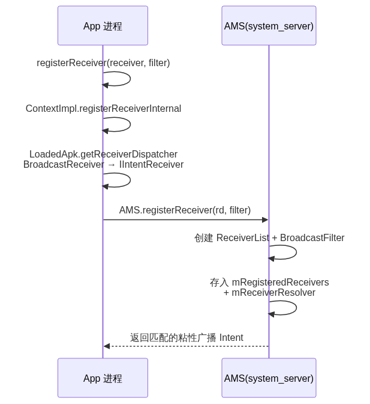
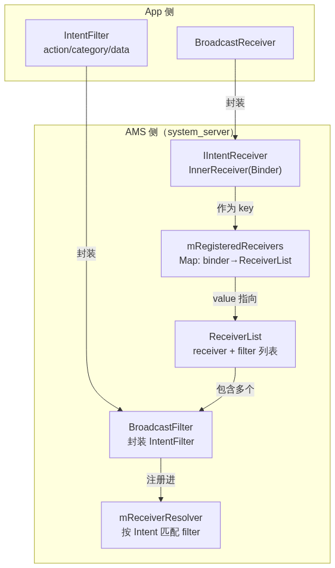
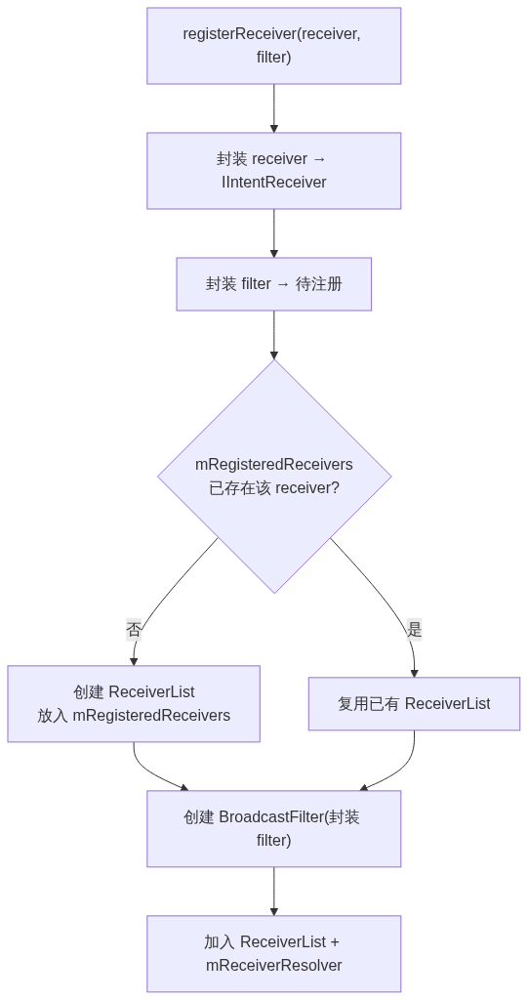
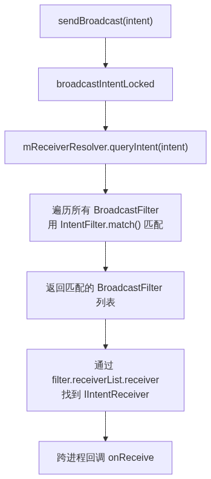
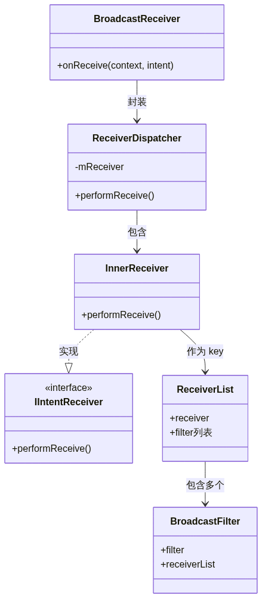

# 13. Broadcast 基础和注册分析

> Broadcast（广播）是 Android 四大组件之一，基于观察者模式实现组件间通信。本文先建立广播的基础认知——概念、分类、注册方式，再按源码调用链拆解动态注册的完整流程：从 `registerReceiver` 到 `LoadedApk.ReceiverDispatcher` 封装，再到 AMS 侧的 `ReceiverList` / `BroadcastFilter` 存储。

## 目录

- [一、广播的概念](#一广播的概念)
- [二、广播的模式：观察者模式](#二广播的模式观察者模式)
- [三、广播的分类](#三广播的分类)
- [四、广播的注册方式](#四广播的注册方式)
- [五、动态注册源码分析](#五动态注册源码分析)
- [六、核心数据结构与注册/查找过程](#六核心数据结构与注册查找过程)
- [七、动态注册的注意事项](#七动态注册的注意事项)

---

## 一、广播的概念

广播是 Android 四大组件之一，用于 Android 组件之间的通信。典型应用场景：

| 场景         | 说明                          |
| ---------- | --------------------------- |
| 同 App 内部通信 | 同一 App 不同组件间的消息传递           |
| 跨 App 通信   | 不同应用之间交换消息                  |
| 系统事件通知     | 系统在特定情况下（开机、电量低、时间变更）通知 App |

---

## 二、广播的模式：观察者模式

广播采用**观察者模式**，但涉及跨进程通信。大致流程：

```text
① 广播接收者通过 Binder 向 AMS 注册
② 广播发送者通过 Binder 向 AMS 发送广播
③ AMS 查找符合条件的接收者，回调其 onReceive 方法
```

> 广播的「中介」是 AMS（ActivityManagerService）——接收者不直接联系发送者，双方都只跟 AMS 打交道，由 AMS 完成匹配和转发。这与 Binder 的 C/S 架构一脉相承。

---

## 三、广播的分类

### 无序广播（普通广播）

用 `sendBroadcast()` 发送，会发送给所有接收者。接收顺序：

```text
动态接收器 优先于 静态接收器
同优先级同类接收器：静态「先扫描优先」，动态「先注册优先」
```

### 有序广播

用 `sendOrderedBroadcast()` 发送，按优先级依次发送。接收者可以**终止广播继续传播**（`abortBroadcast`），也可以**把数据放进广播**传递给后续接收者。接收顺序：

```text
优先级高的先接收
同优先级：动态优先于静态
同优先级同类接收器：静态「先扫描优先」，动态「先注册优先」
```

### 粘性广播

用 `sendStickyBroadcast()` 发送，需要申请权限。粘性广播用于**持久保存重要的状态变更信息**——即使发送时接收者尚未注册，接收者注册时仍能收到这条广播（可调用 `removeStickyBroadcast` 移除）。

### 系统广播

Android 的大量系统事件会对外发送标准广播（开机、电量低、时间变更等），应用通过监听系统广播响应系统事件。

### 本地广播

本地广播在**应用内部**进行，不让其他应用参与。相比全局广播（两次 Binder 通信），`LocalBroadcastManager` 更安全高效（进程内直接分发，无 Binder）。

---

## 四、广播的注册方式

### 静态注册

在 Manifest 中声明 `<receiver>`，应用未启动也能接收（如开机广播）：

```xml
<receiver android:name="com.example.broadcasttest.MainActivity$Receiver">
    <intent-filter>
        <action android:name="com.example.broadcasttest.update" />
    </intent-filter>
</receiver>
```

### 动态注册

在代码中调用 `registerReceiver`，应用运行时才有效：

```java
val receiver = MyReceiver()
val filter = IntentFilter()
filter.addAction("com.example.broadcasttest.update")
registerReceiver(receiver, filter)
```

### 本地广播注册

本地广播只能动态注册，通过 `LocalBroadcastManager`：

```java
LocalBroadcastManager.getInstance(this).registerReceiver(receiver, filter)
```

| 注册方式 | 声明位置                      | 生命周期      | 典型场景  |
| ---- | ------------------------- | --------- | ----- |
| 静态注册 | Manifest                  | 应用未启动也可接收 | 开机广播  |
| 动态注册 | 代码                        | 应用运行时有效   | 应用内通信 |
| 本地广播 | 代码（LocalBroadcastManager） | 应用运行时     | 进程内通信 |

---

## 五、动态注册源码分析

动态注册的完整时序如下：



### App 侧：registerReceiver → ReceiverDispatcher

入口在 `ContextWrapper.registerReceiver`，转发到 `ContextImpl`：

```java
// ContextWrapper.java
public Intent registerReceiver(BroadcastReceiver receiver, IntentFilter filter) {
    return mBase.registerReceiver(receiver, filter);   // mBase 指向 ContextImpl
}

// ContextImpl.java
private Intent registerReceiverInternal(BroadcastReceiver receiver, int userId,
        IntentFilter filter, String broadcastPermission, ...) {
    IIntentReceiver rd = null;
    if (receiver != null) {
        if (scheduler == null) {
            scheduler = mMainThread.getHandler();
        }
        // ★ 将 BroadcastReceiver 封装成 IIntentReceiver（Binder 对象）
        rd = mPackageInfo.getReceiverDispatcher(
            receiver, context, scheduler,
            mMainThread.getInstrumentation(), true);
    }
    // ★ 跨进程调用 AMS 注册
    final Intent intent = ActivityManager.getService().registerReceiver(
        mMainThread.getApplicationThread(), mBasePackageName, rd, filter,
        broadcastPermission, userId, flags);
    return intent;
}
```

`LoadedApk.getReceiverDispatcher` 把 `BroadcastReceiver` 封装成 `ReceiverDispatcher`：

```java
// LoadedApk.java
public IIntentReceiver getReceiverDispatcher(BroadcastReceiver r,
        Context context, Handler handler, ...) {
    synchronized (mReceivers) {
        // 从缓存查找（避免重复封装）
        map = mReceivers.get(context);
        if (map != null) rd = map.get(r);

        if (rd == null) {
            // ★ 缓存不存在，封装成 ReceiverDispatcher
            rd = new ReceiverDispatcher(r, context, handler, instrumentation, registered);
            map.put(r, rd);   // 加入缓存
        }
        return rd.getIIntentReceiver();   // 返回 InnerReceiver（IIntentReceiver 实现）
    }
}
```

> 关键点：App 侧不直接跨进程传 `BroadcastReceiver`（它不是 Binder），而是封装成 `ReceiverDispatcher`，其中的 `InnerReceiver` 实现了 `IIntentReceiver` 接口（Binder），作为跨进程的「代言人」。

### 跨进程到 AMS

`ActivityManager.getService().registerReceiver` 跨进程调用到 AMS：

```java
// ActivityManagerService.java
public Intent registerReceiver(IApplicationThread caller, String callerPackage,
        IIntentReceiver receiver, IntentFilter filter, ...) {
    // ① 根据 caller 获取调用方进程的 ProcessRecord
    callerApp = getRecordForAppLocked(caller);

    // ② 从缓存查找 receiver 对应的 ReceiverList
    ReceiverList rl = mRegisteredReceivers.get(receiver.asBinder());

    if (rl == null) {
        // ③ 首次注册，创建 ReceiverList
        rl = new ReceiverList(this, callerApp, callingPid, callingUid, userId, receiver);
        mRegisteredReceivers.put(receiver.asBinder(), rl);
    }

    // ④ 创建 BroadcastFilter（IntentFilter 的封装）
    BroadcastFilter bf = new BroadcastFilter(filter, rl, callerPackage,
        permission, callingUid, userId, instantApp, visibleToInstantApps);
    rl.add(bf);                       // 加入 ReceiverList
    mReceiverResolver.addFilter(bf);  // 加入接收者解析器

    // ⑤ 返回匹配的粘性广播（如果有）
    return sticky;
}
```

### AMS 侧的核心数据结构

AMS 用三个数据结构管理注册信息：

| 数据结构                   | 作用                                                             |
| ---------------------- | -------------------------------------------------------------- |
| `ReceiverList`         | 对应一个 receiver 的 `BroadcastFilter` 列表（一个 receiver 可注册多个 action） |
| `BroadcastFilter`      | `IntentFilter` 的封装，关联 receiver 与广播类型                           |
| `mRegisteredReceivers` | AMS 的注册表（`IIntentReceiver → ReceiverList`）                     |
| `mReceiverResolver`    | 广播解析器，用于按 Intent 匹配接收者                                         |

---

## 六、核心数据结构与注册/查找过程

动态注册不是把 `receiver` 直接存进 AMS，而是层层封装成几个相互关联的数据结构。理解它们的关系，就能理解注册和查找两个过程。

### 数据结构关系总览

五个核心数据结构的关系如下：



各结构的职责：

| 数据结构                               | 所在进程          | 职责                                           |
| ---------------------------------- | ------------- | -------------------------------------------- |
| `IntentFilter`                     | App 侧         | 声明广播过滤条件（action/category/data）               |
| `IIntentReceiver`（`InnerReceiver`） | App 侧（Binder） | `BroadcastReceiver` 的跨进程代理                   |
| `BroadcastFilter`                  | AMS 侧         | `IntentFilter` 的封装，关联 receiver 与过滤条件         |
| `ReceiverList`                     | AMS 侧         | 一个 receiver 注册的所有 `BroadcastFilter` 列表       |
| `mRegisteredReceivers`             | AMS 侧         | `IIntentReceiver(Binder) → ReceiverList` 映射表 |
| `mReceiverResolver`                | AMS 侧         | 保存所有 `BroadcastFilter`，按 Intent 匹配           |

> 关键区别：`mRegisteredReceivers` 是「按 receiver 查」的索引（反注册时用），`mReceiverResolver` 是「按 Intent 查」的索引（发送广播匹配时用）。同一个 `BroadcastFilter` 同时出现在这两个结构中。

### 举例：注册过程

假设 App 的 `MyReceiver` 注册两个 action：`ACTION_UPDATE` 和 `ACTION_DELETE`，注册流程如下：



具体过程拆解：

```text
① App 调用 registerReceiver(MyReceiver, filter1=ACTION_UPDATE)
② 封装 MyReceiver → InnerReceiver（IIntentReceiver Binder）
③ AMS 查 mRegisteredReceivers：没有 InnerReceiver → 创建 ReceiverList
④ 封装 filter1 → BroadcastFilter A，加入 ReceiverList + mReceiverResolver
⑤ 再次 registerReceiver(MyReceiver, filter2=ACTION_DELETE)
⑥ AMS 查 mRegisteredReceivers：已有 InnerReceiver → 复用 ReceiverList
⑦ 封装 filter2 → BroadcastFilter B，加入同一 ReceiverList + mReceiverResolver
```

最终的数据状态：

```text
mRegisteredReceivers:
  { InnerReceiver.asBinder() → ReceiverList }

ReceiverList:
  [ BroadcastFilter A (ACTION_UPDATE), BroadcastFilter B (ACTION_DELETE) ]

mReceiverResolver:
  [ BroadcastFilter A, BroadcastFilter B ]
```

> 一个 receiver 可以注册多个 action——每个 action 对应一个 `BroadcastFilter`，它们共享同一个 `ReceiverList`。

### 举例：查找过程（发送广播）

发送方调用 `sendBroadcast(intent)`（action = `ACTION_UPDATE`），匹配流程如下：



具体过程拆解：

```text
① App 调用 sendBroadcast(intent: ACTION_UPDATE)
② AMS.broadcastIntentLocked 处理
③ mReceiverResolver.queryIntent(intent)
④ 遍历所有 BroadcastFilter，用 IntentFilter.match() 匹配 action
⑤ 匹配成功 → 返回 BroadcastFilter A（含 B 若也匹配 ACTION_UPDATE）
⑥ 通过 A.receiverList.receiver 拿到 InnerReceiver
⑦ 跨进程回调 MyReceiver.onReceive(intent)
```

> 查找过程的关键是 `mReceiverResolver`——它内部用 `IntentFilter.match()` 完成 Intent 与过滤条件的匹配，返回所有匹配的 `BroadcastFilter`，再通过 `receiverList.receiver` 找到对应的接收者。

这套封装链的类关系如下：



---

## 七、动态注册的注意事项

### 及时反注册

动态注册的接收者不会随 Activity 销毁而自动注销，必须在合适的生命周期回调中反注册，否则会造成**内存泄漏**：

```java
@Override
protected void onResume() {
    super.onResume();
    registerReceiver(receiver, filter);   // 注册
}

@Override
protected void onPause() {
    super.onPause();
    unregisterReceiver(receiver);         // ★ 反注册，避免泄漏
}
```

### Android 8.0 隐式广播限制

Android 8.0（API 26）起，**静态注册的接收者无法接收大部分隐式广播**，只有少数白名单广播例外（如 `ACTION_BOOT_COMPLETED`）。原因是隐式广播会同时唤醒大量应用，严重影响电量。

| 场景                | Android 8.0 后 |
| ----------------- | ------------- |
| 静态注册 + 隐式广播       | ❌ 大部分被限制      |
| 静态注册 + 显式广播       | ✅ 可接收         |
| 静态注册 + 白名单广播（开机等） | ✅ 可接收         |
| 动态注册              | ✅ 不受限制        |

### 动态注册 vs 静态注册 vs 本地广播

三种注册方式的完整对比如下：

| 维度         | 静态注册     | 动态注册 | 本地广播                      |
| ---------- | -------- | ---- | ------------------------- |
| 声明位置       | Manifest | 代码   | 代码（LocalBroadcastManager） |
| 进程未启动可接收   | ✅        | ❌    | ❌                         |
| 跨进程        | ✅        | ✅    | ❌（进程内）                    |
| Binder 开销  | 有        | 有    | 无（更高效）                    |
| 需反注册       | 否        | ✅    | ✅                         |
| 隐式广播（8.0+） | 受限       | 不受限  | 不适用                       |
