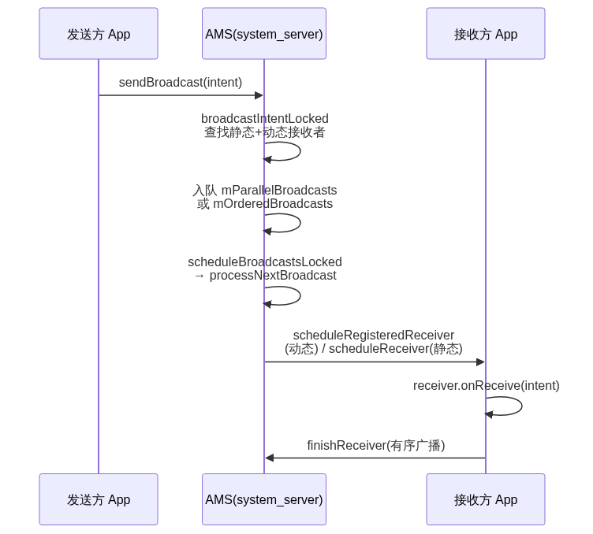
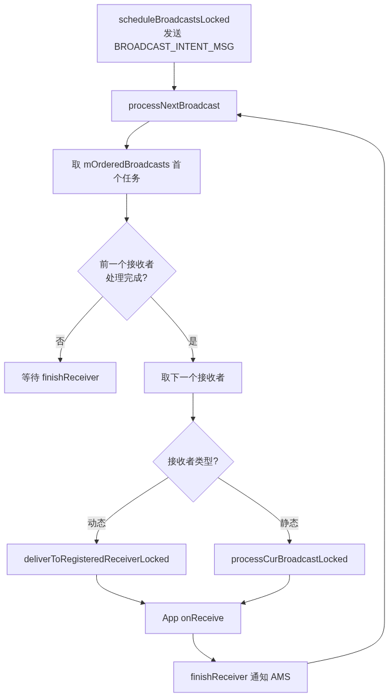
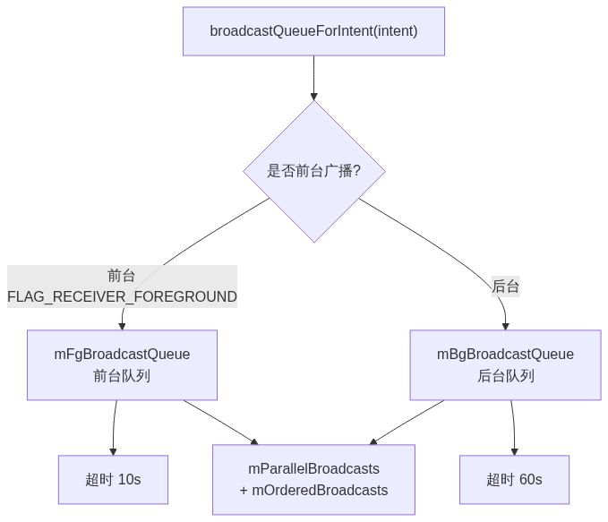

# 14. Broadcast 发送和接收过程分析

> 广播发送从 `sendBroadcast()` 出发，经 Binder 跨进程到 AMS，由 `broadcastIntentLocked` 查找静态和动态接收者，按无序/有序分别入队，最终由 `BroadcastQueue.processNextBroadcast` 调度转发，回到 App 进程触发 `onReceive`。本文按源码调用链拆解这条完整路径。

## 目录

- [一、发送入口：sendBroadcast → AMS](#一发送入口sendbroadcast--ams)
- [二、broadcastIntentLocked：查找接收者](#二broadcastintentlocked查找接收者)
- [三、无序广播调度](#三无序广播调度)
- [四、有序广播调度](#四有序广播调度)
- [五、processNextBroadcast：广播队列调度](#五processnextbroadcast广播队列调度)
- [六、发送给动态 / 静态接收者](#六发送给动态--静态接收者)
- [七、App 侧 onReceive 回调](#七app-侧-onreceive-回调)
- [八、有序广播的 finishReceiver](#八有序广播的-finishreceiver)
- [九、前台 / 后台广播队列](#九前台--后台广播队列)
- [十、广播 ANR 机制](#十广播-anr-机制)
- [十一、广播常见问题](#十一广播常见问题)
- [十二、关键总结](#十二关键总结)

---

## 一、发送入口：sendBroadcast → AMS

发送广播的完整时序如下：



入口在 `ContextWrapper.sendBroadcast`，转发到 `ContextImpl`：

```java
// ContextWrapper.java
public void sendBroadcast(Intent intent) {
    mBase.sendBroadcast(intent);
}

// ContextImpl.java
public void sendBroadcast(Intent intent) {
    String resolvedType = intent.resolveTypeIfNeeded(getContentResolver());
    intent.prepareToLeaveProcess(this);
    // ★ 跨进程调用 AMS 的 broadcastIntent
    ActivityManagerNative.getDefault().broadcastIntent(
        mMainThread.getApplicationThread(), intent, resolvedType, null,
        Activity.RESULT_OK, null, null, null, AppOpsManager.OP_NONE, null,
        false, false, getUserId());
}
```

AMS 侧入口：

```java
// ActivityManagerService.java
public final int broadcastIntent(IApplicationThread caller, Intent intent, ...) {
    // 验证 intent 合法性
    intent = verifyBroadcastLocked(intent);
    // 获取发送方进程
    final ProcessRecord callerApp = getRecordForAppLocked(caller);
    // ★ 进入核心处理
    int res = broadcastIntentLocked(callerApp, ..., intent, ...);
    return res;
}
```

---

## 二、broadcastIntentLocked：查找接收者

`broadcastIntentLocked` 是发送的核心——查找静态和动态接收者，并决定入队：

```java
final int broadcastIntentLocked(ProcessRecord callerApp, ..., Intent intent, ...) {
    // 默认不发送给已停止的应用
    intent.addFlags(Intent.FLAG_EXCLUDE_STOPPED_PACKAGES);

    // ① 静态接收者列表（ResolveInfo）
    List receivers = null;
    // ② 动态接收者列表（BroadcastFilter）
    List<BroadcastFilter> registeredReceivers = null;

    // 不是只发给动态注册时，收集静态接收者
    if ((intent.getFlags() & Intent.FLAG_RECEIVER_REGISTERED_ONLY) == 0) {
        receivers = collectReceiverComponents(intent, resolvedType, callingUid, users);
    }
    // 通过 mReceiverResolver 匹配动态接收者
    registeredReceivers = mReceiverResolver.queryIntent(intent, resolvedType, false, userId);

    // ③ 无序广播：直接入并行队列
    if (!ordered && NR > 0) {
        BroadcastRecord r = new BroadcastRecord(queue, intent, callerApp, ..., registeredReceivers, ...);
        queue.enqueueParallelBroadcastLocked(r);
        queue.scheduleBroadcastsLocked();
    }
    // ④ 有序广播：合并静态+动态，按优先级排序后入串行队列
    int ir = 0;
    if (receivers != null) {
        int NT = receivers.size();   // 静态接收者数量
        int it = 0;
        ResolveInfo curt = null;
        BroadcastFilter curr = null;
        // 双指针合并，优先级高的排前面
        while (it < NT && ir < NR) {
            if (curt == null) curt = (ResolveInfo) receivers.get(it);
            if (curr == null) curr = registeredReceivers.get(ir);
            if (curr.getPriority() >= curt.priority) {
                receivers.add(it, curr);   // 动态优先级高，插到前面
                ir++; curr = null; it++; NT++;
            } else {
                it++; curt = null;         // 静态优先级高，保持位置
            }
        }
    }
    // 剩余的动态接收者追加到末尾
    while (ir < NR) {
        if (receivers == null) receivers = new ArrayList();
        receivers.add(registeredReceivers.get(ir));
        ir++;
    }

    // 合并后的 receivers 按优先级排序，入串行队列
    if ((receivers != null && receivers.size() > 0) || resultTo != null) {
        BroadcastQueue queue = broadcastQueueForIntent(intent);
        BroadcastRecord r = new BroadcastRecord(queue, intent, callerApp, ...,
            receivers, resultTo, resultCode, resultData, resultExtras, ordered, ...);
        boolean replaced = replacePending && queue.replaceOrderedBroadcastLocked(r);
        if (!replaced) {
            queue.enqueueOrderedBroadcastLocked(r);
            queue.scheduleBroadcastsLocked();
        }
    }
}
```

查找接收者的过程总结如下：

| 来源    | 查找位置                | 特点           |
| ----- | ------------------- | ------------ |
| 静态接收者 | Manifest 声明（PMS 管理） | 应用未启动也能查到    |
| 动态接收者 | 运行时注册表（AMS 管理）      | 仅限已注册的运行时接收者 |


> 两类接收者分别在「PMS 的清单」和「AMS 的注册表」两处查找，按 Intent 的 action/category/data 匹配，最后合并成最终接收者列表。

---

## 三、无序广播调度

无序广播直接进入并行队列 `mParallelBroadcasts`：

```java
// BroadcastQueue.java
public void enqueueParallelBroadcastLocked(BroadcastRecord r) {
    mParallelBroadcasts.add(r);
}
```

> 无序广播的特点：并行发送，所有接收者同时收到，接收者之间互不影响，也无法终止广播。

---

## 四、有序广播调度

有序广播需要把静态和动态接收者**合并并按优先级排序**：

```java
// 双指针合并静态（receivers）和动态（registeredReceivers）接收者
while (it < NT && ir < NR) {
    // 对比优先级，高的排前面
    if (curr.getPriority() >= curt.priority) {
        receivers.add(it, curr);   // 动态优先级高，插到前面
        ir++;
    } else {
        it++;                       // 静态优先级高，保持位置
    }
}
// 合并后按优先级排序的接收者列表，入串行队列
queue.enqueueOrderedBroadcastLocked(r);
```

> 有序广播的特点：串行发送，前一个接收者处理完才发下一个；优先级高的先收；可终止传播（`abortBroadcast`）、可传递结果数据（`setResult`）。

---

## 五、processNextBroadcast：广播队列调度

`BroadcastQueue` 是 AMS 的广播调度器，维护两个队列：

| 队列                    | 用途       |
| --------------------- | -------- |
| `mParallelBroadcasts` | 无序广播（并行） |
| `mOrderedBroadcasts`  | 有序广播（串行） |

调度通过消息机制触发：

```java
public void scheduleBroadcastsLocked() {
    if (mBroadcastsScheduled) return;   // 已有消息在队列，避免重复
    mHandler.sendMessage(mHandler.obtainMessage(BROADCAST_INTENT_MSG, this));
    mBroadcastsScheduled = true;
}
```

`processNextBroadcast` 是调度核心：

```java
final void processNextBroadcast(boolean fromMsg) {
    // ① 处理无序广播：并行发送给每个接收者
    while (mParallelBroadcasts.size() > 0) {
        r = mParallelBroadcasts.remove(0);
        for (int i = 0; i < r.receivers.size(); i++) {
            deliverToRegisteredReceiverLocked(r, (BroadcastFilter)target, false, i);
        }
    }

    // ② 处理有序广播：串行发送，前一个处理完再发下一个
    r = mOrderedBroadcasts.get(0);
    // 检查超时（前台 10s / 后台 60s）
    ...
    // 取下一个接收者
    Object nextReceiver = r.receivers.get(recIdx);
    if (nextReceiver instanceof BroadcastFilter) {
        // 动态接收者
        deliverToRegisteredReceiverLocked(r, filter, r.ordered, recIdx);
    } else {
        // 静态接收者
        ResolveInfo info = (ResolveInfo) nextReceiver;
        processCurBroadcastLocked(r, app);
    }
}
```

---

## 六、发送给动态 / 静态接收者

### 动态接收者：deliverToRegisteredReceiverLocked

动态接收者的转发入口做权限检查后，通过 `performReceiveLocked` 跨进程回调：

```java
private void deliverToRegisteredReceiverLocked(BroadcastRecord r,
        BroadcastFilter filter, boolean ordered, int index) {
    // ① 权限检查（发送者权限 + 接收者权限）
    ...
    // ② 转发广播
    performReceiveLocked(filter.receiverList.app, filter.receiverList.receiver,
        new Intent(r.intent), r.resultCode, ...);
}

void performReceiveLocked(ProcessRecord app, IIntentReceiver receiver, ...) {
    // 通过 ApplicationThread 跨进程调用 scheduleRegisteredReceiver
    app.thread.scheduleRegisteredReceiver(receiver, intent, resultCode, ...);
}
```

### 静态接收者：processCurBroadcastLocked

静态接收者通过 `processCurBroadcastLocked` 转发，走 `scheduleReceiver` 通道：

```java
private final void processCurBroadcastLocked(BroadcastRecord r, ProcessRecord app) {
    // 通过 ApplicationThread 跨进程调用 scheduleReceiver
    app.thread.scheduleReceiver(new Intent(r.intent), r.curReceiver, ...);
}
```

> 关键差异：动态接收者通过 `scheduleRegisteredReceiver`（走 `InnerReceiver`），静态接收者通过 `scheduleReceiver`（反射创建实例）。静态接收者的进程未启动时，AMS 会先 `startProcessLocked` 启动进程。

---

## 七、App 侧 onReceive 回调

### 静态接收者：handleReceiver

静态接收者在 App 侧通过 `handleReceiver` 反射创建实例并回调：

```java
// ActivityThread.java
private void handleReceiver(ReceiverData data) {
    // ★ 反射创建 BroadcastReceiver 实例
    receiver = (BroadcastReceiver) cl.loadClass(component).newInstance();

    Application app = packageInfo.makeApplication(false, mInstrumentation);
    // ★ 回调 onReceive
    receiver.onReceive(context.getReceiverRestrictedContext(), data.intent);
}
```

### 动态接收者：InnerReceiver.performReceive

动态接收者在 App 侧走 `ReceiverDispatcher.Args`（Runnable），经 Handler post 到主线程执行：

```java
// LoadedApk.ReceiverDispatcher.Args
public void run() {
    final BroadcastReceiver receiver = mReceiver;
    receiver.setPendingResult(this);
    // ★ 回调 onReceive
    receiver.onReceive(mContext, intent);
    // 广播发送成功，通知 AMS
    if (receiver.getPendingResult() != null) {
        finish();
    }
}
```

> 动态接收者走 `ReceiverDispatcher.Args`（Runnable），通过 Handler post 到主线程执行；静态接收者走 `handleReceiver`（反射 + 直接调用）。二者最终都调用 `receiver.onReceive()`。

---

## 八、有序广播的 finishReceiver

有序广播处理完后，App 侧需通知 AMS 已处理完成，AMS 才能继续发给下一个接收者：

```java
// BroadcastReceiver.PendingResult
public final void finish() {
    if (mOrderedHint && mType != TYPE_UNREGISTERED) {
        // ★ 有序广播：通知 AMS 处理完成
        sendFinished(mgr);
    }
}

public void sendFinished(IActivityManager am) {
    if (mOrderedHint) {
        am.finishReceiver(mToken, mResultCode, mResultData, mResultExtras,
            mAbortBroadcast, mFlags);
    }
}
```

> `finishReceiver` 是有序广播串行调度的关键——AMS 收到后才会触发下一轮 `scheduleBroadcastsLocked`，继续发给下一个接收者。无序广播不需要（并行发送，无需等待）。

有序广播的串行调度流程总结如下：



---

## 九、前台 / 后台广播队列

AMS 维护**两个** `BroadcastQueue` 实例，区分前台和后台广播：



```java
// ActivityManagerService.java
BroadcastQueue broadcastQueueForIntent(Intent intent) {
    // 前台广播（FLAG_RECEIVER_FOREGROUND）走前台队列
    final boolean isFg = (intent.getFlags() & Intent.FLAG_RECEIVER_FOREGROUND) != 0;
    return (isFg) ? mFgBroadcastQueue : mBgBroadcastQueue;
}
```

| 队列                  | 触发条件                          | 超时时间 | 用途             |
| ------------------- | ----------------------------- | ---- | -------------- |
| `mFgBroadcastQueue` | `FLAG_RECEIVER_FOREGROUND` 标记 | 10s  | 前台广播（紧急、用户可感知） |
| `mBgBroadcastQueue` | 默认                            | 60s  | 后台广播           |

> 前台广播用 `sendBroadcast(intent, "android.permission.XXX")` 或显式设置 `FLAG_RECEIVER_FOREGROUND`，超时时间更短，要求接收者快速处理。

---

## 十、广播 ANR 机制

ANR（Application Not Responding）是 Android 对「主线程长时间无响应」的惩罚机制。广播是 ANR 的**高发场景**——因为 `onReceive` 运行在主线程，且有严格的超时限制。

### 为什么广播容易 ANR

广播成为 ANR 高发场景，源于三个因素叠加：

| 因素 | 说明 |
|------|------|
| onReceive 在主线程 | 与 UI 共用主线程，阻塞会卡界面 |
| 严格超时限制 | 前台 10s / 后台 60s，超时即 ANR |
| 超时不可恢复 | 一旦 ANR，只能等待或杀进程 |

### 超时机制的两个层面

广播超时由 `BroadcastQueue` 管理，分「设置定时」和「检查超时」两个层面。

**第一层：设置超时定时**——发送广播时挂一个超时消息：

```java
// BroadcastQueue.processNextBroadcast
if (!mPendingBroadcastTimeoutMessage) {
    // 超时时间 = 接收者开始时间 + 单个超时周期
    long timeoutTime = r.receiverTime + mTimeoutPeriod;
    setBroadcastTimeoutLocked(timeoutTime);   // 发送 BROADCAST_TIMEOUT_MSG
}
```

**第二层：检查超时**——处理广播前先判断是否已超时：

```java
// BroadcastQueue.processNextBroadcast
if (mService.mProcessesReady && r.dispatchTime > 0) {
    long now = SystemClock.uptimeMillis();
    // 有序广播总超时 = 2 * mTimeoutPeriod * 接收者数量
    if ((numReceivers > 0) &&
        (now > r.dispatchTime + (2 * mTimeoutPeriod * numReceivers))) {
        broadcastTimeoutLocked(false);   // ★ 超时，强制结束
        forceReceive = true;
        r.state = BroadcastRecord.IDLE;
    }
}
```

> 有序广播的「总超时」按接收者数量累加（每个接收者 `2 * mTimeoutPeriod`），因为要串行等待每个接收者处理完。无序广播并行发送，超时相对宽松。

### broadcastTimeoutLocked 处理流程

超时后 AMS 的 `broadcastTimeoutLocked` 执行：

```java
final void broadcastTimeoutLocked(boolean fromMsg) {
    // ① 定位超时的广播接收者（ProcessRecord）
    // ② 收集 ANR 现场：dump 主线程堆栈 + 广播队列状态
    // ③ 写入 ANR 日志（logcat 关键字 "ANR in"）
    // ④ 弹出 ANR 对话框，用户可选「等待」或「关闭应用」
}
```

ANR 日志示例：

```text
ANR in com.example.app
Reason: Broadcast of Intent { act=com.example.ACTION flg=0x10 }
```

### goAsync：延长广播处理时间

如果确实需要在广播中做耗时操作，可用 `goAsync` 把广播挂起，在子线程处理完再结束：

```java
public void onReceive(Context context, Intent intent) {
    // ★ 挂起广播，获得 PendingResult
    final PendingResult pendingResult = goAsync();

    new Thread(() -> {
        // 子线程做耗时操作（网络请求等）
        doHeavyWork();

        // ★ 处理完成，通知 AMS 广播已处理
        pendingResult.finish();
    }).start();
    // onReceive 立即返回，不阻塞主线程，不触发 ANR
}
```

> `goAsync` 的原理：`onReceive` 返回后，广播的处理状态保持「挂起」，超时定时暂停；直到调用 `finish()` 才通知 AMS 处理完成。这样耗时操作放在子线程，主线程不阻塞，就不会触发 ANR。

---

## 十一、广播常见问题

### 问题一：onReceive 中做耗时操作导致 ANR

`onReceive` 运行在主线程，耗时操作会阻塞导致 ANR。正确做法是把耗时操作移到 Service：

```java
// ❌ 错误：在 onReceive 中做耗时操作
public void onReceive(Context context, Intent intent) {
    // 网络请求、数据库查询等耗时操作 → 主线程阻塞 → ANR
    Thread.sleep(5000);
}

// ✅ 正确：启动 IntentService 或 goAsync
public void onReceive(Context context, Intent intent) {
    Intent serviceIntent = new Intent(context, MyService.class);
    context.startService(serviceIntent);   // 耗时操作放到 Service
}
```

### 问题二：动态注册后未反注册导致内存泄漏

动态注册的接收者必须在 `onPause` / `onDestroy` 中反注册，否则 Activity 销毁后接收者仍持有引用，造成泄漏。

### 问题三：隐式广播被限制（Android 8.0+）

静态注册的接收者无法接收大部分隐式广播，应改用动态注册，或改用显式广播。

### 问题四：粘性广播滥用

粘性广播需要 `BROADCAST_STICKY` 权限，且已废弃（API 21 起不推荐），应改用 `LiveData` / `Flow` 等替代方案。

---

## 十二、关键总结

1. **AMS 是广播中枢**：发送方和接收方都只跟 AMS 打交道，由 AMS 完成匹配和转发
2. **两条队列**：无序广播走 `mParallelBroadcasts`（并行），有序广播走 `mOrderedBroadcasts`（串行）
3. **接收者两类**：动态接收者走 `deliverToRegisteredReceiverLocked`（`InnerReceiver`），静态接收者走 `processCurBroadcastLocked`（反射创建实例）
4. **有序广播串行**：前一个接收者 `finishReceiver` 后，AMS 才继续发下一个；支持终止传播和数据传递
5. **静态接收者可拉起进程**：静态接收者进程未启动时，AMS 会先 `startProcessLocked` 启动
6. **前台/后台队列**：`FLAG_RECEIVER_FOREGROUND` 走前台队列（10s 超时），否则后台队列（60s 超时）
7. **onReceive 在主线程**：耗时操作会触发 ANR（超时机制），应启动 Service 或 goAsync 处理
