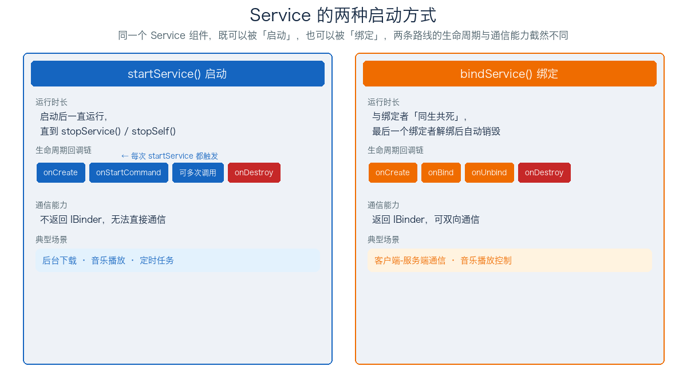
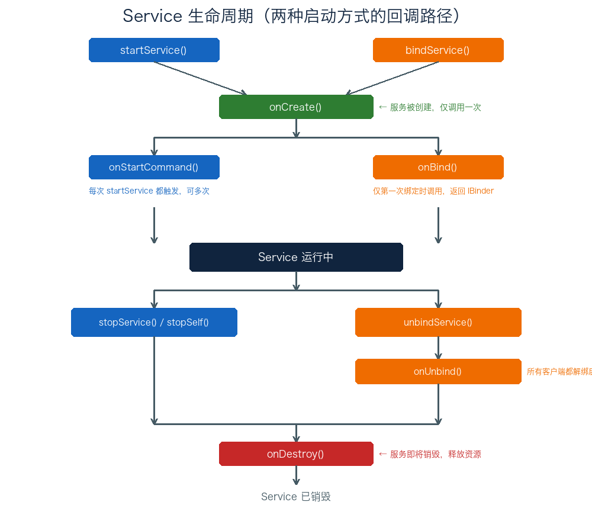
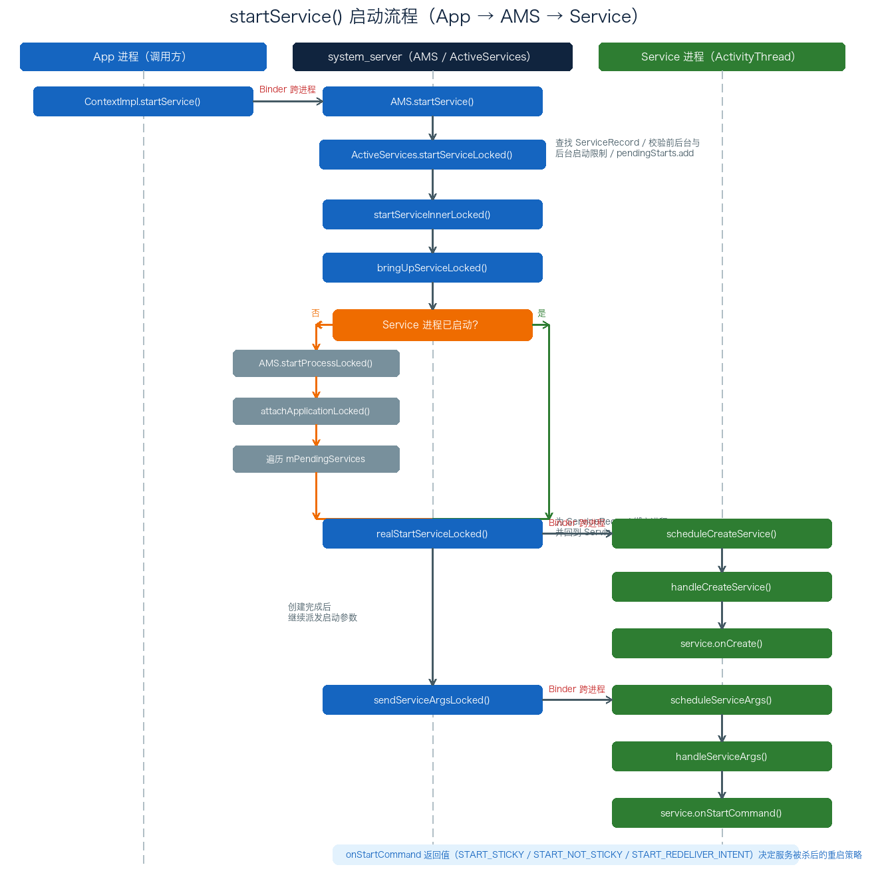

# 15. Service 基础与 startService 启动分析

> Service 是 Android 四大组件中唯一没有界面的成员，专为「后台执行任务」而生。它有两种启动方式：`startService()` 启动后独立运行、直到被显式停止；`bindService()` 则与绑定者同生共死、并借 `IBinder` 实现双向通信。本文先讲清 Service 的概念与六个生命周期回调，再沿 `startService()` 的源码调用链（`ContextImpl → AMS → ActiveServices → ActivityThread`）逐层拆解启动流程，最后梳理 `onStartCommand()` 返回值如何决定服务被杀后的重启策略。

## 目录

- [一、Service 概述](#一service-概述)
  - [1. Service 是什么](#1-service-是什么)
  - [2. 两种启动方式](#2-两种启动方式)
  - [3. Service 与 Thread 的区别](#3-service-与-thread-的区别)
- [二、Service 生命周期回调方法](#二service-生命周期回调方法)
  - [1. 六个回调方法](#1-六个回调方法)
  - [2. 回调方法总结表](#2-回调方法总结表)
- [三、startService 启动流程源码分析](#三startservice-启动流程源码分析)
  - [1. 入口 ContextImpl.startService](#1-入口-contextimplstartservice)
  - [2. AMS.startService](#2-amsstartservice)
  - [3. startServiceLocked：查找与校验](#3-startservicelocked查找与校验)
  - [4. startServiceInnerLocked 与后台延迟启动](#4-startserviceinnerlocked-与后台延迟启动)
  - [5. bringUpServiceLocked：进程判断](#5-bringupservicelocked进程判断)
  - [6. 进程未启动：startProcessLocked 与 mPendingServices](#6-进程未启动startprocesslocked-与-mpendingservices)
  - [7. realStartServiceLocked：创建 Service 实例](#7-realstartservicelocked创建-service-实例)
  - [8. onCreate 回调](#8-oncreate-回调)
  - [9. onStartCommand 回调](#9-onstartcommand-回调)
- [四、onStartCommand 返回值详解](#四onstartcommand-返回值详解)
- [附：高频速记](#附高频速记)

---

## 一、Service 概述

### 1. Service 是什么

**Service 是一种可在后台执行长时间运行操作的应用组件，它不提供用户界面**。与 Activity 不同，Service 没有可见的窗口，用户感知不到它的存在；但它依然运行在**主线程**上，因此耗时操作（网络请求、文件 IO、大量计算）必须自行开辟子线程，否则会阻塞主线程导致 ANR。

Service 典型使用场景：

- **后台下载 / 上传**：离开界面后仍继续传输；
- **音乐播放**：切到后台后音频不中断；
- **定时任务 / 轮询**：周期性执行同步、上报；
- **跨组件通信**：作为「服务端」被 Activity 绑定，提供数据与操作接口。

### 2. 两种启动方式

Service 可以通过两种方式启动，两者的生命周期与通信能力截然不同：



| 维度 | startService（启动） | bindService（绑定） |
| ---- | ---- | ---- |
| 启动入口 | `startService(intent)` | `bindService(intent, conn, flags)` |
| 停止方式 | `stopService()` / `stopSelf()` | `unbindService()`，所有绑定者解绑后自动销毁 |
| 生命周期 | `onCreate → onStartCommand → onDestroy` | `onCreate → onBind → onUnbind → onDestroy` |
| 通信能力 | 不返回 `IBinder`，无法直接通信 | 返回 `IBinder`，可双向通信 |
| 典型场景 | 后台下载、音乐播放 | 客户端-服务端通信、播放控制 |

> 两者并非互斥：一个 Service 可以**同时**被启动又被绑定。只要它处于「已启动」状态（`startService` 过），即使所有绑定者都解绑了，它也不会被销毁，必须显式 `stopService` / `stopSelf` 才会停止。

### 3. Service 与 Thread 的区别

初学者常把 Service 与 Thread 混为一谈，这里明确区分：

| 对比项 | Service | Thread |
| ---- | ---- | ---- |
| 本质 | 四大组件之一，由 AMS 管理 | 操作系统调度单元 |
| 运行线程 | 默认在主线程 | 独立线程 |
| 是否保活 | 系统可提升进程优先级（前台服务） | 进程一旦被杀，线程消失 |
| 生命周期 | 有完整生命周期回调 | 无 |
| 能否跨进程 | 可被其他组件 / 应用绑定 | 仅进程内 |

一句话：**Service 是「运行在后台的组件」，Thread 是「执行任务的载体」**。二者常配合使用——Service 里开 Thread 做耗时操作，才是标准姿势。

---

## 二、Service 生命周期回调方法

### 1. 六个回调方法

Service 的生命周期围绕以下六个回调展开，其典型顺序与含义如下：

```java
public class MyService extends Service {

    @Override
    public void onCreate() {
        // 服务被创建时调用一次。
        // ★ 初始化服务级资源：线程、注册的 Receiver 等。
        // 无论 startService() 或 bindService() 被调用多少次，本方法只调用一次。
    }

    @Override
    public int onStartCommand(Intent intent, int flags, int startId) {
        // 每次 startService() 启动服务都会调用。
        // 若服务已启动，则 Intent 直接传入本方法，不会再走 onCreate()。
        // ★ 返回值指示系统在进程被回收后应如何重启服务。
        return START_STICKY;
    }

    @Override
    public IBinder onBind(Intent intent) {
        // 其他组件第一次 bindService() 绑定时调用。
        // ★ 必须返回一个 IBinder，供客户端与服务通信。
        return binder;
    }

    @Override
    public boolean onUnbind(Intent intent) {
        // 所有客户端都 unbindService() 解除绑定后调用。
        // ★ 返回 true 表示允许后续重新绑定（触发 onRebind）。
        return super.onUnbind(intent);
    }

    @Override
    public void onRebind(Intent intent) {
        // 服务此前已被 onUnbind() 解绑过，又有新客户端连接时调用。
    }

    @Override
    public void onDestroy() {
        // 服务不再被使用、即将销毁时调用。
        // ★ 清理资源：线程、注册的监听器、接收器等——这是关闭的最后机会。
    }
}
```

生命周期整体走向如下：



### 2. 回调方法总结表

| 方法 | 目的 | 调用时机 |
| ---- | ---- | ---- |
| `onCreate()` | 初始化服务 | 服务被创建时调用一次 |
| `onStartCommand()` | 处理每次启动请求 | 每次 `startService()` 启动时调用 |
| `onBind()` | 返回 `IBinder` 供通信 | 服务第一次被绑定时调用 |
| `onUnbind()` | 处理客户端解绑 | 所有客户端解绑时调用 |
| `onRebind()` | 处理重新绑定 | `onUnbind()` 之后、服务再次被绑定时调用 |
| `onDestroy()` | 清理资源 | 服务不再被使用、即将销毁时调用 |

两个容易混淆的点：

- **`onStartCommand()` 会被多次调用**——每次 `startService()` 都会触发一次，而 `onCreate()` 仅一次。
- **`onBind()` 仅第一次绑定时调用**——之后解绑再重新绑定，不会再次走 `onBind()`，而是走 `onRebind()`（前提是重写了该方法）。

---

## 三、startService 启动流程源码分析

启动流程的完整时序如下（App 进程发起 → system_server 处理 → 目标 Service 进程回调）：



> 本文源码基于 AOSP，关键调用链为：`ContextImpl.startService → AMS.startService → ActiveServices.startServiceLocked → startServiceInnerLocked → bringUpServiceLocked → realStartServiceLocked → ActivityThread.handleCreateService / handleServiceArgs`。

### 1. 入口 ContextImpl.startService

`startService` 的入口在 `ContextWrapper` 转发到 `ContextImpl`：

```java
// ContextImpl.java
public ComponentName startService(Intent service) {
    warnIfCallingFromSystemProcess();
    return startServiceCommon(service, false, mUser);
}

private ComponentName startServiceCommon(Intent service, boolean requireForeground,
        UserHandle user) {
    try {
        validateServiceIntent(service);          // ★ 确保 Intent 有效
        service.prepareToLeaveProcess(this);     // ★ 跨进程准备
        // ★ 跨进程调用 AMS.startService
        ComponentName cn = ActivityManager.getService().startService(
                mMainThread.getApplicationThread(), service,
                service.resolveTypeIfNeeded(getContentResolver()), requireForeground,
                getOpPackageName(), getAttributionTag(), user.getIdentifier());
        // ★ 通过 AMS 返回的 ComponentName.packageName 判断错误类型
        if (cn != null) {
            if (cn.getPackageName().equals("!")) {
                throw new SecurityException(
                        "Not allowed to start service " + service
                        + " without permission " + cn.getClassName());
            } else if (cn.getPackageName().equals("!!")) {
                throw new SecurityException(
                        "Unable to start service " + service
                        + ": " + cn.getClassName());
            } else if (cn.getPackageName().equals("?")) {
                throw new IllegalStateException(
                        "Not allowed to start service " + service
                        + ": " + cn.getClassName());
            }
        }
        return cn;
    } catch (RemoteException e) {
        throw e.rethrowFromSystemServer();
    }
}
```

这里做简单校验后，就把请求交给 system_server 进程处理。注意 `ActivityManager.getService()` 返回的是 `IActivityManager` 的 Binder 代理，因此 `startService` 是一次跨进程调用。

### 2. AMS.startService

system_server 侧的入口：

```java
// ActivityManagerService.java
public ComponentName startService(IApplicationThread caller, Intent service,
        String resolvedType, boolean requireForeground, String callingPackage,
        String callingFeatureId, int userId) throws TransactionTooLargeException {
    enforceNotIsolatedCaller("startService");
    // ★ 校验 Intent，不允许其携带文件描述符（防泄漏）
    if (service != null && service.hasFileDescriptors() == true) {
        throw new IllegalArgumentException("File descriptors passed in Intent");
    }
    // ★ 调用方包名不能为空
    if (callingPackage == null) {
        throw new IllegalArgumentException("callingPackage cannot be null");
    }
    synchronized (this) {
        final int callingPid = Binder.getCallingPid();
        final int callingUid = Binder.getCallingUid();
        final long origId = Binder.clearCallingIdentity();
        ComponentName res;
        try {
            // ★ 转交给 ActiveServices 处理
            res = mServices.startServiceLocked(caller, service,
                    resolvedType, callingPid, callingUid,
                    requireForeground, callingPackage, callingFeatureId, userId);
        } finally {
            Binder.restoreCallingIdentity(origId);
        }
        return res;
    }
}
```

`ActiveServices` 是 AMS 中专门管理 Service 的核心类，负责 Service 的启动、绑定和停止。

### 3. startServiceLocked：查找与校验

`startServiceLocked` 是启动流程的核心，做了一系列校验与状态设置：

```java
// ActiveServices.java
ComponentName startServiceLocked(IApplicationThread caller, Intent service, ...) {
    // ★ 判断调用方进程是否为前台
    final boolean callerFg;
    if (caller != null) {
        final ProcessRecord callerApp = mAm.getRecordForAppLocked(caller);
        if (callerApp == null) {
            throw new SecurityException("Unable to find app for caller ...");
        }
        callerFg = callerApp.setSchedGroup != ProcessList.SCHED_GROUP_BACKGROUND;
    } else {
        callerFg = true;
    }

    // ★ 查找待启动 Service（返回 ServiceRecord）
    ServiceLookupResult res = retrieveServiceLocked(service, null, resolvedType,
            callingPackage, callingPid, callingUid, userId, true, callerFg, false, false);
    if (res == null) return null;
    // ★ 无法与调用方建立关联（无权限），返回特殊 ComponentName 由上层抛异常
    if (res.record == null) {
        return new ComponentName("!", res.permission != null
                ? res.permission : "private to package");
    }
    ServiceRecord r = res.record;

    // ★ Service 所在应用未启动或处于后台
    final boolean bgLaunch = !mAm.isUidActiveLocked(r.appInfo.uid);
    boolean forcedStandby = false;
    if (bgLaunch && appRestrictedAnyInBackground(r.appInfo.uid, r.packageName)) {
        forcedStandby = true;
    }

    // ★ 作为前台服务启动时的权限检查
    if (fgRequired) {
        final int mode = mAm.getAppOpsManager().checkOpNoThrow(
                AppOpsManager.OP_START_FOREGROUND, r.appInfo.uid, r.packageName);
        switch (mode) {
            case AppOpsManager.MODE_ALLOWED:
            case AppOpsManager.MODE_DEFAULT:
                break;
            case AppOpsManager.MODE_IGNORED:      // 回退为普通后台服务
                fgRequired = false;
                forceSilentAbort = true;
                break;
            default:                              // 拒绝
                return new ComponentName("!!", "foreground not allowed as per app op");
        }
    }

    // ★ 后台启动限制检查（Android 8.0+ 禁止后台应用启动 Service）
    if (forcedStandby || (!r.startRequested && !fgRequired)) {
        final int allowed = mAm.getAppStartModeLocked(r.appInfo.uid, r.packageName,
                r.appInfo.targetSdkVersion, callingPid, false, false, forcedStandby);
        if (allowed != ActivityManager.APP_START_MODE_NORMAL) {
            if (allowed == ActivityManager.APP_START_MODE_DELAYED || forceSilentAbort) {
                return null;                      // 静默停止
            }
            // ★ 明确告知不允许，上层抛异常
            return new ComponentName("?", "app is in background uid " + uidRec);
        }
    }

    // ★ 需要用户手动确认权限时，先弹窗再启动
    if (!requestStartTargetPermissionsReviewIfNeededLocked(r, callingPackage, ...)) {
        return null;
    }

    // ★ 取消之前的重启任务（如果有）
    unscheduleServiceRestartLocked(r, callingUid, false);
    r.lastActivity = SystemClock.uptimeMillis();

    // ★ 关键状态：标记服务由 startService 启动
    r.startRequested = true;
    r.delayedStop = false;
    r.fgRequired = fgRequired;

    // ★ 构造启动参数，加入待启动队列
    r.pendingStarts.add(new ServiceRecord.StartItem(r, false, r.makeNextStartId(),
            service, neededGrants, callingUid));

    // ★ 后台启动的非前台服务，判断是否需要延迟启动
    if (!callerFg && !fgRequired && r.app == null
            && mAm.mUserController.hasStartedUserState(r.userId)) {
        ProcessRecord proc = mAm.getProcessRecordLocked(r.processName, r.appInfo.uid, false);
        if (proc == null || proc.getCurProcState() > ActivityManager.PROCESS_STATE_RECEIVER) {
            if (r.delayed) return r.name;
            // ★ 同时后台启动的服务数达到上限，改为延迟启动
            if (smap.mStartingBackground.size() >= mMaxStartingBackground) {
                smap.mDelayedStartList.add(r);
                r.delayed = true;
                return r.name;
            }
            addToStarting = true;
        }
    }

    // ★ 继续启动
    ComponentName cmp = startServiceInnerLocked(smap, service, r, callerFg, addToStarting);
    return cmp;
}
```

这一段的核心可归纳为：

1. **查找 `ServiceRecord`**：`retrieveServiceLocked` 解析 Intent，找到目标 Service 的元数据与记录；
2. **校验前后台与后台启动限制**：`getAppStartModeLocked` 依据 targetSdkVersion 判断是否允许后台启动（Android 8.0 起默认禁止）；
3. **前台服务权限检查**：`fgRequired` 时通过 AppOps 校验 `OP_START_FOREGROUND`；
4. **权限确认**：目标 Service 声明了运行时权限时，先弹窗等用户授权；
5. **标记状态**：`r.startRequested = true` 表示该服务是被 `startService` 启动的，同时把 `StartItem` 加入 `pendingStarts` 队列——这是后续回调 `onStartCommand` 的依据。

### 4. startServiceInnerLocked 与后台延迟启动

```java
// ActiveServices.java
ComponentName startServiceInnerLocked(ServiceMap smap, Intent service, ServiceRecord r,
        boolean callerFg, boolean addToStarting) throws TransactionTooLargeException {
    r.callStart = false;

    // ★ 拉起服务：未启动则创建并回调 onCreate / onStartCommand；
    //   已启动则直接回调 onStartCommand（因为上面已构造好启动参数）
    String error = bringUpServiceLocked(r, service.getFlags(), callerFg, false, false);
    if (error != null) {
        return new ComponentName("!!", error);
    }

    if (r.startRequested && addToStarting) {   // 后台启动的情况
        boolean first = smap.mStartingBackground.size() == 0;
        smap.mStartingBackground.add(r);
        // ★ 设置后台启动超时时间（默认 15 秒）
        r.startingBgTimeout = SystemClock.uptimeMillis() + mAm.mConstants.BG_START_TIMEOUT;
        if (first) {
            // ★ 调度之前延迟启动的服务
            smap.rescheduleDelayedStartsLocked();
        }
    } else if (callerFg || r.fgRequired) {     // 前台启动的情况
        smap.ensureNotStartingBackgroundLocked(r);
    }
    return r.name;
}
```

这里引入了 **后台延迟启动**机制：为了限制后台应用同时启动的 Service 数量（防止后台滥用），`ActiveServices` 用 `mStartingBackground` 维护「正在后台启动」列表、用 `mDelayedStartList` 维护「延迟启动」列表，超出上限的服务会被延迟调度。

### 5. bringUpServiceLocked：进程判断

`bringUpServiceLocked` 是「真正把服务拉起来」的方法，核心是判断目标进程是否已存在：

```java
// ActiveServices.java
private String bringUpServiceLocked(ServiceRecord r, int intentFlags, boolean execInFg,
        boolean whileRestarting, boolean permissionsReviewRequired) {
    // ★ 进程已存在（服务已启动过），直接派发启动参数 → onStartCommand
    if (r.app != null && r.app.thread != null) {
        sendServiceArgsLocked(r, execInFg, false);
        return null;
    }

    // ★ 服务正在重启中，什么都不做
    if (!whileRestarting && mRestartingServices.contains(r)) {
        return null;
    }

    // ★ 确保服务所在用户已启动，否则停止
    if (!mAm.mUserController.hasStartedUserState(r.userId)) {
        bringDownServiceLocked(r);
        return msg;
    }

    // ★ 服务即将启动，App 不应为 stopped 状态
    AppGlobals.getPackageManager().setPackageStoppedState(r.packageName, false, r.userId);

    // ★ 判断是否为隔离进程
    final boolean isolated = (r.serviceInfo.flags & ServiceInfo.FLAG_ISOLATED_PROCESS) != 0;
    ProcessRecord app;
    if (!isolated) {
        app = mAm.getProcessRecordLocked(r.processName, r.appInfo.uid, false);
        if (app != null && app.thread != null) {
            // ★ 进程已存在，直接启动 Service
            app.addPackage(r.appInfo.packageName, r.appInfo.longVersionCode, mAm.mProcessStats);
            realStartServiceLocked(r, app, execInFg);
            return null;
        }
    } else {
        app = r.isolatedProc;   // 隔离进程：每个 Service 独立进程
    }

    // ★ 进程尚未启动：先启动进程
    if (app == null && !permissionsReviewRequired) {
        if ((app = mAm.startProcessLocked(procName, r.appInfo, true, intentFlags,
                hostingRecord, ZYGOTE_POLICY_FLAG_EMPTY, false, isolated, false)) == null) {
            bringDownServiceLocked(r);
            return msg;
        }
        if (isolated) {
            r.isolatedProc = app;
        }
    }

    // ★ 将服务加入 mPendingServices，进程启动后据此启动 Service
    if (!mPendingServices.contains(r)) {
        mPendingServices.add(r);
    }
    return null;
}
```

关键结论：

- **进程已启动**（`r.app.thread != null`）：直接 `sendServiceArgsLocked` 派发参数，回调 `onStartCommand`；
- **进程未启动**：先 `startProcessLocked` 拉起进程，再把 Service 加入 `mPendingServices` 列表，等进程启动完成后统一处理。

### 6. 进程未启动：startProcessLocked 与 mPendingServices

进程启动完成后，AMS 会回调 `attachApplicationLocked`，其中专门有一段处理「等待启动的 Service」：

```java
// ActivityManagerService.java
private boolean attachApplicationLocked(@NonNull IApplicationThread thread,
        int pid, int callingUid, long startSeq) {
    ...
    if (!badApp) {
        try {
            // ★ 检查是否有 Service 等待启动
            didSomething |= mServices.attachApplicationLocked(app, processName);
        } catch (Exception e) {
            badApp = true;
        }
    }
    ...
}

// ActiveServices.java
boolean attachApplicationLocked(ProcessRecord proc, String processName) {
    // ★ 启动 mPendingServices 中该进程下的所有 Service
    if (mPendingServices.size() > 0) {
        for (int i = 0; i < mPendingServices.size(); i++) {
            ServiceRecord sr = mPendingServices.get(i);
            // 只处理属于当前进程的 Service
            if (proc != sr.isolationHostProc && (proc.uid != sr.appInfo.uid
                    || !processName.equals(sr.processName))) {
                continue;
            }
            mPendingServices.remove(i);
            i--;
            proc.addPackage(sr.appInfo.packageName, sr.appInfo.longVersionCode, mAm.mProcessStats);
            // ★ 真正启动 Service
            realStartServiceLocked(sr, proc, thread, pid, uidRecord, sr.createdFromFg, true);
            didSomething = true;
        }
    }
    return didSomething;
}
```

`mPendingServices` 就像一个「待启动清单」：进程还没起来时先把 Service 记下来，进程一旦就绪，AMS 便遍历清单，把属于该进程的 Service 逐个 `realStartServiceLocked` 拉起来。

### 7. realStartServiceLocked：创建 Service 实例

无论进程是「早已存在」还是「刚被拉起」，最终都会走到 `realStartServiceLocked`，真正创建 Service 实例：

```java
// ActiveServices.java
private final void realStartServiceLocked(ServiceRecord r, ProcessRecord app, boolean execInFg)
        throws RemoteException {
    if (app.thread == null) throw new RemoteException();

    r.setProcess(app);                           // ★ 为 ServiceRecord 绑定所属进程
    r.restartTime = r.lastActivity = SystemClock.uptimeMillis();
    final boolean newService = app.startService(r);

    // ★ 记录执行操作并设置超时回调（前台 20s / 后台 200s）
    bumpServiceExecutingLocked(r, execInFg, "create");
    mAm.updateOomAdjLocked(app, OomAdjuster.OOM_ADJ_REASON_START_SERVICE);

    boolean created = false;
    try {
        app.forceProcessStateUpTo(ActivityManager.PROCESS_STATE_SERVICE);
        // ★ 回到 App 进程，调度创建 Service
        app.thread.scheduleCreateService(r, r.serviceInfo,
                mAm.compatibilityInfoForPackage(r.serviceInfo.applicationInfo),
                app.getReportedProcState());
        r.postNotification();                    // ★ 显示前台服务通知
        created = true;
    } catch (DeadObjectException e) {
        mAm.appDiedLocked(app, "Died when creating service");
        throw e;
    } finally {
        if (!created) {                          // 创建失败：清理并安排重启
            serviceDoneExecutingLocked(r, inDestroying, inDestroying);
            if (newService) { app.stopService(r); r.setProcess(null); }
            if (!inDestroying) { scheduleServiceRestartLocked(r, false); }
        }
    }

    // ★ 如果服务已启动且无启动参数，则构造一个「假参数」保证 onStartCommand 被调用
    if (r.startRequested && r.callStart && r.pendingStarts.size() == 0) {
        r.pendingStarts.add(new ServiceRecord.StartItem(r, false, r.makeNextStartId(),
                null, null, 0));
    }
    // ★ 派发启动参数，回调 onStartCommand
    sendServiceArgsLocked(r, execInFg, true);
}
```

`realStartServiceLocked` 通过 `app.thread.scheduleCreateService` 跨进程回到目标 App 进程创建 Service；创建完成后（或进程已存在时），再通过 `sendServiceArgsLocked` 派发启动参数。

### 8. onCreate 回调

回到 App 进程，`scheduleCreateService` 通过 Handler 把消息投递到主线程：

```java
// ActivityThread.java
public final void scheduleCreateService(IBinder token,
        ServiceInfo info, CompatibilityInfo compatInfo, int processState) {
    updateProcessState(processState, false);
    CreateServiceData s = new CreateServiceData();
    s.token = token;
    s.info = info;
    s.compatInfo = compatInfo;
    sendMessage(H.CREATE_SERVICE, s);            // ★ 通过 Handler 发送消息
}

private void handleCreateService(CreateServiceData data) {
    unscheduleGcIdler();                         // 此时不要 GC
    LoadedApk packageInfo = getPackageInfoNoCheck(data.info.applicationInfo, data.compatInfo);
    Service service = null;
    try {
        ContextImpl context = ContextImpl.createAppContext(this, packageInfo);
        Application app = packageInfo.makeApplication(false, mInstrumentation);
        ClassLoader cl = packageInfo.getClassLoader();
        // ★ 通过 AppComponentFactory 反射创建 Service 实例
        service = packageInfo.getAppFactory().instantiateService(cl, data.info.name, data.intent);
        context.setOuterContext(service);
        // ★ 初始化：绑定 Context / 主线程 / Token / Application
        service.attach(context, this, data.info.name, data.token, app,
                ActivityManager.getService());
        // ★ 回调 onCreate
        service.onCreate();
        mServices.put(data.token, service);      // 保存运行中的 Service
        // ★ 通知 AMS 执行完成，取消超时定时器
        ActivityManager.getService().serviceDoneExecuting(
                data.token, SERVICE_DONE_EXECUTING_ANON, 0, 0);
    } catch (Exception e) {
        if (!mInstrumentation.onException(service, e)) {
            throw new RuntimeException("Unable to create service " + data.info.name + ...);
        }
    }
}
```

`handleCreateService` 完成四件事：创建 Context、反射实例化 Service、`attach` 绑定环境、执行 `onCreate` 回调。

### 9. onStartCommand 回调

`sendServiceArgsLocked` 负责把启动参数派发给目标进程：

```java
// ActiveServices.java
private final void sendServiceArgsLocked(ServiceRecord r, boolean execInFg, boolean oomAdjusted) {
    final int N = r.pendingStarts.size();
    if (N == 0) return;

    while (r.pendingStarts.size() > 0) {
        ServiceRecord.StartItem si = r.pendingStarts.remove(0);
        // ★ 跳过「假启动项」，但保留唯一的 null intent 以支持 onStartCommand(null)
        if (si.intent == null && N > 1) continue;
        si.deliveredTime = SystemClock.uptimeMillis();
        r.deliveredStarts.add(si);
        si.deliveryCount++;
        // ★ 记录执行并设置超时（前台 20s / 后台 200s）
        bumpServiceExecutingLocked(r, execInFg, "start");
        // ★ 前台服务需在 10s 内调用 startForeground，否则停止服务
        if (r.fgRequired && !r.fgWaiting && !r.isForeground) {
            scheduleServiceForegroundTransitionTimeoutLocked(r);
        }
        int flags = 0;
        if (si.deliveryCount > 1)   flags |= Service.START_FLAG_RETRY;       // 重试
        if (si.doneExecutingCount > 0) flags |= Service.START_FLAG_REDELIVERY; // 重投递
        args.add(new ServiceStartArgs(si.taskRemoved, si.id, flags, si.intent));
    }
    // ★ 跨进程派发启动参数
    r.app.thread.scheduleServiceArgs(r, slice);
}
```

App 进程接收后执行 `onStartCommand`：

```java
// ActivityThread.java
public final void scheduleServiceArgs(IBinder token, ParceledListSlice args) {
    List<ServiceStartArgs> list = args.getList();
    for (int i = 0; i < list.size(); i++) {
        ServiceStartArgs ssa = list.get(i);
        ServiceArgsData s = new ServiceArgsData();
        s.token = token;
        s.taskRemoved = ssa.taskRemoved;
        s.startId = ssa.startId;
        s.flags = ssa.flags;
        s.args = ssa.args;
        sendMessage(H.SERVICE_ARGS, s);
    }
}

private void handleServiceArgs(ServiceArgsData data) {
    Service s = mServices.get(data.token);
    if (s != null) {
        try {
            if (data.args != null) {
                data.args.setExtrasClassLoader(s.getClassLoader());
                data.args.prepareToEnterProcess();
            }
            int res;
            if (!data.taskRemoved) {
                // ★ 正常调用 onStartCommand
                res = s.onStartCommand(data.args, data.flags, data.startId);
            } else {
                // ★ 用户关闭 Task 栈时调用 onTaskRemoved
                s.onTaskRemoved(data.args);
                res = Service.START_TASK_REMOVED_COMPLETE;
            }
            QueuedWork.waitToFinish();
            // ★ 根据 onStartCommand 返回值调整重启策略，并取消超时定时器
            ActivityManager.getService().serviceDoneExecuting(
                    data.token, SERVICE_DONE_EXECUTING_START, data.startId, res);
        } catch (Exception e) {
            if (!mInstrumentation.onException(s, e)) {
                throw new RuntimeException("Unable to start service " + s + ...);
            }
        }
    }
}
```

至此，一次完整的 `startService` 启动流程走完：从 `ContextImpl` 跨进程到 `AMS`，经 `ActiveServices` 层层校验、拉起进程、反射创建 Service，最终回调到 `onCreate` 与 `onStartCommand`。

---

## 四、onStartCommand 返回值详解

`onStartCommand` 的返回值告诉系统：**当服务因内存不足被系统杀死后，是否要重建、以及如何重建**。这是面试高频考点，四个取值如下：

| 返回值 | 常量含义 | 服务被杀后的行为 |
| ---- | ---- | ---- |
| `START_STICKY` | 粘性 | 系统重建服务并调用 `onStartCommand`，但**不重新传递最后的 Intent**（为 null）。适合不需要 Intent、能自己恢复的「音乐播放」类服务 |
| `START_NOT_STICKY` | 非粘性 | 系统**不重建**服务，除非还有未处理的 Intent 派发。适合「按需启动、完成任务即止」的一次性任务 |
| `START_REDELIVER_INTENT` | 重投递 Intent | 系统重建服务，并**重新传递最后一次的 Intent**。适合必须继续上次工作的「下载」类服务 |
| `START_STICKY_COMPATIBILITY` | 粘性兼容 | `START_STICKY` 的兼容版本，**不保证**被杀后一定调用 `onStartCommand` |

```java
@Override
public int onStartCommand(Intent intent, int flags, int startId) {
    // 典型选择：
    //   音乐播放 → START_STICKY（无需 Intent，靠自身状态恢复）
    //   文件下载 → START_REDELIVER_INTENT（必须拿到上次的下载任务）
    //   一次性任务 → START_NOT_STICKY（干完就结束）
    return START_STICKY;
}
```

另外，`onStartCommand` 的 `flags` 参数有两个常用取值：

- `START_FLAG_RETRY`：上一次调用返回后服务异常终止，本次是**重试**，`startId` 与上次相同；
- `START_FLAG_REDELIVERY`：上次调用因故未完整执行（返回 `START_REDELIVER_INTENT` 后被重建），本次**重投递**。

---

## 附：高频速记

- **Service 无界面、默认跑在主线程**，耗时操作必须自开子线程，否则 ANR。
- **两种启动方式**：`startService`（独立运行，`stopService`/`stopSelf` 才停）；`bindService`（与绑定者同生共死，返回 `IBinder` 通信）。
- **六个回调**：`onCreate`（一次）→ `onStartCommand`（可多次）/ `onBind`（首次绑定一次）→ `onUnbind`/`onRebind` → `onDestroy`。
- **启动调用链**：`ContextImpl.startService → AMS.startService → ActiveServices.startServiceLocked → startServiceInnerLocked → bringUpServiceLocked → realStartServiceLocked → ActivityThread.handleCreateService / handleServiceArgs`。
- **关键状态**：`ServiceRecord.startRequested` 标记「由 startService 启动」；`pendingStarts` 队列存放启动参数，是 `onStartCommand` 的派发依据。
- **进程未启动**：先 `startProcessLocked` 拉起进程，Service 记入 `mPendingServices`，进程就绪后由 `attachApplicationLocked` 统一启动。
- **进程已启动**：`bringUpServiceLocked` 直接 `sendServiceArgsLocked` 回调 `onStartCommand`。
- **后台限制**：Android 8.0 起禁止后台应用启动 Service；后台同时启动数有上限，超出的进入 `mDelayedStartList` 延迟启动（超时默认 15s）。
- **超时机制**：Service 执行有超时看护，前台 20s / 后台 200s；前台服务需在 10s 内调 `startForeground`，否则停止。
- **`onStartCommand` 返回值**：`START_STICKY`（重建但 Intent 为 null）/ `START_NOT_STICKY`（不重建）/ `START_REDELIVER_INTENT`（重建并重传 Intent）。
