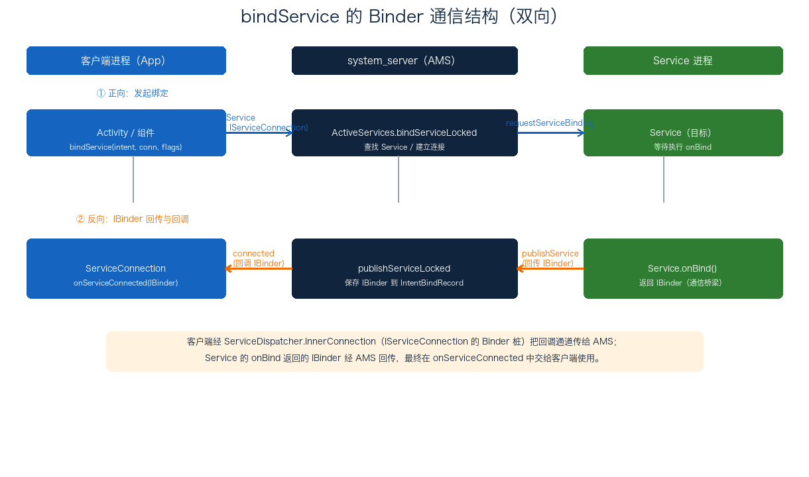
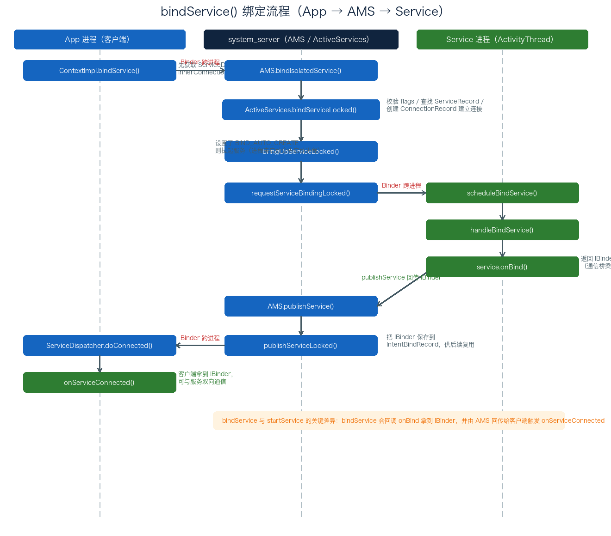

# 16. Service 的 bindService 绑定分析

> `bindService()` 是 Service 的第二种启动方式，与 `startService()` 的关键差异在于：它会在客户端与服务之间建立一条 **Binder 通道**——服务的 `onBind()` 返回一个 `IBinder`，经 AMS 回传给客户端，从而让客户端能主动调用服务的方法、实现双向通信。本文沿 `bindService()` 的源码调用链（`ContextImpl → AMS → ActiveServices → ActivityThread`），拆解这条「绑定 + 回传」的完整过程，重点讲清 `IServiceConnection`、`ConnectionRecord` 与 `IBinder` 三者的协作关系。

## 目录

- [一、bindService 概述](#一bindservice-概述)
  - [1. 与 startService 的区别](#1-与-startservice-的区别)
  - [2. 通信结构：IServiceConnection 与 IBinder](#2-通信结构iserviceconnection-与-ibinder)
- [二、bindService 启动流程源码分析](#二bindservice-启动流程源码分析)
  - [1. 入口 ContextImpl.bindService](#1-入口-contextimplbindservice)
  - [2. AMS.bindIsolatedService](#2-amsbindisolatedservice)
  - [3. bindServiceLocked：校验与建立连接](#3-bindservicelocked校验与建立连接)
  - [4. bringUpServiceLocked 拉起服务](#4-bringupservicelocked-拉起服务)
  - [5. requestServiceBindingLocked 与 onBind](#5-requestservicebindinglocked-与-onbind)
  - [6. publishService 回传 IBinder](#6-publishservice-回传-ibinder)
  - [7. onServiceConnected 回调](#7-onserviceconnected-回调)
- [附：高频速记](#附高频速记)

---

## 一、bindService 概述

### 1. 与 startService 的区别

`bindService()` 与 `startService()` 最本质的区别在于「通信」：

| 维度 | startService | bindService |
| ---- | ---- | ---- |
| 目的 | 启动后台任务 | 建立连接、调用服务方法 |
| 返回值 | `ComponentName` | `boolean`（是否成功绑定） |
| 通信 | 不返回 `IBinder`，单向 | 返回 `IBinder`，双向 |
| 生命周期 | 独立运行，`stopService` 才停 | 跟随绑定者，全部解绑后销毁 |
| 关键回调 | `onStartCommand` | `onBind` + `onServiceConnected` |

```java
// 典型用法：Activity 绑定一个服务并拿到 IBinder
private ServiceConnection conn = new ServiceConnection() {
    @Override
    public void onServiceConnected(ComponentName name, IBinder service) {
        // ★ 拿到服务的 IBinder，转型为业务接口后即可调用服务方法
        myBinder = (MyService.LocalBinder) service;
    }

    @Override
    public void onServiceDisconnected(ComponentName name) {
        // ★ 服务异常断开（非主动 unbind）时回调
    }
};

// 绑定：BIND_AUTO_CREATE 表示服务不存在则自动创建
bindService(intent, conn, Context.BIND_AUTO_CREATE);
```

### 2. 通信结构：IServiceConnection 与 IBinder

`bindService` 的通信是**双向**的，涉及两个关键接口：

- **`IServiceConnection`（回调通道）**：客户端实现，跨进程传给 AMS。服务连接建立 / 断开时，AMS 通过它回调客户端的 `ServiceConnection`；
- **`IBinder`（业务通道）**：服务 `onBind()` 返回的 Binder 对象，跨进程回传给客户端，供客户端调用服务方法。

整体结构如下：



正向是「发起绑定」，反向是「IBinder 回传」，两者构成一条闭环。

---

## 二、bindService 启动流程源码分析

绑定流程的完整时序如下：



> 关键调用链：`ContextImpl.bindService → bindServiceCommon → AMS.bindIsolatedService → ActiveServices.bindServiceLocked → bringUpServiceLocked / requestServiceBindingLocked → ActivityThread.handleBindService(onBind) → publishServiceLocked → ServiceConnection.onServiceConnected`。

### 1. 入口 ContextImpl.bindService

```java
// ContextImpl.java
public boolean bindService(Intent service, ServiceConnection conn, int flags) {
    warnIfCallingFromSystemProcess();
    return bindServiceCommon(service, conn, flags, null, mMainThread.getHandler(), null, getUser());
}

private boolean bindServiceCommon(Intent service, ServiceConnection conn, int flags,
        String instanceName, Handler handler, Executor executor, UserHandle user) {
    // ★ 获取 ServiceDispatcher 的 IServiceConnection（内部类 InnerConnection）
    //   它负责在连接建立/断开后回调 ServiceConnection 的各个方法
    IServiceConnection sd;
    if (conn == null) {
        throw new IllegalArgumentException("connection is null");
    }
    if (handler != null && executor != null) {
        throw new IllegalArgumentException("Handler and Executor both supplied");
    }
    if (mPackageInfo != null) {
        if (executor != null) {
            sd = mPackageInfo.getServiceDispatcher(conn, getOuterContext(), executor, flags);
        } else {
            sd = mPackageInfo.getServiceDispatcher(conn, getOuterContext(), handler, flags);
        }
    } else {
        throw new RuntimeException("Not supported in system context");
    }

    validateServiceIntent(service);
    try {
        IBinder token = getActivityToken();
        // ★ targetSdkVersion < 14（Android 4.0）且未设 BIND_AUTO_CREATE 时，
        //   该 Service 的优先级视为后台任务
        if (token == null && (flags & BIND_AUTO_CREATE) == 0 && mPackageInfo != null
                && mPackageInfo.getApplicationInfo().targetSdkVersion
                        < android.os.Build.VERSION_CODES.ICE_CREAM_SANDWICH) {
            flags |= BIND_WAIVE_PRIORITY;
        }
        service.prepareToLeaveProcess(this);
        // ★ 跨进程调用 AMS.bindIsolatedService 绑定服务
        int res = ActivityManager.getService().bindIsolatedService(
                mMainThread.getApplicationThread(), getActivityToken(), service,
                service.resolveTypeIfNeeded(getContentResolver()),
                sd, flags, instanceName, getOpPackageName(), user.getIdentifier());
        if (res < 0) {
            throw new SecurityException("Not allowed to bind to service " + service);
        }
        return res != 0;
    } catch (RemoteException e) {
        throw e.rethrowFromSystemServer();
    }
}
```

入口做了两件关键事：

1. **获取 `IServiceConnection`**：`getServiceDispatcher` 返回 `LoadedApk.ServiceDispatcher` 的内部类 `InnerConnection`，它实现了 `IServiceConnection`，是后续回调 `ServiceConnection` 各方法的桥梁；
2. **跨进程调用 `AMS.bindIsolatedService`** 完成绑定。

### 2. AMS.bindIsolatedService

```java
// ActivityManagerService.java
public int bindIsolatedService(IApplicationThread caller, IBinder token, Intent service,
        String resolvedType, IServiceConnection connection, int flags, String instanceName,
        String callingPackage, int userId) throws TransactionTooLargeException {
    enforceNotIsolatedCaller("bindService");
    // ★ 校验 Intent，不允许携带 fd
    if (service != null && service.hasFileDescriptors() == true) {
        throw new IllegalArgumentException("File descriptors passed in Intent");
    }
    if (callingPackage == null) {
        throw new IllegalArgumentException("callingPackage cannot be null");
    }
    // ★ 校验 instanceName 的合法性（只允许字母数字下划线点号）
    if (instanceName != null) {
        for (int i = 0; i < instanceName.length(); ++i) {
            char c = instanceName.charAt(i);
            if (!((c >= 'a' && c <= 'z') || (c >= 'A' && c <= 'Z')
                    || (c >= '0' && c <= '9') || c == '_' || c == '.')) {
                throw new IllegalArgumentException("Illegal instanceName");
            }
        }
    }
    synchronized (this) {
        return mServices.bindServiceLocked(caller, token, service,
                resolvedType, connection, flags, instanceName, callingPackage, userId);
    }
}
```

简单校验后，转交给 `ActiveServices.bindServiceLocked` 处理。

### 3. bindServiceLocked：校验与建立连接

`bindServiceLocked` 是绑定流程的核心，逻辑较长，可归纳为「校验 flags → 查找 Service → 建立连接记录 → 拉起服务」：

```java
// ActiveServices.java
int bindServiceLocked(IApplicationThread caller, IBinder token, Intent service,
        String resolvedType, final IServiceConnection connection, int flags,
        String instanceName, String callingPackage, final int userId) {
    // ★ 获取调用方进程记录
    final ProcessRecord callerApp = mAm.getRecordForAppLocked(caller);
    if (callerApp == null) {
        throw new SecurityException("Unable to find app for caller ...");
    }

    // ★ token 不为空表示从 Activity 发起，token 实为 ActivityRecord 的 Binder 对象
    ActivityServiceConnectionsHolder<ConnectionRecord> activity = null;
    if (token != null) {
        activity = mAm.mAtmInternal.getServiceConnectionsHolder(token);
        if (activity == null) {
            return 0;   // 调用方 Activity 不在栈中
        }
    }

    // ★ 一系列 flags 校验（仅系统级应用可用）
    //   BIND_TREAT_LIKE_ACTIVITY / BIND_SCHEDULE_LIKE_TOP_APP /
    //   BIND_ALLOW_WHITELIST_MANAGEMENT / BIND_ALLOW_INSTANT /
    //   BIND_ALLOW_BACKGROUND_ACTIVITY_STARTS 等
    final boolean isCallerSystem = callerApp.info.uid == Process.SYSTEM_UID;
    if ((flags & Context.BIND_TREAT_LIKE_ACTIVITY) != 0) {
        mAm.enforceCallingPermission(android.Manifest.permission.MANAGE_ACTIVITY_STACKS,
                "BIND_TREAT_LIKE_ACTIVITY");
    }
    // ...（其余 flags 类似，非系统调用方则抛 SecurityException）

    // ★ 查找对应的 ServiceRecord
    ServiceLookupResult res = retrieveServiceLocked(service, instanceName, resolvedType,
            callingPackage, Binder.getCallingPid(), Binder.getCallingUid(), userId, true,
            callerFg, isBindExternal, allowInstant);
    if (res == null) return 0;
    if (res.record == null) return -1;
    ServiceRecord s = res.record;

    // ★ 若需用户手动确认权限，先弹窗，授权后再继续绑定
    if (mAm.getPackageManagerInternalLocked().isPermissionsReviewRequired(s.packageName, s.userId)) {
        // ... 弹出授权 UI，回调里二次检查权限后 bringUpServiceLocked
    }

    // ★ 建立调用方与服务方的关联
    mAm.startAssociationLocked(callerApp.uid, callerApp.processName, ...);
    AppBindRecord b = s.retrieveAppBindingLocked(service, callerApp);
    ConnectionRecord c = new ConnectionRecord(b, activity,
            connection, flags, clientLabel, clientIntent,
            callerApp.uid, callerApp.processName, callingPackage);
    IBinder binder = connection.asBinder();
    s.addConnection(binder, c);      // ★ 添加连接记录
    b.connections.add(c);
    b.client.connections.add(c);

    // ★ 设置 BIND_AUTO_CREATE：绑定存在就会自动创建服务
    if ((flags & Context.BIND_AUTO_CREATE) != 0) {
        s.lastActivity = SystemClock.uptimeMillis();
        // ★ 拉起服务：未创建则创建并回调 onCreate；已创建则什么都不做
        if (bringUpServiceLocked(s, service.getFlags(), callerFg, false,
                permissionsReviewRequired) != null) {
            return 0;
        }
    }

    // ★ 更新进程优先级
    if (s.app != null) {
        mAm.updateOomAdjLocked(s.app, OomAdjuster.OOM_ADJ_REASON_BIND_SERVICE);
    }

    if (s.app != null && b.intent.received) {
        // ★ 服务之前已在运行（onBind 已执行、IBinder 已保存），立即发布连接
        c.conn.connected(s.name, b.intent.binder, false);
        // ★ 若服务 onUnbind 返回过 true，再次连接时回调 onRebind
        if (b.intent.apps.size() == 1 && b.intent.doRebind) {
            requestServiceBindingLocked(s, b.intent, callerFg, true);
        }
    } else if (!b.intent.requested) {
        // ★ 服务因本次绑定而创建：请求执行 onBind，拿到 IBinder 后再发布
        requestServiceBindingLocked(s, b.intent, callerFg, false);
    }

    return 1;
}
```

这段逻辑的要点：

1. **校验 flags**：`BIND_TREAT_LIKE_ACTIVITY`、`BIND_ALLOW_INSTANT` 等多为系统级专用，非系统调用方会抛 `SecurityException`；
2. **查找 `ServiceRecord`** 并处理权限确认弹窗；
3. **建立连接记录**：创建 `AppBindRecord`（应用级绑定）与 `ConnectionRecord`（单条连接），把客户端的 `IServiceConnection` 记入连接；
4. **`BIND_AUTO_CREATE`**：绑定即拉起服务（进程未启动会先启动进程）；
5. **两条分支**：服务「已在运行」→ 直接发布连接；「因绑定而创建」→ 先请求 `onBind` 再发布。

> 注意：bindService 路径也会调用 `bringUpServiceLocked`，但**不会**回调 `onStartCommand`。原因在于 `startService` 路径会设置 `ServiceRecord.startRequested = true` 并向 `pendingStarts` 添加启动项；而 bindService 路径既不设 `startRequested`、也不添加启动项，因此最终只走到 `onBind`。

### 4. bringUpServiceLocked 拉起服务

`bringUpServiceLocked` 与 startService 路径共用（详见《15. Service 基础与 startService 启动分析》），核心判断逻辑一致：

- **进程已存在**：直接继续；
- **进程未启动**：先 `startProcessLocked` 启动进程，把 Service 记入 `mPendingServices`，进程就绪后由 `attachApplicationLocked` 统一启动。

区别只在：bindService 路径后续走 `requestServiceBindingLocked` 触发 `onBind`，而非 `sendServiceArgsLocked` 触发 `onStartCommand`。

### 5. requestServiceBindingLocked 与 onBind

```java
// ActiveServices.java
private final boolean requestServiceBindingLocked(ServiceRecord r, IntentBindRecord i,
        boolean execInFg, boolean rebind) throws TransactionTooLargeException {
    if (r.app == null || r.app.thread == null) {
        return false;   // 服务还没跑起来，暂不能绑定
    }
    if ((!i.requested || rebind) && i.apps.size() > 0) {
        try {
            // ★ 记录执行操作并设置超时（前台 20s / 后台 200s）
            bumpServiceExecutingLocked(r, execInFg, "bind");
            r.app.forceProcessStateUpTo(ActivityManager.PROCESS_STATE_SERVICE);
            // ★ 回到 App 进程，调度执行 onBind
            r.app.thread.scheduleBindService(r, i.intent.getIntent(), rebind,
                    r.app.getReportedProcState());
            if (!rebind) {
                i.requested = true;
            }
            i.hasBound = true;
            i.doRebind = false;
        } catch (RemoteException e) {
            serviceDoneExecutingLocked(r, inDestroying, inDestroying);
            return false;
        }
    }
    return true;
}
```

App 进程侧执行 `onBind`：

```java
// ActivityThread.java
public final void scheduleBindService(IBinder token, Intent intent,
        boolean rebind, int processState) {
    updateProcessState(processState, false);
    BindServiceData s = new BindServiceData();
    s.token = token;
    s.intent = intent;
    s.rebind = rebind;
    sendMessage(H.BIND_SERVICE, s);
}

private void handleBindService(BindServiceData data) {
    Service s = mServices.get(data.token);
    if (s != null) {
        try {
            data.intent.setExtrasClassLoader(s.getClassLoader());
            data.intent.prepareToEnterProcess();
            if (!data.rebind) {
                // ★ 正常回调 onBind，拿到控制服务的 IBinder
                IBinder binder = s.onBind(data.intent);
                // ★ 发布服务：把 IBinder 传回 AMS
                ActivityManager.getService().publishService(data.token, data.intent, binder);
            } else {
                // ★ 服务 onUnbind 返回过 true，再次连接时回调 onRebind
                s.onRebind(data.intent);
                ActivityManager.getService().serviceDoneExecuting(
                        data.token, SERVICE_DONE_EXECUTING_ANON, 0, 0);
            }
        } catch (Exception e) {
            if (!mInstrumentation.onException(s, e)) {
                throw new RuntimeException("Unable to bind to service " + s + ...);
            }
        }
    }
}
```

这里执行了 `Service.onBind()`，拿到控制服务的 `IBinder`，再通过 `AMS.publishService` 发布。

### 6. publishService 回传 IBinder

```java
// ActivityManagerService.java
public void publishService(IBinder token, Intent intent, IBinder service) {
    if (intent != null && intent.hasFileDescriptors() == true) {
        throw new IllegalArgumentException("File descriptors passed in Intent");
    }
    synchronized (this) {
        if (!(token instanceof ServiceRecord)) {
            throw new IllegalArgumentException("Invalid service token");
        }
        mServices.publishServiceLocked((ServiceRecord) token, intent, service);
    }
}

// ActiveServices.java
void publishServiceLocked(ServiceRecord r, Intent intent, IBinder service) {
    final long origId = Binder.clearCallingIdentity();
    try {
        if (r != null) {
            Intent.FilterComparison filter = new Intent.FilterComparison(intent);
            IntentBindRecord b = r.bindings.get(filter);
            if (b != null && !b.received) {
                // ★ 保存控制服务的 IBinder 对象
                b.binder = service;
                b.requested = true;
                b.received = true;
                // ★ 遍历所有与该服务绑定的客户端连接，回调 connected
                ArrayMap<IBinder, ArrayList<ConnectionRecord>> connections = r.getConnections();
                for (int conni = connections.size() - 1; conni >= 0; conni--) {
                    ArrayList<ConnectionRecord> clist = connections.valueAt(conni);
                    for (int i = 0; i < clist.size(); i++) {
                        ConnectionRecord c = clist.get(i);
                        if (!filter.equals(c.binding.intent.intent)) continue;
                        // ★ 回调 LoadedApk.ServiceDispatcher.connected
                        //   最终触发 ServiceConnection.onServiceConnected
                        c.conn.connected(r.name, service, false);
                    }
                }
            }
            // ★ 取消之前的超时定时器
            serviceDoneExecutingLocked(r, mDestroyingServices.contains(r), false);
        }
    } finally {
        Binder.restoreCallingIdentity(origId);
    }
}
```

`publishServiceLocked` 先把 `onBind` 返回的 `IBinder` 保存到 `IntentBindRecord`，这样之后再有其他客户端绑定，就能直接用它回调 `onServiceConnected`，无需再次执行 `onBind`；随后遍历所有连接，逐个回调。

### 7. onServiceConnected 回调

最后回到客户端进程，触发 `ServiceConnection.onServiceConnected`：

```java
// LoadedApk.java
public void connected(ComponentName name, IBinder service, boolean dead) {
    LoadedApk.ServiceDispatcher sd = mDispatcher.get();
    if (sd != null) {
        sd.connected(name, service, dead);
    }
}

public void doConnected(ComponentName name, IBinder service, boolean dead) {
    ServiceDispatcher.ConnectionInfo old;
    ServiceDispatcher.ConnectionInfo info;
    synchronized (this) {
        if (mForgotten) return;   // 收到连接前已 unbind，忽略
        old = mActiveConnections.get(name);
        // ★ 若旧的 IBinder 与本次相同，说明已连接过，忽略
        if (old != null && old.binder == service) return;
        if (service != null) {
            info = new ConnectionInfo();
            info.binder = service;
            info.deathMonitor = new DeathMonitor(name, service);
            // ★ 注册 Binder 死亡通知
            service.linkToDeath(info.deathMonitor, 0);
            mActiveConnections.put(name, info);
        } else {
            mActiveConnections.remove(name);
        }
        if (old != null) {
            old.binder.unlinkToDeath(old.deathMonitor, 0);
        }
    }
    // ★ 通知客户端旧连接已断开
    if (old != null) {
        mConnection.onServiceDisconnected(name);
    }
    // ★ 服务死亡时回调 onBindingDied
    if (dead) {
        mConnection.onBindingDied(name);
    }
    // ★ 建立新连接，回调 onServiceConnected
    if (service != null) {
        mConnection.onServiceConnected(name, service);
    } else {
        // ★ onBind 返回 null 时回调 onNullBinding
        mConnection.onNullBinding(name);
    }
}
```

`doConnected` 做了几件关键事：

1. **注册 Binder 死亡通知**：`linkToDeath` 监听服务的 `IBinder`，服务异常死亡时通过 `DeathMonitor` 回调；
2. **处理旧连接**：若存在旧连接，先 `onServiceDisconnected` 通知断开；
3. **回调 `onServiceConnected`**：把 `IBinder` 交给客户端，绑定正式完成。

至此，一次完整的 `bindService` 绑定流程走完。

---

## 附：高频速记

- **本质区别**：`bindService` 建立 Binder 通道（服务 `onBind` 返回 `IBinder` 回传），`startService` 只启动后台任务。
- **两个关键接口**：`IServiceConnection`（客户端回调通道，`InnerConnection` 实现）与 `IBinder`（业务通道）。
- **绑定调用链**：`ContextImpl.bindService → AMS.bindIsolatedService → ActiveServices.bindServiceLocked → bringUpServiceLocked / requestServiceBindingLocked → handleBindService(onBind) → publishServiceLocked → onServiceConnected`。
- **关键结构**：`AppBindRecord`（应用级绑定）+ `ConnectionRecord`（单条连接，记录 `IServiceConnection`）+ `IntentBindRecord`（保存 `onBind` 返回的 `IBinder`）。
- **`BIND_AUTO_CREATE`**：绑定即拉起服务；bindService 路径不设 `startRequested`、不加 `pendingStarts`，故**不会回调 `onStartCommand`**。
- **服务已运行**：直接 `connected` 回调 `onServiceConnected`（`onBind` 不重复执行）。
- **`onBind` 返回 null**：客户端收到 `onNullBinding` 回调。
- **解绑再重绑**：`onUnbind` 返回 `true` 时，重绑走 `onRebind` 而非 `onBind`。
- **死亡监听**：客户端对服务 `IBinder` 执行 `linkToDeath`，服务异常死亡时回调 `onBindingDied` / `onServiceDisconnected`。
