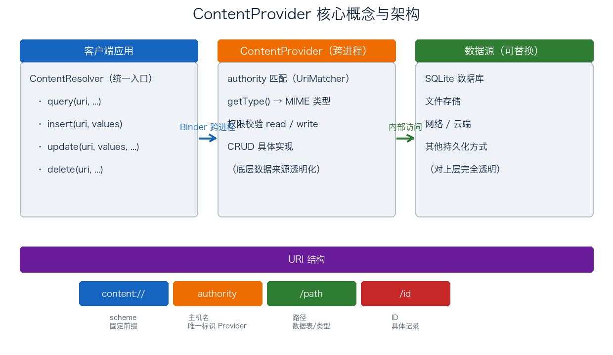
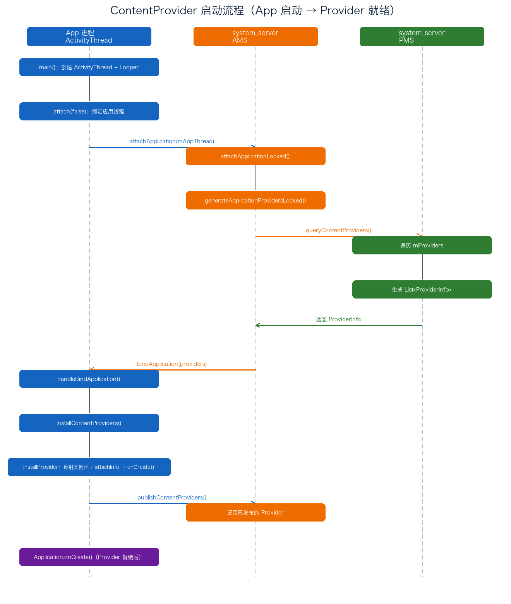

# 17. ContentProvider 基础与启动流程分析

> `ContentProvider` 是四大组件里比较特殊的一个：它既不是界面，也不是后台任务，纯粹是为了跨进程共享数据而存在的。对外接口是一套 URI 加 CRUD，底层走 Binder，访问控制靠权限。这篇先讲概念（URI、authority、MIME、ContentResolver、权限），再顺着 App 启动的链路（`ActivityThread → AMS → PMS → installProvider → onCreate`）看它到底是怎么被系统装起来、初始化好的。这条链路搞清楚了，也就明白「`ContentProvider.onCreate` 比 `Application.onCreate` 更早执行」这个结论是怎么来的了。

## 目录

- [一、ContentProvider 概述](#一contentprovider-概述)
  - [1. 什么是 ContentProvider](#1-什么是-contentprovider)
  - [2. 为什么需要 ContentProvider](#2-为什么需要-contentprovider)
  - [3. 核心概念总览](#3-核心概念总览)
- [二、核心机制详解](#二核心机制详解)
  - [1. ContentResolver：统一访问入口](#1-contentresolver统一访问入口)
  - [2. URI 结构](#2-uri-结构)
  - [3. MIME 类型](#3-mime-类型)
  - [4. 权限控制](#4-权限控制)
  - [5. CRUD 操作](#5-crud-操作)
- [三、实现自定义 ContentProvider](#三实现自定义-contentprovider)
  - [1. 六个核心方法](#1-六个核心方法)
  - [2. 完整代码示例](#2-完整代码示例)
  - [3. AndroidManifest 注册](#3-androidmanifest-注册)
  - [4. 应用场景](#4-应用场景)
- [四、ContentProvider 启动流程源码分析](#四contentprovider-启动流程源码分析)
  - [1. 总体流程概览](#1-总体流程概览)
  - [2. ActivityThread.main 与 attach](#2-activitythreadmain-与-attach)
  - [3. AMS.attachApplicationLocked](#3-amsattachapplicationlocked)
  - [4. PMS.queryContentProviders](#4-pmsquerycontentproviders)
  - [5. bindApplication 与 handleBindApplication](#5-bindapplication-与-handlebindapplication)
  - [6. installContentProviders 与 installProvider](#6-installcontentproviders-与-installprovider)
  - [7. attachInfo 与 onCreate](#7-attachinfo-与-oncreate)
  - [8. publishContentProviders](#8-publishcontentproviders)
- [附：高频速记](#附高频速记)

---

## 一、ContentProvider 概述

### 1. 什么是 ContentProvider

`ContentProvider` 是 Android 的四大组件之一，作用是为不同应用之间共享数据提供一套标准接口。它通过 URI 对外暴露数据，调用方拿到对应的 `ContentResolver` 去访问，完成查询、插入、更新、删除。

它有几个特点：

- **数据封装**：底层数据源对调用方完全透明，可以是 SQLite、文件、网络，或者别的什么存储，调用方不用关心；
- **URI 访问**：数据项用 URI 地址唯一标识，增删改查都围绕这些 URI 展开；
- **权限控制**：能分别控制「谁能读」「谁能写」，只有具备对应权限的应用才能操作数据；
- **MIME 类型**：给每种数据定义 MIME 类型，让接收方知道这是什么格式、该怎么处理；
- **跨进程**：数据共享天然发生在不同进程之间，底层靠 Binder 承载。

简单说，ContentProvider 就是数据的一个标准跨进程出口：URI 是地址，ContentResolver 是入口，Binder 负责传输，权限是门锁。

### 2. 为什么需要 ContentProvider

Android 每个应用默认跑在独立进程、独立用户空间里，文件、数据库互相隔离。如果应用 A 想读应用 B 的数据，没法直接打开 B 的数据库文件——没权限，也违背沙箱隔离的设计初衷。ContentProvider 就是官方给的受控数据出口：

1. 跨应用共享数据：通讯录、短信、媒体库、日历这些系统数据，都是通过 ContentProvider 提供给第三方的；
2. 数据抽象：调用方只面向「URI + 方法」，不关心底层实现，数据层可以随时替换；
3. 接入系统搜索：Provider 声明 `searchable` 后能进全局搜索；
4. 数据同步：配合 `SyncAdapter` 把数据同步到云端、多设备保持一致。

### 3. 核心概念总览

整个模型可以用下面这张图概括：客户端通过 `ContentResolver` 发起调用，跨进程打到 `ContentProvider`，再由它访问背后可替换的数据源，寻址全靠 URI。



图里三层：

| 层 | 角色 | 关键点 |
| ---- | ---- | ---- |
| 客户端 | `ContentResolver` | 统一入口，封装 URI 请求过程，屏蔽跨进程细节 |
| 服务端 | `ContentProvider` | authority 匹配 + 权限校验 + CRUD 实现 + MIME 返回 |
| 数据源 | SQLite / 文件 / 网络 | 可替换，对上层完全透明 |

---

## 二、核心机制详解

### 1. ContentResolver：统一访问入口

调用方从不直接操作 `ContentProvider`，而是通过 `ContentResolver`。它是客户端侧的统一入口，把「URI → 跨进程调用」的过程封装了起来：

```java
// 通过 Context 拿到 ContentResolver
ContentResolver resolver = context.getContentResolver();

// 增删改查都通过它发起，无需关心 Provider 在哪、如何跨进程
Cursor cursor = resolver.query(uri, projection, selection, selectionArgs, sortOrder);
Uri newUri    = resolver.insert(uri, values);
int rows      = resolver.update(uri, values, selection, selectionArgs);
int deleted   = resolver.delete(uri, selection, selectionArgs);
```

`ContentResolver` 屏蔽了跨进程细节：调用方拿到的只是一个 `Cursor` 或返回值，内部却要经过「解析 URI → 从 AMS 拿 `IContentProvider` 代理 → Binder 跨进程 → 返回结果」一整条链路。这条链路会在下一篇《18-ContentProvider 调用流程分析》里完整拆解。

### 2. URI 结构

ContentProvider 的寻址全靠 URI。一个标准的内容 URI 长这样：

```
content://com.example.provider/user/1
└─┬─┘    └──────┬──────┘  └─┬─┘ └┬┘
 scheme     authority     path  id
```

| 段 | 名称 | 说明 |
| ---- | ---- | ---- |
| `content://` | scheme | 固定前缀，标识这是 ContentProvider 的 URI（区别于 `http://` 等） |
| `authority` | 主机名 | 全局唯一，用于定位到某个具体的 Provider |
| `/path` | 路径 | 指向某类数据（通常对应一张表） |
| `/id` | ID | 指向具体某一条记录 |

`authority` 要求全局唯一，类似包名。系统在安装扫描时会把「authority → Provider」的映射存进 `PMS` 的 `mProvidersByAuthority`，调用时靠它反查 Provider（下文启动流程会提到）。

### 3. MIME 类型

`ContentProvider` 通过 `getType(Uri)` 返回 URI 对应的 MIME 类型，告诉调用方这段数据是什么。Android 规定了两类标准写法：

| 指向 | 前缀 | 示例 |
| ---- | ---- | ---- |
| 多条记录 | `vnd.android.cursor.dir/` | `vnd.android.cursor.dir/vnd.com.example.user` |
| 单条记录 | `vnd.android.cursor.item/` | `vnd.android.cursor.item/vnd.com.example.user` |

```java
@Override
public String getType(Uri uri) {
    switch (uriMatcher.match(uri)) {
        case USERS:      // 多条
            return "vnd.android.cursor.dir/vnd.com.example.user";
        case USER_ID:    // 单条
            return "vnd.android.cursor.item/vnd.com.example.user";
        default:
            throw new IllegalArgumentException("Unknown URI: " + uri);
    }
}
```

MIME 类型在 `Intent` 分发、`IntentFilter` 匹配、以及 `ContentResolver` 处理多类型数据时会用到。

### 4. 权限控制

ContentProvider 的权限控制分 Provider 级和路径级两层：

- **`readPermission`**：读数据（`query`）所需的权限；
- **`writePermission`**：写数据（`insert` / `update` / `delete`）所需的权限；
- **`permission`**：读写共用的统一权限（同时控制读写）；
- **`exported`**：是否允许其他应用访问（`android:exported`），API 17 起默认值受 manifest 中是否有 intent-filter 影响；
- **`grantUriPermissions`**：是否允许对特定 URI 临时授权（配合 `Intent.FLAG_GRANT_READ_URI_PERMISSION` / `WRITE`）。

更细的粒度是 `PathPermission`（`<path-permission>`），可以只对某个子路径授予不同权限，比如 `/user` 可公开读、`/secret` 需要额外权限。这些信息在 Provider 初始化时通过 `attachInfo` 读入（见下文「attachInfo 与 onCreate」）。

### 5. CRUD 操作

`ContentProvider` 对外的操作本质就是 CRUD 四个字母：

| 操作 | 方法 | 返回值 |
| ---- | ---- | ---- |
| Create | `insert(Uri, ContentValues)` | 新记录的 URI |
| Read | `query(Uri, String[], String, String[], String)` | `Cursor` |
| Update | `update(Uri, ContentValues, String, String[])` | 受影响行数 |
| Delete | `delete(Uri, String, String[])` | 删除行数 |

---

## 三、实现自定义 ContentProvider

### 1. 六个核心方法

实现一个自定义 ContentProvider，需要覆写抽象类 `ContentProvider` 的这几个方法：

| 方法 | 作用 |
| ---- | ---- |
| `onCreate()` | 初始化 Provider，在 Provider 进程启动时被调用（UI 线程） |
| `query(Uri, String[], String, String[], String)` | 查询数据，返回 `Cursor` |
| `insert(Uri, ContentValues)` | 插入数据，返回新记录的 URI |
| `update(Uri, ContentValues, String, String[])` | 更新数据，返回受影响行数 |
| `delete(Uri, String, String[])` | 删除数据，返回删除行数 |
| `getType(Uri)` | 返回 URI 对应的 MIME 类型 |

其中 `query` 是必须实现的抽象方法；其余可选，不覆写的话调用时会抛 `UnsupportedOperationException`。

### 2. 完整代码示例

下面是一个基于 SQLite 的最小可用 Provider，配合 `UriMatcher` 做 URI 路由：

```java
public class UserProvider extends ContentProvider {

    public static final String AUTHORITY = "com.example.provider";
    private static final int USERS = 1;      // 整表
    private static final int USER_ID = 2;    // 单条

    private static final UriMatcher uriMatcher = new UriMatcher(UriMatcher.NO_MATCH);
    static {
        uriMatcher.addURI(AUTHORITY, "user", USERS);
        uriMatcher.addURI(AUTHORITY, "user/#", USER_ID);
    }

    private DBHelper dbHelper;

    @Override
    public boolean onCreate() {
        dbHelper = new DBHelper(getContext());
        return true;
    }

    @Override
    public Cursor query(Uri uri, String[] projection, String selection,
                        String[] selectionArgs, String sortOrder) {
        SQLiteDatabase db = dbHelper.getReadableDatabase();
        switch (uriMatcher.match(uri)) {
            case USERS:
                return db.query("user", projection, selection, selectionArgs,
                        null, null, sortOrder);
            case USER_ID:
                // ★ 拼接 id 条件，精确到单条记录
                String id = uri.getPathSegments().get(1);
                return db.query("user", projection, "_id = ?",
                        new String[]{id}, null, null, sortOrder);
            default:
                throw new IllegalArgumentException("Unknown URI: " + uri);
        }
    }

    @Override
    public Uri insert(Uri uri, ContentValues values) {
        SQLiteDatabase db = dbHelper.getWritableDatabase();
        long id = db.insert("user", null, values);
        // ★ 返回带 id 的新 URI，调用方可据此继续操作
        return ContentUris.withAppendedId(uri, id);
    }

    @Override
    public int update(Uri uri, ContentValues values, String selection,
                      String[] selectionArgs) {
        SQLiteDatabase db = dbHelper.getWritableDatabase();
        return db.update("user", values, selection, selectionArgs);
    }

    @Override
    public int delete(Uri uri, String selection, String[] selectionArgs) {
        SQLiteDatabase db = dbHelper.getWritableDatabase();
        return db.delete("user", selection, selectionArgs);
    }

    @Override
    public String getType(Uri uri) {
        switch (uriMatcher.match(uri)) {
            case USERS:
                return "vnd.android.cursor.dir/vnd.com.example.user";
            case USER_ID:
                return "vnd.android.cursor.item/vnd.com.example.user";
            default:
                throw new IllegalArgumentException("Unknown URI: " + uri);
        }
    }
}
```

`UriMatcher` 负责把 URI 文本映射成整数码，是 ContentProvider 内部路由的常用工具：`addURI` 注册规则（`#` 通配任意数字、`*` 通配任意字符），`match` 返回命中的码。

### 3. AndroidManifest 注册

自定义 Provider 必须在 `AndroidManifest.xml` 里声明，否则系统无从得知它的存在（下文启动流程能验证这点）：

```xml
<provider
    android:name=".UserProvider"
    android:authorities="com.example.provider"
    android:exported="true"
    android:readPermission="com.example.permission.READ_USER"
    android:writePermission="com.example.permission.WRITE_USER" />
```

关键属性：

| 属性 | 说明 |
| ---- | ---- |
| `android:name` | Provider 类名 |
| `android:authorities` | authority，多个可用分号 `;` 分隔 |
| `android:exported` | 是否允许外部访问 |
| `android:readPermission` / `writePermission` | 读写权限 |
| `android:multiprocess` | 是否在多个进程中各自实例化 |

`authority` 在安装扫描阶段被解析进 `PMS` 的 `mProvidersByAuthority` 映射，这是运行时「根据 URI 反查 Provider」的数据基础。

### 4. 应用场景

- 跨应用共享数据：通讯录、短信、媒体库、日历，都以 ContentProvider 暴露；
- 结构化数据抽象：把数据访问收敛到统一接口，提升模块化；
- 系统搜索集成：声明 `searchable` 接入全局搜索；
- 数据同步：配合 `SyncAdapter` 做云端同步、多设备一致。

---

## 四、ContentProvider 启动流程源码分析

### 1. 总体流程概览

ContentProvider 的「启动」并不是独立事件，而是寄生在 App 进程启动过程中完成的。整体链路：



串起来就是：App 启动后，`ActivityThread` 的 `main` 创建线程对象并 `attach`，远程调用 AMS 的 `attachApplication`；AMS 反查 PMS 拿到应用注册的 Provider 列表，再通过 `bindApplication` 回传给应用进程；应用进程在 `handleBindApplication` 里 `installContentProviders` 逐个实例化并调用 `onCreate`，最后 `publishContentProviders` 回传 AMS。Provider 全部就绪后，`Application.onCreate` 才执行。

下面逐个环节拆开看。

### 2. ActivityThread.main 与 attach

一切从 `ActivityThread.main` 开始：

```java
public static void main(String[] args) {
    // ... 省略
    Looper.prepareMainLooper();
    ActivityThread thread = new ActivityThread();   // ★ 创建 ActivityThread
    thread.attach(false);                           // ★ 关键：绑定到 AMS
    if (sMainThreadHandler == null) {
        sMainThreadHandler = thread.getHandler();
    }
    Looper.loop();
}
```

`attach` 里拿到 `ActivityManager.getService()`（即 AMS 的 Binder 代理），远程调用它的 `attachApplication`：

```java
private void attach(boolean system) {
    sCurrentActivityThread = this;
    mSystemThread = system;
    if (!system) {
        // ... 省略
        RuntimeInit.setApplicationObject(mAppThread.asBinder());
        final IActivityManager mgr = ActivityManager.getService();
        try {
            mgr.attachApplication(mAppThread);   // ★ 跨进程调用 AMS
        } catch (RemoteException ex) {
            throw ex.rethrowFromSystemServer();
        }
        // ... 省略
    } else {
        // ... 省略
    }
}
```

这里的 `mAppThread` 是 `ApplicationThread`，也就是应用进程暴露给 system_server 的 Binder 回调通道，AMS 后面正是靠它反向调用应用进程。

### 3. AMS.attachApplicationLocked

AMS 侧：

```java
public final void attachApplication(IApplicationThread thread) {
    synchronized (this) {
        int callingPid = Binder.getCallingPid();
        final long origId = Binder.clearCallingIdentity();
        attachApplicationLocked(thread, callingPid);
        Binder.restoreCallingIdentity(origId);
    }
}
```

`attachApplicationLocked` 里有段关键逻辑——获取应用注册的 ContentProvider 信息：

```java
// 获取应用中注册的 ContentProvider 数据
boolean normalMode = mProcessesReady || isAllowedWhileBooting(app.info);
List<ProviderInfo> providers =
        normalMode ? generateApplicationProvidersLocked(app) : null;
if (providers != null && checkAppInLaunchingProvidersLocked(app)) {
    Message msg = mHandler.obtainMessage(CONTENT_PROVIDER_PUBLISH_TIMEOUT_MSG);
    msg.obj = app;
    mHandler.sendMessageDelayed(msg, CONTENT_PROVIDER_PUBLISH_TIMEOUT); // ★ 设超时监听
}
```

`generateApplicationProvidersLocked` 负责从 PMS 拉取 Provider 列表：

```java
private final List<ProviderInfo> generateApplicationProvidersLocked(ProcessRecord app) {
    List<ProviderInfo> providers = null;
    try {
        // ★ 远程调用 PMS 获取应用中注册的 ContentProvider 信息
        providers = AppGlobals.getPackageManager()
                .queryContentProviders(app.processName, app.uid,
                        STOCK_PM_FLAGS | PackageManager.GET_URI_PERMISSION_PATTERNS
                                | MATCH_DEBUG_TRIAGED_MISSING, null)
                .getList();
    } catch (RemoteException ex) {
    }
    // ... 省略
    return providers;
}
```

### 4. PMS.queryContentProviders

`AppGlobals.getPackageManager()` 返回的是 `IPackageManager`（Binder 对象），实际落在 `PackageManagerService` 上：

```java
public ParceledListSlice<ProviderInfo> queryContentProviders(
        String processName, int uid, int flags, String metaDataKey) {
    // ... 省略
    synchronized (mPackages) {
        final Iterator<PackageParser.Provider> i = mProviders.mProviders.values().iterator();
        while (i.hasNext()) {
            final PackageParser.Provider p = i.next();
            PackageSetting ps = mSettings.mPackages.get(p.owner.packageName);
            // ★ 按 processName + uid 过滤，且 authority 非空、未被禁用
            if (ps != null && p.info.authority != null
                    && (processName == null
                        || (p.info.processName.equals(processName)
                            && UserHandle.isSameApp(p.info.applicationInfo.uid, uid)))
                    && mSettings.isEnabledAndMatchLPr(p.info, flags, userId)) {
                // ... 过滤 metaDataKey
                ProviderInfo info = PackageParser.generateProviderInfo(p, flags,
                        ps.readUserState(userId), userId);
                if (info != null) {
                    finalList.add(info);
                }
            }
        }
    }
    if (finalList != null) {
        Collections.sort(finalList, mProviderInitOrderSorter);   // ★ 按初始化顺序排序
        return new ParceledListSlice<ProviderInfo>(finalList);
    }
    return ParceledListSlice.emptyList();
}
```

那 `mProviders.mProviders`（一个 `ArrayMap`，value 为 `PackageParser.Provider`）里的数据从哪来？答案是应用安装/开机扫描阶段。`PackageManagerService.commitPackageSettings` 在解析完 APK 后，把各类组件登记进对应集合：

```java
private void commitPackageSettings(PackageParser.Package pkg, PackageSetting pkgSetting,
        UserHandle user, int scanFlags, boolean chatty) throws PackageManagerException {
    // ... 省略
    // 存储 ContentProvider 的信息
    int N = pkg.providers.size();
    for (int i = 0; i < N; i++) {
        PackageParser.Provider p = pkg.providers.get(i);
        p.info.processName = fixProcessName(pkg.applicationInfo.processName, p.info.processName);
        mProviders.addProvider(p);          // ★ 登记 Provider
        if (p.info.authority != null) {
            String names[] = p.info.authority.split(";");
            for (int j = 0; j < names.length; j++) {
                // ★ 建立 authority -> Provider 的映射，供运行时反查
                if (!mProvidersByAuthority.containsKey(names[j])) {
                    mProvidersByAuthority.put(names[j], p);
                } else {
                    // authority 重复，跳过并告警
                }
            }
        }
    }
    // 存储 Service / BroadcastReceiver / Activity 的信息 ...（同理，略）
}
```

而 `pkg.providers` 来自 `PackageParser.parseBaseApplication` 对 `AndroidManifest.xml` 的解析：

```java
private boolean parseBaseApplication(Package owner, Resources res,
        XmlResourceParser parser, int flags, String[] outError) {
    // ... 省略
    while ((type = parser.next()) != XmlPullParser.END_DOCUMENT
            && (type != XmlPullParser.END_TAG || parser.getDepth() > innerDepth)) {
        // ... 省略
        String tagName = parser.getName();
        if (tagName.equals("activity")) {
            // ... 解析 activity
        } else if (tagName.equals("receiver")) {
            // ... 解析 receiver
        } else if (tagName.equals("service")) {
            // ... 解析 service
        } else if (tagName.equals("provider")) {
            Provider p = parseProvider(owner, res, parser, flags, outError, cachedArgs);
            if (p == null) {
                mParseError = PackageManager.INSTALL_PARSE_FAILED_MANIFEST_MALFORMED;
                return false;
            }
            owner.providers.add(p);          // ★ 解析 <provider> 节点，加入 providers
        }
        // ... 省略
    }
    return true;
}
```

到这里就回答了「为什么自定义 ContentProvider 必须在 AndroidManifest 里注册」：只有被 `parseBaseApplication` 解析进 `pkg.providers`、再被 `commitPackageSettings` 登记进 `mProviders` / `mProvidersByAuthority`，运行时才能被 `queryContentProviders` 查到、才能通过 URI 反查。

### 5. bindApplication 与 handleBindApplication

AMS 拿到 Provider 列表后，作为参数远程调用应用进程的 `bindApplication`：

```java
// ApplicationThread.bindApplication（应用进程侧）
public final void bindApplication(String processName, ApplicationInfo appInfo,
        List<ProviderInfo> providers, ComponentName instrumentationName, ...) {
    // ... 省略
    AppBindData data = new AppBindData();
    data.processName = processName;
    data.appInfo = appInfo;
    data.providers = providers;      // ★ Provider 列表装入 AppBindData
    // ... 省略
    sendMessage(H.BIND_APPLICATION, data);
}
```

消息在 `mH` 里被处理，走到 `handleBindApplication`：

```java
private void handleBindApplication(AppBindData data) {
    // ... 省略
    Application app;
    try {
        app = data.info.makeApplication(data.restrictedBackupMode, null);  // ★ 创建 Application
        mInitialApplication = app;
        if (!data.restrictedBackupMode) {
            // ContentProvider 列表不为空
            if (!ArrayUtils.isEmpty(data.providers)) {
                installContentProviders(app, data.providers);  // ★ 初始化并加载 ContentProvider
                mH.sendEmptyMessageDelayed(H.ENABLE_JIT, 10 * 1000);
            }
        }
        // ... 省略
        mInstrumentation.onCreate(data.instrumentationArgs);
        // ★ 调用 Application 的 onCreate —— 注意它在 installContentProviders 之后
        mInstrumentation.callApplicationOnCreate(app);
    } finally {
        // ... 省略
    }
}
```

这里就能看出来：`installContentProviders` 在 `callApplicationOnCreate` 之前执行，也就是说 `ContentProvider.onCreate` 一定早于 `Application.onCreate`。

### 6. installContentProviders 与 installProvider

`installContentProviders` 遍历 Provider 列表，逐个调用 `installProvider`：

```java
private void installContentProviders(Context context, List<ProviderInfo> providers) {
    final ArrayList<ContentProviderHolder> results = new ArrayList<>();
    for (ProviderInfo cpi : providers) {
        ContentProviderHolder cph = installProvider(context, null, cpi,
                false /*noisy*/, true /*noReleaseNeeded*/, true /*stable*/);
        if (cph != null) {
            cph.noReleaseNeeded = true;
            results.add(cph);
        }
    }
    try {
        // ★ 全部安装完成后，回传 AMS
        ActivityManager.getService().publishContentProviders(
                getApplicationThread(), results);
    } catch (RemoteException ex) {
        throw ex.rethrowFromSystemServer();
    }
}
```

`installProvider` 的核心是反射实例化 ContentProvider 对象：

```java
private ContentProviderHolder installProvider(Context context,
        ContentProviderHolder holder, ProviderInfo info,
        boolean noisy, boolean noReleaseNeeded, boolean stable) {
    ContentProvider localProvider = null;
    IContentProvider provider;
    if (holder == null || holder.provider == null) {
        // ... 省略：确定 Provider 所在包对应的 Context
        try {
            // ★ 通过类加载器生成 ContentProvider 对象
            final java.lang.ClassLoader cl = c.getClassLoader();
            localProvider = (ContentProvider) cl.loadClass(info.name).newInstance();
            provider = localProvider.getIContentProvider();
            // ... 省略
            localProvider.attachInfo(c, info);   // ★ 关键：把 Context/权限/authority 注入 Provider
        } catch (java.lang.Exception e) {
            // ... 省略
        }
    } else {
        // holder 非空的分支（复用已有实例），此处省略
    }
    // ... 省略
    return retHolder;
}
```

这里 `localProvider.getIContentProvider()` 拿到的是 `ContentProvider.Transport`，也就是 Provider 暴露给外界的 Binder 实体（下一篇调用流程会展开）。

### 7. attachInfo 与 onCreate

`attachInfo` 把 Provider 运行所需的「上下文 + 权限 + authority + exported」全部注入，最后才触发 `onCreate`：

```java
private void attachInfo(Context context, ProviderInfo info, boolean testing) {
    mNoPerms = testing;
    if (mContext == null) {
        mContext = context;
        // ... 省略
        mMyUid = Process.myUid();
        if (info != null) {
            setReadPermission(info.readPermission);     // ★ 读权限
            setWritePermission(info.writePermission);   // ★ 写权限
            setPathPermissions(info.pathPermissions);   // ★ 路径级权限
            mExported = info.exported;                  // ★ 是否导出
            mSingleUser = (info.flags & ProviderInfo.FLAG_SINGLE_USER) != 0;
            setAuthorities(info.authority);             // ★ authority
        }
        ContentProvider.this.onCreate();                // ★ 触发 onCreate
    }
}
```

`setReadPermission` / `setWritePermission` / `setPathPermissions` 会分别解析权限字符串、编译成权限对象，供后续每次调用时校验（下一篇「权限校验」展开）。`onCreate` 在这里被直接调用，因为这段代码运行在应用主线程，所以又得到一个结论：ContentProvider 的 `onCreate` 在 UI（主）线程执行，不能做耗时操作。

### 8. publishContentProviders

最后，应用进程把所有已初始化的 Provider 通过 `publishContentProviders` 回传给 AMS：

```java
// AMS 侧 publishContentProviders 最终会落到 publishContentProviders 内部逻辑：
// 把 ContentProviderHolder 里携带的 IContentProvider（Binder）登记到
// 对应的 ContentProviderRecord 上，标记该 Provider 已发布（published）。
```

AMS 记下「这个 authority 的 Provider 已经就绪、Binder 在哪」，后续其他进程要访问时，就能直接把这个 Binder 交给调用方。至此 Provider 完成安装与发布，App 才继续走到 `Application.onCreate`，整个应用正式跑起来。

---

## 附：高频速记

- 定位：ContentProvider 是专为跨进程数据共享设计的四大组件，基于 URI 寻址 + Binder 通信 + 权限控制。
- 五大概念：`ContentResolver`（统一入口）、`URI`（`content://authority/path/id`）、`MIME`（`vnd.android.cursor.dir/item`）、权限（read/write/path/exported）、`UriMatcher`（URI 路由）。
- 六个方法：`onCreate` / `query` / `insert` / `update` / `delete` / `getType`，其中 `query` 是必须实现的抽象方法。
- 启动调用链：`ActivityThread.main → attach → AMS.attachApplication → attachApplicationLocked → generateApplicationProvidersLocked → PMS.queryContentProviders → bindApplication → handleBindApplication → installContentProviders → installProvider → attachInfo → onCreate → publishContentProviders`。
- 注册必要性：Provider 必须声明在 manifest，经 `PackageParser.parseBaseApplication` 解析进 `pkg.providers`、`commitPackageSettings` 登记进 `mProviders` / `mProvidersByAuthority`，运行时才能被查到。
- 两个顺序结论：① `installContentProviders` 在 `callApplicationOnCreate` 之前 → Provider.onCreate 早于 Application.onCreate；② `attachInfo` 在应用主线程执行 → Provider.onCreate 在 UI 线程，不能做耗时操作。
- 实例化方式：`ClassLoader.loadClass(info.name).newInstance()` 反射创建，再 `attachInfo` 注入 Context / 权限 / authority / exported，最后 `getIContentProvider()` 拿到 Binder 实体 `Transport`。
