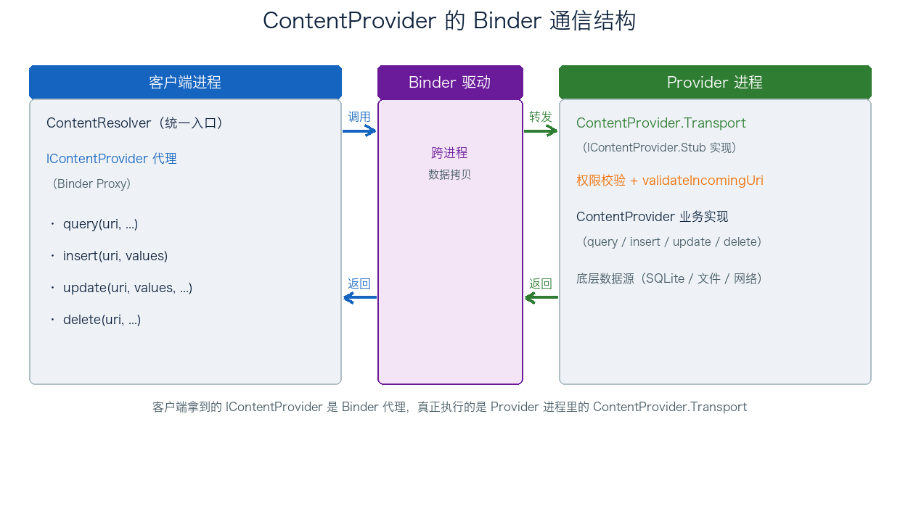
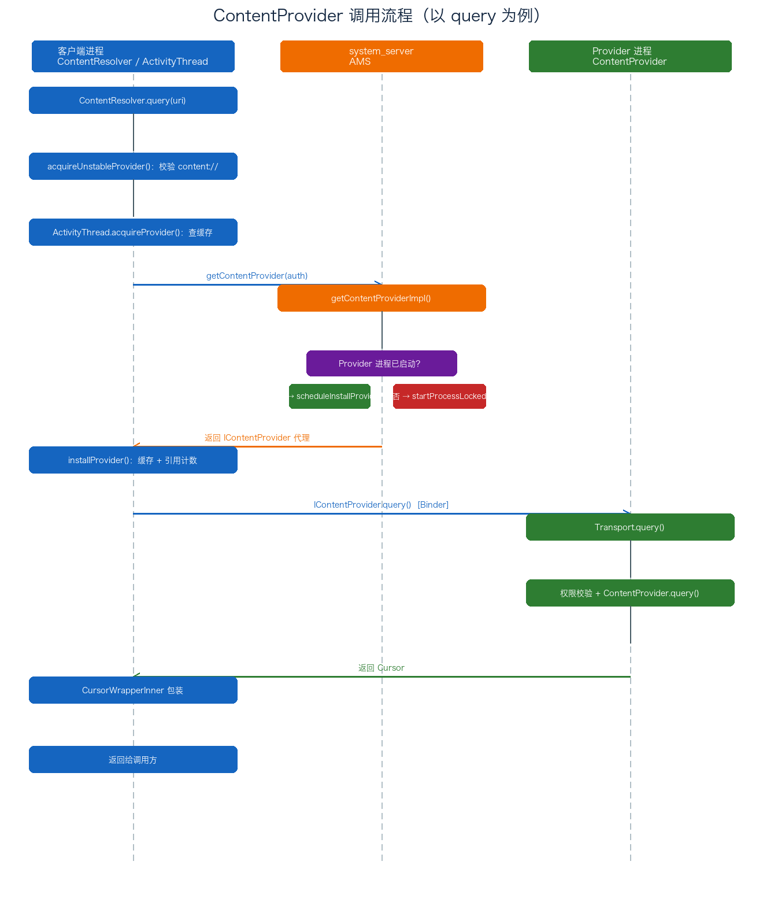

# 18. ContentProvider 的调用流程分析

> 上一篇《17-ContentProvider 基础与启动流程分析》讲清了 ContentProvider 的概念模型和启动安装过程。这篇看「调用」：客户端执行 `getContentResolver().query(uri)` 时，背后是一整条跨进程调用链——`ContentResolver → ActivityThread.acquireProvider → AMS.getContentProvider → IContentProvider（Binder 代理）→ ContentProvider.Transport → ContentProvider`。下面以 `query` 为例，把这条链路上的每个方法拆开看，重点讲 stable / unstable Provider、进程判断、权限校验、缓存与引用计数这几个高频考点。

## 目录

- [一、调用流程概述](#一调用流程概述)
- [二、query 调用全链路源码分析](#二query-调用全链路源码分析)
  - [1. ContentResolver.query 入口](#1-contentresolverquery-入口)
  - [2. acquireUnstableProvider：scheme 校验](#2-acquireunstableproviderscheme-校验)
  - [3. ActivityThread.acquireProvider：缓存优先](#3-activitythreadacquireprovider缓存优先)
  - [4. AMS.getContentProvider 与 getContentProviderImpl](#4-amsgetcontentprovider-与-getcontentproviderimpl)
  - [5. installProvider：缓存与引用计数](#5-installprovider缓存与引用计数)
  - [6. IContentProvider.query 跨进程调用](#6-icontentproviderquery-跨进程调用)
  - [7. Transport.query：权限校验与转发](#7-transportquery权限校验与转发)
  - [8. Cursor 回传与 CursorWrapperInner](#8-cursor-回传与-cursorwrapperinner)
- [三、深入要点](#三深入要点)
  - [1. stable 与 unstable Provider](#1-stable-与-unstable-provider)
  - [2. 进程判断与 Provider 发布](#2-进程判断与-provider-发布)
  - [3. 权限校验](#3-权限校验)
  - [4. 缓存机制与引用计数](#4-缓存机制与引用计数)
- [附：高频速记](#附高频速记)

---

## 一、调用流程概述

客户端对 ContentProvider 的一切访问，最终都会落到一次 Binder 跨进程调用上。整体通信结构：



几个关键认知：

- 客户端拿到的 `IContentProvider` 不是真正的 Provider 对象，而是 Binder 代理（`ContentProviderNative` / AIDL 生成的 Proxy）；
- 真正干活的是 Provider 进程里的 `ContentProvider.Transport`（它实现了 `IContentProvider.Stub`）；
- `Transport` 内部先做权限校验、URI 校验，再转发给业务侧的 `ContentProvider` 方法；
- 调用方法（`query` / `insert` / `update` / `delete`）本身是同步 Binder 调用，`Cursor` 等结果再跨进程回传。

以 `query` 为例的完整时序：



下面沿这条链路逐个方法拆解。

---

## 二、query 调用全链路源码分析

### 1. ContentResolver.query 入口

客户端调用 Provider 的 `query`，是通过 `Context.getContentResolver().query(...)` 发起的。`Context` 的实现者是 `ContextImpl`，它的 `getContentResolver` 直接返回内置的 `mContentResolver`：

```java
public ContentResolver getContentResolver() {
    return mContentResolver;
}
```

这个 `mContentResolver` 的实际类型是 `ApplicationContentResolver`，它没有重写 `query`，所以 `query` 仍然在父类 `ContentResolver` 中实现：

```java
public final @Nullable Cursor query(final @RequiresPermission.Read @NonNull Uri uri,
        @Nullable String[] projection, @Nullable Bundle queryArgs,
        @Nullable CancellationSignal cancellationSignal) {
    Preconditions.checkNotNull(uri, "uri");
    IContentProvider unstableProvider = acquireUnstableProvider(uri);  // ★ 先拿「不稳定」Provider
    if (unstableProvider == null) {
        return null;
    }
    IContentProvider stableProvider = null;
    Cursor qCursor = null;
    try {
        // ... 处理 CancellationSignal
        try {
            qCursor = unstableProvider.query(mPackageName, uri, projection,
                    queryArgs, remoteCancellationSignal);               // ★ 跨进程 query
        } catch (DeadObjectException e) {
            // ★ 远端进程死亡：换 stable Provider 重试一次
            unstableProviderDied(unstableProvider);
            stableProvider = acquireProvider(uri);
            if (stableProvider == null) {
                return null;
            }
            qCursor = stableProvider.query(mPackageName, uri, projection,
                    queryArgs, remoteCancellationSignal);
        }
        if (qCursor == null) {
            return null;
        }
        qCursor.getCount();   // ★ 强制真正执行查询
        // ...
        final IContentProvider provider = (stableProvider != null) ? stableProvider
                : acquireProvider(uri);
        final CursorWrapperInner wrapper = new CursorWrapperInner(qCursor, provider);
        return wrapper;       // ★ 包装后返回
    }
    // ... 省略 finally
}
```

这里有两个点值得注意：先用 unstable Provider 查，失败再用 stable Provider 兜底；返回前把 `Cursor` 包成 `CursorWrapperInner`（下文第 8 节展开）。

### 2. acquireUnstableProvider：scheme 校验

`acquireUnstableProvider` 首先做 scheme 校验，只有 `content://` 开头的 URI 才继续：

```java
public final IContentProvider acquireUnstableProvider(Uri uri) {
    if (!SCHEME_CONTENT.equals(uri.getScheme())) {   // ★ SCHEME_CONTENT == "content"
        return null;
    }
    String auth = uri.getAuthority();
    if (auth != null) {
        return acquireUnstableProvider(mContext, uri.getAuthority());
    }
    return null;
}
```

`SCHEME_CONTENT` 的值就是 `"content"`，这解释了为什么和 ContentProvider 交互的 URI 必须以 `content://` 作为 scheme。

随后走到 `ApplicationContentResolver` 里覆写的重载版本，它把请求交给 `ActivityThread.acquireProvider`：

```java
protected IContentProvider acquireUnstableProvider(Context c, String auth) {
    return mMainThread.acquireProvider(c,
            ContentProvider.getAuthorityWithoutUserId(auth),
            resolveUserIdFromAuthority(auth), false);   // ★ 最后参数 stable=false
}
```

### 3. ActivityThread.acquireProvider：缓存优先

`ActivityThread.acquireProvider` 的核心策略是先查缓存：

```java
public final IContentProvider acquireProvider(
        Context c, String auth, int userId, boolean stable) {
    // ★ 如果缓存中有，则直接从缓存返回
    final IContentProvider provider = acquireExistingProvider(c, auth, userId, stable);
    if (provider != null) {
        return provider;
    }
    ContentProviderHolder holder = null;
    try {
        // ★ 缓存中没有，远程调用 AMS 获取 IContentProvider
        holder = ActivityManager.getService().getContentProvider(
                getApplicationThread(), auth, userId, stable);
    } catch (RemoteException ex) {
        throw ex.rethrowFromSystemServer();
    }
    if (holder == null) {
        return null;
    }
    // ★ installProvider 会递增引用计数，并处理并发竞争
    holder = installProvider(c, holder, holder.info,
            true /*noisy*/, holder.noReleaseNeeded, stable);
    return holder.provider;
}
```

`acquireExistingProvider` 会遍历本进程已缓存的 Provider（`ArrayMap<ProviderKey, ProviderClientRecord>`），命中则直接返回并递增引用计数；未命中才向 AMS 请求。这是 ContentProvider 调用性能优化的关键一环——避免每次访问都跨进程向 AMS 查询。

### 4. AMS.getContentProvider 与 getContentProviderImpl

AMS 侧入口 `getContentProvider` 直接委托给内部方法 `getContentProviderImpl`：

```java
public final ContentProviderHolder getContentProvider(
        IApplicationThread caller, String name, int userId, boolean stable) {
    enforceNotIsolatedCaller("getContentProvider");
    // ... 省略
    return getContentProviderImpl(caller, name, null, stable, userId);
}
```

`getContentProviderImpl` 是这段链路的决策点：它先定位目标 Provider 的进程，再决定是「直接安装」还是「启动新进程」：

```java
private ContentProviderHolder getContentProviderImpl(IApplicationThread caller,
        String name, IBinder token, boolean stable, int userId) {
    ContentProviderRecord cpr;
    ContentProviderConnection conn = null;
    ProviderInfo cpi = null;
    // ... 省略：解析 authority，找到对应的 ContentProviderRecord / ProviderInfo

    // 1. 获取目标 ContentProvider 所在进程信息
    ProcessRecord proc = getProcessRecordLocked(
            cpi.processName, cpr.appInfo.uid, false);
    if (proc != null && proc.thread != null && !proc.killed) {
        // 2. 进程已启动：直接调度安装 Provider
        if (!proc.pubProviders.containsKey(cpi.name)) {
            proc.pubProviders.put(cpi.name, cpr);
            try {
                proc.thread.scheduleInstallProvider(cpi);   // ★ 让进程安装 Provider
            } catch (RemoteException e) {
            }
        }
    } else {
        // 3. 进程未启动：拉起新进程（走 ContentProvider 的启动流程）
        proc = startProcessLocked(cpi.processName,
                cpr.appInfo, false, 0, "content provider",
                new ComponentName(cpi.applicationInfo.packageName, cpi.name),
                false, false, false);
        if (proc == null) {
            return null;
        }
    }
    cpr.launchingApp = proc;          // ★ 记录正在拉起的进程
    mLaunchingProviders.add(cpr);     // ★ 加入「正在启动」的 Provider 集合
    // ... 省略
}
```

要点：如果 Provider 所在进程已启动、但 Provider 实例还没发布，就通过 `scheduleInstallProvider` 让进程现场安装；如果进程还没启动，就 `startProcessLocked` 拉起进程。拉起后，新进程会在启动阶段走上一篇讲过的 `installContentProviders → installProvider` 流程完成 Provider 的初始化与发布。

### 5. installProvider：缓存与引用计数

AMS 返回的 `ContentProviderHolder`（内含 `IContentProvider` Binder + `ProviderInfo`）回到客户端进程后，客户端通过 `installProvider` 把它登记进本地缓存：

```java
// ActivityThread.installProvider（客户端侧）
// 把 AMS 返回的 ContentProviderHolder 里的 IContentProvider 存进 mProviders，
// 并建立 ProviderClientRecord，记录 stable/unstable 计数。
// 之后再次访问同一 authority 时，acquireExistingProvider 就能直接命中。
```

客户端为每个已获取的 Provider 维护一个 `ProviderClientRecord`，里面记录 `stableCount` 和 `unstableCount` 两个引用计数（详见第三部分第 4 节）。这正是 `acquireProvider` 开头「缓存命中」的数据来源。

### 6. IContentProvider.query 跨进程调用

拿到 `IContentProvider` 代理后，回到第 1 节的 `ContentResolver.query`，通过它发起真正的跨进程调用：

```java
qCursor = unstableProvider.query(mPackageName, uri, projection,
        queryArgs, remoteCancellationSignal);
```

这里的 `unstableProvider` 是 `IContentProvider` 接口（Binder 代理），调用会经 Binder 跨进程到达 Provider 进程。而 `IContentProvider` 在 Provider 进程的实现者，就是 `ContentProvider.Transport`。

### 7. Transport.query：权限校验与转发

`ContentProvider.Transport` 是 `ContentProvider` 的内部类，实现了 `IContentProvider.Stub`。它的 `query` 方法负责「守门 + 转发」：

```java
// ContentProvider.Transport.query
public Cursor query(String callingPkg, Uri uri, @Nullable String[] projection,
        @Nullable Bundle queryArgs, @Nullable ICancellationSignal cancellationSignal) {
    validateIncomingUri(uri);                                  // ★ 1. 校验 URI 合法性
    uri = maybeGetUriWithoutUserId(uri);
    if (enforceReadPermission(callingPkg, uri, null) != AppOpsManager.MODE_ALLOWED) {
        // ★ 2. 读权限校验失败：返回空游标，不抛异常、不泄露数据
        if (projection != null) {
            return new MatrixCursor(projection, 0);
        }
        Cursor cursor = ContentProvider.this.query(
                uri, projection, queryArgs,
                CancellationSignal.fromTransport(cancellationSignal));
        if (cursor == null) {
            return null;
        }
        return new MatrixCursor(cursor.getColumnNames(), 0);   // ★ 返回同结构空游标
    }
    final String original = setCallingPackage(callingPkg);     // ★ 3. 记录真实调用方
    try {
        return ContentProvider.this.query(                     // ★ 4. 转发给业务实现
                uri, projection, queryArgs,
                CancellationSignal.fromTransport(cancellationSignal));
    } finally {
        setCallingPackage(original);
    }
}
```

`Transport.query` 做了四件事：

1. `validateIncomingUri`：校验 URI 是否在本 Provider 的 authority 范围内，非法 URI 直接抛异常；
2. `enforceReadPermission`：校验调用方是否具备读权限，失败时返回一个空游标（`MatrixCursor`），而不是抛 `SecurityException` 或泄露真实数据——这是 Provider 的「静默拒绝」策略；
3. `setCallingPackage`：把真实调用方包名暂存，供业务侧在 `getCallingPackage()` 时获取；
4. 转发 `ContentProvider.this.query`：调用开发者覆写的业务方法。

到这里，客户端的 `query` 才真正落到我们写的 `ContentProvider.query` 里。

### 8. Cursor 回传与 CursorWrapperInner

`ContentProvider.query` 返回的 `Cursor` 跨进程回传到客户端后，`ContentResolver.query` 会把它包装成 `CursorWrapperInner`：

```java
final CursorWrapperInner wrapper = new CursorWrapperInner(qCursor, provider);
return wrapper;
```

`CursorWrapperInner` 除了委托游标操作外，还持有背后的 `IContentProvider` 引用。它的意义在于：当游标被关闭（`close()`）时，能顺带对 Provider 做引用计数释放（`releaseProvider`），避免 Provider 进程被无谓地保活。

---

## 三、深入要点

### 1. stable 与 unstable Provider

回到第 1 节，`query` 先 `acquireUnstableProvider`，失败再 `acquireProvider`。这两个 stable / unstable 的区别，是 ContentProvider 资源管理的关键：

| 维度 | unstable Provider | stable Provider |
| ---- | ---- | ---- |
| 获取方法 | `acquireUnstableProvider` | `acquireProvider` |
| 引用计数 | `unstableCount` | `stableCount` |
| 进程保活 | 不阻止 Provider 进程被杀 | 阻止 Provider 进程被杀（作为进程 adj 考量） |
| 适用场景 | 一次性查询，进程可随时回收 | 需要可靠保持连接（如游标长期持有） |

`query` 之所以先用 unstable，是因为大多数查询是一次性的，不希望仅因一次查询就把 Provider 进程的优先级提上去；只有当 unstable Provider 因进程死亡抛出 `DeadObjectException` 时，才退而求其次用 stable Provider 重试，换取更高的可靠性。`CursorWrapperInner` 持有的正是 stable 引用（`final IContentProvider provider = (stableProvider != null) ? stableProvider : acquireProvider(uri)`），保证游标存活期间 Provider 不被杀。

### 2. 进程判断与 Provider 发布

第 4 节的 `getContentProviderImpl` 里，判断「进程是否已启动」依赖三个条件：`proc != null && proc.thread != null && !proc.killed`。两条分支：

- 进程已启动：`proc.thread.scheduleInstallProvider(cpi)` 让应用进程现场安装 Provider（注意这里只装这一个，而不是上一篇那种「启动时批量安装」）；
- 进程未启动：`startProcessLocked` 拉起进程，新进程启动时走 `installContentProviders` 批量安装，完成后 `publishContentProviders` 发布。

无论哪条路径，AMS 都会把 `cpr` 放进 `mLaunchingProviders`（正在启动的 Provider 集合），并把 `cpr.launchingApp` 指向目标进程。后续 Provider 发布时，AMS 从 `mLaunchingProviders` 移除它、把 Binder 登记到 `ContentProviderRecord`，等待中的客户端调用才被真正唤醒返回。这也是首次访问某 Provider 会有一段时间等待的原因——Provider 可能要先拉起整个进程。

### 3. 权限校验

Provider 的权限校验集中在 `Transport` 这一层（第 7 节），核心链路：

1. `validateIncomingUri`：校验 URI 的 authority 是否匹配、路径是否合法；
2. `enforceReadPermission` / `enforceWritePermission`：根据 `readPermission` / `writePermission` 以及 `pathPermissions`（路径级权限）判断调用方是否被允许；
3. `AppOpsManager`：即便声明了权限，还要经过 AppOps 的运行时管控（如用户手动关闭某项权限），返回值不是 `MODE_ALLOWED` 即视为拒绝；
4. 失败策略：读操作返回空 `MatrixCursor`，写操作返回 0 或抛异常——不泄露数据、不泄露结构。

这套「权限 + AppOps + 静默拒绝」三层防护，是 ContentProvider 数据安全的核心保障。

### 4. 缓存机制与引用计数

客户端进程通过 `ActivityThread` 维护 Provider 缓存，避免重复跨进程查询 AMS：

- 缓存结构：`ArrayMap<ProviderKey, ProviderClientRecord>`，`ProviderKey` 由 authority + userId 组成；
- 命中逻辑：`acquireExistingProvider` 命中后递增对应计数（stable 或 unstable），直接返回；
- 计数维护：每次 `acquireProvider` / `acquireUnstableProvider` 递增，`releaseProvider` 递减；计数归零后，客户端解除对 Provider 的引用（并可通知 AMS 解除连接）；
- 游标联动：`CursorWrapperInner.close()` 时释放背后的 Provider 引用。

理解「缓存 + 计数」是理解「Provider 进程何时能被回收」的前提：只有所有客户端都 `release` 后，AMS 才可能把 Provider 进程降级、乃至回收。

---

## 附：高频速记

- 调用链：`ContentResolver.query → acquireUnstableProvider（校验 content://）→ ActivityThread.acquireProvider（缓存优先）→ AMS.getContentProvider → getContentProviderImpl（进程判断）→ installProvider（缓存+计数）→ IContentProvider.query（Binder）→ Transport.query（权限校验+转发）→ ContentProvider.query → Cursor 回传 → CursorWrapperInner`。
- 两个角色：客户端拿的是 `IContentProvider` Binder 代理；真正执行的是 Provider 进程的 `ContentProvider.Transport`（`IContentProvider.Stub` 实现）。
- stable vs unstable：unstable 不阻止进程被杀（一次性查询用）；stable 阻止进程被杀（游标长期持有用）。`query` 先用 unstable，`DeadObjectException` 时换 stable 重试。
- 进程判断：已启动 → `scheduleInstallProvider` 现场安装；未启动 → `startProcessLocked` 拉起进程走启动流程。首次访问可能因「拉起进程」而等待。
- 三层防护：`validateIncomingUri`（URI 合法）→ `enforceReadPermission` + `AppOpsManager`（权限）→ 失败返回空 `MatrixCursor`（静默拒绝，不泄数据）。
- 缓存与计数：`acquireExistingProvider` 命中本地 `ArrayMap` 缓存并递增 `stableCount`/`unstableCount`；`releaseProvider` 递减，归零才可回收 Provider 进程。
- `CursorWrapperInner`：包装返回的 Cursor，持有 Provider 引用，`close()` 时顺带释放 Provider 引用计数。
- scheme 强制：与 Provider 交互的 URI 必须以 `content://` 开头，否则 `acquireUnstableProvider` 直接返回 null。
