# 19. Window 体系

> 写 Android 界面第一行代码就是 `setContentView`，但大部分人对这条链路只停留在「把布局塞进去」的直觉，再往里追就断了：`Window` 和 `View` 到底谁管谁？`DecorView` 是谁、什么时候 new 出来的？界面为什么非要等到 `onResume` 之后才真正显示？`Dialog`、`Toast`、`PopupWindow` 凭什么能浮在 Activity 上面？这些问题背后是同一套东西——Window 体系。
>
> 这篇不是罗列概念，而是沿着「一个窗口从创建到上屏」这条主线，把每段关键源码拆开讲：先讲 Window 的本质定位和窗口的类型层级，再讲 Activity 怎么在 `attach` 阶段就把 `PhoneWindow` 备好、`setContentView` 到 `installDecor` 的 DecorView 是怎么诞生的，然后落到 `WindowManager` 体系（`WindowManagerImpl` → `WindowManagerGlobal` → `ViewRootImpl`）和 `addView` 的完整跨进程链路，最后进 system_server 讲 `WMS` 怎么管理窗口、算 Z-order、分 Surface、派发输入事件。看完这条线，Android 界面显示的一半原理就通了。

## 目录

- [一、Window 的本质与体系全景](#一window-的本质与体系全景)
  - [1. Window 是什么：View 的载体，不是 View](#1-window-是什么view-的载体不是-view)
  - [2. 一条内容链 + 一条管理链](#2-一条内容链--一条管理链)
  - [3. PhoneWindow：Window 的唯一实现](#3-phonewindowwindow-的唯一实现)
- [二、窗口的类型与层级（type 体系）](#二窗口的类型与层级type-体系)
  - [1. type 三大区间](#1-type-三大区间)
  - [2. Z-order：type 越大越靠上](#2-z-ordertype-越大越靠上)
- [三、Window 与 Activity 的绑定](#三window-与-activity-的绑定)
  - [1. Activity.attach：PhoneWindow 的诞生](#1-activityattachphonewindow-的诞生)
  - [2. setContentView 委托链](#2-setcontentview-委托链)
  - [3. installDecor 与 generateLayout：DecorView 怎么来](#3-installdecor-与-generatelayoutdecorview-怎么来)
  - [4. DecorView 的完整结构](#4-decorview-的完整结构)
- [四、WindowManager 体系：从接口到 ViewRootImpl](#四windowmanager-体系从接口到-viewrootimpl)
  - [1. ViewManager 接口与 WindowManager](#1-viewmanager-接口与-windowmanager)
  - [2. WindowManagerImpl：带上下文的委托壳](#2-windowmanagerimpl带上下文的委托壳)
  - [3. WindowManagerGlobal：进程级单例三列表](#3-windowmanagerglobal进程级单例三列表)
  - [4. ViewRootImpl 与 Binder 通道](#4-viewrootimpl-与-binder-通道)
- [五、窗口上屏全流程：addView 源码级拆解](#五窗口上屏全流程addview-源码级拆解)
  - [1. 应用侧：handleResumeActivity → addView](#1-应用侧handleresumeactivity--addview)
  - [2. 跨进程：ViewRootImpl.setView → WMS.addWindow](#2-跨进程viewrootimplsetview--wmsaddwindow)
  - [3. Surface 与绘制：relayout → performTraversals](#3-surface-与绘制relayout--performtraversals)
- [六、WMS 的窗口管理](#六wms-的窗口管理)
  - [1. WindowToken 与 WindowState](#1-windowtoken-与-windowstate)
  - [2. WindowToken 的分配与校验](#2-windowtoken-的分配与校验)
  - [3. Z-order 的计算](#3-z-order-的计算)
  - [4. 输入事件的窗口分发](#4-输入事件的窗口分发)
- [七、Dialog / Toast / PopupWindow 的窗口机制](#七dialog--toast--popupwindow-的窗口机制)
  - [1. Dialog：一个独立的 Window](#1-dialog一个独立的-window)
  - [2. Toast：跨进程让系统显示](#2-toast跨进程让系统显示)
  - [3. PopupWindow：依附父窗口的子窗口](#3-popupwindow依附父窗口的子窗口)
  - [4. 三者对比](#4-三者对比)
- [附：高频速记](#附高频速记)

---

## 一、Window 的本质与体系全景

### 1. Window 是什么：View 的载体，不是 View

一个界面要在屏幕上显示，本质是两件事要同时成立：第一，有一棵 View 树，承载布局、控件、文字这些「长什么样」的内容；第二，这棵树被系统当成一个「窗口」挂到屏幕上，分配好层级、位置、大小、可见性。前者是 `View` 的活，后者是 `Window` 的活。

所以 `Window` 的准确定位是：View 的载体，一个负责「管理窗口」的对象，本身不参与绘制，也不是 View。在源码里，`Window` 是一个抽象类 `android.view.Window`，它定义了一套窗口行为——设置标题、设置背景、请求 feature（无标题、全屏等）、返回 `DecorView`、返回 `WindowManager`——但真正的实现都在它唯一的子类 `PhoneWindow` 里。

面试里最常被问的澄清点就是这个：`Window` 不是 `View` 的子类，它内部持有一个 `DecorView`（这才是真正的根 View），`DecorView` 下面才挂着你 `setContentView` 塞进去的布局树。分工很清楚：窗口的背景、标题栏这些「壳」归 Window 管，布局内容归 View 树管，Window 只决定这棵树挂在哪、多大、跟系统怎么对接，自己一个像素都不画。

### 2. 一条内容链 + 一条管理链

Window 体系可以拆成两条链，两条链都在 Window 这里交汇：

- **内容链**：`Activity → Window(PhoneWindow) → DecorView → content(R.id.content) → 你的布局`，这条链回答「界面上画的是什么」；
- **管理链**：`Window → WindowManager(Impl→Global) → ViewRootImpl → WMS → SurfaceFlinger`，这条链回答「这棵树怎么被挂上屏幕、怎么被画出来」。

两条链的起点都落在 `Window` 上。下面这张图把两条链和几个主角的位置一次性摆清楚：

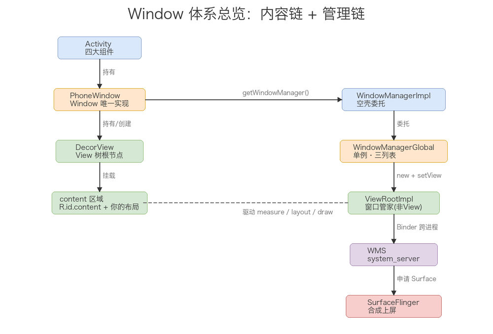

图里右边这条管理链是很多人最模糊的一段，先把四个角色的分工说清楚，第四、五章再逐个展开源码：

- `WindowManager` 是个接口，应用侧拿到的实现是 `WindowManagerImpl`，但它几乎不干活，只做「带上自己的 context/token」然后委托给 `WindowManagerGlobal`；
- `WindowManagerGlobal` 是进程级单例，用三个 ArrayList 统管进程内所有窗口；
- `ViewRootImpl` 才是每个窗口真正的「管家」，一个窗口一个，跨进程跟 WMS 通信、申请 Surface、驱动 measure/layout/draw；
- `WMS`（`WindowManagerService`）跑在 system_server，是全局所有窗口的中央调度器。

分工就是这样：`View` 负责「长什么样」，`Window` 负责「这是一块什么窗口」，`WindowManager` 体系负责「怎么把它挂上去」，`WMS` 负责「全局怎么排布」。

### 3. PhoneWindow：Window 的唯一实现

`Window` 抽象类的唯一实现是 `com.android.internal.policy.PhoneWindow`。这是个框架内部类，应用层拿不到、也不能直接 `new`，日常 `getWindow()` 返回的其实就是它。因为只有这一个实现，我们平时根本感觉不到 `Window` 抽象类的存在，所有窗口行为都是它一家说了算。

`PhoneWindow` 的职责可以归纳为四件事：持有 `DecorView`（成员 `mDecor`）和内容容器（成员 `mContentParent`）；处理标题栏、ActionBar、背景等窗口级 UI；实现 `setContentView` 把布局装进 content 区域；对接 `WindowManager` 完成窗口的添加、更新、移除。

---

## 二、窗口的类型与层级（type 体系）

### 1. type 三大区间

Android 把所有窗口按「谁在用、能浮多高」分成三大类，这个分类由 `WindowManager.LayoutParams.type` 这个 int 值决定。源码里定义了六个区间常量：

```java
public static final int FIRST_APPLICATION_WINDOW = 1;
public static final int LAST_APPLICATION_WINDOW  = 99;

public static final int FIRST_SUB_WINDOW = 1000;
public static final int LAST_SUB_WINDOW  = 1999;

public static final int FIRST_SYSTEM_WINDOW = 2000;
public static final int LAST_SYSTEM_WINDOW  = 2999;
```

三类窗口各自的定位和常见 type：

- **应用窗口（Application Window，1~99）**：对应一个 Activity。`TYPE_APPLICATION`（2）是普通 Activity 窗口；`TYPE_APPLICATION_STARTING`（3）是启动窗口，也就是冷启动时那张白屏/启动页，本质是系统帮忙显示的一个临时窗口，App 还没真正画出来之前先顶上去。
- **子窗口（Sub Window，1000~1999）**：必须依附在某个父窗口上，不能独立存在，它的 `LayoutParams.token` 必须指向父窗口的 token。典型有 `TYPE_APPLICATION_PANEL`（1000，PopupWindow 默认）、`TYPE_APPLICATION_ATTACHED_DIALOG`（1003，依附 Activity 的 Dialog）。子窗口层级比父窗口高，但生命周期随父窗口（父关了它也关）。
- **系统窗口（System Window，2000~2999）**：由系统进程或持有特殊权限的应用创建，层级最高。`TYPE_STATUS_BAR`（2000）、`TYPE_SYSTEM_ALERT`（2003，悬浮窗，需要 `SYSTEM_ALERT_WINDOW` 权限）、`TYPE_TOAST`（2005）、`TYPE_INPUT_METHOD`（2011）、`TYPE_WALLPAPER`（2013）都属于这一类。

### 2. Z-order：type 越大越靠上

窗口之间谁盖住谁，规则只有一条：type 值越大，层级越高，显示越靠上。三大类区间就是按这个规则排的——应用窗口（1~99）整体垫底，子窗口（1000~1999）居中，系统窗口（2000~2999）整体最顶。

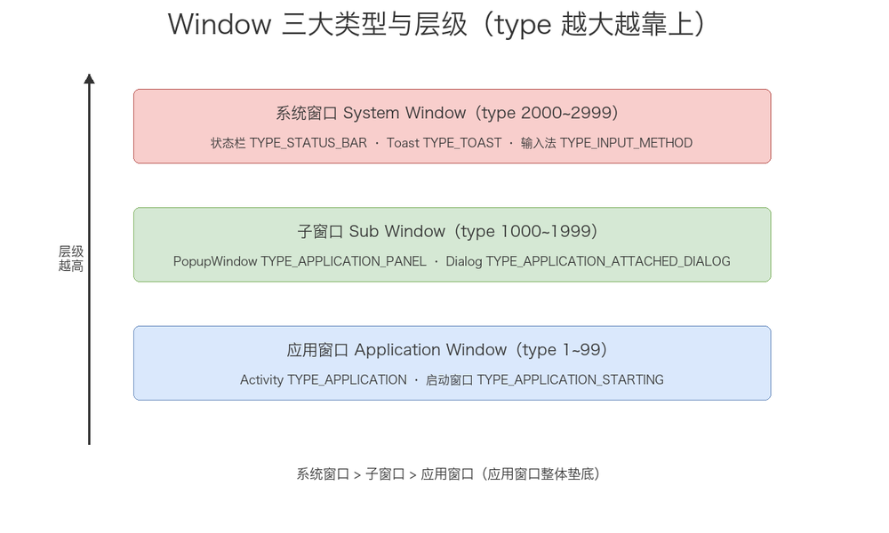

几个能直接印证这条规则的现象：

- `Dialog` 能浮在 Activity 上，因为它的 type（1003）比 Activity 的 2 大；
- `Toast` 能浮在几乎所有普通界面之上，因为它 type 2005，是系统窗口；
- 输入法弹出能盖住 Dialog 和 Activity，因为它 type 2011，比它们都大；
- 状态栏永远在最上层，type 2000 起步。

不过 `type` 决定的只是大类层级。同一类内部（比如两个都是应用窗口）谁在上谁在下，由 WMS 里更细的 Z-order 计算决定，第六章会展开。所以「type 越大越靠上」是粗粒度规则，不是最终答案。

---

## 三、Window 与 Activity 的绑定

### 1. Activity.attach：PhoneWindow 的诞生

`PhoneWindow` 的创建发生在 `Activity.attach()` 里。`attach` 是 `ActivityThread.performLaunchActivity` 调用的，发生在 `onCreate` 之前——这也是为什么 `onCreate` 里调 `setContentView` 时 Window 早就就绪了。看关键源码（基于 AOSP framework/base，版本细节略有出入但主干一致）：

```java
final void attach(Context context, ActivityThread aThread,
        Instrumentation instr, IBinder token, int ident,
        Application application, Intent intent, ActivityInfo info,
        CharSequence title, Activity parent, String id,
        NonConfigurationInstances lastNonConfigurationInstances,
        Configuration config, String referrer, IVoiceInteractor voiceInteractor,
        Window window, ActivityConfigCallback activityConfigCallback, IBinder assistToken) {
    attachBaseContext(context);
    mFragments.attachHost(null /*parent*/);

    // ★ 创建 PhoneWindow，把 Activity 自己传进去
    mWindow = new PhoneWindow(this, window, activityConfigCallback);
    mWindow.setWindowControllerCallback(mWindowControllerCallback);
    mWindow.setCallback(this);                 // Activity 自己作为 Window 的回调
    mWindow.setOnWindowDismissedCallback(this);
    mWindow.getLayoutInflater().setPrivateFactory(this);

    if (info.softInputMode != WindowManager.LayoutParams.SOFT_INPUT_STATE_UNSPECIFIED) {
        mWindow.setSoftInputMode(info.softInputMode);
    }
    if (info.uiOptions != 0) {
        mWindow.setUiOptions(info.uiOptions);
    }

    mUiThread = Thread.currentThread();
    mMainThread = aThread;
    mInstrumentation = instr;
    mToken = token;                            // 记住这个 token，后面窗口归属靠它
    mAssistToken = assistToken;
    ...
    mWindow.setWindowManager(
            (WindowManager) context.getSystemService(Context.WINDOW_SERVICE),
            mToken, mComponent.flattenToString(),
            (info.flags & ActivityInfo.FLAG_HARDWARE_ACCELERATED) != 0);
    if (mParent != null) {
        mWindow.setContainer(mParent.getWindow());
    }
    mWindowManager = mWindow.getWindowManager();
    mCurrentConfig = config;
    ...
}
```

源码里值得注意的有三处：

- `new PhoneWindow(this, ...)` 把 Activity 传进去，建立「Activity 持有 Window」的持有关系，同时 `setCallback(this)` 让 Window 能把分发事件、菜单等逻辑回调给 Activity——这是 Activity 能收到 `dispatchTouchEvent`、`onMenuItemSelected` 这些回调的根源；
- `mToken = token` 记下了这个 Activity 的 `IBinder` token，它来自 AMS，后面窗口归属、权限校验全靠它；
- `setWindowManager(...)` 把 `WindowManager` 和 `mToken` 一起传给 Window，为后面 `addView` 做准备。注意它把「是否硬件加速」的 flag 也传了进去，最终会写进 `LayoutParams`。

所以顺序是：`performLaunchActivity` → `attach`（new PhoneWindow + 关联 WindowManager）→ `onCreate`（此时才能 `setContentView`）。

### 2. setContentView 委托链

`setContentView` 是一条很短的委托链，但很多人被它误导，以为调完界面就显示了。真实流程是 Activity 委托给 PhoneWindow：

```java
// Activity.setContentView
public void setContentView(@LayoutRes int layoutResID) {
    getWindow().setContentView(layoutResID);   // 委托给 PhoneWindow
    initWindowDecorActionBar();
}

// PhoneWindow.setContentView
@Override
public void setContentView(int layoutResID) {
    if (mContentParent == null) {
        installDecor();                        // 首次：创建 DecorView + content 区域
    } else if (!hasFeature(FEATURE_CONTENT_TRANSITIONS)) {
        mContentParent.removeAllViews();       // 非首次：清空再装
    }
    if (hasFeature(FEATURE_CONTENT_TRANSITIONS)) {
        // 有转场动画时暂不 inflate，等转场后再装
        final Scene newScene = Scene.getSceneForLayout(mContentParent, layoutResID,
                getContext());
        transitionTo(newScene);
    } else {
        mLayoutInflater.inflate(layoutResID, mContentParent);  // 把布局 inflate 进 content
    }
    mContentParent.requestApplyInsets();
    final Callback cb = getCallback();
    if (cb != null && !isDestroyed()) {
        cb.onContentChanged();
    }
    mContentParentExplicitlySet = true;
}
```

最关键的一点：`setContentView` 只是把布局 inflate 进 DecorView 的 content 区域，此刻界面还不会显示。因为这时候没有 `ViewRootImpl`，没触发 measure/layout/draw，也没申请 Surface。真正的显示要等到 `onResume` 之后（第五章）。下图是这个委托链的浓缩：

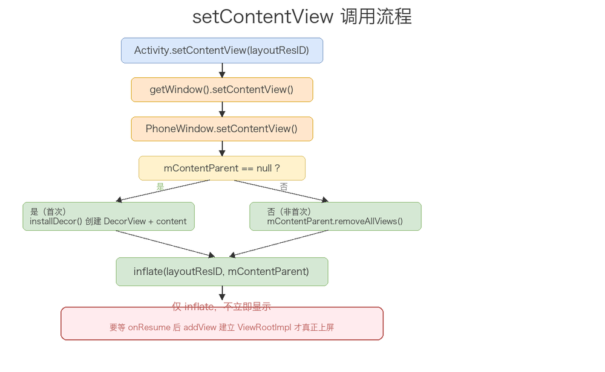

### 3. installDecor 与 generateLayout：DecorView 怎么来

`DecorView` 不是 Activity 创建时就有的，它是懒加载的——第一次 `setContentView`（或第一次访问 `getDecorView()`）时，`PhoneWindow` 才通过 `installDecor()` 把它造出来：

```java
private void installDecor() {
    mForceDecorInstall = false;
    if (mDecor == null) {
        mDecor = generateDecor(-1);            // ① new 一个 DecorView
        mDecor.setDescendantFocusability(ViewGroup.FOCUS_AFTER_DESCENDANTS);
        mDecor.setIsRootNamespace(true);
        if (!mInvalidatePanelMenuPosted && mInvalidatePanelMenuFeatures != 0) {
            mDecor.postOnAnimation(mInvalidatePanelMenuRunnable);
        }
    } else {
        mDecor.setWindow(this);
    }
    if (mContentParent == null) {
        mContentParent = generateLayout(mDecor); // ② 选布局模板，拿到 content 区域
        ...
    }
}
```

`installDecor` 分两步：先 `generateDecor` 造出空的 `DecorView`，再 `generateLayout` 给它「填模板」。真正有技术含量的是 `generateLayout`——它会根据窗口的 feature 状态，从一堆预定义布局里挑一个，inflate 进 `DecorView`，再 `findViewById(ID_ANDROID_CONTENT)` 拿到 `mContentParent`。挑模板的核心判断链是这样的：

```java
protected ViewGroup generateLayout(DecorView decor) {
    // 从主题里读窗口属性：是否浮动、是否无标题、是否全屏……
    TypedArray a = getWindowStyle();
    mIsFloating = a.getBoolean(R.styleable.Window_windowIsFloating, false);
    ...

    int layoutResource;
    int features = getLocalFeatures();
    if ((features & (1 << FEATURE_SWIPE_TO_DISMISS)) != 0) {
        layoutResource = R.layout.screen_swipe_dismiss;
    } else if ((features & ((1 << FEATURE_LEFT_ICON) | (1 << FEATURE_RIGHT_ICON))) != 0) {
        layoutResource = R.layout.screen_title_icons;
        removeFeature(FEATURE_ACTION_BAR);
    } else if ((features & ((1 << FEATURE_PROGRESS) | (1 << FEATURE_INDETERMINATE_PROGRESS))) != 0
            && (features & (1 << FEATURE_ACTION_BAR)) == 0) {
        layoutResource = R.layout.screen_progress;             // 带进度条
    } else if ((features & (1 << FEATURE_CUSTOM_TITLE)) != 0) {
        layoutResource = R.layout.screen_custom_title;         // 自定义标题
    } else if ((features & (1 << FEATURE_NO_TITLE)) == 0) {
        if (mIsFloating) {
            layoutResource = R.layout.dialog_title;            // 浮动窗口带标题
        } else if ((features & (1 << FEATURE_ACTION_BAR)) != 0) {
            layoutResource = R.layout.screen_action_bar;       // 带 ActionBar
        } else {
            layoutResource = R.layout.screen_title;            // 普通带标题
        }
    } else {
        layoutResource = R.layout.screen_simple;               // 无标题，最简
    }

    mDecor.startChanging();
    mDecor.onResourcesLoaded(mLayoutInflater, layoutResource); // 把模板 inflate 进 DecorView
    ViewGroup contentParent = (ViewGroup) findViewById(ID_ANDROID_CONTENT);
    if (contentParent == null) {
        throw new RuntimeException("Window couldn't find content container view");
    }
    mDecor.finishChanging();
    return contentParent;
}
```

这段代码回答了一个经典问题：「为什么同一个 `Activity`，`requestWindowFeature(FEATURE_NO_TITLE)` 之后 DecorView 的结构会不一样」。答案是 `generateLayout` 根据 feature 从 `screen_title`、`screen_action_bar`、`screen_simple` 等模板里挑，模板不同，DecorView 里预置的子 View（标题栏、ActionBar 这些）就不同。而无论挑哪个模板，里面一定有一个 id 为 `android.R.id.content` 的 `FrameLayout`，`findViewById(ID_ANDROID_CONTENT)` 找到的就是它，返回给 `mContentParent`。

### 4. DecorView 的完整结构

`DecorView`（`com.android.internal.policy.DecorView`）继承自 `FrameLayout`，是整个 View 树的根节点。结合上面的 `generateLayout`，它的完整结构大致是这样：

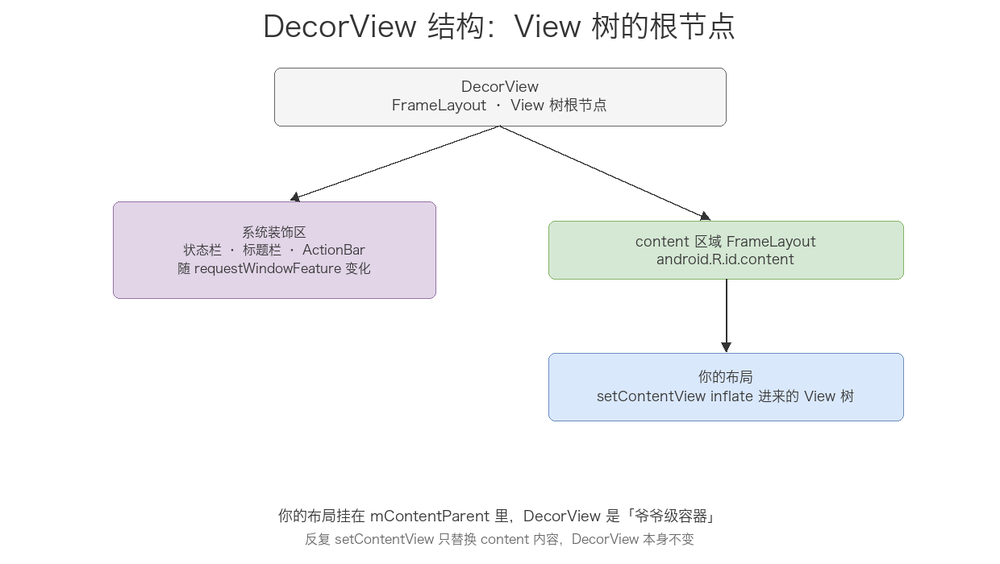

你写的布局并不是直接挂在 `DecorView` 根上，而是挂在一个 id 为 `android.R.id.content` 的 `FrameLayout`（也就是 `mContentParent`）里。`DecorView` 上面还有系统帮它加的状态栏占位、标题栏/ActionBar 区域，所以它才是「你布局的爷爷级容器」。

由此可以推出几个常用的结论：一个 Activity 只有一个 `PhoneWindow`，一个 `PhoneWindow` 只有一个 `DecorView`（懒加载，首次访问才创建），一个 `DecorView` 在 addView 时才对应一个 `ViewRootImpl`。所以 `getWindow().getDecorView()` 拿到的始终是同一个对象，反复调 `setContentView` 只是不断替换 content 里的内容，DecorView 本身不变。

---

## 四、WindowManager 体系：从接口到 ViewRootImpl

### 1. ViewManager 接口与 WindowManager

`WindowManager` 是一个接口，继承自 `ViewManager`。`ViewManager` 定义了窗口管理的三个基本操作，所有窗口操作最终都归结为这三件事：

```java
public interface ViewManager {
    void addView(View view, ViewGroup.LayoutParams params);
    void updateViewLayout(View view, ViewGroup.LayoutParams params);
    void removeView(View view);
}
```

`WindowManager` 在 `ViewManager` 基础上又加了一堆窗口相关的常量（就是第二章那些 `type` 和 flag）。值得注意的细节是：`WindowManager` 这个接口继承自 `ViewManager`，而 `ViewManager` 里方法的参数是 `View` 和 `ViewGroup.LayoutParams`，所以「窗口」在 WindowManager 体系里的抽象载体就是一个 `View`（其实是 DecorView）+ 一个 `LayoutParams`。类型层面也说明了同一件事：Window 不是 View，但 Window 的显示是拿一个 View 去注册的。

### 2. WindowManagerImpl：带上下文的委托壳

`WindowManager` 的实现类是 `WindowManagerImpl`，但它几乎不干活，只做一件事——带上自己的 context/token，然后把调用转发给 `WindowManagerGlobal`：

```java
public final class WindowManagerImpl implements WindowManager {
    private final WindowManagerGlobal mGlobal = WindowManagerGlobal.getInstance();
    private final Context mContext;
    private final Window mParentWindow;

    @Override
    public void addView(View view, ViewGroup.LayoutParams params) {
        applyTokens(params);
        mGlobal.addView(view, params, mContext.getDisplayNoVerify(), mParentWindow,
                mContext.getUserId());
    }
    ...
}
```

为什么要多这一层？关键在 `mContext` 和 `mParentWindow` 这两个成员。`WindowManagerGlobal` 是进程级单例，全局只有一个；但每个 Activity、每个 Dialog 都要有自己的 `WindowManagerImpl` 实例，携带各自不同的 context、token、parentWindow。所以 `Impl` 负责「带上下文」，`Global` 负责「统一管理」，职责分开——否则所有窗口共用一个对象，token、display、userId 这些上下文就全串了。

### 3. WindowManagerGlobal：进程级单例三列表

`WindowManagerGlobal` 是真正的干活者，进程内单例。它内部用三个 ArrayList 维护进程内所有窗口，按下标一一对应：

```java
private final ArrayList<View> mViews = new ArrayList<>();          // 所有窗口的根 View（DecorView）
private final ArrayList<ViewRootImpl> mRoots = new ArrayList<>();  // 每个窗口对应的 ViewRootImpl
private final ArrayList<WindowManager.LayoutParams> mParams = new ArrayList<>(); // 布局参数
```

`addView` 时同时往三个列表加一个元素，`removeView` 时同时删。这个设计让 `WindowManagerGlobal` 能统管进程内所有窗口，也方便做遍历操作（比如遍历所有窗口刷新系统属性、刷新配置）。三个列表下标严格对齐，是理解「一个进程里到底有多少窗口、多少个 ViewRootImpl」的入口——进程里每调一次 `addView`，三列表就多一行。

### 4. ViewRootImpl 与 Binder 通道

`ViewRootImpl` 是整个体系里最忙的类，但注意它不是 View——没有继承 View，也永远不参与绘制内容。它的定位是「View 树与系统之间的桥梁」，职责包括：驱动 View 树的 measure/layout/draw（通过 `performTraversals`）、跨进程与 WMS 通信、申请和管理 Surface、分发输入事件、处理焦点和配置变更。

它跟 WMS 通信靠的是 `IWindowSession` 这个 Binder 接口，而应用侧给 WMS 留的「回传句柄」是 `IWindow`。下面是 WindowManager 体系的完整类关系 + Binder 通道：

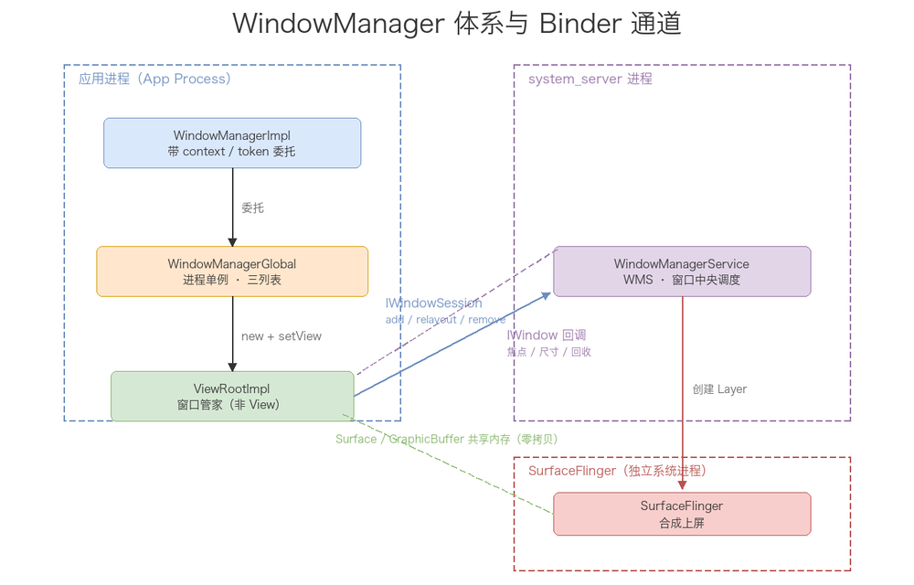

这张图要记住的是「哪些在应用进程、哪些在 system_server、中间隔着什么 Binder」：

- `WindowManagerImpl`、`WindowManagerGlobal`、`ViewRootImpl` 都在应用进程；
- `WMS` 在 system_server，`SurfaceFlinger` 是独立的系统进程；
- 应用侧通过 `IWindowSession` 主动调用 WMS（add/relayout/remove 都是这个通道）；
- WMS 通过 `IWindow` 反向回调应用侧（比如通知窗口大小变了、焦点变了、要回收 Surface 了）；
- `ViewRootImpl` 还通过 `IWindowSession.relayout` 拿到 `Surface`，而 `Surface` 背后的 `GraphicBuffer` 走的是 SurfaceFlinger 的共享内存，不再经过 Binder 传像素。

这套「双向 Binder」是理解整个窗口通信的关键：主动操作走 `IWindowSession`，被动通知走 `IWindow`，两边各持一个 Binder 句柄。

---

## 五、窗口上屏全流程：addView 源码级拆解

### 1. 应用侧：handleResumeActivity → addView

窗口真正「上屏」，是从 `ActivityThread.handleResumeActivity` 里的一次 `addView` 开始的。这也是「为什么界面要等 onResume 之后才显示」的源码答案：

```java
@Override
public void handleResumeActivity(IBinder token, boolean finalStateRequest, boolean isForward,
        String reason) {
    ...
    final ActivityClientRecord r = performResumeActivity(token, finalStateRequest, reason);
    if (r == null) { return; }

    final Activity a = r.activity;
    ...
    if (r.window == null && !a.mFinished && willBeVisible) {
        r.window = r.activity.getWindow();
        View decor = r.window.getDecorView();
        decor.setVisibility(View.INVISIBLE);   // 先隐藏，等首帧画完再显示，避免白屏
        ViewManager wm = a.getWindowManager();
        WindowManager.LayoutParams l = r.window.getAttributes();
        a.mDecor = decor;
        l.type = WindowManager.LayoutParams.TYPE_BASE_APPLICATION;
        l.softInputMode |= forwardBit;
        ...
        if (a.mVisibleFromClient) {
            if (!a.mWindowAdded) {
                a.mWindowAdded = true;
                wm.addView(decor, l);           // ★ 关键：把 DecorView 交给 WindowManager
            } else {
                a.onWindowAttributesChanged(l);
            }
        }
    } else if (!willBeVisible) { ... }
    ...
}
```

这段代码在 `performResumeActivity`（也就是 `onResume` 回调）之后才执行，印证了「界面在 onResume 后才真正显示」。`decor` 先 `setVisibility(INVISIBLE)`，等首次绘制完成后再设成 `VISIBLE`，避免首帧白屏闪烁。`a.getWindowManager()` 拿到的就是 `WindowManagerImpl`，addView 会一路委托到 `WindowManagerGlobal`。另外注意 `l.type = TYPE_BASE_APPLICATION`（值就是 2）——这就是 Activity 主窗口的 type，跟第二章对上。

`WindowManagerGlobal.addView` 是这个流程的应用侧核心，完整源码：

```java
public void addView(View view, ViewGroup.LayoutParams params,
        Display display, Window parentWindow) {
    if (view == null) throw new IllegalArgumentException("view must not be null");
    if (display == null) throw new IllegalArgumentException("display must not be null");
    if (!(params instanceof WindowManager.LayoutParams)) {
        throw new IllegalArgumentException("Params must be WindowManager.LayoutParams");
    }

    final WindowManager.LayoutParams wparams = (WindowManager.LayoutParams) params;
    if (parentWindow != null) {
        parentWindow.adjustLayoutParamsForSubWindow(wparams);   // 子窗口：修正 token/type
    } else {
        final Context context = view.getContext();
        if (context != null
                && (context.getApplicationInfo().flags
                        & ApplicationInfo.FLAG_HARDWARE_ACCELERATED) != 0) {
            wparams.flags |= WindowManager.LayoutParams.FLAG_HARDWARE_ACCELERATED;
        }
    }

    ViewRootImpl root;
    View panelParentView = null;

    synchronized (mLock) {
        // ① 重复添加校验
        int index = findViewLocked(view, false);
        if (index >= 0) {
            if (mDyingViews.contains(view)) {
                mRoots.get(index).doDie();      // 上一次 removeView 还没走完，先补完
            } else {
                throw new IllegalStateException("View " + view
                        + " has already been added to the window manager.");
            }
        }

        // ② 子窗口找父窗口
        if (wparams.type >= WindowManager.LayoutParams.FIRST_SUB_WINDOW &&
                wparams.type <= WindowManager.LayoutParams.LAST_SUB_WINDOW) {
            final int count = mViews.size();
            for (int i = 0; i < count; i++) {
                if (mRoots.get(i).mWindow.asBinder() == wparams.token) {
                    panelParentView = mViews.get(i);
                }
            }
        }

        // ③ 创建 ViewRootImpl，登记三列表
        root = new ViewRootImpl(view.getContext(), display);
        view.setLayoutParams(wparams);
        mViews.add(view);
        mRoots.add(root);
        mParams.add(wparams);
    }

    // ④ 绑定，触发后续跨进程流程
    try {
        root.setView(view, wparams, panelParentView);
    } catch (RuntimeException e) {
        // 失败则回滚，比如 BadTokenException
        synchronized (mLock) {
            final int index = findViewLocked(view, false);
            if (index >= 0) {
                removeViewLocked(index, true);
            }
        }
        throw e;
    }
}
```

三段逻辑值得记：

- 参数校验和重复添加检测：`findViewLocked` 检查这个 View 是不是已经被加过了，重复添加直接抛 `IllegalStateException`——这是「一个 View 不能被 addView 两次」的源码依据；
- 子窗口找父窗口：如果 type 落在子窗口区间，就遍历 `mViews`，通过 `mRoots.get(i).mWindow.asBinder() == wparams.token` 找到 token 匹配的父窗口，作为 `panelParentView` 传给 `setView`；
- 先登记再 setView：三个列表登记完，才调 `root.setView()`。setView 是后续所有事情（跨进程注册、申请 Surface、首次绘制）的发起点，如果它抛异常（典型的是 `BadTokenException`——token 无效），就回滚把三列表里的记录删掉。

### 2. 跨进程：ViewRootImpl.setView → WMS.addWindow

`ViewRootImpl.setView` 是应用侧往系统侧跨越的关口。它的核心是：先把 View 挂到 ViewRootImpl 上，`requestLayout()` 标记需要首次遍历，然后通过 `IWindowSession` 跨进程调 WMS 注册窗口。看关键源码：

```java
public void setView(View view, WindowManager.LayoutParams attrs, View panelParentView) {
    synchronized (this) {
        if (mView == null) {
            mView = view;

            // 记录初始布局方向、事件处理器等
            mViewLayoutDirectionInitial = mView.getRawLayoutDirection();
            mFallbackEventHandler.setView(view);
            mWindowAttributes.copyFrom(attrs);
            if (mWindowAttributes.packageName == null) {
                mWindowAttributes.packageName = mBasePackageName;
            }

            mClientWindowLayoutFlags = attrs.flags;

            // 计算窗口 insets、显示参数等
            collectViewAttributes();
            adjustLayoutParamsForCompatibility(mWindowAttributes);

            // ★ 跨进程：把窗口注册到 WMS
            res = mWindowSession.addToDisplay(mWindow, mSeq, mWindowAttributes,
                    getHostVisibility(), mDisplay.getDisplayId(), mTmpFrame,
                    mAttachInfo.mContentInsets, mAttachInfo.mStableInsets,
                    mAttachInfo.mOutsets, mAttachInfo.mDisplayCutout, mInputChannel,
                    mTempInsets);

            // ★ 建立输入事件通道
            if (mInputChannel != null) {
                if (mInputQueueCallback != null) {
                    mInputQueue = new InputQueue();
                    mInputQueueCallback.onInputQueueCreated(mInputQueue);
                }
                mInputEventReceiver = new WindowInputEventReceiver(mInputChannel,
                        Looper.myLooper());
            }

            view.assignParent(this);
            mAddedTouchMode = (res & WindowManagerGlobal.ADD_FLAG_IN_TOUCH_MODE) != 0;
            mAppVisible = (res & WindowManagerGlobal.ADD_FLAG_APP_VISIBLE) != 0;
            ...
            // ★ 触发首次遍历
            requestLayout();
            ...
        }
    }
}
```

这段源码有三个关键动作：

- `mWindowSession.addToDisplay(...)` 是第一次跨进程调用，`mWindowSession` 是 `IWindowSession` 类型的 Binder 代理，参数里带着 `mWindow`（就是 `IWindow`，应用侧留给 WMS 的回传句柄）、`mInputChannel`（WMS 会往里面写入输入事件通道）、窗口的 frame 和 insets（由 WMS 计算后回填）；
- `mInputChannel` 是输入事件管道的建立点——WMS 在 `addToDisplay` 里创建 `InputChannel` 并回传，应用侧用它 new 一个 `WindowInputEventReceiver`，之后触摸事件就从这里进来；
- `requestLayout()` 只是标记「需要一次遍历」，真正的 `performTraversals` 要等下一帧 VSYNC 才执行（后面第 3 小节讲）。

跨进程到 system_server 后，WMS 的 `addWindow` 会做窗口注册。这个方法很长，但核心是「权限校验 → 定位/创建 WindowToken → 创建 WindowState → 加入层级管理 → 创建输入通道」。关键骨架：

```java
public int addWindow(Session session, IWindow client, int seq, LayoutParams attrs,
        int viewVisibility, int displayId, Rect outFrame, ...) {
    ...
    // ① 权限检查：系统窗口要校验对应权限（如悬浮窗需要 SYSTEM_ALERT_WINDOW）
    // ② 根据 attrs.token 定位 WindowToken（Activity 的 token 或 null 时新建）
    WindowToken token = displayContent.getWindowToken(
            hasParent ? parentWindow.mAttrs.token : attrs.token);
    if (token == null) {
        // 校验该 type 是否允许无 token（如 TYPE_APPLICATION 必须有 Activity token）
        token = new WindowToken(this, binder, attrs.type, false, displayContent, ...);
    }
    // ③ 创建 WindowState，记录窗口的层级、frame、Surface 等信息
    final WindowState win = new WindowState(this, session, client, token, parentWindow,
            appOp[0], seq, attrs, viewVisibility, session.mUid, ...);
    // ④ 校验 token 是否允许添加这个窗口（token 被销毁、类型不匹配等会抛 BadTokenException）
    // ⑤ 创建 InputChannel，回传给应用侧
    // ⑥ 调整层级，插入 WindowToken 的窗口列表，重新计算 Z-order
    ...
    return res;
}
```

`addWindow` 里最常被面试问到的点是 `BadTokenException` 的触发条件：当 `attrs.token` 指向的 `WindowToken` 不存在、已销毁，或者窗口类型与 token 不匹配（比如用一个 Activity 的 token 去加系统窗口）时，WMS 会抛 `BadTokenException`，这个异常跨进程传回应用侧，`WindowManagerGlobal.addView` 里那段 `catch` 就负责回滚三列表。日常开发里「在 Context 不对的情况下加窗口报 `Unable to add window`」基本都是这个链条。

### 3. Surface 与绘制：relayout → performTraversals

窗口注册进 WMS 之后，还拿不到真正的画布，需要再走一次 `relayout`。这个调用在 `ViewRootImpl` 里发生（首次 addView 之后、以及后续每次窗口尺寸变化时）：

```java
relayoutResult = mWindowSession.relayout(mWindow, mSeq, params,
        requestedWidth, requestedHeight, viewVisibility, flags, ...);
```

`relayout` 到 WMS 侧会触发 `relayoutWindow`，它的核心是：根据窗口当前状态计算最终大小，然后通过 `SurfaceControl` 向 `SurfaceFlinger` 申请（或更新）一块 `Surface`。拿到 `Surface` 之后，`ViewRootImpl` 才有地方可画——`Surface` 就是应用侧拿到的那块「画布」，底层对应一块共享内存的 `GraphicBuffer`，应用进程和 `SurfaceFlinger` 各 `mmap` 同一块物理内存，所以绘制结果对系统侧直接可见、零拷贝（这正是图形栈不用 Binder 传像素、而用共享内存的原因）。

有了 Surface，`requestLayout()` 标记的遍历才会在下一帧 VSYNC 到来时真正执行。`ViewRootImpl.performTraversals()` 驱动 View 树完成三次遍历：

```text
performTraversals
├── performMeasure   → measure：自顶向下确定每个 View 的尺寸
├── performLayout    → layout：确定每个 View 的位置
└── performDraw      → draw：把 View 树画到 Surface 上
```

完成首次绘制后，`handleResumeActivity` 里再把 DecorView 从 `INVISIBLE` 设为 `VISIBLE`，界面才算真正显示出来。整条 addView 链路浓缩成下图：

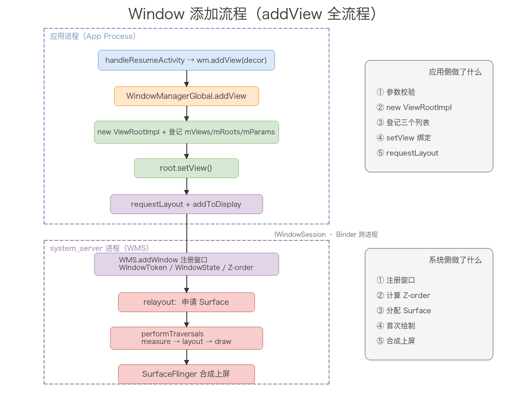

把这条链路的关键节点串起来：addView → WindowManagerGlobal → new ViewRootImpl + 登记三列表 → setView → requestLayout + addToDisplay(WMS 注册窗口) → relayout 申请 Surface → 下一帧 performTraversals（measure→layout→draw）→ 像素写入 Surface → SurfaceFlinger 合成上屏。

---

## 六、WMS 的窗口管理

### 1. WindowToken 与 WindowState

WMS 里描述一个窗口，用的不是一个对象，而是两个：WindowToken 和 WindowState。要理解它们，先得看它们所在的那棵「容器树」。

**窗口对象的基类：WindowContainer**

从 Android 8.0 起，WMS 做过一次大重构，把几乎所有窗口相关对象统一到一个继承体系下——`WindowContainer`。DisplayContent（屏幕）、DisplayArea（显示区域）、WindowToken、WindowState 全都继承它，共同组成一棵树：

```text
DisplayContent（一块屏幕）
└── DisplayArea（屏幕上的一个区域，如状态栏区 / 应用区）
    ├── ActivityRecord（一个 Activity，继承自 WindowToken）
    │   └── WindowState（这个 Activity 的主窗口）
    │       └── WindowState（它弹出的子窗口 Dialog / PopupWindow）
    └── WindowToken（非 Activity 的 token，如输入法 / Toast）
        └── WindowState（对应的窗口）
```

`WindowContainer` 维护一个 `mChildren` 列表（按 Z-order 排好序的子容器），并提供递归算层级、遍历子树这些通用能力。后面讲的 Z-order，就是在这棵树上自上而下递归算出来的。理解了这棵树，WindowToken 和 WindowState 的定位就清楚了：一个偏「容器」，管一群窗口；一个偏「叶子」，管一个具体窗口。

**WindowToken：一组窗口的归属令牌**

它的类声明只有一行，信息量却很大：

```java
class WindowToken extends WindowContainer<WindowState> {
    final IBinder token;              // 令牌本身，全局唯一的 Binder
    final int windowType;             // 这个 token 对应的窗口类型
    boolean mPersistOnEmpty;          // 窗口清空后是否保留 token
    boolean paused;                   // 这个 token 下的按键分发是否暂停
    boolean mIsExiting;               // 是否正在退出
    boolean mOwnerCanManageAppTokens; // 拥有者是否有 MANAGE_APP_TOKENS 权限
    boolean mFromClientToken;         // 是否由 WindowContext 创建
}
```

`WindowContainer<WindowState>` 这个泛型说明：一个 WindowToken 就是「一组 WindowState 的容器」。`token` 字段是 IBinder，全局唯一，它是「这个窗口属于谁」的身份证——同一个 token 下的窗口，WMS 认为它们是一伙的。

WindowToken 有两条来源，对应两类窗口：

- **来自 Activity。** `ActivityRecord` 直接继承 `WindowToken`，一个 Activity 自己就是一个 WindowToken，它的 `token` 字段就是那个 Binder（应用侧 `LayoutParams.token` 里传进来的就是它）。Activity 的主窗口、它弹的 Dialog、PopupWindow，全挂在这个 ActivityRecord 下面。
- **WMS 临时新建。** 当应用侧传进来的 `attrs.token == null`（比如用 Service 的非 Activity Context 创建的窗口，或系统窗口），WMS 现建一个 WindowToken，token 用 `IWindow.asBinder()`（应用侧 ViewRootImpl 那个 Binder）。这类 token 不属于任何 Activity。

WindowToken 管的是「归属」，核心作用有两个。一是分组：一个 token 下的窗口同生共死，token 销毁时它下面挂的所有 WindowState 一起回收，这就是「父窗口关了，Dialog、PopupWindow 跟着关」的底层依据。二是权限：应用只能操作自己 token 下的窗口，token 就是权限校验的边界。

**WindowState：一个具体窗口**

WindowState 对应应用侧一个 ViewRootImpl，是 WMS 里描述「一个窗口」的完整对象：

```java
class WindowState extends WindowContainer<WindowState> {
    final WindowManager.LayoutParams mAttrs;  // 布局参数：type / token / flags / 尺寸
    final IWindow mClient;                    // 应用侧 ViewRootImpl 的 Binder
    final WindowToken mToken;                 // 所属 token
    final int mBaseLayer;                     // 基础层级
    final int mSubLayer;                      // 子窗口层级偏移
    WindowStateAnimator mWinAnimator;         // 动画器，持有 SurfaceControl
}
```

`mBaseLayer`、`mSubLayer` 两个 final 字段在构造时就定死了（第三节讲怎么算），`mWinAnimator` 持有这个窗口的 `SurfaceControl`——真正交给 SurfaceFlinger 合成的那块 Surface。

两者的关系一句话：WindowToken 管「这一组窗口是谁的」，WindowState 管「这个窗口长什么样、排在第几层、Surface 在哪」。

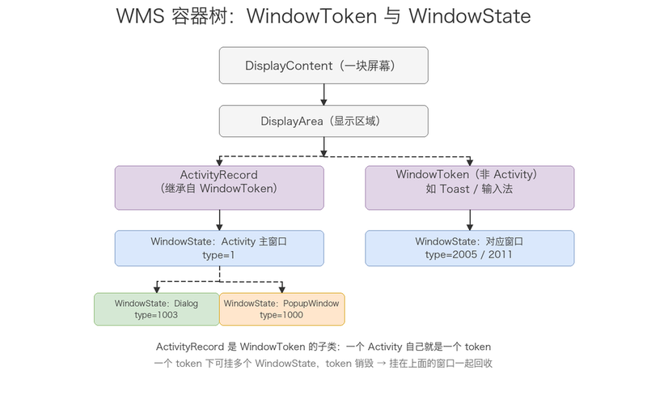

### 2. WindowToken 的分配与校验

token 不是凭空来的。应用每次 `addView` 跨进程走到 `WindowManagerService.addWindow()`，WMS 做的第一件事就是解析和校验 token。整段逻辑集中在 `addWindow` 里，往下拆开看。

**第一步：拿到 token**

```java
final boolean hasParent = parentWindow != null;
// 子窗口复用父窗口的 token；普通窗口用自己 attrs 里的 token
WindowToken token = displayContent.getWindowToken(
        hasParent ? parentWindow.mAttrs.token : attrs.token);
```

`DisplayContent.getWindowToken` 就是个哈希表查找：

```java
private final HashMap<IBinder, WindowToken> mTokenMap = new HashMap();

WindowToken getWindowToken(IBinder binder) {
    return mTokenMap.get(binder);
}
```

WMS 用 `IBinder → WindowToken` 的映射表维护所有已存在的 token。传进来的 token 能在表里找到，就复用；找不到，就进入「分配」分支。

**第二步：token 为 null 时，现建一个**

当 `attrs.token` 在表里查不到（或本来就是 null），WMS 先过一道权限校验，再决定能不能新建：

```java
if (token == null) {
    // 非特权应用能不能凭空创建这个类型的 token？
    if (!unprivilegedAppCanCreateTokenWith(parentWindow, callingUid, type,
            rootType, attrs.token, attrs.packageName)) {
        return WindowManagerGlobal.ADD_BAD_APP_TOKEN;
    }
    if (hasParent) {
        token = parentWindow.mToken;       // 子窗口：直接用父窗口的 token
    } else if (mWindowContextListenerController.hasListener(windowContextToken)) {
        token = new WindowToken.Builder(this, binder, type)  // WindowContext 场景
                .setFromClientToken(true).build();
    } else {
        final IBinder binder = attrs.token != null ? attrs.token : client.asBinder();
        token = new WindowToken.Builder(this, binder, type)  // 普通场景
                .setDisplayContent(displayContent)
                .setOwnerCanManageAppTokens(session.mCanAddInternalSystemWindow)
                .build();
    }
}
```

这里有两个关键点。一是 `unprivilegedAppCanCreateTokenWith` 这道闸门，它规定了哪些窗口类型「必须自带合法 token，不能凭空新建」：

```java
private boolean unprivilegedAppCanCreateTokenWith(...) {
    if (rootType >= FIRST_APPLICATION_WINDOW && rootType <= LAST_APPLICATION_WINDOW) {
        return false;   // 应用窗口（type 1~99）必须由 Activity 提供 token
    }
    if (rootType == TYPE_INPUT_METHOD) return false;        // 输入法
    if (rootType == TYPE_VOICE_INTERACTION) return false;   // 语音交互
    if (rootType == TYPE_WALLPAPER) return false;           // 壁纸
    if (rootType == TYPE_QS_DIALOG) return false;           // 快捷设置面板
    if (rootType == TYPE_ACCESSIBILITY_OVERLAY) return false; // 无障碍浮层
    if (type == TYPE_TOAST && doesAddToastWindowRequireToken(...)) return false; // Toast
    return true;   // 其他系统窗口可以现建 token
}
```

返回 false 就一路变成 `ADD_BAD_APP_TOKEN`。这解释了面试里的高频崩溃——「Unable to add window -- token null is not valid; is your activity running?」：用 Application 或 Service 的 Context 去创建 Dialog、普通窗口时，`attrs.token` 是 null，而应用窗口不允许凭空建 token，于是被拒。

二是新建 token 时 `binder` 的取值：`attrs.token != null ? attrs.token : client.asBinder()`。有 token 就用 token，没有就用 `client`（IWindow，也就是 ViewRootImpl 的 Binder）当 token。所以「非 Activity 创建的窗口」虽然能建 token，但它的 token 是自己的 ViewRootImpl Binder，和 Activity 的 token 完全不同，这也就意味着它不受 Activity 生命周期约束。

**第三步：token 不为 null 时，校验类型是否匹配**

token 找到了，不代表就能直接用。WMS 还要看「窗口类型」和「token 类型」对不对得上：

```java
} else if (rootType >= FIRST_APPLICATION_WINDOW && rootType <= LAST_APPLICATION_WINDOW) {
    activity = token.asActivityRecord();
    if (activity == null) {
        return WindowManagerGlobal.ADD_NOT_APP_TOKEN;   // 应用窗口必须用 Activity 的 token
    } else if (activity.getParent() == null) {
        return WindowManagerGlobal.ADD_APP_EXITING;     // Activity 已经销毁
    }
} else if (rootType == TYPE_INPUT_METHOD) {
    if (token.windowType != TYPE_INPUT_METHOD) return ADD_BAD_APP_TOKEN;
} else if (rootType == TYPE_WALLPAPER) {
    if (token.windowType != TYPE_WALLPAPER) return ADD_BAD_APP_TOKEN;
}
// TYPE_VOICE_INTERACTION / TYPE_ACCESSIBILITY_OVERLAY / TYPE_TOAST / TYPE_QS_DIALOG 同理
```

逻辑很直白：应用窗口（type 1~99）的 token 必须是 ActivityRecord（`token.asActivityRecord()` 非 null），而且这个 Activity 还不能已经销毁（`getParent() == null` 表示已经脱离任务栈）；输入法、壁纸这类系统窗口的 token，则要求 `token.windowType` 和窗口 type 一致。这就是「校验」的核心——不是随便一个 Binder 都能当 token 用。

还有一种反向校验：如果传进来的 token 是 ActivityRecord，但窗口却是个系统窗口（type 不在 1~99），WMS 认为这不合法，会把 token 清空、重新建一个：

```java
} else if (token.asActivityRecord() != null) {
    // 系统窗口不能用 Activity 的 token，重新给它建一个
    attrs.token = null;
    token = new WindowToken.Builder(this, client.asBinder(), type)
            .setDisplayContent(displayContent).build();
}
```

**子窗口的额外校验**

子窗口（type 1000~1999）在 addWindow 一开头就单独处理了：

```java
if (type >= FIRST_SUB_WINDOW && type <= LAST_SUB_WINDOW) {
    parentWindow = windowForClientLocked(null, attrs.token, false);
    if (parentWindow == null) {
        return WindowManagerGlobal.ADD_BAD_SUBWINDOW_TOKEN;  // token 指的不是一个窗口
    }
    if (parentWindow 也是子窗口) {
        return WindowManagerGlobal.ADD_BAD_SUBWINDOW_TOKEN;  // 父窗口不能也是子窗口
    }
}
```

子窗口的 `attrs.token` 必须指向一个真实存在的窗口（父窗口），而且父窗口本身不能再是子窗口。找不到父窗口，直接 `ADD_BAD_SUBWINDOW_TOKEN`。

**校验失败的归宿：BadTokenException**

这些 `ADD_BAD_APP_TOKEN`、`ADD_BAD_SUBWINDOW_TOKEN` 都是 addWindow 的返回值，一路返回到应用侧 `ViewRootImpl.setView()`，被翻译成异常抛出去：

```java
case WindowManagerGlobal.ADD_BAD_APP_TOKEN:
case WindowManagerGlobal.ADD_BAD_SUBWINDOW_TOKEN:
    throw new WindowManager.BadTokenException(
            "Unable to add window -- token " + attrs.token
            + " is not valid; is your activity running?");
```

所以整条链是：应用传错 token → WMS 校验不过 → 返回错误码 → 应用侧抛 BadTokenException。这就是那个经典崩溃的完整来龙去脉。常见触发场景有三个：用 Application 的 Context 建 Dialog、Activity 已经 finish 之后还在 addView、子窗口的 token 传错。

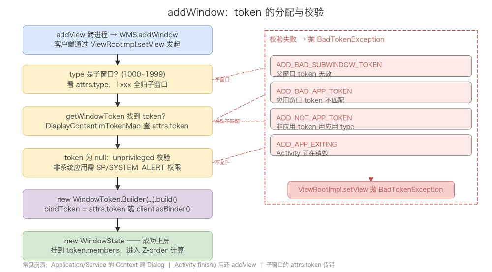

### 3. Z-order 的计算

第二章说的「type 越大越靠上」是个粗规则，WMS 内部有一套精确的层级计算，拆成四步。

**第一步：type 映射成基础 layer**

每个窗口类型对应一个整数 layer，映射函数是 `PhoneWindowManager.getWindowLayerFromTypeLw`：

```java
if (type >= FIRST_APPLICATION_WINDOW && type <= LAST_APPLICATION_WINDOW) {
    return APPLICATION_LAYER;   // 2，所有应用窗口（1~99）统一是 2
}
switch (type) {
    case TYPE_WALLPAPER:          return 1;    // 壁纸垫底
    case TYPE_PHONE:              return 3;    // 来电
    case TYPE_SEARCH_BAR:         return 4;
    case TYPE_TOAST:              return 7;
    case TYPE_APPLICATION_OVERLAY: return 11;  // 悬浮窗
    case TYPE_INPUT_METHOD:       return 13;   // 输入法
    case TYPE_STATUS_BAR:         return 15;   // 状态栏
    case TYPE_NOTIFICATION_SHADE: return 17;   // 下拉通知栏
    case TYPE_NAVIGATION_BAR:     return 24;   // 导航栏
    case TYPE_POINTER:            return 35;   // 鼠标指针最高
    ...
}
```

注意：应用窗口不管具体 type 是 1 还是 99，layer 统一是 `APPLICATION_LAYER = 2`。所以 Dialog（type 2）、Activity 主窗口（type 1）这些应用窗口在 base layer 层面是同一层，靠后面的子窗口偏移和排序来分出上下。

**第二步：乘以放大系数，给同层窗口留空间**

拿到基础 layer 之后，还要乘一个放大系数。WindowState 构造时这样算：

```java
// The multiplier here is to reserve space for multiple windows in the same type layer.
mBaseLayer = mPolicy.getWindowLayerLw(this)
        * TYPE_LAYER_MULTIPLIER + TYPE_LAYER_OFFSET;   // layer * 10000 + 1000
mSubLayer = 0;
```

`TYPE_LAYER_MULTIPLIER = 10000`、`TYPE_LAYER_OFFSET = 1000` 是两个常量（定义在 `WindowManagerPolicyConstants`）。注释说得很明白：乘 10000 是为了「给同一 type 层的多个窗口预留空间」。比如所有应用窗口 base layer 都是 2，乘 10000 加 1000 后是 21000，这样同一层里还能塞下 10000 个不同窗口，用「21000 + 局部序号」区分先后，而不是所有应用窗口都挤在同一个整数上。

**第三步：子窗口加 subLayer**

子窗口（type 1000~1999）的 base layer 跟着父窗口走，再用 `mSubLayer` 做相对偏移：

```java
if (type >= FIRST_SUB_WINDOW && type <= LAST_SUB_WINDOW) {
    mBaseLayer = mPolicy.getWindowLayerLw(parentWindow)
            * TYPE_LAYER_MULTIPLIER + TYPE_LAYER_OFFSET;  // 跟着父窗口
    mSubLayer = mPolicy.getSubWindowLayerFromTypeLw(type); // 相对偏移
}
```

`mSubLayer` 的取值（定义在 `WindowManagerPolicyConstants`）：

| 子窗口类型 | mSubLayer | 含义 |
|-----------|-----------|------|
| TYPE_APPLICATION_MEDIA | -2 | 在父窗口下面（如 SurfaceView 的视频画面） |
| TYPE_APPLICATION_MEDIA_OVERLAY | -1 | 在父窗口下面、但比 MEDIA 高 |
| TYPE_APPLICATION_PANEL | 1 | 普通面板，浮在父窗口上（PopupWindow） |
| TYPE_APPLICATION_ATTACHED_DIALOG | 1 | Dialog，浮在父窗口上 |
| TYPE_APPLICATION_SUB_PANEL | 2 | 子面板，更高 |
| TYPE_APPLICATION_ABOVE_SUB_PANEL | 3 | 最高 |

子窗口的 mBaseLayer 用父窗口的 layer，保证它们和父窗口「绑在同一层」，再用 mSubLayer 的正负号决定在父窗口上面还是下面。这也是为什么 PopupWindow 一定压在宿主 Activity 之上、SurfaceView 的视频画面能显示在 Activity 内容之下。

**第四步：assignChildLayers 递归，算出最终层级**

base layer 和 subLayer 只是「材料」，真正的层级要在容器树上递归算出来。核心方法是 `WindowContainer.assignChildLayers`：

```java
void assignChildLayers(Transaction t) {
    int layer = 0;
    // 第一趟：普通窗口，按 mChildren 顺序（已按 Z-order 排好）递增分配
    for (int j = 0; j < mChildren.size(); ++j) {
        final WindowContainer wc = mChildren.get(j);
        wc.assignChildLayers(t);        // 先递归处理子树
        if (!wc.needsZBoost()) {
            wc.assignLayer(t, layer++); // 分配层级，layer 递增
        }
    }
    // 第二趟：需要 Z-boost 的窗口（如转场动画中的窗口），挪到最上层
    for (int j = 0; j < mChildren.size(); ++j) {
        final WindowContainer wc = mChildren.get(j);
        if (wc.needsZBoost()) {
            wc.assignLayer(t, layer++);
        }
    }
}
```

两个信息量很大的点。第一，它是递归的——先 `wc.assignChildLayers(t)` 把子树算完，再给当前节点分配，最终 `assignLayer` 落到 `SurfaceControl.setLayer(layer)` 上，交给 SurfaceFlinger 按这个相对层级合成。第二，它分两趟遍历：`needsZBoost()` 为 true 的窗口（典型是 Activity 转场动画中需要临时提到最顶层的窗口）被推迟到第二趟分配，自然排到列表末尾——也就是最上层。这就解释了「切换 Activity 时，为什么动画窗口能盖在普通窗口上面」：层级不是写死的，是这里实时算出来的。

落到具体的 WindowState 上，还有几个特例。starting window（应用启动时的预览窗口）直接盖到最顶：

```java
void assignLayer(Transaction t, int layer) {
    if (mStartingData != null) {
        t.setLayer(mSurfaceControl, Integer.MAX_VALUE);  // 启动窗口压到最顶
        return;
    }
    super.assignLayer(t, layer);
}
```

而 WindowState 处理自己的子窗口时，媒体类子窗口（MEDIA / MEDIA_OVERLAY）要放到父窗口 Surface 之下：

```java
if (w.mAttrs.type == TYPE_APPLICATION_MEDIA) {
    w.assignRelativeLayer(t, mWinAnimator.mSurfaceControl, -2);  // 相对父窗口往下
} else if (w.mAttrs.type == TYPE_APPLICATION_MEDIA_OVERLAY) {
    w.assignRelativeLayer(t, mWinAnimator.mSurfaceControl, -1);
} else {
    w.assignLayer(t, layer);  // 其他子窗口往上递增
}
```

**串起来：一个窗口的层级怎么定**

把上面四步串起来，一个窗口的最终层级 = 容器树上的位置 + base layer + subLayer，具体拆解：

1. type 决定 base layer（应用窗口都是 2，系统窗口各有各的值）；
2. base layer 乘 10000 加 1000，给同层窗口留出排序空间；
3. 子窗口再叠加 mSubLayer（负值往下，正值往上）；
4. 容器树上递归 assignChildLayers，同一容器内的兄弟节点按 Z-order 顺序递增，Z-boost 的窗口提到最后；
5. 最终 setLayer 到 SurfaceControl，SurfaceFlinger 按这棵树合成。

所以「两个窗口谁在上」的答案是动态算出来的，取决于 type、父子关系、添加顺序、动画状态这四件事，不是一个写死的数字。记住这个，就不会再对「为什么层级会变」感到意外。

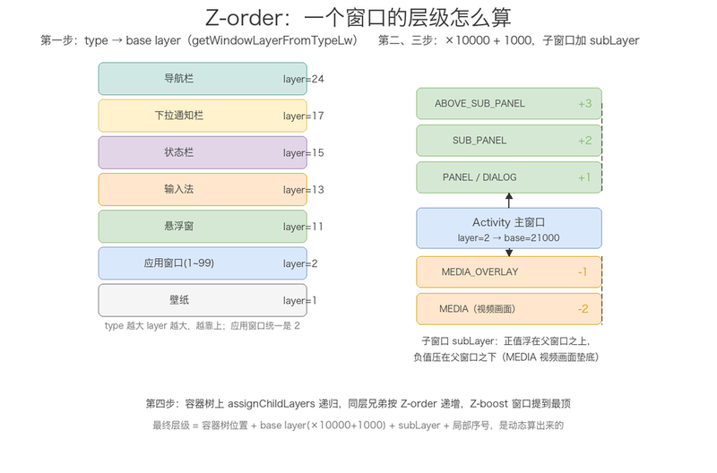

### 4. 输入事件的窗口分发

触摸事件的流向也和窗口体系强相关。整条链路：

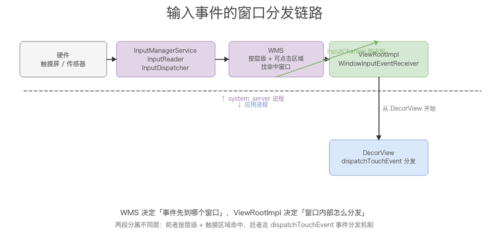

用户点一下屏幕，硬件把原始事件交给 `InputManagerService`（system_server 里），它根据 WMS 提供的「窗口层级 + 可点击区域」找到命中的窗口，把事件交给这个窗口对应的 `ViewRootImpl`，由 `ViewRootImpl` 从 `DecorView` 开始往下分发（这就是 View 事件分发机制的起点）。

所以「事件先到哪个窗口」是由 WMS 决定的（它知道所有窗口的层级和触摸区域），「事件在窗口内部怎么走」才是 View 的 `dispatchTouchEvent` 分发逻辑。这两段分属不同的层，别混为一谈。这也是为什么输入法窗口（type 2011，层级高）能优先拿到点击、盖住底下 Activity 的原因。

---

## 七、Dialog / Toast / PopupWindow 的窗口机制

三种弹窗底层都是同一个东西：一个独立的 Window，通过 WindowManager 体系加到 WMS 才显示。差别只在两处——token 从哪来、type 是什么。这一章把三个都拆到源码层面。

### 1. Dialog：一个独立的 Window

Dialog 内部持有一个独立的 `PhoneWindow`（成员 `mWindow`），显示原理和 Activity 几乎一样，只是它不走 Activity 那套 `attach` 流程，token 得靠自己从 context 里要。

构造方法干三件事：

```java
Dialog(@NonNull Context context, @StyleRes int themeResId, boolean createContextThemeWrapper) {
    if (createContextThemeWrapper) {
        mContext = new ContextThemeWrapper(context, themeResId);   // ① 包一层 dialog theme
    }
    mWindowManager = (WindowManager) context.getSystemService(Context.WINDOW_SERVICE);  // ② 拿 WM
    final Window w = new PhoneWindow(mContext);   // ③ 自己 new 一个 PhoneWindow
    mWindow = w;
    w.setCallback(this);
    w.setWindowManager(mWindowManager, null, null);   // 注意 appToken 传的是 null
    w.setGravity(Gravity.CENTER);
}
```

注意 `w.setWindowManager(mWindowManager, null, null)` 里 appToken 传的是 null——Dialog 没有自己的 Activity token，token 的事留到后面 addView 时再说。

`show()` 就是一条路走到 addView：

```java
public void show() {
    if (mShowing) { ... return; }
    mCanceled = false;
    if (!mCreated) { dispatchOnCreate(null); }
    onStart();
    mDecor = mWindow.getDecorView();              // 懒加载 DecorView
    WindowManager.LayoutParams l = mWindow.getAttributes();
    mWindowManager.addView(mDecor, l);            // 标准 addView，和前几章讲的完全一样
    mShowing = true;
    sendShowMessage();
}
```

到这里 Dialog 和普通窗口没区别。真正的坑在 token 从哪来。

token 的来源，取决于构造时传进来的 context 是谁。这条链要顺着 `getSystemService(WINDOW_SERVICE)` 往下追：

- 传 Activity：`Activity.getSystemService(WINDOW_SERVICE)` 返回的不是一个新的 WindowManager，而是 Activity 在 `attach` 时绑定的那个 `mWindowManager`。这个 WindowManager 内部记着 Activity 自己的 PhoneWindow，而 Activity PhoneWindow 的 mAppToken 是 attach 时塞进去的 Activity token。所以 Dialog 在 addView 走到 `WindowManagerGlobal` 时，`parentWindow.adjustLayoutParamsForSubWindow` 会把 LayoutParams.token 补成 Activity 的 token，WMS 校验通过，正常显示。
- 传 Application / Service：`getSystemService(WINDOW_SERVICE)` 返回的是 `new WindowManagerImpl(appContext)`，没有绑定任何 Activity 窗口，token 补不上，还是 null。WMS.addWindow 里 token 为 null 时走 `unprivilegedAppCanCreateTokenWith` 闸门，应用窗口（TYPE_APPLICATION）不允许凭空建 token，返回 `ADD_BAD_APP_TOKEN`，应用侧 `ViewRootImpl.setView` 就抛：

```java
case WindowManagerGlobal.ADD_BAD_APP_TOKEN:
    throw new WindowManager.BadTokenException(
            "Unable to add window -- token " + attrs.token
            + " is not valid; is your activity running?");
```

这就是「用 Application 的 Context 建 Dialog 崩 BadTokenException」的完整来龙去脉，Service 的 context 同理。所以 Dialog 的 context 必须是 Activity 或者从 Activity 派生出来的（带 Activity token 的 ContextWrapper）。

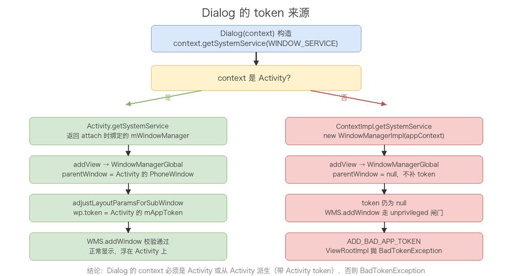

type 方面，Dialog 默认是 TYPE_APPLICATION（2，应用窗口），没有走子窗口。它的关闭分两条路径：`cancel()`（BACK 键触发，要求 mCancelable 为 true，走 onCancel 回调）和 `dismiss()`（主动关闭，走 onDismiss 回调）；`setCanceledOnTouchOutside(true)` 让点外部区域也触发 cancel。

### 2. Toast：跨进程让系统显示

Toast 和 Dialog 最大的不同：它不自己 addView，而是把「显示」这件事外包给系统进程。整个链路分三段——应用侧 Toast 发请求、系统侧 NMS 调度并分配 token、应用侧 TN 被回调回来才真正 addView。

`show()` 里把 TN 交给 NMS：

```java
public void show() {
    INotificationManager service = getService();   // NMS 的 Binder 代理
    TN tn = mTN;
    ...
    wasEnqueued = service.enqueueToast(pkg, mToken, tn, mDuration, isUiContext, displayId);
}
```

两个关键角色要先说清楚：

- `mToken`：Toast 构造时 `mToken = new Binder()`，是应用侧自己 new 出来的一个 Binder，只用来标识「这一个 Toast 实例」，跟 Activity token、WMS 的 token 都不是一回事。
- `mTN`：`TN` 是 `ITransientNotification.Stub` 的子类，也就是应用侧暴露给系统进程的一个 Binder 服务。NMS 拿到它，后面才能回调应用侧去真正画这个 Toast。

NMS 收到 `enqueueToast` 后，在系统进程里做调度和 token 分配：

```java
synchronized (mToastQueue) {
    ...
    Binder windowToken = new Binder();                                  // NMS 现场 new 一个 token
    mWindowManagerInternal.addWindowToken(windowToken, TYPE_TOAST, displayId, null);  // 注册给 WMS
    record = getToastRecord(..., windowToken, ...);                     // 绑定 token 生成记录
    mToastQueue.add(record);                                            // 入队
    if (index == 0) {
        showNextToastLocked(false);                                     // 排第一就立即显示
    }
}
```

NMS 内部维护一个 `mToastQueue` 队列，同一个包最多排 `MAX_PACKAGE_TOASTS` 个（防 DOS）。轮到某个 Toast 时，`showNextToastLocked` 里调 `record.show()`，最终通过 Binder 回调应用侧的 `TN.show(windowToken)`。

应用侧收到回调后，`TN.handleShow(windowToken)` 里 `mPresenter.show(mView, mToken, windowToken, ...)`，这一步才走标准 WindowManager.addView，type 是 TYPE_TOAST（2005，系统窗口）。

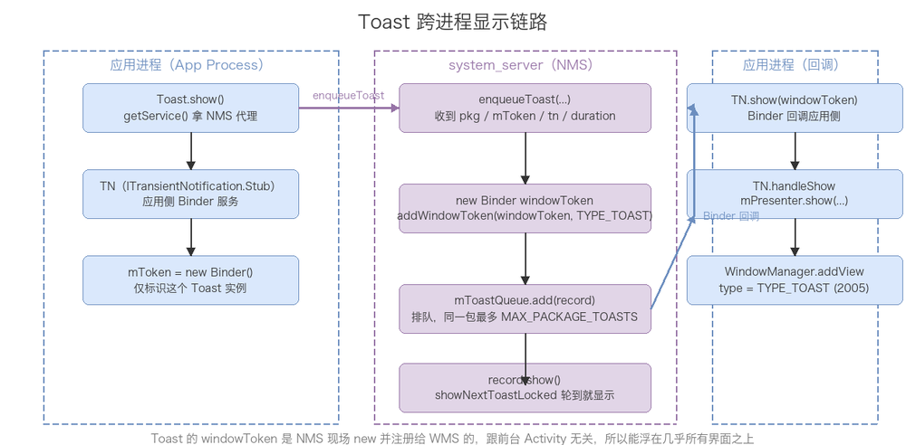

理解这条链的关键就一句：Toast 的 windowToken 是 NMS 现场 new 出来、通过 `addWindowToken` 注册给 WMS 的，跟前台 Activity 没有任何关系。所以 Toast 能浮在几乎所有界面之上，也不依赖某个 Activity 活着。代价是它走系统窗口 + 跨进程，性能上比 Dialog/PopupWindow 重一些，而且受系统管控——Android 11 起自定义 Toast（setView）废弃，文本 Toast 由系统统一渲染；后台应用发 Toast 还有频率限制（rate limit）。

### 3. PopupWindow：依附父窗口的子窗口

PopupWindow 显示出来的根，不是你的 contentView，而是包了三层：`PopupDecorView`（根）→ `PopupBackgroundView`（背景 drawable + elevation 阴影）→ `contentView`。`preparePopup` 里组这棵包裹树：

```java
private void preparePopup(WindowManager.LayoutParams p) {
    ...
    if (mBackground != null) {
        mBackgroundView = createBackgroundView(mContentView);   // 有背景就包一层
        mBackgroundView.setBackground(mBackground);
    } else {
        mBackgroundView = mContentView;                          // 没背景直接用 content
    }
    mDecorView = createDecorView(mBackgroundView);               // PopupDecorView 作根
    mBackgroundView.setElevation(mElevation);                    // 靠 elevation 出阴影
    p.setSurfaceInsets(mBackgroundView, true, true);
}
```

两个显示入口，token 都从锚点 View 上拿：

```java
public void showAtLocation(View parent, int gravity, int x, int y) {
    showAtLocation(parent.getWindowToken(), gravity, x, y);
}

public void showAsDropDown(View anchor, int xoff, int yoff, int gravity) {
    ...
    final WindowManager.LayoutParams p =
            createPopupLayoutParams(anchor.getApplicationWindowToken());
    ...
    invokePopup(p);
}
```

`createPopupLayoutParams` 里把 type 和 token 定死：

```java
p.type = mWindowLayoutType;    // 默认 TYPE_APPLICATION_PANEL = 1000
p.token = token;               // 宿主窗口的 token
```

两个细节值得展开：

- `showAsDropDown` 用的是 `anchor.getApplicationWindowToken()` 而不是 `getWindowToken()`。前者会优先返回「真实应用窗口」的 token——如果 anchor 本身落在某个 Dialog / 子窗口里，`getApplicationWindowToken` 会顺着往上找到最外层应用窗口的 token，保证 PopupWindow 挂对父窗口。
- type 是 TYPE_APPLICATION_PANEL（1000，子窗口）+ token 指向宿主窗口，所以 PopupWindow 天然就是「依附」在某父窗口上的子窗口：层级比父窗口高（能浮在上面）、生命周期随父窗口（父窗口关了它也关）。

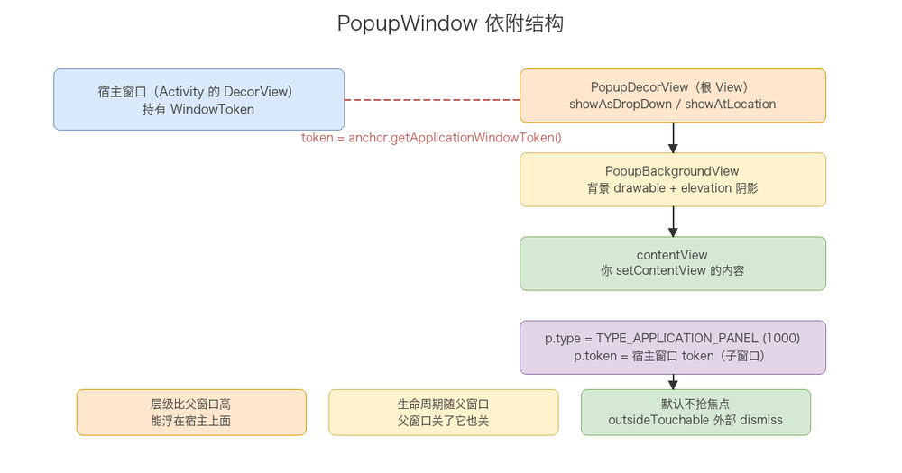

交互上，PopupWindow 默认不抢焦点（`focusable=false`），`outsideTouchable` 控制点击外部区域是否自动 dismiss。要响应 BACK 键需要显式 `setFocusable(true)`。

### 4. 三者对比

| 对象 | 窗口类别 | 典型 type | token 来源 | 显示方式 |
|------|----------|-----------|-----------|----------|
| Dialog | 应用窗口 | 2 | context 里的 Activity token | 自己 addView |
| Toast | 系统窗口 | 2005 | NMS 现场 new + 注册给 WMS | 经 NMS 回调后 addView |
| PopupWindow | 子窗口 | 1000 | anchor 的 getApplicationWindowToken | 自己 addView |

三者的共同点：都不是凭空浮起来的，背后都是一个独立 Window 通过 WindowManager 体系加到 WMS。差别只在 token 和 type——Dialog 靠 context 要 token，Toast 靠 NMS 分配 token，PopupWindow 靠 anchor 要 token。理解这一条，就不会再把它们当成什么特殊魔法，它们只是「不同 token、不同 type 的窗口」。

---

## 附：高频速记

- **Window 是 View 的载体，不是 View**：Window 是抽象类，持有 DecorView（根 View），唯一实现是 PhoneWindow。
- **两条链路**：内容链 `Activity → Window → DecorView → content → 布局`；管理链 `Window → WindowManager → ViewRootImpl → WMS → SurfaceFlinger`，在 Window 处交汇。
- **三大类窗口**：应用窗口（1~99）、子窗口（1000~1999）、系统窗口（2000~2999），type 越大层级越高。
- **层级规则**：应用窗口 < 子窗口 < 系统窗口；状态栏/Toast/输入法都是系统窗口，所以能盖住普通界面。
- **DecorView 懒加载**：首次 setContentView 或 getDecorView 时才通过 installDecor 创建；generateLayout 根据 feature 挑模板（screen_title / screen_action_bar / screen_simple），里面一定有 R.id.content。
- **Activity 与 Window 一对一**：attach 时 new PhoneWindow，onCreate 前就绪；一个 Activity 一个 Window 一个 DecorView 一个 ViewRootImpl。
- **setContentView 不显示**：只 inflate 布局，真正的显示在 onResume 后 addView 建立 ViewRootImpl 并完成首次绘制。
- **WindowManagerGlobal 是单例**：用 mViews/mRoots/mParams 三个列表管理进程内所有窗口，下标一一对应。
- **WindowManagerImpl 是委托壳**：带 context/token，转发给 Global；Global 是进程级单例。
- **ViewRootImpl 不是 View**：是 View 树管家，驱动 measure/layout/draw、跨进程与 WMS 通信、申请 Surface、分发输入事件。
- **双向 Binder**：应用侧 `IWindowSession` 主动调 WMS（add/relayout/remove），WMS 用 `IWindow` 反向回调应用侧。
- **addView 链路**：addView → Global（new ViewRootImpl + 登记三列表）→ setView → requestLayout + addToDisplay(WMS) → relayout 申请 Surface → performTraversals（measure→layout→draw）。
- **BadTokenException**：token 不存在/已销毁/类型不匹配时，WMS.addWindow 抛出的异常，Global 里 catch 回滚三列表。
- **Surface 是共享内存画布**：relayout 时由 WMS/SurfaceFlinger 分配 GraphicBuffer，应用与 SurfaceFlinger 零拷贝，SurfaceFlinger 负责合成上屏。
- **WindowToken/WindowState**：token 标识窗口归属（权限校验依据，可挂多个窗口），WindowState 描述单个窗口；token 分 Activity token 和 WMS 自建两类。
- **输入事件两段**：WMS 决定事件到哪个窗口（按层级+可点击区域），ViewRootImpl 决定窗口内部怎么分发（dispatchTouchEvent）。
- **Dialog/Toast/PopupWindow 都是独立 Window**，差别只在 token 和 type：Dialog 靠 context.getSystemService 拿 WindowManager 时是否绑了 Activity（绑了就有 Activity token，没绑就 BadTokenException）；Toast 走 NMS 跨进程调度，windowToken 是 NMS 现场 new 并 addWindowToken 注册给 WMS，跟前台 Activity 无关；PopupWindow 是子窗口，token 来自 anchor.getApplicationWindowToken()，type 1000。
- **Dialog 的 token 根因**：setWindowManager(wm, null, null) 传 null token，token 真正由 `parentWindow.adjustLayoutParamsForSubWindow` 补，补的来源是 Activity PhoneWindow 的 mAppToken。所以 Application/Service 的 context 没有 parentWindow，token 补不上 → ADD_BAD_APP_TOKEN → BadTokenException。
- **Toast 三段式**：应用 Toast.show 发请求 → NMS 在 mToastQueue 排队 + new windowToken + addWindowToken(TYPE_TOAST) → record.show() 回调应用侧 TN.handleShow → WindowManager.addView。TN 是 ITransientNotification.Stub，应用侧的 Binder 服务。
- **PopupWindow 三层包裹**：PopupDecorView（根）→ PopupBackgroundView（背景 drawable + elevation 阴影）→ contentView。token 用 anchor.getApplicationWindowToken() 而非 getWindowToken()，前者会穿透子窗口找到最外层应用窗口的 token，保证挂对父窗口。
