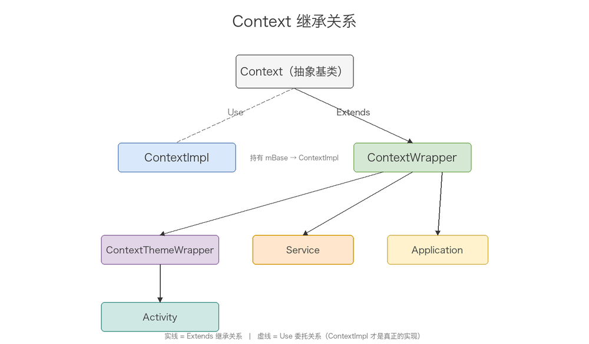
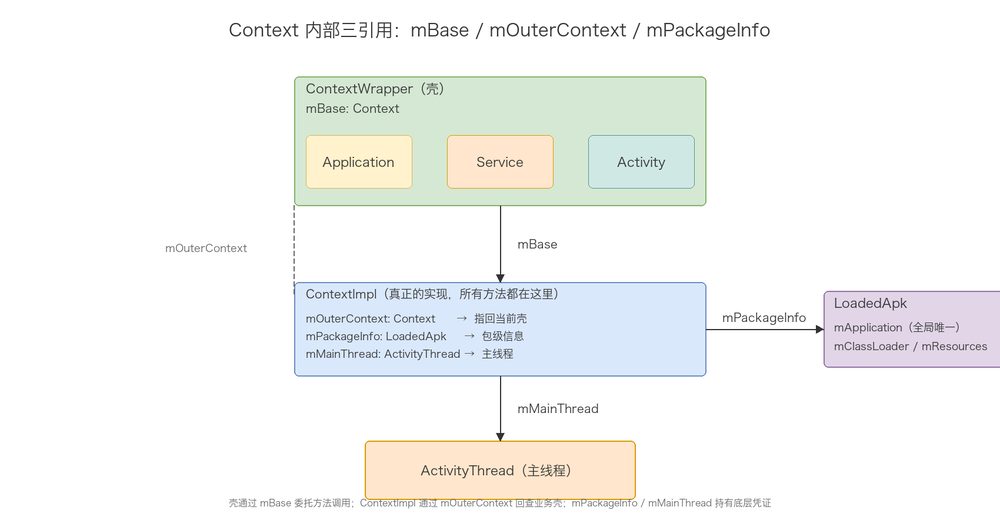
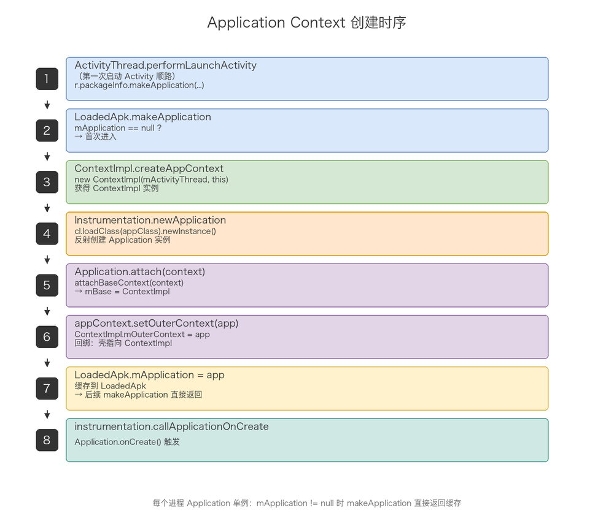
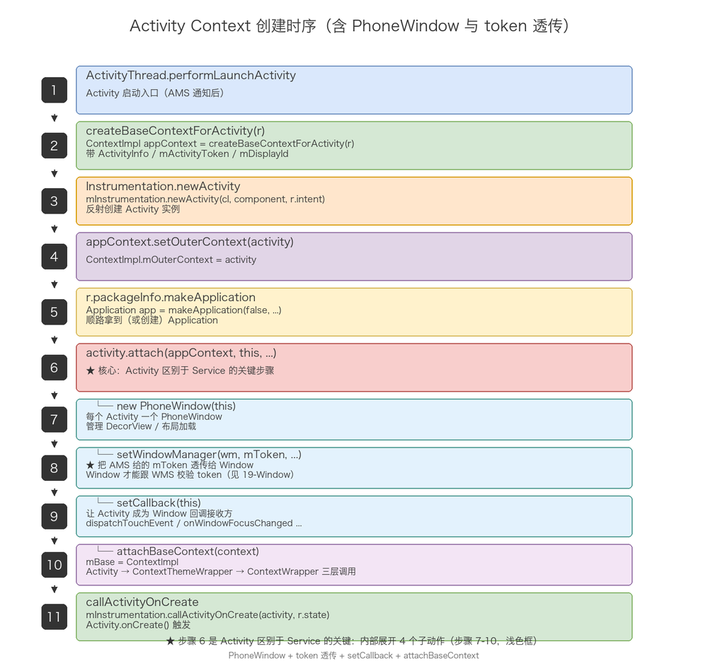
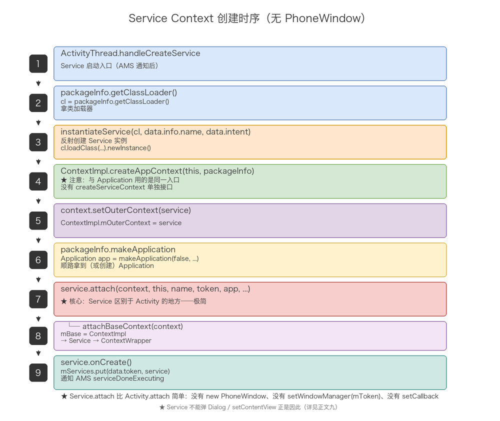

# 20-Context 体系分析

## meta-info

| 字段 | 内容 |
|------|------|
| 分类 | Android 框架层 / 四大组件基座 |
| 源材料 | 5 份 .docx（Context 基础 / Application Context 创建 / Activity Context 创建 / Service Context 创建 / Service 基础）+ Context 继承关系 .drawio |
| 主线 | 继承体系 → 内部三引用 → Application / Activity / Service 三种 Context 的创建链路 → 三者对比 |
| 风格 | 源码级、深入、按机制拆章节、不写流水账 |

## 导读

Context 是 Android 四大组件的「环境底座」。没它，Activity 起不来、Service 起不来、`startActivity` 走不通、`getString` 拿不到资源、`registerReceiver` 没法用。但 Context 又是个经常被误用的对象：很多人以为「Activity 就是个 Context」，但其实 Activity、Service、Application 都只是「壳」——真正干活的是 `ContextImpl`，壳们通过 `mBase` 把方法调用委托给它。

本文顺着源码把这条链路拆开：先看 Context 到底是什么、为什么这么设计；再看 `ContextImpl` / `ContextWrapper` / `ContextThemeWrapper` 三层壳各自干什么；然后追到三种 Context（Application / Activity / Service）的完整创建流程；最后把 Activity Context 和 Service Context 放一起对比，看清楚为什么 Service 弹 Dialog 会崩、为什么 Service 不能直接 setContentView。

> 高频速记在文末，第一遍阅读可以跳过细节只看速记。

## 目录

- [一、Context 的本质：环境底座](#一context-的本质环境底座)
- [二、Context 的继承体系](#二context-的继承体系)
- [三、ContextImpl：所有方法的真正实现](#三contextimpl所有方法的真正实现)
- [四、ContextWrapper 与 ContextThemeWrapper：壳](#四contextwrapper-与-contextthemewrapper壳)
- [五、Context 内部三引用：mBase / mOuterContext / mPackageInfo](#五context-内部三引用mbase--moutercontext--mpackageinfo)
- [六、Application Context 的创建与获取](#六application-context-的创建与获取)
- [七、Activity Context 的创建](#七activity-context-的创建)
- [八、Service Context 的创建](#八service-context-的创建)
- [九、Activity Context vs Service Context：为什么 Service 弹 Dialog 会崩](#九activity-context-vs-service-context为什么-service-弹-dialog-会崩)
- [十、Service 生命周期方法速记](#十service-生命周期方法速记)
- [十一、源码级总结：Context 到底是什么](#十一源码级总结context-到底是什么)
- [十二、高频速记](#十二高频速记)
- [图索引](#图索引)

## 一、Context 的本质：环境底座

Context 不是「上下文」的字面意思。它是 Android Framework 给应用组件提供的一组「环境句柄」——让你能基于当前进程/应用/组件的身份，去做所有需要这种身份才能做的操作：

- **资源访问**：`getResources()`、`getAssets()`、`getString(R.string.xxx)`、`getDrawable(R.drawable.xxx)`
- **系统服务**：`getSystemService(Context.WINDOW_SERVICE / LAYOUT_INFLATER_SERVICE / POWER_SERVICE ...)`
- **包信息**：`getPackageName()`、`getApplicationInfo()`、`getPackageManager()`
- **组件启动**：`startActivity(intent)`、`startService(intent)`、`sendBroadcast(intent)`
- **内容访问**：`getContentResolver()`、`getSharedPreferences(name, mode)`、`openFileInput/output`
- **广播订阅**：`registerReceiver(receiver, filter)`、`unregisterReceiver(receiver)`
- **主题与样式**：`getTheme()`（仅 ContextThemeWrapper 子类有效）

Context 在运行时存在多少个？**Activity 数 + Service 数 + 1**。每个 Activity 实例有自己的 ContextImpl，每个 Service 实例有自己的 ContextImpl，整个进程共用一个 Application ContextImpl。多进程的情况每个进程各有一个 Application ContextImpl（每个进程各一个 Application 实例），但同进程内的所有 Activity/Service 共享同一个 Application 实例。

## 二、Context 的继承体系



> 图片：Context 继承关系。`Context` 是抽象基类；`ContextImpl` 是真正的实现；`ContextWrapper` 是「壳」的基类，持有 `mBase` 委托给 ContextImpl；`ContextThemeWrapper` 在壳基础上加主题能力；`Application` / `Service` / `Activity` 是三大业务壳，分别继承自 `ContextWrapper` / `ContextWrapper` / `ContextThemeWrapper`。

关键设计：**ContextImpl 不继承任何 Context 之外的东西**，所有「业务壳」都不直接继承 ContextImpl，而是继承 ContextWrapper（带壳），再通过组合（mBase）把方法调用委托给 ContextImpl。为什么要这样设计？两个原因：

1. **避免多重继承**。Activity 需要主题能力（ContextThemeWrapper）、Window 能力（PhoneWindow）、Context 能力（startActivity、getResources），Java 单继承只能选一个父类。把 Context 能力做成「壳」（ContextWrapper）+ 委托（mBase）是最干净的解法。
2. **运行时动态绑定**。mBase 是 ContextWrapper 的一个普通字段，可以在 attach 阶段才被设置。这样 Activity / Service / Application 的创建流程可以分阶段：先建 ContextImpl，再建壳实例，最后把 ContextImpl 塞进 mBase。如果让 Activity 直接继承 ContextImpl，mBase 的延迟绑定就没法做了。

## 三、ContextImpl：所有方法的真正实现

ContextImpl 是 Context 体系里**唯一承担实现责任的类**。它持有关键字段：

| 字段 | 类型 | 作用 |
|------|------|------|
| `mOuterContext` | `Context` | 指回壳（Activity / Service / Application），让 ContextImpl 内部能反向拿到业务对象 |
| `mPackageInfo` | `LoadedApk` | 包级信息（类加载器、资源、Application 实例） |
| `mMainThread` | `ActivityThread` | 主线程引用，用于跨线程切换 |
| `mResources` | `Resources` | 资源管理器（实际由 mPackageInfo 懒加载） |
| `mTheme` | `Resources.Theme` | 主题（Activity 用得到，普通 ContextImpl 默认 null） |
| `mActivityToken` | `IBinder` | Activity 专属：AMS 给的 token，用于和 WMS 通信（前面 19-Window 文档讲过） |

所有 `getResources()`、`getSystemService()`、`startActivity()`、`sendBroadcast()`、`registerReceiver()` 等方法都在这里实现，**壳们只是 `mBase.xxx()` 的简单委托**。

## 四、ContextWrapper 与 ContextThemeWrapper：壳

### ContextWrapper

ContextWrapper 的实现非常薄，几乎所有方法都是 `return mBase.xxx()`：

```java
public class ContextWrapper extends Context {
    protected Context mBase;   // 委托目标，指向 ContextImpl

    protected void attachBaseContext(Context base) {
        if (mBase != null) {
            throw new IllegalStateException("Base context already set");
        }
        mBase = base;
    }

    @Override
    public Resources getResources() { return mBase.getResources(); }

    @Override
    public Object getSystemService(String name) { return mBase.getSystemService(name); }

    @Override
    public void startActivity(Intent intent) { mBase.startActivity(intent); }

    // ……其他方法都是 mBase.xxx()
}
```

注意 `attachBaseContext` 只能调用一次，重复调用会抛 `IllegalStateException`。这是因为 mBase 一旦设置就不可换——如果允许换，会破坏 ContextImpl 与壳之间的隐含契约（比如 ContextImpl 内部通过 mOuterContext 缓存了业务对象引用）。

### ContextThemeWrapper

ContextThemeWrapper 在 ContextWrapper 基础上加主题能力：

```java
public class ContextThemeWrapper extends ContextWrapper {
    private int mThemeResource;
    private Resources.Theme mTheme;

    @Override
    public Resources.Theme getTheme() {
        if (mTheme != null) return mTheme;
        if (mThemeResource != 0) {
            mTheme = getResources().newTheme();
            mTheme.applyStyle(mThemeResource, true);
        } else {
            mTheme = getResources().newTheme();
            mTheme.applyStyle(R.style.Theme, true);   // 兜底主题
        }
        return mTheme;
    }
}
```

只有 ContextThemeWrapper 子类才能拿到有效主题。这就是为什么 Activity 继承 ContextThemeWrapper（需要主题渲染 UI），而 Application 和 Service 直接继承 ContextWrapper（不需要）。

## 五、Context 内部三引用：mBase / mOuterContext / mPackageInfo

把「壳」和「实现」串起来的关键，是三个引用：

| 引用 | 持有方 | 指向 | 作用 |
|------|--------|------|------|
| `mBase` | ContextWrapper（壳） | ContextImpl | 壳的所有方法调用都转发给 mBase |
| `mOuterContext` | ContextImpl | ContextWrapper（壳实例） | ContextImpl 内部需要回查壳时用 |
| `mPackageInfo` | ContextImpl | LoadedApk | 包级信息（资源、类加载器、Application） |



> 图片：Context 内部三引用关系。ContextWrapper（壳）通过 mBase → ContextImpl；ContextImpl 通过 mOuterContext → 壳实例（Activity/Service/Application）；ContextImpl 通过 mPackageInfo → LoadedApk。

`mOuterContext` 在三处用到：

1. **`setOuterContext(activity)`**：ActivityThread.performLaunchActivity 反射创建完 Activity 后调一次，把 Activity 实例塞进 ContextImpl.mOuterContext。后面 ContextImpl 内部要拿 Activity 时直接 `getOuterContext()` 转。
2. **`getOuterContext()`**：ContextImpl 内部需要拿业务对象时用，比如 WMS binder 调用时把 Activity 实例回传。
3. **动态类型判断**：ContextImpl 里有些方法需要根据「壳到底是 Activity 还是 Service 还是 Application」走不同分支（比如 `getTheme()` 在 Activity Context 上能用、在 Application Context 上不能用）。

`mPackageInfo` 的关键作用：让 ContextImpl 能拿到 LoadedApk，进而拿到 ClassLoader、Resources、Application 实例。这就是为什么 `getApplicationContext()` 能一路追到全局唯一的 Application——靠的就是 `mPackageInfo.getApplication()`。

## 六、Application Context 的创建与获取

Application Context 的创建**在第一次启动 Activity 时发生**（AMS 通知 ActivityThread 后，ActivityThread.performLaunchActivity 顺路创建 Application）。源码链路：

```java
// ActivityThread.performLaunchActivity
private Activity performLaunchActivity(ActivityClientRecord r, Intent customIntent) {
    ...
    Application app = r.packageInfo.makeApplication(false, mInstrumentation);
    ...
}
```

`LoadedApk.makeApplication` 的实现：

```java
public Application makeApplication(boolean forceDefaultAppClass, Instrumentation instrumentation) {
    // 1. mApplication 缓存判断
    if (mApplication != null) {
        return mApplication;   // 已有就返回，每个进程只一个
    }

    // 2. 创建 ContextImpl
    ContextImpl appContext = ContextImpl.createAppContext(mActivityThread, this);

    // 3. 反射创建 Application 实例
    app = mActivityThread.mInstrumentation.newApplication(
            cl, appClass, appContext);

    // 4. 回绑：把 app 塞进 ContextImpl.mOuterContext
    appContext.setOuterContext(app);

    // 5. 缓存到 LoadedApk
    mApplication = app;

    // 6. 走 Application.onCreate()
    instrumentation.callApplicationOnCreate(app);

    return app;
}
```

`Instrumentation.newApplication` 内部通过 ClassLoader 反射创建 Application：

```java
public Application newApplication(ClassLoader cl, String className, Context context) {
    Application app = getFactory(context.getPackageName())
            .instantiateApplication(cl, className);
    app.attach(context);   // 触发 attachBaseContext
    return app;
}

public Application instantiateApplication(ClassLoader cl, String className) {
    return (Application) cl.loadClass(className).newInstance();
}
```

`Application.attach` 是关键：

```java
/* package */ final void attach(Context context) {
    attachBaseContext(context);   // mBase = context（ContextImpl）
    mLoadedApk = ContextImpl.getImpl(context).mPackageInfo;
}
```

`attachBaseContext` 继承自 ContextWrapper：

```java
protected void attachBaseContext(Context base) {
    if (mBase != null) {
        throw new IllegalStateException("Base context already set");
    }
    mBase = base;   // 把 ContextImpl 塞进去
}
```

到这里 Application Context 创建完成：`Application.mBase = ContextImpl`，`ContextImpl.mOuterContext = Application`，`ContextImpl.mPackageInfo = LoadedApk`。



> 图片：Application Context 创建时序。LoadedApk.makeApplication → ContextImpl.createAppContext → Instrumentation.newApplication → ClassLoader.newInstance → Application.attach → attachBaseContext → Application.onCreate。

**Application Context 的获取**：`Application.getApplicationContext()` → `ContextWrapper.getApplicationContext()` → `mBase.getApplicationContext()` → `ContextImpl.getApplicationContext()`：

```java
// ContextImpl
@Override
public Context getApplicationContext() {
    return (mPackageInfo != null) ?
        mPackageInfo.getApplication() : mMainThread.getApplication();
}

// LoadedApk
public Application getApplication() {
    return mApplication;   // 就是 makeApplication 里的 mApplication = app
}
```

一路追到 LoadedApk 缓存的全局唯一 Application 实例。这就是 `getApplicationContext()` 的完整链路。

## 七、Activity Context 的创建

Activity Context 的创建入口同样是 `ActivityThread.performLaunchActivity`，但**比 Application 复杂得多**——它要建 PhoneWindow、设 WindowManager、把 AMS 给的 token 透传到 WMS。

```java
// ActivityThread.performLaunchActivity
private Activity performLaunchActivity(ActivityClientRecord r, Intent customIntent) {
    ...
    // 1. 创建 ContextImpl（带 ActivityInfo 各种参数）
    ContextImpl appContext = createBaseContextForActivity(r);

    // 2. 反射创建 Activity 实例
    activity = mInstrumentation.newActivity(cl, component.getClassName(), r.intent);

    // 3. 回绑：把 Activity 塞进 ContextImpl.mOuterContext
    appContext.setOuterContext(activity);

    // 4. 顺带拿到 Application（首次启动会创建，后续拿到的是缓存）
    Application app = r.packageInfo.makeApplication(false, mInstrumentation);

    // 5. Activity.attach，传入 context 和其他参数
    activity.attach(appContext, this, getInstrumentation(), r.token,
            r.ident, app, r.intent, r.activityInfo, title, r.parent,
            r.embeddedID, r.lastNonConfigurationInstances, config,
            r.referrer, r.voiceInteractor, window, r.configCallback,
            r.assistToken);

    // 6. 走 Activity.onCreate()
    mInstrumentation.callActivityOnCreate(activity, r.state);
    ...
    return activity;
}
```

**Activity.attach 是核心环节**（Service 完全不同，这里对比着看）：

```java
// Activity.attach
final void attach(Context context, ActivityThread aThread,
        Instrumentation instr, IBinder token, int ident,
        Application application, Intent intent, ActivityInfo info,
        CharSequence title, Activity parent, String id,
        NonConfigurationInstances lastNonConfigurationInstances,
        Configuration config, String referrer, IVoiceInteractor voiceInteractor,
        Window window, ActivityConfigCallback activityConfigCallback, IBinder assistToken) {

    // 1. mBase = ContextImpl
    attachBaseContext(context);
    mFragments.attachHost(null);

    // 2. 创建 PhoneWindow（Service 没有这一行！）
    mWindow = new PhoneWindow(this, window, activityConfigCallback);
    mWindow.setWindowControllerCallback(this);
    mWindow.setCallback(this);
    mWindow.setOnWindowDismissedCallback(this);
    mWindow.getLayoutInflater().setPrivateFactory(this);
    ...

    // 3. 把 mToken 透传给 Window，Window 才能跟 WMS 对上（前面 19-Window 文档讲过）
    mWindow.setWindowManager(
            (WindowManager)context.getSystemService(Context.WINDOW_SERVICE),
            mToken, mComponent.flattenToString(),
            (info.flags & ActivityInfo.FLAG_HARDWARE_ACCELERATED) != 0);

    // 4. 拿到 mWindowManager
    mWindowManager = mWindow.getWindowManager();
    ...
}
```

**`Activity.attach` 比 `Service.attach` 多了三件大事**：

1. **`mWindow = new PhoneWindow(this, window, activityConfigCallback)`**：每个 Activity 一个 PhoneWindow，负责管理 DecorView、布局加载、setContentView。
2. **`mWindow.setWindowManager(wm, mToken, name, hwAccel)`**：把 AMS 给的 `mToken`（IBinder）透传给 Window。Window 后续 addView 时会用这个 token 跟 WMS 校验（详见 19-Window 体系分析）。
3. **`mWindow.setCallback(this)`**：让 Activity 成为 Window 的回调接收方，onAttachedToWindow / dispatchTouchEvent / onWindowFocusChanged 等都通过这个 Callback 回到 Activity。

`attachBaseContext` 走 `Activity → ContextThemeWrapper → ContextWrapper` 三层调用，最终在 ContextWrapper 把 mBase 赋值：

```java
// Activity
protected void attachBaseContext(Context newBase) {
    super.attachBaseContext(newBase);   // → ContextThemeWrapper
    if (newBase != null) {
        newBase.setAutofillClient(this);
        newBase.setContentCaptureOptions(getContentCaptureOptions());
    }
}

// ContextThemeWrapper
protected void attachBaseContext(Context newBase) {
    super.attachBaseContext(newBase);   // → ContextWrapper
}

// ContextWrapper
protected void attachBaseContext(Context base) {
    if (mBase != null) {
        throw new IllegalStateException("Base context already set");
    }
    mBase = base;
}
```



> 图片：Activity Context 创建时序。ActivityThread.performLaunchActivity → createBaseContextForActivity → Instrumentation.newActivity → ContextImpl.setOuterContext → LoadedApk.makeApplication → Activity.attach → attachBaseContext → new PhoneWindow → setWindowManager → callActivityOnCreate。

`createBaseContextForActivity` 比 `createAppContext` 多带了一些 Activity 专属字段：mActivityToken（AMS 给的 IBinder）、mDisplayId、mConfiguration 等，这些字段后面 WMS 通信会用到。

## 八、Service Context 的创建

Service Context 的入口在 `ActivityThread.handleCreateService`（AMS 通过 scheduleCreateService 跨进程通知过来）：

```java
// ActivityThread.handleCreateService
private void handleCreateService(CreateServiceData data) {
    ...
    // 1. 反射创建 Service 实例
    java.lang.ClassLoader cl = packageInfo.getClassLoader();
    service = packageInfo.getAppFactory()
            .instantiateService(cl, data.info.name, data.intent);

    // 2. 创建 ContextImpl（注意用 createAppContext，不是 createServiceContext）
    ContextImpl context = ContextImpl.createAppContext(this, packageInfo);

    // 3. 回绑：把 service 塞进 ContextImpl.mOuterContext
    context.setOuterContext(service);

    // 4. 顺带拿到 Application（顺路）
    Application app = packageInfo.makeApplication(false, mInstrumentation);

    // 5. service.attach
    service.attach(context, this, data.info.name, data.token, app,
            ActivityManager.getService());

    // 6. 走 Service.onCreate()
    service.onCreate();

    mServices.put(data.token, service);
    ...
}
```

**`Service.attach` 极其简单**，跟 Activity 形成鲜明对比：

```java
// Service
public final void attach(
        Context context,
        ActivityThread thread, String className, IBinder token,
        Application application, Object activityManager) {
    attachBaseContext(context);   // mBase = ContextImpl
    mThread = thread;
    mClassName = className;
    mToken = token;
    mApplication = application;
    mActivityManager = (IActivityManager) activityManager;
    mStartCompatibility = getApplicationInfo().targetSdkVersion
            < Build.VERSION_CODES.ECLAIR;
}
```

`Service.attach` 只做了：assign mBase、缓存 mThread / mClassName / mToken / mApplication / mActivityManager。**没有 new PhoneWindow、没有 setWindowManager、没有 setCallback**——因为 Service 本身不显示 UI，没有 Window 概念。

**注意一个细节**：Service 创建 Context 用的是 `ContextImpl.createAppContext`，**和 Application 同一个入口**。AOSP 内部没有 `createServiceContext` 这种独立接口，所有非 Activity 的 ContextImpl 入口都是 `createAppContext`。这印证了「ContextImpl 是一套通用实现，壳不同只是 attach 阶段行为不同」的设计哲学。



> 图片：Service Context 创建时序。ActivityThread.handleCreateService → instantiateService → ContextImpl.createAppContext → setOuterContext → makeApplication → service.attach → attachBaseContext → service.onCreate。

## 九、Activity Context vs Service Context：为什么 Service 弹 Dialog 会崩

把 Activity Context 和 Service Context 放一起对比，能看清为什么有些代码在 Activity 里能跑、在 Service 里就崩。

| 维度 | Activity Context | Service Context |
|------|------------------|-----------------|
| 继承链 | Activity → ContextThemeWrapper → ContextWrapper → Context | Service → ContextWrapper → Context |
| 主题能力 | ✅ 继承 ContextThemeWrapper，getTheme() 返回有效主题 | ❌ 直接继承 ContextWrapper，getTheme() 走默认实现拿不到应用主题 |
| Window 系统 | ✅ attach 时 new PhoneWindow + setWindowManager + mToken 透传 | ❌ 没有 PhoneWindow，没有 WindowManager |
| Token 含义 | mToken 通过 Window 透传到 WMS，做 WindowToken 校验 | mToken 只是 AMS 用来标识 Service 实例的 IBinder，**不参与 WMS WindowToken** |
| 生命周期 | 跟 Activity 实例，Activity 销毁 Context 失效 | 跟 Service 实例，Service 销毁 Context 失效 |
| 持有外部引用 | mWindow → DecorView → ViewRootImpl → WMS binder | 没有 View 相关引用，更轻 |
| getApplicationContext | 走 Activity 链 → ContextImpl.mPackageInfo.getApplication() | 走 Service 链 → 同上，结果一致 |

**Service 弹 Dialog 为什么会崩？** Dialog 内部会通过 `getContext()` 拿 Context，然后 `getSystemService(WINDOW_SERVICE)` 拿 WindowManager，再调 `addView`。问题就在 `addView` 这一步——WindowManager 走 WMS 校验时，Dialog 是个 `TYPE_APPLICATION` 窗口，需要一个**应用窗口的 WindowToken**（也就是 Activity 的 token）。但 Service Context 拿不到这个 token（Service 的 mToken 不是 WindowToken），WMS 走到 `unprivilegedAppCanCreateTokenWith` 闸门，**应用窗口不允许凭空建 token** → 返回 `ADD_BAD_APP_TOKEN` → 应用侧抛 `BadTokenException("Unable to add window -- token ... is not valid; is your activity running?")`。

这就是为什么 Service 弹 Dialog 必须传 Activity 的 Context：让 Dialog 拿到 Activity 的 token（通过 WindowManagerImpl 里的 parentWindow 链补上）。

**Service 不能 setContentView 的原因** 也类似：setContentView 需要 PhoneWindow，没有 PhoneWindow 就没有 DecorView，没有 DecorView 就没有内容承载。Service 本质是「无 UI 的后台组件」，setContentView 跟它的定位不兼容。

## 十、Service 生命周期方法速记

Service 一共 6 个生命周期方法，记忆点：**6 个方法、3 个 onXxx 命令、3 个 onBind 链路**。

| 方法 | 目的 | 调用时机 | 备注 |
|------|------|----------|------|
| `onCreate()` | 初始化服务 | 服务被创建时调用**一次** | 设置服务级别资源（线程、注册接收者等） |
| `onStartCommand(Intent, int, int)` | 处理 startService 启动命令 | 每次 `startService(Intent)` 都会调 | 服务已启动时直接调，不再调 onCreate |
| `onBind(Intent)` | 返回 IBinder 给客户端 | 第一次 `bindService` 调 | 返回 IBinder 给客户端用于通信 |
| `onUnbind(Intent)` | 客户端全部解绑 | 所有客户端都 unbindService 时 | 默认返回 false（不允许 rebind），可返回 true |
| `onRebind(Intent)` | 重新绑定 | onUnbind 返回 true 后再次 bindService | 客户端重新连接 |
| `onDestroy()` | 清理资源 | 服务即将被销毁时 | 清理线程、注销接收者等；销毁后下次需重新 onCreate |

两个易错点：

1. **`onStartCommand` 可被调多次**。`onCreate` 只调一次，但 `onStartCommand` 每次 `startService` 都会调。如果你的初始化逻辑写在 onCreate 里，没事；如果你把「处理 Intent」写在 onCreate 里，就漏了。处理 startService 的 Intent 一定要写在 onStartCommand 里。
2. **`onBind` vs `onRebind`**。第一次 `bindService` 调 `onBind`；解绑后再次 `bindService` 调 `onRebind`，**不会**再调 `onBind`。如果你的 `IBinder` 是基于「第一次 bind 时的状态」构建的，rebind 路径要单独处理。

## 十一、源码级总结：Context 到底是什么

把全文串起来，Context 在源码层面就是这套结构：

```
┌──────────────────────────────────────────────────────────────┐
│ Application / Service / Activity  ← 业务壳                       │
│   mBase ──────┐                                                │
└───────────────┼──────────────────────────────────────────────┘
                │ mBase 持有
                ▼
┌──────────────────────────────────────────────────────────────┐
│ ContextImpl  ← 真正的实现，所有方法都在这里                       │
│   mOuterContext ──→ 业务壳（Activity/Service/Application）       │
│   mPackageInfo  ──→ LoadedApk（资源、ClassLoader、Application）  │
│   mMainThread   ──→ ActivityThread                              │
└──────────────────────────────────────────────────────────────┘
```

**Context 不是个类，而是一组方法集合 + 一个身份凭证**。ContextImpl 负责实现 + 凭证（mPackageInfo、mMainThread）；壳负责业务上下文（mOuterContext 回指 Activity/Service/Application）。三引用（mBase / mOuterContext / mPackageInfo）把壳和实现串成一条线。

**三大组件创建 Context 的标准动作链**：

1. `ContextImpl.createXxxContext(...)` 创建 ContextImpl
2. 反射创建壳实例（Instrumentation.newActivity / newApplication / instantiateService）
3. `ContextImpl.setOuterContext(壳)` 回绑
4. 壳的 `attach` 里调 `attachBaseContext(context)` 把 mBase 赋值
5. 走壳的 `onCreate()` 回调

**区别只在 attach 阶段**：Application.attach 只做 mBase 赋值；Service.attach 做 mBase + 缓存 AMS 引用；Activity.attach 在 mBase 之上还多出 `new PhoneWindow` + `setWindowManager(token)` + `setCallback`。这一处差异决定了 Activity 能显示 UI、Service 不能。

## 十二、高频速记

- **Context 数量** = Activity 数 + Service 数 + 1（Application Context，每进程一个）
- **继承关系**：Context → ContextImpl（实现）+ Context → ContextWrapper → ContextThemeWrapper（壳，Activity 走这层拿到主题）/ Service / Application
- **三引用**：ContextWrapper.mBase → ContextImpl；ContextImpl.mOuterContext → 业务壳；ContextImpl.mPackageInfo → LoadedApk
- **Application Context 创建**：performLaunchActivity → LoadedApk.makeApplication → ContextImpl.createAppContext → Instrumentation.newApplication → ClassLoader.newInstance → Application.attach → attachBaseContext
- **Activity Context 创建**：performLaunchActivity → createBaseContextForActivity → Instrumentation.newActivity → Activity.attach（含 new PhoneWindow + setWindowManager(token) + setCallback）→ attachBaseContext
- **Service Context 创建**：handleCreateService → instantiateService → ContextImpl.createAppContext（**不是 createServiceContext**）→ Service.attach（**没有 PhoneWindow**）→ attachBaseContext
- **Activity attach 多出的 3 件事**：new PhoneWindow、setWindowManager(mToken)、setCallback(this)
- **Service 弹 Dialog 崩的根因**：Dialog 需要 WindowToken 校验，Service Context 拿不到 Activity 的 WindowToken → ADD_BAD_APP_TOKEN → BadTokenException
- **getApplicationContext 链路**：getApplicationContext → ContextWrapper.getApplicationContext → mBase.getApplicationContext → ContextImpl.getApplicationContext → mPackageInfo.getApplication → LoadedApk.mApplication
- **attachBaseContext 只能调一次**：重复调抛 IllegalStateException，mBase 不可换
- **Service 生命周期 6 方法**：onCreate / onStartCommand（多次）/ onBind（首次）/ onUnbind / onRebind / onDestroy

## 图索引

| 图 | 文件 | 描述 |
|----|------|------|
| 1 | `images/context-inherit.png` | Context 继承关系（Context → ContextImpl + ContextWrapper → ContextThemeWrapper / Service / Application → Activity） |
| 2 | `images/context-internal.png` | ContextImpl / ContextWrapper 内部三引用（mBase / mOuterContext / mPackageInfo） |
| 3 | `images/context-app-create.png` | Application Context 创建时序（performLaunchActivity → makeApplication → newApplication → attach） |
| 4 | `images/context-activity-create.png` | Activity Context 创建时序（含 PhoneWindow 创建与 token 透传） |
| 5 | `images/context-service-create.png` | Service Context 创建时序（与 Activity 对比，**无 PhoneWindow**） |
