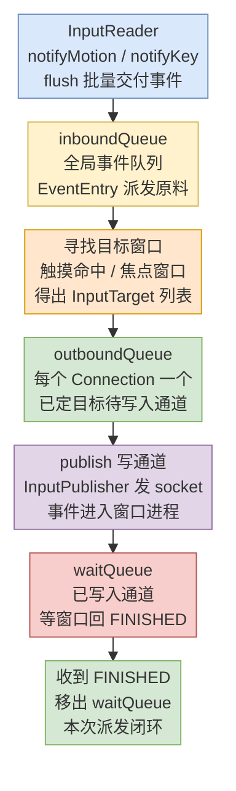
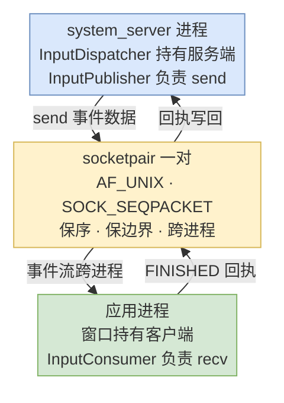
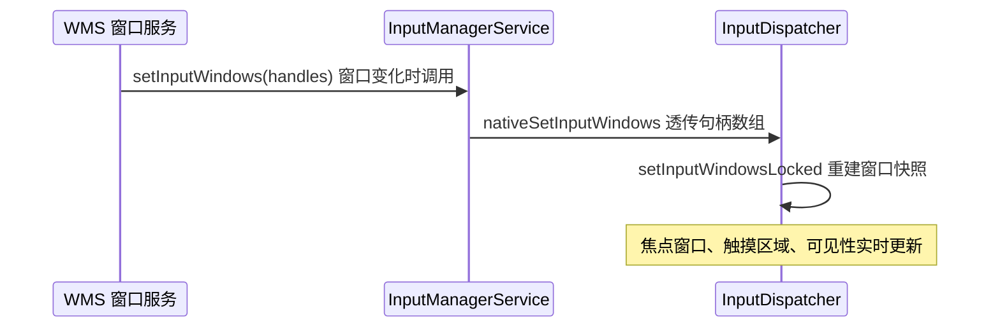
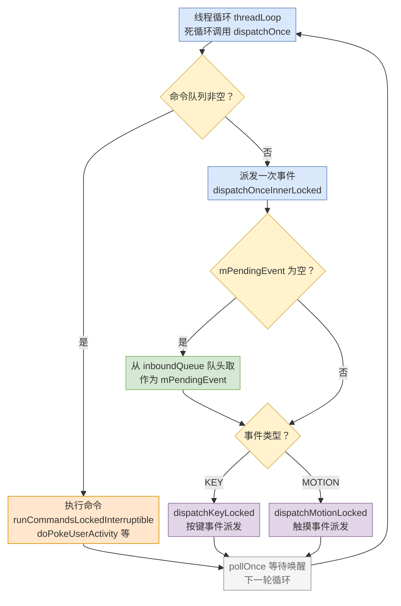
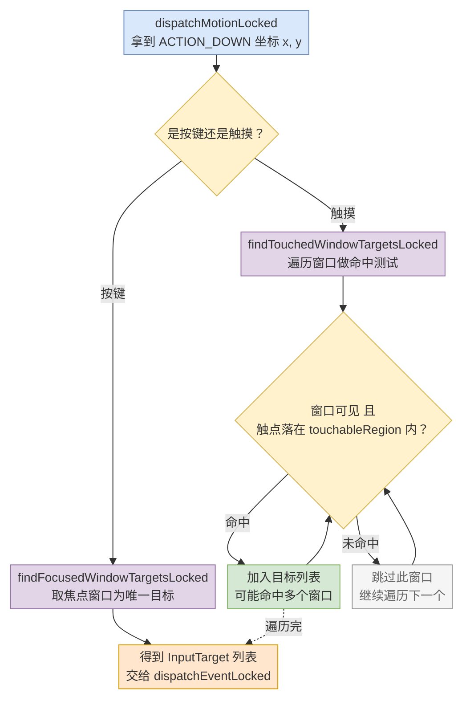
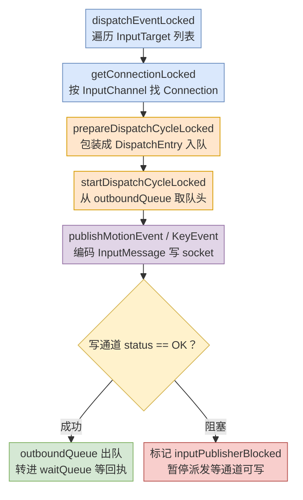
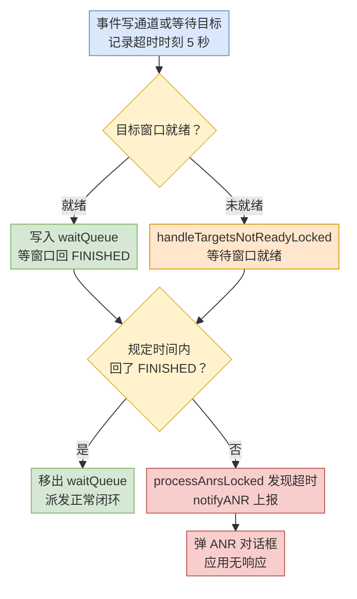
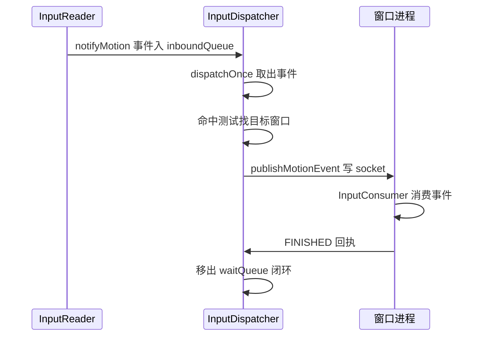

# 22-输入事件体系分析（中）：输入事件的派发

## meta-info

| 字段 | 内容 |
|------|------|
| 分类 | Android 框架层 / 输入系统（Input） |
| 本篇范围 | 中篇：输入事件的派发。从「InputDispatcher 收到事件」到「事件写入窗口的 InputChannel 管道」为止 |
| 主线 | 派发总览与队列 → InputChannel 通道 → 窗口信息同步 → 派发主循环 → 寻找目标窗口 → 派发执行 → ANR → 点击派发全流程 |

## 导读

上篇停在 InputReader 把加工好的 MotionEvent flush 给 InputDispatcher。那一串从内核 `/dev/input/eventX` 里读出来的裸数据，到这里已经是一个带语义的 `ACTION_DOWN` 事件了。但事件有了，该给谁还没定。

本篇接着讲派发这一段：InputDispatcher 拿到事件后，怎么知道要发给哪个窗口，又怎么把它塞进那个窗口的接收管道。派发的依据是 WMS 实时同步过来的窗口信息，派发的通道是 InputChannel（一对跨进程的 socket），派发的兜底是 ANR（窗口一直不回执就判定卡死）。

系列三篇的划分在上一篇导读里交代过，这里再对齐一次：

- 上篇：输入事件的读取。内核写设备节点 → EventHub → InputReader → flush 给 InputDispatcher。
- 中篇（本篇）：输入事件的派发。InputDispatcher 找目标窗口 → 写 InputChannel → 等 FINISHED 回执。
- 下篇：输入事件的应用层处理。窗口侧 ViewRootImpl 从管道取出事件，沿 View 树完成 dispatchEvent / processEvent。

和上篇一样，全文拿一次点击当例子。上篇的终点（InputDispatcher 收到 `ACTION_DOWN`）正是本篇的起点。

## 目录

- [一、InputDispatcher 总览：职责与三个队列](#一inputdispatcher-总览职责与三个队列)
- [二、InputChannel：跨进程的事件通道](#二inputchannel跨进程的事件通道)
- [三、窗口信息的同步：WMS 到 InputDispatcher](#三窗口信息的同步wms-到-inputdispatcher)
- [四、InputDispatcher 的线程循环：dispatchOnce](#四inputdispatcher-的线程循环dispatchonce)
- [五、寻找目标窗口：命中测试与焦点窗口](#五寻找目标窗口命中测试与焦点窗口)
- [六、派发执行：startDispatchCycle 与 publish](#六派发执行startdispatchcycle-与-publish)
- [七、ANR：派发超时与兜底](#七anr派发超时与兜底)
- [八、点击事件派发全流程串讲](#八点击事件派发全流程串讲)
- [九、高频速记](#九高频速记)
- [图索引](#图索引)

## 一、InputDispatcher 总览：职责与三个队列

InputDispatcher 是派发阶段的绝对主角。上篇讲过，它运行在一条独立的 Native 线程里，优先级 `PRIORITY_URGENT_DISPLAY`。职责一句话：从 InputReader 手里接过事件，根据 WMS 喂过来的窗口信息找到该收事件的窗口，再把事件写进窗口的 InputChannel。

它内部维护三类核心数据：

| 数据 | 说明 |
|------|------|
| 窗口信息（mWindowHandles） | WMS 同步过来的所有窗口句柄，是找目标窗口的依据 |
| 三个队列 | inboundQueue / outboundQueue / waitQueue，事件在它们之间流转 |
| 连接（Connection） | 每个窗口一个，代表该窗口在 InputDispatcher 里的接收端 |

三个队列是理解派发的钥匙。它们不全是全局的，得分开看：

- **inboundQueue**：全局一个。InputReader 塞进来的事件（EventEntry）都先停在这，是派发的原料。
- **outboundQueue**：每个 Connection 各一个。存「已经定好目标、等着写进通道」的事件（DispatchEntry）。
- **waitQueue**：每个 Connection 各一个。存「已经写进通道、等窗口侧回 FINISHED 信号」的事件（DispatchEntry）。

一次事件从进来到离开，就是在这三个队列之间流转一圈：



> 图片：一次事件在 InputDispatcher 里的完整流转。inboundQueue → 找目标 → 目标窗口的 outboundQueue → publish 写通道 → waitQueue 等回执 → FINISHED 闭环。inboundQueue 全局唯一，outboundQueue / waitQueue 每个 Connection 各一份。

围绕这条流转线，几个关键结构先亮出来，后面各章会逐个展开：

- `Connection`：一个窗口在 InputDispatcher 里的代表，内部持有该窗口的 InputChannel（服务端）、InputPublisher、outboundQueue、waitQueue。它由 InputChannel 的 fd 索引，fd 就是连接的身份。
- `InputChannel`：跨进程 socket pair 的封装，派发的物理通道。
- `InputWindowHandle`：窗口句柄，WMS 同步过来的窗口信息（触摸区域、焦点、可见性等）。
- `DispatchEntry`：派发队列里的一个元素，包裹着一个待派发的事件。
- `InputTarget`：一个派发目标，由「目标窗口的 InputChannel + 派发标志 + 事件元信息」组成。

两个点值得先记下：

1. 派发是「确定目标」和「写通道」两段分开的。先算目标（找窗口），再执行（写 socket），中间隔着 outboundQueue 这道缓冲。这也让「一个事件发多个窗口」（比如触摸同时命中两层窗口）成为可能——目标列表里有多项，逐项入队。
2. 事件不是发出去就完了。写进通道后要进 waitQueue，等窗口侧回一个 FINISHED 信号才算闭环。这个「等回执」机制，正是第七节 ANR 的伏笔。

## 二、InputChannel：跨进程的事件通道

InputDispatcher 跑在 system_server 进程，而事件的目标窗口在应用进程。两个进程之间传事件，靠的是 InputChannel——本质是一对 socket。

### 创建：socketpair 一对已连接的 socket

`socketpair` 是 Linux 提供的一个系统调用，一次创建一对「已经互相连接」的 socket。InputChannel 用它，是因为事件通道需要双向、低延迟、还能被 epoll 监听：

```cpp
status_t InputChannel::openInputChannelPair(const std::string& name,
        sp<InputChannel>& outServerChannel, sp<InputChannel>& outClientChannel) {
    int sockets[2];
    if (socketpair(AF_UNIX, SOCK_SEQPACKET, 0, sockets)) {
        return -errno;
    }
    ...
    outServerChannel = new InputChannel(serverChannelName, sockets[0]);
    outClientChannel = new InputChannel(clientChannelName, sockets[1]);
    return OK;
}
```

三个参数值得留意：`AF_UNIX`（本机进程间通信，不走网络栈）、`SOCK_SEQPACKET`（面向连接、保序、保留消息边界，比裸字节流更适合一条条离散的事件）、协议 0。`SOCK_SEQPACKET` 保序这点很关键——手指按下、移动、抬起这三个事件的先后顺序不能乱。

创建出来的一对 socket，两端各挂一个收发器：

- 服务端（system_server 侧，InputDispatcher 持有）：挂 `InputPublisher`，负责 send，把事件数据写进 socket。
- 客户端（应用进程侧，窗口持有）：挂 `InputConsumer`，负责 recv，从 socket 读事件数据。



> 图片：InputChannel 的 socket pair 机制。system_server 侧 InputPublisher send 事件，应用进程侧 InputConsumer recv 事件；处理完后客户端回 FINISHED 信号，走的是同一条双向通道。

### 客户端通道怎么到应用进程手里

InputChannel 的创建发生在 WMS 新建窗口（addWindow）的时候。WMS 调 InputManagerService 建一对 InputChannel，服务端留在 system_server 给 InputDispatcher，客户端要交给应用进程。

这里有个跨进程的麻烦：socket 的 fd 是进程私有资源，不能像普通对象那样打包在 Binder 里传。Android 的做法是走 Parcel 的 `writeFileDescriptor`——Binder 驱动在跨进程传 Parcel 时，会把 fd 对应的文件描述符「复制」一份到目标进程，目标进程拿到的是一个新的 fd 号，但指向同一个 socket 文件对象。

应用进程拿到这个 fd 后，重新包装成一个客户端 InputChannel，再交给 `InputEventReceiver`（或 native 侧的 `NativeInputEventReceiver`），把它挂到自己主线程的 Looper 上。这样一来，InputDispatcher 往服务端 socket 写数据，应用进程的 Looper 立刻就能收到可读通知，事件就这样跨进了应用进程。

三个细节：

1. 服务端 socket 也注册进了 InputDispatcher 线程的 Looper。窗口回 FINISHED 信号时，服务端 socket 可读，InputDispatcher 的 Looper 被唤醒，才能及时把 waitQueue 里对应的事件清掉。也就是说，这一对 socket 的两端，分别挂在两个进程各自的 Looper 上。
2. 一个窗口一个 Connection，一个 Connection 一对 socket。窗口多了，InputDispatcher 就同时握着很多个服务端 socket，全部交给 epoll/Looper 统一监听，哪个窗口回执、哪个窗口没回，都能感知到。
3. InputChannel 不是永久有效的。窗口销毁时，InputChannel 随之 dispose，fd 被关闭。InputDispatcher 在写通道前会先检查 Connection 的状态（`Connection::Status::NORMAL`），对已关闭的通道直接跳过。

## 三、窗口信息的同步：WMS 到 InputDispatcher

InputDispatcher 自己不算焦点窗口、不算可点击区域，这些信息全由 WMS 喂。这也正是「输入」和「窗口」两个子系统解耦的关键——InputDispatcher 只认一份「窗口信息快照」，不关心窗口怎么创建、怎么摆放。

### setInputWindows：从 Java 一路落到 native

窗口一有变化（新增、移除、移动、焦点切换、大小改变、触摸区域变化），WMS 就调 `InputManagerService.setInputWindows()`，把最新的窗口句柄数组同步下去：

```java
// InputManagerService.java
public void setInputWindows(InputWindowHandle[] windowHandles) {
    nativeSetInputWindows(mPtr, windowHandles);
}
```

`nativeSetInputWindows` 是 native 方法，落到 `com_android_server_input_InputManagerService.cpp`，再经过 `NativeInputManager::setInputWindows`，最终进入 `InputDispatcher::setInputWindowsLocked()`。这条链路本质是「把 Java 层的窗口句柄数组，翻译成 InputDispatcher 认识的 native 窗口句柄，替换掉它手里那份旧快照」。

### InputWindowHandle 携带了什么

每个 `InputWindowHandle` 对应一个窗口，里面装着 InputDispatcher 做命中测试和焦点判断所需的全部输入相关信息：

| 字段 | 作用 |
|------|------|
| token | 窗口唯一标识，跨进程对齐窗口用 |
| inputChannel | 该窗口的 InputChannel（服务端） |
| touchableRegion | 可触摸区域，命中测试的依据 |
| visible | 是否可见，不可见的窗口不做触摸命中 |
| focusable | 是否可获焦点 |
| hasFocus | 当前是否持有焦点（焦点窗口判断） |
| layoutParamsFlags | 布局参数标志，含 FLAG_NOT_TOUCH_MODAL（触摸模态）等 |
| frame | 窗口的矩形区域（left/top/right/bottom） |
| windowType | 窗口类型（应用窗口 / 系统窗口 / 壁纸等） |

这些字段里，touchableRegion 和 visible 是触摸命中的核心，hasFocus 和 focusable 是按键派发的核心。WMS 每次同步，InputDispatcher 手里的快照就被整体刷新，下次找目标窗口时用的就是最新数据。



> 图片：窗口信息同步时序。WMS 在窗口变化时主动同步，InputDispatcher 只被动接收并更新自己手里的快照，不主动向 WMS 查询。

一个容易忽略的点：同步是「全量替换」而非「增量更新」。每次 setInputWindows 传的是完整的窗口句柄数组，InputDispatcher 拿它重建整个 mWindowHandles。所以这条同步链路要轻——窗口再多，也就是一次数组透传加一次快照重建，不能太重。

## 四、InputDispatcher 的线程循环：dispatchOnce

InputDispatcher 运行在 `InputDispatcherThread` 里，线程体死循环调 `dispatchOnce()`：

```cpp
bool InputDispatcherThread::threadLoop() {
    mDispatcher->dispatchOnce();
    return true;   // 永远返回 true，死循环
}
```

这跟上篇 InputReader 的 `loopOnce` 是对称的一对。`dispatchOnce` 一轮做三件事：

```cpp
void InputDispatcher::dispatchOnce() {
    nsecs_t nextWakeupTime = LONG_LONG_MAX;
    { // acquire lock
        std::scoped_lock _l(mLock);
        // 1. 如果没有待处理的命令，就派发一次事件
        if (!haveCommandsLocked()) {
            dispatchOnceInnerLocked(&nextWakeupTime);
        }
        // 2. 执行命令队列
        if (runCommandsLockedInterruptible()) {
            nextWakeupTime = LONG_LONG_MIN;
        }
    } // release lock
    // 3. 等待下次唤醒或超时
    nsecs_t currentTime = now();
    int timeoutMillis = toMillisecondTimeoutDelay(currentTime, nextWakeupTime);
    mLooper->pollOnce(timeoutMillis);
}
```

三件事分别是：派发事件（`dispatchOnceInnerLocked`）、执行命令（`runCommandsLockedInterruptible`）、等待唤醒（`pollOnce`）。其中「命令」是一条条 CommandEntry（比如 doPokeUserActivity 戳一下用户活动状态、doNotifyANR 上报 ANR），它们由别处塞进命令队列，轮到线程循环时统一执行。命令优先于事件——只要命令队列非空，`haveCommandsLocked` 为真，这一轮就跳过派发、先去跑命令。

`dispatchOnceInnerLocked` 是真正派发事件的地方，核心流程：

```cpp
void InputDispatcher::dispatchOnceInnerLocked(nsecs_t* nextWakeupTime) {
    nsecs_t currentTime = now();
    if (mDispatchEnabled) {
        resetANRTimeoutsLocked();   // 重置 ANR 计时
    }
    if (!mPendingEvent) {
        // 没有正在处理的事件，就从 inboundQueue 取一个
        if (mInboundQueue.isEmpty()) {
            ...
            return;
        }
        mPendingEvent = mInboundQueue.dequeueAtHead();
    }
    ...
    bool done = false;
    switch (mPendingEvent->type) {
    case EventEntry::Type::KEY:
        done = dispatchKeyLocked(currentTime, ...);       // 按键
        break;
    case EventEntry::Type::MOTION:
        done = dispatchMotionLocked(currentTime, ...);    // 触摸
        break;
    ...
    }
    if (done) {
        mPendingEvent = nullptr;
    }
}
```

逻辑很直白：先看有没有正在处理的事件（`mPendingEvent`），没有就从 inboundQueue 队头取一个；然后按事件类型走 `dispatchKeyLocked`（按键）或 `dispatchMotionLocked`（触摸）；处理完把 `mPendingEvent` 清空，下一轮再取下一个。



> 图片：dispatchOnce 的循环流程。命令优先于事件；派发时从 inboundQueue 取事件，按键走 dispatchKeyLocked、触摸走 dispatchMotionLocked，处理完 pollOnce 等下一轮唤醒。

两个设计细节：

1. `mPendingEvent` 是一次只处理一个事件的「工作位」。某个事件如果这一轮没处理完（比如目标窗口还没准备好，done 为 false），`mPendingEvent` 不清空，下一轮继续处理同一个，不会丢。
2. `resetANRTimeoutsLocked` 每轮都跑一次，它重置的是「事件在 waitQueue 里等待回执」的超时计时。事件只要还在正常流转，ANR 的时钟就被不断往后拨；只有真卡住时，时钟才会走到头、触发第七节的 ANR。

## 五、寻找目标窗口：命中测试与焦点窗口

派发之前必须先知道「给谁」。这是整个派发阶段最核心的决策，也是按键和触摸分道扬镳的地方：按键找焦点窗口，触摸找命中的窗口。

### 按键：找焦点窗口

按键事件（KEY）没有坐标，语义是「发给当前正在交互的那个窗口」，也就是焦点窗口。`dispatchKeyLocked` 内部调 `findFocusedWindowTargetsLocked`：

```cpp
int32_t InputDispatcher::findFocusedWindowTargetsLocked(nsecs_t currentTime,
        const EventEntry* entry, std::vector<InputTarget>& inputTargets,
        nsecs_t* nextWakeupTime) {
    ...
    const sp<InputWindowHandle>& focusedWindowHandle = getFocusedWindowHandleLocked();
    if (focusedWindowHandle == nullptr) {
        // 没有焦点窗口，事件丢弃
        return INPUT_EVENT_INJECTION_FAILED;
    }
    // 焦点窗口就是唯一目标
    inputTargets.push_back(...);
    ...
}
```

焦点窗口由 WMS 维护、经上一节那条同步链路喂给 InputDispatcher。找不到焦点窗口，按键事件就直接丢弃（`INPUT_EVENT_INJECTION_FAILED`）。逻辑就这么简单：一个焦点，一个目标。

### 触摸：命中测试

触摸事件（MOTION）有坐标，语义是「发给手指点到的那个窗口」。`dispatchMotionLocked` 内部调 `findTouchedWindowTargetsLocked`，它要干的事叫「命中测试」——拿着触点坐标，去窗口快照里找哪些窗口覆盖了这个点：

```cpp
int32_t InputDispatcher::findTouchedWindowTargetsLocked(nsecs_t currentTime,
        const MotionEntry* entry, std::vector<InputTarget>& inputTargets,
        nsecs_t* nextWakeupTime, bool* outConflictingPointerActions) {
    ...
    size_t numWindows = mWindowHandles.size();
    for (size_t i = 0; i < numWindows; i++) {
        const sp<InputWindowHandle>& windowHandle = mWindowHandles.itemAt(i);
        const InputWindowInfo* windowInfo = windowHandle->getInfo();
        if (windowInfo->visible) {
            if (windowInfo->touchableRegionContainsPoint(x, y)) {
                // 命中，把这个窗口加进目标列表
                inputTargets.push_back(...);
            }
        }
    }
    ...
}
```

核心就是遍历 mWindowHandles，对每个可见窗口调 `touchableRegionContainsPoint(x, y)` 判断触点是否落在它的可触摸区域内，命中就加入目标列表。

这里有两个触摸才有的特点，和按键的「单目标」形成对比：

1. 触摸是「多目标」的。一个触点可能同时命中多个窗口——比如一个透明窗口叠在另一个窗口上面，触点落在重叠区域时两个都命中。所以 `findTouchedWindowTargetsLocked` 往 `inputTargets` 里 push 的是一批目标，`dispatchEventLocked` 后面会逐个窗口派发。
2. 触摸有「模态」的概念。`FLAG_NOT_TOUCH_MODAL` 标志决定一个窗口是否拦截落在它外面的触摸：默认（触摸模态）的窗口会拦截，排在它后面（视觉上在下面）的窗口就收不到这个点；带 FLAG_NOT_TOUCH_MODAL 的窗口则「不拦截」，落在它外面的点继续往后面的窗口找。



> 图片：寻找目标窗口的两条路径。按键找焦点窗口（单目标），触摸遍历窗口做命中测试（可多目标），最终都产出 InputTarget 列表交给派发执行。

再补两个工程细节，避免把命中测试想简单了：

1. 命中测试只在 ACTION_DOWN 时完整做一次。手指按下（DOWN）那一刻确定目标窗口，后续的 MOVE / UP 沿用同一批目标，不再重新命中。理由很简单：手指在窗口上滑动时，窗口树可能已经变了，如果每次 MOVE 都重新命中，目标会飘。
2. 现代 Android 还有分屏、多显示器、多窗口栈，命中测试要按 display 分别处理。主干逻辑仍是上面这条「遍历 → 命中 → 入列」，只是遍历范围和坐标系被扩展成了多显示器维度。

## 六、派发执行：startDispatchCycle 与 publish

目标确定了，接下来是「把事件真正写进通道」。这一段是一条逐步下沉的调用链：

`dispatchEventLocked` → `prepareDispatchCycleLocked` → `startDispatchCycleLocked` → `publishXxxEvent`

### 逐目标派发：dispatchEventLocked

`dispatchEventLocked` 拿到上一节产出的 InputTarget 列表，逐个目标处理：

```cpp
void InputDispatcher::dispatchEventLocked(nsecs_t currentTime, EventEntry* eventEntry,
        const std::vector<InputTarget>& inputTargets) {
    for (const InputTarget& inputTarget : inputTargets) {
        sp<Connection> connection = getConnectionLocked(inputTarget.inputChannel);
        if (connection != nullptr) {
            prepareDispatchCycleLocked(currentTime, connection, eventEntry, &inputTarget);
        }
    }
}
```

每个 InputTarget 里带着目标窗口的 InputChannel，据此找到对应的 Connection，交给 `prepareDispatchCycleLocked`。找不到 Connection（通道已关闭），就跳过。

### 入队：prepareDispatchCycleLocked

`prepareDispatchCycleLocked` 做的是「包装 + 入队」：把事件和目标信息包成一个 DispatchEntry，塞进这个 Connection 的 outboundQueue，然后尝试启动派发：

```cpp
void InputDispatcher::prepareDispatchCycleLocked(nsecs_t currentTime,
        const sp<Connection>& connection, EventEntry* eventEntry,
        const InputTarget* inputTarget) {
    ...
    enqueueDispatchEntryLocked(connection, dispatchEntry, inputTarget, ...);
    ...
    if (!connection->inputPublisherBlocked) {
        startDispatchCycleLocked(currentTime, connection);
    }
}
```

### 写通道：startDispatchCycleLocked 与 publish

`startDispatchCycleLocked` 是「真正把数据写进 socket」的地方。它从 outboundQueue 队头取 DispatchEntry，按事件类型调 InputPublisher 的 publish 方法：

```cpp
void InputDispatcher::startDispatchCycleLocked(nsecs_t currentTime,
        const sp<Connection>& connection) {
    while (connection->status == Connection::Status::NORMAL
            && !connection->outboundQueue.isEmpty()) {
        DispatchEntry* dispatchEntry = connection->outboundQueue.head;
        status_t status;
        switch (dispatchEntry->eventEntry->type) {
        case EventEntry::Type::KEY:
            status = connection->inputPublisher.publishKeyEvent(...);
            break;
        case EventEntry::Type::MOTION:
            status = connection->inputPublisher.publishMotionEvent(...);
            break;
        }
        if (status == OK) {
            // 写成功，从 outboundQueue 移到 waitQueue
            connection->outboundQueue.dequeue(dispatchEntry);
            connection->waitQueue.enqueueAtTail(dispatchEntry);
        }
        ...
    }
}
```

关键在最后那个 `if (status == OK)`：写通道成功之后，DispatchEntry 从 outboundQueue 出队，转进 waitQueue。也就是说，事件「发出去」的标志不是「写 socket」这一下，而是「写成功并进入 waitQueue 等待回执」。

`publishMotionEvent` / `publishKeyEvent` 内部做的事是：把事件编码成一个 `InputMessage` 结构体，通过服务端 socket send 出去。窗口侧的 InputConsumer recv 到这条消息，事件就算跨过了进程边界。



> 图片：派发执行的调用链。dispatchEventLocked 逐目标找 Connection，prepareDispatchCycleLocked 入队，startDispatchCycleLocked 写通道，写成功后事件从 outboundQueue 转入 waitQueue 等待回执。

一个容易被忽略的点：publish 是可能「写不出去」的。socket 的发送缓冲区满了（窗口进程来不及消费），send 就会返回 EAGAIN，这时 `publishMotionEvent` 返回失败，InputDispatcher 给 Connection 打上 `inputPublisherBlocked` 标记，暂停这个窗口的派发。等窗口侧消费掉积压数据、通道重新可写，再恢复派发。这个「背压」机制保证了慢窗口不会把整个派发线程拖死。

## 七、ANR：派发超时与兜底

事件写进通道、进了 waitQueue，InputDispatcher 不会无限等下去。窗口侧必须在规定时间内处理完并回一个 FINISHED 信号；超时未回，就判定这个窗口卡死了，触发 ANR（Application Not Responding）。

### 超时计时与检查

默认超时时间是 5 秒（`DEFAULT_INPUT_DISPATCHING_TIMEOUT`）。事件进 waitQueue 的那一刻，InputDispatcher 就记下了它的超时时刻。之后每轮 `dispatchOnce` 里，`processAnrsLocked` 都会检查 waitQueue 里有没有已经超时、还没回执的事件：

```cpp
void InputDispatcher::processAnrsLocked() {
    nsecs_t currentTime = now();
    ...
    if (oldestEntry != nullptr && currentTime >= oldestEntry->timeoutTime) {
        // 有事件超时未回执，触发 ANR
        ...
        notifyANR(...);
    }
}
```

一旦发现超时，`notifyANR` 通过 InputDispatcherPolicy 上报，一路走到 AMS / WMS，最终弹那个熟悉的「应用无响应」对话框。

### 两种超时场景

ANR 在派发阶段其实有两个不同的触发点，容易混，分开看：

1. **派发超时（窗口不消费）**：事件已经写进通道、进了 waitQueue，但窗口进程的主线程卡死，迟迟不回 FINISHED。这是最常见的 ANR，对应「点一下应用没反应、过几秒弹 ANR」。
2. **目标未就绪（事件派不出去）**：事件的目标窗口还没准备好——比如窗口正在启动、还没完成 relayout，InputDispatcher 拿不到可用的 InputChannel。这时事件进不了 waitQueue，而是走 `handleTargetsNotReadyLocked`，设置一个等待窗口，等窗口就绪。这个等待也是有超时的，超时同样 ANR。



> 图片：ANR 超时的两条路径。目标就绪则事件进 waitQueue 等回执，目标未就绪则等待窗口出现；无论哪条，超过规定时间未闭环，都走 processAnrsLocked 上报、弹 ANR。

两个细节：

1. FINISHED 信号是窗口侧主动回的。窗口进程消费完事件后，InputConsumer 会发一个 FINISHED 回执，InputDispatcher 的服务端 socket 收到后，才把对应的 DispatchEntry 从 waitQueue 移除。这个回执由窗口侧框架代码自动完成，应用层无感。
2. 超时时间不写死成 5 秒。系统里按键、触摸的派发超时可以分开配置，只是默认都是 5 秒。而且事件进 waitQueue 后如果窗口很快回执，计时就被清掉，不会累积——只有「一直不回」才真正走到超时。

## 八、点击事件派发全流程串讲

承接上篇的「一次点击」。上篇终点是 InputReader 把 `ACTION_DOWN` 的 MotionEvent flush 给 InputDispatcher。现在从这个点继续，看这一个事件在派发阶段走完的每一步。



> 图片：一次点击的派发全流程。InputReader 通知事件入队，InputDispatcher 取出、命中测试、写通道，窗口进程消费后回 FINISHED，派发闭环。

1. 入队：InputReader 的 `QueuedInputListener::flush` 调到 InputDispatcher 的 `notifyMotion`，`notifyMotion` 把 `ACTION_DOWN` 包装成 MotionEntry，塞进 inboundQueue，并 wake 派发线程。
2. 取出：派发线程被唤醒，`dispatchOnce` → `dispatchOnceInnerLocked` 发现 `mPendingEvent` 为空，从 inboundQueue 队头取出这个 MotionEntry。
3. 找目标：`dispatchMotionLocked` 发现是触摸事件，调 `findTouchedWindowTargetsLocked`，拿触点坐标对 mWindowHandles 做命中测试，命中桌面图标所在的窗口，得到 InputTarget 列表。
4. 入队执行：`dispatchEventLocked` 遍历目标，找到桌面窗口的 Connection，`prepareDispatchCycleLocked` 把 DispatchEntry 塞进该 Connection 的 outboundQueue。
5. 写通道：`startDispatchCycleLocked` 调 `inputPublisher.publishMotionEvent`，把 `ACTION_DOWN` 编码成 InputMessage，写进服务端 socket。
6. 窗口消费：桌面进程主线程的 Looper 被唤醒，InputConsumer recv 到事件，InputEventReceiver 把它分发出去，交给 ViewRootImpl 处理（这段是下篇的内容）。
7. 回执闭环：窗口侧处理完，InputConsumer 发 FINISHED 信号；InputDispatcher 的服务端 socket 可读，`finishDispatchCycleLocked` 把对应的 DispatchEntry 从 waitQueue 移除。这一次派发正式闭环。

到这里，一个 `ACTION_DOWN` 完成了「派发」的全部旅程：从 inboundQueue 里的一条记录，变成了窗口进程主线程即将处理的一个输入事件。至于窗口侧怎么从管道取出、怎么沿 View 树分发，那是下篇「应用层处理」的内容。

一个值得回味的点：整个派发过程，InputDispatcher 线程自己几乎不做重活。命中测试是遍历一份现成的窗口快照，写通道是一次 socket send，等回执是被动等 Looper 通知。重活都甩给了两头的 InputReader 和窗口进程——这也解释了为什么它能把优先级拉到 `PRIORITY_URGENT_DISPLAY` 而不担心拖累系统。

## 九、高频速记

- 派发阶段主角是 InputDispatcher，一条 `PRIORITY_URGENT_DISPLAY` 的 Native 线程，职责：找目标窗口 → 写 InputChannel → 等 FINISHED。
- 三个队列：inboundQueue（全局，存事件原料）、outboundQueue（每 Connection 一个，待写通道）、waitQueue（每 Connection 一个，等回执）。
- 事件流转：inboundQueue → 找目标 → outboundQueue → publish 写通道 → waitQueue → FINISHED 闭环。
- InputChannel 是一对 `socketpair(AF_UNIX, SOCK_SEQPACKET, 0)` 的 socket：服务端挂 InputPublisher（send），客户端挂 InputConsumer（recv）。
- 客户端 InputChannel 通过 Binder 的 `Parcel::writeFileDescriptor` 跨进程传 fd 到应用进程，包装后挂到主线程 Looper。
- 窗口信息由 WMS 经 `setInputWindows` → `nativeSetInputWindows` → `setInputWindowsLocked` 全量同步，InputDispatcher 只被动接收快照。
- InputWindowHandle 携带触摸区域、可见性、焦点、frame、windowType 等命中测试所需信息。
- 线程循环 `dispatchOnce` 三件事：派发事件（dispatchOnceInnerLocked）→ 执行命令（runCommandsLockedInterruptible）→ pollOnce 等唤醒，命令优先于事件。
- 找目标：按键走 `findFocusedWindowTargetsLocked`（焦点窗口单目标），触摸走 `findTouchedWindowTargetsLocked`（命中测试可多目标）。
- 命中测试只在 ACTION_DOWN 完整做一次，MOVE / UP 沿用同一批目标；触摸有 FLAG_NOT_TOUCH_MODAL 模态概念。
- 派发执行链：dispatchEventLocked → prepareDispatchCycleLocked（入队）→ startDispatchCycleLocked（写通道）→ publishMotionEvent / publishKeyEvent。
- 写成功标志：DispatchEntry 从 outboundQueue 转入 waitQueue；socket 发送缓冲满则打 inputPublisherBlocked 标记暂停派发。
- ANR 默认超时 5 秒（DEFAULT_INPUT_DISPATCHING_TIMEOUT），`processAnrsLocked` 检查 waitQueue 超时事件，`notifyANR` 上报弹框。
- ANR 两种场景：派发超时（窗口不回 FINISHED）、目标未就绪（handleTargetsNotReadyLocked 等窗口出现）。
- 一次点击派发：notifyMotion 入队 → dispatchOnce 取出 → 命中测试 → publish 写 socket → 窗口消费 → FINISHED 回执闭环。

## 图索引

| 图 | 内容 |
|----|------|
| 1 | 事件在 InputDispatcher 里的完整流转：inboundQueue → 找目标 → outboundQueue → publish → waitQueue → FINISHED |
| 2 | InputChannel 的 socket pair 机制：服务端 InputPublisher / 客户端 InputConsumer / 双向通道 |
| 3 | 窗口信息同步时序：WMS → InputManagerService → InputDispatcher 全量替换快照 |
| 4 | dispatchOnce 循环流程：命令优先、取事件、按键/触摸分派、pollOnce 等待 |
| 5 | 寻找目标窗口两条路径：按键找焦点、触摸做命中测试 |
| 6 | 派发执行调用链：dispatchEventLocked → prepareDispatchCycleLocked → startDispatchCycleLocked → publish |
| 7 | ANR 超时两条路径：派发超时、目标未就绪，超时后 notifyANR 弹框 |
| 8 | 点击事件派发全流程时序：入队 → 取出 → 命中 → 写通道 → 回执闭环 |
