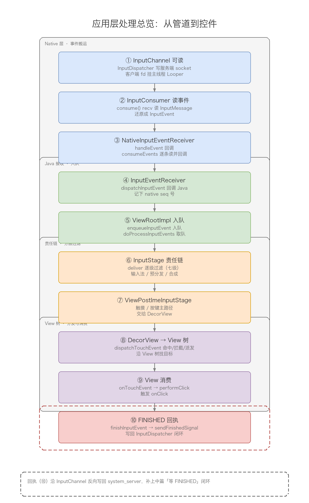
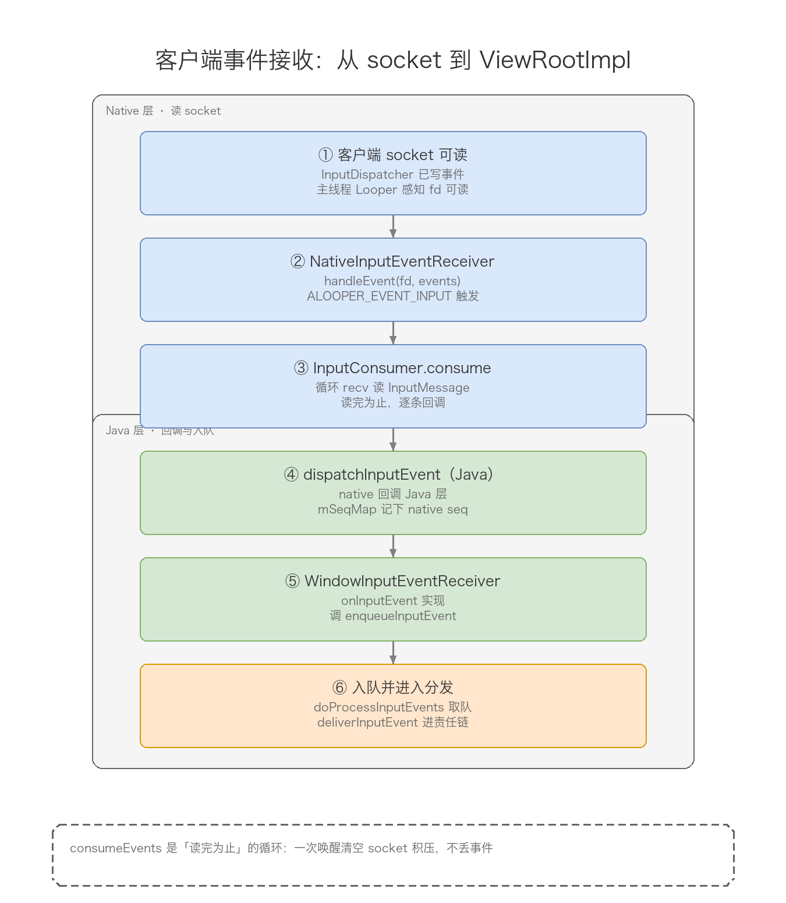
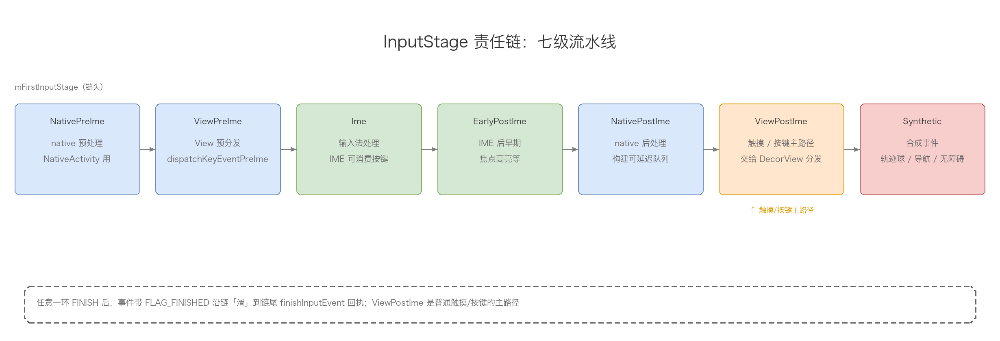
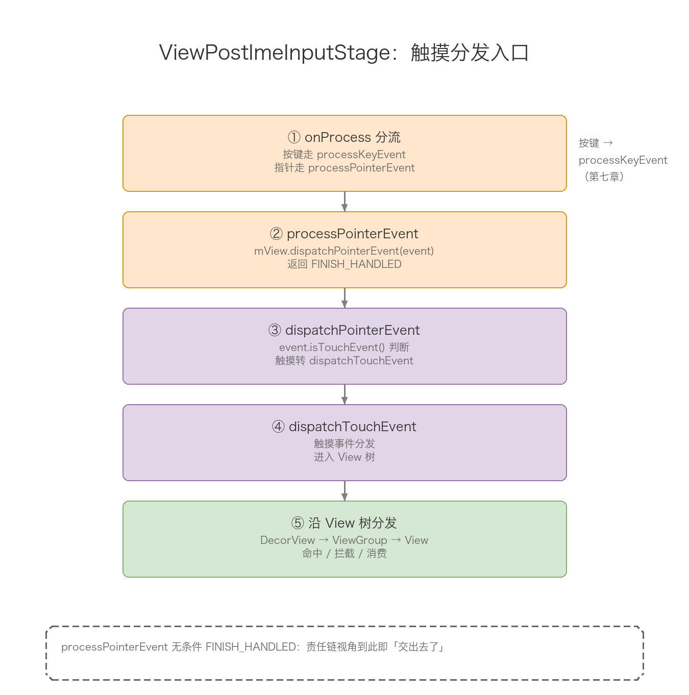
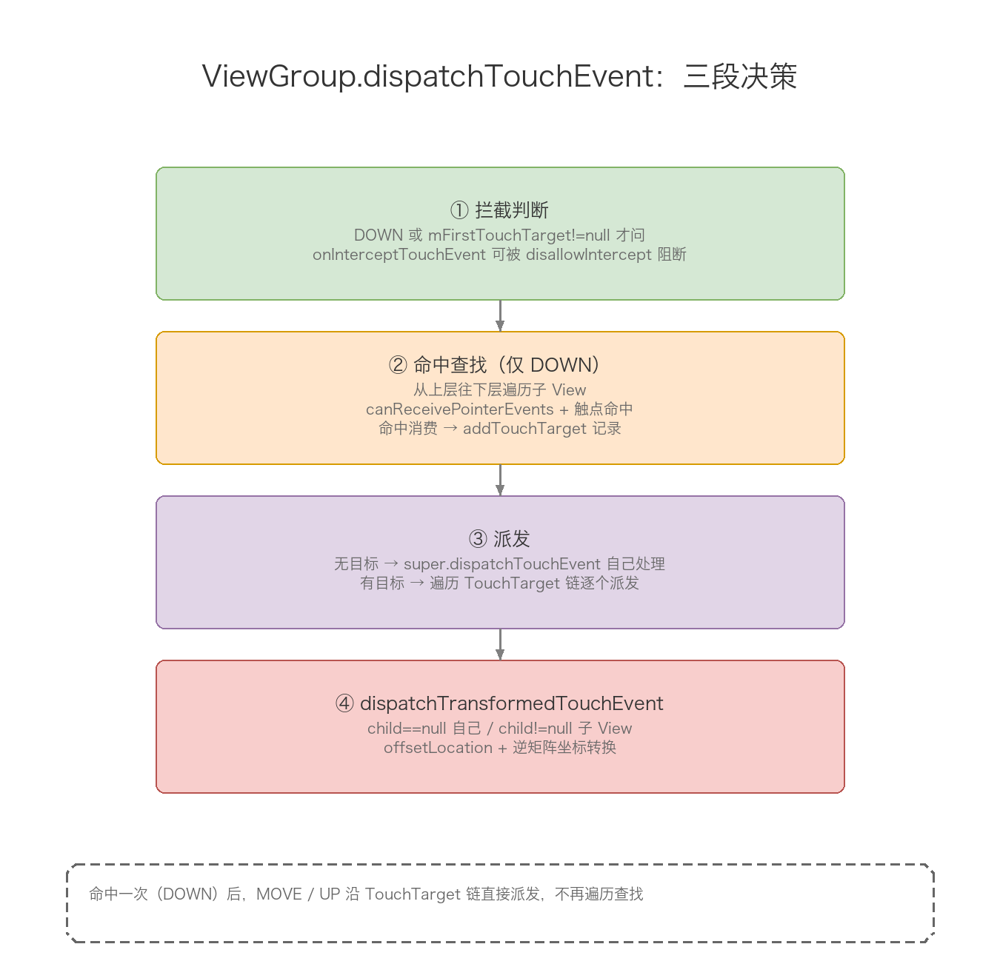
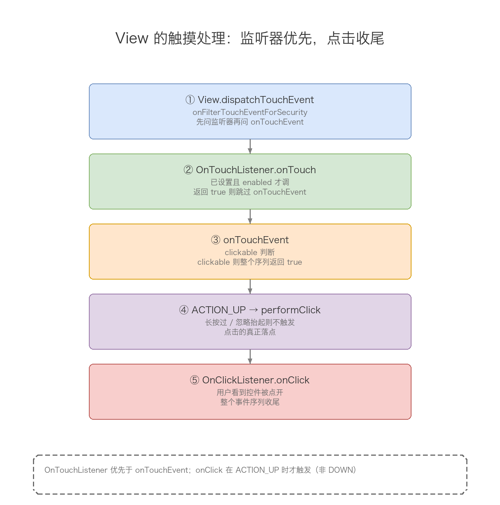
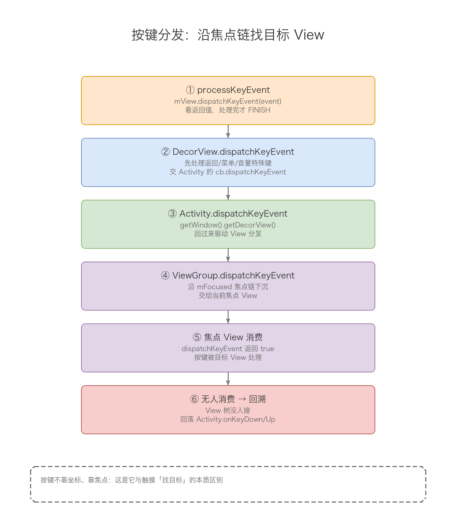
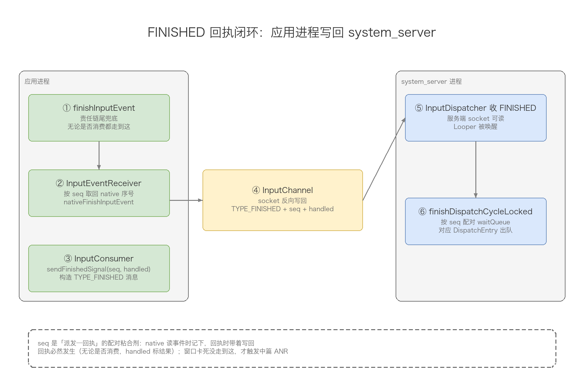
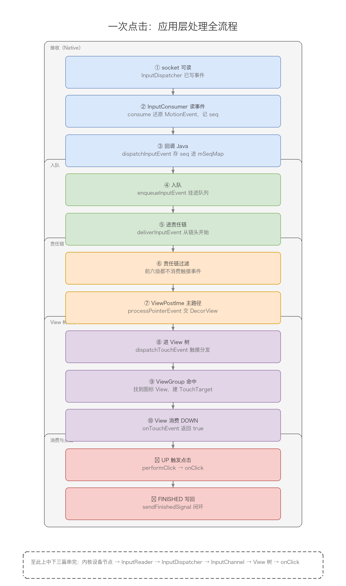

# 23-输入事件体系分析（下）：应用层处理过程分析

## meta-info

| 字段 | 内容 |
|------|------|
| 分类 | Android 框架层 / 输入系统（Input） |
| 本篇范围 | 下篇：应用层处理。从「应用进程从 InputChannel 取出事件」到「View 树完成 dispatchEvent、回 FINISHED 闭环」为止 |
| 主线 | 应用层总览 → 客户端事件接收 → InputStage 责任链 → 触摸事件 View 树分发 → 按键事件分发 → 回执闭环 → 全流程串讲 |

## 导读

上篇讲读取，中篇讲派发，都发生在 system_server 进程的 Native 层。中篇的终点，是 InputDispatcher 把一个 `ACTION_DOWN` 编码成 `InputMessage`，通过服务端 socket 写进了窗口的 InputChannel 管道。事件到了这一步，已经跨过了进程边界，就躺在应用进程主线程 Looper 监听的那个 fd 上，等有人把它读走。

本篇接着讲最后这一段——应用层怎么把这条数据变成一个「控件响应」。主角换成了每个窗口都有的 ViewRootImpl，以及它手里的两条线：

1. 一条「进水线」：InputEventReceiver 从管道读出事件，交给 ViewRootImpl 入队。
2. 一条「分发线」：InputStage 责任链先对事件做分层过滤（输入法、预分发、合成事件），再落到 ViewPostImeInputStage，把触摸/按键事件交给 DecorView，沿 View 树一层层往下找目标控件。

事件被某个 View 消费之后，还要原路回一个 FINISHED 信号给 InputDispatcher，把中篇第五章埋下的「等回执」闭环补上。这条回执链正是 ANR 的另一半：窗口侧不回，InputDispatcher 那边就一直等，等到超时弹 ANR。

和上两篇一样，全文拿一次点击当例子。中篇的终点（事件写进 InputChannel）正是本篇的起点。

系列三篇的划分再对齐一次：

- 上篇：输入事件的读取。内核写设备节点 → EventHub → InputReader → flush 给 InputDispatcher。
- 中篇：输入事件的派发。InputDispatcher 找目标窗口 → 写 InputChannel → 等 FINISHED 回执。
- 下篇（本篇）：输入事件的应用层处理。ViewRootImpl 从管道取出事件 → InputStage 责任链 → View 树分发 → 回 FINISHED 闭环。

## 目录

- [一、应用层处理总览：从管道到控件的一条线](#一应用层处理总览从管道到控件的一条线)
- [二、事件接收：从 InputChannel 到 ViewRootImpl 队列](#二事件接收从-inputchannel-到-viewrootimpl-队列)
- [三、InputStage 责任链：事件处理的流水线](#三inputstage-责任链事件处理的流水线)
- [四、触摸事件的分发：ViewRootImpl 到 View 树](#四触摸事件的分发viewrootimpl-到-view-树)
- [五、ViewGroup 的触摸分发：拦截、命中、派发三件事](#五viewgroup-的触摸分发拦截命中派发三件事)
- [六、View 的触摸处理：onTouch 与点击判定](#六view-的触摸处理ontouch-与点击判定)
- [七、按键事件的分发：焦点 View 的按键链](#七按键事件的分发焦点-view-的按键链)
- [八、回执闭环：FINISHED 信号怎么回到 InputDispatcher](#八回执闭环finished-信号怎么回到-inputdispatcher)
- [九、点击事件应用层处理全流程串讲](#九点击事件应用层处理全流程串讲)
- [十、高频速记](#十高频速记)
- [图索引](#图索引)

## 一、应用层处理总览：从管道到控件的一条线

先看全貌。事件写进 InputChannel 之后，在应用进程里还要走这么一段：



> 图片：应用层处理全貌。事件从客户端 InputChannel 进来，经 InputConsumer 读出 → NativeInputEventReceiver → Java 层 InputEventReceiver → ViewRootImpl 入队 → InputStage 责任链过滤 → ViewPostImeInputStage → DecorView → View 树，最终某个 View 消费；消费结果再原路回 FINISHED 给 InputDispatcher。

这条线上的参与者，按「进水 → 分发 → 回执」三段拆开看：

| 参与者 | 层次 | 职责 |
|--------|------|------|
| InputConsumer | Native | 挂在客户端 InputChannel 上，负责 recv，从 socket 读出 InputMessage |
| NativeInputEventReceiver | Native | 监听 socket fd 可读，读事件后回调 Java 层 |
| InputEventReceiver | Java | 抽象基类，收到事件后交给 onInputEvent 子类实现 |
| WindowInputEventReceiver | Java | ViewRootImpl 内部类，实现 onInputEvent，把事件入队 |
| ViewRootImpl | Java | 窗口与 View 树的枢纽，维护输入事件队列，驱动 InputStage 责任链 |
| InputStage | Java | 责任链的一环，对事件做分层过滤（预分发 / 输入法 / 合成） |
| DecorView | Java | 根 View，View 树分发的起点 |
| ViewGroup / View | Java | 沿树分发、拦截、消费事件 |

两个点值得先记下，后面会反复遇到：

1. 应用层这段几乎全是 Java 代码。上中篇的主角（InputReader / InputDispatcher）在 Native 层，到这里切回了 Java。事件跨进应用进程后，剩下的分发全是 View 体系的事，这也解释了为什么「View 事件分发」是 Android 面试的高频考点——它是输入链里唯一一段业务开发天天打交道、又能直接改写行为的环节。
2. 分发不是「直接找 View」，而是「先过流水线，再过树」。事件进了 ViewRootImpl，先被 InputStage 责任链筛一遍（输入法要不要吃、合成事件要不要转、native 侧要不要先处理），筛剩下的才轮到 View 树。这个「责任链 + 树」的双层结构，是理解事件分发的钥匙。

## 二、事件接收：从 InputChannel 到 ViewRootImpl 队列

中篇第六章讲过，客户端 InputChannel 在应用进程侧被包装后挂到了主线程 Looper 上。挂上去的那个东西，就是 `NativeInputEventReceiver`。事件到达时的第一声动静，发生在它身上。

### NativeInputEventReceiver：socket 可读的入口

`NativeInputEventReceiver` 在 native 层（`android_view_InputEventReceiver.cpp`），它实现了一个 `NativeInputEventReceiver` 类，把一个 fd 注册进主线程 Looper。当 InputDispatcher 往服务端 socket 写数据，客户端的 fd 变成可读，Looper 就回调它的 `handleEvent`：

```cpp
int NativeInputEventReceiver::handleEvent(int receiveFd, int events, void* data) {
    ...
    if (events & ALOOPER_EVENT_INPUT) {
        status_t status = consumeEvents(env, false /*consumeBatches*/, -1, nullptr);
        mMessageQueue->raiseAndClearException(env, "handleReceiveCallback");
        return status == OK || status == NO_MEMORY ? 1 : 0;
    }
    ...
}
```

`handleEvent` 里调 `consumeEvents`，这才是真正读数据的地方：

```cpp
status_t NativeInputEventReceiver::consumeEvents(JNIEnv* env,
        bool consumeBatches, nsecs_t frameTime, bool* outConsumedBatch) {
    ...
    for (;;) {
        uint32_t seq;
        InputEvent* inputEvent;
        // 从 InputConsumer 读一条事件
        status_t status = mInputConsumer.consume(&mInputEventFactory,
                consumeBatches, frameTime, &seq, &inputEvent);
        if (status != OK) {
            break;   // 读完了或出错了，退出循环
        }
        ...
        // 回调 Java 层 InputEventReceiver.dispatchInputEvent
        env->CallVoidMethod(receiverObj.get(),
                gInputEventReceiverClassInfo.dispatchInputEvent,
                seq, inputEvent, displayId);
        ...
        if (env->ExceptionCheck()) {
            ... // 异常时丢掉这条事件并回 FINISHED
        }
        recycleInputEvent(inputEvent);
    }
}
```

循环读事件的语义很清楚：`mInputConsumer.consume` 从 socket 读一条，就回调一次 Java 层，读完（consume 返回非 OK）就退出。这个 `mInputConsumer` 就是挂在客户端 InputChannel 上的消费器，`consume` 内部做的是 recv + 解析：把 socket 里的一段二进制，还原成一个 `InputMessage`，再交给 `InputEventFactory` 转成 Java 层认识的 `InputEvent`（MotionEvent 或 KeyEvent）。

### Java 层：InputEventReceiver 到 WindowInputEventReceiver

native 回调进来的是 Java 类 `InputEventReceiver` 的 `dispatchInputEvent`：

```java
// InputEventReceiver.java
public abstract class InputEventReceiver {
    private void dispatchInputEvent(int seq, InputEvent event, int displayId) {
        mSeqMap.put(event.getSequenceNumber(), seq);
        onInputEvent(event, displayId);   // 交给子类
    }

    public abstract void onInputEvent(InputEvent event, int displayId);
}
```

`InputEventReceiver` 是个抽象类，`onInputEvent` 由子类实现。每个窗口都有一个 `WindowInputEventReceiver`，它是 ViewRootImpl 的内部类：

```java
// ViewRootImpl.java
final class WindowInputEventReceiver extends InputEventReceiver {
    @Override
    public void onInputEvent(InputEvent event, int displayId) {
        enqueueInputEvent(event, this, 0, true);
    }
}
```

`onInputEvent` 做的事只有一件：把事件塞进 ViewRootImpl 的输入队列，等主线程来取。参数 `true` 表示「立即处理」。

### 入队与取队：enqueueInputEvent / doProcessInputEvents

`enqueueInputEvent` 把事件包成一个 `QueuedInputEvent` 节点，挂进队列：

```java
// ViewRootImpl.java
void enqueueInputEvent(InputEvent event, InputEventReceiver receiver,
        int flags, boolean processImmediately) {
    QueuedInputEvent q = obtainQueuedInputEvent(event, receiver, flags);
    ...
    if (processImmediately) {
        doProcessInputEvents();
    } else {
        scheduleProcessInputEvents();
    }
}
```

`QueuedInputEvent` 是 ViewRootImpl 内部定义的一个链表节点，它把「事件本体 + 标志位 + 处理回调」绑在一起，是后面 InputStage 责任链里流转的载体。`obtainQueuedInputEvent` 从对象池里拿一个节点（复用，避免频繁 new），把 event 和 receiver 塞进去。

`doProcessInputEvents` 从队列头取事件，调 `deliverInputEvent` 进入分发：

```java
// ViewRootImpl.java
void doProcessInputEvents() {
    while (mPendingInputEventHead != null) {
        QueuedInputEvent q = mPendingInputEventHead;
        mPendingInputEventHead = q.mNext;
        ...
        deliverInputEvent(q);
        ...
    }
}
```

`deliverInputEvent` 是分发的分岔口：它决定这个事件从责任链的哪个位置开始走：

```java
// ViewRootImpl.java
private void deliverInputEvent(QueuedInputEvent q) {
    ...
    InputStage stage;
    if (q.shouldSendToSynthesizer()) {
        stage = mSyntheticInputStage;      // 合成事件，直接进最末级
    } else {
        stage = q.shouldSkipIme() ? mFirstPostImeInputStage : mFirstInputStage;
    }
    ...
    stage.deliver(q);                       // 交给责任链第一个节点
}
```

两个判断：`shouldSendToSynthesizer` 决定是否跳过整条链、直接进合成事件处理；`shouldSkipIme` 决定是否跳过输入法相关的前几级。大多数普通触摸/按键事件，走的是 `mFirstInputStage`——也就是责任链的完整起点。



> 图片：客户端事件接收链路。socket 可读 → NativeInputEventReceiver.handleEvent → InputConsumer.consume 读事件 → 回调 Java 层 dispatchInputEvent → WindowInputEventReceiver.onInputEvent → enqueueInputEvent 入队 → deliverInputEvent 进入责任链。

两个细节：

1. `consumeEvents` 是「读完为止」的。一次 `handleEvent` 触发，可能读走 socket 里积压的多条事件，逐条回调 Java。这样主线程一次唤醒就能清空管道，不会漏事件。
2. `dispatchInputEvent` 里 `mSeqMap.put(event.getSequenceNumber(), seq)` 记下了 native 的 seq 号。这个 seq 是回执的关键——第八章回 FINISHED 时，要带着它回给 InputDispatcher，告诉对方「哪条事件处理完了」。

## 三、InputStage 责任链：事件处理的流水线

事件进了 ViewRootImpl 的队列，接下来不是直接扔给 View 树，而是先过一条 InputStage 责任链。这一章把这条链的结构讲透——它是「应用层处理」的骨架，第四到七章都是它的下游。

### 为什么要一条链

一个输入事件进来，可能牵扯好几方：输入法（IME）要不要先吃、native 侧（NativeActivity）要不要先处理、无障碍要不要合成一个替代事件……如果让 View 树直接处理，这些横切逻辑就得塞得到处都是。Android 的做法是：把这些「关心者」排成一条链，事件挨个过，谁处理了谁喊停。

### 链的组装：setView 里串起来

责任链在 `ViewRootImpl.setView()` 里一次性组装好。看这段代码就能摸清顺序：

```java
// ViewRootImpl.setView()
mSyntheticInputStage = new SyntheticInputStage();
InputStage viewPostImeStage = new ViewPostImeInputStage(mSyntheticInputStage);
InputStage nativePostImeStage = new NativePostImeInputStage(viewPostImeStage, "aq:native-post-ime:" + counterSuffix);
InputStage earlyPostImeStage = new EarlyPostImeInputStage(nativePostImeStage);
InputStage imeStage = new ImeInputStage(earlyPostImeStage, "aq:ime:" + counterSuffix);
InputStage viewPreImeStage = new ViewPreImeInputStage(imeStage);
InputStage nativePreImeStage = new NativePreImeInputStage(viewPreImeStage, "aq:native-pre-ime:" + counterSuffix);

mFirstInputStage = nativePreImeStage;
mFirstPostImeInputStage = earlyPostImeStage;
```

注意构造时的方向：`new ViewPostImeInputStage(mSyntheticInputStage)` 表示 viewPostImeStage 的「下一环」是 syntheticInputStage。所以链从 `mFirstInputStage`（nativePreImeStage）开始，一路往下是：

```
NativePreImeInputStage → ViewPreImeInputStage → ImeInputStage
  → EarlyPostImeInputStage → NativePostImeInputStage
  → ViewPostImeInputStage → SyntheticInputStage
```

七级，各自管一段：

| Stage | 职责 |
|-------|------|
| NativePreImeInputStage | IME 之前的 native 预处理（NativeActivity 用） |
| ViewPreImeInputStage | IME 之前的 View 预处理，调 View 的 dispatchKeyEventPreIme |
| ImeInputStage | 交给输入法，IME 可消费按键 |
| EarlyPostImeInputStage | IME 之后的早期处理（焦点高亮等） |
| NativePostImeInputStage | IME 之后的 native 处理 |
| ViewPostImeInputStage | **核心**：把触摸/按键交给 DecorView，View 树分发从这里开始 |
| SyntheticInputStage | 合成事件：轨迹球、导航面板、无障碍注入 |

`mFirstPostImeInputStage` 指向 `earlyPostImeStage`——这就是前面 `deliverInputEvent` 里 `shouldSkipIme()` 时绕开 IME 前三级、直接进入 IME 之后处理的入口。

### 基类模板：deliver / onProcess / forward / finish

七个 stage 共享同一个基类 `InputStage`，它用「模板方法」把责任链的骨架固定下来：

```java
// ViewRootImpl.java
abstract class InputStage {
    private final InputStage mNext;

    public InputStage(InputStage next) {
        mNext = next;
    }

    // 模板方法：子类不能重写，固定了责任链的流转规则
    public final void deliver(QueuedInputEvent q) {
        if ((q.mFlags & QueuedInputEvent.FLAG_FINISHED) != 0) {
            forward(q);                       // 已处理完，直接往后传
        } else if (shouldDropInputEvent(q)) {
            finish(q, false);                 // 窗口不可见等，丢弃
        } else {
            apply(q, onProcess(q));           // 交给子类处理
        }
    }

    protected void apply(QueuedInputEvent q, int result) {
        if (result == FORWARD) {
            forward(q);
        } else if (result == FINISH_HANDLED) {
            finish(q, true);
        } else if (result == FINISH_NOT_HANDLED) {
            finish(q, false);
        }
    }

    protected int onProcess(QueuedInputEvent q) {
        return FORWARD;                       // 默认不处理，往下传
    }

    protected void forward(QueuedInputEvent q) {
        onDeliverToNext(q);
    }

    protected void onDeliverToNext(QueuedInputEvent q) {
        if (mNext != null) {
            mNext.deliver(q);                 // 交给下一环
        } else {
            finishInputEvent(q);              // 链尾：没人处理，回执
        }
    }

    protected void finish(QueuedInputEvent q, boolean handled) {
        q.mFlags |= QueuedInputEvent.FLAG_FINISHED;
        if (handled) {
            q.mFlags |= QueuedInputEvent.FLAG_DELIVER_POST_IME;
        }
        forward(q);
    }
}
```

这套骨架的关键在 `onProcess` 的返回值：

- `FORWARD`：这一环不处理，事件继续往后传。
- `FINISH_HANDLED`：这一环处理了，事件在此终止，标记「已处理」。
- `FINISH_NOT_HANDLED`：事件在此终止，但「没处理」。

`finish` 里置 `FLAG_FINISHED` 后调 `forward`，于是后面每一环的 `deliver` 都因为 `FLAG_FINISHED` 而直接 `forward` 跳过，一路「滑」到链尾，最终 `finishInputEvent` 收尾（回执，第八章）。这就是「处理完就沿链快速走到尾」的实现方式——不用 break，靠标志位让后面的环节自动让路。



> 图片：InputStage 责任链全貌。七级 stage 串成链，事件从 NativePreImeInputStage 流入，逐级过滤；ViewPostImeInputStage 是触摸/按键的主路径，把事件交给 DecorView。任意一环 FINISH 后，事件带 FLAG_FINISHED 快速滑到链尾 finishInputEvent 回执。

一个细节：`SyntheticInputStage` 既是链尾，又是合成事件的「入口」。`deliverInputEvent` 里 `shouldSendToSynthesizer()` 为真的事件（比如轨迹球、导航键），直接跳到 `mSyntheticInputStage`，不再走前面六级——它自己会把一个底层事件翻译成方向键或点击事件，重新投递。

## 四、触摸事件的分发：ViewRootImpl 到 View 树

责任链走完，普通触摸事件最终落到 `ViewPostImeInputStage`。从这里开始，事件正式进入 View 树分发的范畴——这也是「View 事件分发机制」的起点。

### ViewPostImeInputStage：按类型分流

`ViewPostImeInputStage.onProcess` 按事件类型分流，触摸走 `processPointerEvent`，按键走 `processKeyEvent`：

```java
// ViewRootImpl.java
final class ViewPostImeInputStage extends InputStage {
    @Override
    protected int onProcess(QueuedInputEvent q) {
        if (q.mEvent instanceof KeyEvent) {
            return processKeyEvent(q);        // 按键：第七章
        } else {
            final int source = q.mEvent.getSource();
            if ((source & InputDevice.SOURCE_CLASS_POINTER) != 0) {
                return processPointerEvent(q); // 触摸/指针：本章
            }
            ...
        }
        return FORWARD;
    }

    private int processPointerEvent(QueuedInputEvent q) {
        final MotionEvent event = (MotionEvent) q.mEvent;
        mView.dispatchPointerEvent(event);     // mView 就是 DecorView
        return FINISH_HANDLED;
    }
}
```

`mView` 是 ViewRootImpl 持有的根 View，也就是 DecorView。`processPointerEvent` 直接调 `mView.dispatchPointerEvent(event)`，返回 `FINISH_HANDLED`——不管 DecorView 里有没有 View 真正消费，从责任链的角度这件事已经「交出去了」。

### dispatchPointerEvent：触摸与轨迹球的分岔

`dispatchPointerEvent` 是 View 的一个 final 方法，按事件性质分岔：

```java
// View.java
public final boolean dispatchPointerEvent(MotionEvent event) {
    if (event.isTouchEvent()) {
        return dispatchTouchEvent(event);          // 触摸 → 触摸分发
    } else {
        return dispatchGenericMotionEvent(event);  // 轨迹球等 → 通用运动分发
    }
}
```

触摸事件（`isTouchEvent()` 为真）走 `dispatchTouchEvent`，这是本篇的主角；轨迹球、鼠标悬停这类走 `dispatchGenericMotionEvent`，属于另一条支线，这里不展开。



> 图片：ViewPostImeInputStage 的触摸分发入口。责任链末端的触摸事件在此按 source 分流，指针类走 processPointerEvent → mView.dispatchPointerEvent → dispatchTouchEvent，正式进入 View 树的触摸分发。

一个容易被忽略的点：`processPointerEvent` 无条件返回 `FINISH_HANDLED`，意味着从 InputStage 责任链的视角看，触摸事件到 DecorView 这一步就算「处理完」了。真正的「有没有控件响应」由 View 树内部的 `dispatchTouchEvent` 返回值决定，但那个返回值不回流到责任链——它只影响 View 树内部的事件回溯（第五、六章）。

## 五、ViewGroup 的触摸分发：拦截、命中、派发三件事

`DecorView.dispatchTouchEvent` 一路往下，最终到 ViewGroup 的 `dispatchTouchEvent`。这是整个事件分发里最复杂、也是面试问得最多的一段。把它拆成三件事：拦截、命中、派发。

先看整体骨架（Android 5.0 之后的版本，为了看清楚主干这里做了精简，只留关键逻辑）：

```java
// ViewGroup.java
public boolean dispatchTouchEvent(MotionEvent ev) {
    boolean handled = false;
    ...
    final int actionMasked = ev.getActionMasked();
    // 起始事件时清空上一次的触摸目标
    if (actionMasked == MotionEvent.ACTION_DOWN) {
        cancelAndClearTouchTargets(ev);
        resetTouchState();
    }

    // ---- 第一件事：拦截判断 ----
    final boolean intercepted;
    if (actionMasked == MotionEvent.ACTION_DOWN || mFirstTouchTarget != null) {
        final boolean disallowIntercept = (mGroupFlags & FLAG_DISALLOW_INTERCEPT) != 0;
        if (!disallowIntercept) {
            intercepted = onInterceptTouchEvent(ev);
        } else {
            intercepted = false;
        }
    } else {
        // 不是起始事件、又没有已命中的子 View，直接拦截
        intercepted = true;
    }

    // ---- 第二件事：命中查找（只在 ACTION_DOWN 时）----
    if (!canceled && !intercepted) {
        if (actionMasked == MotionEvent.ACTION_DOWN
                || actionMasked == MotionEvent.ACTION_POINTER_DOWN) {
            final int childrenCount = mChildrenCount;
            for (int i = childrenCount - 1; i >= 0; i--) {   // 从最上层子 View 开始
                final View child = mChildren[i];
                if (!child.canReceivePointerEvents()
                        || !isTransformedTouchPointInView(x, y, child, null)) {
                    continue;   // 不可接收，或触点不在子 View 内
                }
                // 命中，尝试分发给这个子 View
                if (dispatchTransformedTouchEvent(ev, false, child, idBitsToAssign)) {
                    // 子 View 消费了，记进 TouchTarget 链
                    newTouchTarget = addTouchTarget(child, idBitsToAssign);
                    alreadyDispatchedToNewTouchTarget = true;
                    break;
                }
            }
        }
    }

    // ---- 第三件事：派发 ----
    if (mFirstTouchTarget == null) {
        // 没有子 View 接收，自己处理
        handled = dispatchTransformedTouchEvent(ev, canceled, null, ALL_POINTER_IDS);
    } else {
        // 有目标，遍历 TouchTarget 链逐个派发
        for (TouchTarget target = mFirstTouchTarget; target != null; target = target.next) {
            if (alreadyDispatchedToNewTouchTarget && target == newTouchTarget) {
                continue;   // 刚才命中时已经派发过了
            }
            if (dispatchTransformedTouchEvent(ev, cancelChild, target.child, target.pointerIdBits)) {
                handled = true;
            }
        }
    }
    ...
    return handled;
}
```

三件事分开看。

### 第一件：拦截判断

拦截的触发条件很讲究：只有 `ACTION_DOWN`（起始事件）或 `mFirstTouchTarget != null`（已有子 View 在消费）时才可能调 `onInterceptTouchEvent`。反过来，如果一个 MOVE 事件到来时既不是起始、又没有已命中的子 View，那就直接 `intercepted = true`，不再问拦截。

还有一个「防拦截」开关：子 View 可以调 `requestDisallowInterceptTouchEvent(true)` 把 `FLAG_DISALLOW_INTERCEPT` 置位，这时即使 `onInterceptTouchEvent` 想拦，也会被强制放行（`intercepted = false`）。这个机制让子 View 能在手势过程中「声明」自己不想被打断（典型的如 ScrollView 里的水平滑动手势）。

### 第二件：命中查找

只在 `ACTION_DOWN`（和 `ACTION_POINTER_DOWN`）时做。逻辑是：从后往前遍历子 View（`i = childrenCount - 1` 到 0），因为后添加的 View 通常绘制在上层，先问它。命中判据有两个：`canReceivePointerEvents`（可见性、是否在播动画等）和 `isTransformedTouchPointInView`（触点坐标是否落在子 View 区域内，含坐标变换）。

命中后调 `dispatchTransformedTouchEvent` 把事件分发给这个子 View，如果它返回 true（消费了），就 `addTouchTarget` 把它记进 `mFirstTouchTarget` 链，然后 break——DOWN 事件只找一个目标。

`mFirstTouchTarget` 是 ViewGroup 内部的 `TouchTarget` 单链表，记录「这个事件序列该发给哪些子 View」。DOWN 命中之后，MOVE / UP 就不用再遍历查找了，直接沿这条链派发——这就是「命中一次，沿用一路」。

### 第三件：派发

分两种情况：

- `mFirstTouchTarget == null`（没有子 View 命中，或自己被拦截）：调 `dispatchTransformedTouchEvent(ev, ..., null, ...)`，第三个参数 child 为 null，表示「自己处理」，最终走到自己的 `onTouchEvent`。
- 有目标：遍历 `TouchTarget` 链，逐个 `dispatchTransformedTouchEvent` 派发给对应子 View。

### dispatchTransformedTouchEvent：分发的统一出口

第三件事里反复出现的 `dispatchTransformedTouchEvent`，是「把事件交给谁」的统一出口：

```java
// ViewGroup.java
private boolean dispatchTransformedTouchEvent(MotionEvent event, boolean cancel,
        View child, int desiredPointerIdBits) {
    final boolean handled;
    if (child == null) {
        handled = super.dispatchTouchEvent(event);   // 自己：走 View 的 dispatchTouchEvent
    } else {
        // 坐标转换到子 View 空间，再分发给子 View
        final float offsetX = mScrollX - child.mLeft;
        final float offsetY = mScrollY - child.mTop;
        event.offsetLocation(offsetX, offsetY);
        if (!child.hasIdentityMatrix()) {
            event.transform(child.getInverseMatrix());  // 子 View 有矩阵变换时做逆变换
        }
        handled = child.dispatchTouchEvent(event);
        event.offsetLocation(-offsetX, -offsetY);
    }
    return handled;
}
```

核心就一句：`child == null` 时 `super.dispatchTouchEvent`（ViewGroup 自己处理），`child != null` 时 `child.dispatchTouchEvent`（分发给子 View）。中间的坐标转换是细节但很关键——屏幕坐标要平移到子 View 的局部坐标（`offsetLocation`），子 View 有缩放/旋转时还要做逆矩阵变换（`transform(getInverseMatrix())`），这样子 View 拿到的事件坐标才是「它自己坐标系里的」。



> 图片：ViewGroup.dispatchTouchEvent 的三段决策。起始事件先拦截判断（可被 requestDisallowInterceptTouchEvent 阻断），再做命中查找（从上层往下层遍历子 View），命中后派发给子 View 或自己处理；命中一次后 MOVE/UP 沿 TouchTarget 链直接派发。

三个常被问到的结论，落在这三段里：

1. 拦截一旦发生，命中和「分发给子 View」就被跳过，事件直接给 ViewGroup 自己处理（走 `super.dispatchTouchEvent`）。
2. DOWN 事件如果没有任何子 View 消费，`mFirstTouchTarget` 保持 null，后续的 MOVE / UP 不会再来找子 View，全部自己处理。
3. 一个子 View 如果在 DOWN 时没消费，那这个事件序列里它再也不会收到任何事件——因为「命中目标」是在 DOWN 时一次性定下来的。

## 六、View 的触摸处理：onTouch 与点击判定

事件分发到叶子 View（或 ViewGroup 自己）后，进入 `View.dispatchTouchEvent`。这里没有「拦截」概念，只有「先问监听器，再问 onTouchEvent」两步。

### View.dispatchTouchEvent：监听器优先

```java
// View.java
public boolean dispatchTouchEvent(MotionEvent event) {
    ...
    boolean result = false;
    if (onFilterTouchEventForSecurity(event)) {
        ListenerInfo li = mListenerInfo;
        if (li != null && li.mOnTouchListener != null
                && (mViewFlags & ENABLED_MASK) == ENABLED
                && li.mOnTouchListener.onTouch(this, event)) {
            result = true;                        // OnTouchListener 消费了
        }
        if (!result && onTouchEvent(event)) {
            result = true;                        // onTouchEvent 消费了
        }
    }
    ...
    return result;
}
```

顺序很清楚：先看有没有设置 `OnTouchListener`，且 View 是 enabled 状态，就调 `onTouch`；`onTouch` 返回 true 表示「我消费了」，就不再走 `onTouchEvent`。否则才轮到 `onTouchEvent`。这就是常说的「OnTouchListener 优先级高于 onTouchEvent」。

### View.onTouchEvent：点击判定与 performClick

`onTouchEvent` 是 View 消费触摸事件的核心，以 `ACTION_UP` 触发点击为标志：

```java
// View.java
public boolean onTouchEvent(MotionEvent event) {
    ...
    final boolean clickable = ((viewFlags & CLICKABLE) == CLICKABLE
            || (viewFlags & LONG_CLICKABLE) == LONG_CLICKABLE)
            || (viewFlags & CONTEXT_CLICKABLE) == CONTEXT_CLICKABLE;
    ...
    if (clickable || (viewFlags & TOOLTIP) == TOOLTIP) {
        switch (event.getActionMasked()) {
            case MotionEvent.ACTION_UP:
                ...
                if (!mHasPerformedLongPress && !mIgnoreNextUpEvent) {
                    ...
                    performClick();               // 抬起时触发点击
                    ...
                }
                break;
            case MotionEvent.ACTION_DOWN:
                ...
                break;
            case MotionEvent.ACTION_MOVE:
                ...
                break;
        }
        return true;                              // clickable 的 View 消费事件
    }
    return false;
}
```

关键点在最后的 `return true`：只要 View 是 clickable（或 long-clickable / context-clickable），`onTouchEvent` 就返回 true，表示「这个事件序列我收了」。反过来，不可点击的 View（比如一个普通 TextView 没设监听）返回 false，事件会顺着调用栈回溯，让父 View 去处理。

`ACTION_UP` 里那句 `performClick()`，就是「点击」的真正落点：

```java
// View.java
public boolean performClick() {
    ...
    final ListenerInfo li = mListenerInfo;
    if (li != null && li.mOnClickListener != null) {
        playSoundEffect(SoundEffectConstants.CLICK);
        li.mOnClickListener.onClick(this);        // 触发 OnClickListener
        ...
        return true;
    }
    return false;
}
```

注意一个时序细节：`onClick` 不是在 `ACTION_DOWN` 时触发的，而是在整个事件序列的 `ACTION_UP` 时才触发。而且触发前还查了 `mHasPerformedLongPress`（是否已经长按过）和 `mIgnoreNextUpEvent`（是否要忽略这次抬起）——长按之后抬起，就不会再触发 click，避免「长按 + 点击」重复响应。



> 图片：View 的触摸处理两步。dispatchTouchEvent 先问 OnTouchListener（优先），没消费再问 onTouchEvent；clickable 的 View 在 ACTION_UP 时 performClick 触发 onClick，整个序列返回 true 表示已消费。

## 七、按键事件的分发：焦点 View 的按键链

触摸事件靠「坐标命中」找目标，按键事件靠「焦点」找目标。按键没有坐标，它的语义是「发给当前持有焦点的那个 View」。这一章讲按键从 InputStage 到焦点 View 的路径。

### 回到 ViewPostImeInputStage：processKeyEvent

第四章的 `ViewPostImeInputStage.onProcess` 里，按键走的是 `processKeyEvent`：

```java
// ViewRootImpl.java
final class ViewPostImeInputStage extends InputStage {
    ...
    private int processKeyEvent(QueuedInputEvent q) {
        final KeyEvent event = (KeyEvent) q.mEvent;
        ...
        if (mView.dispatchKeyEvent(event)) {
            return FINISH_HANDLED;     // 有人处理了
        }
        return FORWARD;                // 没人处理，继续往下传
    }
}
```

和触摸的 `processPointerEvent` 一个明显的不同：按键这里是「看返回值」的。`mView.dispatchKeyEvent(event)` 返回 true 才算处理完（`FINISH_HANDLED`），返回 false 则 `FORWARD`，事件继续滑到责任链后续的 `SyntheticInputStage` 去碰运气（比如被翻译成别的合成事件）。

### DecorView.dispatchKeyEvent：先处理特殊键

`mView` 是 DecorView，它重写了 `dispatchKeyEvent`，先处理一批系统级的特殊键，再往下走：

```java
// DecorView.java
@Override
public boolean dispatchKeyEvent(KeyEvent event) {
    final int keyCode = event.getKeyCode();
    final boolean isDown = event.getAction() == KeyEvent.ACTION_DOWN;
    ...
    // 处理返回键、菜单键、音量键等
    if (!mWindow.isDestroyed()) {
        final Window.Callback cb = mWindow.getCallback();
        if (cb != null && !mWindow.isDestroyed()
                && cb.dispatchKeyEvent(event)) {
            return true;              // 交给 Activity 的 dispatchKeyEvent
        }
    }
    return super.dispatchKeyEvent(event);
}
```

`Window.Callback` 通常就是 Activity。所以按键的走向是：DecorView 先问 Activity（`cb.dispatchKeyEvent`），Activity 再回过来驱动焦点 View 的按键分发——这是一个「先上后下」的折返。

### Activity 到焦点 View：ViewGroup.dispatchKeyEvent

`Activity.dispatchKeyEvent` 里，会把按键交给 DecorView 继续分发：

```java
// Activity.java
public boolean dispatchKeyEvent(KeyEvent event) {
    ...
    View decor = getWindow().getDecorView();
    if (decor == null || !decor.dispatchKeyEvent(event)) {
        return onKeyDown(event.getKeyCode(), event);   // 没人处理，交给 Activity 自己
    }
    return true;
}
```

而 `ViewGroup.dispatchKeyEvent` 与触摸不同，它不遍历所有子 View，而是**沿着焦点链**找当前持有焦点的 View：

```java
// ViewGroup.java
@Override
public boolean dispatchKeyEvent(KeyEvent event) {
    ...
    if (mFocused != null && mFocused.dispatchKeyEvent(event)) {
        return true;                  // 交给当前焦点 View
    }
    ...
    return false;
}
```

`mFocused` 就是当前焦点 View。按键一路沿焦点链下沉，直到最深的焦点 View 处理掉；如果没有 View 消费，就回溯，最后回到 Activity 的 `onKeyDown` / `onKeyUp`。这就是为什么「返回键」最终能落到 Activity 的 `onBackPressed`——它先过了 DecorView、View 树，没人接，才回落到 Activity。

焦点本身由 WMS 和 View 体系的 `requestFocus` 维护，这里不展开；只需记住：按键找目标不靠坐标、靠焦点，这是它和触摸在「找目标」上的本质区别。



> 图片：按键事件的分发路径。ViewPostImeInputStage.processKeyEvent → DecorView.dispatchKeyEvent（先处理返回/菜单/音量等特殊键）→ Activity.dispatchKeyEvent → 沿焦点链 ViewGroup.dispatchKeyEvent → 焦点 View；无人消费则回溯到 Activity.onKeyDown。

## 八、回执闭环：FINISHED 信号怎么回到 InputDispatcher

前面七章讲的都是「进水」和「分发」。但中篇第五章反复强调：事件写进通道后要进 waitQueue，等窗口回一个 FINISHED 信号才算闭环。这个 FINISHED，就是本篇要补上的最后一块——事件在应用层处理完（或确定没人处理）之后，原路写回给 InputDispatcher。

### finishInputEvent：责任链的终点

还记得第三章 `InputStage.onDeliverToNext` 里链尾那句 `finishInputEvent(q)` 吗？它就是回执的入口。事件无论被哪个 stage 处理、还是滑到链尾没人接，最终都会走到这里：

```java
// ViewRootImpl.java
private void finishInputEvent(QueuedInputEvent q) {
    ...
    if (q.mReceiver != null) {
        boolean handled = (q.mFlags & QueuedInputEvent.FLAG_FINISHED_HANDLED) != 0;
        q.mReceiver.finishInputEvent(q.mEvent, handled);
    } else {
        q.mEvent.recycleIfNeededAfterDispatch();
    }
    recycleQueuedInputEvent(q);   // 节点回收进对象池
}
```

`q.mReceiver` 就是第二章里一路传下来的那个 `InputEventReceiver`。它调 `finishInputEvent`：

```java
// InputEventReceiver.java
public final void finishInputEvent(InputEvent event, boolean handled) {
    ...
    int index = mSeqMap.indexOfKey(event.getSequenceNumber());
    if (index >= 0) {
        int seq = mSeqMap.valueAt(index);
        mSeqMap.removeAt(index);
        nativeFinishInputEvent(mReceiverPtr, seq, handled);   // 交给 native 层
    }
    ...
}
```

还记得第二章 `dispatchInputEvent` 里 `mSeqMap.put(event.getSequenceNumber(), seq)` 记下的那个 native seq 号吗？这里把它取出来，连同「handled」（有没有被真正处理）一起交给 `nativeFinishInputEvent`。

### native 层：InputConsumer.sendFinishedSignal

`nativeFinishInputEvent` 落到 native 层，最终调 `InputConsumer` 的 `sendFinishedSignal`：

```cpp
// InputTransport.cpp
status_t InputConsumer::sendFinishedSignal(uint32_t seq, bool handled) {
    ...
    InputMessage msg;
    msg.header.type = InputMessage::TYPE_FINISHED;   // 回执类型
    msg.header.seq = seq;                             // 对应事件的 seq
    msg.body.finished.handled = handled;              // 是否已处理
    return mChannel.sendMessage(&msg);                // 写回 socket
}
```

它构造一个 `TYPE_FINISHED` 的 `InputMessage`，`seq` 对应原事件，`handled` 记录处理结果，通过客户端 socket 的 send 写回去。这条数据沿 InputChannel 反方向流回 system_server——正好是中篇第六章那条「FINISHED 回执虚线反向回流」。

### 回到 InputDispatcher：finishDispatchCycleLocked

InputDispatcher 侧的服务端 socket 收到这条 `TYPE_FINISHED` 消息后，`finishDispatchCycleLocked` 把对应的 `DispatchEntry` 从 waitQueue 移除。这一个事件的派发周期才算正式结束：

```cpp
// InputDispatcher.cpp
void InputDispatcher::finishDispatchCycleLocked(nsecs_t currentTime,
        const sp<Connection>& connection, uint32_t seq, bool handled) {
    ...
    DispatchEntry* dispatchEntry = connection->findWaitQueueEntry(seq);
    if (dispatchEntry != nullptr) {
        connection->waitQueue.dequeue(dispatchEntry);   // 从 waitQueue 移除
        ...
        // 如果这条事件之前触发了 ANR，这里补记日志等
        ...
    }
}
```

`seq` 把回执和当初发出去的那条事件对上号——正是靠这个序列号，InputDispatcher 才知道「waitQueue 里哪一条可以出队了」。如果回执里 `handled` 为 false，InputDispatcher 还会据此判断「事件没人处理」，做相应的统计和日志。



> 图片：FINISHED 回执闭环。应用层 finishInputEvent → InputEventReceiver.finishInputEvent（按 seq 取回 native 序号）→ nativeFinishInputEvent → InputConsumer.sendFinishedSignal 写回 socket → InputDispatcher.finishDispatchCycleLocked 把 waitQueue 里对应条目出队，闭环完成。

两个点值得收一下：

1. 回执是「必然发生」的，无论事件有没有被消费。View 树里哪怕没有任何 View 响应，`finishInputEvent` 也会被调到（链尾兜底），只是 `handled` 为 false。所以 InputDispatcher 不会因为「没人点」就干等——真正让它干等的，是窗口主线程卡死、压根没走到 `finishInputEvent` 这一步。
2. `seq` 是整个闭环的粘合剂。从 native 读事件时记下 seq，回执时带着 seq 写回，InputDispatcher 靠它配对 waitQueue。这一进一出，构成了「派发—回执」的完整契约。

## 九、点击事件应用层处理全流程串讲

前八章拆开讲了各层，这里把一次点击串起来，看 `ACTION_DOWN` 从管道进来，到 `onClick` 触发、FINISHED 写回，究竟走过哪些地方。假设用户在主界面点了一下某个应用图标：



> 图片：一次点击的应用层处理全流程。从客户端 socket 可读开始，到 onClick 触发、FINISHED 回执写回，全程分 12 步。

1. socket 可读：InputDispatcher 把 `ACTION_DOWN` 写进服务端 socket，应用进程主线程 Looper 感知到客户端 fd 可读，回调 `NativeInputEventReceiver.handleEvent`。
2. 读事件：`consumeEvents` 调 `InputConsumer.consume` 从 socket 读出一个 `InputMessage`，转成 `MotionEvent`（`ACTION_DOWN`），记下 seq。
3. 回调 Java：native 调 Java 层 `InputEventReceiver.dispatchInputEvent(seq, event, displayId)`，把 seq 存进 mSeqMap。
4. 入队：`WindowInputEventReceiver.onInputEvent` → `enqueueInputEvent`，事件包成 `QueuedInputEvent` 挂进 ViewRootImpl 队列，立即触发 `doProcessInputEvents`。
5. 进责任链：`deliverInputEvent` 判断走 `mFirstInputStage`，`stage.deliver(q)` 从 NativePreImeInputStage 开始逐级过滤。
6. 到主路径：前六级（输入法预分发等）都没消费触摸事件，事件滑到 `ViewPostImeInputStage`，`processPointerEvent` 调 `mView.dispatchPointerEvent`。
7. 进 View 树：`dispatchPointerEvent` 判断是触摸，转 `dispatchTouchEvent`，进入 DecorView 这棵 View 树的触摸分发。
8. ViewGroup 命中：DecorView（一个 FrameLayout）的 `dispatchTouchEvent` 对 `ACTION_DOWN` 做命中查找，从上层往下找到图标所在的应用入口 View，分发给它。
9. View 消费：应用入口 View 的 `onTouchEvent` 收到 DOWN（它是 clickable 的，返回 true），把目标记进各级 ViewGroup 的 TouchTarget 链。
10. UP 触发点击：手指抬起，`ACTION_UP` 沿 TouchTarget 链派发到同一个 View，`onTouchEvent` 里 `performClick()` 调 `onClick`，用户看到图标被点开。
11. 回执：事件处理完，责任链尾 `finishInputEvent` → `InputEventReceiver.finishInputEvent` 按 seq 取回 native 序号 → `nativeFinishInputEvent`。
12. 写回 FINISHED：`InputConsumer.sendFinishedSignal(seq, handled)` 构造 `TYPE_FINISHED` 消息写回客户端 socket，InputDispatcher 收到后 `finishDispatchCycleLocked` 把 waitQueue 对应条目移除，本次派发正式闭环。

到这里，一个 `ACTION_DOWN`（连同它引出的整个事件序列）完成了「应用层处理」的全部旅程：它从 InputChannel 里的一段二进制，变成了一个 `onClick` 回调。至此，输入事件体系上、中、下三篇把「手指按下 → 内核设备节点 → InputReader → InputDispatcher → InputChannel → ViewRootImpl → View 树 → onClick」这条完整链路串完了。

一个值得回味的点：应用层这段，Java 和 Native 各司其职，边界清晰。Native 层（InputConsumer / NativeInputEventReceiver）只负责「搬运」——从 socket 读出来、回调上去；Java 层（InputStage 责任链 + View 树）负责「决策」——给谁、谁处理。这种「native 管 IO、Java 管逻辑」的分工，也正是整个输入系统贯穿始终的设计：上中篇的 InputReader / InputDispatcher 在 native 管实时性要求高的 IO，到这里 Java 管业务分发。

## 十、高频速记

- 应用层主角是 ViewRootImpl，两条线：进水线（InputEventReceiver 从管道读事件入队）+ 分发线（InputStage 责任链 + View 树）。
- 客户端接收链路：socket 可读 → NativeInputEventReceiver.handleEvent → InputConsumer.consume 读事件 → 回调 Java dispatchInputEvent → WindowInputEventReceiver.onInputEvent → enqueueInputEvent 入队。
- `NativeInputEventReceiver.consumeEvents` 是「读完为止」的循环，一次唤醒清空 socket 积压。
- `QueuedInputEvent` 是 ViewRootImpl 内部分发载体（链表节点），绑定事件 + 标志位 + receiver。
- `deliverInputEvent` 三岔口：合成事件走 mSyntheticInputStage，skipIme 走 mFirstPostImeInputStage，否则走 mFirstInputStage。
- InputStage 责任链七级：NativePreIme → ViewPreIme → Ime → EarlyPostIme → NativePostIme → ViewPostIme → Synthetic。
- InputStage 基类模板方法：deliver 固定流转（FLAG_FINISHED 则 forward / 丢弃 / onProcess），onProcess 返回 FORWARD / FINISH_HANDLED / FINISH_NOT_HANDLED。
- `ViewPostImeInputStage` 是触摸/按键主路径：按 source 分流，指针走 processPointerEvent，按键走 processKeyEvent。
- `View.dispatchPointerEvent`：isTouchEvent 走 dispatchTouchEvent，否则 dispatchGenericMotionEvent。
- ViewGroup.dispatchTouchEvent 三件事：拦截判断（DOWN 或 mFirstTouchTarget!=null 才问 onInterceptTouchEvent，可被 requestDisallowInterceptTouchEvent 阻断）→ 命中查找（仅 DOWN，从上层往下层遍历，canReceivePointerEvents + isTransformedTouchPointInView）→ 派发（无目标自己处理，有目标遍历 TouchTarget 链）。
- `dispatchTransformedTouchEvent`：child==null 走 super.dispatchTouchEvent（自己），child!=null 走 child.dispatchTouchEvent（子 View），并做 offsetLocation + 逆矩阵坐标转换。
- `mFirstTouchTarget`（TouchTarget 链）记录事件序列的消费目标，DOWN 命中一次，MOVE/UP 沿用。
- View.dispatchTouchEvent 两步：先 OnTouchListener.onTouch（优先），没消费再 onTouchEvent。
- clickable View 的 onTouchEvent 返回 true；ACTION_UP 时 performClick → onClick（长按过/忽略抬起则不触发）。
- 按键找目标靠焦点：ViewPostImeInputStage.processKeyEvent → DecorView.dispatchKeyEvent（先处理返回/菜单/音量特殊键）→ Activity.dispatchKeyEvent → ViewGroup.dispatchKeyEvent 沿 mFocused 焦点链 → 焦点 View，无人消费回溯 Activity.onKeyDown。
- 回执闭环：责任链尾 finishInputEvent → InputEventReceiver.finishInputEvent（按 seq 取 native 序号）→ nativeFinishInputEvent → InputConsumer.sendFinishedSignal 写 TYPE_FINISHED → InputDispatcher.finishDispatchCycleLocked 移出 waitQueue。
- 回执必然发生（无论是否消费，handled 标结果）；seq 是「派发—回执」的配对粘合剂。
- 一次点击应用层：读事件 → 入队 → 责任链 → ViewPostIme → DecorView → ViewGroup 命中 → View 消费 → UP performClick → finishInputEvent → FINISHED 写回。

## 图索引

| 图 | 文件 | 内容 |
|----|------|------|
| 1 | `input-app-overview.png` | 应用层处理全貌：InputChannel → InputEventReceiver → InputStage 责任链 → View 树 → 回执闭环 |
| 2 | `input-receive.png` | 客户端事件接收：InputConsumer.consume → NativeInputEventReceiver → InputEventReceiver → enqueueInputEvent |
| 3 | `input-inputstage.png` | InputStage 责任链七级：NativePreIme → ViewPreIme → Ime → EarlyPostIme → NativePostIme → ViewPostIme → Synthetic |
| 4 | `input-viewpostime.png` | ViewPostImeInputStage 触摸分发入口：processPointerEvent → dispatchPointerEvent → dispatchTouchEvent |
| 5 | `input-viewgroup.png` | ViewGroup.dispatchTouchEvent 三段决策：拦截、命中、派发 |
| 6 | `input-view.png` | View 触摸处理：OnTouchListener 优先 → onTouchEvent → performClick → onClick |
| 7 | `input-key.png` | 按键分发：DecorView → Activity → 焦点链 → 焦点 View，无人消费回溯 |
| 8 | `input-finish.png` | FINISHED 回执闭环：finishInputEvent → sendFinishedSignal → finishDispatchCycleLocked |
| 9 | `input-app-full.png` | 一次点击应用层处理全流程（12 步串讲） |
