# 25-整体绘制原理：从一帧请求到屏幕显示

> 一句话概括：Android 的一次界面刷新不是一次 `draw()` 调用，而是一条由 VSYNC 定时、Choreographer 编排、RenderThread 渲染、BufferQueue 传递、SurfaceFlinger 合成的跨线程跨进程流水线。本文按一帧数据实际流动的顺序，把这条链路拆开。

## meta-info

这一节明确本文的范围、阅读前置与叙事路线，避免把应用侧 View 绘制和系统侧合成混成同一个层次。

| 字段 | 内容 |
|------|------|
| 分类 | Android 框架层 / 渲染绘制体系 |
| 阅读前置 | 建议先阅读 `24-View三大过程：measure、layout、draw.md`，了解 `measure/layout/draw` 在 ViewRootImpl 中的执行位置 |
| 本篇范围 | VSYNC 与缓冲、Choreographer、ViewRootImpl 的绘制入口、软件绘制与硬件加速、RenderThread、Surface/GraphicBuffer/BufferQueue/Fence、SurfaceFlinger 与性能排查 |
| 叙事主线 | 一帧总览 → 帧时钟与缓冲 → 应用侧调度 → View 树产出绘制内容 → 跨进程传递 buffer → 系统合成上屏 → 性能定位 |

## 导读

`invalidate()` 经常被理解成“刷新界面”，但它其实只是在 View 上标一个脏位。真正的绘制要等到下一次 VSYNC；真正的像素也不会直接写进屏幕，而是会先写入 GraphicBuffer，再经由 BufferQueue 交给 SurfaceFlinger 合成。

阅读本文时，始终抓住两条反向流动的线：

1. 数据线：应用产生一帧 buffer，流向 SurfaceFlinger，再流向显示硬件。
2. 节拍线：显示硬件产生 VSYNC，经系统分发回应用，决定应用何时开始准备下一帧。

这两条线和 Fence 同步原语共同构成 Android 的显示流水线。

## 目录

- [一、一帧画面到底经过了什么](#一一帧画面到底经过了什么)
  - [1.1 从 invalidate 到上屏的全链路](#11-从-invalidate-到上屏的全链路)
  - [1.2 用四个问题建立阅读坐标](#12-用四个问题建立阅读坐标)
- [二、VSYNC 与三缓冲原理](#二vsync-与三缓冲原理)
  - [2.1 单缓冲为什么会撕裂](#21-单缓冲为什么会撕裂)
  - [2.2 VSYNC：把可见帧切换对齐到刷新边界](#22-vsync把可见帧切换对齐到刷新边界)
  - [2.3 VSYNC + 双缓冲：读写分离，page flip 交接](#23-vsync--双缓冲读写分离page-flip-交接)
  - [2.4 双缓冲在慢帧时为什么会卡住](#24-双缓冲在慢帧时为什么会卡住)
  - [2.5 三缓冲：为慢帧保留一块可继续生产的 buffer](#25-三缓冲为慢帧保留一块可继续生产的-buffer)
- [三、垂直同步信号的工作原理](#三垂直同步信号的工作原理)
  - [3.1 一个 VSYNC 如何驱动应用与 SurfaceFlinger 的整体工作](#31-一个-vsync-如何驱动应用与-surfaceflinger-的整体工作)
  - [3.2 应用侧：从请求下一次 VSYNC 到产出 buffer](#32-应用侧从请求下一次-vsync-到产出-buffer)
  - [3.3 SurfaceFlinger 侧：在自己的 phase 中 latch、合成与 present](#33-surfaceflinger-侧在自己的-phase-中-latch合成与-present)
  - [3.4 用 deadline 看懂正常帧、应用慢帧与系统慢帧](#34-用-deadline-看懂正常帧应用慢帧与系统慢帧)
- [四、垂直同步信号的产生和派发过程](#四垂直同步信号的产生和派发过程)
  - [4.1 先建立路径：硬件样本、派发事件与应用回调不是同一件事](#41-先建立路径硬件样本派发事件与应用回调不是同一件事)
  - [4.2 硬件 VSYNC：HWC 把显示时间样本交给 SurfaceFlinger](#42-硬件-vsynchwc-把显示时间样本交给-surfaceflinger)
  - [4.3 Scheduler：从硬件样本计算 App 的下一次可用帧机会](#43-scheduler从硬件样本计算-app-的下一次可用帧机会)
  - [4.4 EventThread：只给请求过下一帧的应用连接派发事件](#44-eventthread只给请求过下一帧的应用连接派发事件)
  - [4.5 BitTube 与 native Looper：高频事件通过 fd 进入应用进程](#45-bittube-与-native-looper高频事件通过-fd-进入应用进程)
  - [4.6 JNI 到 FrameDisplayEventReceiver：VSYNC 最终抵达编舞者](#46-jni-到-framedisplayeventreceivervsync-最终抵达编舞者)
- [五、应用侧一帧的执行：从重绘请求到 ThreadedRenderer](#五应用侧一帧的执行从重绘请求到-threadedrenderer)
  - [5.1 第 0 步：业务只改变状态，不直接开始绘制](#51-第-0-步业务只改变状态不直接开始绘制)
  - [5.2 第 1 步：scheduleTraversals 把多次请求收敛为一个 TRAVERSAL](#52-第-1-步scheduletraversals-把多次请求收敛为一个-traversal)
  - [5.3 第 2 步：Choreographer 合并回调并请求下一次 VSYNC](#53-第-2-步choreographer-合并回调并请求下一次-vsync)
  - [5.4 第 3 步：VSYNC 消息进入 doFrame，统一消费本帧工作](#54-第-3-步vsync-消息进入-doframe统一消费本帧工作)
  - [5.5 第 4 步：TRAVERSAL 进入 performTraversals，按需消费 View 树状态](#55-第-4-步traversal-进入-performtraversals按需消费-view-树状态)
  - [5.6 第 5 步：performDraw 选择软件或硬件路径](#56-第-5-步performdraw-选择软件或硬件路径)
- [六、HWUI：从录制到回放](#六hwui从录制到回放)
  - [6.1 建立本帧绘制树](#61-建立本帧绘制树)
  - [6.2 录制 View 内容](#62-录制-view-内容)
  - [6.3 组织 RenderNode 树](#63-组织-rendernode-树)
  - [6.4 交给 RenderThread 回放](#64-交给-renderthread-回放)
- [七、RenderThread 画完之后发生了什么](#七renderthread-画完之后发生了什么)
  - [7.1 先认识这一帧里的对象](#71-先认识这一帧里的对象)
  - [7.2 第一步：RenderThread 把画好的 buffer 提交出去](#72-第一步renderthread-把画好的-buffer-提交出去)
  - [7.3 第二步：BufferQueue 记录这块 buffer 的交接状态](#73-第二步bufferqueue-记录这块-buffer-的交接状态)
  - [7.4 第三步：普通窗口通过 BLAST 变成 Layer 更新](#74-第三步普通窗口通过-blast-变成-layer-更新)
  - [7.5 第四步：SurfaceFlinger 在自己的帧中取用这块 buffer](#75-第四步surfaceflinger-在自己的帧中取用这块-buffer)
  - [7.6 Fence：让 buffer 能安全循环复用](#76-fence让-buffer-能安全循环复用)
- [八、SurfaceFlinger：把所有窗口合成为屏幕的一帧](#八surfaceflinger把所有窗口合成为屏幕的一帧)
  - [8.1 先建立合成端的对象模型](#81-先建立合成端的对象模型)
  - [8.2 先确定本屏该合成什么](#82-先确定本屏该合成什么)
  - [8.3 再和 HWC 协商合成方案](#83-再和-hwc-协商合成方案)
  - [8.4 执行合成、提交显示并回收 buffer](#84-执行合成提交显示并回收-buffer)
- [九、高频速记](#九高频速记)
- [图索引](#图索引)

## 一、一帧画面到底经过了什么

这一章先建立全局模型。后面每一章只是在解释这张全链路图中的一个节点，先看全貌能避免陷入某个类或方法的局部细节。

### 1.1 从 invalidate 到上屏的全链路

一次界面更新从业务代码触发的 `invalidate()` 或 `requestLayout()` 开始。它们不会立即执行绘制，而是把工作登记给下一帧；当显示系统发来 VSYNC 后，应用侧才会开始遍历 View 树，随后把产出的 buffer 交给系统合成。

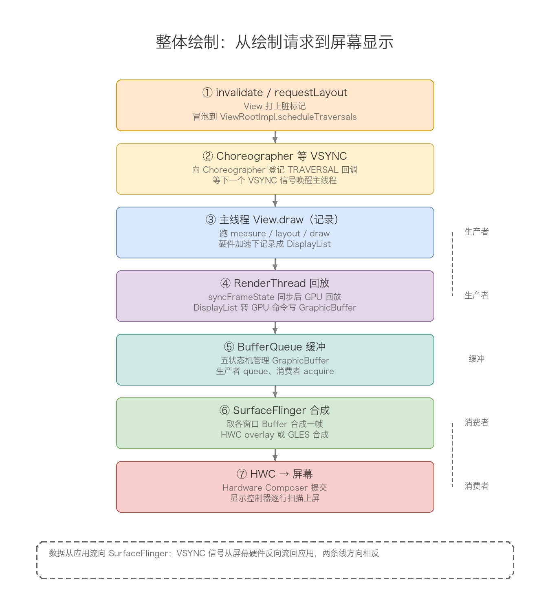

这张图中有四个关键角色：

| 阶段 | 主要角色 | 输出 | 关键问题 |
|------|----------|------|----------|
| 帧调度 | Choreographer | 本帧回调执行机会 | 什么时候画 |
| 应用绘制 | ViewRootImpl / 主线程 | View 的绘制命令或像素 | 这一帧画什么 |
| GPU 渲染 | RenderThread | 写好的 GraphicBuffer | 怎么把命令变成像素 |
| 系统合成 | SurfaceFlinger / HWC | 送往显示器的一帧 | 怎样叠加所有窗口 |

需要区分“准备一帧”和“显示一帧”。应用在本次 VSYNC 收到后开始准备的画面，通常不会立刻显示在本次扫描周期；应用渲染、系统合成、面板扫描是三段并行流水线，吞吐可以满帧，端到端延迟却会跨越多个周期。

### 1.2 用四个问题建立阅读坐标

整条链路看似涉及很多类，实际始终在回答四个问题。后面所有源码和图示都可以放回这四个位置理解。

| 问题 | 对应组件 | 本文位置 |
|------|----------|----------|
| 什么时候开始处理一帧 | VSYNC 信号链、Choreographer | 第二、三、四章 |
| 应用这一帧具体做什么 | Choreographer、ViewRootImpl、View、ThreadedRenderer | 第五章 |
| 画好的内容怎样交给系统 | Surface、GraphicBuffer、BufferQueue、Fence | 第七章 |
| 多个窗口怎样变成一张屏幕画面 | SurfaceFlinger、HWC、Display | 第八章 |

这四个问题的顺序就是实际数据路径。先有节拍，再有应用侧工作，之后才有跨进程 buffer 传递和系统合成。

## 二、VSYNC 与三缓冲原理

这一章只回答一个问题：显示硬件为什么不能在应用画完时立刻换画面。答案由两部分组成：VSYNC 规定“什么时候允许切换”，多缓冲规定“显示、CPU、GPU 分别在哪块内存上工作”。理解这一章，后面 Choreographer 的帧调度才有落点。

### 2.1 单缓冲为什么会撕裂

先分清两个速度：FPS 是生产者生成帧数据的速度；Refresh Rate 是显示面板扫描屏幕的固定频率。60Hz 的面板大约每 16.67ms 扫描一遍，120Hz 则约每 8.33ms。显示并不是一次把整张图贴到面板上，而是按固定方向逐行读取当前 FrameBuffer。

单缓冲意味着显示硬件与 CPU/GPU 同时访问同一块 FrameBuffer。只要“读”和“写”在时间上重叠，就可能出现画面撕裂。参考文章将撕裂拆成两类，本质都是这块内存没有在完整帧边界被安全交接：

1. 显示尚未扫描完旧帧 A，CPU/GPU 已将下半部分覆写为新帧 B；于是同一张屏幕上方来自 A、下方来自 B。
2. GPU 还在把 B 写入 FrameBuffer，显示设备就开始读取这块半成品；同样会把不同时间点的数据拼成一帧。

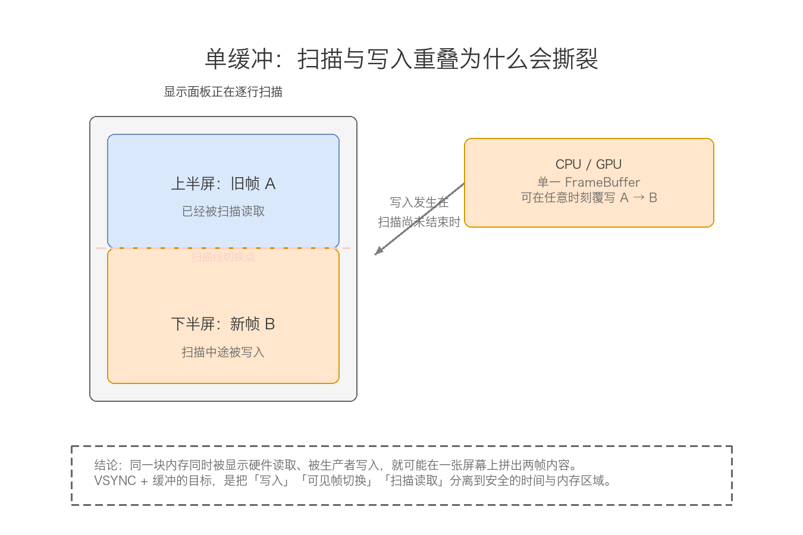

撕裂不是“GPU 太慢”的专属现象。GPU 很快但没有交接约束也会撕裂；真正的根因是显示硬件读取和生产者写入碰到了同一块内存。

### 2.2 VSYNC：把可见帧切换对齐到刷新边界

VSYNC（Vertical Synchronization）是显示刷新周期的同步信号。它的作用不是让业务代码每 16ms 必须跑完，而是为“哪一帧可以成为下一张可见画面”提供统一边界。

在一个周期内，显示控制器持续扫描当前 Front Buffer。接近一次扫描结束与下一次扫描开始之间的安全窗口时，系统才允许切换到准备完整的下一帧。若下一帧尚未准备好，就继续显示旧帧，而不是把半成品交给面板。

因此 VSYNC 带来了一个明确的取舍：

| 目标 | 没有统一帧边界 | 有 VSYNC 帧边界 |
|------|----------------|----------------|
| 画面完整性 | 可能读取到被写到一半的 buffer | 只切换完整帧，避免撕裂 |
| 帧率表现 | 生产者可任意提交，节奏不稳定 | 输出对齐刷新率，但慢帧会重复显示旧画面 |
| 资源调度 | CPU/GPU/UI 各自抢时间 | 整条管线以刷新周期作为共同节拍 |

所以 VSYNC 不是性能加速器。它解决的是显示正确性和节奏一致性；当生产者超时，用户会看到卡顿或跳帧，而不是撕裂。

### 2.3 VSYNC + 双缓冲：读写分离，page flip 交接

单靠 VSYNC 若仍只有一块 FrameBuffer，生产者在显示期间仍不能写它，CPU/GPU 会经常空等。双缓冲增加一块 Back Buffer：显示硬件只读取 Front Buffer，CPU/GPU 只写 Back Buffer，二者先在不同内存上并行。

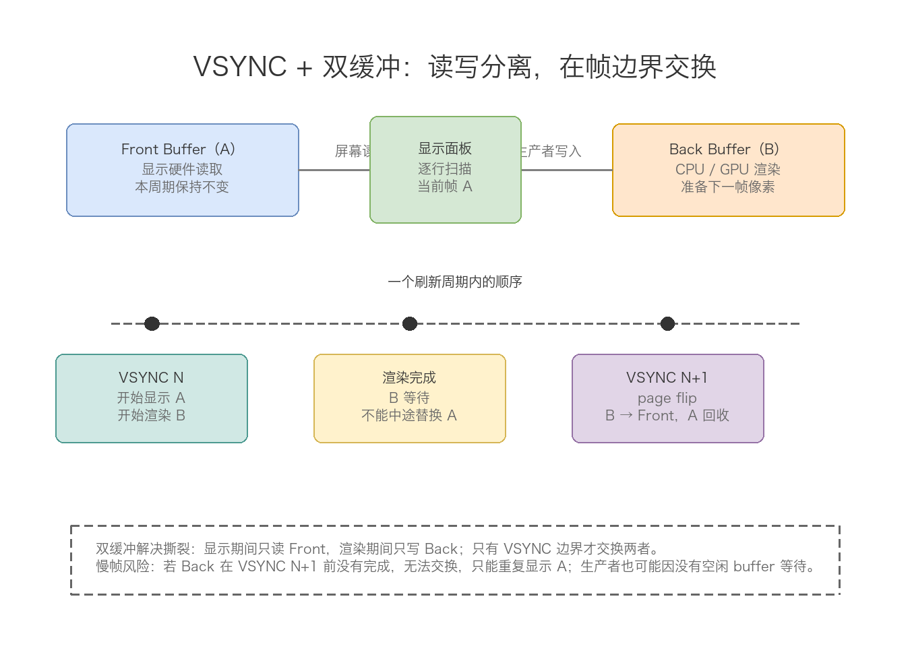

双缓冲的一帧交接可以按四步理解：

1. 周期 N 开始，显示硬件扫描 Front Buffer A；CPU/GPU 同时向 Back Buffer B 写下一帧。
2. B 完成后不能立刻替换 A，必须等待下一次 VSYNC 边界。
3. 到 VSYNC N+1，系统执行 page flip：B 成为新的 Front Buffer，A 从显示端回收。
4. 回收的 A 成为新的 Back Buffer，生产者继续准备后续帧。

这里的 page flip 可以理解成显示控制器切换“当前读取哪块 buffer”的引用，而不是把整张图逐像素拷贝到另一块内存。关键是 Front Buffer 在本周期保持稳定、Back Buffer 在本周期独立写入，VSYNC 时才交换角色。

双缓冲与 VSYNC 的职责不同：

| 机制 | 解决什么 |
|------|----------|
| 双缓冲 | 将“显示读取”和“下一帧渲染”放到不同内存，允许读写并行 |
| VSYNC / page flip | 限制可见帧只在刷新边界切换，避免把未完成或正在扫描的内容显示出去 |

Android 4.1 的 Project Butter 将 VSYNC 从“最后显示阶段的交接信号”扩展为应用 UI 工作的统一节拍。也就是说，VSYNC 到达后不只用于最终 buffer 切换，应用侧的输入、动画、遍历也会被 Choreographer 统一安排到这个节拍附近；第三章先说明信号怎样抵达应用，第五章再展开 Choreographer 如何消费它。

### 2.4 双缓冲在慢帧时为什么会卡住

双缓冲在每一帧都按预算完成时延迟较低。但它只有两个可用 buffer：一个正在被显示端读取，另一个可能正在被 GPU 写入。只要 CPU 或 GPU 有一次超过帧预算，就会出现资源互相等待。

假设 60Hz 屏幕的一帧预算是 16.67ms。周期 N 中，A 正在显示，GPU 正在处理 B；若 B 到 VSYNC N+1 仍没完成：

1. 显示端不能切到 B，只能继续显示 A，用户看到一帧停顿。
2. A 仍被显示端占用，B 又仍被 GPU 占用；CPU 想准备下一帧时没有可写 buffer。
3. CPU 被迫等待 GPU 或显示端释放 buffer，原本可以并行的 CPU/GPU 退化为串行。
4. 如果复杂场景持续存在，这种等待会连锁扩散，表现为连续掉帧。

这就是参考文章强调的“双缓冲低延迟但慢帧下不够稳定”：它能保证正常路径高效，却没有给慢帧留下额外的生产空间。

### 2.5 三缓冲：为慢帧保留一块可继续生产的 buffer

三缓冲不是把一帧画得更快，而是在双缓冲出现资源争抢时，多提供一个可用 buffer，使显示、GPU、CPU 能继续并行。常见工作状态可以抽象为：

- A：显示硬件正在读取并扫描。
- B：GPU 正在渲染，或已完成并等待成为下一张可见帧。
- C：CPU 可以继续准备更后面一帧的绘制数据。

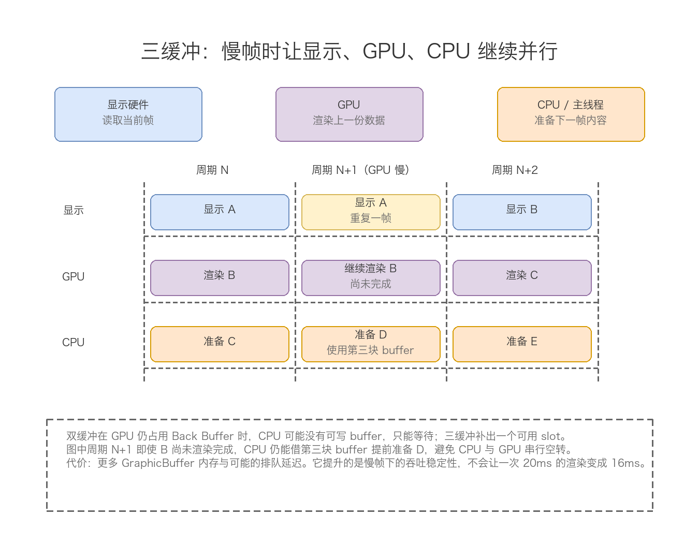

图中刻意展示了 GPU 慢帧。周期 N+1 即使 B 尚未完成，CPU 仍能使用第三块 buffer 继续准备 D，因此不会像双缓冲那样立刻空转。等 B 完成后，后续周期仍可以恢复流水线式推进。

三缓冲的收益与代价必须同时看：

| 维度 | 双缓冲 | 三缓冲 |
|------|--------|--------|
| 正常帧的延迟 | 较低 | 通常不需要额外等待，但可能多一层排队 |
| 慢帧下 CPU/GPU 并行 | 容易因 buffer 用尽而串行 | 可利用第三块 buffer 继续推进 |
| 连续掉帧风险 | 一次慢帧可能拖累后续 | 能把部分等待吸收在队列中，提高稳定性 |
| 内存与延迟成本 | 较低 | 多一块 GraphicBuffer，可能增加排队延迟 |

因此“三缓冲保证稳定性”不是说它消灭掉帧。若一帧渲染本身耗时 20ms，它仍会错过 16.67ms 的显示机会；三缓冲只是不让 CPU 因 GPU 的慢帧立即停工，从而提高后续帧恢复能力。

在 Android 的真实实现中，不应机械地理解为“系统永远固定三块 buffer”。Surface / BufferQueue 的 slot 数、当前队列深度、消费者策略和设备配置都会影响实际数量。三缓冲描述的是这种并行工作形态，具体的 buffer 生命周期会在第七章 BufferQueue 中展开。

本节关于撕裂、双缓冲慢帧阻塞与三缓冲并行的概念、时序表达参考用户提供的文章《Android VSYNC与图形系统中的撕裂、双缓冲、三缓冲浅析》：<https://juejin.cn/post/7125675253707046926>。正文与配图均按本仓库叙事重新组织、重新绘制。

## 三、垂直同步信号的工作原理

第二章解释了为什么显示系统需要 VSYNC 与缓冲。本章只回答一个核心问题：显示硬件的周期性节拍，怎样同时驱动应用产出新帧、SurfaceFlinger 合成窗口，并让两条链最终在显示器上形成连续画面。

理解 VSYNC 时不要把它看成“应用画一帧 → 系统立刻显示这一帧”的单线调用。Android 是多级流水线：应用、RenderThread、SurfaceFlinger、显示控制器在同一时间通常处理的是不同帧；VSYNC 负责给它们提供共同的时间坐标，Scheduler 再把这个坐标拆成不同参与者的工作窗口。

### 3.1 一个 VSYNC 如何驱动应用与 SurfaceFlinger 的整体工作

硬件 VSYNC 由显示控制器的扫描周期产生。60Hz 面板理想情况下每 16.67ms 进入一次新的刷新周期；这个周期是整条显示链的帧预算，而不是“Java 层必须在 16.67ms 内完成所有事情”的单一函数超时。

一次硬件节拍进入系统后，SurfaceFlinger Scheduler 会依据刷新周期和当前显示模式安排两类相关但错开的工作窗口：

1. App phase：让应用主线程处理输入、推进动画、执行 TRAVERSAL，并由 RenderThread 把内容画进应用 Surface 的 buffer。
2. SF phase：让 SurfaceFlinger 在应用 buffer 有机会完成后，latch 可用 buffer、合成所有 Layer，并提交给 HWC 或 GPU。

显示控制器随后扫描最终的合成结果。App phase 与 SF phase 都来自同一个显示节拍，却不在同一时间执行；这就是 phase offset 的意义。它避免“应用绘制”和“系统合成”在同一时刻争抢资源，也让它们能够并行处理不同帧。

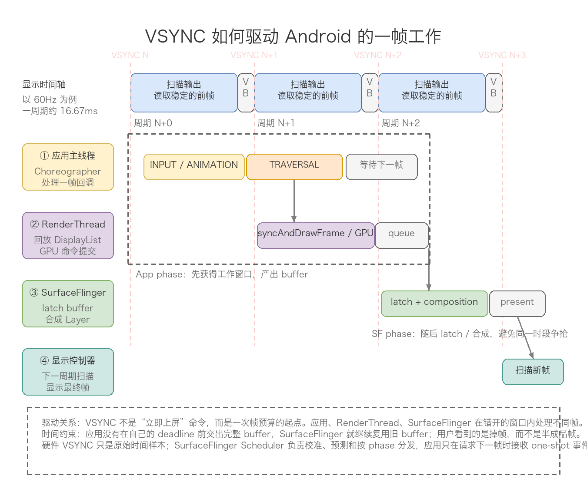

图中有三个必须建立的认识：

- VSYNC 是帧预算的起点，不是某一帧已经上屏的确认。
- App、RenderThread、SurfaceFlinger 与显示控制器是流水线阶段；它们可同时工作，但通常工作在不同帧上。
- 某一阶段错过自己的 deadline，后续阶段不会读取半成品，而是复用上一张已完成帧。用户因此看到卡顿，而不是撕裂。

例如，应用在 App phase 内没有交出完整 buffer，SurfaceFlinger 到自己的 SF phase 时仍会照常运行，但它只能继续使用该应用上一轮已完成的 buffer；其他窗口仍可正常合成，显示器也仍持续扫描。VSYNC 没有丢失，丢失的是“本周期可显示的新内容”。

### 3.2 应用侧：从请求下一次 VSYNC 到产出 buffer

应用并不默认接收每一次硬件 VSYNC。静止页面没有输入、动画或脏区时，主线程不需要以 60Hz 或 120Hz 醒来。因此 Android 使用 one-shot 请求模型：只有 Choreographer 发现当前帧有待执行的回调时，才请求下一次 VSYNC；收到这次事件并完成 `doFrame()` 后，后续若再次有工作，才继续请求。

一次典型的应用侧帧从 `invalidate()` 或 `requestLayout()` 开始。ViewRootImpl 会把遍历工作登记为 `CALLBACK_TRAVERSAL`；Choreographer 在需要时申请下一次 VSYNC。事件抵达主线程后，`doFrame()` 按 INPUT → ANIMATION → INSETS_ANIMATION → TRAVERSAL → COMMIT 的顺序消费回调，其中 TRAVERSAL 才会进入 `ViewRootImpl.performTraversals()`。

```java
// frameworks/base/core/java/android/view/Choreographer.java
// 版本化简化：一帧只申请一次 VSYNC
private void scheduleFrameLocked(long now) {
    if (mFrameScheduled) return;
    mFrameScheduled = true;
    mDisplayEventReceiver.scheduleVsync();
}

// FrameDisplayEventReceiver 收到信号后回到主线程
@Override
public void onVsync(long timestampNanos, long physicalDisplayId,
        int frame, VsyncEventData eventData) {
    mTimestampNanos = timestampNanos;
    mFrame = frame;
    Message msg = Message.obtain(mHandler, this);
    msg.setAsynchronous(true);
    mHandler.sendMessageAtTime(msg, timestampNanos / 1_000_000L);
}
```

这段路径说明了两个边界。第一，VSYNC 回调本身不是绘制，它只是把 `doFrame()` 放到主线程队列。第二，应用主线程完成 View 遍历后，在硬件加速场景也没有直接让像素上屏：主线程主要记录 DisplayList，RenderThread 再回放 GPU 命令，并通过 Surface / BufferQueue 提交一个完整 buffer。第五、六、七章会继续拆开这些阶段。

### 3.3 SurfaceFlinger 侧：在自己的 phase 中 latch、合成与 present

SurfaceFlinger 不会因为 App 收到 VSYNC 就同步等待它画完。它有自己的 SF phase，并在自己的工作窗口处理系统侧任务：收集 Layer 事务、从 BufferQueue latch 已完成的 buffer、计算可见区域与合成策略、交给 HWC 或 RenderEngine 合成，最后 present 到显示设备。

这里的 `latch` 是应用与系统合成之间最重要的边界。SurfaceFlinger 只会接收已经 `queueBuffer` 且 acquire fence 已满足的 GraphicBuffer；正在被 GPU 写入的半成品 buffer 不会被拿去合成。若本轮没有可用的新 buffer，SurfaceFlinger 就保留 Layer 的旧 buffer 继续合成。

```cpp
// frameworks/native/services/surfaceflinger/SurfaceFlinger.cpp
// 版本化示意：SF 帧信号到达后处理一轮合成
void SurfaceFlinger::onFrameSignal() {
    latchBuffers();           // 只接收已完成、Fence 满足的 buffer
    computeComposition();     // 计算 Layer、可见区域与 HWC/GPU 策略
    composeAndPresent();      // 合成并提交给显示管线
}
```

这条链解释了“应用掉一帧，为什么系统仍能稳定显示”：SurfaceFlinger 并不需要等所有 App 同时准备好。每个 Layer 都有各自最近一次完成的 buffer；某个应用慢时，只是该 Layer 暂时沿用旧内容，状态栏、动画窗口或其他应用 Layer 仍可能继续更新。

从全局看，一次屏幕刷新可能同时发生三件事：显示控制器扫描帧 N，SurfaceFlinger 合成帧 N+1，应用与 RenderThread 准备帧 N+2。它们共享同一个 VSYNC 节拍，却通过 phase、BufferQueue 和 Fence 解耦为并行流水线。

### 3.4 用 deadline 看懂正常帧、应用慢帧与系统慢帧

排查卡顿时，不能只看“有没有收到 VSYNC”，而要看每个参与者是否在自己的 deadline 前完成。下面三种情况可以区分常见问题：

| 场景 | App / RenderThread | SurfaceFlinger | 屏幕结果 | 优先排查 |
|------|--------------------|----------------|----------|----------|
| 正常帧 | 在 App deadline 前 queueBuffer | latch 新 buffer 后合成 | 显示新内容 | 无 |
| 应用慢帧 | 主线程、RenderThread 或 GPU 未及时完成 | 复用该 Layer 的旧 buffer | 该应用内容停一帧 | 主线程、RenderThread、GPU、过度绘制 |
| 系统合成慢帧 | 应用 buffer 已准备好 | 合成、HWC 或 present 超时 | 多 Layer 可能同时滞后 | SurfaceFlinger、HWC、系统图层、显示驱动 |

三缓冲在这条模型中的作用也更容易定位：它只是给生产侧额外的 buffer 空间，降低一次慢帧把 CPU/GPU 立即拖入串行等待的概率；它不会改变 VSYNC 周期，也不会让已经超时的渲染凭空赶上 deadline。

本章的结论可以压缩为一句话：VSYNC 由显示硬件提供真实帧基准，SurfaceFlinger 将它组织成 App 与 SF 错峰的工作窗口；应用按需申请一次信号产出 buffer，SurfaceFlinger 独立地选择已完成 buffer 合成，显示端持续扫描最近一次成功 present 的完整帧。这样，整条链既能并行，又不会显示半成品。

## 四、垂直同步信号的产生和派发过程

第三章解释的是 VSYNC 如何作为共同帧时钟，让应用产帧和 SurfaceFlinger 合成形成错峰流水线。本章只沿着 App 路径继续下钻：硬件时间样本如何经过 HWC、Scheduler、EventThread、BitTube 和 native Looper，最终到达 `Choreographer.FrameDisplayEventReceiver.onVsync()`。

本章不试图罗列不同 Android 版本所有 Scheduler 类名。源码分析只抓四个不变的重点：硬件样本从哪里来、谁决定派发时间、为什么应用按需接收、事件怎样跨进程进入 Java 主线程。

### 4.1 先建立路径：硬件样本、派发事件与应用回调不是同一件事

一次 App VSYNC 回调经历了三种不同性质的对象：HWC 产生的是硬件时间样本；Scheduler 根据样本和 phase 产生“何时该通知 App”的调度决定；EventThread 发送的才是应用连接可以读取的 VSYNC Event。最后，`DisplayEventReceiver` 才把这个 Event 变成 Java 的 `onVsync()` 回调。

先看完整职责链。它强调每一段组件只承担一次转换：硬件负责报时，系统服务负责校准和定时派发，应用侧负责将 fd 事件切回 UI 线程。

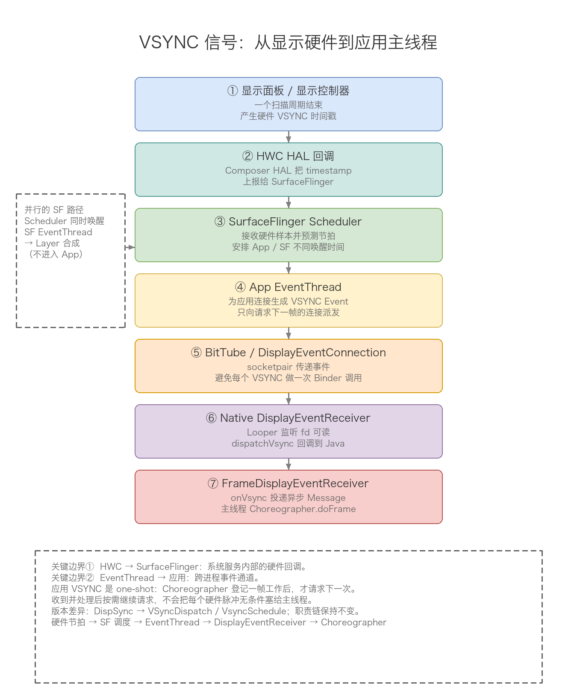

再把视角收窄到 App 订阅路径。下图两条虚线框对应两个进程边界：系统服务进程负责接收硬件节拍和管理订阅；应用进程只持有自己的事件接收 fd，并不知道其他应用是否也请求了 VSYNC。这样的拆分避免了把高频硬件事件直接变成每帧 Binder 调用。

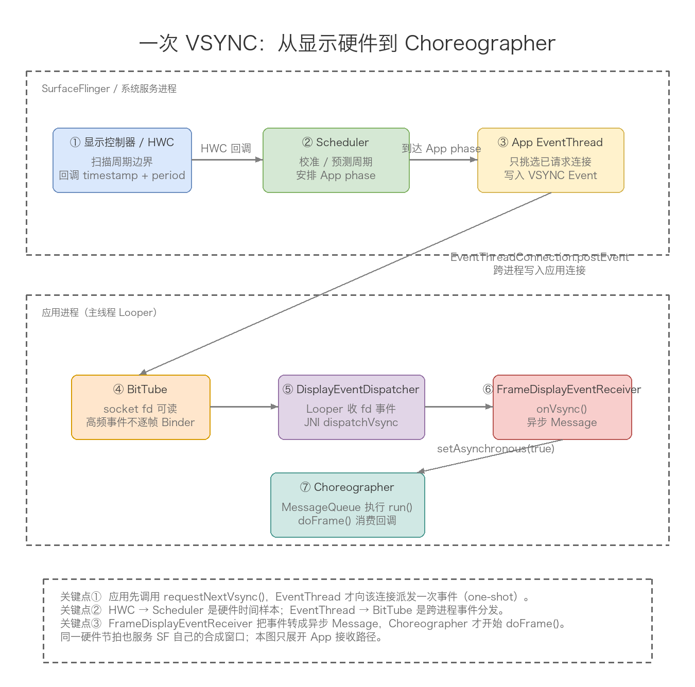

### 4.2 硬件 VSYNC：HWC 把显示时间样本交给 SurfaceFlinger

显示控制器到达刷新边界时，经由 Hardware Composer HAL（HWC）把 `displayId`、`timestamp` 和刷新周期交给 SurfaceFlinger。HWC HAL 的接口在 HWC2、AIDL Composer 等版本间会变化，但回调的输入与职责稳定：报告“某块 display 在何时发生了一个真实的硬件 VSYNC”。

```cpp
// frameworks/native/services/surfaceflinger/DisplayHardware/HWComposer.cpp
// 版本化简化：突出 HWC 回调向 SurfaceFlinger 转交时间样本
class ComposerCallbackBridge : public hal::ComposerCallback {
public:
    void onVsync(hal::HWDisplayId displayId,
                 int64_t timestamp,
                 hal::VsyncPeriodNanos period) override {
        mCallback->onComposerHalVsync(displayId, timestamp, period);
    }
};
```

这一层还没有应用概念。它不关心某个 View 是否 `invalidate()`，也不直接调用 `Choreographer`；它只是让系统服务获得可靠的物理刷新时间基准。刷新率切换、面板抖动、显示器重连等问题也首先体现在这类硬件样本上。

### 4.3 Scheduler：从硬件样本计算 App 的下一次可用帧机会

SurfaceFlinger Scheduler 接到硬件样本后，会校准当前 display 的周期模型，并根据 App 的 phase offset 计算下一次应用帧回调的时间。早期实现常见 `DispSync` / `DispSyncSource`；新版本可看到 `VSyncTracker`、`VSyncDispatch`、`VsyncSchedule` 等类型。学习时应抓住下面这条稳定职责，而不要死记某个分支的成员字段。

```cpp
// frameworks/native/services/surfaceflinger/SurfaceFlinger.cpp
// 版本化伪代码：硬件样本进入 Scheduler，Scheduler 决定后续回调时机
void SurfaceFlinger::onComposerHalVsync(DisplayId displayId,
                                        nsecs_t timestamp,
                                        nsecs_t period) {
    mScheduler->addResyncSample(displayId, timestamp, period);
    mScheduler->onHardwareVsync(displayId, timestamp, period);
}
```

`addResyncSample()` 的意义是用真实样本校准模型，`onHardwareVsync()` 的意义是推进本周期的调度。系统不必机械地将每个硬件中断逐一转发给每个 App；它能依据模型预测下一次机会，并为 App 与 SurfaceFlinger 分别设置错开的 deadline。第三章中的 App phase / SF phase，就是在这里被落实为具体调度时间的。

### 4.4 EventThread：只给请求过下一帧的应用连接派发事件

Choreographer 有帧任务时，会经 native `DisplayEventReceiver` 向 `IDisplayEventConnection` 请求下一次 VSYNC。服务端的具体实现是 `EventThreadConnection`；它把请求登记到 App EventThread。等 Scheduler 给出的 App phase 到达时，EventThread 只遍历这些已请求的连接并发送 Event。

这里的“Choreographer 注册”不是在应用启动时向 SurfaceFlinger 注册一个永久回调，而是每当本轮出现待执行帧任务时，才主动登记一次下一帧请求。触发入口通常来自 `postCallback()`：例如 `ViewRootImpl.scheduleTraversals()` 登记 `CALLBACK_TRAVERSAL`，Choreographer 发现本帧尚未排期，就调用 `scheduleFrameLocked()`。

```java
// frameworks/base/core/java/android/view/Choreographer.java
// 版本化简化：待执行回调出现后，只为本帧申请一次 VSYNC
private void scheduleFrameLocked(long now) {
    if (mFrameScheduled) return;
    mFrameScheduled = true;             // 合并同一帧中的重复请求
    mDisplayEventReceiver.scheduleVsync();
}

private final class FrameDisplayEventReceiver extends DisplayEventReceiver {
    public void scheduleVsync() {
        nativeScheduleVsync(mReceiverPtr);
    }
}
```

`mFrameScheduled` 是防重开关。一个刷新周期内可以有多次 `invalidate()`、动画回调或输入事件，但它们只会合并为一次 `scheduleVsync()`；否则主线程会为同一个显示机会重复申请事件。`nativeScheduleVsync()` 之后的链路不再属于 Java：JNI 找到当前进程的 `DisplayEventDispatcher`，由它向 native `DisplayEventReceiver` 发起请求。

```cpp
// frameworks/base/core/jni/android_view_DisplayEventReceiver.cpp
static void nativeScheduleVsync(JNIEnv*, jclass, jlong receiverPtr) {
    auto* receiver = reinterpret_cast<NativeDisplayEventReceiver*>(receiverPtr);
    receiver->scheduleVsync();
}

// frameworks/native/libs/gui/DisplayEventDispatcher.cpp
void DisplayEventDispatcher::scheduleVsync() {
    mReceiver.requestNextVsync();
}

// frameworks/native/libs/gui/DisplayEventReceiver.cpp
status_t DisplayEventReceiver::requestNextVsync() {
    return mEventConnection->requestNextVsync(); // Binder 到 SF
}
```

最后一行才跨进程进入 SurfaceFlinger。这里还要区分“连接创建”和“请求下一次 VSYNC”两个时机：`mEventConnection` 不是每次 `scheduleVsync()` 才临时创建，而是在当前 Looper 首次创建 `Choreographer` 时就建立好，后续每帧只复用它做 one-shot 请求。

以主线程为例，`ViewRootImpl` 初始化时会获取 `Choreographer.getInstance()`；`Choreographer` 是 `ThreadLocal` 单例，当前线程第一次调用 `getInstance()` 才构造自己的实例。构造函数会创建 `FrameDisplayEventReceiver`，其父类 `DisplayEventReceiver` 随即执行 `nativeInit()`。native 侧构造 `NativeDisplayEventReceiver` / `DisplayEventDispatcher` 时，会通过 `SurfaceComposerClient` 向 SurfaceFlinger 创建一个 App VSYNC 连接。

```java
// frameworks/base/core/java/android/view/Choreographer.java
// 每个带 Looper 的线程首次取实例时，创建自己的帧事件接收器
private Choreographer(Looper looper, int vsyncSource) {
    mLooper = looper;
    mHandler = new FrameHandler(looper);
    mDisplayEventReceiver = new FrameDisplayEventReceiver(looper, vsyncSource);
}

private final class FrameDisplayEventReceiver extends DisplayEventReceiver {
    FrameDisplayEventReceiver(Looper looper, int vsyncSource) {
        super(looper, vsyncSource, 0); // 父类构造中调用 nativeInit()
    }
}
```

`nativeInit()` 完成的是一次性的“建链”工作：

```text
Choreographer.getInstance（当前 Looper 第一次）
  → new FrameDisplayEventReceiver
  → DisplayEventReceiver.nativeInit
  → NativeDisplayEventReceiver / DisplayEventDispatcher
  → SurfaceComposerClient.createDisplayEventConnection（Binder）
  → SurfaceFlinger / Scheduler 创建 EventThreadConnection
  → stealReceiveChannel：应用拿到 BitTube 读端 fd
  → Looper.addFd：等待后续 VSYNC Event
```

因此 `mEventConnection` 是这条长期存在的连接的 Binder 代理，服务端实现是 `EventThreadConnection`；它同时配套一条已建立的 BitTube 数据通道。创建连接的 Binder 调用只发生在接收器初始化阶段，后续 `requestNextVsync()` 只是沿用 `mEventConnection` 登记下一次事件；EventThread 的 `postEvent()` 则写入已经交给应用的 BitTube 通道。这样把低频的“创建 / 登记”控制操作与高频的 VSYNC 数据派发分开，避免每帧重新建连接或经 Binder 回传事件。

需要补充的是，Choreographer 是线程级对象而不是进程全局单例：主线程或其他显式创建了 Looper 并调用 `Choreographer.getInstance()` 的应用线程，都可以各自创建一个 `DisplayEventReceiver`，并各自拥有 `mEventConnection`。本文后续讨论的 `ViewRootImpl` 与 UI 绘制，默认指主线程上的 App VSYNC 连接；native RenderThread 不属于这条 Java `Choreographer` 注册链。

因此整条注册链可以概括为：

```text
ViewRootImpl.scheduleTraversals / 动画 postCallback
  → Choreographer.scheduleFrameLocked
  → FrameDisplayEventReceiver.scheduleVsync
  → nativeScheduleVsync / DisplayEventDispatcher
  → DisplayEventReceiver.requestNextVsync
  → IDisplayEventConnection.requestNextVsync（Binder）
  → EventThreadConnection.requestNextVsync
```

这条 Binder 调用只用于登记“下一次需要事件”；真正的高频 VSYNC Event 会在后续由 BitTube fd 传回应用，而不是再走一次 Binder。下面的服务端代码正是这条注册链的终点。

```cpp
// frameworks/native/services/surfaceflinger/Scheduler/EventThread.cpp
// 版本化简化：请求一次，派发一次
status_t EventThreadConnection::requestNextVsync() {
    mEventThread->requestNextVsync(this);
    return NO_ERROR;
}

void EventThread::dispatchVsync(nsecs_t timestamp) {
    for (const auto& connection : requestedConnections) {
        connection->postEvent(timestamp);
    }
}
```

这是 one-shot 模型的服务端实现。`requestNextVsync()` 不是订阅一个永久 60Hz/120Hz 定时器，而是申请一个未来事件；`postEvent()` 完成后，该连接需要在下一帧确有任务时再次请求。空闲页面因此不会因硬件刷新持续唤醒主线程。

需要区分两类 EventThread：App EventThread 面向应用连接，服务的是 Choreographer；SF EventThread / SurfaceFlinger 自己的帧回调服务的是合成工作。两者共享同一个硬件时间基准，但 phase、消费者和后续工作完全不同。

### 4.5 BitTube 与 native Looper：高频事件通过 fd 进入应用进程

建立 `DisplayEventConnection` 时会用一次 Binder 完成服务发现、权限校验和连接创建；但后续每个 VSYNC Event 不走 Binder。`BitTube` 提供一对 socket fd：EventThreadConnection 在系统服务侧写入 Event，应用 native 侧把读端注册到自己的 Looper。fd 变为可读时，`DisplayEventDispatcher` 取出 Event 并调用 `dispatchVsync()`。

```cpp
// frameworks/native/libs/gui/DisplayEventDispatcher.cpp
int DisplayEventDispatcher::handleEvent(int events, void*) {
    DisplayEventReceiver::Event event;
    while (mReceiver.getEvents(&event, 1) > 0) {
        if (event.header.type == DisplayEventReceiver::DISPLAY_EVENT_VSYNC) {
            dispatchVsync(event.header.timestamp, event.header.id,
                          event.vsync.count);
        }
    }
    return 1;
}
```

这段代码的关键不在循环本身，而在进程切换后的唤醒方式：跨进程高频事件通过 fd 可读通知进入应用 Looper，而非为每帧创建一次 Binder 事务。它把事件数据带进应用进程，却仍没有进入 Choreographer 的回调队列。

### 4.6 JNI 到 FrameDisplayEventReceiver：VSYNC 最终抵达编舞者

`DisplayEventDispatcher.dispatchVsync()` 会经 JNI 调 Java `DisplayEventReceiver.dispatchVsync()`，再分派给子类覆写的 `onVsync()`。Choreographer 使用的子类是 `FrameDisplayEventReceiver`。它不在 native 回调栈里立即执行绘制，而是保存时间戳、封装异步 Message，并投递回主线程 MessageQueue。

```java
// frameworks/base/core/java/android/view/Choreographer.java
private final class FrameDisplayEventReceiver extends DisplayEventReceiver
        implements Runnable {
    @Override
    public void onVsync(long timestampNanos, long physicalDisplayId,
            int frame, VsyncEventData eventData) {
        mTimestampNanos = timestampNanos;
        mFrame = frame;
        Message msg = Message.obtain(mHandler, this);
        msg.setAsynchronous(true);
        mHandler.sendMessageAtTime(msg, timestampNanos / 1_000_000L);
    }

    @Override
    public void run() {
        doFrame(mTimestampNanos, mFrame, mLastVsyncEventData);
    }
}
```

`setAsynchronous(true)` 让这条帧消息可以越过 `ViewRootImpl.scheduleTraversals()` 设置的同步屏障，保证绘制调度不会被普通同步消息堵住。`run()` 调到 `doFrame()` 的那一刻，VSYNC 才真正成为 Choreographer 的一帧任务入口；下一章再分析 `doFrame()` 怎样安排 INPUT、ANIMATION、TRAVERSAL 与 COMMIT。

本章的整条重点链可以压缩为：

```text
显示控制器 → HWC callback → SurfaceFlinger Scheduler
→ App EventThread / EventThreadConnection → BitTube fd
→ native DisplayEventDispatcher → JNI → FrameDisplayEventReceiver.onVsync()
→ 异步 Message → Choreographer.doFrame()
```

其中前半段解决“何时、向谁派发”，后半段解决“如何安全进入应用主线程”。真正的 View 遍历和绘制仍由 Choreographer 的 `doFrame()` 消费回调后触发，而非在 HWC 回调到来的瞬间直接执行。

## 五、应用侧一帧的执行：从重绘请求到 ThreadedRenderer

这一章不按类名介绍组件，而是严格按时间顺序走一次应用帧：业务状态变化先怎样被合并，VSYNC 到来后怎样进入 `doFrame()`，`TRAVERSAL` 怎样进入 `performTraversals()`，最后怎样落到 `ThreadedRenderer.draw()`。第六章从这个入口继续拆解 DisplayList 和 RenderThread。

### 5.1 第 0 步：业务只改变状态，不直接开始绘制

一帧的起点通常不是 Choreographer，而是 View 状态变化。`invalidate()` 表示内容区域失效，`requestLayout()` 表示尺寸或位置可能不再正确，属性动画或窗口变化也会要求下一帧更新。它们共同的特点是：先积累状态，不能在调用点立即递归测量、布局和绘制。

原因很直接：一次点击可能同时改变多个 View，动画也可能在一个 Looper 周期里连续修改多个属性。每次修改都立刻 draw 会造成重复遍历，并破坏“所有状态在同一帧统一提交”的语义。因此 View 系统把请求一路上传到 `ViewRootImpl`，由根节点决定是否需要安排一次 traversal。

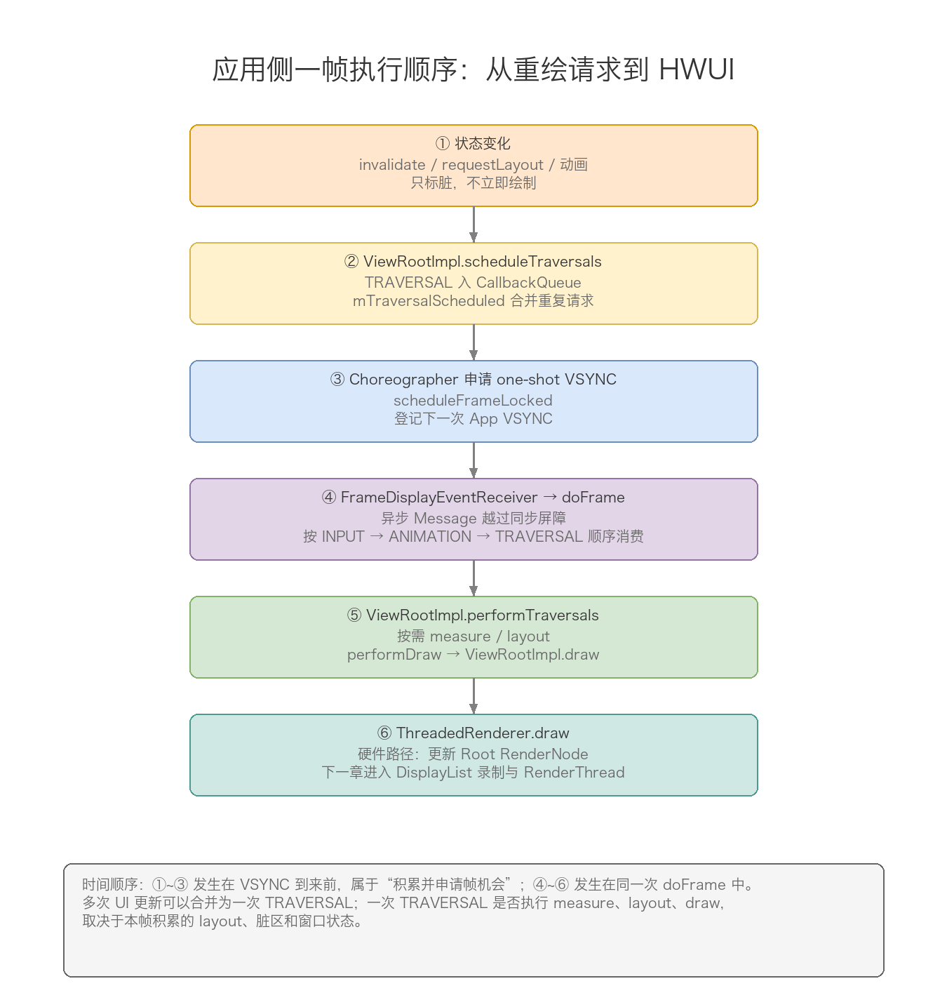

图中第 ①~③ 步发生在 VSYNC 到来之前，解决“把这一帧要做什么积累起来、何时申请帧机会”；第 ④~⑥ 步发生在一次 `doFrame()` 中，解决“拿到帧机会后按什么顺序执行”。后续所有源码都可放回这条时间线理解。

### 5.2 第 1 步：`scheduleTraversals()` 把多次请求收敛为一个 TRAVERSAL

`ViewRootImpl.scheduleTraversals()` 是应用 View 树的合帧入口。它不直接调用 `performTraversals()`，而是向 Choreographer 的 `CALLBACK_TRAVERSAL` 队列登记 `mTraversalRunnable`；如果本轮已经登记过，就什么也不做。

```java
// frameworks/base/core/java/android/view/ViewRootImpl.java，逻辑简化
void scheduleTraversals() {
    if (!mTraversalScheduled) {
        mTraversalScheduled = true;
        mTraversalBarrier = mHandler.getLooper().getQueue().postSyncBarrier();
        mChoreographer.postCallback(
                Choreographer.CALLBACK_TRAVERSAL, mTraversalRunnable, null);
    }
}
```

调用前，可能已有多个 View 的 dirty flag、layout request 或窗口状态变更；调用后只有两项关键状态：

| 状态 | 含义 | 后续谁消费 |
|------|------|------------|
| `mTraversalScheduled = true` | 本 ViewRoot 已有一轮 traversal 在排队，后续请求可合并 | `doTraversal()` |
| `mTraversalRunnable` 已入 `CALLBACK_TRAVERSAL` | 本帧必须在遍历阶段执行 ViewRoot 工作 | `Choreographer.doFrame()` |

同步屏障同时被插入 MessageQueue。它不会让正在运行的耗时任务消失；它只保证主线程重新空闲后，VSYNC 对应的异步帧消息不会被普通同步 Message 再次排到后面。

### 5.3 第 2 步：Choreographer 合并回调并请求下一次 VSYNC

`postCallback()` 会把 `mTraversalRunnable` 包装为带 `dueTime` 的 `CallbackRecord` 放入 `CallbackQueue`。Choreographer 再通过 `mFrameScheduled` 把 INPUT、ANIMATION、TRAVERSAL 等不同来源的任务合并为一次 one-shot VSYNC 申请。

```java
// frameworks/base/core/java/android/view/Choreographer.java，逻辑简化
private void postCallbackDelayedInternal(int type, Object action,
        Object token, long delayMillis) {
    synchronized (mLock) {
        long dueTime = SystemClock.uptimeMillis() + delayMillis;
        mCallbackQueues[type].addCallbackLocked(dueTime, action, token);
        if (dueTime <= SystemClock.uptimeMillis()) {
            scheduleFrameLocked(SystemClock.uptimeMillis());
        } else {
            scheduleCallbackLocked(type, dueTime);
        }
    }
}

private void scheduleFrameLocked(long now) {
    if (!mFrameScheduled) {
        mFrameScheduled = true;
        mDisplayEventReceiver.scheduleVsync();
    }
}
```

这里的输出不是“已经开始绘制”，而是“当前 Looper 线程向 SurfaceFlinger 订阅下一次 App VSYNC”。注册链会复用第四章已经建立的长期 `mEventConnection`：

```text
ViewRootImpl.scheduleTraversals
→ Choreographer.postCallback(CALLBACK_TRAVERSAL)
→ scheduleFrameLocked
→ FrameDisplayEventReceiver.scheduleVsync
→ nativeScheduleVsync
→ mEventConnection.requestNextVsync
→ EventThreadConnection.requestNextVsync
```

这一步是 one-shot：服务端只记录“这个连接需要下一次 App phase 的 VSYNC”。随后高频事件通过 BitTube fd 回到应用，具体跨进程派发机制已经在第四章展开；第五章从事件抵达主线程后继续。

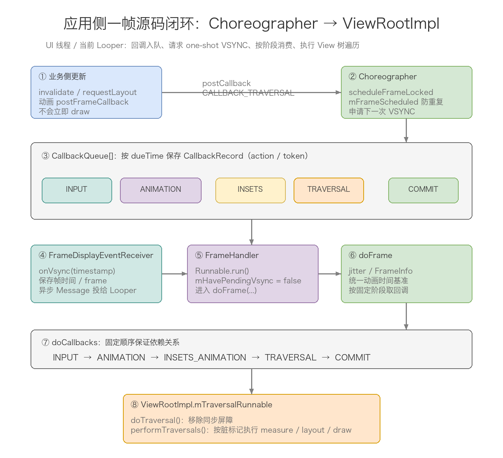

### 5.4 第 3 步：VSYNC 消息进入 `doFrame()`，统一消费本帧工作

`FrameDisplayEventReceiver.onVsync()` 收到 native 事件后，并不在回调栈内直接遍历 View 树。它保存 VSYNC 时间戳，投递一条 asynchronous Message；当 UI Looper 取出这条消息时，`run()` 才调用 `doFrame()`。这样 View 树始终由所属 UI Thread 访问。

```java
// frameworks/base/core/java/android/view/Choreographer.java，逻辑简化
void doFrame(long frameTimeNanos, int frame) {
    if (!mFrameScheduled) return;       // 过期事件不重复消费
    mFrameScheduled = false;

    doCallbacks(CALLBACK_INPUT, frameTimeNanos);
    doCallbacks(CALLBACK_ANIMATION, frameTimeNanos);
    doCallbacks(CALLBACK_INSETS_ANIMATION, frameTimeNanos);
    doCallbacks(CALLBACK_TRAVERSAL, frameTimeNanos);
    doCallbacks(CALLBACK_COMMIT, frameTimeNanos);
}
```

`frameTimeNanos` 是本帧统一时间基准。动画、回调和遍历使用同一 VSYNC 对应时间，而不是各自读取“当前时间”，因此同帧动画可以保持一致。回调顺序也不能交换：输入先更新状态，动画再推进属性，Insets 更新影响布局，TRAVERSAL 使用最终状态生成画面，COMMIT 最后收尾。

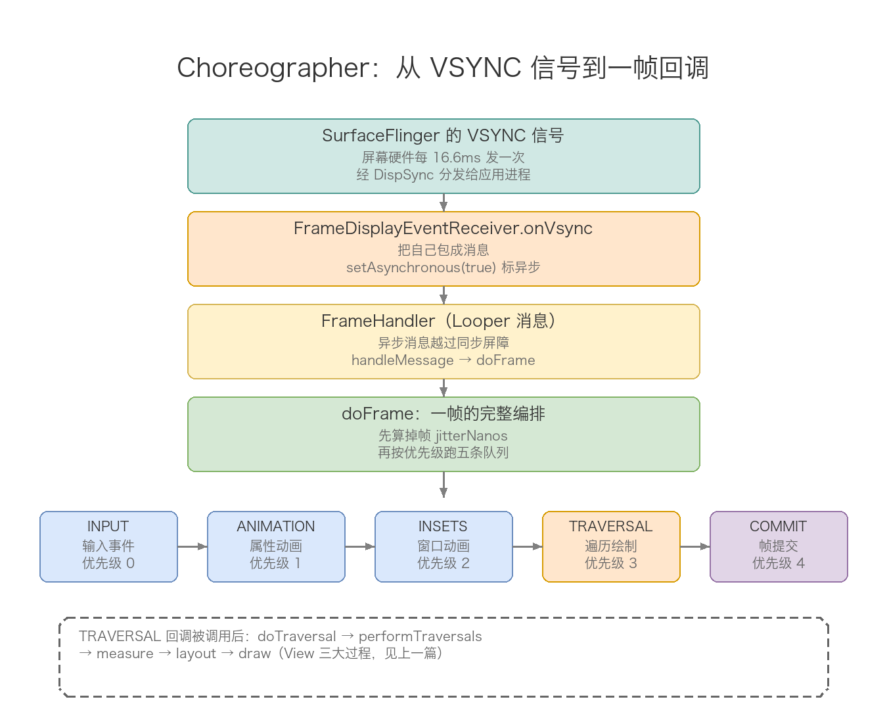

图中五条队列从上到下对应 `doFrame()` 的消费顺序；第五章真正关心的是其中的 TRAVERSAL：它拿到的是第五章第 1 步登记的 `mTraversalRunnable`，并在下一节进入 ViewRootImpl。

如果主线程此前被 Binder、GC、锁竞争或同步 IO 占住，`doFrame()` 实际开始时间晚于 `frameTimeNanos`。二者差值就是 jitter；超过一个刷新周期时，Choreographer 计算跳过帧数。VSYNC 仍会持续到来，但错过 deadline 的这一帧只能让系统继续使用旧 buffer。

### 5.5 第 4 步：TRAVERSAL 进入 `performTraversals()`，按需消费 View 树状态

当 `doCallbacks(CALLBACK_TRAVERSAL)` 取到第五章前面登记的 `mTraversalRunnable`，调用链进入 `ViewRootImpl.doTraversal()`。此时它清除合并标记、移除同步屏障，然后调用 `performTraversals()` 真正消费本帧积累的 View 树和窗口状态。

```java
// frameworks/base/core/java/android/view/ViewRootImpl.java，逻辑简化
void doTraversal() {
    if (mTraversalScheduled) {
        mTraversalScheduled = false;
        mHandler.getLooper().getQueue().removeSyncBarrier(mTraversalBarrier);
        performTraversals();
    }
}
```

`performTraversals()` 不是无条件的“measure → layout → draw”固定三连。它会读取这一帧此前积累的状态，如 `mLayoutRequested`、Insets、窗口 frame / Surface 是否变化、`mFullRedrawNeeded`、`mWindowAttributesChanged` 等，再决定哪些阶段需要执行。

| 调用前积累的状态 | `performTraversals()` 通常做什么 | 结果 |
|------------------|----------------------------------|------|
| 仅内容失效 | 跳过不必要的 measure/layout，进入 draw | 重录或重画脏内容 |
| layout request / 尺寸变化 | measure → layout，随后 draw | 得到新的 View 几何关系与画面 |
| 窗口、Insets、Surface 变化 | 可能 relayoutWindow，更新 Surface / frame，再遍历绘制 | View 树与系统窗口状态对齐 |
| 无可绘制输出或同步条件不满足 | 延后 / 跳过本次 draw | 保留旧 buffer，等待下一帧机会 |

因此优化中“减少 requestLayout”的本质是减少上表中会扩大到整棵树的几何计算；而局部 `invalidate()` 往往只让硬件管线重录部分 RenderNode。

### 5.6 第 5 步：`performDraw()` 选择软件或硬件路径

当本轮 traversal 确认需要输出画面，`performDraw()` 最终会走 `ViewRootImpl.draw()`。这里才出现软件与硬件的分岔：两条路线都从同一棵 View 树出发，但主线程产物不同。

```java
// ViewRootImpl 绘制路径，职责简化
void draw(boolean fullRedrawNeeded) {
    if (mAttachInfo.mThreadedRenderer != null
            && mAttachInfo.mThreadedRenderer.isEnabled()) {
        mAttachInfo.mThreadedRenderer.draw(mView, mAttachInfo, this);
    } else {
        drawSoftware(mSurface, mView, fullRedrawNeeded);
    }
}
```

| 路线 | 主线程 Canvas | 此刻的产物 | 下一跳 |
|------|---------------|------------|--------|
| 软件绘制 | 直接面向 Surface buffer 的 Canvas | CPU 已写好的像素 | `unlockCanvasAndPost()` → BufferQueue |
| 硬件加速 | `RecordingCanvas` | RenderNode / DisplayList 树 | `ThreadedRenderer.draw()` → native HWUI |

至此第五章的执行顺序结束。软件路径可以直接提交 buffer；硬件路径刚刚进入“记录阶段”，还没有产生最终像素。第六章从 `ThreadedRenderer.draw()` 开始，沿着实际调用顺序解释 DisplayList 如何形成、如何交给 RenderThread、何时真正写入 GraphicBuffer。

## 六、HWUI：从录制到回放

第五章结束时，ViewRootImpl 已确定本帧走硬件路径。接下来的工作可以收拢为一条连续链路：UI Thread 先把 View 树录制为 RenderNode / DisplayList 树，再把这棵树交给 RenderThread 同步、回放，最终写入当前 GraphicBuffer。本章按这条链路推进，不再按零散组件拆分。

### 6.1 建立本帧绘制树

硬件绘制先从 `ThreadedRenderer.draw()` 进入窗口根节点，再向下检查 View 树中哪些节点需要更新。此阶段的产物是完整、可同步的 RenderNode 树；还没有产生任何 GPU 像素。

**先从窗口根节点开始。**

进入 `ThreadedRenderer.draw()` 时，UI Thread 已完成本轮 `performTraversals()`：View 的尺寸、位置、脏标记都已稳定；`ViewRootImpl` 将根 View、窗口 insets 和帧时序信息交给 ThreadedRenderer。此时还没有向 GPU 写像素。

```java
// frameworks/base/core/java/android/view/ThreadedRenderer.java，逻辑简化
void draw(View view, AttachInfo attachInfo, HardwareDrawCallbacks callbacks) {
    updateRootDisplayList(view, callbacks);      // ① UI Thread：建立本帧 RenderNode 树

    long[] frameInfo = mChoreographer.getFrameInfo();
    int result = nSyncAndDrawFrame(
            mNativeProxy, frameInfo, frameInfo.length); // ② 进入 native HWUI

    if ((result & SYNC_INVALIDATE_REQUIRED) != 0) {
        attachInfo.mViewRootImpl.invalidate();
    }
}
```

该方法的两个调用按严格先后关系执行：先完成 `updateRootDisplayList()`，使 native RenderNode 树拥有一致的本帧内容描述；再进入 `nSyncAndDrawFrame()`。因此 6.1~6.3 都属于 UI Thread 的建树与录制阶段，6.4 才跨越 JNI / 线程边界。

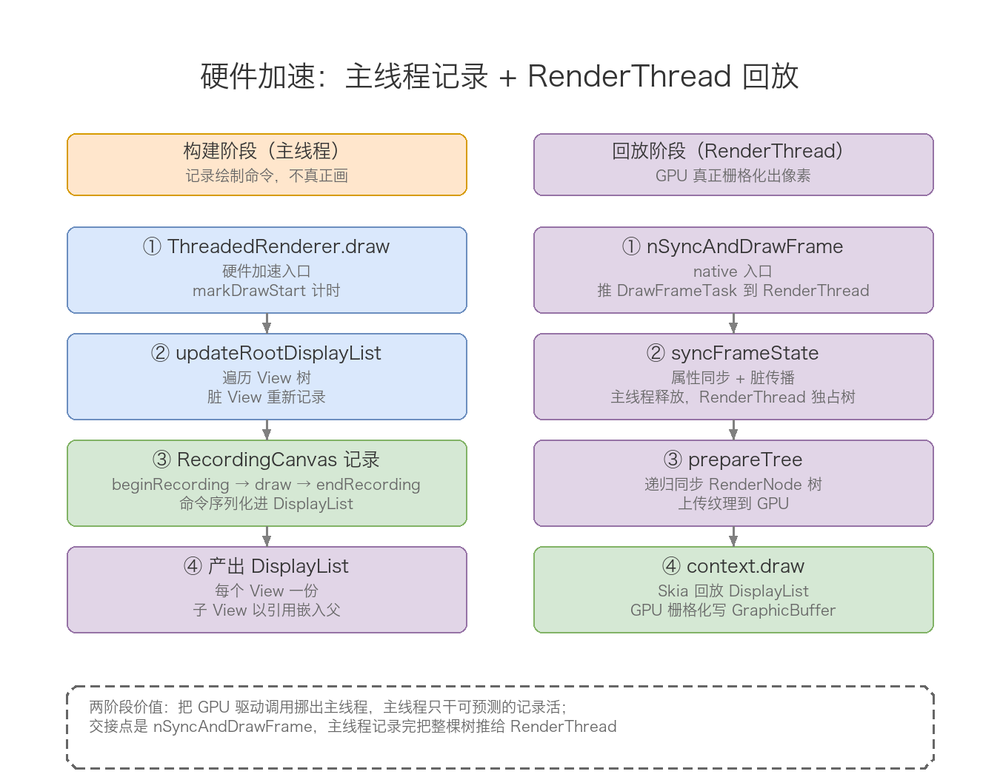

**根节点如何挂入 View 树。**

`updateRootDisplayList()` 紧接在 `ThreadedRenderer.draw()` 之后执行。它不创建窗口 buffer，而是沿 View 树更新 DisplayList：已有有效 DisplayList 且内容未失效的节点可以复用；无 DisplayList 或被标记为需要重建的节点才进入 `updateDisplayListIfDirty()`。

```java
// ThreadedRenderer.updateRootDisplayList，逻辑简化
private void updateRootDisplayList(View view, HardwareDrawCallbacks callbacks) {
    updateViewTreeDisplayList(view);             // 递归更新脏节点

    RecordingCanvas canvas = mRootNode.beginRecording(mSurfaceWidth, mSurfaceHeight);
    try {
        canvas.translate(mInsetLeft, mInsetTop);
        callbacks.onHardwarePreDraw(canvas);
        canvas.insertReorderBarrier();
        canvas.drawRenderNode(view.updateDisplayListIfDirty());
        canvas.insertInorderBarrier();
        callbacks.onHardwarePostDraw(canvas);
    } finally {
        mRootNode.endRecording();
    }
}
```

调用前，View 的 invalidation 已被第五章的 traversal 收集；调用后，`mRootNode` 成为窗口级入口，引用根 View 的 RenderNode。注意 `mRootNode` 不会把全部子节点命令拷贝进一份大数组，它保存的是一个可以递归回放的 RenderNode 树入口；reorder / inorder barrier 则划定硬件管线可为 Z、elevation、阴影等效果调整顺序的区间。

### 6.2 录制 View 内容

根节点已经挂住根 View RenderNode 后，UI Thread 只需要为内容失效的 View 重录命令；没有失效的节点沿用上一帧记录。这一节先走完 `View.draw()` 的录制过程，再明确这份记录在 DisplayList 与 RenderNode 中分别保存什么。

单个 View 的核心入口是 `updateDisplayListIfDirty()`。调用前，它可能已有上一帧有效 DisplayList；调用后，只有内容失效的节点得到一份新的 DisplayList，干净节点继续复用旧记录。

```java
// frameworks/base/core/java/android/view/View.java，逻辑简化
RenderNode updateDisplayListIfDirty() {
    if (!canHaveDisplayList()) return mRenderNode;

    if (mRecreateDisplayList || !mRenderNode.hasDisplayList()) {
        RecordingCanvas canvas = mRenderNode.beginRecording(getWidth(), getHeight());
        try {
            draw(canvas);      // background → onDraw → dispatchDraw
        } finally {
            mRenderNode.endRecording();
        }
    }
    return mRenderNode;
}
```

`View.draw(canvas)` 的语义没有变：仍会处理 background、`onDraw()`、`dispatchDraw()`、foreground 等。变化只在 Canvas 后端：`RecordingCanvas` 不直接把 `drawRect()`、`drawText()`、`drawBitmap()` 栅格化进窗口 buffer，而是记录操作、Canvas 状态和资源关联，供 RenderThread 稍后回放。

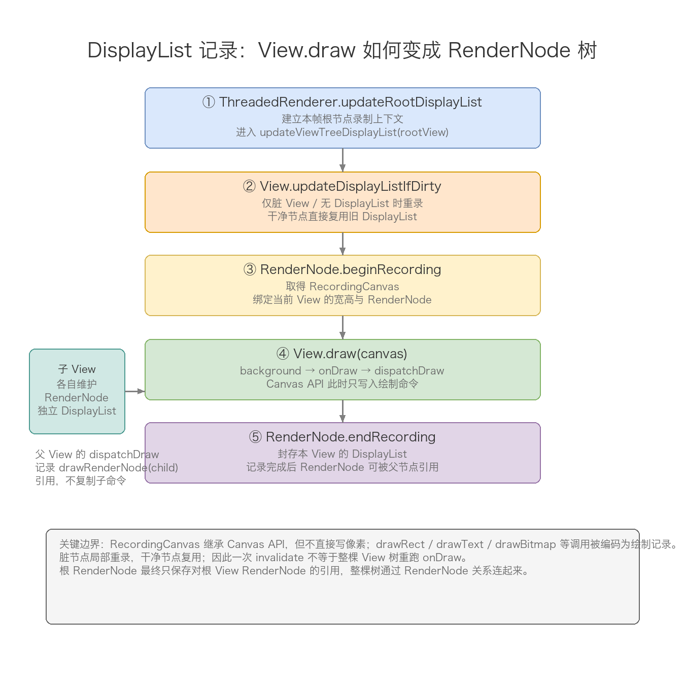

**录制结果包含什么。**

RenderNode 同时承载“内容记录”和“影响内容呈现的属性”。这两个部分的更新方式不同，正是属性动画能够避免反复执行 `onDraw()` 的基础。

| 类别 | 记录内容 | 改动后的处理 |
|------|----------|--------------|
| DisplayList 内容 | `save/restore`、变换、裁剪、`drawRect/drawText/drawBitmap/drawPath`、对子 RenderNode 的绘制引用 | 通常重新 `beginRecording → draw → endRecording` |
| RenderNode 属性 | position、translation、scale、rotation、pivot、alpha、clip、elevation、outline | 在 RT 同步阶段更新，通常无需重录内容 |
| 绘制资源关联 | Bitmap、字形、Paint、Shader、Path 等回放所需 native 资源关联 / 快照 | 内容或参数影响绘制时重录；DisplayList 可长期持有资源 |
| 子节点关系 | `drawRenderNode(child)` 形成的 RenderNode 引用 | child 可局部重录，父节点不必复制其全部命令 |

例如下面的 `onDraw()` 不会在 UI Thread 立即把 bitmap 像素写入窗口 buffer。它记录的是当前 Canvas 状态下“后续应以何种顺序、何种 Paint、何种裁剪绘制这些对象”的描述。

```java
// 自定义 View 的 onDraw；硬件加速时 canvas 是 RecordingCanvas
canvas.save();
canvas.translate(offsetX, offsetY);
canvas.clipRect(0, 0, width, height);
canvas.drawBitmap(bitmap, 0, 0, paint);
canvas.drawText(title, 24, 48, textPaint);
canvas.restore();
```

RenderNode 不记录 View 的事件监听器、Measure/Layout 业务状态或 Java View 对象本身；也不等于已经装有像素的 GraphicBuffer。它是应用 HWUI 内部的“可回放场景节点”。当需要释放它持有的 DisplayList 资源时可调用 `discardDisplayList()`；下一次使用必须重新录制。

**DisplayList 在 native 层怎样保存。**

“记录命令”落到当前 AOSP 中，是一个明确的 native 数据结构。需要先避开一个版本陷阱：较早文章常把它描述成 `DisplayListData`、`DisplayListOp` 或一组 OpenGL `DrawOp`；当前 HWUI 的 `DisplayList` 已经是对 Skia 实现的包装，不能再把旧类名当作新版本源码字段。

`libs/hwui/DisplayList.h` 中当前公开的 `DisplayList` 是 `SkiaDisplayListWrapper` 的别名。真正的对象由 `std::unique_ptr<skiapipeline::SkiaDisplayList>` 持有：空指针表示没有有效记录；有对象不代表一定含可见绘制命令，空的录制结果同样可以是一个有效 DisplayList。

```cpp
// frameworks/base/libs/hwui/DisplayList.h，字段与无关方法省略
class SkiaDisplayListWrapper {
public:
    explicit SkiaDisplayListWrapper() {}
    explicit SkiaDisplayListWrapper(
            std::unique_ptr<skiapipeline::SkiaDisplayList> impl)
            : mImpl(std::move(impl)) {}

    bool isValid() const { return mImpl.get() != nullptr; }
    bool hasContent() const { return mImpl && !mImpl->isEmpty(); }
    void updateChildren(std::function<void(RenderNode*)> updateFn) {
        mImpl->updateChildren(std::move(updateFn));
    }
    bool prepareListAndChildren(TreeObserver& observer, TreeInfo& info, ...);
    void clear(RenderNode* owningNode = nullptr);
private:
    std::unique_ptr<skiapipeline::SkiaDisplayList> mImpl;
};
using DisplayList = SkiaDisplayListWrapper;
```

调用前，`RecordingCanvas` 正在把 `View.draw()` 发出的 Canvas API 转交给 Skia 的录制实现；`endRecording()` 后，这份 `SkiaDisplayList` 被封装为一个 `DisplayList`，再挂入对应 RenderNode 的 staging 数据。这里最重要的不是把每个 API 机械理解为一个 Java 数组元素，而是它的四类语义：

| DisplayList 中的内容 | 例子 | RenderThread 回放时的作用 |
|---|---|---|
| Canvas 状态与绘制操作 | `save`、`translate`、`clipRect`、`drawText`、`drawPath` | 恢复录制时的坐标系、裁剪和绘制顺序 |
| 绘制资源关联 | Bitmap、字形、Paint、Shader、Path、Drawable 的 native 资源 | 让 Skia 在回放时定位纹理、字形和几何数据 |
| 子节点引用 | `drawRenderNode(child)` | 递归进入 child 的独立 DisplayList，而不是复制 child 命令 |
| 列表元信息 | 是否为空、文本/填充等特征、资源占用、child 遍历接口 | 供 `prepareTree()` 做资源准备、遍历和回收 |

它不包含两个东西：第一，不保存最终栅格化后的 RGBA 像素；第二，不保存 Java `View` 的完整状态。因此 `DisplayList` 既不是缓存截图，也不是第七章的 `GraphicBuffer`。前者是“怎样画”的可回放描述，后者才是“已经画好”的共享像素内存。

### 6.3 组织 RenderNode 树

一份 DisplayList 只能描述“节点画什么”，但还不足以让 RenderThread 直接工作。它必须被挂在 RenderNode 树中，并与 position、alpha、变换等属性一起，经过 staging / active 两套状态的同步，才成为可回放的场景树。

DisplayList 只解决“这个节点画什么”；RenderNode 是承载它的场景节点，还要保存“画到哪里、以什么透明度和变换画、子树何时与 RenderThread 同步”。因此一次 `View.draw()` 结束后，不能只看一份命令流，必须同时看 RenderNode 的属性和 staging / active 两套状态。

```cpp
// frameworks/base/libs/hwui/RenderNode.h，当前主干字段精简
class RenderNode : public VirtualLightRefBase {
public:
    void setStagingDisplayList(DisplayList&& newData);
    const RenderProperties& properties() const { return mProperties; }
    RenderProperties& mutateStagingProperties() {
        return mStagingProperties;
    }
    bool isValid() { return mValid; }
    void prepareTree(TreeInfo& info);
private:
    uint32_t mDirtyPropertyFields;
    RenderProperties mProperties;
    RenderProperties mStagingProperties;
    bool mValid = false;                  // UI 侧节点有效性
    bool mNeedsDisplayListSync;
    DisplayList mDisplayList;
    DisplayList mStagingDisplayList;
    uint32_t mParentCount;
};
```

字段按职责可分为四组：

| 字段组 | 关键字段 | 调用前后状态 | 意义 |
|---|---|---|---|
| 内容双态 | `mStagingDisplayList`、`mDisplayList` | UI 录制完成先替换 staging；`prepareTree()` 同步后，RT 消费生效列表 | 避免 UI 录制时被 RT 同时回放 |
| 属性双态 | `mStagingProperties`、`mProperties`、`mDirtyPropertyFields` | UI 修改 alpha、translation、scale 等先写 staging 并标脏；同步阶段把变化推给生效属性 | 属性动画可不重录 DisplayList |
| 同步与有效性 | `mNeedsDisplayListSync`、`mValid` | 新录制或失效时标记；同步后本帧树拥有一致快照 | 决定本帧是否需要把 UI 侧变更交给 RT |
| 树生命周期 | `mParentCount` | `drawRenderNode(child)` 建立父引用；节点脱离树时引用归零 | 决定不再被树使用的节点何时释放 layer 等硬件资源 |

这里的“staging / 生效”是同一 native RenderNode 在一帧同步边界两侧的两份数据，不是创建两个 RenderNode，也不是把每一帧 DisplayList 序列化后复制给 RenderThread。6.4 中的 `syncFrameState() → prepareTree()` 正是把 staging 变化推入可回放状态的边界；在此之前 UI Thread 不应继续改动这棵本帧树，在此之后 RenderThread 可以独占后续回放。

`RenderProperties` 不是一个抽象标签，它承接的是节点级绘制属性，例如 position、translation、scale、rotation、pivot、alpha、clip、elevation、outline 等。内容变化要重新执行 `View.draw()` 生成新的 `mStagingDisplayList`；仅属性变化通常只改 `mStagingProperties` 并在同步阶段生效。这就是同一张复杂卡片在做平移或淡入时通常不必重新调用其 `onDraw()` 的源码基础。

**View、RenderNode 与 DisplayList 的边界。**

现在把三者放回一次完整 `draw` 之后的真实结构：View 是 Java UI 对象，负责事件、状态以及 measure / layout；RenderNode 是与绘制相关的 native 场景节点；DisplayList 则只是 RenderNode 持有的一段可回放内容。三者相关，但不能互相替代。

```java
// frameworks/base/core/java/android/view/View.java，核心关系简化
RenderNode updateDisplayListIfDirty() {
    final RenderNode renderNode = mRenderNode;
    if (needsRecreateDisplayList(renderNode)) {
        RecordingCanvas canvas = renderNode.beginRecording(getWidth(), getHeight());
        try {
            draw(canvas); // background → onDraw → dispatchDraw
        } finally {
            renderNode.endRecording();
        }
    }
    return renderNode;
}

// ViewGroup 的硬件绘制语义简化
RenderNode childNode = child.updateDisplayListIfDirty();
canvas.drawRenderNode(childNode);
```

调用前，View 树已经完成本帧布局，脏 View 的 `mRenderNode` 需要重录；调用后，Java `View.mRenderNode` 这个包装对象持有 native RenderNode 句柄，native 节点 staging 中有新的 DisplayList。父 ViewGroup 的 `dispatchDraw()` 不会内联 child 的所有 `drawRect()` / `drawText()`，而只记录 `drawRenderNode(childNode)`；因此 child 可以独立更新。

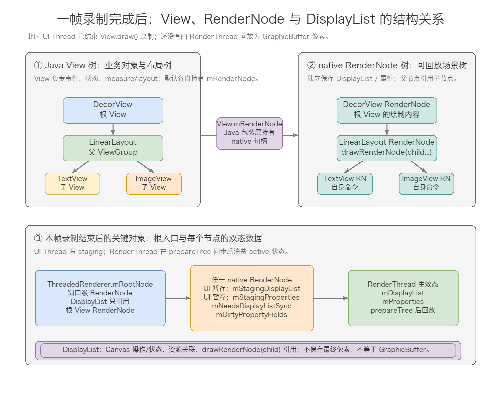

图中需要注意四个结论：

1. 通常一个参与硬件绘制的 View 有自己的 RenderNode，但 View 树与 RenderNode 树不是严格的一一同构关系。硬件加速未启用、View 尚未 attach、不能拥有 DisplayList 等场景不会形成可用的硬件记录；同时 `ThreadedRenderer.mRootNode` 是窗口级入口，不对应某个业务 View。
2. `mRootNode` 的 DisplayList 只记录“绘制根 View RenderNode”的入口及窗口级 barrier / callback 内容。它不会把整棵 View 树压平成一份巨型命令数组。
3. 每个子 RenderNode 的 DisplayList 独立存在，父 DisplayList 通过 `drawRenderNode(child)` 保存引用关系。这是局部失效只重录子节点的结构原因。
4. 图中所有 DisplayList 仍只是录制结果。直到 6.4 中 RenderThread 完成同步并由 Skia 回放，当前 Surface 的 GraphicBuffer 才开始得到本帧像素。

**父子节点怎样连成树。**

`ViewGroup.dispatchDraw()` 遍历子节点时，父节点不会把 child 的全部 `drawRect()`、`drawText()` 展开复制到自己的 DisplayList。它先确保 child 的 RenderNode 已更新，然后在父 RecordingCanvas 记录一条 `drawRenderNode(childNode)` 引用操作。

```java
// ViewGroup 硬件绘制路径，职责示意
for (View child : drawingOrderChildren) {
    RenderNode childNode = child.updateDisplayListIfDirty();
    canvas.drawRenderNode(childNode);  // 记录 child 引用，不复制 child 命令
}
```

这一引用关系决定了局部更新边界：子 View 内容失效时通常只重录 child；父容器的裁剪、绘制顺序或子节点增删变化时才需要更新父节点记录；仅修改 `translationX`、`alpha` 等属性时则主要在后续同步阶段更新属性。到根 `mRootNode.endRecording()` 返回时，一棵以窗口根节点为入口、子节点独立可复用的 native RenderNode 树已经准备完成。

### 6.4 交给 RenderThread 回放

到这里，UI Thread 已把本帧 View 变化收敛为一棵 native RenderNode 树。接下来先跨过 UI / RenderThread 的同步边界，再由 RenderThread 独占回放这棵树并提交 GPU；本节按这个顺序完成最后的交接。

此刻 UI Thread 的录制工作已结束。`nSyncAndDrawFrame()` 把 `FrameInfo` 复制进 native `RenderProxy`，后者把任务委托给 `DrawFrameTask`。关键是：交接的是同一进程 native 层的 RenderNode 树和帧时序信息，不是把 DisplayList 序列化并复制到另一个线程。

```cpp
// frameworks/base/libs/hwui/renderthread/RenderProxy.cpp
int RenderProxy::syncAndDrawFrame() {
    return mDrawFrameTask.drawFrame();
}

// frameworks/base/libs/hwui/renderthread/DrawFrameTask.cpp，逻辑简化
int DrawFrameTask::drawFrame() {
    mSyncResult = SyncResult::OK;
    mSyncQueued = systemTime(SYSTEM_TIME_MONOTONIC);
    postAndWait();
    return mSyncResult;
}

void DrawFrameTask::postAndWait() {
    AutoMutex lock(mLock);
    mRenderThread->queue().post([this] { run(); });
    mSignal.wait(mLock);
}
```

`postAndWait()` 的等待是刻意设计的树同步边界。UI Thread 刚刚完成 RenderNode 的录制，RenderThread 必须先完成一次状态同步，避免一个线程继续修改树、另一个线程同时读取树。它不是等待 GPU 完全画完；后文会看到 UI Thread 会在树状态同步完成后被解除等待。

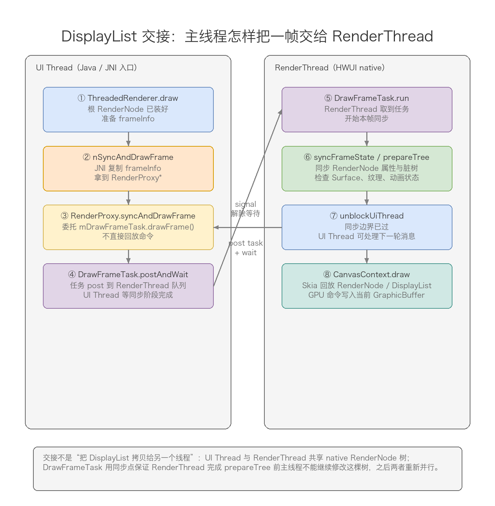

**先同步树状态，再释放 UI Thread。**

RenderThread 从队列取到 `DrawFrameTask` 后执行 `run()`。它先构造 `TreeInfo`，调用 `syncFrameState(info)`；当前 AOSP 主干中，这会进入 `CanvasContext.prepareTree()`，递归同步 RenderNode 的属性与 DisplayList 状态，处理 layer 更新、纹理准备、动画和输出 target 检查。

```cpp
// frameworks/base/libs/hwui/renderthread/DrawFrameTask.cpp，逻辑简化
void DrawFrameTask::run() {
    TreeInfo info(TreeInfo::MODE_FULL, *mContext);
    bool canUnblockUiThread = syncFrameState(info); // prepareTree 在此发生
    bool canDrawThisFrame = !info.out.skippedFrameReason.has_value();

    if (canUnblockUiThread) {
        unblockUiThread();       // signal → UI Thread 的 postAndWait 返回
    }
    if (canDrawThisFrame) {
        mContext->draw(info.out.solelyTextureViewUpdates);
    }
}
```

执行前后状态要分清：

1. UI Thread 调用 `postAndWait()` 后暂时不再修改本帧 RenderNode 树；
2. RenderThread 通过 `prepareTree()` 得到可安全消费的树与属性；
3. `unblockUiThread()` 发 signal，UI Thread 从 `nSyncAndDrawFrame()` 返回，可继续处理下一轮 Looper 工作；
4. RenderThread 继续独占本帧渲染工作，不需要 UI Thread 等 GPU 完整结束。

这就是“主线程记录、RenderThread 回放”真正的并行点：两者并非从一开始完全并行，而是在每帧短暂同步后重新分开。

**回放命令并产出像素。**

树同步通过后，`CanvasContext.draw()` 调用 HWUI 的 Skia Pipeline。它从根 RenderNode 开始递归回放 DisplayList：应用前面记录的 Canvas 状态、绘制操作、child RenderNode 引用在此变为实际 Skia 绘制；底层根据设备和版本走 OpenGL 或 Vulkan 后端，将命令提交给 GPU。

这一阶段的输出才是当前 Surface 生产端取得的 GraphicBuffer 中的像素。RenderThread / GPU 完成写入后，后续由 BufferQueue、Fence 和 SurfaceFlinger 完成跨进程交接与系统合成——第七章从这里继续。

| 看到的 Trace | 首先对应的执行步骤 | 优先检查 |
|--------------|-------------------|----------|
| UI Thread `Draw` 很长 | 6.1~6.3 录制阶段 | `onDraw`、复杂 `dispatchDraw`、过多脏节点、频繁重录 |
| `syncAndDrawFrame` 等待长 | 6.4 同步边界 | RenderThread 未及时获得 / 同步树，Surface 或 GPU 压力 |
| RenderThread `DrawFrames` 很长 | 6.4 回放阶段 | 纹理上传、复杂 Path / Clip、离屏 layer、GPU fill-rate |
| 静态页面仍频繁重录 | 6.2~6.3 局部复用失效 | 失效范围过大、内容与属性更新混淆 |

至此，一帧在应用进程内的执行顺序已经闭合：主线程把 View 变化组织为 RenderNode / DisplayList 树，RenderThread 把这棵树回放成 GraphicBuffer 像素。下一章开始讲像素 buffer 如何安全离开应用进程。

## 七、RenderThread 画完之后发生了什么

第六章结束时，RenderThread 已经把本帧内容画进一块 GraphicBuffer。这里最关键的事实是：这块内存不会被复制一份再发给系统；应用把“哪一块 buffer 已经画好、什么时候可以读”交给图形系统，SurfaceFlinger 在自己的下一次合成帧中取用它。本章只跟踪这一块 buffer，按时间顺序解释它怎样从应用走到系统 Layer。

### 7.1 先认识这一帧里的对象

先把名词放在同一张图里。后面的调用链只是在让这些对象依次接力；理解它们的职责，比先记类名更重要。

| 名词 | 可以先把它理解为 | 谁使用它 | 在这一帧里做什么 |
|---|---|---|---|
| `GraphicBuffer` | 一块可供 GPU、显示硬件共同访问的像素内存 | RenderThread、SurfaceFlinger、HWC | 存放应用刚画出的像素 |
| `Surface` / `ANativeWindow` | 应用往窗口里交画面的生产者入口 | 应用 RenderThread | 让 EGL（连接 GPU 渲染与窗口 Surface 的接口）提交 GraphicBuffer |
| `BufferQueue` | 管理有限几块 buffer 的交接站 | producer（写入方）与 consumer（读取方） | 约束一块 buffer 何时能写、何时能读、何时能复用 |
| `Fence` | 随 buffer 流动的“完成凭证” | GPU、BufferQueue、SurfaceFlinger | 避免消费者读到半成品，或生产者覆盖旧画面 |
| `Layer` | SurfaceFlinger 看待一个窗口内容的单位 | SurfaceFlinger | 将应用的一块 buffer 作为一个待合成图层 |
| `SurfaceControl.Transaction` | 对 Layer 的一次状态更新请求 | 客户端 → SurfaceFlinger | 一次提交 buffer、裁剪、位置、大小等状态 |

这几个对象分布在不同进程中：应用的 UI Thread 负责组织 View；应用的 RenderThread 负责真正画像素；`surfaceflinger` 是独立系统进程，负责把所有窗口的 Layer 合成；WindowManagerService 位于 `system_server`，主要在建窗、尺寸改变时协调窗口，不会逐帧复制应用像素。Hardware Composer（HWC）则是显示硬件的抽象层，负责把最终合成结果交给显示控制器。

在每帧开始以前，窗口已经通过 `ViewRootImpl → WindowManagerService → SurfaceFlinger` 建好了对应的 `Surface` 和 Layer；后面每帧做的不是重新建窗，而是不断替换该 Layer 当前使用的 buffer。

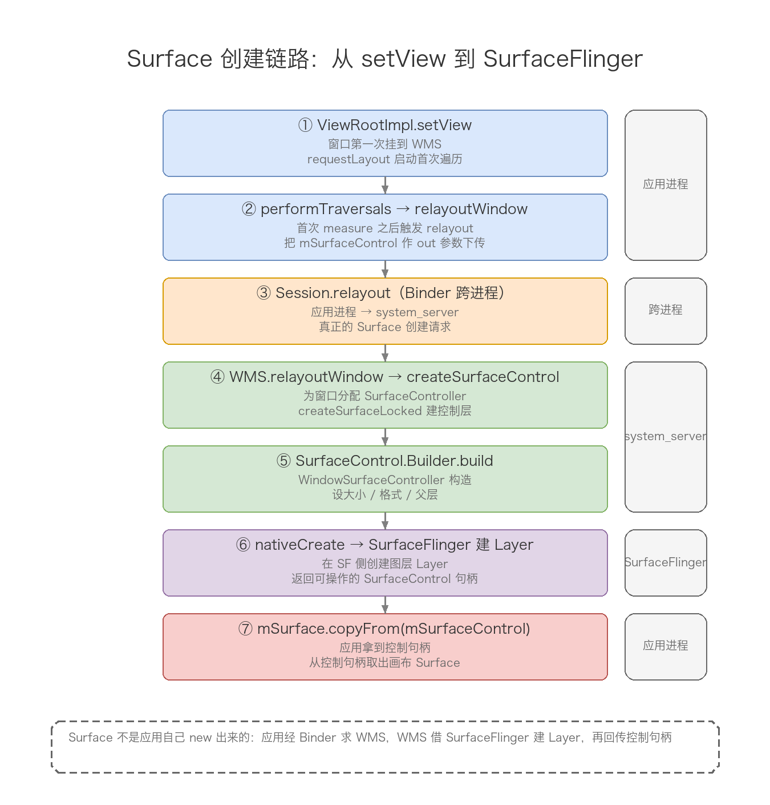

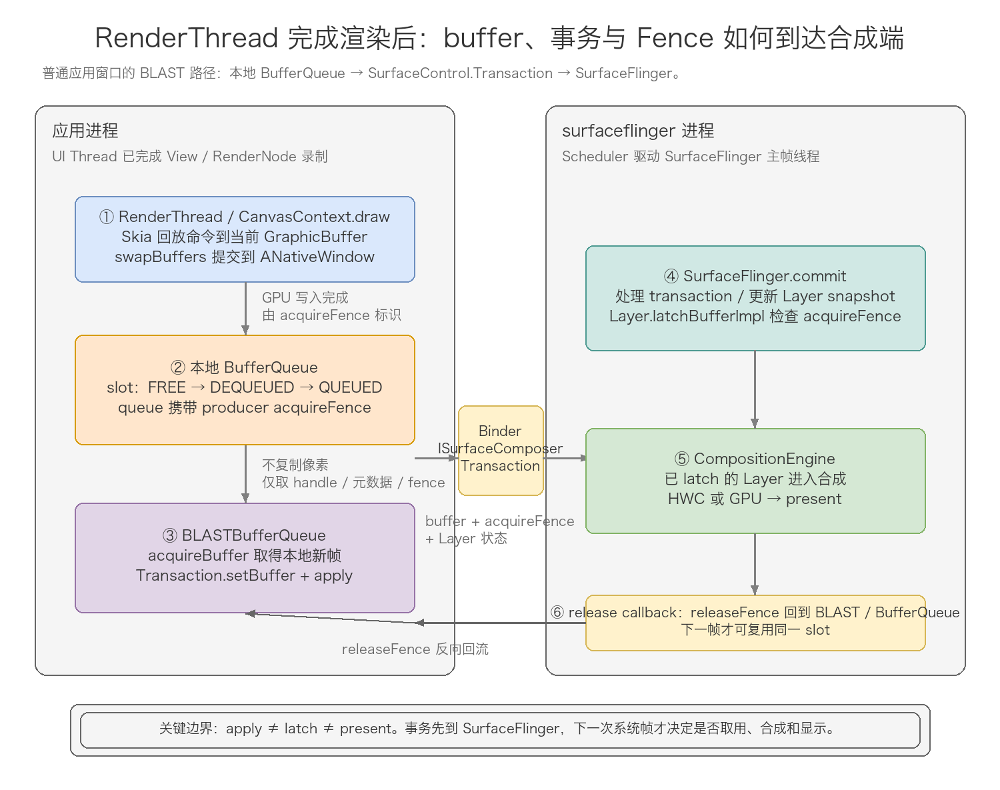

图中有三个常被混为一谈的动作，必须先分开：

1. 提交（submit）：应用把已画好的 buffer 和完成凭证交给图形系统。
2. 取用（latch）：SurfaceFlinger 在自己的帧周期决定是否采用这块新 buffer 替换 Layer 的旧内容。
3. 显示（present）：合成后的结果由 HWC / 显示控制器送往屏幕。

因此，RenderThread 返回、事务提交、SurfaceFlinger 取用、面板显示不是同一个时刻。

### 7.2 第一步：RenderThread 把画好的 buffer 提交出去

进入这一节时，RenderThread 已在第六章完成 RenderNode / DisplayList 回放，GPU 正在或已经把像素写入当前 GraphicBuffer。应用接下来不需要把像素读回 CPU 再通过 Binder 发送；它只需要通过窗口 `Surface` 告诉图形系统：“这一块 buffer 是本帧的新内容。”

硬件加速路径中，`CanvasContext.draw()` 最终调用 RenderPipeline 的 `swapBuffers()`。对应用开发者而言，`swapBuffers()` 可以理解为“把 GPU 画完的窗口 buffer 提交给 Surface”；底层 EGL 和 `ANativeWindow` 会完成 buffer 申请与归还协议。

```cpp
// frameworks/base/libs/hwui/renderthread/CanvasContext.cpp，逻辑简化
void CanvasContext::draw() {
    mNativeSurface->reserveNext();  // 预留本帧要写的窗口 buffer
    mRenderPipeline->draw(...);     // Skia / GPU 写入该 buffer
    waitOnFences();

    native_window_set_frame_timeline_info(
            mNativeSurface.get(), frameTimelineInfo);
    mRenderPipeline->swapBuffers(...); // 提交给窗口 Surface
}
```

调用前，当前 buffer 属于应用的写入阶段；调用后，它进入等待消费者取用的阶段。这里的 `swapBuffers()` 只说明应用已经提交了新内容，绝不表示屏幕已经显示它：GPU 可能尚未完全写完，SurfaceFlinger 也还没有到自己的合成时间。

这块内存为什么能被应用和系统共同使用？首次需要 buffer、或尺寸 / 格式 / usage 改变时，Gralloc（Android 图形内存分配器）会分配适合 GPU 与 HWC 访问的 GraphicBuffer。BufferQueue、BLAST、SurfaceFlinger 在进程间传递的是它的 handle（识别并访问该 buffer 的句柄）、元数据和 Fence；所谓 import，是接收进程根据 handle 建立本地访问对象，底层仍指向同一块内存。

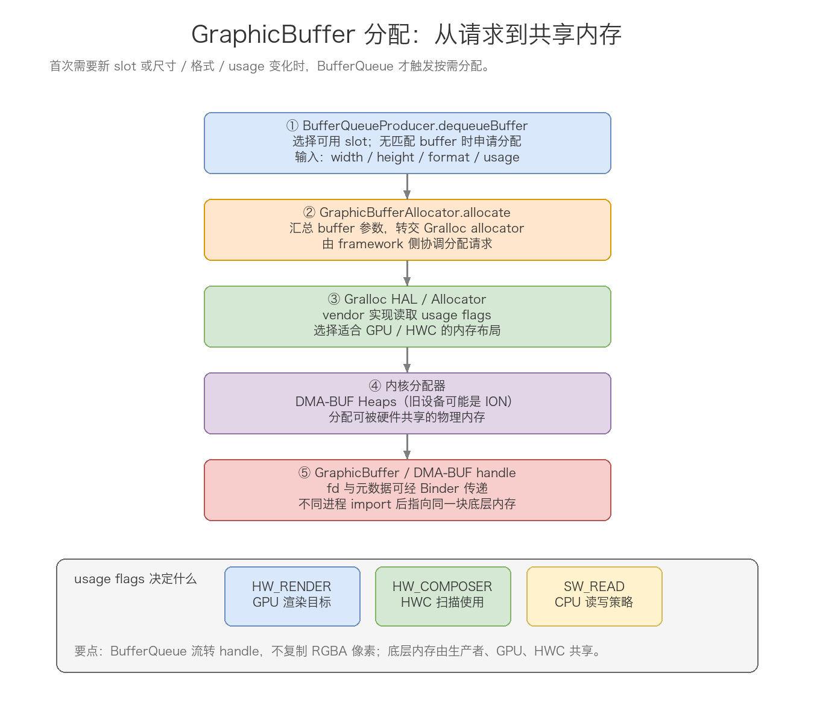

### 7.3 第二步：BufferQueue 记录这块 buffer 的交接状态

一块 buffer 不能一边被 GPU 写入、一边又被 SurfaceFlinger 或显示硬件读取。BufferQueue 的职责就是管理这种所有权变化。它不负责画图，也不复制像素；它只维护少量 slot。slot 可以理解为“队列中给某一块 GraphicBuffer 编号的座位”，并记录这块 buffer 此刻由生产者还是消费者持有。

以一块 buffer 为例，最容易理解的顺序是：

1. `FREE`：这块 buffer 空闲，生产者可以申请它。
2. `DEQUEUED`：应用通过 `dequeueBuffer()` 取得它，RenderThread / GPU 可以往里面写像素。
3. `QUEUED`：应用画完并调用 `queueBuffer()`，表示新内容已排队等待消费者。
4. `ACQUIRED`：消费者取到它，用于 Layer 或合成。
5. consumer 使用完后调用 `releaseBuffer()`，它重新回到 `FREE`，进入下一轮循环。

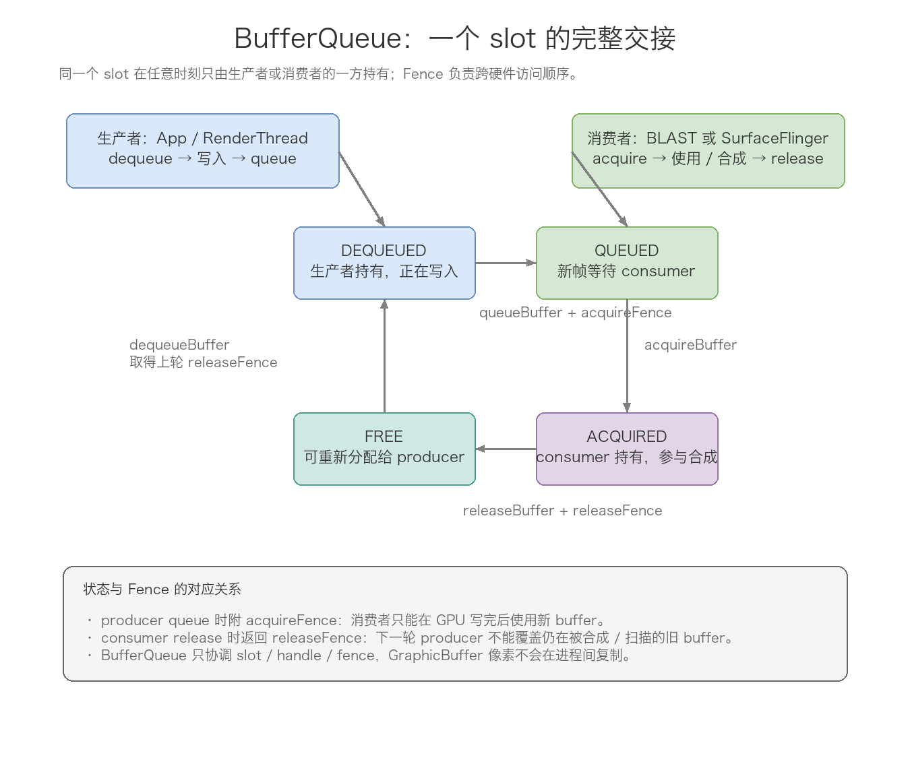

源码层可以把这条状态链对应到四个方法；先记住它们的中文含义即可：`dequeue` 是“申请可写 buffer”，`queue` 是“提交新 buffer”，`acquire` 是“消费者取走新 buffer”，`release` 是“消费者归还旧 buffer”。

```cpp
// frameworks/native/libs/gui/BufferQueueProducer.cpp，职责简化
status_t BufferQueueProducer::dequeueBuffer(...) {
    mBufferState.dequeue();             // FREE → DEQUEUED
    *outFence = mSlots[slot].mFence;    // 取回上一轮 consumer 的 release fence
}

status_t BufferQueueProducer::queueBuffer(int slot, const QueueBufferInput& input, ...) {
    mSlots[slot].mFence = input.fence;  // 保存 producer 的 acquire fence
    mBufferState.queue();               // DEQUEUED → QUEUED
    listener->onFrameAvailable(item);   // 通知 consumer 有新帧
}
```

这段代码的输入是一个已画好的 slot；输出是一个带有“新帧可用”通知的 `BufferItem`。旧式路径中，SurfaceFlinger 可以直接作为这个 BufferQueue 的消费者；理解这条通用状态机后，下面再看普通应用窗口常见的 BLAST 路径。

### 7.4 第三步：普通窗口通过 BLAST 变成 Layer 更新

现代普通应用窗口常使用 BLASTBufferQueue。名字很长，但它的职责可以压缩为一句话：它在应用进程中接住本地 BufferQueue 交出的新 buffer，再把“把这块 buffer 用到哪个 Layer 上”的请求发给 SurfaceFlinger。

为什么多这一层？窗口的一帧不只有像素，还可能同时改变尺寸、位置、裁剪、旋转等 Layer 属性。BLAST 把 buffer 与这些 SurfaceControl 状态组装为一笔 `Transaction`，使 SurfaceFlinger 可以在一个系统帧中一致地处理它们。

```cpp
// frameworks/native/libs/gui/BLASTBufferQueue.cpp，逻辑简化
void BLASTBufferQueue::onFrameAvailable(const BufferItem&) {
    acquireNextBufferLocked(std::nullopt); // 从本地 BufferQueue 取新 buffer
}

void BLASTBufferQueue::acquireNextBufferLocked(...) {
    mBufferItemConsumer->acquireBuffer(&item, ...);
    transaction.setBuffer(mSurfaceControl, item.mGraphicBuffer, item.mFence,
                          item.mFrameNumber, ...);
    transaction.apply(false, true);        // Binder 发送给 SurfaceFlinger
}
```

调用前，这块 buffer 是本地 BufferQueue 中的 `QUEUED` 帧；`acquireBuffer()` 后，BLAST 暂时持有它；`setBuffer()` 把 buffer、它的 acquire fence、帧号和对应 Layer 放入事务；`apply()` 再通过 Binder 将事务发给 `surfaceflinger` 进程。

这里最重要的边界是：`apply()` 的含义只是“SurfaceFlinger 已收到这次 Layer 更新请求”。它不表示 SurfaceFlinger 已经取用 buffer，更不表示屏幕已经显示。为了跟上刷新节奏，BLAST 还可能丢弃尚未来得及呈现的中间帧；应用提交的每一帧并不保证都会显示。

### 7.5 第四步：SurfaceFlinger 在自己的帧中取用这块 buffer

SurfaceFlinger 收到事务后不会立刻同步合成。它要同时处理多个应用窗口、状态栏、输入法和壁纸，因此由 Scheduler（SurfaceFlinger 内部的帧调度器）在合适的系统 VSYNC 周期唤醒主帧线程，再统一处理本帧所有待办事务。

在这个周期里，可以把 SurfaceFlinger 的工作理解为两步：先 `commit`，再 `composite`。前者是“把本帧 Layer 状态确定下来”，后者才是“把这些 Layer 合成为屏幕画面”。

```cpp
// frameworks/native/services/surfaceflinger/SurfaceFlinger.cpp，逻辑简化
void SurfaceFlinger::commit(...) {
    updateLayerSnapshots(...); // 应用 Transaction，更新每个 Layer 的待处理状态
    // 其中会尝试为 Layer 取用本帧可用 buffer
}

void SurfaceFlinger::composite(...) {
    CompositionRefreshArgs args = buildArgs(...);
    mCompositionEngine->present(args); // 将已取用的 Layer 交给 HWC / GPU 合成
}
```

`commit` 阶段最关键的动作叫 latch，可以译为“取用并固定本帧 Layer 内容”。SurfaceFlinger 会检查这块 buffer 的 acquire fence：如果 GPU 还没写完，就不能把半成品用于合成；如果 fence 已满足，`Layer::latchBufferImpl()` 才把它更新为该 Layer 当前可用的 buffer。

```cpp
// frameworks/native/services/surfaceflinger/Layer.cpp，职责简化
bool Layer::latchBufferImpl(...) {
    if (!fenceHasSignaled()) {  // GPU 尚未完成生产
        onLayerUpdate();        // 保留旧内容，后续帧再尝试
        return false;
    }
    updateTexImage(...);        // 记录本次取用时间
    gatherBufferInfo(...);      // 更新 buffer、裁剪、变换、色彩空间等
    return true;
}
```

调用前，Layer 仍可能显示上一帧 buffer；调用后，只有 acquire fence 已满足的新 buffer 才成为该 Layer 的本帧输入。随后第八章的 CompositionEngine（SurfaceFlinger 内部负责组织合成的组件）会选择 HWC 或 GPU，把多个已 latch 的 Layer 合成为一张要显示的画面。

### 7.6 Fence：让 buffer 能安全循环复用

到这里还差最后一个问题：SurfaceFlinger / HWC 使用完旧 buffer 后，应用怎么知道自己可以再次往里面写？答案是 Fence。Fence 可以理解为与某块 buffer 绑定的“未完成工作收据”；没有 signal 前，持有者只能等待或改用其他 slot，不能提前读写。

按一块 buffer 的完整生命周期看，Fence 的方向是：

1. 应用下次 `dequeueBuffer()` 时，拿到上轮 consumer 留下的 `releaseFence`。它表示显示或合成端什么时候不再读取旧内容；满足前应用不能覆盖这块内存。
2. RenderThread 完成本轮绘制并 queue / setBuffer 时，附上 `acquireFence`。它表示 GPU 什么时候完成新内容写入；SurfaceFlinger 只有在它满足后才能 latch。
3. SurfaceFlinger 合成、HWC 读取并提交显示后，新的 `releaseFence` 再沿 release callback 回到 BLAST / BufferQueue，等待下一轮生产者使用。

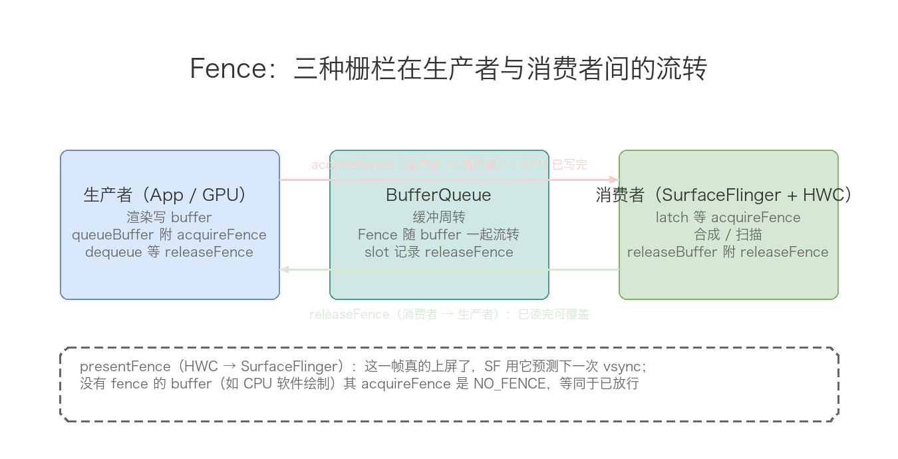

| Fence | 谁交给谁 | 防止什么问题 |
|---|---|---|
| acquireFence | 应用生产者 → 合成消费者 | 防止 SurfaceFlinger 读到 GPU 未写完的新帧 |
| releaseFence | 合成消费者 → 下一轮应用生产者 | 防止应用覆盖仍在被合成 / 显示读取的旧帧 |
| present fence | HWC → SurfaceFlinger | 记录本次合成结果何时进入显示管线 |

因此，第七章整条链路可以只记成一句话：RenderThread 画好一个 GraphicBuffer → 应用提交它并附上完成凭证 → BLAST / Transaction 把它绑定到目标 Layer → SurfaceFlinger 在自己的帧中确认它已写完并 latch → 合成端用完后把 release fence 回传，让这块 buffer 回到下一轮可写状态。

## 八、SurfaceFlinger：把所有窗口合成为屏幕的一帧

第七章结束时，每个应用已经把一块“内容已写完”的 `GraphicBuffer` 绑定到对应 `Layer`，并由 SurfaceFlinger 在自己的帧中完成了 latch。第八章只解决剩下的问题：同一块物理屏幕上同时有壁纸、应用窗口、状态栏、输入法时，系统如何挑出真正可见的内容，决定谁来合成，并在刷新边界交给显示控制器。

这里的“合成”不是把 Java View 拼到一起。View 在应用进程中已经被 RenderThread 画进应用 buffer；SurfaceFlinger 面对的是多个 Layer 及其 buffer。一个应用窗口通常只是其中一个 Layer，系统栏、壁纸、画中画窗口和 SurfaceView 也会各自成为 Layer。

### 8.1 先建立合成端的对象模型

理解合成前，先把几个名字放到正确层次。`SurfaceFlinger` 是独立的 `surfaceflinger` 系统进程；它在系统 VSYNC 节拍下组织一帧工作。`Hardware Composer`（HWC）是厂商实现的显示硬件 HAL，SurfaceFlinger 通过它使用显示控制器和 overlay 平面。两者都不属于应用 RenderThread。

| 对象 | 所在位置 | 在合成中的职责 |
|------|----------|----------------|
| `Layer` | SurfaceFlinger 侧的场景节点 | 描述一份窗口内容及其 Z 序、位置、裁剪、透明度、变换和当前 buffer |
| `LayerSnapshot` | SurfaceFlinger 前端快照 | 把某个时刻的 Layer 状态冻结为本帧可分析的数据，避免后续事务边改边读 |
| `Display` / `Output` | CompositionEngine 的显示输出模型 | `Display` 对应一块物理或虚拟显示目标；`Output` 负责为该目标准备并提交一帧 |
| `OutputLayer` | 某个 Output 上的 Layer 视图 | 同一个 Layer 映射到某块屏幕后的合成状态，保存该屏上的可见区域、裁剪和最终策略 |
| `CompositionEngine` | SurfaceFlinger 内部组件 | 组织 Output、Layer 与 HWC / GPU 的合成决策和执行 |
| `RenderEngine` | SurfaceFlinger 内部 GPU 渲染器 | 当 HWC 不能直接处理某些 Layer 时，把这些 Layer 合成到一张 client target buffer |
| HWC / DPU | 厂商 HAL 与显示硬件 | 校验硬件平面是否足够、直接读取可支持的 Layer buffer，并在刷新边界提交显示 |

`LayerSnapshot`、`OutputLayer` 都不是新的像素副本。前者是 Layer 状态的帧内快照，后者是“这个 Layer 在这块屏上该如何显示”的输出侧描述。真实像素仍在各 Layer 绑定的 `GraphicBuffer` 中。

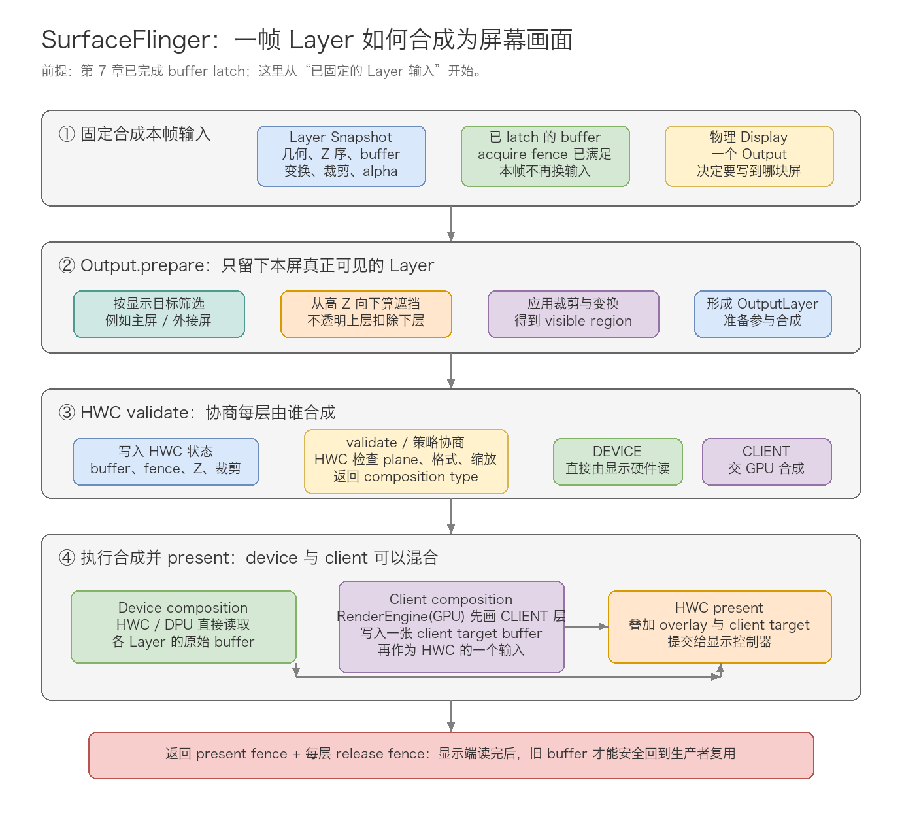

图中的第一步承接第七章的 latch。一个 Layer 已经选定本帧 buffer，并不代表它一定会出现在每块屏幕上：例如窗口可能被完全遮住、被裁剪到屏幕外，或只属于外接显示器之外的 layer stack。接下来必须先针对具体 Output 计算可见结果，才有资格谈 HWC 或 GPU。

### 8.2 先确定本屏该合成什么

SurfaceFlinger 收到 Transaction 后，不会由 Binder 线程立刻拼出一张屏幕图。Scheduler 在系统帧的合适阶段触发主帧工作；`SurfaceFlinger::commit()` 先处理待处理状态，`updateLayerSnapshots()` 生成或更新 Layer 快照，并在需要时完成 buffer latch。随后 `SurfaceFlinger::composite()` 构造 `CompositionRefreshArgs`，把物理 / 虚拟 Display、脏区、颜色设置等交给 `CompositionEngine::present()`。

```cpp
// frameworks/native/services/surfaceflinger/SurfaceFlinger.cpp
// 逻辑顺序示意，具体参数随 Android 版本变化
void SurfaceFlinger::commit(...) {
    updateLayerSnapshots(...); // 处理事务、更新 Layer 状态与本帧快照
}

void SurfaceFlinger::composite(...) {
    CompositionRefreshArgs args = buildArgs(...);
    mCompositionEngine->present(args); // 让每个 Output 完成准备和提交
}
```

到 `CompositionEngine` 后，工作单位从“所有 Layer”变成“某个 Output 上可见的 Layer”。当前 AOSP 的 `compositionengine::impl::Output::prepare()` 会进入 `rebuildLayerStacks()`：先按该 Output 的显示目标筛选 Layer，再建立或复用对应的 `OutputLayer`。这一步把多屏、镜像、虚拟显示等差异隔离在输出侧；一个 Layer 可以在不同 Output 上拥有不同的裁剪、变换和最终可见区域。

可见性不是简单的 `visible = true / false` 标记。计算时需要处理以下状态：

1. 从较高 Z 序向较低 Z 序处理。高层窗口先占据屏幕区域。
2. 对下层 Layer 扣除上方完全不透明的覆盖区域；被完全遮挡的区域没有必要继续合成。
3. 对仍可能看见的部分应用窗口裁剪、圆角、缓冲区变换和 Display 坐标变换，得到该 Output 坐标系中的 `visible region`。
4. 同时记录 `covered region` 与脏区。半透明 Layer 会覆盖下方画面但不能完全剔除下层，因此它与“不透明遮挡”的含义不同。

这解释了为什么必须先算可见区域再下发 HWC：HWC 和 GPU 不应该处理已经被完全遮住的像素。源码落点可关注 `CompositionEngine/src/Output.cpp` 的 `Output::prepare()`、`rebuildLayerStacks()`、`ensureOutputLayerIfVisible()`；SurfaceFlinger 的 LayerSnapshot 构建在 `services/surfaceflinger/FrontEnd/LayerSnapshotBuilder.*` 一侧。类名会随 Android 版本调整，但“快照 → 输出筛选 → 可见区域”的职责顺序是稳定的。

### 8.3 再和 HWC 协商合成方案

可见 Layer 确定后，系统还不能直接假设全部走 overlay。显示硬件的平面数量有限，而且每个平面对 buffer 格式、缩放倍率、旋转、alpha 混合、色彩空间和受保护内容都有约束。HWC 的 `validate` 就是“把本帧候选方案交给显示硬件检查”的阶段，不是已经显示。

当前 AOSP 中，`Output::present()` 会按“更新颜色状态 → 更新 Layer 合成状态 → 规划 → 写入 HWC 状态 → 准备帧 → 执行合成 → present”的顺序推进。这里的 `OutputLayer::writeStateToHWC()` 会把每层真正需要的状态交给 HWC：`displayFrame`、`sourceCrop`、Z 序、blend mode、plane alpha、dataspace、buffer 和它的 acquire fence 等。`writeBufferStateToHWC()` 最终把 buffer 与 fence 传给 `hwcLayer->setBuffer(...)`。

```cpp
// CompositionEngine/src/Output.cpp、OutputLayer.cpp，职责化简
Output::present(...) {
    updateCompositionState(...);  // 生成每层候选合成状态
    writeCompositionState(...);   // OutputLayer::writeStateToHWC
    prepareFrame(...);            // 请求 HWC 校验策略
    finishFrame(...);             // 必要时执行 GPU client composition
    presentFrameAndReleaseLayers(...);
}

// DisplayHardware/HWComposer.cpp，职责化简
DeviceRequestedChanges HWComposer::getDeviceCompositionChanges(...) {
    validate(...);                // HWC 检查显示硬件能否接纳候选方案
    getChangedCompositionTypes(...); // 返回要求改成 DEVICE / CLIENT 的层
    acceptChanges(...);           // 确认这次协商结果
}
```

`DEVICE` 和 `CLIENT` 是合成责任，而不是应用 Layer 的永久属性：

| 结果 | 含义 | 这一帧实际由谁处理 |
|------|------|--------------------|
| `DEVICE` composition | HWC 确认该 Layer 可由某个显示硬件平面直接读取 | DPU / 显示控制器读取该 Layer 的原始 buffer |
| `CLIENT` composition | 该 Layer 不适合直接交给 HWC，或被系统策略强制走 GPU | RenderEngine 先用 GPU 绘制它 |
| mixed composition | 同一帧同时存在两类 Layer | GPU 处理 CLIENT 集合，HWC 再处理 GPU 结果和 DEVICE Layer |

因此，HWC 不是“能合成就合成”的黑盒。它先返回硬件真正能支持的 composition type，CompositionEngine 根据返回值修正策略。新版实现中 `HWComposer::getDeviceCompositionChanges()` 还可能通过 `presentOrValidate()` 使用快路径；旧版本常见的 HIDL / `validateDisplay()` 细节与当前 AIDL HWC 实现不同，文档里应关注 validate、变更类型和确认策略这三个稳定职责。

### 8.4 执行合成、提交显示并回收 buffer

方案确定后，才开始产生面向显示器的最终结果。若一帧全部是 `DEVICE`，HWC 可以让显示硬件直接从各 Layer 的 buffer 取数据；SurfaceFlinger 不需要先让 GPU 画出一张全屏大图。若存在 `CLIENT` Layer，`RenderEngine` 则要先把这部分 Layer 合成到一张新的 `client target`。

`client target` 可以理解为“SurfaceFlinger 代替若干 Layer 生成的一张合并底图”。它本身也是一个 buffer，但不是某个应用窗口的 buffer。对 HWC 来说，它像一个普通的合成输入：HWC 会把这张 GPU 产出的底图与仍可走 `DEVICE` 的 overlay Layer 一起组合并送到显示控制器。

```text
CLIENT Layer A + CLIENT Layer B
        │
        ▼
RenderEngine::drawLayers() ──> client target buffer
                                  │
DEVICE Layer C ───────────────────┼──> HWC / DPU ──> display controller
DEVICE Layer D ───────────────────┘
```

GPU 路径的源码链可按以下顺序阅读：`Output::finishFrame()` 判断需要 client composition 后，调用 `RenderSurface::dequeueBuffer()` 取得可写的 client target；`Output::composeSurfaces()` 组装各 Layer 的 `LayerSettings`，再调用 `RenderEngine::drawLayers()` 写入该 buffer；最后 `RenderSurface::queueBuffer()` 携带 ready fence 交给显示端。此处的 `RenderSurface` 是 SurfaceFlinger 自己为显示输出准备的渲染面，和应用窗口的 `Surface` 不是同一个对象。

不论有没有 GPU client composition，最后都要进入 HWC 的 present 阶段。当前 `HWComposer::presentAndGetReleaseFences()` 会将本帧提交给 HWC，保存 `present fence`，并通过 `getReleaseFences()` 获取每个 Layer 的 release fence。它们对应不同问题：

| Fence | 语义 | 后续谁使用 |
|-------|------|------------|
| client target acquire fence | GPU 何时写完 SurfaceFlinger 自己的 client target | HWC，防止显示硬件读到 GPU 半成品 |
| layer release fence | HWC / 显示端何时不再读取某个 Layer 的旧 buffer | SurfaceFlinger 再沿回调交还给该 buffer 的生产链 |
| present fence | 本帧何时真正提交到显示管线 | SurfaceFlinger，用于时序、背压和帧完成判断 |

`present` 依然不等价于“用户此刻已经看见像素”。它表示合成结果已提交给显示系统，显示控制器会在随后刷新扫描时读取；第七章中回传的 release fence 则确保应用不会在显示端尚未读完时覆写旧 buffer。于是本帧闭环形成：应用提交 Layer buffer → SurfaceFlinger latch 并筛选可见 Layer → HWC validate 决定 DEVICE / CLIENT → GPU 产出 client target（如有）→ HWC present → release fence 回到 buffer 生产链。

从性能角度看，应用是否硬件加速只决定“应用如何画出自己的窗口 buffer”；HWC 是否使用 overlay 决定“系统如何组合多个 Layer”。前者和第六章的 RenderThread 有关，后者才是这一章的 SurfaceFlinger 合成决策。两者都可能使用 GPU，但处在完全不同的进程、线程和职责边界。

## 九、高频速记

1. `invalidate()` 只标记内容脏了；真正绘制由下一次 VSYNC 驱动的 TRAVERSAL 回调执行。

2. 数据从应用流向 SurfaceFlinger；VSYNC 从显示硬件反向流到应用，两条线方向相反。

3. 撕裂的根因是显示硬件与生产者同时访问同一块 FrameBuffer；VSYNC 规定可见帧只在刷新边界切换，双缓冲负责读写分离。

4. 双缓冲慢帧时可能因 Front 正在显示、Back 正在渲染而没有空闲 buffer；三缓冲补出一个 slot，让 CPU、GPU、显示端继续并行，但会增加内存与潜在排队延迟。

5. VSYNC 防撕裂、三缓冲降低慢帧下的连锁等待；它们都不能让一次本来超过帧预算的渲染凭空变快。

6. VSYNC 的物理源头是显示控制器的扫描周期。它是硬件时间样本，不是“应用画完”通知；HWC HAL 将 displayId、timestamp、period 上报给 SurfaceFlinger，而不是直接唤醒应用。

7. SurfaceFlinger Scheduler 依据硬件样本校准周期并安排 App phase 与 SF phase。App、RenderThread、SurfaceFlinger、显示控制器在错开的窗口中处理不同帧，构成持续流水线。

8. App EventThread 只向已 requestNextVsync 的连接派发事件；BitTube 用 socket fd 传递高频 VSYNC，避免每帧 Binder RPC。one-shot 模型让静止页面不会被每个硬件脉冲无意义唤醒。

9. 应用 native DisplayEventReceiver 在 Looper 中读 BitTube，经 JNI 调 Java onVsync；FrameDisplayEventReceiver 再投递异步 Message 给 Choreographer.doFrame。

10. Choreographer 是应用侧帧调度器，负责把 INPUT、ANIMATION、TRAVERSAL 等回调编排到同一次 `doFrame()`。

11. `mTraversalScheduled` 让一个刷新周期内的多次 invalidate/requestLayout 合并为一次 View 树遍历。

12. 同步屏障拦普通同步消息；VSYNC 对应的异步消息可以越过屏障，保障绘制优先级。

13. `requestLayout()` 通常会触发 measure/layout/draw；`invalidate()` 通常只需要 draw。

14. 硬件加速下，`View.draw(RecordingCanvas)` 仍按背景、`onDraw`、`dispatchDraw` 的 View 语义执行；区别是 Canvas API 被录成命令，不会立刻向窗口 buffer 写像素。

15. RenderNode 同时持有两类核心数据：DisplayList 内容（绘制操作、Canvas 状态、裁剪、资源和 child RenderNode 引用）与渲染属性（translation、alpha、scale、rotation、clip、elevation 等）。

16. `drawBitmap`、`drawText`、`drawPath` 记录的是回放所需的绘制描述及 native 资源关联，不是已经画好的位图像素；真正像素稍后才写进 GraphicBuffer。

17. 每个 View 持有 RenderNode。`updateDisplayListIfDirty()` 只为脏节点执行 `beginRecording → draw → endRecording`；干净节点复用旧 DisplayList。

18. 父 View 在 `dispatchDraw` 中记录对子 RenderNode 的引用，而不是复制 child 的全部绘制操作，所以子节点内容失效时通常可以局部重录。

19. 属性变更可在同步阶段更新而不重录内容，因此内容不变的 translation/alpha/scale 动画通常不必重跑 `onDraw()`；文字、路径、Bitmap 等内容变了仍需重录。

20. 当前 AOSP 的 `DisplayList` 是 `SkiaDisplayListWrapper` 对 `SkiaDisplayList` 的包装；旧文中 `DisplayListData`、`DrawOp` 等名称属于历史实现，不能与当前字段混用。

21. 一个 native RenderNode 同时具有 UI Thread 写入的 `mStagingDisplayList / mStagingProperties` 与 RenderThread 回放的 `mDisplayList / mProperties`；`prepareTree()` 是两态同步边界。

22. `updateRootDisplayList()` 用窗口级 `mRootNode` 挂入根 View RenderNode，并以 reorder / inorder barrier 划出硬件绘制排序边界。

23. `nSyncAndDrawFrame()` 经 JNI 进入 `RenderProxy → DrawFrameTask`；交接的是共享 native RenderNode 树与 frameInfo，不是把 DisplayList 拷贝到另一个线程。

24. `DrawFrameTask.postAndWait()` 让 UI Thread 等到 RenderThread 完成 `syncFrameState / prepareTree` 的同步边界；RT 调 `unblockUiThread()` 后，主线程和 RT 才重新并行。

25. RenderThread 的 `CanvasContext.draw()` 才会由 Skia 后端回放 RenderNode / DisplayList、向 GPU 提交命令并写入当前 GraphicBuffer。

26. `discardDisplayList()` 可丢弃 DisplayList 内容并释放其持有的绘制资源；下次使用该节点时必须重新录制。硬件层适合内容稳定、变换频繁的对象，不是通用优化。

27. `Surface` / `ANativeWindow` 是应用提交窗口 buffer 的生产者接口；`SurfaceControl` 描述该内容在系统 Layer 树中的位置、大小、裁剪与 Z 序。WMS 主要在建窗 / relayout 时协调它们，不逐帧搬运像素。

28. `CanvasContext.draw()` 经 RenderPipeline / EGL 向 `ANativeWindow` 提交当前 GraphicBuffer；`swapBuffers()` 返回不代表已经上屏，只代表应用的渲染提交已进入图形管线。

29. GraphicBuffer 是可跨进程、跨硬件访问的像素内存；Gralloc 根据 usage flags 分配。BufferQueue 只传 handle、元数据与 Fence，不复制整帧像素。

30. 通用 BufferQueue 的 slot 状态环是 FREE → DEQUEUED → QUEUED → ACQUIRED → FREE；`dequeueBuffer()` 取得旧 release fence，`queueBuffer()` 携带新 acquire fence。

31. 普通窗口常走 BLAST：客户端 `BLASTBufferQueue` 本地 acquire 应用 buffer，再以 `Transaction.setBuffer()` 经 Binder 提交给 SurfaceFlinger；`apply()` 不等于 latch，更不等于显示。

32. SurfaceFlinger 主帧线程由 Scheduler 在系统帧中执行 `commit()`，处理 transaction、更新 Layer snapshot 并在 `Layer::latchBufferImpl()` 检查 acquire fence；未就绪的 buffer 不应作为本帧 Layer 输入。

33. latch 成功后，buffer 才成为 Layer 的合成输入；随后 CompositionEngine 决定 HWC / GPU 路线并 present。SurfaceFlinger 合成的是 Layer，不是 View。

34. acquireFence 保护消费者不读到 GPU 未写完的 buffer；releaseFence 反向回到生产者，保护其不覆盖仍被合成 / 显示读取的旧 buffer。

35. SurfaceFlinger 合成的基本单位是 Layer；LayerSnapshot 是帧内状态快照，OutputLayer 是该 Layer 映射到某块 Display 后的输出侧描述，三者都不复制真实像素。

36. `commit()` 固定本帧 Layer 状态，`Output::prepare()` 按显示目标筛选 Layer 并计算可见区域；完全被不透明上层遮住的区域不应参与合成。

37. `validate` 只是在 HWC 前协商能力，`present` 才是把本帧方案提交给显示系统；两者都不等价于应用提交 buffer。

38. HWC 返回 `DEVICE` / `CLIENT` 合成类型；`DEVICE` 由显示硬件直接读 Layer buffer，`CLIENT` 先由 RenderEngine GPU 合成。

39. mixed composition 中，GPU 生成的 client target 是 HWC 的一个输入；HWC 仍会把它与 DEVICE overlay Layer 一起送显。

40. `present fence` 记录本帧提交显示管线的时序，`release fence` 表示某 Layer 的旧 buffer 已可安全重用；两者不能混为一谈。

41. 应用 RenderThread 与 SurfaceFlinger RenderEngine 都可能使用 GPU：前者产出单个应用 Layer buffer，后者在需要时合成多个 CLIENT Layer，职责和进程边界不同。

## 图索引

下表按正文首次出现的顺序列出配图。每张图只服务于一个关键问题：全链路、帧节拍、应用调度、渲染、跨进程 buffer 交接或系统合成。

| 图 | 文件 | 对应内容 |
|----|------|----------|
| 图1 全链路总览 | images/render-overview.png | 从 `invalidate` 到显示硬件的一帧路径 |
| 图2 单缓冲撕裂 | images/render-vsync-tearing.png | 显示扫描与生产者写入同一块内存时的半旧半新画面 |
| 图3 VSYNC + 双缓冲 | images/render-vsync-double-buffer.png | Front / Back Buffer 的读写分离与 page flip 交接 |
| 图4 三缓冲慢帧并行 | images/render-vsync-triple-buffer.png | GPU 慢帧时，CPU、GPU、显示端如何继续并行 |
| 图5 VSYNC 驱动一帧工作 | images/render-vsync-workflow.png | 显示扫描、App phase、RenderThread、SF phase 的错峰流水线 |
| 图6 VSYNC 信号流转 | images/render-vsync-signal-flow.png | 显示硬件、HWC、Scheduler、EventThread、BitTube 到应用主线程 |
| 图7 VSYNC 派发到编舞者 | images/render-vsync-dispatch.png | HWC 到 FrameDisplayEventReceiver，再由异步 Message 进入 doFrame |
| 图8 应用侧一帧执行顺序 | images/render-ui-frame-execution.png | 重绘请求、TRAVERSAL、doFrame、performTraversals 到 ThreadedRenderer |
| 图9 Choreographer 帧调度 | images/render-choreographer.png | `doFrame` 中五类回调的固定消费顺序 |
| 图10 应用侧源码闭环 | images/render-choreographer-source-chain.png | 回调入队、one-shot VSYNC、`doFrame` 与 TRAVERSAL 进入 ViewRootImpl |
| 图11 硬件加速两阶段 | images/render-hardware.png | `ThreadedRenderer.draw` 之后的记录、同步与回放职责切分 |
| 图12 DisplayList 记录 | images/render-displaylist-recording.png | `updateDisplayListIfDirty`、RecordingCanvas、RenderNode 树与子节点引用 |
| 图13 DisplayList 交接 | images/render-displaylist-handoff.png | `nSyncAndDrawFrame`、DrawFrameTask、syncFrameState 与 UI Thread 解锁 |
| 图14 一帧录制完成后的对象关系 | images/render-draw-complete-structure.png | View、Java RenderNode、native RenderNode、DisplayList 与 staging / active 双态 |
| 图15 RenderThread 到合成端 | images/render-renderthread-to-surfaceflinger.png | 应用进程、BLAST、Binder、SurfaceFlinger、Fence 的顺序与边界 |
| 图16 Surface 创建链路 | images/render-surface-create.png | ViewRootImpl、WMS、SurfaceFlinger 的职责边界 |
| 图17 GraphicBuffer 分配 | images/render-gralloc.png | Gralloc 到共享图形内存的分配路径 |
| 图18 BufferQueue 状态机 | images/render-bufferqueue.png | 生产者、消费者与 slot 状态流转 |
| 图19 Fence 流转 | images/render-fence.png | acquire/release/present Fence 的方向 |
| 图20 SurfaceFlinger 一帧合成 | images/render-surfaceflinger-composition.png | 从 Layer 输入、可见性、HWC validate 到 client / device 混合合成与 fence 回流 |
