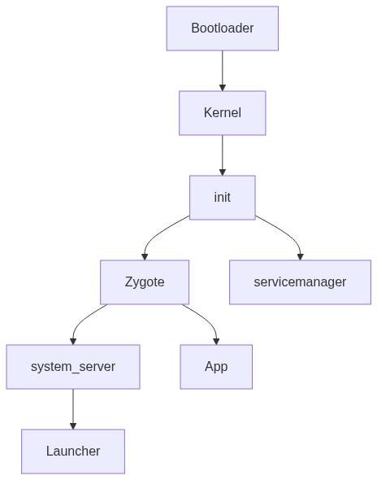
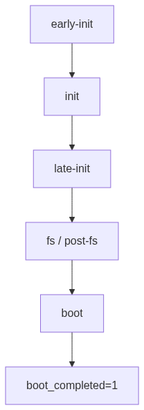
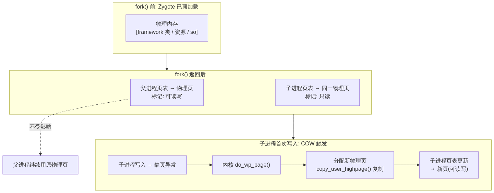
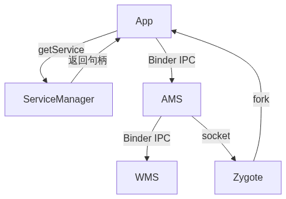
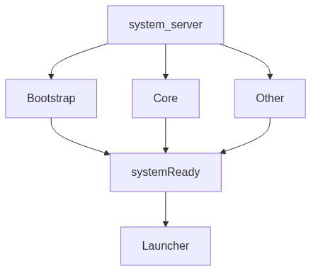
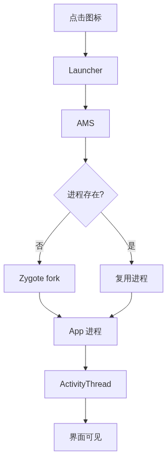

# Android 系统启动分析

> 从按下电源键到 Launcher 桌面的完整进程诞生链。按启动顺序逐组件详解，图示为主，文字为辅，关键源码逐一拆解。

## 目录

- [一、总览](#一总览)
- [二、Bootloader 详解](#二bootloader-详解)
- [三、Linux Kernel 详解](#三linux-kernel-详解)
- [四、init 进程启动详解](#四init-进程启动详解)
- [五、Zygote 详解](#五zygote-详解)
- [六、ServiceManager 详解](#六servicemanager-详解)
- [七、system_server 详解](#七system_server-详解)
- [八、Launcher 详解](#八launcher-详解)

## 一、总览



**各阶段速览**

| 阶段                 | 关键动作                                       | 产出            | 调试关键字              |
| ------------------ | ------------------------------------------ | ------------- | ------------------ |
| **Bootloader**     | 硬件初始化、签名校验（AVB）、载入内核+ramdisk               | 跳转内核          | —                  |
| **Kernel**         | 解压、架构初始化、挂载 rootfs、exec `/init`            | PID 1 → init  | `dmesg`            |
| **init (1st)**     | 挂载 /system /vendor、加载 sepolicy             | SELinux 生效    | `init:`            |
| **init (2nd)**     | 解析 `init.rc`、触发 action、启动 service          | native 服务就绪   | `init:`            |
| **servicemanager** | init 拉起，提供 Binder 服务注册/查询                  | Binder 注册中心就绪 | —                  |
| **Zygote**         | 启动 ART、预加载、注册 socket 监听                    | 进入 fork 等待    | `Zygote:`          |
| **system_server**  | 三批发布系统服务、注册 ServiceManager                 | AMS 就绪        | `SystemServer:`    |
| **Launcher**       | AMS 查 HOME → fork Launcher                 | 桌面可见          | `ActivityManager:` |
| **App 启动**         | 点图标→AMS 请求 Zygote fork→ActivityThread.main | App 进程+界面     | `ActivityManager:` |

---

## 二、Bootloader 详解

Bootloader 是设备上电后运行的**第一段软件**，固化在芯片 Boot ROM 或专用闪存分区，职责是把可信的 Linux 内核安全加载进内存。

### 1. 启动链（以高通平台为例）

| 阶段      | 名称                                | 职责                    |
| ------- | --------------------------------- | --------------------- |
| PBL     | Primary Boot Loader（Boot ROM，不可改） | 最小硬件初始化，加载并验证下一级      |
| SBL/XBL | Secondary/eXtensible Boot Loader  | 初始化 DRAM、时钟、电源，加载 ABL |
| ABL     | Android Boot Loader（含 fastboot）   | 验证并加载 boot 镜像，跳转内核    |

> 不同厂商命名不同（MTK 用 Preloader + LK），但「逐级加载 + 逐级验证」的思路一致。

### 2. 核心职责

- 初始化最基础硬件：DRAM、时钟、电源管理、最小存储/调试接口
- 决定启动模式：正常启动 / Recovery / Fastboot（Download）
- 安全校验：通过 AVB 验证 boot/vendor/system 等镜像
- 加载内核：把 kernel、ramdisk、dtb（设备树）读入内存并跳转

### 3. 安全启动链（Chain of Trust）

```text
Boot ROM(不可改，eFuse 存公钥哈希)
  → 验证 PBL 签名
    → 验证 SBL 签名
      → 验证 ABL 签名
        → AVB 验证 boot 镜像
          → 进入 Kernel
```

信任根在芯片 Boot ROM，每一级验证下一级签名；任何一级验签失败即拒绝启动。

### 4. AVB（Android Verified Boot）

| 机制                       | 作用                                                 |
| ------------------------ | -------------------------------------------------- |
| **vbmeta**               | 存各分区哈希/签名的元数据分区                                    |
| **hashtree / dm-verity** | 保证 system/vendor 只读分区完整性                           |
| **rollback index**       | 防止回滚到有漏洞的旧版本                                       |
| **locked / unlocked**    | locked 只接受厂商签名；`fastboot flashing unlock` 后可刷自定义镜像 |

### 5. A/B（无缝）更新相关

- Bootloader 依据 `slot`（A/B）标记选择启动哪套分区
- 依据 `bootable` / `successful` 标记判断上次启动是否成功，失败自动回切到另一槽位

---

## 三、Linux Kernel 详解

> **一句话概述**：Linux Kernel 是启动的第二个阶段——完成硬件与内核子系统初始化、挂载根文件系统，并启动第一个用户态进程 init，把系统从裸机带入用户空间。

### 1. 内核启动主流程

```text
自解压 → start_kernel() → rest_init()
  → kernel_init 线程
    → 挂载 rootfs（initramfs）
      → exec("/init")   ← 第一个用户态进程
```

- `start_kernel()`：初始化内存管理、调度器、中断、定时器等核心子系统
- `rest_init()`：创建 `kernel_init`（未来 PID 1）与 `kthreadd`（PID 2）
- `kernel_init`：执行各级 `initcall`（驱动初始化），挂载 rootfs，最后 `exec` 成用户态 `init`

### 2. initcall 级别（驱动加载顺序）

内核用 `initcall` 分级保证初始化顺序：

```text
early → core → postcore → arch → subsys → fs → device → late
```

驱动按级别依次 `probe`，依赖未就绪的进入 deferred probe 稍后重试。

### 3. Android 特有的内核改动

| 特性                    | 作用                   |
| --------------------- | -------------------- |
| **Binder**            | 进程间通信核心驱动            |
| **ashmem**            | 匿名共享内存，跨进程共享大块数据     |
| **wakelock**          | 电源管理，阻止 CPU 休眠       |
| **Low Memory Killer** | 内存不足时按优先级回收进程        |
| **logger**            | 内核态日志环形缓冲（logcat 后端） |
| **ION / dma-buf**     | 图形/多媒体内存分配与共享        |

### 4. 设备树（DTB）

- 硬件信息不硬编码进内核，而用**设备树**描述
- Bootloader 把 dtb 传给内核，内核据此初始化对应驱动
- Android 用 **DTBO** 分区叠加厂商差异

### 5. rootfs 与分区挂载

- 内核先挂载 **initramfs**（ramdisk 里的临时根），含 `init`、`fstab`、`sepolicy`
- system-as-root 后 `/` 直接是 system 分区
- 通过 **dm-verity** 挂载只读分区（完整性校验）
- 后续由 init 挂载 `/vendor`、`/data` 等

### 6. GKI（通用内核镜像，Android 11+）

- 把通用内核（GKI）与厂商模块（vendor modules）分离
- 提升内核一致性，简化 OTA 与安全更新

---

## 四、init 进程启动详解

init 是 Android 用户态**第一个进程（PID 1）**，所有用户态进程的祖先，负责拉起整个用户空间。

### 1. init 启动总流程（源码视角）

```text
kernel → /init main()
  → FirstStageMain()     # 第一阶段：基础文件系统
  → SetupSelinux()       # 加载 SELinux 策略
  → SecondStageMain()    # 第二阶段：属性服务 + 解析 rc + 事件循环
```

源码路径：`system/core/init/`（`main.cpp` → `first_stage_init.cpp` → `selinux.cpp` → `init.cpp`）

### 2. 两个阶段

| 阶段           | 入口                  | 职责                                                     |
| ------------ | ------------------- | ------------------------------------------------------ |
| First stage  | `FirstStageMain()`  | 创建/挂载 `/dev`、`/proc`、`/sys`、`/system`、`/vendor`，准备早期环境 |
| Second stage | `SecondStageMain()` | 初始化属性服务、解析 rc、启动所有 service、进入 epoll 主循环                |

### 3. init.rc 与 init 语言

init 不硬编码启动逻辑，而是解析 `.rc` 脚本：

- **service**：定义一个服务（可执行文件、user/group、权限、重启策略）
- **on `<trigger>`**：在某触发点执行一组 command
- **import**：引入其他 rc 文件
- 触发点示例：`early-init`、`init`、`late-init`、`early-fs`、`fs`、`post-fs`、`boot`、`property:<key>=<value>`

### 4. action 触发顺序



### 5. 属性服务（Property Service）

- init 维护一块共享内存存放键值对
- 进程通过 unix socket `/dev/socket/property_service` 读写
- 命名空间：`ro.*`（只读）、`sys.*`（运行时）、`persist.*`（持久化到 `/data/property`）
- 关键属性：`sys.boot_completed`、`ro.build.*`、`init.svc.<service>`（服务运行状态）
- 属性变化可触发 action，如 `on property:sys.boot_completed=1`

### 6. 关键 native 服务

| 关键 service       | 何时启动       | 职责              |
| ---------------- | ---------- | --------------- |
| `ueventd`        | early-init | 创建设备节点 `/dev/*` |
| `servicemanager` | init       | Binder 名字服务     |
| `logd`           | init       | 系统日志守护          |
| `vold`           | late-fs    | 卷管理、SD 卡挂载      |
| `zygote`         | late-init  | ART 孵化器         |
| `netd`           | boot       | 网络守护            |

### 7. ueventd：设备节点管理

- 监听内核 uevent（设备热插拔事件）
- **coldboot**：启动时遍历 `/sys`，为已存在设备补发 uevent
- 按 `ueventd.rc` 规则创建 `/dev` 节点并设置权限

### 8. SELinux 加载

- first stage 加载 `sepolicy`（`/system/etc/selinux` 或 `/vendor/etc/selinux`）
- init 早期 `setenforce` 进入 enforcing
- 服务以各自安全上下文运行，越权操作被 avc 拒绝（`dmesg | grep avc`）

### 9. 服务重启与看门狗

- service 可声明 `oneshot`（退出不重启）/ `critical`（崩溃多次触发重启进 recovery）
- `onrestart`：服务重启时执行的命令
- init 通过 `SIGCHLD` 回收子进程并按策略重启，防止关键服务静默退出

---

## 五、Zygote 详解

Zygote 是 Android 的 **ART 孵化器**，由 init 通过 `app_process` 启动，是所有 Java 进程（system_server 与 App）的「母体」。

### 1. 启动流程（源码视角）

```text
init → app_process
  → ZygoteInit.main()
    → preload()            # 预加载类/资源/共享库
    → 注册 zygote socket    # 监听 fork 请求
    → forkSystemServer()   # 先孵化 system_server
    → runSelectLoop()      # 进入循环等待 AMS 的 fork 请求
```

源码：`frameworks/base/core/java/com/android/internal/os/ZygoteInit.java`

### 2. 预加载（preload）

- **preload-classes**：~1800+ framework 常用类
- **preload-resources**：framework 公共资源（图片、布局、drawable）
- **共享库**：libandroid_runtime 等
- 目的：把「公共部分」先在 Zygote 加载好，子进程直接继承

### 3. fork + COW（核心）



- 子进程继承 Zygote 地址空间与已加载类
- 只读页共享，写入时才复制（Copy-On-Write）
- 结果：App 启动快、内存省

### 4. Zygote 进程变体

| 进程                 | 用途                               |
| ------------------ | -------------------------------- |
| `zygote64`         | 主孵化器（64 位），产 system_server + App |
| `zygote`           | 辅助（32 位），兼容旧 App                 |
| `zygote_secondary` | 隔离进程池（USAP，WebView 等）            |

### 5. 为什么不直接新建进程

新建进程要重新加载 ART + framework（慢、费内存）；fork Zygote 则复用已加载内容，几乎零成本。

---

## 六、ServiceManager 详解

ServiceManager 是 **Binder 服务的注册中心（名字服务）**，由 init 最早拉起的 native 进程之一，负责让各进程「按名字找到服务」。

### 1. 它解决什么问题

Android 系统服务（AMS/WMS/PMS…）运行在不同进程，客户端要调用必须先拿到对方的 Binder 句柄。ServiceManager 维护一张「服务名 → Binder 句柄」映射表，充当全局查询入口。

### 2. 工作原理

```text
服务端：publishBinderService("activity", binder) → 注册到 ServiceManager
客户端：getService("activity") → ServiceManager 返回 binder 句柄
        → 之后客户端直接与服务端 Binder 通信（不再经过 ServiceManager）
```



### 3. 关键点

- **handle 0**：ServiceManager 在 Binder 驱动中固定为 context manager（句柄 0），任何进程无需查询即可找到它
- 通过 `BINDER_SET_CONTEXT_MGR` 向驱动注册自己
- 只负责「找对象」，真正的数据传输经 Binder 驱动直达
- 普通服务走 `binder` 域，HAL 服务走独立的 `hwbinder` / `vndservicemanager`

### 4. 源码

`frameworks/native/cmds/servicemanager/`

---

## 七、system_server 详解

system_server 是 Zygote fork 出的**第一个 Java 系统进程**，承载绝大多数系统服务（AMS/WMS/PMS 等），是 framework 层的核心。

### 1. 启动流程

```text
Zygote.forkSystemServer()
  → SystemServer.main()
    → createSystemContext()      # 创建系统上下文
    → startBootstrapServices()   # 引导服务
    → startCoreServices()        # 核心服务
    → startOtherServices()       # 其他服务
    → Looper.loop()              # 进入消息循环
```

源码：`frameworks/base/services/java/com/android/server/SystemServer.java`

### 2. 三批服务



| 批次            | 特征      | 核心服务                                  |
| ------------- | ------- | ------------------------------------- |
| **Bootstrap** | 最优先、互依赖 | AMS, PMS, PowerMS, DisplayMS          |
| **Core**      | 基础设施    | BatteryS, UsageStatsS, WebViewUpdateS |
| **Other**     | 上层功能    | WMS, NotificationMS, LocationMS       |

### 3. 关键服务职责

| 服务          | 职责                     |
| ----------- | ---------------------- |
| **AMS**     | Activity、任务栈、进程与生命周期管理 |
| **WMS**     | 窗口、Surface、焦点          |
| **PMS**     | 应用安装、包信息、权限            |
| **PowerMS** | 亮灭屏、休眠、唤醒锁             |

### 4. 收尾：systemReady()

- 各服务启动后 `publishBinderService()` 注册到 ServiceManager
- AMS 调 `systemReady()`：启动看门狗、发 `BOOT_COMPLETED`、启动 Launcher
- 此时系统服务全部就绪

---

## 八、Launcher 详解

Launcher 是系统的 **HOME 应用（桌面）**，本质上是一个普通 App，但承担系统桌面角色。

### 1. 启动过程

**（1）AMS 决策：启动哪个 Launcher**

```text
AMS.systemReady()
  → startHomeOnAllDisplays()
    → 构造 Intent(ACTION_MAIN, CATEGORY_HOME)
    → resolveActivity() 查询 PMS 中匹配的 Activity
    → 有多个 HOME 时：
        - 若用户已选默认 → 直接用
        - 若无默认 → 弹出选择框（ResolverActivity）
    → 取到目标 Launcher 的 ComponentName
```

**（2）Launcher 进程创建**

```text
AMS.startActivity(intent, LauncherComponentName)
  → 目标进程不存在 → Zygote socket 请求 fork
  → Zygote fork() 出 Launcher 进程
  → 子进程 exec ActivityThread.main()
    → attachApplication() 向 AMS 注册
    → 创建 Application（回调 onCreate）
    → AMS 调度 Activity 生命周期
```



**（3）Launcher 桌面加载**

```text
LauncherActivity 启动后：
  → 通过 PMS 查询所有 CATEGORY_LAUNCHER 的 Activity
  → 按应用分组生成快捷方式列表
  → inflate workspace 布局（桌面网格）
  → 逐个加载图标（异步，减轻主线程压力）
  → 恢复已有的 AppWidget（RemoteViews 跨进程渲染）
  → 监听应用安装/卸载广播，实时更新桌面图标
```

### 2. 关键点

- Launcher 与普通 App 一样由 Zygote fork、运行 ActivityThread
- 通过 `CATEGORY_HOME` 标识自身为桌面；系统可装多个 Launcher
- 有多个 HOME 时 RESOLVE 机制弹出选择框，用户选默认后记录到 PMS
- 职责：显示桌面图标、管理 widget、响应点击 launch 其他 App
- 按 Home 键回到已运行的 Launcher（Resume，不重新创建）
