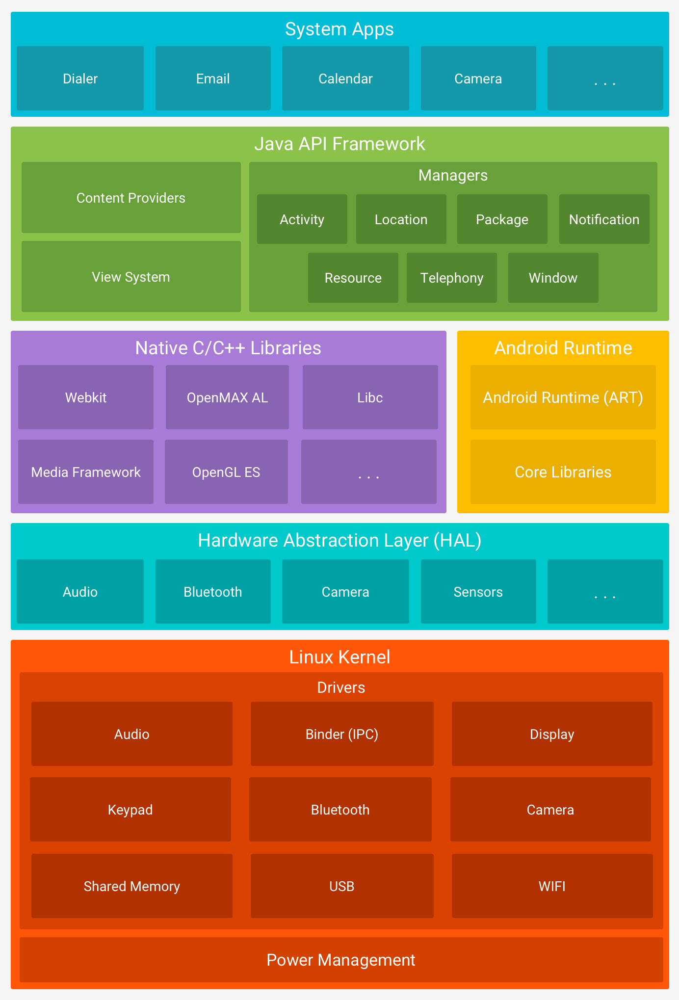
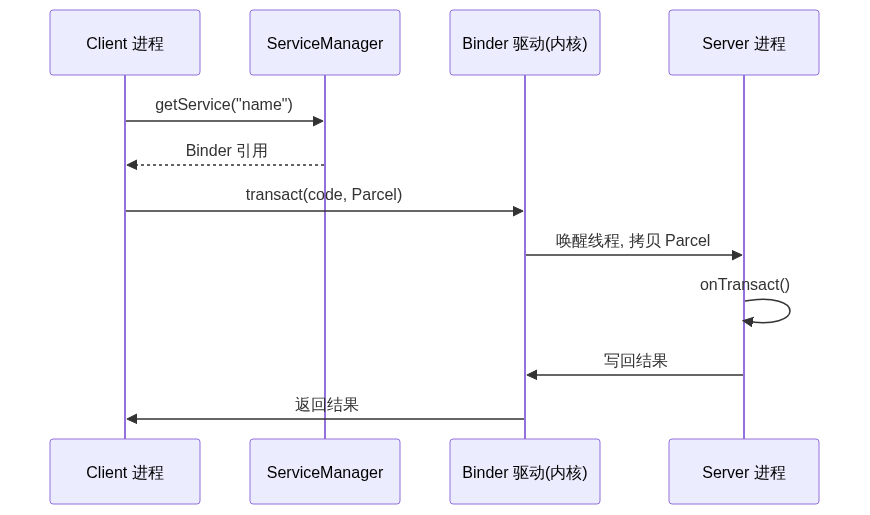
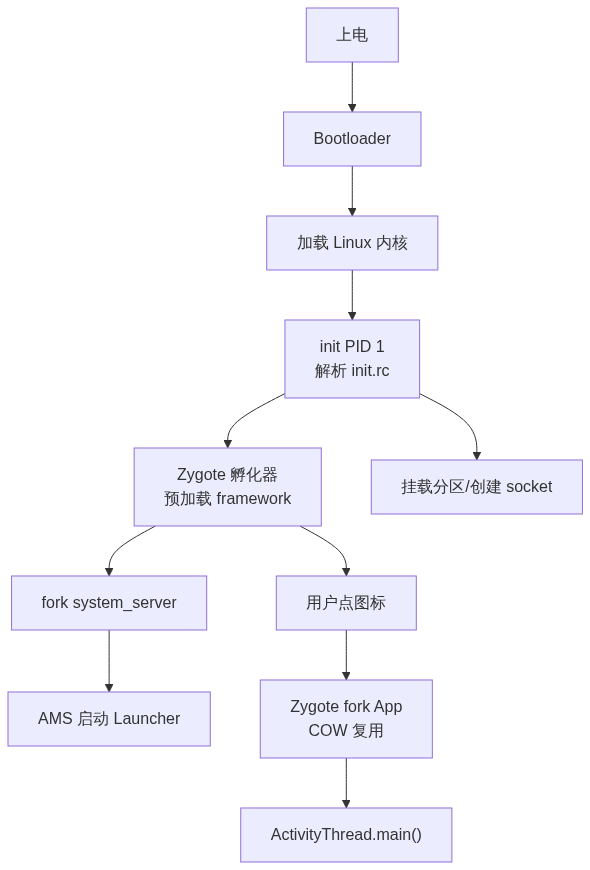

# Android 系统结构

> 从底层内核到上层应用的完整分层，重点讲清每一层的职责、关键组件，以及层与层之间如何协作。目标：建立一张可长期对照的「Android 全景图」。

## 目录

- [一、总览](#一总览)
- [二、分层详解](#二分层详解)
  - [1. Linux 内核层](#1-linux-内核层linux-kernel)
  - [2. 硬件抽象层](#2-硬件抽象层hal-hardware-abstraction-layer)
  - [3. 原生 C/C++ 库](#3-原生-cc-库native-libraries)
  - [4. Android 运行时](#4-android-运行时art-android-runtime)
  - [5. Java API 框架层](#5-java-api-框架层application-framework)
  - [6. 系统应用层](#6-系统应用层system-apps)
- [三、关键跨层机制](#三关键跨层机制)
  - [Binder IPC](#binder-ipc)
  - [JNI](#jnijava-native-interface)
  - [启动流程](#启动流程)
  - [分区（简要）](#分区简要)
- [四、一条 UI 绘制的完整链路](#四一条-ui-绘制的完整链路)

## 一、总览

Android 基于 Linux，但在内核之上叠加了专为移动场景设计的运行时与框架。自上而下分为六层。日常开发主要打交道的是 **Java API 框架层**（SDK 类）与运行在 **ART** 上的应用进程；其余各层由系统维护。

### 分层架构图

下图是 AOSP 官方的六层堆栈图——从 Linux 内核到系统应用，自上而下逐层展示 Android 的完整软件架构。



> 图源：Android Open Source Project 官方软件堆栈图（via Wikimedia Commons，CC 授权）。图中自上而下为：系统应用 → Java API 框架 → Android 运行时 & 原生 C/C++ 库 → HAL → Linux 内核。

---

## 二、分层详解

### 1. Linux 内核层（Linux Kernel）

Android 的底座，基于长期支持（LTS）的 Linux 内核，并打了大量 Android 专有补丁。

**核心职责**

- 进程调度、内存管理、权限（UID/GID）、网络栈
- 设备驱动：显示、相机、音频、蓝牙、USB、Wi-Fi、电池等

**Android 特有部分**

- **Binder 驱动**：跨进程通信的基石（见第三节），替代传统 socket/pipe，仅一次内存拷贝
- **ashmem（匿名共享内存）**：跨进程大块数据共享，如 Surface 图形缓冲
- **wakelocks**：电源管理，决定 CPU 能否休眠（持锁则不睡）
- **LOW_MEMORY_KILLER**：内存紧张时按 `oom_score_adj` 优先级杀进程
- **SELinux**：强制访问控制，默认 `enforcing` 模式，限制进程权限边界
- **epoll / cgroup**：事件驱动 I/O 与按组资源隔离（控制进程组 CPU/内存配额）

---

### 2. 硬件抽象层（HAL, Hardware Abstraction Layer）

位于内核驱动与框架之间的「接口契约层」，用 C/C++ 实现，以 `.so` 动态库形式存在。

**作用**

- 屏蔽各家芯片/硬件差异，让上层框架无需关心具体实现
- 框架通过 `hwbinder`（HAL 专用 Binder 域）或 `binder` 调用 HAL，HAL 再调内核驱动

**演进**

- **传统 HAL**（旧）：基于 `dlopen` 加载 `module`，如 `camera.default.so`
- **HIDL**（Treble 后，Android 8+）：接口定义语言，框架与 HAL 可独立更新、跨进程通信
- **AIDL for HAL / Stable AIDL**（Android 10+ 主推）：统一接口语言，支持**版本化**与向后兼容，逐步取代 HIDL
- **Project Treble**：把 HAL 从 `system` 分区拆出到 `vendor` 分区，实现「框架 OTA 不依赖厂商适配」

**常见 HAL 模块**：Camera、Audio、Sensors、Graphics (Gralloc/HWC)、蓝牙、NFC。

---

### 3. 原生 C/C++ 库（Native Libraries）

大量底层能力由 C/C++ 编写，通过 JNI 暴露给上层 Java 框架。

| 库                               | 职责                                   |
| ------------------------------- | ------------------------------------ |
| **SQLite**                      | 轻量嵌入式数据库，支撑 `ContentProvider`/`Room` |
| **OpenGL ES / Vulkan / Skia**   | 图形渲染；Skia 负责 2D 绘制，HWUI 基于它做 UI 硬件加速 |
| **Webkit / Chromium (WebView)** | 浏览器内核，支撑 `WebView`                   |
| **OpenSSL / Conscrypt**         | 加解密与 TLS                             |
| **libc (Bionic)**               | Android 定制 C 标准库（非 glibc，体积更小、面向嵌入式） |
| **Media / Stagefright**         | 音视频编解码与播放                            |
| **SurfaceFlinger**              | 系统图形合成器，把各窗口的 BufferQueue 合成到屏幕      |
| **AudioFlinger**                | 音频混合与输出                              |

**图形栈深入**：App 绘制 → 通过 `Surface` 向 `SurfaceFlinger` 申请 `GraphicBuffer`（经 BufferQueue 的生产者/消费者模型）→ SurfaceFlinger 按 Z-order 合成 → 送 `HWC`（硬件合成器）或 GPU 上屏。

**JNI 桥接**：Java 层方法通过 `native` 关键字调用这些库，例如 `Bitmap`、`AudioTrack`、`System.currentTimeMillis()`。

---

### 4. Android 运行时（ART, Android Runtime）

每个应用运行在独立的 ART 虚拟机进程中（Android 5.0 起取代 Dalvik）。

**关键机制**

- **AOT 编译**：安装时把 DEX 编译为机器码（OAT），运行更快、更省电
- **JIT 编译**：运行时对热点代码即时编译，配合 Profile 在空闲/充电时做「云配置文件」优化（App 安装后从 Play 下发热门路径 profile，加速首启）
- **GC**：分代垃圾回收（年轻代/老年代），低暂停；Android 8+ 引入并发 `Concurrent Copying` GC（移动存活对象，减少停顿）；每个线程有 `TLAB`（线程本地分配缓冲）加速小对象分配
- **DEX / OAT**：`.dex` 经 `dex2oat` 编译为 `.oat`；`multi-dex` 与 `ART 配置文件` 共同优化启动

**与应用的关系**

- 每个 App 是独立 Linux 进程 + 独立 ART 实例，拥有独立 UID，彼此隔离
- 系统服务（如 `system_server`）也运行在 ART 中，但属于特权进程（共享系统 UID、走 signature 权限）

---

### 5. Java API 框架层（Application Framework）

开发者通过 SDK 直接调用的「系统服务 + 组件管理」层，绝大多数以 Java 编写，运行在 `system_server` 或各 Binder 服务中。

**核心系统服务**

| 服务                               | 职责                                |
| -------------------------------- | --------------------------------- |
| **ActivityManagerService (AMS)** | 管理 Activity 生命周期、任务栈、进程调度与 OOM 调整 |
| **WindowManagerService (WMS)**   | 窗口层级、Surface 管理、输入焦点与 Token 校验    |
| **PackageManagerService (PMS)**  | 应用安装、权限、组件查询与解析                   |
| **PowerManagerService**          | 唤醒锁、屏幕、休眠策略                       |
| **NotificationManagerService**   | 通知分发                              |
| **LocationManagerService**       | 定位                                |
| **ConnectivityService**          | 网络状态与连接管理                         |

**四大组件（应用开发基石）**

- **Activity**：单一屏幕界面，受 AMS 生命周期管理
- **Service**：后台长任务，分启动式与绑定式
- **BroadcastReceiver**：跨应用/系统事件广播
- **ContentProvider**：跨进程结构化数据共享

**关键概念**

- **Context**：全局环境句柄，是访问资源、启动组件、获取系统服务的入口
- **Binder IPC**：跨进程调用四大组件、系统服务均经 Binder；每个 Binder 服务有独立**线程池**处理并发请求
- **Intent**：组件间通信的「信使」，分显式/隐式
- **Handler / Looper / MessageQueue**：线程内消息驱动模型（主线程即靠它运转 `Looper.loop()`）

---

### 6. 系统应用层（System Apps）

预装应用与用户安装的应用，位于架构最顶层，完全运行在 ART 之上，调用的全是框架层 API。

- **系统应用**：Launcher、Settings、Phone、Contacts、SystemUI 等，拥有更高权限（`signature|privileged`），可声明普通 App 无法使用的受保护权限
- **用户应用**：普通 App，沙箱隔离，仅能访问自身数据与被授予的权限

---

## 三、关键跨层机制

本章覆盖 Android 架构中最核心的四项跨层能力——Binder IPC（进程通信骨架）、JNI（Java↔Native 桥梁）、系统启动流程（从加电到 App 运行）、以及分区布局（存储侧的结构基础）。

### Binder IPC

Android 的跨进程通信 backbone，C/S 模型。一次典型调用：



**深入点**

- **一次拷贝**：数据经内核 Binder 驱动中转，Client→驱动→Server 仅一次内存拷贝（对比管道/socket 需两次），靠 `mmap` 共享内核缓冲区实现
- **线程池**：Server 端维护 Binder 线程池（默认最大 15），并发处理多个 Client 请求；`Parcel` 是序列化载体
- **两个域**：普通服务走 `binder`，HAL 走独立的 `hwbinder`，隔离框架与厂商代码

**Binder 驱动核心：ioctl 收发**

```cpp
// 底层 ioctl 封装 — frameworks/native/libs/binder/IPCThreadState.cpp
status_t IPCThreadState::transact(int32_t handle, uint32_t code,
                                   const Parcel& data, Parcel* reply, uint32_t flags) {
    // 将 handle + code + Parcel 写入 Binder 驱动（单次 ioctl）
    status_t err = writeTransactionData(BC_TRANSACTION, flags, handle, code, data, nullptr);
    // 阻塞等待驱动返回
    err = waitForResponse(reply);
    return err;
}
```

> 本质就是一次 `ioctl(fd, BINDER_WRITE_READ, ...)`——把序列化后的数据丢给内核，内核负责找到目标进程、拷贝数据、唤醒对端线程。
- **AIDL**：接口描述语言，编译后自动生成 `Stub`（服务端）/`Proxy`（客户端）样板代码

### JNI（Java Native Interface）

连接 Java 框架与原生库的桥。应用层 `native` 方法、系统服务中的性能敏感路径都经此下沉到 C/C++。

```cpp
// frameworks/base/core/jni/AndroidRuntime.cpp
int AndroidRuntime::startReg(JNIEnv* env) {
    // gRegJNI 是静态数组，含上百个 framework 类的 JNI 注册项
    if (register_jni_procs(gRegJNI, NELEM(gRegJNI), env) < 0) {
        return -1;
    }
    return 0;
}
// 每个 REG_JNI 宏展开为 env->RegisterNatives(clazz, methods, nMethods)
// 将 Java native 方法绑定到对应 C 函数指针
```

> `RegisterNatives` 把 Java 方法映射到 C 函数指针，避免逐次按名查找——子进程通过 COW 继承这套绑定，零成本可用。

### 启动流程

从设备上电到 Launcher 桌面可见的完整进程诞生链——Bootloader → 内核 → init → Zygote → system_server → Launcher，每一环都有明确产出。



**深入点**

- **Zygote 预加载**：启动时把常用 framework 类、资源、ART 堆预加载进自身；后续 `fork` 应用进程时通过**写时复制（COW）** 直接复用，免去每个 App 重新加载，极大加速冷启动
- **fork 而非新建**：应用的 ART 实例来自 Zygote 副本，故所有 App 共享同一套基础类加载器根
- **init.rc**：声明各原生服务、权限、文件系统的启动脚本，是用户态起点

### 分区（简要）

Android 存储设备的物理划分——不同分区承载不同职责，并且有独立的 OTA 策略。

- `boot`：内核与 ramdisk
- `system`：框架与系统应用（Treble 后框架可独立 OTA）
- `vendor`：厂商 HAL 实现
- `userdata`：用户数据与应用
- `cache` / `recovery` 等辅助分区

---

## 四、层级协作示例-UI绘制的过程

用一次「点击按钮 → 画面变化」把前文六层的协作串起来——每一步都跨越不同层级，是建立全栈认知的最佳切面。

> 用「点击按钮 → 画面变化」把跨层协作串起来，便于建立全局观：

1. **应用层**：`View.invalidate()` 标记脏区 → `ViewRootImpl` 经 `Choreographer` 在下一帧 `doFrame`
2. **框架层**：主线程 `performTraversals()` 执行 measure/layout/draw，draw 调用 `Skia`/`HWUI`
3. **运行时/原生库**：绘制指令经 JNI 下沉到 `Skia`，写入 `Surface` 的 `GraphicBuffer`
4. **SurfaceFlinger**：通过 BufferQueue 拿到各窗口缓冲，按 Z-order 合成
5. **HAL**：合成结果送 `HWC`（硬件合成器）或回退 GPU
6. **内核/硬件**：帧缓冲上屏，显示器刷新

可见**一次看似简单的重绘，跨越了框架 → JNI → 原生库 → SurfaceFlinger → HAL → 内核**六层。
