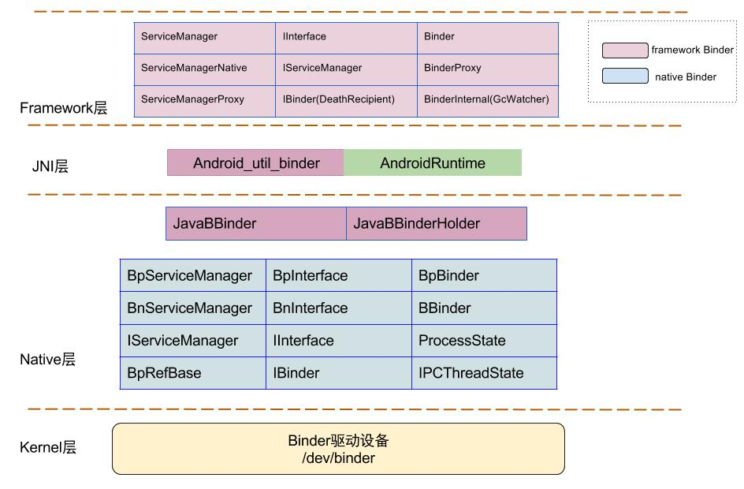
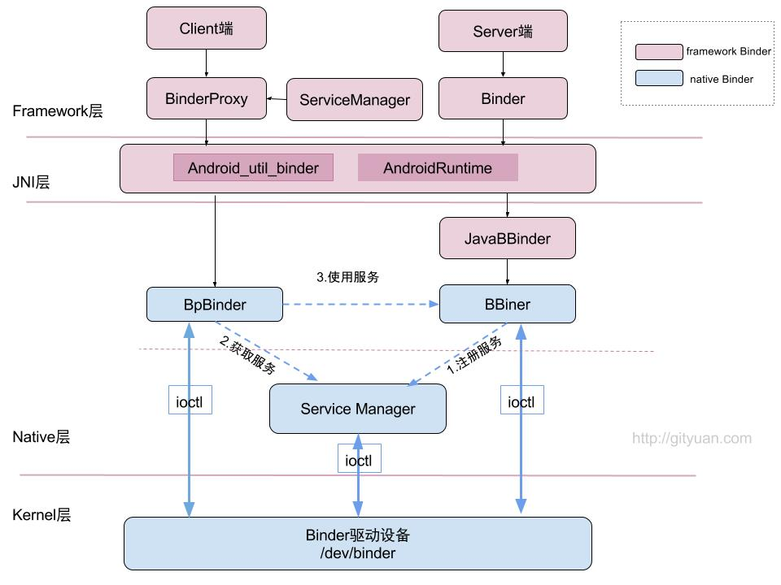
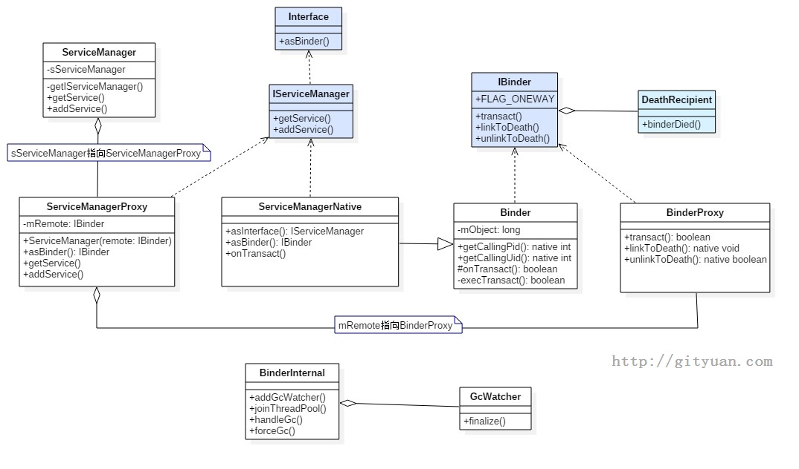

# Binder Framework 层分析

> Binder 在 Java Framework 层采用与 Native 层一致的 C/S 架构（Binder/BinderProxy ↔ BBinder/BpBinder），通过 JNI 桥接 Native Binder 通信能力。本文按 JNI 初始化、核心类关系、AIDL 编译机制三部分展开，覆盖 ServiceManager 的 Java 层封装和完整的跨进程调用链路。




## 目录

- [一、Framework 层核心类关系](#一framework-层核心类关系)
- [二、Binder JNI 初始化](#二binder-jni-初始化)
  - [2.1 Zygote 启动时的 JNI 注册](#21-zygote-启动时的-jni-注册)
  - [2.2 int_register_android_os_Binder](#22-int_register_android_os_binder)
  - [2.3 int_register_android_os_BinderProxy](#23-int_register_android_os_binderproxy)
- [三、ServiceManager 的 Java 层封装](#三servicemanager-的-java-层封装)
- [四、AIDL 与完整调用链路](#四aidl-与完整调用链路)

---

## 一、Framework 层核心类关系



Java 层的 Binder 架构与 Native 层一一对应，命名和设计高度一致：

| Java 层 | Native 层 | 角色 |
|---------|----------|------|
| `IBinder` 接口 | `IBinder` 抽象类 | 跨进程通信的顶层接口 |
| `Binder` | `BBinder` | 服务端基类，实现 `onTransact()` |
| `BinderProxy` | `BpBinder` | 客户端代理，封装 `transact()` 发送请求 |
| `Parcel` | `Parcel` | 数据序列化/反序列化容器 |
| `IInterface` | `IInterface` | 业务接口基类，`asInterface()` 转换代理 |

ServiceManager 的调用链：

```
ServiceManager.getService("activity")
  → getIServiceManager()
    → ServiceManagerNative.asInterface(BinderInternal.getContextObject())
      → ServiceManagerProxy               // 客户端代理
        → mRemote (BinderProxy, handle=0)  // 实际发包给 ServiceManager
```

> `ServiceManager.getService()` 面向开发者，底层通过 `ServiceManagerProxy` 将请求封装为 Binder 事务发送给 handle 0。

Binder 类自身的内部结构：



```
Binder (Java 服务端)
  ├── mObject (long)      → native 层 BBinder 的指针
  ├── execTransact()      → native 回调入口，由 Binder 线程调用
  └── onTransact()        → 子类重载实现业务逻辑

BinderProxy (Java 客户端)
  ├── mNativeData (long)  → native 层 BpBinderProxy 的指针
  └── transact()          → JNI → native transact → ioctl
```

---

## 二、Binder JNI 初始化

Binder 的 Java API 通过 JNI 桥接到 Native 层——这个桥在 Zygote 启动时一次性建立，所有 App 进程通过 COW 继承。

### 2.1 Zygote 启动时的 JNI 注册

```cpp
// frameworks/base/core/jni/AndroidRuntime.cpp
int AndroidRuntime::startReg(JNIEnv* env) {
    // gRegJNI 是静态数组，含上百个 framework 类的 JNI 注册项
    if (register_jni_procs(gRegJNI, NELEM(gRegJNI), env) < 0) {
        return -1;
    }
    return 0;
}
```

`gRegJNI` 数组中与 Binder 相关的注册项：

```cpp
static const RegJNIRec gRegJNI[] = {
    REG_JNI(register_android_os_Binder),       // Binder / BinderInternal / BinderProxy
    REG_JNI(register_android_os_Parcel),       // Parcel
    REG_JNI(register_android_os_ProcessState), // ProcessState
    // ...
};
```

### 2.2 int_register_android_os_Binder

```cpp
int register_android_os_Binder(JNIEnv* env) {
    if (int_register_android_os_Binder(env) < 0)          return -1;
    if (int_register_android_os_BinderInternal(env) < 0)  return -1;
    if (int_register_android_os_BinderProxy(env) < 0)     return -1;
    return 0;
}
```

**注册 Binder 类**：

```cpp
static int int_register_android_os_Binder(JNIEnv* env) {
    jclass clazz = FindClassOrDie(env, "android/os/Binder");

    // 缓存 Java 类和方法 ID 到全局变量 gBinderOffsets
    gBinderOffsets.mClass        = MakeGlobalRefOrDie(env, clazz);
    gBinderOffsets.mExecTransact = GetMethodIDOrDie(env, clazz, "execTransact", "(IJJI)Z");
    gBinderOffsets.mObject       = GetFieldIDOrDie(env, clazz, "mObject", "J");

    // 注册 native 方法：Java 声明 native 的方法 → 绑定 C 函数
    return RegisterMethodsOrDie(env, kBinderPathName, gBinderMethods,
                                NELEM(gBinderMethods));
}
```

`mObject` 字段（`long` 类型）存储 native 层 `BBinder` 对象的指针——Java 层的 `Binder` 通过这个 `long` 值找到对应的 native 实体。

### 2.3 int_register_android_os_BinderProxy

```cpp
static int int_register_android_os_BinderProxy(JNIEnv* env) {
    jclass clazz = FindClassOrDie(env, "android/os/BinderProxy");

    // 缓存 transact 相关的方法 ID
    gBinderProxyOffsets.mNativeData = GetFieldIDOrDie(env, clazz, "mNativeData", "J");

    return RegisterMethodsOrDie(env, kBinderProxyPathName, gBinderProxyMethods,
                                NELEM(gBinderProxyMethods));
}
```

注册的核心 native 方法：

```cpp
static const JNINativeMethod gBinderProxyMethods[] = {
    {"pingBinder",          "()Z",    (void*)android_os_BinderProxy_pingBinder},
    {"isBinderAlive",       "()Z",    (void*)android_os_BinderProxy_isBinderAlive},
    {"getInterfaceDescriptor", "()Ljava/lang/String;",
     (void*)android_os_BinderProxy_getInterfaceDescriptor},
    {"transactNative",      "(ILandroid/os/Parcel;Landroid/os/Parcel;I)Z",
     (void*)android_os_BinderProxy_transact},
    {"linkToDeath",         "(Landroid/os/IBinder$DeathRecipient;I)V",
     (void*)android_os_BinderProxy_linkToDeath},
    {"unlinkToDeath",       " ... ",
     (void*)android_os_BinderProxy_unlinkToDeath},
    {"destroy",             "()V",    (void*)android_os_BinderProxy_destroy},
};
```

> `RegisterMethodsOrDie` 等价于 `env->RegisterNatives(clazz, methods, count)`——将 Java 声明的 native 方法与 C 函数指针绑定。Zygote 子进程通过 COW 继承这套绑定，每个 App 无需重新注册。

---

## 三、ServiceManager 的 Java 层封装

Java 层对 ServiceManager 的调用经过三层代理：

```java
// frameworks/base/core/java/android/os/ServiceManager.java
public static IBinder getService(String name) {
    return getIServiceManager().getService(name);
}

private static IServiceManager getIServiceManager() {
    if (sServiceManager != null) return sServiceManager;

    // BinderInternal.getContextObject() → native → handle=0 的 BpBinder
    sServiceManager = ServiceManagerNative.asInterface(
        BinderInternal.getContextObject()
    );
    return sServiceManager;
}
```

`ServiceManagerNative.asInterface()` 返回 `ServiceManagerProxy`（参数中的 IBinder 是 handle=0 的 BinderProxy）：

```java
static public IServiceManager asInterface(IBinder obj) {
    return new ServiceManagerProxy(obj);
}
```

`ServiceManagerProxy` 的核心方法：

```java
class ServiceManagerProxy implements IServiceManager {
    private IBinder mRemote;

    public ServiceManagerProxy(IBinder remote) {
        mRemote = remote;   // handle=0 的 BinderProxy
    }

    public IBinder getService(String name) {
        Parcel data = Parcel.obtain();
        Parcel reply = Parcel.obtain();
        data.writeInterfaceToken(IServiceManager.descriptor);
        data.writeString(name);

        mRemote.transact(GET_SERVICE_TRANSACTION, data, reply, 0);
        return reply.readStrongBinder();   // 通过 Parcel 读取返回的 Binder 引用
    }

    public void addService(String name, IBinder service, ...) {
        Parcel data = Parcel.obtain();
        data.writeInterfaceToken(IServiceManager.descriptor);
        data.writeString(name);
        data.writeStrongBinder(service);   // 将 Binder 实体写入 Parcel

        mRemote.transact(ADD_SERVICE_TRANSACTION, data, reply, 0);
    }
}
```

---

## 四、AIDL 与完整调用链路

AIDL 编译后生成两个关键文件：服务端的 `Stub` 和客户端的 `Proxy`。

### AIDL 生成的服务端 Stub

```java
// IActivityManager.aidl → 生成的 IActivityManager.java
public interface IActivityManager extends IInterface {
    // 业务方法
    int startActivity(...);

    // Stub：服务端抽象基类
    abstract class Stub extends Binder implements IActivityManager {
        public static IActivityManager asInterface(IBinder obj) {
            return new Proxy(obj);
        }

        @Override
        public boolean onTransact(int code, Parcel data, Parcel reply, int flags) {
            switch (code) {
                case TRANSACTION_startActivity:
                    data.enforceInterface(DESCRIPTOR);
                    int result = startActivity(...);  // 子类实现
                    reply.writeInt(result);
                    return true;
                // ...
            }
        }

        // Proxy：客户端代理
        private static class Proxy implements IActivityManager {
            private IBinder mRemote;   // BinderProxy

            public int startActivity(...) {
                Parcel data = Parcel.obtain();
                Parcel reply = Parcel.obtain();
                data.writeInterfaceToken(DESCRIPTOR);
                data.writeInt(...);

                mRemote.transact(TRANSACTION_startActivity, data, reply, 0);
                return reply.readInt();
            }
        }
    }
}
```

### 完整调用链路（Java → Native → 驱动）

以 App 调用 AMS.startActivity 为例：

```
Java:   ActivityManagerProxy.startActivity(...)
          → mRemote.transact(code, data, reply, 0)
            → BinderProxy.transact(code, data, reply, flags)

JNI:      → android_os_BinderProxy_transact()
             → IBinder* target = getBPNativeData(env, obj);
             → target->transact(code, *data, reply, flags);

Native:     → BpBinder::transact(code, data, reply, flags)
              → IPCThreadState::transact(handle, code, data, reply, flags)
                → writeTransactionData(BC_TRANSACTION, flags, handle, code, data)
                → waitForReply()  // 阻塞等待

驱动:         → ioctl(fd, BINDER_WRITE_READ, &bwr)
                → binder_thread_write → BC_TRANSACTION → binder_transaction()
                  → 将事务加入 AMS 线程的 todo 队列 → 唤醒 AMS Binder 线程

AMS 端:       ← AMS Binder 线程被唤醒
              ← binder_thread_read → BR_TRANSACTION
              ← IPCThreadState::executeCommand()
                → BBinder::transact() → Binder::execTransact()
                  → Stub::onTransact() → AMS.startActivity()
```

> 整个链路从 Java Proxy → JNI → BpBinder → IPCThreadState → ioctl → 驱动 → AMS 的 BBinder → Java onTransact，横跨 Java/Native/Kernel 三层，核心消息载体始终是 `Parcel`。
