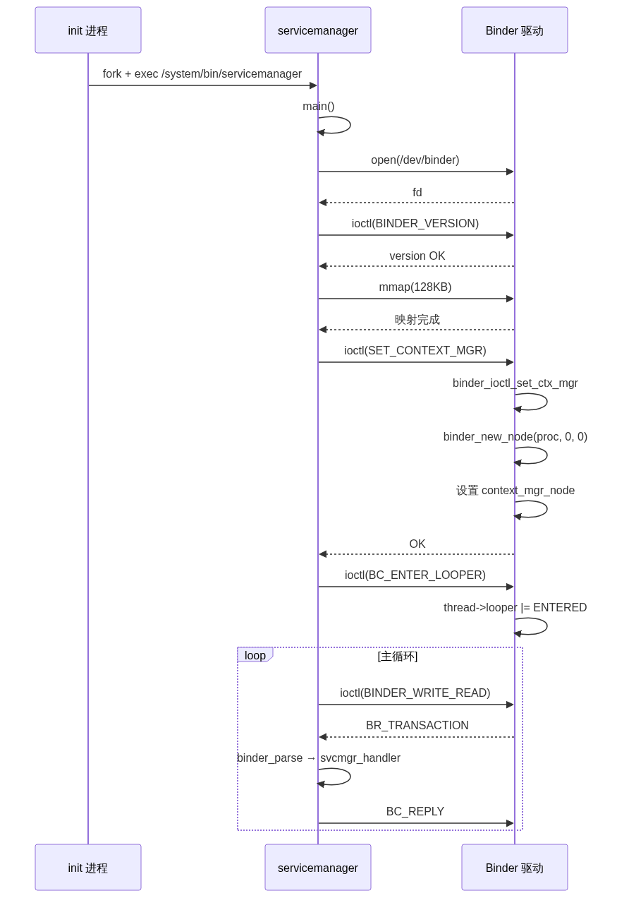
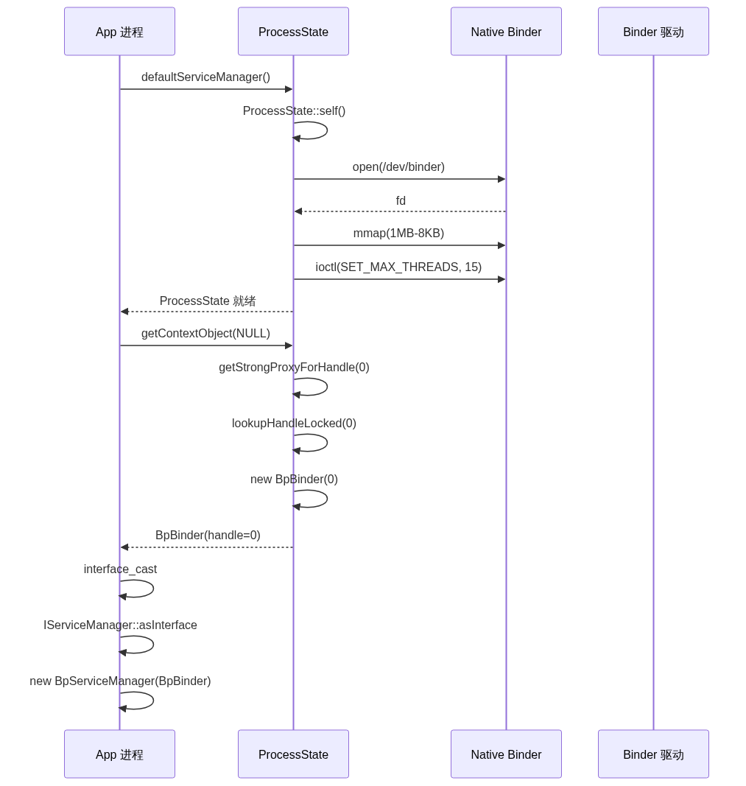
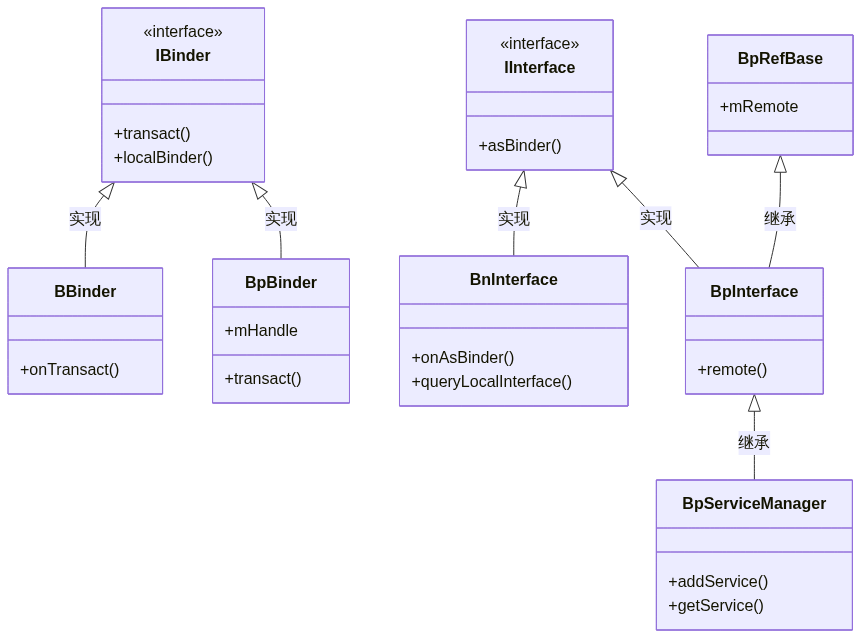

# Binder ServiceManager 的启动与获取分析

> ServiceManager 是 Binder 通信的名字服务——系统启动的第一批 native 进程，负责注册中心角色。本文按源码顺序拆解其启动三阶段（open→SET_CONTEXT_MGR→binder_loop），然后分析普通进程如何通过 ProcessState → BpBinder(0) → interface_cast 获取 ServiceManager 的代理对象。每步配关键源码、时序图和类图。

## 目录

- [一、ServiceManager 的启动分析](#一servicemanager-的启动分析)
  - [1.1 init.rc 定义与 main 入口](#11-initrc-定义与-main-入口)
  - [1.2 binder_open：打开驱动 + 版本校验 + mmap](#12-binder_open打开驱动--版本校验--mmap)
  - [1.3 binder_become_context_manager：驱动层全链路](#13-binder_become_context_manager驱动层全链路)
  - [1.4 binder_loop：事件循环与请求分发](#14-binder_loop事件循环与请求分发)
  - [1.5 binder_parse：响应码解析到 svcmgr_handler](#15-binder_parse响应码解析到-svcmgr_handler)
- [二、获取 ServiceManager 的 Binder 代理](#二获取-servicemanager-的-binder-代理)
  - [2.1 defaultServiceManager：单例 + 重试](#21-defaultservicemanager单例--重试)
  - [2.2 ProcessState::self：open + mmap + 线程池参数](#22-processstateselfopen--mmap--线程池参数)
  - [2.3 getStrongProxyForHandle：获取 BpBinder(0)](#23-getstrongproxyforhandle获取-bpbinder0)
  - [2.4 interface_cast：宏展开到 BpServiceManager](#24-interface_cast宏展开到-bpservicemanager)
- [三、代理对象类关系图](#三代理对象类关系图)

---

## 一、ServiceManager 的启动分析

ServiceManager 在 init 进程之后、Zygote 之前启动，由 init.rc 的 `class core` 阶段拉起。启动分为三个阶段：`binder_open`（打开驱动+版本校验+mmap）→ `binder_become_context_manager`（注册为上下文管理者）→ `binder_loop`（进入事件循环）。

### 1.1 init.rc 定义与 main 入口

ServiceManager 由 init.rc 中 `class core` 阶段的 `class_start core` 拉起，可执行程序 `/system/bin/servicemanager`，入口 `service_manager.c:main()`。init.rc 定义和 main 函数如下：

```rc
# /system/core/rootdir/init.rc
service servicemanager /system/bin/servicemanager
    class core
    user system
    group system
    critical
    onrestart restart healthd
    onrestart restart zygote
    onrestart restart media
    onrestart restart surfaceflinger
    onrestart restart drm
```

可执行程序 `/system/bin/servicemanager`，源文件 `service_manager.c`。

```c
// frameworks/native/cmds/servicemanager/service_manager.c
int main(int argc, char **argv) {
    struct binder_state *bs;

    // ① 打开 binder 驱动，申请 128KB 内存映射
    bs = binder_open(128 * 1024);

    // ② 注册成为上下文管理者
    if (binder_become_context_manager(bs)) {
        ALOGE("cannot become context manager (%s)\n", strerror(errno));
        return -1;
    }

    // SELinux 权限初始化
    selinux_enabled = is_selinux_enabled();
    sehandle = selinux_android_service_context_handle();
    selinux_status_open(true);
    if (selinux_enabled > 0) {
        if (sehandle == NULL) abort();
        if (getcon(&service_manager_context) != 0) abort();
    }

    // ③ 进入无限循环，用 svcmgr_handler 处理 Client 请求
    binder_loop(bs, svcmgr_handler);
    return 0;
}
```

### 1.2 binder_open：打开驱动 + 版本校验 + mmap

`binder_open` 是 ServiceManager 通信能力的基础——依次执行 open→ioctl(版本校验)→mmap 三步，失败则通过 goto 标签释放已分配的资源。完整源代码：

```c
// frameworks/native/cmds/servicemanager/binder.c
struct binder_state *binder_open(size_t mapsize) {
    struct binder_state *bs;
    struct binder_version vers;

    bs = malloc(sizeof(*bs));
    if (!bs) { errno = ENOMEM; return NULL; }

    // ★ 步骤 1：open → 内核 binder_open() → 创建 binder_proc
    bs->fd = open("/dev/binder", O_RDWR | O_CLOEXEC);
    if (bs->fd < 0) goto fail_open;

    // ★ 步骤 2：ioctl 校验版本
    if ((ioctl(bs->fd, BINDER_VERSION, &vers) == -1) ||
        (vers.protocol_version != BINDER_CURRENT_PROTOCOL_VERSION)) {
        goto fail_open;  // 内核与用户空间的 Binder 版本不一致
    }

    bs->mapsize = mapsize;

    // ★ 步骤 3：mmap → 内核 binder_mmap() → 创建 binder_buffer，加入 free_buffers
    bs->mapped = mmap(NULL, mapsize, PROT_READ, MAP_PRIVATE, bs->fd, 0);
    if (bs->mapped == MAP_FAILED) goto fail_map;

    return bs;

fail_map:
    close(bs->fd);
fail_open:
    free(bs);
    return NULL;
}
```

> `binder_state` 结构保存了 fd、映射地址 mapsize、映射指针 mapped——这是 ServiceManager 后续与驱动通信的全部上下文。

### 1.3 binder_become_context_manager：驱动层全链路

`binder_become_context_manager` 通过 `ioctl(SET_CONTEXT_MGR)` 向驱动声明「我是 ServiceManager」——驱动侧通过 `binder_ioctl_set_ctx_mgr` 和 `binder_new_node` 创建全局唯一的 `binder_context_mgr_node`。用户空间和驱动侧代码如下：

```c
// frameworks/native/cmds/servicemanager/binder.c
int binder_become_context_manager(struct binder_state *bs) {
    return ioctl(bs->fd, BINDER_SET_CONTEXT_MGR, 0);
}
```

驱动侧触发 `binder_ioctl` → `binder_ioctl_set_ctx_mgr`：

```c
// kernel/drivers/staging/android/binder.c
static int binder_ioctl_set_ctx_mgr(struct file *filp) {
    struct binder_proc *proc = filp->private_data;
    kuid_t curr_euid = current_euid();

    // ★ 全局唯一检查：只能注册一次
    if (binder_context_mgr_node != NULL) {
        return -EBUSY;  // 已有 ServiceManager，拒绝
    }

    // 记录 ServiceManager 的 UID
    binder_context_mgr_uid = curr_euid;

    // ★ 创建全局 binder_node（参数 ptr=0, cookie=0——ServiceManager 无用户空间实体）
    binder_context_mgr_node = binder_new_node(proc, 0, 0);

    binder_context_mgr_node->local_weak_refs++;
    binder_context_mgr_node->local_strong_refs++;
    binder_context_mgr_node->has_strong_ref = 1;
    binder_context_mgr_node->has_weak_ref = 1;

    return 0;
}
```

`binder_new_node` 创建实体并插入宿主进程的红黑树：

```c
static struct binder_node *binder_new_node(struct binder_proc *proc,
                                            binder_uintptr_t ptr,
                                            binder_uintptr_t cookie) {
    struct binder_node *node;
    // 在 proc->nodes 红黑树中查找是否已存在
    // 不存在则分配 + 初始化
    node = kzalloc(sizeof(*node), GFP_KERNEL);
    rb_link_node(&node->rb_node, parent, p);
    rb_insert_color(&node->rb_node, &proc->nodes);

    node->proc = proc;
    node->ptr = ptr;          // ServiceManager 专用：0
    node->cookie = cookie;    // ServiceManager 专用：0
    node->work.type = BINDER_WORK_NODE;
    INIT_LIST_HEAD(&node->work.entry);
    INIT_LIST_HEAD(&node->async_todo);
    return node;
}
```

> `binder_context_mgr_node` 是全局唯一的 `binder_node`，后续所有进程通过 handle=0 获取的就是它。

### 1.4 binder_loop：事件循环与请求分发

`binder_loop` 是 ServiceManager 的永久运行态——先发 `BC_ENTER_LOOPER` 注册为 Binder 线程，然后进入 `for(;;)` 循环，通过 `ioctl(BINDER_WRITE_READ)` 阻塞等待请求。核心代码如下：

```c
// frameworks/native/cmds/servicemanager/binder.c
void binder_loop(struct binder_state *bs, binder_handler func) {
    int res;
    struct binder_write_read bwr;
    uint32_t readbuf[32];

    bwr.write_size = 0;
    bwr.write_consumed = 0;
    bwr.write_buffer = 0;

    // ★ 步骤 1：向驱动发送 BC_ENTER_LOOPER，注册为 Binder 线程
    readbuf[0] = BC_ENTER_LOOPER;
    binder_write(bs, readbuf, sizeof(uint32_t));

    // ★ 步骤 2：进入无限循环，阻塞等待 Client 请求
    for (;;) {
        bwr.read_size = sizeof(readbuf);
        bwr.read_consumed = 0;
        bwr.read_buffer = (uintptr_t)readbuf;

        res = ioctl(bs->fd, BINDER_WRITE_READ, &bwr);
        if (res < 0) break;

        // ★ 步骤 3：解析驱动返回的 BR_ 命令，分发到 svcmgr_handler
        res = binder_parse(bs, 0, (uintptr_t)readbuf, bwr.read_consumed, func);
        if (res == 0) break;
        if (res < 0) break;
    }
}
```

`binder_write` 将 `BC_ENTER_LOOPER` 写入驱动：

```c
int binder_write(struct binder_state *bs, void *data, size_t len) {
    struct binder_write_read bwr;
    bwr.write_size = len;
    bwr.write_consumed = 0;
    bwr.write_buffer = (uintptr_t)data;     // BC_ENTER_LOOPER
    bwr.read_size = 0;
    bwr.read_consumed = 0;
    bwr.read_buffer = 0;
    return ioctl(bs->fd, BINDER_WRITE_READ, &bwr);  // 只有写，没有读
}
```

驱动侧 `binder_thread_write` 处理 `BC_ENTER_LOOPER`：

```c
static int binder_thread_write(struct binder_proc *proc,
                                struct binder_thread *thread, ...) {
    switch (cmd) {
        case BC_ENTER_LOOPER:
            // 设置线程 looper 状态——标记为 Binder 线程，可处理 IPC 请求
            thread->looper |= BINDER_LOOPER_STATE_ENTERED;
            break;
    }
}
```

### 1.5 binder_parse：响应码解析到 svcmgr_handler

`binder_parse` 是 ServiceManager 的请求分发中枢——收到 `BR_TRANSACTION` 时解析 `binder_transaction_data`，调用 `svcmgr_handler` 处理 ADD_SERVICE/GET_SERVICE/LIST_SERVICES，再通过 `binder_send_reply` 返回结果。完整源码：

```c
int binder_parse(struct binder_state *bs, struct binder_io *bio,
                 uintptr_t ptr, size_t size, binder_handler func) {
    int r = 1;
    uintptr_t end = ptr + (uintptr_t)size;

    while (ptr < end) {
        uint32_t cmd = *(uint32_t *)ptr;
        ptr += sizeof(uint32_t);

        switch (cmd) {
            case BR_NOOP:                              // 无操作
                break;
            case BR_TRANSACTION_COMPLETE:              // 事务发送完成
                break;
            case BR_INCREFS:                           // 弱引用增加
            case BR_ACQUIRE:                           // 强引用增加
            case BR_RELEASE:                           // 强引用释放
            case BR_DECREFS:                           // 弱引用释放
                ptr += sizeof(struct binder_ptr_cookie);
                break;
            case BR_TRANSACTION: {
                struct binder_transaction_data *txn =
                    (struct binder_transaction_data *)ptr;
                binder_dump_txn(txn);
                if (func) {
                    unsigned rdata[256 / 4];
                    struct binder_io msg;
                    struct binder_io reply;
                    bio_init(&reply, rdata, sizeof(rdata), 4);
                    bio_init_from_txn(&msg, txn);           // 解析 tx → msg
                    res = func(bs, txn, &msg, &reply);      // ★ svcmgr_handler
                    binder_send_reply(bs, &reply, txn->data.ptr.buffer, res);
                }
                ptr += sizeof(*txn);
                break;
            }
            case BR_REPLY: {
                // 客户端等待 reply 时收到此响应
                struct binder_transaction_data *txn = ...;
                binder_dump_txn(txn);
                if (bio) {
                    bio_init_from_txn(bio, txn);
                    bio = 0;
                }
                ptr += sizeof(*txn);
                r = 0;
                break;
            }
            case BR_DEAD_BINDER: {
                // 服务端死亡通知
                struct binder_death *death = ...;
                death->func(bs, death->ptr);
                break;
            }
            case BR_FAILED_REPLY:
            case BR_DEAD_REPLY:
                r = -1;
                break;
            default:
                return -1;
        }
    }
    return r;
}
```

> `binder_parse` 是 ServiceManager 的请求分发中枢——收到 `BR_TRANSACTION` 时取出 `binder_transaction_data`，解析为 `binder_io` 对象，调用 `svcmgr_handler` 处理业务逻辑（ADD_SERVICE / GET_SERVICE / LIST_SERVICES），最后通过 `binder_send_reply` 返回 `BC_REPLY`。

### 启动时序总结

以下是 ServiceManager 从 init 拉起、打开驱动、注册上下文到进入事件循环的完整时序图：



---

## 二、获取 ServiceManager 的 Binder 代理

普通进程获取 ServiceManager 代理对象的过程分为三步：`ProcessState::self()`（单例初始化）→ `getContextObject(NULL)`（获取 handle=0 的 BpBinder）→ `interface_cast<IServiceManager>()`（构造 BpServiceManager）。

### 2.1 defaultServiceManager：单例 + 重试

`defaultServiceManager` 采用单例模式获取 SM 代理——若创建失败则 `sleep(1)` 重试直到 ServiceManager 就绪。完整代码：

```cpp
// frameworks/native/libs/binder/IServiceManager.cpp
sp<IServiceManager> defaultServiceManager() {
    if (gDefaultServiceManager != NULL) return gDefaultServiceManager;
    {
        AutoMutex _l(gDefaultServiceManagerLock);
        while (gDefaultServiceManager == NULL) {
            gDefaultServiceManager = interface_cast<IServiceManager>(
                ProcessState::self()->getContextObject(NULL)
            );
            if (gDefaultServiceManager == NULL)
                sleep(1);  // ServiceManager 尚未就绪，等 1 秒重试
        }
    }
    return gDefaultServiceManager;
}
```

### 2.2 ProcessState::self：open + mmap + 线程池参数

每个进程只调用一次 `ProcessState::self()`——构造函数依次执行 `open_driver`（open + 版本校验 + 设置最大线程数为 15）和 `mmap`（1MB-8KB 映射）。核心代码：

```cpp
// frameworks/native/libs/binder/ProcessState.cpp
sp<ProcessState> ProcessState::self() {
    Mutex::Autolock _l(gProcessMutex);
    if (gProcess != NULL) return gProcess;
    gProcess = new ProcessState();
    return gProcess;
}

ProcessState::ProcessState()
    : mDriverFD(open_driver())          // ① 打开 /dev/binder
    , mMaxThreads(DEFAULT_MAX_BINDER_THREADS)  // 默认 15
{
    if (mDriverFD >= 0) {
        // ② mmap 1MB-8KB 虚拟地址空间
        mVMStart = mmap(0, BINDER_VM_SIZE, PROT_READ,
                        MAP_PRIVATE | MAP_NORESERVE, mDriverFD, 0);
        if (mVMStart == MAP_FAILED) {
            close(mDriverFD);
            mDriverFD = -1;
        }
    }
}
```

`open_driver` 的完整实现：

```cpp
static int open_driver() {
    int fd = open("/dev/binder", O_RDWR | O_CLOEXEC);
    if (fd >= 0) {
        fcntl(fd, F_SETFD, FD_CLOEXEC);

        // 校验 Binder 协议版本
        int vers = 0;
        status_t result = ioctl(fd, BINDER_VERSION, &vers);
        if (result == -1 || vers != BINDER_CURRENT_PROTOCOL_VERSION) {
            close(fd);
            fd = -1;
        }

        // 设置驱动最大线程数
        size_t maxThreads = DEFAULT_MAX_BINDER_THREADS;  // 15
        result = ioctl(fd, BINDER_SET_MAX_THREADS, &maxThreads);
        if (result == -1) {
            ALOGE("Binder ioctl to set max threads failed: %s", strerror(errno));
        }
    }
    return fd;
}
```

> 每个进程只调用一次 `ProcessState::self()`——open 和 mmap 都是进程级别的，所有 Binder 线程共享同一个 fd 和映射空间。

### 2.3 getStrongProxyForHandle：获取 BpBinder(0)

`getStrongProxyForHandle(0)` 从 `mHandleToObject` 列表中查找或创建 handle=0 的 BpBinder——对 handle=0 会通过 `PING_TRANSACTION` 测试 SM 是否就绪。核心代码：

```cpp
// ProcessState.cpp
sp<IBinder> ProcessState::getContextObject(const sp<IBinder>& /*caller*/) {
    return getStrongProxyForHandle(0);   // handle=0 = ServiceManager
}

sp<IBinder> ProcessState::getStrongProxyForHandle(int32_t handle) {
    AutoMutex _l(mLock);
    handle_entry* e = lookupHandleLocked(handle);  // 查 mHandleToObject

    if (e != NULL) {
        IBinder* b = e->binder;
        if (b == NULL || !e->refs->attemptIncWeak(this)) {
            // handle=0 特殊情况：用 PING_TRANSACTION 测试 SM 是否就绪
            if (handle == 0) {
                Parcel data;
                status_t status = IPCThreadState::self()->transact(
                    0, IBinder::PING_TRANSACTION, data, NULL, 0);
                if (status == DEAD_OBJECT) return NULL;
            }
            // 创建 BpBinder
            b = new BpBinder(handle);
            e->binder = b;
            if (b) e->refs = b->getWeakRefs();
            result = b;
        } else {
            result.force_set(b);
            e->refs->decWeak(this);
        }
    }
    return result;
}
```

`lookupHandleLocked` 管理句柄映射表：

```cpp
// ProcessState.h
struct handle_entry {
    IBinder* binder;                            // BpBinder 对象
    RefBase::weakref_type* refs;               // 弱引用计数
};
Vector<handle_entry> mHandleToObject;           // 以句柄值为索引的列表

ProcessState::handle_entry* ProcessState::lookupHandleLocked(int32_t handle) {
    // 保证 mHandleToObject 足够大——句柄值即数组索引
    if (mHandleToObject.size() <= (size_t)handle) {
        handle_entry e = { NULL, NULL };
        mHandleToObject.insertAt(e, mHandleToObject.size(), handle + 1 - mHandleToObject.size());
    }
    return &mHandleToObject.editItemAt(handle);
}
```

`BpBinder` 构造函数：

```cpp
BpBinder::BpBinder(int32_t handle)
    : mHandle(handle)
    , mAlive(1)
    , mObitsSent(0)
    , mObituaries(NULL)
{
    extendObjectLifetime(OBJECT_LIFETIME_WEAK);          // 弱引用控制生命周期
    IPCThreadState::self()->incWeakHandle(handle);       // 驱动侧弱引用 +1
}
```

### 2.4 interface_cast：宏展开到 BpServiceManager

`interface_cast<IServiceManager>(obj)` 等价于 `IServiceManager::asInterface(obj)`。而 asInterface 由两个宏生成：

```cpp
// IServiceManager.h — 声明
#define DECLARE_META_INTERFACE(INTERFACE)              \
    static const android::String16 descriptor;          \
    static android::sp<I##INTERFACE> asInterface(       \
        const android::sp<android::IBinder>& obj);      \
    virtual const android::String16&                    \
        getInterfaceDescriptor() const;                 \
    I##INTERFACE();                                      \
    virtual ~I##INTERFACE();
```

```cpp
// IServiceManager.cpp — 实现
#define IMPLEMENT_META_INTERFACE(INTERFACE, NAME)       \
    const android::String16 I##INTERFACE::descriptor(NAME);    \
    const android::String16&                                    \
        I##INTERFACE::getInterfaceDescriptor() const {          \
        return I##INTERFACE::descriptor;                        \
    }                                                           \
    android::sp<I##INTERFACE> I##INTERFACE::asInterface(        \
            const android::sp<android::IBinder>& obj) {         \
        android::sp<I##INTERFACE> intr;                         \
        if (obj != NULL) {                                      \
            intr = static_cast<I##INTERFACE*>(                  \
                obj->queryLocalInterface(                       \
                    I##INTERFACE::descriptor).get());           \
            if (intr == NULL) {                                 \
                intr = new Bp##INTERFACE(obj);    /* ★ */       \
            }                                                   \
        }                                                       \
        return intr;                                            \
    }
```

`INTERFACE=ServiceManager, NAME="android.os.IServiceManager"` 展开后：

```cpp
const android::String16 IServiceManager::descriptor("android.os.IServiceManager");

android::sp<IServiceManager> IServiceManager::asInterface(
        const android::sp<android::IBinder>& obj) {
    android::sp<IServiceManager> intr;
    if (obj != NULL) {
        // queryLocalInterface 检查是否为本地服务（此处为远程，返回 NULL）
        intr = static_cast<IServiceManager*>(
            obj->queryLocalInterface(IServiceManager::descriptor).get());
        if (intr == NULL) {
            intr = new BpServiceManager(obj);   // ★ 创建 BpServiceManager
        }
    }
    return intr;
}
```

> `obj` 是 `BpBinder(0)`。`queryLocalInterface` 返回 NULL（不是本地服务），所以走到 `new BpServiceManager(BpBinder(0))`。

`BpServiceManager` 的继承链构造：

```cpp
// BpServiceManager(BpBinder(0))
BpServiceManager(const sp<IBinder>& impl)
    : BpInterface<IServiceManager>(impl) {}

// BpInterface → BpRefBase
inline BpInterface(const sp<IBinder>& remote) : BpRefBase(remote) {}

// BpRefBase — mRemote 最终指向 BpBinder(0)
BpRefBase::BpRefBase(const sp<IBinder>& o)
    : mRemote(o.get())   // ★ mRemote = BpBinder(0)
{
    extendObjectLifetime(OBJECT_LIFETIME_WEAK);
    if (mRemote) {
        mRemote->incStrong(this);
        mRefs = mRemote->createWeak(this);
    }
}
```

### 获取时序总结

以下是 App 进程从 `defaultServiceManager()` 到最终获得 `BpServiceManager` 代理对象的完整时序图：



---

## 三、代理对象类关系图



| 类 | 角色 |
|----|------|
| `IBinder` | 顶层接口——定义 `transact()`、`localBinder()` |
| `BBinder` | 服务端实现类——运行在服务进程，处理 `onTransact` |
| `BpBinder` | 客户端代理——持有句柄值 `mHandle`，封装 `transact` 发送 IPC |
| `IInterface` | 业务接口基类——定义 `asBinder()` |
| `BnInterface<IServiceManager>` | 服务端封装——继承 BBinder + 实现特定接口 |
| `BpInterface<IServiceManager>` | 客户端代理封装——继承 BpRefBase + 实现特定接口 |
| `BpRefBase` | 客户端代理基类——`mRemote` 指向 BpBinder |
| `BpServiceManager` | ServiceManager 的客户端代理——`addService`/`getService` 最终通过 `remote()->transact()` 发往 handle=0 |
