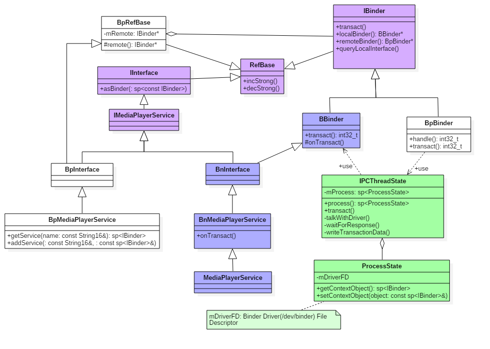

# Binder ServiceManager 的启动与获取分析

> ServiceManager 是 Binder 通信的「名字服务」——系统启动的第一批 native 进程，负责注册中心角色。本文按源码顺序拆解其启动三阶段（打开驱动→注册上下文→进入循环），然后分析普通进程如何获取 ServiceManager 的 Binder 引用句柄。

## 目录

- [一、ServiceManager 的角色与时机](#一servicemanager-的角色与时机)
- [二、ServiceManager 启动分析](#二servicemanager-启动分析)
  - [2.1 init.rc 定义](#21-initrc-定义)
  - [2.2 main() 入口](#22-main-入口)
  - [2.3 binder_open：打开 Binder 驱动](#23-binder_open打开-binder-驱动)
  - [2.4 binder_become_context_manager：注册为上下文管理者](#24-binder_become_context_manager注册为上下文管理者)
  - [2.5 binder_loop：进入事件循环](#25-binder_loop进入事件循环)
- [三、获取 ServiceManager 的 Binder 引用](#三获取-servicemanager-的-binder-引用)
  - [3.1 ProcessState 单例初始化](#31-processstate-单例初始化)
  - [3.2 defaultServiceManager() 获取句柄 0](#32-defaultservicemanager-获取句柄-0)

---

## 一、ServiceManager 的角色与时机

ServiceManager 是 Android 系统架构中的核心组件，在 init 进程之后、Zygote 进程之前启动（由 init.rc 中的 `class core` 阶段拉起）。它运行在 native 进程中（可执行程序 `/system/bin/servicemanager`），不依赖 Java 代码，因此可以在 Zygote 启动前运行。

它的核心职责是：**维护一个服务名到 Binder 引用的映射表**，充当所有系统服务的注册与查询中心。

与 SystemServer 的分工：
- **ServiceManager**：注册中心，跟踪所有可用的系统服务
- **SystemServer**：实例化大部分 Java 系统服务（AMS、PMS 等），通过 ServiceManager 注册给整个系统使用

---

## 二、ServiceManager 启动分析

ServiceManager 启动分为三个阶段：`binder_open` 打开设备 → `binder_become_context_manager` 注册为上下文管理者 → `binder_loop` 进入无限循环。

### 2.1 init.rc 定义

```rc
service servicemanager /system/bin/servicemanager
    class core
    user system
    group system
    critical
    onrestart restart healthd
    onrestart restart zygote
    onrestart restart media
    onrestart restart surfaceflinger
    onrestart restart drm
```

`critical` 标记：ServiceManager 崩溃时系统重启。`onrestart`：级联重启依赖它的 zygote、surfaceflinger 等关键服务。

### 2.2 main() 入口

```c
// service_manager.c
int main(int argc, char **argv) {
    struct binder_state *bs;

    // ① 打开 Binder 驱动，申请 128KB 内存映射空间
    bs = binder_open(128 * 1024);
    if (bs == NULL) return -1;

    // ② 注册成为上下文管理者
    if (binder_become_context_manager(bs)) {
        ALOGE("cannot become context manager");
        return -1;
    }

    // SELinux 相关初始化
    selinux_enabled = is_selinux_enabled();
    sehandle = selinux_android_service_context_handle();

    // ③ 进入无限循环，处理 Client 请求
    binder_loop(bs, svcmgr_handler);
    return 0;
}
```

### 2.3 binder_open：打开 Binder 驱动

```c
// servicemanager/binder.c
struct binder_state *binder_open(size_t mapsize) {
    struct binder_state *bs = malloc(sizeof(*bs));

    // 打开 /dev/binder 设备
    bs->fd = open("/dev/binder", O_RDWR | O_CLOEXEC);
    if (bs->fd < 0) {
        ALOGE("cannot open binder driver: %s\n", strerror(errno));
        return NULL;
    }

    // 将设备文件映射到进程地址空间，大小 128KB
    bs->mapped = mmap(NULL, mapsize, PROT_READ, MAP_PRIVATE, bs->fd, 0);
    if (bs->mapped == MAP_FAILED) {
        ALOGE("binder cannot map device\n");
        return NULL;
    }

    bs->mapsize = mapsize;
    return bs;
}
```

第一步 `open("/dev/binder")` 触发驱动 `binder_open`，创建 `binder_proc`（与 ServiceManager 进程关联）；第二步 `mmap` 触发驱动 `binder_mmap`，分配 128KB 内核缓冲区并建立映射。

### 2.4 binder_become_context_manager：注册为上下文管理者

```c
int binder_become_context_manager(struct binder_state *bs) {
    return ioctl(bs->fd, BINDER_SET_CONTEXT_MGR, 0);
}
```

内核驱动收到 `BINDER_SET_CONTEXT_MGR` 后：

```text
binder_ioctl(proc, BINDER_SET_CONTEXT_MGR):
  → 检查是否已有 binder_context_mgr_uid（全局唯一）
  → 创建 binder_context_mgr_node 并设置 proc->tsk->cred->uid
  → 只有第一个调用者能成功——后续调用会因已存在而失败
```

> `SET_CONTEXT_MGR` 是全局唯一的注册机会。第一个调用的进程成为 ServiceManager，之后任何进程尝试都会失败——保证了 ServiceManager 的单例性。

### 2.5 binder_loop：进入事件循环

```c
// servicemanager/binder.c
void binder_loop(struct binder_state *bs, binder_handler func) {
    int res;
    struct binder_write_read bwr;
    uint32_t readbuf[32];
    bwr.write_size = 0;
    bwr.write_consumed = 0;
    bwr.write_buffer = 0;
    readbuf[0] = BC_ENTER_LOOPER;
    binder_write(bs, readbuf, sizeof(uint32_t));  // 向驱动注册为 Binder 线程

    for (;;) {
        bwr.read_size = sizeof(readbuf);
        bwr.read_consumed = 0;
        bwr.read_buffer = (uintptr_t)readbuf;

        // ioctl 阻塞等待，直到有 Client 请求到来
        res = ioctl(bs->fd, BINDER_WRITE_READ, &bwr);
        if (res < 0) break;

        // 处理收到的命令
        res = binder_parse(bs, 0, (uintptr_t)readbuf, bwr.read_consumed, func);
    }
}
```

`binder_parse` 解析 BR 命令，分发到 svcmgr_handler：

```c
int svcmgr_handler(struct binder_state *bs, struct binder_transaction_data *txn, ...) {
    switch (txn->code) {
        case SVC_MGR_GET_SERVICE:
        case SVC_MGR_CHECK_SERVICE:
            // 按名字查服务列表，找到则返回 handle
            ptr = do_find_service(s, len, txn->sender_euid, ...);
            bio_put_ref(reply, ptr);
            break;

        case SVC_MGR_ADD_SERVICE:
            // 将服务名和 handle 写入 svcinfo 列表
            if (do_add_service(bs, s, len, handle, txn->sender_euid, allow_isolated, ...))
                return -1;
            break;

        case SVC_MGR_LIST_SERVICES:
            // 列出所有已注册服务
            break;
    }
}
```

ServiceManager 内部用 `svcinfo` 链表维护服务注册表：

```c
struct svcinfo {
    struct svcinfo *next;
    uint32_t handle;        // Binder 引用句柄
    struct binder_death death;  // 死亡通知
    int allow_isolated;
    size_t len;
    uint16_t name[0];       // 服务名（柔性数组）
};
```

---

## 三、获取 ServiceManager 的 Binder 引用

普通进程获取 ServiceManager 的 Binder 引用不需要按名查询——驱动约定 **handle 0 固定指向 ServiceManager**。

### 3.1 ProcessState 单例初始化

```cpp
// frameworks/native/libs/binder/ProcessState.cpp
sp<ProcessState> ProcessState::self() {
    if (gProcess != NULL) return gProcess;
    gProcess = new ProcessState("/dev/binder");
    return gProcess;
}

ProcessState::ProcessState(const char *driver)
    : mDriverName(String8(driver))
    , mDriverFD(-1)
{
    // ① open /dev/binder → 触发 binder_open
    int fd = open_driver(driver);

    // ② mmap 1MB-8KB → 触发 binder_mmap
    mVMStart = mmap(0, BINDER_VM_SIZE, PROT_READ, MAP_PRIVATE | MAP_NORESERVE, fd, 0);

    // ③ 初始化为 Binder 主线程
    IPCThreadState::self()->setupPolling(&mDriverFD);
}
```

每个进程只调用一次 `ProcessState::self()` ——open 和 mmap 都是进程级别的，所有 Binder 线程共享同一个 fd 和映射空间。

### 3.2 defaultServiceManager() 获取句柄 0



```cpp
// frameworks/native/libs/binder/IServiceManager.cpp
sp<IServiceManager> defaultServiceManager() {
    if (gDefaultServiceManager != NULL) return gDefaultServiceManager;
    {
        AutoMutex _l(gDefaultServiceManagerLock);
        while (gDefaultServiceManager == NULL) {
            gDefaultServiceManager = interface_cast<IServiceManager>(
                ProcessState::self()->getContextObject(NULL)
            );
        }
    }
    return gDefaultServiceManager;
}
```

`ProcessState::getContextObject(NULL)` 参数为 NULL 时创建 handle=0 的 `BpBinder`：

```cpp
sp<IBinder> ProcessState::getContextObject(const sp<IBinder>& /*caller*/) {
    return getStrongProxyForHandle(0);   // handle 0 = ServiceManager
}

sp<IBinder> ProcessState::getStrongProxyForHandle(int32_t handle) {
    // 从缓存查找或新建 BpBinder
    return new BpBinder(handle);   // handle = 0
}
```

> handle 0 是硬编码约定——Binder 驱动在 ServiceManager 注册上下文后，将 `binder_context_mgr_node` 的引用句柄固定为 0，所有进程无需查询即可通过 handle 0 与 ServiceManager 通信。
