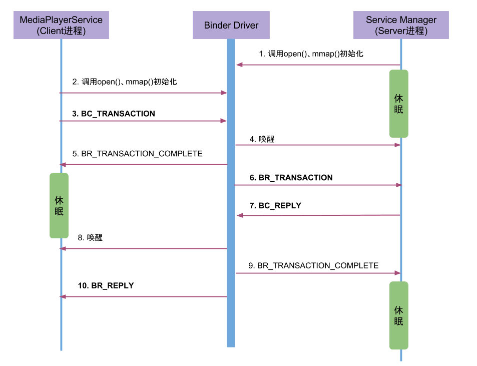

# Binder 服务注册与获取过程分析

> 以 MediaPlayerService 注册和 App 获取 AMS 为例，按源码调用链完整拆解 Binder 服务注册和获取的全流程——从 Java 层 addService/getService 到驱动层 flat_binder_object 的类型改写，每一步都标注了关键源码。

## 目录

- [一、服务注册：MediaPlayerService 为例](#一服务注册mediaplayerservice-为例)
  - [1.1 入口：instantiate → addService](#11-入口instantiate--addservice)
  - [1.2 BpServiceManager::addService](#12-bpservicemanageraddservice)
  - [1.3 writeStrongBinder 与 flatten_binder](#13-writestrongbinder-与-flatten_binder)
  - [1.4 IPCThreadState::transact → 驱动交互](#14-ipcthreadstatetransact--驱动交互)
  - [1.5 驱动层：binder_transaction 的 Binder 对象改写](#15-驱动层binder_transaction-的-binder-对象改写)
  - [1.6 ServiceManager 端：svcmgr_handler 处理 ADD_SERVICE](#16-servicemanager-端svcmgr_handler-处理-add_service)
- [二、服务获取：App 获取 AMS 为例](#二服务获取app-获取-ams-为例)
  - [2.1 入口：getService](#21-入口getservice)
  - [2.2 BpServiceManager::getService](#22-bpservicemanagergetservice)
  - [2.3 驱动层处理 handle 传递](#23-驱动层处理-handle-传递)
  - [2.4 客户端收到 handle → 构造 BpBinder](#24-客户端收到-handle--构造-bpbinder)

---

## 一、服务注册：MediaPlayerService 为例

服务注册的完整链路：`addService("media.player", binder)` → Parcel 封装 flat_binder_object → Binder 驱动创建 node/ref 并改写类型 → ServiceManager 写入 svcinfo 列表。



### 1.1 入口：instantiate → addService

```cpp
// frameworks/av/media/mediaserver/main_mediaserver.cpp
int main(int argc __unused, char** argv) {
    // 获得 ProcessState 实例（open + mmap /dev/binder）
    sp<ProcessState> proc(ProcessState::self());

    // 获取 ServiceManager 的 BpServiceManager 代理
    sp<IServiceManager> sm = defaultServiceManager();

    // 注册多媒体服务
    MediaPlayerService::instantiate();
    CameraService::instantiate();
    // ...

    // 启动 Binder 线程池 + 当前线程加入
    ProcessState::self()->startThreadPool();
    IPCThreadState::self()->joinThreadPool();
}
```

```cpp
void MediaPlayerService::instantiate() {
    defaultServiceManager()->addService(
        String16("media.player"), new MediaPlayerService()
    );
}
```

### 1.2 BpServiceManager::addService

```cpp
// IServiceManager.cpp
virtual status_t addService(const String16& name, const sp<IBinder>& service,
                             bool allowIsolated, int dumpsysPriority) {
    Parcel data, reply;
    data.writeInterfaceToken(IServiceManager::getInterfaceDescriptor());  // "android.os.IServiceManager"
    data.writeString16(name);          // 服务名："media.player"
    data.writeStrongBinder(service);   // MediaPlayerService 的 IBinder
    data.writeInt32(allowIsolated ? 1 : 0);
    data.writeInt32(dumpsysPriority);

    status_t err = remote()->transact(ADD_SERVICE_TRANSACTION, data, &reply);
    // remote() → BpBinder(handle=0) → 发往 ServiceManager
    return err == NO_ERROR ? reply.readExceptionCode() : err;
}
```

### 1.3 writeStrongBinder 与 flatten_binder

```cpp
// Parcel.cpp
status_t Parcel::writeStrongBinder(const sp<IBinder>& val) {
    return flatten_binder(ProcessState::self(), val, this);
}

status_t flatten_binder(const sp<ProcessState>& /*proc*/,
                        const sp<IBinder>& binder, Parcel* out) {
    flat_binder_object obj;
    obj.flags = 0x7f | FLAT_BINDER_FLAG_ACCEPTS_FDS;

    if (binder != NULL) {
        // BBinder（本地实体）
        IBinder *local = binder->localBinder();
        if (local != NULL) {
            obj.type = BINDER_TYPE_BINDER;    // ★ 告诉驱动：这是一个实体对象
            obj.binder = reinterpret_cast<uintptr_t>(local->getWeakRefs());
            obj.cookie = reinterpret_cast<uintptr_t>(local);
        } else {
            // BpBinder（远程引用）
            obj.type = BINDER_TYPE_HANDLE;    // 是一个引用句柄
            obj.handle = binder->getWeakRefs()->getRefs() ? 0 : ...;
        }
    } else {
        obj.type = BINDER_TYPE_BINDER;
        obj.binder = 0;
        obj.cookie = 0;
    }

    return finish_flatten_binder(binder, obj, out);
}
```

关键点：`flatten_binder` 判断 IBinder 是本地实体（BBinder）还是远程代理（BpBinder），据此设置 `flat_binder_object.type` 为 `BINDER_TYPE_BINDER` 或 `BINDER_TYPE_HANDLE`。

### 1.4 IPCThreadState::transact → 驱动交互

```cpp
// IPCThreadState.cpp
status_t IPCThreadState::transact(int32_t handle, uint32_t code,
                                   const Parcel& data, Parcel* reply, uint32_t flags) {
    // 将 handle + code + Parcel 封装为 BC_TRANSACTION 命令写入
    err = writeTransactionData(BC_TRANSACTION, flags, handle, code, data, NULL);
    // 阻塞等待 Binder 驱动返回
    err = waitForResponse(reply);
    return err;
}
```

`waitForResponse` 内部阻塞在 `ioctl(fd, BINDER_WRITE_READ, &bwr)` ——驱动执行 `binder_thread_write` 处理 BC_TRANSACTION，然后 `binder_thread_read` 等待 BR_REPLY。

### 1.5 驱动层：binder_transaction 的 Binder 对象改写

这是服务注册的核心——驱动在传输过程中自动改写 `flat_binder_object`：

```c
// kernel/drivers/staging/android/binder.c — binder_transaction()
static void binder_transaction(struct binder_proc *proc,
                struct binder_thread *thread,
                struct binder_transaction_data *tr, int reply) {
    // ...
    for (offp = off_start; offp < off_end; offp++) {
        struct flat_binder_object *fp = (struct flat_binder_object *)
            (t->buffer->data + *offp);

        switch (fp->type) {
            case BINDER_TYPE_BINDER:
            case BINDER_TYPE_WEAK_BINDER: {
                // ★ Server 传递的是一个实体对象
                struct binder_ref *ref;
                // 在 Server 进程中查找或创建 binder_node
                struct binder_node *node = binder_new_node(proc, fp->binder, fp->cookie);
                // 为目标进程（ServiceManager）创建 binder_ref
                ref = binder_get_ref_for_node(target_proc, node);
                // ★ 改写：BINDER_TYPE_BINDER → BINDER_TYPE_HANDLE
                fp->type = BINDER_TYPE_HANDLE;
                fp->handle = ref->desc;   // ServiceManager 侧的句柄编号
                break;
            }

            case BINDER_TYPE_HANDLE:
            case BINDER_TYPE_WEAK_HANDLE: {
                // 传递一个引用 → 查 ref，在目标进程创建新的 ref
                struct binder_ref *ref = binder_get_ref(proc, fp->handle);
                // 为目标进程创建对应的 ref
                struct binder_ref *new_ref = binder_get_ref_for_node(target_proc, ref->node);
                fp->handle = new_ref->desc;
                break;
            }
        }
    }
}
```

> 核心行为：`BINDER_TYPE_BINDER`（实体）被驱动自动改写为 `BINDER_TYPE_HANDLE`（引用）——ServiceManager 收到的不是对象的原始指针，而是驱动分配的句柄编号。这是 Binder 安全模型的关键。

### 1.6 ServiceManager 端：svcmgr_handler 处理 ADD_SERVICE

```c
// service_manager.c
int svcmgr_handler(struct binder_state *bs, struct binder_transaction_data *txn, ...) {
    switch (txn->code) {
        case SVC_MGR_ADD_SERVICE: {
            // 读取服务名
            uint16_t *s = bio_get_string16(msg, &len);
            // 读取 handle
            uint32_t handle = bio_get_ref(msg);

            // 写入 svcinfo 链表：服务名 → handle
            if (do_add_service(bs, s, len, handle, txn->sender_euid,
                               allow_isolated, txn->sender_pid, ...))
                return -1;
            break;
        }
    }
}

int do_add_service(struct binder_state *bs, const uint16_t *s, size_t len,
                   uint32_t handle, uid_t uid, ...) {
    struct svcinfo *si;
    // 检查是否已存在同名服务
    si = find_svc(s, len);
    if (si) {
        // 已存在，更新 handle（覆盖旧引用）
        svcinfo_death(bs, si);
        si->handle = handle;
    } else {
        // 新建 svcinfo：服务名 + handle 存入链表
        si = malloc(sizeof(*si) + (len + 1) * sizeof(uint16_t));
        si->handle = handle;
        memcpy(si->name, s, (len + 1) * sizeof(uint16_t));
        si->next = svclist;
        // 注册死亡通知——MediaPlayerService 死亡时自动清理
        binder_acquire(bs, handle);
        binder_link_to_death(bs, handle, &si->death);
        svclist = si;
    }
    return 0;
}
```

---

## 二、服务获取：App 获取 AMS 为例

### 2.1 入口：getService

```cpp
// Java 层：ActivityManager.java
IBinder b = ServiceManager.getService("activity");
// → BinderInternal.getContextObject()
// → new BpBinder(handle_0)  // handle 0 = ServiceManager
// → BpServiceManager.getService("activity", ...)
```

### 2.2 BpServiceManager::getService

```cpp
// IServiceManager.cpp
virtual sp<IBinder> getService(const String16& name) const {
    Parcel data, reply;
    data.writeInterfaceToken(IServiceManager::getInterfaceDescriptor());
    data.writeString16(name);   // "activity"

    status_t err = remote()->transact(CHECK_SERVICE_TRANSACTION, data, &reply);
    // remote() → BpBinder(handle=0) → 发往 ServiceManager

    // 读取返回结果中的 Binder 引用
    return reply.readStrongBinder();
}
```

### 2.3 驱动层处理 handle 传递

ServiceManager 查 svcinfo 找到 AMS 的 handle 后，通过 BC_REPLY 返回。驱动在 `binder_transaction` 中处理这些 handle：

```c
// binder_transaction 中处理 reply 里的 handle
case BINDER_TYPE_HANDLE: {
    // SM 持有 AMS 的 ref (desc=X)
    struct binder_ref *ref = binder_get_ref(proc, fp->handle);
    // 为 App 进程创建 AMS 的 ref (desc=Y)
    struct binder_ref *new_ref = binder_get_ref_for_node(target_proc, ref->node);
    fp->handle = new_ref->desc;   // ★ 改写为 App 本地句柄编号
    break;
}
```

> 每个进程有独立的句柄空间——SM 侧的 AMS handle=3，App 侧可能是 handle=5，但都指向同一个 binder_node。

### 2.4 客户端收到 handle → 构造 BpBinder

```cpp
// Parcel.cpp — readStrongBinder
status_t Parcel::readStrongBinder(sp<IBinder>* val) const {
    return unflatten_binder(ProcessState::self(), *this, val);
}

status_t unflatten_binder(const sp<ProcessState>& proc,
                          const Parcel& in, sp<IBinder>* out) {
    const flat_binder_object* flat = readObject(false);

    if (flat->type == BINDER_TYPE_BINDER) {
        // 本地实体 → 返回 BBinder
        sp<IBinder> binder = reinterpret_cast<IBinder*>(flat->cookie);
        *out = binder;
    } else {
        // 远程引用 → 构造 BpBinder
        sp<IBinder> binder = proc->getStrongProxyForHandle(flat->handle);
        *out = binder;
    }
    return NO_ERROR;
}
```

至此，App 持有 AMS 的 `BpBinder`，可以通过它发起跨进程调用。
