# Binder 驱动核心概览

> 从 Linux IPC 基础到 Binder 驱动实现——覆盖进程隔离、mmap 一次拷贝原理、Binder 驱动的 init/open/mmap/ioctl 四大核心方法、7 种关键数据结构的关系、以及 BC_/BR_ 通信协议的完整拆解。

## 目录

- [一、Linux IPC 基础与 Binder 一次拷贝原理](#一linux-ipc-基础与-binder-一次拷贝原理)
- [二、Binder 驱动四大核心方法](#二binder-驱动四大核心方法)
  - [2.1 设备初始化：binder_init](#21-设备初始化binder_init)
  - [2.2 设备打开：binder_open](#22-设备打开binder_open)
  - [2.3 内存映射：binder_mmap](#23-内存映射binder_mmap)
  - [2.4 数据收发：binder_ioctl](#24-数据收发binder_ioctl)
- [三、核心数据结构](#三核心数据结构)
- [四、Binder 通信协议码](#四binder-通信协议码)

---

## 一、Linux IPC 基础与 Binder 一次拷贝原理

本章从 Linux 内核的基础概念——内核空间/用户空间、进程隔离、系统调用、内存映射——切入，解释传统 IPC 的两次拷贝问题，以及 Binder 如何通过 mmap 将其降为一次拷贝。

### 内核空间与用户空间

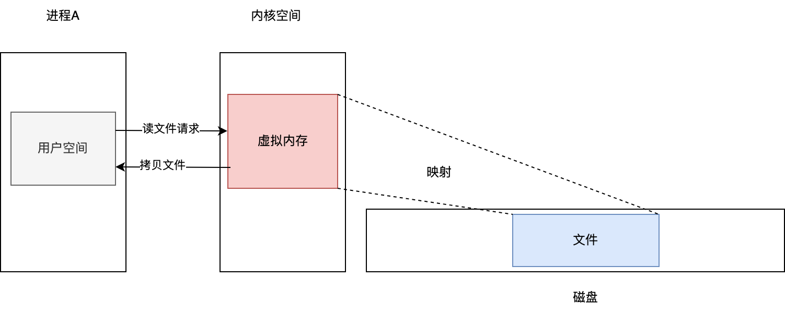


Linux 将进程的虚拟地址空间划分为两部分：高 1GB 为内核空间，低 3GB 为用户空间。内核空间是 Linux 内核的运行空间，用户空间为用户程序的运行空间。为了安全，两者隔离——用户进程不能直接操作内核。

### 进程隔离与系统调用

进程 A 的用户空间不能访问进程 B 的数据，这是进程隔离。用户空间要访问内核空间只能通过系统调用：

- `copy_from_user`：将用户空间数据拷贝到内核空间
- `copy_to_user`：将内核空间数据拷贝到用户空间

### 内存映射（mmap）
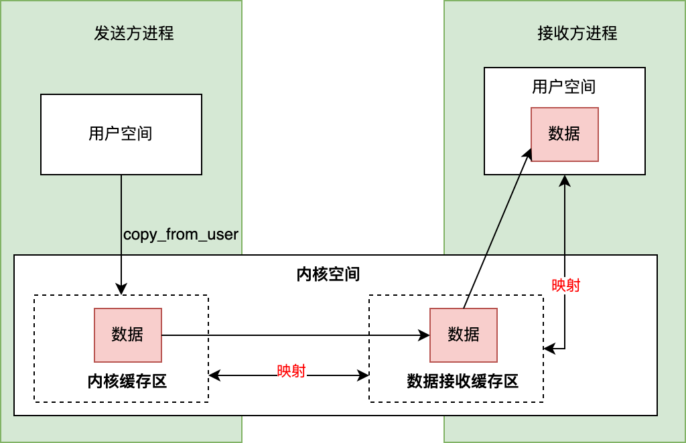


mmap 将磁盘文件映射到内存，使得用户可以通过修改内存间接修改磁盘文件——原本需要两次拷贝（磁盘→页缓存→用户空间），映射后只需一次。Binder 没有物理介质，但利用 mmap 建立内核缓冲区和用户空间的映射关系来跨进程传递数据。

### 传统 IPC 的两次拷贝问题
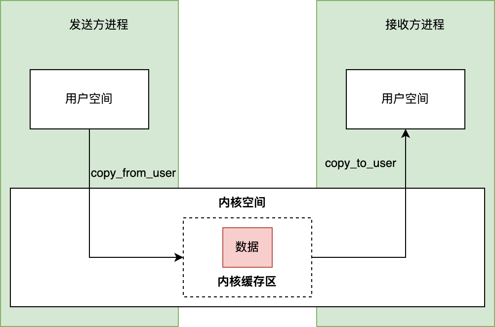


```
发送方 copy_from_user → 内核缓冲区 → copy_to_user →  接收方
       (第1次拷贝)                     (第2次拷贝)
```

### Binder 的一次拷贝方案
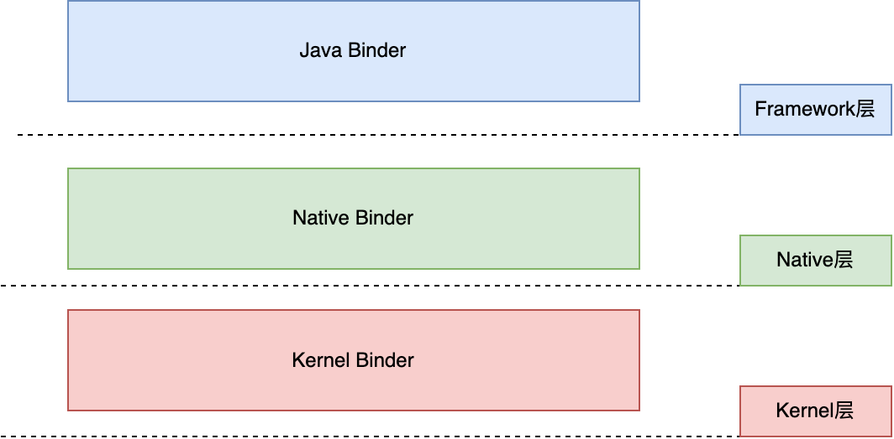


```
① 驱动在内核空间创建「数据接收缓存区」
② mmap：将数据接收缓存区与接收进程用户空间建立映射
③ 发送方 copy_from_user → 内核缓存区
   → 由于 mmap 映射，数据直接出现在接收进程的用户空间
   → 整个过程只用了 1 次拷贝
```

> Binder 使用 mmap 不是为了操作文件，而是利用 mmap 建立页表映射——写内核缓存区等同于写接收进程的用户空间。

### Binder 的分层架构

Binder 机制分为三层：

| 层 | 内容 | 角色 |
|----|------|------|
| **Kernel Binder** | Binder 驱动（`/dev/binder`） | 底层通信载体 |
| **Native Binder** | `BBinder` / `BpBinder` / `IPCThreadState` | C++ 封装 |
| **Java Binder** | `Binder` / `BinderProxy` / `Parcel` | 应用层接口 |

---

## 二、Binder 驱动四大核心方法

Binder 驱动以 misc 设备注册为 `/dev/binder`，是纯软件虚拟字符设备。它的生命周期由四个方法贯穿：`binder_init`（初始化）→ `binder_open`（打开）→ `binder_mmap`（映射）→ `binder_ioctl`（数据收发）。

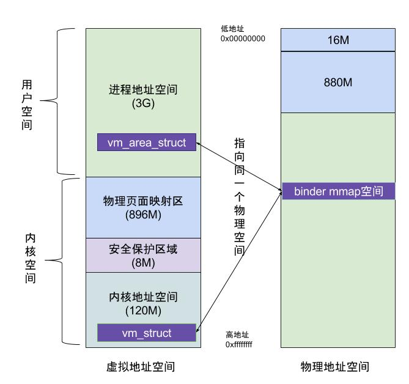


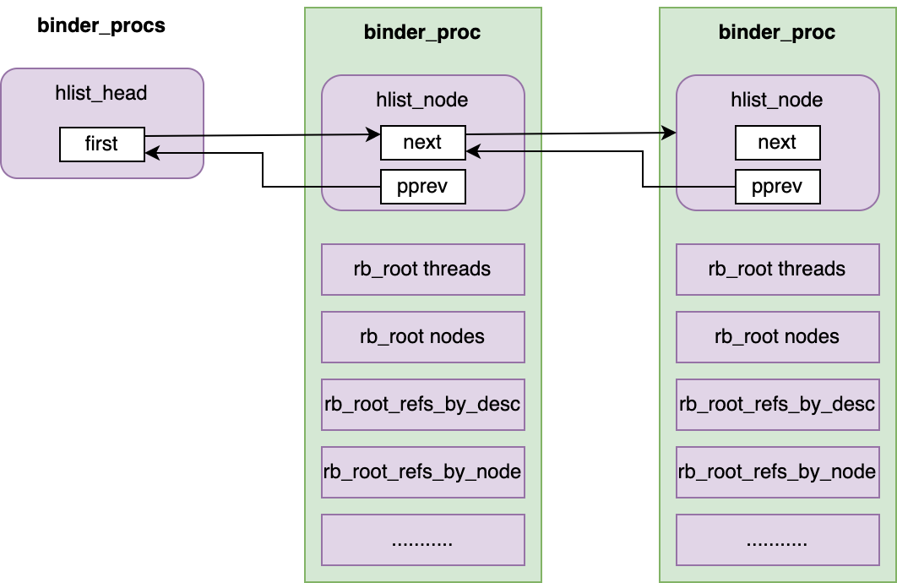


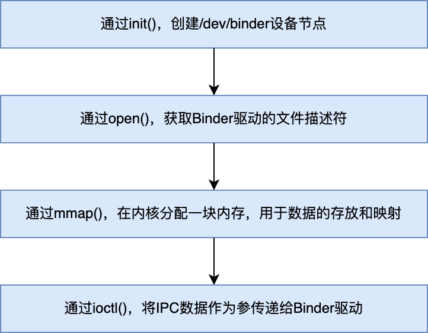


### 2.1 设备初始化：binder_init

```cpp
static int __init binder_init(void) {
    // 创建名为 "binder" 的工作队列
    binder_deferred_workqueue = create_singlethread_workqueue("binder");

    // 在 debugfs 创建 /sys/kernel/debug/binder/ 目录
    binder_debugfs_dir_entry_root = debugfs_create_dir("binder", NULL);
    binder_debugfs_dir_entry_proc = debugfs_create_dir("proc", binder_debugfs_dir_entry_root);

    // 注册 misc 设备 /dev/binder
    ret = misc_register(&binder_miscdev);

    // 创建 state / stats / transactions / transaction_log / failed_transaction_log
    debugfs_create_file("state", ...);
    debugfs_create_file("stats", ...);
    // ...
}
```

`binder_miscdev` 绑定文件操作表 `binder_fops`：

```cpp
static struct miscdevice binder_miscdev = {
    .minor = MISC_DYNAMIC_MINOR,   // 次设备号，动态分配
    .name  = "binder",             // 设备名
    .fops  = &binder_fops          // 文件操作结构体
};

static const struct file_operations binder_fops = {
    .owner          = THIS_MODULE,
    .poll           = binder_poll,
    .unlocked_ioctl = binder_ioctl,
    .compat_ioctl   = binder_ioctl,
    .mmap           = binder_mmap,
    .open           = binder_open,
    .flush          = binder_flush,
    .release        = binder_release,
};
```

初始化完成后，`/dev/binder` 设备文件的 open、mmap、ioctl 分别映射到 `binder_open`、`binder_mmap`、`binder_ioctl`。

此外还在 `/proc/binder/proc` 目录下为每个使用 Binder 的进程创建以其 PID 命名的文件，通过它们可读取各进程的 Binder 线程池、实体对象、引用对象和内核缓冲区信息。

### 2.2 设备打开：binder_open

进程使用 Binder 之前必须 `open("/dev/binder")`，触发驱动的 `binder_open` 方法：

```cpp
static int binder_open(struct inode *nodp, struct file *filp) {
    struct binder_proc *proc;

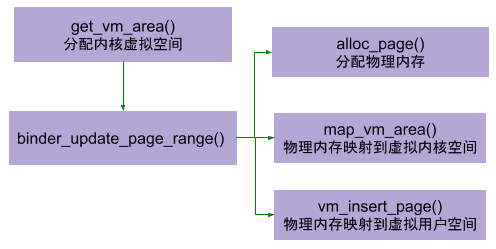


    // 在 kernel 空间分配 binder_proc
    proc = kzalloc(sizeof(*proc), GFP_KERNEL);

    proc->tsk = current;                          // 记录当前进程 task_struct
    INIT_LIST_HEAD(&proc->todo);                  // 初始化待处理事务链表
    init_waitqueue_head(&proc->wait);             // 初始化等待队列
    proc->default_priority = task_nice(current);   // 将 nice 值转为进程优先级

    // 将 proc 加入全局哈希表 binder_procs（所有 Binder 进程的注册表）
    hlist_add_head(&proc->proc_node, &binder_procs);
    proc->pid = current->group_leader->pid;

    filp->private_data = proc;   // ★ 关键：后续 mmap/ioctl 通过它找回 proc
    return 0;
}
```

核心动作：创建 `binder_proc` 对象保存进程信息 → 加入全局哈希表 `binder_procs` → 将 proc 存入 `filp->private_data`。后续 `mmap` 和 `ioctl` 调用时，内核将同一个 `file` 结构传回驱动，驱动通过 `private_data` 取回对应的 `binder_proc`。

### 2.3 内存映射：binder_mmap

```cpp
static int binder_mmap(struct file *filp, struct vm_area_struct *vma) {
    struct binder_proc *proc = filp->private_data;

    // 限制缓冲区最大 4MB
    if ((vma->vm_end - vma->vm_start) > SZ_4M)
        vma->vm_end = vma->vm_start + SZ_4M;

    // 在内核虚拟空间分配等大连续区域
    area = get_vm_area(vma->vm_end - vma->vm_start, VM_IOREMAP);
    proc->buffer = area->addr;

    // ★ 关键偏移量：用户空间地址 = 内核空间地址 + user_buffer_offset
    proc->user_buffer_offset = vma->vm_start - (uintptr_t)proc->buffer;

    // 分配物理页面指针数组
    proc->pages = kzalloc(sizeof(proc->pages[0]) *
        ((vma->vm_end - vma->vm_start) / PAGE_SIZE), GFP_KERNEL);

    proc->buffer_size = vma->vm_end - vma->vm_start;

    // 分配物理页面，同时映射到内核空间和进程空间（同一物理页）
    binder_update_page_range(proc, 1, proc->buffer, proc->buffer + PAGE_SIZE, vma);

    // 初始化 buffers 链表，将首个 buffer 加入空闲列表
    buffer = proc->buffer;
    INIT_LIST_HEAD(&proc->buffers);
    list_add(&buffer->entry, &proc->buffers);
    buffer->free = 1;
    binder_insert_free_buffer(proc, buffer);

    // 异步可用空间为总大小的一半
    proc->free_async_space = proc->buffer_size / 2;
}
```

`binder_update_page_range` 分配物理页并建立双重映射：

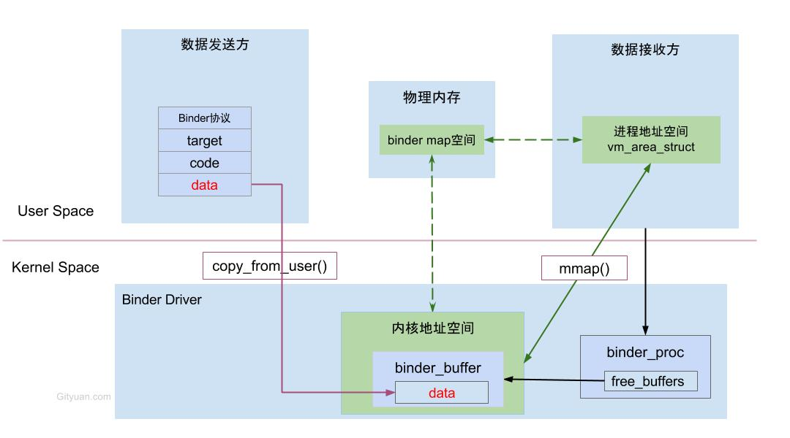

```cpp
static int binder_update_page_range(struct binder_proc *proc, int allocate,
            void *start, void *end, struct vm_area_struct *vma) {
    for (page_addr = start; page_addr < end; page_addr += PAGE_SIZE) {
        // 分配一个 page 的物理内存
        *page = alloc_page(GFP_KERNEL | __GFP_HIGHMEM | __GFP_ZERO);

        // 物理空间 → 映射到虚拟内核空间
        ret = map_kernel_range_noflush((unsigned long)page_addr, PAGE_SIZE, PAGE_KERNEL, page);

        // 物理空间 → 映射到虚拟进程空间（同一个物理页！）
        user_page_addr = (uintptr_t)page_addr + proc->user_buffer_offset;
        ret = vm_insert_page(vma, user_page_addr, page[0]);
    }
}
```

> 一块物理内存同时映射到内核空间和用户空间——Binder 一次拷贝的物理基础。

### 2.4 数据收发：binder_ioctl

所有 Binder 通信最终都是 `ioctl(fd, BINDER_WRITE_READ, &bwr)` ——一次系统调用完成写入和读取。

```
ioctl 入口 → binder_ioctl()
  → 根据 cmd 分发：
    BINDER_WRITE_READ → binder_ioctl_write_read()
      → copy_from_user(&bwr, ...)                     // 从用户空间拿到 bwr
      → binder_thread_write(proc, thread, ...)         // 处理 BC_ 请求
      → binder_thread_read(proc, thread, ...)          // 处理 BR_ 响应
      → copy_to_user(ubuf, &bwr, ...)                  // 返回给用户空间
    BINDER_SET_CONTEXT_MGR → 设置 ServiceManager
    BINDER_THREAD_EXIT → 线程退出清理
    ...
```

---

## 三、核心数据结构

Binder 驱动通过 7 个核心结构体维护进程状态、实体引用关系、数据传输和线程管理。

| 结构体 | 角色 | 核心字段 |
|--------|------|---------|
| `binder_proc` | 使用 Binder 的进程 | `tsk`、`todo`（待处理）、`threads`（红黑树线程池）、`nodes`（实体红黑树）、`refs_by_desc`/`refs_by_node`（引用红黑树）、`buffer`/`buffer_size`（内核缓冲区） |
| `binder_thread` | Binder 线程 | `task`（task_struct）、`proc`（所属进程）、`todo`（待处理事务）、`transaction_stack`（事务栈）、`looper`（线程状态） |
| `binder_node` | Binder 实体对象 | `ptr`/`cookie`（用户空间地址对，用于找到服务对象）、`proc`（所属进程）、`refs`（引用列表）、`work`（待处理工作）、`has_strong_ref`/`has_weak_ref` |
| `binder_ref` | Binder 引用对象 | `node`（指向实体）、`desc`（句柄编号，跨进程唯一）、`proc`（持有该引用的进程）、`death`（死亡通知） |
| `binder_buffer` | 传输数据缓冲区 | `data`（数据指针）、`offsets`（Binder 对象偏移数组）、`async`（是否异步）、`transaction`（所属事务）、`free`（是否空闲） |
| `binder_transaction` | 一次跨进程调用 | `from`（发起线程/进程）、`to_thread`/`to_proc`（目标）、`buffer`（数据缓冲）、`code`（方法编号）、`flags`（TF_ONE_WAY 等） |
| `flat_binder_object` | 跨进程传输的 Binder 对象封装 | `type`（BINDER_TYPE_BINDER/HANDLE/FD）、`binder`（实体指针）、`handle`（引用句柄）、`cookie`（服务端上下文） |

### 关系总览


```
Server 进程 (binder_proc)                 Client 进程 (binder_proc)
  nodes (红黑树)                             refs_by_desc (红黑树)
    └── binder_node                          └── binder_ref
          ptr → 服务对象的用户空间地址              desc = 1
          cookie → 用户自定义上下文                  node ────→ binder_node
          refs ──────────────────────────────────────────────→ ref
          proc = Server                                     proc = Client
```

> 驱动通过 `binder_node` ↔ `binder_ref` 的双向追踪，保证当服务端进程死亡时，所有客户端持有的引用都能收到 `BR_DEAD_BINDER` 死亡通知。

---

## 四、Binder 通信协议码

Binder 协议分为两大类：**BC_**（Binder Command，用户空间→驱动）和 **BR_**（Binder Reply，驱动→用户空间）。

### 常用 BC 命令

| 命令 | 含义 |
|------|------|
| `BC_TRANSACTION` | 发送同步调用（最频繁） |
| `BC_REPLY` | 服务端返回结果 |
| `BC_ACQUIRE` / `BC_RELEASE` | 强引用计数 ±1 |
| `BC_INCREFS` / `BC_DECREFS` | 弱引用计数 ±1 |
| `BC_REQUEST_DEATH_NOTIFICATION` | 注册死亡通知 |
| `BC_CLEAR_DEATH_NOTIFICATION` | 取消死亡通知 |
| `BC_REGISTER_LOOPER` | 注册为 Binder 线程 |
| `BC_ENTER_LOOPER` / `BC_EXIT_LOOPER` | 线程进入/退出循环 |
| `BC_FREE_BUFFER` | 释放 buffer |

### 常用 BR 命令

| 命令 | 含义 |
|------|------|
| `BR_TRANSACTION` | 通知服务端处理调用 |
| `BR_REPLY` | 通知客户端收到返回结果 |
| `BR_ACQUIRE` / `BR_RELEASE` | 引用计数变化通知 |
| `BR_DEAD_BINDER` | 服务端进程已死亡 |
| `BR_SPAWN_LOOPER` | 驱动建议创建更多 Binder 线程 |
| `BR_OK` / `BR_NOOP` | 操作成功 / 空操作 |
| `BR_FAILED_REPLY` | 回复发送失败 |

### 发送流程：binder_thread_write

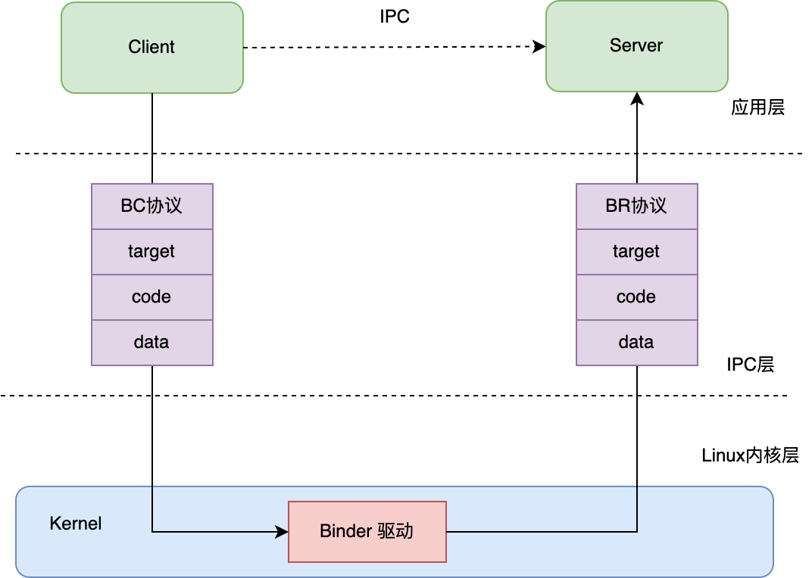


```cpp
binder_thread_write() {
    while (ptr < end && thread->return_error == BR_OK) {
        get_user(cmd, (uint32_t __user *)ptr);   // 获取 BC 命令

        switch (cmd) {
            case BC_TRANSACTION:
            case BC_REPLY: {
                struct binder_transaction_data tr;
                copy_from_user(&tr, ptr, sizeof(tr));  // 拷贝用户空间数据到内核
                binder_transaction(proc, thread, &tr, cmd == BC_REPLY);
                break;
            }
            case BC_REGISTER_LOOPER: ...
            case BC_ENTER_LOOPER: ...
            case BC_REQUEST_DEATH_NOTIFICATION: ...
            case BC_FREE_BUFFER: ...
        }
    }
}
```

`binder_transaction` 是通信核心——处理发送时执行：

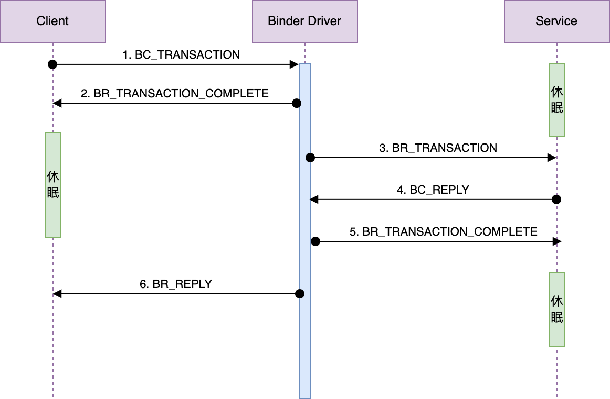


```cpp
static void binder_transaction(struct binder_proc *proc,
                struct binder_thread *thread,
                struct binder_transaction_data *tr, int reply) {
    // 确定目标：通过 handle 找到 binder_ref → binder_node → proc
    struct binder_thread *target_thread;
    struct binder_proc *target_proc;
    struct binder_node *target_node;

    // 分配事务对象
    struct binder_transaction *t = kzalloc(sizeof(*t), GFP_KERNEL);
    // 从目标进程分配 buffer
    t->buffer = binder_alloc_buf(target_proc, tr->data_size, ...);
    // 拷贝用户空间数据到目标 buffer
    copy_from_user(t->buffer->data, tr->data.ptr.buffer, tr->data_size);

    // 遍历 flat_binder_object 偏移数组，处理 Binder 对象传递
    for (offp = off_start; offp < off_end; offp++) {
        switch (fp->type) {
            case BINDER_TYPE_BINDER: ...       // 实体 → 创建 node + ref
            case BINDER_TYPE_HANDLE: ...       // 引用 → 查 ref → 跨进程创建 ref
            case BINDER_TYPE_FD: ...           // 文件描述符
        }
    }

    // 将工作项加入目标进程/线程的 todo 队列
    t->work.type = BINDER_WORK_TRANSACTION;
    list_add_tail(&t->work.entry, target_list);
    // 给自己插入完成通知
    tcomplete->type = BINDER_WORK_TRANSACTION_COMPLETE;
    list_add_tail(&tcomplete->entry, &thread->todo);
    // 唤醒目标线程
    wake_up_interruptible(target_wait);
}
```

### 接收流程：binder_thread_read

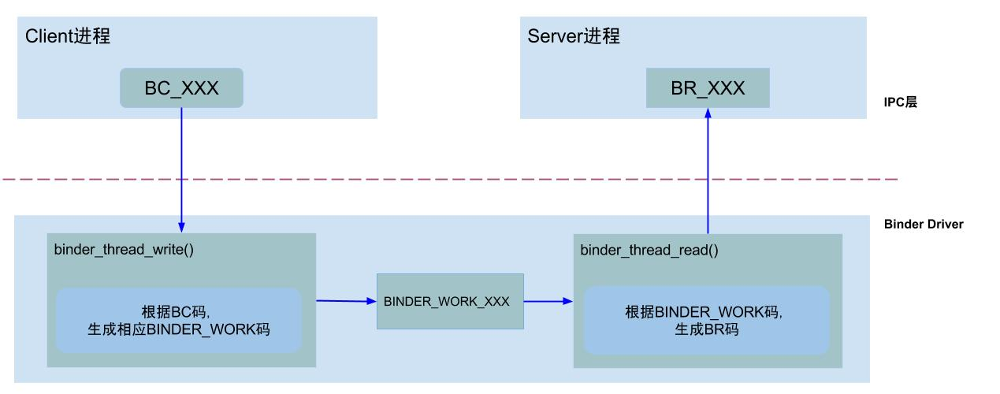


```cpp
binder_thread_read() {
    // 判断在当前线程还是进程上等待
    wait_for_proc_work = thread->transaction_stack == NULL &&
                         list_empty(&thread->todo);
    if (wait_for_proc_work)
        wait_event_freezable_exclusive(proc->wait, binder_has_proc_work(proc, thread));
    else
        wait_event_freezable(thread->wait, binder_has_thread_work(thread));

    while (1) {
        switch (w->type) {
            case BINDER_WORK_TRANSACTION: {
                struct binder_transaction *t = container_of(w, ...);
                // 生成 BR_TRANSACTION 返回给用户空间
                put_user(BR_TRANSACTION, ...);
                copy_to_user(ptr, &t->buffer->data, ...);
                break;
            }
            case BINDER_WORK_TRANSACTION_COMPLETE:
                put_user(BR_TRANSACTION_COMPLETE, ...);
                break;
            case BINDER_WORK_DEAD_BINDER:
                put_user(BR_DEAD_BINDER, ...);
                break;
        }
    }
}
```

> 整个过程是一个请求-响应协议：Client 发 BC_TRANSACTION → 驱动生成 binder_transaction → 写入目标 todo → 唤醒目标 → 目标读 BR_TRANSACTION 处理 → 目标发 BC_REPLY → 驱动写 BR_REPLY 回 Client。
