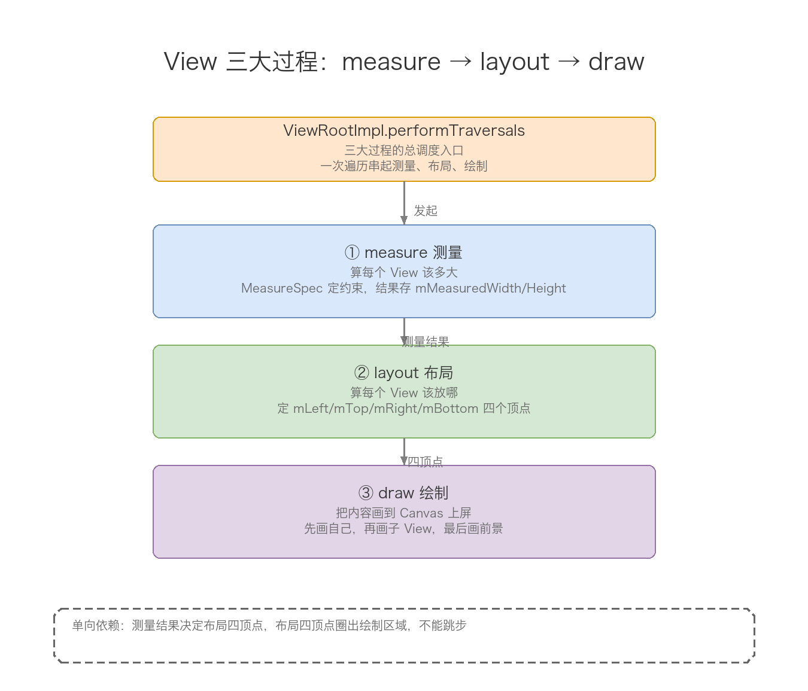
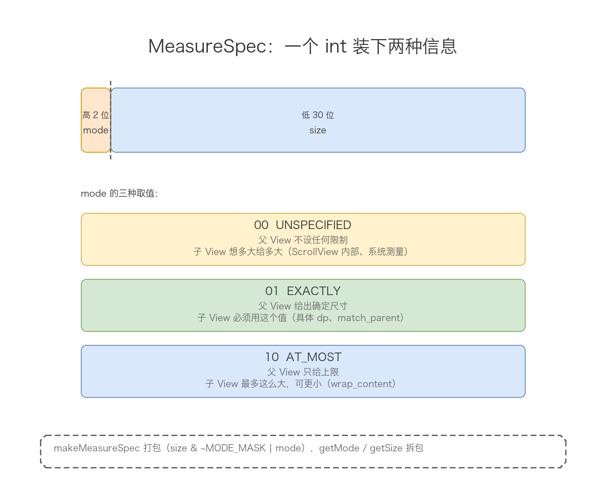
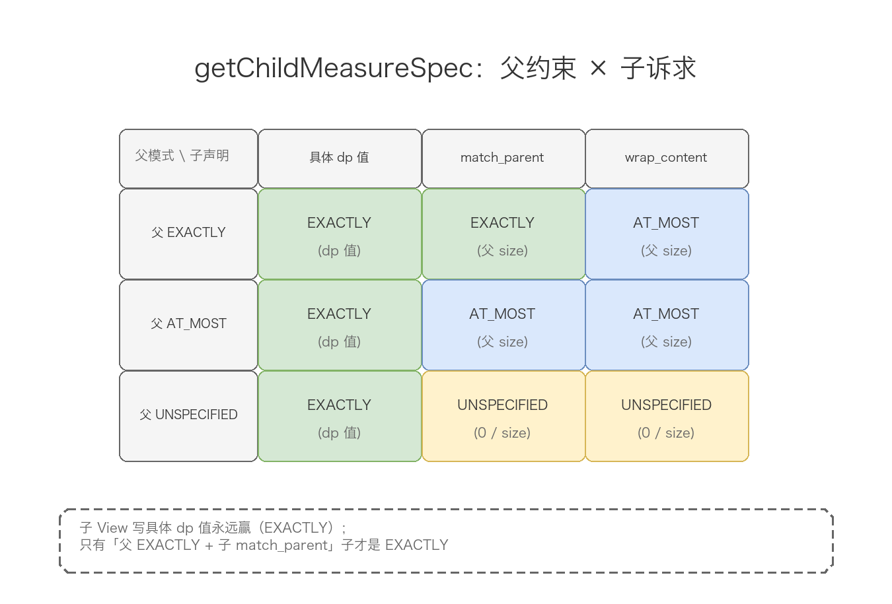
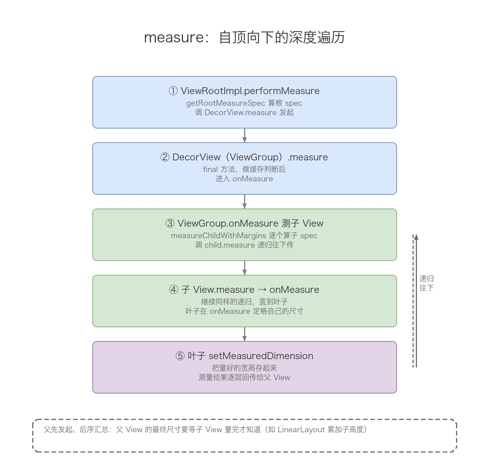
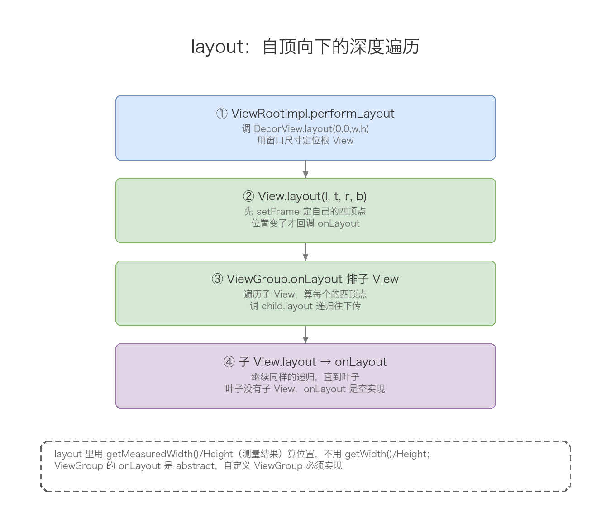
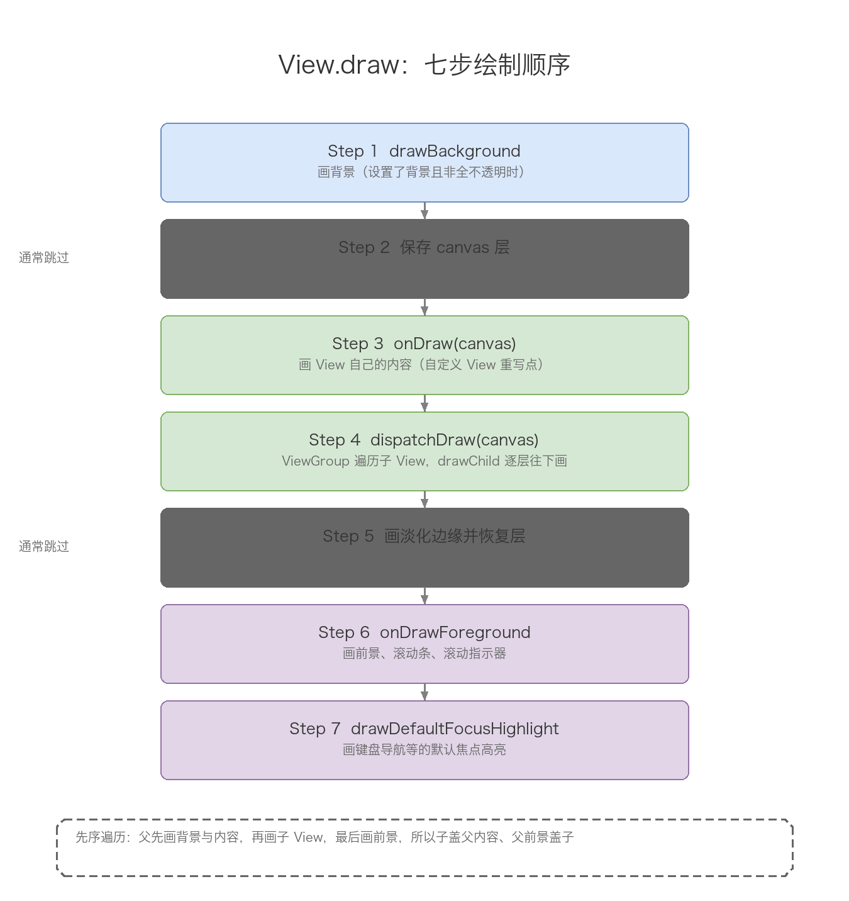
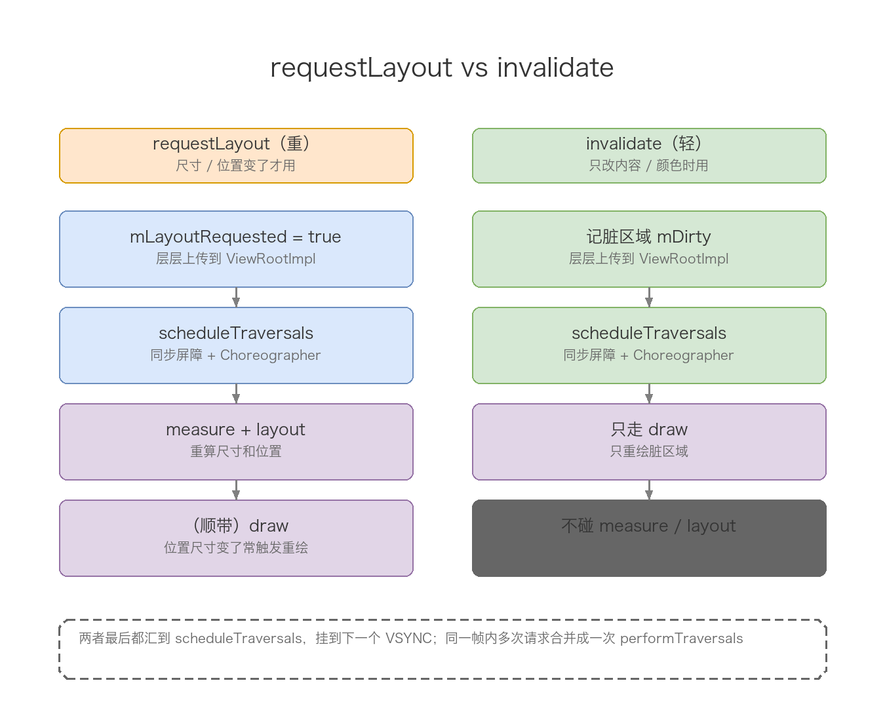

# View绘制的三个流程

## meta-info

| 字段 | 内容 |
|------|------|
| 分类 | Android 框架层 / View 绘制体系 |
| 本篇范围 | View 从「一次绘制请求」到「像素上屏」中间经历的三个过程：measure 测量、layout 布局、draw 绘制 |
| 主线 | 总览（performTraversals 调度）→ measure → layout → draw → 触发与调度机制 → 自定义 View 贯通 → 高频速记 |

## 导读

窗口体系那篇讲过，每个 Activity 的界面最终都挂在一棵 View 树上，树根是 DecorView，而 DecorView 由一个 ViewRootImpl 管着。这一篇回答的是另一个问题：这棵树是怎么长成屏幕上那些有位置、有大小的控件的。

答案就是三个过程，按顺序跑一遍：

1. measure 测量：算每个 View 该有多大。父 View 用 MeasureSpec 给子 View 定约束，子 View 量出自己的宽高，存进 mMeasuredWidth / mMeasuredHeight。
2. layout 布局：算每个 View 该放哪。父 View 拿到子 View 量好的尺寸，决定它四个顶点的位置，存进 mLeft / mTop / mRight / mBottom。
3. draw 绘制：把每个 View 画出来。从树根一路往下，先画自己的背景和内容，再画子 View，最后画前景和滚动条。

三个过程的统一入口是 ViewRootImpl 的 performTraversals，它在一条方法里按「先测量、再布局、后绘制」的顺序把它们串起来。搞清楚这一条线，自定义 View 时该重写哪个方法、什么时候能拿到正确的宽高，就都有答案了。

measure 和 layout 都是「父驱动、自顶向下」的递归；draw 也是自顶向下，但顺序上是「先画父、再画子」的先序遍历。这是理解三者最该先记住的一句话，后面每个过程都会反复印证。

## 目录

- [一、总览：View 是怎么被画到屏幕上的](#一总览view-是怎么被画到屏幕上的)
- [二、measure：测量](#二measure测量)
  - [2.1 MeasureSpec：一个 int 装下模式与尺寸](#21-measurespec一个-int-装下模式与尺寸)
  - [2.2 测量入口：View.measure 是 final](#22-测量入口viewmeasure-是-final)
  - [2.3 View 的默认测量：getDefaultSize 与 wrap_content 的坑](#23-view-的默认测量getdefaultsize-与-wrap_content-的坑)
  - [2.4 ViewGroup 怎么测子 View：getChildMeasureSpec 规则表](#24-viewgroup-怎么测子-viewgetchildmeasurespec-规则表)
  - [2.5 测量顺序：自顶向下的深度遍历](#25-测量顺序自顶向下的深度遍历)
- [三、layout：布局](#三layout布局)
  - [3.1 入口：View.layout 与 setFrame](#31-入口viewlayout-与-setframe)
  - [3.2 ViewGroup 必须重写 onLayout](#32-viewgroup-必须重写-onlayout)
- [四、draw：绘制](#四draw绘制)
  - [4.1 入口：View.draw 的七步](#41-入口viewdraw-的七步)
  - [4.2 每一步都在干什么](#42-每一步都在干什么)
  - [4.3 setWillNotDraw：一个省绘制开销的开关](#43-setwillnotdraw一个省绘制开销的开关)
  - [4.4 硬件加速下的绘制：DisplayList](#44-硬件加速下的绘制displaylist)
- [五、三大过程的触发与调度](#五三大过程的触发与调度)
  - [5.1 requestLayout：只走 measure + layout](#51-requestlayout只走-measure--layout)
  - [5.2 invalidate：只走 draw](#52-invalidate只走-draw)
  - [5.3 scheduleTraversals：同步屏障 + Choreographer](#53-scheduletraversals同步屏障--choreographer)
  - [5.4 performTraversals 的完整判断逻辑](#54-performtraversals-的完整判断逻辑)
- [六、一个自定义 View 贯通三大过程](#六一个自定义-view-贯通三大过程)
- [七、高频速记](#七高频速记)
- [图索引](#图索引)

## 一、总览：View 是怎么被画到屏幕上的

先把三个过程的调度入口拎出来。所有绘制都从 ViewRootImpl 的 performTraversals 开始，它大体长这样（去掉大量边界判断，只留主干）：

```java
private void performTraversals() {
    final View host = mView;   // host 就是 DecorView

    // 1. 先算根 View 的 MeasureSpec，再测量
    int childWidthMeasureSpec = getRootMeasureSpec(mWidth, lp.width);
    int childHeightMeasureSpec = getRootMeasureSpec(mHeight, lp.height);
    performMeasure(childWidthMeasureSpec, childHeightMeasureSpec);

    // 2. 布局
    performLayout(lp, mWidth, mHeight);

    // 3. 绘制
    performDraw();
}
```

三个方法各干一件事，层层往下钻：

| 方法 | 干什么 | 最终落到 View 树的哪个方法 |
|------|--------|------------------------------|
| performMeasure | 拿到根 MeasureSpec，调 host.measure | View.measure → onMeasure |
| performLayout | 调 host.layout(0, 0, w, h) | View.layout → onLayout |
| performDraw | 拿到 Canvas，调 host.draw(canvas) | View.draw → onDraw / dispatchDraw |

measure、layout、draw 三个过程的关系用一张图摆清楚：



> 图片：三大过程总览。performTraversals 依次触发 performMeasure（算尺寸）→ performLayout（定位置）→ performDraw（画内容），前一个过程的结果是后一个过程的输入：测量结果决定布局的四顶点，布局确定的四顶点圈出绘制区域。

三个过程之间的依赖是单向的，不能跳步。measure 没跑完，layout 拿不到正确的测量宽高；layout 没跑完，draw 不知道画在哪、画多大。这也是为什么「在 onCreate 里直接 getWidth() 拿不到值」——那一刻 performTraversals 还没跑到 layout，四个顶点都还是 0。

还有一个点值得先说清楚：DecorView 的 MeasureSpec 不是随便给的，它由窗口尺寸和 DecorView 自己的 LayoutParams（默认 MATCH_PARENT）决定。getRootMeasureSpec 就干这件事：

```java
private static int getRootMeasureSpec(int windowSize, int rootDimension) {
    int measureSpec;
    switch (rootDimension) {
        case ViewGroup.LayoutParams.MATCH_PARENT:
            // 窗口不能自由调整大小，强制根 View 铺满窗口
            measureSpec = MeasureSpec.makeMeasureSpec(windowSize, MeasureSpec.EXACTLY);
            break;
        case ViewGroup.LayoutParams.WRAP_CONTENT:
            measureSpec = MeasureSpec.makeMeasureSpec(windowSize, MeasureSpec.AT_MOST);
            break;
        default:
            measureSpec = MeasureSpec.makeMeasureSpec(rootDimension, MeasureSpec.EXACTLY);
            break;
    }
    return measureSpec;
}
```

所以普通窗口的根 DecorView 一定是 EXACTLY + 窗口尺寸，也就是全屏。这是整棵树测量的起点：根拿到确定约束，再一层层往子 View 传。

## 二、measure：测量

测量解决一个问题：每个 View 到底该多大。这个「多大」不是拍脑袋定的，而是「父 View 给的约束」和「子 View 自己想要的尺寸」博弈出来的结果。约束的载体就是 MeasureSpec。

### 2.1 MeasureSpec：一个 int 装下模式与尺寸

MeasureSpec 是一个 32 位的 int。为了少造对象，Android 把两个信息塞进一个 int：高 2 位存模式（mode），低 30 位存尺寸（size）。解析和打包用位运算：

```java
public static class MeasureSpec {
    private static final int MODE_SHIFT = 30;
    private static final int MODE_MASK  = 0x3 << MODE_SHIFT;

    public static final int UNSPECIFIED = 0 << MODE_SHIFT;  // 00
    public static final int EXACTLY     = 1 << MODE_SHIFT;  // 01
    public static final int AT_MOST     = 2 << MODE_SHIFT;  // 10

    public static int makeMeasureSpec(int size, int mode) {
        return (size & ~MODE_MASK) | (mode & MODE_MASK);
    }

    public static int getMode(int measureSpec) {
        return measureSpec & MODE_MASK;
    }

    public static int getSize(int measureSpec) {
        return measureSpec & ~MODE_MASK;
    }
}
```

三种模式的含义：

| 模式 | 含义 | 典型来源 |
|------|------|----------|
| UNSPECIFIED | 父 View 对子 View 没有任何限制，想多大给多大 | ScrollView 内部、系统内部测量 |
| EXACTLY | 父 View 给出了确定尺寸，子 View 必须用这个值 | 具体 dp 值、match_parent |
| AT_MOST | 父 View 给出上限，子 View 最多这么大，可以更小 | wrap_content |

一个 int 同时背两样东西，是这个设计的精髓，图里拆开看：



> 图片：MeasureSpec 的 32 位结构。高 2 位是模式（00=UNSPECIFIED、01=EXACTLY、10=AT_MOST），低 30 位是尺寸。makeMeasureSpec 打包，getMode / getSize 拆包。

### 2.2 测量入口：View.measure 是 final

View 的 measure 方法是 final，业务代码不能重写它，只能重写 onMeasure。measure 本身除了调 onMeasure，还做了缓存判断，避免没必要的重复测量：

```java
public final void measure(int widthMeasureSpec, int heightMeasureSpec) {
    // 光学边界相关处理，先略
    boolean optical = isLayoutModeOptical(this);
    ...

    // 用两个 spec 拼一个 key，作为缓存的键
    long key = (long) widthMeasureSpec << 32 | (long) heightMeasureSpec & 0xffffffffL;
    if (mMeasureCache == null) mMeasureCache = new LongSparseLongArray(2);

    final boolean forceLayout = (mPrivateFlags & PFLAG_FORCE_LAYOUT) == PFLAG_FORCE_LAYOUT;
    final boolean specChanged = widthMeasureSpec != mOldWidthMeasureSpec
            || heightMeasureSpec != mOldHeightMeasureSpec;
    final boolean isSpecExactly = MeasureSpec.getMode(widthMeasureSpec) == MeasureSpec.EXACTLY
            && MeasureSpec.getMode(heightMeasureSpec) == MeasureSpec.EXACTLY;
    final boolean matchesSpecSize = getMeasuredWidth() == MeasureSpec.getSize(widthMeasureSpec)
            && getMeasuredHeight() == MeasureSpec.getSize(heightMeasureSpec);
    final boolean needsLayout = specChanged
            && (sAlwaysRemeasureExactly || !isSpecExactly || !matchesSpecSize);

    if (forceLayout || needsLayout) {
        mPrivateFlags &= ~PFLAG_MEASURED_DIMENSION_SET;
        resolveRtlPropertiesIfNeeded();

        int cacheIndex = forceLayout ? -1 : mMeasureCache.indexOfKey(key);
        if (cacheIndex < 0 || sIgnoreMeasureCache) {
            // 没有命中缓存，才真正调 onMeasure
            onMeasure(widthMeasureSpec, heightMeasureSpec);
            mPrivateFlags3 &= ~PFLAG3_MEASURE_NEEDED_BEFORE_LAYOUT;
        } else {
            // 命中缓存，直接把上次结果搬出来，跳过 onMeasure
            long value = mMeasureCache.valueAt(cacheIndex);
            setMeasuredDimensionRaw((int) (value >> 32), (int) value);
            mPrivateFlags3 |= PFLAG3_MEASURE_NEEDED_BEFORE_LAYOUT;
        }
        ...
    }

    mOldWidthMeasureSpec = widthMeasureSpec;
    mOldHeightMeasureSpec = heightMeasureSpec;
    ...
}
```

几个判断条件解释了日常看到的现象：

- forceLayout：View 被 forceLayout() 标记过，或者 requestLayout 传下来的强制标记，此时必须重测。
- needsLayout：spec 变了，且要么不是双 EXACTLY、要么上次量出的尺寸对不上新 size。也就是说，如果两次 spec 一模一样，第二次 measure 大概率直接走缓存，onMeasure 不执行。这就是为什么有时连续 requestLayout 也不会无脑重算。
- 缓存：mMeasureCache 用 spec 拼成的 key 存上次结果，命中就把 mMeasuredWidth / mMeasuredHeight 原样恢复，省掉 onMeasure。

measure 之后，View 的测量宽高存在 mMeasuredWidth / mMeasuredHeight，通过 getMeasuredWidth() / getMeasuredHeight() 读。注意这两个值要等 onMeasure 之后才有效，onMeasure 之前读是 0。

### 2.3 View 的默认测量：getDefaultSize 与 wrap_content 的坑

View 的 onMeasure 默认实现只有一行：

```java
protected void onMeasure(int widthMeasureSpec, int heightMeasureSpec) {
    setMeasuredDimension(getDefaultSize(getSuggestedMinimumWidth(), widthMeasureSpec),
            getDefaultSize(getSuggestedMinimumHeight(), heightMeasureSpec));
}
```

getDefaultSize 决定最终尺寸：

```java
public static int getDefaultSize(int size, int measureSpec) {
    int result = size;
    int specMode = MeasureSpec.getMode(measureSpec);
    int specSize = MeasureSpec.getSize(measureSpec);

    switch (specMode) {
        case MeasureSpec.UNSPECIFIED:
            result = size;          // 无约束，用建议值
            break;
        case MeasureSpec.AT_MOST:
        case MeasureSpec.EXACTLY:
            result = specSize;      // 有约束，直接用 spec 给的尺寸
            break;
    }
    return result;
}
```

注意 AT_MOST 和 EXACTLY 走的是同一分支，都返回 specSize。这意味着：如果直接继承 View（不是 ViewGroup），不重写 onMeasure，那在布局里写 wrap_content 和 match_parent 效果一样——都撑满父 View 给的上限。这是自定义 View 最经典的坑：自定义 View 想要 wrap_content 生效，必须在 onMeasure 里单独处理 AT_MOST 的情况。

getSuggestedMinimumWidth 决定「建议值」，它取 mMinWidth 和背景最小宽度的较大者：

```java
protected int getSuggestedMinimumWidth() {
    return (mBackground == null) ? mMinWidth
            : Math.max(mMinWidth, mBackground.getMinimumWidth());
}
```

所以即使没设 minWidth，只要设了背景，UNSPECIFIED 模式下 View 也会不小于背景的最小尺寸。

setMeasuredDimension 是必须调用的，它设置 mMeasuredWidth / mMeasuredHeight。onMeasure 里如果忘了调它，measure 收尾校验时会直接抛 IllegalStateException。

### 2.4 ViewGroup 怎么测子 View：getChildMeasureSpec 规则表

ViewGroup 自己是一个抽象类，它没有默认 onMeasure（因为不同容器的排版规则不同），但提供了一套测子 View 的工具方法。最常用的是 measureChildWithMargins：

```java
protected void measureChildWithMargins(View child,
        int parentWidthMeasureSpec, int widthUsed,
        int parentHeightMeasureSpec, int heightUsed) {
    final MarginLayoutParams lp = (MarginLayoutParams) child.getLayoutParams();

    final int childWidthMeasureSpec = getChildMeasureSpec(parentWidthMeasureSpec,
            mPaddingLeft + mPaddingRight + lp.leftMargin + lp.rightMargin + widthUsed, lp.width);
    final int childHeightMeasureSpec = getChildMeasureSpec(parentHeightMeasureSpec,
            mPaddingTop + mPaddingBottom + lp.topMargin + lp.bottomMargin + heightUsed, lp.height);

    child.measure(childWidthMeasureSpec, childHeightMeasureSpec);
}
```

核心逻辑就一句：先算父 View 能给子 View 多少可用空间（父 spec 的 size 减去 padding、margin、已占用的 widthUsed），再结合子 View 自己在 LayoutParams 里写的尺寸（具体 dp 值 / MATCH_PARENT / WRAP_CONTENT），用 getChildMeasureSpec 合成子 View 的 MeasureSpec。

getChildMeasureSpec 是整个测量体系里最该背下来的方法，它把「父约束 × 子诉求」的九种组合翻译成最终约束：

```java
public static int getChildMeasureSpec(int spec, int padding, int childDimension) {
    int specMode = MeasureSpec.getMode(spec);
    int specSize = MeasureSpec.getSize(spec);
    int size = Math.max(0, specSize - padding);   // 去掉 padding 后的可用空间

    int resultSize = 0;
    int resultMode = 0;

    switch (specMode) {
        case MeasureSpec.EXACTLY:
            if (childDimension >= 0) {
                // 子 View 写了具体值，就按它来
                resultSize = childDimension;
                resultMode = MeasureSpec.EXACTLY;
            } else if (childDimension == LayoutParams.MATCH_PARENT) {
                resultSize = size;
                resultMode = MeasureSpec.EXACTLY;
            } else if (childDimension == LayoutParams.WRAP_CONTENT) {
                // 子 View 想要多大就多大，但不能超过父
                resultSize = size;
                resultMode = MeasureSpec.AT_MOST;
            }
            break;

        case MeasureSpec.AT_MOST:
            if (childDimension >= 0) {
                resultSize = childDimension;
                resultMode = MeasureSpec.EXACTLY;
            } else if (childDimension == LayoutParams.MATCH_PARENT) {
                // 父自身都不确定，子也别想确定
                resultSize = size;
                resultMode = MeasureSpec.AT_MOST;
            } else if (childDimension == LayoutParams.WRAP_CONTENT) {
                resultSize = size;
                resultMode = MeasureSpec.AT_MOST;
            }
            break;

        case MeasureSpec.UNSPECIFIED:
            if (childDimension >= 0) {
                resultSize = childDimension;
                resultMode = MeasureSpec.EXACTLY;
            } else if (childDimension == LayoutParams.MATCH_PARENT) {
                resultSize = View.sUseZeroUnspecifiedMeasureSpec ? 0 : size;
                resultMode = MeasureSpec.UNSPECIFIED;
            } else if (childDimension == LayoutParams.WRAP_CONTENT) {
                resultSize = View.sUseZeroUnspecifiedMeasureSpec ? 0 : size;
                resultMode = MeasureSpec.UNSPECIFIED;
            }
            break;
    }
    return MeasureSpec.makeMeasureSpec(resultSize, resultMode);
}
```

九种组合落成一张表：



> 图片：getChildMeasureSpec 规则表。行是父 View 的三种模式，列是子 View 的三种尺寸声明，格子是最终合出的子 MeasureSpec。记住两条主线即可：子 View 写了具体 dp 值永远赢（EXACTLY）；只有父 EXACTLY 且子 MATCH_PARENT 时，子才是 EXACTLY。

两条规律值得记住：

1. 子 View 写了具体值（childDimension >= 0），无论父什么模式，子都是 EXACTLY + 那个值。写死的尺寸不受父约束影响。
2. 只有「父 EXACTLY + 子 MATCH_PARENT」这一种组合，子才是 EXACTLY。其余 MATCH_PARENT 场景，父都不确定，子只能 AT_MOST 或 UNSPECIFIED。

### 2.5 测量顺序：自顶向下的深度遍历

测量的执行是自顶向下的递归：父 View 先拿到自己的 MeasureSpec，量自己之前（或过程中）给每个子 View 算 spec，调 child.measure，子 View 再同样往下传，直到叶子。整个过程一条链：



> 图片：measure 自顶向下递归。ViewRootImpl 从根 DecorView 发起 performMeasure，ViewGroup 在 onMeasure 里用 measureChildWithMargins 给子 View 算 spec 并调 child.measure，叶子 View 在 onMeasure 里 setMeasuredDimension 定格自己的尺寸，测量结果逐层回传。

这里有个「先序还是后序」的细节：ViewGroup 测自己的方式，是先测完所有子 View，再根据子 View 的尺寸算自己（比如 LinearLayout 把子 View 高度累加得到自己的 wrap_content 高度）。所以严格说，measure 是「先序遍历发起、后序汇总结果」——父先发起，但父的最终尺寸要等子量完才知道。

再看 performTraversals 里的 performMeasure 和 measureHierarchy，能解释「为什么 Activity 刚打开时 onMeasure 会被调两次」：

```java
private boolean measureHierarchy(final View host, final WindowManager.LayoutParams lp,
        final Resources res, final int desiredWindowWidth, final int desiredWindowHeight) {
    int childWidthMeasureSpec;
    int childHeightMeasureSpec;
    boolean windowSizeMayChange = false;

    boolean goodMeasure = false;
    if (lp.width == ViewGroup.LayoutParams.WRAP_CONTENT) {
        // 根是 wrap_content，系统拿几个档位的尺寸去试探，直到测出一个「够好」的结果
        ...
    } else {
        // 根不是 wrap_content，直接用窗口尺寸测一次
        childWidthMeasureSpec = getRootMeasureSpec(desiredWindowWidth, lp.width);
        childHeightMeasureSpec = getRootMeasureSpec(desiredWindowHeight, lp.height);
        performMeasure(childWidthMeasureSpec, childHeightMeasureSpec);
        if (mWidth != host.getMeasuredWidth() || mHeight != host.getMeasuredHeight()) {
            windowSizeMayChange = true;
        }
    }
    ...
    return windowSizeMayChange;
}
```

measureHierarchy 是第一次测量（探测性质，尤其根是 wrap_content 时要多档试探）。它跑完之后，performTraversals 后面还会再调一次 performMeasure 正式测。所以根是普通 MATCH_PARENT 时 onMeasure 至少两次，根是 wrap_content 时可能更多次。

## 三、layout：布局

测量解决了「多大」，布局解决「放哪」。layout 阶段给每个 View 确定四个顶点的坐标，存进 mLeft / mTop / mRight / mBottom。

### 3.1 入口：View.layout 与 setFrame

View 的 layout 方法（非 final，但官方不建议重写）：

```java
public void layout(int l, int t, int r, int b) {
    ...
    int oldL = mLeft;
    int oldT = mTop;
    int oldB = mBottom;
    int oldR = mRight;

    // setFrame 设置四个顶点，返回位置是否变化
    boolean changed = isLayoutModeOptical(mParent) ?
            setOpticalFrame(l, t, r, b) : setFrame(l, t, r, b);

    if (changed || (mPrivateFlags & PFLAG_LAYOUT_REQUIRED) == PFLAG_LAYOUT_REQUIRED) {
        // 位置变了，才回调 onLayout
        onLayout(changed, l, t, r, b);
        mPrivateFlags &= ~PFLAG_LAYOUT_REQUIRED;
        ...
    }
    ...
}
```

setFrame 是真正落坐标的地方：

```java
protected boolean setFrame(int left, int top, int right, int bottom) {
    boolean changed = false;
    if (mLeft != left || mRight != right || mTop != top || mBottom != bottom) {
        changed = true;
        ...
        int oldWidth = mRight - mLeft;
        int oldHeight = mBottom - mTop;
        mLeft = left;
        mTop = top;
        mRight = right;
        mBottom = bottom;
        ...
        if (sizeChanged && (mPrivateFlags & PFLAG_PFLAG_DRAWN) == PFLAG_PFLAG_DRAWN) {
            // 尺寸也变了，且已经画过，就触发重绘
            invalidate(sizeChanged);
        }
        ...
    }
    return changed;
}
```

setFrame 只有在四个顶点确实变化时才返回 true，此时才回调 onLayout，并且若尺寸变了还会 invalidate 触发重绘。如果这次 layout 的坐标和上次完全一样，onLayout 不会被调。

layout 的整体流程：



> 图片：layout 自顶向下递归。ViewRootImpl 调 DecorView.layout(0,0,w,h)，每个 View 在 layout 里先 setFrame 定自己的四顶点，再在 onLayout 里给每个子 View 算坐标、调 child.layout，一路传到叶子。叶子 View 没有子 View，onLayout 是空实现。

### 3.2 ViewGroup 必须重写 onLayout

View 的 onLayout 是空实现，因为单个 View 没有子 View 要排。ViewGroup 把 onLayout 声明成了抽象方法：

```java
public abstract class ViewGroup extends View implements ViewParent, ViewManager {
    ...
    @Override
    protected abstract void onLayout(boolean changed,
            int l, int t, int r, int b);
}
```

所以自定义 ViewGroup 必须实现 onLayout，在里面给每个子 View 调 child.layout。以最简单的 FrameLayout 为例，它默认把子 View 摆到左上角（实际还会按 gravity 计算）：

```java
// FrameLayout 简化版
protected void onLayout(boolean changed, int left, int top, int right, int bottom) {
    for (int i = 0; i < getChildCount(); i++) {
        View child = getChildAt(i);
        if (child.getVisibility() != GONE) {
            int childWidth = child.getMeasuredWidth();
            int childHeight = child.getMeasuredHeight();
            // 默认左上角，gravity 在这里参与计算
            int childLeft = getPaddingLeftWithForeground();
            int childTop = getPaddingTopWithForeground();
            child.layout(childLeft, childTop, childLeft + childWidth, childTop + childHeight);
        }
    }
}
```

注意 onLayout 里用的是 getMeasuredWidth() / getMeasuredHeight()，也就是 measure 阶段算好的尺寸，而不是 getWidth() / getHeight()。layout 的职责是「决定位置」，尺寸用的是测量结果。

LinearLayout 的 onLayout 更复杂，会根据 orientation 和每个子 View 的 margin、gravity 逐行/逐列排，但套路一样：遍历子 View，算好每个的四顶点，调 child.layout。

## 四、draw：绘制

测量和布局都只是「算数」，真正把像素画出来的是 draw。draw 阶段拿到一个 Canvas，View 把内容画上去，Canvas 背后连着 Surface，最终合成上屏。

### 4.1 入口：View.draw 的七步

View.draw 是整个绘制流程里注释写得最清楚的源码之一，它把绘制拆成严格有序的七步：

```java
public void draw(Canvas canvas) {
    /*
     * Draw traversal performs several drawing steps which must be executed
     * in the appropriate order:
     *
     *      1. Draw the background
     *      2. If necessary, save the canvas' layers to prepare for fading
     *      3. Draw view's content
     *      4. Draw children
     *      5. If necessary, draw the fading edges and restore layers
     *      6. Draw decorations (scrollbars for instance)
     *      7. Draw the default focus highlight
     */

    // Step 1, draw the background, if needed
    int saveCount;
    if (!dirtyOpaque) {
        drawBackground(canvas);
    }

    // skip step 2 & 5 if possible (common case)
    final int viewFlags = mViewFlags;
    boolean horizontalEdges = (viewFlags & FADING_EDGE_HORIZONTAL) != 0;
    boolean verticalEdges = (viewFlags & FADING_EDGE_VERTICAL) != 0;
    if (!verticalEdges && !horizontalEdges) {
        // 常见路径：没有 fading 边缘，跳过 2、5 两步

        // Step 3, draw the content
        onDraw(canvas);

        // Step 4, draw the children
        dispatchDraw(canvas);

        // Step 6, draw decorations (foreground, scrollbars)
        onDrawForeground(canvas);

        // Step 7, draw the default focus highlight
        drawDefaultFocusHighlight(canvas);

        return;
    }
    // 有 fading 边缘时才走完整的 2~5 步
    ...
}
```

七步拆开看：



> 图片：View.draw 的七步绘制顺序。背景 → 保存层 → onDraw 内容 → dispatchDraw 子 View → 淡化边缘恢复层 → onDrawForeground 前景滚动条 → 焦点高亮。第 2、5 步只在开启淡化边缘时执行，普通情况跳过，所以常简化为五步。

### 4.2 每一步都在干什么

七步各司其职：

1. drawBackground(canvas)：画背景。前提是 View 设置了背景 Drawable，且当前区域不是完全不透明（dirtyOpaque 为 false）。背景会先 setBounds 再 draw。
2. 保存 canvas 层：为淡化边缘（fading edge）做准备，普通情况跳过。
3. onDraw(canvas)：画 View 自己的内容。View 的 onDraw 是空实现，具体内容由子类（TextView、ImageView、自定义 View）重写。这是自定义 View 最常重写的方法。
4. dispatchDraw(canvas)：画子 View。View 里是空实现，ViewGroup 重写了它，遍历所有子 View 调 drawChild。
5. 画淡化边缘并恢复层：配合第 2 步，普通情况跳过。
6. onDrawForeground(canvas)：画前景（foreground）、滚动条（scrollbars）、滚动指示器。
7. drawDefaultFocusHighlight(canvas)：画默认焦点高亮，比如键盘导航时的那个框。

ViewGroup 的 dispatchDraw 是绘制往下传的关键：

```java
protected void dispatchDraw(Canvas canvas) {
    ...
    for (int i = 0; i < childrenCount; i++) {
        ...
        final View child = children[childIndex];
        if ((child.mViewFlags & VISIBILITY_MASK) == VISIBLE || child.getAnimation() != null) {
            more |= drawChild(canvas, child, drawingTime);
        }
    }
    ...
}

protected boolean drawChild(Canvas canvas, View child, long drawingTime) {
    return child.draw(canvas, this, drawingTime);   // 转回子 View 自己的 draw
}
```

dispatchDraw 只画 VISIBLE 或正在做动画的子 View，GONE 的直接跳过（GONE 既不占位也不绘制，INVISIBLE 占位但不绘制）。drawChild 最终转调子 View 自己的 draw，于是绘制像链条一样一层层往下传。

绘制顺序是「先序遍历」：父 View 先画自己的背景和内容，再画子 View，子 View 又先画自己的再画自己的子 View，最后父 View 再画前景和滚动条。所以父子重叠时，子 View 会盖在父 View 内容之上，而父 View 的前景又盖在子 View 之上。

### 4.3 setWillNotDraw：一个省绘制开销的开关

ViewGroup 默认不画自己，只负责排子 View。为了跳过 onDraw 里没意义的开销，ViewGroup 默认打开了 WILL_NOT_DRAW 标记：

```java
public void setWillNotDraw(boolean willNotDraw) {
    setFlags(willNotDraw ? WILL_NOT_DRAW : 0, DRAW_MASK);
}
```

普通 View 默认关闭这个标记，ViewGroup 默认开启。开启后 ViewGroup 的 onDraw 不会被调，省掉一步。反过来，如果你给一个 ViewGroup 设了背景、或者想在 ViewGroup 上画东西，它内部会自动清掉这个标记。业务里给自定义 ViewGroup 加了背景但背景不显示，多半是忘了处理这个标记。

### 4.4 硬件加速下的绘制：DisplayList

从 Android 3.0 起默认开硬件加速，绘制模型从「软件直接往 Canvas 画」变成了「先录进 DisplayList，再交给 GPU 渲染」。

软件绘制路径：performDraw → drawSoftware → 创建软件 Canvas → mView.draw(canvas)，每个像素由 CPU 计算。

硬件加速路径：每个 View 把绘制指令录进自己的 DisplayList（RenderNode），performDraw 时 ViewRootImpl 把整个 DisplayList 树交给 HWUI，由 GPU 光栅化合成。硬件加速下 onDraw 里传进来的 Canvas 其实是 RecordingCanvas，draw 调用会被转成一条条绘制指令存进 DisplayList，而不是立刻画。

两者对业务代码的影响很小（onDraw 还是照常写），但性能差异很大：软件绘制每次重绘都重新走一遍 draw 递归，硬件加速下没变化的 View 可以直接复用上次录好的 DisplayList。这也是为什么现代 Android 上滑动列表不会整个重新绘制，只有脏区域刷新。

## 五、三大过程的触发与调度

三个过程不是自己跑的，靠两个入口触发：requestLayout 和 invalidate。它们分工明确，一个管「重算尺寸和位置」，一个管「重画」。

### 5.1 requestLayout：只走 measure + layout

View 的 requestLayout：

```java
public void requestLayout() {
    ...
    if (mParent != null && !mParent.isLayoutRequested()) {
        mParent.requestLayout();   // 一路往上传到 ViewRootImpl
    }
    ...
}
```

它从当前 View 一路往父 View 传，最终传到 ViewRootImpl.requestLayout：

```java
@Override
public void requestLayout() {
    if (!mHandlingLayoutInLayoutRequest) {
        checkThread();          // 必须主线程，否则抛异常
        mLayoutRequested = true;
        scheduleTraversals();
    }
}
```

mLayoutRequested 置 true 后，performTraversals 会走 measure + layout，但 draw 是否走要看脏区域。requestLayout 典型场景：改了 View 的尺寸相关属性、动态 addView、横竖屏切换。

### 5.2 invalidate：只走 draw

View 的 invalidate：

```java
public void invalidate() {
    invalidate(true);
}

void invalidate(boolean invalidateCache) {
    invalidateInternal(0, 0, mRight - mLeft, mBottom - mTop, invalidateCache, true);
}
```

invalidate 最终也是层层往上找 ViewRootImpl，把要重绘的区域记进 mDirty 脏矩形。performTraversals 里，只有脏区域不为空才会 performDraw，而且只重绘脏区域内的部分（软件绘制靠 dirty 裁剪，硬件加速靠 DisplayList 局部刷新）。invalidate 不触发 measure 和 layout，所以它比 requestLayout 便宜得多。典型场景：只改颜色、文字、图片内容，尺寸位置都不变。

两者的区别用一张图摆清楚：



> 图片：requestLayout 与 invalidate 的触发对比。requestLayout 置 mLayoutRequested，走 measure + layout（尺寸位置变了，往往也顺带触发 draw）；invalidate 只记脏区域，走 draw。前者重、后者轻，改尺寸用前者、改内容用后者。

### 5.3 scheduleTraversals：同步屏障 + Choreographer

requestLayout 和 invalidate 最后都汇到 scheduleTraversals，它不立刻执行，而是把绘制任务安排到下一个 VSYNC：

```java
void scheduleTraversals() {
    if (!mTraversalScheduled) {
        mTraversalScheduled = true;
        mTraversalBarrier = mHandler.getLooper().getQueue().postSyncBarrier();  // 同步屏障
        mChoreographer.postCallback(
                Choreographer.CALLBACK_TRAVERSAL, mTraversalRunnable, null);   // 下个 VSYNC 执行
        if (!mUnbufferedInputDispatch) {
            scheduleConsumeBatchedInput();
        }
        notifyRendererOfFramePending();
        pokeDrawLockIfNeeded();
    }
}
```

两个机制值得记住：

1. 同步屏障（postSyncBarrier）：往消息队列里塞一个没有 target 的 Message。Looper 取消息时遇到它，会先跳过所有同步消息，优先执行异步消息，保证 UI 绘制不被排队的普通消息卡住。
2. Choreographer：监听 VSYNC 信号。CALLBACK_TRAVERSAL 类型的回调会在下一个 VSYNC 到来时执行 mTraversalRunnable，它内部调 doTraversal，doTraversal 再调 performTraversals。

```java
final class TraversalRunnable implements Runnable {
    @Override
    public void run() {
        doTraversal();
    }
}

void doTraversal() {
    if (mTraversalScheduled) {
        mTraversalScheduled = false;
        mHandler.getLooper().getQueue().removeSyncBarrier(mTraversalBarrier);
        performTraversals();
    }
}
```

VSYNC 是屏幕刷新的节奏（60Hz 屏约 16.6ms 一帧）。把绘制挂在 VSYNC 上，就能保证「一帧之内不管 requestLayout 调多少次，只执行一次 performTraversals」，这就是 mTraversalScheduled 标志的作用——重复调用被合并，避免同一帧内重复测量布局绘制。

### 5.4 performTraversals 的完整判断逻辑

把前面零散的判断串起来，performTraversals 的完整骨架是：

```java
private void performTraversals() {
    final View host = mView;
    ...
    // 是否需要布局：第一次、被 requestLayout 过、或窗口尺寸变了
    boolean layoutRequested = mLayoutRequested && (!mStopped || mReportNextDraw);

    if (layoutRequested) {
        // measure（含 measureHierarchy 探测）
        windowSizeMayChange |= measureHierarchy(host, lp, res,
                desiredWindowWidth, desiredWindowHeight);
    }
    ...
    final boolean didLayout = layoutRequested && (!mStopped || mReportNextDraw);
    if (didLayout) {
        performLayout(lp, mWidth, mHeight);   // layout
    }
    ...
    // 是否需要绘制：脏区域非空、需要全量重绘等
    boolean cancelDraw = mAttachInfo.mTreeObserver.dispatchOnPreDraw() || !isViewVisible;
    if (!cancelDraw && !newSurface) {
        ...
        performDraw();                         // draw
    } else {
        if (isViewVisible) {
            scheduleTraversals();              // 被 OnPreDraw 拦截，下一帧再来
        }
    }
    ...
}
```

几个关键判断：

- layoutRequested 决定 measure + layout 走不走。它来自 mLayoutRequested（requestLayout 置位）和窗口尺寸变化。
- 即使 layoutRequested 为 false，只要脏区域不为空，performDraw 仍会执行——这正是 invalidate 单独触发 draw 的原理。
- dispatchOnPreDraw 是个拦截点：OnPreDrawListener 返回 true 会取消这次绘制，重新 scheduleTraversals 等下一帧。业务可以用它在一帧真正上屏前拦截。

## 六、一个自定义 View 贯通三大过程

用一个极简的自定义 View 把三个过程串起来：画一个圆，支持 wrap_content，圆心跟着尺寸走。

```java
public class CircleView extends View {

    private Paint mPaint = new Paint(Paint.ANTI_ALIAS_FLAG);

    public CircleView(Context context) {
        super(context);
        mPaint.setColor(Color.RED);
    }

    // measure：处理 wrap_content，否则默认 onMeasure 会把 wrap_content 当 match_parent
    @Override
    protected void onMeasure(int widthMeasureSpec, int heightMeasureSpec) {
        int width = measureDimension(200, widthMeasureSpec);
        int height = measureDimension(200, heightMeasureSpec);
        setMeasuredDimension(width, height);
    }

    private int measureDimension(int defaultSize, int measureSpec) {
        int specMode = MeasureSpec.getMode(measureSpec);
        int specSize = MeasureSpec.getSize(measureSpec);
        if (specMode == MeasureSpec.EXACTLY) {
            return specSize;                    // 精确值，直接要
        } else if (specMode == MeasureSpec.AT_MOST) {
            return Math.min(defaultSize, specSize);  // wrap_content：取建议值和上限的较小者
        }
        return defaultSize;                     // UNSPECIFIED：用建议值
    }

    // layout：单个 View 没有子 View，onLayout 不需要重写，四顶点由父容器决定

    // draw：只重写 onDraw 画内容，背景/前景/焦点交给系统默认
    @Override
    protected void onDraw(Canvas canvas) {
        super.onDraw(canvas);
        int radius = Math.min(getWidth(), getHeight()) / 2;
        canvas.drawCircle(getWidth() / 2f, getHeight() / 2f, radius, mPaint);
    }
}
```

这个例子覆盖了三个过程里业务最该关心的三件事：onMeasure 里处理 wrap_content、onLayout 单个 View 不用管、onDraw 里画内容。getWidth() / getHeight() 在 onDraw 里一定有效，因为 draw 之前 layout 一定跑完了。

## 七、高频速记

measure、layout、draw 三句话：

| 过程 | 解决的问题 | 入口 | 业务重写点 | 结果存哪 |
|------|-----------|------|-----------|----------|
| measure | 多大 | View.measure(final) → onMeasure | onMeasure + setMeasuredDimension | mMeasuredWidth / Height |
| layout | 放哪 | View.layout → onLayout | ViewGroup 必须重写 onLayout | mLeft / mTop / mRight / mBottom |
| draw | 画出来 | View.draw → onDraw / dispatchDraw | onDraw | 画到 Canvas |

核心结论：

1. 三过程统一入口 performTraversals，顺序固定：measure → layout → draw，单向依赖，不能跳步。
2. MeasureSpec 是 32 位 int，高 2 位模式（UNSPECIFIED / EXACTLY / AT_MOST）、低 30 位尺寸。
3. View.measure 是 final，只能重写 onMeasure；onMeasure 里必须调 setMeasuredDimension，否则抛异常。
4. 直接继承 View 不重写 onMeasure，wrap_content 会失效（默认 getDefaultSize 把 AT_MOST 当 EXACTLY）。
5. getChildMeasureSpec：子 View 写具体值永远是 EXACTLY；只有「父 EXACTLY + 子 MATCH_PARENT」子才是 EXACTLY。
6. measure / layout 都是自顶向下递归；measure 是「父先发起、后序汇总」，父的尺寸等子量完才知道。
7. ViewGroup 的 onLayout 是抽象方法，自定义 ViewGroup 必须实现，里面给子 View 调 child.layout。
8. View.draw 七步：背景 → 保存层 → onDraw → dispatchDraw → 淡化边缘 → 前景滚动条 → 焦点高亮，第 2、5 步常跳过。
9. 绘制是先序遍历：父先画自己，再画子 View，最后画前景，所以子盖父内容、父前景盖子。
10. ViewGroup 默认 setWillNotDraw(true)，不画自己；加背景或要画东西需处理该标记。
11. requestLayout 走 measure + layout（重），invalidate 只走 draw（轻）：改尺寸用前者、改内容用后者。
12. scheduleTraversals 用同步屏障 + Choreographer 挂到 VSYNC，同一帧内多次请求合并成一次 performTraversals。
13. onCreate 里 getWidth() 是 0，因为 layout 还没跑；onDraw 里 getWidth() 一定有效。
14. 硬件加速下绘制先录 DisplayList 再交 GPU，重绘只刷脏区域，性能远好于软件逐帧重画。

## 图索引

| 图 | 文件 | 内容 |
|----|------|------|
| 图 1 | images/view-traversals-overview.png | 三大过程总览：performTraversals → measure / layout / draw |
| 图 2 | images/view-measurespec.png | MeasureSpec 32 位结构 + 三种模式 |
| 图 3 | images/view-child-spec-table.png | getChildMeasureSpec 九宫格规则表 |
| 图 4 | images/view-measure-flow.png | measure 自顶向下递归 |
| 图 5 | images/view-layout-flow.png | layout 自顶向下递归 |
| 图 6 | images/view-draw-steps.png | View.draw 七步绘制顺序 |
| 图 7 | images/view-trigger.png | requestLayout vs invalidate 触发对比 |
