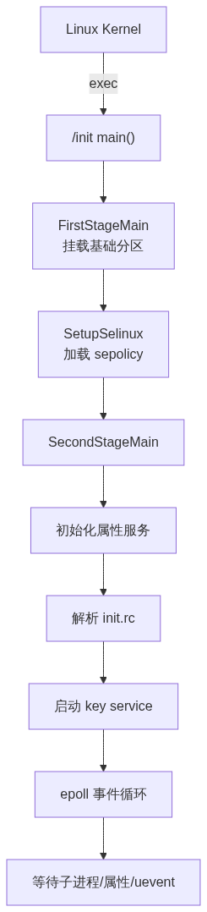
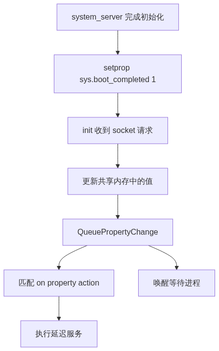

# init 进程启动原理

> init 是 Android 用户态的第一个进程（PID 1），所有用户态进程的祖先。本文按源码调用链拆解 init 的内部机制：两阶段启动、rc 解析、属性服务、native 服务管理、ueventd、SELinux、服务重启与看门狗。

---

## 一、概述

- **身份**：PID 1，由 Kernel `exec("/init")` 直接启动
- **源码根路径**：`system/core/init/`
- **核心文件**：`main.cpp`、`init.cpp`、`service.cpp`、`action.cpp`、`property_service.cpp`、`selinux.cpp`、`devices.cpp`、`ueventd.cpp`
- **核心配置**：`init.rc`、`ueventd.rc`、编译后的 `sepolicy`
- **一句话**：init 是 Android 启动的大管家——rc 脚本是它的配置，属性服务是它的信息通道，epoll 循环让它永远运行。

---

## 二、启动总流程



### 源码入口 `main()`

```cpp
// system/core/init/main.cpp
int main(int argc, char** argv) {
    if (argc > 1 && !strcmp(argv[1], "second_stage")) {
        // Kernel exec 时不带参数，这里不会走
        return SecondStageMain(argc, argv);
    }
    // 第一次进入：执行 FirstStage
    return FirstStageMain(argc, argv);
}
```

> `main()` 本身是一个分发器。Kernel `exec("/init")` 不带参数，走 FirstStage；FirstStage 完成后再带 `second_stage` 参数 exec 自身，进入 SecondStage。

### 1. FirstStageMain()

```cpp
// system/core/init/first_stage_init.cpp
int FirstStageMain(int argc, char** argv) {
    // 重定向 stdio 到 /dev/null
    // 挂载基础文件系统: mount("tmpfs", "/dev", ...)
    // 创建 /dev 节点: mknod, symlink
    // 挂载 /proc, /sys
    // 挂载 /system, /vendor 等分区（system-as-root 则 / 已是 system）
    // 加载内核模块 modprobe
    // 调用 SetupSelinux()

    // 最后重新执行自己，进入 SecondStage
    const char* path = "/system/bin/init";
    const char* args[] = { path, "second_stage", nullptr };
    execv(path, const_cast<char**>(args));
    // exec 成功后不再返回
}
```

| 关键操作 | 说明 |
|---|---|
| 挂载分区 | `/dev`、`/proc`、`/sys`、`/system`、`/vendor`、`/data` 逐步挂载 |
| 设备节点 | 创建 `/dev/console`、`/dev/null`、`/dev/kmsg` 等基础节点 |
| SELinux | 在挂载 `/system` 后立即加载策略，确保后续所有操作受控 |
| 内核模块 | 通过 `modprobe` 加载必要的驱动模块 |

### 2. SetupSelinux()

```cpp
// system/core/init/selinux.cpp
void SetupSelinux(char** argv) {
    // 加载策略文件 plat_sepolicy.cil / vendor_sepolicy.cil
    if (selinux_android_load_policy() < 0) {
        // 失败则重启或回退 permissive
        return;
    }
    // 设置 enforcing 模式
    bool kernel_enforcing = (security_getenforce() == 1);
    bool want_enforcing = IsEnforcing();
    // 恢复关键路径安全上下文
    selinux_android_restorecon("/dev", 0);
    selinux_android_restorecon("/init", 0);
    // ...
}
```

> sepolicy 加载是启动早期最重要的一步。在此之后，所有 process/file 访问都被 SELinux 管控。

### 3. SecondStageMain()

```cpp
// system/core/init/init.cpp
int SecondStageMain(int argc, char** argv) {
    // 1. 初始化属性服务
    property_init();
    // 2. 从内核命令行和设备树提取配置
    process_kernel_dt();
    process_kernel_cmdline();
    // 3. 加载 SELinux 策略（如果第一阶段没完全加载）
    SelinuxInitialize();
    // 4. 解析 rc 文件
    ActionManager::GetInstance().LoadBootScripts(
        std::vector<std::string>{"/system/etc/init/hw/init.rc"});
    // 5. 触发 early-init action
    ActionManager::GetInstance().QueueEventTrigger("early-init");
    // 6. 主循环
    while (true) {
        auto epoll_timeout = -1; // 默认阻塞
        // epoll_wait 等待：子进程退出、属性变化、uevent、键盘/控制台事件
        int nr = TEMP_FAILURE_RETRY(epoll_wait(...));
        // 处理各类事件
        HandlePropertySet();           // 属性变化
        ReapAnyOutstandingChildren();  // 子进程退出
        // 执行排队的 action
        ActionManager::GetInstance().ExecuteOneCommand();
        // 重启需要重启的 service
        StartRestartProcesses();
    }
}
```

| 步骤 | 关键函数 |
|---|---|
| 属性初始化 | `property_init()` — 创建共享内存 + socket |
| rc 解析 | `ActionManager::LoadBootScripts()` — 解析 rc 生成 action/service 对象 |
| 触发启动 | `QueueEventTrigger("early-init")` — 按照 rc 定义逐级触发 |
| 主循环 | `epoll_wait` + `HandlePropertySet` + `ReapAnyOutstandingChildren` |

---

## 三、init.rc 与 init 语言

### 1. 核心语法速览

| 关键字 | 作用 | 源码文件 |
|---|---|---|
| `service` | 定义进程 | `service.cpp` |
| `on <trigger>` | 触发执行 | `action.cpp` |
| `import` | 引入 rc | `parser.cpp` — `ImportParser` |
| `class_start` | 按类批量启动 | `builtins.cpp` |
| `property_set` | 设置属性 | `builtins.cpp` |
| `trigger` | 手动触发 | `builtins.cpp` |
| `exec` | 同步执行命令 | `builtins.cpp` |

### 2. action 触发顺序

action 是 rc 脚本中 `on <trigger>` 定义的**一组命令集合**。上图展示的是 init 按先后顺序依次触发的 action 链条——每个 action 对应系统启动的一个阶段。init 通过 `QueueEventTrigger()` 逐个触发，执行其中声明的命令（启动服务、挂载分区、设属性等），从最早的 `early-init` 一路走到 `sys.boot_completed=1`，标志系统完全就绪。


### 3. rc 解析器源码分析

```cpp
// system/core/init/action_manager.cpp
bool ActionManager::LoadBootScripts(const std::vector<std::string>& paths) {
    Parser parser;
    // 注册各类解析器
    parser.AddSectionParser("service", std::make_unique<ServiceParser>(...));
    parser.AddSectionParser("on",      std::make_unique<ActionParser>(...));
    parser.AddSectionParser("import",  std::make_unique<ImportParser>(...));
    // 逐行解析
    for (auto& path : paths) {
        parser.ParseConfig(path);
    }
}
```

- `ServiceParser::ParseSection()`：解析 `service` 块 → 生成 `Service` 对象，记录可执行路径、权限、重启策略
- `ActionParser::ParseSection()`：解析 `on <trigger>` 块 → 生成 `Action` 对象，内含 Command 队列
- `ImportParser::ParseLine()`：解析 `import` 行 → 递归解析被引用的 rc 文件

### 4. 属性触发源码

```cpp
// 属性变化时 QuePropertyChange 被调用
void ActionManager::QueuePropertyChange(const std::string& name,
                                         const std::string& value) {
    // 遍历所有 action，匹配 trigger
    for (auto& action : actions_) {
        if (action->CheckPropertyTrigger(name, value)) {
            action->QueueAllCommands(event_queue);
        }
    }
}
```

> 属性触发无需轮询，而是**事件驱动**：`property_set()` → `HandlePropertySet()` → `QueuePropertyChange()` → 将匹配的 action 加入执行队列。

| action | 关键动作 |
|---|---|
| `early-init` | 启动 `ueventd`、创建 `/dev` 节点 |
| `init` | 启动 `servicemanager`、`logd` |
| `late-init` | 启动 `vold`、`zygote` 等 |
| `post-fs-data` | `/data` 挂载后初始化加密、备份 |
| `boot` | 启动 `netd`、`media` 等 final-stage 服务 |

### 5. init.rc 关键代码示例

**zygote 服务定义**（`/system/core/rootdir/init.zygote64_32.rc`）

```rc
service zygote /system/bin/app_process -Xzygote /system/bin --zygote --start-system-server
    class main
    priority -20
    user root
    group root readproc reserved_disk
    socket zygote stream 660 root system
    socket usap_pool_primary stream 660 root system
    onrestart restart audioserver
    onrestart restart cameraserver
    onrestart restart media
    onrestart restart netd
    onrestart restart wificond
    writepid /dev/cpuset/foreground/tasks
    critical
```

**servicemanager 定义**

```rc
service servicemanager /system/bin/servicemanager
    class core
    user system
    group system readproc
    critical
    shutdown critical
```

**boot action 示例**

```rc
on boot
    # final-stage 服务
    class_start hal
    class_start core
    setprop sys.boot_completed 1
```

**import 文件组织**（`/system/etc/init/hw/init.rc`）

```rc
import /init.environ.rc
import /system/etc/init/hw/init.usb.rc
import /init.${ro.hardware}.rc
import /vendor/etc/init/hw/init.${ro.hardware}.rc
import /system/etc/init/hw/init.usb.configfs.rc
import /system/etc/init/hw/init.${ro.zygote}.rc
```

---

## 四、属性服务

属性服务是 Android 系统中的**全局配置总线**——一个可跨进程读写的键值对注册表，由 init 统一维护。它的典型应用场景：

- **启动状态传递**：`sys.boot_completed=1` 通知所有组件"系统已就绪"
- **设备信息查询**：任何进程可通过 `ro.product.model` / `ro.build.version.sdk` 获取设备型号和 API level
- **持久化配置**：`persist.sys.timezone` 等设置重启后依然保留
- **服务控制**：通过 `ctl.start` / `ctl.stop` 让 init 启停服务

> 本质是"系统级别的全局变量"：所有进程直接 `mmap` 共享内存读（零拷贝），写入必须通过 init 统一处理（避免并发冲突）。

### 1. 架构

```text
init 进程内：
┌────────────────────────────────┐
│ /dev/__properties__  (共享内存)  │ ← 所有进程 mmap 读
│ /dev/socket/property_service    │ ← 写入走 socket（仅 init 监听）
└────────────────────────────────┘
```

### 2. 源码分析

```cpp
// system/core/init/property_service.cpp
void property_init() {
    // 创建共享内存区域
    __system_property_area_init();
    // ...挂载 /dev/__properties__
}
void StartPropertyService(Epoll* epoll) {
    // 创建 socket
    property_set_fd = CreateSocket(PROP_SERVICE_NAME, SOCK_STREAM, ...);
    // 注册到 epoll
    epoll->RegisterHandler(property_set_fd, PropertySetHandler);
}
```

**写入流程**：
```cpp
// 任意进程调用
int __system_property_set(const char* name, const char* value) {
    // 如果是 ctl.* 属性 → 直接操作服务
    if (!strncmp(name, "ctl.", 4)) return handle_control_message(...);
    // 否则 → 通过 socket 发给 init
    // init 收到后：
    //   1. 更新共享内存
    //   2. 通知所有 epoll 监听者
    //   3. 调用 ActionManager::QueuePropertyChange()
}
```

**读取流程**：
```cpp
// 任意进程调用 — 直接读共享内存，零拷贝
int __system_property_get(const char* name, char* value) {
    const prop_info* pi = __system_property_find(name);
    if (pi) {
        __system_property_read(pi, nullptr, value);
    }
}
```

### 3. 存储结构

属性服务的底层数据全部存放在**共享内存**中，init 和所有进程通过 `mmap` 直接访问，避免 IPC 开销。

**（1）共享内存区域布局**

```text
/dev/__properties__
  ├── properties_serial    ← 系统属性区域（ro.*、sys.*、persist.* 等）
  ├── property_info        ← 兼容旧分区（Android 10 之前）
  └── <context>             ← 按 SELinux 上下文分区（treble 之后）
```

Android 10+ 按 SELinux 安全上下文分区，`system` 进程和 `vendor` 进程读写不同区域，互不干扰。

**（2）`prop_info` 结构体（核心）**

```cpp
// bionic/libc/include/sys/_system_properties.h
struct prop_info {
    atomic_uint_least32_t serial;   // 序列号，用于无锁读一致性
    union {
        char value[PROP_VALUE_MAX]; // 值（内联存储，≤ 92 字节）
        struct {                    // 或：长名称/长值的偏移指针
            char error_on_kernel_access;
        };
    };
    char name[0];                   // 变长名称，紧随结构体之后
};
```

**（3）序列号保证无锁原子读**

```cpp
// 写入方（init）：先更新值 → 再递增 serial（奇数 → 偶数）
prop_info->serial.fetch_add(1, memory_order_release);  // 标记开始写
memcpy(prop_info->value, new_value, len);
prop_info->serial.fetch_add(1, memory_order_release);  // 标记写完成

// 读取方（任意进程）：读 serial（必须偶数） → 读值 → 再读 serial（未变则有效）
uint32_t serial = prop_info->serial.load(memory_order_acquire);
if (serial & 1) continue;           // 奇数 = 正在写，跳过
memcpy(buf, prop_info->value, len); // 读值
// 再次检查 serial 未变 → 值有效
```

> 这个机制让**多进程并发读**完全不需要锁，仅靠序列号 + memory order 就保证一致性。

**（4）查找机制**

属性名到 `prop_info` 的映射通过 **trie 树**（前缀匹配）实现，查找复杂度 O(属性名长度)，与属性总数无关。在 `bionic/libc/system_properties/prop_area.cpp` 中，`prop_area::find_property()` 逐字节匹配 trie 节点。

### 4. 命名空间

| 前缀 | 含义 | 持久化 |
|---|---|---|
| `ro.*` | 只读 | 否 |
| `sys.*` | 运行时读写 | 否 |
| `persist.*` | 持久化（`/data/property/`） | 是 |
| `ctl.*` | 控制服务（`ctl.start` / `ctl.stop`） | 否 |
| `init.svc.*` | 服务状态（`running`/`stopped`/`restarting`） | 否 |

### 5. 常见属性

| 属性 | 含义 |
|---|---|
| `sys.boot_completed` | 启动完成标志 |
| `ro.build.version.sdk` | SDK 版本 |
| `ro.product.model` | 设备型号 |
| `persist.sys.timezone` | 时区（持久化） |

### 6. 关键场景举例：`sys.boot_completed`

`sys.boot_completed=1` 是属性服务最典型的应用——它充当**系统级别的"启动完成"信号**，让所有等待这个标志的组件在恰当的时机开始工作。

**为什么需要这个机制**：Linux 没有 Android 可用的跨进程广播机制（传统 `SIGUSR` 对多进程场景不够）。属性服务恰好填补了这个空白——任何进程都能通过属性变化获知系统状态，无需轮询。

**完整流程**：

```text
system_server 完成初始化
  → setprop sys.boot_completed 1         // 写入属性
    → init socket 收到请求
      → 更新共享内存中的值
      → QueuePropertyChange("sys.boot_completed", "1")
        → 匹配 on property:sys.boot_completed=1 的 action
          → 执行 action 中的命令（启动延迟服务）
      → 所有阻塞在 __system_property_wait() 上的进程被唤醒
```



**两个典型使用方**：

1. **rc 脚本中的延迟服务**
   ```rc
   on property:sys.boot_completed=1
       start bootanim_end       # 停止开机动画
       start gatekeeperd        # 加密密钥守护
       start installd_second    # 第二阶段包安装
   ```

2. **应用进程/Native 进程读取**
   ```cpp
   // 任意进程 — 无需 Binder、无需 socket，直接读共享内存
   char value[PROP_VALUE_MAX];
   __system_property_get("sys.boot_completed", value);
   if (!strcmp(value, "1")) {
       // 系统已就绪，开始工作
   }
   ```

> 一个 4 字节的 `"1"` 字符串，靠 init 的属性服务机制，驱动了从开机动画关闭到加密服务启动的整个收尾流程——这就是属性服务的核心价值。

---

## 五、关键 native 服务

### 1. 服务列表

| 服务 | action | 可执行路径 | 职责 |
|---|---|---|---|
| `ueventd` | `early-init` | `/system/bin/ueventd` | `/dev` 设备节点 |
| `servicemanager` | `init` | `/system/bin/servicemanager` | Binder 名字服务（handle 0） |
| `logd` | `init` | `/system/bin/logd` | `logcat` 后端 |
| `vold` | `late-init` | `/system/bin/vold` | 卷管理/加密 |
| `zygote` | `late-init` | `/system/bin/app_process` | ART 孵化器 |
| `netd` | `boot` | `/system/bin/netd` | 网络管理 |

> 这些都是 init 通过 rc 启动的独立 native 进程。Java 系统服务由 Zygote 孵化后在 `system_server` 内运行。

### 2. servicemanager

`servicemanager` 是由 init 在 `init` action 阶段启动的关键 native 服务，它是 Android **Binder 通信体系的注册中心**。

**（1）角色与职责**

- 维护一张「服务名 → Binder 句柄」的全局映射表
- 系统服务启动后调用 `publishBinderService()` 向其注册
- 客户端通过 `getService("activity")` 获取 AMS 等服务的 Binder 代理
- 在 Binder 驱动中固定为 **context manager（handle 0）**，任何进程无需查询即可找到它

**（2）init 如何启动它**

```rc
service servicemanager /system/bin/servicemanager
    class core
    user system
    group system readproc
    critical
    shutdown critical
```

> `critical` + `shutdown critical` 标记意味着 servicemanager 若连续崩溃将触发系统重启——它是**绝对不能死的服务**。

**（3）为什么它是关键基础设施**

```text
无 servicemanager
  → system_server 无法注册 AMS / WMS / PMS
    → 所有 App 无法通过 getService 获取系统服务
      → App 启动失败，系统不可用
```

- 它自己不处理业务逻辑，只负责"找对象"
- 实际数据传输由 Binder 驱动在内核态完成，不经过 servicemanager
- 源码：`frameworks/native/cmds/servicemanager/`

### 3. init 与关键服务关系


---

## 六、SELinux 加载

SELinux（Security-Enhanced Linux）是 Android 安全架构的**最后一道防线**。即使两个进程具有相同的 UID，SELinux 也能通过**强制访问控制（MAC）**限制它们的行为。它的核心作用：

- **进程隔离超越 UID**：App UID 相同不代表能互访——SELinux 按安全上下文（domain）额外管控
- **防止权限提升**：修复 Linux DAC（自主访问控制）的固有缺陷——root 进程也不能为所欲为
- **应用沙箱加固**：每个 App 运行在独立 domain，禁止直接读写其他 App 的 `/data/data/<pkg>/` 目录
- **系统分区只读保护**：即使获得 root 权限，也无法修改 `/system` 或 `/vendor` 分区内容
- **网络与硬件访问控制**：限制哪些进程可以打开 socket、访问 camera、读取 sensors

> init 作为 PID 1，在启动早期（FirstStage）加载 sepolicy 并在 SecondStage 前 `setenforce 1`，确保所有后续启动的服务都被 SELinux 管控。

### 1. 加载流程

```cpp
// system/core/init/selinux.cpp
void SelinuxSetupKernelLogging() {
    selinux_callback cb;
    cb.func_log = selinux_klog_callback;
    selinux_set_callback(SELINUX_CB_LOG, cb);
}

int SetupSelinux(char** argv) {
    SelinuxSetupKernelLogging();
    // 加载编译后的策略文件
    if (selinux_android_load_policy() < 0) {
        return -1;  // 失败 → 系统重启
    }
    // 读取内核 enforcing 状态
    bool kernel_enforcing = (security_getenforce() == 1);
    bool is_enforcing = IsEnforcing();  // 从 cmdline/androidboot.selinux 读取
    // 恢复关键文件/目录的安全上下文
    selinux_android_restorecon("/init", 0);
    selinux_android_restorecon("/dev", SELINUX_ANDROID_RESTORECON_RECURSE);
    // ...
    return 0;
}
```

### 2. 关键概念

| 概念 | 说明 |
|---|---|
| `sepolicy` | 编译后的二进制策略文件（`.cil` 格式） |
| enforcing | 拒绝违规操作 + 记录 avc |
| permissive | 允许但记录 avc（仅调试） |
| neverallow | 编译期强制规则，违反则编译失败 |
| restorecon | 恢复文件默认安全上下文 |

```bash
# 排查 avc 拒绝
adb shell dmesg | grep "avc:"

# 查看当前 SELinux 状态
adb shell getenforce
```

---

## 七、服务重启

作为 PID 1，init 必须保证关键系统进程始终存活。当子进程意外退出时，自动重启机制确保核心服务不会静默消失——试想 `servicemanager` 或 `zygote` 一旦崩溃而无人重启，整个 Android 将瞬间不可用。这就是服务重启的存在意义。

### 1. SIGCHLD 信号处理机制

init 通过 **SIGCHLD** 感知子进程退出。关键流程：

```cpp
// system/core/init/init.cpp — SecondStageMain 中注册
SignalAction(SIGCHLD, SigChldHandler);
```

SIGCHLD 触发 → `SigChldHandler` 写 pipe → epoll 唤醒 → `ReapAnyOutstandingChildren()`

```cpp
// system/core/init/sigchld_handler.cpp
void ReapAnyOutstandingChildren() {
    while (true) {
        pid_t pid = waitpid(-1, &status, WNOHANG);   // 非阻塞回收
        if (pid <= 0) break;
        Service* svc = ServiceList::GetInstance().FindService(pid);
        if (svc) {
            svc->Reap(status);
        }
    }
}
```

**为什么用 pipe 而不是直接在 signal handler 里处理？**
- 信号处理函数是**异步信号安全上下文**，能调用的函数极少（不能 malloc、不能 printf）
- `SIGCHLD` 在多子进程同时退出时可能**合并**（只触发一次 signal）
- 通过 pipe → epoll 机制：signal handler 只做 `write()` 到 pipe，epoll 收到后在主循环统一处理，**不丢事件、不阻塞**

**防止僵尸进程**：`waitpid(-1, &status, WNOHANG)` 循环回收所有已退出的孤儿。如果 init 不回收，子进程会变成 zombie 永久占据 PID。

### 2. Service::Reap 详细分析

```cpp
// system/core/init/service.cpp
void Service::Reap(int status) {
    bool crashed = true;
    if (WIFEXITED(status)) {
        crashed = (WEXITSTATUS(status) != 0);       // 非 0 = 崩溃
    } else if (WIFSIGNALED(status)) {
        crashed = true;                              // signal 杀死
    } else if (WIFSTOPPED(status)) {
        crashed = false;                             // SIGSTOP 不算
        flags_ |= SVC_STOPPED;
        return;                                      // 不重启，等待 SIGCONT
    }

    if (crashed) {
        crash_count_++;
        time_crashed_ = boot_clock::now();
    }

    // 正常退出（exit 0）不会触发 crash_count_++
    // oneshot 且正常退出 → 不重启
    if (flags_ & SVC_ONESHOT && !crashed) {
        flags_ &= ~SVC_RUNNING;
        NotifyStateChange("stopped");
        return;
    }

    // 以下情况触发重启：非 oneshot、或 oneshot 但崩溃了
    ExecuteRestart();
}
```

**crashed 判定逻辑**：

| 退出方式 | `WIFEXITED` | `WEXITSTATUS` | 判定 |
|---|---|---|---|
| `exit(0)` | true | 0 | **正常**，不计数 |
| `exit(1)` | true | ≠ 0 | **崩溃**，计数+1 |
| `SIGSEGV` | false | — | **崩溃**，计数+1 |
| `SIGKILL` | false | — | **崩溃**，计数+1 |

### 3. 重启延迟与指数退避

```cpp
// system/core/init/service.cpp
void Service::ExecuteRestart() {
    // 崩溃前 4 次：立即重启（restart_interval_ = 5s）
    // 崩溃 ≥ 5 次：指数退避
    if (crash_count_ > 4) {
        restart_interval_ *= 2;
        if (restart_interval_ > 60) restart_interval_ = 60;
    }
    flags_ |= SVC_RESTARTING;
    flags_ &= ~SVC_RUNNING;

    // critical 保护：4 分钟窗口内崩溃 ≥ 4 次 → 放弃挣扎，进 recovery
    if (flags_ & SVC_CRITICAL) {
        auto elapsed = boot_clock::now() - time_started_;
        if (elapsed < 240s && crash_count_ >= 4) {
            LOG(FATAL) << "critical service '" << name_
                       << "' crashed " << crash_count_ << " times in 4 minutes";
            android_reboot(ANDROID_RB_RESTART2, 0, "recovery");
        }
    }

    // 提交延迟重启任务
    PostRestart();
}
```

**退避时间线**：`5s → 10s → 20s → 40s → 60s (cap)`，防止 CPU 被高频崩溃-重启循环耗尽。

### 4. 策略总结

| 策略 | 行为 | 适用场景 |
|---|---|---|
| 默认 | 退出后自动重启，指数退避 | 守护进程 |
| `oneshot` | 正常退出不重启（`exit 0`） | 一次性初始化任务 |
| `critical` | 4 分钟窗口 ≥ 4 次崩溃 → 重启进 recovery | `servicemanager`、`zygote` |
| `onrestart` | 任意退出都重启（覆盖 oneshot 的 exit 0 逻辑） | 临时覆盖标记 |
| `shutdown critical` | 关机过程中崩溃也触发 recovery | 存储/加密类服务 |

### 5. 实际示例

**zygote**：所有 Java 进程的母体，死了系统不可用，必须 `critical`

```rc
service zygote /system/bin/app_process -Xzygote /system/bin --zygote --start-system-server
    class main
    socket zygote stream 660 root system
    onrestart restart audioserver
    onrestart restart cameraserver
    onrestart restart media
    writepid /dev/cpuset/foreground/tasks
    critical
```

**一次性服务**：执行完后退出，无需重启

```rc
service flash_recovery /system/bin/install-recovery.sh
    class main
    oneshot
    seclabel u:r:install_recovery:s0
```

**onrestart 级联**：父服务重启时，依赖它的子服务也必须重启

```rc
# zygote 重启 → 连带重启 audio/camera/media
onrestart restart audioserver
onrestart restart cameraserver
onrestart restart media
```

### 6. 看门狗

看门狗（Watchdog）是 Android 的**最后一道防线**。当标记为 `critical` 的服务在 4 分钟内崩溃 ≥ 4 次时，init 不再继续尝试重启，而是直接调用 `android_reboot(RECOVERY)` 让设备进入 Recovery 模式——这避免了设备陷入无限重启循环（bootloop）耗光电量而用户毫无感知。

**与普通重启的区别**

| 维度 | 普通服务重启 | 看门狗触发 |
|---|---|---|
| 触发条件 | 任何非 oneshot 服务退出 | `critical` 服务在 4 分钟窗口内 ≥ 4 次崩溃 |
| 行为 | 延迟重启该服务 | 整机重启进入 Recovery |
| 目的 | 快速恢复单个服务 | 防止设备永久不可用 |

**常见 critical 服务**

| 服务 | 为什么 critical |
|---|---|
| `servicemanager` | Binder 注册中心，死了所有 IPC 停止 |
| `zygote` | Java 进程孵化器，死了无法 fork 新 App |
| `vold` | 存储管理，涉及加密/解密，崩溃可能导致数据不可访问 |
| `surfaceflinger` | 图形合成，崩溃后屏幕不刷新 |

**shutdown critical**：部分服务（如 `vold`）即使关机过程中崩溃也必须触发 recovery，因为它们管理加密密钥或文件系统元数据，损坏后下次开机无法正常挂载。

**崩溃窗口自动重置**：critical 服务的崩溃计数器不是永久的——若服务稳定运行超过 4 分钟未再崩溃，`crash_count_` 自动归零。这样偶然的启动抖动不会永久"惩罚"该服务，系统有自我修复的余地。

**启动阶段特殊保护**：`time_started_` 从服务首次启动开始计时，4 分钟窗口恰好覆盖冷启动最脆弱的时间段。若系统已稳定运行数小时，单次偶然崩溃不会误触 recovery——只有"高频、连续、短期内"的崩溃才触发看门狗。

**与 Recovery 交互**：`android_reboot(RECOVERY)` 不是普通重启——进入 Recovery 后系统**不会自动回到 Android**，需要用户手动操作（重新尝试重启或刷机）。这确保了致命故障不会无声无息地消失，用户一定知道出了问题。

**策略分层**：看门狗只保护 `critical` 标记的服务；普通服务崩溃只触发延迟重启，不触发 recovery。这种分层设计让 init 对核心服务严防死守，对非核心服务宽容重试，既不浪费系统资源，也不放过致命故障。

---

## 八、源码阅读入口

| 文件 | 职责 | 建议阅读顺序 |
|---|---|---|
| `main.cpp` | 总入口分发 | 1 |
| `first_stage_init.cpp` | FirstStageMain | 2 |
| `selinux.cpp` | SELinux | 3 |
| `init.cpp` | SecondStageMain + epoll | 4 |
| `property_service.cpp` | 属性服务 | 5 |
| `parser.cpp` | rc 解析框架 | 6 |
| `action.cpp` | Action / Command | 7 |
| `service.cpp` | Service 生命周期 | 8 |
| `sigchld_handler.cpp` | 子进程回收 | 9 |
| `builtins.cpp` | 内建命令（trigger/class_start 等） | 10 |
| `devices.cpp` / `ueventd.cpp` | ueventd | 11 |

---

## 九、一句话记忆

> **Kernel exec init → main() 分发 → FirstStage 挂分区 + SELinux → SecondStage 启属性服务 + 解析 rc → 按 action 逐级拉起 ueventd/servicemanager/zygote 等 → epoll 循环处理子进程/属性/uevent**。init 是 PID 1，管进程（fork/exec/reap）、管配置（rc）、管属性（共享内存+socket）、管安全（sepolicy enforcing）、管重启（critical watchdog）。
