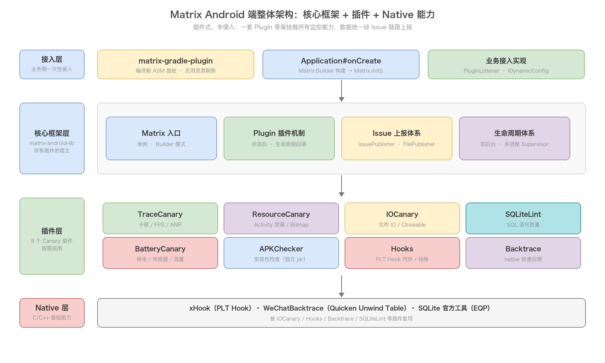
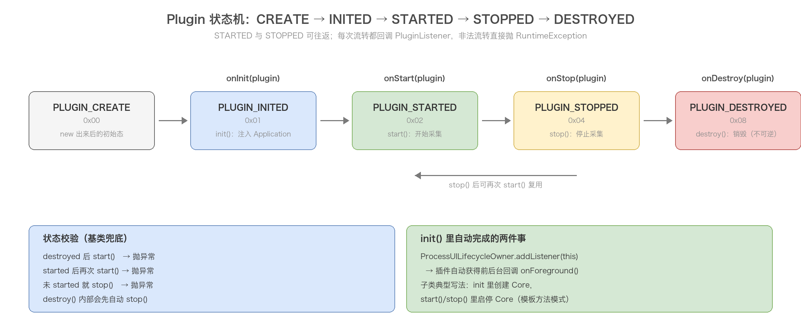
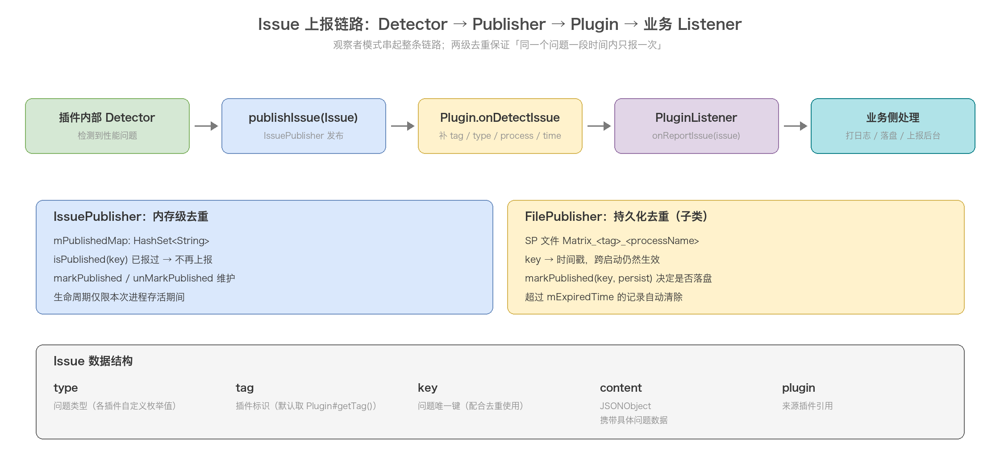
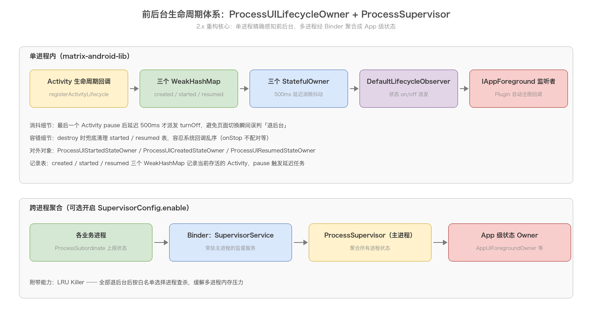

# Matrix 总体架构与插件体系

> Matrix 系列第一篇。从源码出发剖析 Matrix 的整体架构：核心框架如何用一套 Plugin 骨架挂载所有监控能力，数据如何经 Issue 链路统一上报，以及 2.x 重构后的多进程生命周期体系。读懂这一篇，后面每个 Canary 的源码分析才有立足点。

## 目录

- [1. Matrix 是什么](#1-matrix-是什么)
- [2. 模块组成与依赖关系](#2-模块组成与依赖关系)
- [3. 接入流程与初始化源码](#3-接入流程与初始化源码)
- [4. Plugin 机制：一切监控的骨架](#4-plugin-机制一切监控的骨架)
- [5. Issue 上报链路](#5-issue-上报链路)
- [6. 生命周期体系：前后台感知与多进程聚合](#6-生命周期体系前后台感知与多进程聚合)
- [7. 动态配置 IDynamicConfig](#7-动态配置-idynamicconfig)
- [8. 设计思想与易错点](#8-设计思想与易错点)
- [附：高频速记](#附高频速记)

## 1. Matrix 是什么

Matrix 是微信研发并日常使用的 APM（Application Performance Manage）框架，支持 iOS / macOS / Android 三端。它解决的问题很明确：线上 App 的卡顿、内存泄漏、IO 异常、耗电这些问题，靠用户反馈和线下复现是搞不定的，需要在 App 内部布一套「探针」，持续采集异常数据、定位到代码、给出优化建议。

Matrix Android 端的监控范围覆盖：安装包体积、帧率、启动耗时、卡顿、慢方法、ANR、Activity 泄漏、Bitmap 冗余、文件 IO、SQLite 语句质量、耗电。这些能力不是一个大杂烩类，而是拆成了一个个独立的插件（Plugin），按需接入。

它有两个鲜明的设计取向：

- 插件式：每个监控能力是一个独立 Plugin，挂在同一个骨架上，可以单独启停、单独依赖。不用某个功能就不引对应模块，不影响包体积。
- 非侵入：能不动业务代码就不动。监控要么挂在框架层（Application 生命周期、Looper、Choreographer），要么在编译期改字节码（gradle-plugin 插桩），要么在 native 层 hook 系统函数（PLT Hook），业务方只需要在 Application 里初始化一次。

和同类工具对比一下，能看清 Matrix 的定位：

| 工具 | 监控范围 | 与 Matrix 的关系 |
| --- | --- | --- |
| LeakCanary | Activity 泄漏 | ResourceCanary 的思路源头（同样基于 WeakReference + hprof 分析），Matrix 额外做了检测/分析分离、hprof 裁剪、重复 Bitmap 检测 |
| BlockCanary | 卡顿 | TraceCanary 卡顿检测的思路源头（同样 hook Looper），Matrix 补齐了函数级耗时定位（编译期插桩） |
| GT / 部分自研 APM | 单点监控 | Matrix 把散点能力收拢到统一插件体系和上报链路里 |

一句话：Matrix 不是发明了某一项检测技术，而是把这些技术整合成了一套工程上可长期运行的体系。这也决定了它源码的阅读重点，各 Canary 的「检测算法」固然有含金量，但更值得学的是那套让 8 个插件能协同运转的骨架。

整体架构一张图：



## 2. 模块组成与依赖关系

Matrix Android 端由十几个 module 组成，按职责分四类：

| 类别 | 模块 | 职责 |
| --- | --- | --- |
| 核心骨架 | matrix-android-lib | Matrix 入口、Plugin 基类、PluginListener、Issue 上报、生命周期体系。所有插件的宿主 |
| 核心骨架 | matrix-android-commons | 跨插件共享的工具类（反射、JSON、文件等） |
| 编译期 | matrix-gradle-plugin | ASM 字节码插桩（供 TraceCanary 用）、无用资源剔除、AGP 版本兼容 |
| 监控插件 | matrix-trace-canary | 卡顿、FPS、ANR、启动耗时、慢方法 |
| 监控插件 | matrix-resource-canary | Activity 泄漏、重复 Bitmap |
| 监控插件 | matrix-io-canary | 文件 IO 监控、Closeable 泄漏 |
| 监控插件 | matrix-sqlite-lint | SQLite 语句质量检测（C++ 实现） |
| 监控插件 | matrix-battery-canary | 耗电：线程 Jiffies、WakeLock/Alarm/传感器、后台流量 |
| 独立工具 | matrix-apk-canary | APK 安装包检查，独立 jar 运行，不进 App |
| Native 组件 | matrix-hooks | PLT Hook 基础设施 + MemoryHook / PthreadHook / WVPreAllocHook |
| Native 组件 | matrix-backtrace | Quicken Unwind Table，native 栈回溯速度约为 libunwindstack 的 15~30 倍 |
| Native 组件 | matrix-memguard | 基于 GWP-Asan 的堆越界 / use-after-free / double-free 检测 |
| 辅助模块 | matrix-fd / matrix-traffic / matrix-opengl-leak / matrix-memory-canary 等 | fd 泄漏、流量统计、OpenGL 资源泄漏、PSS 监控，体量小，服务于特定场景 |

依赖关系是严格的单向分层：插件层依赖核心骨架，核心骨架不依赖任何插件。`Matrix.java` 里只认 `Plugin` 抽象类，不 import 任何 Canary，所以增删插件对框架零影响。这是典型的「宿主 - 插件」解耦，也是它敢号称插件式的底气。

另有几个模块不参与运行时：matrix-arscutil（ARSC 资源格式解析，APK 检查用）、matrix-hprof-analyzer（hprof 离线分析工具）、matrix-sqlite-lint 的 native checker（C++ 编译产物）。

## 3. 接入流程与初始化源码

接入分四步，全部在接入方完成：

```java
// 1. build.gradle 引依赖 + apply matrix-gradle-plugin（trace 插桩需要）
// 2. 实现 PluginListener，接收所有插件的问题上报
public class TestPluginListener extends DefaultPluginListener {
    @Override
    public void onReportIssue(Issue issue) {
        super.onReportIssue(issue);
        // 落盘 / 上报后台，业务自定义
    }
}

// 3. 实现 IDynamicConfig（可选），运行时调整各插件参数
// 4. Application#onCreate 里初始化并启动
Matrix.Builder builder = new Matrix.Builder(application);
builder.pluginListener(new TestPluginListener(this));
builder.plugin(new IOCanaryPlugin(new IOConfig.Builder().dynamicConfig(config).build()));
Matrix.init(builder.build());
ioCanaryPlugin.start();   // 或 matrix.startAllPlugins()
```

### 3.1 Builder：构建期的防呆校验

`Matrix.Builder` 没什么复杂逻辑，但校验做得很有防御性：

```java
public Builder plugin(Plugin plugin) {
    String tag = plugin.getTag();
    for (Plugin exist : plugins) {
        if (tag.equals(exist.getTag())) {
            throw new RuntimeException("plugin with tag %s is already exist");
        }
    }
    plugins.add(plugin);
    return this;
}

public Matrix build() {
    if (pluginListener == null) {
        pluginListener = new DefaultPluginListener(application);  // 兜底
    }
    return new Matrix(application, pluginListener, plugins, mLifecycleConfig);
}
```

三个要点：

- 同 tag 插件重复添加直接抛异常，构建期就暴露配置错误，而不是运行期出现诡异的重复上报。
- `Plugin#getTag()` 默认返回类的全限定名，各插件会重写返回自己的标识（如 `"Matrix.IOCanaryPlugin"`），tag 是后续上报数据里的插件标识。
- 忘了设置 pluginListener 不会崩，兜底用 `DefaultPluginListener`（只打日志）。但这也意味着接入了插件却忘了配 listener 时，数据会静默丢掉，这是接入时最常见的坑。

### 3.2 init：单例 + 三件初始化事

```java
private static volatile Matrix sInstance;

public static Matrix init(Matrix matrix) {
    if (matrix == null) {
        throw new RuntimeException("Matrix init, Matrix should not be null.");
    }
    synchronized (Matrix.class) {
        if (sInstance == null) {
            sInstance = matrix;
        } else {
            MatrixLog.e(TAG, "Matrix instance is already set. this invoking will be ignored");
        }
    }
    return sInstance;
}
```

注意这里对「重复 init」的处理是打日志并忽略，而不是抛异常。因为 init 一般在 Application#onCreate 和 ContentProvider 初始化等多个时机都可能被调用，静默忽略比崩溃友好。

`Matrix` 的私有构造函数才是真正干活的地方，按顺序做三件事：

```java
private Matrix(Application app, PluginListener listener, HashSet<Plugin> plugins, MatrixLifecycleConfig config) {
    this.application = app;
    this.plugins = plugins;
    MatrixLifecycleOwnerInitializer.init(app, config);          // 1. 初始化生命周期体系
    ProcessSupervisor.INSTANCE.init(app, config.getSupervisorConfig());  // 2. 初始化多进程监督者
    for (Plugin plugin : plugins) {
        plugin.init(application, listener);                      // 3. 逐个 init 插件
    }
}
```

顺序有意义：生命周期体系先就位，插件 init 时才能注册前后台回调（第 4 节会讲，`Plugin.init()` 内部会把自己注册进 `ProcessUILifecycleOwner`）。

### 3.3 初始化时机：晚了会功能降级

`MatrixLifecycleOwnerInitializer.init()` 一进来就有一个关键检查：

```java
if (hasCreatedActivities()) {
    MatrixLog.e(TAG, "Matrix Warning: Matrix might be inited after launching first Activity, " +
            "which would disable some features like ProcessLifecycleOwner, ...");
    return;   // 直接跳过生命周期体系初始化
}
```

`hasCreatedActivities()` 通过反射读 `ActivityThread.currentActivityThread().mActivities`，判断是否已经有 Activity 创建过。如果 Matrix 的初始化晚于第一个 Activity 创建（比如懒加载到首个页面之后才 init），Activity 生命周期回调就漏掉了一截，前后台状态从此不准，于是整个生命周期体系直接放弃初始化。

> 记忆要点：Matrix 必须在 Application#onCreate 里 init，晚于首个 Activity 创建会导致前后台监控静默失效，且只有一条 error 日志，不崩、不重试。

## 4. Plugin 机制：一切监控的骨架

### 4.1 三个角色

Plugin 机制就三个核心角色，关系非常干净：

| 角色 | 类型 | 职责 |
| --- | --- | --- |
| `IPlugin` | 接口 | 定义插件契约：init / start / stop / destroy / getTag / onForeground |
| `Plugin` | 抽象类 | 实现 IPlugin，落地状态机、生命周期校验、Issue 转发，是所有 Canary 的父类 |
| `PluginListener` | 接口 | 宿主侧回调：onInit / onStart / onStop / onDestroy / onReportIssue，接入方实现它拿数据 |

注意 `Plugin` 的继承声明，一口气实现了三个接口：

```java
public abstract class Plugin implements IPlugin,
        IssuePublisher.OnIssueDetectListener,   // 能接收 Issue（上报链路的中间站）
        IAppForeground {                        // 能接收前后台回调
```

一个抽象类同时是「插件」「Issue 监听者」「前后台监听者」，这三个身份分别对应了 Plugin 机制的三大职责：生命周期管理、数据上报、前后台感知。

### 4.2 状态机

Plugin 内部用一个 int 位标志维护状态，五个状态构成一条单向主链：



```java
public static final int PLUGIN_CREATE    = 0x00;
public static final int PLUGIN_INITED    = 0x01;
public static final int PLUGIN_STARTED   = 0x02;
public static final int PLUGIN_STOPPED   = 0x04;
public static final int PLUGIN_DESTROYED = 0x08;
```

为什么用位标志而不是 enum？`getStatus()` 返回的 status 会随 Issue 的 JSON 一起输出到上报数据里，int 比 enum 序列化友好，也不存在反序列化失败问题。

生命周期方法的实现高度一致：先校验状态，非法流转直接抛 RuntimeException，合法则更新状态并回调 listener：

```java
@Override
public void start() {
    if (isPluginDestroyed()) {
        throw new RuntimeException("plugin start, but plugin has been already destroyed");
    }
    if (isPluginStarted()) {
        throw new RuntimeException("plugin start, but plugin has been already started");
    }
    status = PLUGIN_STARTED;
    if (pluginListener == null) {
        throw new RuntimeException("plugin start, plugin listener is null");
    }
    pluginListener.onStart(this);
}
```

`destroy()` 有个隐藏细节：它会先自动 stop，再标记 destroyed。所以 stop 后直接 destroy 是合法路径，而 destroy 后一切都晚了——状态不可逆，再 start 会抛异常。

> 易错点：Plugin 的状态校验抛的是 RuntimeException，如果 start/stop 的调用时序在业务里没管好，会直接崩溃。正确姿势是只在一处（如统一的管理类）控制插件启停，不要散落在多个页面各调各的。

### 4.3 模板方法模式：子类的标准扩展姿势

`Plugin` 基类把「状态流转 + 回调宿主」这些固定动作做完了，把「检测逻辑」留给子类。所有 Canary 都遵循同一个模板（以 IOCanaryPlugin 为例）：

```java
public class IOCanaryPlugin extends Plugin {
    private IOCanaryCore mCore;

    @Override
    public void init(Application app, PluginListener listener) {
        super.init(app, listener);     // 必须先 super：状态流转 + 注册前后台
        mCore = new IOCanaryCore(this); // 自己的事：创建检测核心
    }

    @Override
    public void start() {
        super.start();                 // super 里校验状态 + 回调 onStart
        mCore.start();                 // 启动检测
    }

    @Override
    public void stop() {
        super.stop();
        mCore.stop();
    }

    @Override
    public String getTag() {
        return SharePluginInfo.TAG_PLUGIN;  // 自定义上报 tag
    }
}
```

模式固定：Core 持有 Plugin 引用（用于发 Issue），Plugin 持有 Core 引用（用于启停），生命周期方法里先 super 再业务。读任何一个 Canary 源码，先找它的 Core 类，检测逻辑都在那里。

### 4.4 前后台回调的自动注册

`Plugin.init()` 里有一行容易被忽略但很关键的代码：

```java
@Override
public void init(Application app, PluginListener listener) {
    ...
    listener.onInit(this);
    ProcessUILifecycleOwner.INSTANCE.addListener(this);   // 把自己注册为前后台监听者
}
```

因为 Plugin 实现了 `IAppForeground`，注册后每个插件都能收到 `onForeground(boolean)` 回调。很多监控逻辑依赖前后台：ResourceCanary 只在退后台时 dump hprof，BatteryCanary 区分前后台监控策略，TraceCanary 的 AppForegroundUtil 也靠它。子类重写 `onForeground()` 即可参与，不需要自己注册任何监听。

## 5. Issue 上报链路

### 5.1 链路全景

所有插件产生的数据，无论格式差异多大，最终都收敛到同一条链路：



链路是观察者模式的串联：

1. 插件内部的 Detector 检测到问题，构造 `Issue` 并调用 `publishIssue(issue)`；
2. `IssuePublisher` 做内存级去重后，回调 `OnIssueDetectListener`（也就是 Plugin 自己）；
3. `Plugin.onDetectIssue()` 给 Issue 补默认字段，然后转发给 `PluginListener`；
4. 接入方实现的 `PluginListener.onReportIssue()` 拿到数据，落盘或上报后台。

### 5.2 Issue：统一的数据信封

```java
public class Issue {
    private int        type;      // 问题类型，各插件自定义枚举值
    private String     tag;       // 插件标识，默认取 Plugin#getTag()
    private String     key;       // 问题唯一键，配合去重使用
    private JSONObject content;   // 具体问题数据，格式各插件自定义
    private Plugin     plugin;    // 来源插件引用
}
```

`onDetectIssue()` 里自动补齐四个公共字段再转发，保证宿主拿到的数据格式统一：

```java
@Override
public void onDetectIssue(Issue issue) {
    if (issue.getTag() == null) {
        issue.setTag(getTag());                    // 默认 tag
    }
    issue.setPlugin(this);
    content.put(Issue.ISSUE_REPORT_TAG, issue.getTag());
    content.put(Issue.ISSUE_REPORT_TYPE, issue.getType());
    content.put(Issue.ISSUE_REPORT_PROCESS, MatrixUtil.getProcessName(application));  // 哪个进程
    content.put(Issue.ISSUE_REPORT_TIME, System.currentTimeMillis());                 // 什么时间
    pluginListener.onReportIssue(issue);
}
```

process 字段是多进程 App 的刚需：不上报进程名，后台收到的数据没法区分来自主进程还是 push 进程。

### 5.3 两级去重

性能问题有个特点：同一个问题会反复发生（比如同一个 Activity 反复泄漏、同一个文件反复慢读），如果每次都上报，数据会爆炸。Matrix 做了两级去重：

第一级在 `IssuePublisher`（内存 HashSet）：

```java
protected boolean isPublished(String key) {
    return mPublishedMap.contains(key);
}
protected void markPublished(String key) {
    mPublishedMap.add(key);
}
```

插件上报前先 `isPublished(key)` 查重，报过就 `markPublished(key)` 标记。只活在本次进程存续期内，杀进程就清零。

第二级在 `FilePublisher`（SharedPreferences 持久化），继承 IssuePublisher 后重写了去重逻辑：

```java
public FilePublisher(Context context, long expire, String tag, OnIssueDetectListener listener) {
    final String spName = "Matrix_" + tag + MatrixUtil.getProcessName(context);
    // 读 SP 里所有 key → 时间戳
    // 超过 expire 的记录删除，未过期的加载进内存 map
}
public void markPublished(String key, boolean persist) {
    mPublishedMap.put(key, now);
    if (persist) {
        mEditor.putLong(key, now).apply();   // 是否落盘由调用方决定
    }
}
```

对比一下两级去重的适用场景：

| 维度 | IssuePublisher（内存） | FilePublisher（SP 持久化） |
| --- | --- | --- |
| 去重范围 | 本次进程存活期间 | 跨启动仍然生效 |
| 过期机制 | 无 | mExpiredTime 过期自动清除 |
| 适用问题 | 高频、每次发生都值得看 | 低频、同一问题一段时间报一次就够 |
| 典型使用者 | TraceCanary 卡顿 | ResourceCanary 泄漏 |

> 结论：去重 key 的设计直接决定上报质量。key 粒度太细（如带时间戳）去重失效，太粗（如全局一个 key）会漏掉新问题。看各 Canary 源码时，留意它怎么拼这个 key。

## 6. 生命周期体系：前后台感知与多进程聚合

生命周期体系是 Matrix 2.x 相对 1.x 最大的重构。1.x 时代每个插件自己想办法感知前后台（反射 ActivityThread、监听 Activity 生命周期，各写各的），2.x 把它收拢成一套公共设施：单进程内的 `ProcessUILifecycleOwner` + 跨进程的 `ProcessSupervisor`。

### 6.1 入口与降级检查

`MatrixLifecycleOwnerInitializer.init()` 负责初始化整条链（第 3.3 节讲过它的降级检查），按序初始化：

- `MatrixLifecycleThread`：生命周期专用的 HandlerThread + executor，所有状态派发都丢到这个线程，不占主线程；
- `ProcessUILifecycleOwner`：单进程前后台感知；
- `ForegroundServiceLifecycleOwner` / `OverlayWindowLifecycleOwner`：前台 Service、悬浮窗两个维度的「广义前台」（需配置开启，通过反射注入 Service#mActivityManager、WindowManagerGlobal#mRoots 实现）。

### 6.2 ProcessUILifecycleOwner：多进程版 ProcessLifecycleOwner

这个类对标的是 Jetpack 的 `ProcessLifecycleOwner`（App 前后台感知的官方方案），但重写了一遍，注释里明说了原因：

```kotlin
/**
 * multi process version of [androidx.lifecycle.ProcessLifecycleOwner]
 *
 * Activity's lifecycle callback is not always reliable and compatible. onStop might be called
 * without calling onStart or onResume, or onResume might be called more than once but stop once
 * only. And for some tabs or special devices, It is possible to show more than two Activity
 * at the same time.
 * For these unusual cases we don't use simple counter here.
 */
```

官方 ProcessLifecycleOwner 用计数器实现（started 计数 > 0 即前台），但 Activity 生命周期回调在部分厂商 ROM 上会乱序：onStop 可能没走 onStart 就来了，onResume 可能走两次。计数器一旦错乱就再也回不到正确状态，而且这是多进程版本，错误会被放大。Matrix 的实现改用三个 WeakHashMap 记录存活 Activity：

```kotlin
private val createdActivities = WeakHashMap<Activity, Any>()
private val startedActivities  = WeakHashMap<Activity, Any>()
private val resumedActivities  = WeakHashMap<Activity, Any>()
```

生命周期回调进来就往对应 map 里 put/remove，「是否前台」不是靠计数，而是靠 map 是否为空推断，天然免疫重复回调；WeakHashMap 的 key 是弱引用，Activity 销毁后自动被回收，不怕泄漏；destroy 回调里还会兜底清理 started/resumed 表（并打 warning），把乱序回调的影响消掉。

前后台切换的判定与派发：



还有一个精妙的细节，500ms 延迟消抖：

```kotlin
private const val TIMEOUT_MS = 500L

private val delayedPauseRunnable = Runnable {
    dispatchPauseIfNeeded()
    dispatchStopIfNeeded()
}

private fun activityResumed(activity: Activity) {
    val isEmptyBefore = resumedActivities.isEmpty()
    resumedActivities.put(activity)
    if (isEmptyBefore) {
        if (pauseSent) {
            (resumedStateOwner as AsyncOwner).turnOnAsync()
            pauseSent = false
        } else {
            runningHandler.removeCallbacks(delayedPauseRunnable)  // 撤销刚才的「退后台」判定
        }
    }
}

private fun activityPaused(activity: Activity) {
    resumedActivities.remove(activity)
    if (resumedActivities.isEmpty()) {
        runningHandler.postDelayed(delayedPauseRunnable, TIMEOUT_MS)  // 延迟 500ms 再判
    }
}
```

场景：从 Activity A 跳到 B，回调顺序是 A.onPause → B.onCreate → B.onStart → B.onResume。如果 A.onPause 时立刻判定「所有 Activity 都 paused 了，退后台了」，就误判了。所以 pause 后不立即派发，延迟 500ms；500ms 内有新的 Activity resume 进来，就撤销这次判定。turnOn 是立即的（恢复前台越快通知越好），turnOff 是延迟的（宁可慢半拍，不可误判）。

状态派发的末端是 `DefaultLifecycleObserver`：startedStateOwner 的 on/off 变化 → 更新 `isProcessForeground` → 遍历通知所有 `IAppForeground` 监听者（每个 Plugin 都在里面，见 4.4 节）。派发动作丢到 `MatrixLifecycleThread.executor` 异步执行，监听者的回调里就算做重活也不阻塞生命周期线程。

对上层暴露的对象是三个语义化 Owner，按需取用：

| 对象 | State-ON 条件 | State-OFF 条件 |
| --- | --- | --- |
| ProcessUICreatedStateOwner | 任一 Activity created | 所有 Activity destroyed |
| ProcessUIStartedStateOwner | 任一 Activity started | 所有 Activity stopped |
| ProcessUIResumedStateOwner | 任一 Activity resumed | 所有 Activity paused |

底层是一个 `StatefulOwner` 状态机抽象（on/off 两个动作 + observeForever 订阅），还提供了 `reverse()`（取反，把前台 Owner 变后台 Owner）和 `shadow()`（影子镜像，把一个 Owner 的状态同步给另一个）这样的组合子，插件里可以拼装出「退后台且满 30 秒」之类的复合状态。

### 6.3 ProcessSupervisor：跨进程聚合

单进程的前后台解决后，还有一个多进程问题：App 开了 4 个进程，每个进程各自感知到自己的前后台，「App 整体是否退后台」谁说了算？这需要一个跨进程的聚合者：

- 主进程跑一个 `SupervisorService`（Binder 服务），内部是 `ProcessSupervisor`；
- 其他进程通过 `ProcessSubordinate` 把自己的前后台状态上报给监督者；
- 监督者聚合出 App 级状态，再以 Owner 形式对所有进程可见：

```kotlin
object AppUIForegroundOwner        // 任一进程在前台 → ON
object AppExplicitBackgroundOwner  // 所有进程都在后台 → ON
object AppDeepBackgroundOwner      // 所有进程都在深度后台 → ON
```

这套体系默认关闭，需要在 `MatrixLifecycleConfig` 里配 `SupervisorConfig(enable = true)`，并指定监督进程。

它还附带一个 LRU Killer：当所有进程都退到后台，按各进程的使用时间（LRU）选择性地杀掉不重要的进程，缓解多进程 App 的内存压力，白名单里的进程除外。这是把「感知」升级成了「干预」。

> 易错点：Supervisor 依赖 Binder 通信，进程上报有毫秒级延迟。如果业务要求「退后台立刻停采集」，用单进程的 ProcessUIStartedStateOwner 更可靠；如果是为了「App 完全退后台后统一关掉所有进程的监控」，用 AppExplicitBackgroundOwner。

## 7. 动态配置 IDynamicConfig

各插件的可调参数（阈值、开关）不写在代码里，而是通过 `IDynamicConfig` 接口在运行时读取：

```java
public interface IDynamicConfig {
    String get(String key, String defStr);
    int get(String key, int defInt);
    long get(String key, long defLong);
    boolean get(String key, boolean defBool);
    float get(String key, defFloat);
}
```

插件内部到处是这种调用模式：

```java
// EvilMethodTracer 里：慢方法阈值
mEvilMethodThresholdMs = dynamicConfig.get(DynamicConfigImplDemo.
        clsCfg_matrix_trace_evil_method_threshold, 700L);
```

key 集中定义在 sample 的 `MatrixEnum` 里（如 `clicfg_matrix_trace_fps_enable`、`clicfg_matrix_trace_anr_enable`、`clicfg_matrix_trace_evil_method_threshold`），接入方实现接口时可以从自己的配置中心拉取。

这个设计的价值在线上：阈值不合逻辑要调、某插件出问题要临时关掉，有了 IDynamicConfig，改配置中心的值就能实时生效，不用发版。默认值都定义在插件内部，配置中心拉不到就用默认值，接口本身永不抛异常，配置系统挂了不影响监控运行。

## 8. 设计思想与易错点

### 8.1 值得学的四个设计

模板方法 + 宿主插件解耦：Plugin 基类固定「状态流转 + 回调宿主」，子类只填检测逻辑。框架层不依赖任何插件实现，新增一个 Canary 只需继承 Plugin，框架代码零改动。

观察者串联的上报链：Detector → IssuePublisher → Plugin → PluginListener，四段各司其职（检测、去重、补字段、消费）。接入方只面对一个 onReportIssue 接口，不用关心 8 个插件各自的数据格式差异。

两级去重的上报节流：内存级 + 持久化级，配合 expire 时间和 key 设计，在「数据完整性」和「上报量」之间取得平衡。这套思路可以直接搬到任何需要上报的场景。

状态前置的防御式编程：状态机校验、tag 重复抛异常、listener 空兜底、晚初始化降级，把配置错误尽可能挡在构建期和初始化期，而不是等运行期出诡异问题。

### 8.2 易错点清单

| 易错点 | 后果 | 正确姿势 |
| --- | --- | --- |
| init 晚于首个 Activity 创建 | 前后台监控静默失效 | Application#onCreate 里 init |
| 接入插件但没设 pluginListener | 数据全部静默丢弃（DefaultPluginListener 只打日志） | init 前检查 listener 已配置 |
| 两个插件 tag 相同 | Builder 构建直接抛异常 | 各插件保持默认 getTag() 或保证唯一 |
| stop 后忘记 start（或从未 start） | 插件不工作且无报错 | 统一在一个入口管理插件启停 |
| destroy 后再次 start | RuntimeException 崩溃 | destroy 只在确定永不使用时调用 |
| 业务里到处调 start/stop | 状态机校验随时可能抛异常 | 单点管理启停，必要时先判 isPluginStarted() |
| 多进程 App 没配 process 字段处理 | 后台数据无法区分进程来源 | 依赖 onDetectIssue 自动补的 process 字段 |

## 附：高频速记

- Matrix = 微信开源 APM，插件式 + 非侵入；Android 端 8 个 Canary 插件挂在同一套 Plugin 骨架上。
- 核心三层：matrix-android-lib（骨架）/ matrix-gradle-plugin（编译期插桩）/ 各 canary（检测实现），依赖严格单向：插件 → 骨架。
- 初始化三件事：LifecycleOwnerInitializer.init → ProcessSupervisor.init → 遍历 plugin.init。
- Plugin 状态机：CREATE(0x00) → INITED(0x01) → STARTED(0x02) ⇄ STOPPED(0x04) → DESTROYED(0x08)，非法流转抛 RuntimeException，destroy 自动先 stop、不可逆。
- Plugin 三重身份：IPlugin（插件契约）+ OnIssueDetectListener（收 Issue）+ IAppForeground（收前后台）。
- 上报链路：Detector → publishIssue → Plugin.onDetectIssue（补 tag/type/process/time）→ PluginListener.onReportIssue。
- 两级去重：IssuePublisher（内存 HashSet，进程内）+ FilePublisher（SP 持久化，key→时间戳，过期自动清）。
- 生命周期：ProcessUILifecycleOwner 用 3 个 WeakHashMap + 500ms 延迟消抖（官方 ProcessLifecycleOwner 的多进程加固版）；ProcessSupervisor 用 Binder 聚合多进程状态，附带 LRU Killer。
- IDynamicConfig：运行时调参，配置中心拉不到就走默认值，永不抛异常。
- 必须在 Application#onCreate init；晚于首个 Activity 创建则生命周期体系静默降级。

## 系列导航

| 篇目 | 主题 |
| --- | --- |
| 01 | Matrix 总体架构与插件体系（本篇） |
| 02 | Matrix 编译期字节码插桩 |
| 03~05 | TraceCanary：卡顿检测 / 帧率掉帧 / ANR 与启动耗时 |
| 06 | ResourceCanary 内存泄漏检测 |
| 07 | MemGuard 堆内存防护 |
| 08 | IOCanary 文件 IO 监控 |
| 09 | SQLiteLint 语句质量检测 |
| 10 | BatteryCanary 电量监控 |
| 11 | APKChecker 安装包检查 |
| 12 | Native Hook 与 Backtrace |
