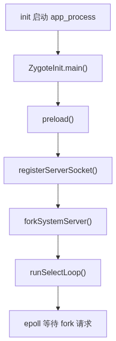
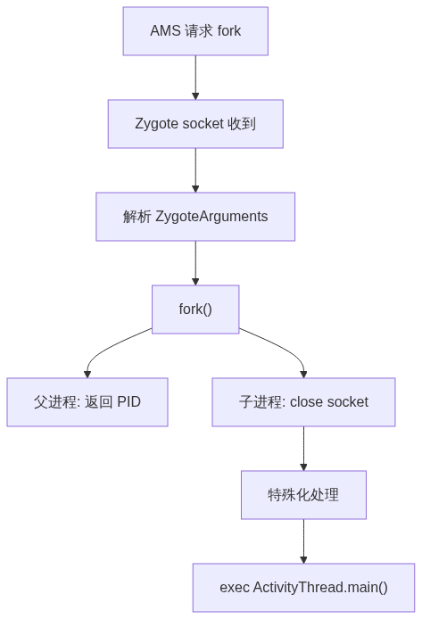

# Zygote 进程启动原理

> Zygote 是 Android 所有 Java 进程的「母体」。它启动一次，预加载 framework，然后通过 fork + COW 让每个 App 以近乎零成本继承这份工作——这是 Android 冷启动性能的基石。

---

## 一、为什么需要 Zygote

每个 Android App 都运行在独立的 ART 虚拟机中。如果每个 App 都从零创建 VM、加载 framework 类、加载资源——冷启动会慢到无法接受。

Zygote 的解法：**先启动一个「模板进程」，预加载所有公共部分，后续 App 直接 fork 继承。**

| 价值 | 说明 |
|---|---|
| **启动性能** | App 不再需要加载 framework，省掉 ~1-2s |
| **内存效率** | fork + COW 让所有 App 共享 framework 的只读页 |
| **统一入口** | AMS 只需连接 Zygote 一个 socket，所有 App 孵化走同一条通道 |
| **热更友好** | Zygote 预加载了哪些类、哪些 so，全局可控 |

> 一句话：**Zygote 做一次重的，子进程做轻的。**

### 有无 Zygote 的量化对比

| 维度 | 无 Zygote | 有 Zygote + COW |
|---|---|---|
| 每个 App 冷启动 | 2-3s | 0.5-1s |
| framework 内存 | 每 App 独占 ~50MB | 所有 App 共享 |
| 公共 .so 加载 | 每 App `System.loadLibrary` 一次 | fork 继承 |
| JNI 注册 | 每 App 注册上百个 native 方法 | 一次注册，全部继承 |

### Dalvik → ART 的演进

| 时期 | 运行时 | Zygote 行为 |
|---|---|---|
| Android 4.4 及之前 | Dalvik (JIT) | 加载 `.dex`，每 App 独立 JIT |
| 5.0–6.x | ART (全量 AOT) | 加载 `.oat` 机器码，fork 直接执行 |
| 7.0+ | ART (AOT+JIT 混合) | 基础 oat + Profile，按热度 JIT |
| 10+ | ART (云 Profile) | 基础 oat，云端 Profile 指导 JIT 策略 |

---

## 二、init 拉起 Zygote

### rc 配置

```rc
# /system/core/rootdir/init.zygote64_32.rc
service zygote /system/bin/app_process -Xzygote /system/bin --zygote --start-system-server
    class main
    priority -20
    user root
    group root readproc reserved_disk
    socket zygote stream 660 root system
    onrestart restart audioserver
    onrestart restart cameraserver
    critical
```

重点参数：
- `--zygote`：让 `app_process` 走 Zygote 模式（非命令行工具模式）
- `--start-system-server`：启动后立刻 fork system_server
- `socket zygote`：创建 `/dev/socket/zygote`，AMS 通过此 socket 发 fork 请求
- `critical`：Zygote 死了整机进 Recovery，不可接受的故障

### app_process 入口

```cpp
// frameworks/base/cmds/app_process/app_main.cpp
int main(int argc, char* const argv[]) {
    AppRuntime runtime(argv[0], computeArgBlockSize(argc, argv));

    // 判断走 Zygote 还是普通命令行工具
    bool zygote = false;
    for (int i = 1; i < argc; i++) {
        if (!strcmp(argv[i], "--zygote")) { zygote = true; break; }
    }

    if (zygote) {
        runtime.start("com.android.internal.os.ZygoteInit", args, zygote);
    } else {
        runtime.start("com.android.internal.os.RuntimeInit", args, zygote);
    }
}
```

### 32/64 位 Zygote 配置选择

init 根据设备 CPU ABI 选择不同 rc 文件：

| rc 文件 | 适用场景 | 启动的进程 |
|---|---|---|
| `init.zygote64_32.rc` | 64 位 CPU，兼容 32 位 App | 主 `zygote64` + 辅 `zygote`(32) |
| `init.zygote64.rc` | 纯 64 位设备 | 只有 `zygote64` |
| `init.zygote32.rc` | 纯 32 位低端设备 | 只有 `zygote` |

> AMS 请求 fork 时会携带 `abi` 参数，Zygote 路由到对应位数的进程完成孵化。`init.${ro.zygote}.rc` 通过 `ro.zygote` 属性在启动时动态选择。

`app_process` 不做复杂逻辑——它只是解析参数，然后把控制权交给 `AndroidRuntime::start()`。

---

## 三、创建 ART 虚拟机

`AndroidRuntime::start()` 的第一步是创建 ART 实例。没有它，Java 世界的一切无从谈起。

### startVm

```cpp
// frameworks/base/core/jni/AndroidRuntime.cpp
int AndroidRuntime::startVm(JavaVM** pJavaVM, JNIEnv** pEnv,
                             bool zygote, ...) {
    // Zygote 模式专用参数
    if (zygote) {
        addOption("-Xzygote");                    // 标记为 Zygote 模式
        addOption("-XX:HeapGrowthLimit=256m");    // 堆最大 256MB
        addOption("-XX:HeapMaxFree=8m");          // 空闲超 8MB 触发 GC
        addOption("-XX:HeapTargetUtilization=0.75"); // 利用率 75% 触发 GC
        addOption("-Xusejit:true");               // 启用 JIT
        addOption("-Xjitsaveprofilinginfo");      // 保存 JIT Profile
    }

    // 调用 libart 创建虚拟机
    if (JNI_CreateJavaVM(pJavaVM, pEnv, &initArgs) < 0) {
        return -1;  // VM 创建失败 = 系统起不来
    }
    return 0;
}
```

| 参数 | 含义 | 影响 |
|---|---|---|
| `-Xzygote` | Zygote 模式标识 | 调整 GC 策略、线程处理 |
| `-XX:HeapGrowthLimit=256m` | 堆上限 | Zygote 本身不需要大堆 |
| `-Xusejit:true` | 启用 JIT | 热点代码即时编译 |
| `-Xjitsaveprofilinginfo` | 保存 JIT Profile | 云 Profile 加速后续启动 |

### JNI_CreateJavaVM 内部

```cpp
// art/runtime/java_vm_ext.cc
extern "C" jint JNI_CreateJavaVM(JavaVM** p_vm, JNIEnv** p_env, void* vm_args) {
    Runtime* runtime = Runtime::Create(options, ignore_unrecognized);
    runtime->Init();    // 创建堆、线程池、类链接器、OAT 文件管理器
    *p_vm   = runtime->GetJavaVM();
    *p_env  = runtime->GetJNIEnv();
    return JNI_OK;
}
```

> 这一行 `Runtime::Init()` 是 ART 全部基础设施的入口——类链接器、堆分配器、GC、JIT 编译线程池都在此处创建。执行完这里，Java 代码才有了运行的物理基础。

### Runtime 创建的堆空间

ART 在 Zygote 阶段划分了特殊的堆空间：

| 空间 | 内容 | fork 后的行为 |
|---|---|---|
| **zygote space** | 预加载的 framework 类对象 | 子进程 COW 共享 |
| **image space** | `boot.art` 的 mmap 镜像内存 | 所有进程共享同一物理页 |
| **non-moving space** | 长生命周期对象 | 子进程自己的堆区域 |

> `image space` 是通过 `boot.art` 文件直接 `mmap` 到内存的预编译镜像，加载速度远快于逐个类解析。它是 ART 比 Dalvik 启动快的关键原因之一。

---

## 四、注册 JNI 方法

VM 创建好了，但 Java 层的 native 方法还找不到对应的 C++ 函数。`startReg` 负责把 framework 的数百个 native 方法和它们的 C++ 实现一一绑定。

### startReg

```cpp
// frameworks/base/core/jni/AndroidRuntime.cpp
int AndroidRuntime::startReg(JNIEnv* env) {
    androidSetCreateThreadFunc((android_create_thread_fn) javaCreateThreadEtc);
    env->PushLocalFrame(200);

    // 逐个注册 gRegJNI 数组中列出的所有 JNI 绑定
    if (register_jni_procs(gRegJNI, NELEM(gRegJNI), env) < 0) {
        return -1;
    }
    env->PopLocalFrame(NULL);
    return 0;
}
```

### gRegJNI 注册了什么（部分）

```cpp
static const RegJNIRec gRegJNI[] = {
    REG_JNI(register_com_android_internal_os_RuntimeInit),
    REG_JNI(register_com_android_internal_os_ZygoteInit),   // Zygote 自己的 native
    REG_JNI(register_android_os_Process),                    // fork、kill、setArgV0
    REG_JNI(register_android_os_Binder),                     // Binder IPC
    REG_JNI(register_android_view_SurfaceControl),           // Surface/窗口
    REG_JNI(register_android_content_AssetManager),          // 资源
    REG_JNI(register_android_os_SystemProperties),           // 属性服务
    REG_JNI(register_android_hardware_display_DisplayManagerGlobal),
    // ... 总共上百个
};
```

每个 `REG_JNI(register_xxx)` 宏展开为：

```cpp
env->RegisterNatives(clazz, methods, numMethods);
```

**为什么在 Zygote 阶段注册**：注册后的绑定表写入 ART 内部数据结构。子进程通过 COW fork 后**直接继承**这份绑定——App 不需要重新注册 JNI，零成本可用。

### RegisterNatives 内部机制

```cpp
// art/runtime/jni_internal.cc
jint RegisterNatives(JNIEnv* env, jclass java_class,
                     const JNINativeMethod* methods, jint nMethods) {
    Class* c = DecodeClass(env, java_class);
    for (int i = 0; i < nMethods; i++) {
        ArtMethod* m = c->FindClassMethod(methods[i].name,
                                          methods[i].signature, ...);
        m->SetEntryPointFromJni(methods[i].fnPtr);  // 绑定函数指针
    }
    return JNI_OK;
}
```

> `ArtMethod::SetEntryPointFromJni()` 将 native 函数指针直接写入 `ArtMethod` 对象内部——此后 Java 调用 `native` 方法时 ART 直接从 `ArtMethod` 取出指针跳转，无需每次查表。子进程通过 COW 继承这套绑定时，**连 NOP 都不执行**。

---

## 五、预加载（preload）

这是 Zygote 启动中**最耗时**的一步（占总启动时间的 80%+）。预加载把 framework 的公共类、资源、so 全部加载进内存，后续子进程靠 COW 直接继承。

### 调用链

```text
AndroidRuntime::start()
  → ZygoteInit.main()
    → preload()
```

### preload 源码

```java
// frameworks/base/core/java/com/android/internal/os/ZygoteInit.java
static void preload(TimingsTraceLog bootTimingsTraceLog) {
    preloadClasses();                    // 1. 加载 ~3000 个常用类
    cacheNonBootClasspathClassLoaders(); // 2. 缓存 ClassLoader
    preloadResources();                  // 3. 加载 framework 资源
    nativePreloadAppProcessHALs();       // 4. HAL 预加载
    maybePreloadGraphicsDriver();        // 5. OpenGL/Vulkan 驱动
    preloadSharedLibraries();            // 6. 加载 ~20 个 .so
    preloadTextToSpeech();               // 7. TTS 引擎
    WebViewFactory.prepareWebViewInZygote(); // 8. WebView
}
```

| 步骤 | 做了什么 | 数据量 |
|---|---|---|
| `preloadClasses()` | 读 `/system/etc/preloaded-classes`，逐类 `Class.forName()` | ~3000 类 |
| `preloadResources()` | 加载 `framework-res.apk` 主题/图片/字符串 | 数十 MB |
| `preloadSharedLibraries()` | `System.loadLibrary("android")` 等 | ~20+ .so |

> 预加载 = 「用 Zygote 启动慢几秒换所有 App 启动快」。

### preloaded-classes 的来源

`/system/etc/preloaded-classes` 不是人为编辑的，而是构建系统自动生成：

```bash
# AOSP 构建时收集 framework 中高频引用的类
m preloaded-classes
```

生成逻辑遍历 framework 代码，统计每个类被引用的频率，将 Top-N 写入列表。不同 Android 版本这个列表在 1800-3000 类之间变动。

### ClassLoader 层次

```text
BootClassLoader
  └── /system/framework/*.jar（framework.jar、core-oj.jar ...）
        ↓ preloadClasses() 批量触发加载
```

预加载使用 `BootClassLoader`（不是 `PathClassLoader` / `DexClassLoader`），确保加载的类在 fork 后对**所有 App 可见**——因为所有 App 继承同一个 BootClassLoader 的 class table。

---

## 六、注册 Socket

预加载完成后，Zygote 需要准备接收来自 AMS 的 fork 请求。

```java
// ZygoteInit.java — 紧接 preload() 之后
zygoteServer = new ZygoteServer();
zygoteServer.registerServerSocketFromEnv(socketName);  // "zygote"
```

```java
// ZygoteServer.java
void registerServerSocketFromEnv(String socketName) {
    // socket 由 init 创建（rc 中声明）
    // Zygote 只需要获取 fd
    final FileDescriptor fd = new FileDescriptor();
    fd.setInt$(Zygoet.getSocketFd(socketName));
    mZygoteSocket = new LocalServerSocket(fd);
}
```

> Zygote 不创建 socket，只获取它——init 在 rc 解析阶段已经创建并设好了权限。此后 AMS 即可通过 `/dev/socket/zygote` 向 Zygote 发 fork 指令。

---

## 七、启动流程图



```
init 拉起 app_process
  → AndroidRuntime 创建 ART 虚拟机
  → 注册 JNI 方法（gRegJNI）
  → ZygoteInit.main()
    → preload()                       最耗时
    → registerZygoteSocket()
    → forkSystemServer()              第一个子进程
    → runSelectLoop()                 进入主循环
```

---

## 八、fork system_server

预加载完成、socket 就绪后，Zygote 做的第一件「业务」就是 fork 出 `system_server`——因为系统服务必须先于任何 App 启动。

### 源码

```java
// ZygoteInit.java
private static Runnable forkSystemServer(...) {
    String args[] = {
        "--setuid=1000",       // system UID
        "--setgid=1000",
        "--capabilities=...",  // 保留关键特权
        "com.android.server.SystemServer",
    };

    // fork 前触发 GC
    VMRuntime.getRuntime().requestHeapTrim();
    VMRuntime.getRuntime().requestGCBeforeFork();

    int pid = Zygote.forkSystemServer(
        parsedArgs.mUid, parsedArgs.mGid, ...);

    if (pid == 0) {
        // 子进程：进入 SystemServer.main()
        return handleSystemServerProcess(parsedArgs);
    }
    // 父进程：返回继续执行，不等待
    return null;
}
```

### 与普通 App fork 的区别

| 维度 | system_server | 普通 App |
|---|---|---|
| UID/GID | `1000` (system) | 各自独立 |
| 入口 | `SystemServer.main()` | `ActivityThread.main()` |
| 父进程行为 | 不等待 | 不等待 |
| capabilities | 保留特权 | 全部删除 |

> system_server 保留了 `CAP_SYS_ADMIN`、`CAP_SYS_NICE`、`CAP_NET_ADMIN`、`CAP_SYS_BOOT` 等少数关键 capability——管理整个系统所必需。普通 App 进程在 fork 后所有 capabilities 被清零，完全依赖 Binder IPC 请求系统服务。

---

## 九、runSelectLoop — 进入主循环

fork system_server 之后，Zygote 进入**永久等待**状态，通过 epoll 监听 socket，等待 AMS 的 fork 命令。

```java
// ZygoteServer.java
Runnable runSelectLoop(String abiList) {
    ArrayList<ZygoteConnection> peers = new ArrayList<>();

    while (true) {
        // 阻塞等待 socket 事件
        Os.poll(pollFDs, -1);

        // 新连接 → accept
        if (serverSocket) {
            ZygoteConnection peer = mZygoteSocket.accept();
            peers.add(peer);
        }

        // 已有连接有数据 → 处理
        for (ZygoteConnection peer : peers) {
            if (peer.isClosed()) { peers.remove(peer); continue; }

            Runnable command = peer.processOneCommand();
            if (command != null) {
                // ★ 只有在子进程中 command 才不为 null
                return command;  // → ActivityThread.main()
            }
        }
    }
}
```

**关键理解**：
- 父进程：`processOneCommand()` 内部 fork 后返回 null → 继续循环等待
- 子进程：`processOneCommand()` 内部返回 `Runnable` → 打破循环，执行 App 入口

---

## 十、处理 App fork 请求

当 AMS 需要启动一个 App 时，它向 Zygote socket 发送一组参数，Zygote 解析参数、fork、让子进程进入 `ActivityThread`。

### 整体流程



### processOneCommand

```java
// ZygoteConnection.java
Runnable processOneCommand(ZygoteServer zygoteServer) {
    // 1. 读取 AMS 发来的参数
    String[] args = readArgumentList();
    ZygoteArguments parsedArgs = new ZygoteArguments(args);

    // 2. fork 子进程
    int pid = Zygote.forkAndSpecialize(
        parsedArgs.mUid, parsedArgs.mGid, parsedArgs.mGids,
        parsedArgs.mRuntimeFlags,
        parsedArgs.mTargetSdkVersion, ...);

    if (pid == 0) {
        // === 子进程 ===
        zygoteServer.closeServerSocket();     // 关闭 Zygote socket fd
        return parsedArgs.mChildReceiver;     // ActivityThread.main()
    } else {
        // === 父进程 ===
        return null;  // 继续循环
    }
}
```

### AMS 发送的关键参数

| 参数 | 值示例 | 含义 |
|---|---|---|
| `uid` | `10123` | 子进程的 Linux UID |
| `gid` | `10123` | 主组 ID |
| `target-sdk-version` | `34` | 目标 API Level |
| `nice-name` | `com.android.launcher3` | 进程名 |
| `seinfo` | `platform:targetSdkVersion=34` | SELinux 信息 |
| `runtime-flags` | 位掩码 | Debug / Profile 标记 |

### 子进程初始化

fork 之后、进入 `ActivityThread.main()` 之前，子进程还要完成：

1. **关闭 Zygote socket fd**——子进程不需要监听 fork 请求
2. **设置进程名**——`prctl(PR_SET_NAME)` 改为 App 包名
3. **切换 UID/GID**——从 root 降为 App 专属 UID
4. **设置资源限制（rlimits）**——防止单个 App 耗尽系统资源
5. **应用 SELinux 上下文**——`selinux_android_setcontext()`

### Specialization Hooks

fork 前后有一套回调链，用于子进程的「专用化」处理：

```text
ZygoteHooks.preFork()          ← fork 前：关 fd、GC
  → fork()
  → (子进程)
    ZygoteHooks.postForkCommon()   ← 清理 Zygote 线程、重置信号
    ZygoteHooks.postForkChild()    ← 重置 ART 性能统计、重新初始化 Trace
    nativePostForkApp()            ← USAP 模式补充操作
```

这些 hook 确保子进程复用 Zygote 的 **ART runtime 代码**（无需重新加载），但**不继承 Zygote 的运行时状态**（线程、GC 统计、Trace buffer 等），避免相互干扰。

---

## 十一、fork + COW 原理

COW（Copy-On-Write）是 Zygote 架构赖以成立的核心机制。没有它，「fork 一个模板进程给所有 App 用」的思路就成了「复制 50MB 内存给每个 App」。

### 三阶段原理图


整张图分三个阶段，从左到右是时间线：

**阶段一：fork() 前** — Zygote 已通过 `preload()` 把 framework 类、资源、.so 全部加载到物理内存中。此时只有一份物理页。

**阶段二：fork() 返回后** — 父进程（Zygote）和子进程（新 App）各自拥有一份页表，但页表中的条目**指向同一物理页**。子进程的页表条目标记为「只读」——即加了一层写保护。

**阶段三：子进程首次写入，COW 触发** — 子进程尝试写入某一页（比如修改某个类的静态字段）。CPU 检测到写保护 → 触发缺页异常（page fault）。内核的 `do_wp_page()` 识别这是 COW 场景：分配一个新物理页，用 `copy_user_highpage()` 把原页内容复制过去，更新子进程页表指向新页并标记为可读写。父进程完全不受影响，继续使用原来那页。

### 为什么关键：fork 不复制、只"锁"

```text
fork() 的成本 ≈ 遍历页表、标记写保护（O(页表条目数)）
                不是复制内存（O(内存大小)）

Zygote 页表 ≈ 数万条目
Zygote 内存 ≈ 50MB+
→ fork() 执行时间 < 1ms，远低于复制 50MB 的几十毫秒
```

> 这就是 Zygote 架构成立的根本原因：**fork 快，COW 让后续成本也低**。如果 Linux 没有 COW，每个 App 都要复制 50MB——那 Zygote 设计毫无意义。

### Native fork 实现

```cpp
// frameworks/base/core/jni/com_android_internal_os_Zygote.cpp
static pid_t ForkCommon(JNIEnv* env, bool is_system_server,
                         const std::vector<int>& fds_to_close, ...) {
    // fork 前准备：关 fd、触发 GC（减少 COW 脏页数量）
    pid_t pid = fork();   // ← Linux 系统调用，O(页表条目数)

    if (pid == 0) {
        // === 子进程 ===
        // 关 socket fd、设置进程名、切换 UID/GID、应用 SELinux
        // 此时页表仍是"写保护"状态——写入才触发 COW
    }
    return pid;  // 父进程返回子进程 PID
}
```

### 为什么 fork 前要 GC

```java
// 每次 fork system_server 或 App 之前
VMRuntime.getRuntime().requestHeapTrim();     // 整理堆，紧凑对象
VMRuntime.getRuntime().requestGCBeforeFork();  // 触发 GC，回收垃圾
```

**GC 减少 COW 的原理**：
- fork 前堆里有大量垃圾（dead object）→ 这些对象占的页在 fork 后会变成"脏页来源"
- GC 回收垃圾 → 释放那些页 → fork 后子进程的页表不需要覆盖它们 → 子进程写入时触发 COW 的页面更少
- 同时整理堆让存活对象紧凑排列 → 减少总的页表条目数 → fork 本身更快

### Kernel 层面：完整调用链

```text
fork() 系统调用 → 内核态:
  → _do_fork()
    → copy_process()
      → copy_mm()
        → dup_mm()
          → dup_mmap()               ← 遍历父进程 VMA 列表
            → copy_page_range()
              → copy_pte_range()     ← 逐页处理页表条目
                → 每个 PTE:
                  - 清除父进程的写标志 → 标记为「写保护」
                  - 子进程 PTE 指向同一物理帧号
                  - 增加该物理帧的引用计数

子进程首次写入 → 缺页异常:
  → do_page_fault()
    → handle_mm_fault()
      → handle_pte_fault()
        → do_wp_page()               ← Write-Protect 缺页处理器
          → 分配新物理页（alloc_page）
          → cow_user_page()
            → copy_user_highpage()   ← 逐字复制
          → 更新子进程 PTE:
            - 指向新物理帧
            - 清除写保护、标记可读写
          → 减少原物理帧引用计数
```

> 两个关键性能点：(1) `fork()` 只改页表不碰数据——快；(2) COW 是按页粒度（4KB）的——不是整块复制，子进程写了多少页才复制多少页。Zygote 预加载的 framework 类几乎不会被 App 写入，所以这些页永远不被复制。

### 最终效果

| 指标 | 无 Zygote | 有 Zygote + COW |
|---|---|---|
| App 冷启 | ~2-3s | ~0.5-1s |
| framework 内存 | 每 App 独占一份 | 所有 App 共享 |
| 启动代码路径 | 每个 App 走完整初始化 | 只需 fork + 专用化 |

---

## 十二、源码阅读入口

| 文件 | 职责 | 顺序 |
|---|---|---|
| `frameworks/base/cmds/app_process/app_main.cpp` | Native 入口 | 1 |
| `frameworks/base/core/jni/AndroidRuntime.cpp` | startVm + startReg | 2 |
| `frameworks/base/core/java/com/android/internal/os/ZygoteInit.java` | main + preload + forkSystemServer | 3 |
| `frameworks/base/core/java/com/android/internal/os/ZygoteServer.java` | runSelectLoop | 4 |
| `frameworks/base/core/java/com/android/internal/os/ZygoteConnection.java` | processOneCommand | 5 |
| `frameworks/base/core/java/com/android/internal/os/Zygote.java` | forkAndSpecialize | 6 |
| `frameworks/base/core/jni/com_android_internal_os_Zygote.cpp` | Native fork | 7 |
| `art/runtime/java_vm_ext.cc` | JNI_CreateJavaVM | 8 |

---

## 十三、一条线记忆

> **init → app_process → 创建 ART 虚拟机 → 注册 JNI → preload 预加载 framework → 注册 socket → fork system_server → 进入 runSelectLoop 永久等待 → AMS 每次来请求就 fork 一个子进程（COW 继承 framework）→ 子进程切换身份、关闭 socket 、进入 ActivityThread**。启动时慢一次，后续全部快。
