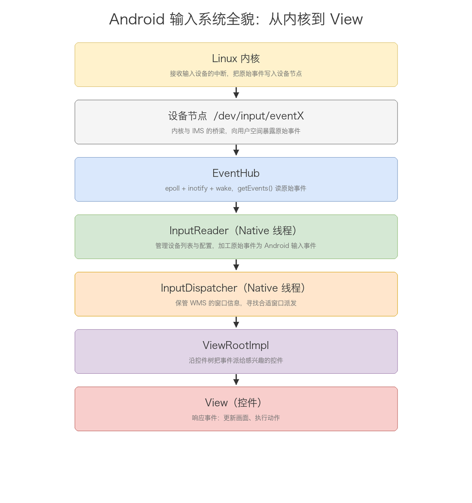
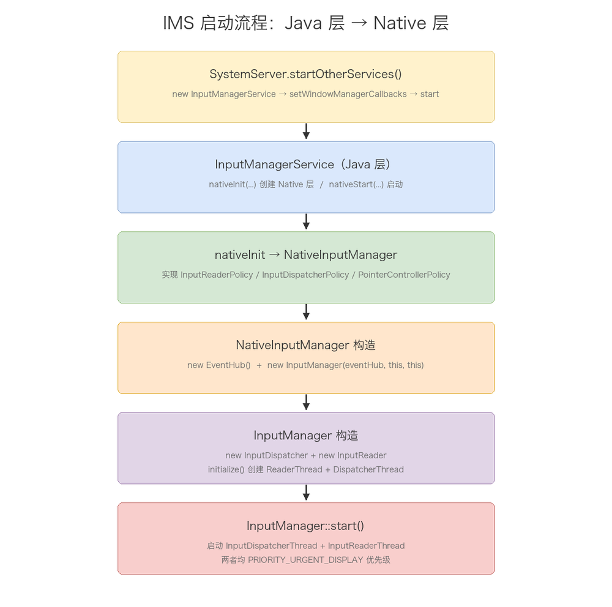
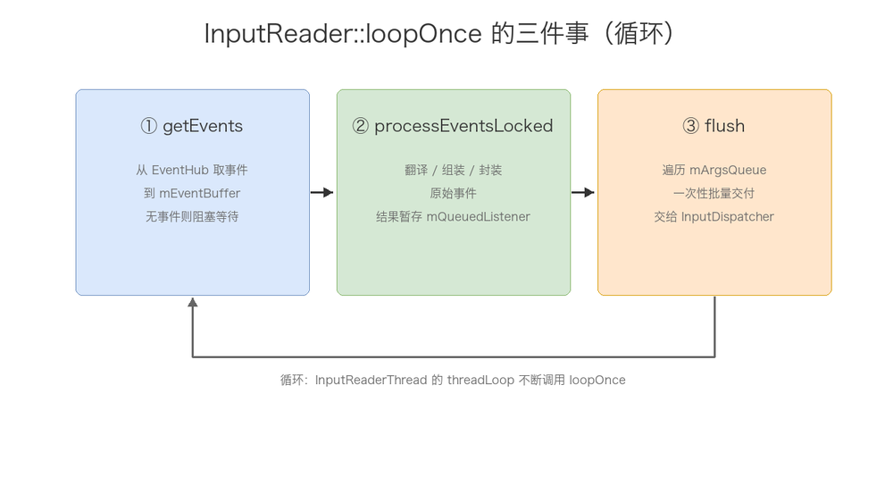
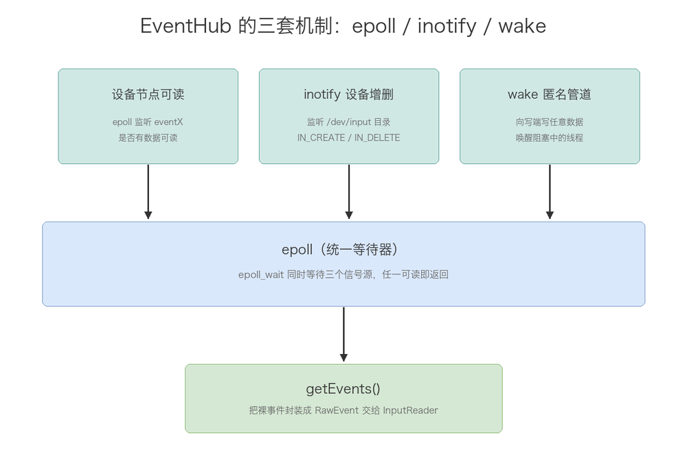
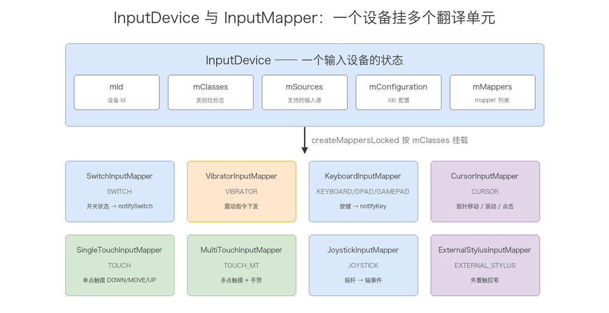
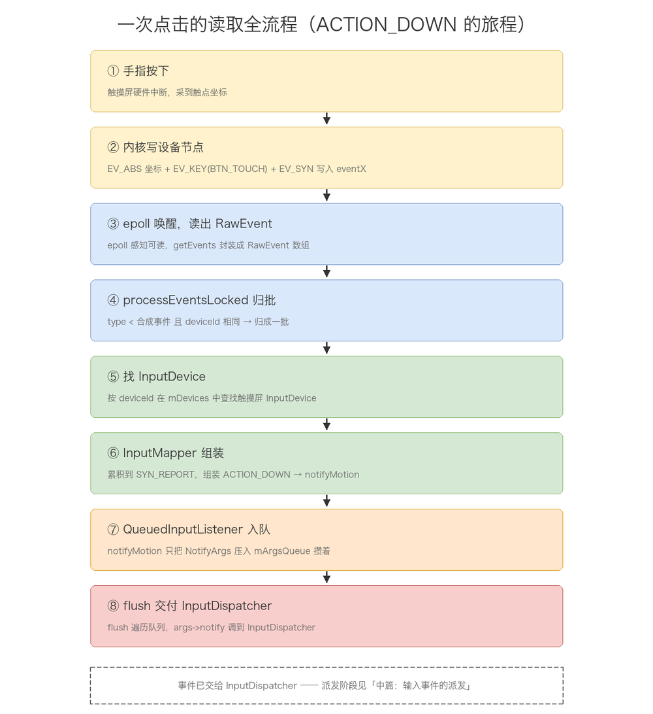

# 输入事件分析一-获取过程

## meta-info

| 字段 | 内容 |
|------|------|
| 分类 | Android 框架层 / 输入系统（Input） |
| 本篇范围 | 第一篇：获取过程。从「手指按下」到「InputReader 把事件交给 InputDispatcher」为止 |
| 主线 | 输入系统总览 → IMS 启动流程 → InputReader 主循环 → EventHub → 事件加工 → 点击全流程 

## 导读

Android 输入系统是一条横跨硬件、内核、Native、Java 四层的长链。手指在屏幕上点一下，这个动作先被触摸屏硬件转成电信号，再被 Linux 内核写成 `/dev/input/eventX` 设备节点里的几行原始数据，然后才轮到 Android 自己上场：InputReader 把原始数据读出来、翻译成 `MotionEvent`，InputDispatcher 根据窗口信息找到该收事件的窗口，ViewRootImpl 沿着控件树把事件派给目标 View。

整个系列分三篇讲这条链：

- 第一篇（本篇）：获取过程。内核把事件写进设备节点后，InputReader 如何通过 EventHub 把它读出来、加工成 Android 认识的输入事件。
- 第二篇：派发过程。InputDispatcher 如何根据 WMS 提供的窗口信息找到目标窗口，通过 InputChannel 把事件塞进窗口的接收管道。
- 第三篇：应用层处理。窗口侧 ViewRootImpl 如何从管道取出事件，沿着 View 树完成 dispatchEvent / processEvent，最终让控件响应。

本篇只讲「读取」这一段，终点是 InputReader 把加工好的事件 flush 给 InputDispatcher，派发的事留给第二篇。全文拿一次手指点击当例子，遇到哪一段都能对应上：点下去的那一下，代码到底在跑什么。

## 目录

- [一、输入系统总览：一次点击要穿过多少层](#一输入系统总览一次点击要穿过多少层)
- [二、IMS 的启动流程：从 Java 层到 Native 层](#二ims-的启动流程从-java-层到-native-层)
- [三、InputReader 的线程循环：loopOnce 的三件事](#三inputreader-的线程循环looponce-的三件事)
- [四、EventHub：从设备节点读原始事件的底层通道](#四eventhub从设备节点读原始事件的底层通道)
- [五、事件加工：RawEvent 到 InputDispatcher 的交接](#五事件加工rawevent-到-inputdispatcher-的交接)
- [六、点击事件读取全流程串讲](#六点击事件读取全流程串讲)
- [七、高频速记](#七高频速记)
- [图索引](#图索引)

## 一、输入系统总览：一次点击要穿过多少层

Android 输入系统的源头是 `/dev/input/` 目录下的设备节点，终点是由 WMS 管理的某个窗口。整条链一句话就能概括：

> 内核把原始事件写进设备节点，InputReader 通过 EventHub 把它读出来翻译成 Android 输入事件，InputDispatcher 根据 WMS 提供的窗口信息把事件派给合适的窗口，窗口的 ViewRootImpl 再沿控件树派给感兴趣的控件。



> 图片：输入系统全貌。事件从 Linux 内核一路流到最终控件 View，中间经过设备节点、EventHub、InputReader、InputDispatcher、ViewRootImpl 五站。InputReader / InputDispatcher 都运行在独立的 Native 线程里，运行容器是 InputManagerService。

这条链上的每个参与者各司其职：

| 参与者 | 层次 | 职责 |
|--------|------|------|
| Linux 内核 | 内核 | 接收输入设备的中断，把原始事件写入设备节点 `/dev/input/eventX` |
| 设备节点 | 内核↔用户态 | 内核与 IMS 之间的桥梁，把原始事件数据暴露给用户空间 |
| InputManagerService | Java / Native | 系统服务，Java 层负责与 WMS 通信，Native 层是 InputReader / InputDispatcher 的运行容器 |
| EventHub | Native | 直接访问所有设备节点，用 `getEvents()` 返回待处理的底层事件（原始输入事件 + 设备节点增删事件） |
| InputReader | Native 线程 | 管理设备列表与配置，加工原始事件为更可读的 Android 输入事件，交给 InputDispatcher |
| InputReaderPolicy | Native 接口 | 为 InputReader 的加工提供策略配置（键盘布局等），由 NativeInputManager 实现 |
| InputDispatcher | Native 线程 | 保管来自 WMS 的所有窗口信息，从 InputReader 收事件后寻找合适窗口并派发 |
| InputDispatcherPolicy | Native 接口 | 为派发提供策略控制（拦截特定按键、阻止派发等），典型例子是 HOME 键被拦截到 PhoneWindowManager |
| WMS | Java | 新建窗口时为新窗口和 IMS 建事件通道，并实时把窗口信息（可点击区域、焦点窗口）同步给 InputDispatcher |
| ViewRootImpl | Java | 对壁纸、SurfaceView 等窗口是派发终点；对普通控件窗口，沿控件树把事件派给感兴趣的 View |

三个点值得先记下，后面会反复遇到：

1. InputReader 和 InputDispatcher 是两个独立的 Native 线程，不是 Java 线程。输入链路对实时性要求高，所以这两段被放进了 native 层，各自一条线程跑。
2. WMS 和 InputDispatcher 是「窗口信息」的生产者和消费者。InputDispatcher 不自己去算焦点窗口、可点击区域，这些信息全部由 WMS 实时喂给它，这也是「输入」和「窗口」两个子系统解耦的关键。
3. 一次点击在读取阶段经历了两次「翻译」：内核里是 `EV_ABS`（绝对坐标）+ `EV_KEY`（`BTN_TOUCH`）+ `EV_SYN`（同步）这样的裸事件，InputReader 把它们组装成带语义的 `MotionEvent`（`ACTION_DOWN`）。本篇讲的就是第二次翻译之前的那一段。

## 二、IMS 的启动流程：从 Java 层到 Native 层

IMS 体系分 Java 和 Native 两部分，启动从 Java 层开始，再完成 Native 部分的初始化。入口在 SystemServer 的 `startOtherServices()`：

```java
private void startOtherServices() {
    ...
    traceBeginAndSlog("StartInputManagerService");
    inputManager = new InputManagerService(context);          // 1. 构造
    traceEnd();
    traceBeginAndSlog("StartInputManager");
    inputManager.setWindowManagerCallbacks(wm.getInputMonitor()); // 2. 注册 WMS 回调
    inputManager.start();                                     // 3. 启动
    traceEnd();
    ...
}
```

三步：构造 → 注册 WMS 回调 → 启动。构造阶段触发 native 层的 `nativeInit`，启动阶段触发 `nativeStart`。先看 Java 层的 `InputManagerService` 构造和 `start`：

```java
public InputManagerService(Context context) {
    this.mContext = context;
    this.mHandler = new InputManagerHandler(DisplayThread.get().getLooper());
    mPtr = nativeInit(this, mContext, mHandler.getLooper().getQueue());
    ...
}

public void start() {
    Slog.i(TAG, "Starting input manager");
    nativeStart(mPtr);
    ...
}

// 设置 callbacks，后续 native 层的回调最终会调到这里
public void setWindowManagerCallbacks(WindowManagerCallbacks callbacks) {
    mWindowManagerCallbacks = callbacks;
}
```

两个细节：`mHandler` 挂在 DisplayThread 的 Looper 上（输入相关的 Java 侧消息都在显示线程处理），`nativeInit` 的返回值 `mPtr` 是一个 native 指针，后续所有 `nativeXxx` 方法都靠它找回 NativeInputManager 对象。

### nativeInit：创建 NativeInputManager

`nativeInit` 是 native 方法，实现在 `com_android_server_input_InputManagerService.cpp`：

```cpp
static jlong nativeInit(JNIEnv* env, jclass /* clazz */,
        jobject serviceObj, jobject contextObj, jobject messageQueueObj) {
    sp<MessageQueue> messageQueue = android_os_MessageQueue_getMessageQueue(env, messageQueueObj);
    if (messageQueue == NULL) {
        jniThrowRuntimeException(env, "MessageQueue is not initialized.");
        return 0;
    }
    NativeInputManager* im = new NativeInputManager(contextObj, serviceObj,
            messageQueue->getLooper());
    im->incStrong(0);
    return reinterpret_cast<jlong>(im);
}
```

它把 Java 侧的 MessageQueue 转成 native 的 `MessageQueue`，取出其中的 `Looper`，然后创建 `NativeInputManager`，把对象指针强转成 `jlong` 返回给 Java 层保存。这个 `NativeInputManager` 同时实现了三个 policy 接口：

```cpp
class NativeInputManager : public virtual RefBase,
    public virtual InputReaderPolicyInterface,
    public virtual InputDispatcherPolicyInterface,
    public virtual PointerControllerPolicyInterface {
    ...
};
```

Java 层和 native 层的策略，靠 `NativeInputManager` 打通。它的构造方法里干了两件事：建 EventHub 和 InputManager。

```cpp
NativeInputManager::NativeInputManager(jobject contextObj, jobject serviceObj, const sp<Looper>& looper) :
        mLooper(looper), mInteractive(true) {
    JNIEnv* env = jniEnv();
    mContextObj = env->NewGlobalRef(contextObj);
    mServiceObj = env->NewGlobalRef(serviceObj);
    ...
    sp<EventHub> eventHub = new EventHub();
    mInputManager = new InputManager(eventHub, this, this);
}
```

注意最后一行 `new InputManager(eventHub, this, this)`：第三个 `this` 被同时当作 `InputReaderPolicyInterface` 和 `InputDispatcherPolicyInterface` 传入，因为 NativeInputManager 自己就实现了这两个接口。

### InputManager 构造：创建两个组件 + 两个线程

`InputManager` 在 `frameworks/native/services/inputflinger/InputManager.cpp`：

```cpp
InputManager::InputManager(const sp<EventHubInterface>& eventHub,
        const sp<InputReaderPolicyInterface>& readerPolicy,
        const sp<InputDispatcherPolicyInterface>& dispatcherPolicy) {
    mDispatcher = new InputDispatcher(dispatcherPolicy);
    mReader = new InputReader(eventHub, readerPolicy, mDispatcher);
    initialize();
}

void InputManager::initialize() {
    mReaderThread = new InputReaderThread(mReader);
    mDispatcherThread = new InputDispatcherThread(mDispatcher);
}
```

InputReader 的构造参数里有 `mDispatcher`，这是本系列最关键的一条依赖：InputReader 加工完事件后，直接持有 InputDispatcher 的引用，能把事件交给它。导读里说「InputReader 把事件 flush 给 InputDispatcher」，靠的就是这层构造注入。

### nativeStart：启动两个线程

`nativeInit` 之后回到 Java 层，`start()` 调 `nativeStart`：

```cpp
static void nativeStart(JNIEnv* env, jclass /* clazz */, jlong ptr) {
    NativeInputManager* im = reinterpret_cast<NativeInputManager*>(ptr);
    status_t result = im->getInputManager()->start();
    if (result) {
        jniThrowRuntimeException(env, "Input manager could not be started.");
    }
}
```

最终落到 `InputManager::start()`：

```cpp
status_t InputManager::start() {
    status_t result = mDispatcherThread->run("InputDispatcher", PRIORITY_URGENT_DISPLAY);
    if (result) {
        ALOGE("Could not start InputDispatcher thread due to error %d.", result);
        return result;
    }
    result = mReaderThread->run("InputReader", PRIORITY_URGENT_DISPLAY);
    if (result) {
        ALOGE("Could not start InputReader thread due to error %d.", result);
        mDispatcherThread->requestExit();
        return result;
    }
    return OK;
}
```



> 图片：IMS 启动流程。Java 层 `new InputManagerService` → `nativeInit` → `NativeInputManager` → 依次创建 EventHub、InputManager（内含 InputReader + InputDispatcher）→ `nativeStart` → `InputManager::start()` 启动两个 native 线程。

三个设计细节：

1. 两个线程都是 `PRIORITY_URGENT_DISPLAY` 优先级。输入链路直接影响「点了之后有没有反应」的体感，所以这两条线程被抬到和显示刷新同级的优先级。
2. 先启动 Dispatcher 线程，再启动 Reader 线程。Dispatcher 是 Reader 的下游，先把下游（消费方）跑起来，再让上游（生产方）开始读事件，避免 Reader 一启动就往一个还没就绪的队列里塞。而且 Dispatcher 启动失败直接 return，Reader 启动失败则 `mDispatcherThread->requestExit()` 把已经起来的 Dispatcher 也停掉，不留一个只起了半截的状态。
3. 线程起来之后，分工固定：InputReader 线程循环里不断从 EventHub 抽原始事件、加工后放进 InputDispatcher 的派发队列；InputDispatcher 线程循环里从队列取事件、找目标窗口、写进窗口的接收管道；窗口侧事件接收线程的 Looper 从管道取出事件交给处理函数。

## 三、InputReader 的线程循环：loopOnce 的三件事

InputReader 运行在 `InputReaderThread` 里，这条线程继承自 C++ 的 `Thread` 类。`Thread` 提供一个纯虚函数 `threadLoop()`，线程跑起来后会在内建循环里不断调它，直到它返回 `false` 才退出循环。InputReader 的实现很薄：

```cpp
bool InputReaderThread::threadLoop() {
    mReader->loopOnce();
    return true;   // 永远返回 true，死循环
}
```

`loopOnce()` 就是这条线程循环的循环体，InputReader 的所有工作都装在这里面：

```cpp
void InputReader::loopOnce() {
    ...
    size_t count = mEventHub->getEvents(timeoutMillis, mEventBuffer, EVENT_BUFFER_SIZE);
    ...
    if (count) {
        processEventsLocked(mEventBuffer, count);
    }
    ...
    mQueuedListener->flush();
}
```

一次 `loopOnce` 做三件事：

1. 取事件：`mEventHub->getEvents()` 从 EventHub 拿未处理的事件列表，存进 `mEventBuffer`，返回事件个数。EventHub 里没事件时，这次调用会阻塞，直到事件到来或超时。
2. 加工事件：`processEventsLocked()` 对原始事件做翻译、组装、封装，结果暂存到 `mQueuedListener`，不是直接发出去。
3. 发布事件：所有事件处理完后，`mQueuedListener->flush()` 把暂存的事件一次性交付给 InputDispatcher。



> 图片：InputReader 的 `loopOnce` 三步循环。getEvents 取事件 → processEventsLocked 加工 → flush 一次性发布给 InputDispatcher，周而复始。

「加工」和「发布」是分开的，而且发布是批量 flush，不是每加工一个就发一个。`processEventsLocked` 阶段所有加工结果只是被塞进 `QueuedInputListener` 的队列里攒着，等这一轮事件全部处理完，才统一 flush 给 InputDispatcher。这样 InputDispatcher 不会被一次多指触控的几十个底层事件反复打断，而是收到一批组装好的结果。

接下来两章分别展开「取事件」（EventHub）和「加工 + 发布」（processEventsLocked / QueuedInputListener）。

## 四、EventHub：从设备节点读原始事件的底层通道

EventHub 是输入系统最底层的组件，把多个输入设备节点的事件汇总到一个 `getEvents()` 接口交给 InputReader。它用了 Linux 的两套机制——inotify 和 epoll，构造方法里能看得一清二楚：

```cpp
static const char *DEVICE_PATH = "/dev/input";

EventHub::EventHub(void) : ... {
    ...
    // 1. 创建 epoll 对象，用来监听设备节点是否有数据可读
    mEpollFd = epoll_create(EPOLL_SIZE_HINT);

    // 2. 创建 inotify 对象，用来监听设备节点的增删
    mINotifyFd = inotify_init();
    int result = inotify_add_watch(mINotifyFd, DEVICE_PATH, IN_DELETE | IN_CREATE);

    // 3. 把 mINotifyFd 注册进 epoll
    struct epoll_event eventItem;
    memset(&eventItem, 0, sizeof(eventItem));
    eventItem.events = EPOLLIN;
    eventItem.data.u32 = EPOLL_ID_INOTIFY;
    result = epoll_ctl(mEpollFd, EPOLL_CTL_ADD, mINotifyFd, &eventItem);

    // 4. 创建匿名管道 wakeFds，用来唤醒被阻塞的 InputReader 线程
    int wakeFds[2];
    result = pipe(wakeFds);
    mWakeReadPipeFd = wakeFds[0];
    mWakeWritePipeFd = wakeFds[1];
    result = fcntl(mWakeReadPipeFd, F_SETFL, O_NONBLOCK);
    result = fcntl(mWakeWritePipeFd, F_SETFL, O_NONBLOCK);
    eventItem.data.u32 = EPOLL_ID_WAKE;
    result = epoll_ctl(mEpollFd, EPOLL_CTL_ADD, mWakeReadPipeFd, &eventItem);
}
```

构造里铺开三套机制：

1. epoll：I/O 多路复用。所有「有数据可读」的信号——设备节点、inotify、wake 管道——最终都汇到这一个 `mEpollFd` 上，`epoll_wait()` 一次就能同时等它们。
2. inotify：文件系统事件监听。把 `/dev/input` 目录挂到 `mINotifyFd` 上，之后这个目录下设备节点的创建/删除（比如 USB 键盘插拔）都能被感知到，设备热插拔就是靠它。
3. wake 匿名管道：一条自己和自己通的管道。InputReader 在 `getEvents()` 里会因无事件而阻塞在 `epoll_wait()`，但有时系统想立刻唤醒它（比如要处理某个请求、要关闭线程）。此时往 `wakeFds` 写端写任意数据，读端就有数据可读，`epoll_wait()` 立即返回，从而唤醒 InputReader 线程。

`getEvents()` 这么用这三套机制：

```cpp
size_t EventHub::getEvents(int timeoutMillis, RawEvent* buffer, size_t bufferSize) {
    ...
    for (;;) {
        // 处理还没被 InputReader 取走的事件
        while (mPendingEventIndex < mPendingEventCount) {
            const struct epoll_event& eventItem = mPendingEventItems[mPendingEventIndex++];
            if (eventItem.data.u32 == EPOLL_ID_INOTIFY) {
                if (eventItem.events & EPOLLIN) {
                    mPendingINotify = true;    // 标记有设备增删事件待处理
                }
                continue;
            }
            if (eventItem.data.u32 == EPOLL_ID_WAKE) {
                if (eventItem.events & EPOLLIN) {
                    char buffer[16];
                    ssize_t nRead;
                    do {
                        nRead = read(mWakeReadPipeFd, buffer, sizeof(buffer));
                    } while ((nRead == -1 && errno == EINTR) || nRead == sizeof(buffer));
                }
            }
        }
        ...
        // 取到事件，或要求唤醒，就退出循环
        if (event != buffer || awoken) {
            break;
        }
        // 没取到事件，就 epoll_wait 等待新事件
        mPendingEventIndex = 0;
        int pollResult = epoll_wait(mEpollFd, mPendingEventItems, EPOLL_MAX_EVENTS, timeoutMillis);
        if (pollResult == 0) {
            mPendingEventCount = 0;   // 超时
            break;
        }
        if (pollResult < 0) {
            mPendingEventCount = 0;   // 出错
            if (errno != EINTR) {
                ALOGW("poll failed (errno=%d)\n", errno);
                usleep(100000);
            }
        } else {
            mPendingEventCount = size_t(pollResult);   // 有新事件，重新循环处理
        }
    }
    return event - buffer;
}
```

`getEvents()` 做的就是「读并处理 epoll 事件与 inotify 事件」，把设备插拔、各种触摸、按键事件统一封装成 `RawEvent` 结构体，塞进 `buffer` 交给 InputReader。核心是一条「有就处理、没有就等」的循环：

- 先消费 `mPendingEventItems` 里上次 `epoll_wait` 已经取到、但还没处理完的事件；
- 消费完如果拿到了事件（或要求唤醒），就退出循环，让 InputReader 立刻去处理；
- 否则调用 `epoll_wait()` 阻塞等待新事件，超时或出错就退出。



> 图片：EventHub 的三套机制。epoll 作为统一等待器，同时监听设备节点可读、inotify 设备增删、wake 管道三个信号源；inotify 负责 `/dev/input` 目录下的设备热插拔；wake 管道负责唤醒阻塞中的 InputReader 线程。

对「点击事件」来说，这条链路在 EventHub 这层的表现是：手指按下 → 触摸屏驱动把 `EV_ABS`（坐标）+ `EV_KEY`（`BTN_TOUCH` 按下）+ `EV_SYN`（一帧结束）写进 `/dev/input/eventX` → epoll 感知到这个设备节点可读 → `getEvents` 把这些裸事件读出来，封装成若干条 `RawEvent` 返回。此时的它们还只是「内核怎么说就怎么记」的原始数据，没有任何 Android 语义。

## 五、事件加工：RawEvent 到 InputDispatcher 的交接

拿到 `count > 0` 的 RawEvent 后，进入 `processEventsLocked()` 加工：

```cpp
void InputReader::processEventsLocked(const RawEvent* rawEvents, size_t count) {
    for (const RawEvent* rawEvent = rawEvents; count;) {
        int32_t type = rawEvent->type;
        size_t batchSize = 1;
        if (type < EventHubInterface::FIRST_SYNTHETIC_EVENT) {
            // 普通输入事件：把同一设备连续的事件归成一批
            int32_t deviceId = rawEvent->deviceId;
            while (batchSize < count) {
                if (rawEvent[batchSize].type >= EventHubInterface::FIRST_SYNTHETIC_EVENT
                        || rawEvent[batchSize].deviceId != deviceId) {
                    break;
                }
                batchSize += 1;
            }
            processEventsForDeviceLocked(deviceId, rawEvent, batchSize);
        } else {
            // 合成事件：设备增删、设备扫描完成
            switch (rawEvent->type) {
            case EventHubInterface::DEVICE_ADDED:
                addDeviceLocked(rawEvent->when, rawEvent->deviceId);
                break;
            case EventHubInterface::DEVICE_REMOVED:
                removeDeviceLocked(rawEvent->when, rawEvent->deviceId);
                break;
            case EventHubInterface::FINISHED_DEVICE_SCAN:
                handleConfigurationChangedLocked(rawEvent->when);
                break;
            default:
                ALOG_ASSERT(false);
                break;
            }
        }
        count -= batchSize;
        rawEvent += batchSize;
    }
}
```

事件在这里分成两类：`type < FIRST_SYNTHETIC_EVENT` 的是普通输入事件，其余的是「合成事件」（设备插拔、扫描完成）。普通输入事件会按 deviceId 把同一设备的连续事件归成一批，交给 `processEventsForDeviceLocked`：

```cpp
void InputReader::processEventsForDeviceLocked(int32_t deviceId,
        const RawEvent* rawEvents, size_t count) {
    ssize_t deviceIndex = mDevices.indexOfKey(deviceId);
    if (deviceIndex < 0) {
        ALOGW("Discarding event for unknown deviceId %d.", deviceId);
        return;
    }
    InputDevice* device = mDevices.valueAt(deviceIndex);
    if (device->isIgnored()) {
        return;
    }
    device->process(rawEvents, count);
}
```

它按 deviceId 从 `mDevices` 里找到对应的 `InputDevice` 对象（这个列表由前面的 addDeviceLocked / removeDeviceLocked 维护），交给 `InputDevice::process()`：

```cpp
void InputDevice::process(const RawEvent* rawEvents, size_t count) {
    size_t numMappers = mMappers.size();
    for (const RawEvent* rawEvent = rawEvents; count--; rawEvent++) {
        if (mDropUntilNextSync) {
            // 缓冲溢出：丢弃，直到下一个 SYN_REPORT
            if (rawEvent->type == EV_SYN && rawEvent->code == SYN_REPORT) {
                mDropUntilNextSync = false;
            }
        } else if (rawEvent->type == EV_SYN && rawEvent->code == SYN_DROPPED) {
            ALOGI("Detected input event buffer overrun for device %s.", getName().string());
            mDropUntilNextSync = true;
            reset(rawEvent->when);
        } else {
            for (size_t i = 0; i < numMappers; i++) {
                InputMapper* mapper = mMappers[i];
                mapper->process(rawEvent);
            }
        }
    }
}
```

一个 `InputDevice` 内部挂着若干个 `InputMapper`，每个 RawEvent 会挨个交给这些 mapper 的 `process()` 处理。InputDevice 和 InputMapper 这两个角色，下面分开说。

### InputDevice：一个输入设备的封装

InputDevice 是 InputReader 为每个输入设备维护的状态对象，类头注释一句话说清："Represents the state of a single input device"。一块触摸屏、一个键盘、一个鼠标，各自对应一个 InputDevice。`processEventsForDeviceLocked` 里用 deviceId 在 `mDevices` 里查到的，就是这个对象。

关键字段：

| 字段 | 含义 |
|------|------|
| mId | 设备 id，等于 EventHub 分配的 deviceId |
| mName / mLocation | 设备名与物理位置（"touchscreen"、"usb 3-1" 之类） |
| mClasses | 设备类别，InputDeviceClass 位标志（KEYBOARD / TOUCH / TOUCH_MT / CURSOR / JOYSTICK / SWITCH / VIBRATOR ...） |
| mSources | 设备支持的输入源（AINPUT_SOURCE_TOUCHSCREEN / AINPUT_SOURCE_KEYBOARD ...） |
| mConfiguration | 设备配置，来自 /system/usr/idc/ 下同名 .idc 文件的 PropertyMap |
| mMappers | 挂在这个设备上的 InputMapper 列表 |

生命周期跟着设备走：EventHub 报 DEVICE_ADDED，InputReader 的 `addDeviceLocked` 调 `createDeviceLocked` 创建一个 InputDevice，创建过程中按 mClasses 把 mapper 挂好；设备拔出报 DEVICE_REMOVED，`removeDeviceLocked` 销毁它。mClasses 从哪来？EventHub 打开设备节点时，用 ioctl（EVIOCGBIT 之类）读内核上报的能力位，归纳成 InputDeviceClass 位标志。

mapper 的挂载在 `createMappersLocked` 里，逻辑是"按类别挂 mapper"：

```cpp
void InputDevice::createMappersLocked(InputDeviceContext& contextPtr) {
    uint32_t classes = contextPtr.getDeviceClasses();

    if (classes & INPUT_DEVICE_CLASS_SWITCH) {
        mMappers.push(new SwitchInputMapper(contextPtr));
    }
    if (classes & INPUT_DEVICE_CLASS_VIBRATOR) {
        mMappers.push(new VibratorInputMapper(contextPtr));
    }

    // KEYBOARD / DPAD / GAMEPAD 三类聚合成一个 KeyboardInputMapper
    uint32_t keyboardSource = 0;
    if (classes & INPUT_DEVICE_CLASS_KEYBOARD) keyboardSource |= AINPUT_SOURCE_KEYBOARD;
    if (classes & INPUT_DEVICE_CLASS_DPAD) keyboardSource |= AINPUT_SOURCE_DPAD;
    if (classes & INPUT_DEVICE_CLASS_GAMEPAD) keyboardSource |= AINPUT_SOURCE_GAMEPAD;
    if (keyboardSource != 0) {
        mMappers.push(new KeyboardInputMapper(contextPtr, keyboardSource));
    }

    if (classes & INPUT_DEVICE_CLASS_CURSOR) {
        mMappers.push(new CursorInputMapper(contextPtr));
    }

    // 触摸类互斥：多点优先于单点
    if (classes & INPUT_DEVICE_CLASS_TOUCH_MT) {
        mMappers.push(new MultiTouchInputMapper(contextPtr));
    } else if (classes & INPUT_DEVICE_CLASS_TOUCH) {
        mMappers.push(new SingleTouchInputMapper(contextPtr));
    }

    if (classes & INPUT_DEVICE_CLASS_JOYSTICK) {
        mMappers.push(new JoystickInputMapper(contextPtr));
    }

    if (classes & INPUT_DEVICE_CLASS_EXTERNAL_STYLUS) {
        mMappers.push(new ExternalStylusInputMapper(contextPtr));
    }
}
```

两个判断点：

1. 多数分支独立，一个设备可以同时挂多个 mapper。比如一个同时上报按键和触摸板的复合设备，会挂 KeyboardInputMapper + MultiTouchInputMapper 两个，各自处理各自的事件。这也解释了 `InputDevice::process` 为什么要把每个 RawEvent 挨个喂给所有 mapper——每个 mapper 自己判断这个事件归不归它管。
2. 触摸类（TOUCH_MT / TOUCH）是唯一用 else if 的互斥判断：支持多点就挂 MultiTouchInputMapper，否则单点挂 SingleTouchInputMapper，二者不会同时出现。

### InputMapper：翻译单元与子类家族

InputMapper 的类头注释："An input mapper transforms raw input events into cooked event data."——把生的事件翻译成熟的事件。一个 InputDevice 挂多个 InputMapper，各自解释一类事件。基类接口里，两个纯虚函数划定了子类的义务：

```cpp
class InputMapper {
public:
    virtual ~InputMapper();

    inline int32_t getDeviceId() { return mDeviceContext.getId(); }
    inline InputReaderContext* getContext() { return mDeviceContext.getContext(); }
    inline InputReaderPolicyInterface* getPolicy() { return getContext()->getPolicy(); }
    inline InputListenerInterface* getListener() { return getContext()->getListener(); }

    virtual uint32_t getSources() = 0;                       // 能产出哪类输入源
    virtual void process(const RawEvent* rawEvent) = 0;      // 处理 RawEvent，累积成完整事件

    virtual void populateDeviceInfo(InputDeviceInfo* deviceInfo);
    virtual void dump(String8& dump);
    virtual void configure(nsecs_t when, const InputReaderConfiguration* config, uint32_t changes);
    virtual void reset(nsecs_t when);
    ...

protected:
    InputDeviceContext& mDeviceContext;
    explicit InputMapper(InputDeviceContext& deviceContext);
};
```

`getSources()` 声明"我能产出哪类事件"，`process()` 是真正干活的地方。其余 configure / reset / populateDeviceInfo / dump 都有默认实现，子类按需重写。生命周期固定：创建 → configure → reset → process × N（中间可能穿插 configure / reset）→ reset → 销毁。

子类家族（按 createMappersLocked 的挂载顺序）：

| Mapper | 对应 class | 产出 |
|--------|-----------|------|
| SwitchInputMapper | SWITCH | 开关状态（耳机插拔、键盘滑盖）→ notifySwitch |
| VibratorInputMapper | VIBRATOR | 把震动指令下发给设备 |
| KeyboardInputMapper | KEYBOARD / DPAD / GAMEPAD | 按键 → notifyKey |
| CursorInputMapper | CURSOR | 鼠标 / 轨迹球 → 指针移动、滚动、点击 |
| SingleTouchInputMapper | TOUCH | 单点触摸 → ACTION_DOWN / MOVE / UP |
| MultiTouchInputMapper | TOUCH_MT | 多点触摸 + 手势（双指缩放等） |
| JoystickInputMapper | JOYSTICK | 摇杆 → 轴事件 |
| ExternalStylusInputMapper | EXTERNAL_STYLUS | 外置触控笔 |

TouchInputMapper 是 SingleTouch / MultiTouch 的公共基类，负责坐标换算、接触点跟踪这些共用逻辑。RotaryEncoderInputMapper（滚轮编码器）、SensorInputMapper（传感器）是较新版本加入的，主干仍是上面这张表。



> 图片：InputDevice 与 InputMapper 的关系。顶部 InputDevice 封装一个设备的 5 类关键字段；中间 createMappersLocked 按 mClasses 挂载；底部 8 个 mapper 子类按挂载顺序排列，颜色按类别分组（触摸绿、键盘 / 摇杆 / 开关蓝、指针 / 笔紫、震动橙）。

回到"翻译 + 组装"：mapper 的 `process()` 不是来一个 RawEvent 就发一个事件，而是先累积。以点击为例，TouchInputMapper 收到一串 `EV_ABS`（坐标）+ `EV_SYN`（`SYN_REPORT`）后，把坐标存进内部触点状态，直到 `SYN_REPORT` 标志着一帧结束，才拿这一帧和上一帧对比，判定这次是按下（ACTION_DOWN）、移动（ACTION_MOVE）还是抬起（ACTION_UP），组装成一个 `NotifyMotionArgs`，再通过 `getListener()->notifyMotion(...)` 交出去。这个 `getListener()` 就是前面 `InputReader::ContextImpl::getListener()` 返回的 `QueuedInputListener`：

```cpp
InputListenerInterface* InputReader::ContextImpl::getListener() {
    return mReader->mQueuedListener.get();
}
```

`QueuedInputListener` 在 `InputListener.cpp` 里，它的「通知」其实是先入队攒着：

```cpp
void QueuedInputListener::notifyKey(const NotifyKeyArgs* args) {
    mArgsQueue.push(new NotifyKeyArgs(*args));
}
void QueuedInputListener::notifyMotion(const NotifyMotionArgs* args) {
    mArgsQueue.push(new NotifyMotionArgs(*args));
}
void QueuedInputListener::flush() {
    size_t count = mArgsQueue.size();
    for (size_t i = 0; i < count; i++) {
        NotifyArgs* args = mArgsQueue[i];
        args->notify(mInnerListener);
        delete args;
    }
    mArgsQueue.clear();
}
```

`notifyMotion` / `notifyKey` 只是把 `NotifyArgs` 压进 `mArgsQueue`，真正交付发生在 `flush()`——遍历队列，逐个执行 `args->notify(mInnerListener)`。而 `mInnerListener` 是在创建 `QueuedInputListener` 时传入的，也就是创建 InputReader 时传入的 `mDispatcher`：

```cpp
// InputReader 创建时：
mQueuedListener = new QueuedInputListener(mDispatcher);
```

因为 `InputDispatcher` 继承了 `InputListenerInterface`，所以 `mInnerListener` 就是 InputDispatcher。`flush()` 之后，事件就正式落到了 InputDispatcher 手里，第一篇到此为止，派发的事交给第二篇。

整段的结构是「两次翻译 + 一次批量」：

- 第一次翻译（EventHub）：内核裸数据 → `RawEvent`（只是搬运，不加语义）。
- 第二次翻译（InputMapper）：`RawEvent` → `NotifyMotionArgs` / `NotifyKeyArgs`（组装成 Android 认识的、带语义的事件）。
- 一次批量（QueuedInputListener）：加工结果先入队，`flush()` 统一交付，不逐个打扰 InputDispatcher。

## 六、点击事件读取全流程串讲

前面拆开讲了各层，这里把一次点击串起来，看 `ACTION_DOWN` 在读取阶段究竟走过哪些地方。假设用户在主界面点了一下某个应用图标：



> 图片：一次点击的读取全流程。从手指按下产生硬件中断，到 InputReader 把组装好的 MotionEvent flush 给 InputDispatcher，全程分 8 步。

1. 手指按下：触摸屏硬件产生中断，触摸 IC 采到触点坐标。
2. 内核写设备节点：触摸屏驱动把这个触点翻译成 `EV_ABS`（`ABS_MT_POSITION_X/Y` 坐标）+ `EV_KEY`（`BTN_TOUCH` 值为 1 表示按下）+ 结尾一个 `EV_SYN`（`SYN_REPORT`），写进 `/dev/input/eventX`。
3. epoll 唤醒：EventHub 的 `epoll_wait()` 感知到 `/dev/input/eventX` 可读，`InputReader::loopOnce` 里的 `getEvents()` 返回，把这几条裸事件封装成 `RawEvent` 数组。
4. 归批：`processEventsLocked` 发现这批 `RawEvent` 的 `type` 都小于 `FIRST_SYNTHETIC_EVENT`，且 deviceId 相同，把它们归成一批，交给 `processEventsForDeviceLocked`。
5. 找设备：`processEventsForDeviceLocked` 用 deviceId 在 `mDevices` 里找到触摸屏对应的 `InputDevice`。
6. mapper 组装：`InputDevice::process` 把这批裸事件逐个喂给 TouchInputMapper，mapper 累积坐标和按下状态，读到 `SYN_REPORT` 时判定这一帧完整，组装出一个 `ACTION_DOWN` 的 `NotifyMotionArgs`，回调 `getListener()->notifyMotion(...)`。
7. 入队：`QueuedInputListener::notifyMotion` 把这个 `NotifyMotionArgs` 压进 `mArgsQueue`，先攒着。
8. flush 交付：这一轮 `loopOnce` 的事件处理完后，`mQueuedListener->flush()` 遍历队列，`args->notify(mInnerListener)` 调到 InputDispatcher 的 `notifyMotion`，事件正式进入派发阶段。

到这里，一次点击完成了「读取」的全部旅程：它从内核里的一串裸数据，变成了一个 InputDispatcher 认识的、`ACTION_DOWN` 的 MotionEvent。至于 InputDispatcher 接下来怎么找窗口、怎么写通道，那是第二篇「派发过程」的内容。

读取阶段的产物并不直接对应「点按」这么粗的粒度。多指操作时，一次 `flush` 可能同时交付多个触点；快速滑动时，InputReader 会做坐标聚合、也可能做移动平滑，把多个底层采样合并成更少的 `ACTION_MOVE`。读取层关心的是「把硬件吐出的数据流翻译成 Android 的事件流」，具体的窗口命中、焦点判断全部留给下游。

## 七、高频速记

- 输入系统是一条四层长链：内核 → 设备节点 → EventHub → InputReader → InputDispatcher → ViewRootImpl → View。
- IMS 分 Java / Native 两层：Java 层（InputManagerService）只负责和 WMS 通信与生命周期，真正的输入处理全在 Native 层。
- 启动三步：`new InputManagerService`（触发 nativeInit）→ `setWindowManagerCallbacks` → `start`（触发 nativeStart）。
- `nativeInit` 创建 `NativeInputManager`，它同时实现 InputReaderPolicy / InputDispatcherPolicy / PointerControllerPolicy 三个接口，是 Java 与 Native 策略的桥。
- `NativeInputManager` 构造里建 `EventHub` 和 `InputManager`；`InputManager` 构造里建 `InputDispatcher` + `InputReader`（Reader 构造参数注入 Dispatcher），`initialize()` 建两个线程。
- `InputManager::start()` 启动两条 `PRIORITY_URGENT_DISPLAY` 线程：先 Dispatcher 后 Reader。
- `InputReaderThread::threadLoop` 死循环调 `loopOnce`，`loopOnce` 三件事：`getEvents` 取事件 → `processEventsLocked` 加工 → `QueuedInputListener::flush` 批量交付。
- EventHub 三套机制：epoll（多路复用等可读）、inotify（监听 `/dev/input` 设备增删）、wake 匿名管道（唤醒阻塞中的 InputReader 线程）。
- `getEvents` 本质是「有就处理、没有就 epoll_wait 等」，把裸事件封装成 `RawEvent`。
- `processEventsLocked` 把普通输入事件按 deviceId 归批，合成事件（设备增删/扫描完成）走 addDeviceLocked / removeDeviceLocked。
- `InputDevice::process` 把 RawEvent 逐个喂给多个 `InputMapper`；`SYN_DROPPED` 表示缓冲溢出，丢弃直到下一个 `SYN_REPORT`。
- InputMapper 组装出 `NotifyMotionArgs` / `NotifyKeyArgs` 后回调 `notifyMotion` / `notifyKey`。
- `QueuedInputListener` 的 notify 只是入队，`flush()` 才真正调 `args->notify(mInnerListener)`，`mInnerListener` 就是 InputDispatcher。
- 两次翻译：EventHub 把内核数据搬成 RawEvent（无语义），InputMapper 把 RawEvent 组装成带语义的输入事件。
- 一次点击 = 触摸屏报 `EV_ABS` + `EV_KEY(BTN_TOUCH)` + `EV_SYN` → InputReader 组装成 `ACTION_DOWN` 的 MotionEvent → flush 交给 InputDispatcher。

## 图索引

| 图 | 文件 | 内容 |
|----|------|------|
| 1 | `input-overview.png` | 输入系统全貌：内核 → 设备节点 → EventHub → InputReader → InputDispatcher → ViewRootImpl → View |
| 2 | `input-ims-start.png` | IMS 启动流程：Java 层 → nativeInit → NativeInputManager → EventHub + InputManager → 两个线程 |
| 3 | `input-reader-loop.png` | InputReader 的 loopOnce 三步循环 |
| 4 | `input-eventhub.png` | EventHub 的 epoll / inotify / wake 三套机制 |
| 5 | `input-click-read.png` | 一次点击的读取全流程（8 步串讲） |
| 6 | `input-mapper.png` | InputDevice 与 InputMapper 关系（字段 + 子类家族挂载） |
