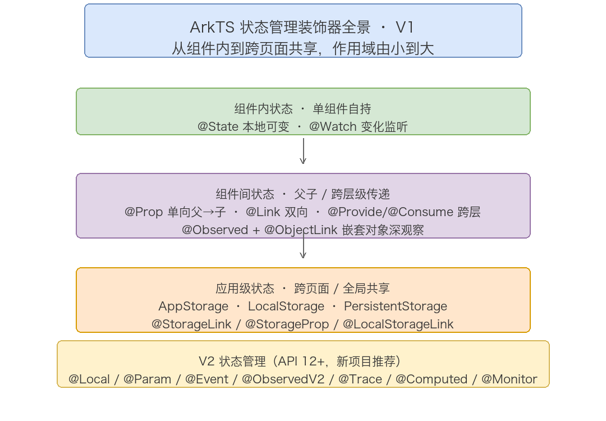

# ArkUI 基础语法

> ArkUI 是 HarmonyOS 的声明式 UI 框架，也是 ArkTS 语言面向 UI 开发的语法扩展层。它的核心思想一句话可以概括：状态是唯一数据源，开发者用组件 + 属性方法在 build() 里描述「长什么样」，框架负责在状态变化时自动刷新界面。本篇按「组件与页面结构 → 布局容器 → 基础组件 → 属性与事件 → 渲染控制 → 生命周期 → 状态管理装饰器 V1/V2」铺开，覆盖 ArkUI 声明式开发的全套知识点。语言本身的类型、函数、类等语法见《ArkTS基础语法》一篇。已有前端声明式框架（React / Vue / SwiftUI）经验的读者可以重点看布局容器与状态管理两章。

## 目录

- [1. ArkUI 概述](#1-arkui-概述)
- [2. 组件与页面结构](#2-组件与页面结构)
- [3. 布局容器](#3-布局容器)
- [4. 基础组件](#4-基础组件)
- [5. 属性与事件](#5-属性与事件)
- [6. 渲染控制](#6-渲染控制)
- [7. 生命周期](#7-生命周期)
- [8. 状态管理装饰器 V1](#8-状态管理装饰器-v1)
- [9. 状态管理 V2（API 12+）](#9-状态管理-v2api-12)
- [10. UI 复用](#10-ui-复用)
- [附：高频速记](#附高频速记)

# 1. ArkUI 概述

## 1.1 声明式 vs 命令式

传统命令式 UI 的开发思路是「自己动手改视图」：先拿到某个控件，再调用 setText、setVisibility 去改它的状态。开发者要手动维护「数据变了该改哪些控件」的映射关系，数据源和视图之间存在大量同步代码。

ArkUI 走的是声明式范式，把这件事反了过来：

| 维度 | 命令式 | ArkUI 声明式 |
| ---- | ---- | ---- |
| 关注点 | 怎么一步步改视图 | 状态是什么、长什么样 |
| 数据与视图 | 手动同步，易脱节 | 状态驱动，自动刷新 |
| 更新粒度 | 开发者自己找控件 | 框架定位到依赖该状态的组件 |
| 典型代码 | `textView.setText(s)` | `Text(this.s)` |

声明式的核心约束是：UI 是状态的函数，`UI = f(state)`。开发者只负责描述这个函数，状态变化后框架重新执行受影响的部分，算出新的 UI。这也是为什么 ArkUI 的 build() 里只能写「描述」，不能写「过程」——写过程就退回命令式了。

## 1.2 ArkUI 与 ArkTS 的分层

ArkUI 不是一门独立语言，而是叠加在 ArkTS 之上的 UI 扩展。两者分工清晰：

| 层 | 负责内容 | 关键词 |
| ---- | ---- | ---- |
| ArkTS 语言层 | 类型、变量、函数、类、泛型、模块、并发 | let/const、class、interface、TaskPool |
| ArkUI 扩展层 | 组件、属性方法、状态装饰器、渲染控制 | struct、build()、@State、Column、Text |

编译期装饰器是这套体系的地基：@State、@Component 等装饰器不是运行时反射，而是编译器的代码生成指令。编译器把装饰器展开成等价的命令式代码（@State 展开后包含依赖收集和 UI 刷新通知逻辑），运行时根本不存在「装饰器」这个概念。这也解释了为什么装饰器只能写在特定位置、每条都有严格规则——它们本质是编译器认得的关键字。

# 2. 组件与页面结构

## 2.1 三件套：@Entry / @Component / struct

一个 ArkUI 组件的骨架由三个装饰器 + 一个 struct + 一个 build() 组成：

```ts
@Entry
@Component
struct Index {
  @State message: string = 'Hello ArkTS'

  build() {
    Column() {
      Text(this.message)
        .fontSize(30)
      Button('点我')
        .onClick(() => {
          this.message = '已点击'
        })
    }
  }
}
```

各元素的职责：

| 元素 | 作用 | 约束 |
| ---- | ---- | ---- |
| @Entry | 标记页面入口组件，可被路由跳转、独立显示 | 一个 .ets 文件里最多一个 |
| @Component | 标记自定义组件 | 必须配合 struct 使用 |
| struct | 组件用 struct 声明，不是 class | 组件之间不能继承 |
| build() | UI 描述的唯一入口 | 内部只能写 UI 组件和渲染控制语句 |
| @State | 声明组件私有可变状态 | 必须本地初始化 |

struct 不能继承这一点值得单独记住：组件复用靠组合而非继承，复杂组件通过「内嵌子组件」实现，不存在「父组件类派生子组件类」的玩法。

## 2.2 组件命名与文件组织

自定义组件的命名遵循 struct 名即组件名的规则，构建时直接写 struct 名调用，例如 `struct ProfileCard` 用 `ProfileCard()` 实例化。官方推荐大写驼峰命名，与内置组件（Text、Button）的风格保持一致。

一个典型页面的文件组织：@Entry 页面组件作为文件主体，页面内需要复用的子组件定义在同文件的其余 struct 中，跨页面复用的组件抽到独立的 .ets 文件再 import。HarmonyOS 工程里页面放在 `entry/src/main/ets/pages/` 下，组件放在 `entry/src/main/ets/components/` 下。

# 3. 布局容器

布局容器是「用来容纳、排列子组件的特殊组件」。ArkUI 的布局基于弹性（Flex）模型设计，主轴和交叉轴是理解所有布局容器的钥匙：主轴是子组件排列的方向，交叉轴与主轴垂直。下面按使用频率介绍五种核心容器。

## 3.1 Column 垂直布局

Column 让所有子组件从上到下垂直排列，是最常用的基础布局：

```ts
Column({ space: 8 }) {          // space 统一设置子组件间距
  Text('顶部标题')
  Text('正文内容')
  Button('确认')
}
.width('100%')
.justifyContent(FlexAlign.Center)   // 主轴（垂直）方向：居中
.alignItems(HorizontalAlign.Center) // 交叉轴（水平）方向：居中
```

Column 的主轴是垂直方向，交叉轴是水平方向。justifyContent 控制垂直方向的对齐（上/中/下/均分），alignItems 控制水平方向的对齐（左/中/右）。

典型场景：聊天列表、订单列表、表单页、商品详情竖排内容。

## 3.2 Row 水平布局

Row 让子组件从左到右水平排列，是横向排版的首选：

```ts
Row() {
  Text('左侧')
  Blank()                    // 弹性空白，撑开两端
  Text('右侧')
}
.width('100%')
.justifyContent(FlexAlign.SpaceBetween)  // 主轴（水平）两端对齐
.alignItems(VerticalAlign.Center)        // 交叉轴（垂直）居中
```

Row 的主轴是水平方向，交叉轴是垂直方向。典型场景：顶部导航栏、底部按钮栏、一行图标、搜索框 + 按钮组合。

## 3.3 Stack 层叠布局

Stack 让子组件在同一个位置层叠堆叠，后写的组件覆盖在先写的上面（后来居上）：

```ts
Stack({ alignContent: Alignment.TopEnd }) {
  Image($r('app.media.cover'))          // 底层的图片
    .width(120).height(120)
  Text('角标')                          // 覆盖在上层的文字
    .fontSize(12)
    .fontColor(Color.White)
    .backgroundColor(Color.Red)
    .borderRadius(8)
}
```

子组件默认居中叠加，可通过 alignContent 或单个子组件的 align 单独设置对齐位置。典型场景：图片叠文字水印、商品图标右上角角标、封面叠加播放按钮、弹窗浮层。

## 3.4 Flex 弹性布局

Flex 是 Row/Column 的底层实现，支持自由切换方向、自动换行、自动均分剩余空间，适配复杂弹性排版：

```ts
Flex({ direction: FlexDirection.Row, wrap: FlexWrap.Wrap }) {
  Text('标签1').backgroundColor('#EEE')
  Text('标签2').backgroundColor('#EEE')
  Text('标签3').backgroundColor('#EEE')
  Text('标签4').backgroundColor('#EEE')
}
.justifyContent(FlexAlign.SpaceEvenly)  // 主轴对齐：所有间距（含首尾）相等
.alignItems(ItemAlign.Center)           // 交叉轴对齐
```

四个核心参数：

| 参数 | 取值 | 含义 |
| ---- | ---- | ---- |
| direction | Row / Column / RowReverse / ColumnReverse | 主轴方向 |
| wrap | NoWrap / Wrap / WrapReverse | 换行规则 |
| justifyContent | Start/Center/End/SpaceBetween/SpaceAround/SpaceEvenly | 主轴分布 |
| alignItems | Start/Center/End/Stretch | 交叉轴对齐 |

典型场景：商品网格、热门标签流、自适应按钮组、屏幕尺寸适配。简单横纵排列用 Row/Column，需要换行或均分时用 Flex。

## 3.5 Grid 网格布局

Grid 与 GridItem 组成网格布局，适合规整的多列卡片、九宫格、相册：

```ts
Grid() {
  ForEach(this.items, (item: string) => {
    GridItem() {
      Text(item).textAlign(TextAlign.Center)
    }
    .backgroundColor(Color.White)
    .borderRadius(8)
  }, (item: string) => item)
}
.columnsTemplate('1fr 1fr 1fr')   // 三列等宽
.columnsGap(8)
.rowsGap(8)
.height(300)
```

columnsTemplate 用 fr 单位或固定值定义列宽，columnsGap/rowsGap 设置行列间距。等宽三列是 `'1fr 1fr 1fr'`，也可以混合如 `'100px 1fr 1fr'`。

## 3.6 RelativeContainer 相对布局

RelativeContainer 让组件相对于父容器或其他兄弟组件定位，靠「参照物 + 对齐规则」实现自由错位排版：

```ts
RelativeContainer() {
  Text('标题')
    .id('title')
    .alignRules({
      top: { anchor: '__container__', align: VerticalAlign.Top },
      left: { anchor: '__container__', align: HorizontalAlign.Start }
    })
  Text('详情')
    .id('detail')
    .alignRules({
      top: { anchor: 'title', align: VerticalAlign.Bottom },
      left: { anchor: 'title', align: HorizontalAlign.Start }
    })
}
```

每个子组件先 .id() 起名，再用 .alignRules() 指定锚点（`__container__` 表示父容器，或其它组件的 id）与对齐方式（top/bottom/left/right/middle）。典型场景：复杂错位排版、需要精确定位的装饰元素。

# 4. 基础组件

基础组件是 UI 的最小砖块，掌握常用组件的核心属性就能拼出大多数界面。下面按功能分类介绍最常用的几类。

## 4.1 文本类

Text 显示文本，TextInput 输入单行文本，TextArea 输入多行文本：

```ts
Text('标题')
  .fontSize(20)
  .fontWeight(FontWeight.Bold)
  .fontColor('#333333')
  .maxLines(1)
  .textOverflow({ overflow: TextOverflow.Ellipsis })  // 超长省略号

TextInput({ placeholder: '请输入用户名' })
  .type(InputType.Normal)
  .onChange((value: string) => {
    console.log(`输入: ${value}`)
  })

TextArea({ placeholder: '请输入备注' })
  .height(100)
```

Text 的常用属性：fontSize（字号）、fontWeight（粗细）、fontColor（颜色）、maxLines（最大行数）、textOverflow（溢出处理）、textAlign（对齐）、lineHeight（行高）。

## 4.2 按钮与开关类

Button 是按钮，Toggle 是开关，Checkbox 是复选框，Radio 是单选：

```ts
Button('确定', { type: ButtonType.Capsule })
  .onClick(() => { })

Toggle({ type: ToggleType.Switch, isOn: true })
  .onChange((isOn: boolean) => { })

Checkbox({ name: 'agree', group: 'g' })
  .select(true)
  .onChange((value: boolean) => { })

Radio({ value: 'option1', group: 'g' })
  .checked(true)
```

Button 的 type 有 Capsule（胶囊）、Circle（圆形）、Normal（普通）三种。Toggle 有 Switch（开关）、Checkbox、Button 三种类型。Checkbox/Radio 通过 group 参数分组实现互斥。

## 4.3 图片 Image

Image 显示本地或网络图片，是 UI 中最常用的媒体组件：

```ts
Image($r('app.media.logo'))          // 本地资源
  .width(100).height(100)
  .objectFit(ImageFit.Cover)          // 裁剪填充

Image('https://example.com/a.png')   // 网络图片
  .width(200).height(200)
  .borderRadius(8)
```

objectFit 控制图片缩放填充方式：Cover（裁剪填满）、Contain（完整显示留白）、Fill（拉伸填满）、Auto（原始比例）。本地资源用 `$r('app.media.xxx')` 引用，网络图片直接给 URL。

## 4.4 进度与状态类

Progress 显示进度条，LoadingProgress 显示加载动画：

```ts
Progress({ value: 60, total: 100, type: ProgressType.Linear })
  .color(Color.Blue)
  .width(200)

LoadingProgress()
  .width(40).height(40)
  .color(Color.Blue)
```

Progress 的 type 有 Linear（线形）、Ring（环形）、ScaleRing（带刻度环形）、Eclipse（月牙）、Capsule（胶囊）五种。

## 4.5 列表与滚动类

List 是高性能列表容器，配合 ListItem 渲染每一项，适合长列表；Scroll 是通用滚动容器：

```ts
List() {
  ForEach(this.users, (user: User) => {
    ListItem() {
      Text(user.name)
    }
  }, (user: User) => user.id.toString())
}
.height('100%')
.divider({ strokeWidth: 1, color: '#EEE' })

Scroll() {
  Column() {
    Text('可滚动的长内容')
  }
}
.scrollable(ScrollDirection.Vertical)
```

List 相比 Scroll 的优势是支持列表项复用，长列表性能更好；Scroll 适合不确定高度的整块内容滚动。两者都通过子组件布局方向决定滚动方向。

## 4.6 其它常用组件

除上面几类外，还有三个高频小件：

```ts
Divider()                              // 分隔线
  .strokeWidth(1)
  .color('#EEE')

Blank()                                // 弹性空白，撑开两端（用于 Row 两端对齐）
  .width(20)

Slider({ value: 50, min: 0, max: 100 })  // 滑块
  .onChange((value: number) => { })
```

Divider 画一条水平（或垂直）分隔线；Blank 是「会呼吸的空白」，在 Row/Column 里自动占满剩余空间，常配合 justifyContent 做两端对齐；Slider 是滑块，用于音量、进度这类连续取值的交互。这三者体量小但几乎每个页面都会用到。

# 5. 属性与事件

## 5.1 通用属性

通用属性是几乎所有组件都支持的样式属性，用链式方法设置：

```ts
Text('示例')
  .width(100)                    // 宽度
  .height(40)                    // 高度
  .padding(12)                   // 内边距（四边）
  .margin({ top: 8, bottom: 8 }) // 外边距
  .backgroundColor(Color.Gray)   // 背景色
  .borderRadius(8)               // 圆角
  .opacity(0.8)                  // 不透明度
  .visibility(Visibility.Visible) // 可见性
```

常用通用属性速查：

| 属性方法 | 作用 | 常见取值 |
| ---- | ---- | ---- |
| width / height | 宽高 | 数字（vp）、'50%' |
| size({ w, h }) | 同时设宽高 | 对象 |
| padding / margin | 内/外边距 | 数字或 {top,left,bottom,right} |
| backgroundColor | 背景色 | Color.xxx 或 '#RRGGBB' |
| border / borderRadius | 边框 / 圆角 | 数字、对象 |
| opacity | 不透明度 | 0~1 |
| visibility | 可见性 | Visible / Hidden / None |
| position / offset | 定位 / 偏移 | 相对父容器定位 |

尺寸单位默认是 vp（虚拟像素），百分比用字符串 `'50%'`。

## 5.2 属性方法的链式调用

ArkUI 的属性方法是链式的：每个 `.属性()` 返回组件自身，可以一直往下接，这是声明式风格最显著的外观特征：

```ts
Text('链式调用')
  .fontSize(20)          // 属性方法
  .fontColor(Color.Red)  // 继续链
  .onClick(() => {})     // 事件方法也可以链
```

链式调用的顺序通常不影响最终效果（属性之间独立），但可读性上一般先写布局属性（宽高、边距），再写外观属性（颜色、字号），最后写事件方法。

## 5.3 事件方法

事件方法用于响应交互，命名以 on 开头。最常用的是 onClick，几乎所有组件都支持：

```ts
Button('点击').onClick((event: ClickEvent) => {
  console.log(`x=${event.x}, y=${event.y}`)  // 点击坐标
})

TextInput().onChange((value: string) => {
  console.log(`值变化: ${value}`)
})

Text('长按').onTouch((event: TouchEvent) => {
  if (event.type === TouchType.Down) {
    console.log('按下')
  }
})
```

onClick 回调参数 ClickEvent 携带点击坐标；onChange 携带变化后的值（不同组件的值类型不同）；onTouch 携带完整的触摸信息（type、位置、手指索引）。

## 5.4 手势事件

手势是比普通点击更丰富的交互，用 gesture 方法绑定 GestureGroup 或具体手势：

```ts
Text('拖动我')
  .gesture(
    TapGesture({ count: 2 })                    // 双击
      .onAction((event: GestureEvent) => {
        console.log('双击触发')
      })
  )

Text('长按我')
  .gesture(
    LongPressGesture({ repeat: false })
      .onAction((event: GestureEvent) => {
        console.log('长按触发')
      })
  )
```

常用手势类型：

| 手势 | 触发条件 | 典型场景 |
| ---- | ---- | ---- |
| TapGesture | 点击（可设 count 为双击） | 图片双击放大 |
| LongPressGesture | 长按 | 长按删除、拖动排序 |
| PanGesture | 平移拖动 | 拖拽、滑动条 |
| PinchGesture | 双指捏合 | 图片缩放 |
| RotationGesture | 双指旋转 | 图片旋转 |
| SwipeGesture | 快速滑动 | 列表项侧滑 |

多个手势用 GestureGroup 组合，可以设置并行或互斥关系（GestureMode.Exclusive / Parallel）。

# 6. 渲染控制

渲染控制是 build() 里的「流程语句」，用来根据状态条件渲染不同 UI 或批量渲染列表。它让 UI 描述具备了条件与循环能力。

## 6.1 if / else 条件渲染

```ts
build() {
  Column() {
    if (this.isLoading) {
      LoadingProgress().width(40)
    } else if (this.hasError) {
      Text('加载失败')
    } else {
      Text('加载完成')
    }
  }
}
```

if/else 根据状态布尔值决定渲染哪个分支，状态变化时框架自动切换分支。注意 if/else 只能写在 build() 内，且必须有对应的大括号包裹。

## 6.2 ForEach 列表渲染

ForEach 用「数据源 + 子项构建 + 键值生成」三个参数批量渲染列表：

```ts
build() {
  List() {
    ForEach(this.users, (user: User) => {
      ListItem() {
        Text(user.name)
      }
    }, (user: User) => user.id.toString())
  }
}
```

三个参数：

| 参数 | 作用 |
| ---- | ---- |
| 数据源 | 要遍历的数组（this.users） |
| 子项构建函数 | 每个元素渲染成什么 UI |
| 键值生成函数 | 为每个元素生成唯一键，决定复用策略 |

键值生成函数是关键：数据变化时，键值相同的列表项复用（不重建），键值不同的销毁重建。键值必须唯一且稳定，否则会出现列表项错乱或渲染异常。

## 6.3 LazyForEach 懒加载

ForEach 会一次性渲染所有数据，长列表性能差。LazyForEach 按需加载可见区域的列表项，配合数据源类实现真正的懒加载：

```ts
class DataSource implements IDataSource {
  // 实现 totalCount、getData、registerDataChangeListener 等方法
  // ...
}

build() {
  List() {
    LazyForEach(new DataSource(), (item: string) => {
      ListItem() { Text(item) }
    }, (item: string) => item)
  }
}
```

LazyForEach 需要实现 IDataSource 接口的数据源类，框架只渲染可视区域附近的项，滚动时动态加载。千级以上的长列表（聊天记录、商品流）必须用 LazyForEach。

# 7. 生命周期

组件的生命周期回调让开发者在组件的关键时间点插入逻辑，分组件级和页面级两类。

## 7.1 组件级生命周期

自定义组件（@Component）有两个生命周期回调：

```ts
@Component
struct ListCard {
  aboutToAppear(): void {
    // 组件实例创建后、build() 前调用，适合发起数据请求、初始化状态
  }

  aboutToDisappear(): void {
    // 组件销毁前调用，适合释放资源、取消定时器、解绑监听
  }

  build() {
    Column() {}
  }
}
```

aboutToAppear 在 build() 之前、组件即将显示时触发一次；aboutToDisappear 在组件即将销毁时触发。两者成对使用，一个负责初始化，一个负责清理。

## 7.2 页面级生命周期

只有 @Entry 页面组件才有页面生命周期：

```ts
@Entry
@Component
struct Page {
  onPageShow(): void {
    // 页面显示时触发（含从其它页面返回）
  }

  onPageHide(): void {
    // 页面隐藏时触发（跳转到其它页面）
  }

  onBackPress(): boolean {
    // 返回键按下时触发，返回 true 表示自己处理返回逻辑
    return false
  }

  build() {
    Column() {}
  }
}
```

三个回调的触发时机：onPageShow 在页面每次显示时（含从后台返回）；onPageHide 在页面每次隐藏时（跳走、切后台）；onBackPress 在用户按返回键时，返回 true 可拦截默认返回行为（常用于「再按一次退出」、保存确认弹窗）。

# 8. 状态管理装饰器 V1

状态管理是 ArkUI 区别于普通 UI 框架最大的部分。核心思想：被装饰器标记的变量是「状态」，状态变化时框架自动刷新用到它的 UI。



V1 装饰器按「组件内 → 父子间 → 跨层级 → 嵌套对象 → 应用级」五个层次组织，下面逐一展开。

## 8.1 组件内：@State 与 @Watch

```ts
@Component
struct Counter {
  @State count: number = 0                       // 组件私有可变状态
  @State items: string[] = ['a', 'b']

  build() {
    Column() {
      Text(`${this.count}`)
      Button('加一').onClick(() => this.count++)
    }
  }
}
```

@State 变量必须本地初始化。状态变化触发 UI 刷新的前提是框架能「感知」变化：number/string/boolean 这类基础类型按值观察；class 对象只观察第一层属性，嵌套对象内部变化感知不到（需要 @Observed/@ObjectLink，见 8.4）。

@Watch 监听状态变化执行回调：

```ts
@State @Watch('onCountChange') count: number = 0

onCountChange(propName: string): void {
  console.log(`${propName} 变成了 ${this.count}`)
}
```

## 8.2 父子传递：@Prop 与 @Link

```ts
// 父组件
@Entry
@Component
struct Parent {
  @State count: number = 0

  build() {
    Column() {
      Text(`父: ${this.count}`)
      ChildA({ count: this.count })   // @Prop 单向：直接传值
      ChildB({ count: $count })       // @Link 双向：父组件传引用需加 $
      Button('父加一').onClick(() => this.count++)
    }
  }
}

// 子组件 A：单向同步，父 → 子
@Component
struct ChildA {
  @Prop count: number            // 父变化 → 子更新；子改不影响父

  build() {
    Text(`A 收到: ${this.count}`)
  }
}

// 子组件 B：双向同步
@Component
struct ChildB {
  @Link count: number            // 任何一边修改都同步到对方

  build() {
    Button(`B 当前: ${this.count}`).onClick(() => this.count++)
  }
}
```

选型原则：子组件只展示用 @Prop；子组件需要修改并反馈给父用 @Link；只触发操作不改数据时，@Prop 加回调比 @Link 更清晰。

## 8.3 跨层级：@Provide 与 @Consume

```ts
// 祖先组件：@Provide 提供状态
@Entry
@Component
struct RootPage {
  @Provide theme: string = 'dark'

  build() {
    Column() {
      MiddleComponent()      // 中间层不需要透传
    }
  }
}

@Component
struct MiddleComponent {
  build() {
    Column() {
      DeepChild()
    }
  }
}

// 任意深度的后代：@Consume 直接消费
@Component
struct DeepChild {
  @Consume theme: string     // 跳过所有中间层直接关联

  build() {
    Text(`主题: ${this.theme}`)
  }
}
```

@Provide/@Consume 按变量名（或指定别名）自动关联，适合主题、语言、用户信息这类全局性上下文，免去逐层传参。

## 8.4 嵌套对象：@Observed 与 @ObjectLink

@State 对嵌套 class 对象的内部属性变化不敏感，需要两层配合：类用 @Observed 标记，组件里用 @ObjectLink 接收。

```ts
@Observed
class Task {
  done: boolean = false
  title: string = ''

  constructor(title: string) {
    this.title = title
  }
}

@Component
struct TaskItem {
  @ObjectLink task: Task      // 注意：@ObjectLink 不能本地初始化

  build() {
    Text(`${this.task.done ? '✓' : '○'} ${this.task.title}`)
      .onClick(() => this.task.done = !this.task.done)   // 深层属性变化能触发刷新
  }
}

@Component
struct TaskPage {
  @State tasks: Task[] = [new Task('学习 ArkTS')]

  build() {
    Column() {
      ForEach(this.tasks, (t: Task) => {
        TaskItem({ task: t })
      }, (t: Task) => t.title)
    }
  }
}
```

@ObjectLink 是只读引用（组件内不能整体替换指向），只能由父组件传入，且父组件传的必须是 @Observed 类的实例。

## 8.5 应用级：AppStorage 与 LocalStorage

```ts
// AppStorage：应用全局单例状态容器
AppStorage.setOrCreate<number>('accessToken', 1001)

@Component
struct PageA {
  @StorageLink('accessToken') token: number = 0     // 双向：改这里全局变
  @StorageProp('deviceName') device: string = ''    // 单向：本地只读

  build() {
    Text(`${this.token}`)
  }
}

// LocalStorage：页面级状态容器
let storage = new LocalStorage({ theme: 'light' })

@Entry(storage)
@Component
struct ThemedPage {
  @LocalStorageLink('theme') theme: string = 'light'    // 双向
  @LocalStorageProp('lang') lang: string = 'zh'         // 单向

  build() {
    Text(this.theme)
  }
}
```

| 容器 | 作用域 | 配合装饰器 | 典型用途 |
| ---- | ---- | ---- | ---- |
| AppStorage | 应用全局 | @StorageLink / @StorageProp | 登录态、全局配置 |
| PersistentStorage | 持久化到磁盘 | 与 AppStorage 联动 | 重启不丢的配置 |
| LocalStorage | 单个 UIAbility / 页面树 | @LocalStorageLink / @LocalStorageProp | 页面内多组件共享 |

# 9. 状态管理 V2（API 12+）

V2 是 API 12 引入的新一代状态管理，官方推荐新项目优先使用。核心改进：状态观察粒度更细（属性级）、性能更好（按需刷新）、API 语义更清晰。

| V1 | V2 | 变化要点 |
| ---- | ---- | ---- |
| @Component | @ComponentV2 | 配套 V2 体系 |
| @State | @Local | 只能内部初始化，不支持外部传入 |
| @Prop | @Param | 单向传参，配合 @Require 强制必传 |
| （回调属性） | @Event | 子向父回传事件的规范出口 |
| @Observed + @ObjectLink | @ObservedV2 + @Trace | 从「类级观察」细化为「属性级追踪」 |
| （无） | @Computed | 缓存的派生值，依赖不变不重算 |
| @Watch | @Monitor | 回调携带修改前/后值 |

```ts
@ObservedV2
class Task {
  @Trace done: boolean = false     // 只有 @Trace 标记的属性被精确追踪
  title: string = ''               // 普通属性不参与观察

  constructor(title: string) {
    this.title = title
  }
}

@ComponentV2
struct TaskItem {
  @Require @Param task: Task       // 必传的单向参数
  @Event toggle: (task: Task) => void   // 事件出口

  @Computed
  get label(): string {            // 依赖不变时缓存结果
    return this.task.done ? '已完成' : '进行中'
  }

  @Monitor('task.done')
  onDoneChange(monitor: IMonitor): void {
    console.log(`${monitor.before} -> ${monitor.after}`)
  }

  build() {
    Text(`${this.label}: ${this.task.title}`)
      .onClick(() => this.toggle(this.task))
  }
}
```

V1 和 V2 不要在同一条状态链里混用，否则观察行为不可预期。存量项目可以渐进迁移，新项目直接 V2。

# 10. UI 复用

UI 复用四件套解决「重复 UI 片段怎么抽出来复用」的问题：@Builder 抽构建函数，@BuilderParam 接收 UI 片段，@Styles 抽样式集合，@Extend 扩展组件样式。

## 10.1 @Builder 构建函数

```ts
// @Builder：可复用的 UI 构建函数
@Builder
function sectionTitle(title: string) {       // 全局 Builder
  Text(title).fontSize(18).fontWeight(FontWeight.Bold)
}

@Component
struct SettingPage {
  @Builder item(label: string, value: string) {   // 组件内 Builder，可访问 this
    Row() {
      Text(label)
      Blank()
      Text(value).fontColor(Color.Gray)
    }.width('100%')
  }

  build() {
    Column({ space: 10 }) {
      sectionTitle('通用')
      this.item('版本', '5.0.0')
      this.item('存储', '2.3 GB')
    }
  }
}
```

全局 @Builder 函数不能访问组件 this；组件内 @Builder 方法可以访问 this（从而读取组件状态）。这是两者最本质的区别。

## 10.2 @BuilderParam 接收 UI 片段

@BuilderParam 让子组件接收父组件传来的 UI 片段，类似 React 的 children/slot 机制：

```ts
@Component
struct Card {
  @BuilderParam content: () => void

  build() {
    Column() {
      this.content()
    }
    .padding(12)
    .borderRadius(8)
    .backgroundColor(Color.White)
  }
}

// 使用方：尾随闭包语法传入内容
Card() {
  Text('卡片内容')
}
```

使用方在组件名后直接接一个尾随闭包，闭包里的 UI 就是传给 @BuilderParam 的内容。这是封装「带可变内容的容器组件」的标准做法。

## 10.3 @Styles 与 @Extend

@Styles 把一组属性打包复用，@Extend 扩展指定内置组件的样式方法：

```ts
// @Styles：样式集合（不含组件自身，纯属性）
@Styles function pressedStyle() {
  .backgroundColor(Color.Gray)
  .opacity(0.7)
}

// @Extend：针对特定组件扩展样式方法
@Extend(Text)
function badgeStyle(color: ResourceColor) {
  .fontSize(12)
  .fontColor(Color.White)
  .backgroundColor(color)
  .padding({ left: 6, right: 6, top: 2, bottom: 2 })
  .borderRadius(10)
}

// 使用
Text('NEW').badgeStyle(Color.Red).pressedStyle()
```

@Styles 是通用样式集合，任何组件都能用；@Extend 绑定到特定组件类型（如 Text），只能在对应组件上调用，但可以传参实现动态样式。

# 附：高频速记

- 声明式范式：UI = f(state)，状态是唯一数据源，框架自动刷新依赖该状态的组件。
- 三件套：@Entry 页面入口、@Component 自定义组件、struct + build() 描述 UI；struct 不能继承，复用靠组合。
- 布局五容器：Column 垂直、Row 水平、Stack 层叠（后来居上）、Flex 弹性（可换行均分）、Grid 网格；RelativeContainer 相对定位。
- 主轴/交叉轴：justifyContent 控主轴、alignItems 控交叉轴；Column 主轴垂直，Row 主轴水平。
- 通用属性链式调用：width/height/padding/margin/backgroundColor/borderRadius/opacity；尺寸单位 vp，百分比用 '50%'。
- 事件方法 on 开头：onClick（带坐标）、onChange（带新值）、onTouch（带触摸信息）；手势用 .gesture() 绑 TapGesture/LongPressGesture/PanGesture/PinchGesture 等。
- 渲染控制：if/else 条件渲染、ForEach 三参数（数据源/子项/键值生成，键值决定复用）、长列表用 LazyForEach。
- 生命周期：组件级 aboutToAppear/aboutToDisappear（成对，初始化+清理）；页面级 onPageShow/onPageHide/onBackPress（仅 @Entry）。
- V1 装饰器：@State 组件内、@Prop 单向、@Link 双向（父传 $count）、@Provide/@Consume 跨层、@Observed+@ObjectLink 嵌套对象、@StorageLink/@StorageProp 全局、@Watch 监听。
- @State 只观察第一层；嵌套对象内部变化需 @Observed 类 + @ObjectLink 组件引用。
- V2（API 12+ 推荐）：@Local（内部初始化）、@Param（+@Require 必传）、@Event、@ObservedV2+@Trace 属性级追踪、@Computed 缓存、@Monitor 带前后值；两套体系勿混用。
- UI 复用四件套：@Builder 构建函数（全局不能访问 this，组件内可以）、@BuilderParam 接收 UI 片段（尾随闭包）、@Styles 样式集合、@Extend 组件样式扩展。
- List 配合 ListItem 有复用优势，长列表用 LazyForEach；Scroll 适合整块不确定高度内容。
