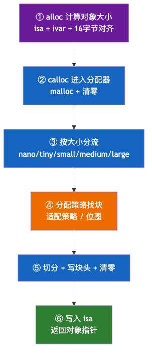
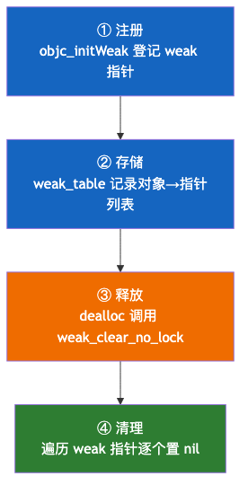
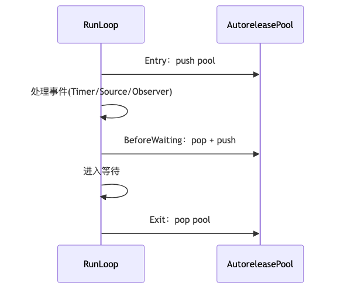
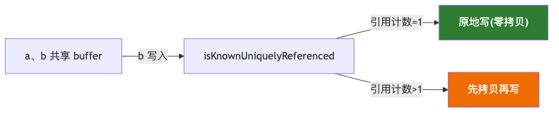

# 01. iOS 内存管理

> 从程序内存布局、引用计数底层（isa 位域 / SideTable）、ARC 与所有权修饰符、weak 置 nil 机制、自动释放池（AutoreleasePoolPage）、循环引用，到系统级内存（Clean/Dirty/Compressed）与 Swift/OC 差异，源码级剖析 iOS 内存管理全链路。重点讲清「为什么」而非罗列「是什么」。

## 目录

- [一、程序内存布局](#一程序内存布局)
- [二、堆内存分配机制](#二堆内存分配机制)
- [三、引用计数机制](#三引用计数机制)
- [四、ARC 与所有权修饰符](#四arc-与所有权修饰符)
- [五、弱引用 weak 的底层实现](#五弱引用-weak-的底层实现)
- [六、自动释放池 AutoreleasePool](#六自动释放池-autoreleasepool)
- [七、循环引用](#七循环引用)
- [八、系统级内存管理](#八系统级内存管理)
- [九、Swift 与 OC 的内存管理差异](#九swift-与-oc-的内存管理差异)
- [附：高频速记](#附高频速记)

---

## 一、程序内存布局

### 1. 内存分区

进程的虚拟地址空间从高到低分为六区：

```text
高地址
┌─────────────────────────────────────┐
│             栈区 (Stack)             │  ↓ 向低地址增长
│   局部变量、函数参数、返回地址           │
├─────────────────────────────────────┤
│                 ↕                   │
│            动态分配区                 │
│                 ↕                   │
├─────────────────────────────────────┤
│             堆区 (Heap)              │  ↑ 向高地址增长
│         动态分配的对象实例             │
├─────────────────────────────────────┤
│           全局/静态区 (BSS)           │  未初始化全局/静态变量（自动清零）
├─────────────────────────────────────┤
│           数据区 (Data)              │  已初始化全局/静态变量
├─────────────────────────────────────┤
│           常量区 (Rodata)            │  字符串常量、const 常量（只读）
├─────────────────────────────────────┤
│           代码区 (Text)              │  编译后的机器码（只读）
└─────────────────────────────────────┘
低地址
```

| 区域     | 存储内容         | 管理方式          | 生命周期    |
| ------ | ------------ | ------------- | ------- |
| 栈区     | 局部变量、参数、返回地址 | 系统自动（LIFO）    | 函数执行期间  |
| 堆区     | 动态分配的对象      | 引用计数（ARC/MRC） | 由引用计数控制 |
| BSS    | 未初始化全局/静态变量  | 加载时分配、清零      | 程序运行期间  |
| Data   | 已初始化全局/静态变量  | 加载时分配         | 程序运行期间  |
| Rodata | 字符串/const 常量 | 只读            | 程序运行期间  |
| Text   | 机器码          | 只读            | 程序运行期间  |

> **为什么栈快堆慢**：栈分配只是移动栈指针（`SP` 减一个偏移），O(1)；堆分配要查找空闲块、可能触发系统调用（`mmap`/`brk`）、有碎片整理，代价高得多。这也是 Swift 值类型优先栈分配的性能根源。

下面逐一拆解每个分区的存储结构与底层细节：

#### ① 栈区（Stack）—— 函数调用的「草稿纸」

栈用**栈帧（Stack Frame）**&#x7EC4;织每次函数调用：

```text
高地址
┌─────────────────────┐
│   返回地址            │  ← 函数返回后要执行的下一条指令地址
├─────────────────────┤
│   上一帧指针 (RBP)    │  ← 保存调用者的栈帧基址，构成调用链
├─────────────────────┤
│   局部变量/寄存器保存  │  ← 当前函数的局部数据
├─────────────────────┤
│   ...（向低地址压栈）  │
└─────────────────────┘
低地址
```

- **分配/回收 O(1)**：进函数时栈顶指针 `SP` 下移「让出」空间，返回时上移整帧作废，无需逐变量清理——这正是栈快的根本原因；
- **连续无碎片**：空间天然连续；
- **栈溢出**：递归过深或局部大数组会压穿栈。iOS 主线程栈默认 **1MB**，子线程 **512KB**；
- **生命周期**：随函数进出自动管理，函数返回后局部变量即失效。

```objc
- (void)foo {
    int a = 1;         // a 本身在栈上，函数返回即失效
    NSObject *obj;     // 指针变量在栈上，但指向堆上的对象
}
```

> **易混淆点**：栈上存的是「指针变量本身」，指针指向的对象在堆上。另外编译器可能把局部变量优化进**寄存器**（根本不进栈）。

#### ② 堆区（Heap）—— 动态对象的「仓库」

堆存放生命周期不确定的动态对象（OC 对象、Block、`malloc` 内存）：

- **分配慢**：内存分配器需维护**空闲链表**查找块，可能触发 `mmap`/`brk` 系统调用；
- **有碎片**：反复分配/释放产生内存碎片；
- **增长方向**：与栈相反，向高地址增长；
- **OC 对象布局**：`alloc` 时 `malloc` 一块内存，首地址存 `isa`，随后是实例变量，按 16 字节对齐。

```text
堆上的 OC 对象
┌──────────────┐
│     isa      │  ← 首成员，指向类对象
├──────────────┤
│    ivar1     │  ← 实例变量
├──────────────┤
│    ivar2     │
└──────────────┘
```

> Apple 的 scalable malloc（magazine 机制 + 五级内存分级）详见第二章「堆内存分配机制」。

#### ③ BSS 与 ④ Data —— 全局/静态变量

- **BSS**（`__DATA,__bss`）：未初始化全局/静态变量，加载时内核清零，**不占可执行文件体积**；
- **Data**（`__DATA,__data`）：已初始化全局/静态变量，初值写进 Mach-O，**占文件体积**。

```c
int g_uninit;           // BSS，加载后自动为 0
static int s_init = 10; // Data，初值 10 写进文件
```

> **本质区别**：是否占用可执行文件空间。`int x = 0;` 常被编译器优化进 BSS（省体积）。

#### ⑤ Rodata 区（常量区）—— 只读常量

- 存放字符串常量、`const` 常量，**只读**（写入触发 `EXC_BAD_ACCESS`）；
- Mach-O 对应 `__TEXT,__cstring`（C 字符串）、`__TEXT,__const`（const 常量）；
- OC 的 `@"hello"` 特殊：`__CFConstantString` 结构体在 `__DATA,__cfstring`，内容在 `__TEXT,__cstring`。

```c
char *s = "abc";     // "abc" 在 __TEXT,__cstring，指针 s 在栈上
s[0] = 'A';          // 崩溃！写只读内存
```

#### ⑥ Text 区（代码段）—— 机器码

- 存放机器指令（`__TEXT,__text`），**只读 + 可执行**，进程间可共享；
- iOS 对 `__TEXT` 做**页级代码签名校验**，篡改即拒绝执行。

**Mach-O Segment 与内存分区的映射总览**：

| 内存分区   | Mach-O Segment / Section            | 权限    |
| ------ | ----------------------------------- | ----- |
| 栈 / 堆  | （不在 Mach-O，运行时分配）                   | 读写    |
| BSS    | `__DATA,__bss`                      | 读写    |
| Data   | `__DATA,__data`、`__DATA,__cfstring` | 读写    |
| Rodata | `__TEXT,__cstring`、`__TEXT,__const` | 只读    |
| Text   | `__TEXT,__text`                     | 只读可执行 |

---

## 二、堆内存分配机制

> 本章以「一个对象的完整分配过程」为主线，从 `alloc` 一路拆解到内存真正分配出去，把分配策略、内存分级、碎片、回收串成一条链路，避免碎片化理解。

### 1. 堆与虚拟内存

堆不是一块预先分配好的连续内存，而是由**虚拟内存系统**按需增长的区域：

```text
虚拟地址空间
┌──────────────┐
│     栈       │  ↓ 向低地址增长
├──────────────┤
│      ↕       │  共享的动态分配区
├──────────────┤
│     堆       │  ↑ 向高地址增长（brk / mmap 扩展）
├──────────────┤
│ BSS/Data/Text│
└──────────────┘
```

- 进程初始堆较小，随分配需求增长；
- 增长方式：`brk` 抬高「堆顶」（program break，小增量），或 `mmap` 映射新区域（大增量）；
- 释放后的空闲内存**不一定立即归还系统**，而是留作后续复用（这也是内存峰值难降的原因之一）。

### 2. 一个对象的内存分配全过程

以 `Person *p = [[Person alloc] init];` 为例，一个对象的分配要经过 **6 步**：



下面逐步拆解每一步。

**① 计算对象大小**：`alloc` 底层是 `class_createInstance`，它算出对象大小 = isa（8 字节）+ 所有 ivar，再按 16 字节对齐：

```text
+[NSObject alloc]
  → _objc_rootAlloc
    → callAlloc（快路径：查缓存的 isa 直接分配）
      → class_createInstance（计算对象大小）
        → _class_createInstanceFromZone
          → calloc(1, size)   ← 交给分配器
```

**② calloc 清零**：`calloc` 比 `malloc` 多一步「清零」，保证对象 ivar 初始为 0（这也是 `int` 属性默认是 0 的根源）。

**③ 按大小分流**：分配器（scalable malloc）按请求大小，把请求分到五级 zone：

| 级别     | 大小      | 分配方式                   |
| ------ | ------- | ---------------------- |
| nano   | < 256B  | nano zone，位图管理，16 字节粒度 |
| tiny   | < 1KB   | tiny zone，空闲链表         |
| small  | < 15KB  | small zone，空闲链表        |
| medium | < 128KB | 分段分配                   |
| large  | ≥ 128KB | `mmap`，释放即归还系统         |

> **为什么分级**：不同大小的对象，分配/释放模式不同——小对象高频、要快（用位图/线程缓存），大对象低频、要省内存（用 mmap 立即归还）。分级让每类对象走最合适的路径。

**④ 分配策略找块**：不同 zone 用不同的找块策略（详见下一节）。

**⑤ 切分 + 块头 + 清零**：找到空闲块后，切出需要的大小，剩余部分挂回空闲链表；写块头（记录大小/状态）；calloc 清零。

**⑥ 返回对象**：写入 isa（指向类对象），返回指针。

> **关键认知**：对象分配不是「直接 malloc 一块」，而是「**Runtime 算好大小 → 分配器按大小分流 → 用对应策略找块**」。每一层都是为了「快」和「省内存」。

### 3. 分配策略详解

**空闲链表的三类适配策略**（tiny / small zone 用）：

| 策略              | 做法           | 特点        |
| --------------- | ------------ | --------- |
| 首次适配（first fit） | 从链表头找第一个够大的块 | 快，低地址端碎片多 |
| 最佳适配（best fit）  | 找最接近请求大小的块   | 碎片少，遍历慢   |
| 最坏适配（worst fit） | 找最大的块切       | 剩余块大，利用率低 |

**nano 的位图**（nano zone 用）：预分配一大块 nano 区域，每 16 字节一个槽位，用位图标记占用/空闲。分配即查位图找空位，**O(1) 无链表遍历**，非常适合高频小对象（如 `NSNumber`）。

**magazine 线程缓存**（跨所有小对象）：每个线程一个 magazine（本地缓存），小对象优先从本线程 magazine 分配，减少跨线程抢全局锁——这是 scalable malloc「可扩展」的核心。

**块头（header）与对齐**：每个已分配块前有一个 header 记录大小/状态，`free(p)` 靠它知道释放多大：

```text
┌──────────────┬──────────────────────┐
│ header       │ 用户可用数据区         │
│ (size/flags) │ (malloc 返回的指针)    │
└──────────────┴──────────────────────┘
              ↑
        malloc 返回这里
```

分配器把请求大小向上对齐（如 16 字节）：CPU 访问快，且 header 低位可复用做标志位（如「是否空闲」）。

### 4. 内存碎片

- **外部碎片**：空闲块被已分配块切碎，总空闲够、但找不到连续大块；
- **内部碎片**：实际给的块比请求大（对齐 + 块头开销）；
- **缓解**：`free` 时合并相邻空闲块（coalescing）；分级分配减少小对象切大块。

### 5. 回收：free 的完整流程

```c
free(p);
```

分配器做的事：

```text
free(p)：
  1. 通过 p 前移找到 header，标记为空闲
  2. 检查前后相邻块，若也是空闲则合并（coalescing）
  3. 合并后的大块若超过归还阈值，munmap 归还系统
```

**合并（coalescing）**——防碎片化的关键：释放一个块时，看它前后是否也是空闲块，是就合并成一个更大的空闲块：

```text
free 前：[已分配 A][空闲 B][已分配 C]
free A 后：[ 空闲 A+B（合并） ][已分配 C]
```

**归还系统**：空闲块不会一直留着。超过阈值（约 128KB）的空闲大块会 `munmap` 归还内核，避免应用占着大量不用的内存。

**两个陷阱**：

- **double free**：同一指针 `free` 两次 → 第二次把已空闲的块再次标记，破坏链表结构导致崩溃；
- **悬垂指针**：`free` 后继续用指针 → 访问已释放内存，读到垃圾或崩溃。OC 用引用计数规避（对象计数归零才真正 free）。

### 6. 大内存分配与 mmap

超过 large 阈值（约 128KB）的请求直接走 `mmap` 匿名映射：

```c
void *p = mmap(NULL, size, PROT_READ | PROT_WRITE,
               MAP_ANON | MAP_PRIVATE, -1, 0);
// 用完后
munmap(p, size);   // 立即归还内核，不进空闲链表
```

适合大图、大缓冲。好处：释放立即归还、不产生碎片；代价：每次分配有系统调用开销。

---

## 三、引用计数机制

### 1. 基本原理

- 新强引用指向对象 → 计数 +1；
- 强引用移除 → 计数 -1；
- 计数归零 → 调用 `dealloc` 销毁对象。

```objc
// 引用计数变化（概念示意）
NSObject *obj = [[NSObject alloc] init];  // +1
NSObject *ref = obj;                      // +1（强引用）
ref = nil;                                // -1
obj = nil;                                // -1 → 归零，dealloc
```

### 2. isa 非指针化与 extra_rc

64 位下 `isa` 不再单纯是类指针，而是被「位域化」的 union，其中嵌入了**内联引用计数** `extra_rc`：

```c
union isa_t {
    struct {
        uintptr_t nonpointer        : 1;  // 是否为非指针 isa
        uintptr_t has_assoc         : 1;  // 是否有关联对象
        uintptr_t has_cxx_dtor      : 1;  // 是否有 C++ 析构
        uintptr_t shiftcls          : 33; // 类指针（压缩后）
        uintptr_t magic             : 6;  // 调试用
        uintptr_t weakly_referenced : 1;  // 是否被弱引用
        uintptr_t deallocating      : 1;  // 是否正在释放
        uintptr_t has_sidetable_rc  : 1;  // 引用计数是否在侧表
        uintptr_t extra_rc          : 19; // 内联引用计数（减 1 后的值）
    } bits;
};
```

**关键设计**：`extra_rc` 是 19 位，能存 0~~524287，即引用计数 1~~524288。绝大多数对象计数很小，直接存在 isa 里，**免去一次 SideTable 的哈希查找**——这是典型的「快路径优化」。

### 3. SideTable 侧表

当内联 `extra_rc` 溢出（计数 > 524288），或对象有弱引用时，引用计数转入全局 **SideTable**：

```c
struct SideTable {
    os_unfair_lock slock;       // 自旋锁 → 现为 unfair lock（互斥锁）
    RefcountMap refcnts;        // 引用计数哈希表（key=对象地址，value=计数）
    weak_table_t weak_table;    // 弱引用表
};
```

SideTable 是**全局多个分片**（StripeCount=8 或 64），按对象地址哈希到不同 SideTable，**分散锁竞争**。每个 SideTable 同时承担引用计数溢出存储 + 弱引用关系管理。

### 4. retain / release 源码流程

```c
// retain 的简化逻辑
id objc_retain(id obj) {
    if (obj->isTaggedPointer()) return obj;   // Tagged Pointer 无计数，直接返回
    // 尝试 isa.extra_rc +1（快路径，无锁原子操作）
    // 溢出则转入 SideTable（慢路径，加锁）
}

// release 的简化逻辑
void objc_release(id obj) {
    if (obj->isTaggedPointer()) return;
    // extra_rc -1；减到 0 且无侧表 → 触发 dealloc
}
```

### 5. Swift 类的引用计数存储

纯 Swift 类的内存布局与 ObjC 不同，引用计数内联在对象头：

| 偏移      | 内容                     |
| ------- | ---------------------- |
| 0x0-0x7 | HeapMetadata*（类型元数据指针） |
| 0x8-0xF | RefCount（内联引用计数）       |
| 0x10+   | 实例属性                   |

继承自 NSObject 的 Swift 类则兼容 ObjC Runtime 布局（走 isa/SideTable）。

**Swift 的 weak 关联数据存在哪？**

Swift 与 ObjC 的弱引用存储机制不同：ObjC 把 weak 指针列表放**全局 SideTable 的 weak_table**；Swift 则把 weak 计数**内联在堆对象自己头上**。

Swift 每个堆对象（HeapObject）头部是**内联引用计数** `InlineRefCounts`，含两个位域计数器：

```c
struct InlineRefCounts {
    RefCountBits strong;        // 强引用计数
    RefCountBits unownedWeak;   // unowned + weak 计数（带标志位区分）
};
```

```text
Swift HeapObject
┌──────────────────────┐
│ HeapMetadata* (8B)   │
├──────────────────────┤
│ InlineRefCounts (8B) │ ← strong + unownedWeak 两个位域
│  ├ strong            │
│  └ unownedWeak       │
├──────────────────────┤
│ 实例属性...           │
└──────────────────────┘
```

- 对象被 weak 引用时，`unownedWeak` 计数 +1（weak 与 unowned 共用计数，靠标志位区分）；
- 内联计数**溢出**（或被大量弱引用）时，分配 **side table**（`HeapObjectSideTableEntry`）转存：

```text
HeapObjectSideTableEntry
┌──────────────────────────┐
│ object : HeapObject*     │ ← 反向指向原对象（靠它找回）
├──────────────────────────┤
│ refCounts                │
│  ├ strong (32位)         │
│  └ unownedWeak (32位)    │
└──────────────────────────┘
```

> side table 里只有「object 指针 + 两个计数」，**没有 weak 指针列表**。这是 Swift 与 ObjC 弱引用记录方式的本质差异。

**weak 引用变量本身存的是什么？**

`weak var x: T?` 变量底层是一个 `WeakReference`，存的**不是对象指针**，而是指向对象 **side table（或内联 unownedWeak 槽位）的指针**：

```text
weak 变量 (WeakReference)
┌──────────────────────────┐
│ 指针 → side table entry  │  ← 不直接指向对象！
└──────────────────────────┘
```

**为什么「只存 count 也能置 nil」—— 惰性判定，而非遍历：**

Swift 的 weak 引用**不需要遍历所有 weak 指针去置 nil**，靠的是**读取时惰性判定**：

```text
读取 weak 变量时（swift_weakLoadStrong）：
1. 通过 weak 变量里的指针，找到 side table / inline refcounts
2. 读 strong 计数
3. strong > 0 → retain 后返回对象
4. strong == 0 → 直接返回 nil
```

**通过 weak 怎么找到原对象？**

「找到原对象」发生在上面第 1~2 步之间，靠计数槽位反向存的对象指针，分两条路径：

```text
路径 1（内联，计数未溢出）：
  weak 变量 → InlineRefCounts 的 unownedWeak 位域
  对象地址 = unownedWeak 位域地址 - 8 字节   ← 靠地址偏移反推（InlineRefCounts 紧贴 HeapMetadata）

路径 2（side table，计数溢出）：
  weak 变量 → HeapObjectSideTableEntry
  entry.object 字段反向指向 HeapObject       ← 靠显式指针
```

> **为什么要绕这一层（两级间接）**：若 weak 直接存对象指针，对象 dealloc 后指针悬垂，读取即崩溃。绕 side table 中转后，对象 deinit 时 strong 归 0 但 side table 因 weak 计数 > 0 而保留；读 weak 时先拿到活着的 side table，查它的 strong 计数，归 0 就**直接返回 nil，根本不去碰原对象内存**——读取永远安全，这是两级间接换来的核心价值。

- 对象 deinit 后 strong 计数归 0，但 **side table 因 weak 计数 > 0 而保留**；
- 之后任何 weak 变量被读取，都会发现 strong == 0，返回 nil——**无需主动遍历置 nil**；
- **weak 计数（count）的真正作用**：不是「定位所有 weak 指针」，而是「管理 side table 生命周期」——当 strong 归 0 且 weak 计数也归 0（所有 weak/unowned 引用都释放），side table 才被回收。

> **ObjC vs Swift 的本质区别**：
>
> - ObjC：weak 指针列表存**全局 SideTable.weak_table**，dealloc 时**主动遍历**逐个置 nil；
> - Swift：weak 变量存**指向对象 side table 的指针**，deinit 后靠**读取时查 strong 计数**惰性返回 nil，无遍历。

---

## 四、ARC 与所有权修饰符

### 1. ARC 工作原理

ARC 是**编译期**技术：编译器在编译时静态分析对象的引用关系，在合适位置自动插入 `retain`/`release`/`autorelease`，**运行期不介入、无额外扫描线程**。

核心是**所有权转移（ownership transfer）分析**：编译器追踪每个对象的「所有权」在代码中的流动——谁创建了它、谁持有了它、谁负责最终释放它，据此决定在哪插 `retain`、在哪插 `release`。

```objc
// 源码
- (void)foo {
    NSString *s = [[NSString alloc] init];  // alloc → 调用者持有（+1）
    self.name = s;                           // 属性 strong → 再 +1
}  // 作用域结束，编译器插入 [s release]（-1）
```

编译器插入规则遵循 **Cocoa 命名约定**：方法名以 `alloc/new/copy/mutableCopy` 开头 → 返回对象由调用者持有（编译器不额外 retain）；其余方法 → 返回 autorelease 对象（编译器按需 retain）。

> **ARC ≠ GC（垃圾回收）**：
> - GC：运行时扫描对象图、周期性回收，有暂停、释放时机不确定；
> - ARC：编译期确定性地插入 retain/release，释放时机确定、无扫描暂停；
> - 结果：ARC 内存峰值更低、更省电、`dealloc` 时机可预测，这也是 iOS 比 JVM 系更省内存的关键原因之一。

### 2. 所有权修饰符

四种修饰符声明变量的「所有权语义」，编译器据此插入不同的内存管理代码：

| 修饰符 | 持有对象? | 释放后置 nil? | 底层行为 |
|--------|:--------:|:-----------:|---------|
| `__strong` | ✅ | — | 赋值时 retain，作用域结束 release |
| `__weak` | ❌ | ✅ | 不 retain，走 weak 表，读取时 retain+autorelease |
| `__unsafe_unretained` | ❌ | ❌ | 不 retain 不置 nil，悬垂风险 |
| `__autoreleasing` | 延迟 | — | 交给 autoreleasepool，池 drain 时释放 |

**`__strong`（默认）**：局部变量、成员变量默认都是 strong。赋值时 `objc_retain`，离开作用域时 `objc_release`；成员变量在所属对象 `dealloc` 时统一 release。

```objc
NSString *s = other.name;   // strong 赋值 → retain（+1）
// s 离开作用域 → release（-1）
```

**`__weak`**：不持有对象（不 retain）。**关键安全机制**——读取 weak 变量时，编译器会「retain 后 autorelease」：

```objc
__weak NSString *w = obj.name;
NSString *s = w;   // 读取 weak：objc_loadWeakRetained + autorelease
```

为什么要「读取时 retain+autorelease」？防止读出来的瞬间对象被其他线程释放、拿到悬垂指针——retain 保证读取期间对象存活，autorelease 保证稍后自动释放、不改变原引用计数。

**`__unsafe_unretained`**：MRC 时代 `assign` 的遗留，不 retain 也不置 nil。对象释放后变量成悬垂指针，访问即崩溃。仅用于「无法用 weak 的场景」（如非 ObjC 对象）和极致性能要求（省去 weak 表查表开销）。

**`__autoreleasing`**：把对象交给 autoreleasepool，延迟到池 drain 时释放。典型场景是 **out 参数**——`NSError **error` 这类「指针的指针」，编译器会把调用者的 `__strong` 变量隐式转成临时 `__autoreleasing` 变量传入，保证返回的错误对象在方法返回后仍存活：

```objc
NSError *error = nil;
BOOL ok = [obj doSomething:&error];  // 编译器创建临时 __autoreleasing 变量
```

### 3. retain / release 的插入规则

编译器在哪些位置插入内存管理操作？主要四类：

**① 局部变量**：声明时若有赋值则 `retain`，作用域结束（或最后一次使用后）`release`。

**② 方法返回值**：返回 autorelease 对象时插入 `objc_autoreleaseReturnValue`，配合调用方的 `objc_retainAutoreleasedReturnValue`，可优化掉中间的 autorelease（详见第六章 autorelease elision）。

**③ 属性赋值**：`self.name = xxx` 走 `objc_setProperty`——strong/copy 属性会 retain/copy 新值、release 旧值；assign/weak 只赋指针、不做计数操作。

**④ 实例变量**：对象 `dealloc` 时，编译器自动插入对所有 strong 成员变量的 release。

### 4. ARC 与 Core Foundation 的桥接（Toll-Free Bridging）

ARC 只管理 ObjC 对象，**不管理 Core Foundation 对象**（`CFStringRef`、`CFArrayRef` 等）。二者互转时必须用 `__bridge` 系列显式声明所有权，否则编译器报错：

| 桥接 | 作用 | 等价函数 |
|------|------|---------|
| `__bridge` | 只类型转换，**不转移所有权**（两边都不管） | 无 |
| `__bridge_retained` | OC → CF，所有权交给 CF（+1） | `CFBridgingRetain` |
| `__bridge_transfer` | CF → OC，所有权交给 ARC（ARC 接管释放） | `CFBridgingRelease` |

```objc
// OC → CF，不转移所有权（CF 用完不释放，ARC 仍管理）
CFStringRef cf = (__bridge CFStringRef)nsString;

// OC → CF，转移所有权给 CF（CF 负责 CFRelease）
CFStringRef cf = (__bridge_retained CFStringRef)nsString;
CFRelease(cf);   // 手动释放

// CF → OC，转移所有权给 ARC（ARC 接管，无需手动释放）
NSString *ns = (__bridge_transfer NSString *)cfString;
```

> **常见坑**：`__bridge` 用错方向会导致泄漏或 double free——OC→CF 忘加 `_retained` 会让 CF 对象无人释放；CF→OC 忘加 `_transfer` 会让同一对象被释放两次。

### 5. 编译器 ARC 优化

**autorelease return value 优化**：`objc_autoreleaseReturnValue` 会检查调用方是否紧跟 `objc_retainAutoreleasedReturnValue`，若是则通过线程局部存储（TLS）直接传递对象、**跳过 autoreleasepool**，省一次池操作（详见第六章 autorelease elision）。

**冗余 retain/release 消除**：OC 的 ARC 优化相对有限，主要是消除相邻的 retain/release 对。更激进的「栈提升」「RC 消除」依赖逃逸分析，是 **Swift SIL 优化器**的能力（OC 对象必在堆、无逃逸分析），见第九章第 5 节。

---

## 五、弱引用 weak 的底层实现

`__weak` 不增加引用计数，却能在对象释放时自动置 nil，靠的是「一张表记录 weak 关系 + 一套查找/清理流程」。OC 与 Swift 的思路完全不同：OC 用全局表 + 主动置 nil，Swift 用对象内联计数 + 惰性判定。下面分两部分讲。

### 一、OC 的 weak 底层

#### 1. weak 表结构

`__weak` 指针不增加引用计数，但对象释放时要能自动置 nil，靠的是 SideTable 里的 **weak_table**：

```text
SideTable
  └── weak_table_t
        └── weak_entry_t（按对象地址分桶）
              ├── referent：对象地址
              └── inline_referrers：指向该对象的所有 weak 指针数组
```

关键点：OC 的 **weak 变量本身直接存对象地址**（和 strong 一样指向对象），weak_table 只是额外记录「对象 → 指向它的所有 weak 指针」的反向关系，供 dealloc 时反向找到所有 weak 指针去置 nil。

#### 2. weak 的查找过程（读 weak 变量时发生了什么）

读取 weak 变量，编译器调用 `objc_loadWeakRetained`：

```text
objc_loadWeakRetained(&weakPtr)：
1. 读取 weak 变量里存的对象地址
2. 按对象地址哈希，定位到对应 SideTable 分片（加锁）
3. 在 weak_table 里查该对象，确认其「正在被弱引用」的状态
4. 对对象 retain（+1）—— 保证读取期间对象不被释放
5. 返回对象（编译器稍后补 autorelease 抵消这次 retain）
```

> **为什么读 weak 要「retain + autorelease」**：weak 不持有对象，读出来的瞬间对象可能正被其他线程释放。retain 保证本次读取期间对象存活（不悬垂）；autorelease 保证用完自动释放、不改变对象原有引用计数。这是 OC weak 读取的**线程安全关键**。

#### 3. weak 置 nil 的四步

1. **注册**：`objc_initWeak` 把 weak 指针登记进 weak_table；
2. **存储**：哈希表以对象地址为 key，value 是该对象的所有 weak 指针列表；
3. **释放**：对象 `dealloc` 时调用 `weak_clear_no_lock`；
4. **清理**：遍历该对象的 weak 指针数组，逐个置为 nil。



```objc
__weak NSString *weakStr = nil;
{
    NSString *s = [[NSString alloc] init];
    weakStr = s;          // ① 注册：weak_table 记录 weakStr
}
// ② s dealloc → ③ weak_clear_no_lock → ④ weakStr = nil
```

### 二、Swift 的 weak 底层

Swift 的 weak 与 OC 思路相反：**不建全局表、不主动置 nil**，而是把 weak 计数内联在对象头上，靠「读取时查 strong 计数」惰性判定（完整底层见第三章第 5 节）。

#### 4. Swift weak 的存储与查找过程

**weak 变量存什么**：不是对象地址，而是指向对象 **side table（或内联 unownedWeak 槽位）的指针**：

```text
weak 变量 (WeakReference)
┌──────────────────────────┐
│ 指针 → side table entry  │  ← 不直接指向对象
└──────────────────────────┘
```

**读 weak 的查找过程**（`swift_weakLoadStrong`）：

```text
swift_weakLoadStrong(&weakRef)：
1. 取出 weak 变量里的 side table 指针（或内联计数槽位）
2. 从 side table 读 object 字段 → 得到原对象
3. 读 strong 计数
4. strong > 0 → retain 后返回对象
5. strong == 0 → 返回 nil（对象已销毁，不返回悬垂指针）
```

**找原对象的两条路径**（详见第三章第 5 节）：

```text
内联（未溢出）：对象地址 = unownedWeak 位域地址 - 8 字节（靠地址偏移反推）
side table（溢出）：entry.object 字段反向指向 HeapObject（靠显式指针）
```

> **两级间接的价值**：对象 deinit 后 strong 归 0，但 side table 因 weak 计数 > 0 而保留；读 weak 先拿到活着的 side table，查 strong 计数，归 0 就返回 nil——**根本不去碰原对象内存**，读取永远安全。

#### 5. weak vs assign vs unowned

| 修饰符 | 释放后是否置 nil | 安全 | 开销 |
|--------|:---------------:|------|------|
| `__weak`（OC） | ✅ 自动置 nil | 安全 | 有（查表） |
| `__unsafe_unretained`（assign） | ❌ 悬垂 | 危险 | 无 |
| `weak`（Swift） | ✅ 惰性置 nil | 安全 | 有（side table 间接） |
| `unowned`（Swift） | ❌ 不置 nil | 需保证生命周期 | 无 |

> **Swift 的 `unowned`**：假定引用对象生命周期更长或相同，不做置 nil，省去 side table 开销，但对象提前释放会崩溃；`weak` 则是可选类型 + 惰性置 nil。

### 三、OC vs Swift 的 weak 查找过程对比

| 维度 | OC | Swift |
|------|----|-------|
| weak 变量存什么 | 对象地址（直接） | side table 指针（间接） |
| 读 weak 入口 | `objc_loadWeakRetained` | `swift_weakLoadStrong` |
| 找对象 | 直接读存的地址 + 查 weak_table 确认 | 读 side table 的 object 字段 |
| 读取安全机制 | retain + autorelease | strong 计数判定 |
| 置 nil | dealloc 主动遍历置 nil | 读取时惰性判定 |


---

## 六、自动释放池 AutoreleasePool

> 自动释放池解决的核心问题是「延迟释放」：有些对象创建后，创建者无法立即决定何时释放（典型是方法返回值），于是先挂到池里，等一个合适的时机统一释放。本章按「用法 → 原理 → RunLoop 关联」层层递进。

### 一、用法

#### 1. autorelease 是什么

autorelease 的本质是**延迟释放**——对象不立即 dealloc，而是注册到自动释放池，等池 drain 时统一 release。对比两种机制：

| 机制 | 触发 | 依赖 RunLoop |
|------|------|:-----------:|
| 立即释放 | 引用计数归零即 dealloc | 否 |
| 延迟释放（autorelease） | 对象进入池，池 drain 时释放 | 是 |

```objc
// 立即释放：alloc 对象由调用者持有，用完即释放
NSString *a = [[NSString alloc] initWithFormat:@"x"];  // 调用者持有
// a 离开作用域 → 立即 release

// 延迟释放：便利构造返回的对象，先挂池里，稍后统一释放
NSString *b = [NSString stringWithFormat:@"x"];        // autorelease 对象
// b 进池，等池 drain 时 release
```

#### 2. 哪些对象会进池（Cocoa 命名约定）

| 创建方式 | 是否 autorelease |
|---------|:---------------:|
| `[[Class alloc] init]` / `[Class new]` | 否（调用者持有） |
| `[obj copy]` / `mutableCopy` | 否 |
| `[NSString stringWithFormat:]` 等便利构造 | 是 |
| `[NSArray array]` / `[NSDate date]` 等类方法 | 是 |

> **规则**：方法名以 `alloc/new/copy/mutableCopy` 开头 → 返回对象由调用者持有，不进池；其余方法名 → 返回 autorelease 对象。

#### 3. 什么时候手动加 @autoreleasepool

日常开发几乎不需要手动写 `@autoreleasepool`（RunLoop / GCD 已帮你包好），但两类场景**必须手动加**，否则内存峰值不可控：

**场景一：循环内创建大量临时对象**

```objc
// 反例：10 万个 autorelease 对象堆在池里，等循环结束才释放
for (int i = 0; i < 100000; i++) {
    NSString *s = [NSString stringWithFormat:@"num-%d", i];
    // s 进池，池要等整个循环结束（甚至等 RunLoop 下一轮）才 drain
}

// 正例：每次迭代 drain，临时对象立即释放
for (int i = 0; i < 100000; i++) {
    @autoreleasepool {
        NSString *s = [NSString stringWithFormat:@"num-%d", i];
    }  // s 离开内层池作用域即释放
}
```

**场景二：后台线程处理大量数据**

```objc
dispatch_async(queue, ^{
    for (int i = 0; i < 10000; i++) {
        @autoreleasepool {
            UIImage *img = [self loadImage:i];   // 大量临时对象
            [self process:img];
        }
    }
});
```

> **判断标准**：只要一段代码在短时间内大量产生 autorelease 对象（循环、递归、批量 IO），就该手动加 `@autoreleasepool` 控制峰值。

### 二、原理

#### 4. AutoreleasePoolPage 结构

`@autoreleasepool {}` 底层是 `AutoreleasePoolPage`（C++ 类，定义在 Runtime 的 NSObject.mm）：

```cpp
class AutoreleasePoolPage {
    magic_t const magic;               // 校验值
    id *next;                          // 栈顶指针（下一个可放对象的位置）
    pthread_t const thread;            // 所属线程（每线程独立池）
    AutoreleasePoolPage * const parent;// 父节点
    AutoreleasePoolPage *child;        // 子节点
    uint32_t const depth;              // 链表深度
    uint32_t hiwat;                    // 高水位（最大入栈数）
};
```

每个 page **4096 字节**（一个虚拟内存页），成员变量约 56 字节，剩余约 `(4096-56)/8 ≈ 505` 个对象指针槽位。

```text
AutoreleasePoolPage (4096 bytes)
┌─────────────────────────────────┐
│  magic / next / thread /         │  成员变量区（约 56 字节）
│  parent / child / depth / hiwat  │
├─────────────────────────────────┤
│  POOL_BOUNDARY (nil)            │ ← 外层池哨兵
│  obj1 / obj2 / obj3             │   外层池对象
├ ─ ─ ─ ─ ─ ─ ─ ─ ─ ─ ─ ─ ─ ─ ─ ─┤
│  POOL_BOUNDARY (nil)            │ ← 内层嵌套池哨兵
│  obj4 / ...                     │   内层池对象
│  (空闲空间)                      │ ← next 指向这里
└─────────────────────────────────┘
```

#### 5. POOL_BOUNDARY 哨兵与 push / pop

`POOL_BOUNDARY` 是值为 nil 的特殊哨兵，标记 `@autoreleasepool {}` 的边界：

- **进入池**：`push` 一个哨兵到栈顶，返回哨兵地址作为 token；
- **离开池**：`pop(token)`，从栈顶（next）向下逐个 `release` 对象，直到遇到该 token 哨兵为止。

因为是「栈式」结构，天然支持**嵌套**：内层池 pop 只释放内层哨兵以上的对象，外层对象不受影响。

```text
push 池A：  [ 哨兵A ]
push 池B：  [ 哨兵A ][ 哨兵B ]
add obj1：  [ 哨兵A ][ 哨兵B ][ obj1 ]
add obj2：  [ 哨兵A ][ 哨兵B ][ obj1 ][ obj2 ]
pop 池B：   [ 哨兵A ]              ← obj1、obj2 被 release
pop 池A：   [ ]                   ← 全部清空
```

#### 6. autorelease 的入池流程（快速 / 慢速路径）

多个 page 通过 parent/child 构成**双向链表**，**hotPage** 是当前正在使用的 page（存在线程的 TLS 里）：

```text
autorelease(obj)：
1. 从 TLS 取当前线程的 hotPage
2. hotPage 有空间 → next 位置写入 obj，next++（快速路径，无锁）
3. hotPage 满 → 创建新 page 挂到 child，成为新 hotPage → 再写（慢速路径）
```

> **性能设计**：hotPage 存在 TLS 里，绝大多数 autorelease 只走「取 hotPage → 写入」两步，无锁、无遍历、代价极低。这正是 autorelease 能被广泛用于方法返回值的性能基础。

#### 7. pop 的完整流程

```text
pop(token)：
1. 从当前 hotPage 开始，next 往前逐个 objc_release
2. 直到遇到 token 哨兵，停止
3. 释放后空 page 从链表摘除、可回收
```

#### 8. autorelease elision（编译器优化）

编译器能优化掉冗余的 autorelease/retain 配对：当检测到返回值立即被一个 strong 变量持有，可省略中间的 autorelease，直接把所有权转移给调用者，减少一次池操作（对应第四章第 5 节的 autorelease return value 优化）。

### 三、与 RunLoop 的关联

#### 9. 主线程 RunLoop 的自动管理

主线程的 autoreleasepool 由 RunLoop 自动创建和释放，对应三个时机：



```text
kCFRunLoopEntry         → push（建外层池）
kCFRunLoopBeforeWaiting → pop + push（释放上一轮对象，建新池等下一轮）
kCFRunLoopExit          → pop（最后一次释放）
```

> **为什么 BeforeWaiting 要「先 pop 再 push」**：线程即将休眠，先把这一轮处理事件时积累的 autorelease 对象全部释放（pop），再建一个空池（push）供休眠期间可能产生的对象使用——避免休眠期间一直占着内存不释放。

#### 10. 子线程与 GCD

子线程的 RunLoop **默认不会自动跑**，因此也没有 RunLoop 帮你管理池。但 GCD 的 block 外层由 libdispatch 自动包了一层 autoreleasepool，所以：

- 简单 GCD block：无需手动加（libdispatch 已包池）；
- **循环内大量创建 autorelease 对象**：仍必须手动加 `@autoreleasepool`，否则峰值不可控（见本章「用法」第 3 节）。


---

## 七、循环引用

### 1. 本质

两个对象互相强引用，引用计数永远无法归零，`dealloc` 不触发，内存泄漏。


### 2. 常见场景与解决

| 场景                  | 解决                                           |
| ------------------- | -------------------------------------------- |
| 两对象互持（Person ↔ Pet） | 一方用 `weak`                                   |
| delegate 用 strong   | delegate 一律 `weak`                           |
| Block 捕获 self       | `__weak` + weak-strong dance                 |
| NSTimer 强引用 target  | 用 `weak proxy` 或 block 版 timer、适时 invalidate |
| 通知中心/观察者未移除         | 成对 remove                                    |

```objc
// Block 循环引用：weak-strong dance
__weak typeof(self) weakSelf = self;
self.completion = ^{
    __strong typeof(weakSelf) strongSelf = weakSelf;  // 执行期间强持有，防中途释放
    [strongSelf refresh];
};
```

### 3. NSTimer 的循环引用

`NSTimer` 会强引用它的 target，而 target（通常是 VC）又持有 timer，形成循环：

```objc
// 错误：VC 持有 timer，timer 强引用 VC
self.timer = [NSTimer scheduledTimerWithTimeInterval:1.0
                                              target:self
                                            selector:@selector(tick)
                                            userInfo:nil
                                             repeats:YES];
```

**解决**：用 block 版 timer 配合 weakSelf，或用 weak proxy 转发，或在 `dealloc`/`viewDidDisappear` 里 `invalidate`。

---

## 八、系统级内存管理

### 1. Clean Memory（干净内存）

Clean Memory 是**系统可随时回收、需要时从磁盘重新加载**的内存页：

- **来源**：代码段（`__TEXT`）、Framework 只读部分、`mmap` 映射的文件、尚未写入过的页；
- **特点**：内存紧张时系统可直接**丢弃**这些页（无需写回），因为磁盘上本就有备份，需要时重新加载即可；
- **不计入 Memory Footprint**。

```objc
// mmap 映射的文件页是典型 Clean Memory
NSData *data = [NSData dataWithContentsOfMappedFile:path];
```

### 2. Dirty Memory（脏内存）

Dirty Memory 是**被应用写入过、无法从磁盘恢复**的内存：

- **来源**：堆上对象、图片解码后的像素数据、缓存、被修改的全局变量；
- **特点**：系统**无法回收**，只能压缩或等应用自行释放；
- **计入 Memory Footprint**。

```swift
// 图片解码产生的像素缓冲是典型 Dirty Memory
let image = UIImage(named: "big.jpg")  // 解压后占大量 Dirty
```

> **图片是 Dirty 大户**：一张 4096×4096 的图，解压后约 64MB（RGBA 4 字节/像素），全是 Dirty Memory。

### 3. Compressed Memory 与内存压缩机制

iOS 7 引入**内存压缩（Memory Compression）**：内存紧张时，系统把不活跃的 Dirty 页**压缩后驻留内存**，而非写入传统 swap（iOS 无磁盘 swap）。

- **压缩算法**：苹果用 **WKdm**（Wilson-Kaplan 变体），速度快、专为内存页设计；
- **触发时机**：内存压力达阈值时，compressor 挑选「最近最少使用」的 Dirty 页压缩；
- **解压**：被压缩页被访问时触发缺页中断，自动解压后继续（对应用透明）。


**三个坑**：

1. 遍历大量对象时，已压缩页每次访问都触发解压，CPU 骤升卡顿；
2. 内存警告时盲目清缓存，可能「先解压再释放」，适得其反；
3. 用 `NSCache` 智能响应内存压力，优先清理未压缩、低频数据。

### 4. Memory Footprint 与设备限制

```text
Memory Footprint = Dirty Memory + Compressed Memory
```

Clean Memory 不计入 footprint（可随时丢弃重载）。不同设备的内存限制（大致）：

| 设备   | RAM  | 内存限制    |
| ---- | ---- | ------- |
| 老设备  | 1GB  | ~200MB  |
| 主流设备 | 2GB  | ~400MB  |
| 新设备  | 3GB+ | ~800MB+ |

### 5. 内存警告与 Jetsam

**didReceiveMemoryWarning**：内存接近限制时系统回调，应释放可重建的缓存：

```objc
- (void)didReceiveMemoryWarning {
    [super didReceiveMemoryWarning];
    [self.cache removeAllObjects];   // 释放可重建缓存
}
```

**Jetsam**：若应用无视警告、内存继续超标，系统的 Jetsam 机制会**直接杀死进程**（触发 `0x8badf00d` 崩溃码）。

### 6. NSCache 的底层机制

`NSCache` 是线程安全的缓存容器，专为内存敏感场景设计：

- **自动淘汰**：内存紧张时自动清理条目（不等 `didReceiveMemoryWarning`）；
- **成本/数量上限**：`totalCostLimit`、`countLimit`；
- **配合 `NSDiscardableContent`**：条目可标记「可丢弃」，系统优先丢弃；
- **底层淘汰策略**：LRU 变体，优先清未压缩、访问频率低的数据。

```objc
NSCache *cache = [[NSCache alloc] init];
cache.totalCostLimit = 50 * 1024 * 1024;   // 50MB 上限
[cache setObject:image forKey:@"avatar" cost:imageSize];
```

---

## 九、Swift 与 OC 的内存管理差异

### 1. 变量初始化与未定义行为

ObjC 的局部变量使用前是**未初始化**的，会读到栈上的「垃圾数据」（栈复用留下的残骸）：

```objc
- (void)foo {
    int x;              // x 未初始化，值是栈上垃圾
    NSLog(@"%d", x);    // 未定义行为，Debug/Release 结果可能不同
}
```

Swift 强制「先初始化、后使用」，把这类错误从**运行期未定义行为**提前到**编译期错误**：

```swift
var x: Int
print(x)   // 编译错误：Variable 'x' used before being initialized
```

**好处**：消除未定义行为、无需运行时零初始化开销、支持更激进的编译器优化（确定性分析、死代码消除、寄存器分配）。

### 2. 值类型的内存分配（栈 vs 堆）

Swift 值类型（struct/enum）默认分配在**栈**上（非逃逸时），引用类型（class）分配在**堆**上：

```swift
struct Point { var x, y: Int }   // 值类型
class Person { var name = "" }   // 引用类型

let p = Point(x: 1, y: 2)        // p 在栈上
let person = Person()            // person 指向堆上的对象
```

**逃逸时值类型也进堆**：被逃逸闭包捕获、存入堆属性、作为返回值逃逸时，值类型被「装箱」提升到堆：

```swift
var closures: [() -> Void] = []
struct Counter { var count = 0 }
var c = Counter()
closures.append { c.count += 1 }   // c 被逃逸闭包捕获 → 提升到堆
```

### 3. Copy-on-Write 的底层实现

Swift 集合（Array/Dictionary/Set）是值类型，但底层是**引用语义的 buffer**，靠 COW 避免每次复制都深拷贝：

```swift
var a = [1, 2, 3]
var b = a          // a、b 共享同一 buffer（引用计数 +1），无拷贝
b.append(4)        // 写入时检查引用唯一性，非唯一则先拷贝
```

**底层机制**：

```swift
// 写操作前，集合调用 isKnownUniquelyReferenced 判断 buffer 是否独占
if isKnownUniquelyReferenced(&_buffer) {
    _buffer.append(newElement)      // 独占 → 原地写，零拷贝
} else {
    _buffer = _buffer.copy()        // 共享 → 先拷贝再写
    _buffer.append(newElement)
}
```

- `isKnownUniquelyReferenced` 判断底层 buffer 的**引用计数是否为 1**；
- 引用计数为 1 → 独占，原地写；> 1 → 先拷贝再写；
- 这正是 Swift 值类型「像值一样安全、像引用一样高效」的关键——**只读零拷贝，写入才复制**。



### 4. 存在容器与隐式堆分配

协议类型变量（`let s: Shape`）的内存是**存在容器**（24 字节内联缓冲 + 类型元数据 + 见证表）：

- 具体类型 ≤ 24 字节 → 内联存储，无堆分配；
- 具体类型 > 24 字节 → 内联缓冲存堆指针，触发一次堆分配；
- **类约束协议**（`: AnyObject`）用更紧凑的「类存在容器」（8 字节对象引用 + 见证表）。

```swift
struct SmallShape: Shape { var x = 0; var y = 0 }   // 8B，内联
struct LargeShape: Shape { var data = [Int](repeating: 0, count: 10) }  // 40B，堆分配
```

> **性能启示**：高频传参用**泛型约束**（`func f<T: Shape>(_ s: T)`）替代协议类型，泛型特化后完全消除存在容器开销。

### 5. ARC 编译器优化（栈提升 / RC 消除）

Swift 编译器（SIL 优化器）比 OC 多做两类优化：

**① 栈提升（Stack Promotion）**：逃逸分析证明对象不逃逸出函数时，把堆分配优化为栈分配。限制：复杂控制流、泛型、动态派发会阻止分析。

**② 引用计数消除（RC Elimination）**：通过 RC Identity 分析删除冗余的 retain/release 对。限制：weak/unowned 阻止部分优化；COW 的 `isUnique` 检查保留必要操作。

| 维度     | OC                       | Swift           |
| ------ | ------------------------ | --------------- |
| 引用计数存储 | isa.extra_rc + SideTable | 对象头 RefCount 内联 |
| 值类型    | 无                        | 有（栈分配 + COW）    |
| 逃逸分析   | 无（对象必在堆）                 | 有（栈提升）          |
| RC 消除  | 有限                       | SIL 多 Pass 优化   |

---

## 附：高频速记

- **栈快堆慢**：栈分配 O(1)，堆分配有查找/系统调用开销。
- **引用计数快路径**：isa.extra_rc 内联存储，溢出才转 SideTable。
- **weak 靠 weak_table**：dealloc 时遍历置 nil，安全但有查表开销。
- **delegate 必须 weak**，否则循环引用。
- **autorelease 对象**：便利构造/类方法返回的对象进池，alloc/new/copy 不进池。
- **autoreleasepool 是栈式**：POOL_BOUNDARY 哨兵 + AutoreleasePoolPage 双向链表。
- **Memory Footprint = Dirty + Compressed**，Clean 不计入。
- **Swift 集合 COW**：写入才拷贝，靠 isKnownUniquelyReferenced。
- **循环内大量临时对象要手动 @autoreleasepool**。
