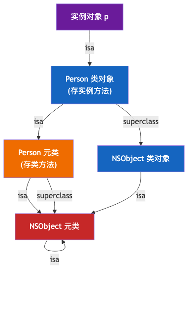
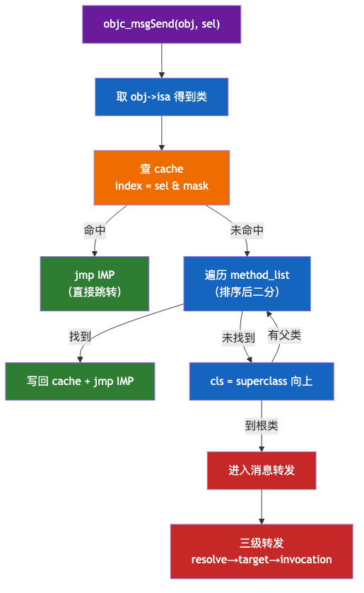
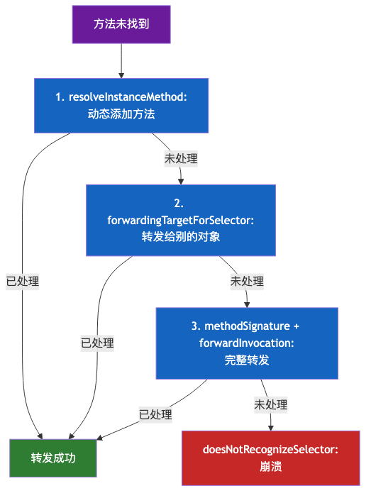
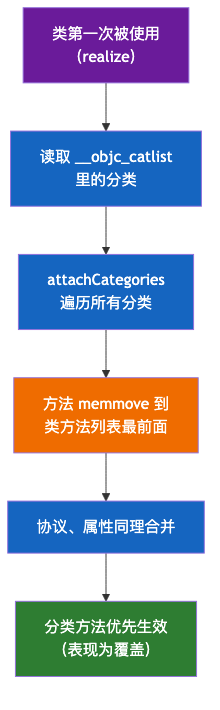

# 02. 类的底层分析

> 本文从 `objc_class` 的存储结构出发，精确到**字节偏移与位域划分**，逐字段拆解 isa / superclass / cache / bits / ro / rw，进而讲清方法调用（含汇编级 cache 查找）、协议、分类、扩展的底层机制。回答一个核心问题：**一个 OC 类在内存里到底长什么样？方法怎么被找到并执行？协议 / 分类 / 扩展各自如何存储与生效？**

## 目录

- [一、类的存储结构分析](#一类的存储结构分析)
- [二、方法调用的原理](#二方法调用的原理)
- [三、协议的存储结构分析](#三协议的存储结构分析)
- [四、分类的存储结构分析](#四分类的存储结构分析)
- [五、扩展的存储结构分析](#五扩展的存储结构分析)
- [附：高频速记](#附高频速记)

---

## 一、类的存储结构分析

### 1. 从 objc_object 到 objc_class

先看一切对象的根——`objc_object`。它极简，只有一个成员：

```c
// objc-runtime-new.h（精简）
struct objc_object {
private:
    isa_t isa;                    // 8 字节：指向类/元类
};
```

- 任何 OC 对象（实例、类）在运行时都是 `objc_object` 的化身，第一块内存就是 isa；
- `objc_object` 只回答一个问题：「我是什么类型」——答案就在 isa 指向的类里；
- **实例对象 = objc_object + 实例变量**；**类对象 = objc_object + superclass/cache/bits**。

而 `objc_class` 继承自 `objc_object`——这正是 OC 最精妙的设计：**「类」本身也是一个对象**。它先有 isa，再多出三个字段：

```c
struct objc_class : objc_object {
    Class superclass;             // 8 字节：父类
    cache_t cache;                // 16 字节：方法缓存
    class_data_bits_t bits;       // 8 字节：类数据入口
    // 总大小 = 8(isa) + 8 + 16 + 8 = 40 字节
};
```

精确到字节的内存布局：

```text
objc_class 内存布局（共 40 字节）
offset 0   ┌──────────────┐
           │     isa      │  8B  指向元类（继承自 objc_object）
offset 8   ├──────────────┤
           │  superclass  │  8B  父类指针
offset 16  ├──────────────┤
           │    cache     │  16B 方法缓存
           │ _buckets 8B  │       ← 哈希桶数组指针
           │ _mask     4B │       ← 桶数 - 1
           │ _occupied 4B │       ← 已占用桶数
offset 32  ├──────────────┤
           │     bits     │  8B  类数据入口（class_data_bits_t）
offset 40  └──────────────┘
```

> 关键认知：**类的「方法 / 属性 / 协议」都不直接挂在 objc_class 上**，而是通过 `bits` 间接访问一份独立的 `class_rw_t`。这个间接层是理解整个类结构的钥匙。

### 2. isa：非指针化的位域

64 位下，isa 不是单纯的类指针，而是一个**位域联合体 `isa_t`**，把类指针、引用计数、对象标志位打包进一个 64 位整数：

```c
union isa_t {
    uintptr_t bits;   // 原始 64 位
    struct {
        uintptr_t nonpointer        : 1;   // 0=纯指针，1=非指针 isa
        uintptr_t has_assoc         : 1;   // 是否有关联对象
        uintptr_t has_cxx_dtor      : 1;   // 是否有 C++ 析构函数
        uintptr_t shiftcls          : 33;  // 类指针（右移 3 位存储，故 33 位可存完整 64 位地址）
        uintptr_t magic             : 6;   // 调试校验用
        uintptr_t weakly_referenced : 1;   // 是否被弱引用
        uintptr_t deallocating      : 1;   // 是否正在释放
        uintptr_t has_sidetable_rc  : 1;   // 引用计数是否在侧表
        uintptr_t extra_rc          : 19;  // 内联引用计数（减 1 后的值）
    };
};
```

```text
isa_t 位域划分（64 位，从低位到高位）
┌────────────┬────────┬────┬──────┬────────────┬─────┬────┬────┐
│ extra_rc   │sidetab │deal│ weak │   magic    │shift│has │non │
│   19 位    │ 1 位   │1位 │ 1 位 │   6 位     │cls  │... │ptr │
│            │        │    │      │            │33位 │ 3位│1位 │
└────────────┴────────┴────┴──────┴────────────┴─────┴────┴────┘
```

三个设计点（为什么这么设计）：

1. **shiftcls 只有 33 位却存得下类地址**：因为对象/类都 8 字节对齐，低 3 位恒为 0，存的时候右移 3 位，取的时候左移 3 位还原——**省 3 位给标志位**；
2. **extra_rc 19 位**：能存 0~~524287，即引用计数 1~~524288，绝大多数对象计数很小，直接内联，**免去 SideTable 哈希查找**；
3. **nonpointer 标志**：区分「纯指针 isa」（旧时代，直接存类地址）和「非指针 isa」（现代，位域打包），运行时据此走不同分支。

### 3. superclass 与继承链

`superclass` 指向父类，构成**继承链**。它与 isa 链是两条不同的链，常被混淆：

| 链                | 走向                    | 用途                          |
| ---------------- | --------------------- | --------------------------- |
| **isa 链**        | 实例 → 类 → 元类 → 根元类     | 决定「是什么类型」，是方法查找的**起点**      |
| **superclass 链** | 类 → 父类 → … → NSObject | 方法查找的**上升路径**（当前类找不到就沿此链向上） |

方法查找时：先沿 isa 找到类，再沿 superclass 链逐级向上，直到找到方法或到根类。

### 4. cache：方法缓存 cache_t

每个类带一个 `cache`，缓存「最近调用过的方法」，是 `SEL → IMP` 的**哈希表**：

```c
struct cache_t {
    struct bucket_t *_buckets;  // 哈希桶数组指针（8 字节）
    mask_t _mask;               // 桶数 - 1（4 字节，桶数恒为 2 的幂）
    mask_t _occupied;           // 已占用桶数（4 字节）
};

struct bucket_t {
    SEL _sel;   // 选择器
    IMP _imp;   // 函数指针
};
```

> **SEL 与 IMP 是什么**（详解见 1.8）：
>
> - **SEL（选择器）**：方法名的「代号」，本质是方法名字符串的哈希值，全局唯一。`@selector(foo)` 得到的就是 SEL；
> - **IMP（实现）**：方法实现的「函数指针」，指向真正的机器码。cache 存的 `SEL → IMP` 映射，就是「从方法名快速定位实现地址」。

**哈希算法**（为什么快）：

```text
index = (uintptr_t)sel & _mask
```

- `_mask` = 桶数 - 1，桶数恒为 **2 的幂**（初始 4，扩容 ×2），因此「取模」可优化为「与运算」，一条指令完成；
- **冲突处理用线性探测**：算出的 index 被占且 SEL 不匹配，就 `index = (index + 1) & mask` 向后找，直到命中或遇空桶；
- **扩容**：`_occupied` 达到 `3/4 × 桶数` 时扩容（桶数 ×2），**旧缓存全部丢弃**、重新填充——因为缓存只是「加速器」，丢了不影响正确性，只影响性能。

> **为什么方法缓存可以随意丢弃**：cache 里永远是「可重建」的数据（方法查找的结果可随时重算），所以扩容、清空都无副作用。这是它和「对象数据」的本质区别。

### 5. bits：类数据的入口

`bits` 的类型是 `class_data_bits_t`，它**不是普通指针，而是用 64 位整数的位域存指针**：

```c
class_data_bits_t {
    uintptr_t bits;   // 高 47 位存 class_rw_t*，低 3 位存标志位
};
```

```text
bits（64 位）
├── 低 3 位：FAST_FLAG_MASK（isMetaClass / isSwiftStable 等标志）
└── 高 47 位：class_rw_t* 指针（用 FAST_DATA_MASK = 0x00007ffffffffff8 取出）
```

**为什么用位域存指针**：

1. **省内存**：OC 类数量巨大，若每个类单独再挂一个「是否元类」的 bool 字段，累积开销可观；直接复用指针低 3 位（8 字节对齐下本就闲置），零额外成本；
2. **访问方式统一**：`class_rw_t *rw = (class_rw_t *)(bits & FAST_DATA_MASK)`，一行取出。

### 6. class_ro_t：编译期的只读数据

`class_ro_t`（**r**ead-**o**nly）是**编译期生成**的类数据，写死在 Mach-O 的 `__TEXT` 段（只读）：

```c
struct class_ro_t {
    uint32_t flags;                     // 类标志
    uint32_t instanceStart;             // 实例起始偏移
    uint32_t instanceSize;              // 对象大小（alloc 分配多少内存的依据）
    const char *name;                   // 类名
    method_list_t *baseMethodList;      // 编译期写死的方法
    protocol_list_t *baseProtocols;     // 编译期声明的协议
    const ivar_list_t *ivars;           // 实例变量（含偏移量）
    property_list_t *baseProperties;    // 属性
};
```

- 放 `__TEXT` 只读段：**多进程共享、系统可去重**——所有 App 里相同的系统类，ro 数据在内存里只有一份；
- `instanceSize` 是对象大小的唯一依据，`alloc` 时靠它 `calloc(1, instanceSize)`；
- 关键：**ro 里的数据编译期就「冻结」了**，运行时改类（Category、动态添加）不会动它。

### 7. class_rw_t：运行时的可变数据

`class_rw_t`（**r**ead-**w**rite）是**运行时生成**的可写数据，放 `__DATA` 段：

```c
struct class_rw_t {
    const class_ro_t *ro;        // 指向只读数据
    method_array_t methods;      // 方法（二维数组，见下）
    property_array_t properties;
    protocol_array_t protocols;
    Class firstSubclass;         // 第一个子类（用于子类遍历）
    Class nextSiblingClass;      // 兄弟类（构成类树）
};
```

```text
class_rw_t（可写，__DATA 段）
├── ro ──────→ class_ro_t（只读，__TEXT 段）
├── methods   ← 运行时新增的方法（Category 合并到这里）
├── properties
├── protocols
└── firstSubclass / nextSiblingClass  ← 构成类树，支持「遍历所有类」
```

**ro/rw 分层的设计意图**：

1. **省内存**：编译期确定的数据放 ro（只读、共享、可去重），每个类只需一份 rw；
2. **支持动态性**：Category、运行时改类都作用在 rw 上，不碰只读的 ro；
3. **类树结构**：rw 里的 firstSubclass/nextSiblingClass 把所有类串成一棵树，`objc_getClassList` 就是遍历这棵树。

**methods 为什么是二维数组**：`method_array_t` 本质是「`method_list_t` 的数组」。原因是 Category 追加方法时，直接在数组**末尾 append 一个新的 method_list_t**，无需搬移已有数据（memmove 只在合并那一刻发生一次）。

```text
method_array_t
┌─────────────────────┐
│ list[0]：本类方法    │  ← 编译期的 baseMethodList
│ list[1]：分类A方法   │  ← 运行时 append 进来的
│ list[2]：分类B方法   │
└─────────────────────┘
```

> 一句话：**ro 负责「编译期写死的部分」，rw 负责「运行期可变的部分」**，二者通过 `ro` 指针连接，各司其职。

### 8. method_t：方法的最小单元

无论 ro 还是 rw，方法最终都存成 `method_t`：

```c
struct method_t {
    SEL name;              // 方法名（选择器）
    const char *types;     // 类型编码（参数 + 返回值）
    IMP imp;               // 函数指针（方法实现）
};
```

三个字段的含义与底层：

| 字段      | 类型       | 底层含义                         |
| ------- | -------- | ---------------------------- |
| `name`  | `SEL`    | 选择器，本质是**方法名字符串的哈希值**，全局唯一   |
| `types` | `char *` | Type Encoding 编码串，描述参数和返回值类型 |
| `imp`   | `IMP`    | 函数指针，指向方法实现的机器码              |

**SEL 的实现**：`SEL` 是 `objc_selector` 的指针，底层通过 `sel_registerName` 把字符串哈希映射到全局唯一的 SEL。两个不同方法只要名字相同，SEL 就相同（这决定了 OC 无法「同名不同参」重载）。

**Type Encoding**：`types` 是一串字符，编码了「返回值 + self + \_cmd + 所有参数」的类型：

```objc
- (int)add:(int)a to:(int)b;
// types = "i24@0:8i16i20"
//   i   = 返回 int
//   24  = 参数总字节数
//   @0  = 第 0 个参数 self（偏移 0）
//   :8  = 第 1 个参数 _cmd（偏移 8）
//   i16 = 第 2 个参数 a（偏移 16）
//   i20 = 第 3 个参数 b（偏移 20）
```

常用 Type Encoding 对照：

| 编码   | 类型    | 编码              | 类型     |
| ---- | ----- | --------------- | ------ |
| `@`  | 对象    | `i`             | int    |
| `:`  | SEL   | `f`             | float  |
| `v`  | void  | `d`             | double |
| `^`  | 指针    | `B`             | bool   |
| `@?` | block | `{CGRect=dddd}` | 结构体    |

> types 是消息转发的「签名」来源：`methodSignatureForSelector` 靠它构造 `NSMethodSignature`。

### 9. property_t 与 ivar_t

**property_t（属性描述）**：属性是「编译器语法糖」，最终生成 getter/setter 方法 + 一个 ivar。运行时用 `property_t` 记录属性的元信息：

```c
struct property_t {
    const char *name;         // 属性名
    const char *attributes;   // 特性编码串
};
```

attributes 编码串示例：

```objc
@property (nonatomic, copy) NSString *name;
// attributes = "T@\"NSString\",C,N,V_name"
//   T@\"NSString\" = 类型
//   C             = copy
//   N             = nonatomic
//   V_name        = 对应的 ivar 名
```

**ivar_t（实例变量）**：ivar 是对象内存里真实的一块，靠**偏移量**访问：

```c
struct ivar_t {
    int32_t *offset;      // 偏移量（相对对象首地址）
    const char *name;
    const char *type;
    uint32_t alignment;
    uint32_t size;
};
```

> 属性 vs ivar：**属性（property）是接口层概念**（自动生成 getter/setter + ivar），**ivar 是内存层概念**（对象里真实的一块存储）。`instanceSize` = isa + 所有 ivar 按 16 字节对齐的结果。

### 10. 类对象与元类（闭环收束）

把所有字段串起来，一个类的完整形态：



```text
实例对象 p ──isa──▶ Person 类对象 ──isa──▶ Person 元类
                       │                        │
                       │ superclass             │ superclass
                       ▼                        ▼
                   NSObject 类对象 ──isa──▶ NSObject 元类 ──isa──▶ 自己（闭环）
```

- 实例方法在**类对象**的 rw/ro 里，类方法在**元类**的 rw/ro 里；
- 对象靠 isa 找类，类靠 bits 找数据，数据里的 method_t 就是方法；
- **为什么类方法在元类**：类也是对象，`[Person foo]` 与 `[p foo]` 走同一套查找逻辑——先从对象找「类」，再从「类」里找方法；而「类对象的类」就是元类。一套机制同时服务实例方法和类方法。

---

## 二、方法调用的原理

`[obj foo]` 编译后不是函数调用，而是 `objc_msgSend(obj, @selector(foo))`——**给对象发一条消息**。查找分「快速」和「慢速」两条路径。

### 1. objc_msgSend 的汇编入口

`objc_msgSend` 是用**汇编**手写的（为了极致性能，不走 C 函数调用栈）。ARM64 下的流程：

```asm
// ARM64 伪汇编（objc-msg-arm64.s 的精简）
_objc_msgSend:
    cmp   x0, #0            ; obj == nil ?
    b.le  LReturnZero       ; nil 则直接返回 0（不崩溃）
    ldr   x13, [x0]         ; x13 = obj->isa（取类）
    and   x16, x13, #ISA_MASK  ; 剥离标志位，得到类指针
LGetIsaDone:
    ldr   x11, [x16, #CACHE]   ; x11 = class->cache._buckets
    and   x12, x1, x11          ; 计算哈希 index = sel & mask
    ...
    ; 命中 → 直接 jmp imp；未命中 → 调用 C 函数 _objc_msgSend_uncached
```

**为什么用汇编**：

1. **省掉函数调用开销**：`objc_msgSend` 是「尾调用」，找到 IMP 后直接 `jmp`，不经过一次额外的函数调用/返回；
2. **寄存器约定**：x0 传 obj、x1 传 sel，命中后 IMP 的调用仍复用这套寄存器（x0=obj 正好是方法里的 self），无缝衔接。

### 2. 快速路径：cache 命中

绝大多数方法调用只走这一步。cache 查找的完整逻辑：

```text
objc_msgSend 快速路径：
  1. 取 obj->isa，剥离标志位得类
  2. 取 class->cache._buckets 和 _mask
  3. index = (uintptr_t)sel & mask         ← 与运算定位桶
  4. bucket = buckets[index]
  5. bucket.sel == sel ?
        命中 → 直接 jmp bucket.imp
        未命中 → 线性探测：index = (index+1) & mask，回到第 4 步
  6. 探测遇空桶 → 确认未缓存，转慢速路径
```

**为什么快**：哈希 + 与运算，几条汇编指令完成；命中即拿到函数指针直接跳转，不经过任何函数调用栈。cache 是「动态派发高性能」的根基。

### 3. 慢速路径：lookUpImpOrForward

cache 未命中时，进入 C 函数 `lookUpImpOrForward` 慢速查找：

```text
lookUpImpOrForward(cls, sel)：
  1. 遍历当前类的 method_list
       - 列表已排序 → 二分查找
       - 未排序   → 线性查找，查完顺便排序（下次可二分）
  2. 找到 → 写入 cache → 返回 IMP
  3. 没找到 → cls = cls->superclass，回到第 1 步（沿继承链向上）
  4. 直到根类（NSObject）还没有 → 进入消息转发
```

三个值得注意的细节：

- **首次查找后排序**：方法列表线性查过一次后就排序，后续可二分，加速慢速路径（方法列表编译期无序，运行时懒排序）；
- **写回当前类 cache**：沿继承链找到的方法，写回**发起调用的类**的 cache（不是祖先类），下次直接命中；
- **完整查找流程**见下图：



### 4. 三级消息转发

整个继承链都找不到方法时，OC 不立即崩溃，而是给三次「补救」机会，一次比一次重：



```text
1. resolveInstanceMethod:        动态「造」一个方法补上（最轻，方法级）
2. forwardingTargetForSelector:  把消息「转手」给别的对象（较快，对象级）
3. forwardInvocation:            完整转发，可改参数、可广播多目标（最重，调用级）
   都未处理 → doesNotRecognizeSelector: → 崩溃
```

| 机制                            | 粒度  | 代价 | 典型用途                             |
| ----------------------------- | --- | -- | -------------------------------- |
| `resolveInstanceMethod`       | 方法级 | 低  | 动态补 `@dynamic` 属性的 getter/setter |
| `forwardingTargetForSelector` | 对象级 | 中  | 把消息转给组合对象（代理模式）                  |
| `forwardInvocation`           | 调用级 | 高  | 完整拦截，改参数、广播多目标                   |

> 从「方法」到「对象」到「整个调用」，粒度逐步放大、代价逐步升高。选哪一步取决于你要控制的层级。

### 5. super 调用的特殊处理

`[super foo]` 编译成 `objc_msgSendSuper`，而不是 `objc_msgSend`：

```c
struct objc_super {
    id receiver;        // 消息接收者（仍是 self）
    Class super_class;  // 指定从哪个父类开始查找
};
```

区别在于**查找起点**：`objc_msgSend` 从「当前对象的类」开始查；`objc_msgSendSuper` 从「父类」开始查。**接收者仍是 self**——所以 `[super foo]` 里调用到的 `self` 还是当前对象，只是方法的查找跳过了当前类。

> 这是「多态重写」能正确工作的基础：子类重写方法后调 `[super foo]`，能精确找到父类实现，而不是递归调用自己。

---

## 三、协议的存储结构分析

协议在 OC 里**不绑定实现**，它只是一份「方法签名清单」——规定「遵守者必须/可选实现哪些方法」，实现交给遵守者。

### 1. protocol_t 完整结构

```c
struct protocol_t {
    const char *mangledName;                        // 协议名
    struct protocol_list_t *protocols;              // 继承的协议
    method_list_t *instanceMethods;                 // required 实例方法
    method_list_t *classMethods;                    // required 类方法
    method_list_t *optionalInstanceMethods;         // optional 实例方法
    method_list_t *optionalClassMethods;            // optional 类方法
    property_list_t *instanceProperties;            // 协议属性
    uint32_t size;
    uint32_t flags;
    const char **_extendedMethodTypes;              // 方法类型编码
    const char *_demangledName;
    property_list_t *_classProperties;              // 类属性
};
```

关键点：协议里的方法同样是 `method_t`，但**只有 SEL + Type Encoding，没有 IMP**——因为「谁遵守谁实现」，实现要等具体的类来填。

### 2. 存储位置

- 协议编译后写进 Mach-O 的 `__DATA,__objc_protolist` section；
- 遵守协议的类，其 `class_rw_t.protocols` 存一份**协议引用**（`protocol_ref_t`），运行时按需解析出完整 `protocol_t`；
- 系统在启动时会把 `__objc_protolist` 里的所有协议**注册进一个全局哈希表**（`protocol_map`），按协议名查找。

### 3. conformsToProtocol 的查找

`[obj conformsToProtocol:@protocol(P)]` 判断对象是否遵守某协议：

```text
conformsToProtocol(P)：
  1. 沿 isa 找到类
  2. 查当前类的 class_rw_t.protocols 列表（含 required/optional）
  3. 没找到 → 沿 superclass 链向上查父类
  4. 直到根类，找到则返回 YES，否则 NO
```

> 协议查找走 **superclass 链**（与继承一致），且协议列表里同时含「直接遵守」和「继承来的」协议。

---

## 四、分类的存储结构分析

Category 是「在不改原类源码的前提下，给类**追加**方法 / 属性声明 / 协议」。核心机制是**运行时合并**。

### 1. category_t 结构

```c
struct category_t {
    const char *name;                                // 分类名
    classref_t cls;                                  // 目标类
    struct method_list_t *instanceMethods;           // 追加的实例方法
    struct method_list_t *classMethods;              // 追加的类方法
    struct protocol_list_t *protocols;               // 追加的协议
    struct property_list_t *instanceProperties;      // 追加的属性（只声明，不生成 ivar）
};
```

分类编译后存 Mach-O 的 `__DATA,__objc_catlist` section，运行时被读取并合并。

### 2. attachCategories 合并机制

类**第一次被使用**（realize）时，Runtime 把该类的所有分类合并进类：



```text
attachCategories(cls, cats)：
  1. 遍历该类的所有 Category
  2. 把每个 Category 的方法 memmove 到【类方法列表的最前面】
  3. 协议、属性同理合并
```

```text
合并前：类方法列表 = [原始方法A, 原始方法B]
合并后：类方法列表 = [分类方法X, 分类方法Y, 原始方法A, 原始方法B]
                     ↑ 分类方法插到最前面
```

注意合并用的是 **memmove**（而非 memcpy）：因为是在同一块内存里「把原方法往后挪、腾出头部空间」，源和目标区域重叠，memmove 才能正确处理重叠拷贝。

### 3. 由此推出的三个结论

1. **分类方法会「覆盖」原方法**：插在头部，查找时先命中分类方法（本质是覆盖查找优先级，原实现仍在内存里）；
2. **多个分类同名方法，编译顺序靠后的生效**：后合并的分类插到更前面；
3. **分类不能加实例变量**：对象的 `instanceSize` 在编译期由 `class_ro_t` 定死，运行时加 ivar 会破坏已分配对象的内存布局。

### 4. 关联对象：分类「加属性」的替代方案

分类里声明 `@property` 只会生成 getter/setter **声明**，不生成 ivar 也不合成实现。要真正「给对象附加数据」，用**关联对象**：

```objc
objc_setAssociatedObject(obj, key, value, OBJC_ASSOCIATION_RETAIN);
```

底层是一个**全局的 AssociationsManager 哈希表**，二级映射：

```text
AssociationsManager（全局）
  └── AssociationsHashMap（一级：对象地址 → ObjectAssociationMap）
        └── ObjectAssociationMap（二级：key → value + 关联策略）
```

- 关联数据**不占对象自身内存布局**，对象 dealloc 时 `object_dispose` 会统一清理；
- 关联策略 `OBJC_ASSOCIATION_RETAIN/COPY/ASSIGN` 决定 value 的持有方式（retain/copy/assign）。

> 所以「分类加属性」的真相：**属性声明在分类里，数据存储在全局哈希表里**，通过关联对象读写，与对象本身的 ivar 无关。

---

## 五、扩展的存储结构分析

Extension（类扩展）常被误当成「匿名分类」，但二者的底层机制**完全不同**。

### 1. Extension 的本质：编译期的匿名分类

```objc
// Person.m 里
@interface Person ()          // Extension：类名后跟空括号
@property (nonatomic, strong) NSString *secretName;  // 可加私有属性
- (void)privateMethod;        // 可声明私有方法
@end
```

它长得像匿名 Category，但**在编译期就被合并进类的正式数据里**，运行时不存在「合并」这一步。

### 2. Extension 与 Category 的本质区别

| 维度       | Category                  | Extension                         |
| -------- | ------------------------- | --------------------------------- |
| 合并时机     | **运行时** attachCategories  | **编译期**直接合并                       |
| 能否加 ivar | ❌（instanceSize 已定死）       | ✅（编译期并入，instanceSize 可算）          |
| 属性能否自动合成 | ❌（需关联对象）                  | ✅（编译器自动生成 ivar + getter/setter）   |
| 是否需要类源码  | 否（可扩系统类）                  | 是（必须写在类的 .m 里）                    |
| 存储位置     | `__objc_catlist` → 合并进 rw | 直接进 ro 的 ivars/methods/properties |

### 3. Extension 的存储与生效

因为发生在编译期，Extension 里声明的方法和属性，最终都写进**该类的 `class_ro_t`**（`baseMethodList` / `baseProperties` / `ivars`），和类原本定义的方法属性**没有区别**——运行时根本感知不到「这是扩展加的」。

> 一句话区分：**Category 是「运行时给类打补丁」，Extension 是「编译期把私有成员写进类」**。前者能动态覆盖、能扩系统类但不能加 ivar；后者能加 ivar、能自动合成属性，但必须看到类源码。

---

## 附：高频速记

- **类也是对象**：`objc_class` 继承 `objc_object`，有 isa。
- **objc_class 40 字节**：isa(8) + superclass(8) + cache(16) + bits(8)。
- **isa 位域**：shiftcls 33 位（右移 3 位省 3 位）+ extra_rc 19 位（内联引用计数）。
- **bits 用位域存指针**：高 47 位存 `class_rw_t*`，低 3 位存标志位。
- **ro/rw 分层**：ro 存编译期只读数据（`__TEXT` 共享），rw 存运行时可变数据（支持 Category/动态添加）。
- **method_t** = SEL（名字哈希）+ types（类型编码）+ IMP（函数指针）。
- **方法调用**：objc_msgSend 汇编 → cache 哈希快查（`sel & mask`）→ method_list 慢查（排序后二分）+ 继承链 → 三级转发。
- **三级转发**：方法级 resolve → 对象级 forwardingTarget → 调用级 forwardInvocation。
- **协议**：`protocol_t` 存方法签名（无 IMP），存 `__objc_protolist`，`conformsToProtocol` 沿 superclass 链查。
- **分类**：`category_t` 运行时 `attachCategories` 头部插入（memmove），不能加 ivar（用关联对象）。
- **扩展**：编译期匿名分类，直接进 `class_ro_t`，能加 ivar、能自动合成属性，但需类源码。
