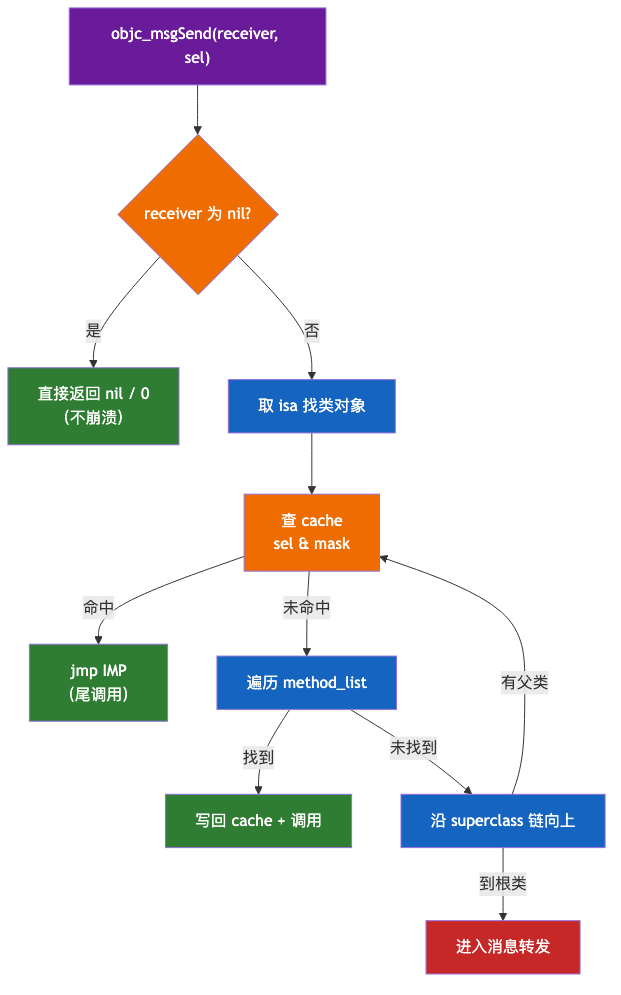
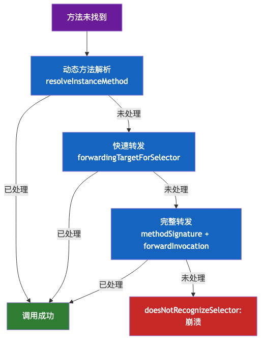
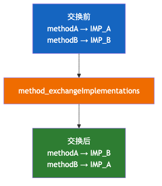
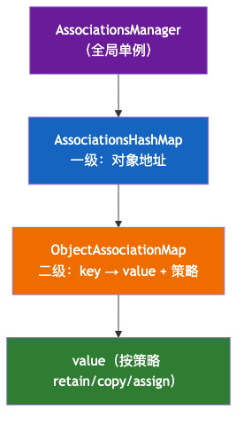

# 03. Runtime 机制分析

> Objective-C Runtime 是一套 C 语言实现的运行时系统，是 OC 一切动态性的根基。本文从「静态绑定 vs 动态绑定」讲起，深入消息发送与转发（含 NSProxy）、Method Swizzling、关联对象、动态创建类、load/initialize、Runtime API 与应用场景，源码级剖析每个机制「怎么实现、为什么这么设计」。存储结构与消息查找的底层细节见《02-类的底层分析》，本文聚焦动态性机制本身。

## 目录

- [一、Runtime 概述：动态性的来源](#一runtime-概述动态性的来源)
- [二、基础知识分析](#二基础知识分析)
- [三、消息发送的 8 步流程](#三消息发送的-8-步流程)
- [四、消息转发机制](#四消息转发机制)
- [五、Method Swizzling 方法交换](#五method-swizzling-方法交换)
- [六、关联对象 Associated Objects](#六关联对象-associated-objects)
- [七、动态创建类](#七动态创建类)
- [八、load 与 initialize](#八load-与-initialize)
- [九、Runtime 常用 API](#九runtime-常用-api)
- [十、应用场景](#十应用场景)
- [附：高频速记](#附高频速记)

---

## 一、Runtime 概述：动态性的来源

### 1. 静态绑定 vs 动态绑定

C/C++ 是**静态绑定**：函数调用的目标地址在**编译期**就写死，运行时直接 `call` 过去。OC 是**动态绑定**：`[obj foo]` 编译后不是「跳到 foo 的地址」，而是「给 obj 发一条名为 foo 的消息」，具体跳到哪里，**运行期才决定**。

| 维度        | 静态绑定（C/C++）    | 动态绑定（OC）              |
| --------- | -------------- | --------------------- |
| 决定时机      | 编译期            | 运行期                   |
| 调用形式      | 直接 `call 函数地址` | `objc_msgSend` 查找 IMP |
| 能否运行时替换实现 | ❌              | ✅（Swizzling / 转发）     |
| 性能        | 快（一次跳转）        | 慢（多一次查找，靠 cache 缓解）   |

> 动态绑定是「以性能换灵活性」的典型：一次查找的开销，换来运行期「随时替换实现、动态加方法、消息转发」的能力。

### 2. Runtime 是什么

Runtime 不是虚拟机，而是**一套用 C 和汇编实现的函数库 + 数据结构**，编译进每个 OC 程序里。它做三件事：

1. **管理对象**：对象的创建、销毁、内存布局（`objc_object`、`isa`）；
2. **分发消息**：`objc_msgSend` 把消息路由到正确的 IMP；
3. **提供反射**：运行期查询类的属性、方法、协议（`class_copyMethodList` 等）。

```c
// Runtime 的两个核心实体
struct objc_object { isa_t isa; };              // 对象
struct objc_class : objc_object { ... };        // 类（详见 02）
```

### 3. 动态性的三大来源

OC 的「动态」体现在三个层面：

```text
┌─────────────────────────────────────────────────┐
│  动态类型：id 类型，变量具体是什么类型运行期才确定   │
│  动态绑定：方法调用 = 消息发送，运行期才找 IMP       │
│  动态加载：运行期可加载/替换类、方法、模块          │
└─────────────────────────────────────────────────┘
```

- **动态类型**：`id obj = ...`，编译器不检查类型，运行期 `isKindOfClass:` 才判断；
- **动态绑定**：`[obj foo]` → `objc_msgSend`，运行期查找（详见 02）；
- **动态加载**：`class_addMethod`、`class_replaceMethod`、Category、动态创建类、`dlopen` 加载 framework。

> 三大动态性共同撑起 OC 的「反射能力」：运行期能查、能改、能替换类的任何成员。

---

## 二、基础知识分析

### 1. objc_msgSend 分析

`[obj foo]` 编译后是 `objc_msgSend`，但针对不同场景有多个变体：

| 函数                   | 场景                    |
| -------------------- | --------------------- |
| `objc_msgSend`       | 普通消息（最常见）             |
| `objc_msgSendSuper`  | `[super foo]`，从父类开始查找 |
| `objc_msgSend_stret` | 返回值为结构体时（走栈返回）        |
| `objc_msgSend_fpret` | 返回浮点（走浮点寄存器）          |

**各自的用法**（多数情况下编译器替你选好了，但手动调用时要懂）：

```objc
// 1. objc_msgSend：手动发消息，等价于 [obj foo]
objc_msgSend(obj, @selector(foo));

//   注意：objc_msgSend 声明返回 id，若方法返回非 id 类型，
//   必须强转成正确签名的函数指针，否则返回值会被当 id 处理而截断
int (*msgSendInt)(id, SEL) = (void *)objc_msgSend;
int age = msgSendInt(obj, @selector(age));

// 2. objc_msgSendSuper：等价于 [super foo]，要构造 objc_super 结构体
struct objc_super super = { self, [SuperClass class] };  // receiver=自己，查找起点=父类
objc_msgSendSuper(&super, @selector(foo));

// 3. objc_msgSend_stret：返回结构体（如 CGRect/NSRange），需强转
CGRect (*msgSendStret)(id, SEL) = (void *)objc_msgSend_stret;
CGRect frame = msgSendStret(obj, @selector(frame));

// 4. objc_msgSend_fpret：返回浮点（double/float）
double (*msgSendFpret)(id, SEL) = (void *)objc_msgSend_fpret;
double w = msgSendFpret(obj, @selector(weight));
```

**几个关键认知**：

1. **为什么要强转函数指针**：`objc_msgSend` 的原型返回 `id`，若实际返回值是 `int`/`double`/结构体，不 cast 直接接会类型错乱（返回寄存器/栈位置不一致）。所以按真实签名 cast 成函数指针再调用；
2. **`stret` 与 `fpret` 是历史遗留**：它们服务于 x86 架构（结构体走栈返回、浮点走 FPU 栈）。**arm64 下统一走寄存器**，`stret`/`fpret` 已废弃，直接用 `objc_msgSend` 即可；
3. **`objc_msgSendSuper` 的 receiver 仍是 self**：`objc_super` 里第一个字段是「消息接收者」（还是自己），第二个字段才是「从哪个父类开始查」。所以 `[super foo]` 里 `self` 没变，只是查找跳过了当前类。

> 这些变体由编译器根据**返回值类型和架构**自动选择，开发者几乎感知不到，但它们的存在说明「消息发送」在底层是高度特化的汇编。

### 2. SEL 分析

**SEL（选择器）**：`typedef struct objc_selector *SEL`，一个不透明指针。它代表「一个方法名」，是消息发送时用来匹配方法的「键」。

**本质：SEL 就是方法名字符串的地址**

- SEL 的值就是方法名 C 字符串的地址，`sel_getName()` 只是把它强转成 `const char *`；
- Runtime 维护一个**全局注册表**（`NXMapTable` 哈希表），保证「同名方法只对应唯一一个 SEL 地址」——所以比较两个 SEL 是否相同，直接用**指针 `==`**，而非字符串比较。

```objc
SEL sel  = @selector(doSomething);
SEL sel2 = sel_registerName("doSomething");   // 与 sel 指向同一个 SEL（指针相同）
BOOL same = (sel == sel2);                    // YES，指针比较即可
```

**为什么用指针比较而非字符串比较**：字符串比较是 O(n) 逐字符比对，指针比较是 O(1) 一条指令。消息查找每秒执行数百万次，这个差异是「消息发送还能这么快」的底层原因之一。

**SEL 的三种生成方式**：

```objc
SEL s1 = @selector(foo);                  // 编译期生成
SEL s2 = sel_registerName("foo");         // 运行期注册
SEL s3 = NSSelectorFromString(@"foo");    // 字符串转 SEL
// 三者指向同一个 SEL
```

**SEL 只含方法名，不含参数类型**——这正是 OC **无法重载**的根源：`doSomething` 和 `doSomething:(int)x` 只要方法名相同，SEL 就相同，Runtime 无法区分。所以 OC 只能靠「方法名 + 参数标签」区分，不能像 C++ 那样同名不同参。

### 3. IMP 分析

**IMP（实现）**：`typedef id (*IMP)(id, SEL, ...)`，一个**函数指针**，指向方法实现的机器码。

**IMP 的固定签名**：前两个参数永远是 `self` 和 `_cmd`，后面才是实际参数：

```objc
// - (int)add:(int)a to:(int)b 对应的 IMP 形态
int addIMP(id self, SEL _cmd, int a, int b) {
    return a + b;
}
```

**获取 IMP 的三种方式**：

```objc
// 1. 从方法取
Method m = class_getInstanceMethod(cls, @selector(foo));
IMP imp1 = method_getImplementation(m);

// 2. 对象直接取（走 cache 快速路径）
IMP imp2 = [obj methodForSelector:@selector(foo)];

// 3. 类方法取（会触发动态解析/转发）
IMP imp3 = class_getMethodImplementation(cls, @selector(foo));
```

**直接调用 IMP，绕过消息发送**：

```objc
IMP imp = [obj methodForSelector:@selector(doSomething)];
imp(obj, @selector(doSomething));   // 直接调用，省去 cache 查找与转发
```

> 但这绕过 cache 和转发，只适用于「确定方法存在、且追求极致性能」的罕见场景（如渲染循环内的高频调用）。

**IMP 与 SEL 的关系**：SEL 是「方法名」，IMP 是「方法体」。同一个 SEL 在不同类里对应**不同的 IMP**——这正是**多态**的本质：`@selector(eat)` 在 `Dog` 和 `Cat` 里是不同的 IMP，`objc_msgSend` 根据接收者类型找到各自的实现。Method Swizzling 交换的也正是这个 IMP（见第五章）。

---

## 三、消息发送的 8 步流程

一条消息从发出到找到实现（或进入转发），完整路径：



{width="414"}

**第 1 步：nil 检查**

`objc_msgSend` 汇编入口第一步判断 receiver 是否为 nil：

```asm
cmp   x0, #0          ; x0 是 receiver，与 0 比较
b.le  LReturnZero     ; 小于等于 0（即 nil）→ 跳到返回
```

OC 允许「给 nil 发消息」——直接返回 0 / nil，**不崩溃**。这是 OC 与 C++/Java 的显著区别，省去大量判空。返回值按类型处理：对象返回 nil，数值返回 0，结构体返回全零。

> 这也是 `objc_msgSend` 要用汇编手写的原因之一：C 函数无法优雅地对 nil 做特殊处理并直接返回。

**第 2 步：取 isa 找类**

receiver 第一个字段就是 isa，直接读 `receiver->isa` 拿到类：

```c
struct objc_object {
    isa_t isa;   // 对象第一块内存，8 字节
};
```

```asm
ldr   x13, [x0]            ; x13 = obj->isa（读第一个字段）
and   x16, x13, #ISA_MASK  ; 剥离 nonpointer 标志位，得到类指针
```

64 位下 isa 是「非指针 isa」——低 3 位存标志位，高位存类指针，所以要 `& ISA_MASK` 剥离标志位（详见《02-类的底层分析》第一章）。

**第 3 步：查 cache**

每个类有方法缓存 `cache_t`，是 `SEL → IMP` 的哈希表：

```c
struct cache_t {
    struct bucket_t *_buckets;  // 哈希桶数组
    mask_t _mask;               // 桶数 - 1（恒为 2 的幂）
    mask_t _occupied;           // 已占用桶数
};

struct bucket_t {
    SEL _sel;   // key：选择器
    IMP _imp;   // value：实现
};
```

查找过程——**与运算定位 + 线性探测**：

```c
// 1. 用 selector 和 _mask 做位与运算得到索引（桶数为 2 的幂，& 比 % 快）
mask_t index = (mask_t)(sel & cache->_mask);

// 2. 定位桶，比对 SEL
bucket_t *bucket = cache->_buckets + index;
if (bucket->_sel == sel) return bucket->_imp;   // 命中

// 3. 未命中则线性探测：向后逐个找，直到命中或遇空桶
while (bucket->_sel != 0) {                     // 0 表示空桶
    index = (index + 1) & cache->_mask;
    bucket = cache->_buckets + index;
    if (bucket->_sel == sel) return bucket->_imp;
}
```

先查缓存——因为绝大多数调用是「重复调用」，命中率极高。哈希用 `sel & mask`（与运算代替取模，一条指令完成）。

**第 4 步：命中即调用**

命中直接拿到 IMP，`jmp` 跳转（尾调用）：

```asm
br    x17    ; x17 = bucket->_imp，直接跳转到实现
```

尾调用不压函数栈、无返回开销——`objc_msgSend` 找到实现后直接 `jmp` 过去，实现执行完 `ret` 直接回到最初的调用者，中间不经过 objc_msgSend 的返回。

**第 5 步：未命中查 method_list**

缓存未命中，遍历类的方法列表 `method_list`：

```c
struct method_list_t {
    uint32_t entsizeAndFlags;   // 低位存 flags（是否已排序）
    uint32_t count;             // 方法数量
    struct method_t first;      // 方法数组首元素
};

struct method_t {
    SEL name;          // 方法名
    const char *types; // 类型编码
    IMP imp;           // 实现
};
```

查找策略——**排序后二分**：

```c
// 1. 检查 flags 是否已排序
if (!isSorted(list)) {
    sortMethodList(list);   // 未排序则线性查找，查完顺便排序
}
// 2. 已排序 → 二分查找（O(log n)）
method_t *found = findMethodInSortedList(list, sel);
```

未排序时线性查（O(n)），查完顺便排序（下次可二分）；已排序则二分（O(log n)）。

**第 6 步：找到写回 cache**

找到后把 `SEL → IMP` 写回**当前类**的 cache：

```c
// cache_fill 的简化逻辑
static void cache_fill(Class cls, SEL sel, IMP imp) {
    bucket_t *bucket = findEmptyBucket(cls->cache);  // 找空桶
    bucket->_sel = sel;
    bucket->_imp = imp;
    cls->cache._occupied++;
    // 占用超 3/4 则扩容（桶数 ×2，旧缓存清空）
}
```

下次同样调用直接命中，不用再走慢速查找。

**第 7 步：沿 superclass 链向上**

当前类没找到，就查父类：

```c
Class cls = object_getClass(obj);
while (cls) {
    // 在 cls 上重复第 3~6 步（查 cache → 查 method_list）
    IMP imp = lookUpInClass(cls, sel);
    if (imp) return imp;
    cls = cls->superclass;   // 沿 superclass 链向上
}
```

直到根类 NSObject（`superclass` 为 nil）还没找到，进入第 8 步。

**第 8 步：进入消息转发**

整个继承链都没有，进入消息转发三阶段（详见第四章）。

> 完整的汇编级 objc_msgSend 实现见《02-类的底层分析》第二章，这里展示的是每一步对应的数据结构与查找过程。

---

## 四、消息转发机制

消息转发不是「出了 bug 再补救」的容错手段，而是 Runtime **有意提供的扩展点**，三个阶段各有明确的用途。

### 1. 三阶段总览

| 阶段     | 方法                                                   | 设计用途                          |
| ------ | ---------------------------------------------------- | ----------------------------- |
| 动态方法解析 | `resolveInstanceMethod:` / `resolveClassMethod:`     | 动态生成方法（如 CoreData `@dynamic`） |
| 快速转发   | `forwardingTargetForSelector:`                       | 把消息转交给另一个对象（组合/代理）            |
| 完整转发   | `methodSignatureForSelector:` + `forwardInvocation:` | 完全控制调用（多播 / NSUndoManager）    |



```text
方法未找到
  ├─ 1. resolveInstanceMethod: → 动态加方法（YES 则重新发送消息）
  ├─ 2. forwardingTargetForSelector: → 转交给备用对象
  ├─ 3. methodSignatureForSelector: + forwardInvocation: → 完整转发
  └─ 都未处理 → doesNotRecognizeSelector: 崩溃
```

> 三个方法都定义在 `NSObject` 里，默认实现是「不处理」。只有继承自 `NSObject` 才能重写它们。

### 2. 第一阶段：动态方法解析

给类一次「当场补方法」的机会。`resolveInstanceMethod:`（实例方法）/ `resolveClassMethod:`（类方法）被调用时，可以用 `class_addMethod` 动态补上实现：

```objc
+ (BOOL)resolveInstanceMethod:(SEL)sel {
    if (sel == @selector(name)) {
        class_addMethod(self, sel, (IMP)getName, "@@:");
        return YES;   // 返回 YES 后，Runtime 会重新发送消息
    }
    return [super resolveInstanceMethod:sel];
}

id getName(id self, SEL _cmd) { return @"动态实现"; }
```

**`@dynamic` 与 CoreData**：`@property` 默认由编译器自动合成 getter/setter + ivar。声明 `@dynamic` 则告诉编译器「别合成，运行期我自己提供」。典型是 CoreData 的 `NSManagedObject`：

```objc
@interface Person : NSManagedObject
@property (nonatomic, copy) NSString *name;
@end

@implementation Person
@dynamic name;   // NSManagedObject 在继承链上重写了 resolveInstanceMethod:
                 // 运行期把 name 的读写动态映射到 CoreData 存储层
@end
```

> `class_addMethod` 的本质：在 `class_rw_t` 的方法列表里追加一个 `method_t`（详见 02 的 rw 结构）。

### 3. 第二阶段：快速转发

`forwardingTargetForSelector:` 返回一个**备用对象**，Runtime 直接对它执行 `objc_msgSend`。**不创建 NSInvocation**，效率很高。

```objc
- (id)forwardingTargetForSelector:(SEL)aSelector {
    if (aSelector == @selector(someMethod)) {
        return self.anotherObject;   // 让 anotherObject 处理这个消息
    }
    return [super forwardingTargetForSelector:aSelector];
}
```

**四项限制**：

1. 返回的备用对象**不能是 self**；
2. **无法修改参数或返回值**；
3. **无法把一条消息转发给多个对象**；
4. 备用对象必须能响应该消息。

**典型应用——组合模式**：自己不处理的消息，全部转交给内部对象：

```objc
@interface TeamLeader : NSObject
@property (nonatomic, strong) Coder *coder;
@end
@implementation TeamLeader
- (id)forwardingTargetForSelector:(SEL)aSelector {
    if ([self.coder respondsToSelector:aSelector]) {
        return self.coder;   // 转交给 Coder 处理
    }
    return [super forwardingTargetForSelector:aSelector];
}
@end
```

> 比手写一堆包装方法简洁得多：内部对象方法很多时，一次转发覆盖所有消息。

### 4. 第三阶段：完整转发

前两个阶段都没处理时，进入完整转发，两个方法分工：

- `methodSignatureForSelector:` —— 负责「描述消息长什么样」（返回 NSMethodSignature）；
- `forwardInvocation:` —— 负责「决定消息怎么处理」（拿到 NSInvocation）。

```objc
- (NSMethodSignature *)methodSignatureForSelector:(SEL)aSelector {
    if (aSelector == @selector(someMethod)) {
        return [NSMethodSignature signatureWithObjCTypes:"v@:"];
    }
    return [super methodSignatureForSelector:aSelector];
}

- (void)forwardInvocation:(NSInvocation *)anInvocation {
    SEL sel = [anInvocation selector];
    if ([self.target respondsToSelector:sel]) {
        [anInvocation invokeWithTarget:self.target];
    } else {
        [self doesNotRecognizeSelector:sel];
    }
}
```

**NSInvocation 的能力**（为什么叫「完整」）：

- 读取/修改**每一个参数**（`getArgument:atIndex:` / `setArgument:atIndex:`）；
- **更换目标对象**（`invokeWithTarget:`）；
- **多次调用**，转发给多个对象；
- 调用后**读取返回值**（`getReturnValue:`）。

**三项注意**：

1. 返回的签名必须与实际方法匹配；
2. **签名返回 nil 时，`forwardInvocation:` 不会被调用，直接崩溃**；
3. 性能开销比快速转发大很多（要创建 NSInvocation 并封装所有参数）。

**典型应用——消息日志（LoggingProxy）**：

```objc
- (NSMethodSignature *)methodSignatureForSelector:(SEL)aSelector {
    return [self.realObject methodSignatureForSelector:aSelector];
}
- (void)forwardInvocation:(NSInvocation *)anInvocation {
    NSLog(@"[LOG] 调用: -[%@ %@]", NSStringFromClass([self.realObject class]),
          NSStringFromSelector(anInvocation.selector));
    [anInvocation invokeWithTarget:self.realObject];   // 转发给真实对象
}
```

### 5. NSProxy：更强的转发基类

`NSProxy` 是与 `NSObject` 平级的另一个根类，专为「消息转发」设计：

|      | NSObject                              | NSProxy           |
| ---- | ------------------------------------- | ----------------- |
| 转发流程 | 三阶段（解析→快速→完整）                         | 直接进入完整转发          |
| 基础方法 | 实现了大量方法（`retain`/`isEqual:`/`hash` 等） | 几乎不实现任何方法         |
| 伪装能力 | 弱（内省方法被自身消费，不转发）                      | 强（几乎所有消息都转发给真实对象） |

关键差异——内省方法的转发：

```objc
// NSObject 子类代理：内省方法被自己消费，不转发
[proxyA isKindOfClass:[Dog class]];          // ❌ 返回 NO
[proxyA respondsToSelector:@selector(bark)]; // ❌ 返回 NO

// NSProxy 子类代理：内省也转发给真实对象
[proxyB isKindOfClass:[Dog class]];          // ✅ 转发 → Dog 回答 YES
[proxyB respondsToSelector:@selector(bark)]; // ✅ 转发 → Dog 回答 YES
```

**应用 1：WeakProxy 打破 NSTimer 循环引用**：

```objc
@interface WeakProxy : NSProxy
@property (nonatomic, weak) id target;
+ (instancetype)proxyWithTarget:(id)target;
@end
@implementation WeakProxy
- (NSMethodSignature *)methodSignatureForSelector:(SEL)sel {
    return [self.target methodSignatureForSelector:sel];
}
- (void)forwardInvocation:(NSInvocation *)invocation {
    if (self.target) [invocation invokeWithTarget:self.target];
}
@end

// self -> timer -> proxy --weak--> self，打破循环
self.timer = [NSTimer scheduledTimerWithTimeInterval:1.0
                                              target:[WeakProxy proxyWithTarget:self]
                                            selector:@selector(tick)
                                            userInfo:nil
                                             repeats:YES];
```

**应用 2：多播代理**：

```objc
- (void)forwardInvocation:(NSInvocation *)invocation {
    for (id target in self.targets) {
        if ([target methodSignatureForSelector:invocation.selector]) {
            [invocation invokeWithTarget:target];   // 广播给所有目标
        }
    }
}
```

> **选型**：需要「透明代理」（内省方法表现一致）选 `NSProxy`；只需消息分发、且要加额外逻辑选 `NSObject` 子类。

---

## 五、Method Swizzling 方法交换

Method Swizzling 是 Runtime 最出名的应用：**运行期交换两个方法的实现**，不动源码就能改变方法行为。

### 1. 原理：交换 method_t 里的 IMP

方法在类里存成 `method_t`（`SEL + types + IMP`）。Swizzling 的本质是：**交换两个 method_t 的 IMP 指针**。



```text
交换前：methodA → IMP_A      methodB → IMP_B
交换后：methodA → IMP_B      methodB → IMP_A
```

之后调用 `methodA`，实际执行的是 `IMP_B` 的代码——方法名不变，实现被偷换了。

### 2. 实现与注意点

```objc
@implementation UIViewController (Tracking)

+ (void)load {
    static dispatch_once_t onceToken;
    dispatch_once(&onceToken, ^{
        Class cls = [self class];
        SEL originalSel = @selector(viewWillAppear:);
        SEL swizzledSel = @selector(xxx_viewWillAppear:);

        Method original = class_getInstanceMethod(cls, originalSel);
        Method swizzled = class_getInstanceMethod(cls, swizzledSel);

        // 先尝试给子类添加父类方法（防父类未实现）
        BOOL added = class_addMethod(cls, originalSel,
                                     method_getImplementation(swizzled),
                                     method_getTypeEncoding(swizzled));
        if (added) {
            class_replaceMethod(cls, swizzledSel,
                                method_getImplementation(original),
                                method_getTypeEncoding(original));
        } else {
            method_exchangeImplementations(original, swizzled);
        }
    });
}

- (void)xxx_viewWillAppear:(BOOL)animated {
    [self xxx_viewWillAppear:animated];   // 实际调用原实现
    NSLog(@"埋点：进入 %@", self);
}
@end
```

**四个注意点**（面试高频）：

1. **必须用 `dispatch_once`**：`load` 可能被调用多次（分类重载），Swizzling 只能做一次，否则交换再交换就还原了；
2. **父类未实现时的坑**：如果 `originalSel` 是父类方法（子类没实现），直接 `exchange` 会把子类的 Swizzled 方法换给父类、污染所有子类——所以先用 `class_addMethod` 把父类实现「复制」到子类再换；
3. **交换后调用原实现**：交换后原方法名指向新实现，要在新实现里调「交换后的另一个方法名」（如 `xxx_viewWillAppear:`）来走原逻辑；
4. **命名冲突**：Swizzled 方法加前缀（`xxx_`），避免和别处冲突。

### 3. 应用场景

- **埋点/AOP**：给 `viewWillAppear:` 加统计，不改业务代码；
- **防护**：交换 `NSArray` 的 `objectAtIndex:` 加越界判断（注意类簇，见第十章）；
- **修改系统行为**：交换 `sendAction:to:forEvent:` 做按钮点击拦截。

> Swizzling 是「最后手段」——它改变了全局方法行为，易造成难以排查的 bug。能用继承、协议、Category 解决的，优先不用 Swizzling。

---

## 六、关联对象 Associated Objects

### 1. 为什么需要关联对象

分类（Category）**不能加实例变量**（对象 `instanceSize` 编译期已定死），但分类里可以声明 `@property`——它只生成 getter/setter **声明**，不生成 ivar。要让「分类属性」真正能存数据，靠**关联对象**：把数据挂在对象上，但不占对象自身的内存布局。

```objc
// 分类里
@interface NSObject (MyCategory)
@property (nonatomic, copy) NSString *tag;
@end

@implementation NSObject (MyCategory)
- (void)setTag:(NSString *)tag {
    objc_setAssociatedObject(self, @selector(tag), tag, OBJC_ASSOCIATION_COPY);
}
- (NSString *)tag {
    return objc_getAssociatedObject(self, @selector(tag));
}
@end
```

### 2. 底层实现：全局二级哈希表

关联对象的数据**不存对象里**，而是存在 Runtime 维护的一个**全局哈希表**里：



```text
AssociationsManager（全局单例）
  └── AssociationsHashMap（一级：对象地址 → ObjectAssociationMap）
        └── ObjectAssociationMap（二级：key → value + 策略）
```

- **一级哈希**：以「对象地址」为 key，找到该对象专属的关联表；
- **二级哈希**：以「关联 key」为 key，找到具体的 value 和关联策略；
- **释放时机**：对象 `dealloc` 时，`object_dispose` 检查 isa 里的 `has_assoc` 标志位，为真则清空它的关联对象（按策略 release）。

### 3. API 与关联策略

```objc
objc_setAssociatedObject(id object, const void *key, id value, objc_AssociationPolicy policy);
objc_getAssociatedObject(id object, const void *key);
objc_removeAssociatedObjects(id object);   // 慎用！会清空该对象的所有关联对象
```

关联策略决定 value 的持有方式：

| 策略                                  | 等价修饰符               | 说明            |
| ----------------------------------- | ------------------- | ------------- |
| `OBJC_ASSOCIATION_ASSIGN`           | `assign`            | 不持有，悬垂风险      |
| `OBJC_ASSOCIATION_RETAIN`           | `strong`            | retain 持有（原子） |
| `OBJC_ASSOCIATION_COPY`             | `copy`              | copy 持有（原子）   |
| `OBJC_ASSOCIATION_RETAIN_NONATOMIC` | `strong, nonatomic` | 非原子 retain    |
| `OBJC_ASSOCIATION_COPY_NONATOMIC`   | `copy, nonatomic`   | 非原子 copy      |

> **key 的取值**：用 `@selector(tag)`（唯一且无需额外声明）或 `static` 变量地址，避免用字符串字面量（易拼写错、不唯一）。

---

## 七、动态创建类

Runtime 允许**运行期从零创建一个类**：

```objc
// 1. 创建类（父类 + 类名 + 额外空间）
Class MyClass = objc_allocateClassPair([NSObject class], "MyClass", 0);

// 2. 添加成员变量（必须在注册前！）
class_addIvar(MyClass, "_name", sizeof(NSString *),
              log2(sizeof(NSString *)), @encode(NSString *));

// 3. 添加方法
class_addMethod(MyClass, @selector(sayHello), (IMP)sayHelloIMP, "v@:");

// 4. 注册类（之后才能使用）
objc_registerClassPair(MyClass);

// 5. 使用
id obj = [[MyClass alloc] init];
[obj sayHello];

void sayHelloIMP(id self, SEL _cmd) {
    NSLog(@"Hello from dynamically created class!");
}
```

**关键点**：

1. **成员变量必须在 `objc_registerClassPair` 之前添加**——注册后类的 `instanceSize` 和 ivar 布局就冻结了，不能再加；
2. `objc_disposeClassPair` 销毁类（需先确认没有实例存在）；
3. 动态创建类是 KVO 底层 `NSKVONotifying_` 子类、以及一些热修复框架的实现基础。

---

## 八、load 与 initialize

两个方法都「类加载时自动调用」，但机制完全不同，是面试必考，后面再详细分析：

| 维度   | `+load`            | `+initialize`          |
| ---- | ------------------ | ---------------------- |
| 调用时机 | 类/分类**加载进内存**时     | 类**第一次收到消息**时          |
| 调用方式 | 直接函数指针调用           | 走 `objc_msgSend`（消息发送） |
| 是否惰性 | 否，必被调用             | 是，用到才调                 |
| 继承   | 不继承（子类不自动调父类 load） | 会先调父类的 initialize      |
| 分类   | 分类 load 也会调        | 分类实现会覆盖主类 initialize   |
| 使用建议 | 少用（拖慢启动）           | 惰性初始化用                 |

```objc
+ (void)load {
    // 类加载时执行一次，常用于 Method Swizzling（因为足够早）
}

+ (void)initialize {
    // 第一次使用类时执行，常用于静态变量初始化
    static dispatch_once_t onceToken;
    dispatch_once(&onceToken, ^{ ... });
}
```

> **为什么 load 会拖慢启动**：所有类和分类的 `+load` 都在启动早期被逐个调用，`+load` 越多、越重，启动越慢。所以 Apple 建议「尽量不用 load」，Swizzling 非用不可时才放这里。

---

## 九、Runtime 常用 API

Runtime API 分几类（这里列高频的）：

### 1. 类相关

```objc
const char *class_getName(Class cls);              // 类名
Class class_getSuperclass(Class cls);              // 父类
BOOL class_isMetaClass(Class cls);                 // 是否元类
size_t class_getInstanceSize(Class cls);           // 实例大小
Class objc_allocateClassPair(...);                 // 动态创建类
void objc_registerClassPair(Class cls);
void objc_disposeClassPair(Class cls);
```

### 2. 方法相关

```objc
Method class_getInstanceMethod(Class cls, SEL name);
Method class_getClassMethod(Class cls, SEL name);
Method *class_copyMethodList(Class cls, unsigned int *outCount);
BOOL class_addMethod(Class cls, SEL name, IMP imp, const char *types);
IMP class_replaceMethod(Class cls, SEL name, IMP imp, const char *types);
void method_exchangeImplementations(Method m1, Method m2);
```

### 3. 属性与成员变量（反射）

```objc
objc_property_t *class_copyPropertyList(Class cls, unsigned int *outCount);
Ivar *class_copyIvarList(Class cls, unsigned int *outCount);
id object_getIvar(id obj, Ivar ivar);
void object_setIvar(id obj, Ivar ivar, id value);
```

> **注意**：`class_copyXXXList` 返回的是 **copy 出来的数组**，用 `free` 释放。这些是「反射」的基础——JSON 转模型、归档自动化都靠它们。

---

## 十、应用场景

### 1. JSON 转模型

利用「遍历属性」反射，把字典的 key 映射到模型属性：

```objc
unsigned int count;
objc_property_t *props = class_copyPropertyList(cls, &count);
for (int i = 0; i < count; i++) {
    NSString *key = [NSString stringWithUTF8String:property_getName(props[i])];
    id value = dict[key];
    if (value) [obj setValue:value forKey:key];
}
free(props);
```

这是 YYModel、MJExtension 的核心原理——**运行时拿到属性列表，逐属性赋值**（框架还需处理类型转换、嵌套模型、数组泛型等）。

### 2. 归档自动化

类似地，遍历属性，把每个属性 `encodeObject` / `decodeObject`，省去手写 `NSCoding` 的样板代码。

### 3. 防数组越界崩溃（注意类簇）

Swizzling 保护数组越界时，**不能直接对 `NSArray` 做交换**——`NSArray` 是类簇，真实对象是私有子类 `__NSArrayI`（不可变）/ `__NSArrayM`（可变）：

```objc
// 错误：NSArray 只是抽象父类，实际方法实现在子类里
Class cls = [NSArray class];

// 正确：swizzle 真实私有子类
Class cls = NSClassFromString(@"__NSArrayI");
Method original = class_getInstanceMethod(cls, @selector(objectAtIndex:));
Method swizzled = class_getInstanceMethod(cls, @selector(safe_objectAtIndex:));
method_exchangeImplementations(original, swizzled);
```

> 类簇是「抽象父类 + 多个私有子类」的工厂模式，方法实现真正落在私有子类里，Swizzling 必须针对真实子类。

### 4. 埋点 / AOP

Method Swizzling 交换系统方法，在方法前后插入统计逻辑（见第五章）。

### 5. 多播代理

一个 `scrollView.delegate` 同时通知多个对象（`NSProxy` 或 `NSObject` 子类实现，见第四章 NSProxy）。

### 6. 热修复

JSPatch 的原理：JS 调用 Runtime API（`class_addMethod`、`method_setImplementation`）**运行期替换方法实现**，实现「不发版修 bug」。

---

## 附：高频速记

- **动态性三来源**：动态类型（id）、动态绑定（objc_msgSend）、动态加载（class_addMethod / 动态创建类）。
- **消息发送 8 步**：查 nil → 找类 → 查 cache → 命中调用 → 未命中查列表 → 找到写回 → 沿父类 → 转发。
- **SEL 是指针**：同名方法全局唯一，用 `==` 比较（不用字符串比较）。
- **转发三阶段**：动态解析（加方法）→ 快速转发（换对象）→ 完整转发（NSInvocation 全控制）。
- **NSProxy vs NSObject**：NSProxy 内省也转发（强伪装），NSObject 内省不转发（弱伪装）。
- **Swizzling**：交换 IMP；dispatch_once、防父类未实现（先 class_addMethod）。
- **关联对象**：全局二级哈希表，不占对象布局，dealloc 时按 has_assoc 清理。
- **动态创建类**：allocateClassPair → addIvar（注册前）→ addMethod → registerClassPair。
- **类簇**：Swizzling 系统集合要针对真实子类（`__NSArrayI` 等）。
- **load vs initialize**：load 加载时直调（拖慢启动）；initialize 首次使用时走消息发送（惰性）。
- **反射 API**：class_copyXXXList 返回 copy 数组要 free。
