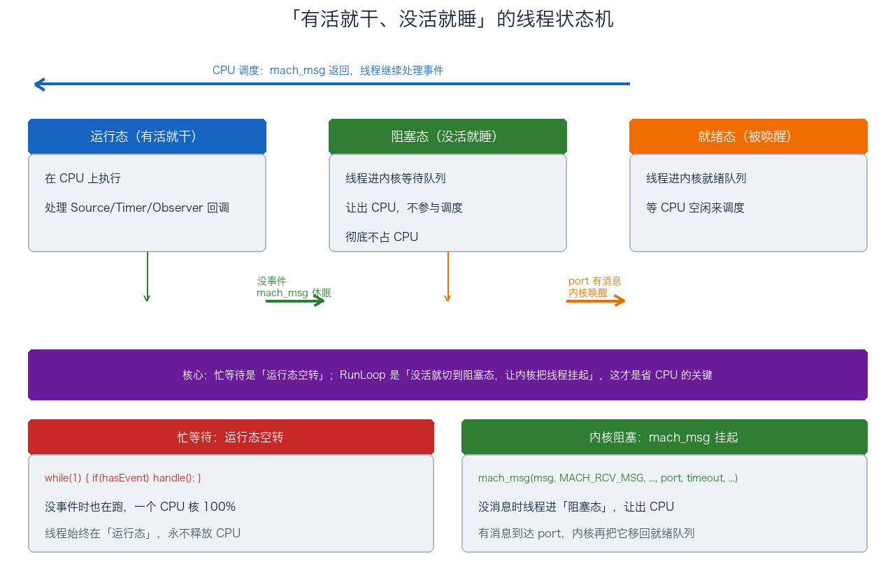
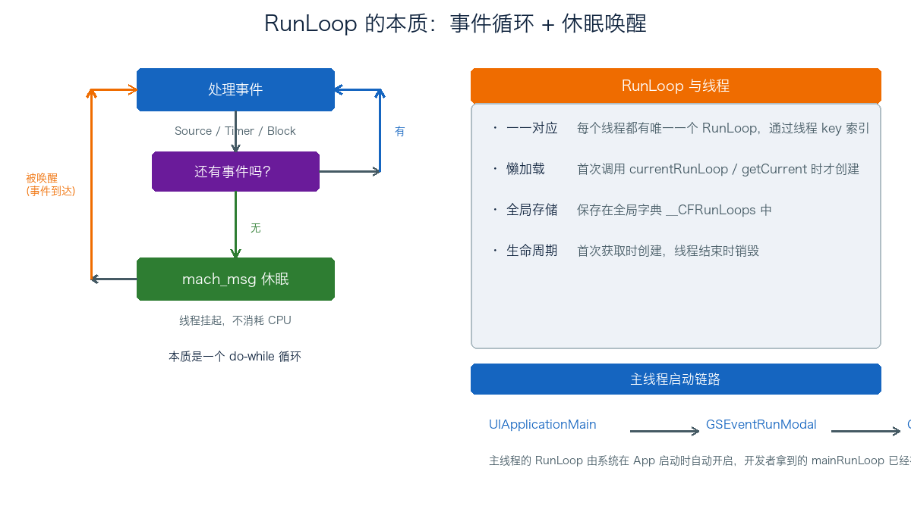
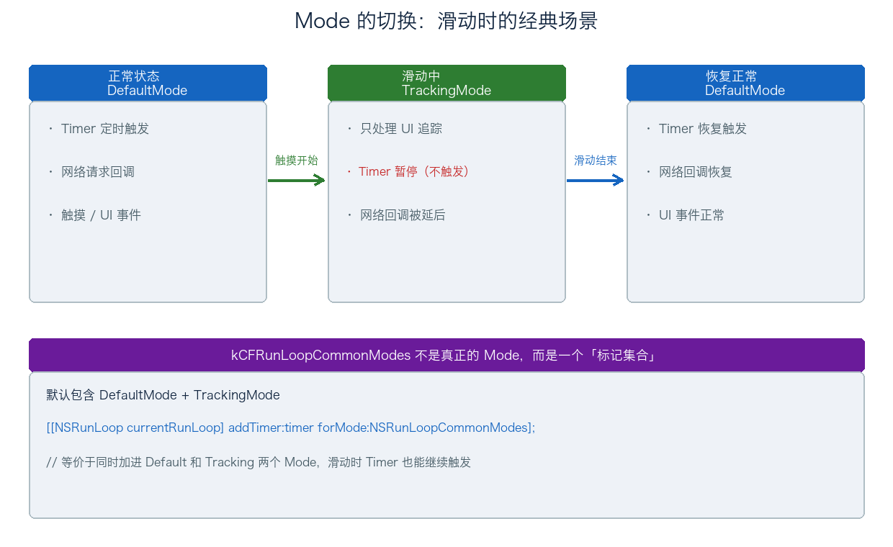
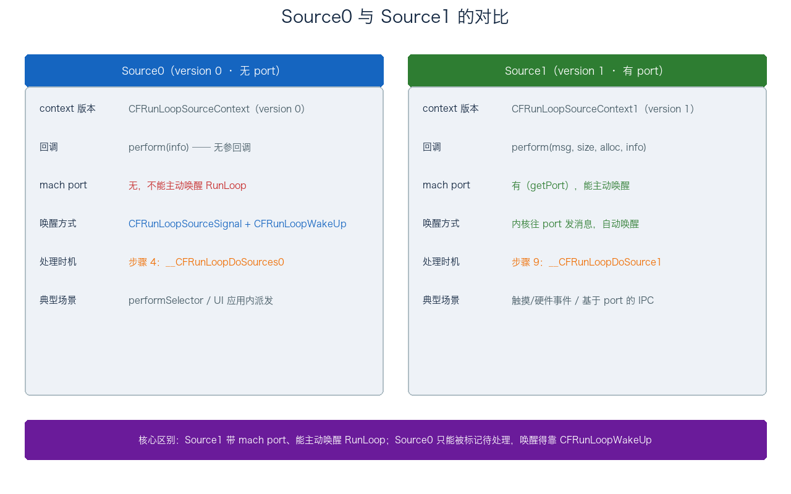
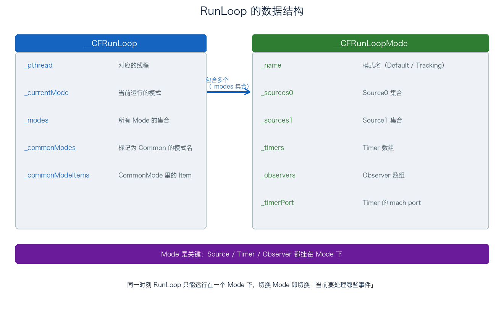
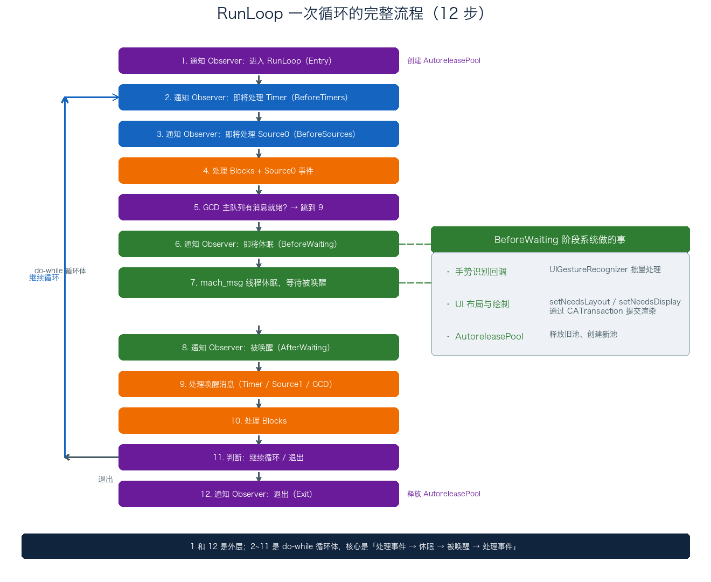
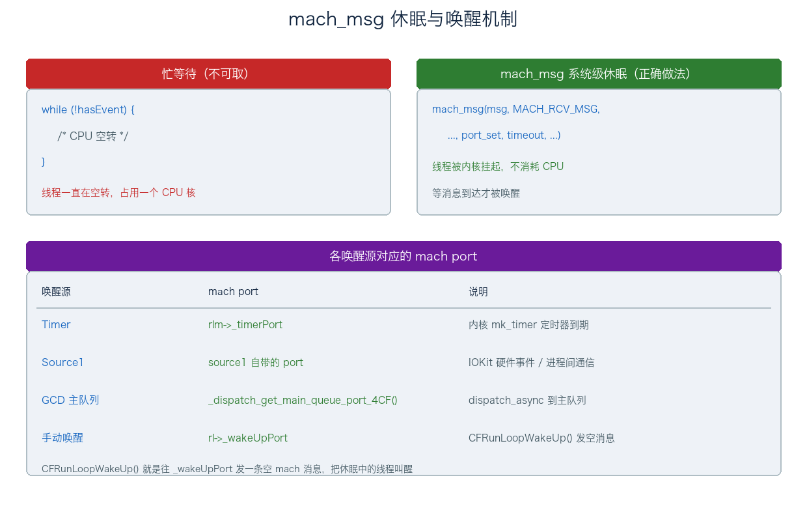
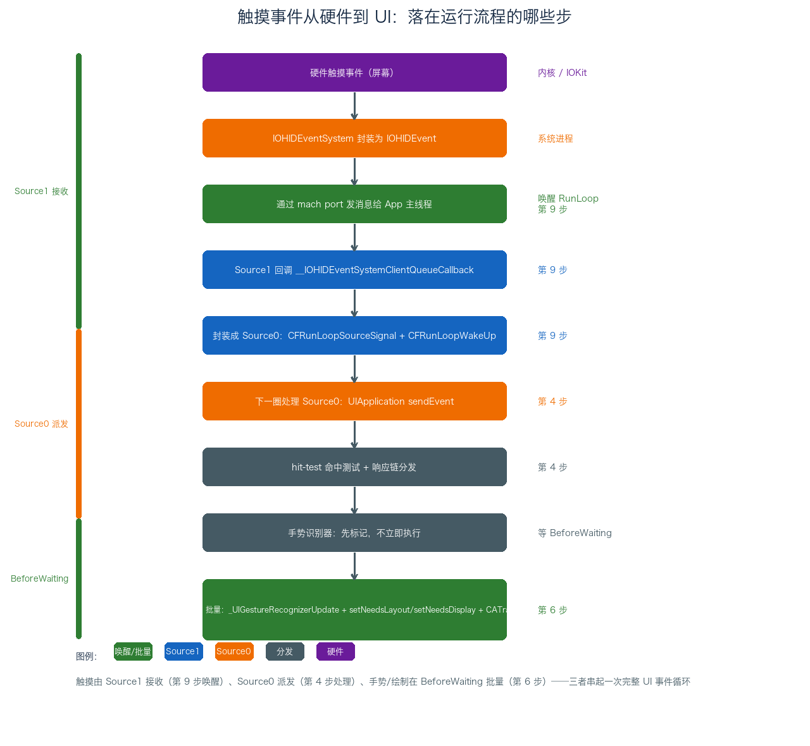

# 04. RunLoop 机制分析

> RunLoop 是 iOS 里绕不开的一个东西，面试常问、线上卡顿排查也经常碰到。但很多人对它的理解停在「一个 do-while 循环」这个层面。这篇从它到底解决了什么问题讲起，把线程关系、Mode、Source、Timer、Observer 这些组成部分一个个拆开，再顺着 `CFRunLoopRun` 的一次循环走一遍，最后落到 NSTimer 失效、线程保活、卡顿监控这些实际场景。术语保留英文，方便对照源码。

## 目录

- [一、RunLoop 是什么](#一runloop-是什么)
- [二、RunLoop 的核心组成](#二runloop-的核心组成)
- [三、RunLoop 的数据结构](#三runloop-的数据结构)
- [四、RunLoop 的运行流程](#四runloop-的运行流程)
- [五、RunLoop 的启动方式](#五runloop-的启动方式)
- [六、RunLoop 与 AutoreleasePool](#六runloop-与-autoreleasepool)
- [七、RunLoop 的实际应用](#七runloop-的实际应用)
- [附：高频速记](#附高频速记)

---

## 一、RunLoop 是什么

### 1. 本质：事件循环 + 休眠唤醒

RunLoop 是一个事件循环，它让线程「有活就干、没活就睡」，而不是干完一件事就退出。

没有 RunLoop 的线程，执行完任务就直接结束了。UI 线程不能这样——它得一直活着，随时响应用户的触摸、定时器、网络回调。怎么让线程一直活着、又不多耗 CPU？最朴素的写法是忙等待：

```c
while (1) {
    if (hasEvent) {
        handleEvent();
    }
}
```

问题在于 `hasEvent` 为 false 的时候，线程依然在疯狂空转，一个 CPU 核直接打满。RunLoop 的解法是：没有事件时调 `mach_msg` 让线程在内核里挂起，彻底不占 CPU；等真有事件到达（Timer 到期、mach 消息进来），内核再把它唤醒。

```c
void CFRunLoopRun() {
    do {
        // 处理各种事件源
        // 没有事件就 mach_msg 休眠
        // 有事件被唤醒再继续
    } while (running);
}
```

所以 RunLoop 的本质是「事件循环 + 系统级休眠」，`mach_msg` 是它不耗 CPU 的关键。下面把这两半拆开看。

**「有活就干」是事件驱动**。线程不主动退出，而是预先注册一批「事件源」（Source、Timer、Observer），然后转圈检查：有事件就调对应回调，没有就等。普通线程是线性的——从头执行到尾就结束；RunLoop 让线程停在循环里，事件是唯一驱动它往前走的东西。

**「没活就睡」才是关键，看线程状态机**。操作系统的线程有三个状态：运行态（正在 CPU 上跑）、就绪态（能跑了，等 CPU 空闲）、阻塞态（在等某个事件，不参与调度）。忙等待的 `while(1)` 里，线程永远停在运行态，CPU 空转；而 `mach_msg` 调用后，线程切到阻塞态，被内核从 CPU 的运行队列里摘下来、挂进等待队列。阻塞态的线程不参与调度，自然不占 CPU——这是它不耗电、不耗 CPU 的根本原因。

`mach_msg` 是 Mach 内核的 IPC 系统调用，RunLoop 用它收消息（`MACH_RCV_MSG`）。调用时内核去检查 port 上有没有消息：有，立刻返回、线程继续跑；没有，内核把线程从运行队列移到等待队列，线程挂起、让出 CPU。等有消息到达这个 port（Timer 到期、Source1 的 port、GCD 主队列、`_wakeUpPort` 任一个有），内核再把线程从等待队列移回就绪队列，CPU 一空闲就调度它。线程恢复执行，`mach_msg` 返回，RunLoop 接着判断「是谁叫醒了我」。

所以「有活就干、没活就睡」翻译成线程状态机，就是「运行态 ↔ 阻塞态」的来回切换，`mach_msg` 是那个既能让线程真正进阻塞态、又能把它唤醒的系统调用。





### 2. 与线程的关系

RunLoop 和线程是一一对应的：

- 每个线程有且只有一个 RunLoop；
- 它是懒加载的，第一次调 `currentRunLoop` / `CFRunLoopGetCurrent` 时才创建；
- 所有 RunLoop 存在全局字典 `__CFRunLoops` 里，线程作为 key；
- 线程结束，它对应的 RunLoop 也一起销毁。

获取方式：

```objc
// 当前线程的 RunLoop
CFRunLoopRef rl = CFRunLoopGetCurrent();
NSRunLoop *rl2 = [NSRunLoop currentRunLoop];

// 主线程的 RunLoop
CFRunLoopRef main = CFRunLoopGetMain();
NSRunLoop *main2 = [NSRunLoop mainRunLoop];
```

主线程的 RunLoop 由系统在 App 启动时自动开启，链路是 `UIApplicationMain → GSEventRunModal → CFRunLoopRunSpecific`。所以开发者拿到的 `mainRunLoop` 已经在跑了，不需要也不能再手动去启动它。

子线程的 RunLoop 默认是不开的，需要手动 run，这个放到「七、实际应用」的线程保活里展开。

一个要澄清的误区：主线程不等于 RunLoop。主线程是一根线程，RunLoop 是挂在这根线程上的事件循环，两者生命周期绑定，但概念不同。

---

## 二、RunLoop 的核心组成

一个 RunLoop 里装四类东西：Mode、Source、Timer、Observer。其中 Mode 是容器，Source / Timer / Observer 都挂在 Mode 下面。

### 1. Mode（CFRunLoopModeRef）

Mode 决定了「当前这一圈循环要处理哪些事件」。一个 RunLoop 可以挂多个 Mode，但同一时刻只能跑在一个 Mode 下。想切换 Mode，得先退出当前循环、再进新 Mode。

常见的 Mode：

| Mode | 说明 |
| ---- | ---- |
| `kCFRunLoopDefaultMode` | 默认模式，App 平时跑在这里 |
| `UITrackingRunLoopMode` | 界面追踪模式，ScrollView 滑动时 |
| `kCFRunLoopCommonModes` | 占位模式，不是真正的 Mode（见下） |
| `UIInitializationRunLoopMode` | 启动时用的模式，启动完就不再使用 |
| `GSEventReceiveRunLoopMode` | 接收系统事件的内部模式，未公开 |

这套设计的目标是「事件隔离 + 优先级管理」。低优先级事件（Timer、网络回调）和高优先级事件（UI 追踪）放在不同 Mode 里，滑动时切到 TrackingMode，Timer 就不来抢 UI 的时间，避免掉帧。

滑动的切换过程：

```
正常 DefaultMode ──触摸开始──> TrackingMode ──滑动结束──> DefaultMode
（处理 Timer/网络）          （只处理 UI 追踪）          （恢复 Timer/网络）
```



这个切换直接解释了那个经典问题：滑动时 NSTimer 不触发了。因为 `scheduledTimerWithTimeInterval:` 默认把 Timer 加进 DefaultMode，滑动时 RunLoop 切到了 TrackingMode，Timer 留在 DefaultMode 里自然不被处理。解法见「七、实际应用」。

关于 CommonModes，最常见的误解是把它当成「包含所有 Mode 的模式」。它不是真 Mode，而是一个「标记」。默认情况下，被标记为 Common 的 Mode 是 Default 和 Tracking 两个。往 CommonModes 里加一个 Item，等价于同时往 Default 和 Tracking 里各加一份：

```objc
[[NSRunLoop currentRunLoop] addTimer:timer forMode:NSRunLoopCommonModes];
// 等价于
[[NSRunLoop currentRunLoop] addTimer:timer forMode:NSDefaultRunLoopMode];
[[NSRunLoop currentRunLoop] addTimer:timer forMode:UITrackingRunLoopMode];
```

### 2. Source（CFRunLoopSourceRef）

Source 是事件源，分 Source0 和 Source1 两种。底层它们是同一个类型 `__CFRunLoopSource`，靠 context 里的 version 字段区分（0 还是 1），区别在「有没有 mach port、能不能主动唤醒 RunLoop」。先看结构，再分别展开。

**（1）数据结构 __CFRunLoopSource**

```c
struct __CFRunLoopSource {
    CFRuntimeBase _base;
    uint32_t _bits;              // 标志位，Signaled 等
    pthread_mutex_t _lock;
    CFIndex _order;              // 同一 Mode 里多个 Source 的执行优先级，越小越先
    CFMutableBagRef _runLoops;   // 注册到哪些 RunLoop
    union {
        CFRunLoopSourceContext version0;   // Source0 用
        CFRunLoopSourceContext1 version1;  // Source1 用
    } _context;
};
```

两个字段值得留意：`_order` 决定同一 Mode 下多个 Source0 谁先执行；`_context` 是个 union，version 是 0 就按 Source0 解释，是 1 就按 Source1 解释。所以「Source0 / Source1」不是两个类，而是同一个结构的两套用法。

**（2）Source0：非基于 port，不能主动唤醒**

version 0 的 context 长这样：

```c
typedef struct {
    CFIndex version;             // 固定 0
    void *info;
    const void *(*retain)(const void *info);
    void (*release)(const void *info);
    CFStringRef (*copyDescription)(const void *info);
    Boolean (*equal)(const void *info1, const void *info2);
    CFHashCode (*hash)(const void *info);
    void (*schedule)(void *info, CFRunLoopRef rl, CFStringRef mode);  // 加入 RunLoop 时回调
    void (*cancel)(void *info, CFRunLoopRef rl, CFStringRef mode);    // 移除时回调
    void (*perform)(void *info);  // 真正干活的回调
} CFRunLoopSourceContext;
```

关键是 `perform(info)`：Source0 被处理时，RunLoop 就调它。没有 port、没有 msg，所以它看不到任何跨进程数据，只能处理应用内部的事。

Source0 的使用是「三板斧」：创建 → signal 标记 → wakeUp 唤醒，后两步一个都不能少：

```c
// 1. 创建
CFRunLoopSourceContext ctx = {0};
ctx.version = 0;
ctx.info = self;
ctx.perform = source0Callback;
CFRunLoopSourceRef src = CFRunLoopSourceCreate(kCFAllocatorDefault, 0, &ctx);

// 2. 加入某个 RunLoop 的某个 Mode
CFRunLoopAddSource(CFRunLoopGetCurrent(), src, kCFRunLoopDefaultMode);

// 3. 标记待处理 + 手动唤醒
CFRunLoopSourceSignal(src);
CFRunLoopWakeUp(CFRunLoopGetCurrent());   // 这句不能省
```

为什么 signal 之后还要 wakeUp？`CFRunLoopSourceSignal` 只是把 Source 的 `_bits` 里 Signaled 标志位置 1，告诉 RunLoop「有活要干」。但如果 RunLoop 此刻正在 `mach_msg` 睡觉，它不会自己醒来检查这个标志。所以还得 `CFRunLoopWakeUp` 往 `_wakeUpPort` 发条空消息把线程叫醒，下一圈才会走到「处理 Source0」这一步。

Source0 的处理时机是「步骤 4」，对应 `__CFRunLoopDoSources0`：遍历当前 Mode 的 `_sources0`，挑出被 signal 过的，按 `_order` 从小到大依次调 `perform`。处理完会把 Signaled 标志清掉。

典型场景：`performSelector:onThread:withObject:waitUntilDone:` 跨线程调用——它在目标线程建一个 Source0 塞进 RunLoop，signal + wakeUp，等目标线程转到处理 Source0 时执行。触摸事件的应用内派发也是 Source0（Source1 收到硬件事件后，再封装成 Source0 交给 UIKit，这个在「四、6」串起来了）。

**（3）Source1：基于 port，能主动唤醒**

version 1 的 context 是 `CFRunLoopSourceContext1`，和 version 0 相比有两处本质不同：

```c
typedef struct {
    CFIndex version;             // 固定 1
    void *info;
    // ... retain/release/equal/hash 同 version0
    mach_port_t (*getPort)(void *info);   // 返回这个 Source 监听的 port
    void *(*perform)(void *msg, CFIndex size, CFAllocatorRef allocator, void *info);
} CFRunLoopSourceContext1;
```

1. `getPort` 返回一个 mach port。RunLoop 会把它加进当前 Mode 的 `_portSet`（第四节讲的 waitSet），休眠时 `mach_msg` 一并监听；
2. `perform(msg, size, allocator, info)` 比 Source0 多了 `msg` 和 `size`，能拿到内核或别的线程发来的真实消息内容。

Source1 的唤醒不用手动 `CFRunLoopWakeUp`：只要有消息到达它的 port，`mach_msg` 就返回，`livePort` 等于这个 port。RunLoop 在「步骤 9」用 `__CFRunLoopModeFindSourceForMachPort` 反查是哪个 Source，再调 `__CFRunLoopDoSource1` → `perform`。

典型场景：系统级硬件事件（触摸的 `__IOHIDEventSystemClientQueueCallback`）、基于 mach port 的进程间通信。凡是「从内核 / 其他进程 / 其他线程过来、要带数据的」，都走 Source1。

**（4）回调入口宏**

处理 Source0 / Source1 时，CF 分别包了两个宏，线上崩溃堆栈和卡顿采样的符号化结果里经常见到：

```c
__CFRUNLOOP_IS_CALLING_OUT_TO_A_SOURCE0_PERFORM_FUNCTION__
__CFRUNLOOP_IS_CALLING_OUT_TO_A_SOURCE1_PERFORM_FUNCTION__
```

这俩宏本身只是打标记，方便性能工具和 crash 报告识别「当前卡在哪个 Source 的回调里」。看到它们，就说明是业务代码通过 Source 触发的回调出了问题。

**（5）Source0 vs Source1 对比**



| 维度 | Source0 | Source1 |
| ---- | ------- | ------- |
| context.version | 0 | 1 |
| 是否基于 mach port | 否 | 是（`getPort`） |
| 能否主动唤醒 RunLoop | 不能，需 `CFRunLoopWakeUp` | 能，port 有消息即醒 |
| perform 签名 | `perform(info)` | `perform(msg, size, alloc, info)` |
| 数据来源 | 应用内部，无跨进程数据 | 内核/进程/线程，带消息体 |
| 处理时机 | 步骤 4（`__CFRunLoopDoSources0`） | 步骤 9（`__CFRunLoopDoSource1`） |
| 典型场景 | performSelector、UI 应用内派发 | 触摸/硬件事件、port IPC |

**（6）两个容易混的点**

一是 Source 和「事件」不是一一对应的。一个 Source 可以反复被 signal、反复处理，不是一次性的。比如 `performSelector:onThread:` 每次调用都是 signal（或新建）一个 Source0，处理完不销毁。真正绑定某个具体事件的是回调里的业务逻辑，Source 只是回调的载体。

二是 Source0 的 signal 是「标记位」，处理完会清掉；如果处理期间又被 signal 了一次，下一圈还会再处理一次。所以它天然支持「攒一批一起处理」——这也是多个 UI 事件能在一圈里批量派发的原因。

### 3. Timer（CFRunLoopTimerRef）

Timer 是基于时间的触发器，NSTimer 和 CFRunLoopTimerRef 是 toll-free bridged 的，本质同一个东西。

```objc
NSTimer *timer = [NSTimer timerWithTimeInterval:1.0
                                        target:self
                                      selector:@selector(timerFired)
                                      userInfo:nil
                                       repeats:YES];
[[NSRunLoop currentRunLoop] addTimer:timer forMode:NSRunLoopCommonModes];
```

Timer 和 RunLoop 是绑定的：NSTimer 必须加进某个 RunLoop 的某个 Mode 才会触发，单独创建出来不动。而且它不精确——要等 RunLoop 转到处理它的时间点才回调，中间若有重活阻塞，就会延迟。

**CADisplayLink** 是另一个和屏幕绑定的定时器，跟 NSTimer 有本质区别：

| 特性 | CADisplayLink | NSTimer |
| ---- | ------------- | ------- |
| 触发机制 | VSync 信号驱动 | CFRunLoopTimer |
| 触发频率 | 与屏幕刷新率同步（60/120Hz） | 自定义间隔 |
| 精度 | 高，严格同步刷新 | 较低，受 RunLoop 状态影响 |
| 场景 | 动画、游戏渲染、帧率监控 | 定时任务、延迟执行 |

CADisplayLink 的链路是：VSync 信号 → 唤醒 RunLoop → CADisplayLink 回调 → 处理事件 → BeforeWaiting 提交渲染 → 休眠。高刷设备（ProMotion）上可以通过 `preferredFrameRateRange` 指定帧率范围。

### 4. Observer（CFRunLoopObserverRef）

Observer 是观察者，监听 RunLoop 的状态变化。它监听的活动状态有 7 个：

```c
typedef CF_OPTIONS(CFOptionFlags, CFRunLoopActivity) {
    kCFRunLoopEntry         = (1UL << 0), // 即将进入 RunLoop
    kCFRunLoopBeforeTimers  = (1UL << 1), // 即将处理 Timer
    kCFRunLoopBeforeSources = (1UL << 2), // 即将处理 Source
    kCFRunLoopBeforeWaiting = (1UL << 5), // 即将进入休眠
    kCFRunLoopAfterWaiting  = (1UL << 6), // 刚从休眠醒来
    kCFRunLoopExit          = (1UL << 7), // 即将退出 RunLoop
    kCFRunLoopAllActivities = 0x0FFFFFFFU // 监听所有状态
};
```

注意枚举值跳过了 3、4（`1UL << 3`、`1UL << 4`），这是历史遗留，不用奇怪。Observer 主要用在卡顿监控、AutoreleasePool 管理这些场景，后面会展开。

---

## 三、RunLoop 的数据结构

看 CFRunLoop.c 源码里的两个核心结构，能把这套机制的骨架摸清楚：

```c
struct __CFRunLoop {
    pthread_t _pthread;              // 对应的线程
    CFMutableSetRef _commonModes;    // 标记为 Common 的 Mode 名集合
    CFMutableSetRef _commonModeItems;// CommonMode 中的 Source/Timer/Observer
    CFRunLoopModeRef _currentMode;   // 当前运行的 Mode
    CFMutableSetRef _modes;          // 所有 Mode 的集合
};

struct __CFRunLoopMode {
    CFStringRef _name;               // Mode 名
    CFMutableSetRef _sources0;       // Source0 集合
    CFMutableSetRef _sources1;       // Source1 集合
    CFMutableArrayRef _observers;    // Observer 数组（有序）
    CFMutableArrayRef _timers;       // Timer 数组
    mach_port_t _timerPort;          // Timer 的 mach port
    mach_port_t _portSet;            // 监听的 port 集合
};
```



从结构里能读出几个要点：

- `_modes` 是一组 Mode，`_currentMode` 是当前正在跑的那个，切换 Mode 本质就是换 `_currentMode`；
- Source / Timer / Observer 都挂在 Mode 下，不是直接挂 RunLoop 下——这就是「同一时刻只处理当前 Mode 的事件」的结构基础；
- `_observers` 是数组，有顺序，Observer 回调按注册顺序执行（卡顿监控会利用这一点）；
- `_timerPort` 是 Timer 对应的内核定时器 port，RunLoop 休眠时靠它感知「定时器到点了」。

---

## 四、RunLoop 的运行流程

这是理解 RunLoop 的核心。整体分两层：外层是「启动」，内层是「一次循环」。先看一张总览图，再逐层往下拆。



### 1. 外层入口：CFRunLoopRunSpecific

`CFRunLoopRun()`、`runMode:beforeDate:` 这些启动 API，最后都收敛到 `CFRunLoopRunSpecific`，它才是真正的入口。签名和核心逻辑大致是：

```c
SInt32 CFRunLoopRunSpecific(CFRunLoopRef rl, CFStringRef modeName,
                            CFTimeInterval seconds, Boolean returnAfterSourceHandled) {
    // 1. 先找到 modeName 对应的 Mode
    CFRunLoopModeRef currentMode = __CFRunLoopFindMode(rl, modeName, false);

    // 2. Mode 不存在，或 Mode 里没有任何 Source/Timer/Observer（空 Mode）
    if (NULL == currentMode || __CFRunLoopModeIsEmpty(rl, currentMode, rl->_currentMode)) {
        return kCFRunLoopRunFinished;   // 直接返回，根本不会进循环
    }

    // 3. 记录进入前的 Mode，把当前 Mode 切过去
    CFRunLoopModeRef previousMode = rl->_currentMode;
    rl->_currentMode = currentMode;

    // 4. 交给内层循环跑
    return __CFRunLoopRun(rl, currentMode, seconds, returnAfterSourceHandled, previousMode);
}
```

三个参数先说明白，后面会反复用到：

- `modeName`：在哪个 Mode 下跑。`CFRunLoopRun()` 传的是 `kCFRunLoopDefaultMode`。
- `seconds`：最多跑多久。`CFRunLoopRun()` 传的是 `1.0e10`（约 3 万小时，近似无限），`runMode:beforeDate:` 传的是 `beforeDate` 与当前时间之差。
- `returnAfterSourceHandled`：处理完一个事件就返回，还是继续循环。这个就是后面源码里的 `stopAfterHandle`。

第 2 步那个空 Mode 检查值得记一下：它解释了为什么「线程保活必须加一个占位 port」——不加任何 Source/Timer/Observer 的话，RunLoop 一进 `CFRunLoopRunSpecific` 就返回 `Finished`，循环根本跑不起来。这个放「七、实际应用」展开。

### 2. 内层核心：__CFRunLoopRun 的关键变量

真正干活的是 `__CFRunLoopRun`，签名：

```c
static int32_t __CFRunLoopRun(CFRunLoopRef rl, CFRunLoopModeRef rlm,
                              CFTimeInterval seconds, Boolean stopAfterHandle,
                              CFRunLoopModeRef previousMode);
```

读它的实现之前，先认几个贯穿全程的变量，不然看源码会抓瞎：

| 变量 | 含义 |
| ---- | ---- |
| `retVal` | 返回值。0 表示「继续下一圈」，非 0 表示「退出」。整个函数就是 `do { ... } while (retVal == 0)` |
| `livePort` | 本轮唤醒 RunLoop 的那个 mach port。判断「被谁叫醒」的唯一依据 |
| `msg` | mach 消息指针。`NULL` 表示空唤醒，没有实际消息 |
| `sourceHandledThisLoop` | 本轮是否处理过事件，决定 `stopAfterHandle` 分支走不走 |
| `poll` | 是否「轮询」而不是「休眠等待」。有 Source0 待处理、或 GCD 主队列有消息时为 true |

### 3. 一次循环的完整源码

把 `__CFRunLoopRun` 的核心逻辑按「循环体前段 → 休眠 → 唤醒处理 → 退出判断」拆成四段，就对应前面的 12 步。下面是精简过的版本，去掉了锁、voucher、超时定时器等不影响主线的细节：

**第一段：进入循环 + 处理 block/Source0（步骤 2~4）**

```c
static int32_t __CFRunLoopRun(CFRunLoopRef rl, CFRunLoopModeRef rlm,
                              CFTimeInterval seconds, Boolean stopAfterHandle,
                              CFRunLoopModeRef previousMode) {
    // 进来先看是不是已经被 stop 过，是就直接退出
    if (__CFRunLoopIsStopped(rl)) {
        __CFRunLoopUnsetStopped(rl);
        return kCFRunLoopRunStopped;
    }

    int32_t retVal = 0;
    do {
        mach_port_t livePort = MACH_PORT_NULL;
        mach_msg_header_t *msg = NULL;
        Boolean sourceHandledThisLoop = false;

        // 步骤 2、3：通知 Observer（BeforeTimers / BeforeSources）
        if (rlm->_observerMask & kCFRunLoopBeforeTimers)
            __CFRunLoopDoObservers(rl, rlm, kCFRunLoopBeforeTimers);
        if (rlm->_observerMask & kCFRunLoopBeforeSources)
            __CFRunLoopDoObservers(rl, rlm, kCFRunLoopBeforeSources);

        // 步骤 4：先跑 block，再处理 Source0
        __CFRunLoopDoBlocks(rl, rlm);
        sourceHandledThisLoop = __CFRunLoopDoSources0(rl, rlm, stopAfterHandle);
        if (sourceHandledThisLoop) {
            __CFRunLoopDoBlocks(rl, rlm);   // 处理过 Source0，补跑一轮 block
        }
        ...
```

两个细节：

- `_observerMask` 是当前 Mode 的 Observer 位掩码，只有真的注册了对应状态，`__CFRunLoopDoObservers` 才会执行。也就是说 Observer 通知不是无条件发的。
- block 要跑两遍：进入循环先跑一次，处理完 Source0 再补一次。`CFRunLoopPerformBlock` 提交的 block 就是在这个阶段被执行的。

**第二段：GCD 检查 + 休眠（步骤 5~8）**

```c
        // 步骤 5：有 Source0 待处理、或 GCD 主队列有消息时，需要轮询
        Boolean poll = sourceHandledThisLoop || (MACH_PORT_NULL != dispatchPort);

        // 非阻塞探测一次 GCD 主队列 port，有消息就直接跳到 handle_msg
        if (MACH_PORT_NULL != dispatchPort) {
            if (__CFRunLoopServiceMachPort(dispatchPort, &msg, sizeof(msg),
                                           &livePort, 0, &voucherState, NULL)) {
                goto handle_msg;   // 直接去步骤 9，不用休眠
            }
        }

        // 步骤 6：BeforeWaiting
        if (!poll && (rlm->_observerMask & kCFRunLoopBeforeWaiting))
            __CFRunLoopDoObservers(rl, rlm, kCFRunLoopBeforeWaiting);
        __CFRunLoopSetSleeping(rl);

        // 步骤 7：mach_msg 休眠，等消息唤醒（poll 时 timeout 传 0，不 poll 传无限）
        __CFRunLoopServiceMachPort(waitSet, &msg, sizeof(msg), &livePort,
                                   poll ? 0 : TIMEOUT_INFINITY,
                                   &voucherState, &voucherCopy);

        __CFRunLoopUnsetSleeping(rl);

        // 步骤 8：AfterWaiting
        if (!poll && (rlm->_observerMask & kCFRunLoopAfterWaiting))
            __CFRunLoopDoObservers(rl, rlm, kCFRunLoopAfterWaiting);
```

这段里第 5 步的 `goto handle_msg` 是关键：如果 GCD 主队列已经有任务排队了，就跳过休眠，直接去处理消息。这是 `dispatch_async(主队列)` 能被及时响应的保证——不用等这一圈把别的活干完再睡。

**第三段：唤醒处理（步骤 9~10）**

```c
    handle_msg:
        if (MACH_PORT_NULL == livePort) {
            // 空唤醒：没有任何消息（极少出现）
        } else if (livePort == rl->_wakeUpPort) {
            // 被 CFRunLoopWakeUp() 手动唤醒，没有实际事件要处理
        } else if (rlm->_timerPort != MACH_PORT_NULL && livePort == rlm->_timerPort) {
            // Timer 到期
            if (!__CFRunLoopDoTimers(rl, rlm, mach_absolute_time()))
                __CFArmNextTimerInMode(rlm, rl);   // 重新 arm 下一个 Timer
        } else if (livePort == dispatchPort) {
            // GCD 主队列有任务
            _dispatch_main_queue_callback_4CF(msg);
            sourceHandledThisLoop = true;
        } else {
            // Source1：基于 port 的事件源（如触摸）
            CFRunLoopSourceRef rls = __CFRunLoopModeFindSourceForMachPort(rl, rlm, livePort);
            if (rls) {
                sourceHandledThisLoop = __CFRunLoopDoSource1(rl, rlm, rls, msg, ...);
            }
        }

        // 步骤 10：再跑一遍 block
        __CFRunLoopDoBlocks(rl, rlm);
```

这段是整段流程的分水岭：`livePort` 是哪个 port，就走哪个分支。四个唤醒源——手动唤醒、Timer、GCD、Source1——都在这里被区分开。其中 Source1 的 `__CFRunLoopModeFindSourceForMachPort` 是根据 port 反查是哪个 Source，再交给对应的 `__CFRunLoopDoSource1` 处理。

**第四段：退出判断（步骤 11~12）**

```c
        // 步骤 11：退出判断（按顺序短路，命中一个就退出）
        if (sourceHandledThisLoop && stopAfterHandle) {
            retVal = kCFRunLoopRunHandledSource;   // 处理过一个事件 + 要求立即返回
        } else if (seconds 已到期) {
            retVal = kCFRunLoopRunTimedOut;        // 超时
        } else if (__CFRunLoopIsStopped(rl)) {
            __CFRunLoopUnsetStopped(rl);
            retVal = kCFRunLoopRunStopped;         // 被 CFRunLoopStop 停
        } else if (rlm->_stopped) {
            rlm->_stopped = false;
            retVal = kCFRunLoopRunStopped;         // Mode 被标记 stop
        } else if (__CFRunLoopModeIsEmpty(rl, rlm, previousMode)) {
            retVal = kCFRunLoopRunFinished;        // Mode 里没东西了，正常结束
        }
    } while (0 == retVal);   // retVal 非 0 就退出循环

    // 步骤 12：退出前，外层 CFRunLoopRunSpecific 通知 Exit Observer
    return retVal;
}
```

退出判断是「按顺序短路」的：先看 `HandledSource`，再看超时，再看 `Stopped`，最后看 Mode 是否空了。顺序很重要——`stopAfterHandle` 的分支优先级最高，只要处理过一个事件就返回，后面的条件都不再判断。

### 4. 休眠与唤醒的底层：mach_msg + mk_timer

这里澄清一个流传很广的误解：不少人以为 `mach_msg` 的 `timeout` 参数被设置成「下一个 Timer 的剩余时间」，到点自动醒。实际上 CF 不是这么干的——从第二段源码能看出来，`mach_msg` 的 timeout 传的是 `TIMEOUT_INFINITY`（无限等，只有 poll 时才传 0）。

Timer 到期的唤醒，靠的是 `_timerPort` 这个内核定时器 port：

1. 休眠前，`__CFArmNextTimerInMode` 会调 `mk_timer_arm(_timerPort, 下一个Timer的到期时间)`，把内核定时器在这个时间点「arm」起来；
2. 到点后，内核自动往 `_timerPort` 发一条 mach 消息；
3. 线程被唤醒，`livePort == _timerPort`，于是走 `__CFRunLoopDoTimers` 分支。

所以「定时唤醒」是内核 `mk_timer` 干的，不是 `mach_msg` 超时干的。`mach_msg` 的 timeout 只负责「要不要无限等」这件事。

那 `mach_msg` 到底在等谁？它监听的是一个 port 集合（`waitSet`，即 Mode 的 `_portSet`），里面塞了这几个 port：

| port | 作用 |
| ---- | ---- |
| `rl->_wakeUpPort` | `CFRunLoopWakeUp()` 手动唤醒用 |
| `rlm->_timerPort` | Timer 到期唤醒用（内核 `mk_timer`） |
| 各 Source1 自带的 port | 端口通信事件（触摸、进程间通信） |
| `dispatchPort` | GCD 主队列 port（只有主线程 RunLoop 有） |



只要这几个 port 里任意一个有消息到达，`mach_msg` 就返回，`livePort` 就是那个 port。这就是「一个线程同时监听多种事件源」的底层实现。

### 5. 返回值 retVal 的含义

`retVal` 一共四种取值：

```c
enum {
    kCFRunLoopRunFinished       = 1,  // Mode 空了，正常结束
    kCFRunLoopRunStopped        = 2,  // 被 CFRunLoopStop / stop 标记停
    kCFRunLoopRunTimedOut       = 3,  // 超过 seconds 超时
    kCFRunLoopRunHandledSource  = 4   // stopAfterHandle 且处理过一个事件
};
```

| 返回值 | 触发条件 | 典型场景 |
| ---- | ---- | ---- |
| `kCFRunLoopRunFinished` | Mode 里没有 Source/Timer/Observer 了 | 没加占位 port 的线程保活，立刻结束 |
| `kCFRunLoopRunStopped` | `CFRunLoopStop()` 或 Mode 被标记 stop | 手动停止子线程 RunLoop |
| `kCFRunLoopRunTimedOut` | 超过 `seconds` 指定时间 | `runMode:beforeDate:` 跑够时间返回 |
| `kCFRunLoopRunHandledSource` | `stopAfterHandle` 为 true 且处理过一个事件 | `CFRunLoopRunInMode` 配 `returnAfterSourceHandled=YES` |

看懂这四个值，第五节「启动方式」为什么表现各异就有答案了：`CFRunLoopRun()` 外层是 `do-while` 检查 `retVal`，所以能被 `CFRunLoopStop` 停；`[NSRunLoop run]` 外层是 `while(1)`，压根不看 `retVal`，所以停不下来。

### 6. 触摸事件在运行流程中的位置

前面一直讲抽象分支，这里用一个真实事件把第 4、6、9 步串起来，Source0 和 Source1 的配合就清楚了：

1. 硬件触摸 → 系统进程 `IOHIDEventSystem` 封装成 `IOHIDEvent`；
2. 系统通过 mach port 给 App 主线程的 Source1 发消息，RunLoop 被唤醒（第 9 步）；
3. Source1 回调 `__IOHIDEventSystemClientQueueCallback` 里，把事件再封装成一个 Source0，`CFRunLoopSourceSignal` 标记 + `CFRunLoopWakeUp` 手动唤醒；
4. 下一圈，RunLoop 在「处理 Source0」阶段（第 4 步）把这个事件派发出去，`UIApplication sendEvent` → hit-test → 响应链；
5. 手势识别器先标记、不执行；UI 的 `setNeedsLayout`/`setNeedsDisplay` 也只打标记；
6. 到 BeforeWaiting（第 6 步），系统统一做 `_UIGestureRecognizerUpdate` 手势处理、布局绘制、`CATransaction` 提交。



一次触摸横跨「Source1 唤醒（第 9 步）→ 下一圈 Source0 派发（第 4 步）→ BeforeWaiting 批量（第 6 步）」，中间隔了整整一圈。这就是为什么「点一下」不是同步完成，而是等 RunLoop 转到对应步骤才响应——也是卡顿时会觉得「点了没反应」的根因。

回到这张总览图，12 步里最值得反复琢磨的是 6-7-8 这段「休眠」。它不是简单地「没事件就睡」，而是先抓住 BeforeWaiting 这个时机把手势、UI、内存都批量处理掉，再去 mach_msg 睡。理解了这一点，卡顿监控为什么要盯 BeforeSources 和 AfterWaiting 这两个状态，也就有答案了。

---

## 五、RunLoop 的启动方式

启动 RunLoop 的 API 有好几个，但底层都收敛到 `CFRunLoopRunSpecific`，区别只在外层怎么包：

| 启动方式 | 外层循环 | CFRunLoopStop 能停吗 | 说明 |
| ------- | -------- | -------------------- | ---- |
| `runMode:beforeDate:` | 无，调一次返回 | 能 | 手动控制，一次只跑一下 |
| `CFRunLoopRun()` | do-while，检查 Stopped/Finished | 能 | 标准启动 |
| `[NSRunLoop run]` | while(1)，不检查任何条件 | 不能 | 停不下来 |
| `[NSRunLoop runUntilDate:]` | while(未超时) | 不能（但会超时退出） | 跑一段时间 |

最坑的是 `[NSRunLoop run]`：它内部是 `while(1)`，`CFRunLoopStop` 对它无效，一旦跑起来就退不出去。线程保活如果用了它，线程永远收不回来。正确姿势是下面「线程保活」要讲的 `while + runMode:beforeDate:`。

---

## 六、RunLoop 与 AutoreleasePool

主线程的 AutoreleasePool 是 RunLoop 自动管理的，三个时机：

1. Entry：创建 AutoreleasePool；
2. BeforeWaiting：释放旧池、创建新池；
3. Exit：释放 AutoreleasePool。

所以主线程里创建的 autorelease 对象不是立刻释放，而是等到这一圈循环结束时（休眠前）才释放。子线程如果没有手动加 AutoreleasePool，autorelease 对象就没地方释放，会内存泄漏。GCD 的后台 block 会自动包 AutoreleasePool，但普通子线程不会，这点要区分开。

---

## 七、RunLoop 的实际应用

### 1. NSTimer 滑动失效

问题：`scheduledTimer` 的 Timer 加在 DefaultMode，滑动时 RunLoop 切到 TrackingMode，Timer 就停了。

两种解法：

```objc
// 方案1：加到 CommonModes
[[NSRunLoop currentRunLoop] addTimer:timer forMode:NSRunLoopCommonModes];

// 方案2：换 GCD Timer，不受 RunLoop Mode 影响
dispatch_source_t timer = dispatch_source_create(
    DISPATCH_SOURCE_TYPE_TIMER, 0, 0, dispatch_get_main_queue());
```

### 2. 线程保活

想让一个子线程常驻（比如常驻下载线程、定时上报线程），要解决三个问题：

1. 子线程 RunLoop 默认没启动，得手动 `currentRunLoop` 获取并 run；
2. 光 run 还不够——RunLoop 里如果没有任何 Source / Timer / Observer，它会立刻退出。所以要加一个「占位」的事件源（比如一个 NSPort）把它撑住；
3. 要能安全停掉，不能用 `[NSRunLoop run]`，得用可控循环：

```objc
_thread = [[NSThread alloc] initWithBlock:^{
    [[NSRunLoop currentRunLoop] addPort:[[NSPort alloc] init]
                                forMode:NSDefaultRunLoopMode];
    while (weakSelf && !weakSelf->_stopped) {
        [[NSRunLoop currentRunLoop] runMode:NSDefaultRunLoopMode
                                 beforeDate:[NSDate distantFuture]];
    }
}];
```

`runMode:beforeDate:` 跑一次就返回，外层 while 检查 `_stopped`，把 `_stopped` 置 true 就能安全退出。这是线程保活的标准姿势。

### 3. 卡顿监控

原理：主线程卡顿时，RunLoop 会长时间停留在「处理事件」阶段，迟迟不进下一次「休眠」或「唤醒」。于是用子线程发信号量，等主线程 RunLoop 的状态变化，超时（比如 50ms）还没变化，就判定卡顿。

具体做法是往主线程 RunLoop 里注册 Observer，监听 `kCFRunLoopBeforeSources` 和 `kCFRunLoopAfterWaiting` 两个状态，配合一个子线程 + 信号量做超时检测。

但简单方案有个盲区：`kCFRunLoopBeforeWaiting` 阶段（就是系统批量做手势、UI、AutoreleasePool 那段）如果耗时，它不在被监听的这两个状态里，会漏判。微信的 Matrix 用两个 Observer（order 分别是 `LONG_MIN` 和 `LONG_MAX`）把系统所有 Observer 的执行包在中间，补上了这个盲区。

### 4. 空闲时执行低优先级任务

利用 BeforeWaiting 这个「空闲窗口」做不紧急的事：图片预加载、数据预处理、日志上报、缓存清理。每次只做有限数量，做完就睡，不干扰交互。这比「一有空就狂做」安全，也不会卡住 UI。

---

## 附：高频速记

- **本质**：事件循环 + `mach_msg` 系统级休眠，不耗 CPU。
- **有活就干、没活就睡**：线程三态（运行/就绪/阻塞）切换；`mach_msg` 没消息时把线程挂进内核等待队列（阻塞态）、有消息再移回就绪队列。
- **线程关系**：一一对应、懒加载、存 `__CFRunLoops` 全局字典、线程结束销毁。
- **主线程启动**：`UIApplicationMain → GSEventRunModal → CFRunLoopRunSpecific`。
- **Mode**：Source / Timer / Observer 挂在 Mode 下，同一时刻只跑一个 Mode；CommonModes 是标记集合，不是真 Mode。
- **Source0 不能唤醒 RunLoop**（要配 `CFRunLoopWakeUp`），Source1 基于 mach port 能主动唤醒。
- **Source0/Source1 是同一结构** `__CFRunLoopSource`，靠 `_context.version` 区分（0 无 port / 1 有 port）；回调入口宏 `__CFRUNLOOP_IS_CALLING_OUT_TO_A_SOURCE0/1_PERFORM_FUNCTION__`。
- **CADisplayLink 由 VSync 驱动**，与屏幕刷新同步；NSTimer 由 CFRunLoopTimer 驱动，精度较低。
- **运行流程 12 步**：处理事件 → BeforeWaiting（手势/UI/内存批量）→ mach_msg 休眠 → 唤醒处理。
- **mach_msg 的 timeout 传 TIMEOUT_INFINITY**，Timer 到期靠内核 `mk_timer`（`_timerPort`）唤醒，不是靠 timeout 超时。
- **retVal 四种值**：Finished(1 空 Mode) / Stopped(2 被 stop) / TimedOut(3 超时) / HandledSource(4 处理过一个事件)。
- **BeforeWaiting 三件事**：手势识别、UI 布局绘制（CATransaction）、AutoreleasePool 释放重建。
- **启动方式**：`[NSRunLoop run]` 是 while(1) 停不下来；线程保活用 `while + runMode:beforeDate:`。
- **AutoreleasePool**：Entry 创建、BeforeWaiting 重建、Exit 释放。
- **NSTimer 滑动失效**：加 CommonModes，或换 GCD Timer。
- **卡顿监控**：Observer 盯 BeforeSources + AfterWaiting，信号量超时判定；Matrix 用双 Observer 补 BeforeWaiting 盲区。
