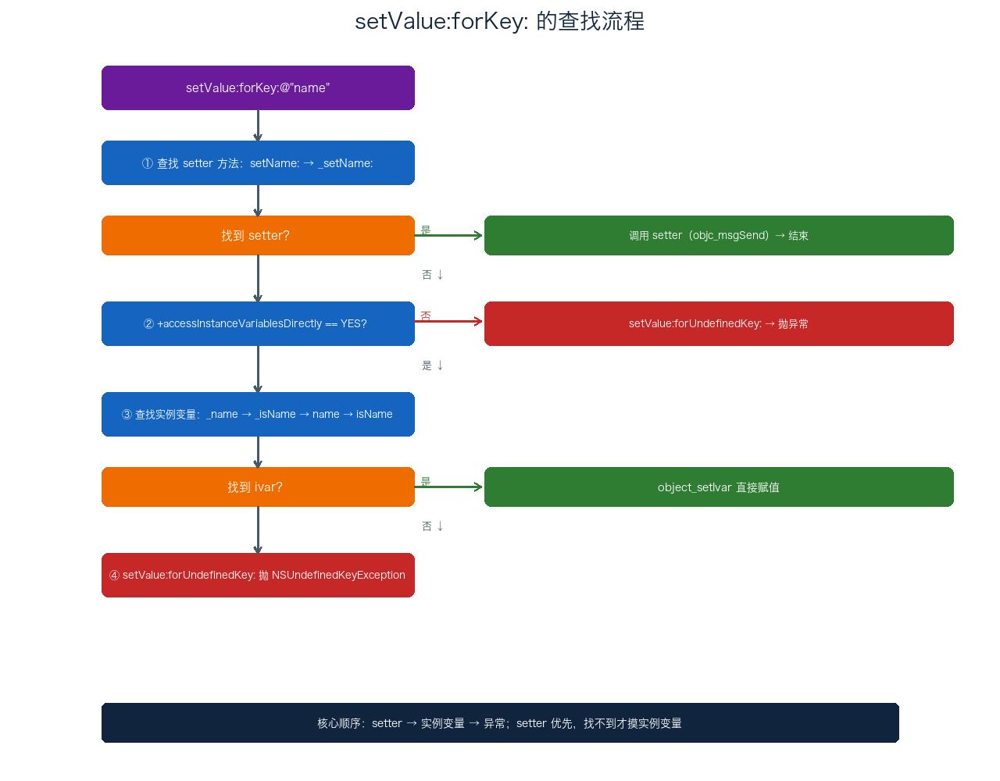
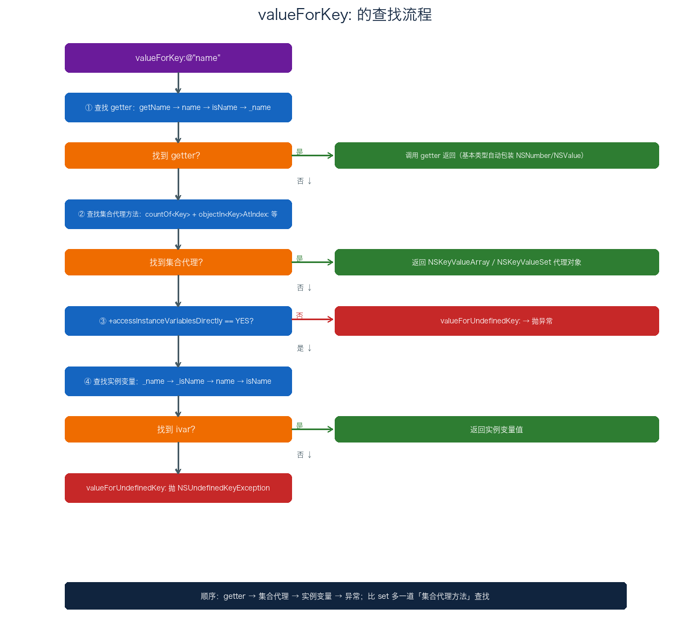
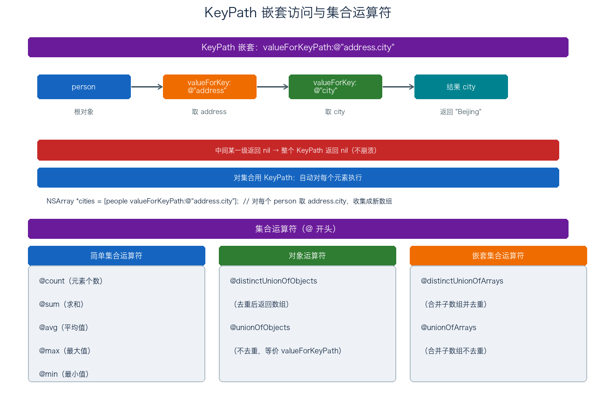

# 05. KVC 机制分析

> KVC（Key-Value Coding，键值编码）是 OC 里一套用字符串 key 间接访问对象属性的机制，定义在 `NSKeyValueCoding` 协议中，`NSObject` 默认遵循。这篇从它是什么讲起，重点拆 `setValue:forKey:` 和 `valueForKey:` 两条查找链路（面试最常问的地方），再讲 KeyPath 与集合运算符、类型转换的坑、异常处理，最后落到实际应用、它跟 KVO 的关系，以及 Swift 里两种 KVC 的差别。

## 目录

- [一、KVC 概述](#一kvc-概述)
- [二、setValue：forKey：的查找流程](#二setvalueforkey的查找流程)
- [三、valueForKey：的查找流程](#三valueforkey的查找流程)
- [四、KeyPath 与集合运算符](#四keypath-与集合运算符)
- [五、类型转换与异常处理](#五类型转换与异常处理)
- [六、KVC 的实际应用](#六kvc-的实际应用)
- [七、KVC 与属性访问、KVO 的关系](#七kvc-与属性访问kvo-的关系)
- [八、Swift 中的 KVC](#八swift-中的-kvc)
- [附：高频速记](#附高频速记)

---

## 一、KVC 概述

### 1. KVC 是什么

KVC 解决的是「用字符串动态访问属性」这件事。平时我们这样访问属性：

```objc
person.name = @"Tom";                     // 直接访问 setter
NSString *name = person.name;             // 直接访问 getter
```

KVC 换一种写法，靠字符串 key 来做同样的事：

```objc
[person setValue:@"Tom" forKey:@"name"];  // KVC 设值
NSString *name = [person valueForKey:@"name"];  // KVC 取值
```

区别在编译期：直接访问在编译期就绑定到了 `setName:` / `name`，KVC 则把属性名当成一个运行期才知道的字符串，走的是 Runtime 的方法查找。这也是「键值编码」这个名字的由来——用 key（字符串）去编码对属性（value）的访问。

### 2. KVC 的核心价值

一句话，KVC 的价值在「间接」两个字。因为属性名是字符串，所以：

- **编译期不需要知道属性名**。字典转模型、JSON 反序列化，字段名是运行期从数据里拿到的，编译期根本不知道有哪些 key，只能靠 KVC 动态设值；
- **统一的访问入口**。`setValue:forKey:` 一个方法可以操作任意属性，不用为每个属性写一行赋值；
- **能绕过访问控制**。通过实例变量能摸到私有属性（这也是它常被用来改系统私有 UI 的原因）。

代价也很明确：字符串解析 + Runtime 查找，比直接调用慢；key 拼错了编译期不报，运行期才崩。

---

## 二、setValue：forKey：的查找流程

`[obj setValue:value forKey:@"name"]` 内部不是简单找 `setName:` 就完事，它有一套固定的查找顺序，走不通就一层层往下退，直到最后抛异常。整体流程如下：



拆开看每一步。

### 1. 第一步：查找 setter 方法

Runtime 按顺序找两个 setter：

1. `setName:`（标准 setter，属性 `name` 自动生成的就是它）
2. `_setName:`（下划线前缀的变体）

只要找到任意一个，就通过 `objc_msgSend` 调用它，流程结束。这一步意味着：只要类定义了 setter，KVC 最终走的还是你的 setter 逻辑，不是绕过它。

### 2. 第二步：检查 accessInstanceVariablesDirectly

如果上面两个 setter 都没找到，Runtime 会调类方法 `+accessInstanceVariablesDirectly`，问「允不允许 KVC 直接访问实例变量」。

这个方法默认返回 `YES`。如果某个类不希望 KVC 摸它的实例变量，重写返回 `NO`，KVC 就直接跳到异常处理，不再往下找 ivar。

```objc
+ (BOOL)accessInstanceVariablesDirectly {
    return NO;   // 禁止 KVC 直接访问实例变量
}
```

### 3. 第三步：查找实例变量

当允许直接访问实例变量时，Runtime 按这个顺序找 ivar：

```
_name → _isName → name → isName
```

找到后通过 `object_setIvar` 直接给实例变量赋值，绕过 setter。这里能看出来，即使一个类没有声明属性、只手动声明了 `_name` 这个成员变量，KVC 照样能通过 `setValue:forKey:@"name"` 设进去——这就是「访问私有成员」的底层原理。

四个都没找到，就调 `setValue:forUndefinedKey:`，默认实现抛 `NSUndefinedKeyException`。

### 4. 对基本类型设 nil 的特殊情况

`setValue:forKey:` 的 value 是 `id` 类型，可以传 `nil`。对对象类型属性传 nil 没问题，但对基本类型（int、float、BOOL 等）传 nil，KVC 会调 `setNilValueForKey:`，默认实现抛 `NSInvalidArgumentException`。

```objc
- (void)setNilValueForKey:(NSString *)key {
    if ([key isEqualToString:@"age"]) {
        _age = 0;   // 自己兜底，给个默认值
    } else {
        [super setNilValueForKey:key];
    }
}
```

这个坑在字典转模型时很常见：接口返回 `age = null`，模型里 `age` 是 `NSInteger`，直接 `setValue:nil forKey:@"age"` 就崩。要么模型里用 `NSNumber`，要么重写 `setNilValueForKey:`。

---

## 三、valueForKey：的查找流程

`[obj valueForKey:@"name"]` 的查找顺序比 set 多一道「集合代理方法」，其余结构一样：



### 1. 第一步：查找 getter 方法

按这个顺序找：

```
getName → name → isName → _name
```

找到就 `objc_msgSend` 调用。如果返回值是基本类型，会自动包装成 `NSNumber` 或 `NSValue`——所以 `valueForKey:` 返回的永远是对象，这跟 `setValue:forKey:` 接收 `id` 是对称的。

注意顺序里 `name` 排在 `isName` 前面。对 BOOL 类型的属性，getter 通常是 `isXxx`，但如果同时存在普通 `xxx` 方法，会先命中普通 getter。

### 2. 第二步：查找集合代理方法

这是 `valueForKey:` 独有的一道。如果没找到简单 getter，KVC 会检查类是否实现了「集合代理方法」——对象可以在没有声明集合属性的情况下，通过约定好的一组方法「假装」拥有一个数组或集合属性，KVC 返回一个代理对象，外部对它的访问会回调这些方法。

- **NSArray 模式**：同时实现 `countOf<Key>` 和 `objectIn<Key>AtIndex:`（或 `<key>AtIndexes:`），返回 `NSKeyValueArray` 代理对象；
- **NSSet 模式**：同时实现 `countOf<Key>`、`enumeratorOf<Key>`、`memberOf<Key>:`，返回 `NSKeyValueSet` 代理对象。

```objc
@implementation Library {
    NSArray *_internalBooks;
}
- (NSUInteger)countOfBooks { return _internalBooks.count; }
- (id)objectInBooksAtIndex:(NSUInteger)index { return _internalBooks[index]; }
@end

// Library 没声明 books 属性，但 KVC 检测到上面两个方法，返回代理数组
NSArray *books = [library valueForKey:@"books"];
NSLog(@"%lu", books.count);   // 内部转调 countOfBooks
NSLog(@"%@", books[0]);       // 内部转调 objectInBooksAtIndex:
```

这套机制实际开发里直接用的不多，但它支撑了「虚拟属性」和「延迟加载」——数据不用一次性进内存，代理对象被访问时才按需取。

### 3. 第三步：查找实例变量

跟 set 一致：先查 `+accessInstanceVariablesDirectly`（默认 YES），再按 `_name → _isName → name → isName` 找 ivar。都没找到，调 `valueForUndefinedKey:`，默认抛异常。

---

## 四、KeyPath 与集合运算符

### 1. 嵌套属性访问

KVC 的 KeyPath 用 `.` 分隔，支持访问嵌套属性：

```objc
[person valueForKeyPath:@"address.city"];
[person setValue:@"Beijing" forKeyPath:@"address.city"];
```

`valueForKeyPath:` 内部按 `.` 切分，逐级调 `valueForKey:`。`@"address.city"` 等效于先取 `address`，再对结果取 `city`：

```objc
id address = [person valueForKey:@"address"];
id city = [address valueForKey:@"city"];
```

两个行为值得注意：

- **中间某一级返回 nil，整个 KeyPath 返回 nil，不崩溃**；
- **对集合用 KeyPath，会自动对每个元素执行，收集结果**：

```objc
NSArray *people = @[p1, p2, p3];
// 对每个 person 取 address.city，返回新数组
NSArray *cities = [people valueForKeyPath:@"address.city"];
```



### 2. 集合运算符

KeyPath 支持以 `@` 开头的集合运算符，格式是 `@运算符.属性名`，分三类：

**简单集合运算符**——对集合某个属性做聚合，返回单个值：

```objc
[transactions valueForKeyPath:@"@count"];         // 元素个数（不带属性名）
[transactions valueForKeyPath:@"@sum.amount"];    // 求和
[transactions valueForKeyPath:@"@avg.amount"];    // 平均
[transactions valueForKeyPath:@"@max.amount"];    // 最大
[transactions valueForKeyPath:@"@min.amount"];    // 最小
```

**对象运算符**——筛选/变换元素，返回数组：

```objc
[transactions valueForKeyPath:@"@distinctUnionOfObjects.amount"];  // 去重
[transactions valueForKeyPath:@"@unionOfObjects.amount"];          // 不去重，等价 valueForKeyPath:@"amount"
```

**嵌套集合运算符**——处理「集合的集合」（数组套数组）：

```objc
// 把所有子数组的 amount 合并去重 / 合并不去重
[allTransactions valueForKeyPath:@"@distinctUnionOfArrays.amount"];
[allTransactions valueForKeyPath:@"@unionOfArrays.amount"];
```

用集合运算符可以少写一堆手写的 `for` 循环，代码更干净。

---

## 五、类型转换与异常处理

### 1. setValue 的类型转换

`setValue:forKey:` 的 value 是 `id`，编译期不做类型检查，运行期按设值路径有不同表现：

- **NSNumber → 基本类型**：KVC 会按属性实际类型自动拆箱（调 `integerValue`、`floatValue`、`boolValue`），所以 `@25` 能直接赋给 `NSInteger` 属性；
- **NSString → 基本类型**：不会自动转换。传 `@"25"` 给 `NSInteger`，setter 收到的是字符串对象地址被当成整数解释，得到无意义的大数；
- **不兼容对象类型**（如给 `NSString *` 属性传 `NSArray *`）：赋值本身不崩（OC 动态类型，指针赋值没检查），但后面用这个属性调了它不支持的方法时崩 `unrecognized selector`。

还有个更隐蔽的点：通过「直接设置实例变量」路径设基本类型时，KVC 会从传入的 `NSNumber` / `NSValue` 提取值；如果传的不是这两者（比如 `NSString`），会直接崩溃。所以走 setter 和走 ivar 两条路径，类型处理不完全一样。

### 2. 三个异常处理方法

KVC 留了三个可重写的兜底方法，用来避免 key 拼错直接崩：

| 方法 | 触发条件 | 默认行为 |
| --- | --- | --- |
| `setValue:forUndefinedKey:` | key 对应的属性/ivar 都不存在 | 抛 `NSUndefinedKeyException` |
| `valueForUndefinedKey:` | 同上（取值方向） | 抛 `NSUndefinedKeyException` |
| `setNilValueForKey:` | 对基本类型属性设 nil | 抛 `NSInvalidArgumentException` |

生产环境里做字典转模型，通常都会重写 `setValue:forUndefinedKey:` 来做 key 映射或静默忽略，避免服务端多返回一个字段就把 App 干崩。

---

## 六、KVC 的实际应用

### 1. 字典转模型

`setValuesForKeysWithDictionary:` 内部遍历字典所有 key-value，逐个调 `setValue:forKey:`：

```objc
- (instancetype)initWithDictionary:(NSDictionary *)dict {
    self = [super init];
    if (self) {
        [self setValuesForKeysWithDictionary:dict];
    }
    return self;
}

// 字典里有模型没有的 key 时，重写这个方法避免崩溃，顺便做 key 映射
- (void)setValue:(id)value forUndefinedKey:(NSString *)key {
    if ([key isEqualToString:@"id"]) {
        self.userId = value;   // 服务端的 "id" 映射到模型的 userId
    }
}
```

要注意它只能处理单层映射，嵌套对象（比如 `address` 是个字典）不会自动递归转换，得手动处理。实际项目里更常用 YYModel、MJExtension 这类库，但它们底层还是 KVC 这套机制。

### 2. 访问私有属性

KVC 能绕过访问控制直接操作私有 ivar，改系统控件外观时最常用：

```objc
// 改 UITextField 占位文字颜色
[textField setValue:[UIColor redColor] forKeyPath:@"placeholderLabel.textColor"];

// 改 UIPageControl 指示器图片（iOS 14 之前的做法）
[pageControl setValue:currentImage forKeyPath:@"_currentPageImage"];
[pageControl setValue:normalImage forKeyPath:@"_pageImage"];
```

风险也摆在明面上：依赖私有 API，可能随系统版本更新失效，甚至被 App Store 审核拒；key 拼错运行期才崩。

### 3. 集合聚合计算

配合集合运算符，省掉手写循环：

```objc
NSNumber *total = [transactions valueForKeyPath:@"@sum.amount"];
NSArray *categories = [transactions valueForKeyPath:@"@distinctUnionOfObjects.category"];
```

### 4. 模型转字典

`dictionaryWithValuesForKeys:` 是 `setValuesForKeysWithDictionary:` 的逆操作，对每个 key 调 `valueForKey:` 组装字典：

```objc
NSArray *keys = @[@"name", @"age", @"email"];
NSDictionary *dict = [person dictionaryWithValuesForKeys:keys];
```

属性值为 nil 时，字典里对应 value 会被替换成 `NSNull`。

### 5. 批量属性修改

利用 KVC 的动态特性，可以循环批量改一组属性：

```objc
NSDictionary *defaults = @{@"fontSize": @14, @"textColor": @"black", @"enabled": @YES};
for (NSString *key in defaults) {
    [config setValue:defaults[key] forKey:key];
}
```

这种写法同样有 key 拼错运行期才崩的风险，只适合配置表这类 key 可控、数量又多的场景。

---

## 七、KVC 与属性访问、KVO 的关系

### 1. KVC vs 属性访问

| 维度 | 属性访问（点语法） | KVC |
| --- | --- | --- |
| 类型安全 | 编译期检查 | 运行期检查，key 拼错编译不报 |
| 性能 | 直接调 getter/setter | 字符串解析 + 方法查找，较慢 |
| 访问控制 | 遵守访问权限 | 能通过实例变量访问私有属性 |
| 灵活性 | 静态，编译期确定 | 动态，运行期确定 |

### 2. KVC 是 KVO 的基础

KVC 和 KVO 关系很紧：通过 KVC 的 `setValue:forKey:` 改属性值时，会自动触发 KVO 通知，因为 KVC 内部在设值前后会自动调 `willChangeValueForKey:` 和 `didChangeValueForKey:`。

```objc
[person setValue:@"Tom" forKey:@"name"];
// 等效于：
[person willChangeValueForKey:@"name"];
person->_name = @"Tom";   // 或调 setter
[person didChangeValueForKey:@"name"];
```

这点对「直接设实例变量」的场景尤其关键：哪怕类没定义 setter，通过 KVC 直接设 ivar 依然会触发 KVO 通知。反过来，直接用 `->` 手动改 ivar 则不会触发（因为绕过了 KVC 和 setter）。这个细节在下一篇讲 KVO 时会反复用到。

---

## 八、Swift 中的 KVC

前面讲的 KVC 流程完全建立在 ObjC Runtime 的动态派发上。Swift 里其实是两套机制，底层差别很大，面试经常拿来对比。这一节把两边都拆开说清楚。

### 1. 继承 NSObject：走 ObjC 那套老路

Swift 类继承 `NSObject`、属性标 `@objc dynamic`，走的就是上面那套 ObjC Runtime 流程：

```swift
class Person: NSObject {
    @objc dynamic var name: String = ""
}

let person = Person()
person.setValue("Tom", forKey: "name")   // 走 ObjC KVC
let name = person.value(forKey: "name")  // 同上
```

`@objc` 和 `dynamic` 两个关键字作用不一样，缺一不可：

- `@objc` 负责把属性暴露给 ObjC Runtime，编译器为它生成 ObjC 可见的名字和 getter/setter 符号。没有它，KVC 在运行期根本找不到这个 key；
- `dynamic` 强制属性的读写走 ObjC 的消息派发（`objc_msgSend`），而不是 Swift 默认的静态/虚表派发。KVO 靠 isa-swizzling 替换 setter，只有消息派发这条链路才拦得住，所以 KVO 必须两个都标。

简单记：光 `@objc` 能让 KVC 找到、设进去；再加上 `dynamic`，KVO 才能收到通知。少一个就悄悄失效，编译期还不报错。

类型桥接也要留意。Swift 的基础类型会桥接到对应的 OC 类型：`Int`/`Bool`/`Double` → `NSNumber`，`String` → `NSString`，`[String]` → `NSArray`。KVC 的 value 参数在 Swift 里是 `Any?`（对应 OC 的 `id`），所以设值和取值两头都要做转换：

```swift
person.setValue(25, forKey: "age")    // Int 自动桥接成 NSNumber 传进去
let age = person.value(forKey: "age") // 返回 Any?，要自己转回来
let ageInt = age as? Int
```

`value(forKey:)` 返回 `Any?`，拿到手要 `as?` 转成具体类型，这一步跟 OC 返回 `id` 再强转是一样的。

### 2. Swift 原生 KeyPath：编译期安全的另一条路

Swift 4 引入了类型安全的 KeyPath，解决的是同样「间接访问属性」的问题，但底层完全不同——编译期把访问路径编码成一个对象，运行期直接读写内存，不经过字符串解析和方法查找。

基本用法：

```swift
struct Person {
    var name: String
    var address: Address
}

let namePath = \Person.name               // WritableKeyPath<Person, String>
let cityPath = \Person.address.city       // 支持嵌套

var person = Person(name: "Tom", address: Address(city: "Beijing"))
let name = person[keyPath: namePath]      // 读
person[keyPath: namePath] = "Jerry"       // 写
```

#### KeyPath 的类型体系

KeyPath 不是单一类型，是一套带继承关系的类型家族，越往下越具体、能力越强：

| 类型 | 能否写 | 根类型 | 说明 |
| --- | --- | --- | --- |
| `AnyKeyPath` | 否 | 擦除 | 根和值类型全擦除，只保留「路径」本身 |
| `PartialKeyPath<Root>` | 否 | 保留 | 擦掉值类型，保留根类型 |
| `KeyPath<Root, Value>` | 否 | 保留 | 只读，最常用 |
| `WritableKeyPath<Root, Value>` | 是 | 保留 | 可读写，用于 struct / enum 这种值类型 |
| `ReferenceWritableKeyPath<Root, Value>` | 是 | 保留 | 可读写，用于 class 引用类型 |

继承关系是单向的：`WritableKeyPath` 能自动当 `KeyPath` 用，反过来不行。所以声明成只读的 `KeyPath<Person, String>`，既能接 `\Person.name`，也能接可写路径。日常写代码碰到最多的就两种：只读用 `KeyPath`，要改值用 `WritableKeyPath`。

#### 当函数用

KeyPath 有个很实用的特性：能直接当函数传给高阶函数。`map`、`filter` 这些地方，传 `\.属性` 就省掉一整个闭包：

```swift
let names  = people.map(\.name)           // 等价 people.map { $0.name }
let cities = people.map(\.address.city)   // 等价 map { $0.address.city }
let adults = people.filter(\.isAdult)     // 等价 filter { $0.isAdult }
```

`map(\.name)` 能成立，是因为编译器把 `\Person.name` 这个路径自动展开成了 `(Person) -> String` 的函数。这也是 Swift 里替代 KVC 做「取一堆对象的某个属性」的标准写法。

路径还能组合，`appending(path:)` 把两段拼起来：

```swift
let cityPath = \Person.address.appending(path: \.city)  // 等价 \Person.address.city
```

#### 底层实现

KeyPath 在编译期被展开成「内存偏移量 + 读写闭包」：读一个 struct 属性，本质是拿对象基地址加上编译期算好的偏移量直接取内存，没有字符串解析、没有消息派发，所以性能接近直接属性访问。`WritableKeyPath` 额外带一个写闭包，`ReferenceWritableKeyPath` 的写闭包针对 class 走引用语义。

一句话理解：ObjC KVC 是「运行期拿字符串查表」，Swift KeyPath 是「编译期把路径固化成一个可执行的对象」，一个灵活、一个快。

### 3. 两种方案怎么选

| 维度 | ObjC KVC | Swift KeyPath |
| --- | --- | --- |
| 类型安全 | 运行期检查，key 拼错编译不报 | 编译期检查，路径错直接编译失败 |
| 性能 | 字符串解析 + 方法查找 | 编译期确定偏移量，接近直接访问 |
| 值类型 | 只支持 NSObject 子类 | 支持 struct、enum、class |
| 底层 | ObjC Runtime 动态派发 | 编译器生成偏移量 / 闭包，不依赖 Runtime |
| 动态性 | 高，key 运行期才能确定 | 低，路径编译期固定 |

选型就一句：要动态 key（字典转模型、反射、跟 KVO 联动）、或者要跟 OC 打交道，用 ObjC KVC；纯 Swift 代码、图类型安全和性能，用 KeyPath。

中间还有个折中方案 `#keyPath()`：它编译期校验路径字符串的合法性，但产物还是个 `String`，用来喂给 ObjC 的 KVC/KVO，等于两边的好处各占一半——编译期查拼写，运行期还能动态：

```swift
let key = #keyPath(Person.name)    // 编译期检查，产出 "name" 字符串
person.addObserver(self, forKeyPath: #keyPath(Person.name),
                   options: [.new], context: nil)
```

Swift 4 之后推荐用 block-based KVO（`\.name` 那种），`#keyPath()` 主要留给老式 `addObserver:forKeyPath:` 的 OC 风格 API。

---

## 附：高频速记

- **KVC 是什么**：`NSKeyValueCoding` 协议，`NSObject` 默认遵循，用字符串 key 间接访问属性。
- **setValue 查找顺序**：`setName:` / `_setName:` → `+accessInstanceVariablesDirectly` → `_name/_isName/name/isName` → `setValue:forUndefinedKey:` 抛异常。
- **valueForKey 查找顺序**：`getName/name/isName/_name` → 集合代理方法（`countOf<Key>` + `objectIn<Key>AtIndex:` 等）→ 实例变量 → `valueForUndefinedKey:` 抛异常。
- **valueForKey 比 setValue 多一道「集合代理方法」查找**，支持虚拟属性、延迟加载。
- **基本类型设 nil**：走 `setNilValueForKey:`，默认抛 `NSInvalidArgumentException`。
- **KeyPath**：`.` 分隔嵌套访问，中间 nil 返回 nil；对集合自动对每个元素执行。
- **集合运算符三类**：简单（`@count/@sum/@avg/@max/@min`）、对象（`@distinctUnionOfObjects/@unionOfObjects`）、嵌套（`@distinctUnionOfArrays/@unionOfArrays`）。
- **类型转换坑**：`NSNumber`→基本类型自动拆箱；`NSString`→基本类型不转换；不兼容对象类型赋值不崩、使用时崩。
- **KVC 是 KVO 基础**：`setValue:forKey:` 内部自动调 `willChange/didChangeValueForKey:`，即使无 setter 直接设 ivar 也触发 KVO。
- **Swift 里 KVC 两套**：继承 NSObject + `@objc dynamic` 走 ObjC Runtime；原生 KeyPath 编译期确定偏移量，类型安全、性能好但不动态。
- **KeyPath 类型体系**：`AnyKeyPath` → `PartialKeyPath<Root>` → `KeyPath<Root,Value>` → `WritableKeyPath` / `ReferenceWritableKeyPath`；只读用 `KeyPath`、改值用 `WritableKeyPath`。
- **KeyPath 当函数用**：`map(\.name)`、`filter(\.isAdult)`、`appending(path:)` 组合路径；`#keyPath()` 编译期查拼写但产字符串。
